# Machine Learning
## Introduction

### Machine Learning

Machine Learning的本质就是寻找一个function

- 首先要做的是明确你要找什么样的function，大致上分为以下三类：

  - Regression——让机器输出一个数值，如预测PM2.5
  - Classification——让机器做选择题
    - 二元选择题——binary classification，如用RNN做文本语义的分析，是正面还是负面
    - 多元选择题——muti-class classification，如用CNN做图片的多元分类
  - Generation——让机器去创造、生成
    - 如用seq2seq做机器翻译
    - 如用GAN做二次元人物的生成

- 其次是要告诉机器你想要找什么样的function，分为以下三种方式：

  - Supervised Learning：用labeled data明确地告诉机器你想要的理想的正确的输出是什么
  - Reinforcement Learning：不需要明确告诉机器正确的输出是什么，而只是告诉机器它做的好还是不好，引导它自动往正确的方向学习
  - Unsupervised Learning：给机器一堆没有标注的data

- 接下来就是机器如何去找出你想要的function

  当机器知道要找什么样的function之后，就要决定怎么去找这个function，也就是使用loss去衡量一个function的好坏

  - 第一步，给定function寻找的范围

    - 比如Linear Function、Network Architecture都属于指定function的范围

      两个经典的Network Architecture就是RNN和CNN

  - 第二步，确定function寻找的方法

    - 主要的方法就是gradient descent以及它的扩展

      可以手写实现，也可以用现成的Deep Learning Framework，如PyTorch来实现

### 前沿研究

- Explainable AI

  举例来说，对猫的图像识别，Explained AI要做的就是让机器告诉我们为什么它觉得这张图片里的东西是猫

- Adversarial Attack 

  现在的图像识别系统已经相当的完善，甚至可以在有诸多噪声的情况下也能成功识别，而Adversarial Attack要做的事情是专门针对机器设计噪声，刻意制造出那些对人眼影响不大，却能够对机器进行全面干扰使之崩溃的噪声图像

- Network Compression

  你可能有一个识别准确率非常高的model，但是它庞大到无法放到手机、平板里面，而Network Compression要做的事情是压缩这个硕大无比的network，使之能够成功部署在手机甚至更小的平台上

- Anomaly Detection

  如果你训练了一个识别动物的系统，但是用户放了一张动漫人物的图片进来，该系统还是会把这张图片识别成某种动物，因此Anomaly Detection要做的事情是，让机器知道自己无法识别这张图片，也就是能不能让机器知道“我不知道”

- Transfer Learning (即Domain Adversarial Learning)

  学习的过程中，训练资料和测试资料的分布往往是相同的，因此能够得到比较高的准确率，比如黑白的手写数字识别。但是在实际场景的应用中，用户给你的测试资料往往和你用来训练的资料很不一样，比如一张彩色背景分布的数字图，此时原先的系统的准确率就会大幅下降。

  而Transfer Learning要做的事情是，在训练资料和测试资料很不一样的情况下，让机器也能学到东西

- Meta Learning

  Meta Learning的思想就是让机器学习该如何学习，也就是Learn to learn。

  传统的机器学习方法是人所设计的，是我们赋予了机器学习的能力；而Meta Learning并不是让机器直接从我们指定好的function范围中去学习，而是让它自己有能力自己去设计一个function的架构，然后再从这个范围内学习到最好的function。我们期待用这种方式让机器自己寻找到那个最合适的model，从而得到比人类指定model的方法更为有效的结果。

  传统：我们指定model->机器从这个model中学习出best function

  Meta：我们教会机器设计model的能力->机器自己设计model->机器从这个model中学习出best function

  原因：人为指定的model实际上效率并不高，我们常常见到machine在某些任务上的表现比较好，但是这是它花费大量甚至远超于人类所需的时间和资料才能达到和人类一样的能力。相当于我们指定的model直接定义了这是一个天资不佳的机器，只能通过让它勤奋不懈的学习才能得到好的结果；由于人类的智慧有限无法设计高效的model才导致机器学习效率低下，因此Meta learning就期望让机器自己去定义自己的天赋，从而具备更高效的学习能力。

- Life-long Learning

  一般的机器学习都是针对某一个任务设计的model，而Life-long Learning想要让机器能够具备终身学习的能力，让它不仅能够学会处理任务1，还能接着学会处理任务2、3...也就是让机器成为一个全能型人才

## Regression

### 3 Steps

* 定义一个model即function set
* 定义一个goodness of function，损失函数去评估该function的好坏
* 找一个最好的function

### Step 1: Model

#### Linear Model

$$
y=b+w \cdot X_{cp}
$$

y代表进化后的cp值，$X_{cp}$代表进化前的cp值，w和b代表未知参数，可以是任何数值

根据不同的w和b，可以确定不同的无穷无尽的function，而$y=b+w \cdot X_{cp}$这个抽象出来的式子就叫做model，是以上这些具体化的function的集合，即function set

实际上这是一种**Linear Model**，我们可以将其扩展为：

$$
y=b+ \sum w_ix_i
$$
**x~i~**： an attribute of input X  ( x~i~ is also called **feature**，即特征值)

**w~i~**：weight of x~i~

**b**：  bias

### Step 2: Goodness of Function

$x^i$：用上标来表示一个完整的object的编号，$x^{i}$表示第i只宝可梦(下标表示该object中的component)

$\widehat{y}^i$：用$\widehat{y}$表示一个real data的标签，上标为i表示是第i个object

由于regression的输出值是scalar，因此$\widehat{y}$里面并没有component，只是一个简单的数值；但是未来如果考虑structured Learning的时候，我们output的object可能是有structured的，所以我们还是会需要用上标下标来表示一个完整的output的object和它包含的component

#### Loss function

The loss function computes the error for a single training example; the cost function is the average of the loss functions of the entire training set.

为了衡量function set中的某个function的好坏，我们需要一个评估函数，即Loss function，损失函数。Loss function是一个function的function
$$
L(f)=L(w,b)
$$
Input: a function；output: how bad/good it is

由于$f:y=b+w \cdot x_{cp}$，即$f$是由$b$和$w$决定的，因此Loss function实际上是在衡量一组参数的好坏

最常用的方法就是采用类似于方差和的形式来衡量参数的好坏，即预测值与真值差的平方和

这里真正的数值减估测数值的平方，叫做估测误差，Estimation error，将10个估测误差合起来就是loss function
$$
L(f)=L(w,b)=\sum_{n=1}^{10}(\widehat{y}^n-(b+w \cdot {x}^n_{cp}))^2
$$
如果$L(f)$越大，说明该function表现得越不好；$L(f)$越小，说明该function表现得越好

### Step 3: Best Function

挑选最好的function写成formulation/equation就是：
$$
f^*={arg} \underset{f}{\min} L(f)
$$
或者是
$$
w^*,b^*={arg}\ \underset{w,b}{\min} L(w,b)={arg}\  \underset{w,b}{\min} \sum\limits^{10}_{n=1}(\widehat{y}^n-(b+w \cdot x^n_{cp}))^2
$$
使$L(f)=L(w,b)$最小的$f$或$(w,b)$，就是我们要找的$f^*$或$(w^*,b^*)$

#### Gradient Descent

只要$L(f)$是可微分的，Gradient Descent都可以拿来处理$f$，找到表现比较好的parameters

**单个参数的问题**

以只带单个参数w的Loss Function $L(w)$为例

首先保证$L(w)$是**可微**的

我们的目标就是找到这个使Loss最小的$w^*={arg}\ \underset{w}{\min} L(w) $，实际上就是寻找切线L斜率为0的global minima，但是存在一些local minima极小值点，其斜率也是0

有一个暴力的方法是，穷举所有的w值，去找到使loss最小的$w^*$，但是这样做是没有效率的；而gradient descent就是用来解决这个效率问题的

* 首先随机选取一个初始的点$w^0$ (当然也不一定要随机选取，如果有办法可以得到比较接近$w^*$的表现得比较好的$w^0$当初始点，可以有效地提高查找$w^*$的效率)

* 计算$L$在$w=w^0$的位置的微分，即$\frac{dL}{dw}|_{w=w^0}$，几何意义就是切线的斜率

* 如果切线斜率是negative，那么就应该使w变大，即往右踏一步；如果切线斜率是positive，那么就应该使w变小，即往左踏一步，每一步的步长step size就是w的改变量

  w改变量step size的大小取决于两件事

  * 一是现在的微分值$\frac{dL}{dw}$有多大，微分值越大代表现在在一个越陡峭的地方，那它要移动的距离就越大，反之就越小；

  * 二是一个常数项$η$，被称为**learning rate**，即学习率，它决定了每次踏出的step size不只取决于现在的斜率，还取决于一个事先就定好的数值，如果learning rate比较大，那每踏出一步的时候，参数w更新的幅度就比较大，反之参数更新的幅度就比较小

    如果learning rate设置的大一些，那机器学习的速度就会比较快；但是learning rate如果太大，可能就会跳过最合适的global minima的点

* 因此每次参数更新的大小是 $η \frac{dL}{dw}$，为了满足斜率为负时w变大，斜率为正时w变小，应当使原来的w减去更新的数值，即
  $$
  w^1=w^0-η \frac{dL}{dw}|_{w=w^0} \\
  w^2=w^1-η \frac{dL}{dw}|_{w=w^1} \\
  w^3=w^2-η \frac{dL}{dw}|_{w=w^2} \\
  ... \\
  w^{i+1}=w^i-η \frac{dL}{dw}|_{w=w^i} \\
  \text{if}\ \  \frac{dL}{dw}|_{w=w^i}==0 \ \text{stop}
  $$
  $w^i$对应的斜率为0，我们找到了一个极小值local minima。

  这就出现了一个问题，当微分为0的时候，参数就会一直卡在这个点上没有办法再更新了，因此通过gradient descent找出来的solution其实并不是最佳解global minima
  
  但幸运的是，在linear regression上，是没有local minima的，因此可以使用这个方法

**两个参数的问题**

今天要解决的关于宝可梦的问题，是含有two parameters的问题，即$(w^*,b^*)=arg\ \underset{w,b} {min} L(w,b)$

当然，它本质上处理单个参数的问题是一样的

* 首先，也是随机选取两个初始值，$w^0$和$b^0$

* 然后分别计算$(w^0,b^0)$这个点上，L对w和b的偏微分，即$\frac{\partial L}{\partial w}|_{w=w^0,b=b^0}$ 和 $\frac{\partial L}{\partial b}|_{w=w^0,b=b^0}$

* 更新参数，当迭代跳出时，$(w^i,b^i)$对应着极小值点
  $$
  w^1=w^0-η\frac{\partial L}{\partial w}|_{w=w^0,b=b^0} \ \ \ \ \ \ \ \  \ b^1=b^0-η\frac{\partial L}{\partial b}|_{w=w^0,b=b^0} \\
  w^2=w^1-η\frac{\partial L}{\partial w}|_{w=w^1,b=b^1} \ \ \ \ \ \ \ \  \ b^2=b^1-η\frac{\partial L}{\partial b}|_{w=w^1,b=b^1} \\
  ... \\
  w^{i+1}=w^{i}-η\frac{\partial L}{\partial w}|_{w=w^{i},b=b^{i}} \ \ \ \ \ \ \ \  \ b^{i+1}=b^{i}-η\frac{\partial L}{\partial b}|_{w=w^{i},b=b^{i}} \\
  
  \text{if}\ \  \frac{\partial L}{\partial w}==0 \text{ and }\frac{\partial L}{\partial b}==0  \   \ \text{stop}
  $$

实际上，L 的gradient就是微积分中的那个梯度的概念，即
$$
\nabla L=
\begin{bmatrix}
\frac{\partial L}{\partial w} \\
\frac{\partial L}{\partial b}
\end{bmatrix}_{gradient}
$$
每次计算得到的梯度gradient，就是由$\frac{\partial L}{\partial b}和\frac{\partial L}{\partial w}$组成的vector向量，就是该点等高线的法线方向；而$(-η\frac{\partial L}{\partial b},-η\frac{\partial L}{\partial w})$的作用就是让原先的$(w^i,b^i)$朝着gradient的反方向前进，其中learning rate的作用是每次更新的跨度(对应图中红色箭头的长度)；经过多次迭代，最终gradient达到极小值点

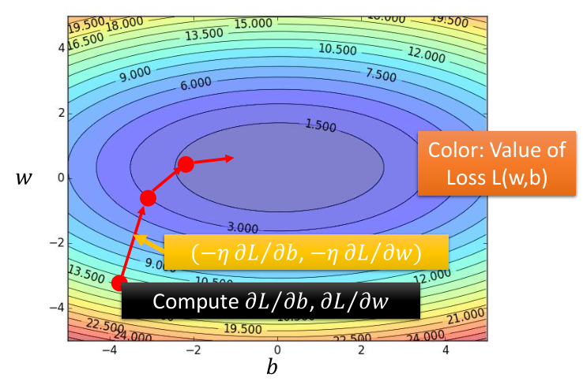

这里**两个方向的learning rate必须保持一致**，这样每次更新坐标的step size是等比例缩放的，保证坐标前进的方向始终和梯度下降的方向一致；否则坐标前进的方向将会发生偏移

##### local minima

gradient descent有一个令人担心的地方，它每次迭代完毕，寻找到的梯度为0的点必然是极小值点 local minima；却不一定是最小值点 global minima

这会造成一个问题，如果loss function长得比较坑坑洼洼（极小值点比较多），而每次初始化$w^0$的取值又是随机的，这会造成每次gradient descent停下来的位置都可能是不同的极小值点

而且当遇到梯度比较平缓（gradient≈0）的时候，gradient descent也可能会效率低下甚至可能会stuck

也就是说通过这个方法得到的结果，是看人品的

但是在linear regression里，loss function实际上是**convex**的，是一个凸函数，是没有local optimal 局部最优解的，它只有一个global minima，visualize出来的图像就是从里到外一圈一圈包围起来的椭圆形的等高线，因此随便选一个起始点，根据gradient descent最终找出来的，都会是同一组参数

#### Overfitting

随着$(x_{cp})^i$的高次项的增加，对应的average error会不断地减小

实际上这件事情非常容易解释，实际上低次的式子是高次的式子的特殊情况（令高次项$(x_{cp})^i$对应的$w_i$为0，高次式就转化成低次式）

在gradient descent可以找到best function的前提下（多次式为Non-linear model，存在local optimal，gradient descent不一定能找到global minima）function所包含的项的次数越高，越复杂，error在training data上的表现就会越来越小

但是，我们关心的不是model在training data上的error表现，而是model在testing data上的error表现，在training data上，model越复杂，error就会越低；但是在testing data上，model复杂到一定程度之后，error非但不会减小，反而会暴增。

从含有$(x_{cp})^4$项的model开始往后的model，testing data上的error出现了大幅增长的现象，通常被称为**Overfitting**

原来的loss function只考虑了prediction error，即$\sum\limits_n(\widehat{y}^n-(b+\sum w_ix_i))^2$

**regularization**则是在原来的loss function的基础上加上了一项$\lambda\sum(w_i)^2$，就是把这个model里面所有的$w_i$的平方和用λ加权

也就是说，我们期待参数$w_i$越小甚至接近于0的function。为什么呢？

因为参数值接近0的function，是比较平滑的；所谓的平滑的意思是，当今天的输入有变化的时候，output对输入的变化是比较不敏感的

举例来说，对$y=b+\sum w_ix_i$这个model，当input变化$\Delta x_i$，output的变化就是$w_i\Delta x_i$，也就是说，如果$w_i$越小越接近0的话，输出对输入就越不sensitive，我们的function就是一个越平滑的function；

我们没有把bias b这个参数考虑进去的原因是，bias的大小跟function的平滑程度是没有关系的，bias值的大小只是把function上下移动而已

如果我们有一个比较平滑的function，由于输出对输入是不敏感的，测试的时候，一些noises噪声对这个平滑的function的影响就会比较小，而给我们一个比较好的结果

这里的λ需要我们手动去调整以取得最好的值

λ值越大代表考虑smooth的那个regularization那一项的影响力越大，我们找到的function就越平滑

当我们的λ越大的时候，在training data上得到的error其实是越大的，但是这件事情是非常合理的，因为当λ越大的时候，我们就越倾向于考虑w的值而越少考虑error的大小

但是有趣的是，虽然在training data上得到的error越大，但是在testing data上得到的error可能会是比较小的；当然λ太大的时候，在testing data上的error就会越来越大

我们喜欢比较平滑的function，因为它对noise不那么sensitive；但是我们又不喜欢太平滑的function，因为它就失去了对data拟合的能力；而function的平滑程度，就需要通过调整λ来决定

### Conclusion

根据已有的data特点(labeled data，包含宝可梦及进化后的cp值)，确定使用supervised learning监督学习

根据output的特点(输出的是scalar数值)，确定使用regression回归(linear or non-linear)

#### Back to step 1: Redesign the Model Again

考虑包括进化前cp值、species、hp等各方面变量属性以及高次项的影响，我们的model可以采用：

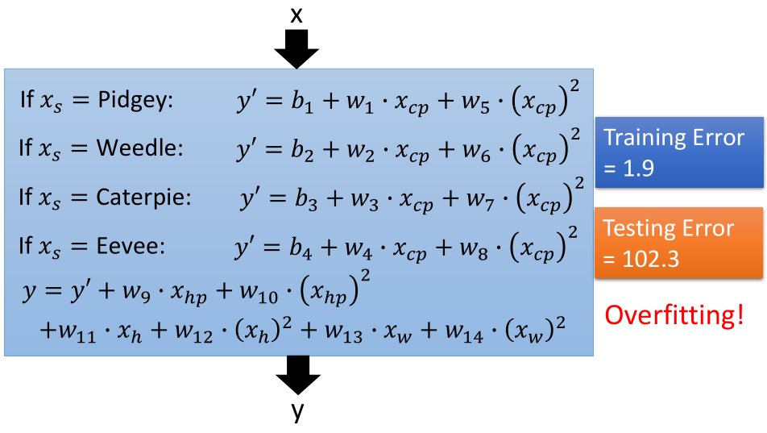

#### Back to step 2: Regularization

而为了保证function的平滑性，不overfitting，应使用regularization，即$L=\sum\limits_{i=1}^n(\widehat{y}^i-y^i)^2+\lambda\sum\limits_{j}(w_j)^2$

注意bias b对function平滑性无影响

#### Back to step 3

利用gradient descent对regularization版本的loss function进行梯度下降迭代处理，每次迭代都减去L对该参数的微分与learning rate之积，假设所有参数合成一个vector：$[w_0,w_1,w_2,...,w_j,...,b]^T$，那么每次梯度下降的表达式如下：
$$
\nabla L=
\begin{bmatrix}
\frac{\partial L}{\partial w_0} \\
\frac{\partial L}{\partial w_1} \\
\frac{\partial L}{\partial w_2} \\
... \\
\frac{\partial L}{\partial w_j} \\
... \\
\frac{\partial L}{\partial b}
\end{bmatrix}_{gradient}
\ \ \ 
\\gradient \ descent:
\begin{bmatrix}
w'_0\\
w'_1\\
w'_2\\
...\\
w'_j\\
...\\
b'
\end{bmatrix}_{L=L'}
= \ \ \ \ \ \ 
\begin{bmatrix}
w_0\\
w_1\\
w_2\\
...\\
w_j\\
...\\
b
\end{bmatrix}_{L=L_0}
-\ \ \ \ \eta
\begin{bmatrix}
\frac{\partial L}{\partial w_0} \\
\frac{\partial L}{\partial w_1} \\
\frac{\partial L}{\partial w_2} \\
... \\
\frac{\partial L}{\partial w_j} \\
... \\
\frac{\partial L}{\partial b}
\end{bmatrix}_{L=L_0}
$$
当梯度稳定不变时，即$\nabla L$为0时，gradient descent便停止，此时如果采用的model是linear的，那么vector必然落于global minima处；如果采用的model是Non-linear的，vector可能会落于local minima处，此时需要采取其他办法获取最佳的function

假定我们已经通过各种方法到达了global minima的地方，此时的vector：$[w_0,w_1,w_2,...,w_j,...,b]^T$所确定的那个唯一的function就是在该λ下的最佳$f^*$，即loss最小

这里λ的最佳数值是需要通过我们不断调整来获取的，因此令λ等于0，10，100，1000，...不断使用gradient descent或其他算法得到最佳的parameters$[w_0,w_1,w_2,...,w_j,...,b]^T$，并计算出这组参数确定的function $f^*$对training data和testing data上的error值，直到找到那个使testing data的error最小的λ

λ=0就是没有使用regularization时的loss function

## Where does the error come from?

### Estimator

$\widehat{y}$表示那个真正的function，而$f^*$表示这个$\widehat{f}$的估测值estimator

就好像在打靶，$\widehat{f}$是靶的中心点，收集到一些data做training以后，你会得到一个你觉得最好的function即$f^*$，这个$f^*$落在靶上的某个位置，它跟靶中心有一段距离，这段距离就是由bias和variance决定的

实际上对应着物理实验中系统误差和随机误差的概念，假设有n组数据，每一组数据都会产生一个相应的$f^*$，此时bias表示所有$f^*$的平均落靶位置和真值靶心的距离，variance表示这些$f^*$的集中程度

#### Bias and Variance of Estimator

假设独立变量为x(这里的x代表每次独立地从不同的training data里训练找到的$f^*$)，那么

总体期望$E(x)=u$ ；总体方差$Var(x)=\sigma^2$ 

**用样本均值$\overline{x}$估测总体期望$u$**

由于我们只有有限组样本 $\{x^1,x^2,...,x^N\}$，故样本均值$\overline{x}=\frac{1}{N}\sum\limits_{i=1}^{N}x^i \neq \mu$ ；样本均值的期望$E(\overline{x})=E(\frac{1}{N}\sum\limits_{i=1}^{N}x^i)=\mu$ ; 样本均值的方差$Var(\overline{x})=\frac{\sigma^2}{N}$

样本均值 $\overline{x}$的期望是总体期望$\mu$，也就是说$\overline{x}$是按概率对称地分布在总体期望$\mu$的两侧的；而$\overline{x}$分布的密集程度取决于N，即数据量的大小，如果N比较大，$\overline{x}$就会比较集中，如果N比较小，$\overline{x}$就会以$\mu$为中心分散开来

综上，样本均值$\overline{x}$以总体期望$\mu$为中心对称分布，可以用来估测总体期望$\mu$

**用样本方差$s^2$估测总体方差$\sigma^2$**

由于我们只有有限组样本 $\{x^1,x^2,...,x^N\}$，故样本均值$\overline{x}=\frac{1}{N}\sum\limits_{i=1}^{N}x^i$ ；样本方差$s^2=\frac{1}{N-1}\sum\limits_{i=1}^N(x^i-\overline{x})^2$ ；样本方差的期望$E(s^2)=\frac{N-1}{N}\sigma^2 \neq \sigma^2$ 

同理，样本方差$s^2$以总体方差$\sigma^2$为中心对称分布，可以用来估测总体方差$\sigma^2$，而$s^2$分布的密集程度也取决于N

现在我们要估测的是靶的中心$\widehat{f}$，每次collect data训练出来的$f^*$是打在靶上的某个点；产生的error取决于：

* 多次实验得到的$f^*$的期望$\overline{f}$与靶心$\widehat{f}$之间的bias——$E(f^*)$，可以形象地理解为瞄准的位置和靶心的距离的偏差
* 多次实验的$f^*$之间的variance——$Var(f^*)$，可以形象地理解为多次打在靶上的点的集中程度

### Error

#### Variance

$f^*$的variance是由model决定的，一个简单的model在不同的training data下可以获得比较稳定分布的$f^*$，而复杂的model在不同的training data下的分布比较杂乱（如果data足够多，那复杂的model也可以得到比较稳定的分布）

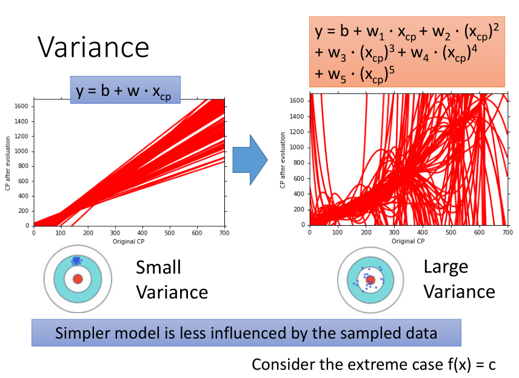

如果采用比较简单的model，那么每次在不同data下的实验所得到的不同的$f^*$之间的variance是比较小的，就好像说，你在射击的时候，每次击中的位置是差不多的，就如同下图中的linear model，100次实验找出来的$f^*$都是差不多的

但是如果model比较复杂，那么每次在不同data下的实验所得到的不同的$f^*$之间的variance是比较大的，它的散布就会比较开，就如同图中含有高次项的model，每一条$f^*$都长得不太像，并且散布得很开

那为什么比较复杂的model，它的散布就比较开呢？比较简单的model，它的散布就比较密集呢？

原因其实很简单，其实前面在讲regularization正规化的时候也提到了部分原因。简单的model实际上就是没有高次项的model，或者高次项的系数非常小的model，这样的model表现得相当平滑，受到不同的data的影响是比较小的

举一个很极端的例子，我们的整个model(function set)里面，只有一个function: f=c，这个function只有一个常数项，因此无论training data怎么变化，从这个最简单的model里找出来的$f^*$都是一样的，它的variance就是等于0

#### Bias

bias是说，我们把所有的$f^*$平均起来得到$E(f^*)=\overline{f^*}$，这个$\overline{f^*}$与真值$\widehat{f}$有多接近

当然这里会有一个问题是说，总体的真值$\widehat{f}$我们根本就没有办法知道，因此这里只是假定了一个$\widehat{f}$

当model比较简单的时候，每次实验得到的$f^*$之间的variance会比较小，这些$f^*$会稳定在一个范围内，但是它们的平均值$\overline{f}$距离真实值$\widehat{f}$会有比较大的偏差；

而当model比较复杂的时候，每次实验得到的$f^*$之间的variance会比较大，实际体现出来就是每次重新实验得到的$f^*$都会与之前得到的有较大差距，但是这些差距较大的$f^*$的平均值$\overline{f}$却和真实值$\widehat{f}$比较接近

也就是说，复杂的model，单次实验的结果是没有太大参考价值的，但是如果把考虑多次实验的结果的平均值，也许会对最终的结果有帮助

这里的单次实验指的是，用一组training data训练出model的一组有效参数以构成$f^*$(每次独立实验使用的training data都是不同的)

因此

* 如果是一个比较简单的model，那它有比较小的variance和比较大的bias。每次实验的$f^*$都比较集中，但是他们平均起来距离靶心会有一段距离（比较适合实验次数少甚至只有单次实验的情况）
* 如果是一个比较复杂的model，每次实验找出来的$f^*$都不一样，它有比较大的variance但是却有比较小的bias。每次实验的$f^*$都比较分散，但是他们平均起来的位置与靶心比较接近（比较适合多次实验的情况）

#### Why？

实际上我们的model就是一个function set，当你定好一个model的时候，实际上就已经定好这个function set的范围了，那个最好的function只能从这个function set里面挑出来

如果是一个简单的model，它的function set的space是比较小的，这个范围可能根本就没有包含你的target；如果这个function set没有包含target，那么不管怎么sample，平均起来永远不可能是target

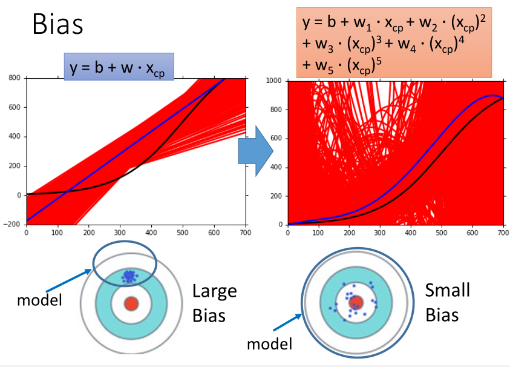

如果这个model比较复杂，那么这个model所代表的function set的space是比较大的，那它就很有可能包含target

只是它没有办法找到那个target在哪，因为你给的training data不够，你给的training data每一次都不一样，所以它每一次找出来的$f^*$都不一样，但是如果他们是散布在这个target附近的，那平均起来，实际上就可以得到和target比较接近的位置

### Bias vs Variance

由前面的讨论可知，比较简单的model，variance比较小，bias比较大；而比较复杂的model，bias比较小，variance比较大

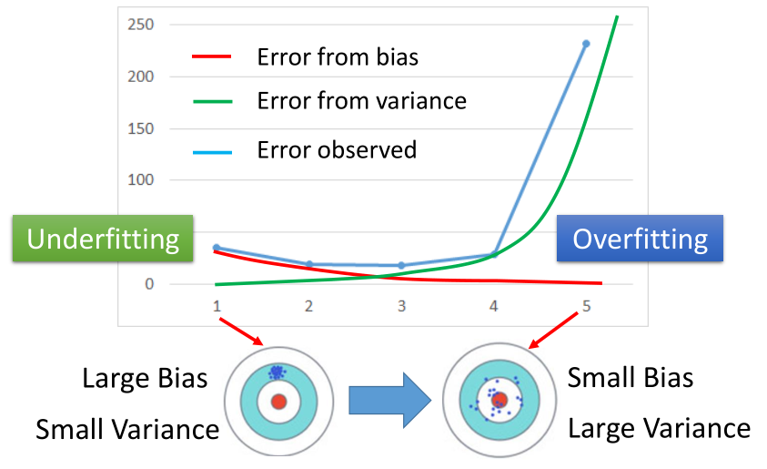

$\text{error}_{observed}=\text{error}_{variance}+\text{error}_{bias}$

可以发现，随着model的逐渐复杂：

* bias逐渐减小，bias所造成的error也逐渐下降，也就是打靶的时候瞄得越来越准
* variance逐渐变大，variance所造成的error也逐渐增大，也就是**虽然瞄得越来越准，但是每次射出去以后，你的误差是越来越大的**
* 当bias和variance这两项同时被考虑的时候，也就是实际体现出来的error的变化
* 实际观测到的error先是减小然后又增大，因此实际error为最小值的那个点，即为bias和variance的error之和最小的点，就是表现最好的model
* 如果实际error主要来自于variance很大，这个状况就是**overfitting**过拟合；如果实际error主要来自于bias很大，这个状况就是**underfitting**欠拟合。

这就是我们之前要先计算出每一个model对应的error，再挑选error最小的model的原因

只有这样才能综合考虑bias和variance的影响，找到一个实际error最小的model

#### Where does the error come from?

当你自己在做research的时候，你必须要搞清楚，手头上的这个model，它目前主要的error是来源于哪里；你觉得你现在的问题是bias大，还是variance大

你应该先知道这件事情，你才能知道你的future work，你要improve你的model的时候，你应该要走哪一个方向

* 如果model没有办法fit training data的examples，代表bias比较大，这时是underfitting

  形象地说，就是该model找到的$f^*$上面并没有training data的大部分样本点，代表说这个model跟正确的model是有一段差距的，所以这个时候是bias大的情况，是underfitting

* 如果model可以fit training data，在training data上得到小的error，但是在testing data上，却得到一个大的error，代表variance比较大，这时是overfitting

遇到bias大或variance大的时候，你其实是要用不同的方式来处理它们

#### What to do with large bias?

bias大代表，你现在这个model里面可能根本没有包含你的target，$\widehat{f}$可能根本就不在你的function set里

对于error主要来自于bias的情况，是由于该model（function set）本来就不好，collect更多的data是没有用的，必须要从model本身出发redesign，重新设计你的model

**For bias, redesign your model**

* Add more features as input

  比如pokemon的例子里，只考虑进化前cp值可能不够，还要考虑hp值、species种类...作为model新的input变量

* Add more features as input

#### What to do with large variance?

* More data
  * Very effective, but not always practical
  * 如果是5次式，找100个$f^*$，每次实验我们只用10只宝可梦的数据训练model，那我们找出来的100个$f^*$的散布就会杂乱无章；但如果每次实验我们用100只宝可梦的数据训练model，那我们找出来的100个$f^*$的分布就非常地集中
  * 增加data是一个很有效控制variance的方法，假设你variance太大的话，collect data几乎是一个万能的东西，并且它不会伤害你的bias。但是它存在一个很大的问题是，实际上并没有办法去collect更多的data
  * 如果没有办法collect更多的data，其实有一招，根据你对这个问题的理解，自己去generate更多“假的”data
    * 比如手写数字识别，因为每个人手写数字的角度都不一样，那就把所有training data里面的数字都左转15°，右转15°
    * 比如做火车的影像辨识，只有从左边开过来的火车影像资料，没有从右边开过来的火车影像资料，实际上可以把每张图片都左右颠倒，就generate出右边的火车数据了，这样就多了一倍data出来
    * 比如做语音辨识的时候，只有男生说的“你好”，没有女生说的“你好”，那就用男生的声音用一个变声器把它转化一下，这样男女生的声音就可以互相转化，这样data就多了
    * 比如现在你只有录音室里录下的声音，但是detection实际要在真实场景下使用的，那你就去真实场景下录一些噪音加到原本的声音里，就可以generate出符合条件的data
* Regularization
  * 在loss function里面再加一个与model高次项系数相关的term，它会希望你的model里高次项的参数越小越好，也就是说希望你今天找出来的曲线越平滑越好；这个新加的term前面可以有一个weight，代表你希望你的曲线有多平滑
  * 加了regularization后，一些怪怪的、很不平滑的曲线就不会再出现，所有曲线都集中在比较平滑的区域；增加weight可以让曲线变得更平滑
  * 加了regularization以后，因为你强迫所有的曲线都要比较平滑，所以这个时候也会让你的variance变小。**但regularization是可能会伤害bias的，因为它实际上调整了function set的space范围，变成它只包含那些比较平滑的曲线**，这个缩小的space可能没有包含原先在更大space内的$\widehat{f}$，因此伤害了bias，所以当你做regularization的时候，需要调整regularization的weight，在variance和bias之间取得平衡

### Model Selection

我们现在会遇到的问题往往是这样：我们有很多个model可以选择，还有很多参数可以调，比如regularization的weight，那通常我们是在bias和variance之间做一些trade-off

我们希望找一个model，它variance够小，bias也够小，这两个合起来给我们最小的testing data的error

#### Cross Validation

你要做的事情是，把你的training set分成两组：

* 一组是真正拿来training model的，叫做training set(训练集)
* 另外一组不拿它来training model，而是拿它来选model，叫做validation set(验证集)

先在training set上找出每个model最好的function $f^*$，然后用validation set来选择你的model

也就是说，你手头上有3个model，你先把这3个model用training set训练出三个$f^*$，接下来看一下它们在validation set上的performance

假设现在model 3的performance最好，那你可以直接把这个model 3的结果拿来apply在testing data上

如果你担心现在把training set分成training和validation两部分，感觉training data变少的话，可以这样做：已经从validation决定model 3是最好的model，那就定住model 3不变（function的表达式不变），然后使用全部的data去更新model 3表达式的参数

这个时候，如果你把这个训练好的model的$f^*$apply到public testing set上面，虽然这么做，你得到的error表面上看起来是比较大的，但是这个时候你在public set上的error才能够真正反映你在private set上的error

当你得到public set上的error的时候（尽管它可能会很大），不建议回过头去重新调整model的参数，因为当你再回去重新调整什么东西的时候，你就又会把public testing set的bias给考虑进去了，这就又回到围绕着有偏差的testing data做model的优化。这样的话此时你在public set上看到的performance就没有办法反映实际在private set上的performance了。因为你的model是针对public set做过优化的，虽然public set上的error数据看起来可能会更好看，但是针对实际未知的private set，这个“优化”带来的可能是反作用，反而会使实际的error变大

因此这里只是说，你要keep in mind，benchmark corpus上面所看到的testing的performance，说不定是别人特意调整过的，并且testing set与实际的数据也会有偏差，它的error，肯定是大于它在real application上应该有的值

比如说你现在常常会听到说，在image lab的那个corpus上面，error rate都降到3%，已经超越人类了。但是真的是这样子吗？如果已经用testing data调过参数了，你把那些model真的apply到现实生活中，它的error rate肯定是大于3%的。

##### N-fold Cross Validation

如果你不相信某一次分train和validation的结果的话，那你就分很多种不同的样子

比如说，如果你做3-fold的validation，把training set分成三份

你每一次拿其中一份当做validation set，另外两份当training；分别在每个情境下都计算一下3个model的error，然后计算一下它的average error；然后你会发现在这三个情境下的average error，是model 1最好

然后接下来，你就把用整个完整的training data重新训练一遍model 1的参数；然后再去testing data上test

原则上是，如果你少去根据public testing set上的error调整model的话，那你在private testing set上面得到的error往往是比较接近public testing set上的error的

## Gradient Descent

### Gradient Descent

$$
\theta^{*}=\arg \underset{\theta}{\min} L(\theta) \quad
$$

L : loss function

$\theta:$ parameters(上标表示第几组参数，下标表示这组参数中的第几个参数)

Suppose that $\theta$ has two variables $\left\{\theta_{1}, \theta_{2}\right\}$ 

Randomly start at $\theta^{0}=\left[\begin{array}{l}{\theta_{1}^{0}} \\ {\theta_{2}^{0}}\end{array}\right] \quad$ 

计算$\theta$处的梯度：$\nabla L(\theta)=\left[\begin{array}{l}{\partial L\left(\theta_{1}\right) / \partial \theta_{1}} \\ {\partial L\left(\theta_{2}\right) / \partial \theta_{2}}\end{array}\right]$

$$
\left[\begin{array}{l}{\theta_{1}^{1}} \\ {\theta_{2}^{1}}\end{array}\right]=\left[\begin{array}{l}{\theta_{1}^{0}} \\ {\theta_{2}^{0}}\end{array}\right]-\eta\left[\begin{array}{l}{\partial L\left(\theta_{1}^{0}\right) / \partial \theta_{1}} \\ {\partial L\left(\theta_{2}^{0}\right) / \partial \theta_{2}}\end{array}\right] \Rightarrow \theta^{1}=\theta^{0}-\eta \nabla L\left(\theta^{0}\right)\\\left[\begin{array}{c}{\theta_{1}^{2}} \\ {\theta_{2}^{2}}\end{array}\right]=\left[\begin{array}{c}{\theta_{1}^{1}} \\ {\theta_{2}^{1}}\end{array}\right]-\eta\left[\begin{array}{c}{\partial L\left(\theta_{1}^{1}\right) / \partial \theta_{1}} \\ {\partial L\left(\theta_{2}^{1}\right) / \partial \theta_{2}}\end{array}\right] \Rightarrow \theta^{2}=\theta^{1}-\eta \nabla L\left(\theta^{1}\right)
$$
在整个gradient descent的过程中，梯度不一定是递减的，但是沿着梯度下降的方向，函数值loss一定是递减的（如果学习率足够小），且当gradient=0时，loss下降到了局部最小值，梯度下降法指的是函数值loss随梯度下降的方向减小

初始随机在三维坐标系中选取一个点，这个三维坐标系的三个变量分别为$(\theta_1,\theta_2,loss)$，我们的目标是找到最小的那个loss也就是三维坐标系中高度最低的那个点，而gradient梯度（Loss等高线的法线方向）可以理解为高度上升最快的那个方向，它的反方向就是梯度下降最快的那个方向

于是每次update沿着梯度反方向，update的步长由梯度大小和learning rate共同决定，当某次update完成后，该点的gradient=0，说明到达了局部最小值

### Tip 1: Tuning your learning rates

* 如果learning rate刚刚好，就可以顺利地到达到loss的最小值
* 如果learning rate太小的话，虽然最后能够走到local minimal的地方，但是它可能会走得非常慢，以至于你无法接受
* 如果learning rate太大，它的步伐太大了，它永远没有办法走到特别低的地方，可能永远在这个“山谷”的口上振荡而无法走下去
* 如果learning rate非常大，可能一瞬间就飞出去了，结果会造成update参数以后，loss反而会越来越大

当参数有很多个的时候(>3)，其实我们很难做到将loss随每个参数的变化可视化出来（因为最多只能可视化出三维的图像，也就只能可视化三维参数），但是我们可以把update的次数作为唯一的一个参数，将loss随着update的增加而变化的趋势给可视化出来

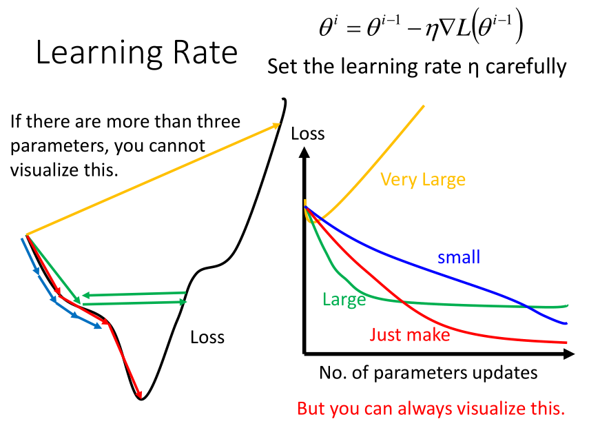

所以做gradient descent一个很重要的事情是，要**把不同的learning rate下，loss随update次数的变化曲线给可视化出**来，它可以提醒你该如何调整当前的learning rate的大小，直到出现稳定下降的曲线

#### Adaptive Learning rates

显然这样手动地去调整learning rates很麻烦，因此我们需要有一些自动调整learning rates的方法

最基本、最简单的大原则是：learning rate通常是随着参数的update越来越小的

因为在起始点的时候，通常是离最低点是比较远的，这时候步伐就要跨大一点；而经过几次update以后，会比较靠近目标，这时候就应该减小learning rate，让它能够收敛在最低点的地方

举例：假设到了第t次update，此时$\eta^t=\eta/ \sqrt{t+1}$

这种方法使所有参数以同样的方式同样的learning rate进行update，而最好的状况是每个参数都给它不同的learning rate去update

##### Adagrad

> Divide the learning rate of each parameter by the root mean square(方均根) of its previous derivatives

Adagrad就是将不同参数的learning rate分开考虑的一种算法（adagrad算法update到后面速度会越来越慢，当然这只是adaptive算法中最简单的一种）

这里的w是function中的某个参数，t表示第t次update，$g^t$表示Loss对w的偏微分，而$\sigma^t$是之前所有Loss对w偏微分的方均根(根号下的平方均值)，这个值对每一个参数来说都是不一样的
$$
\begin{equation}
\begin{split}
&Adagrad\\
&w^1=w^0-\frac{\eta^0}{\sigma^0}\cdot g^0 \ \ \ \sigma^0=\sqrt{(g^0)^2} \\
&w^2=w^1-\frac{\eta^1}{\sigma^1}\cdot g^1 \ \ \ \sigma^1=\sqrt{\frac{1}{2}[(g^0)^2+(g^1)^2]} \\
&w^3=w^2-\frac{\eta2}{\sigma^2}\cdot g^2 \ \ \ \sigma^2=\sqrt{\frac{1}{3}[(g^0)^2+(g^1)^2+(g^2)^2]} \\
&... \\
&w^{t+1}=w^t-\frac{\eta^t}{\sigma^t}\cdot g^t \ \ \ \sigma^t=\sqrt{\frac{1}{1+t}\sum\limits_{i=0}^{t}(g^i)^2}
\end{split}
\end{equation}
$$
由于$\eta^t$和$\sigma^t$中都有一个$\sqrt{\frac{1}{1+t}}$的因子，两者相消，即可得到adagrad的最终表达式：$w^{t+1}=w^t-\frac{\eta}{\sqrt{\sum\limits_{i=0}^t(g^i)^2}}\cdot g^t$

###### Contradiction

Adagrad的表达式$w^{t+1}=w^t-\frac{\eta}{\sqrt{\sum\limits_{i=0}^t(g^i)^2}}\cdot g^t$里面有一件很矛盾的事情：

我们在做gradient descent的时候，希望的是当梯度值即微分值$g^t$越大的时候（此时斜率越大，还没有接近最低点）更新的步伐要更大一些，但是Adagrad的表达式中，分母表示梯度越大步伐越小，分子却表示梯度越大步伐越大，两者似乎相互矛盾

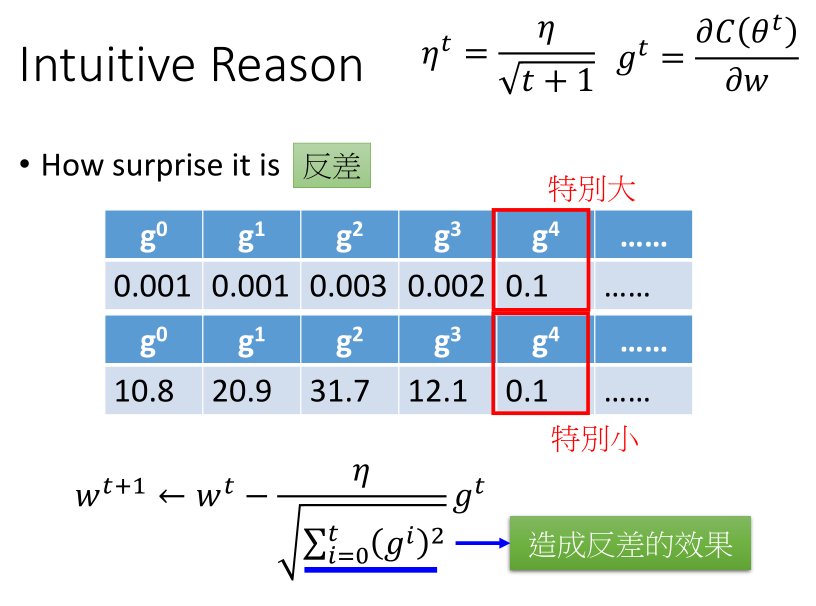

在一些paper里是这样解释的：Adagrad要考虑的是，这个gradient有多surprise，即反差有多大，假设t=4的时候$g^4$与前面的gradient反差特别大，那么$g^t$与$\sqrt{\frac{1}{t+1}\sum\limits_{i=0}^t(g^i)^2}$之间的大小反差就会比较大，它们的商就会把这一反差效果体现出来

同时，gradient越大，离最低点越远这件事情在有多个参数的情况下是不一定成立的

实际上，对于一个二次函数$y=ax^2+bx+c$来说，最小值点的$x=-\frac{b}{2a}$，而对于任意一点$x_0$，它迈出最好的步伐长度是$|x_0+\frac{b}{2a}|=|\frac{2ax_0+b}{2a}|$(这样就一步迈到最小值点了)，联系该函数的一阶和二阶导数$y'=2ax+b$、$y''=2a$，可以发现the best step is $|\frac{y'}{y''}|$，也就是说他不仅跟一阶导数(gradient)有关，还跟二阶导数有关

再来回顾Adagrad的表达式：$w^{t+1}=w^t-\frac{\eta}{\sqrt{\sum\limits_{i=0}^t(g^i)^2}}\cdot g^t$

$g^t$就是一次微分，而分母中的$\sum\limits_{i=0}^t(g^i)^2$反映了二次微分的大小，所以Adagrad想要做的事情就是，在不增加任何额外运算的前提下，想办法去估测二次微分的值

### Tip 2: Stochastic Gradient Descent

随机梯度下降的方法可以让训练更快速，传统的gradient descent的思路是看完所有的样本点之后再构建loss function，然后去update参数；而stochastic gradient descent的做法是，看到一个样本点就update一次，因此它的loss function不是所有样本点的error平方和，而是这个随机样本点的error平方

### Tip 3: Mini-batch Gradient Descent

这里有一个秘密，就是我们在做deep learning的gradient descent的时候，并不会真的去minimize total loss，那我们做的是什么呢？我们会把Training data分成一个一个的batch，比如说你的Training data一共有一万张image，每次random选100张image作为一个batch

- 像gradient descent一样，先随机initialize network的参数

- 选第一个batch出来，然后计算这个batch里面的所有element的total loss，$L'=l^1+l^{31}+...$，接下来根据$L'$去update参数，也就是计算$L'$对所有参数的偏微分，然后update参数

  注意：$L'$不是全部data的total loss

- 再选择第二个batch，现在这个batch的total loss是$L''=l^2+l^{16}+...$，接下来计算$L''$对所有参数的偏微分，然后update参数

- 反复做这个process，直到把所有的batch通通选过一次，所以假设你有100个batch的话，你就把这个参数update 100次，把所有batch看过一次，就叫做一个epoch

- 重复epoch的过程，所以你在train network的时候，你会需要好几十个epoch，而不是只有一个epoch

整个训练的过程类似于stochastic gradient descent，不是将所有数据读完才开始做gradient descent的，而是拿到一部分数据就做一次gradient descent

#### Batch size and Training Speed

**batch size太小会导致不稳定，速度上也没有优势**

前面已经提到了，stochastic gradient descent速度快，表现好，既然如此，为什么我们还要用Mini-batch呢？这就涉及到了一些实际操作上的问题，让我们必须去用Mini-batch

举例来说，我们现在有50000个examples，如果我们把batch size设置为1，就是stochastic gradient descent，那在一个epoch里面，就会update 50000次参数；如果我们把batch size设置为10，在一个epoch里面，就会update 5000次参数

看上去stochastic gradient descent的速度貌似是比较快的，它一个epoch更新参数的次数比batch size等于10的情况下要快了10倍，但是我们好像忽略了一个问题，我们之前一直都是下意识地认为不同batch size的情况下运行一个epoch的时间应该是相等的，然后我们才去比较每个epoch所能够update参数的次数，可是它们又怎么可能会是相等的呢？

实际上，当你batch size设置不一样的时候，一个epoch需要的时间是不一样的，以GTX 980为例

- case 1：如果batch size设为1，也就是stochastic gradient descent，一个epoch要花费166秒，接近3分钟

- case 2：如果batch size设为10，那一个epoch是17秒

也就是说，当stochastic gradient descent算了一个epoch的时候，batch size为10的情况已经算了近10个epoch了

所以case 1跑一个epoch，做了50000次update参数的同时，case 2跑了十个epoch，做了近5000\*10=50000次update参数；你会发现batch size设1和设10，update参数的次数几乎是一样的

如果不同batch size的情况，update参数的次数几乎是一样的，你其实会想要选batch size更大的情况，相较于batch size=1，你会更倾向于选batch size=10，因为batch size=10的时候，是会比较稳定的，因为**由更大的数据集计算的梯度能够更好的代表样本总体，从而更准确的朝向极值所在的方向**

我们之前把gradient descent换成stochastic gradient descent，是因为后者速度比较快，update次数比较多，可是现在如果你用stochastic gradient descent并没有见得有多快，那你为什么不选一个update次数差不多，又比较稳定的方法呢？

**batch size会受到GPU平行加速的限制，太大可能导致在train的时候卡住**

上面例子的现象产生的原因是我们用了GPU，用了平行运算，所以batch size=10的时候，这10个example其实是同时运算的，所以你在一个batch里算10个example的时间跟算1个example的时间几乎可以是一样的

那你可能会问，既然batch size越大，它会越稳定，而且还可以平行运算，那为什么不把batch size变得超级大呢？这里有两个claim：

- 第一个claim就是，如果你把batch size开到很大，最终GPU会没有办法进行平行运算，它终究是有自己的极限的，也就是说它同时考虑10个example和1个example的时间是一样的，但当它考虑10000个example的时候，时间就不可能还是跟1个example一样，因为batch size考虑到硬件限制，是没有办法无穷尽地增长的

- 第二个claim是说，如果把batch size设的很大，在train gradient descent的时候，可能跑两下你的network就卡住了，就陷到saddle point或者local minima里面去了

  因为在neural network的error surface上面，如果你把loss的图像可视化出来的话，它并不是一个convex的optimization problem，不会像理想中那么平滑，实际上它会有很多的坑坑洞洞

  如果你用的batch size很大，甚至是Full batch，那你走过的路径会是比较平滑连续的，可能这一条平滑的曲线在走向最低点的过程中就会在坑洞或是缓坡上卡住了；但是，如果你的batch size没有那么大，意味着你走的路线没有那么的平滑，有些步伐走的是随机性的，路径是会有一些曲折和波动的

  可能在你走的过程中，它的曲折和波动刚好使得你绕过了那些saddle point或是local minima的地方；或者当你陷入不是很深的local minima或者没有遇到特别麻烦的saddle point的时候，它步伐的随机性就可以帮你跳出这个gradient接近于0的区域，于是你更有可能真的走向global minima的地方

  而对于Full batch的情况，它的路径是没有随机性的，是稳定朝着目标下降的，因此在这个时候去train neural network其实是有问题的，可能update两三次参数就会卡住，所以mini batch是有必要的

如下图，左边是full batch(拿全部的Training data做一个batch)的梯度下降效果，可以看到每一次迭代成本函数都呈现下降趋势，这是好的现象，说明我们w和b的设定一直再减少误差， 这样一直迭代下去我们就可以找到最优解；右边是mini batch的梯度下降效果，可以看到它是上下波动的，成本函数的值有时高有时低，但总体还是呈现下降的趋势， 这个也是正常的，因为我们每一次梯度下降都是在min batch上跑的而不是在整个数据集上， 数据的差异可能会导致这样的波动(可能某段数据效果特别好，某段数据效果不好)，但没关系，因为它整体是呈下降趋势的

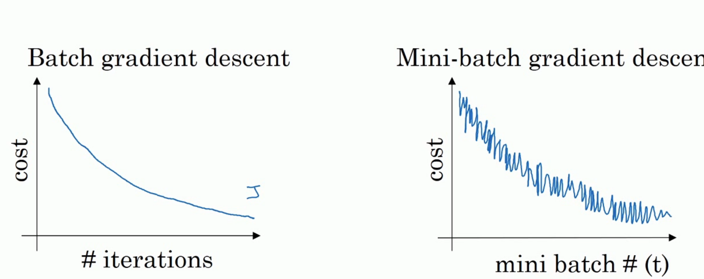

把下面的图看做是梯度下降空间：蓝色部分是full batch而紫色部分是mini batch，就像上面所说的mini batch不是每次迭代损失函数都会减少，所以看上去好像走了很多弯路，不过整体还是朝着最优解迭代的，而且由于mini batch一个epoch就走了5000步（5000次梯度下降），而full batch一个epoch只有一步，所以虽然mini batch走了弯路但还是会快很多

而且，就像之前提到的那样，mini batch在update的过程中，步伐具有随机性，因此紫色的路径可以在一定程度上绕过或跳出saddle point、local minima这些gradient趋近于0的地方；而蓝色的路径因为缺乏随机性，只能按照既定的方式朝着目标前进，很有可能就在中途被卡住，永远也跳不出来了

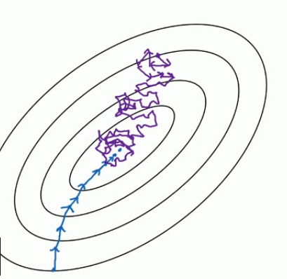

当然，如果batch size太小，会造成速度不仅没有加快反而会导致下降的曲线更加不稳定的情况产生

因此batch size既不能太大，因为它会受到硬件GPU平行加速的限制，导致update次数过于缓慢，并且由于缺少随机性而很容易在梯度下降的过程中卡在saddle point或是local minima的地方；

而且batch size也不能太小，因为它会导致速度优势不明显的情况下，梯度下降曲线过于不稳定，算法可能永远也不会收敛

##### Speed - Matrix Operation

整个network，不管是Forward pass还是Backward pass，都可以看做是一连串的矩阵运算的结果

那今天我们就可以比较batch size等于1(stochastic gradient descent)和10(mini batch)的差别

如下图所示，stochastic gradient descent就是对每一个input x进行单独运算；而mini batch，则是把同一个batch里面的input全部集合起来，假设现在我们的batch size是2，那mini batch每一次运算的input就是把黄色的vector和绿色的vector拼接起来变成一个matrix，再把这个matrix乘上$w_1$，你就可以直接得到$z^1$和$z^2$

这两件事在理论上运算量是一样多的，但是在实际操作上，对GPU来说，在矩阵里面相乘的每一个element都是可以平行运算的，所以图中stochastic gradient descent运算的时间反而会变成下面mini batch使用GPU运算速度的两倍，这就是为什么我们要使用mini batch的原因

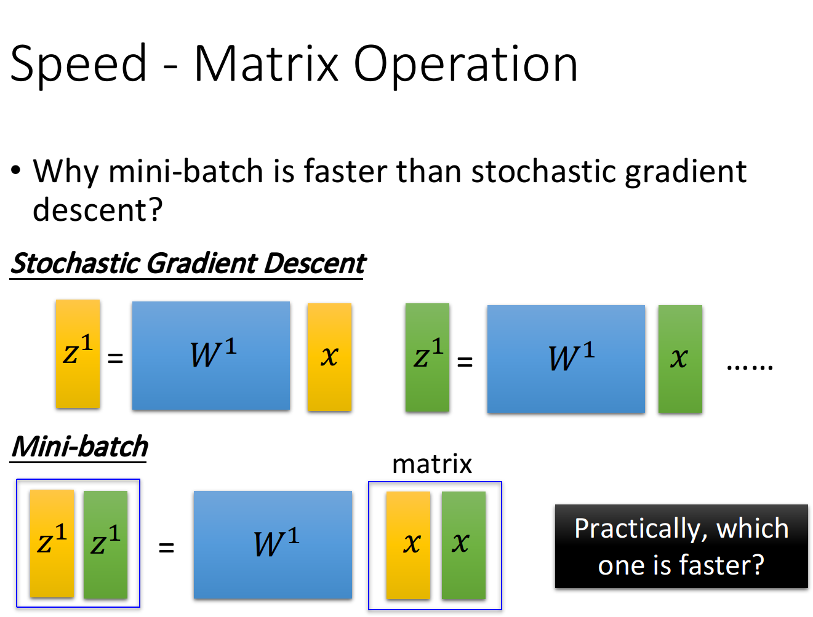

所以，如果你买了GPU，但是没有使用mini batch的话，其实就不会有多少加速的效果。

### Tip 4: Feature Scaling

特征缩放，当多个特征的分布范围很不一样时，最好将这些不同feature的范围缩放成一样

$y=b+w_1x_1+w_2x_2$，假设$x_1$的值都是很小的，比如1,2...；$x_2$的值都是很大的，比如100,200...

此时去画出loss的error surface，如果对$w_1$和$w_2$都做一个同样的变动$\Delta w$，那么$w_1$的变化对$y$的影响是比较小的，而$w_2$的变化对$y$的影响是比较大的

对于error surface表示，$w_1$对$y$的影响比较小，所以$w_1$对loss是有比较小的偏微分的，因此在$w_1$的方向上图像是比较平滑的；$w_2$对$y$的影响比较大，所以$w_2$对loss的影响比较大，因此在w_2的方向上图像是比较sharp的

如果$x_1$和$x_2$的值，它们的scale是接近的，那么$w_1$和$w_2$对loss就会有差不多的影响力，loss的图像接近于圆形，那这样做对gradient descent有什么好处呢？

对于长椭圆形的error surface，如果不使用Adagrad之类的方法，是很难搞定它的，因为在像$w_1$和$w_2$这样不同的参数方向上，会需要不同的learning rate，用相同的学习率很难达到最低点

如果有scale的话，loss在参数$w_1$、$w_2$平面上的投影就是一个正圆形，update参数会比较容易

而且gradient descent的每次update并不都是向着最低点走的，每次update的方向是顺着等高线的方向（梯度gradient下降的方向），而不是径直走向最低点；

但是当经过对input的scale使loss的投影是一个正圆的话，不管在这个区域的哪一个点，它都会向着圆心走。因此feature scaling对参数update的效率是有帮助的。

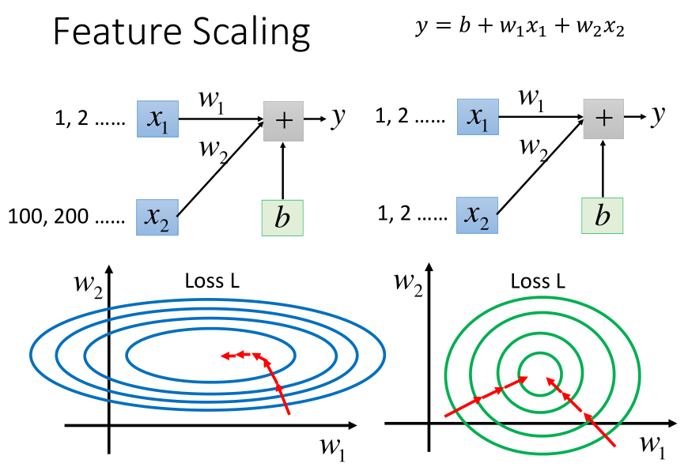

假设有R个example(上标i表示第i个样本点)，$x^1,x^2,x^3,...,x^r,...x^R$，每一笔example，它里面都有一组feature(下标j表示该样本点的第j个特征)

对每一个dimension i，都去算出它的平均值mean $m_i$，以及标准差standard deviation $\sigma_i$

对第r个example的第i个component，减掉均值，除以标准差，即$x_i^r=\frac{x_i^r-m_i}{\sigma_i}$

实际上就是将每一个参数都归一化成标准正态分布，即$f(x_i)=\frac{1}{\sqrt{2\pi}}e^{-\frac{x_i^2}{2}}$，其中$x_i$表示第i个参数

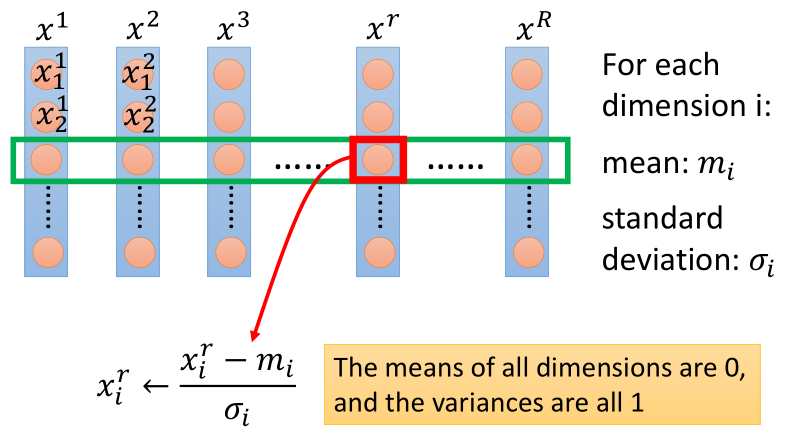

### Gradient Descent Theory

When solving: $\theta^{*}=\arg \min _{\theta} L(\theta)$ by gradient descent

Each time we update the parameters, we obtain $𝜃$ that makes $𝐿(𝜃)$ smaller. 

$L\left(\theta^{0}\right)>L\left(\theta^{1}\right)>L\left(\theta^{2}\right)>\cdots$

Is this statement correct?

不正确

#### Taylor Series

泰勒表达式：$h(x)=\sum\limits_{k=0}^\infty \frac{h^{(k)}(x_0)}{k!}(x-x_0)^k=h(x_0)+h'(x_0)(x-x_0)+\frac{h''(x_0)}{2!}(x-x_0)^2+...$

When x is close to $x_0$ :  $h(x)≈h(x_0)+h'(x_0)(x-x_0)$

同理，对于二元函数，when x and y is close to $x_0$ and $y_0$：

$h(x,y)≈h(x_0,y_0)+\frac{\partial h(x_0,y_0)}{\partial x}(x-x_0)+\frac{\partial h(x_0,y_0)}{\partial y}(y-y_0)$

#### Formal Derivation

对于loss图像上的某一个点(a,b)，如果我们想要找这个点附近loss最小的点，就可以用泰勒展开的思想

假设用一个red circle限定点的范围，这个圆足够小以满足泰勒展开的精度，那么此时我们的loss function就可以化简为：

$L(\theta)≈L(a,b)+\frac{\partial L(a,b)}{\partial \theta_1}(\theta_1-a)+\frac{\partial L(a,b)}{\partial \theta_2}(\theta_2-b)$

令$s=L(a,b)$，$u=\frac{\partial L(a,b)}{\partial \theta_1}$，$v=\frac{\partial L(a,b)}{\partial \theta_2}$

则$L(\theta)≈s+u\cdot (\theta_1-a)+v\cdot (\theta_2-b)$

假定red circle的半径为d，则有限制条件：$(\theta_1-a)^2+(\theta_2-b)^2≤d^2$

此时去求$L(\theta)_{min}$，这里有个小技巧，把$L(\theta)$转化为两个向量的乘积：$u\cdot (\theta_1-a)+v\cdot (\theta_2-b)=(u,v)\cdot (\theta_1-a,\theta_2-b)=(u,v)\cdot (\Delta \theta_1,\Delta \theta_2)$

当向量$(\theta_1-a,\theta_2-b)$与向量$(u,v)$反向，且刚好到达red circle的边缘时，$L(\theta)$最小

$(\theta_1-a,\theta_2-b)$实际上就是$(\Delta \theta_1,\Delta \theta_2)$，于是$L(\theta)$局部最小值对应的参数为中心点减去gradient的加权

用$\eta$去控制向量的长度
$$
\begin{bmatrix}
\Delta \theta_1 \\ 
\Delta \theta_2
\end{bmatrix}=
-\eta
\begin{bmatrix}
u \\
v
\end{bmatrix}\Rightarrow
\begin{bmatrix}
\theta_1 \\
\theta_2
\end{bmatrix}=
\begin{bmatrix}
a\\
b
\end{bmatrix}-\eta
\begin{bmatrix}
u\\
v
\end{bmatrix}=
\begin{bmatrix}
a\\
b
\end{bmatrix}-\eta
\begin{bmatrix}
\frac{\partial L(a,b)}{\partial \theta_1}\\
\frac{\partial L(a,b)}{\partial \theta_2}
\end{bmatrix}
$$
这就是gradient descent在数学上的推导，注意它的重要前提是，给定的那个红色圈圈的范围要足够小，这样泰勒展开给我们的近似才会更精确，而$\eta$的值是与圆的半径成正比的，因此理论上learning rate要无穷小才能够保证每次gradient descent在update参数之后的loss会越来越小，于是当learning rate没有设置好，泰勒近似不成立，就有可能使gradient descent过程中的loss没有越来越小

当然泰勒展开可以使用二阶、三阶乃至更高阶的展开，但这样会使得运算量大大增加，反而降低了运行效率

#### More Limitation of Gradient Descent

gradient descent的限制是，它在gradient即微分值接近于0的地方就会停下来，而这个地方不一定是global minima，它可能是local minima，可能是saddle point鞍点，甚至可能是一个loss很高的plateau平缓高原

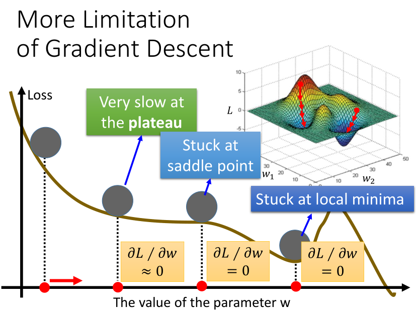

## Classification: Probabilistic Generative Model

### Classification

分类问题是找一个function，它的input是一个object，它的输出是这个object属于哪一个class

要想把一个东西当做function的input，就需要把它数值化

### How to classification

#### Classification as Regression？

- Penalize to the examples that are “too correct”
- 如果是多元分类问题，把class 1的target当做是1，class 2的target当做是2，class 3的target当做是3的做法是错误的，因为当你这样做的时候，就会被Regression认为class 1和class 2的关系是比较接近的，class 2和class 3的关系是比较接近的，而class 1和class 3的关系是比较疏远的；但是当这些class之间并没有什么特殊的关系的时候，这样的标签用Regression是没有办法得到好的结果的。

#### Ideal Alternatives

Regression的output是一个real number，但是在classification的时候，它的output是discrete(用来表示某一个class)

##### Function(Model)

我们要找的function f(x)里面会有另外一个function g(x)，当我们的input x输入后，如果g(x)>0，那f(x)的输出就是class 1，如果g(x)<0，那f(x)的输出就是class 2，这个方法保证了function的output都是离散的表示class的数值

之前不是说输出是1,2,3...是不行的吗，注意，那是针对Regression的loss function而言的，因为Regression的loss function是用output与“真值”的平方和作为评判标准的，这样输出值(3,2)与(3,1)之间显然是(3,2)关系更密切一些，为了解决这个问题，我们只需要重新定义一个loss function即可

##### Loss function

我们可以把loss function定义成$L(f)=\sum\limits_n\delta(f(x^n)≠\hat{y}^n)$，即这个model在所有的training data上predict预测错误的次数，也就是说分类错误的次数越少，这个function表现得就越好

但是这个loss function没有办法微分，无法用gradient descent的方法去解的，当然有Perceptron、SVM这些方法可以用，但这里先用另外一个solution来解决这个问题

### Generative model

假设我们考虑一个二元分类的问题，我们拿到一个input x，想要知道这个x属于class 1或class 2的概率

实际上就是一个贝叶斯公式，x属于class 1的概率就等于class 1自身发生的概率乘上在class 1里取出x这种颜色的球的概率除以在class 1和 class 2里取出x这种颜色的球的概率（后者是全概率公式）

贝叶斯公式=单条路径概率/所有路径概率和

~~~mermaid
graph LR
A(摸球) -->|从class 1里摸球的概率| B(class 1)
A -->|从class 2里摸球的概率| C(class 2)
B -->|在class 1里摸到x的概率|D(摸到x)
C -->|在class 2里摸到x的概率|D
~~~

- x属于Class 1的概率为第一条路径除以两条路径和：$P(C_1|x)=\frac{P(C_1)P(x|C_1)}{P(C_1)P(x|C_1)+P(C_2)P(x|C_2)}$
- x属于Class 2的概率为第二条路径除以两条路径和：$P(C_2|x)=\frac{P(C_2)P(x|C_2)}{P(C_1)P(x|C_1)+P(C_2)P(x|C_2)}$

因此我们想要知道x属于class 1或是class 2的概率，只需要知道4个值：$P(C_1),P(x|C_1),P(C_2),P(x|C_2)$，我们希望从Training data中估测出这四个值

这一整套想法叫做Generative model，因为如果你可以计算出每一个x出现的概率，就可以用这个distribution分布来生成x、sample x出来

#### Prior Probability

$P(C_1)$和$P(C_2)$这两个概率，被称为Prior，计算这两个值还是比较简单的

假设我们还是考虑二元分类问题，Water and Normal type with ID < 400 for training, rest for testing，如果想要严谨一点，可以在Training data里面分一部分validation出来模拟testing的情况。

在Training data里面，有79只水系宝可梦，61只一般系宝可梦，那么$P(C_1)=79/(79+61)=0.56$，$P(C_2)=61/(79+61)=0.44$

现在的问题是，怎么得到$P(x|C_1)$和$P(x|C_2)$的值

#### Probability from Class

##### Gaussian Distribution

这里$u$表示均值，$\Sigma$表示方差，那高斯函数的概率密度函数则是：

Input: vector x, output: probability of sampling x

The shape of the function determines by mean $u$ and covariance matrix $\Sigma$
$$
f_{u,\Sigma}(x)=\frac{1}{(2\pi)^{\frac{D}{2}}}\frac{1}{|\Sigma|^{\frac{1}{2}}}e^{-\frac{1}{2}(x-u)^T\Sigma^{-1}(x-u)}
$$
同样的$\Sigma$，不同的$u$，概率分布最高点的地方是不一样的；同理，如果是同样的$u$，不同的$\Sigma$，概率分布最高点的地方是一样的，但是分布的密集程度是不一样的。

那从这79个已有的点找出Gaussian，只需要去估测出这个Gaussian的均值$u$和协方差$\Sigma$即可

##### Maximum Likelihood

估测$u$和$\Sigma$的方法就是**Maximum Likelihood**，极大似然估计的思想是，找出最特殊的那对$u$和$\Sigma$，从它们共同决定的高斯函数中再次采样出79个点，使得到的分布情况与当前已知79点的分布情况相同发生的可能性最大

极大似然函数$L(u,\Sigma)=f_{u,\Sigma}(x^1)\cdot f_{u,\Sigma}(x^2)...f_{u,\Sigma}(x^{79})$，实际上就是该事件发生的概率就等于每个点都发生的概率之积，我们只需要把每一个点的data代进去，就可以得到一个关于$u$和$\Sigma$的函数，分别求偏导，解出微分是0的点，即 使L最大的那组参数，便是最终的估测值，通过微分得到的高斯函数$u$和$\Sigma$的最优解如下：
$$
u^*,\Sigma^*=\arg \max\limits_{u,\Sigma} L(u,\Sigma) \\
u^*=\frac{1}{79}\sum\limits_{n=1}^{79}x^n \ \ \ \ \Sigma^*=\frac{1}{79}\sum\limits_{n=1}^{79}(x^n-u^*)(x^n-u^*)^T
$$
当然如果你不愿意去求微分的话，这也可以当做公式来记忆($u^*$刚好是数学期望，$\Sigma^*$刚好是协方差)

数学期望：$u=E(X)$，协方差：$\Sigma=cov(X,Y)=E[(X-u)(Y-u)^T]$，对同一个变量来说，协方差为$cov(X,X)=E[(X-u)(X-u)^T$

#### Do Classification

根据$P(C_1|x)=\frac{P(C_1)P(x|C_1)}{P(C_1)P(x|C_1)+P(C_2)P(x|C_2)}$，只要带入某一个input x，就可以通过这个式子计算出它属于class 1的机率

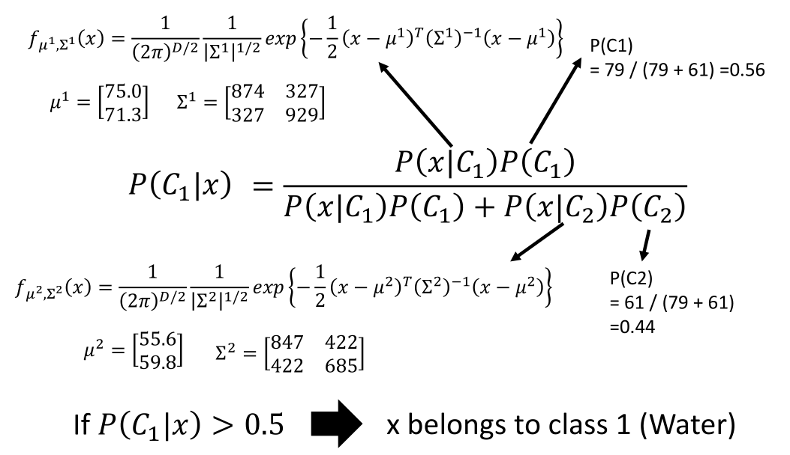

#### Modifying Model

其实之前使用的model是不常见的，你不会经常看到给每一个Gaussian都有自己的mean和covariance，比如我们的class 1用的是$u_1$和$\Sigma_1$，class 2用的是$u_2$和$\Sigma_2$

比较常见的做法是，不同的class可以share同一个covariance matrix

其实variance是跟input的feature size的平方成正比的，所以当feature的数量很大的时候，$\Sigma$大小的增长是可以非常快的，在这种情况下，给不同的Gaussian以不同的covariance matrix，会造成model的参数太多，而参数多会导致该model的variance过大，出现overfitting的现象，因此对不同的class使用同一个covariance matrix，可以有效减少参数

此时就把$u_1$、$u_2$和共同的$\Sigma$一起去合成一个极大似然函数，此时可以发现，得到的$u_1$和$u_2$和原来一样，还是各自的均值，而$\Sigma$则是原先两个$\Sigma_1$和$\Sigma_2$的加权$\Sigma = \frac{79}{140}\Sigma_1 + \frac{61}{140} \Sigma_2 $ 

看一下结果，class 1和class 2在没有共用covariance matrix之前，它们的分界线是一条曲线，正确率只有54%；如果共用covariance matrix的话，它们之间的分界线就会变成一条直线，这样的model，我们也称之为linear model（尽管Gaussian不是linear的，但是它分两个class的boundary是linear）

如果我们考虑所有的feature，并共用covariance的话，原来的54%的正确率就会变成73%。但是为什么会做到这样子，我们是很难分析的，因为这是在高维空间中发生的事情，我们很难知道boundary到底是怎么切的，但这就是machine learning它fancy的地方，人没有办法知道怎么做，但是machine可以帮我们做出来

#### Three Steps of classification

* Find a function set(model)

  prior probability $P(C)$和probability distribution $P(x|C)$就是model的参数

  当posterior Probability $P(C|x)>0.5$的话，就output class 1，反之就output class 2

* Goodness of function

  对于Gaussian distribution这个model来说，我们要评价的是决定这个高斯函数形状的均值$u$和协方差$\Sigma$这两个参数的好坏，而极大似然函数$L(u,\Sigma)$的输出值，就评价了这组参数的好坏

* Find the best function

  找到的那个最好的function，就是使$L(u,\Sigma)$值最大的那组参数，实际上就是所有样本点的均值和协方差
  $$
  u^*=\frac{1}{n}\sum\limits_{i=0}^n x^i \ \ \ \ \Sigma^*=\frac{1}{n}\sum\limits_{i=0}^n (x^i-u^*)(x^i-u^*)^T
  $$
  这里上标i表示第i个点，这里x是一个features的vector，用下标来表示这个vector中的某个feature

#### Probability distribution

##### Why Gaussian distribution

你可以选择自己喜欢的Probability distribution概率分布函数，如果你选择的是简单的分布函数（参数比较少），那你的bias就大，variance就小；如果你选择复杂的分布函数，那你的bias就小，variance就大，那你就可以用data set来判断一下，用什么样的Probability distribution作为model是比较好的

##### Naive Bayes Classifier

我们可以考虑这样一件事情，假设$x=[x_1 \ x_2 \ x_3 \ ... \ x_k \ ... \ ]$中每一个dimension $x_k$的分布都是相互独立的，它们之间的covariance都是0，那我们就可以把x产生的机率拆解成$x_1,x_2,...,x_k$产生的机率之积

这里每一个dimension的分布函数都是一维的Gaussian distribution，如果这样假设的话，等于是说，原来那多维度的Gaussian，它的covariance matrix变成是diagonal，在不是对角线的地方，值都是0，这样就可以更加减少需要的参数量，就可以得到一个更简单的model

我们把上述这种方法叫做**Naive Bayes Classifier**，如果真的明确了所有的feature之间是相互独立的，是不相关的，使用朴素贝叶斯分类法的performance是会很好的

如果这个假设是不成立的，那么Naive Bayes Classifier的bias就会很大，它就不是一个好的classifier（朴素贝叶斯分类法本质就是减少参数）

总之，寻找model总的原则是，尽量减少不必要的参数，但是必然的参数绝对不能少

那怎么去选择分布函数呢？有很多时候凭直觉就可以看出来，比如某个feature是binary的，它代表是或不是，这个时候就不太可能是高斯分布了，而很有可能是Bernoulli distributions

#### Posterior Probability

接下来我们来分析一下这个表达式，会发现一些有趣的现象

表达式上下同除以分子，令$z = ln\frac{P(C_2)P(x|C_2)}{P(C_1)P(x|C_1)}$
$$
\begin{array}{l}
P(C_1|x)=\frac{P(C_1)P(x|C_1)}{P(C_1)P(x|C_1)+P(C_2)P(x|C_2)}\\
=\frac1{1+\frac{P(C_2)P(x|C_2)}{P(C_1)P(x|C_1)}} = \frac1{1+exp(-z)} = \sigma(z)\\

\end{array}
$$
得到$\sigma(z)=\frac{1}{1+e^{-z}}$，这个function叫做sigmoid function

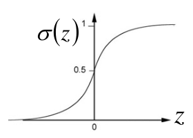

其中，Sigmoid函数是已知函数，因此我们来推导一下z的具体形式
$$
\begin{array}{l}
P\left(C_{1}\mid x \right)=\sigma(z) \text { sigmoid } \quad z=\ln \frac{P\left(x \mid C_{1}\right) P\left(C_{1}\right)}{P\left(x \mid C_{2}\right) P\left(C_{2}\right)} \\
z=\ln \frac{P\left(x \mid C_{1}\right)}{P\left(x \mid C_{2}\right)}+\ln \frac{P\left(C_{1}\right)}{P\left(C_{2}\right)} \quad\frac{P\left(C_{1}\right)}{P\left(C_{2}\right)}= \frac{\frac{N_{1}}{N_{1}+N_{2}}}{\frac{N_{2}}{N_{1}+N_{2}}}=\frac{N_{1}}{N_{2}} \\
P\left(x \mid C_{1}\right)=\frac{1}{(2 \pi)^{D / 2}} \frac{1}{\left|\Sigma^{1}\right|^{1 / 2}} \exp \left\{-\frac{1}{2}\left(x-\mu^{1}\right)^{T}\left(\Sigma^{1}\right)^{-1}\left(x-\mu^{1}\right)\right\} \\
P\left(x \mid C_{2}\right)=\frac{1}{(2 \pi)^{D / 2}} \frac{1}{\left|\Sigma^{2}\right|^{1 / 2}} \exp \left\{-\frac{1}{2}\left(x-\mu^{2}\right)^{T}\left(\Sigma^{2}\right)^{-1}\left(x-\mu^{2}\right)\right\}
\end{array}\\
$$

$$
\begin{array}{l}
\ln \frac{P\left(x \mid C_{1}\right)}{P\left(x \mid C_{2}\right)}&=
\ln \frac{\frac{1}{(2 \pi)^{D / 2}} \frac{1}{\left|\Sigma^{1}\right|^{1 / 2}} \exp \left\{-\frac{1}{2}\left(x-\mu^{1}\right)^{T}\left(\Sigma^{1}\right)^{-1}\left(x-\mu^{1}\right)\right\}}{\frac{1}{(2 \pi)^{D / 2}} \frac{1}{\left|\Sigma^{2}\right|^{1 / 2}} \exp \left\{-\frac{1}{2}\left(x-\mu^{2}\right)^{T}\left(\Sigma^{2}\right)^{-1}\left(x-\mu^{2}\right)\right\}}\\ &= 
\left. \ln \frac{\left|\Sigma^{2}\right|^{1 / 2}}{\left|\Sigma^{1}\right|^{1 / 2}} \exp \left\{-\frac{1}{2}\left[\left(x-\mu^{1}\right)^{T}\left(\Sigma^{1}\right)^{-1}\left(x-\mu^{1}\right)\right.\right.\right.
\left.\left.-\left(x-\mu^{2}\right)^{T}\left(\Sigma^{2}\right)^{-1}\left(x-\mu^{2}\right)\right]\right\}\\
&=\ln \frac{\left|\Sigma^{2}\right|^{1 / 2}}{\left|\Sigma^{1}\right|^{1 / 2}}-\frac{1}{2}\left[\left(x-\mu^{1}\right)^{T}\left(\Sigma^{1}\right)^{-1}\left(x-\mu^{1}\right)-\left(x-\mu^{2}\right)^{T}\left(\Sigma^{2}\right)^{-1}\left(x-\mu^{2}\right)\right] 
\end{array}\\

\begin{array}{l}
\left(x-\mu^{1}\right)^{T}\left(\Sigma^{1}\right)^{-1}\left(x-\mu^{1}\right) \\
=x^{T}\left(\Sigma^{1}\right)^{-1} x-x^{T}\left(\Sigma^{1}\right)^{-1} \mu^{1}-\left(\mu^{1}\right)^{T}\left(\Sigma^{1}\right)^{-1} x+\left(\mu^{1}\right)^{T}\left(\Sigma^{1}\right)^{-1} \mu^{1} \\
=x^{T}\left(\Sigma^{1}\right)^{-1} x-2\left(\mu^{1}\right)^{T}\left(\Sigma^{1}\right)^{-1} x+\left(\mu^{1}\right)^{T}\left(\Sigma^{1}\right)^{-1} \mu^{1} \\
\left(x-\mu^{2}\right)^{T}\left(\Sigma^{2}\right)^{-1}\left(x-\mu^{2}\right) \\
=x^{T}\left(\Sigma^{2}\right)^{-1} x-2\left(\mu^{2}\right)^{T}\left(\Sigma^{2}\right)^{-1} x+\left(\mu^{2}\right)^{T}\left(\Sigma^{2}\right)^{-1} \mu^{2} \\
\end{array}
$$

$$
\\\begin{align}
 z= \ln \frac{\left|\Sigma^{2}\right|^{1 / 2}}{\left|\Sigma^{1}\right|^{1 / 2}}-\frac{1}{2} x^{T}\left(\Sigma^{1}\right)^{-1} x+\left(\mu^{1}\right)^{T}\left(\Sigma^{1}\right)^{-1} x-\frac{1}{2}\left(\mu^{1}\right)^{T}\left(\Sigma^{1}\right)^{-1} \mu^{1} \\
+\frac{1}{2} x^{T}\left(\Sigma^{2}\right)^{-1} x-\left(\mu^{2}\right)^{T}\left(\Sigma^{2}\right)^{-1} x+\frac{1}{2}\left(\mu^{2}\right)^{T}\left(\Sigma^{2}\right)^{-1} \mu^{2}+\ln \frac{N_{1}}{N_{2}}
\end{align}
$$

当$\Sigma_1$和$\Sigma_2$共用一个$\Sigma$时，经过化简相消z就变成了一个linear的function，x的系数是一个vector w，后面的一大串数字其实就是一个常数项b

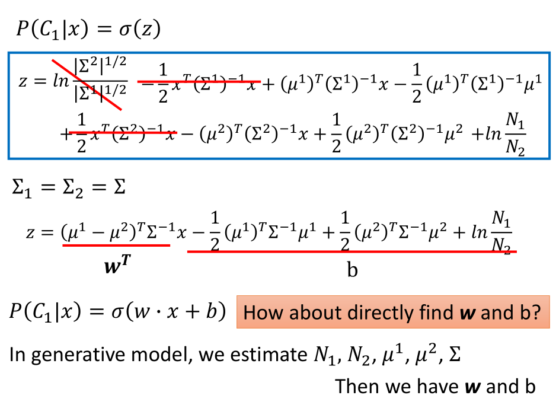

$P(C_1|x)=\sigma (w\cdot x+b)$这个式子就解释了，当class 1和class 2共用$\Sigma$的时候，它们之间的boundary会是linear的

在Generative model里面，我们做的事情是，我们用某些方法去找出$N_1,N_2,u_1,u_2,\Sigma$，找出这些后算出w和b，把它们代进$P(C_1|x)=\sigma(w\cdot x+b)$，就可以算概率，但是，当你看到这个式子的时候，你可能会有一个直觉的想法，为什么要这么麻烦呢？我们的最终目标都是要找一个vector w和constant b，我们何必先去搞个概率，算出一些$u,\Sigma$什么的，然后再回过头来又去算w和b，这不是舍近求远吗？

所以我们能不能直接把w和b找出来呢？

## Logistic Regression

### Step 1: Function Set

在Classification这一章节，我们讨论了如何通过样本点的均值$u$和协方差$\Sigma$来计算$P(C_1),P(C_2),P(x|C_1),P(x|C_2)$，进而利用$P(C_1|x)=\frac{P(C_1)P(x|C_1)}{P(C_1)P(x|C_1)+P(C_2)P(x|C_2)}$计算得到新的样本点x属于class 1的概率，由于是二元分类，属于class 2的概率$P(C_2|x)=1-P(C_1|x)$。

可知$P(C_1|x)=\sigma(z)=\frac{1}{1+e^{-z}}$，$z = ln\frac{P(C_2)P(x|C_2)}{P(C_1)P(x|C_1)}$。

之后我们推导了在Gaussian distribution下考虑class 1和class 2共用$\Sigma$，可以得到一个线性的z（很多其他的Probability model经过化简以后也都可以得到同样的结果）
$$
P_{w,b}(C_1|x)=\sigma(z)=\frac{1}{1+e^{-z}} \\
z=w\cdot x+b=\sum\limits_i w_ix_i+b 
$$
这里的w和x都是vector，两者的乘积是inner product，从上式中我们可以看出，现在这个model（function set）是受w和b控制的，因此我们不必要再去像前面一样计算一大堆东西，而是用这个全新的由w和b决定的model——Logistic Regression

因此Function Set为：$ f_{w,b}( x)=P_{w,b}(C_1|x)=\sigma(\sum\limits_i w_ix_i+b)$ 

$w_i$：weight，$b$：bias，$\sigma(z)$：sigmoid function，$x_i$：input

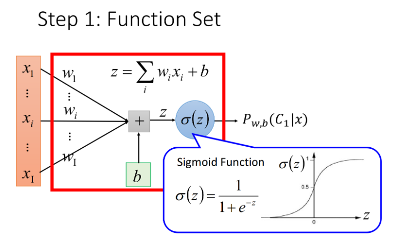

### Step 2: Goodness of a Function

现在我们有N笔Training data，每一笔data都要标注它是属于哪一个class

假设这些Training data是从我们定义的posterior Probability中产生的，而w和b就决定了这个posterior Probability，那我们就可以去计算某一组w和b去产生这N笔Training data的概率，利用极大似然估计的思想，最好的那组参数就是有最大可能性产生当前N笔Training data分布的$w^*$和$b^*$

似然函数只需要将每一个点产生的概率相乘即可，注意，这里假定是二元分类，class 2的概率为1减去class 1的概率
$$
L(w, b)=f_{w, b}\left(x^{1}\right) f_{w, b}\left(x^{2}\right)\left(1-f_{w, b}\left(x^{3}\right)\right) \cdots f_{w, b}\left(x^{N}\right)
$$
由于$L(w,b)$是乘积项的形式，为了方便计算，我们将上式做个变换：
$$
\begin{split}
&w^*,b^*=\arg \max\limits_{w,b} L(w,b)=\arg\min\limits_{w,b}(-\ln L(w,b)) \\
&\begin{equation}
\begin{split}
-\ln L(w,b)=&-\ln f_{w,b}(x^1)\\
&-\ln f_{w,b}(x^2)\\
&-\ln(1-f_{w,b}(x^3))\\
&\ -...
\end{split}
\end{equation}
\end{split}
$$
为了统一格式，这里将Logistic Regression里的所有Training data都打上0和1的标签，即output  $\hat{y}=1$代表class 1，output  $\hat{y}=0$代表class 2，于是上式进一步改写成：
$$
\begin{split}
-\ln L(w,b)=&-[\hat{y}^1 \ln f_{w,b}(x^1)+(1-\hat{y}^1)ln(1-f_{w,b}(x^1))]\\
&-[\hat{y}^2 \ln f_{w,b}(x^2)+(1-\hat{y}^2)ln(1-f_{w,b}(x^2))]\\
&-[\hat{y}^3 \ln f_{w,b}(x^3)+(1-\hat{y}^3)ln(1-f_{w,b}(x^3))]\\
&\ -...
\end{split}
$$

现在已经有了统一的格式，我们就可以把要minimize的对象写成一个summation的形式：
$$
-\ln L(w,b)=\sum\limits_n -[\hat{y}^n \ln f_{w,b}(x^n)+(1-\hat{y}^n) \ln(1-f_{w,b}(x^n))]
$$
这里$x^n$表示第n个样本点，$\hat{y}^n$表示第n个样本点的class标签（1表示class 1,0表示class 2），最终这个summation的形式，里面其实是<u>两个Bernoulli distribution的cross entropy</u>
$$
\begin{aligned}
&\mathrm{p}(x=1)=\hat{y}^{n}&\mathrm{q}(x=1)=f\left(x^{n}\right)\\
&\mathrm{p}(x=0)=1-\hat{y}^{n}&\mathrm{q}(x=0)=1-f\left(x^{n}\right)\\
 \end{aligned}
$$
假设有如上两个distribution p和q，它们的交叉熵就是$H(p,q)=-\sum\limits_{x} p(x) \ln (q(x))$

**cross entropy**的含义是表达这两个distribution有多接近，如果p和q这两个distribution一模一样的话，那它们算出来的cross entropy就是0，而这里$f(x^n)$表示function的output，$\hat{y}^n$表示预期的target，因此交叉熵实际上表达的是希望这个function的output和它的target越接近越好

总之，我们要找的参数实际上就是：
$$
w^*,b^*=\arg \max\limits_{w,b} L(w,b)=\arg\min\limits_{w,b}(-\ln L(w,b)=\sum\limits_n -[\hat{y}^n \ln f_{w,b}(x^n)+(1-\hat{y}^n) \ln(1-f_{w,b}(x^n))]
$$

### Step 3: Find the best function

实际上就是去找到使loss function即交叉熵之和最小的那组参数$w^*,b^*$就行了，这里用gradient descent的方法进行运算就可以

**sigmoid function的微分**：$\frac{\partial \sigma(z)}{\partial z}=\sigma(z)(1-\sigma(z))$

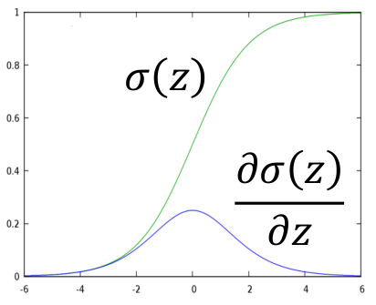

先计算$-\ln L(w,b)=\sum\limits_n -[\hat{y}^n \ln f_{w,b}(x^n)+(1-\hat{y}^n) \ln(1-f_{w,b}(x^n))]$对$w_i$的偏微分，这里$\hat{y}^n$和$1-\hat{y}^n$是常数先不用管它，只需要分别求出$\ln f_{w,b}(x^n)$和$\ln (1-f_{w,b}(x^n))$对$w_i$的偏微分即可，整体推导过程如下：

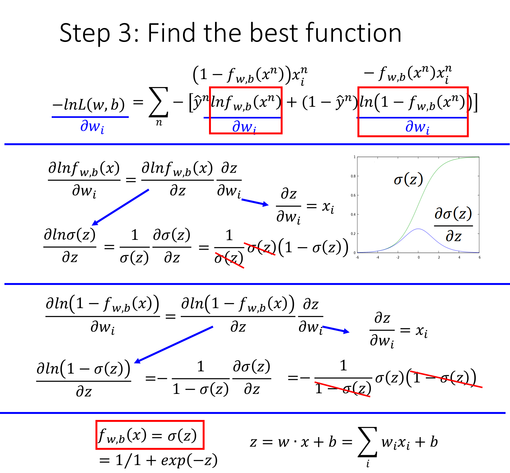

将得到的式子进行进一步化简，可得：

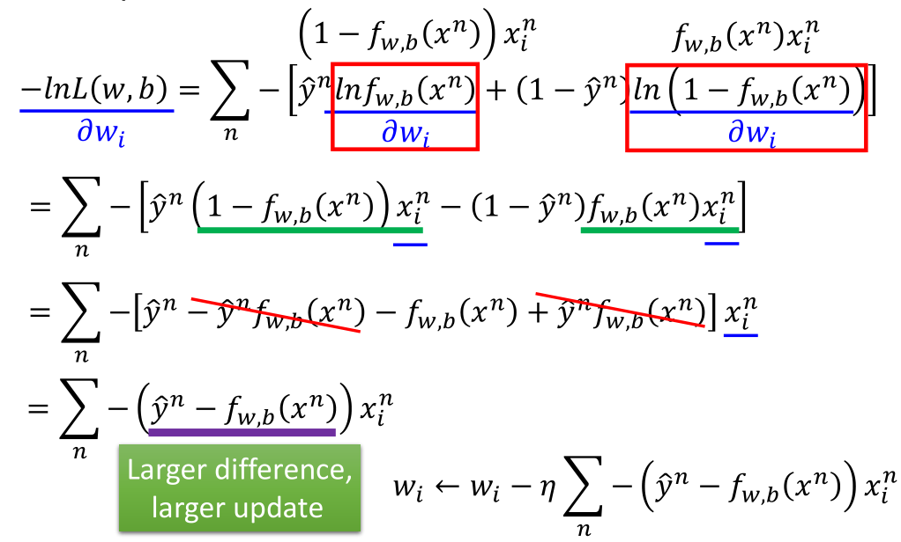

我们发现最终的结果竟然异常的简洁，gradient descent每次update只需要做：
$$
w_i=w_i-\eta \sum\limits_{n}-(\hat{y}^n-f_{w,b}(x^n))x_i^n \\
b=b-\eta \sum\limits_{n}-(\hat{y}^n-f_{w,b}(x^n))
$$
那这个式子到底代表着什么意思呢？现在你的update取决于三件事：

* learning rate，是你自己设定的
* $x_i$，来自于data
* $\hat{y}^n-f_{w,b}(x^n)$，代表function的output跟理想target的差距有多大，如果离目标越远，update的步伐就要越大

### Logistic Regression v.s. Linear Regression

我们可以把逻辑回归和之前将的线性回归做一个比较

#### Compare In Step 1

Logistic Regression是把每一个feature $x_i$加权求和，加上bias，再通过sigmoid function，当做function的output

因为Logistic Regression的output是通过sigmoid function产生的，因此一定是介于0~1之间；而Linear Regression的output并没有通过sigmoid function，所以它可以是任何值

#### Compare In Step 2

在Logistic Regression中，我们定义的loss function，即要去minimize的对象，是所有example的output( $f(x^n)$ )和实际target( $\hat{y}^n$ )在Bernoulli distribution下的cross entropy总和

而在Linear Regression中，loss function的定义相对比较简单，就是单纯的function的output( $f(x^n)$ )和实际target( $\hat{y}^n$ )在数值上的平方和的均值

这里可能会有一个疑惑，为什么Logistic Regression的loss function不能像linear Regression一样用square error来表示呢？后面会有进一步的解释

#### Compare In Step 3

神奇的是，Logistic Regression和Linear Regression的$w_i$update的方式是一模一样的

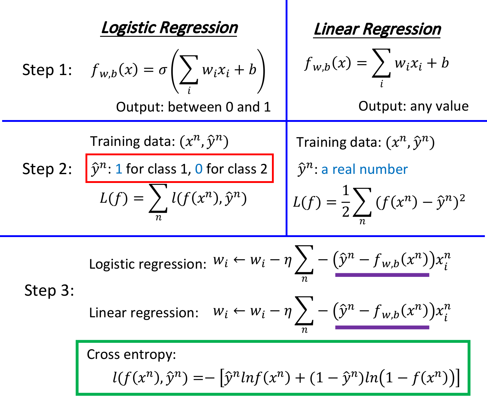

### Logistic Regression + Square Error？

之前提到了，为什么Logistic Regression的loss function不能用square error来描述呢？

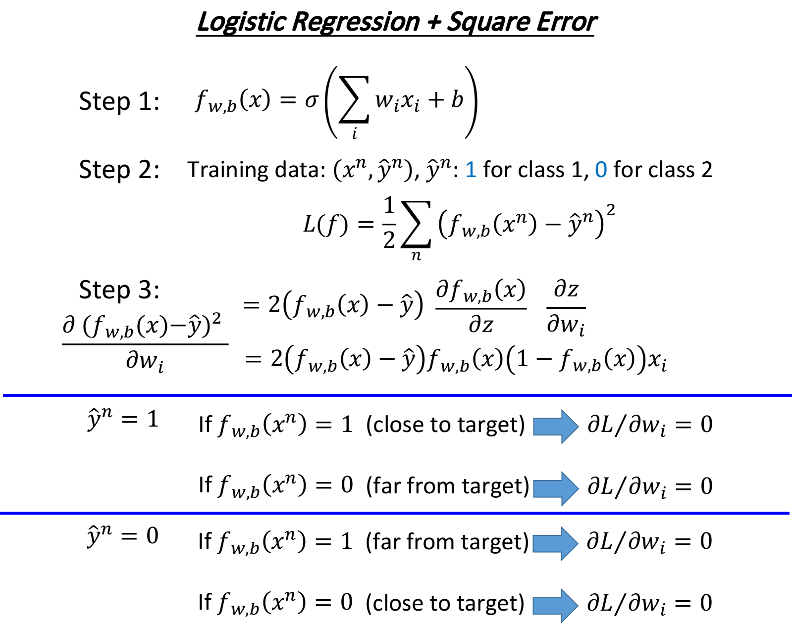

现在会遇到一个问题：

如果第n个点的目标target是class 1，$\hat{y}^n=1$，此时如果function的output $f_{w,b}(x^n)=1$的话，得到的微分$\frac{\partial L}{\partial w_i}$为0；但是当function的output $f_{w,b}(x^n)=0$的时候，微分$\frac{\partial L}{\partial w_i}$也是0

如果举class 2的例子，得到的结果与class 1是一样的

#### Cross Entropy v.s. Square Error

如果我们把参数的变化对total loss作图的话，loss function选择cross entropy或square error，参数的变化跟loss的变化情况可视化出来如下所示：

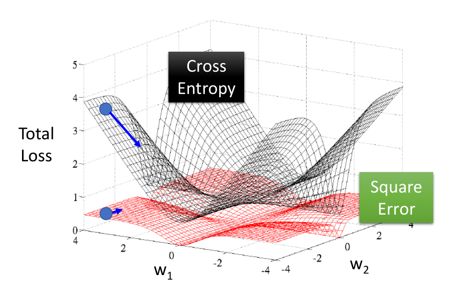

假设中心点就是距离目标很近的地方，如果是cross entropy的话，距离目标越远，微分值就越大，参数update的时候变化量就越大，迈出去的步伐也就越大

但当你选择square error的时候，过程就会很卡，因为距离目标远的时候，微分也是非常小的，移动的速度是非常慢的，我们之前提到过，实际操作的时候，当gradient接近于0的时候，其实就很有可能会停下来，因此使用square error很有可能在一开始的时候就卡住不动了，而且这里也不能随意地增大learning rate，因为在做gradient descent的时候，你的gradient接近于0，有可能离target很近也有可能很远，因此不知道learning rate应该设大还是设小

综上，尽管square error可以使用，但是会出现update十分缓慢的现象，而使用cross entropy可以让你的Training更顺利

### Discriminative v.s. Generative

Logistic Regression的方法，我们把它称之为discriminative的方法

而我们用Gaussian来描述posterior Probability这件事，我们称之为Generative的方法

实际上它们用的model(function set)是一模一样的，都是$P(C_1|x)=\sigma(w\cdot x+b)$，如果是用Logistic Regression的话，可以用gradient descent的方法直接去把b和w找出来；如果是用Generative model的话，我们要先去算$u_1,u_2,\Sigma^{-1}$，然后算出b和w

你会发现用这两种方法得到的b和w是不同的，尽管我们的function set是同一个，但是由于做了不同的假设，最终从同样的Training data里找出来的参数会是不一样的

这是因为在Logistic Regression里面，我们没有做任何实质性的假设，没有对Probability distribution有任何的描述，我们就是单纯地去找b和w

而在Generative model里面，我们对Probability distribution是有实质性的假设的，之前我们假设的是Gaussian，甚至假设在相互独立的前提下是否可以是Naive Bayes，根据这些假设我们才找到最终的b和w

哪一个假设的结果是比较好的呢？实际上Discriminative的方法常常会比Generative的方法表现得更好，这里举一个简单的例子来解释一下

#### Example

假设总共有两个class，有这样的Training data：每一笔data有两个feature，总共有1+4+4+4=13笔data

如果我们的testing data的两个feature都是1，凭直觉来说会认为它肯定是class 1，但是如果用Naive Bayes的方法(朴素贝叶斯假设所有的feature相互独立，方便计算)，得到的结果又是怎样的呢？

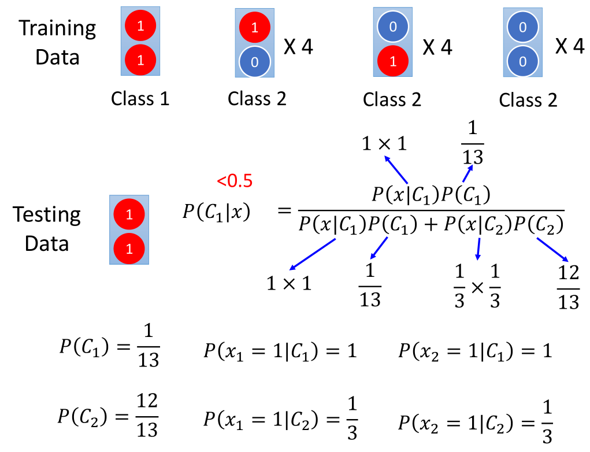

通过Naive Bayes得到的结果竟然是这个测试点属于class 2的可能性更大，这跟我们的直觉比起来是相反的

实际上我们直觉认为两个feature都是1的测试点属于class 1的可能性更大是因为我们潜意识里认为这两个feature之间是存在某种联系的

但是对Naive Bayes来说，它是不考虑不同dimension之间的correlation，Naive Bayes认为在dimension相互独立的前提下，class 2没有sample出都是1的data，是因为sample的数量不够多，如果sample够多，它认为class 2观察到都是1的data的可能性会比class 1要大

Naive Bayes认为从class 2中找到样本点x的概率是x中第一个feature出现的概率与第二个feature出现的概率之积：$P(x|C_2)=P(x_1=1|C_2)\cdot P(x_2=1|C_2)$

但是我们的直觉告诉自己，两个feature之间肯定是有某种联系的，$P(x|C_2)$不能够那么轻易地被拆分成两个独立的概率乘积，也就是说Naive Bayes自作聪明地多假设了一些条件

所以，Generative model和discriminative model的差别就在于，Generative的model它有做了某些假设，假设你的data来自于某个概率模型；而Discriminative的model是完全不作任何假设的

通常脑补不是一件好的事情，因为你给你的data强加了一些它并没有告诉你的属性，但是在data很少的情况下，脑补也是有用的，discriminative model并不是在所有的情况下都可以赢过Generative model，discriminative model是十分依赖于data的，当data数量不足或是data本身的label就有一些问题，那Generative model做一些脑补和假设，反而可以把data的不足或是有问题部分的影响给降到最低

在Generative model中，priors probabilities和class-dependent probabilities是可以拆开来考虑的，以语音辨识为例，现在用的都是neural network，是一个discriminative的方法，但事实上整个语音辨识的系统是一个Generative的system，DNN只是其中的一块

它需要算一个prior probability是某一句话被说出来的机率，而想要estimate某一句话被说出来的机率并不需要有声音的data，去互联网上爬取大量文字就可以计算出某一段文字出现的机率，这个就是language model，prior的部分只用文字data来处理，而class-dependent的部分才需要声音和文字的配合，这样的处理可以把prior estimate更精确

Generative model的好处是，它对data的依赖并没有像discriminative model那么严重，在data数量少或者data本身就存在noise的情况下受到的影响会更小，而它还可以做到Prior部分与class-dependent部分分开处理，如果可以借助其他方式提高Prior model的准确率，对整一个model是有所帮助的

而Discriminative model的好处是，在data充足的情况下，它训练出来的model的准确率一般是比Generative model要来的高的

#### Benefit of generative model

- With the assumption of probability distribution, less training data is needed
- With the assumption of probability distribution, more robust to the noise
- Priors and class-dependent probabilities can be estimated from different sources.

### Multi-class Classification

#### Softmax

之前讲的都是二元分类的情况，这里讨论一下多元分类问题，其原理的推导过程与二元分类基本一致

假设有三个class：$C_1,C_2,C_3$，每一个class都有自己的weight和bias，这里$w_1,w_2,w_3$分别代表三个vector，$b_1,b_2,b_3$分别代表三个const，input x也是一个vector

**softmax**的意思是对最大值做强化，因为在做第一步的时候，对$z$取exponential会使大的值和小的值之间的差距被拉得更开，也就是强化大的值

我们把$z_1,z_2,z_3$丢进一个softmax的function，softmax做的事情是这样三步：

* 取exponential，得到$e^{z_1},e^{z_2},e^{z_3}$
* 把三个exponential累计求和，得到total sum=$\sum\limits_{j=1}^3 e^{z_j}$
* 将total sum分别除去这三项(归一化)，得到$y_1=\frac{e^{z_1}}{\sum\limits_{j=1}^3 e^{z_j}}$、$y_2=\frac{e^{z_2}}{\sum\limits_{j=1}^3 e^{z_j}}$、$y_3=\frac{e^{z_3}}{\sum\limits_{j=1}^3 e^{z_j}}$

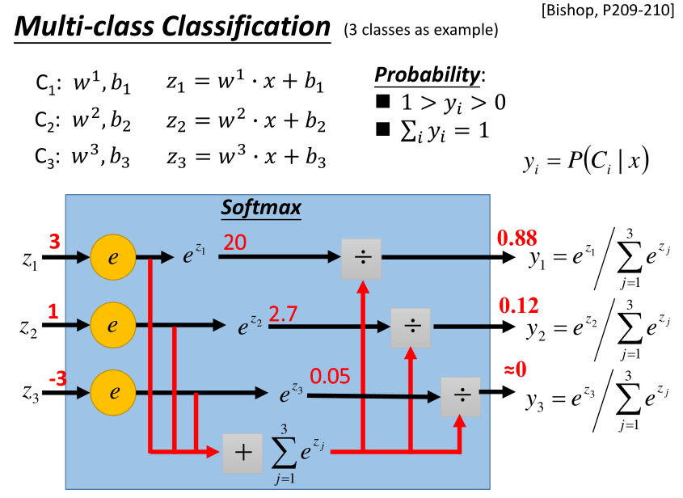

原来的output z可以是任何值，但是做完softmax之后，你的output $y_i$的值一定是介于0~1之间，并且它们的和一定是1，$\sum\limits_i y_i=1$，以上图为例，$y_i$表示input x属于第i个class的概率，比如属于Class 1的概率是$y_1=0.88$，属于Class 2的概率是$y_2=0.12$，属于Class 3的概率是$y_3=0$

而softmax的output，就是拿来当z的posterior probability

假设我们用的是Gaussian distribution（共用covariance），经过一般推导以后可以得到softmax的function

同样从information theory也可以推导出softmax function，Maximum entropy本质内容和Logistic Regression是一样的，它是从另一个观点来切入为什么我们的classifier长这样子

#### Multi-class Classification

如下图所示，input x经过三个式子分别生成$z_1,z_2,z_3$，经过softmax转化成output $y_1,y_2,y_3$分别是这三个class的posterior probability，由于summation=1，因此做完softmax之后就可以把y的分布当做是一个probability contribution

我们在训练的时候还需要有一个target，因为是三个class，output是三维的，对应的target也是三维的，为了满足交叉熵的条件，target $\hat{y}$也必须是probability distribution，这里我们不能使用1,2,3作为class的区分，为了保证所有class之间的关系是一样的，这里使用类似于one-hot编码的方式，即
$$
\hat{y}=
\begin{bmatrix}
1\\
0\\
0
\end{bmatrix}_{x \ ∈ \ class 1}
\hat{y}=
\begin{bmatrix}
0\\
1\\
0
\end{bmatrix}_{x \ ∈ \ class 2}
\hat{y}=
\begin{bmatrix}
0\\
0\\
1
\end{bmatrix}_{x \ ∈ \ class 3}
$$

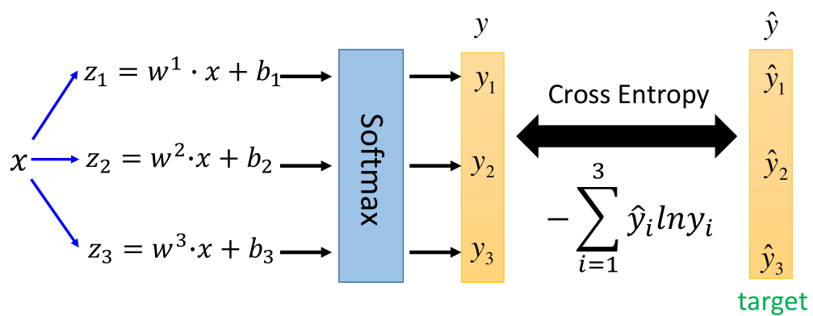

这个时候就可以计算output $y$和 target $\hat{y}$之间的交叉熵，即$-\sum\limits_{i=1}^3 \hat{y}_i \ln y_i$，同二元分类一样，多元分类问题也是通过极大似然估计法得到最终的交叉熵表达式的，这里不再赘述

### Limitation of Logistic Regression

Logistic Regression其实有很强的限制，给出下图的例子中的Training data，想要用Logistic Regression对它进行分类，其实是做不到的

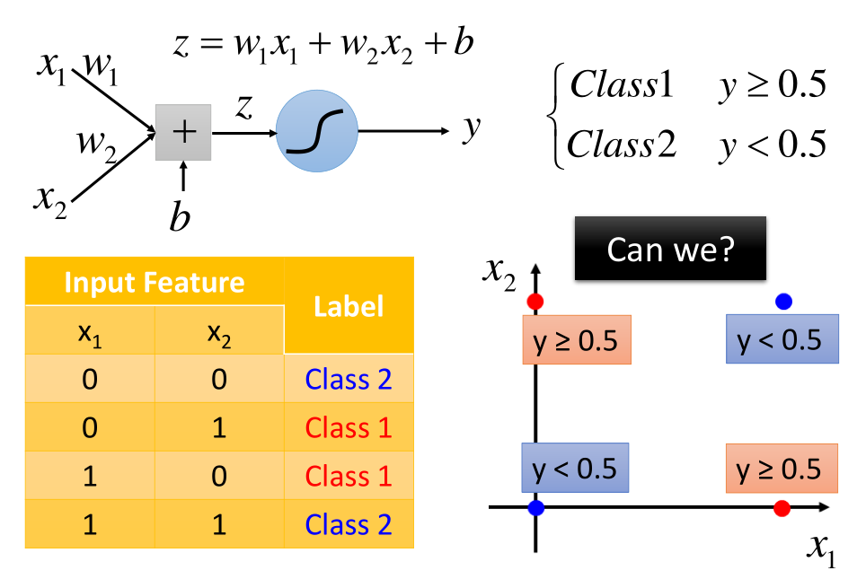

因为Logistic Regression在两个class之间的boundary就是一条直线，但是在这个平面上无论怎么画直线都不可能把图中的两个class分隔开来

#### Feature Transformation

如果坚持要用Logistic Regression的话，有一招叫做Feature Transformation，原来的feature分布不好划分，那我们可以将之转化以后，找一个比较好的feature space，让Logistic Regression能够处理

假设这里定义$x_1'$是原来的点到$\begin{bmatrix}0\\0 \end{bmatrix}$之间的距离，$x_2'$是原来的点到$\begin{bmatrix}1\\ 1 \end{bmatrix}$之间的距离，重新映射之后如下图右侧(红色两个点重合)，此时Logistic Regression就可以把它们划分开来

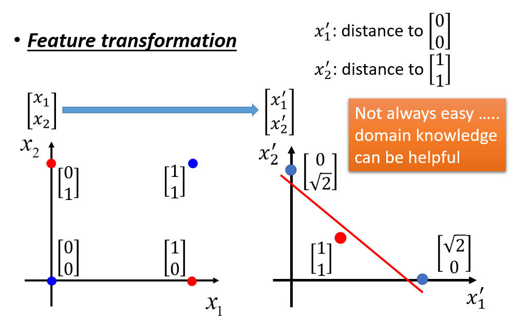

但麻烦的是，我们并不知道怎么做feature Transformation，如果在这上面花费太多的时间就得不偿失了，于是我们会希望这个Transformation是机器自己产生的，怎么让机器自己产生呢？我们可以让很多Logistic Regression cascade(连接)起来

我们让一个input x的两个feature $x_1,x_2$经过两个Logistic Regression的transform，得到新的feature $x_1',x_2'$，在这个新的feature space上，class 1和class 2是可以用一条直线分开的，那么最后只要再接另外一个Logistic Regression的model（对它来说，$x_1',x_2'$才是每一个样本点的feature，而不是原先的$x_1,x_2$），它根据新的feature，就可以把class 1和class 2分开

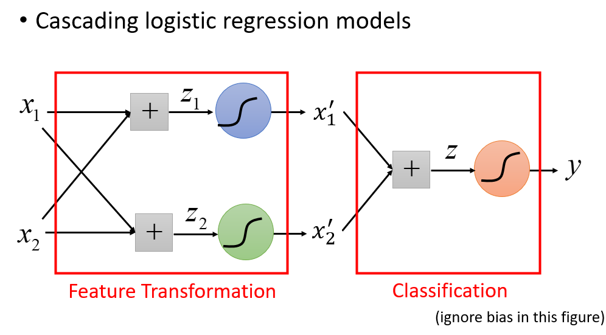

因此整个流程是，先用n个Logistic Regression做Feature Transformation（n为每个样本点的feature数量），生成n个新的feature，然后再用一个Logistic Regression作classifier

Logistic Regression的boundary一定是一条直线，具体的分布是由Logistic Regression的参数决定的，直线是由$b+\sum\limits_i^nw_ix_i=0$决定的（二维feature的直线画在二维平面上，多维feature的直线则是画在多维空间上）

下图是二维feature的例子，分别表示四个点经过transform之后的$x_1'$和$x_2'$，在新的feature space中可以通过最后的Logistic Regression划分开来

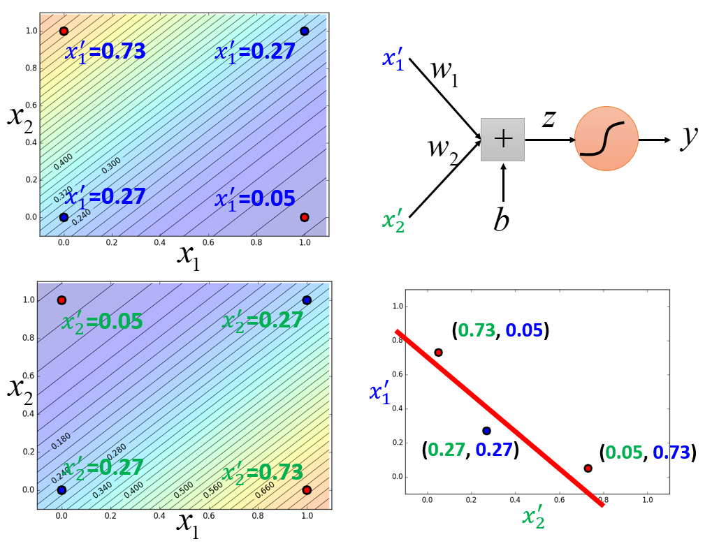

注意，这里的Logistic Regression只是一条直线，它指的是属于这个类或不属于这个类这两种情况，因此最后的这个Logistic Regression是跟要检测的目标类相关的

当只是二元分类的时候，最后只需要一个Logistic Regression即可，当面对多元分类问题，需要用到多个Logistic Regression来画出多条直线划分所有的类，每一个Logistic Regression对应它要检测的那个类

通过上面的例子，我们发现，多个Logistic Regression连接起来会产生powerful的效果，我们把每一个Logistic Regression叫做一个neuron（神经元），把这些Logistic Regression串起来所形成的network，就叫做Neural Network，就是类神经网路，这个东西就是Deep Learning。

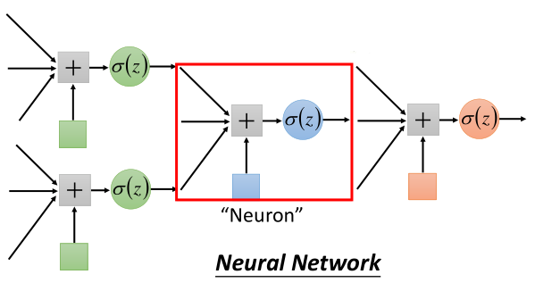

## Support Vector Machine

SVM = Hinge Loss + Kernel Method

### Hinge Loss

#### Binary Classification

先回顾一下二元分类的做法，为了方便后续推导，这里定义data的标签为-1和+1

- 当$f(x)>0$时，$g(x)=1$，表示属于第一类别；当$f(x)<0$时，$g(x)=-1$，表示属于第二类别

- 原本用$\sum \delta(g(x^n)\ne \hat y^n)$，不匹配的样本点个数，来描述loss function，其中$\delta=1$表示$x$与$\hat y$相匹配，反之$\delta=0$，但这个式子不可微分，无法使用梯度下降法更新参数

  因此使用近似的可微分的$l(f(x^n),\hat y^n)$来表示损失函数

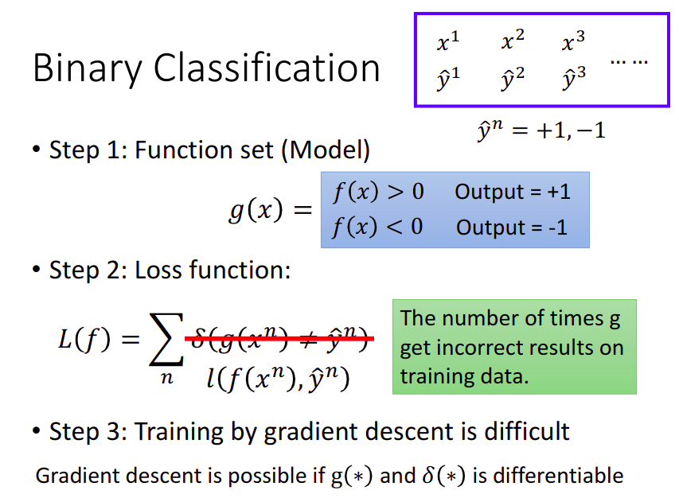

下图中，横坐标为$\hat y^n f(x)$，我们希望横坐标越大越好：

- 当$\hat y^n>0$时，希望$f(x)$越正越好
- 当$\hat y^n<0$时，希望$f(x)$越负越好

纵坐标是loss，原则上，当横坐标$\hat y^n f(x)$越大的时候，纵坐标loss要越小，横坐标越小，纵坐标loss要越大

#### ideal loss

在$L(f)=\sum\limits_n \delta(g(x^n)\ne \hat y^n)$的理想情况下，如果$\hat y^n f(x)>0$，则loss=0，如果$\hat y^n f(x)<0$，则loss=1，如下图中加粗的黑线所示，可以看出该曲线是无法微分的，因此我们要另一条近似的曲线来替代该损失函数

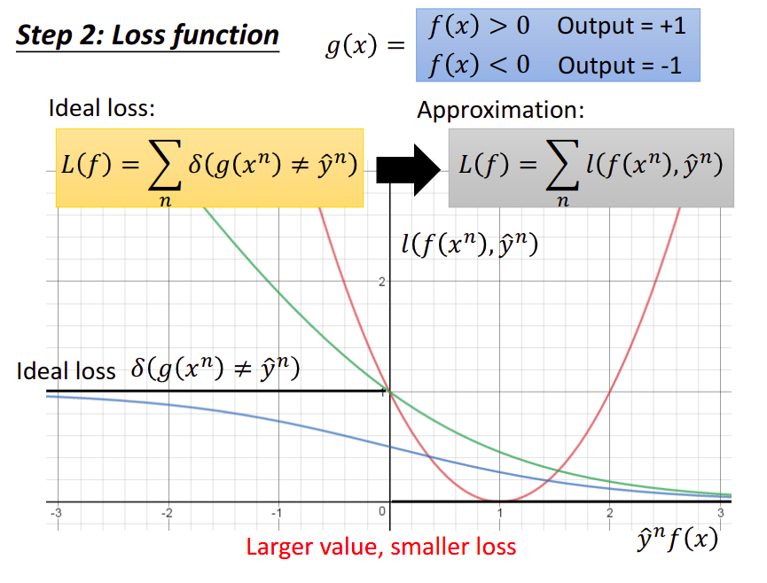

#### square loss

下图中的红色曲线代表了square loss的损失函数：$l(f(x^n),\hat y^n)=(\hat y^n f(x^n)-1)^2$

- 当$\hat y^n=1$时，$f(x)$与1越接近越好，此时损失函数化简为$(f(x^n)-1)^2$
- 当$\hat y^n=-1$时，$f(x)$与-1越接近越好，此时损失函数化简为$(f(x^n)+1)^2$
- 但实际上整条曲线是不合理的，它会使得$\hat y^n f(x)$很大的时候有一个更大的loss

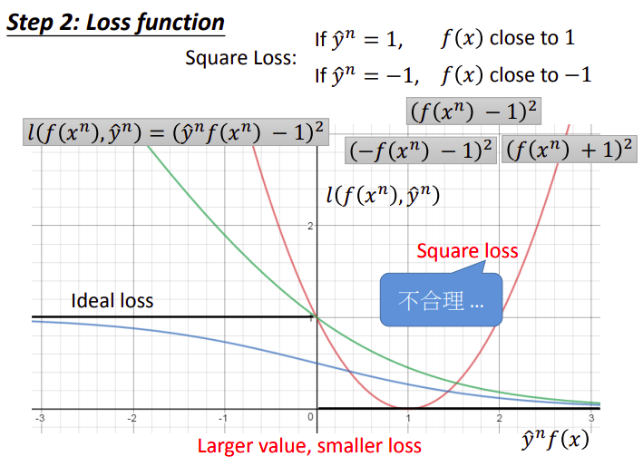

#### sigmoid + square loss

此外蓝线代表sigmoid+square loss的损失函数：$l(f(x^n),\hat y^n)=(\sigma(\hat y^n f(x^n))-1)^2$

- 当$\hat y^n=1$时，$\sigma (f(x))$与1越接近越好，此时损失函数化简为$(\sigma(f(x))-1)^2$
- 当$\hat y^n=-1$时，$\sigma (f(x))$与0越接近越好，此时损失函数化简为$(\sigma(f(x)))^2$
- 在逻辑回归的时候实践过，一般square loss的方法表现并不好，而是用cross entropy会更好

#### sigmoid + cross entropy

绿线则是代表了sigmoid+cross entropy的损失函数：$l(f(x^n),\hat y^n)=ln(1+e^{-\hat y^n f(x)})$

- $\sigma (f(x))$代表了一个分布，而Ground Truth则是真实分布，这两个分布之间的交叉熵，就是我们要去minimize的loss
- 当$\hat y^n f(x)$很大的时候，loss接近于0
- 当$\hat y^n f(x)$很小的时候，loss特别大
- 下图是把损失函数除以$ln2$的曲线，使之变成ideal loss的upper bound，且不会对损失函数本身产生影响
- 我们虽然不能minimize理想的loss曲线，但我们可以minimize它的upper bound，从而起到最小化loss的效果

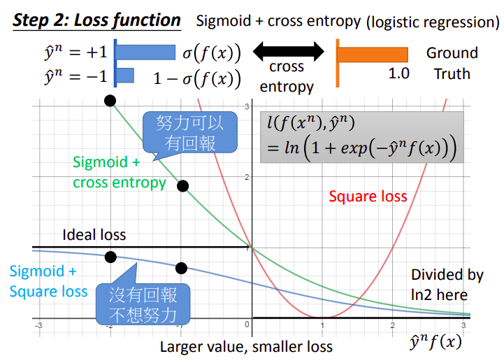

#### cross entropy v.s. square error

为什么cross entropy要比square error要来的有效呢？

- 我们期望在极端情况下，比如$\hat y^n$与$f(x)$非常不匹配导致横坐标非常负的时候，loss的梯度要很大，这样才能尽快地通过参数调整回到loss低的地方

- 对sigmoid+square loss来说，当横坐标非常负的时候，loss的曲线反而是平缓的，此时去调整参数值对最终loss的影响其实并不大，它并不能很快地降低

  形象来说就是，“没有回报，不想努力”

- 而对cross entropy来说，当横坐标非常负的时候，loss的梯度很大，稍微调整参数就可以往loss小的地方走很大一段距离，这对训练是友好的

  形象来说就是，“努力可以有回报""

#### Hinge Loss

紫线代表了hinge loss的损失函数：$l(f(x^n),\hat y^n)=\max(0,1-\hat y^n f(x))$

- 当$\hat y^n=1$，损失函数化简为$\max(0,1-f(x))$
  - 此时只要$f(x)>1$，loss就会等于0
- 当$\hat y^n=-1$，损失函数化简为$\max(0,1+f(x))$
  - 此时只要$f(x)<-1$，loss就会等于0
- 总结一下，如果label为1，则当$f(x)>1$，机器就认为loss为0；如果label为-1，则当$f(x)<-1$，机器就认为loss为0，因此该函数并不需要$f(x)$有一个很大的值

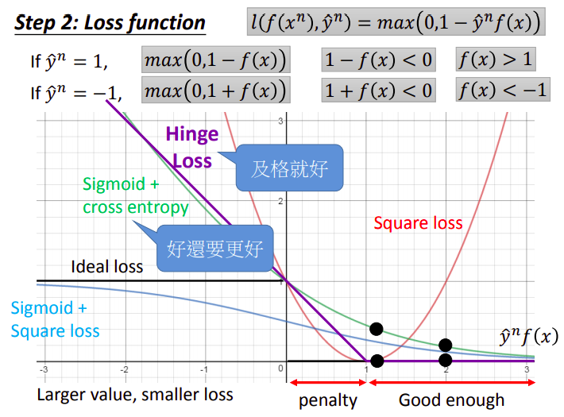

在紫线中，当$\hat y^n f(x)>1$，则已经实现目标，loss=0；当$\hat y^n f(x)>0$，表示已经得到了正确答案，但Hinge Loss认为这还不够，它需要你继续往1的地方前进

事实上，Hinge Loss也是Ideal loss的upper bound，但是当横坐标$\hat y^n f(x)>1$时，它与Ideal loss近乎是完全贴近的

比较Hinge loss和cross entropy，最大的区别在于他们对待已经做得好的样本点的态度，在横坐标$\hat y^n f(x)>1$的区间上，cross entropy还想要往更大的地方走，而Hinge loss则已经停下来了，就像一个的目标是”还想要更好“，另一个的目标是”及格就好“

在实作上，两者差距并不大，而Hinge loss的优势在于它不怕outliers，训练出来的结果鲁棒性(robust)比较强

### Linear SVM

#### model description

在线性的SVM里，我们把$f(x)=\sum\limits_i w_i x_i+b=w^Tx$看做是向量$\left [\begin{matrix}w\\b \end{matrix}\right ]$和向量$\left [\begin{matrix}x\\1 \end{matrix}\right ]$的内积，也就是新的$w$和$x$，这么做可以把bias项省略掉

在损失函数中，我们通常会加上一个正规项，即$L(f)=\sum\limits_n l(f(x^n),\hat y^n)+\lambda ||w||_2$

这是一个convex的损失函数，好处在于无论从哪个地方开始做梯度下降，最终得到的结果都会在最低处，曲线中一些折角处等不可微的点可以参考NN中relu、maxout等函数的微分处理

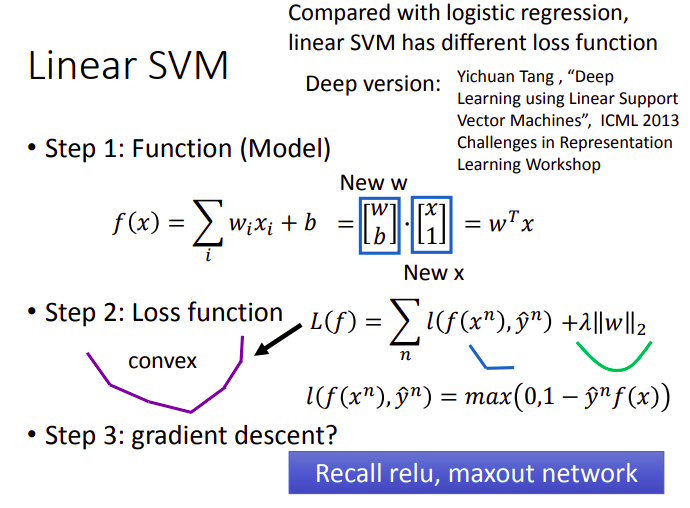

对比Logistic Regression和Linear SVM，两者唯一的区别就是损失函数不同，前者用的是cross entropy，后者用的是Hinge loss

事实上，SVM并不局限于Linear，尽管Linear可以带来很多好的特质，但我们完全可以在一个Deep的神经网络中使用Hinge loss的损失函数，就成为了Deep SVM，其实Deep Learning、SVM这些方法背后的精神都是相通的，并没有那么大的界限

#### gradient descent

尽管SVM大多不是用梯度下降训练的，但使用该方法训练确实是可行的，推导过程如下：

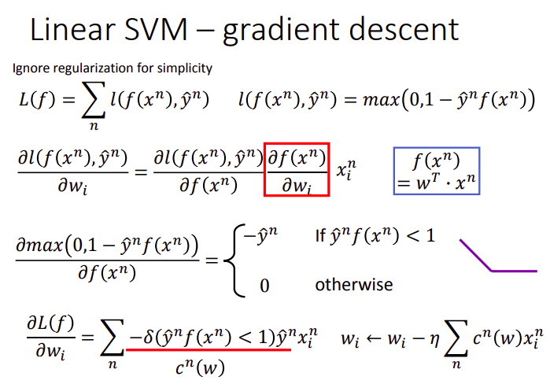

#### another formulation

前面列出的式子可能与你平常看到的SVM不大一样，这里将其做一下简单的转换

对$L(f)=\sum\limits_n \max(0,1-\hat y^n f(x))+\lambda ||w||_2$

用 $L(f)=\sum\limits_n \epsilon^n+\lambda ||w||_2$来表示，其中$\epsilon^n=\max(0,1-\hat y^n f(x^n))$

对$\epsilon^n\geq0$、$\epsilon^n\geq1-\hat y^n f(x)$来说，它与上式是不同的，因为max得到的$\epsilon^n$是二选一，而$\geq$得到的$\epsilon^n$则多大都可以

但是当加上取loss function $L(f)$最小化这个条件时，$\geq$就要取到等号，两者就是等价的

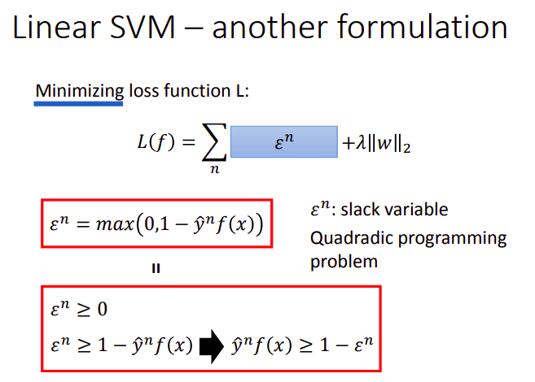

此时该表达式就和你熟知的SVM一样了：

$L(f)=\sum\limits_n \epsilon^n+\lambda ||w||_2$，且$\hat y^n f(x)\geq 1-\epsilon^n$

其中$\hat y^n$和$f(x)$要同号，$\epsilon^n$要大于等于0，这里$\epsilon^n$的作用就是放宽1的margin，也叫作松弛变量slack variable

这是一个QP问题Quadratic programming problem，可以用对应方法求解，当然前面提到的梯度下降法也可以解

### Kernel Method

#### Linear combination of data points

你要先说服你自己一件事：实际上我们找出来的可以minimize损失函数的参数，其实就是data的线性组合
$$
w^*=\sum\limits_n \alpha^*_n x^n
$$
你可以通过拉格朗日乘数法去求解前面的式子来验证，这里试图从梯度下降的角度来解释：

观察$w$的更新过程$w=w-\eta\sum\limits_n c^n(w)x^n$可知，如果$w$被初始化为0，则每次更新的时候都是加上data point $x$的线性组合，因此最终得到的$w$依旧会是$x$的Linear Combination

而使用Hinge loss的时候，$c^n(w)$或者说$\alpha^\star_n$往往会是0（如果作用在max=0的区域），SVM解出来的$\alpha_n$是sparse的，因为有很多$x^n$的系数微分为0，这意味着即使从数据集中把这些$x^n$的样本点移除掉，对结果也是没有影响的，这可以增强系统的鲁棒性

不是所有的$x^n$都会被加到$w$里去，而被加到$w$里的那些$x^n$，才是会决定model和parameter样子的data point，就叫做**support vector**

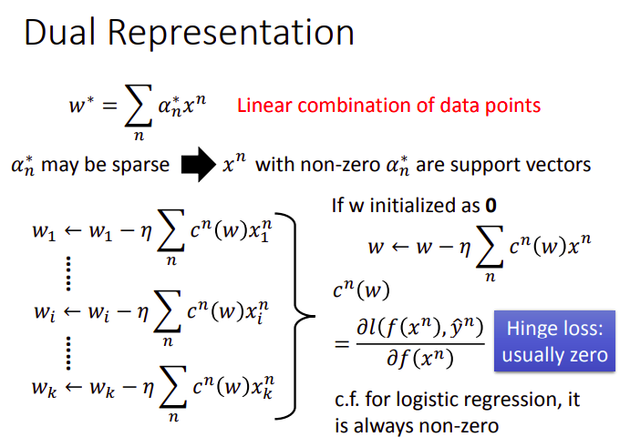

而在传统的cross entropy的做法里，每一笔data对结果都会有影响，因此鲁棒性就没有那么好

#### redefine model and loss function

知道$w$是$x^n$的线性组合之后，我们就可以对原先的SVM函数进行改写：
$$
w=\sum_n\alpha_nx^n=X\alpha \\
f(x)=w^Tx=\alpha^TX^Tx=\sum_n\alpha_n(x^n\cdot x)
$$
这里的$x$表示新的data，$x^n$表示数据集中已存在的所有data，由于很多$\alpha_n$为0，因此内积的计算量并不是很大

接下来把$x^n$与$x$的内积改写成**Kernel function**的形式：$x^n\cdot x=K(x^n,x)$

此时model就变成了$f(x)= \sum\limits_n\alpha_n K(x^n,x)$，未知的参数变成了$\alpha_n$

现在我们的目标是，找一组最好的$\alpha_n$，让loss最小，此时损失函数改写为：
$$
L(f)=\sum\limits_n l(\sum\limits_{n'} \alpha_{n'}K(x^{n'},x^n),\hat y^n)
$$
从中可以看出，我们并不需要真的知道$x$的vector是多少，需要知道的只是$x$跟另外一个vector$z$之间的内积值$K(x,z)$，也就是说，只要知道$K(x,z)$的值，就可以去对参数做优化了，这招就叫做**Kernel Trick**

只要满足$w$是$x^n$的线性组合，就可以使用Kernel Trick，所以也可以有Kernel based Logistic Regression，Kernel based Linear Regression

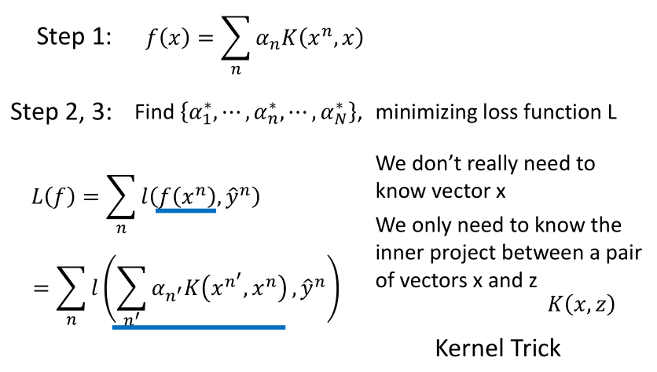

#### Kernel Trick

linear model会有很多的限制，有时候需要对输入的feature做一些转换之后，才能用linear model来处理

假设现在我们的data是二维的，$x=\left[ \begin{matrix}x_1\\x_2 \end{matrix} \right]$，先要对它做feature transform，然后再去应用Linear SVM

如果要考虑特征之间的关系，则把特征转换为$\phi(x)=\left[ \begin{matrix}x_1^2\\\sqrt{2}x_1x_2\\ x_2^2 \end{matrix} \right]$，此时Kernel function就变为：
$$
K(x,z)=\phi(x)\cdot \phi(z)=\left[ \begin{matrix}x_1^2\\\sqrt{2}x_1x_2\\ x_2^2 \end{matrix} \right] \cdot \left[ \begin{matrix}z_1^2\\\sqrt{2}z_1z_2\\ z_2^2 \end{matrix} \right]=(x_1z_1+x_2z_2)^2=(\left[ \begin{matrix}x_1\\x_2 \end{matrix} \right]\cdot \left[ \begin{matrix}z_1\\z_2 \end{matrix} \right])^2=(x\cdot z)^2
$$

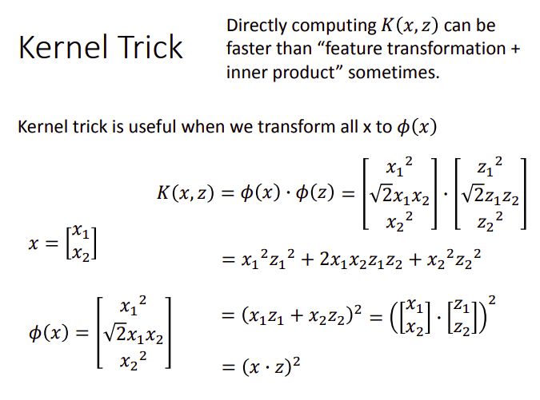

可见，我们对$x$和$z$做特征转换$\phi(x)$+内积，就等同于**在原先的空间上先做内积再平方**，在高维空间里，这种方式可以有更快的速度和更小的运算量

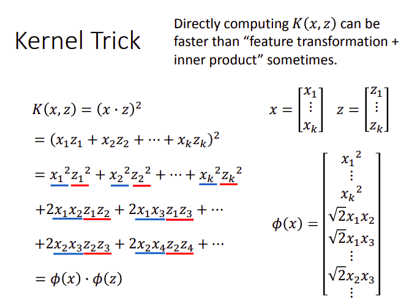

#### Radial Basis Function Kernel

在Radial Basis Function Kernel中，$K(x,z)=e^{-\frac{1}{2}||x-z||_2}$，如果x和z越像，Kernel的值越大。实际上也可以表示为$\phi(x)\cdot \phi(z)$，只不过$\phi(*)$的维数是无穷大的，所以我们直接使用Kernel trick计算，其实就等同于在无穷多维的空间中计算两个向量的内积

将Kernel展开成无穷维如下：

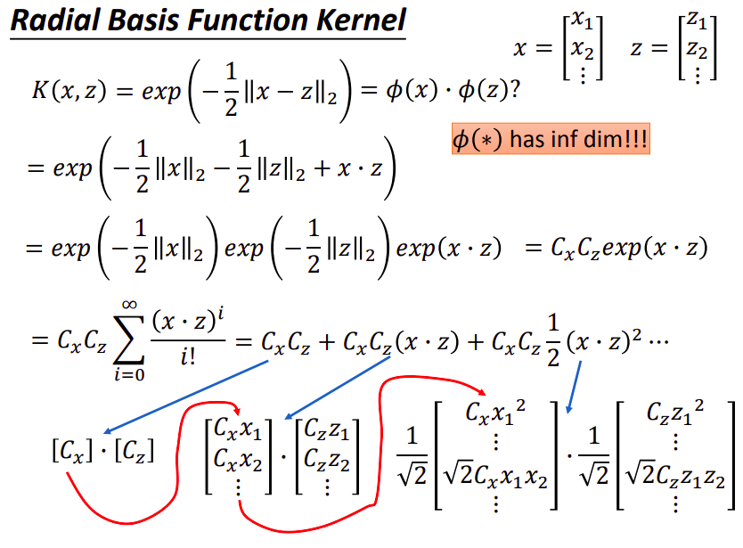

把与$x$相关的无穷多项串起来就是$\phi(x)$，把与$z$相关的无穷多项串起来就是$\phi(z)$，也就是说，当你使用RBF Kernel的时候，实际上就是在无穷多维的平面上做事情，当然这也意味着很容易过拟合

#### Sigmoid Kernel

Sigmoid Kernel：$K(x,z)=\tanh(x·z)$，$\tanh(x·z)$是哪两个 high dimension vector 做 Inner Product 的结果，自己回去用 Taylor Expansion 展开来看就知道了

如果使用的是Sigmoid Kernel，那model $f(x)$就可以被看作是只有一层hidden layer的神经网络，其中$x^1$\~$x^n$可以被看作是neuron的weight，变量$x$乘上这些weight，再通过Hyperbolic Tangent 激活函数，最后全部乘上$\alpha^1$\~$\alpha^n$做加权和，得到最后的$f(x)$

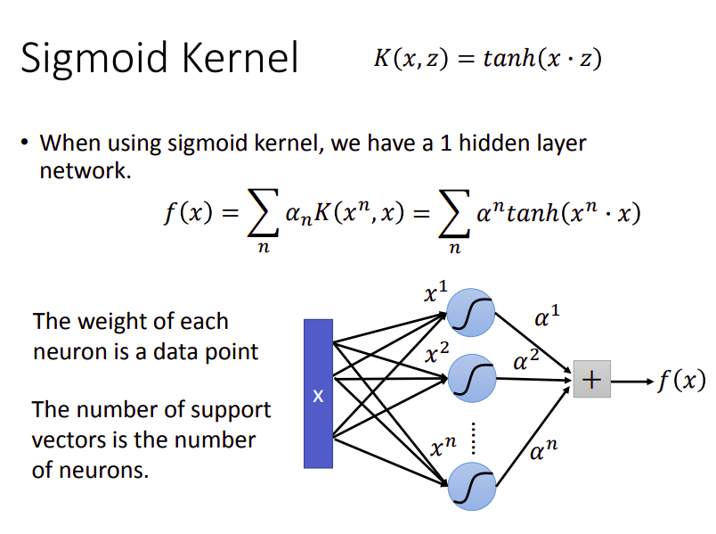

其中neuron的数目，由support vector的数量决定

#### Design Kernel Function

既然有了Kernel Trick，其实就可以直接去设计Kernel Function，**它代表了投影到高维以后的内积，类似于相似度的概念**

我们完全可以不去管$x$和$z$的特征长什么样，因为用低维的$x$和$z$加上$K(x,z)$，就可以直接得到高维空间中$x$和$z$经过转换后的内积，这样就省去了转换特征这一步

当$x$是一个有结构的对象，比如不同长度的sequence，它们其实不容易被表示成vector，我们不知道$x$的样子，就更不用说$\phi(x)$了，但是**只要知道怎么计算两者之间的相似度，就有机会把这个Similarity当做Kernel来使用**

我们随便定义一个Kernel Function，其实并不一定能够拆成两个向量内积的结果，但有Mercer's theory可以帮助你判断当前的function是否可拆分

下图是直接定义语音vector之间的相似度$K(x,z)$来做Kernel Trick的示例：

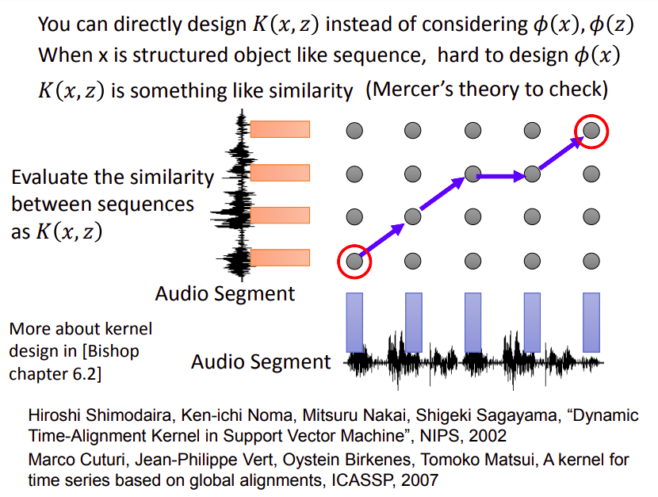

### SVM related methods

- Support Vector Regression(SVR)
  - [ Bishop chapter 7.1.4]
- Ranking SVM
  - [ Alpaydin, Chapter 13.11]
- One-class SVM
  - [ Alpaydin, Chapter 13.11]

### SVM vs Deep Learning

这里简单比较一下SVM和Deep Learning的差别：

- deep learning的前几层layer可以看成是在做feature transform，而后几层layer则是在做linear classifier

- SVM也类似，先用Kernel Function把feature transform到高维空间上，然后再使用linear classifier

  在SVM里一般Linear Classifier都会采用Hinge Loss

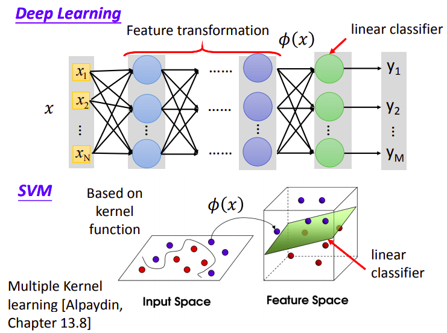

事实上SVM的Kernel是 learnable 的，但是它没有办法 learn 的像 Deep Learning 那么多。

你可以做的是你有好几个不同的 kernel，然后把不同 kernel combine 起来，它们中间的 weight 是可以 learn 的。

当你只有一个 kernel 的时候，SVM 就好像是只有一个 Hidden Layer 的 Neural Network，当你把 kernel 在做 Linear Combination 的时候，它就像一个有两个 layer 的 Neural Network

## Ensemble

Ensemble的方法就是一种团队合作，好几个模型一起上的方法。

### Framework of Ensemble

#### Get a set of classifiers

第一步：通常情况是有很多的classifier，想把他们集合在一起发挥更强大的功能，这些classifier一般是diverse的，这些classifier有不同的属性和不同的作用。就像moba游戏中每个人都有自己需要做的工作。

#### Aggregate the classifiers (properly)

第二步：就是要把classifier用比较好的方法集合在一起，就好像打团的时候输出和肉都站不同的位置。通常用ensemble可以让我们的表现提升一个档次，在kaggle之类的比赛中，你有一个好的模型，你可以拿到前几名，但你要夺得冠军你通常会需要 ensemble。

### Bagging

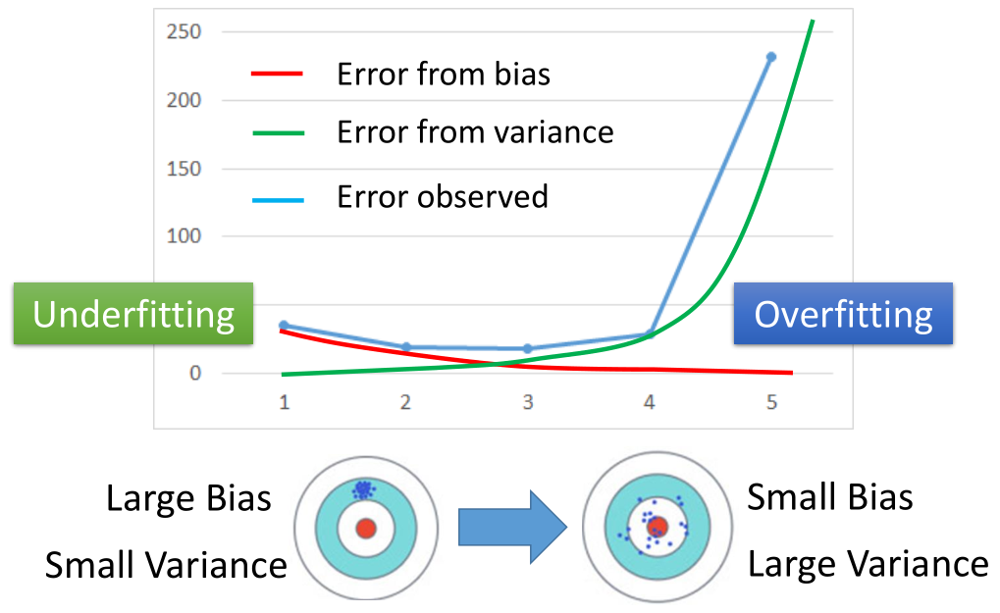

我们先来回顾一下bias和variance，对于简单的模型，我们会有比较大的bias但是有比较小的variance，如果是复杂的模型，则有比较小的bias但是有比较大的variance。在这两者的组合下，我们最后的误差（蓝色的线）会随着模型复杂度的增加，先下降后逐渐上升。

如果一个复杂的模型就会有很大的variance。这些模型的variance虽然很大，但是bias是比较小的，所以我们可以把不同的模型都集合起来，把输出做一个平均，得到一个新的模型$\hat{f}$，这个结果可能和正确的答案就是接近的。Bagging就是要体现这个思想。

Bagging就是我们自己创造出不同的dataset，再用不同的dataset去训练一个复杂的模型，每个模型独自拿出来虽然方差很大，但是把不同的方差大的模型集合起来，整个的方差就不会那么大，而且偏差也会很小。

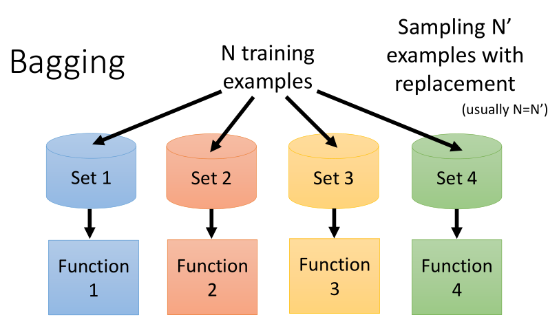

怎么自己制造不同的 data 呢？

假设现在有 N 笔 Training Data，对这 N 笔 Training Data 做 Sampling，从这 N 笔 Training Data 里面每次取 N' 笔 data组成一个新的 Data Set。

通常在做 Sampling 的时候会做 replacement，抽出一笔 data 以后会再把它放到 pool 里面去，那所以通常 N' 可以设成 N。所以把 N' 设成 N，从 N 这个 Data Set 里面做 N 次的 Sample with replacement，得到的 Data Set 跟原来的这 N 笔 data 并不会一样，因为你可能会反复抽到同一个 example。

总之我们就用 sample 的方法建出好几个 Data Set。每一个 Data Set 都有 N' 笔 Data，每一个 Data Set 里面的 Data 都是不一样的。

接下来你再用一个复杂的模型去对这四个 Data Set 做 Learning，就找出了四个 function。接下来在 testing 的时候，就把一笔 testing data 丢到这四个 function 里面，再把得出来的结果作平均或者是作 Voting。通常就会比只有一个 function 的时候performance 还要好，Variance 会比较小，所以你得到的结果会是比较 robust 的，比较不容易 Overfitting。

如果做的是 regression 方法的时候，你可能会用 average 的方法来把四个不同 function 的结果组合起来，如果是分类问题的话可能会用 Voting 的方法把四个结果组合起来。

注意一下，当你的 model 很复杂的时候、担心它 Overfitting 的时候才做 Bagging。

做 Bagging 的目的是为了要减低 Variance，你的 model Bias 已经很小但 Variance 很大，想要减低 Variance 的时候，你才做 Bagging。

This approach would be helpful when your model is complex, easy to overfit.

所以适用做 Bagging 的情况是，你的 Model 本身已经很复杂，在 Training Data 上很容易就 Overfit，这个时候你会想要用 Bagging。

举例来说 Decision Tree就是一个非常容易 Overfit 的方法。所以 Decision Tree 很需要做 Bagging。Random Forest 就是 Decision Tree 做 Bagging 的版本。

### Decision Tree

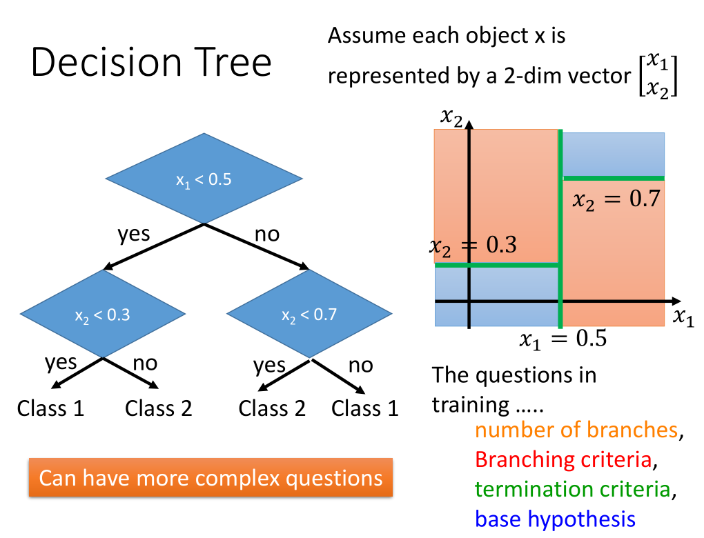

假设给定的每个Object有两个feature，我们就用这个training data建立一颗树，如果$x_{1}$小于0.5就是yes（往左边走），当$x_{1}$大于0.5就是no（往右边走），接下来看$x_{2}$，当$x_{2}$小于0.3时就是class 1（对应坐标轴图中左下角的蓝色）当大于0.3时候就是class 2（红色）；对右边的当$x_{2}$小于0.7时就是红色，当$x_{2}$大于0.7就是蓝色。这是一个比较简单的例子，其实可以同时考虑多个dimension，变得更复杂。

做决策树时会有很多地方需要注意：比如每个节点分支的数量，用什么样的criterion 来进行分支，什么时候停止分支，有那些可以问的问题等等，也是有很多参数要调。

#### Experiment: Function of Miku

描述：输入的特征是二维的，其中class 1分布的和初音的样子是一样的。我们用决策树对这个问题进行分类。

上图可以看到，深度是5的时候效果并不好，图中白色的就是class 1，黑色的是class 2.当深度是10的时候有一点初音的样子，当深度是15的时候，基本初音的轮廓就出来了，但是一些细节还是很奇怪（比如一些凸起来的边角）当深度是20的时候，就可以完美的把class 1和class 2的位置区别开来，就可以完美地把初音的样子勾勒出来了。对于决策树，理想的状况下可以达到错误是0的时候，最极端的就是每一笔data point就是很深的树的一个节点，这样正确率就可以达到100%（树够深，决策树可以做出任何的function）但是决策树很容易过拟合，如果只用决策树一般很难达到好的结果。

### Random Forest

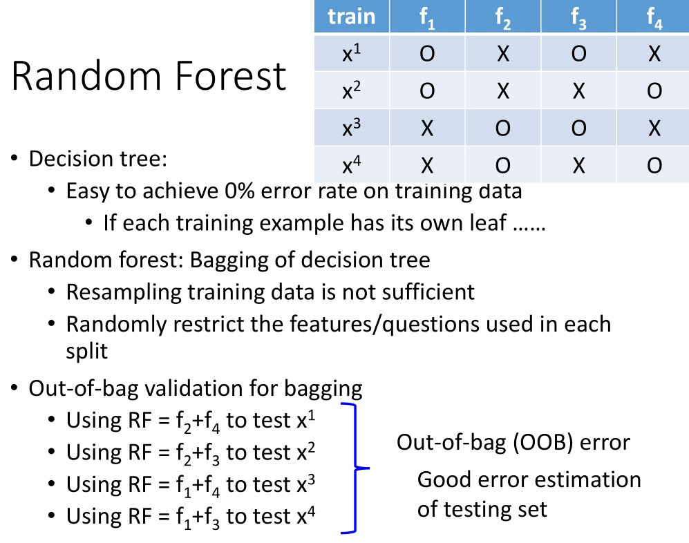

传统的随机森林是通过之前的重采样的方法做，但是得到的结果是每棵树都差不多（效果并不好）。比较typical 的方法是在每一次要产生 Decision Tree 的 branch 要做 split 的时候，都 random 的决定哪一些 feature 或哪一些问题是不能用。这样就能保证就算用同样的dataset，每次产生的决策树也会是不一样的，最后把所有的决策树的结果都集合起来，就会得到随机森林。

如果是用Bagging的方法的话，用**out-of-bag**可以做验证。用这个方法可以不用把label data划分成training set和validation set，一样能得到同样的效果。

具体做法：假设我们有training data是$x^{1}$,$x^{2}$,$x^{3}$,$x^{4}$，$f_{1}$我们只用第一笔和第二笔data训练（上图中圆圈表示训练，叉表示没训练），$f_{2}$我们只用第三笔第四笔data训练，$f_{3}$用第一，第三笔data训练，$f_{4}$表示用第二，第四笔data训练，我们知道，在训练$f_{1}$和$f_{4}$的时候没用用到$x^{1}$，所以我们就可以用$f_{1}$和$f_{4}$Bagging的结果在$x^{1}$上面测试他们的表现。

同理，我们可以用$f_{2}$和$f_{3}$Bagging的结果来测试$x^{2}$，用 $f_1$ 跟 $f_4$ Bagging 的结果 test $x_3$，用 $f_1$ 跟 $f_3$ Bagging 的结果 test $x_4$。

接下来再把 $x_1$ 跟 $x_4$ 的结果把它做平均，算一下 error rate 就得到 Out-of-bag 的 error。虽然我们没有明确的切出一个验证集，但是我们做测试的时候所有的模型并没有看过那些测试的数据。所有这个输出的error也是可以作为反映测试集结果的估测效果。

接下来是用随机森林做的实验结果：

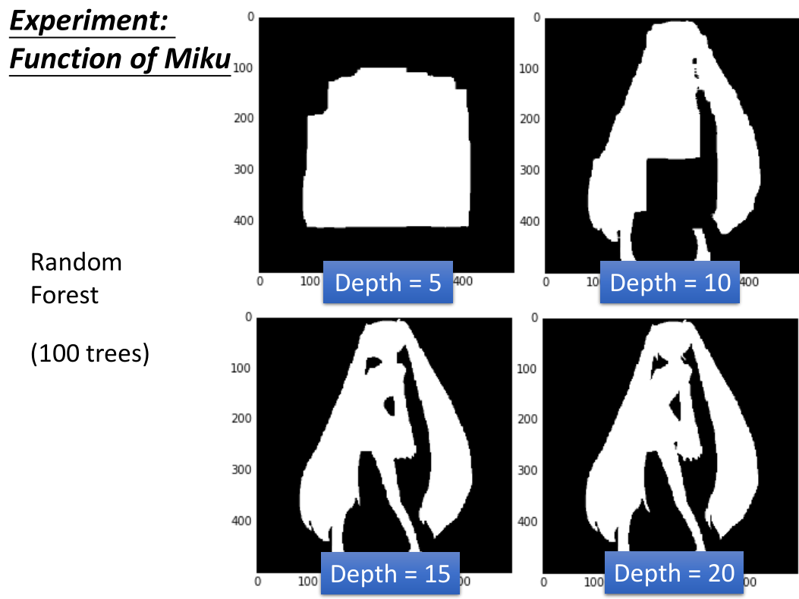

强调一点是做Bagging并不会使模型能更fit data，所以用深度为5的时候还是不能fit出那个function，就是5颗树的一个平均，相当于得到一个比较平滑的树。当深度是10的时候，大致的形状能看出来了，当15的时候效果就还不错，但是细节没那么好，当20 的时候就可以完美的把初音分出来。

### Boosting

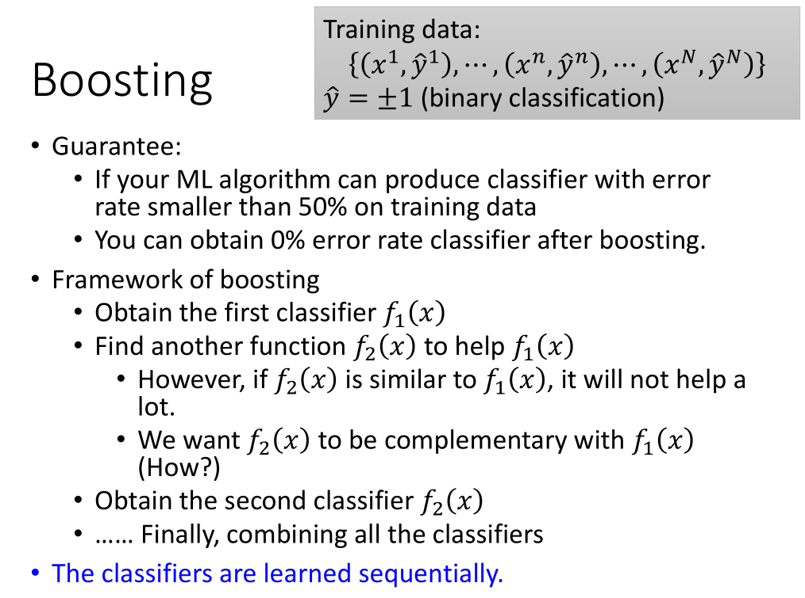

Boosting是用在很弱的模型上的，当我们有很弱的模型的时候，不能fit我们的data的时候，我们就可以用Boosting的方法。

Boosting有一个很强的guarantee ：假设有一个 ML 的 algorithm，它可以给你一个错误率高过 50% 的 classifier，只要能够做到这件事，Boosting 这个方法可以保证最后把这些错误率仅略高于 50% 的 classifier 组合起来以后，它可以让错误率达到 0%。

Boosting的结构：

- 首先要找一个分类器$f_1{(x)}$
- 接下再找一个辅助$f_1{(x)}$的分类器$f_2{(x)}$（注意$f_2{(x)}$如果和$f_1{(x)}$很像，那么$f_2{(x)}$的帮助效果就不好，所以要尽量找互补的$f_2{(x)}$，能够弥补$f_1{(x)}$没办法做到的事情）
- 得到第二个分类器$f_2{(x)}$
- ......
- 最后就结合所有的分类器得到结果

要注意的是在做 Boosting 的时候，classifier 的训练是有顺序的（sequential），要先找 $f_1$ 才知道怎么找跟 $f_1$ 互补的 $f_2$ ，所以它是有顺序的找。在 Bagging 的时候，每一个 classifier 是没有顺序的

#### How to obtain different classifiers?

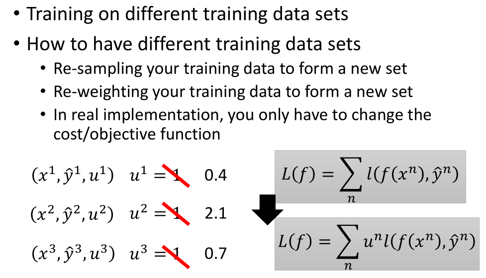

制造不同的训练数据来得到不同的分类器

用重采样的方法来训练数据得到新的数据集；用重新赋权重的的方法来训练数据得到新的数据集。

上图中用u来代表每一笔data的权重，可以通过改变weight来制造不同的data，举例来说就是刚开始都是1，第二次就分别改成0.4,2.1,0.7，这样就制造出新的data set。在实际中，就算改变权重，对训练没有太大影响。在训练时，原来的loss function是$L(w)=\sum_{n}l(f(x^n),\hat{y}^n)$，其中$l$可以是任何不同的function，只要能衡量$f(x^n)$和$\hat{y}^n$之间的差距就行，然后用gradient descent 的方法来最小化这个L（total loss function）。当加上权重后，变成了$L(w)=\sum_{n}u_nl(f(x^n),\hat{y}^n)$，相当于就是在原来的基础上乘以$u$。这样从loss function来看，如果有一笔data的权重比较重，那么在训练的时候就会被多考虑一点。

#### Adaboost

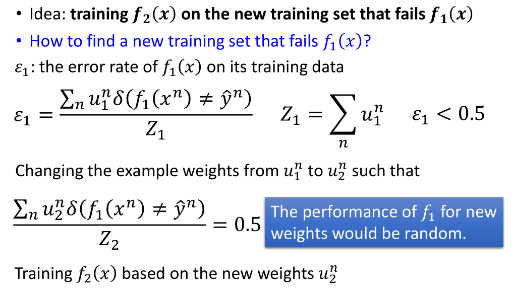

想法：先训练好一个分类器$f_1(x)$，要找一组新的training data，让$f_1(x)$在这组data上的表现很差，然后让$f_2(x)$在这组training data上训练。

怎么找一个新的训练数据集让$f_1(x)$表现差？

上图中的$\varepsilon_1$就是训练数据的error rate，这个就是对所有训练的样本求和，$\delta(f_1(x^n)\neq\hat{y}^n)$是计算每笔的training sample分类正确与否，用0来表示正确，用1来表示错误，乘以一个weight $u$，然后做normalization，这个$Z_1$对所有的weight标准化，这里的$\varepsilon_1<0.5$

然后我们想要用$u_2$作为权重的数据来进行计算得到error rate，在新的权重上，$f_1(x)$的表现就是随机的，恰好等于0.5，接下来我们拿这组新的训练数据集再去训练$f_2(x)$，这样的$f_2(x)$和$f_1(x)$就是互补的。

##### Re-weighting Training Data

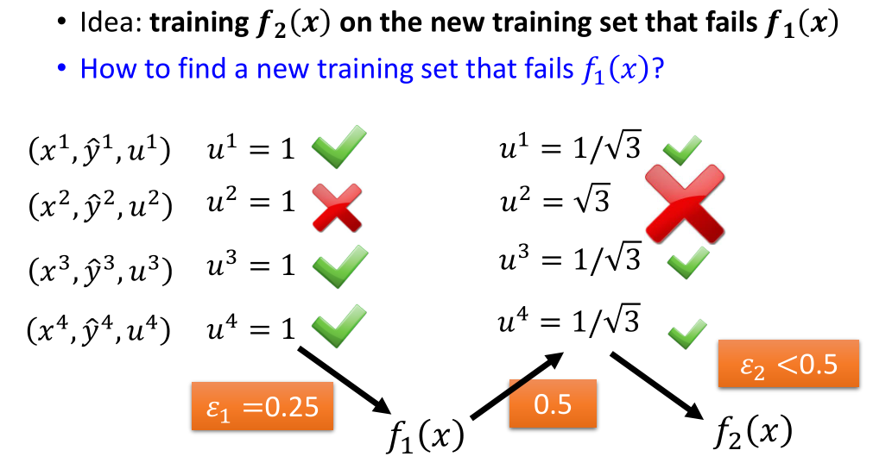

假设我们上面的四组训练数据，权重就是$u_1$到$u_4$，并且每个初始值都是1，我们现在用这四组训练数据去训练一个模型$f_1(x)$，假设$f_1(x)$只分类正确其中的三笔训练数据，所以$\varepsilon_1=0.25$
然后我们改变每个权重，把对的权重改小一点，把第二笔错误的权重改大一点，$f_1(x)$在新的训练数据集上表现就会变差$\varepsilon_1=0.5$。
然后在得到的新的训练数据集上训练得到$f_2(x)$，这个$f_2(x)$训练完之后得到的$\varepsilon_2$会比0.5小。

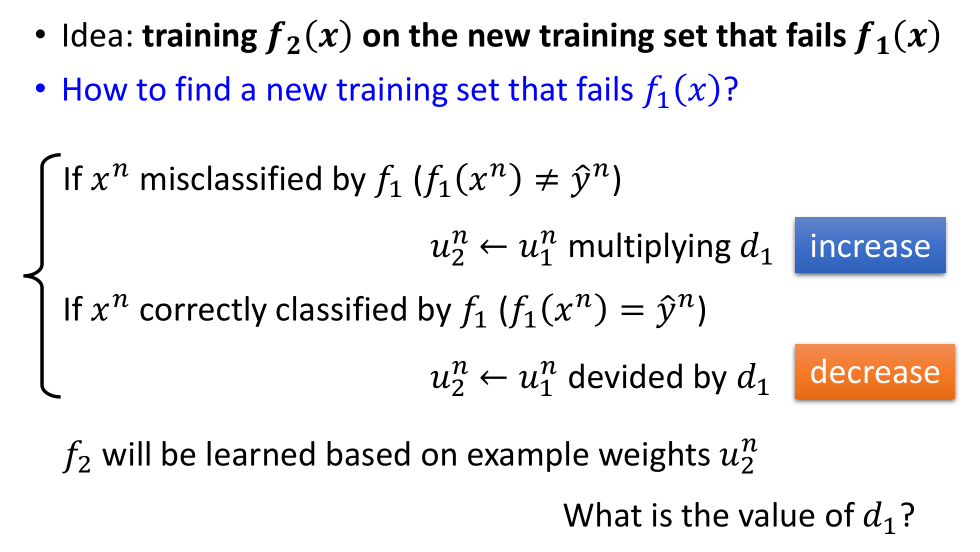

假设训练数据$x^n$会被$f_1(x)$分类错，那么就把第n笔data的$u^n_1$乘上$d_1$变成$u_2^n$，这个$d_1$是大于1的值

如果$x^n$正确的被$f_1(x)$分类的话，那么就用$u^n_1$除以$d_1$变成$u_2^n$

$f_2(x)$就会在新的权重$u^n_2$上进行训练。

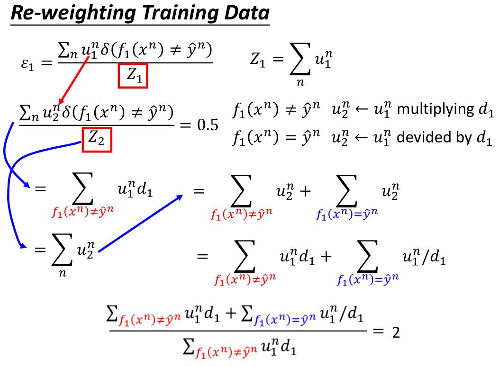

分类错误的$f_1(x^n)\neq\hat{y}^n$对应的$u^n_1$就乘上$d_1$；

$Z_2$就等于$\sum\limits_n{u^n_2}$，也等于分类错误和分类正确的两个$u^n_1$的权重和。

所以结合一下然后再取个倒数，就可以得到图中最后一个式子。

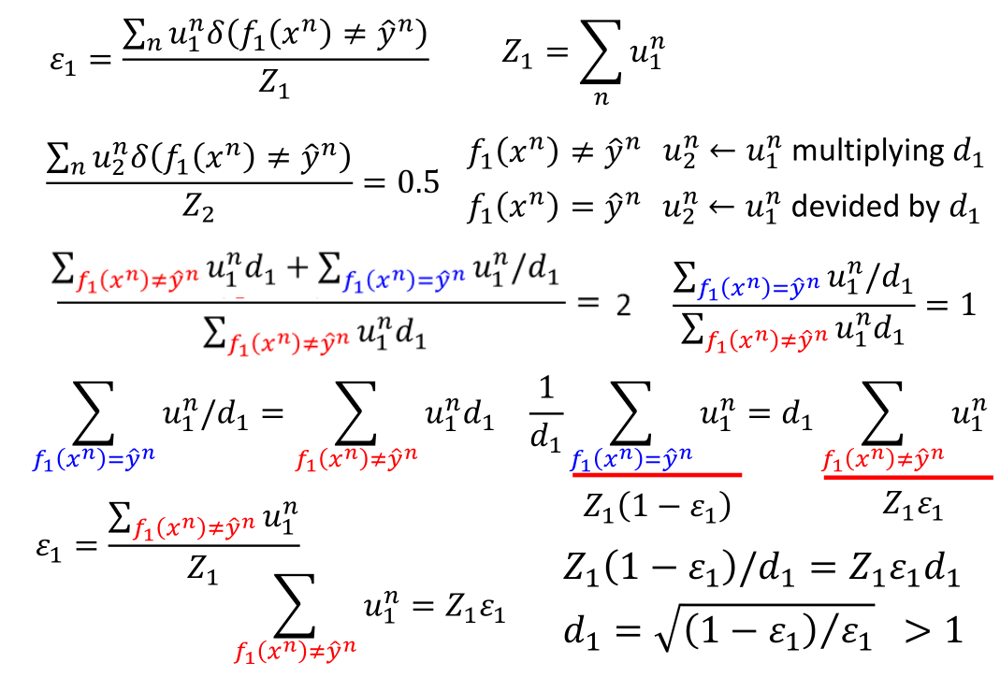

最后得到的结果是$d_1=\sqrt{(1-\varepsilon_1)/\varepsilon_1}$

然后用这个$d_1$去乘或者除权重，就能得到让$f_2(x)$表现不好的新的训练数据集

由于$\varepsilon_1$小于0.5，所以$d_1$大于1

##### Algorithm for AdaBoost

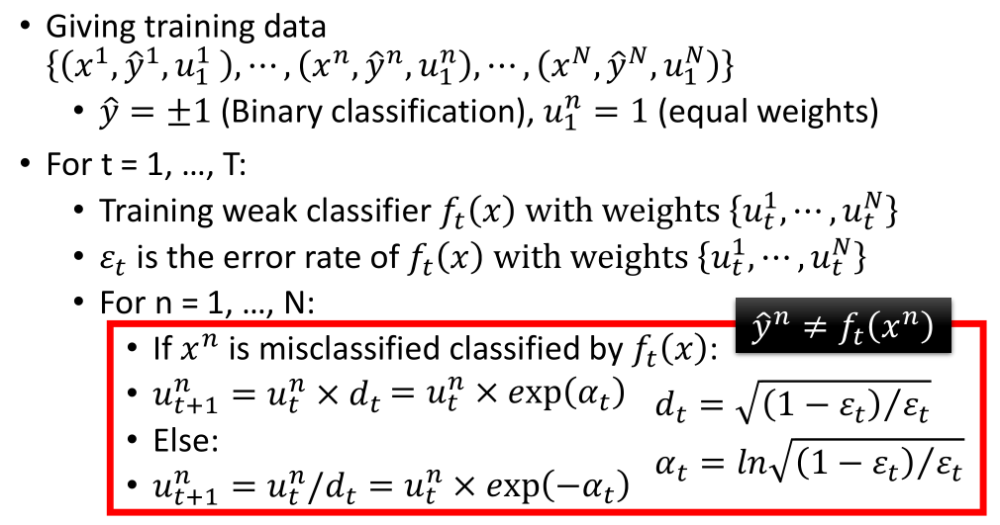

给定一笔训练数据以及其权重，设置初始的权重为1，接下来用不同的权重来进行很多次迭代训练弱分类器，然后再把这些弱的分类器集合起来就变成一个强的分类器。

其中在每次迭代中，每一笔训练数据都有其对应的权重$u_{t}^{n}$，用每个弱分类器对应的权重训练出每个弱分类器$f_t(x)$，计算$f_t(x)$在各自对应权重中的错误率$\varepsilon_t$。

然后就可以重新给训练数据赋权值，如果分类错误的数据，就用原来的$u^n_t$乘上$d_t$来更新其权重，反之就把原来的$u^n_t$除以$d_t$得到一组新的权重，然后就继续在下一次迭代中继续重复操作。（其中$d_t=\sqrt{(1-\varepsilon_t)/\varepsilon_t}$）

或者对$d_t$我们还可以用$\alpha_t=ln\sqrt{(1-\varepsilon)/\varepsilon}$来代替，这样我们就可以直接统一用乘的形式来更新$u^n_t$，变成了乘以$exp(\alpha_t)$或者乘以$exp(-\alpha_t)$

这里用$-\hat{y}^nf_t(x^n)$来取正负号（当分类错误该式子就是正的，分类正确该式子就是负的），这样表达式子就会更加简便。
$$
u_{t+1}^{n} \leftarrow u_{t}^{n} \times \exp \left(-\hat{y}^{n} f_{t}\left(x^{n}\right) \alpha_{t}\right)
$$

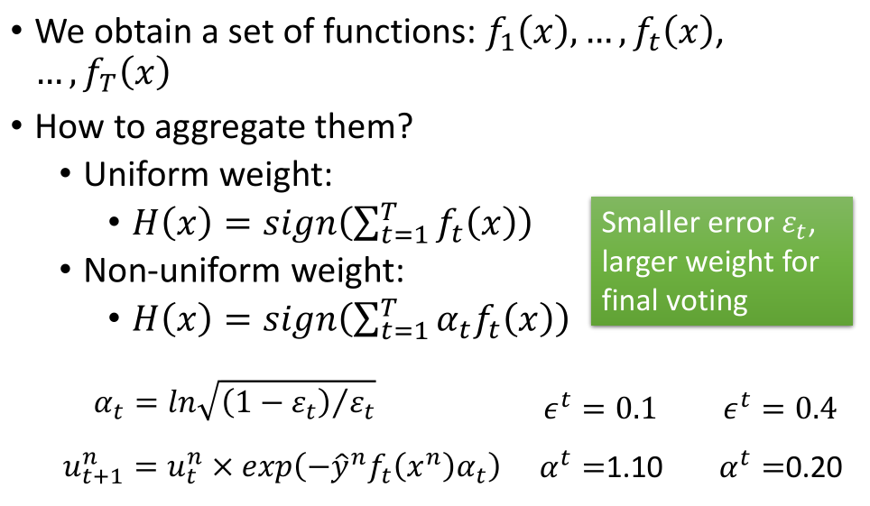

经过刚才的训练之后我们就得到了$f_1(x)$到$f_T(x)$

一般有两种方法进行集合：

Uniform weight：

我们把T个分类器加起来，看其结果是正的还是负的（正的就代表class 1，负的就代表class 2），这样可以但不是最好的，因为分类器中有好有坏，如果每个分类器的权重都一样的，显然是不合理的。

Non-uniform weight：

在每个分类器前都乘上一个权重$\alpha_t$，然后全部加起来后取结果的正负号，这种方法就能得到比较好的结果。

这里的$\alpha_t=ln\sqrt{(1-\varepsilon)/\varepsilon}$，从后面的例子可以看到，错误率比较低的$\varepsilon_t$=0.1得到的$\alpha_t$=1.10就比较大；反之，如果错误率比较高的$\varepsilon_t$=0.4得到的$\alpha_t$=0.20就比较小

错误率比较小的分类器，最后在最终结果的投票上会有比较大的权重。

##### Toy example

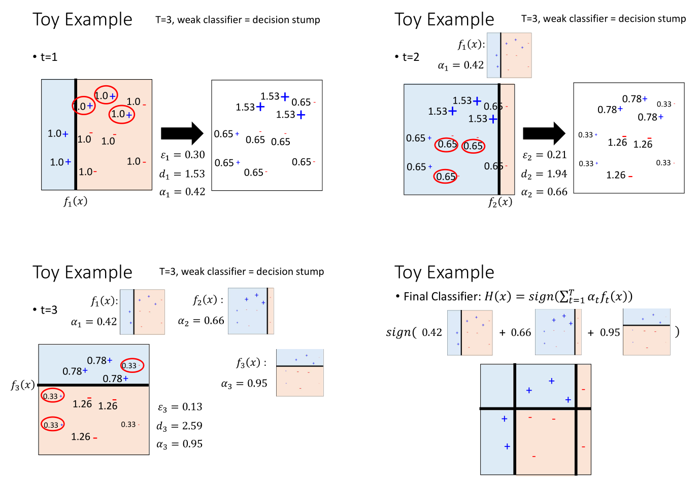

Decision stump，决策树桩：假设所有的特征都分布在二维平面上，在二维平面上选一个维度切一刀，其中一边为class 1，另外一边就当做class 2。

上图中t=1时，我们先用decision stump找一个$f_1(x)$，左边就是正类，右边就是负类，其中会发现有三笔data是错误的，所以能得到错误率是0.3，$d_1$=1.53(训练数据更新的权重),$\alpha_1$=0.42（在最终结果投票的权重），然后改变每笔训练数据的权重。

t=2和t=3按照同样的步骤，就可以得到第二和第三个分类器。由于设置了三次迭代，这样训练就结束了，用之前每个分类器乘以对应的权重，就可以得到最终分类器。

这个三个分类器把平面分割成六个部分，左上角三个分类器都是蓝色的，那就肯定就蓝色的。

上面中间部分第一个分类器是红色的，第二个第三个是蓝色的，但是后面两个加起来的权重比第一个大，所以最终中间那块是蓝色的。

对于右边部分，第一个第二个分类器合起来的权重比第三个蓝色的权重大，所以就是红色的。

下面部分也是按照同样道理，分别得到蓝色，红色和红色。

所以这三个弱分类器其实都会犯错，但是我们把这三个整合起来就能达到100%的正确率了。

##### Proof

$$
H(x)=\operatorname{sign}\left(\sum_{t=1}^{T} \alpha_{t} f_{t}(x)\right) \quad \alpha_{t}=\ln \sqrt{\left(1-\varepsilon_{t}\right) / \varepsilon_{t}}
$$

上式中的$H(x)$是最终分类结果的表达式，$\alpha_t$是权重，$\varepsilon_t$是错误率。

Proof: As we have more and more $𝑓(𝑡)$ (T increases), $𝐻(𝑥)$ achieves smaller and smaller error rate on training data.

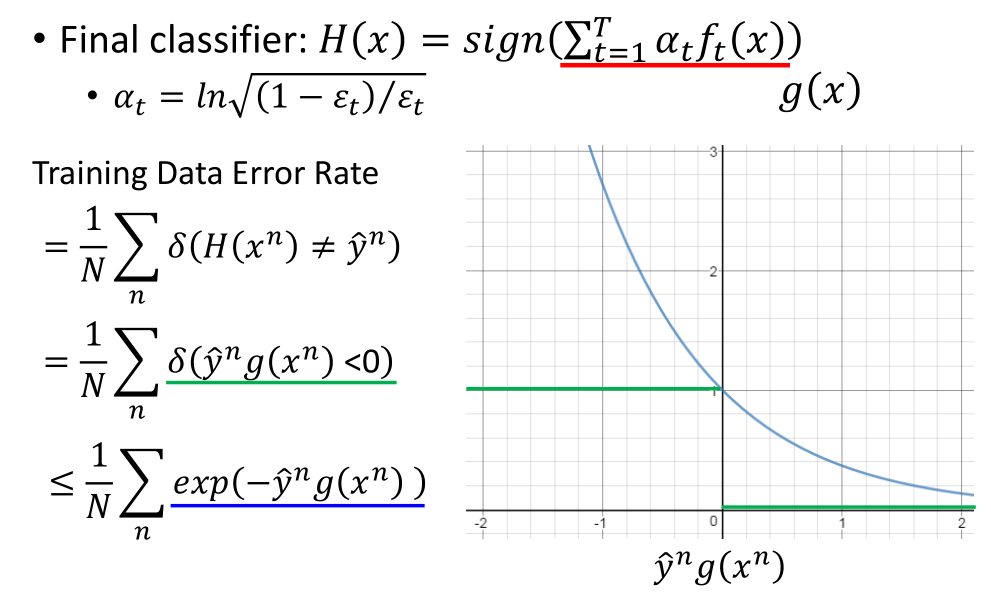

先计算总的训练数据集的错误率，也就是$\frac{1}{N}\sum\limits_{n}\delta{H(x^n)\neq\hat{y^n}}$其中$H(x^n)\neq\hat{y^n}$得到的就是1，反之如果$H(x^n)=\hat{y^n}$就是0。

进一步，可以把$H(x^n)\neq\hat{y^n}$写成$\hat{y^n}g(x^n)<0$,如果$\hat{y^n}g(x^n)$是同号的代表是正确的，如果是异号就代表分类错误的。整个错误率有一个upper bound就是$\frac{1}{N}\sum\limits_{n}exp(-\hat{y}^ng(x^n))$

上图中横轴是$\hat{y^n}g(x^n)$，绿色的线代表的是$\delta$的函数，蓝色的是$exp(-\hat{y}^ng(x^n))$也就是绿色函数的上限。

我们要证明upper bound会越来越小

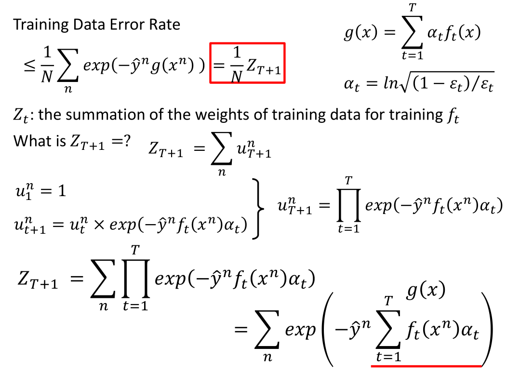

上式证明中，思路是先求出$Z_{T+1}$（也就是第T+1次训练数据集权重的和），就等于$\sum\limits_{n}u_{T+1}^n$

而$u_{t+1}^n$与$u_{t}^n$有关系，通过$u_{t+1}^n$在图中的表达式

能得到$u_{T+1}^n$就是T次连乘的$exp(-\hat{y}^nf_t(x^n)\alpha_t)$，也就是$u_{T+1}^n$，然后在累加起来得到$Z_{T+1}$

同时把累乘放到exp里面去变成了累加，由于$\hat{y}^n$是迭代中第n笔的正确答案，所以和累乘符号没有关系

就会发现后面的$\sum\limits_{t=1}f_t(x^n)\alpha_t$恰好等于图片最上面的$g(x)$。

这样就说明了，训练数据的权重的和会和训练数据的错误率有关系。接下来就是证明权重的和会越来越小就可以了。

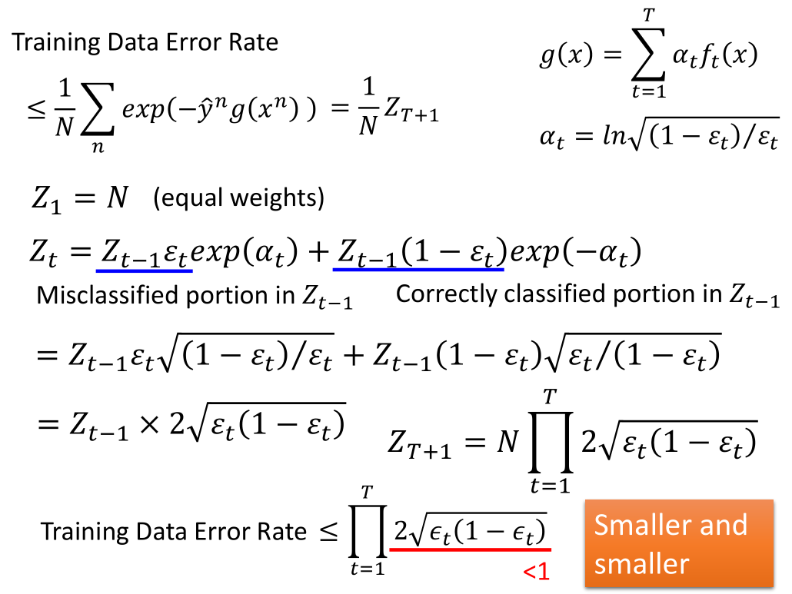

$Z_1$的权重就是每一笔初试权重的和N，然后这里的$Z_{t}$就是要根据$Z_{t-1}$来求出；

对于分类正确的，用$Z_{t-1}$乘以$exp(\alpha_t)$乘以$\varepsilon_t$，对于分类错误的就乘以$exp(-\alpha_t)$再乘以$1-\varepsilon_t$。

然后再把$\alpha_t$代入到这个式子中化简得到得到$Z_{t-1}\times{2\sqrt{\epsilon_t(1-\epsilon_t)}}$

其中，$\varepsilon_t$是错误率，肯定小于0.5，所以$2\sqrt{\epsilon_t(1-\epsilon_t)}$当$\epsilon_t=0.5$时，最大值为1，所以$Z_t$小于等于$Z_{t-1}$。

$Z_{T+1}$就是N乘以T个$2\sqrt{\varepsilon_t(1-\varepsilon_t)}$连乘。

这样的一来训练数据的错误率的upper bound就会越来越小。

##### Margin

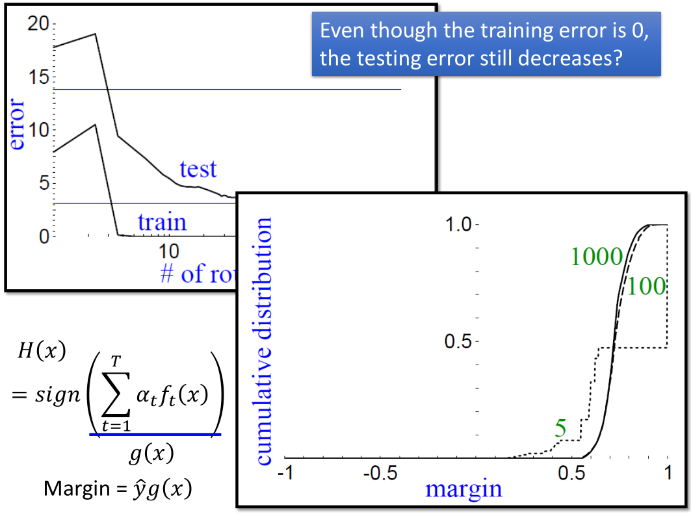

其中图中x轴是训练的次数，y轴是错误大小，从这张图我们发现训练数据集上的错误率其实很快就变成了0，但是在 testing data 上的 error 仍然可以继续下降。

我们把$\hat{y}g(x)$定义为margin，我们希望它们是同号，同时不只希望它同号，希望它相乘以后越大越好

原因：图中是5，100，1000个权重的分类器结合在一起时margin的分布图，当5个分类器结合的时候，其实margin已经大于0了，但是当增加弱分类器的数量的时候，margin还会一直变大，增加 margin 的好处是让你的方法比较 robust，可以在 testing set 上得到比较好的 performance。

为什么margin会增加？

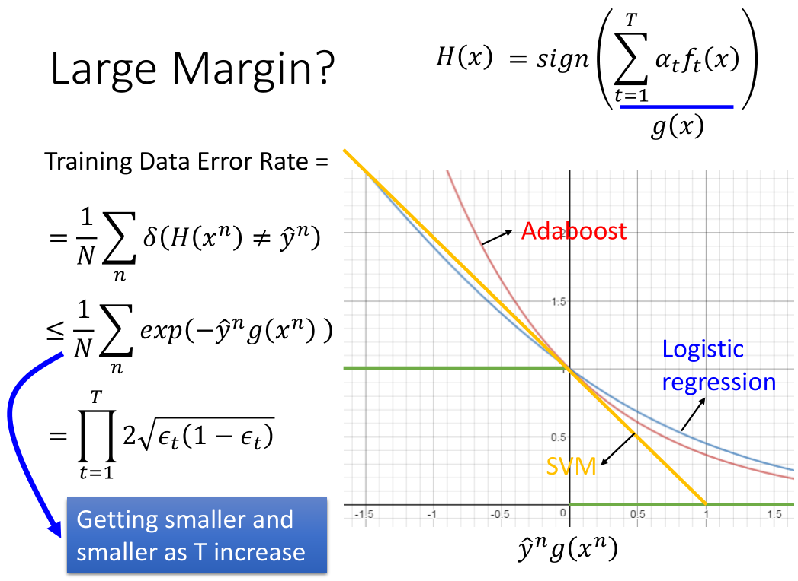

该图是$\hat{y}^ng(x^n)$的函数图像，红色的线就是AdaBoost的目标函数，从图中可以看出AdaBoost的在为$\hat{y}^ng(x^n)>0$时，error 并不是 0，它可以把$\hat{y}^ng(x^n)$再更往右边推然后得到更小的 error，依然能不断的下降，也就是让$\hat{y}^ng(x^n)$(margin)能不断增大，得到更小的错误。

Logistic Regression和SVM也可以做到同样的效果。

##### Experiment: Function of Miku

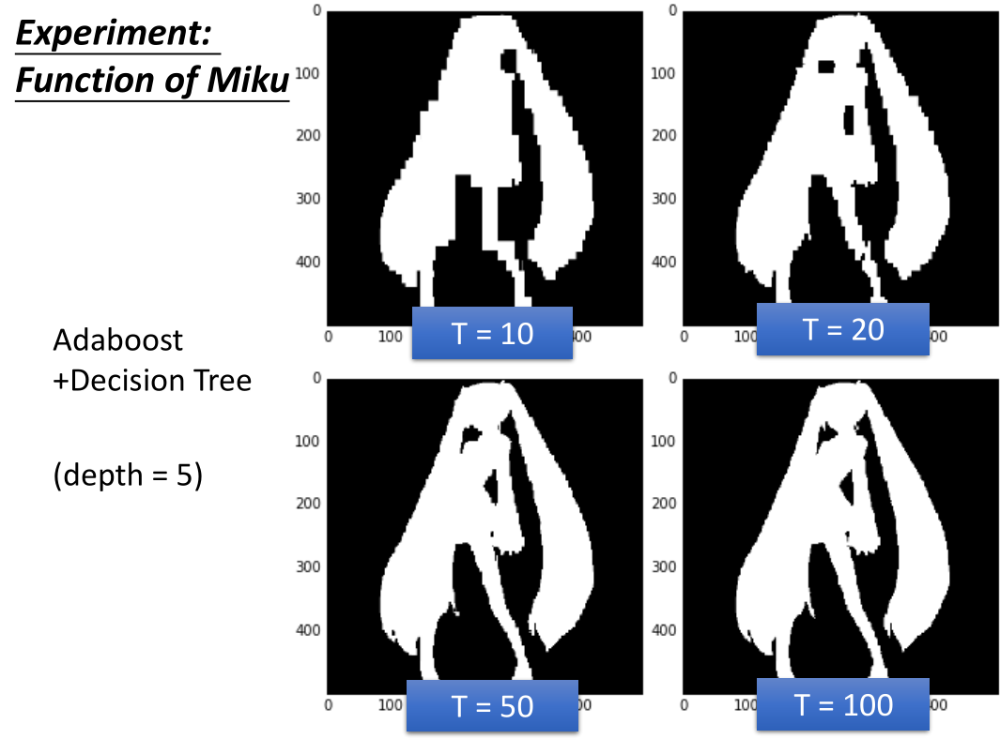

本来深度是5的决策树是不能做好初音的分类（只能通过增加深度来进行改进），但是现在有了AdaBoost的决策树是互补的，所以用AdaBoost就可以很好的进行分类。T代表AdaBoost运行次数，图中可知用AdaBoost，100棵树就可以很好的对初音进行分类。

### Gradient Boosting

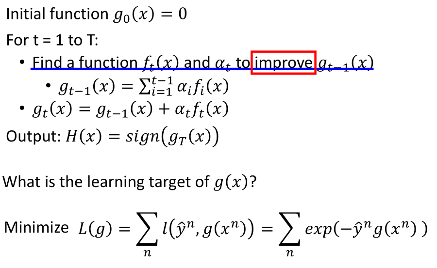

Gradient Boosting是Boosting的更泛化的一个版本。
具体步骤：

- 初始化一个$g_{0}(x)=0$,
- 现在进行很多次的迭代，找到一组$f_t(x)$和$\alpha_t$来共同改进$g_{t-1}(x)$
  - $g_{t-1}(x)$就是之前得到所有的$f(x)$和$\alpha$乘积的和
  - 把找到的一组$f_t(x)$和$\alpha_t$相乘（与$g_{t-1}(x)$互补）加上原来的$g_{t-1}(x)$得到新的$g_{t}(x)$，这样$g_{t}(x)$就比原来的$g_{t-1}(x)$更好
- 经过T次迭代，得到的$H(x)$

这里的cost function是$L(g)=\sum\limits_{n}l(\hat{y}^n,g(x^n))$，其中$l$用来衡量$\hat{y}^n$和$g(x^n)$的差异（比如说可以用 Cross Entropy 或 Mean Square Error 等等）这里定义成了$exp(-\hat{y}^ng(x^n))$。

接下来我们要最小化损失函数，我们就需要用梯度下降来更新每个$g(x)$

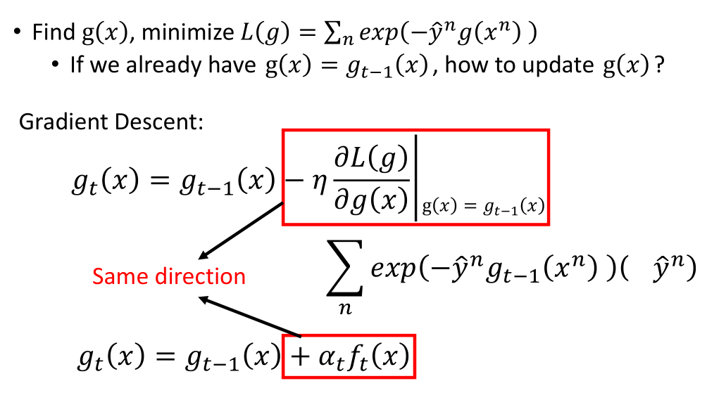

从梯度下降角度考虑：上图式子中，我们需要用函数$g(x)$对$L(g)$求梯度，然后用这个得到的梯度去更新$g_{t-1}$,得到新的$g_{t}$

这里对$L(g)$求梯度的函数$g(x)$就是可以想成每一点就是一个参数，那其实 $g(x)$ 就是一个 vector $\begin{bmatrix}g(x_1) \\g(x_2) \\....\end{bmatrix}$，通过调整参数就能改变函数的形状，这样就可以对$L(g)$做偏微分。

从Boosting角度考虑，红色框的两部分应该是同方向的，如果$f_t(x)$和其方向是一致的话，那么就可以把$f_t(x)$加上$g_{t-1}(x)$，就可以让新的损失减少。

我们希望$f_t(x)$和$\sum\limits_{n}exp(-\hat{y}^ng_t(x^n))(\hat{y}^n)$方向越一致越好。所以我们希望maximize两个式子相乘，保证这两个式子方向一致。

对于得到的新式子，可以想成对每一笔 training data 都希望$\hat y$跟$f_t $他们是同号的，然后每一笔 training data 前面都乘上了一个 weight $exp(-\hat{y}^ng_{t-1}(x^n))$

经过计算之后发现这个权重恰好就是AdaBoost上的权重

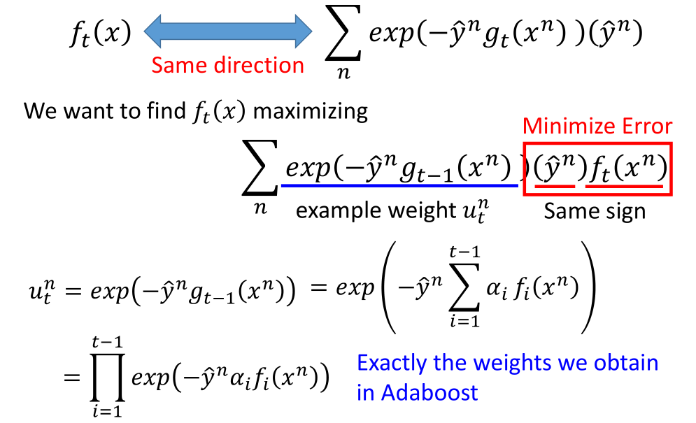

这里找出来的$f_t(x)$，其实也就是AdaBoost找出来的$f_t(x)$，所以用AdaBoost找一个弱的分类器$f_t(x)$的时候，就相当于用梯度下降更新损失，值得损失会变小。

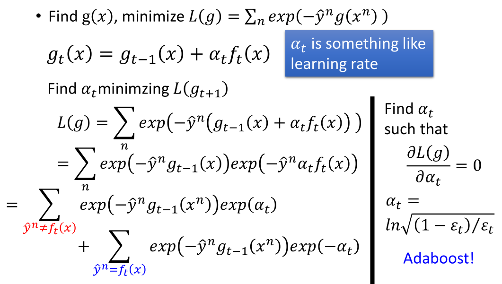

Gradient Boosting 里面，$f_t(x)$ 是一个 classifier，在找 $f_t(x)$ 的过程中运算量可能就是很大的，甚至如果 $f_t(x)$ 是个 Neural Network，要把 $f_t(x)$ 找出来的时候本身就需要很多次的 Gradient Descent 的 iteration。

由于求$f_t(x)$是很不容易才找到的，所以我们这里就会给$f_t(x)$配一个最好的$\alpha_t$，把$f_t(x)$的价值发挥到最大。

$\alpha_t$有点像学习率，但是这里我们固定$f_t(x)$，穷举所有的$\alpha_t$，找到一个$\alpha_t$使得$g_{t}(x)$的损失更小。

实际中不可能穷举，就是求解一个optimization 的 problem，找出一个$\alpha_t$，让$L(g)$最小，这里用计算偏微分的方法求极值。巧合的是找出来的$\alpha_t$就是$\alpha_t=ln\sqrt{(1-\varepsilon_t)/\varepsilon_t}$。

所以 Adaboost 整件事情，就可以想成它也是在做 Gradient Descent。只是 Gradient 是一个 function。

Gradient Boosting 有一个好的地方是，可以任意更改 Objective Function，创造出不一样的Boosting。

### Stacking

为了让 performance 再提升，就要把四个人的 model combine 起来，把一笔数据x输入到四个不同的模型中，然后每个模型输出一个y，然后用Majority Vote决定出最好的（对于分类问题）。

但是有个问题就是并不是所有系统都是好的，有些系统会比较差，但是如果采用之前的设置低权重的方法又会伤害小毛的自尊心，这样我们就提出一种方法：

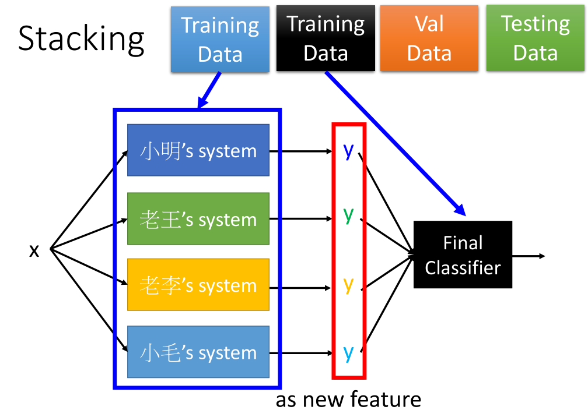

把得到的system 的 output 当做feature输入到一个classifier 中，然后再决定最终的结果。

这个最终的 classifier 就不需要太复杂，最前面如果都已经用好几个 Hidden Layer 的 Neural Network 了，也许 final classifier 就不需要再好几个 Hidden Layer 的 Neural Network，它可以只是 Logistic Regression 就行了。

那在做这个实验的时候要注意，我们会把有 label 的 data 分成 training set 跟 validation set。在做 Stacking 的时候要把 training set 再分成两部分，一部分的 training set 拿来 learn 这些 classifier，另外一部分的 training data 拿来 learn 这个 final classifier。

有的要来做 Stacking 的前面 classifier，它可能只是 fit training data的overfit model。如果 final classifier 的 training data跟这些 system 用的 training data 是同一组的话，就会因为这个model在training set上正确率很高而给其很高的权重。所以在 train final classifier 的时候必须要用另外一笔 training data 来 train final classifier，不能跟前面 train system的 classifier 一样。

## Batch Normalization

很快地介绍一下Batch Normalization 这个技术。

### Changing Landscape

我们之前讲过 error surface 如果很崎岖的时候，它比较难 train，那我们能不能够直接把山铲平，让它变得比较好 train 呢？Batch Normalization 就是其中一个，把山铲平的想法。

我们在讲 optimization 的时候，我们一开始就跟大家讲说，不要小看 optimization 这个问题，有时候就算你的 error surface 是 convex，它就是一个碗的形状，都不见得很好 train。

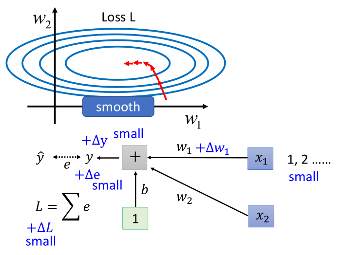

那我们举的例子就是，假设你的两个参数，它们对 Loss 的斜率差别非常大，在 $w_1$ 这个方向上面，你的斜率变化很小，在 $w_2$ 这个方向上面斜率变化很大，你今天如果是固定的 learning rate，你可能很难得到好的结果，所以我们才说你需要 adaptive 的 learning rate，你需要用 Adam 等等比较进阶的 optimization 的方法，才能够得到好的结果。

那现在我们要从另外一个方向想，直接把难做的 error surface 把它改掉，看能不能够改得好做一点。

那在做这件事之前，也许我们第一个要问的问题就是，有这一种状况，$w_1$ 跟 $w_2$ 它们的斜率差很多的这种状况，到底是从什么地方来的。

那我们这边就是举一个例子，假设我现在有一个非常非常非常简单的 model，它的输入是 $x_1$ 跟 $x_2$，$x_1$ 跟 $x_2$ 它对应的参数就是 $w_1$ 跟 $w_2$，它是一个 linear 的 model，没有 activation function，$w_1$ 乘 $x_1$，$w_2$ 乘 $x_2$ 加上 b 以后就得到 y，然后会计算 y 跟 y hat 之间的差距当做 e，把所有 training data 的 e 加起来呢，就是你的 Loss，你希望去 minimize 你的 Loss。

那什么样的状况我们会产生像上面这样子，比较不好 train 的 error surface 呢？

当我们对 $w_1$ 有一个小小的改变，比如说加上  $\Delta w_1$ 的时候，那这个 L 也会有一个改变，那什么时候 $w_1$ 的改变会对 L 的影响很小呢，什么时候 $w_1$ 这边的变化，它在 error surface 上的斜率会很小呢？

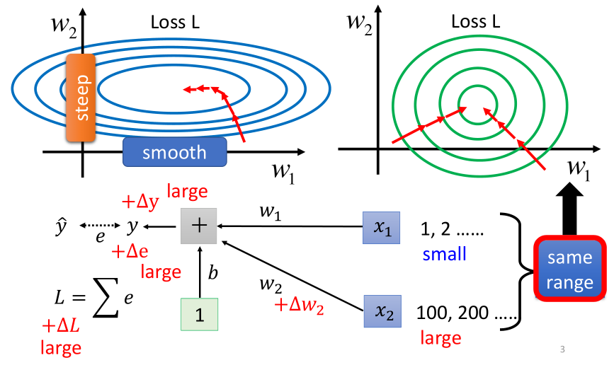

一个可能性是当你的 input 很小的时候，假设 $x_1$ 的值都很小，假设 $x_1$ 的值在不同的 training example 里面，它的值都很小。那因为 $x_1$ 是直接乘上 $w_1$，如果 $x_1$ 的值都很小，$w_1$ 有一个变化的时候，它对 y 的影响也是小的，对 e 的影响也是小的，它对 L 的影响就会是小的。

所以如果 $w_1$ 接的 input 它的值都很小，那就会产生这边这样的 case，你在 $w_1$ 上面的变化对大 L 的影响是小的。

反之呢，如果今天是 $x_2$ 的话，假设 $x_2$ 它的值都很大，那假设 $x_2$ 的值都很大，当你的 $w_2$ 有一个小小的变化的时候，虽然 $w_2$ 这个变化可能很小，但是因为它乘上了 $x_2$，$x_2$ 的值很大，那 y 的变化就很大，那 e 的变化就很大，那 L 的变化就会很大，就会导致我们在 w 这个方向上，做变化的时候，我们把 w 改变一点点，那我们的 error surface 就会有很大的变化。

所以你发现说，既然在这个 linear 的 model 里面，当我们 input 的 feature，每一个 dimension 的值，它的 scale 差距很大的时候，我们就可能产生像这样子的 error surface，就可能产生不同方向，它的斜率非常不同的，它的坡度非常不同的 error surface。所以我们有没有可能给不同的 dimension，feature 里面不同的 dimension，让它有同样的数值的范围？

如果我们可以给不同的 dimension，同样的数值范围的话，那我们可能就可以制造比较好的 error surface，让 training 变得比较容易一点。

那怎么让不同的 dimension，有类似的有接近的数值的范围呢，其实有很多不同的方法。那这些不同的方法，往往就合起来统称为 Feature Normalization。

### Feature Normalization

那我以下所讲的方法只是，Feature Normalization 的一种可能性，它并不是 Feature Normalization 的全部。

你可以说假设 $x_1$ 到 $x_R$，是我们所有的训练数据的 feature vector，我们把所有训练数据的 feature vector ，统统都集合起来，那每一个 vector 呢，$x_1$ 里面就 x 上标 1 下标 1，代表 $x_1$ 的第一个 element，x 上标 2 下标 1，就代表 $x_2$ 的第一个 element，以此类推。

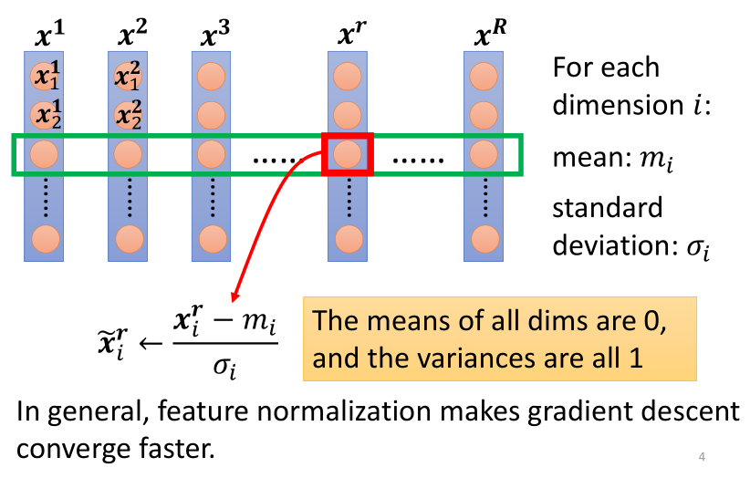

那我们把不同 feature vector，同一个 dimension 里面的数值，把它取出来，然后去计算某一个 dimension 的 mean。

那我们现在计算的是第 i 个 dimension，而它的 mean 就是 $m_i$。

我们计算第 i 个 dimension 的，standard deviation，我们用 $\sigma_{i}$ 来表示它。

那接下来我们就可以做一种 normalization，那这种 normalization 呢，其实叫做标准化，其实叫 standardization，不过我们这边呢，就等一下都统称 normalization 就好了。

那我们怎么做 normalization？我们就是把这个 x ，把这边的某一个数值减掉 mean，除掉 standard deviation，得到新的数值叫做 $ \tilde x$。

得到新的数值以后，再把新的数值塞回去。

我们用这个 tilde ，来代表有被 normalize 后的数值。

做完 normalize 以后，这个 dimension 上面的数值就会平均是 0，然后它的 variance 就会是 1，所以这一排数值，它的分布就都会在 0 上下。

那你对每一个 dimension，每一个 dimension，都做一样的 normalization，把他们变成 mean 接近 0，variance 是 1，那你就会发现说所有的数值，所有 feature 不同 dimension 的数值，都在 0 上下，那你可能就可以制造一个，比较好的 error surface。

所以像这样子 Feature Normalization 的方式，往往对你的 training 有帮助，它可以让你在做 gradient descent 的时候，这个 gradient descent，它的 Loss 收敛更快一点，可以让你的 gradient descent，它的训练更顺利一点。这个是 Feature Normalization。

#### Considering Deep Learning

当然 Deep Learning 可以做 Feature Normalization，得到 $\tilde x$以后，把 $\tilde x_1$通过第一个 layer 得到 $z_1$，那你有可能通过 activation function，不管是选 Sigmoid 或者 ReLU 都可以。然后再得到 $a_1$，然后再通过下一层等等，那就看你有几层 network 你就做多少的运算。所以每一个 x 都做类似的事情。

但是如果我们进一步来想的话，对 $w_2$ 来说，这边的 $a_1$ $a_3$ 这边的 $z_1$ $z_3$，其实也是另外一种 input，如果这边 $\tilde x$，虽然它已经做 normalize 了，但是通过 $w_1$ 以后它就没有做 normalize，如果 $\tilde x$ 通过 $w_1$ 得到是 $z_1$，而 $z_1$ 不同的 dimension 间，它的数值的分布仍然有很大的差异的话，那我们要 train $w_2$ 第二层的参数，会不会也有困难呢？所以这样想起来，我们也应该要对这边的 a 或对这边的 z，做 Feature Normalization。对 $w_2$ 来说，这边的 a 或这边的 z 其实也是一种 feature，我们应该要对这些 feature 也做 normalization。

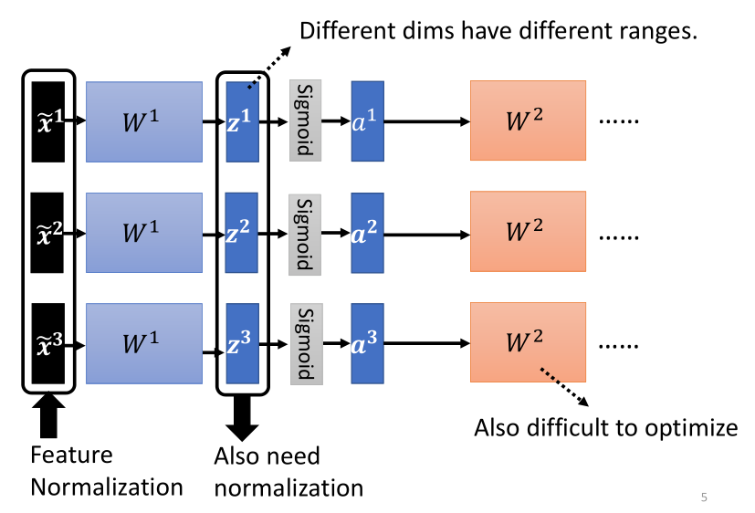

但这边有人就会问一个问题，应该要在 activation function 之前，做 normalization，还是要在 activation function 之后，做 normalization 呢？

在实作上这两件事情其实差异不大，所以你对 z 做 Feature Normalization，或对 a 做 Feature Normalization，其实都可以。

那如果你选择的是 Sigmoid，那可能比较推荐对 z 做 Feature Normalization，因为 Sigmoid 是一个 s 的形状，那它在 0 附近斜率比较大，所以如果你对 z 做 Feature Normalization，把所有的值都挪到 0 附近，那你到时候算 gradient 的时候，算出来的值会比较大。

那不过因为你不见得是跟 sigmoid ，所以你也不一定要把 Feature Normalization 放在 z 这个地方，如果是选别的，也许你选 a 也会有好的结果，也说不定。In general 而言，这个 normalization，要放在 activation function 之前，或之后都是可以的，在实作上，可能没有太大的差别。

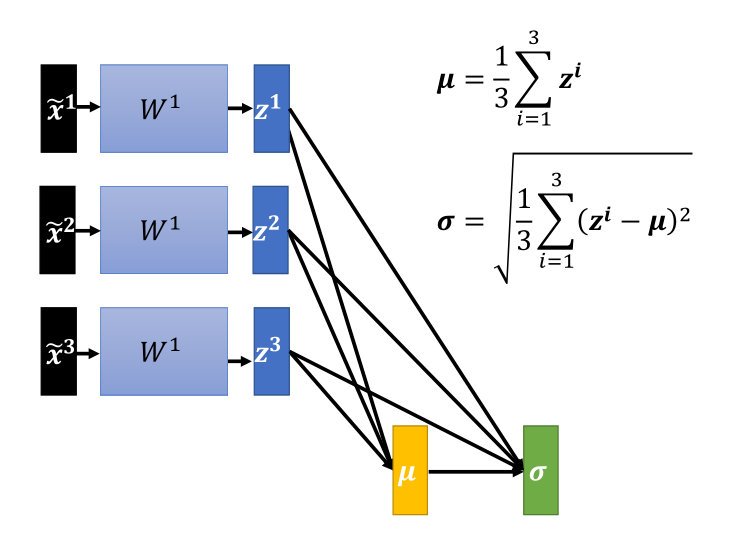

那我们这边就是对 z ，做一下 Feature Normalization。那怎么对 z 做 Feature Normalization 呢？那你就把 z，想成是另外一种 feature 

我们这边有 $z_1$ $z_2$ $z_3$，我们就把 $z_1$ $z_2$ $z_3$ 拿出来，算一下它的 mean，standard deviation。

这个 notation 有点 abuse ，这边的平方就是指，对每一个 element 都去做平方，然后再开根号，这边开根号指的是对每一个 element，向量里面的每一个 element，都去做开根号，得到 $\sigma$。

就把这三个 vector，里面的每一个 dimension，都去把它的 μ 算出来，把它的 $\sigma$ 算出来。从 $z_1$ $z_2$ $z_3$，算出 μ，算出 $\sigma$。接下来呢，你就把这边的每一个 z ，都去减掉 μ 除以 $\sigma$，你把 $z_i$ 减掉 μ，除以 $\sigma$，就得到$\tilde z_i$。

那这边的 μ 跟 $\sigma$，它都是向量，所以这边这个除，它的 notation 有点 abuse。这边的除的意思是说，element wise 的相除，就是 $z_i$ 减 μ，它是一个向量，所以分子的地方是一个向量，分母的地方也是一个向量，把这个两个向量，它们对应的 element 的值相除，是我这边这个除号的意思。这边得到 $\tilde z$ 。

所以我们就是把 $z_i$ 减 μ 除以 $\sigma$，做 Feature Normalization得到 $\tilde z_i$。

那接下来通过 activation function，得到其他 vector，然后再通过，再去通过其他 layer 等等，这样就可以了。这样你就等于对 $z_1$ $z_2$ $z_3$，做了 Feature Normalization，变成 $\tilde z_i$。

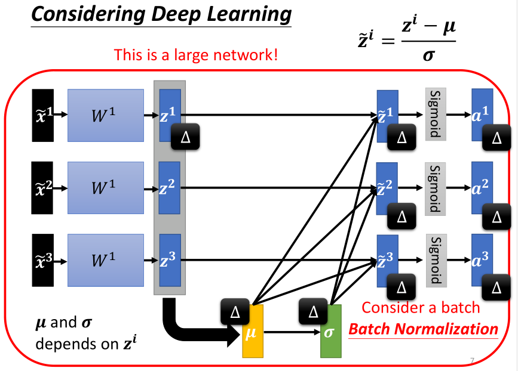

在这边有一件有趣的事情，这件事情是这样子的。这边的 μ 跟 $\sigma$，它们其实都是根据 $z_1$ $z_2$ $z_3$ 算出来的，所以这边 $z_1$ ，它本来，如果我们没有做 Feature Normalization 的时候，你改变了 $z_1$ 的值，你会改变这边 a 的值，但是现在，当你改变 $z_1$ 的值的时候，μ 跟 $\sigma$ 也会跟着改变，μ 跟 $\sigma$ 改变以后，$z_2$ 的值 $a_2$ 的值，$z_3$ 的值 $a_3$ 的值，也会跟着改变。所以之前，我们每一个 $  \tilde x_1$  $\tilde  x_2$ $\tilde x_3$ ，它是独立分开处理的，但是我们在做 Feature Normalization 以后，这三个 example，它们变得彼此关联了，我们这边 $z_1$ 只要有改变，接下来 $z_2,a_2,z_3,a_3$，也都会跟着改变。

所以当你有做 Feature Normalization 的时候，你要把这一整个 process，就是有收集一堆 feature，把这堆 feature 算出 μ 跟 $\sigma$ 这件事情，当做是 network 的一部分。

也就是说，你现在有一个比较大的 network，你之前的 network，都只吃一个 input，得到一个 output，现在你有一个比较大的 network，这个大的 network，它是吃一堆 input，用这堆 input 在这个 network 里面，要算出 μ 跟$\sigma$ ，然后接下来产生一堆 output。

那这一段只可会意不可言传这样子，不知道你听不听得懂这一段的意思。就是现在不是一个 network 处理一个 example，而是有一个巨大的 network，它处理一把 example，用这把 example，还要算个 μ 跟 $σ$，得到一把 output。

那这边就会有一个问题了，因为你的训练资料里面，你的 data 非常多，现在一个 data set，benchmark corpus 都上百万笔资料，你哪有办法一次把上百万笔资料，丢到一个 network 里面。那你那个 GPU 的 memory，根本没有办法，把它整个 data set 的 data 都 load 进去。

### Batch normalization

所以怎么办？在实作的时候，你不会让这一个 network 考虑，整个 training data 里面的所有 example。你只会考虑一个 batch 里面的 example。

举例来说，你 batch 设 64，那你这个巨大的 network，就是把 64 笔 data 读进去，算这 64 笔 data 的 μ，算这 64 笔 data 的 $σ$，对这 64 笔 data 都去做 normalization。

因为我们在实作的时候，我们只对一个 batch 里面的 data，做 normalization，所以这招叫做 **Batch Normalization**。

这个就是你常常听到的，Batch Normalization。

那这个 Batch Normalization，显然有一个问题 就是，你一定要有一个够大的 batch，你才算得出 μ 跟 σ。

假设你今天，你 batch size 设 1，那你就没有什么 μ 或 σ 可以算，你就会有问题，所以这个 Batch Normalization，是适用于 batch size 比较大的时候。

因为 batch size 如果比较大，也许这个 batch size 里面的 data，就足以表示，整个 corpus 的分布，那这个时候你就可以，把这个本来要对整个 corpus，做 Feature Normalization 这件事情，改成只在一个 batch 做 Feature Normalization 作为 approximation。

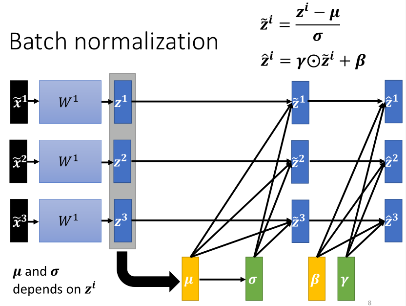

那在做 Batch Normalization 的时候，往往还会有这样的设计，你算出这个 $ \tilde z$ 以后，接下来你会把这个 $ \tilde z$，再乘上另外一个向量，叫做 γ，这个 γ 也是一个向量，所以你就是把 $ \tilde z$ 跟 γ 做 element wise 的相乘，再加上 β 这个向量，得到 $\hat z$ ，而 β 跟 γ，你要把它想成是 network 的参数，它是另外再被learn出来的。

那为什么要加上 β 跟 γ 呢？那是因为有人可能会觉得说，如果我们做 normalization 以后，那这边的 $ \tilde z$，它的平均呢，就一定是 0，今天如果平均是 0 的话，就是给那 network 一些限制，那也许这个限制会带来什么负面的影响，所以我们把 β 跟 γ 加回去，然后让 network 呢，现在它的 hidden layer 的 output 呢，不需要平均是 0。如果它想要平均不是 0 的话，它就自己去learn这个 β 跟 γ，来调整一下输出的分布，来调整这个 $\hat z$ 的分布。

但讲到这边又会有人问说，刚才不是说做 Batch Normalization 就是，为了要让每一个不同的 dimension，它的 range 都是一样，我们才做这个 normalization 吗，现在如果加去乘上 γ，再加上 β，把 γ 跟 β 加进去，这样不会不同 dimension 的分布，它的 range 又都不一样了吗？

有可能，但是你实际上在训练的时候，你会把这个 γ 的初始值就都设为 1

所以 γ 是一个里面的值，一开始其实是一个里面的值，全部都是 1 的向量，那 β 是一个里面的值，全部都是 0 的向量。

所以让你的 network 在一开始训练的时候，每一个 dimension 的分布，是比较接近的。

也许训练到后来，你已经训练够长的一段时间，已经找到一个比较好的 error surface，走到一个比较好的地方以后，那再把 γ 跟 β 慢慢地加进去。所以加 Batch Normalization，往往对你的训练是有帮助的。

#### Testing

那接下来就要讲 testing 的部分了，刚才讲的都是 training 的部分，还没有讲到 testing 的部分 testing ，有时候又叫 inference ，所以有人在文件上看到有人说做个 inference，inference 指的就是 testing。

这个 Batch Normalization 在 inference，或是 testing 的时候呢，会有问题，会有什么样的问题呢？

假设你真的有系统上线，你是一个真正的在线的 application，你可以说，比如说你的 batch size 设 64，我一定要等 64 笔数据都进来，我才一次做运算吗？这显然是不行的。如果你是一个在线的服务，一笔资料进来，你就要每次都做运算，你不能等说，我累积了一个 batch 的资料，才开始做运算。

但是在做 Batch Normalization 的时候，我们今天，一个$\tilde x$，一个 normalization 过的 feature 进来，然后你有一个 z，要减掉 μ 跟除 σ，那这个 μ 跟 σ，是用一个 batch 的资料算出来的。但如果今天在 testing 的时候，根本就没有 batch，那我们要怎么算这个 μ，跟怎么算这个 σ 呢？

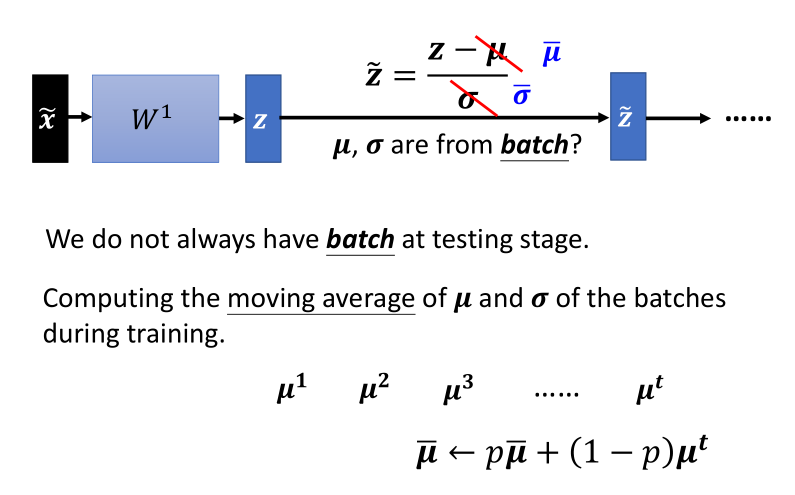

这个实作上的解法是这个样子的，如果你看那个 PyTorch 的话呢，Batch Normalization 在 testing 的时候，你并不需要做什么特别的处理，PyTorch 帮你处理好了。

PyTorch 是怎么处理这件事的呢？如果你有在做 Batch Normalization 的话，在 training 的时候，你每一个 batch 计算出来的 μ 跟 σ，他都会拿出来算 moving average，什么意思呢，你每一次取一个 batch 出来的时候，你就会算一个 $μ^1$，取第二个 batch 出来的时候，你就算个 $μ^2$，一直到取第 t 个 batch 出来的时候，你就算一个 $μ^t$，接下来你会算一个 moving average，也就是呢，你会把你现在算出来的 μ 的一个平均值，叫做 $\bar μ$ ，乘上某一个 factor，那这也是一个常数，是一个 constant，也是一个 hyper parameter，也是需要调的那种。在 PyTorch 里面，我记得 p 就设 0.1，然后加上 1 减 p，乘上 $μ^t$，然后来更新你的 μ 的平均值。

最后在 testing 的时候，你就不用算 batch 里面的 μ 跟 σ 了，因为 testing 的时候，在真正 application 上，也没有 batch 这个东西，你就直接拿就是 μ 跟 σ 在训练的时候，得到的 moving average，$\bar μ$  跟 $\bar σ$ ，来取代这边的 μ 跟 σ，这个就是 Batch Normalization，在 testing 的时候的运作方式。

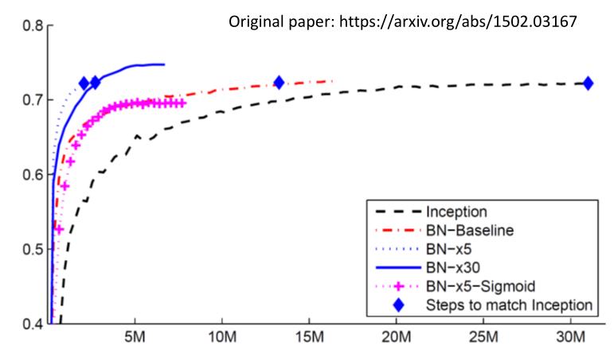

那这个是从 Batch Normalization，原始的文献上面截出来的一个实验结果，那在原始的文献上还讲了很多其他的东西。

举例来说，我们今天还没有讲的是，Batch Normalization 用在 CNN 上，要怎么用呢？那你自己去读一下原始的文献，里面会告诉你说，Batch Normalization 如果用在 CNN 上，应该要长什么样子。

那这个是原始文献上面截出来的一个数据，这个横轴，代表的是训练的过程，纵轴代表的是 validation set 上面的 accuracy，那这个黑色的虚线是没有做 Batch Normalization 的结果，它用的是 inception 的 network，就是某一种 network 架构，也是以 CNN 为基础的 network 架构。

总之黑色的这个虚线，它代表没有做 Batch Normalization 的结果，如果有做 Batch Normalization，你会得到红色的这一条虚线，你会发现说，红色这一条虚线，它训练的速度，显然比黑色的虚线还要快很多，虽然最后收敛的结果，你只要给它足够的训练的时间，可能都跑到差不多的 accuracy，但是红色这一条虚线，可以在比较短的时间内，就跑到一样的 accuracy。那这边这个蓝色的菱形，代表说这几个点的那个 accuracy 是一样的。红色的相较于没有做 Batch Normalization只需要一半或甚至更少的时间，就跑到同样的正确率了。

粉红色的线是 sigmoid function，我们一般都会选择 ReLU，而不是用 sigmoid function，因为 sigmoid function，它的 training 是比较困难的。

但是这边想要强调的点是说，就算是 sigmoid 比较难搞的，加 Batch Normalization 还是 train 的起来。作者说sigmoid 不加 Batch Normalization，根本连 train 都 train 不起来。

蓝色的实线跟这个蓝色的虚线，是把 learning rate 设比较大一点，×5 就是 learning rate 变原来的 5 倍，×30 就是 learning rate 变原来的 30 倍。那因为如果你做 Batch Normalization 的话，那你的 error surface ，会比较平滑 比较容易训练。所以你就可以把你的 learning rate 呢，设大一点。

那这边有个不好解释的奇怪的地方，就是不知道为什么，learning rate 设 30 倍的时候，是比 5 倍差。作者也没有解释，做 deep learning 就是有时候会产生这种怪怪的，不知道怎么解释的现象就是了，不过作者就是照实，把他做出来的实验结果，呈现在这个图上面。

### Internal Covariate Shift?

接下来的问题就是，Batch Normalization，它为什么会有帮助呢？在原始的 Batch Normalization 那篇 paper 里面，他提出来一个概念，叫做 internal 的 covariate shift。

covariate shift 这个词汇是原来就有的，internal covariate shift，我认为是 Batch Normalization 的作者自己发明的，他认为今天在 train network 的时候，会有以下这个问题。

这个问题是这样，network 有很多层，x 通过第一层以后 得到 a，a 通过第二层以后 得到 b，那我们今天计算出 gradient 以后，把 A update 成 A′，把 B 这一层的参数 update 成 B′。

但是作者认为，现在我们在把 B update 到 B′ 的时候，那我们在计算 B，update 到 B′ 的 gradient 的时候，这个时候前一层的参数是 A ，或者是前一层的 output 是小 a ，那当前一层从 A 变成 A′ 的时候，它的 output 就从小 a 变成小 a′ ，但是我们计算这个 gradient 的时候，我们是根据这个 a 算出来的，所以这个 update 的方向，也许它适合用在 a 上，但不适合用在 a′ 上面。

那如果说 Batch Normalization 的话，因为我们每次都有做 normalization，我们就会让 a 跟 a′ 呢，它的分布比较接近，也许这样就会对训练有帮助。

但是有一篇 paper 叫 How Does Batch Normalization Help Optimization，就打脸了internal covariate shift 的这一个观点，这篇 paper 从各式各样的方向来告诉你说 internal covariate shift 首先它不一定是 training network 时候的一个问题，然后 Batch Normalization，它会比较好，可能不见得是因为它解决了 internal covariate shift。

那在这篇 paper 里面，他做了很多很多的实验，比如说他比较了训练的时候，这个 a 的分布的变化发现，不管有没有做 Batch Normalization，它的变化都不大。然后他又说就算是变化很大，对 training 也没有太大的伤害。然后他又说，不管你是根据 a 算出来的 gradient，还是根据 a′ 算出来的 gradient，方向居然都差不多。

所以他告诉你说，internal covariate shift，可能不是 training network 的时候，最主要的问题。它可能也不是 Batch Normalization 会好的一个的关键，那有关更多的实验，你就自己参见这篇文章。

为什么 Batch Normalization 会比较好呢？那在这篇 How Does Batch Normalization，Help Optimization 这篇论文里面，他从实验上，也从理论上，至少支持了 Batch Normalization，可以改变 error surface，让 error surface 比较不崎岖这个观点。所以这个观点是有理论的支持，也有实验的左证的。

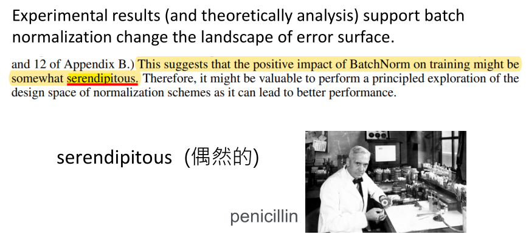

这篇文章里面，作者说，如果我们要让 network，这个 error surface 变得比较不崎岖，其实不见得要做 Batch Normalization，感觉有很多其他的方法都可以让 error surface 变得不崎岖，那他就试了一些其他的方法，发现说跟 Batch Normalization performance 也差不多，甚至还稍微好一点。

所以他就讲了下面这句感叹，他觉得 positive impact of batchnorm on training might be somewhat serendipitous

什么是 serendipitous 呢？这个字眼可能可以翻译成偶然的，但偶然并没有完全表达这个词汇的意思，这个词汇的意思是说，你发现了一个什么意料之外的东西。举例来说，青霉素就是意料之外的发现，有一个人叫做弗莱明，然后他本来想要那个，培养一些葡萄球菌，然后但是因为他实验没有做好，他的那个葡萄球菌被感染了，有一些霉菌掉到他的培养皿里面，然后发现那些培养皿，那些霉菌呢，会杀死葡萄球菌，所以他就发现了青霉素，所以这是一种偶然的发现。

那这篇文章的作者也觉得，Batch Normalization 也像是盘尼西林一样，是一种偶然的发现，但无论如何，它是一个有用的方法。

### To learn more ……

那其实 Batch Normalization，不是唯一的 normalization，normalization 的方法有一把，那这边就是列了几个比较知名的参考。

- Batch Renormalization
  - https://arxiv.org/abs/1702.03275
- Layer Normalization
  - https://arxiv.org/abs/1607.06450
- Instance Normalization
  - https://arxiv.org/abs/1607.08022
- Group Normalization
  - https://arxiv.org/abs/1803.08494
- Weight Normalization
  - https://arxiv.org/abs/1602.07868
- Spectrum Normalization
  - https://arxiv.org/abs/1705.10941