# Deep Learning

## Deep Learning

### Ups and downs of Deep Learning

* 1958: Perceptron (linear model)，感知机的提出
  * 和Logistic Regression类似，只是少了sigmoid的部分
* 1969: Perceptron has limitation，from MIT
* 1980s: Multi-layer Perceptron，多层感知机
  * Do not have significant difference from DNN today
* 1986: Backpropagation，反向传播
  * Hinton propose的Backpropagation
  * 存在problem：通常超过3个layer的neural network，就train不出好的结果
* 1989: 1 hidden layer is “good enough”，why deep？
  * 有人提出一个理论：只要neural network有一个hidden layer，它就可以model出任何的function，所以根本没有必要叠加很多个hidden layer，所以Multi-layer Perceptron的方法又坏掉了，这段时间Multi-layer Perceptron这个东西是受到抵制的
* 2006: RBM initialization(breakthrough)，Restricted Boltzmann Machine
  * Deep learning = another Multi-layer Perceptron ？在当时看来，它们的不同之处在于在做gradient descent的时候选取初始值的方法如果是用RBM，那就是Deep learning；如果没有用RBM，就是传统的Multi-layer Perceptron
  * 那实际上，RBM用的不是neural network base的方法，而是graphical model，后来大家试验得多了发现RBM并没有什么太大的帮助，因此现在基本上没有人使用RBM做initialization了
  * RBM最大的贡献是，它让大家重新对Deep Learning这个model有了兴趣（石头汤）
* 2009: GPU加速的发现
* 2011: start to be popular in speech recognition，语音识别领域
* 2012: win ILSVRC image competition，Deep learning开始在图像领域流行

实际上，Deep learning跟machine learning一样，也是“大象放进冰箱”三个步骤

Step 1: define a set of function

Step 2: goodness of function

Step 3: pick the best function

### Neural Network

#### Concept

把多个Logistic Regression前后connect在一起，然后把一个Logistic Regression称之为neuron，整个称之为neural network

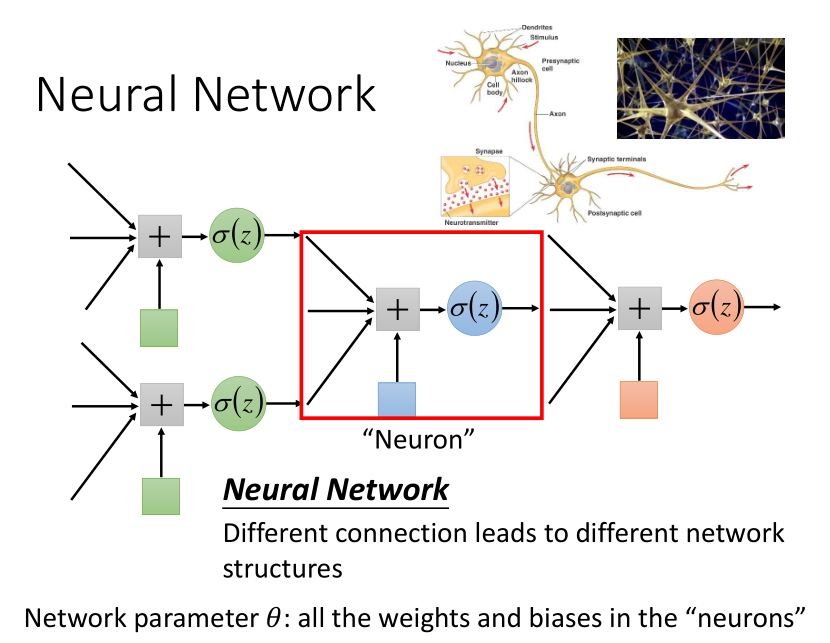

我们可以用不同的方法连接这些neuron，就可以得到不同的structure，neural network里的每一个Logistic Regression都有自己的weight和bias，这些weight和bias集合起来，就是这个network的parameter，我们用$\theta$来描述

#### Fully Connect Feedforward Network

那该怎么把它们连接起来呢？这是需要你手动去设计的，最常见的连接方式叫做Fully Connect Feedforward Network（全连接前馈网络）

如果一个neural network里面的参数weight和bias已知的话，它就是一个function，它的input是一个vector，output是另一个vector，这个vector里面放的是样本点的feature，vector的dimension就是feature的个数

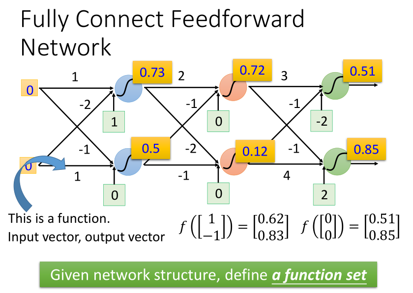

如果我们还不知道参数，只是定出了这个network的structure，只是决定好这些neuron该怎么连接在一起，这样的一个network structure其实是define了一个function set(model)，我们给这个network设不同的参数，它就变成了不同的function，把这些可能的function集合起来，就是function set

只不过我们用neural network决定function set的时候，这个function set是比较大的，它包含了很多Logistic Regression、Linear Regression没有办法包含的function

下图中，每一排表示一个layer，每个layer里面的每一个球都代表一个neuron。因为layer和layer之间，所有的neuron都是两两连接，所以它叫**Fully connected**的network；因为现在传递的方向是从layer 1->2->3，由后往前传，所以它叫做**Feedforward network**

* layer和layer之间neuron是两两互相连接的，layer 1的neuron output会连接给layer 2的每一个neuron作为input
* 对整个neural network来说，它需要一个input，这个input就是一个feature的vector，而对layer 1的每一个neuron来说，它的input就是input layer的每一个dimension
* 最后那个layer L，由于它后面没有接其它东西了，所以它的output就是整个network的output
* 这里每一个layer都是有名字的
  * input的地方，叫做**input layer**，输入层(严格来说input layer其实不是一个layer，它跟其他layer不一样，不是由neuron所组成的)
  * output的地方，叫做**output layer**，输出层
  * 其余的地方，叫做**hidden layer**，隐藏层
* 每一个neuron里面的sigmoid function，在Deep Learning中被称为**activation function**，事实上它不见得一定是sigmoid function，还可以是其他function（sigmoid function是从Logistic Regression迁移过来的，现在已经较少在Deep learning里使用了）
* 有很多层layers的neural network，被称为**DNN(Deep Neural Network)**

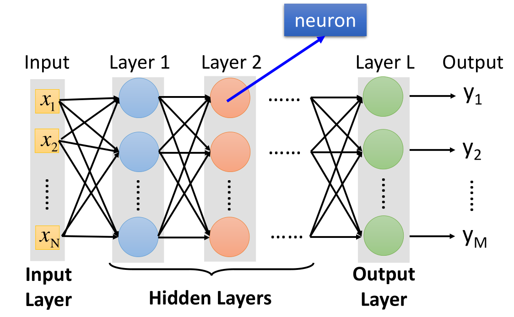

那所谓的deep，是什么意思呢？有很多层hidden layer，就叫做deep，具体的层数并没有规定，现在只要是neural network base的方法，都被称为Deep Learning。

使用了152个hidden layers的Residual Net(2015)，不是使用一般的Fully Connected Feedforward Network，它需要设计特殊的special structure才能训练这么深的network

#### Matrix Operation

network的运作过程，我们通常会用Matrix Operation来表示，以下图为例，假设第一层hidden layers的两个neuron，它们的weight分别是$w_1=1,w_2=-2,w_1'=-1,w_2'=1$，那就可以把它们排成一个matrix：$\begin{bmatrix}1 \ \ \ -2\\ -1 \ \ \ 1 \end{bmatrix}$，而我们的input又是一个2\*1的vector：$\begin{bmatrix}1\\-1 \end{bmatrix}$，将w和x相乘，再加上bias的vector：$\begin{bmatrix}1\\0 \end{bmatrix}$，就可以得到这一层的vector z，再经过activation function得到这一层的output

这里还是用Logistic Regression迁移过来的sigmoid function作为运算
$$
\sigma(\begin{bmatrix}1 \ \ \ -2\\ -1 \ \ \ 1 \end{bmatrix} \begin{bmatrix}1\\-1 \end{bmatrix}+\begin{bmatrix}1\\0 \end{bmatrix})=\sigma(\begin{bmatrix}4\\-2 \end{bmatrix})=\begin{bmatrix}0.98\\0.12 \end{bmatrix}
$$

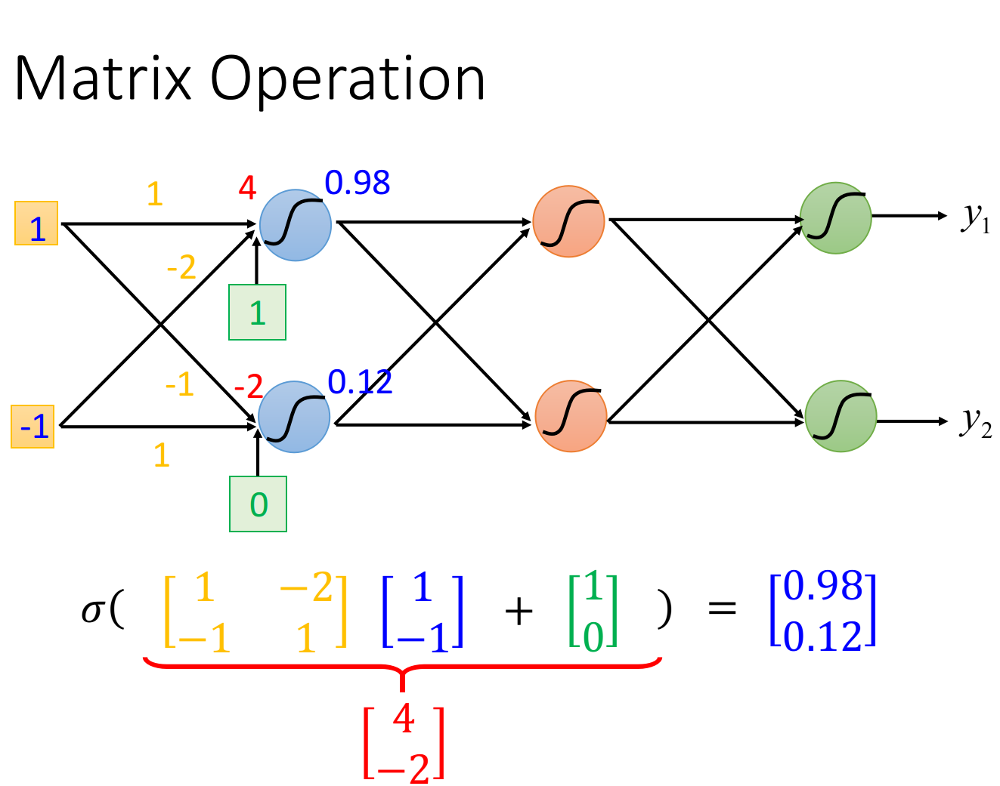

这里我们把所有的变量都以matrix的形式表示出来，注意$W^i$的matrix，每一行对应的是一个neuron的weight，行数就是neuron的个数，列数就是feature的数量

input x，bias b和output y都是一个列向量，行数是feature的个数，也是neuron的个数

neuron的本质就是把feature transform到另一个space

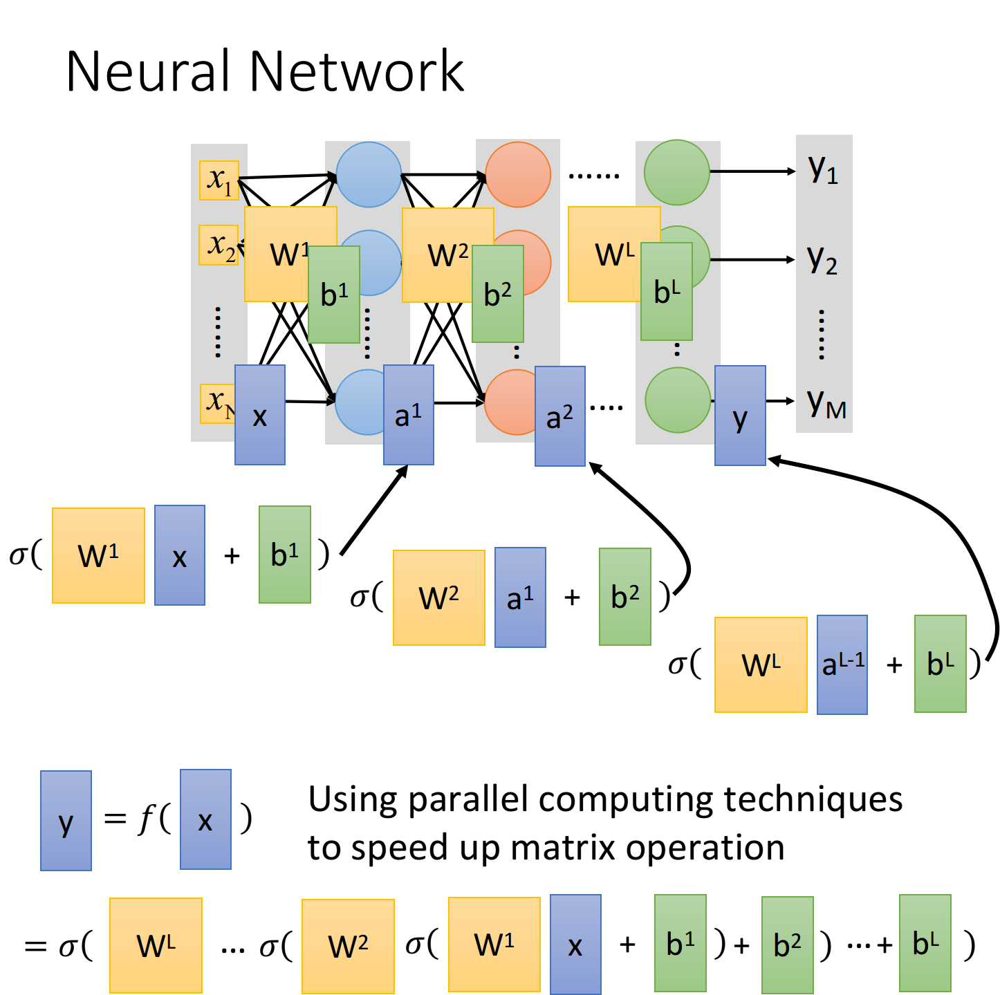

把这件事情写成矩阵运算的好处是，可以用GPU加速，GPU对matrix的运算是比CPU要来的快的，所以我们写neural network的时候，习惯把它写成matrix operation，然后call GPU来加速它

#### Output Layer

我们可以把hidden layers这部分，看做是一个feature extractor，这个feature extractor就replace了我们之前手动做feature engineering，feature transformation这些事情，经过这个feature extractor得到的output，$x_1,x_2,...,x_k$就可以被当作一组新的feature

output layer做的事情，其实就是一个Multi-class classifier，它是拿经过feature extractor转换后的那一组比较好的feature（能够被很好地separate）进行分类的，由于我们把output layer看做是一个Multi-class classifier，所以我们会在最后一个layer加上softmax

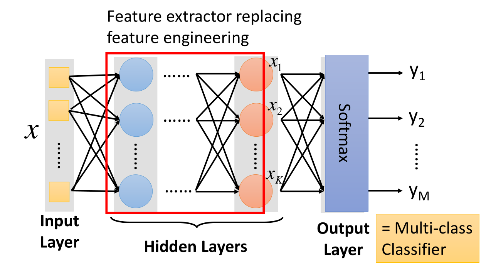

### Example Application

#### Handwriting Digit Recognition

#### Step 1: Neural Network

这里举一个手写数字识别的例子，input是一张image，对机器来说一张image实际上就是一个vector，假设这是一张16\*16的image，那它有256个pixel，对machine来说，它是一个256维的vector，image中的每一个都对应到vector中的一个dimension，简单来说，我们把黑色的pixel的值设为1，白色的pixel的值设为0

而neural network的output，如果在output layer使用了softmax，那它的output就是一个突出极大值的Probability distribution，假设我们的output是10维的话（10个数字，0~9），这个output的每一维都对应到它可能是某一个数字的机率，实际上这个neural network的作用就是计算image成为10个数字的机率各自有多少，机率最大（softmax突出极大值的意义所在）的那个数字，就是机器的预测值

在手写字体识别的demo里，我们唯一需要的就是一个function，这个function的input是一个256的vector，output是一个10维的vector，这个function就是neural network（这里我们用简单的Feedforward network）

input固定为256维，output固定为10维的feedforward neural network，实际上这个network structure就已经确定了一个function set(model)的形状，在这个function set里的每一个function都可以拿来做手写数字识别

接下来我们要做的事情是用gradient descent去计算出一组参数，挑一个最适合拿来做手写数字识别的function

所以这里很重要的一件事情是，我们要对network structure进行design，之前在做Logistic Regression或者是Linear Regression的时候，我们对model的structure是没有什么好设计的，但是对neural network来说，我们现在已知的constraint只有input是256维，output是10维，而中间要有几个hidden layer，每个layer要有几个neuron，都是需要我们自己去设计的，它们近乎是决定了function set长什么样子

如果你的network structure设计的很差，这个function set里面根本就没有好的function，那就会像大海捞针一样，结果针并不在海里

input、output的dimension，加上network structure，就可以确定一个model的形状，前两个是容易知道的，而决定这个network的structure则是整个Deep Learning中最为关键的步骤

input 256维，output 10维，以及自己design的network structure 决定了 function set(model)

Q: How many layers? How many neurons for each layer?

- Trial and Error + Intuition，试错和直觉，有时需要domain knowledge；非deep的model，做feature transform，找好的feature；deep learning不需要找好的feature，但是需要design network structure，让machine 自己找好的feature

Q: 有人可能会问，机器能不能自动地学习network的structure？

- 其实是可以的，基因演算法领域是有很多的technique是可以让machine自动地去找出network structure，只不过这些方法目前没有非常普及

Q: 我们可不可以自己去design一个新的network structure，比如说可不可以不要Fully connected layers(全连接层)，自己去DIY不同layers的neuron之间的连接？

- 当然可以，一个特殊的接法就是CNN(Convolutional Neural Network)

~~~mermaid
graph LR
A(input)
A--> |256 dimension|B[network structure]
B--> |10 dimension|C(output)
~~~

#### Step 2: Goodness of function

定义一个function的好坏，由于现在我们做的是一个Multi-class classification，所以image为数字1的label “1”告诉我们，现在的target是一个10维的vector，只有在第一维对应数字1的地方，它的值是1，其他都是0

input这张image的256个pixel，通过这个neural network之后，会得到一个output，称之为y；而从这张image的label中转化而来的target，称之为$\hat{y}$，有了output $y$和target $\hat{y}$之后，要做的事情是计算它们之间的cross entropy，这个做法跟我们之前做Multi-class classification的时候是一模一样的
$$
Cross \ Entropy :C(y,\hat{y})=-\sum\limits_{i=1}^{10}\hat{y}_i lny_i
$$

#### Step 3: Pick the best function

接下来就去调整参数，让这个cross entropy越小越好，当然整个training data里面不会只有一笔data，你需要把所有data的cross entropy都sum起来，得到一个total loss $L=\sum\limits_{n=1}^NC^n$，得到loss function之后你要做的事情是找一组network的parameters：$\theta^*$，它可以minimize这个total loss，这组parameter 对应的function就是我们最终训练好的model

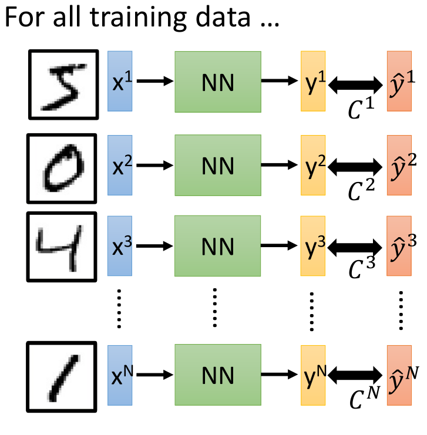

那怎么去找这个使total loss minimize的$\theta^*$呢？使用的方法就是我们的老朋友Gradient Descent

实际上在deep learning里面用gradient descent，跟在linear regression里面使用完全没有什么差别，只是function和parameter变得更复杂了而已，其他事情都是一模一样的

现在你的$\theta$里面是一大堆的weight、bias参数，先random找一个初始值，接下来去计算每一个参数对total loss的偏微分，把这些偏微分全部集合起来，就叫做gradient，有了这些偏微分以后，你就可以更新所有的参数，都减掉learning rate乘上偏微分的值，这个process反复进行下去，最终找到一组好的参数，就做完deep learning的training了

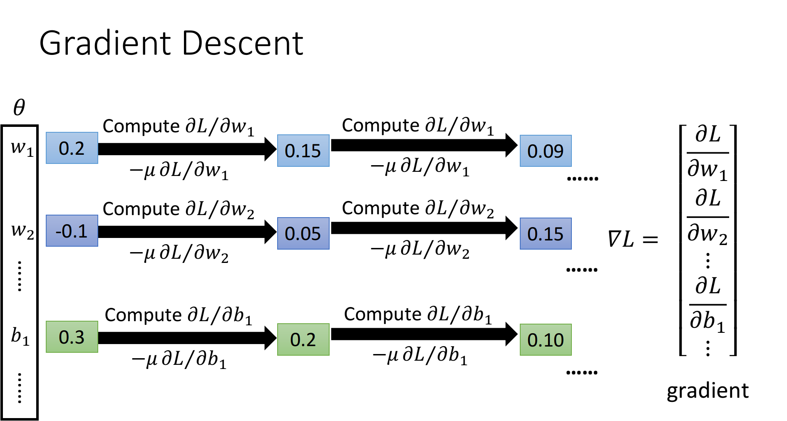

所以，其实deep learning就是这样子了，就算是alpha go，也是用gradient descent train出来的，可能在你的想象中它有多么得高大上，实际上就是在用gradient descent这样朴素的方法

#### Toolkit

你可能会问，这个gradient descent的function式子到底是长什么样子呢？之前我们都是一步一步地把那个算式推导出来的，但是在neural network里面，有成百上千个参数，如果要一步一步地人工推导并求微分的话是比较困难的，甚至是不可行的

其实，在现在这个时代，我们不需要像以前一样自己去implement Backpropagation，因为有太多太多的toolkit可以帮你计算Backpropagation，比如tensorflow、pytorch

注：Backpropagation就是算微分的一个比较有效的方式

#### Why Deep？

最后还有一个问题，为什么我们要deep learning？一个很直觉的答案是，越deep，performance就越好，一般来说，随着deep learning中的layers数量增加，error率不断降低

但是，稍微有一点machine learning常识的人都不会觉得太surprise，因为本来model的parameter越多，它cover的function set就越大，它的bias就越小，如果今天你有足够多的training data去控制它的variance，一个比较复杂、参数比较多的model，它performance比较好，是很正常的

那变deep有什么特别了不起的地方？

甚至有一个Universality Theorem是这样说的，任何连续的function，它input是一个N维的vector，output是一个M维的vector，它都可以用一个hidden layer的neural network来表示，只要你这个hidden layer的neuron够多，它可以表示成任何的function，既然一个hidden layer的neural network可以表示成任何的function，而我们在做machine learning的时候，需要的东西就只是一个function而已，那做deep有什么特殊的意义呢？

所以有人说，deep learning就只是一个噱头而已，因为做deep感觉比较潮

如果你只是增加neuron把它变宽，变成fat neural network，那就感觉太“虚弱”了，所以我们要做deep learning，给它增加layers而不是增加neuron。

真的是这样吗？Why “Deep” neural network not “Fat” neural network? 

后面会解释这件事情

#### Design network structure V.s. Feature Engineering

其实network structure的design是一件蛮难的事情，我们到底要怎么决定layer的数目和每一个layer的neuron的数目呢？

这个只能够凭着经验和直觉、多方面的尝试，有时候甚至会需要一些domain knowledge（专业领域的知识），从非deep learning的方法到deep learning的方法，并不是说machine learning比较简单，而是我们把一个问题转化成了另一个问题

本来不是deep learning的model，要得到一个好的结果，往往需要做feature engineering，也就是做feature transform，然后找一组好的feature

一开始学习deep learning的时候，好像会觉得deep learning的layers之间也是在做feature transform，但实际上在做deep learning的时候，往往不需要一个好的feature ，比如说在做影像辨识的时候，你可以把所有的pixel直接丢进去

在过去做图像识别，你是需要对图像抽取出一些人定的feature出来的，这件事情就是feature transform，但是有了deep learning之后，你完全可以直接丢pixel进去硬做

但是，今天deep learning制造了一个新的问题，它所制造的问题就是，你需要去design network的structure，所以你的问题从本来的如何抽取feature转化成怎么design network structure，所以deep learning是不是真的好用，取决于你觉得哪一个问题比较容易

如果是影像辨识或者是语音辨识的话，design network structure可能比feature engineering要来的容易，因为，虽然我们人都会看、会听，但是这件事情，它太过潜意识了，它离我们意识的层次太远，我们无法意识到，我们到底是怎么做语音辨识这件事情，所以对人来说，你要抽一组好的feature，让机器可以很方便地用linear的方法做语音辨识，其实是很难的，因为人根本就不知道好的feature到底长什么样子；所以还不如design一个network structure，或者是尝试各种network structure，让machine自己去找出好的feature，这件事情反而变得比较容易，对影像来说也是一样的

有这么一个说法：deep learning在NLP上面的performance并没有那么好。语音辨识和影像辨识这两个领域是最早开始用deep learning的，一用下去进步量就非常地惊人，比如错误率一下子就降低了20%这样，但是在NLP上，它的进步量似乎并没有那么惊人，甚至有很多做NLP的人，现在认为说deep learning不见得那么work，这个原因可能是，人在做NLP这件事情的时候，由于人在文字处理上是比较强的，比如叫你设计一个rule去detect一篇document是正面的情绪还是负面的情绪，你完全可以列表，列出一些正面情绪和负面情绪的词汇，然后看这个document里面正面情绪的词汇出现的百分比是多少，你可能就可以得到一个不错的结果。所以NLP这个task，对人来说是比较容易设计rule的，你设计的那些ad-hoc（特别的）的rule，往往可以得到一个还不错的结果，这就是为什么deep learning相较于NLP传统的方法，觉得没有像其他领域一样进步得那么显著（但还是有一些进步的）

长久而言，可能文字处理中会有一些隐藏的资讯是人自己也不知道的，所以让机器自己去学这件事情，还是可以占到一些优势，眼下它跟传统方法的差异看起来并没有那么的惊人，但还是有进步的

## Backpropagation

Backpropagation(反向传播)，就是告诉我们用gradient descent来train一个neural network的时候该怎么做，它只是求微分的一种方法，而不是一种新的算法

### Gradient Descent

gradient descent的使用方法，跟前面讲到的linear Regression或者是Logistic Regression是一模一样的，唯一的区别就在于当它用在neural network的时候，network parameters $\theta=w_1,w_2,...,b_1,b_2,...$里面可能会有将近million个参数

所以现在最大的困难是，如何有效地把这个近百万维的vector给计算出来，这就是Backpropagation要做的事情，所以Backpropagation并不是一个和gradient descent不同的training的方法，它就是gradient descent，它只是一个比较有效率的算法，让你在计算这个gradient的vector的时候更有效率

### Chain Rule

Backpropagation里面并没有什么高深的数学，你唯一需要记得的就只有Chain Rule（链式法则）
$$
case1: y=g(x) \quad z=h(y)\\
\Delta x \rightarrow \Delta y \rightarrow \Delta z 
\\ \frac{d z}{d x}= \frac{d z}{d y}  \frac{d y}{d x}
 \\case2: x=g(s) \quad y=h(s) \quad z=k(x, y)\\
 \Delta s\rightarrow \Delta x \rightarrow\Delta z  \quad \quad   \Delta s\rightarrow \Delta y \rightarrow\Delta z
 \\
 \frac{d z}{d s}=\frac{\partial z}{\partial x} \frac{d x}{d s}+\frac{\partial z}{\partial y} \frac{d y}{d s}\\
$$

对整个neural network，我们定义了一个loss function：$L(\theta)=\sum\limits_{n=1}^N C^n(\theta)$，它等于所有training data的loss之和

我们把training data里任意一个样本点$x^n$代到neural network里面，它会output一个$y^n$，我们把这个output跟样本点本身的label标注的target $\hat{y}^n$作cross entropy，这个交叉熵定义了output $y^n$和target $\hat{y}^n$之间的距离$C^n(\theta)$，如果cross entropy比较大的话，说明output和target之间距离很远，这个network的parameter的loss是比较大的，反之则说明这组parameter是比较好的。

然后summation over所有training data的cross entropy $C^n(\theta)$，得到total loss $L(\theta)$，这就是我们的loss function，用这个$L(\theta)$对某一个参数w做偏微分，表达式如下：
$$
\frac{\partial L(\theta)}{\partial w}=\sum\limits_{n=1}^N\frac{\partial C^n(\theta)}{\partial w}
$$
这个表达式告诉我们，只需要考虑如何计算对某一笔data的$\frac{\partial C^n(\theta)}{\partial w}$，再将所有training data的cross entropy对参数w的偏微分累计求和，就可以把total loss对某一个参数w的偏微分给计算出来

我们先考虑某一个neuron，假设只有两个input $x_1,x_2$，通过这个neuron，我们先得到$z=b+w_1 x_1+w_2 x_2$，然后经过activation function从这个neuron中output出来，作为后续neuron的input，再经过了非常非常多的事情以后，会得到最终的output $y_1,y_2$

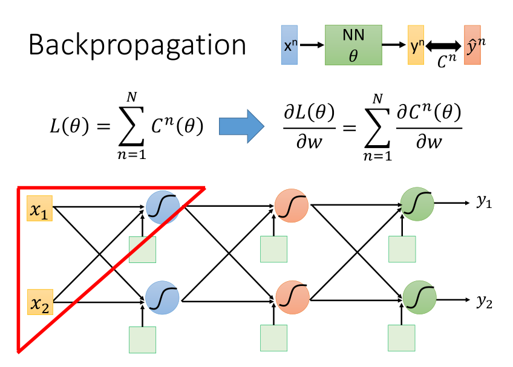

现在的问题是这样：$\frac{\partial C}{\partial w}$该怎么算？按照chain rule，可以把它拆分成两项，$\frac{\partial C}{\partial w}=\frac{\partial z}{\partial w} \frac{\partial C}{\partial z}$，这两项分别去把它计算出来。前面这一项是比较简单的，后面这一项是比较复杂的

计算前面这一项$\frac{\partial z}{\partial w}$的这个process，我们称之为**Forward pass**；而计算后面这项$\frac{\partial C}{\partial z}$的process，我们称之为**Backward pass**

### Forward pass

先考虑$\frac{\partial z}{\partial w}$这一项，完全可以秒算出来，$\frac{\partial z}{\partial w_1}=x_1 ,\ \frac{\partial z}{\partial w_2}=x_2$

它的规律是这样的：求$\frac{\partial z}{\partial w}$，就是看w前面连接的**input**是什么，那微分后的$\frac{\partial z}{\partial w}$值就是什么，因此只要计算出neural network里面每一个neuron的output就可以知道任意的z对w的偏微分

- 比如input layer作为neuron的输入时，$w_1$前面连接的是$x_1$，所以微分值就是$x_1$；$w_2$前面连接的是$x_2$，所以微分值就是$x_2$
- 比如hidden layer作为neuron的输入时，那该neuron的input就是前一层neuron的output，于是$\frac{\partial z}{\partial w}$的值就是前一层的z经过activation function之后输出的值

### Backward pass

再考虑$\frac{\partial C}{\partial z}$这一项，它是比较复杂的，这里我们假设activation function是sigmoid function

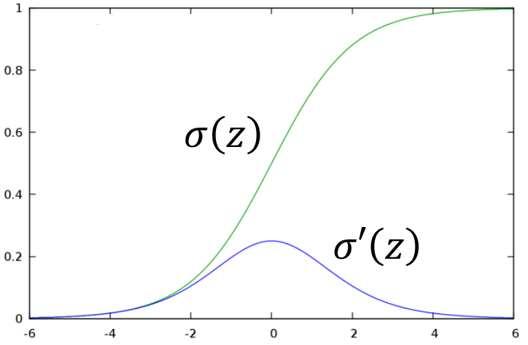

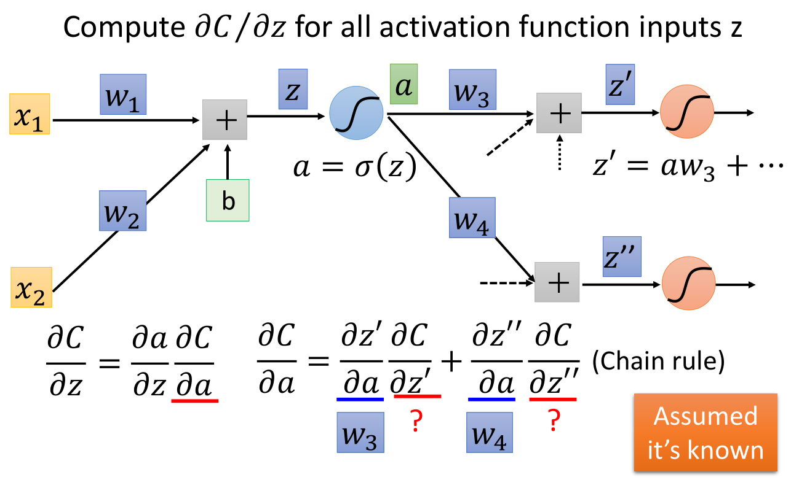

我们的z通过activation function得到a，这个neuron的output是$a=\sigma(z)$，接下来这个a会乘上某一个weight $w_3$，再加上其它一大堆的value得到$z'$，它是下一个neuron activation function的input，然后a又会乘上另一个weight $w_4$，再加上其它一堆value得到$z''$，后面还会发生很多很多其他事情

不过这里我们就只先考虑下一步会发生什么事情：
$$
\frac{\partial C}{\partial z}=\frac{\partial a}{\partial z} \frac{\partial C}{\partial a}
$$
这里的$\frac{\partial a}{\partial z}$实际上就是activation function的微分（在这里就是sigmoid function的微分），接下来的问题是$\frac{\partial C}{\partial a}$应该长什么样子呢？a会影响$z'$和$z''$，而$z'$和$z''$会影响$C$，所以通过chain rule可以得到
$$
\frac{\partial C}{\partial a}=\frac{\partial z'}{\partial a} \frac{\partial C}{\partial z'}+\frac{\partial z''}{\partial a} \frac{\partial C}{\partial z''}
$$
这里的$\frac{\partial z'}{\partial a}=w_3$，$\frac{\partial z''}{\partial a}=w_4$，那$\frac{\partial C}{\partial z'}$和$\frac{\partial C}{\partial z''}$又该怎么算呢？这里先假设我们已经通过某种方法把$\frac{\partial C}{\partial z'}$和$\frac{\partial C}{\partial z''}$这两项给算出来了，然后回过头去就可以把$\frac{\partial C}{\partial z}$给轻易地算出来
$$
\frac{\partial C}{\partial z}=\frac{\partial a}{\partial z} \frac{\partial C}{\partial a}=\sigma'(z)[w_3 \frac{\partial C}{\partial z'}+w_4 \frac{\partial C}{\partial z''}]
$$

这个式子还是蛮简单的，然后，我们可以从另外一个观点来看待这个式子

你可以想象说，现在有另外一个neuron，它不在我们原来的network里面，在下图中它被画成三角形，这个neuron的input就是$\frac{\partial C}{\partial z'}$和$\frac{\partial C}{\partial z''}$，那input $\frac{\partial C}{\partial z'}$就乘上$w_3$，input $\frac{\partial C}{\partial z''}$就乘上$w_4$，它们两个相加再乘上activation function的微分 $\sigma'(z)$，就可以得到output $\frac{\partial C}{\partial z}$

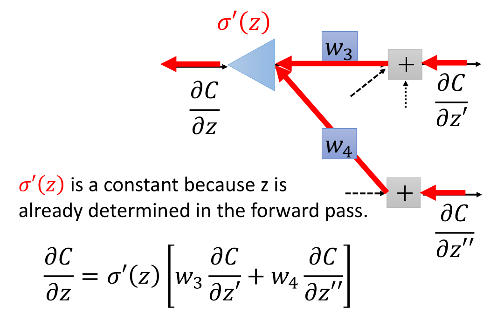

这张图描述了一个新的“neuron”，它的含义跟图下方的表达式是一模一样的，作这张图的目的是为了方便理解

值得注意的是，这里的$\sigma'(z)$是一个constant常数，它并不是一个function，因为z其实在计算forward pass的时候就已经被决定好了，z是一个固定的值

所以这个neuron其实跟我们之前看到的sigmoid function是不一样的，它并不是把input通过一个non-linear进行转换，而是直接把input乘上一个constant $\sigma'(z)$，就得到了output，因此这个neuron被画成三角形，代表它跟我们之前看到的圆形的neuron的运作方式是不一样的，它是直接乘上一个constant（这里的三角形有点像电路里的运算放大器op-amp，它也是乘上一个constant）

现在我们最后需要解决的问题是，怎么计算$\frac{\partial C}{\partial z'}$和$\frac{\partial C}{\partial z''}$这两项，假设有两个不同的case：

#### Case 1: Output Layer

假设蓝色的这个neuron已经是hidden layer的最后一层了，也就是说连接在$z'$和$z''$后的这两个红色的neuron已经是output layer，它的output就已经是整个network的output了，这个时候计算就比较简单
$$
\frac{\partial C}{\partial z'}=\frac{\partial y_1}{\partial z'} \frac{\partial C}{\partial y_1}
$$
其中$\frac{\partial y_1}{\partial z'}$就是output layer的activation function (softmax) 对$z'$的偏微分

而$\frac{\partial C}{\partial y_1}$就是loss对$y_1$的偏微分，它取决于你的loss function是怎么定义的，也就是你的output和target之间是怎么evaluate的，你可以用cross entropy，也可以用mean square error，用不同的定义，$\frac{\partial C}{\partial y_1}$的值就不一样

这个时候，你就已经可以把$C$对$w_1$和$w_2$的偏微分$\frac{\partial C}{\partial w_1}$、$\frac{\partial C}{\partial w_2}$算出来了

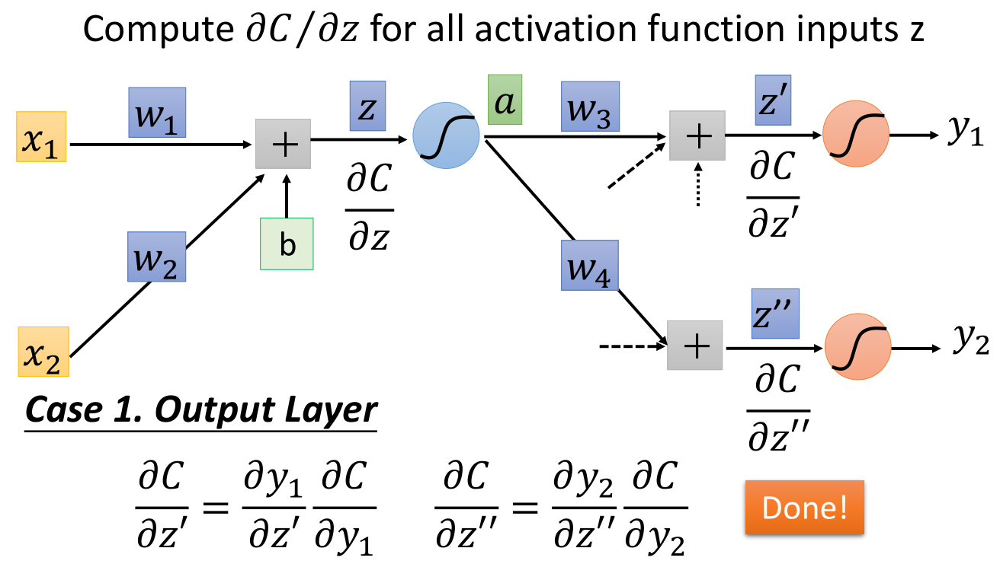

#### Case 2: Not Output Layer

假设现在红色的neuron并不是整个network的output，那$z'$经过红色neuron的activation function得到$a'$，然后output $a'$和$w_5$、$w_6$相乘并加上一堆其他东西分别得到$z_a$和$z_b$，如下图所示

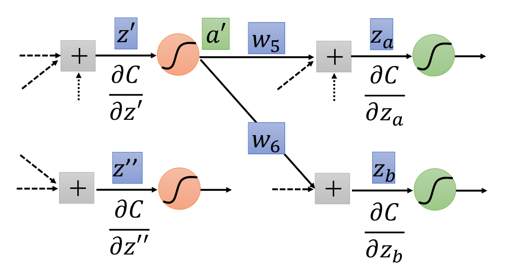

根据之前的推导证明类比，如果知道$\frac{\partial C}{\partial z_a}$和$\frac{\partial C}{\partial z_b}$，我们就可以计算$\frac{\partial C}{\partial z'}$，如下图所示，借助运算放大器的辅助理解，将$\frac{\partial C}{\partial z_a}$乘上$w_5$和$\frac{\partial C}{\partial z_b}$乘上$w_6$的值加起来再通过op-amp，乘上放大系数$\sigma'(z')$，就可以得到output $\frac{\partial C}{\partial z'}$
$$
\frac{\partial C}{\partial z'}=\sigma'(z')[w_5 \frac{\partial C}{\partial z_a} + w_6 \frac{\partial C}{\partial z_b}]
$$

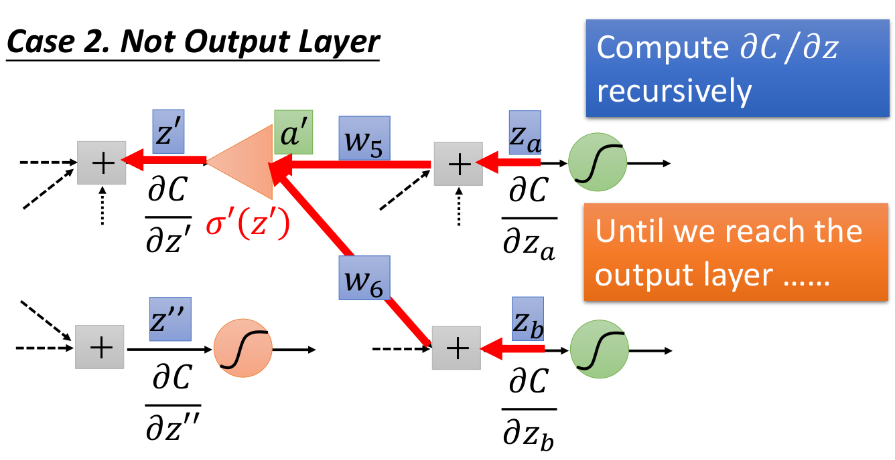

知道$z'$和$z''$就可以知道$z$，知道$z_a$和$z_b$就可以知道$z'$，...... ，现在这个过程就可以反复进行下去，直到找到output layer，我们可以算出确切的值，然后再一层一层反推回去

你可能会想说，这个方法听起来挺让人崩溃的，每次要算一个微分的值，都要一路往后走，一直走到network的output，如果写成表达式的话，一层一层往后展开，感觉会是一个很可怕的式子，但是实际上并不是这个样子做的

你只要换一个方向，从output layer的$\frac{\partial C}{\partial z}$开始算，你就会发现它的运算量跟原来的network的Feedforward path其实是一样的

假设现在有6个neuron，每一个neuron的activation function的input分别是$z_1$、$z_2$、$z_3$、$z_4$、$z_5$、$z_6$，我们要计算$C$对这些$z$的偏微分，按照原来的思路，我们想要知道$z_1$的偏微分，就要去算$z_3$和$z_4$的偏微分，想要知道$z_3$和$z_4$的偏微分，就又要去计算两遍$z_5$和$z_6$的偏微分，因此如果我们是从$z_1$、$z_2$的偏微分开始算，那就没有效率

但是，如果你反过来先去计算$z_5$和$z_6$的偏微分的话，这个process，就突然之间变得有效率起来了，我们先去计算$\frac{\partial C}{\partial z_5}$和$\frac{\partial C}{\partial z_6}$，然后就可以算出$\frac{\partial C}{\partial z_3}$和$\frac{\partial C}{\partial z_4}$，最后就可以算出$\frac{\partial C}{\partial z_1}$和$\frac{\partial C}{\partial z_2}$，而这一整个过程，就可以转化为op-amp运算放大器的那张图

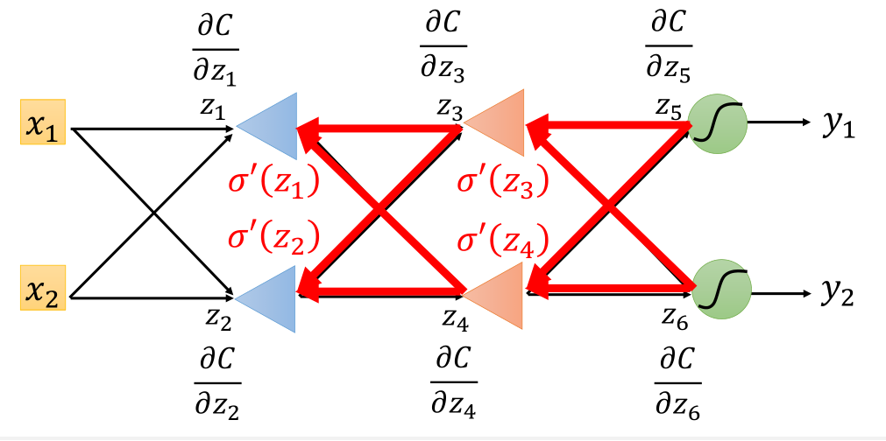

这里每一个op-amp的放大系数就是$\sigma'(z_1)$、$\sigma'(z_2)$、$\sigma'(z_3)$、$\sigma'(z_4)$，所以整一个流程就是，先快速地计算出$\frac{\partial C}{\partial z_5}$和$\frac{\partial C}{\partial z_6}$，然后再把这两个偏微分的值乘上路径上的weight汇集到neuron上面，再通过op-amp的放大，就可以得到$\frac{\partial C}{\partial z_3}$和$\frac{\partial C}{\partial z_4}$这两个偏微分的值，再让它们乘上一些weight，并且通过一个op-amp，就得到$\frac{\partial C}{\partial z_1}$和$\frac{\partial C}{\partial z_2}$这两个偏微分的值，这样就计算完了，这个步骤，就叫做Backward pass

在做Backward pass的时候，实际上的做法就是建另外一个neural network，本来正向neural network里面的activation function都是sigmoid function，而现在计算Backward pass的时候，就是建一个反向的neural network，它的activation function就是一个运算放大器op-amp，要先算完Forward pass后，才算得出来

每一个反向neuron的input是loss $C$对后面一层layer的$z$的偏微分$\frac{\partial C}{\partial z}$，output则是loss $C$对这个neuron的$z$的偏微分$\frac{\partial C}{\partial z}$，做Backward pass就是通过这样一个反向neural network的运算，把loss $C$对每一个neuron的$z$的偏微分$\frac{\partial C}{\partial z}$都给算出来

如果是正向做Backward pass的话，实际上每次计算一个$\frac{\partial C}{\partial z}$，就需要把该neuron后面所有的$\frac{\partial C}{\partial z}$都给计算一遍，会造成很多不必要的重复运算，如果写成code的形式，就相当于调用了很多次重复的函数；而如果是反向做Backward pass，实际上就是把这些调用函数的过程都变成调用值的过程，因此可以直接计算出结果，而不需要占用过多的堆栈空间

### Summary

最后，我们来总结一下Backpropagation是怎么做的

**Forward pass**，每个neuron的activation function的output，就是它所连接的weight的$\frac{\partial z}{\partial w}$

**Backward pass**，建一个与原来方向相反的neural network，它的三角形neuron的output就是$\frac{\partial C}{\partial z}$

把通过forward pass得到的$\frac{\partial z}{\partial w}$和通过backward pass得到的$\frac{\partial C}{\partial z}$乘起来就可以得到$C$对$w$的偏微分$\frac{\partial C}{\partial w}$
$$
\frac{\partial C}{\partial w} = \frac{\partial z}{\partial w}|_{forward\ pass} \cdot \frac{\partial C}{\partial z}|_{backward \ pass}
$$

## Tips for Deep Learning

- 在training set上准确率不高：
  - new activation function: ReLU、Maxout
  - adaptive learning rate: Adagrad、RMSProp、Momentum、Adam

- 在testing set上准确率不高
  - Early Stopping、Regularization or Dropout

### Recipe of Deep Learning

#### 3 step of deep learning

Recipe，配方、秘诀，这里指的是做deep learning的流程应该是什么样子

我们都已经知道了deep learning的三个步骤

- define the function set(network structure) 
- goodness of function(loss function -- cross entropy)
- pick the best function(gradient descent -- optimization)

做完这些事情以后，你会得到一个更好的neural network，那接下来你要做什么事情呢？

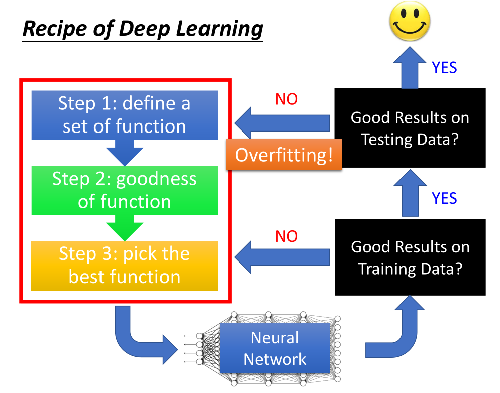

#### Good Results on Training Data？

你要做的第一件事是，提高model在training set上的正确率

先检查training set的performance其实是deep learning一个非常unique的地方，如果今天你用的是k-nearest neighbor或decision tree这类非deep learning的方法，做完以后你其实会不太想检查training set的结果，因为在training set上的performance正确率就是100，没有什么好检查的

有人说deep learning的model里这么多参数，感觉很容易overfitting的样子，但实际上这个deep learning的方法，它才不容易overfitting，我们说的overfitting就是在training set上performance很好，但在testing set上performance没有那么好

只有像k nearest neighbor，decision tree这类方法，它们在training set上正确率都是100，这才是非常容易overfitting的，而对deep learning来说，overfitting往往不会是你遇到的第一个问题

因为你在training的时候，deep learning并不是像k nearest neighbor这种方法一样，一训练就可以得到非常好的正确率，它有可能在training set上根本没有办法给你一个好的正确率，所以，这个时候你要回头去检查在前面的step里面要做什么样的修改，好让你在training set上可以得到比较高的正确率

#### Good Results on Testing Data？

接下来你要做的事是，提高model在testing set上的正确率

假设现在你已经在training set上得到好的performance了，那接下来就把model apply到testing set上，我们最后真正关心的，是testing set上的performance，假如得到的结果不好，这个情况下发生的才是Overfitting，也就是在training set上得到好的结果，却在testing set上得到不好的结果

那你要回过头去做一些事情，试着解决overfitting，但有时候你加了新的technique，想要overcome overfitting这个problem的时候，其实反而会让training set上的结果变坏；所以你在做完这一步的修改以后，要先回头去检查新的model在training set上的结果，如果这个结果变坏的话，你就要从头对network training的process做一些调整，那如果你同时在training set还有testing set上都得到好结果的话，你就成功了，最后就可以把你的系统真正用在application上面了

#### Do not always blame overfitting

不要看到所有不好的performance就归责于overfitting

先看右边testing data的图，横坐标是model做gradient descent所update的次数，纵坐标则是error rate（越低说明model表现得越好），黄线表示的是20层的neural network，红色表示56层的neural network

你会发现，这个56层network的error rate比较高，它的performance比较差，而20层network的performance则是比较好的，有些人看到这个图，就会马上得到一个结论：56层的network参数太多了，56层果然没有必要，这个是overfitting。但是，真的是这样子吗？

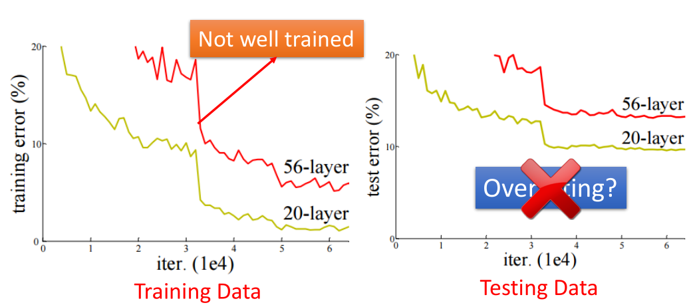

你在说结果是overfitting之前，有检查过training set上的performance吗？对neural network来说，在training set上得到的结果很可能会像左边training error的图，也就是说，20层的network本来就要比56层的network表现得更好，所以testing set得到的结果并不能说明56层的case就是发生了overfitting

在做neural network training的时候，有太多太多的问题可以让你的training set表现的不好，比如说我们有local minimum的问题，有saddle point的问题，有plateau的问题...

所以这个56层的neural network，有可能在train的时候就卡在了一个local minimum的地方，于是得到了一个差的参数，但这并不是overfitting，而是在training的时候就没有train好

有人认为这个问题叫做underfitting，但我的理解，underfitting的本意应该是指这个model的complexity不足，这个model的参数不够多，所以它的能力不足以解出这个问题；但这个56层的network，它的参数是比20层的network要来得多的，所以它明明有能力比20层的network要做的更好，却没有得到理想的结果，这种情况不应该被称为underfitting，其实就只是没有train好而已

#### Conclusion

当你在deep learning的文献上看到某种方法的时候，永远要想一下，这个方法是要解决什么样的问题，因为在deep learning里面，有两个问题：

- 在training set上的performance不够好
- 在testing set上的performance不够好

当有一个方法propose（提出）的时候，它往往只针对这两个问题的其中一个来做处理，举例来说，deep learning有一个很潮的方法叫做dropout，那很多人就会说，哦，这么潮的方法，所以今天只要看到performance不好，我就去用dropout；

但是，其实只有在testing的结果不好的时候，才可以去apply dropout，如果你今天的问题只是training的结果不好，那你去apply dropout，只会越train越差而已

所以，你**必须要先想清楚现在的问题到底是什么，然后再根据这个问题去找针对性的方法**，而不是病急乱投医，甚至是盲目诊断

下面我们分别从Training data和Testing data两个问题出发，来讲述一些针对性优化的方法

### Good Results on Training Data？

如何在Training data上得到更好的performance，分为两个模块，New activation function和Adaptive Learning Rate

#### New activation function

##### activation function

如果你今天的training结果不好，很有可能是因为你的network架构设计得不好。举例来说，可能你用的activation function是对training比较不利的，那你就尝试着换一些新的activation function，也许可以带来比较好的结果

在1980年代，比较常用的activation function是sigmoid function，如果现在我们使用sigmoid function，你会发现deeper不一定imply better，在MNIST手写数字识别上training set的结果，当layer越来越多的时候，accuracy一开始持平，后来就掉下去了，在layer是9层、10层的时候，整个结果就崩溃了

但注意9层、10层的情况并不能被认为是因为参数太多而导致overfitting，实际上这只是training set的结果，你都不知道testing的情况，又哪来的overfitting之说呢？

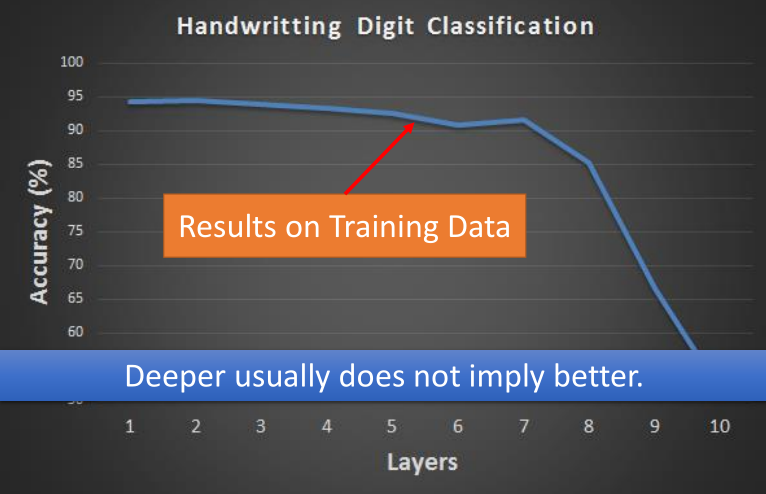

##### Vanishing Gradient Problem

上面这个问题的原因不是overfitting，而是Vanishing Gradient（梯度消失），解释如下：

当你把network叠得很深的时候，在靠近input的地方，这些参数的gradient（即对最后loss function的微分）是比较小的；而在比较靠近output的地方，它对loss的微分值会是比较大的

因此当你设定同样learning rate的时候，靠近input的地方，它参数的update是很慢的；而靠近output的地方，它参数的update是比较快的

所以在靠近input的地方，参数几乎还是random的时候，output就已经根据这些random的结果找到了一个local minima，然后就converge(收敛)了

这个时候你会发现，参数的loss下降的速度变得很慢，你就会觉得gradient已经接近于0了，于是把程序停掉了，由于这个converge，是几乎base on random的参数，所以model的参数并没有被训练充分，那在training data上得到的结果肯定是很差的

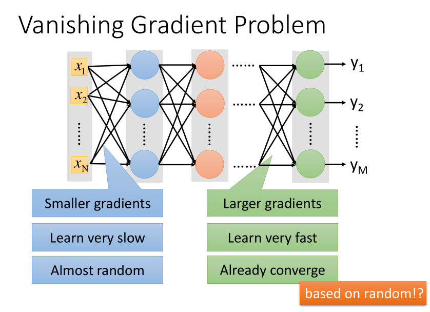

为什么会有这个现象发生呢？如果你自己把Backpropagation的式子写出来的话，就可以很轻易地发现用sigmoid function会导致这件事情的发生；但是，我们今天不看Backpropagation的式子，其实从直觉上来想你也可以了解这件事情发生的原因

某一个参数$w$对total loss $l$的偏微分，即gradient $\frac{\partial l}{\partial w}$，它直觉的意思是说，当我今天把这个参数做小小的变化的时候，它对这个loss 的影响有多大；那我们就把第一个layer里的某一个参数$w$加上$\Delta w$，看看对network的output和target之间的loss有什么样的影响

$\Delta w$通过sigmoid function之后，得到output是会变小的，改变某一个参数的weight，会对某个neuron的output值产生影响，但是这个影响是会随着层数的递增而衰减的

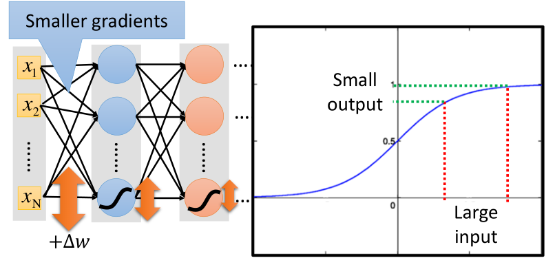

sigmoid function的形状如图所示，它会把负无穷大到正无穷大之间的值都硬压到0~1之间，把较大的input压缩成较小的output

因此即使$\Delta w$值很大，但每经过一个sigmoid function就会被缩小一次，所以network越深，$\Delta w$被衰减的次数就越多，直到最后，它对output的影响就是比较小的，相应的也导致input对loss的影响会比较小，于是靠近input的那些weight对loss的gradient $\frac{\partial l}{\partial w}$远小于靠近output的gradient

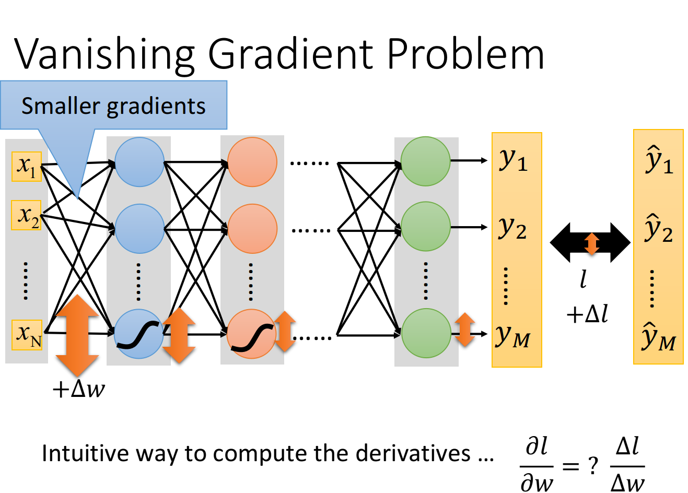

那怎么解决这个问题呢？比较早年的做法是去train RBM，做layer-wise pre-training，它的精神就是，先把第一个layer train好，再去train第二个，然后再第三个...所以最后你在做Backpropagation的时候，尽管第一个layer几乎没有被train到，但一开始在做pre-train的时候就已经把它给pre-train好了，这就是RBM做pre-train有用的原因。可以在一定程度上解决问题

但其实改一下activation function可能就可以handle这个问题了

##### ReLU

现在比较常用的activation function叫做Rectified Linear Unit（整流线性单元函数，又称修正线性单元），它的缩写是ReLU，该函数形状如下图所示，z为input，a为output，如果input>0则output = input，如果input<0则output = 0

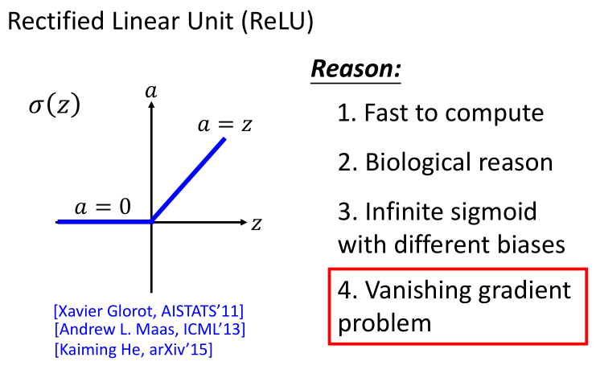

选择ReLU的理由如下：

- 跟sigmoid function比起来，ReLU的运算快很多
- ReLU的想法结合了生物上的观察（Andrew），跟人脑的神经脉冲很像，当z<0时，神经元是没有信号的。但是在sigmoid中，当z=0时，神经元输出为0.5，就是说神经元无论何时将会处于亢奋的状态，这与实际情况是相违背的
- 无穷多bias不同的sigmoid function叠加的结果会变成ReLU（Hitton）
- ReLU可以处理Vanishing gradient的问题（the most important reason）

###### Handle Vanishing gradient problem

下图是ReLU的neural network，以ReLU作为activation function的neuron，它的output要么等于0，要么等于input

当output=input的时候，这个activation function就是linear的；而output=0的neuron对整个network是没有任何作用的，因此可以把它们从network中拿掉

拿掉所有output为0的neuron后如下图所示，此时整个network就变成a thinner linear network，linear的好处是，output=input，不会像sigmoid function一样使input产生的影响逐层递减

Q: 这里就会有一个问题，我们之所以使用deep learning，就是因为想要一个non-linear、比较复杂的function，而使用ReLU不就会让它变成一个linear function吗？这样得到的function不是会变得很弱吗？

A: 其实，使用ReLU之后的network整体来说还是non-linear的，如果你对input做小小的改变，不改变neuron的operation region的话，那network就是一个linear function；但是，如果你对input做比较大的改变，导致neuron的operation region被改变的话，比如从output=0转变到了output=input，network整体上就变成了non-linear function

这里的region是指input z<0和input z>0的两个范围

Q: 还有另外一个问题，我们对loss function做gradient descent，要求neural network是可以做微分的，但ReLU是一个分段函数，它是不能微分的（至少在z=0这个点是不可微的），那该怎么办呢？

A: 在实际操作上，当region的范围处于z>0时，微分值gradient就是1；当region的范围处于z<0时，微分值gradient就是0；当z为0时，就不要管它

###### ReLU-variant

其实ReLU还存在一定的问题，比如当input<0的时候，output=0，此时微分值gradient也为0，你就没有办法去update参数了，所以我们应该让input<0的时候，微分后还能有一点点的值，比如令$a=0.01z$，这个东西就叫做**Leaky ReLU**

既然a可以等于$0.01z$，那这个z的系数可不可以是0.07、0.08之类呢？所以就有人提出了**Parametric ReLU**，也就是令$a=\alpha z$，其中$\alpha$并不是固定的值，而是network的一个参数，它可以通过training data学出来，甚至每个neuron都可以有不同的$\alpha$值

这个时候又有人想，为什么一定要是ReLU这样子呢，activation function可不可以有别的样子呢？所以后来有了一个更进阶的想法，叫做**Maxout network**

##### Maxout

Maxout的想法是，让network自动去学习它的activation function，那Maxout network就可以自动学出ReLU，也可以学出其他的activation function，这一切都是由training data来决定的

假设现在有input $x_1,x_2$，它们乘上几组不同的weight分别得到5,7,-1,1，这些值本来是不同neuron的input，它们要通过activation function变为neuron的output；但在Maxout network里，我们事先决定好将某几个“neuron”的input分为一个group，比如5,7分为一个group，然后在这个group里选取一个最大值7作为output

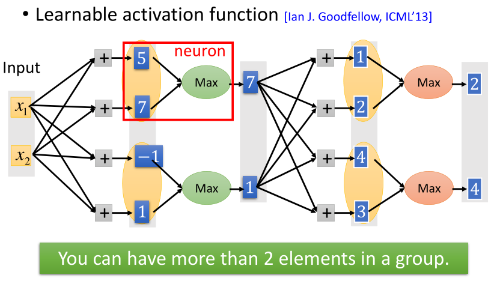

这个过程就好像在一个layer上做Max Pooling一样，它和原来的network不同之处在于，它把原来几个“neuron”的input按一定规则组成了一个group，然后并没有使它们通过activation function，而是选取其中的最大值当做这几个“neuron”的output

当然，实际上原来的”neuron“早就已经不存在了，这几个被合并的“neuron”应当被看做是一个新的neuron，这个新的neuron的input是原来几个“neuron”的input组成的vector，output则取input的最大值，而并非由activation function产生

在实际操作上，几个element被分为一个group这件事情是由你自己决定的，它就是network structure里一个需要被调的参数，不一定要跟上图一样两个分为一组

###### Maxout → ReLU

Maxout是如何模仿出ReLU这个activation function的呢？

下图左上角是一个ReLU的neuron，它的input x会乘上neuron的weight w，再加上bias b，然后通过activation function-ReLU，得到output a

- neuron的input为$z=wx+b$，为下图左下角紫线
- neuron的output为$a=z\ (z>0);\ a=0\ (z<0)$，为下图左下角绿线

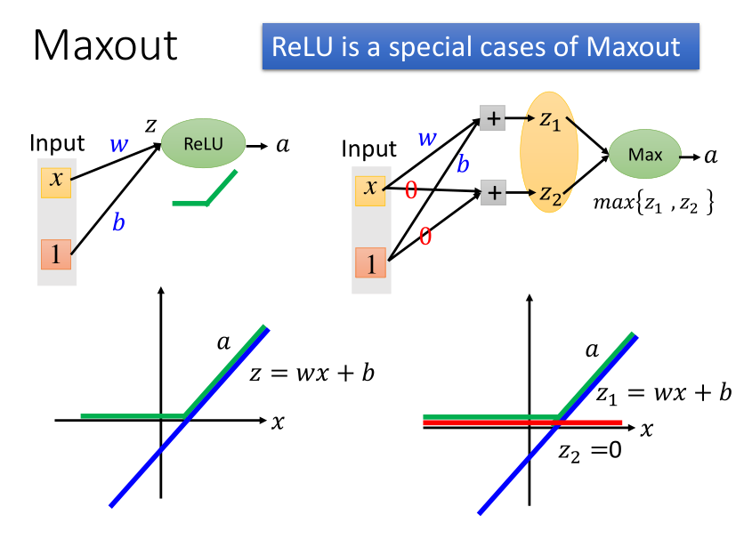

如果我们使用的是上图右上角所示的Maxout network，假设$z_1$的参数w和b与ReLU的参数一致，而$z_2$的参数w和b全部设为0，然后做Max Pooling，选取$z_1,z_2$较大值作为a

- neuron的input为$\begin{bmatrix}z_1 \ z_2 \end{bmatrix}$
  - $z_1=wx+b$，为上图右下角紫线
  - $z_2=0$，为上图右下角红线
- neuron的output为$\max{\begin{bmatrix}z_1 \ z_2 \end{bmatrix}}$，为上图右下角绿线

你会发现，此时ReLU和Maxout所得到的output是一模一样的，它们是相同的activation function

###### Maxout → More than ReLU

除了ReLU，Maxout还可以实现更多不同的activation function

比如$z_2$的参数w和b不是0，而是$w',b'$，此时

- neuron的input为$\begin{bmatrix}z_1 \ z_2 \end{bmatrix}$
  - $z_1=wx+b$，为下图右下角紫线
  - $z_2=w'x+b'$，为下图右下角红线
- neuron的output为$\max{\begin{bmatrix}z_1 \ z_2 \end{bmatrix}}$，为下图右下角绿线

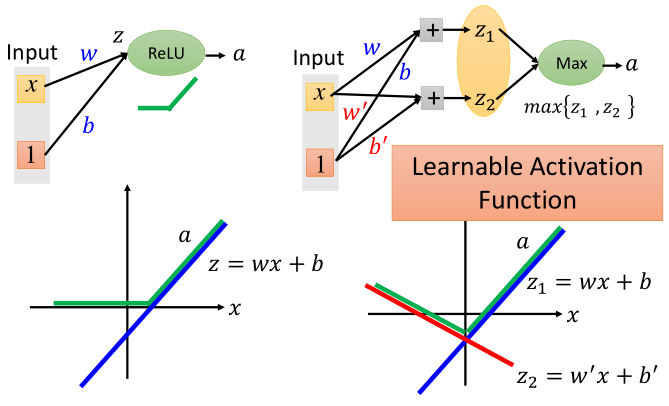

这个时候你得到的activation function的形状(绿线形状)，是由network的参数$w,b,w',b'$决定的，因此它是一个**Learnable Activation Function**，具体的形状可以根据training data去generate出来

###### Property

Maxout可以实现任何piecewise linear convex activation function（分段线性凸激活函数），其中这个activation function被分为多少段，取决于你把多少个element z放到一个group里，下图分别是2个element一组和3个element一组的activation function的不同形状

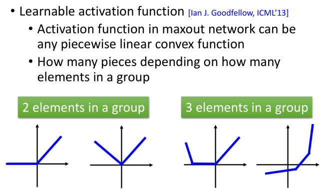

###### How to train Maxout

接下来我们要面对的是，怎么去train一个Maxout network，如何解决Max不能微分的问题

假设在下面的Maxout network中，红框内为每个neuron的output

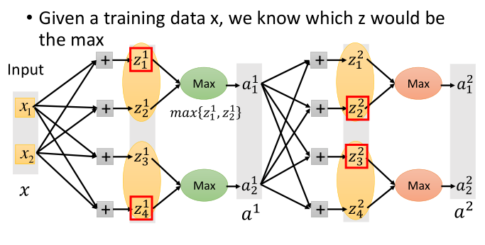

其实Max operation就是linear的operation，只是它仅接在前面这个group里的某一个element上，因此我们可以把那些并没有被Max连接到的element通通拿掉，从而得到一个比较细长的linear network

实际上我们真正训练的并不是一个含有max函数的network，而是一个化简后如下图所示的linear network；当我们还没有真正开始训练模型的时候，此时这个network含有max函数无法微分，但是只要真的丢进去了一笔data，network就会马上根据这笔data确定具体的形状，此时max函数的问题已经被实际数据给解决了，所以我们完全可以根据这笔training data使用Backpropagation的方法去训练被network留下来的参数

所以我们担心的max函数无法微分，它只是理论上的问题；在具体的实践上，我们完全可以先根据data把max函数转化为某个具体的函数，再对这个转化后的thiner linear network进行微分

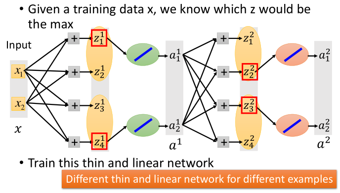

这个时候你也许会有一个问题，如果按照上面的做法，那岂不是只会train留在network里面的那些参数，剩下的参数该怎么办？那些被拿掉的直线（weight）岂不是永远也train不到了吗？

其实这也只是个理论上的问题，在实际操作上，我们之前已经提到过，每个linear network的structure都是由input的那一笔data来决定的，当你input不同data的时候，得到的network structure是不同的，留在network里面的参数也是不同的，由于我们有很多很多笔training data，所以network的structure在训练中不断地变换，实际上最后每一个weight参数都会被train到

所以，我们回到Max Pooling的问题上来，由于Max Pooling跟Maxout是一模一样的operation，既然如何训练Maxout的问题可以被解决，那训练Max Pooling又有什么困难呢？

Max Pooling有关max函数的微分问题采用跟Maxout一样的方案即可解决

#### Adaptive learning rate

##### Review - Adagrad

我们之前已经了解过Adagrad的做法，让每一个parameter都要有不同的learning rate，$w^{t+1}=w^t-\frac{\eta}{\sqrt{\sum\limits_{i=0}^t(g^i)^2}}\cdot g^t$

Adagrad的精神是，假设我们考虑两个参数$w_1,w_2$，如果在$w_1$这个方向上，平常的gradient都比较小，那它是比较平坦的，于是就给它比较大的learning rate；反过来说，在$w_2$这个方向上，平常gradient都比较大，那它是比较陡峭的，于是给它比较小的learning rate

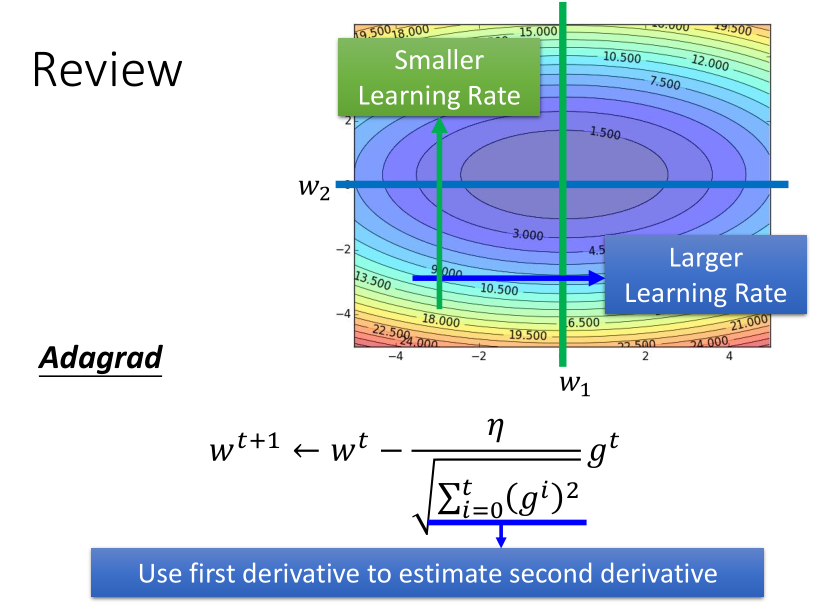

但我们实际面对的问题，很有可能远比Adagrad所能解决的问题要来的复杂，我们之前做Linear Regression的时候，我们做optimization的对象，也就是loss function，它是convex的形状；但实际上我们在做deep learning的时候，这个loss function可以是任何形状

##### RMSProp

###### learning rate

loss function可以是任何形状，对convex loss function来说，在每个方向上它会一直保持平坦或陡峭的状态，所以你只需要针对平坦的情况设置较大的learning rate，对陡峭的情况设置较小的learning rate即可

但是在下图所示的情况中，即使是在同一个方向上(如$w_1$方向)，loss function也有可能一会儿平坦一会儿陡峭，所以你要随时根据gradient的大小来快速地调整learning rate

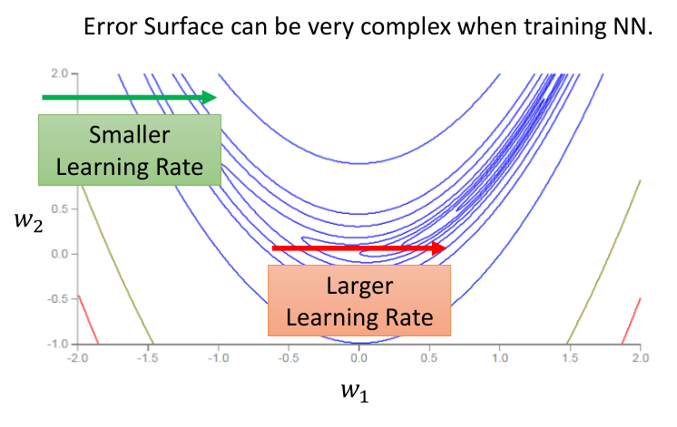

所以真正要处理deep learning的问题，用Adagrad可能是不够的，你需要更dynamic的调整learning rate的方法，所以产生了Adagrad的进阶版——**RMSProp**

RMSProp还是一个蛮神奇的方法，因为它并不是在paper里提出来的，而是Hinton在mooc的course里面提出来的一个方法，所以需要cite的时候，要去cite Hinton的课程链接

###### how to do RMSProp

RMSProp的做法如下：

我们的learning rate依旧设置为一个固定的值 $\eta$ 除掉一个变化的值 $\sigma$，这个$\sigma$等于上一个$\sigma$和当前梯度$g$的加权方均根（特别的是，在第一个时间点，$\sigma^0$就是第一个算出来的gradient值$g^0$），即：
$$
w^{t+1}=w^t-\frac{\eta}{\sigma^t}g^t \\
\sigma^t=\sqrt{\alpha(\sigma^{t-1})^2+(1-\alpha)(g^t)^2}
$$
这里的$\alpha$值是可以自由调整的，RMSProp跟Adagrad不同之处在于，Adagrad的分母是对过程中所有的gradient取平方和开根号，也就是说Adagrad考虑的是整个过程平均的gradient信息；

而RMSProp虽然也是对所有的gradient进行平方和开根号，但是它**用一个$\alpha$来调整对不同gradient的使用程度**，比如你把α的值设的小一点，意思就是你更倾向于相信新的gradient所告诉你的error surface的平滑或陡峭程度，而比较无视于旧的gradient所提供给你的information

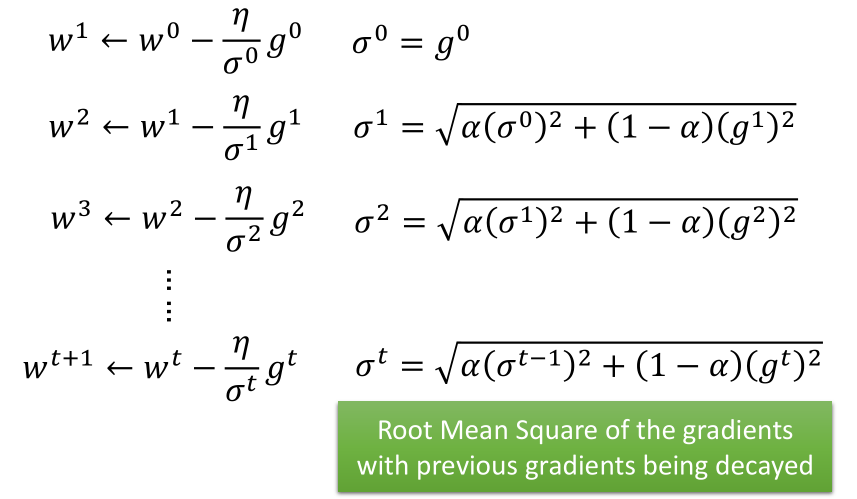

所以当你做RMSProp的时候，一样是在算gradient的root mean square，但是你可以给现在已经看到的gradient比较大的weight，给过去看到的gradient比较小的weight，来调整对gradient信息的使用程度

##### Momentum

###### optimization - local minima？

除了learning rate的问题以外，在做deep learning的时候，也会出现卡在local minimum、saddle point或是plateau的地方，很多人都会担心，deep learning这么复杂的model，可能非常容易就会被卡住了

但其实Yann LeCun在07年的时候，就提出了一个蛮特别的说法，他说你不要太担心local minima的问题，因为一旦出现local minima，它就必须在每一个dimension都是下图中这种山谷的低谷形状，假设山谷的低谷出现的概率为p，由于我们的network有非常非常多的参数，这里假设有1000个参数，每一个参数都要位于山谷的低谷之处，这件事发生的概率为$p^{1000}$，当你的network越复杂，参数越多，这件事发生的概率就越低

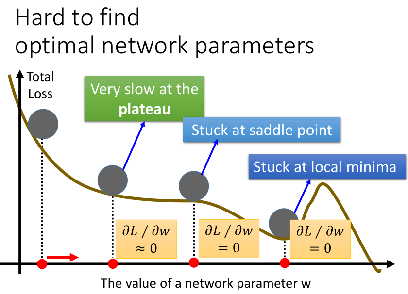

所以在一个很大的neural network里面，其实并没有那么多的local minima，搞不好它看起来其实是很平滑的，所以当你走到一个你觉得是local minima的地方被卡住了，那它八成就是global minima，或者是很接近global minima的地方

###### where is Momentum from

有一个heuristic（启发性）的方法可以稍微处理一下上面所说的“卡住”的问题，它的灵感来自于真实世界

假设在有一个球从左上角滚下来，它会滚到plateau的地方、local minima的地方，但是由于惯性它还会继续往前走一段路程，假设前面的坡没有很陡，这个球就很有可能翻过山坡，走到比local minima还要好的地方

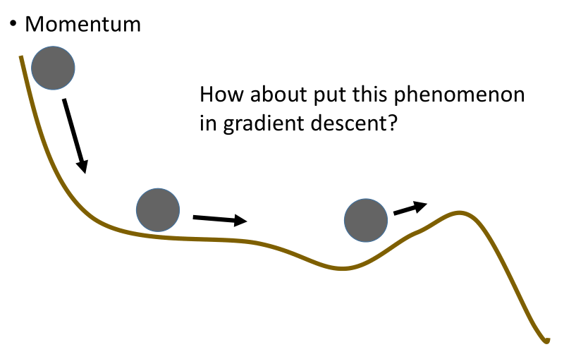

所以我们要做的，就是把**惯性**塞到gradient descent里面，这件事情就叫做**Momentum**

###### How to do Momentum

当我们在gradient descent里加上Momentum的时候，每一次update的方向，不再只考虑gradient的方向，还要考虑上一次update的方向，那这里我们就用一个变量$v$去记录前一个时间点update的方向

随机选一个初始值$\theta^0$，初始化$v^0=0$，接下来计算$\theta^0$处的gradient，然后我们要移动的方向是由前一个时间点的移动方向$v^0$和gradient的反方向$\nabla L(\theta^0)$来决定的，即
$$
v^1=\lambda v^0-\eta \nabla L(\theta^0)
$$
这里的$\lambda$也是一个手动调整的参数，它表示惯性对前进方向的影响有多大

接下来我们第二个时间点要走的方向$v^2$，它是由第一个时间点移动的方向$v^1$和gradient的反方向$\nabla L(\theta^1)$共同决定的

$\lambda v$是图中的绿色虚线，它代表由于上一次的惯性想要继续走的方向

$\eta \nabla L(\theta)$是图中的红色虚线，它代表这次gradient告诉你所要移动的方向

它们的矢量和就是这一次真实移动的方向，为蓝色实线

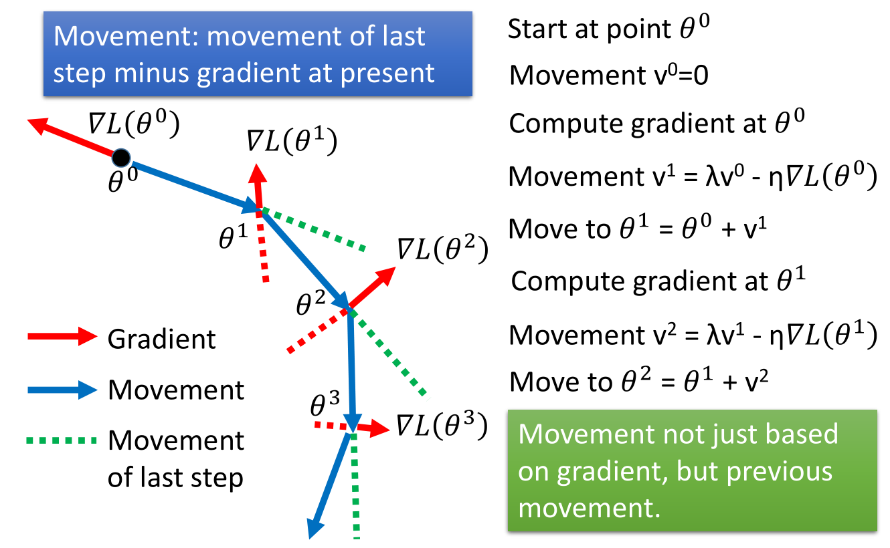

gradient告诉我们走红色虚线的方向，惯性告诉我们走绿色虚线的方向，合起来就是走蓝色的方向

我们还可以用另一种方法来理解Momentum这件事，其实你在每一个时间点移动的步伐$v^i$，包括大小和方向，就是过去所有gradient的加权和

具体推导如下图所示，第一个时间点移动的步伐$v^1$是$\theta^0$处的gradient加权，第二个时间点移动的步伐$v^2$是$\theta^0$和$\theta^1$处的gradient加权和...以此类推；由于$\lambda$的值小于1，因此该加权意味着越是之前的gradient，它的权重就越小，也就是说，你更在意的是现在的gradient，但是过去的所有gradient也要对你现在update的方向有一定程度的影响力，这就是Momentum

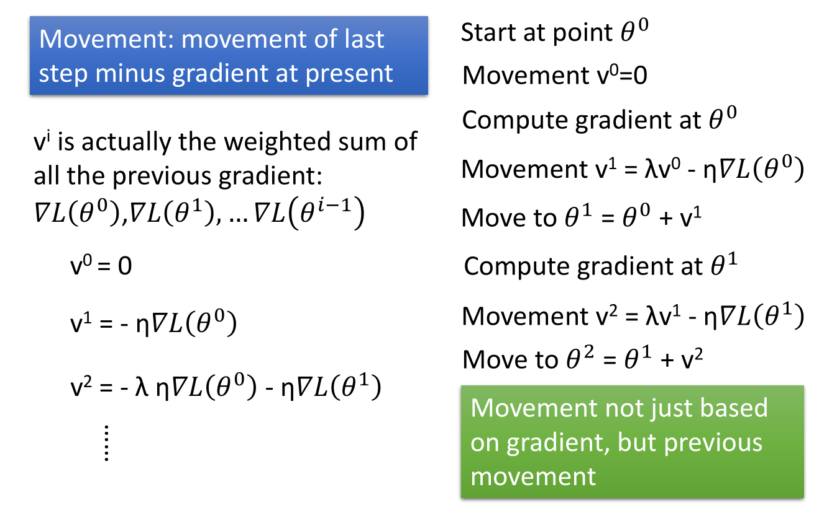

如果你对数学公式不太喜欢的话，那我们就从直觉上来看一下加入Momentum之后是怎么运作的

在加入Momentum以后，每一次移动的方向，就是negative的gradient加上Momentum建议我们要走的方向，Momentum其实就是上一个时间点的movement

下图中，红色实线是gradient建议我们走的方向，直观上看就是根据坡度要走的方向；绿色虚线是Momentum建议我们走的方向，实际上就是上一次移动的方向；蓝色实线则是最终真正走的方向

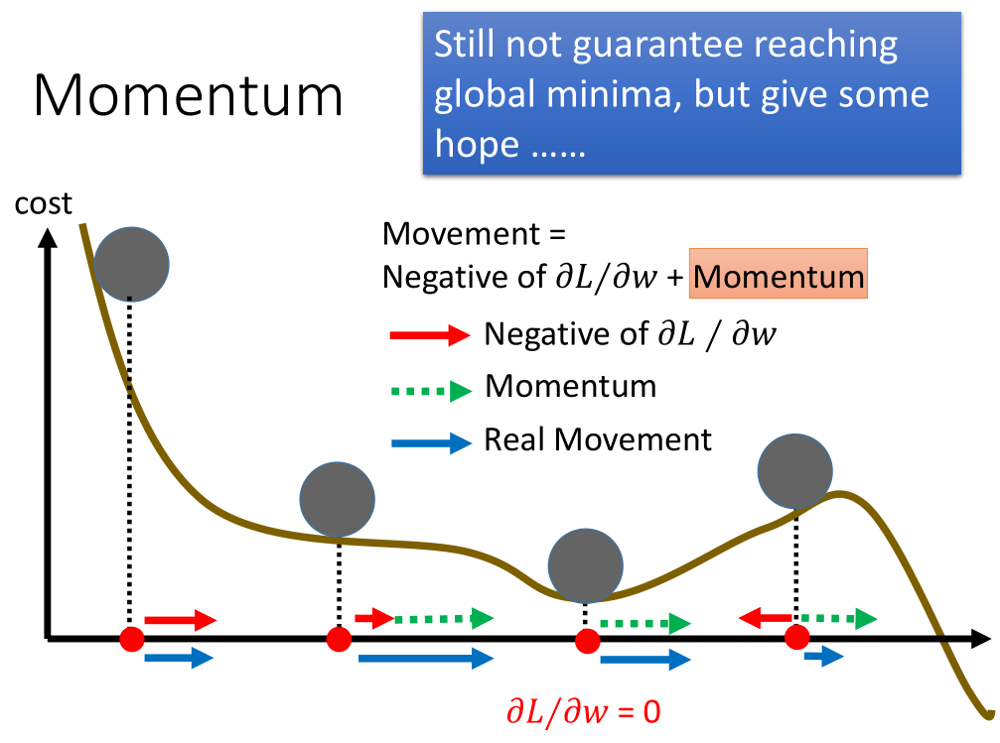

如果我们今天走到local minimum的地方，此时gradient是0，红色箭头没有指向，它就会告诉你就停在这里吧，但是Momentum也就是绿色箭头，它指向右侧就是告诉你之前是要走向右边的，所以你仍然应该要继续往右走，所以最后你参数update的方向仍然会继续向右；你甚至可以期待Momentum比较强，惯性的力量可以支撑着你走出这个谷底，去到loss更低的地方

##### Adam

其实**RMSProp加上Momentum，就可以得到Adam**

根据下面的paper来快速描述一下Adam的algorithm：

- 先初始化$m_0=0$，$m_0$就是Momentum中，前一个时间点的movement

  再初始化$v_0=0$，$v_0$就是RMSProp里计算gradient的root mean square的$\sigma$

  最后初始化$t=0$，t用来表示时间点

- 先算出gradient $g_t$
  $$
  g_t=\nabla _{\theta}f_t(\theta_{t-1})
  $$

- 再根据过去要走的方向$m_{t-1}$和gradient $g_t$，算出现在要走的方向 $m_t$——Momentum
  $$
  m_t=\beta_1 m_{t-1}+(1-\beta_1) g_t
  $$

- 然后根据前一个时间点的$v_{t-1}$和gradient $g_t$的平方，算一下放在分母的$v_t$——RMSProp
  $$
  v_t=\beta_2 v_{t-1}+(1-\beta_2) g_t^2
  $$

- 接下来做了一个原来RMSProp和Momentum里没有的东西，就是bias correction，它使$m_t$和$v_t$都除上一个值，分母这个值本来比较小，后来会越来越接近于1（原理详见paper）
  $$
  \hat{m}_t=\frac{m_t}{1-\beta_1^t} \\ \hat{v}_t=\frac{v_t}{1-\beta_2^t}
  $$

- 最后做update，把Momentum建议你的方向$\hat{m_t}$乘上learning rate $\alpha$，再除掉RMSProp normalize后建议的learning rate分母，然后得到update的方向
  $$
  \theta_t=\theta_{t-1}-\frac{\alpha \cdot \hat{m}_t}{\sqrt{\hat{v}_t}+\epsilon}
  $$

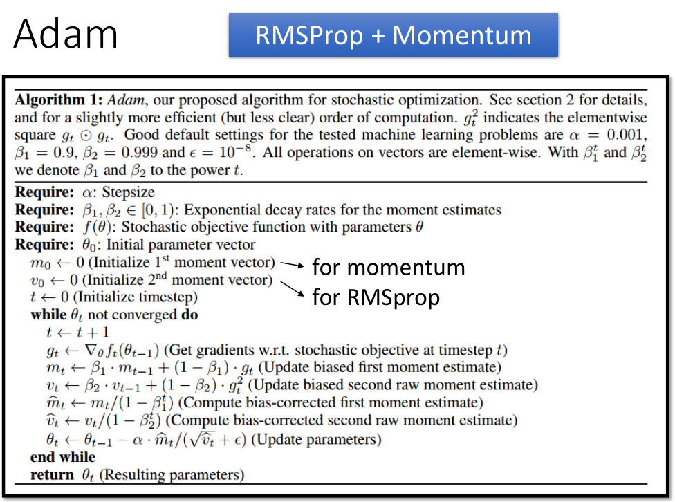

### Good Results on Testing Data？

在Testing data上得到更好的performance，分为三个模块，Early Stopping和Regularization是很typical的做法，它们不是特别为deep learning所设计的；而Dropout是一个蛮有deep learning特色的做法

#### Early Stopping

假设你今天的learning rate调的比较好，那随着训练的进行，total loss通常会越来越小，但是Training set和Testing set的情况并不是完全一样的，很有可能当你在Training set上的loss逐渐减小的时候，在Testing set上的loss反而上升了

所以，理想上假如你知道testing data上的loss变化情况，你会在testing set的loss最小的时候停下来，而不是在training set的loss最小的时候停下来；但testing set实际上是未知的东西，所以我们需要用validation set来替代它去做这件事情

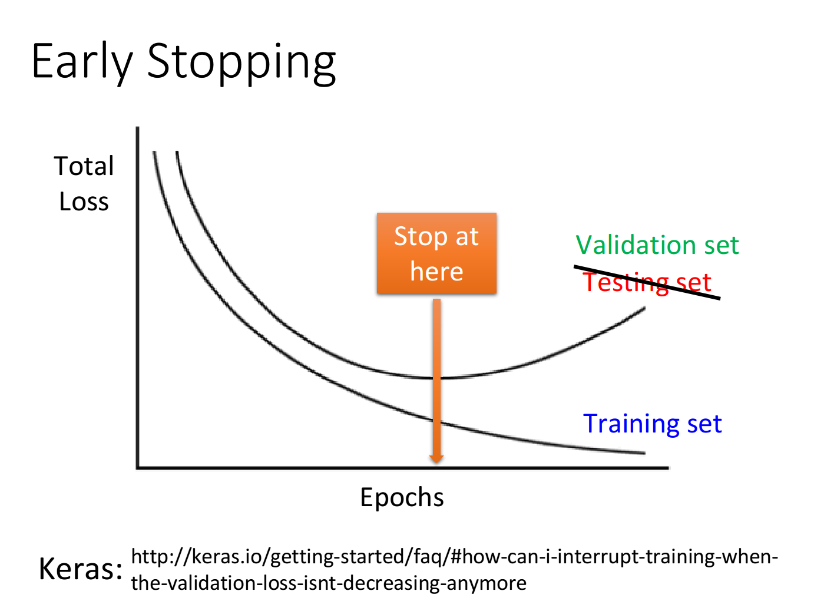

很多时候，我们所讲的“testing set”并不是指代那个未知的数据集，而是一些已知的被你拿来做测试之用的数据集，比如kaggle上的public set，或者是你自己切出来的validation set

#### Regularization

regularization就是在原来的loss function上额外增加几个term，比如我们要minimize的loss function原先应该是square error或cross entropy，那在做Regularization的时候，就在后面加一个Regularization的term

##### L2 regularization

regularization term可以是参数的L2 norm，所谓的L2 norm，就是把model参数集$\theta$里的每一个参数都取平方然后求和，这件事被称作L2 regularization，即
$$
L2 \ regularization:||\theta||_2=(w_1)^2+(w_2)^2+...
$$

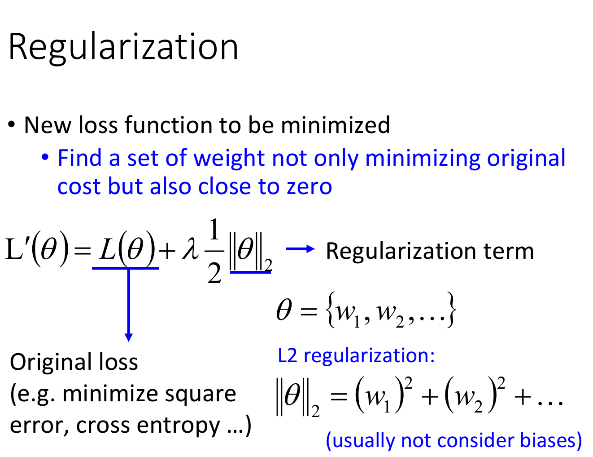

通常我们在做regularization的时候，新加的term里是不会考虑bias这一项的，因为加regularization的目的是为了让我们的function更平滑，而bias通常是跟function的平滑程度没有关系的

你会发现我们新加的regularization term $\lambda \frac{1}{2}||\theta||_2$里有一个$\frac{1}{2}$，由于我们是要对loss function求微分的，而新加的regularization term是参数$w_i$的平方和，对平方求微分会多出来一个系数2，我们的$\frac{1}{2}$就是用来和这个2相消的

L2 regularization具体工作流程如下：

- 我们加上regularization term之后得到了一个新的loss function：$L'(\theta)=L(\theta)+\lambda \frac{1}{2}||\theta||_2$
- 将这个loss function对参数$w_i$求微分，gradient：$\frac{\partial L'}{\partial w_i}=\frac{\partial L}{\partial w_i}+\lambda w_i$
- 然后update参数$w_i$：$w_i^{t+1}=w_i^t-\eta \frac{\partial L'}{\partial w_i}=w_i^t-\eta(\frac{\partial L}{\partial w_i}+\lambda w_i^t)=(1-\eta \lambda)w_i^t-\eta \frac{\partial L}{\partial w_i}$

如果把这个推导出来的式子和原式作比较，你会发现参数$w_i$在每次update之前，都会乘上一个$(1-\eta \lambda)$，而$\eta$和$\lambda$通常会被设为一个很小的值，因此$(1-\eta \lambda)$通常是一个接近于1的值，比如0.99

也就是说，regularization做的事情是，每次update参数$w_i$之前，不分青红皂白就先对原来的$w_i$乘个0.99，这意味着，随着update次数增加，参数$w_i$会越来越接近于0

Q: 你可能会问，要是所有的参数都越来越靠近0，那最后岂不是$w_i$通通变成0，得到的network还有什么用？

A: 其实不会出现最后所有参数都变为0的情况，因为通过微分得到的$\eta \frac{\partial L}{\partial w_i}$这一项是会和前面$(1-\eta \lambda)w_i^t$这一项最后取得平衡的

使用L2 regularization可以让weight每次都变得更小一点，这就叫做**Weight Decay**(权重衰减)

##### L1 regularization

除了L2 regularization中使用平方项作为new term之外，还可以使用L1 regularization，把平方项换成每一个参数的绝对值，即
$$
||\theta||_1=|w_1|+|w_2|+...
$$
Q: 你的第一个问题可能会是，绝对值不能微分啊，该怎么处理呢？

A: 实际上绝对值就是一个V字形的函数，在V的左边微分值是-1，在V的右边微分值是1，只有在0的地方是不能微分的，那真的走到0的时候就胡乱给它一个值，比如0，就OK了

如果w是正的，那微分出来就是+1，如果w是负的，那微分出来就是-1，所以这边写了一个w的sign function，它的意思是说，如果w是正数的话，这个function output就是+1，w是负数的话，这个function output就是-1

L1 regularization的工作流程如下：

- 我们加上regularization term之后得到了一个新的loss function：$L'(\theta)=L(\theta)+\lambda \frac{1}{2}||\theta||_1$

- 将这个loss function对参数$w_i$求微分：$\frac{\partial L'}{\partial w_i}=\frac{\partial L}{\partial w_i}+\lambda \ sgn(w_i)$

- 然后update参数$w_i$：
  $$
  w_i^{t+1}=w_i^t-\eta \frac{\partial L'}{\partial w_i}=w_i^t-\eta(\frac{\partial L}{\partial w_i}+\lambda \ sgn(w_i^t))=w_i^t-\eta \frac{\partial L}{\partial w_i}-\eta \lambda \ sgn(w_i^t)
  $$
  

这个式子告诉我们，每次update的时候，不管三七二十一都要减去一个$\eta \lambda \ sgn(w_i^t)$，如果w是正的，sgn是+1，就会变成减一个positive的值让你的参数变小；如果w是负的，sgn是-1，就会变成加一个值让你的参数变大；总之就是让它们的绝对值减小至接近于0

##### L1 v.s. L2

我们来对比一下L1和L2的update过程：
$$
L1: w_i^{t+1}=w_i^t-\eta \frac{\partial L}{\partial w_i}-\eta \lambda \ sgn(w_i^t)\\
L2: w_i^{t+1}=(1-\eta \lambda)w_i^t-\eta \frac{\partial L}{\partial w_i}
$$
L1和L2，虽然它们同样是让参数的绝对值变小，但它们做的事情其实略有不同：

- L1使参数绝对值变小的方式是每次update**减掉一个固定的值**
- L2使参数绝对值变小的方式是每次update**乘上一个小于1的固定值**

因此，当参数w的绝对值比较大的时候，L2会让w下降得更快，而L1每次update只让w减去一个固定的值，train完以后可能还会有很多比较大的参数

当参数w的绝对值比较小的时候，L2的下降速度就会变得很慢，train出来的参数平均都是比较小的，而L1每次下降一个固定的value，train出来的参数是比较sparse的，这些参数有很多是接近0的值，也会有很大的值

在的CNN的task里，用L1做出来的效果是比较合适的，是比较sparse的

##### Weight Decay

之前提到了Weight Decay，那实际上我们在人脑里面也会做Weight Decay

下图分别描述了，刚出生的时候，婴儿的神经是比较稀疏的；6岁的时候，就会有很多很多的神经；但是到14岁的时候，神经间的连接又减少了，所以neural network也会跟我们人有一些很类似的事情，如果有一些weight你都没有去update它，那它每次都会越来越小，最后就接近0然后不见了

这跟人脑的运作，是有异曲同工之妙

#### some tips

在deep learning里面，regularization虽然有帮助，但它的重要性往往没有SVM这类方法中来得高

因为我们在做neural network的时候，通常都是从一个很小的、接近于0的值开始初始参数的，而做update的时候，通常都是让参数离0越来越远，但是regularization要达到的目的，就是希望我们的参数不要离0太远

如果你做的是Early Stopping，它会减少update的次数，其实也会避免你的参数离0太远，这跟regularization做的事情是很接近的

所以在neural network里面，regularization的作用并没有SVM中来的重要，SVM其实是explicitly把regularization这件事情写在了它的objective function（目标函数）里面，SVM是要去解一个convex optimization problem，因此它解的时候不一定会有iteration的过程，它不会有Early Stopping这件事，而是一步就可以走到那个最好的结果了，所以你没有办法用Early Stopping防止它离目标太远，你必须要把regularization explicitly加到你的loss function里面去

在deep learning里面，regularization虽然有帮助，但是重要性相比在其他方法中没有那么高，regularization的帮助没有那么显著。

Early Stop可以决定什么时候training停下来，因为我们初试参数都是给一个很小的接近0的值，做update的时候，让参数离0越来越远，而regularization做的是让参数不要离0太远，因此regularization和减少update次数（Early Stop）的效果是很接近的。

因此在Neural Network里面，regularization虽然也有帮助，但是帮助没有那么重要，没有重要到SVM中那样。因为SVM的参数是一步走到结果，没有Early Stop

#### Dropout

##### How to do Dropout

###### Training

在training的时候，每次update参数之前，我们对每一个neuron（也包括input layer的“neuron”）做sampling，每个neuron都有p%的机率会被丢掉，如果某个neuron被丢掉的话，跟它相连的weight也都要被丢掉

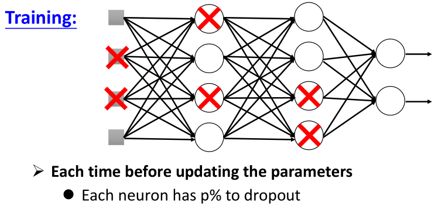

实际上就是每次update参数之前都通过抽样只保留network中的一部分neuron来做训练

做完sampling以后，network structure就会变得比较细长了，然后你再去train这个细长的network

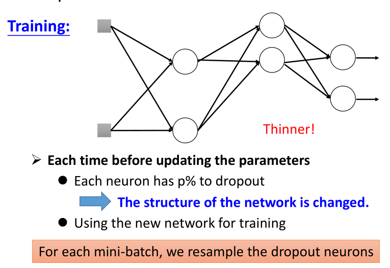

每次update参数之前都要做一遍sampling，所以每次update参数的时候，拿来training的network structure都是不一样的；你可能会觉得这个方法跟前面提到的Maxout会有一点像，但实际上，Maxout是每一笔data对应的network structure不同，而Dropout是每一次update的network structure都是不同的（每一个mini-batch对应着一次update，而一个mini-batch里含有很多笔data）

当你在training的时候使用dropout，得到的performance其实是会变差的，因为某些neuron在training的时候莫名其妙就会消失不见，但这并不是问题

因为Dropout真正要做的事情，就是要让你在training set上的结果变差，但是在testing set上的结果是变好的

所以如果你今天遇到的问题是在training set上得到的performance不够好，你再加dropout，就只会越做越差

不同的problem需要用不同的方法去解决，而不是胡乱使用，dropout就是针对testing set的方法，当然不能够拿来解决training set上的问题

###### Testing

在使用dropout方法做testing的时候要注意两件事情：

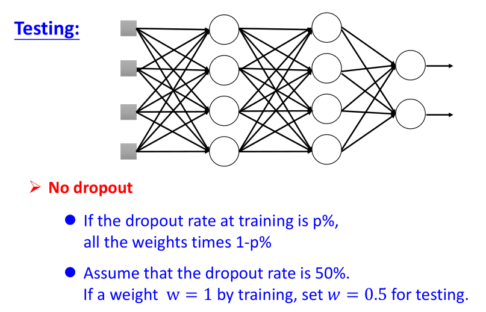

- testing的时候不做dropout，所有的neuron都要被用到
- 假设在training的时候，dropout rate是p%，从training data中被learn出来的所有weight都要乘上(1-p%)才能被当做testing的weight使用

##### Intuitive Reason

直觉的想法是这样子：在training的时候，会丢掉一些neuron，就好像是你要练轻功的时候，会在脚上绑一些重物；然后，你在实际战斗的时候，就是实际testing的时候，是没有dropout的，就相当于把重物拿下来，所以你就会变得很强

另一个直觉的理由是这样，neural network里面的每一个neuron就是一个学生，那大家被连接在一起就是大家听到说要组队做final project，那在一个团队里总是有人会拖后腿，就是他会dropout，所以假设你觉得自己的队友会dropout，这个时候你就会想要好好做，然后去carry这个队友，这就是training的过程

那实际在testing的时候，其实大家都有好好做，没有人需要被carry，由于每个人都比一般情况下更努力，所以得到的结果会是更好的，这也就是testing的时候不做dropout的原因

为什么training和testing使用的weight是不一样的呢？

直觉的解释是这样的：

假设现在的dropout rate是50%，那在training的时候，你总是期望每次update之前会丢掉一半的neuron，就像下图左侧所示，在这种情况下你learn好了一组weight参数，然后拿去testing

但是在testing的时候是没有dropout的，所以如果testing使用的是和training同一组weight，那左侧得到的output z和右侧得到的output z‘，它们的值其实是会相差两倍的，即$z'≈2z$，这样会造成testing的结果与training的结果并不match，最终的performance反而会变差

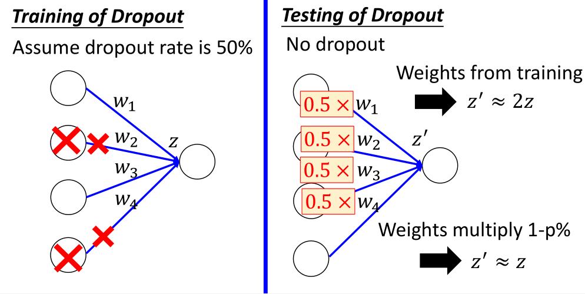

那这个时候，你就需要把右侧testing中所有的weight乘上0.5，然后做normalization，这样z就会等于z'，使得testing的结果与training的结果是比较match的

##### Dropout is a kind of ensemble

在文献上有很多不同的观点来解释为什么dropout会work，其中一种比较令人信服的解释是：dropout是一种终极的ensemble的方法

###### Ensemble

ensemble的方法在比赛的时候经常用得到，它的意思是说，我们有一个很大的training set，那你每次都只从这个training set里面sample一部分的data出来，像下图一样，抽取了set 1,set 2,set 3,set 4

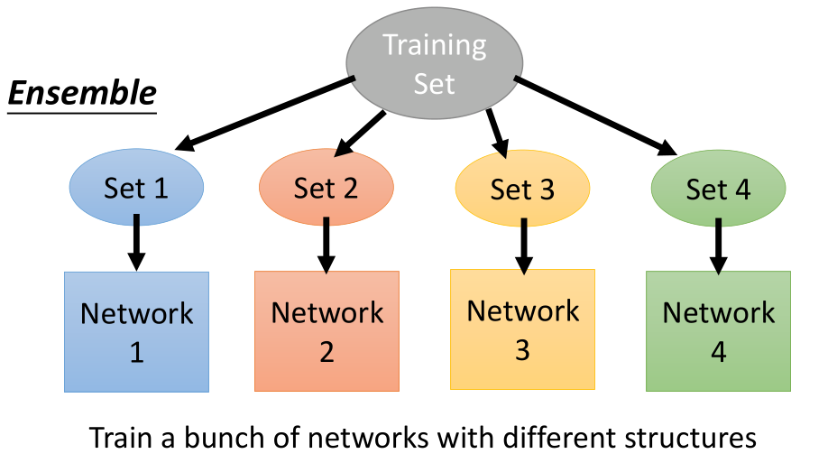

我们之前在讲bias和variance的trade off的时候说过，打靶有两种情况：

- 一种是因为bias大而导致打不准（参数过少）
- 另一种是因为variance大而导致打不准（参数过多）

假设我们今天有一个很复杂的model，它往往是bias比较准，但variance很大的情况，如果你有很多个笨重复杂的model，虽然它们的variance都很大，但最后平均起来，结果往往就会很准

所以ensemble做的事情，就是利用这个特性，我们从原来的training data里面sample出很多subset，然后train很多个model，每一个model的structure甚至都可以不一样；在testing的时候，丢一笔testing data进来，使它通过所有的model，得到一大堆的结果，然后把这些结果平均起来当做最后的output

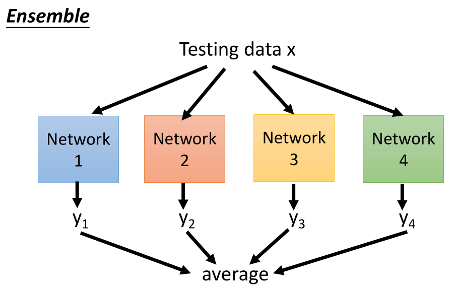

如果你的model很复杂，这一招往往是很有用的，random forest也是实践这个精神的一个方法，也就是如果你用一个decision tree，它就会很弱，也很容易overfitting，而如果采用random forest，它就没有那么容易overfitting

###### Dropout is a kind of ensemble

在training network的时候，每次拿一个mini-batch出来就做一次update，而根据dropout的特性，每次update之前都要对所有的neuron进行sample，因此每一个mini-batch所训练的network都是不同的

假设我们有M个neuron，每个neuron都有可能drop或不drop，所以总共可能的network数量有$2^M$个；所以当你在做dropout的时候，相当于是在用很多个mini-batch分别去训练很多个network（一个mini-batch设置为100笔data）

做了几次update，就相当于train了几个不同的network，最多可以训练到$2^M$个network

每个network都只用一个mini-batch的data来train，可能会让人感到不安，一个batch才100笔data，怎么train一个network呢？

其实没有关系，因为这些不同的network之间的参数是shared，也就是说，虽然一个network只能用一个mini-batch来train，但同一个weight可以在不同的network里被不同的mini-batch train，所以同一个weight实际上是被所有没有丢掉它的network一起share的，它是拿所有这些network的mini-batch合起来一起train的结果

那按照ensemble这个方法的逻辑，在testing的时候，你把那train好的一大把network通通拿出来，然后把手上这一笔testing data丢到这把network里面去，每个network都给你吐出一个结果来，然后你把所有的结果平均起来 ，就是最后的output

但是在实际操作上，如下图左侧所示，这一把network实在太多了，你没有办法每一个network都丢一个input进去，再把它们的output平均起来，这样运算量太大了

所以dropout最神奇的地方是，当你并没有把这些network分开考虑，而是用一个完整的network，这个network的weight是用之前那一把network train出来的对应weight乘上(1-p%)，然后再把手上这笔testing data丢进这个完整的network，得到的output跟network分开考虑的ensemble的output，是惊人的相近

也就是说下图左侧ensemble的做法和右侧dropout的做法，得到的结果是approximate(近似)的

这里用一个例子来解释：

我们train一个下图右上角所示的简单的network，它只有一个neuron，activation function是linear的，并且不考虑bias，这个network经过dropout训练以后得到的参数分别为$w_1,w_2$，那给它input $x_1,x_2$，得到的output就是$z=w_1 x_1+w_2 x_2$

如果我们今天要做ensemble的话，theoretically就是像下图这么做，每一个neuron都有可能被drop或不drop，这里只有两个input的neuron，所以我们一共可以得到2^2=4种network

我们手上这笔testing data $x_1,x_2$丢到这四个network中，分别得到4个output：$w_1x_1+w_2x_2,w_2x_2,w_1x_1,0$，然后根据ensemble的精神，把这四个network的output通通都average起来，得到的结果是$\frac{1}{2}(w_1x_1+w_2x_2)$

那根据dropout的想法，我们把从training中得到的参数$w_1,w_2$乘上(1-50%)，作为testing network里的参数，也就是$w'_1,w'_2=(1-50\%)(w_1,w_2)=0.5w_1,0.5w_2$

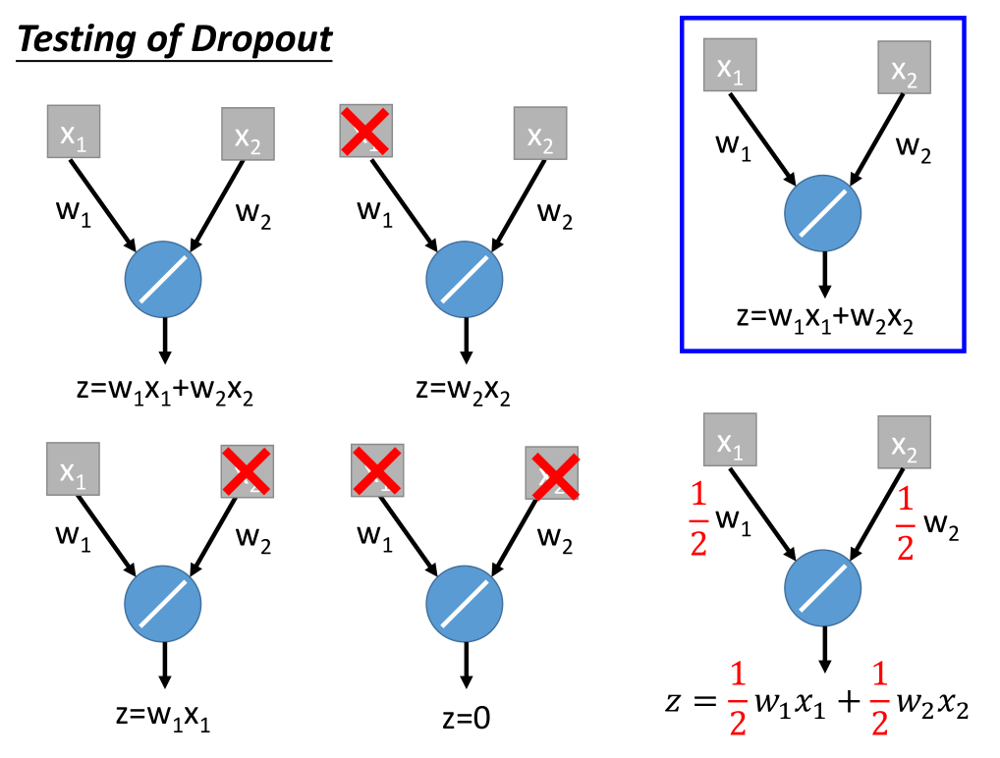

这边想要呈现的是，在这个最简单的case里面，用不同的network structure做ensemble这件事情，跟我们用一整个network，并且把weight乘上一个值而不做ensemble所得到的output，其实是一样的

值得注意的是，只有是linear的network，才会得到上述的等价关系，如果network是非linear的，ensemble和dropout是不equivalent的

但是，dropout最后一个很神奇的地方是，虽然在non-linear的情况下，它是跟ensemble不相等的，但最后的结果还是会work

如果network很接近linear的话，dropout所得到的performance会比较好，而ReLU和Maxout的network相对来说是比较接近于linear的，所以我们通常会把含有ReLU或Maxout的network与Dropout配合起来使用

## Why Deep Learning?

### Shallow v.s. Deep

#### Deep is Better？

我们都知道deep learning在很多问题上的表现都是比较好的，越deep的network一般都会有更好的performance

那为什么会这样呢？有一种解释是：

- 一个network的层数越多，参数就越多，这个model就越复杂，它的bias就越小，而使用大量的data可以降低这个model的variance，performance当然就会更好

若随着layer层数从1到7，得到的error rate不断地降低，所以有人就认为，deep learning的表现这么好，完全就是用大量的data去硬train一个非常复杂的model而得到的结果

既然大量的data加上参数足够多的model就可以实现这个效果，那为什么一定要用DNN呢？我们完全可以用一层的shallow neural network来做同样的事情，理论上只要这一层里neuron的数目足够多，有足够的参数，就可以表示出任何函数；那DNN中deep的意义何在呢？

#### Fat + Short v.s. Thin + Tall

其实深和宽这两种结构的performance是会不一样的，这里我们就拿下面这两种结构的network做一下比较：

值得注意的是：如果要给Deep和Shallow的model一个公平的评比，你就要故意调整它们的形状，让它们的参数是一样多的，在这个情况下Shallow的model就会是一个矮胖的model，Deep的model就会是一个瘦高的model

在这个公平的评比之下，得到的结果如下图所示：

左侧表示的是deep network的情况，右侧表示的是shallow network的情况，为了保证两种情况下参数的数量是比较接近的，因此设置了右侧一层3772个neuron和一层4634个neuron这两种size大小，它们分别对应比较左侧每层两千个neuron共五层和每层两千个neuron共七层这两种情况下的network，此时它们的参数数目是接近的（注意参数数目和neuron的数目并不是等价的）

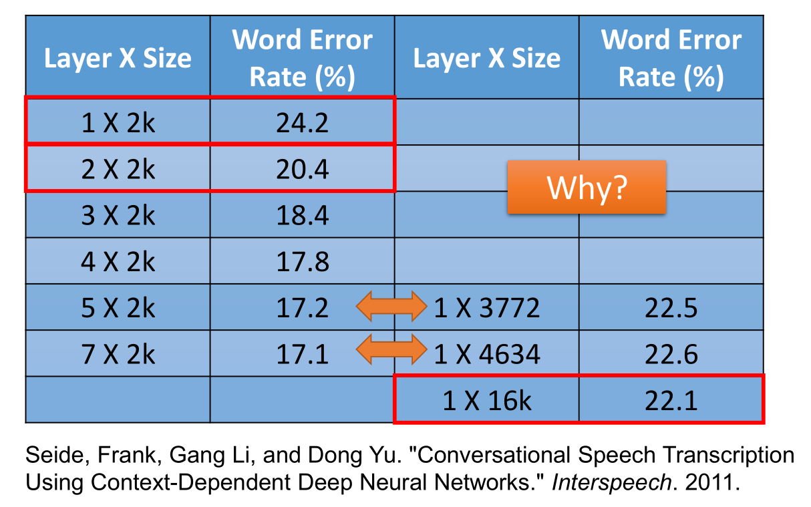

这个时候你会发现，在参数数量接近的情况下，只有1层的network，它的error rate是远大于好几层的network的；这里甚至测试了一层16k个neuron大小的shallow network，把它跟左侧也是只有一层，但是没有那么宽的network进行比较，由于参数比较多所以才略有优势；但是把一层16k个neuron大小的shallow network和参数远比它少的2\*2k大小的deep network进行比较，结果竟然是后者的表现更好

也就是说，只有1层的shallow network的performance甚至都比不过很多参数比它少但层数比它多的deep network，这是为什么呢？

有人觉得deep learning就是一个暴力辗压的方法，我可以弄一个很大很大的model，然后collect一大堆的data，就可以得到比较好的performance

但根据上面的对比可知，deep learning显然是在结构上存在着某种优势，不然无法解释它会比参数数量相同的shallow learning表现得更好这个现象

### Modularization

#### introduction

DNN结构一个很大的优势是，Modularization(模块化)，它用的是结构化的架构

就像写程序一样，shallow network实际上就是把所有的程序都写在了同一个main函数中，所以它去检测不同的class使用的方法是相互独立的；而deep network则是把整个任务分为了一个个小任务，每个小任务又可以不断细分下去，以形成modularization

在DNN的架构中，实际上每一层layer里的neuron都像是在解决同一个级别的任务，它们的output作为下一层layer处理更高级别任务的数据来源，低层layer里的neuron做的是对不同小特征的检测，高层layer里的neuron则根据需要挑选低层neuron所抽取出来的不同小特征，去检测一个范围更大的特征；neuron就像是一个个classifier ，后面的classifier共享前面classifier的参数

这样做的好处是，低层的neuron输出的信息可以被高层不同的neuron重复使用，而并不需要像shallow network一样，每次在用到的时候都要重新去检测一遍，因此大大降低了程序的复杂度，做 modularization 的好处是, 让我们的模型变简单了，我们是把本来的比较复杂的问题，变得比较简单。所以，当我们把问题变简单的时候, 就算 training data 没有那么多, 我们也可以把这个 task 做好

#### example

这里举一个分类的例子，我们要把input的人物分为四类：长头发女生、长头发男生、短头发女生、短头发男生

如果按照shallow network的想法，我们分别独立地train四个classifier(其实就相当于训练四个独立的model)，然后就可以解决这个分类的问题；但是这里有一个问题，长头发男生的data是比较少的，没有太多的training data，所以，你train出来的classifier就比较weak，去detect长头发男生的performance就比较差

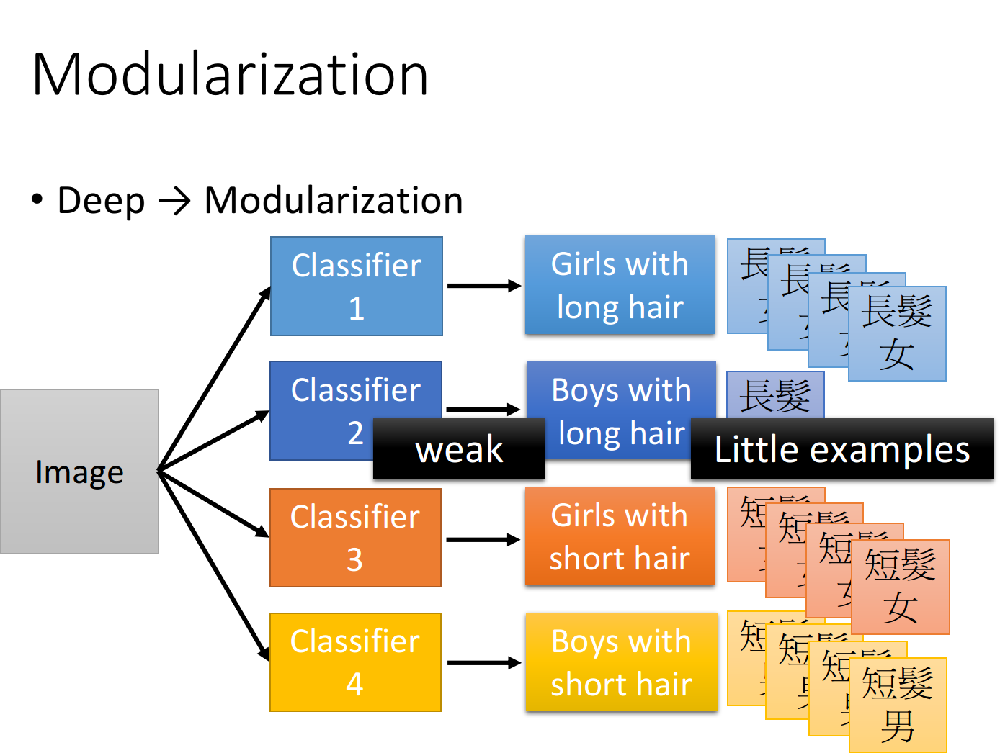

但其实我们的input并不是没有关联的，长头发的男生和长头发的女生都有一个共同的特征，就是长头发，因此如果我们分别独立地训练四个model作为分类器，实际上就是忽视了这个共同特征，也就是没有高效地用到data提供的全部信息，这恰恰是shallow network的弊端

而利用modularization的思想，使用deep network的架构，我们可以训练一个model作为分类器就可以完成所有的任务，我们可以把整个任务分为两个子任务：

- Classifier 1：检测是男生或女生
- Classifier 2：检测是长头发或短头发

虽然长头发的男生data很少，但长头发的人的data就很多，经过前面几层layer的特征抽取，就可以头发的data全部都丢给Classifier 2，把男生或女生的data全部都丢给Classifier 1，这样就真正做到了充分、高效地利用数据，Each basic classifier can have sufficient training examples，最终的Classifier再根据Classifier 1和Classifier 2提供的信息给出四类人的分类结果，

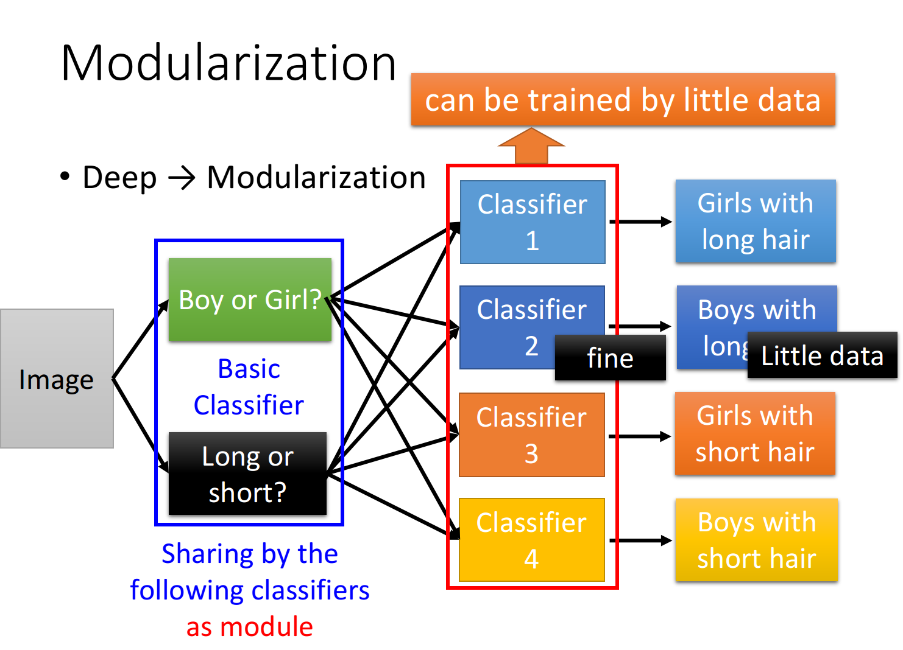

你会发现，经过层层layer的任务分解，其实每一个Classifier要做的事情都是比较简单的，又因为这种分层的、模组化的方式充分利用了data，并提高了信息利用的效率，所以只要用比较少的training data就可以把结果train好

#### Deep → modularization

做modularization的好处是把原来比较复杂的问题变得简单，比如原来的任务是检测一个长头发的女生，但现在你的任务是检测长头发和检测性别，而当检测对象变简单的时候，就算training data没有那么多，我们也可以把这个task做好，并且所有的classifier都用同一组参数检测子特征，提高了参数使用效率，这就是modularization、这就是模块化的精神

由于deep learning的deep就是在做modularization这件事，所以它需要的training data反而是比较少的，这可能会跟你的认知相反，AI=big data+deep learning，但deep learning其实是为了解决less data的问题才提出的

这边要强调的是，在做deep learning的时候，怎么做模块化这件事情是machine自动学到的，也就是说，第一层要检测什么特征、第二层要检测什么特征...这些都不是人为指定的，人只有定好有几层layer、每层layer有几个neuron，剩下的事情都是machine自己学到的

传统的机器学习算法，是人为地根据domain knowledge指定特征来进行提取，这种指定的提取方式，甚至是提取到的特征，也许并不是实际最优的，所以它的识别成功率并没有那么高；但是如果提取什么特征、怎么提取这件事让机器自己去学，它所提取的就会是那个最优解，因此识别成功率普遍会比人为指定要来的高

### Modularization - Image

每一个neuron其实就是一个basic的classifier：

- 第一层neuron，它是一个最basic的classifier，检测的是颜色、线条这样的小特征
- 第二层neuron是比较复杂的classifier，它用第一层basic的classifier的output当作input，也就是把第一层的classifier当作module，利用第一层得到的小特征分类出不同样式的花纹
- 而第三层的neuron又把第二层的neuron当作它module，利用第二层得到的特征分类出蜂窝、轮胎、人
- 以此类推

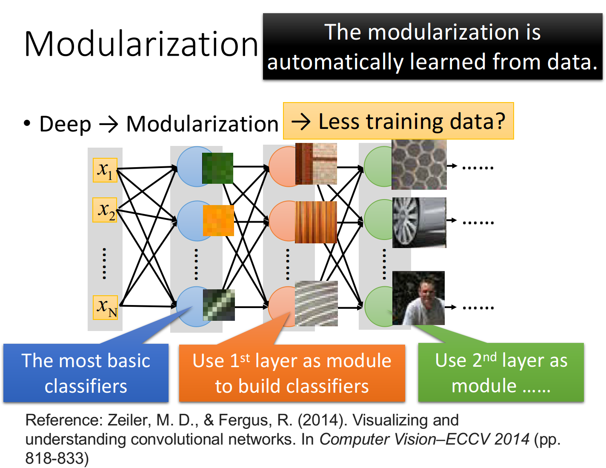

### Modularization - Speech

前面讲了deep learning的好处来自于modularization(模块化)，可以用比较efficient的方式来使用data和参数，这里以语音识别为例，介绍DNN的modularization在语音领域的应用

#### The hierarchical structure of human languages

当你说what do you think的时候，这句话其实是由一串phoneme所组成的，所谓phoneme，中文翻成音素，它是由语言学家制订的人类发音的基本单位，what由4个phoneme组成，do由两个phoneme组成，you由两个phoneme组成，等等

同样的phoneme也可能会有不太一样的发音，当你发d uw和y uw的时候，心里想要发的都是uw，但由于人类发音器官的限制，你的phoneme发音会受到前后的phoneme所影响；所以，为了表达这一件事情，我们会给同样的phoneme不同的model，这个东西就叫做tri-phone

一个phoneme可以拆成几个state，我们通常就定成3个state

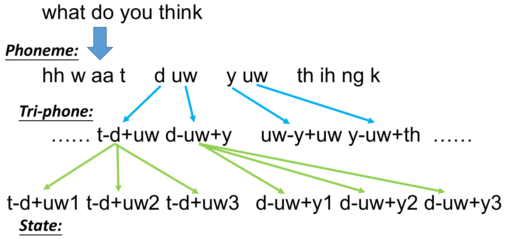

以上就是人类语言的基本构架

#### The first stage of speech recognition

语音辨识的过程其实非常复杂，这里只是讲语音辨识的第一步

你首先要做的事情是把acoustic feature(声学特征)转成state，这是一个单纯的classification的problem

大致过程就是在一串wave form(声音信号)上面取一个window(通常不会取太大，比如250个mini second大小)，然后用acoustic feature来描述这个window里面的特性，每隔一个时间段就取一个window，一段声音信号就会变成一串vector sequence，这个就叫做acoustic feature sequence

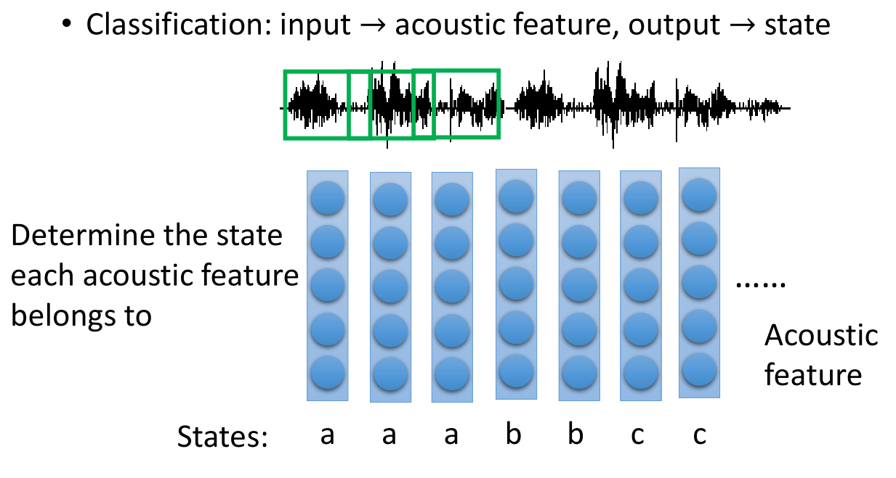

你要建一个Classifier去识别acoustic feature属于哪个state，再把state转成phoneme，然后把phoneme转成文字，接下来你还要考虑同音异字的问题...

这里不会详细讲述整个过程，而是想要比较一下过去在用deep learning之前和用deep learning之后，在语音辨识上的分类模型有什么差异

#### Classification

##### HMM-GMM

传统的方法叫做HMM-GMM

GMM，即Gaussian Mixture Model ，它假设语音里的每一个state都是相互独立的（跟前面长头发的shallow例子很像，也是假设每种情况相互独立），因此属于每个state的acoustic feature都是stationary distribution（静态分布）的，因此我们可以针对每一个state都训练一个GMM model来识别

但这个方法其实不太现实，因为要列举的model数目太多了，一般语言中英文都有30几、将近40个phoneme，那这边就假设是30个，而在tri-phone里面，每一个phoneme随着context的不同又有变化，假设tri-phone的形式是a-b-c，那总共就有30\*30\*30=27000个tri-phone，而每一个tri-phone又有三个state，每一个state都要用一个GMM来描述，那参数实在是太多了

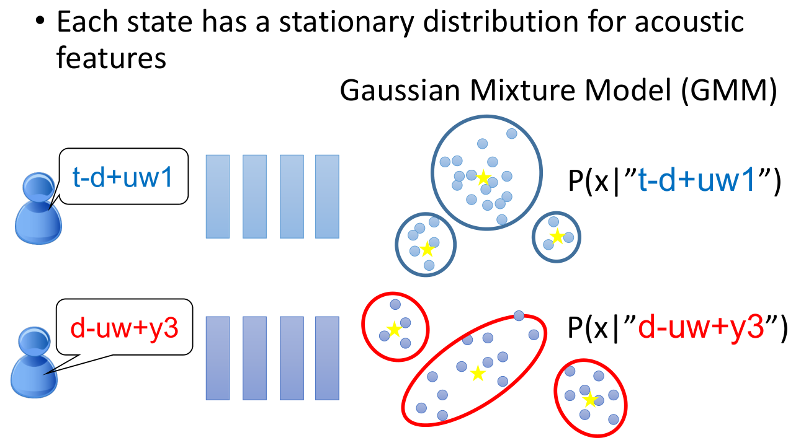

在有deep learning之前的传统处理方法是，让一些不同的state共享同样的model distribution，这件事情叫做Tied-state，实际操作上就把state当做pointer，不同的pointer可能会指向同样的distribution，所以有一些state的distribution是共享的，具体哪些state共享distribution则是由语言学等专业知识决定

那这样的处理方法太粗糙了，所以又有人提出了subspace GMM，它里面其实就有modularization、有模块化的影子

它的想法是，我们先找一个Gaussian pool（里面包含了很多不同的Gaussian distribution），每一个state的information就是一个key，它告诉我们这个state要从Gaussian pool里面挑选哪些Gaussian出来

比如有某一个state 1，它挑第一、第三、第五个Gaussian；另一个state 2，它挑第一、第四、第六个Gaussian；如果你这样做，这些state有些时候就可以share部分的Gaussian，有些时候又可以完全不share Gaussian，至于要share多少Gaussian，这都是可以从training data中学出来的

HMM-GMM的方法，默认把所有的phone或者state都看做是无关联的，对它们分别训练independent model，这其实是不efficient的，它没有充分利用data提供的信息

对人类的声音来说，不同的phoneme都是由人类的发音器官所generate出来的，它们并不是完全无关的，下图画出了人类语言里面所有的元音，这些元音的发音其实就只受到三件事情的影响：

- 舌头的前后位置
- 舌头的上下位置
- 嘴型

比如图中所标英文的5个元音a，e，i，o，u，当你发a到e到i的时候，舌头是由下往上；而i跟u，则是舌头放在前面或放在后面的差别；在图中同一个位置的元音，它们舌头的位置是一样的，只是嘴型不一样

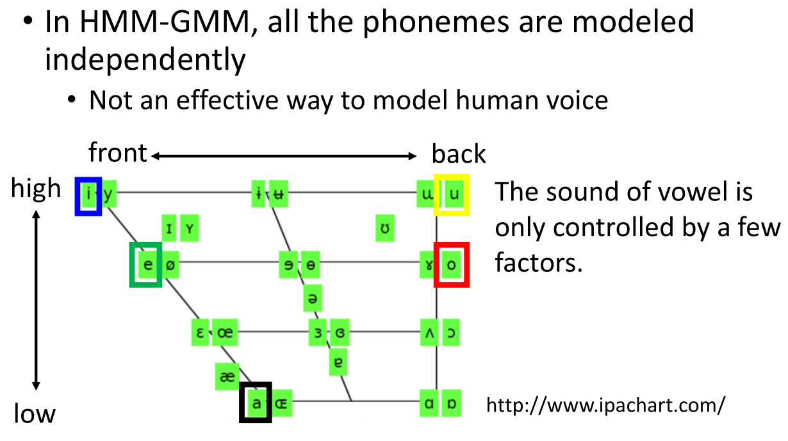

##### DNN

如果采用deep learning的做法，就是去learn一个deep neural network，这个deep neural network的input是一个acoustic feature，它的output就是该feature属于某个state的概率，这就是一个简单的classification problem

那这边最关键的一点是，所有的state识别任务都是用同一个DNN来完成的；值得注意的是DNN并不是因为参数多取胜的，实际上在HMM-GMM里用到的参数数量和DNN其实是差不多的，区别只是GMM用了很多很小的model ，而DNN则用了一个很大的model

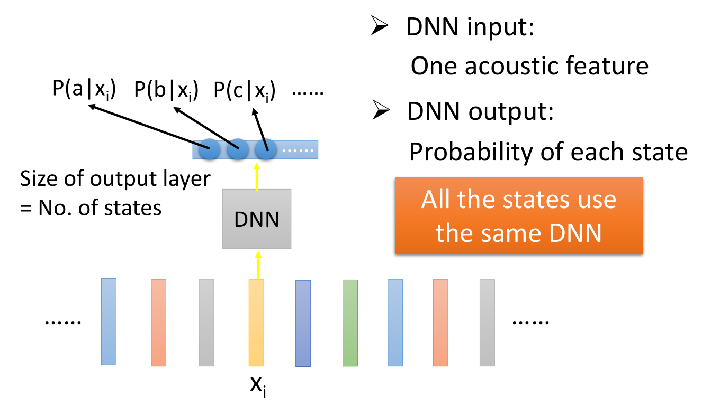

DNN把所有的state通通用同一个model来做分类，会是一种比较有效率的做法，解释如下

我们拿一个hidden layer出来，然后把这个layer里所有neuron的output降维到2维得到下图，每个点的颜色对应着input a，e，i，o，u，神奇的事情发生了：降维图上这5个元音的分布跟右上角元音位置图的分布几乎是一样的

因此，DNN并不是马上就去检测发音是属于哪一个phone或哪一个state，比较lower的layer会先观察人是用什么样的方式在发这个声音，人的舌头位置应该在哪里，是高是低，是前是后；接下来的layer再根据这个结果，去决定现在的发音是属于哪一个state或哪一个phone

这些lower的layer是一个人类发音方式的detector，而所有phone的检测都share这同一组detector的结果，因此最终的这些classifier是share了同一组用来detect发音方式的参数，这就做到了模块化，同一个参数被更多的地方share，因此显得更有效率

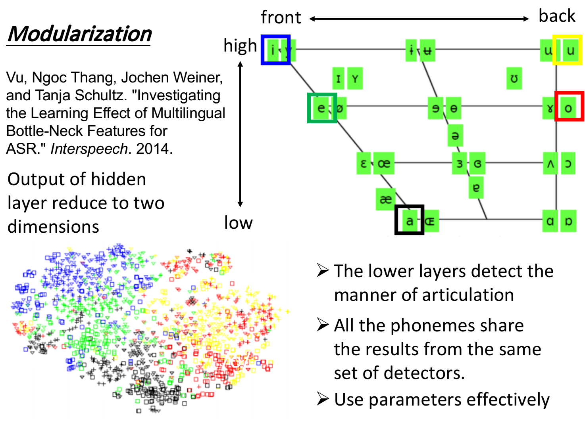

### Result

这个时候就可以来回答Why Deep中提到的问题了

Universality Theorem告诉我们任何的continuous的function都可以用一层足够宽的neural network来实现，在90年代，这是很多人放弃做deep learning的一个原因

但是这个理论只告诉了我们可能性，却没有说明这件事的效率问题；根据上面的几个例子我们已经知道，只用一个hidden layer来描述function其实是没有效率的；当你用multi-layer，用hierarchy structure来描述function的时候，才会是比较有效率的

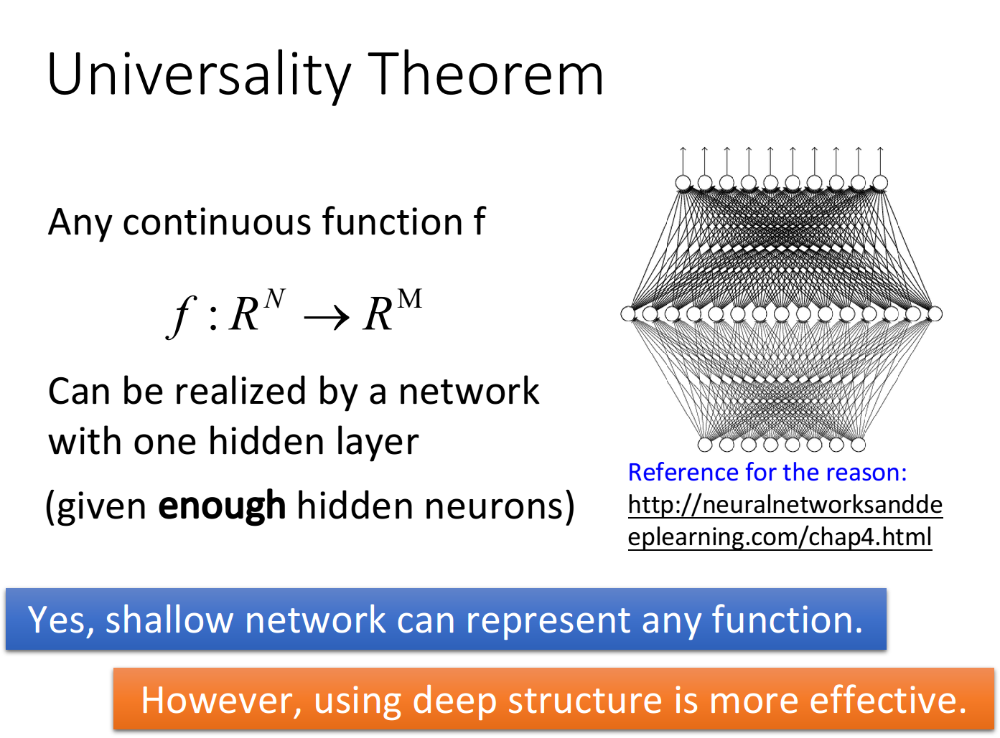

### Analogy

下面用逻辑电路和剪窗花的例子来更形象地描述Deep和shallow的区别

#### Logic Circuit

逻辑电路其实可以拿来类比神经网络

- Logic circuits consists of **gates**；Neural network consists of **neurons**

- A two layers of logic gates can represent any Boolean function；有一个hidden layer的network(input layer+hidden layer共两层)可以表示任何continuous function

  - 逻辑门只要根据input的0、1状态和对应的output分别建立起门电路关系即可建立两级电路

- 实际设计电路的时候，为了节约成本，会进行多级优化，建立起hierarchy架构，如果某一个结构的逻辑门组合被频繁用到的话，其实在优化电路里，这个组合是可以被多个门电路共享的，这样用比较少的逻辑门就可以完成一个电路；在deep neural network里，践行modularization的思想，许多neuron作为子特征检测器被多个classifier所共享，本质上就是参数共享，就可以用比较少的参数就完成同样的function

  比较少的参数意味着不容易overfitting，用比较少的data就可以完成同样任务

#### 剪窗花

我们之前讲过这个逻辑回归的分类问题，可能会出现下面这种linear model根本就没有办法分类的问题，而当你加了hidden layer的时候，就相当于做了一个feature transformation，把原来的$x_1$，$x_2$转换到另外一个平面，变成$x_1'$，$x_2'$

你会发现，在例子中通过这个hidden layer的转换，其实就好像把原来这个平面按照对角线对折了一样，对折后两个蓝色的点就重合在了一起，这个过程跟剪窗花很像：

- 我们在做剪窗花的时候，每次把色纸对折，就相当于把原先的这个多维空间对折了一次来提高维度
- 如果你在某个地方戳一个洞，再把色纸打开，你折了几折，在对应的这些地方就都会有一个洞；那你在这个高维空间上的某一个点，就相当于展开后空间上的许多点，由于可以对这个空间做各种各样复杂的对折和剪裁，所以二维平面上无论多少复杂的分类情况，经过多次折叠，不同class最后都可以在一个高维空间上以比较明显的方式被分隔开来

这样做既可以解决某些情况下难以分类的问题，又能够以比较有效率的方式充分利用data（比如高维空间上的1个点等于二维空间上的5个点，相当于1笔data发挥出5笔data的作用），deep learning是更有效率的利用data

下面举了一个小例子：

左边的图是training data，右边则是1层hidden layer与3层hidden layer的不同network的情况对比，这里已经控制它们的参数数量趋于相同，试验结果是，当training data为10万笔的时候，两个network学到的样子是比较接近原图的，而如果只给2万笔training data，1层hidden layer的情况就完全崩掉了，而3层hidden layer的情况会比较好一些，它其实可以被看作是剪窗花的时候一不小心剪坏了，然后展开得到的结果

关于如何得到model学到的图形，可以用固定model的参数，然后对input进行梯度下降，最终得到结果

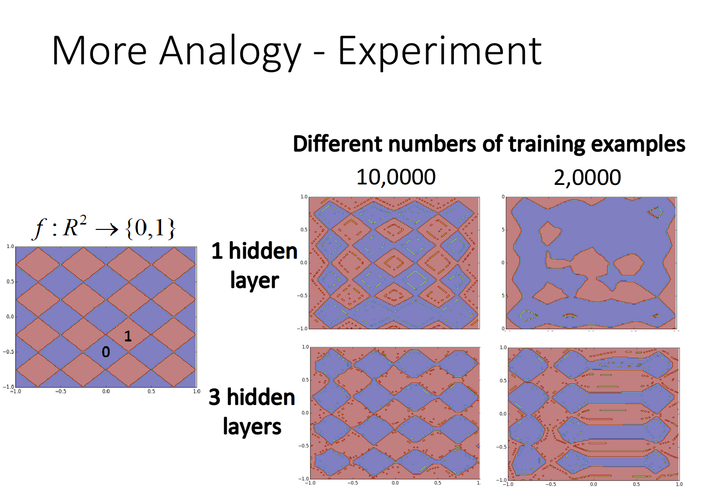

### End-to-end Learning

#### Introduction

所谓的End-to-end learning，指的是只给model input和output，而不告诉它中间每一个function要怎么分工，让它自己去学会知道在生产线的每一站，自己应该要做什么事情；在DNN里，就是叠一个很深的neural network，每一层layer就是生产线上的一个站

#### Speech Recognition

End-to-end Learning在语音识别上体现的非常明显

在传统的Speech Recognition里，只有最后GMM这个蓝色的block，才是由training data学出来的，前面绿色的生产线部分都是由过去的古圣先贤手动制订出来的，其实制订的这些function非常非常的强，可以说是增一分则太肥，减一分则太瘦这样子，以至于在这个阶段卡了将近20年

后来有了deep learning，我们就可以用neural network把DCT离散余弦变换取代掉，甚至你从spectrogram开始都拿deep neural network取代掉，也可以得到更好的结果，如果你分析DNN的weight，它其实可以自动学到要做filter bank这件事情（filter bank是模拟人类的听觉器官所制定出来的filter）

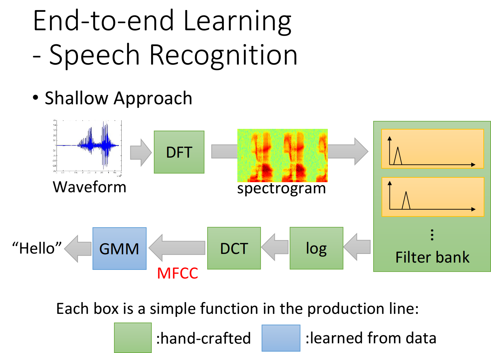

那能不能够叠一个很深很深的neural network，input直接就是time domain上的声音信号，而output直接就是文字，中间完全不要做Fourier transform之类？

目前的结果是，它学到的极限也只是做到与做了Fourier transform的结果打平而已。Fourier transform很强，但是已经是信号处理的极限了，machine做的事情就很像是在做Fourier transform，但是只能做到一样好，没有办法做到更好

有关End-to-end Learning在Image Recognition的应用和Speech Recognition很像，这里不再赘述

### Complex Task

那deep learning还有什么好处呢？

有时候我们会遇到非常复杂的task：

- 有时候非常像的input，它会有很不一样的output

  比如在做图像辨识的时候，下图这个白色的狗跟北极熊其实看起来是很像的，但是你的machine要有能力知道，看到左边这张图要output狗，看到右边这张图要output北极熊

- 有时候看起来很不一样的input，output其实是一样的

  比如下面这两个方向上看到的火车，横看成岭侧成峰，尽管看到的很不一样，但是你的machine要有能力知道这两个都是同一种东西

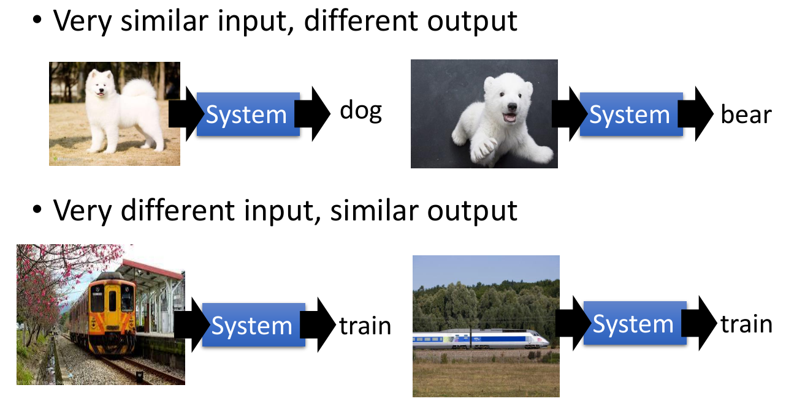

如果你的network只有一层的话，就只能做简单的transform，没有办法把一样的东西变得很不一样，把不一样的东西变得很像；如果要实现这些，就需要做很多层次的转换

以语音识别为例，把MFCC投影到二维平面，不同颜色代表不同人说的同一句话，第一个隐藏层输出还是很不一样，第八个隐藏层输出，不同人说的同样的句子，变得很像，经过很多的隐藏层转换后，就把他们map在一起了。

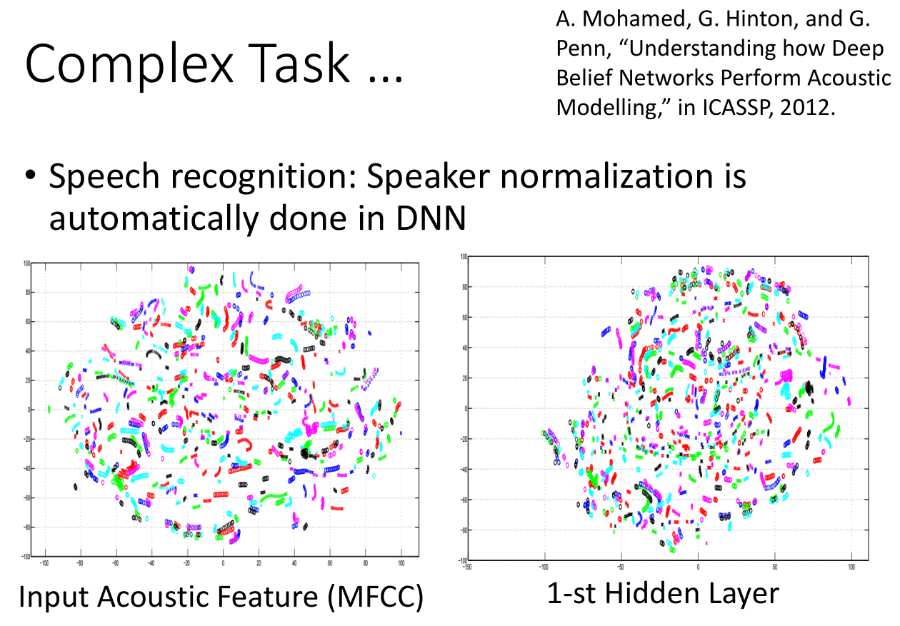

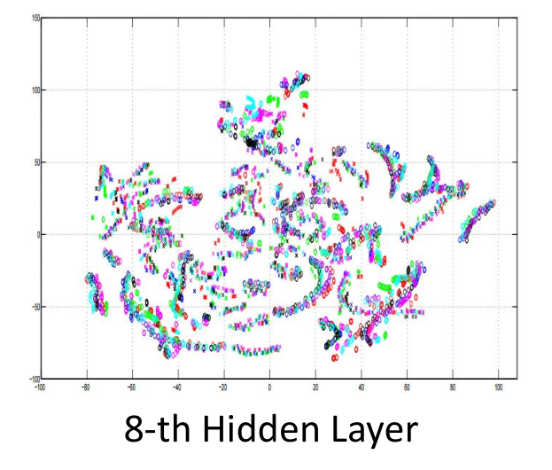

这里以MNIST手写数字识别为例，展示一下DNN中，在高维空间上对这些Complex Task的处理能力

如果把28\*28个pixel组成的vector投影到二维平面上就像左上角所示，你会发现4跟9的pixel几乎是叠在一起的，因为4跟9很像，都是一个圈圈再加一条线，所以如果你光看input的pixel的话，4跟9几乎是叠在一起的，你几乎没有办法把它分开

但是，等到第二个、第三个layer的output，你会发现4、7、9逐渐就被分开了，所以使用deep learning的deep，这也是其中一个理由

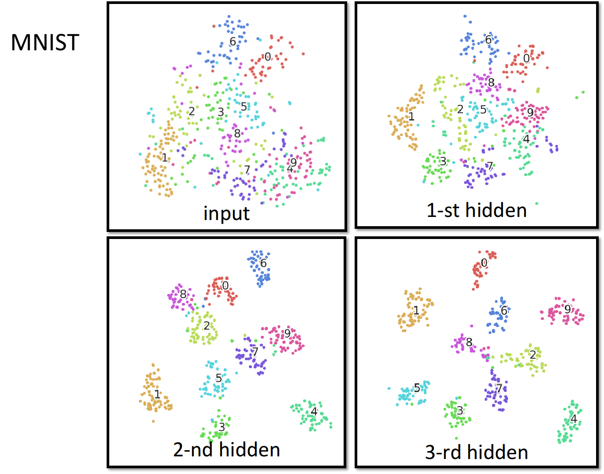

### Conclusion

- 考虑input之间的内在关联，所有的class用同一个model来做分类
- modularization思想，复杂问题简单化，把检测复杂特征的大任务分割成检测简单特征的小任务
- 所有的classifier使用同一组参数的子特征检测器，共享检测到的子特征
- 不同的classifier会share部分的参数和data，效率高
- 联系logic circuit和剪纸的例子
- 多层hidden layer对complex问题的处理上比较有优势

### To learn more …

Do Deep Nets Really Need To Be Deep? (by Rich Caruana)

http://research.microsoft.com/apps/video/default.aspx?id=232373&r=1

Deep Learning: Theoretical Motivations (Yoshua Bengio)

http://videolectures.net/deeplearning2015_bengio_theoretical_motivations/

Connections between physics and deep learning

https://www.youtube.com/watch?v=5MdSE-N0bxs

Why Deep Learning Works: Perspectives from Theoretical Chemistry

https://www.youtube.com/watch?v=kIbKHIPbxiU

## Convolutional Neural Network

### CNN v.s. DNN

我们当然可以用一般的neural network来做影像处理，不一定要用CNN，比如说，你想要做图像的分类，那你就去train一个neural network，它的input是一张图片，你就用里面的pixel来表示这张图片，也就是一个很长很长的vector，而output则是由图像类别组成的vector，假设你有1000个类别，那output就有1000个dimension

但是，我们现在会遇到的问题是这样子：实际上，在train neural network的时候，我们会有一种期待说，在这个network structure里面的每一个neuron，都应该代表了一个最基本的classifier；事实上，在文献上，根据训练的结果，也有很多人得到这样的结论，举例来说，下图中：

- 第一个layer的neuron，它就是最简单的classifier，它做的事情就是detect有没有绿色出现、有没有黄色出现、有没有斜的条纹出现等等
- 那第二个layer，它做的事情是detect更复杂的东西，根据第一个layer的output，它如果看到直线横线，就是窗框的一部分；如果看到棕色的直条纹就是木纹；看到斜条纹加灰色的，这个有可能是很多东西，比如说，轮胎的一部分等等
- 再根据第二个hidden layer的output，第三个hidden layer会做更复杂的事情，比如它可以知道说，当某一个neuron看到蜂巢，它就会被activate；当某一个neuron看到车子，它就会被activate；当某一个neuron看到人的上半身，它就会被activate等等

那现在的问题是这样子：当我们直接用一般的fully connected的feedforward network来做图像处理的时候，往往会需要太多的参数

举例来说，假设这是一张100\*100的彩色图片，它的分辨率才100\*100，那这已经是很小张的image了，然后你需要把它拉成一个vector，总共有100\*100\*3个pixel（如果是彩色的图的话，每个pixel其实需要3个value，即RGB值来描述它的），把这些加起来input vector就已经有三万维了；如果input vector是三万维，又假设hidden layer有1000个neuron，那仅仅是第一层hidden layer的参数就已经有30000\*1000个了，这样就太多了

所以，CNN做的事情其实是，来简化这个neural network的架构，我们根据自己的知识和对图像处理的理解，一开始就把某些实际上用不到的参数给过滤掉

我们一开始就想一些办法，不要用fully connected network，而是用比较少的参数，来做图像处理这件事情，所以CNN其实是比一般的DNN还要更简单的

虽然CNN看起来，它的运作比较复杂，但事实上，它的模型比DNN还要更简单，我们就是用prior knowledge，去把原来fully connected的layer里面的一些参数拿掉，就变成CNN

#### Why CNN for Image？

为什么我们有可能把一些参数拿掉？为什么我们有可能只用比较少的参数就可以来做图像处理这件事情？下面列出三个对影像处理的观察，这也是CNN架构提出的基础所在

##### Some patterns are much smaller than the whole image

在影像处理里面，如果在network的第一层hidden layer里，那些neuron要做的事情是侦测有没有一种东西、一种pattern（图案样式）出现，那大部分的pattern其实是比整张image要小的，所以对一个neuron来说，想要侦测有没有某一个pattern出现，它其实并不需要看整张image，只需要看这张image的一小部分，就可以决定这件事情了

举例来说，假设现在我们有一张鸟的图片，那第一层hidden layer的某一个neuron的工作是，检测有没有鸟嘴的存在（你可能还有一些neuron侦测有没有鸟嘴的存在、有一些neuron侦测有没有爪子的存在、有一些neuron侦测有没有翅膀的存在、有没有尾巴的存在，之后合起来，就可以侦测，图片中有没有一只鸟），那它其实并不需要看整张图，因为，其实我们只要给neuron看个小的区域，它其实就可以知道说，这是不是一个鸟嘴，对人来说也是一样，只要看这个小的区域你就会知道说这是鸟嘴，所以，**每一个neuron其实只要连接到一个小块的区域就好，它不需要连接到整张完整的图，因此也对应着更少的参数**

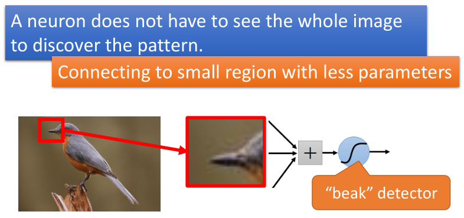

##### The same patterns appear in different regions

同样的pattern，可能会出现在image的不同部分，但是它们有同样的形状、代表的是同样的含义，因此它们也可以用同样的neuron、同样的参数，被同一个detector检测出来

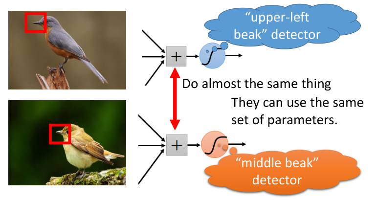

举例来说，图中分别有一个处于左上角的鸟嘴和一个处于中央的鸟嘴，但你并不需要训练两个不同的detector去专门侦测左上角有没有鸟嘴和中央有没有鸟嘴这两件事情，这样做太冗余了，我们要cost down(降低成本)，我们并不需要有两个neuron、两组不同的参数来做duplicate的事情，所以**我们可以要求这些功能几乎一致的neuron共用一组参数，它们share同一组参数就可以帮助减少总参数的量**

##### Subsampling the pixels will not change the object

我们可以对一张image做subsampling，假如你把它奇数行、偶数列的pixel拿掉，image就可以变成原来的十分之一大小，而且并不会影响人对这张image的理解，对你来说，下面两张大小不一的image看起来不会有什么太大的区别，你都可以识别里面有什么物件，因此subsampling对图像辨识来说，可能是没有太大的影响的

所以，**我们可以利用subsampling这个概念把image变小，从而减少需要用到的参数量**

### The whole CNN structure

整个CNN的架构是这样的：

首先，input一张image以后，它会先通过Convolution的layer，接下来做Max Pooling这件事，然后再去做Convolution，再做Max Pooling...

这个process可以反复进行多次（重复次数需要事先决定），这就是network的架构，就好像network有几层一样，你要做几次convolution，做几次Max Pooling，在定这个network的架构时就要事先决定好

当你做完先前决定的convolution和max pooling的次数后，你要做的事情是Flatten，做完flatten以后，你就把Flatten output丢到一般的Fully connected network里面去，最终得到影像辨识的结果

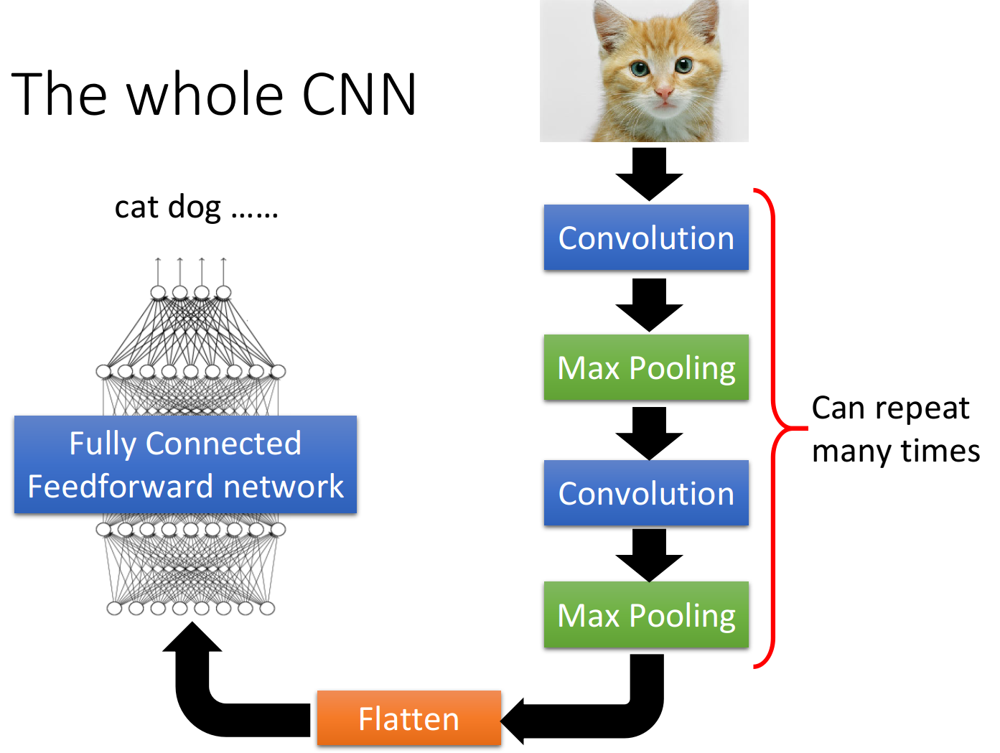

我们基于之前提到的三个对影像处理的观察，设计了CNN这样的架构，第一个是要侦测一个pattern，你不需要看整张image，只要看image的一个小部分；第二个是同样的pattern会出现在一张图片的不同区域；第三个是我们可以对整张image做subsampling

前面两个property，是用convolution的layer来处理的；最后这个property，是用max pooling来处理的

### Convolution

假设现在我们network的input是一张6\*6的image，图像是黑白的，因此每个pixel只需要用一个value来表示，而在convolution layer里面，有一堆Filter，这边的每一个Filter，其实就等同于是Fully connected layer里的一个neuron

#### Property 1

每一个Filter其实就是一个matrix，这个matrix里面每一个element的值，就跟那些neuron的weight和bias一样，是network的parameter，它们具体的值都是通过Training data学出来的，而不是人去设计的

所以，每个Filter里面的值是什么，要做什么事情，都是自动学习出来的，图中每一个filter是3\*3的size，意味着它就是在侦测一个3\*3的pattern，**当它侦测的时候，并不会去看整张image，它只看一个3\*3范围内的pixel，就可以判断某一个pattern有没有出现，这就考虑了property 1**

#### Property 2

这个filter是从image的左上角开始，做一个slide window，每次向右挪动一定的距离，这个距离就叫做stride，由你自己设定，每次filter停下的时候就跟image中对应的3\*3的matrix做一个内积(相同位置的值相乘并累计求和)，这里假设stride=1，那么我们的filter每次移动一格，当它碰到image最右边的时候，就从下一行的最左边开始重复进行上述操作，经过一整个convolution的process，最终得到下图所示的红色的4\*4 matrix

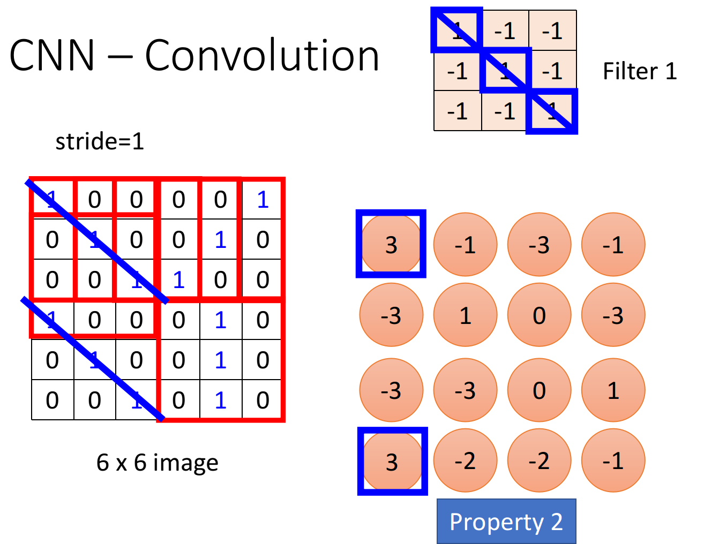

观察上图中的Filter 1，它斜对角的地方是1,1,1，所以它的工作就是detect有没有连续的从左上角到右下角的1,1,1出现在这个image里面，检测到的结果已在上图中用蓝线标识出来，此时filter得到的卷积结果的左上和左下得到了最大的值，这就代表说，该filter所要侦测的pattern出现在image的左上角和左下角

**同一个pattern出现在image左上角的位置和左下角的位置，并不需要用到不同的filter，我们用filter 1就可以侦测出来，这就考虑了property 2**

#### Feature Map

在一个convolution的layer里面，它会有一打filter，不一样的filter会有不一样的参数，但是这些filter做卷积的过程都是一模一样的，你把filter 2跟image做完convolution以后，你就会得到另外一个蓝色的4\*4 matrix，那这个蓝色的4\*4 matrix跟之前红色的4\*4 matrix合起来，他们就叫做**Feature Map**，有多少个filter，对应就有多少个映射后的image，filter的数量等于feature map的数量

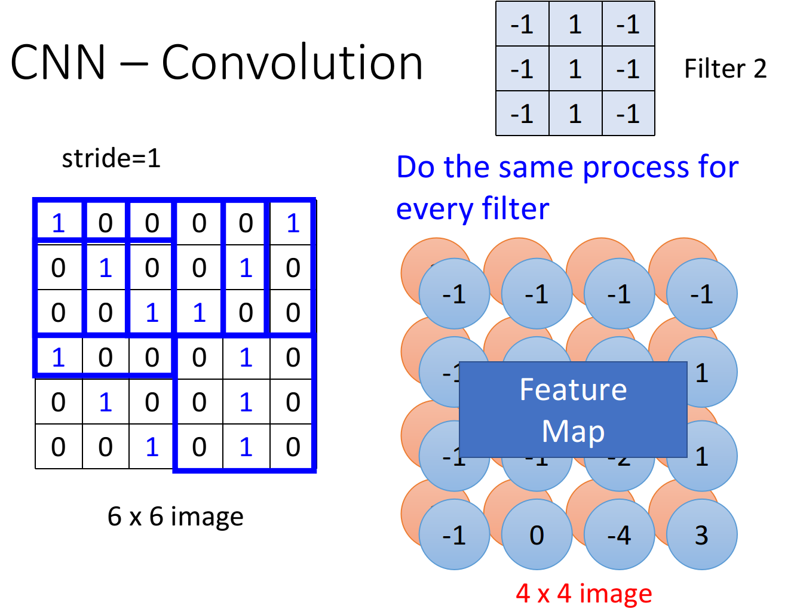

CNN对**不同scale的相同pattern的处理**上存在一定的困难，由于现在每一个filter size都是一样的，这意味着，如果你今天有同一个pattern，它有不同的size，有大的鸟嘴，也有小的鸟嘴，CNN并不能够自动处理这个问题；

DeepMind曾经发过一篇paper，提到了当你input一张image的时候，它在CNN前面，再接另外一个network，这个network做的事情是，它会output一些scalar，告诉你说，它要把这个image的里面的哪些位置做旋转、缩放，然后，再丢到CNN里面，这样你其实会得到比较好的performance

#### Colorful image

刚才举的例子是黑白的image，所以你input的是一个matrix，如果今天是彩色的image会怎么样呢？我们知道彩色的image就是由RGB组成的，所以一个彩色的image，它就是好几个matrix叠在一起，是一个立方体，如果我今天要处理彩色的image，要怎么做呢？

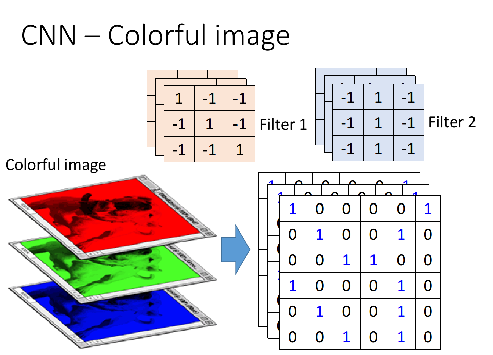

这个时候你的filter就不再是一个matrix了，它也会是一个立方体，如果你今天是RGB这三个颜色来表示一个pixel的话，那你的input就是3\*6\*6，你的filter就是3\*3\*3，你的filter的高就是3，在做convolution的话，就是将filter的9个值和image的9个值做内积，不是把每一个channel分开来算，而是合在一起来算，一个filter就考虑了不同颜色所代表的channel，具体操作为做内积，并且三层的结果相加，得到一个scalar，因此一个filter可以得到一个feature map，并且层数只能为1层

图中的这种情况，输出的feature map有2个channel，分别是filter 1和filter 2与原图卷积得到的矩阵。

#### Convolution v.s. Fully connected

接下来要讲的是，convolution跟fully connected有什么关系，你可能觉得说，它是一个很特别的operation，感觉跟neural network没半毛钱关系，其实，它就是一个neural network

convolution这件事情，其实就是fully connected的layer把一些weight拿掉而已，下图中绿色方框标识出的feature map的output，其实就是hidden layer的neuron的output

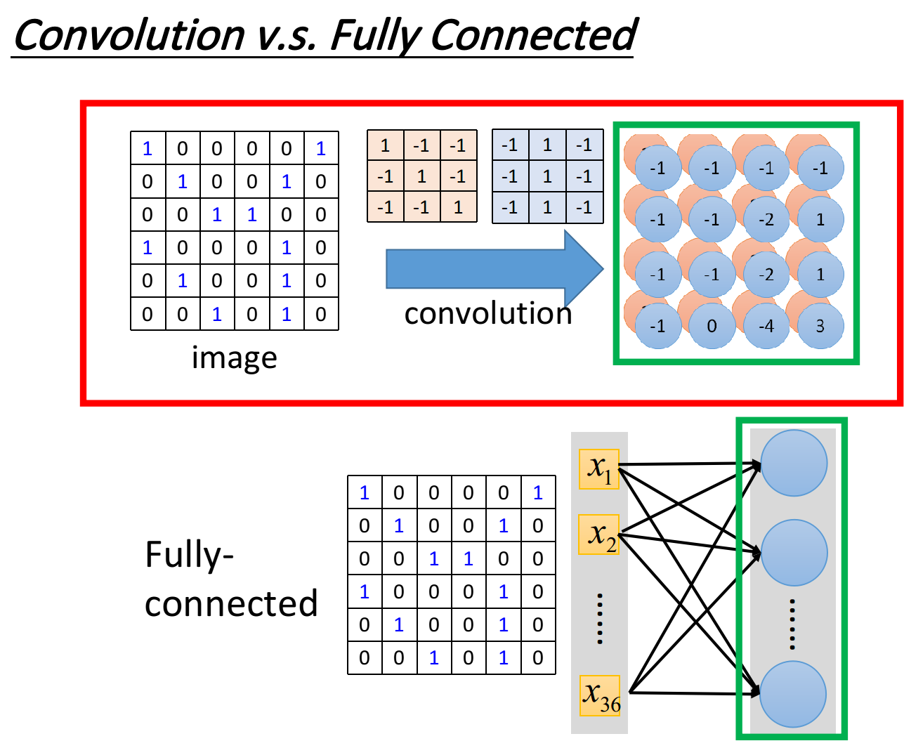

接下来我们来解释这件事情：

如下图所示，我们在做convolution的时候，把filter放在image的左上角，然后再去做inner product，得到一个值3；这件事情等同于，我们现在把这个image的6\*6的matrix拉直变成右边这个用于input的vector，然后，你有一个neuron，这些input经过这个neuron之后，得到的output是3

那这个neuron的output怎么来的呢？这个neuron实际上就是由filter转化而来的，我们把filter放在image的左上角，此时filter考虑的就是和它重合的9个pixel，假设你把这一个6\*6的image的36个pixel拉成直的vector作为input，那这9个pixel分别就对应着右侧编号1，2，3的pixel，编号7，8，9的pixel跟编号13，14，15的pixel

如果我们说这个filter和image matrix做inner product以后得到的output 3，就是input vector经过某个neuron得到的output 3的话，这就代表说存在这样一个neuron，这个neuron带weight的连线，就只连接到编号为1，2，3，7，8，9，13，14，15的这9个pixel而已，而这个neuron和这9个pixel连线上所标注的的weight就是filter matrix里面的这9个数值

作为对比，Fully connected的neuron是必须连接到所有36个input上的，但是，我们现在只用连接9个input，因为我们知道要detect一个pattern，不需要看整张image，看9个input pixel就够了，所以当我们这么做的时候，就用了比较少的参数

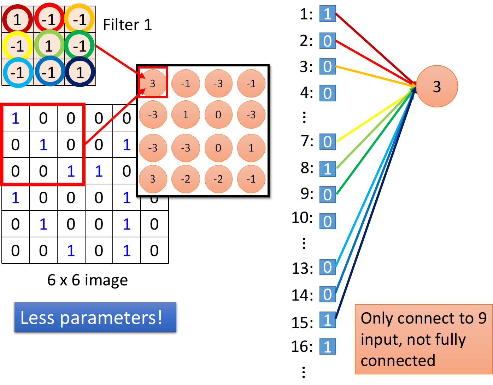

当我们把filter做stride = 1的移动的时候，会发生什么事呢？此时我们通过filter和image matrix的内积得到另外一个output值-1，我们假设这个-1是另外一个neuron的output，那这个neuron会连接到哪些input呢？下图中这个框起来的地方正好就对应到pixel 2，3，4，pixel 8，9，10跟pixel 14，15，16

你会发现output为3和-1的这两个neuron，它们分别去检测在image的两个不同位置上是否存在某个pattern，因此在Fully connected layer里它们做的是两件不同的事情，每一个neuron应该有自己独立的weight

但是，当我们做这个convolution的时候，首先我们把每一个neuron前面连接的weight减少了，然后我们强迫某些neuron（比如图中output为3和-1的两个neuron），它们一定要共享一组weight

虽然这两个neuron连接到的pixel对象各不相同，但它们用的weight都必须是一样的，等于filter里面的元素值

这件事情就叫做weight share，当我们做这件事情的时候，用的参数，又会比原来更少

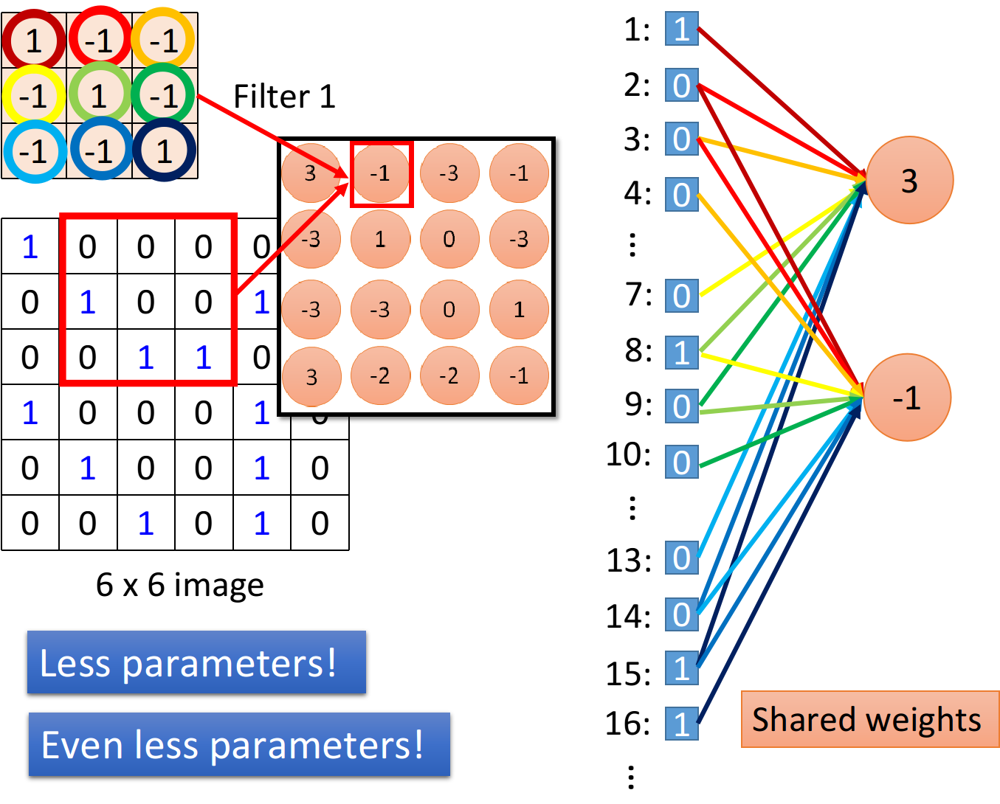

因此我们可以这样想，有这样一些特殊的neuron，它们只连接着9条带weight的线（9=3\*3对应着filter的元素个数，这些weight也就是filter内部的元素值，上图中圆圈的颜色与连线的颜色一一对应）

当filter在image matrix上移动做convolution的时候，每次移动做的事情实际上是去检测这个地方有没有某一种pattern，对于Fully connected layer来说，它是对整张image做detection的，因此每次去检测image上不同地方有没有pattern其实是不同的事情，所以这些neuron都必须连接到整张image的所有pixel上，并且不同neuron的连线上的weight都是相互独立的

对于convolution layer来说，首先它是对image的一部分做detection的，因此它的neuron只需要连接到image的部分pixel上，对应连线所需要的weight参数就会减少；

其次由于是用同一个filter去检测不同位置的pattern，所以这对convolution layer来说，其实是同一件事情，因此不同的neuron，虽然连接到的pixel对象各不相同，但是在“做同一件事情”的前提下，也就是用同一个filter的前提下，这些neuron所使用的weight参数都是相同的，通过这样一种weight share的方式，再次减少network所需要用到的weight参数

CNN的本质，就是减少参数的过程

#### Training

看到这里你可能会问，这样的network该怎么搭建，又该怎么去train呢？

首先，第一件事情就是这都是用toolkit做的，所以你大概不会自己去写；如果你要自己写的话，它其实就是跟原来的Backpropagation用一模一样的做法，只是有一些weight就永远是0，你就不去train它，它就永远是0

然后，怎么让某些neuron的weight值永远都是一样呢？你就用一般的Backpropagation的方法，对每个weight都去算出gradient，再把本来要tight在一起、要share weight的那些weight的gradient平均，然后，让他们update同样值就ok了

### Max Pooling

#### Operation of max pooling

相较于convolution，max pooling是比较简单的，它就是做subsampling，根据filter 1，我们得到一个4\*4的matrix，根据filter 2，你得到另外一个4\*4的matrix，接下来，我们要做什么事呢？

我们把output四个分为一组，每一组里面通过选取平均值或最大值的方式，把原来4个value合成一个 value，这件事情相当于在image每相邻的四块区域内都挑出一块来检测，这种subsampling的方式就可以让你的image缩小！

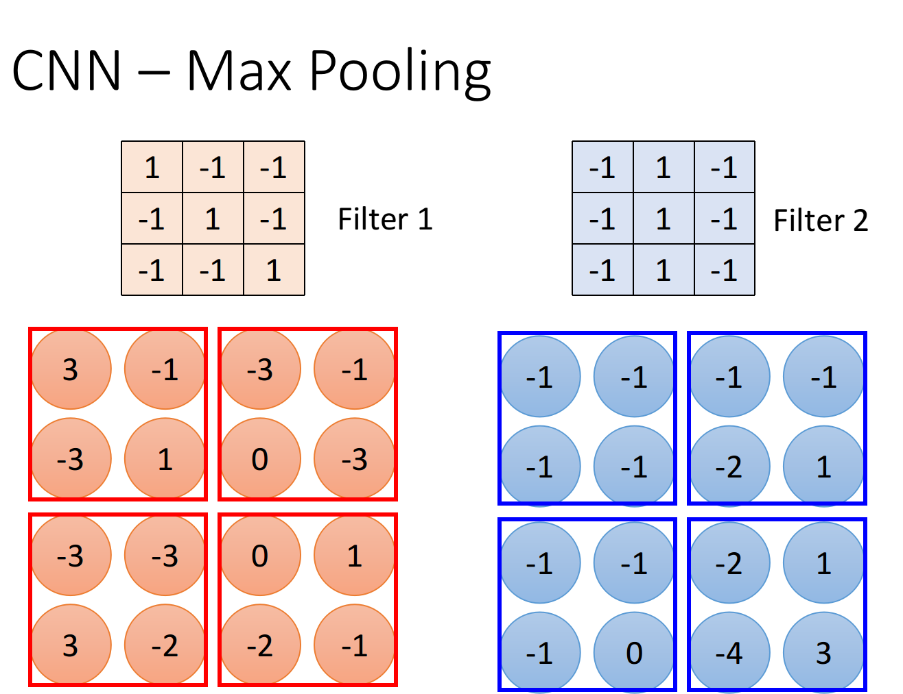

讲到这里你可能会有一个问题，如果取Maximum放到network里面，不就没法微分了吗？max这个东西，感觉是没有办法对它微分的啊，其实是可以的，类比Maxout network，你就知道怎么用微分的方式来处理它

### The whole CNN

做完一次convolution加一次max pooling，我们就把原来6\*6的image，变成了一个2\*2的image；至于这个2\*2的image，它每一个pixel的深度，也就是每一个pixel用几个value来表示，就取决于你有几个filter，如果你有50个filter，就是50维，像下图中是两个filter，对应的深度就是两维，得到结果就是一个new smaller image，一个filter就代表了一个channel。

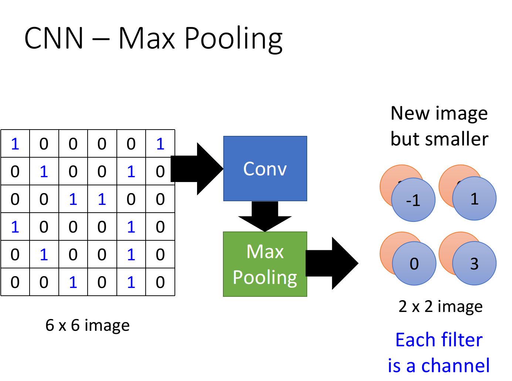

所以，这是一个新的比较小的image，它表示的是不同区域上提取到的特征，实际上不同的filter检测的是该image同一区域上的不同特征属性，所以每一层channel代表的是一种属性，一块区域有几种不同的属性，就有几层不同的channel，对应的就会有几个不同的filter对其进行convolution操作，**Each filter is a channel**

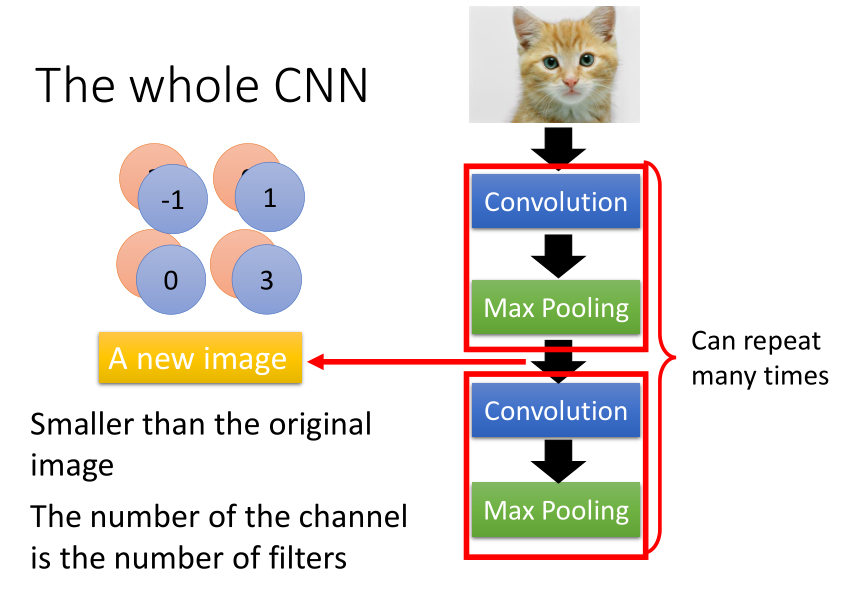

这件事情可以repeat很多次，你可以把得到的这个比较小的image，再次进行convolution和max pooling的操作，得到一个更小的image，依次类推

有这样一个问题：假设我第一个convolution有25个filter，通过这些filter得到25个feature map，然后repeat的时候第二个convolution也有25个filter，那这样做完，我是不是会得到25^2个feature map？

其实不是这样的，你这边做完一次convolution，得到25个feature map之后再做一次convolution，还是会得到25个feature map，因为convolution在考虑input的时候，是会考虑深度的，它并不是每一个channel分开考虑，而是一次考虑所有的channel，所以，你convolution这边有多少个filter，再次output的时候就会有多少个channel，**The number of the channel is the number of filters**，只不过下一次convolution时，25个filter都是一个立方体，它的高有25个value那么高

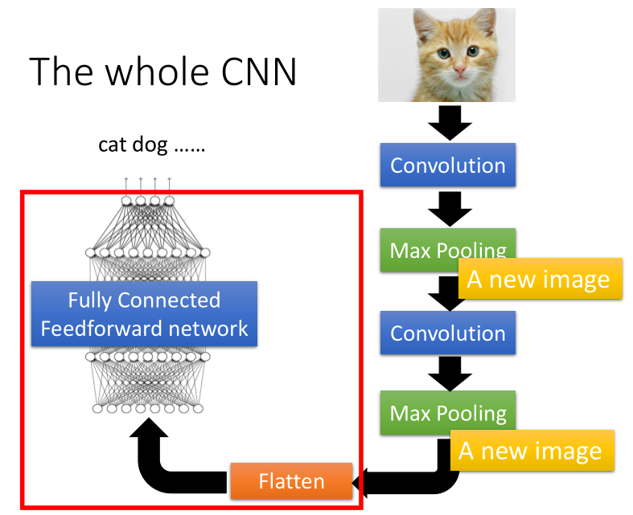

这件事可以repeat很多次，通过一个convolution + max pooling就得到新的 image。它是一个比较小的image，可以把这个小的image，做同样的事情，再次通过convolution + max pooling，将得到一个更小的image。

#### filter

- 假设我们input是一个1\*28\*28的image

- 通过25个filter的convolution layer以后你得到的output，会有25个channel，又因为filter的size是3\*3，因此如果不考虑image边缘处的处理的话，得到的channel会是26\*26的，因此通过第一个convolution得到25\*26\*26的cubic image

- 接下来就是做Max pooling，把2\*2的pixel分为一组，然后从里面选一个最大的组成新的image，大小为25\*13\*13

- 再做一次convolution，假设这次选择50个filter，每个filter size是3\*3的话，output的channel就变成有50个，那13\*13的image，通过3\*3的filter，就会变成11\*11，因此通过第二个convolution得到50\*11\*11的image

- 再做一次Max Pooling，变成50\*5\*5

在第一个convolution里面，每一个filter都有9个参数，它就是一个3\*3的matrix；但是在第二个convolution layer里面，虽然每一个filter都是3\*3，但它其实不是3\*3个参数，因为它的input是一个25\*13\*13的cubic，这个cubic的channel有25个，所以**要用同样高度的cubic filter对它进行卷积**，于是我们的**filter实际上是一个25\*3\*3的cubic**，所以第二个convolution layer这边每个filter共有225个参数

通过两次convolution和max pooling的组合，最终的image变成了50\*5\*5的size，然后使用Flatten将这个image拉直，变成一个1250维的vector，再把它丢到一个Fully Connected Feedforward network里面，network structure就搭建完成了

看到这里，你可能会有一个疑惑，第二次convolution的input是25\*13\*13的cubic，用50个3\*3的filter卷积后，得到的输出时应该是50个cubic，且每个cubic的尺寸为25\*11\*11，那么max pooling把长宽各砍掉一半后就是50层25\*5\*5的cubic，那flatten后不应该就是50\*25\*5\*5吗？

其实**不是这样的**，在第二次做convolution的时候，我们是**用25\*3\*3的cubic filter对25\*13\*13的cubic input进行卷积操作的**，**filter的每一层和input cubic中对应的每一层(也就是每一个channel)，它们==进行内积后，还要把cubic的25个channel的内积值进行求和，作为这个“neuron”的output，它是一个scalar==**，这个**cubic filter对整个cubic input做完一遍卷积操作后，得到的是一层scalar，然后有50个cubic filter，对应着50层scalar，因此最终得到的output是一个50\*11\*11的cubic**

这里的关键是**filter和image都是cubic，每个cubic filter有25层高，它和同样有25层高的cubic image做卷积，并==不是单单把每个cubic对应的channel进行内积，还会把这些内积求和，最终变为1层==**

因此**两个矩阵或者tensor做了卷积后，不管之前的维数如何，都会变为一个scalar**

故如果有50个Filter，无论input是什么样子的，最终的output还会是50层

### Flatten

做完convolution和max pooling之后，就是Flatten和Fully connected Feedforward network的部分

Flatten的意思是，把左边的feature map拉直，然后把它丢进一个Fully connected Feedforward network，然后就结束了，也就是说，我们之前通过CNN提取出了image的feature，它相较于原先一整个image的vector，少了很大一部分内容，因此需要的参数也大幅度地减少了，但最终，也还是要丢到一个Fully connected的network中去做最后的分类工作

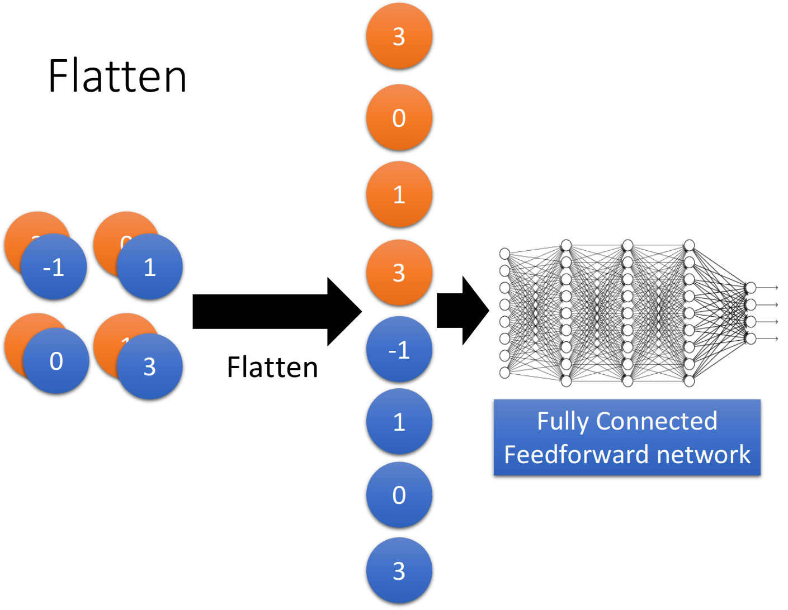

### What does CNN learn？

如果今天有一个方法，它可以让你轻易地理解为什么这个方法会下这样的判断和决策的话，那其实你会觉得它不够intelligent；它必须要是你无法理解的东西，这样它才够intelligent，至少你会感觉它很intelligent

所以，大家常说deep learning就是一个黑盒子，你learn出来以后，根本就不知道为什么是这样子，于是你会感觉它很intelligent，但是其实还是有很多方法可以分析的，今天我们就来示范一下怎么分析CNN，看一下它到底学到了什么

要分析第一个convolution的filter是比较容易的，因为第一个convolution layer里面，每一个filter就是一个3\*3的matrix，它对应到3\*3范围内的9个pixel，所以你只要看这个filter的值，就可以知道它在detect什么东西，因此第一层的filter是很容易理解的

但是你比较没有办法想像它在做什么事情的，是第二层的filter，它们是50个同样为3\*3的filter，但是这些filter的input并不是pixel，而是做完convolution再做Max pooling的结果，因此filter考虑的范围并不是3\*3=9个pixel，而是一个长宽为3\*3，高为25的cubic，filter实际在image上看到的范围是远大于9个pixel的，所以你就算把它的weight拿出来，也不知道它在做什么

那我们怎么来分析一个filter它做的事情是什么呢？你可以这样做：

我们知道在第二个convolution layer里面的50个filter，每一个filter的output就是一个11\*11的matrix，假设我们现在把第k个filter的output拿出来，如下图所示，这个matrix里的每一个element，我们叫它$a^k_{ij}$，上标k表示这是第k个filter，下标$ij$表示它在这个matrix里的第i个row，第j个column

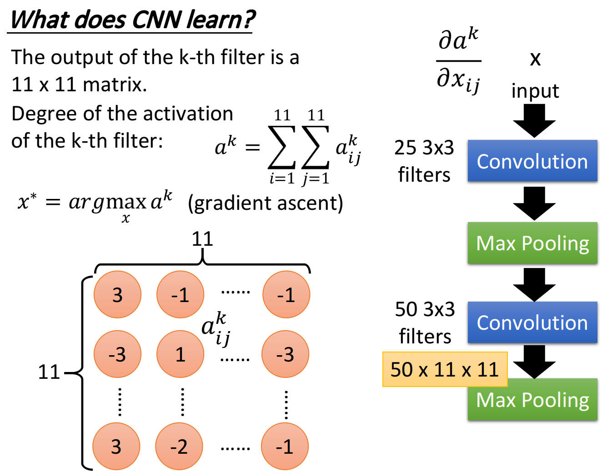

接下来我们define一个$a^k$叫做**Degree of the activation of the k-th filter**，这个值表示现在的第k个filter，它有多被activate，直观来讲就是描述现在input的东西跟第k个filter有多接近，它对filter的激活程度有多少

第k个filter被启动的degree $a^k$就定义成，它与input进行卷积所输出的output里所有element的summation，以上图为例，就是这11*11的output matrix里所有元素之和，用公式描述如下：
$$
a^k=\sum\limits^{11}_{i=1}\sum\limits^{11}_{j=1} a^k_{ij}
$$
也就是说，我们input一张image，然后把这个filter和image进行卷积所output的11\*11个值全部加起来，当作现在这个filter被activate的程度

接下来我们要做的事情是这样子，我们想要知道第k个filter的作用是什么，那我们就要找一张image，这张image可以让第k个filter被activate的程度最大；于是我们现在要解的问题是，找一个image x，它可以让我们定义的activation的degree $a^k$最大，即：
$$
x^*=\arg \max\limits_x a^k
$$
之前我们求minimize用的是gradient descent，那现在我们求Maximum用gradient ascent就可以做到这件事了

仔细一想这个方法还是颇为神妙的，因为我们现在是把input x作为要找的参数，对它去用gradient descent或ascent进行update，原来在train CNN的时候，input是固定的，model的参数是要用gradient descent去找出来的；但是现在这个立场是反过来的，在这个task里面model的参数是固定的，我们要用gradient ascent去update这个x，让它可以使degree of activation最大

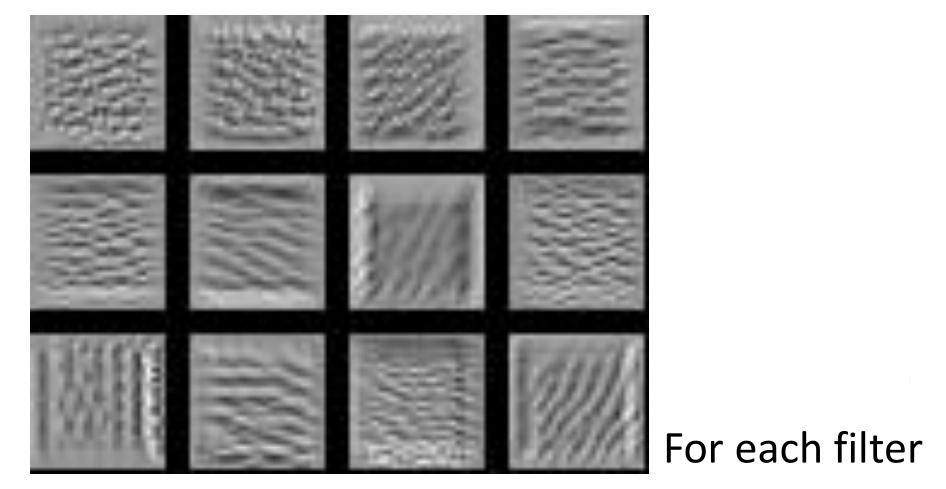

上图就是得到的结果，50个filter理论上可以分别找50张image使对应的activation最大，这里仅挑选了其中的12张image作为展示，这些image有一个共同的特征，它们里面都是一些**反复出现的某种texture(纹路)**，比如说第三张image上布满了小小的斜条纹，这意味着第三个filter的工作就是detect图上有没有斜条纹，要知道现在每个filter检测的都只是图上一个小小的范围而已，所以图中一旦出现一个小小的斜条纹，这个filter就会被activate，相应的output也会比较大，所以如果整张image上布满这种斜条纹的话，这个时候它会最兴奋，filter的activation程度是最大的，相应的output值也会达到最大

因此每个filter的工作就是去detect某一种pattern，detect某一种线条，上图所示的filter所detect的就是不同角度的线条，所以今天input有不同线条的话，某一个filter会去找到让它兴奋度最高的匹配对象，这个时候它的output就是最大的

我们做完convolution和max pooling之后，会将结果用Flatten展开，然后丢到Fully connected的neural network里面去，之前已经搞清楚了filter是做什么的，那我们也想要知道在这个neural network里的每一个neuron是做什么的，所以就对刚才的做法如法炮制

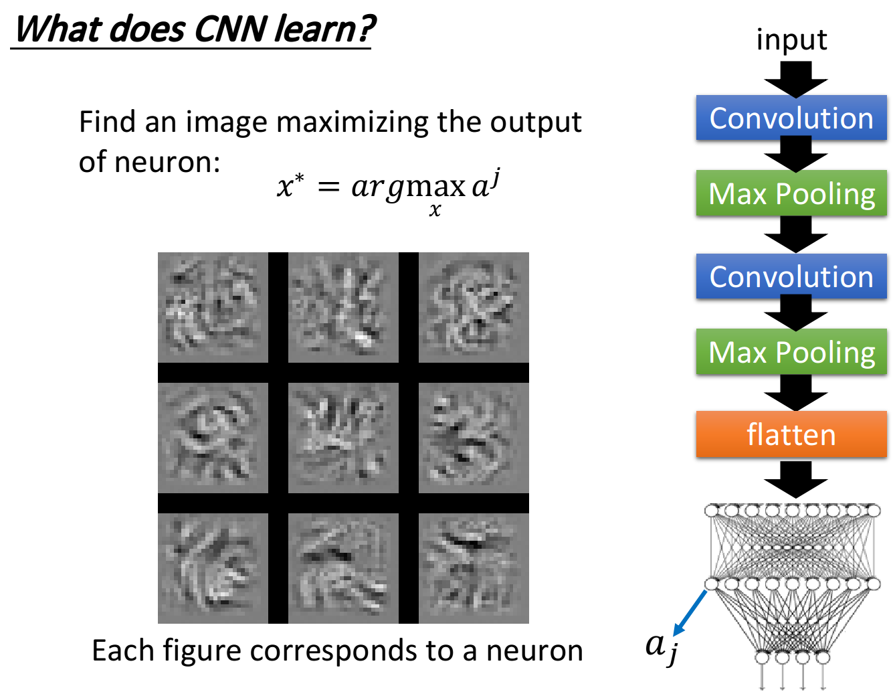

我们定义第j个neuron的output就是$a_j$，接下来就用gradient ascent的方法去找一张image x，把它丢到neural network里面就可以让$a_j$的值被maximize，即：
$$
x^*=\arg \max\limits_x a^j
$$
找到的结果如上图所示，同理这里仅取出其中的9张image作为展示，你会发现这9张图跟之前filter所观察到的情形是很不一样的，刚才我们观察到的是类似纹路的东西，那是因为每个filter考虑的只是图上一部分的vision，所以它detect的是一种texture；

但是在做完Flatten以后，每一个neuron不再是只看整张图的一小部分，它现在的工作是看整张图，所以对每一个neuron来说，让它最兴奋的、activation最大的image，不再是texture，而是一个完整的图形，虽然它侦测的不是完整的数字，但是是比较大的pattern。

接下来我们考虑的是CNN的output，由于是手写数字识别的demo，因此这里的output就是10维，我们把某一维拿出来，然后同样去找一张image x，使这个维度的output值最大，即
$$
x^*=\arg \max_x y^i
$$
你可以想象说，既然现在每一个output的每一个dimension就对应到一个数字，那如果我们去找一张image x，它可以让对应到数字1的那个output layer的neuron的output值最大，那这张image显然应该看起来会像是数字1，你甚至可以期待，搞不好用这个方法就可以让machine自动画出数字

但实际上，我们得到的结果是这样子，如下图所示

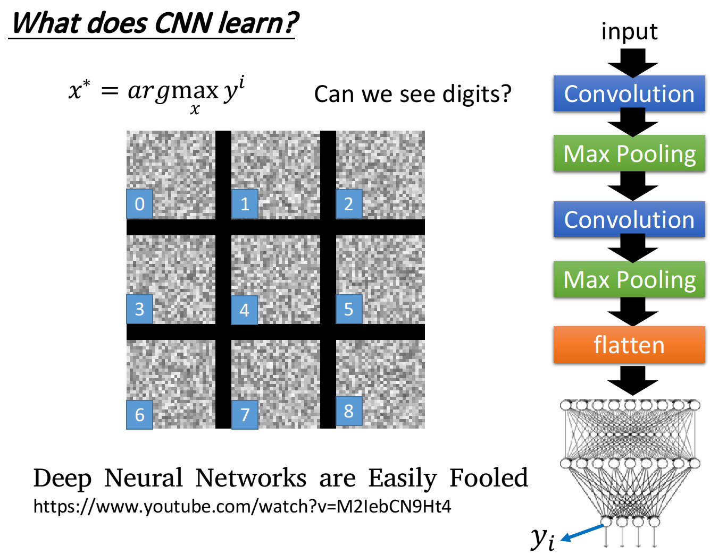

上面的每一张图分别对应着数字0-8，你会发现，可以让数字1对应neuron的output值最大的image其实长得一点也不像1，就像是电视机坏掉的样子，为了验证程序有没有bug，这里又做了一个实验，把上述得到的image真的作为testing data丢到CNN里面，结果classify的结果确实还是认为这些image就对应着数字0-8

所以今天这个neural network，它所学到的东西跟我们人类一般的想象认知是不一样的

那我们有没有办法，让上面这个图看起来更像数字呢？想法是这样的，我们知道一张图是不是一个数字，它会有一些基本的假设，比如这些image，你不知道它是什么数字，你也会认为它显然就不是一个digit，因为人类手写出来的东西就不是长这个样子的，所以我们要对这个x做一些regularization，我们要对找出来的x做一些constraint，我们应该告诉machine说，虽然有一些x可以让你的y很大，但是它们不是数字

那我们应该加上什么样的constraint呢？最简单的想法是说，画图的时候，白色代表的是有墨水、有笔画的地方，而对于一个digit来说，整张image上涂白的区域是有限的，像上面这些整张图都是白白的，它一定不会是数字

假设image里的每一个pixel都用$x_{ij}$表示，我们把所有pixel值取绝对值并求和，也就是$\sum\limits_{i,j}|x_{ij}|$，这一项其实就是之前提到过的L1的regularization，再用$y^i$减去这一项，得到
$$
x^*=\arg \max\limits_x (y^i-\sum\limits_{i,j} |x_{ij}|)
$$
这次我们希望再找一个input x，它可以让$y^i$最大的同时，也要让$|x_{ij}|$的summation越小越好，也就是说我们希望找出来的image，大部分的地方是没有涂颜色的，只有少数数字笔画在的地方才有颜色出现

加上这个constraint以后，得到的结果会像下图右侧所示一样，已经隐约有些可以看出来是数字的形状了

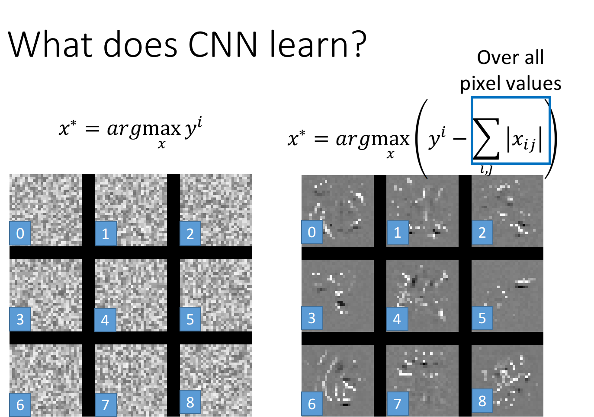

如果再加上一些额外的constraint，比如你希望相邻的pixel是同样的颜色等等，你应该可以得到更好的结果

### Deep Dream

其实，这就是Deep Dream的精神，Deep Dream是说，如果你给machine一张image，它会在这个image里面加上它看到的东西

怎么做这件事情呢？你就找一张image丢到CNN里面去，然后你把某一个convolution layer里面的filter或是fully connected layer里的某一个hidden layer的output拿出来，它其实是一个vector；接下来把本来是positive的dimension值调大，negative的dimension值调小，也就是让正的更正，负的更负，然后把它作为新的image的目标

总体来说就是使它们的绝对值变大，然后用gradient descent的方法找一张image x，让它通过这个hidden layer后的output就是你调整后的target，这么做的目的就是，**让CNN夸大化它看到的东西**——make CNN exaggerates what is sees

也就是说，如果某个filter有被activate，那你让它被activate的更剧烈，CNN可能本来看到了某一样东西，那现在你就让它看起来更像原来看到的东西，这就是所谓的**夸大化**

如果你把上面这张image拿去做Deep Dream的话，你看到的结果就会好像背后有很多念兽，比如像上图右侧那一只熊，它原来是一个石头，对机器来说，它看这张图的时候，本来就觉得这个石头有点像熊，所以你就更强化这件事，让它看起来真的就变成了一只熊，这个就是Deep Dream

### Deep Style

Deep Dream还有一个进阶的版本，就叫做Deep Style，如果今天你input一张image，Deep Style做的事情就是让machine去修改这张图，让它有另外一张图的风格，如下所示

实际上机器做出来的效果惊人的好，具体的做法参考reference：[A Neural Algorithm of Artistic Style](https://arxiv.org/abs/1508.06576)

这里仅讲述Deep Style的大致思路，你把原来的image丢给CNN，得到CNN filter的output，代表这样image里面有什么样的content，然后你把呐喊这张图也丢到CNN里面得到filter的output，注意在这时我们并不在意一个filter output的value到底是什么，我们真正在意的是，filter和filter的output之间的correlation，这个**correlation代表了一张image的style**

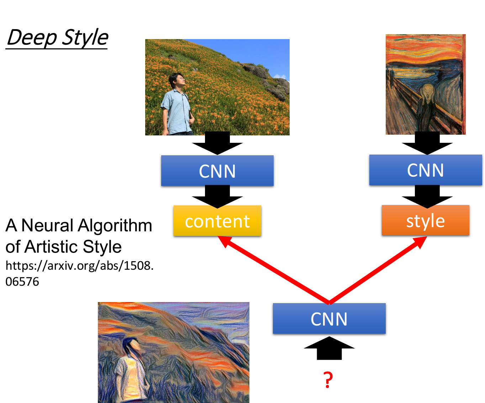

接下来你就再用一个CNN去找一张image，**这张image的content像左边的图片**，比如这张image的filter output的value像左边的图片；同时让**这张image的style像右边的图片**，所谓的style像右边的图片是说，这张image output的filter之间的correlation像右边这张图片

最终你用gradient ascent找到一张image，同时可以maximize左边的content和右边的style，它的样子就像上图左下角所示

### Application

#### Playing Go

##### What does CNN do in Playing Go

CNN可以被运用到不同的应用上，不只是影像处理，比如出名的AlphaGo

想要让machine来下围棋，不见得要用CNN，其实一般typical的neural network也可以帮我们做到这件事情

你只要learn一个network，也就是找一个function，它的input是棋盘当前局势，output是你下一步根据这个棋盘的盘势而应该落子的位置，这样其实就可以让machine学会下围棋了，所以用fully connected的feedforward network也可以做到让machine下围棋这件事情

也就是说，你只要告诉它input是一个19\*19的vector，vector的每一个dimension对应到棋盘上的某一个位置，如果那一个位置有一个黑子的话，就是1，如果有一个白子的话，就是-1，反之呢，就是0，所以如果你把棋盘描述成一个19\*19的vector，丢到一个fully connected的feedforward network里，output也是19\*19个dimension ，每一个dimension对应到棋盘上的一个位置，那machine就可以学会下围棋了

但实际上如果我们采用CNN的话，会得到更好的performance，我们之前举的例子都是把CNN用在图像上面，也就是input是一个matrix，而棋盘其实可以很自然地表示成一个19\*19的matrix，那对CNN来说，就是直接把它当成一个image来看待，然后再output下一步要落子的位置，具体的training process是这样的：

你就搜集很多棋谱，比如说初手下在5之五，次手下在天元，然后再下在5之五，接下来你就告诉machine说，看到落子在5之五，CNN的output就是天元的地方是1，其他的output是0；看到5之五和天元都有子，那你的output就是5之五的地方是1，其他都是0

上面是supervised的部分，那其实呢Alpha Go还有reinforcement learning的部分，后面会讲到

##### Why CNN for Playing Go

自从AlphaGo用了CNN以后，大家都觉得好像CNN应该很厉害，所以有时候如果你没有用CNN来处理问题，人家就会来问你；比如你去面试的时候，你的论文里面没有用CNN来处理问题，面试的人可能不知道CNN是什么 ，但是他就会问你说为什么不用CNN呢，CNN不是比较强吗？这个时候如果你真的明白了为什么要用CNN，什么时候才要用CNN这个问题，你就可以直接给他怼回去

那什么时候我们可以用CNN呢？你要有image该有的那些特性，也就是上一篇文章开头所说的，根据观察到的三个property，我们才设计出了CNN这样的network架构：

- **Some patterns are much smaller than the whole image**
- **The same patterns appear in different regions**
- **Subsampling the pixels will not change the object**

CNN能够应用在AlphaGo上，是因为围棋有一些特性和图像处理是很相似的

在property 1，有一些pattern是比整张image要小得多，在围棋上，可能也有同样的现象，比如一个白子被3个黑子围住，如果下一个黑子落在白子下面，就可以把白子提走；只有另一个白子接在下面，它才不会被提走

那现在你只需要看这个小小的范围，就可以侦测这个白子是不是属于被叫吃的状态，你不需要看整个棋盘，才知道这件事情，所以这件事情跟image有着同样的性质；在AlphaGo里面，它第一个layer其实就是用5\*5的filter，显然做这个设计的人，觉得围棋上最基本的pattern可能都是在5\*5的范围内就可以被侦测出来

在property 2，同样的pattern可能会出现在不同的region，在围棋上也可能有这个现象，像这个叫吃的pattern，它可以出现在棋盘的左上角，也可以出现在右下角，它们都是叫吃，都代表了同样的意义，所以你可以用同一个detector，来处理这些在不同位置的同样的pattern

所以对围棋来说呢，它在第一个observation和第二个observation是有这个image的特性的，但是，让我们没有办法想通的地方，就是第三点

我们可以对一个image做subsampling，你拿掉奇数行、偶数列的pixel，把image变成原来的1/4的大小也不会影响你看这张图的样子，基于这个观察才有了Max pooling这个layer；但是，对围棋来说，它可以做这件事情吗？比如说，你对一个棋盘丢掉奇数行和偶数列，那它还和原来是同一个吗？显然不是的

如何解释在棋盘上使用Max Pooling这件事情呢？有一些人觉得说，因为AlphaGo使用了CNN，它里面有可能用了Max pooling这样的构架，所以，或许这是它的一个弱点，你要是针对这个弱点攻击它，也许就可以击败它

AlphaGo的paper内容不多，只有6页左右，它只说使用了CNN，却没有在正文里面仔细地描述它的CNN构架，但是在这篇paper长长附录里，其实是有描述neural network structure的

它是这样说的，input是一个19\*19\*48的image，其中19\*19是棋盘的格局，对Alpha来说，每一个位置都用48个value来描述，这是因为加上了domain knowledge，它不只是描述某位置有没有白子或黑子，它还会观察这个位置是不是处于叫吃的状态等等

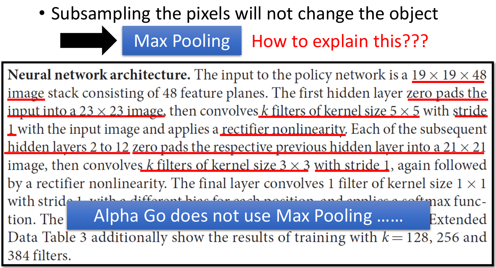

先用一个hidden layer对image做zero padding，也就是把原来19\*19的image外围补0，让它变成一张23\*23的image，然后使用k个5\*5的filter对该image做convolution，stride设为1，activation function用的是ReLU，得到的output是21\*21的image；接下来使用k个3\*3的filter，stride设为1，activation function还是使用ReLU，...

你会发现这个AlphaGo的network structure一直在用convolution，其实根本就没有使用Max Pooling，原因并不是疏失了什么之类的，而是根据围棋的特性，我们本来就不需要在围棋的CNN里面，用Max pooling这样的构架

举这个例子是为了告诉大家：neural network架构的设计，是应用之道，存乎一心

#### Speech 

CNN也可以用在很多其他的task里面，比如语音处理上，我们可以把一段声音表示成spectrogram，spectrogram的横轴是时间，纵轴则是这一段时间里声音的频率

下图中是一段“你好”的音频，偏红色代表这段时间里该频率的energy是比较大的，也就对应着“你”和“好”这两个字，也就是说spectrogram用颜色来描述某一个时刻不同频率的能量

我们也可以让机器把这个spectrogram就当作一张image，然后用CNN来判断说，input的这张image对应着什么样的声音信号，那通常用来判断结果的单位，比如phoneme，就是类似音标这样的单位

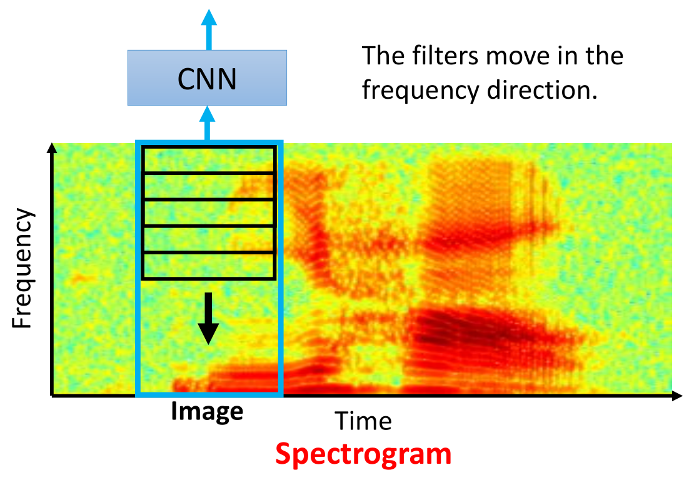

这边比较神奇的地方就是，当我们把一段spectrogram当作image丢到CNN里面的时候，在语音上，我们通常只考虑在frequency(频率)方向上移动的filter，我们的filter就像上图这样，是长方形的，它的宽就跟image的宽是一样的，并且filter只在Frequency即纵坐标的方向上移动，而不在时间的序列上移动

这是因为在语音里面，CNN的output后面都还会再接别的东西，比如接LSTM之类，所以你在CNN里面再考虑一次时间的information其实没有什么特别的帮助，但是为什么在频率上的filter有帮助呢？

我们用CNN的目的是为了用同一个filter把相同的pattern给detect出来，在声音讯号上，虽然男生和女生说同样的话看起来这个spectrogram是非常不一样的，但实际上他们的不同只是表现在一个频率的shift而已，男生说的你好跟女生说的你好，它们的pattern其实是一样的，比如pattern是spectrogram变化的情形，男生女生的声音的变化情况可能是一样的，它们的差别可能只是所在的频率范围不同而已，所以filter在frequency的direction上移动是有效的，在time domain上移动是没有帮助的。

所以，这又是另外一个例子，当你把CNN用在一个Application的时候呢，你永远要想一想这个Application的特性是什么，根据这个特性你再去design network的structure，才会真正在理解的基础上去解决问题

#### Text

CNN也可以用在文字处理上，假设你的input是一个word sequence，你要做的事情是让machine侦测这个word sequence代表的意思是positive的还是negative的

首先你把这个word sequence里面的每一个word都用一个vector来表示，vector代表的这个word本身的semantic，那如果两个word本身含义越接近的话，它们的vector在高维的空间上就越接近，这个东西就叫做word embedding

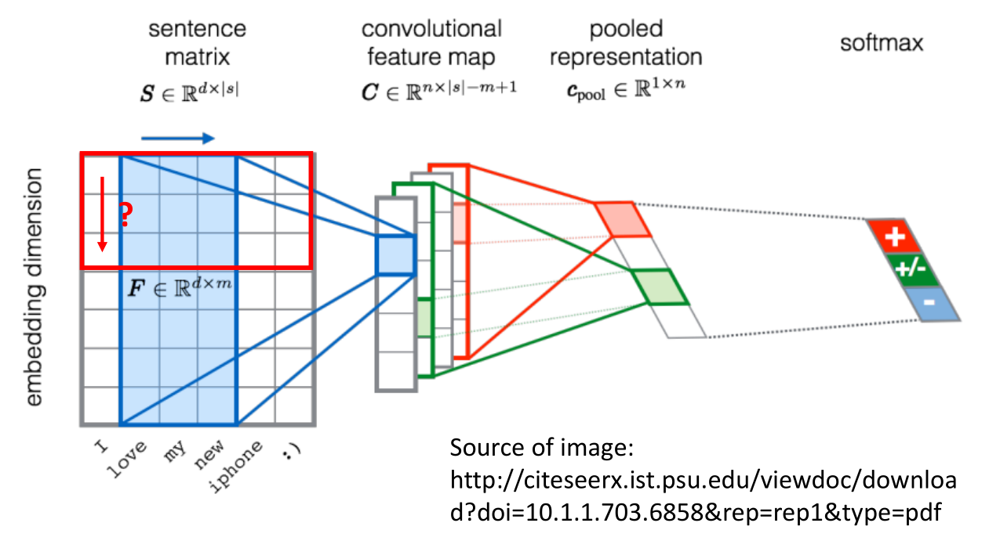

把一个sentence里面所有word的vector排在一起，它就变成了一张image，你把CNN套用到这个image上，那filter的样子就是上图蓝色的matrix，它的高和image的高是一样的，然后把filter沿着句子里词汇的顺序来移动，每个filter移动完成之后都会得到一个由内积结果组成的vector，不同的filter就会得到不同的vector，接下来做Max pooling，然后把Max pooling的结果丢到fully connected layer里面，你就会得到最后的output

与语音处理不同的是，在文字处理上，filter只在时间的序列（按照word的顺序，蓝色的方向）上移动，而不在这个embedding的dimension上移动

因为在word embedding里面，不同dimension是independent的，它们是相互独立的，不会出现有两个相同的pattern的情况，所以在这个方向上面移动filter，是没有意义的

所以这又是另外一个例子，虽然大家觉得CNN很powerful，你可以用在各个不同的地方，但是当你应用到一个新的task的时候，你要想一想这个新的task在设计CNN的构架的时候，到底该怎么做

### Reference

如果你想知道更多visualization的事情，以下是一些reference

- The methods of visualization in these slides
  - https://blog.keras.io/how-convolutional-neural-networks-see-the-world.html
- More about visualization
  - http://cs231n.github.io/understanding-cnn/
- Very cool CNN visualization toolkit
  - http://yosinski.com/deepvis
  - http://scs.ryerson.ca/~aharley/vis/conv/

如果你想要用Deep Dream的方法来让machine自动产生一个digit，这件事是不太成功的，但是有很多其它的方法，可以让machine画出非常清晰的图。这里列了几个方法，比如说：PixelRNN，VAE，GAN等进行参考。

- PixelRNN
  - https://arxiv.org/abs/1601.06759
- Variation Autoencoder(VAE)
  - https://arxiv.org/abs/1312.6114
- Generative Adversarial Network(GAN)
  - https://arxiv.org/abs/1406.2661

## Recurrent Neural Network

### Introduction

#### Slot Filling

How to represent each word as a vector?

- 1-of-N encoding
- Beyond 1-of-N encoding
  - Dimension for “Other”
  - Word hashing

在智能客服、智能订票系统中，往往会需要slot filling技术，它会分析用户说出的语句，将时间、地址等有效的关键词填到对应的槽上，并过滤掉无效的词语

Solving slot filling by Feedforward network?

- Input: a word (Each word is represented as a vector)
- Output: Probability distribution that the input word belonging to the slots

但这样做会有一个问题，句子中“arrive”和“leave”这两个词汇，它们都属于“other”，这时对NN来说，输入是相同的，它没有办法区分出“Taipei”是出发地还是目的地

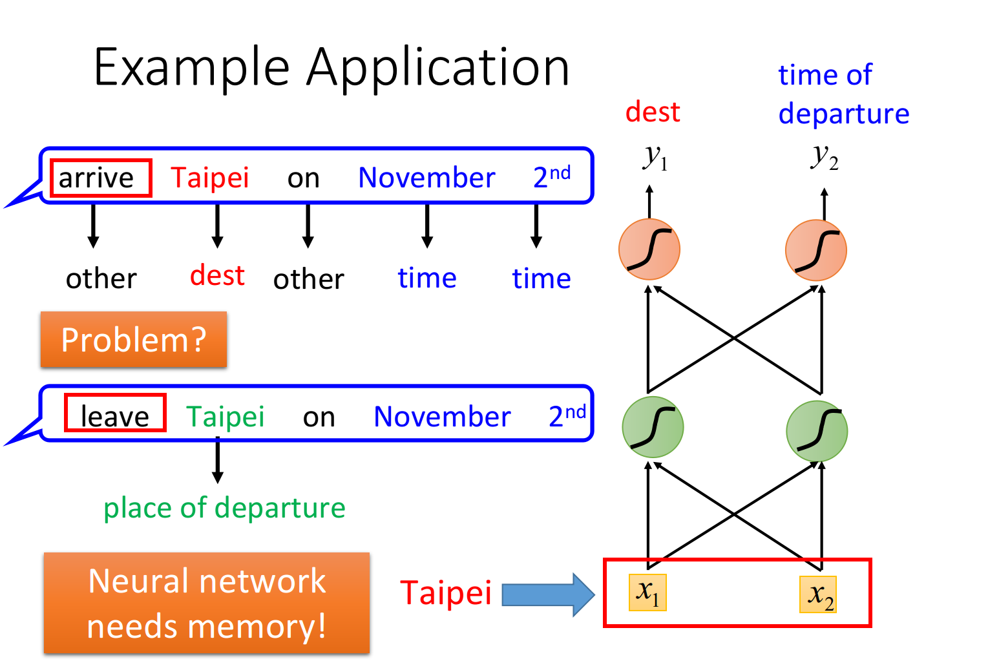

这个时候我们就希望神经网络是有记忆的，如果NN在看到“Taipei”的时候，还能记住之前已经看过的“arrive”或是“leave”，就可以根据上下文得到正确的答案

这种有记忆力的神经网络，就叫做**Recurrent Neural Network(RNN)**

在RNN中，hidden layer每次产生的output $a_1$、$a_2$，都会被存到memory里，下一次有input的时候，这些neuron就不仅会考虑新输入的$x_1$、$x_2$，还会考虑存放在memory中的$a_1$、$a_2$

注：在input之前，要先给内存里的$a_i$赋初始值，比如0

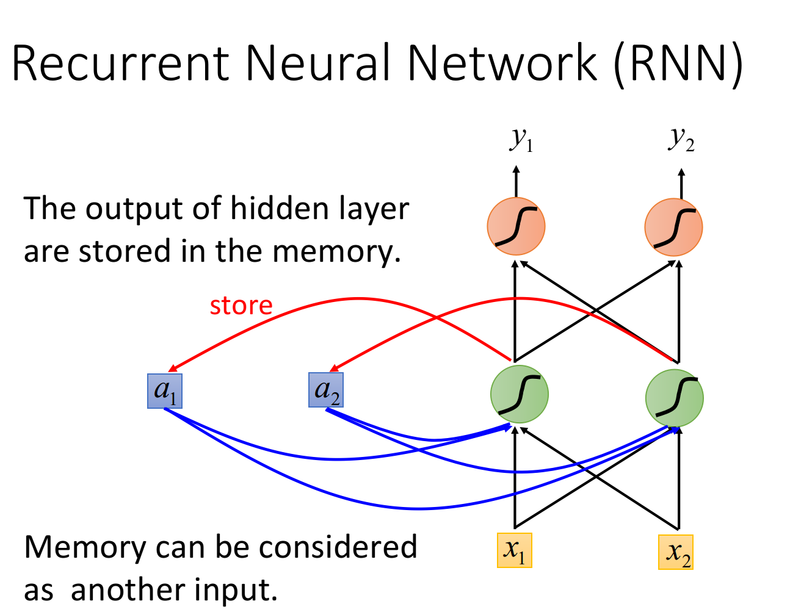

注意到，每次NN的输出都要考虑memory中存储的临时值，而不同的输入产生的临时值也尽不相同，因此改变输入序列的顺序会导致最终输出结果的改变，Changing the sequence order will change the output

#### Slot Filling with RNN

用RNN处理Slot Filling的流程举例如下：

- “arrive”的vector作为$x^1$输入RNN，通过hidden layer生成$a^1$，再根据$a^1$生成$y^1$，表示“arrive”属于每个slot的概率，其中$a^1$会被存储到memory中
- “Taipei”的vector作为$x^2$输入RNN，此时hidden layer同时考虑$x^2$和存放在memory中的$a^1$，生成$a^2$，再根据$a^2$生成$y^2$，表示“Taipei”属于某个slot的概率，此时再把$a^2$存到memory中
- 依次类推

注意：上图为同一个RNN在三个不同时间点被分别使用了三次，并非是三个不同的NN

这个时候，即使输入同样是“Taipei”，我们依旧可以根据前文的“leave”或“arrive”来得到不一样的输出

#### Deeper RNN

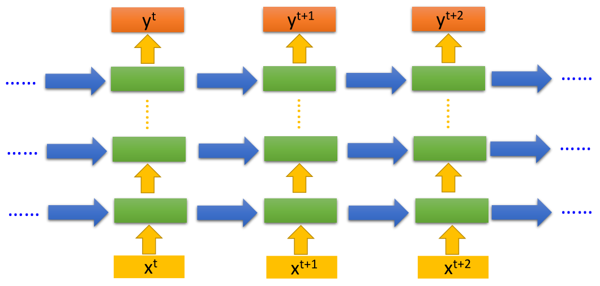

#### Elman Network & Jordan Network

RNN有不同的变形：

- Elman Network：将hidden layer的输出保存在memory里
- Jordan Network：将整个neural network的输出保存在memory里

由于hidden layer没有明确的训练目标，而整个NN具有明确的目标，y是有target的，所以可以比较清楚放在memory里面是什么样的东西。因此Jordan Network的表现会更好一些

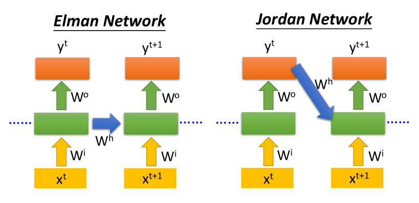

#### Bidirectional RNN

RNN 还可以是双向的，你可以同时训练一对正向和反向的RNN，把它们对应的hidden layer $x^t$拿出来，都接给一个output layer，得到最后的$y^t$

使用Bi-RNN的好处是，NN在产生输出的时候，它能够看到的范围是比较广的，RNN在产生$y^{t+1}$的时候，它不只看了从句首$x^1$开始到$x^{t+1}$的输入，还看了从句尾$x^n$一直到$x^{t+1}$的输入，这就相当于RNN在看了整个句子之后，才决定每个词汇具体要被分配到哪一个槽中，这会比只看句子的前一半要更好

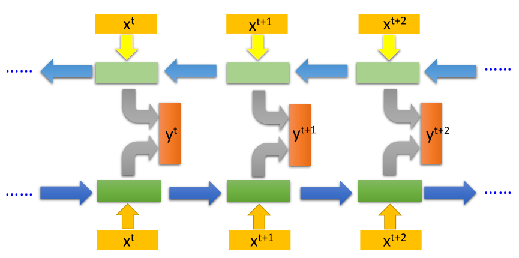

### LSTM

前文提到的RNN只是最简单的版本，并没有对memory的管理多加约束，可以随时进行读取，而现在常用的memory管理方式叫做长短期记忆Long Short-term Memory简称LSTM

可以被理解为比较长的短期记忆，因此是short-term

#### Three-gate

LSTM有三个gate：

- 当某个neuron的输出想要被写进memory cell，它就必须要先经过一道叫做**input gate**的闸门，如果input gate关闭，则任何内容都无法被写入，而关闭与否、什么时候关闭，都是由神经网络自己学习到的

- output gate决定了外界是否可以从memory cell中读取值，当**output gate**关闭的时候，memory里面的内容同样无法被读取，同样关闭与否、什么时候关闭，都是由神经网络自己学习到的
- **forget gate**则决定了什么时候需要把memory cell里存放的内容忘记清空，什么时候依旧保存

整个LSTM可以看做是4个input，1个output：

- 4个input=想要被存到memory cell里的值+操控input gate的信号+操控output gate的信号+操控forget gate的信号
- 1个output=想要从memory cell中被读取的值

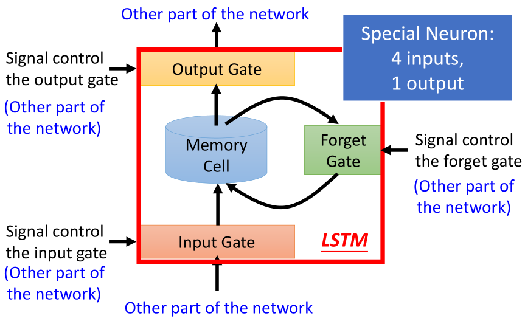

#### Memory Cell

如果从表达式的角度看LSTM，它比较像下图中的样子

- $z$是想要被存到cell里的输入值
- $z_i$是操控input gate的信号
- $z_o$是操控output gate的信号
- $z_f$是操控forget gate的信号
- $a$是综合上述4个input得到的output值

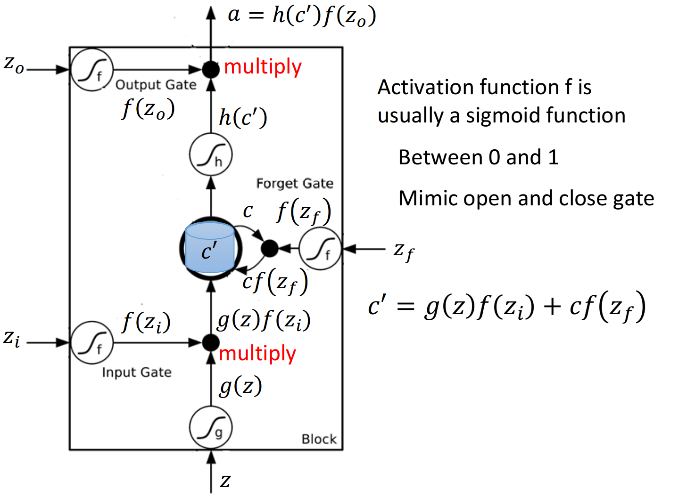

把$z$、$z_i$、$z_o$、$z_f$通过activation function，分别得到$g(z)$、$f(z_i)$、$f(z_o)$、$f(z_f)$

其中对$z_i$、$z_o$和$z_f$来说，它们通过的激活函数$f()$一般会选sigmoid function，因为它的输出在0\~1之间，代表gate被打开的程度

令$g(z)$与$f(z_i)$相乘得到$g(z)\cdot f(z_i)$，然后把原先存放在cell中的$c$与$f(z_f)$相乘得到$cf(z_f)$，两者相加得到存在memory中的新值$c'=g(z)\cdot f(z_i)+cf(z_f)$

- 若$f(z_i)=0$，则相当于没有输入，若$f(z_i)=1$，则相当于直接输入$g(z)$
- 若$f(z_f)=1$，则保存原来的值$c$并加到新的值上，若$f(z_f)=0$，则旧的值将被遗忘清除

从中也可以看出，forget gate的逻辑与我们的直觉是相反的，控制信号打开表示记得，关闭表示遗忘

此后，$c'$通过激活函数得到$h(c')$，与output gate的$f(z_o)$相乘，得到输出$a=h(c')f(z_o)$

#### LSTM Example

下图演示了一个LSTM的基本过程，$x_1$、$x_2$、$x_3$是输入序列，$y$是输出序列，基本原则是：

- 当$x_2=1$时，将$x_1$的值写入memory
- 当$x_2=-1$时，将memory里的值清零
- 当$x_3=1$时，将memory里的值输出
- 当neuron的输入为正时，对应gate打开，反之则关闭

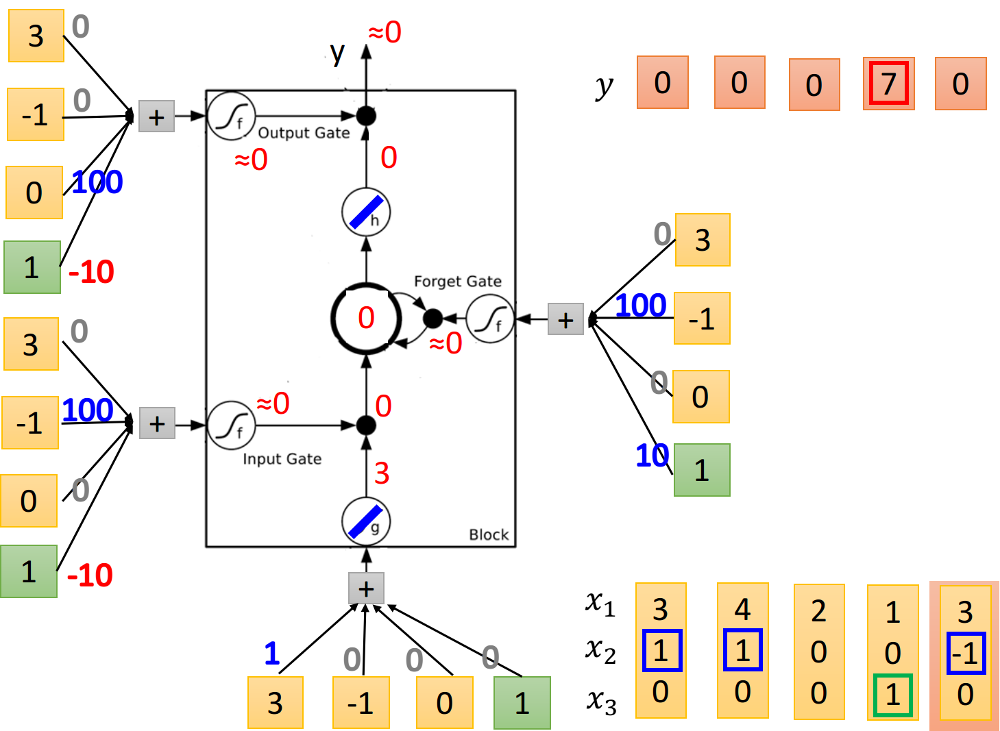

#### LSTM Structure

你可能会觉得上面的结构与平常所见的神经网络不太一样，实际上我们只需要把LSTM整体看做是下面的一个neuron即可

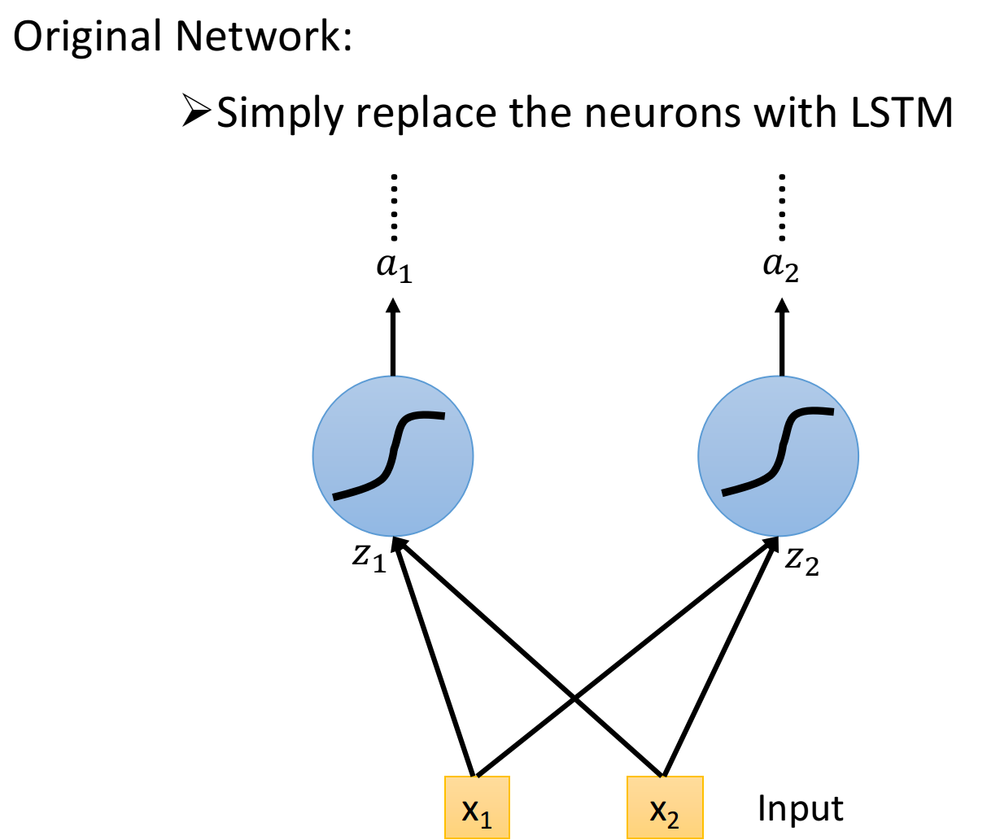

假设目前我们的hidden layer只有两个neuron，则结构如下图所示：

- 输入$x_1$、$x_2$会分别乘上四组不同的weight，作为neuron的输入以及三个状态门的控制信号
- 在原来的neuron里，1个input对应1个output，而在LSTM里，4个input才产生1个output，并且所有的input都是不相同的
- 从中也可以看出LSTM所需要的参数量是一般NN的4倍

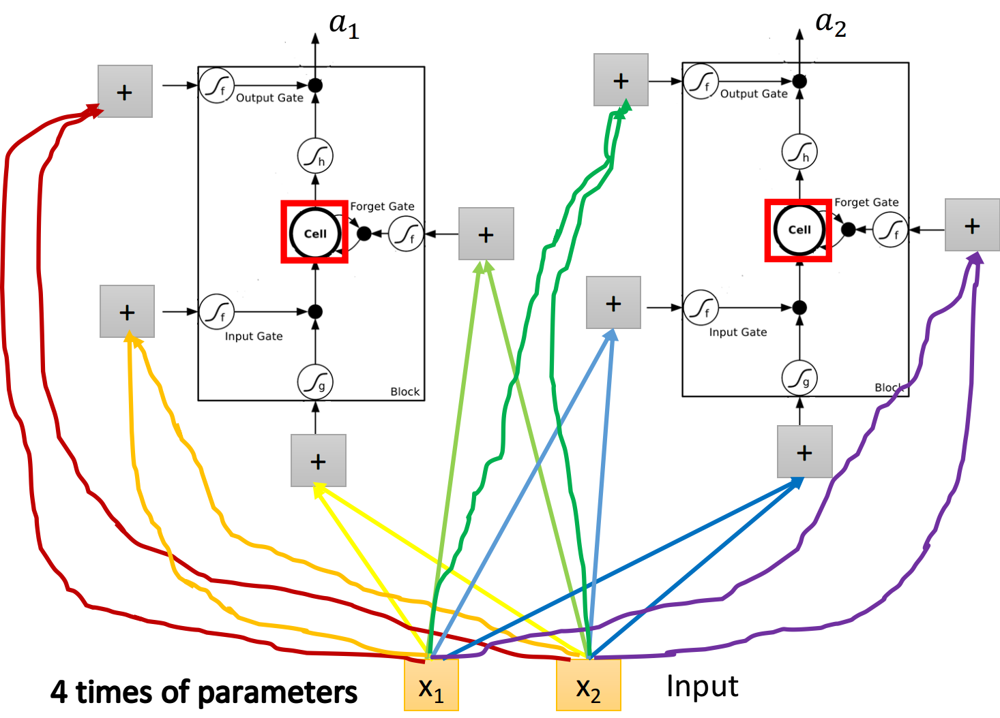

#### LSTM

从上图中你可能看不出LSTM与RNN有什么关系，接下来我们用另外的图来表示它

假设我们现在有一整排的LSTM作为neuron，每个LSTM的cell里都存了一个scalar值，把所有的scalar连接起来就组成了一个vector $c^{t-1}$

在时间点$t$，输入了一个vector $x^t$，它会乘上一个matrix，通过转换得到$z$，而$z$的每个dimension就代表了操控每个LSTM的输入值，同理经过不同的转换得到$z^i$、$z^f$和$z^o$，得到操控每个LSTM的门信号

假设我们现在有一整排的 neuron 假设有一整排的 LSTM，那这一整排的 LSTM 里面，每一个 LSTM 的 cell，它里面都存了一个 scalar，把所有的 scalar 接起来，它就变成一个 vector，这边写成 $c^{t-1}$，那你可以想成这边每一个 memory 它里面存的 scalar，就是代表这个 vector 里面的一个 dimension，现在在时间点 t，input 一个 vector, $x^t$，这个 vector，它会先乘上一个 linear 的 transform，乘上一个 matrix，变成另外一个 vector z，这个 z也是一个 vector，z 这个 vector 的每一个 dimension，就操控每一个 LSTM 的 input，所以 z 它的 dimension 就正好是 LSTM 的 memory cell 的数目。那这个 z 的第一维就丢给第一个 cell，第二维就丢给第二个 cell，以此类推。

$x^t$ 会再乘上另外一个 transform，得到 $z^i$，然后这个 $z^i$ 呢，它的 dimension 也跟 cell 的数目一样，$z^i$ 的每一个 dimension，都会去操控一个 input gate，所以 $z^i$ 的第一维就是，去操控第一个 cell 的 input gate，第二维，就是操控第二个 cell 的 input gate，最后一维，就是操控最后一个 cell 的 input gate

那 forget gate 跟 output gate 也是一样，把 $x^t$ 乘上一个 transform，得到 $z^f$，$z^f$ 会去操控每一个 forget gate，然后 $x^t$ 乘上另外一个 transform，得到 $z^o$，$z^o$ 会去操控每一个 cell 的 output gate

所以我们把 $x^t$ 乘上 4 个不同的 transform，得到 4 个不同的 vector，这 4 个 vector 的 dimension，都跟 cell 的数目是一样的，那这 4 个 vector 合起来，就会去操控这些 memory cell 的运作

那我们知道一个 memory cell 就是长这样，那现在 input 分别是 $z, z^i, z^f, z^o$,  那注意一下这 4 个 z 其实都是 vector，丢到 cell 里面的值，其实只是每一个 vector 的一个 dimension，因为每一个 cell 它们 input 的 dimension 都是不一样的，所以它们 input 的值都会是不一样的

但是，所有的 cell 是可以共同一起被运算的。怎么一起共同被运算呢？我们说 z 要乘上 $z^i$，要把 $z^i$ 先通过 activation function，然后把它跟 z 相乘，所以我们就把 $z^i$ 先通过 activation function，跟 z 相乘，这个乘是element-wise 的相乘，好那这个 $z^f$ 也要通过，forget gate 的 activation function，$z^f$ 通过这个 activation function，它跟之前已经存在 cell 里面的值相乘，然后接下来呢，也要把这两个值加起来，你就是把 $z^i$ 跟 z 相乘的值加上 $z^f$，跟 $c^{t-1}$ 相乘的值，把他们加起来。

那 output gate ，$z^o$ 通过 activation function，然后把这个 output 跟相加以后的结果，再相乘，最后就得到最后的 output 的 y，这个时候相加以后的结果，也就是 memory 里面存的值，也就是 $c^t$，那这 process 呢，就反复地继续下去，在下一个时间点，input $x^{t+1}$，然后你把 z 跟 input gate 相乘，你把 forget gate 跟存在 memory 里面的值相乘，然后再把这个值跟这个值加起来，再乘上 output gate 的值，然后得到下一个时间点的输出...

这个不是 LSTM 的最终型态，这个只是一个 simplified 的 version，真正的 LSTM 会怎么做它会把这个 hidden layer 的输出把它接进来，当作下一个时间点的 input，也就是说，下一个时间点操控这些 gate 的值，不是只看，那个时间点的 input x，也看前一个时间点的 output h，然后其实还不只这样，还会加一个东西，叫peephole

这个 peephole 就是把存在 memory cell 里面的值，也拉过来，所以在操纵 LSTM 的 4个 gate 的时候，你是同时考虑了 x, h, c，你把这 3 个 vector 并在一起，乘上4个不同的 transform，得到这4个不同的 vector，再去操控 LSTM

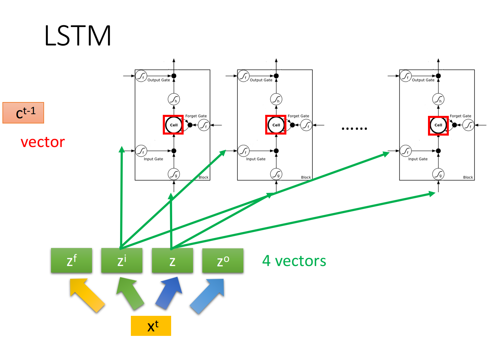

下图是单个LSTM的运算情景，其中LSTM的4个input分别是$z$、$z^i$、$z^f$和$z^o$的其中1维，每个LSTM的cell所得到的input都是各不相同的，但它们却是可以一起共同运算的，整个运算流程如下图左侧所示：

$f(z^f)$与上一个时间点的cell值$c^{t-1}$相乘，并加到经过input gate的输入$g(z)\cdot f(z^i)$上，得到这个时刻cell中的值$c^t$，最终再乘上output gate的信号$f(z^o)$，得到输出$y^t$

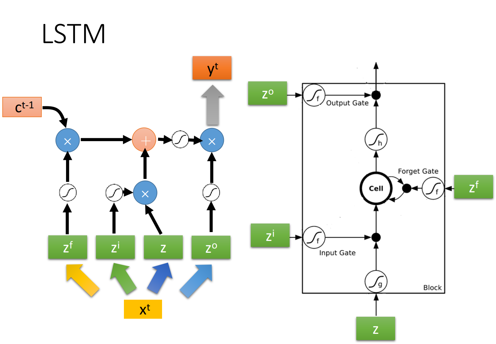

上述的过程反复进行下去，就得到下图中各个时间点上，LSTM值的变化情况，其中与上面的描述略有不同的是，这里还需要把hidden layer的最终输出$y^t$以及当前cell的值$c^t$都连接到下一个时间点的输入上

因此在下一个时间点操控这些gate值，不只是看输入的$x^{t+1}$，还要看前一个时间点的输出$h^t$和cell值$c^t$，你需要把$x^{t+1}$、$h^t$和$c^t$这3个vector并在一起，乘上4个不同的转换矩阵，去得到LSTM的4个输入值$z$、$z^i$、$z^f$、$z^o$，再去对LSTM进行操控

注意：下图是**同一个**LSTM在两个相邻时间点上的情况

上图是单个LSTM作为neuron的情况，事实上LSTM基本上都会叠多层，如下图所示，左边两个LSTM代表了两层叠加，右边两个则是它们在下一个时间点的状态

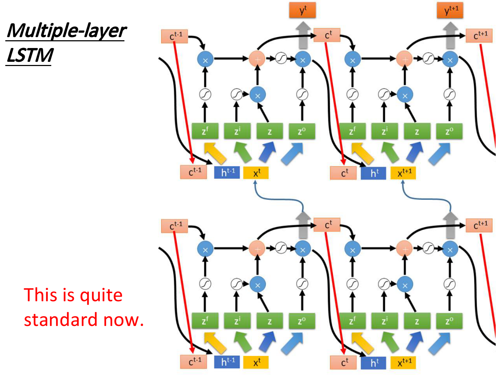

### Learning Target

#### Loss Function

依旧是Slot Filling的例子，我们需要把model的输出$y^i$与映射到slot的reference vector求交叉熵，比如“Taipei”对应到的是“dest”这个slot，则reference vector在“dest”位置上值为1，其余维度值为0

RNN的output和reference vector的cross entropy之和就是损失函数，也是要minimize的对象

需要注意的是，word要依次输入model，比如“arrive”必须要在“Taipei”前输入，不能打乱语序

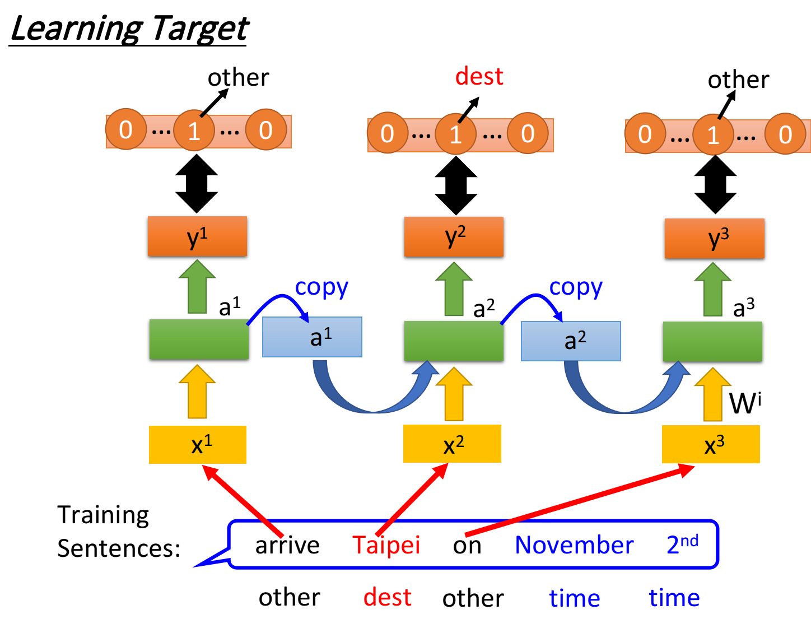

#### Training

有了损失函数后，训练其实也是用梯度下降法，为了计算方便，这里采取了反向传播(Backpropagation)的进阶版，Backpropagation through time，简称BPTT算法

BPTT算法与BP算法非常类似，只是多了一些时间维度上的信息，这里不做详细介绍

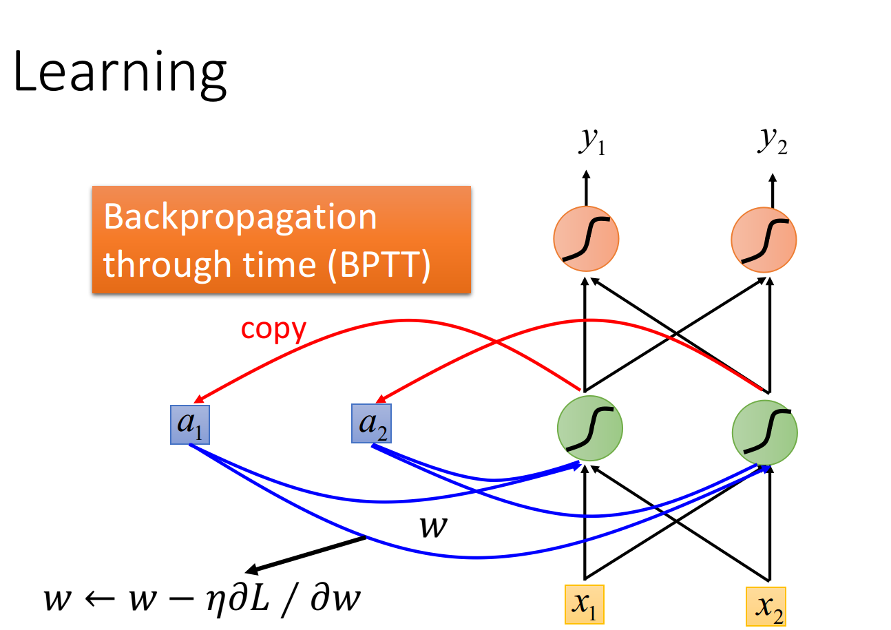

不幸的是，RNN的训练并没有那么容易

我们希望随着epoch的增加，参数的更新，loss应该要像下图的蓝色曲线一样慢慢下降，但在训练RNN的时候，你可能会遇到类似绿色曲线一样的学习曲线，loss剧烈抖动，并且会在某个时刻跳到无穷大，导致程序运行失败

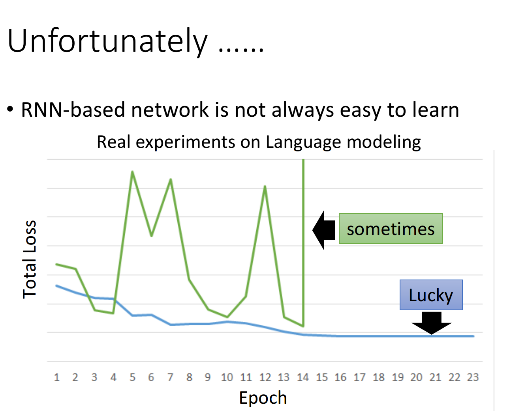

#### Error Surface

分析可知，RNN的error surface，即loss由于参数产生的变化，是非常陡峭崎岖的

下图中，$z$轴代表loss，$x$轴和$y$轴代表两个参数$w_1$和$w_2$，可以看到loss在某些地方非常平坦，在某些地方又非常的陡峭

如果此时你的训练过程类似下图中从下往上的橙色的点，它先经过一块平坦的区域，又由于参数的细微变化跳上了悬崖，这就会导致loss上下抖动得非常剧烈

如果你的运气特别不好，一脚踩在悬崖上，由于之前一直处于平坦区域，gradient很小，你会把参数更新的步长(learning rate)调的比较大，而踩到悬崖上导致gradient突然变得很大，这会导致参数一下子被更新了一个大步伐，导致整个就飞出去了，这就是学习曲线突然跳到无穷大的原因

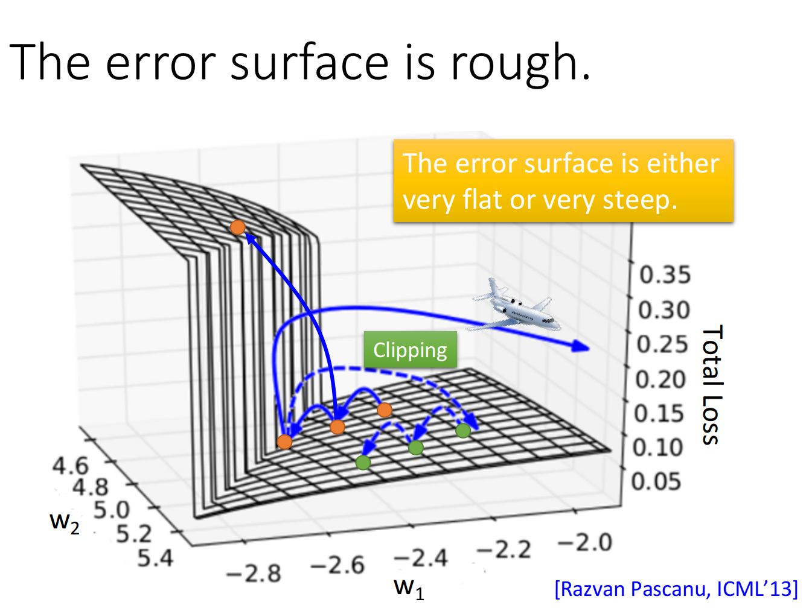

想要解决这个问题，就要采用Clipping方法，当gradient即将大于某个threshold的时候，就让它停止增长，比如当gradient大于15的时候就直接让它等于15

为什么RNN会有这种奇特的特性呢？下图给出了一个直观的解释：

假设RNN只含1个neuron，它是linear的，input和output的weight都是1，没有bias，从当前时刻的memory值接到下一时刻的input的weight是$w$，按照时间点顺序输入[1, 0, 0, 0, ..., 0]

当第1个时间点输入1的时候，在第1000个时间点，RNN输出的$y^{1000}=w^{999}$，想要知道参数$w$的梯度，只需要改变$w$的值，观察对RNN的输出有多大的影响即可：

- 当$w$从1->1.01，得到的$y^{1000}$就从1变到了20000，这表示$w$的梯度很大，需要调低学习率
- 当$w$从0.99->0.01，则$y^{1000}$几乎没有变化，这表示$w$的梯度很小，需要调高学习率
- 从中可以看出gradient时大时小，error surface很崎岖，尤其是在$w=1$的周围，gradient几乎是突变的，这让我们很难去调整learning rate

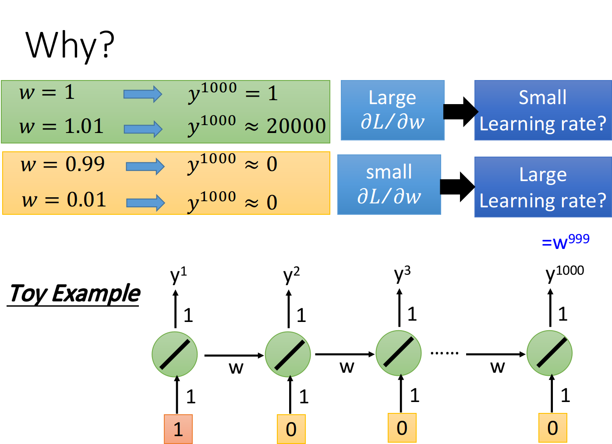

因此我们可以解释，RNN 会不好训练的原因，并不是来自于 activation function。而是来自于它有 time sequence，同样的 weight，在不同的时间点被反复的，不断的被使用。

从memory接到neuron输入的参数$w$，在不同的时间点被反复使用，$w$的变化有时候可能对RNN的输出没有影响，而一旦产生影响，经过长时间的不断累积，该影响就会被放得无限大，因此RNN经常会遇到这两个问题：

- 梯度消失(gradient vanishing)，一直在梯度平缓的地方停滞不前
- 梯度爆炸(gradient explode)，梯度的更新步伐迈得太大导致直接飞出有效区间

### Help Techniques

有什么技巧可以帮我们解决这个问题呢？LSTM就是最广泛使用的技巧，它会把error surface上那些比较平坦的地方拿掉，从而解决梯度消失(gradient vanishing)的问题，但它无法处理梯度崎岖的部分，因而也就无法解决梯度爆炸的问题(gradient explode)

但由于做LSTM的时候，大部分地方的梯度变化都很剧烈，因此训练时可以放心地把learning rate设的小一些

Q: 为什么要把RNN换成LSTM？

A: LSTM可以解决梯度消失的问题

Q: 为什么LSTM能够解决梯度消失的问题？

A: RNN和LSTM对memory的处理其实是不一样的：

- 在RNN中，每个新的时间点，memory里的旧值都会被新值所覆盖
- 在LSTM中，每个新的时间点，memory里的值会乘上$f(g_f)$与新值相加

对RNN来说，$w$对memory的影响每次都会被清除，而对LSTM来说，除非forget gate被打开，否则$w$对memory的影响就不会被清除，而是一直累加保留，因此它不会有梯度消失的问题

那你可能会想说，现在有 forget gate 啊，事实上 LSTM 在 97 年就被 proposed 了，LSTM 第一个版本就是为了解决 gradient vanishing 的问题，所以它是没有 forget gate 的，forget gate 是后来才加上去的。那甚至现在有一个传言是，你在训练 LSTM 时，不要给 forget gate 特别大的 bias ，你要确保 forget gate 在多数的情况下是开启的，在多数情况下都不要忘记

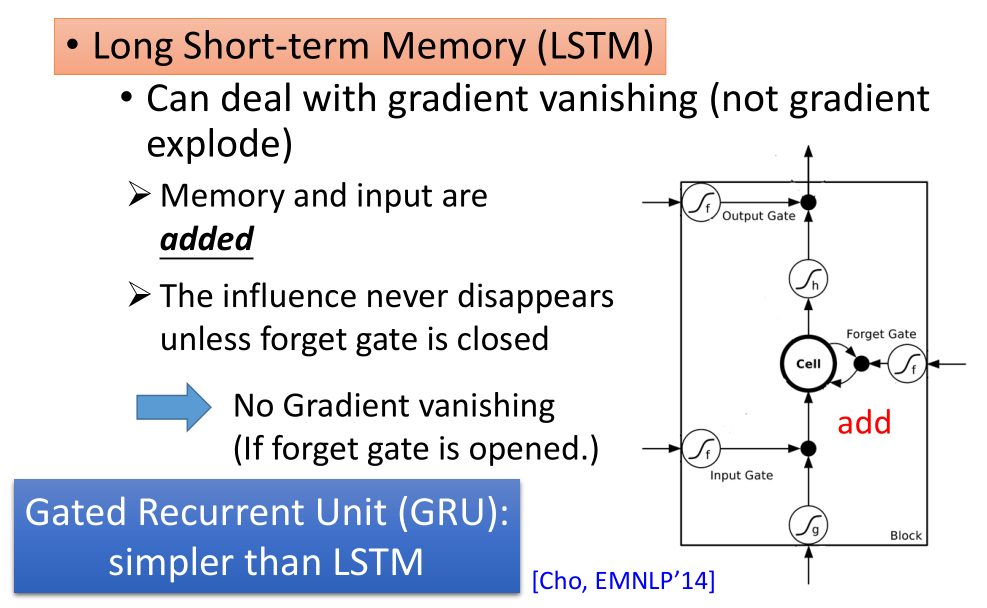

另一个版本GRU (Gated Recurrent Unit)，只有两个gate，需要的参数量比LSTM少，鲁棒性比LSTM好，performance与LSTM差不多，不容易过拟合，它的基本精神是旧的不去，新的不来，GRU会把input gate和forget gate连起来，当forget gate把memory里的值清空时，input gate才会打开，再放入新的值

当 input gate 被打开的时候，forget gate 就会被自动的关闭，就会自动忘记存在 memory 里面的值。当 forget gate 没有要忘记值，input gate 就会被关起来，也就是你要把存在 memory 里面的值清掉，才可以把新的值放进来。

此外，还有很多技术可以用来处理梯度消失的问题，比如Clockwise RNN、SCRN等

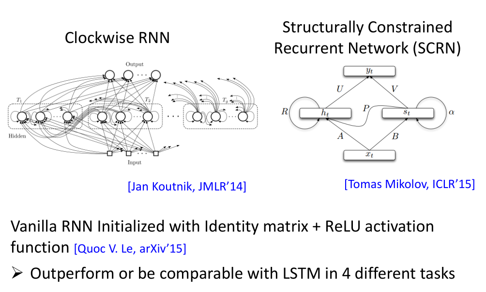

### More Applications

在Slot Filling中，我们输入一个word vector输出它的label，除此之外RNN还可以做更复杂的事情

#### Sentiment Analysis

Many to one: Input is a vector sequence, but output is only one vector 

语义情绪分析，我们可以把某影片相关的文章爬下来，并分析其正面情绪or负面情绪

RNN的输入是字符序列，在不同时间点输入不同的字符，并在最后一个时间点把hidden layer 拿出来，再经过一系列转换，可以得到该文章的语义情绪的prediction

#### Key term Extraction

关键词分析，RNN可以分析一篇文章并提取出其中的关键词，这里需要把含有关键词标签的文章作为RNN的训练数据

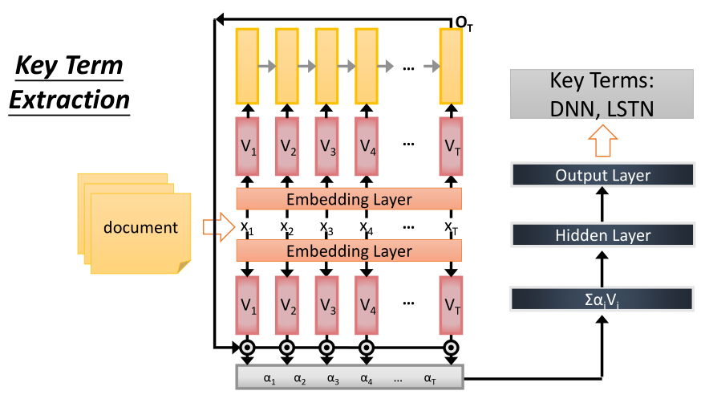

#### Speech Recognition

Many to Many (Output is shorter)：Both input and output are both sequences, but the output is shorter.

以语音识别为例，输入是一段声音信号，每隔一小段时间就用1个vector来表示，因此输入为vector sequence，而输出则是character sequence

如果依旧使用Slot Filling的方法，只能做到每个vector对应1个输出的character，识别结果就像是下图中的“好好好棒棒棒棒棒”，但这不是我们想要的，可以使用Trimming的技术把重复内容消去，剩下“好棒”

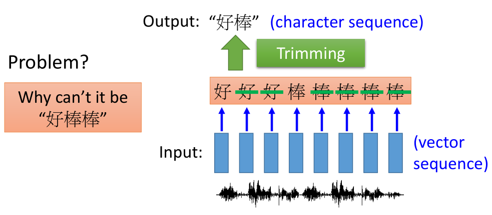

但“好棒”和“好棒棒”实际上是不一样的，如何区分呢？

需要用到CTC算法，它的基本思想是，输出不只是字符，还要填充NULL，输出的时候去掉NULL就可以得到叠字的效果

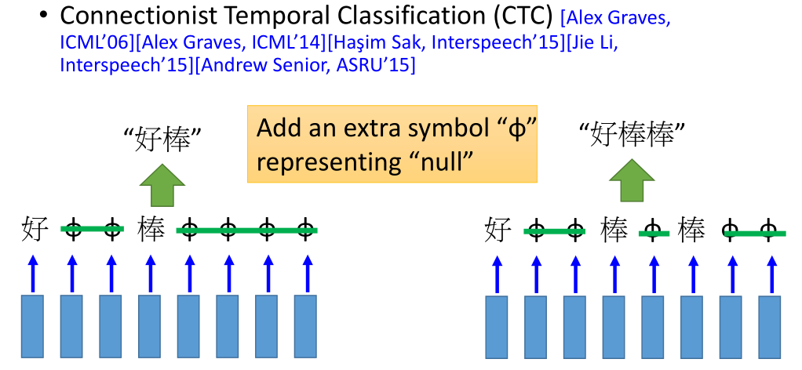

下图是CTC的示例，RNN的输出就是英文字母+NULL，Google的语音识别系统据说就是用CTC实现的

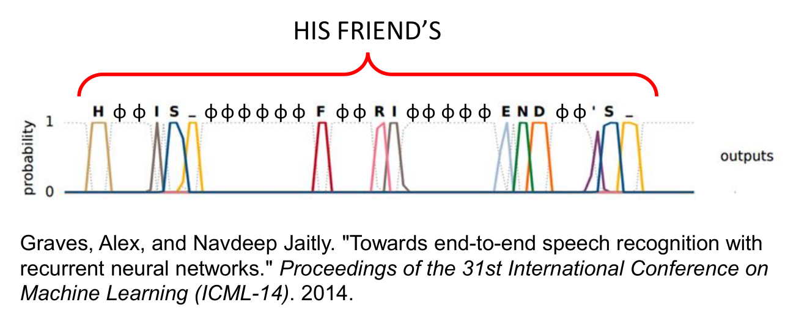

#### Sequence to Sequence Learning

Many to Many (No Limitation)：Both input and output are both sequences with different lengths.

在CTC中，input比较长，output比较短；而在Seq2Seq中，并不确定谁长谁短

比如现在要做机器翻译，将英文的word sequence翻译成中文的character sequence

假设在两个时间点分别输入“machine”和“learning”，则在最后1个时间点memory就存了整个句子的信息，接下来让RNN输出，就会得到“机”，把“机”当做input，并读取memory里的值，就会输出“器”，依次类推，这个RNN甚至会一直输出，不知道什么时候会停止

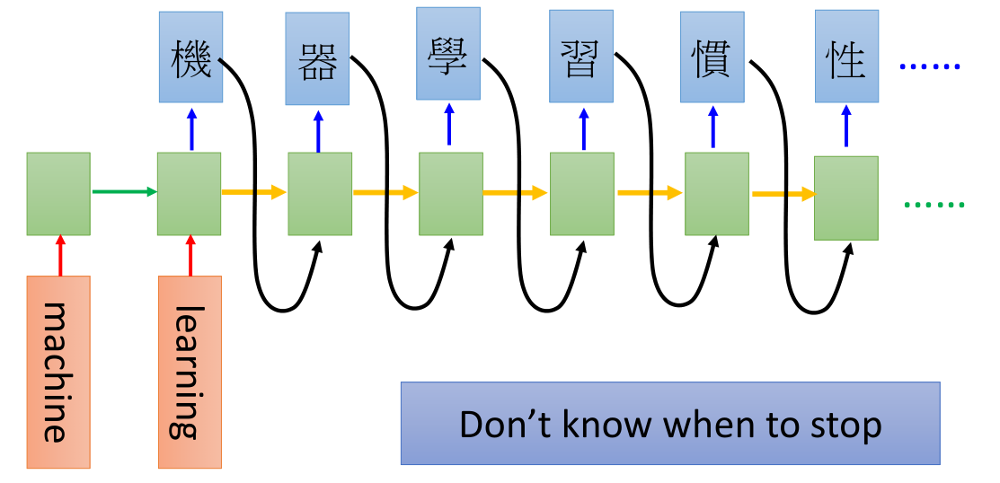

怎样才能让机器停止输出呢？

可以多加一个叫做“断”的symbol “===”，当输出到这个symbol时，机器就停止输出

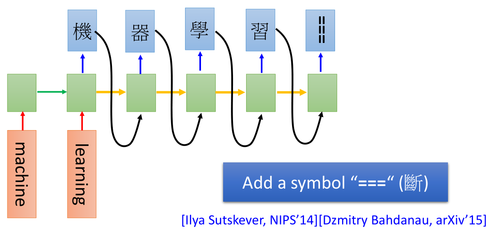

具体的处理技巧这里不再详述

#### Machine Translation

一种语言的声音讯号翻译成另一种语言的文字，很神奇的可以work

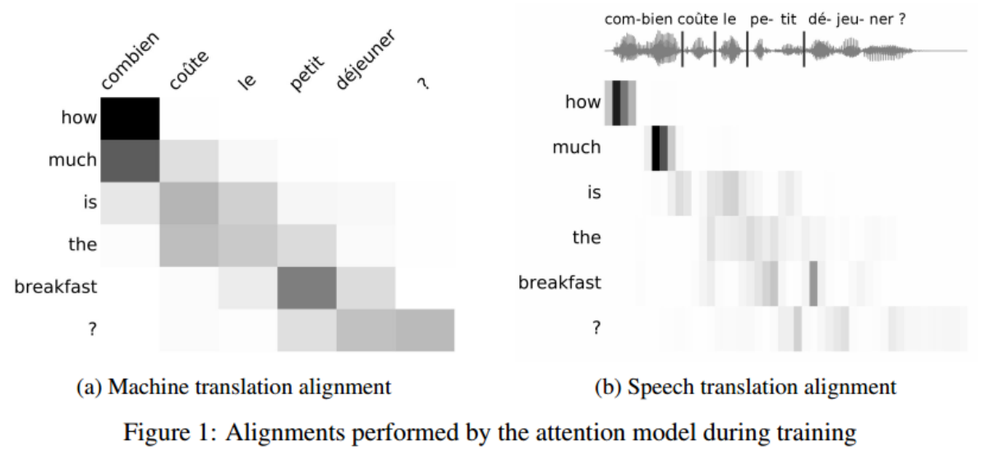

#### Syntactic Parsing

Sequence-to-sequence还可以用在句法解析上，让机器看一个句子，它可以自动生成Syntactic parsing tree

过去，你可能要用 structure learning 的技术才能够解这一个问题，但现在有了 sequence to sequence 的技术以后，只要把这个树形图，描述成一个 sequence，直接 learn 一个 sequence to sequence 的 model，output 直接是这个 Syntactic 的 parsing tree

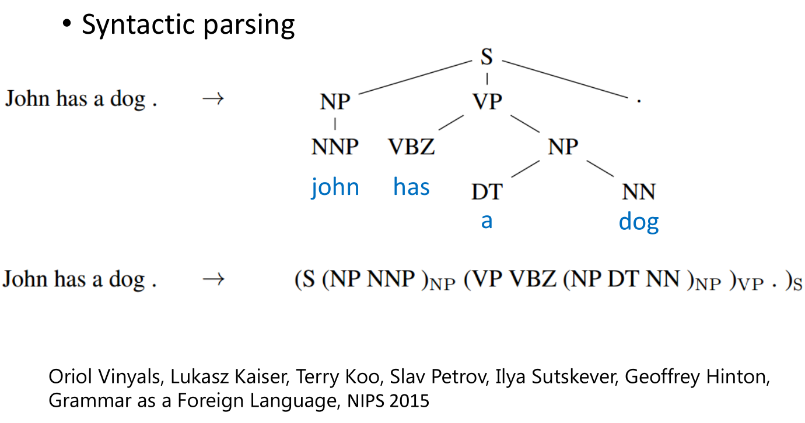

#### Sequence-to-sequence for Auto-encoder - Text

如果用bag-of-word来表示一篇文章，就很容易丢失词语之间的联系，丢失语序上的信息

比如“白血球消灭了感染病”和“感染病消灭了白血球”，两者bag-of-word是相同的，但语义却是完全相反的

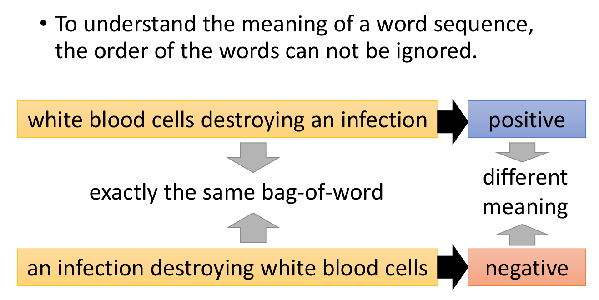

这里就可以使用Sequence-to-sequence Auto-encoder，在考虑了语序的情况下，把文章编码成vector，只需要把RNN当做编码器和解码器即可

我们输入word sequence，通过RNN变成embedded vector，再通过另一个RNN解压回去，如果能够得到一模一样的句子，则压缩后的vector就代表了这篇文章中最重要的信息

如果是用 Seq2Seq auto encoder，input 跟 output 都是同一个句子。如果你用 skip-thought 的话，output target会是下一个句子。如果是用 Seq2Seq auto encoder，通常你得到的 code 比较容易表达文法的意思。如果你要得到语意的意思，用 skip-thought 可能会得到比较好结果。

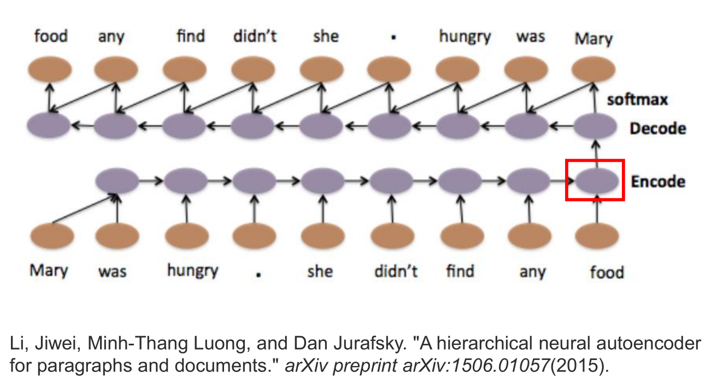

这个结构甚至可以是 Hierarchy 的，你可以每一个句子都先得到一个 vector
再把这些 vector 加起来，变成一个整个document high level 的 vector

再用这个 document high level 的 vector去产生一串 sentence 的 vector

再根据每一个 sentence vector去解回 word sequence

所以这是一个 4 层的 LSTM，你从 word 变成 sentence sequence，再变成 document level 的东西，再解回 sentence sequence，再解回 word sequence

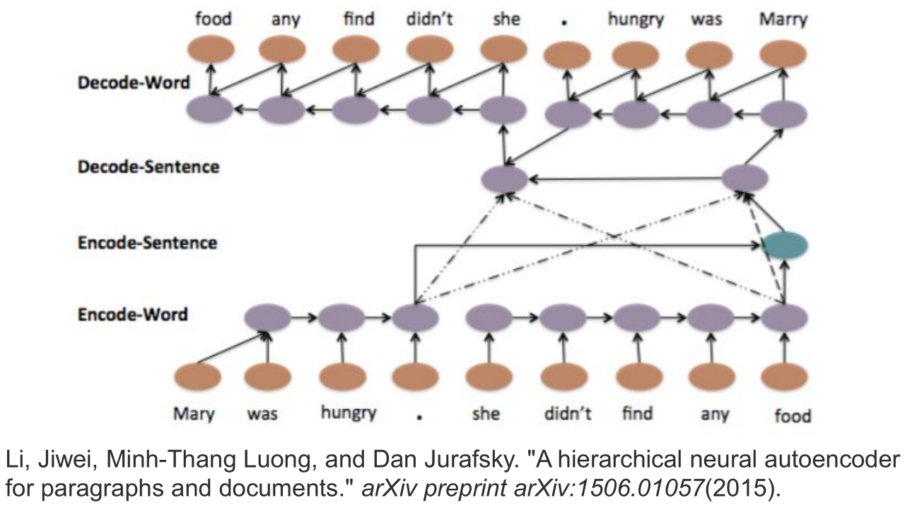

#### Sequence-to-sequence for Auto-encoder - Speech

Sequence-to-sequence Auto-encoder还可以用在语音处理上，它可以把一段 audio segment 变成一段 fixed length 的 vector

比如说这边有一堆声音讯号，它们长长短短的都不一样，你把它们变成 vector 的话，可能 dog/dogs 的 vector 比较接近，可能 never/ever 的 vector 是比较接近的

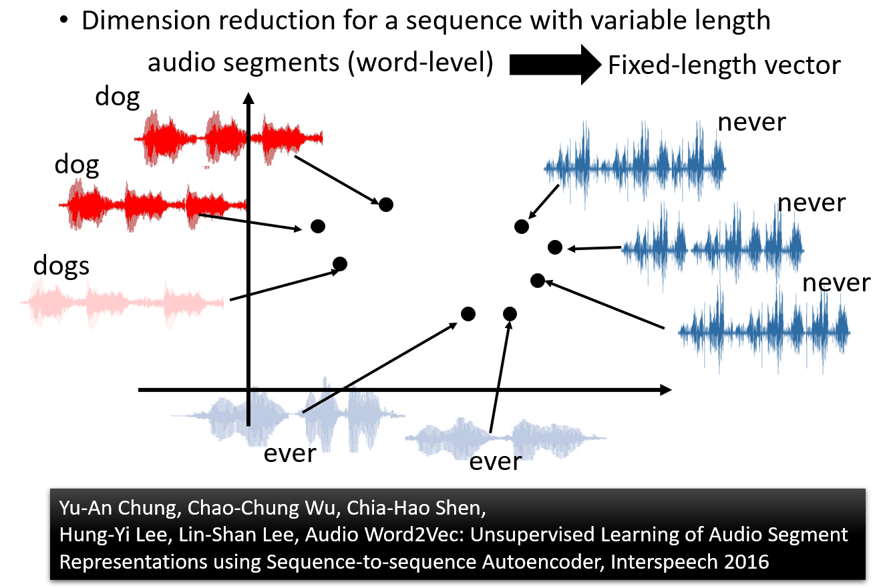

这种方法可以把声音信号都转化为低维的vector，并通过计算相似度来做语音搜索，不需要做语音识别，直接比对声音讯号的相似度即可。

如何把audio segment变成vector呢？先把声音信号转化成声学特征向量(acoustic features)，再通过RNN编码，最后一个时间点存在memory里的值就代表了整个声音信号的信息

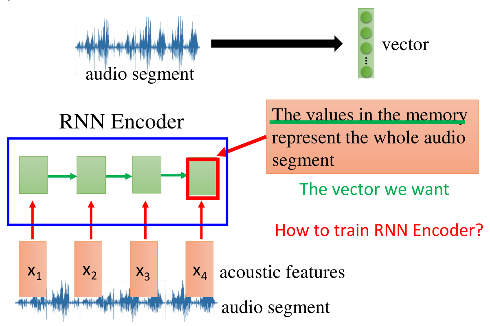

为了能够对该神经网络训练，还需要一个RNN作为解码器，得到还原后的$y_i$，使之与$x_i$的差距最小

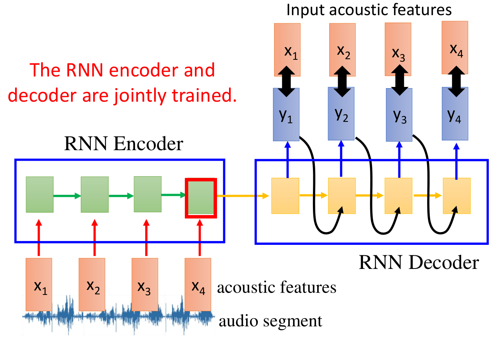

最后得到vector的可视化

#### Attention-based Model

除了RNN之外，Attention-based Model也用到了memory的思想

机器会有自己的记忆池，神经网络通过操控读写头去读或者写指定位置的信息，这个过程跟图灵机很像，因此也被称为neural turing machine

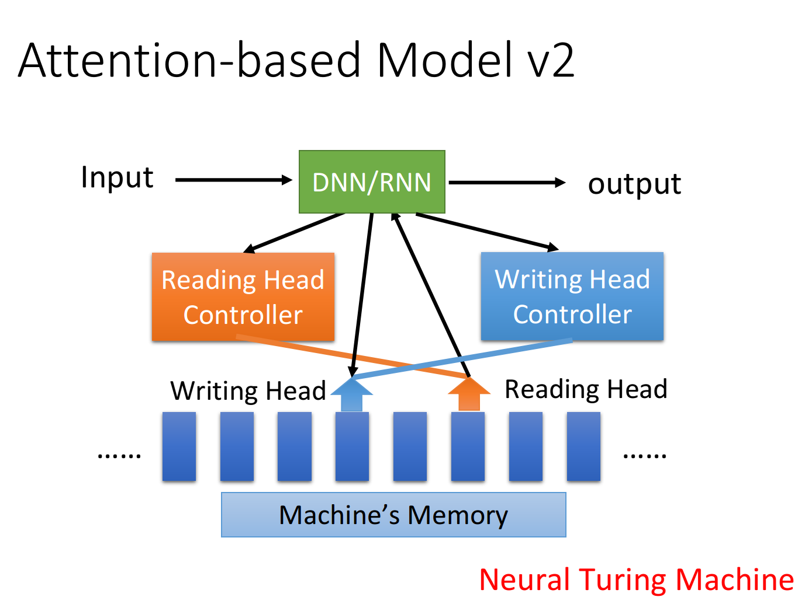

这种方法通常用在阅读理解上，让机器读一篇文章，再把每句话的语义都存到不同的vector中，接下来让用户向机器提问，神经网络就会去调用读写头的中央处理器，取出memory中与查询语句相关的信息，综合处理之后，可以给出正确的回答

