# Explainable Machine Learning

## Explainable Machine Learning

机器不但要知道，还要告诉我们它为什么会知道。

Local Explanation——Why do you think this image is a cat?

Global Explanation——What do you think a “cat” looks like?

### Why we need Explainable ML?

- 用机器来协助判断简历
  - 具体能力？还是性别？
- 用机器来协助判断犯人是否可以假释
  - 具体证据？还是肤色？
- 金融相关的决策常常依法需要提供理由
  - 为什么拒绝了某个人的贷款？
- 模型诊断：到底机器学到了什么
  - 不能只看正确率吗？今天我们看到各式各样机器学习非常强大的力量，感觉机器好像非常的聪明，过去有一只马叫做汉斯，它非常的聪明，聪明到甚至可以做数学。举例来说：你跟它讲根号9是多少，它就会敲它的马蹄，大家欢呼道，这是一只会算数学的马。可以解决根号的问题，大家都觉得非常的惊叹。后面就有人怀疑说：难道汉斯真的这么聪明吗？在没有任何的观众的情况下，让汉斯自己去解决一个数学都是题目，这时候它就会一直踏它的马蹄，一直的不停。这是为什么呢？因为它之前学会了观察旁观人的反应，它知道什么时候该停下来。它可能不知道自己在干什么，它也不知道数学是什么，但是踏对了正确的题目就有萝卜吃，它只是看了旁边人的反应得到了正确的答案。今天我们看到种种机器学习的成果，难道机器真的有那么的聪明吗？会不会它会汉斯一样用了奇怪的方法来得到答案的。

We can improve ML model based on explanation.

当我们可以做可解释的机器学习模型时，我们就能做模型诊断，就可以知道机器到底学到了什么，是否和我们的预期相同。准确率不足以让我们精确调整模型，只有当我们知道why the answer is wrong, so i can fix it. 

#### My Point of View

- Goal of ML Explanation ≠ you completely know how the ML model work（Not necessary）
  - Human brain is also a Black Box！
  - People don’t trust network because it is Black Box，but you trust the decision of human！
- Goal of ML Explanation is —— Make people（your customers，your boss，yourself）comfortable.
- Personalized explanation in the future

可解释机器学习的目标，不需要真正知道模型如何工作，只需要给出可信服的解释，让人满意就行。对此还可以针对不同人的接受能力给出不同层次的解释。

### Interpretable v.s.Powerful

- Some models are intrinsically interpretable.
  - For example，linear model（from weights，you know the importance of features）
  - But…not very powerful.
- Deep network is difficult to interpret.
  - Deep network is a black box.
  - But it is more powerful than linear model…
  - Because deep network is a black box，we don’t use it.（这样做是不对的，削足适履，Let’s make deep network interpretable.）
- Are there some models interpretable and powerful at the same time?
  - How about decision tree?

模型的可解释性和模型的能力之间有矛盾。

一些模型，比如线性模型，可解释性很好，但效果不佳。而深度网络，虽然能力一流，但缺乏可解释性。

我们的目标不是放弃复杂的模型，直接选择可解释性好的模型，而是让能力强的模型具有更好的解释性，去尝试解释复杂模型。

同时具有强大能力和可解释性的，是决策树。但决策树结构如果很复杂，那么可解释性也会很差。(森林)

### Local Explanation: Explain the Decision

假设我们的Object $x$有N个components$\{x_1,⋯,x_n,⋯,x_N \}$，Image: pixel, segment, etc；Text: a word

We want to know the importance of each components for making the decision.

#### Idea

Removing or modifying the values of the components, observing the change of decision. 

如果有Large decision change，那么就可以得到important component

比如找一个图片，把一个灰色的方块放在在图片中任意一个位置。当灰色方块位于某个位置导致机器判断改变，那么我们就把这个区域看为重要的component。注意，覆盖图片的方块的颜色、大小都是需要人工调整的参数，会影响结果，这其实是至关重要crucial的。甚至选择不同的参数可以得到不同的结果。
$$
\{x_1,⋯,x_n,⋯,x_N \} \rightarrow \{x_1,⋯,x_n+∆x,⋯,x_N \}\\y_k \rightarrow y_k+∆y\\
y_k: \text{the prob of the predicted class of the model}
$$
对于每一个输 $x$ 将其某个维度加上一个小小的扰动，然后观察模型判断结果和原判断结果的差值，根据这个扰动造成的结果差值来了解机器对图片中哪些像素比较敏感。影响可以用$|\cfrac{\Delta y}{\Delta x}|$来表示，计算方式就是偏微分：$|\cfrac{\partial{\Delta y_k}}{\partial{\Delta x_n}}|$

得到的图称为：Saliency Map，亮度代表了偏微分的绝对值，也是pixel的重要性

Karen Simonyan, Andrea Vedaldi, Andrew Zisserman, “Deep Inside Convolutional Networks: Visualising Image Classification Models and Saliency Maps”, ICLR, 2014

#### To Learn More……

[Grad-CAM](https://arxiv.org/abs/1610.02391)

[SmoothGrad](https://arxiv.org/abs/1706.03825)

[Layer-wise Relevance Propagation](https://arxiv.org/abs/1604.00825)

[Guided Backpropagation](https://arxiv.org/abs/1412.6806)

#### Limitation of Gradient based Approaches 

##### Gradient Saturation

刚才我们用gradient的方法判断一个pixel或者一个segment是否重要，但是梯度有一个限制就是gradient saturation（梯度饱和）。我们如果通过鼻子的长度来判断一个生物是不是大象，鼻子越长是大象的信心分数越高，但是当鼻子长到一定程度信心分数就不太会变化了，信心分数就封顶了。鼻子长到一定程度，就可以确定这是一只大象，但是导数却是0，得出鼻子不重要这样的结论，明显是不对的。

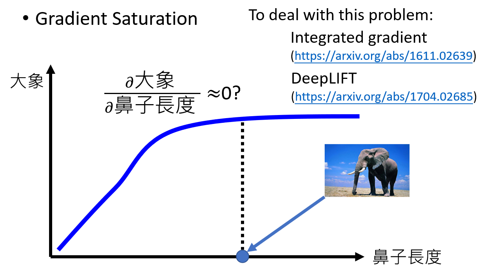

#### Attack Interpretation

攻击机器学习的解释是可能的。我们可以加一些神奇的扰动到图片上，人眼虽然辨识不出来，也不改变分类结果，但是模型聚焦的判定点却变了。

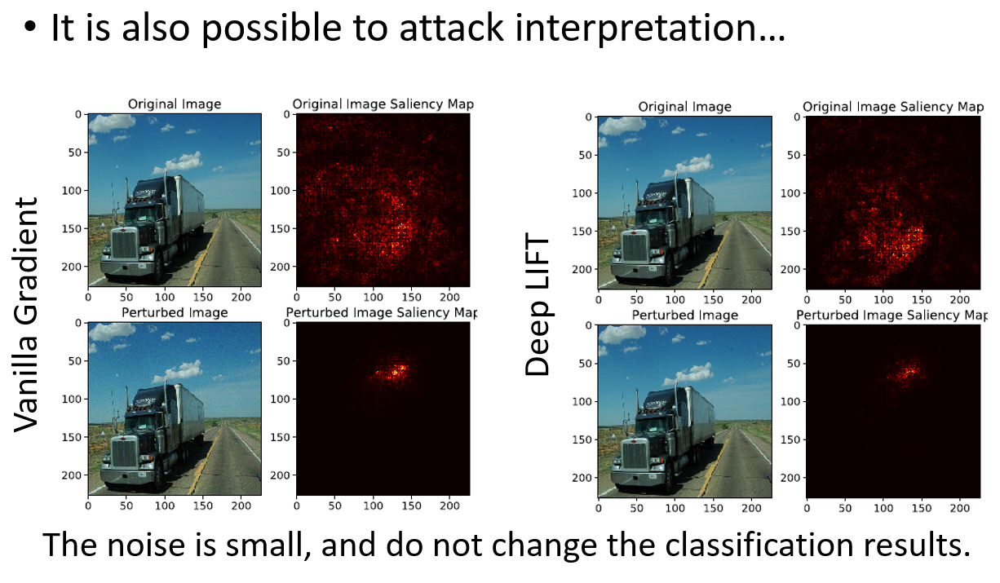

#### Case Study: Pokémon v.s. Digimon

通过Saliency Map，看到机器更在意边缘，而非宝可梦的本体

All the images of Pokémon are PNG, while most images of Digimon are JPEG. PNG文件透明背景，读档后背景是黑的。Machine discriminate Pokémon and Digimon based on Background color. 

This shows that **explainable ML is very critical.**

### Global Explanation: Explain the whole model

#### Activation Maximization

这块内容之前有讲过，就是找到一个图片，让某个隐藏层的输出最大，例如在手写数字辨识中，找出机器认为理想的数字如下

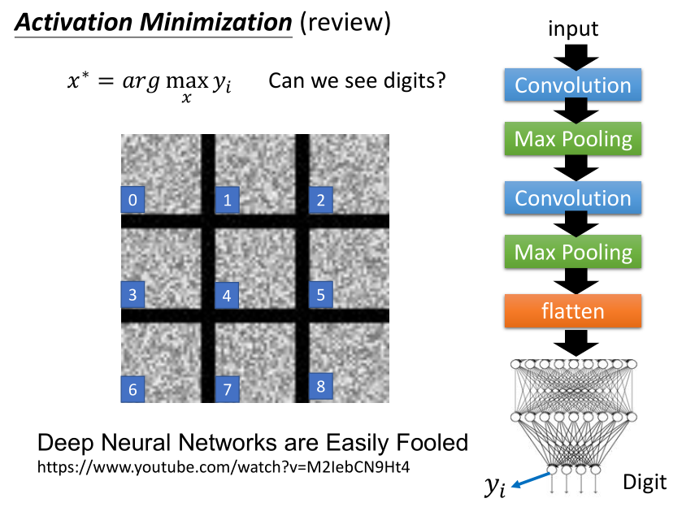

若不加限制，得到的结果经常会像是杂乱雪花，加一些额外的限制，使图像看起来更像数字（或其他正常图片）。我们不仅要maximize output的某个维度，还要加一个限制函数$R(x)$让$x$尽可能像一个数字图片，这个函数输入是一张图片，输出是这张图片有多像是数字。

那这个限制函数$R(x)$要怎么定义呢，定义方式有很多种，这里就简单的定义为所有pixel的和的数值，这个值越小说明黑色RGB(0,0,0)越多，这个图片就越像是一个数字，由于这里数字是用白色的笔写的，所以就加一个负号，整体去maximize $y_i$与$R(x)$的和，形式化公式就变成了：
$$
x^* = arg \max_{x}( y_i + R(x) )
$$
得到的结果如下图所示，比加限制函数之前要好很多了，从每个图片中多少能看出一点数字的形状了，尤其是6那一张。

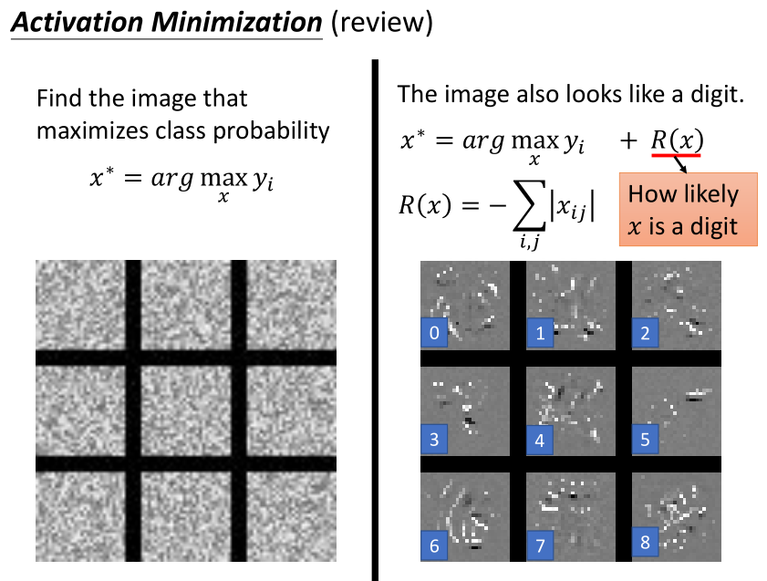

With several regularization terms, and hyperparameter tuning …..

在更复杂的模型上，比如要在ImgNet这个大语料库训练出的模型上做上述的事情，在不加限制函数的情况下将会得到同样杂乱无章的结果。而且在这种复杂模型中要想得到比较好的Global Explanation结果，往往要加上更多、更复杂、更精妙的限制函数。

https://arxiv.org/abs/1506.06579

#### Constraint from Generator

上面提到要对图片做一个限制，比较像一个图片，这个事情可以用Generator来做。

我们将方法转变为：找一个$z$，将它输入到图片生成器中产生一个图片，再将这个图片输入原来的图片分类器，得到一个类别判断$y$，我们同样要maximize $y_i$. 其实可以考虑为我们把图片生成器和图片分类器连接在一起，fix住两者的参数，通过梯度下降的方法不断改变$z$，最终找到一个合适的$z^*$可以maximize $y_i$.之后我们只要将这个$z^*$丢入图片生成器就可以拿到图片$x^*$了。形式化表述为：
$$
z^* = arg \max_{x} y_i
$$
调整输入低维向量z得到理想的y，把z通过generator就可以得到理想的image

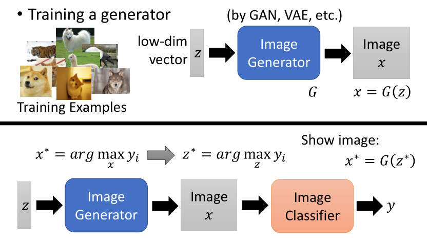

这里和GAN里面的discriminator不一样，discriminator只会判断generator生成的图片好或者不好，这里是要生成某一个类型的图片。并且generator是固定的，我们调整的是低维向量z。

### Using A Model to Explain Another

还有一种很神奇的方法用于解释模型，那就是用可解释的模型去模拟不可解释的模型，然后通过可解释的模型给出解释。

Some models are easier to Interpret. Using an interpretable model to mimic the behavior of an uninterpretable model. 

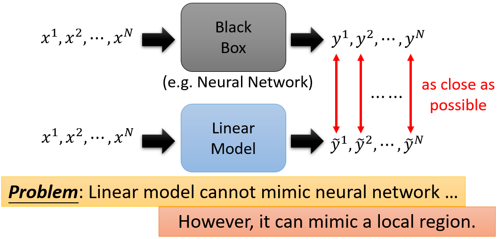

具体思路也很简单，就是喂给目标模型一些样本并记录输出作为训练集，然后用这个训练集训练一个解释性良好的模型对目标模型进行解释。然而可解释性好的模型往往是比较简单的模型，可解释性差的模型往往是比较复杂的模型，用一个简单模型去模拟一个复杂模型无疑是困难的。上图就是一个示例。用线性模型去模拟一个神经网络效果肯定是很差的，但是我们可以做的是局部的模拟。

#### Local Interpretable Model-Agnostic Explanations (LIME)

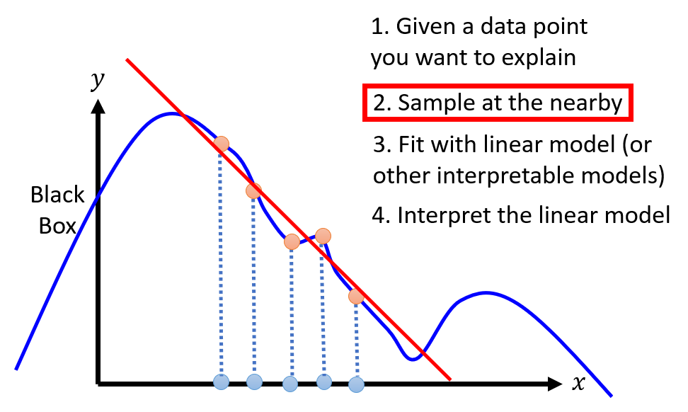

也就是说当我们给定一个输入的时候，我们要在这个输入附近找一些数据点，然后用线性模型进行拟合。那么当输入是图片的时候，什么样的数据算是这张图片附近的数据点呢？这需要不断调整参数。

##### LIME － Image

1. Given a data point you want to explain 

2. Sample at the nearby 

   - Each image is represented as a set of superpixels (segments).
   - Randomly delete some segments.
   - Compute the probability of “frog” by black box

   
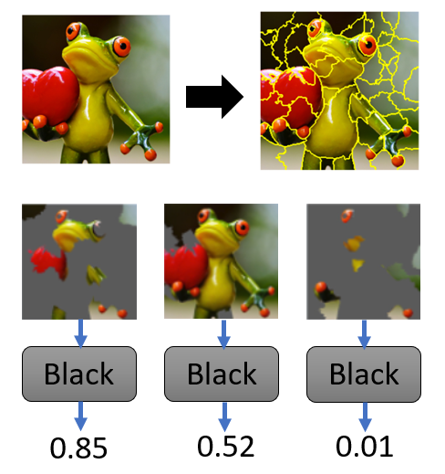

3. Fit with linear (or interpretable) model 

   
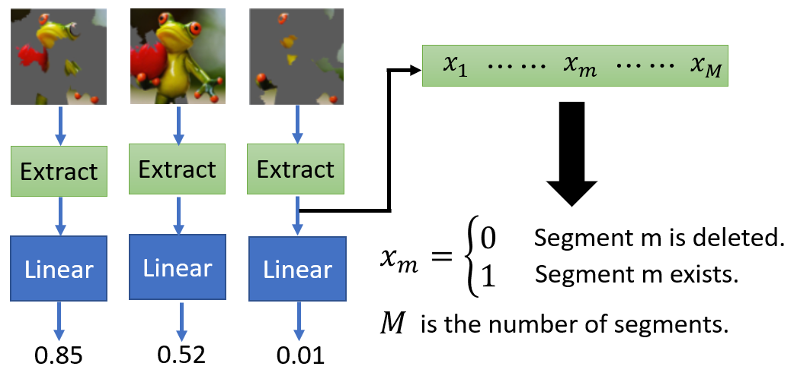

4. Interpret the model you learned 

   
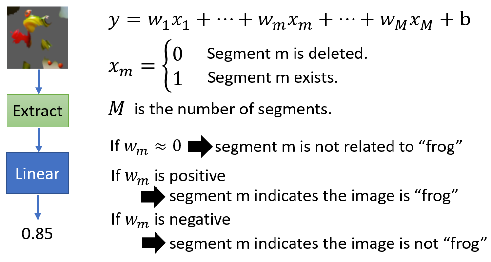

举例：

1. 首先现有一张要解释的图片，我们想知道模型为什么把它认作树蛙

2. 在这张图附近sample一些数据

   我们通常会用一些toolkit把图片做一下切割，然后随机的丢掉一些图块，得到的新图片作为原图片附近区域中的数据点。

3. 把上述这些图片输入原黑盒模型，得到黑盒的输出

4. 用线性模型（或者其他可解释模型）fit上述数据

   在上面的例子中我们在做图片辨识任务，此时我们可能需要在将图片丢到线性模型之前先做一个特征抽取。

5. 解释你的线性模型

   如上图所示，当线性模型种某个特征维度对应的weight：

   - 趋近于零，说明这个segment对模型判定树蛙不重要
   - 正值，说明这个segment对模型判定树蛙有作用
   - 负值，说明这个segment对模型判定树蛙有反作用

#### Decision Tree

下面用Decision Tree来代替上面的线性模型做解释工作。

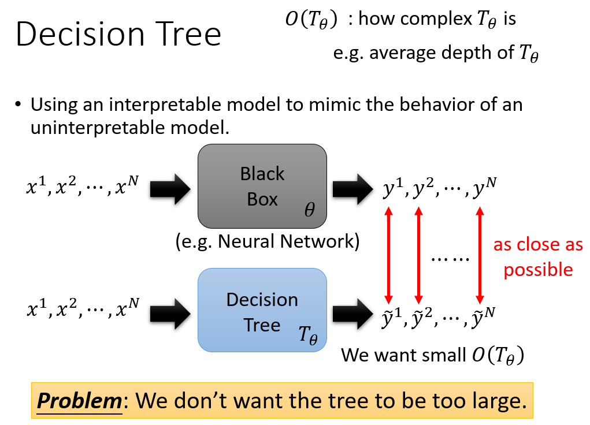

Decision Tree足够复杂时，理论上完全可以模仿黑盒子的结果，但是这样Decision Tree会非常非常复杂，那么Decision Tree本身又变得没法解释了，因此我们不想Decision Tree太过复杂。这里我们用$O(T_\theta)$表示决策树的复杂度，定义方式可以自选，比如树的平均深度。

要考虑决策树的复杂度，因此要在损失函数中加一个正则项：$\theta=arg\underset{\theta}{min}L(\theta)+\lambda O(T_\theta)$

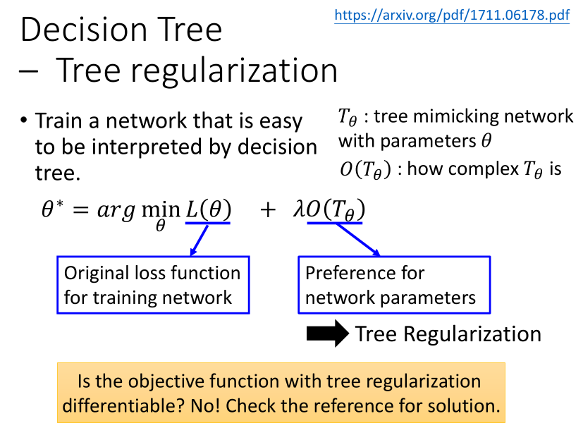

但是这个正则项没法做偏导，所以没有办法做GD。

解决方法：https://arxiv.org/pdf/1711.06178.pdf

train一个神奇的神经网络，我们给它一个神经网络的参数，它就可以输出一个数值，来表示输入的参数转成Decision Tree后Decision Tree的平均深度。

中心思想是用一个随机初始化的结构简单的Neural Network，找一些NN转成DT，算出平均深度，就有了训练data，训练后可以模拟出决策树的平均深度，然后用Neural Network替换上面的正则项，Neural Network是可以微分的，然后就可以Gradient Descent了。