# Adversarial Attack

## Adversarial Attack

### Motivation

We seek to deploy machine learning classifiers not only in the labs, but also in real world.

The classifiers that are robust to noises and work “most of the time” is not sufficient. We want the classifiers that are robust the inputs that are built to fool the classifier.

Especially useful for spam classification, malware detection, network intrusion detection, etc.

光是强还不够，还要应对人类的恶意攻击。

攻击是比较容易的，多数machine learning的model其实相当容易被各式各样的方法攻破，防御目前仍然是比较困难的。

### Attack

#### What do we want to do?

给当前的machine输入一个图片，输出Tiger Cat的信息分数为0.64，你不会说它是一个很差的model，你会说它是一个做的还不错的model。

我们现在想要做的是：往图片上面加上一些杂讯，这些杂讯不是从gaussion distribution中随机生成的（随机生成的杂讯，没有办法真的对Network造成太大的伤害），这是种很特殊的讯号，把这些很特殊的讯号加到一张图片上以后，得到稍微有点不一样的图片。将这张稍微有点不一样的图片丢到Network中，Network会得到非常不一样的结果。

本来的图片叫做$x_0$，而现在是在原来的$x_0$上加上一个很特别的$∆x$，得到一张新的图片$x'$（$x'=x_0+∆x$）。然后将$x'$丢到Network中，原来看到$x_0$时，Network会输出是一张Tiger Cat，但是这个Network看到时输出一个截然不同的答案（Attacked image，Else），那么这就是所谓攻击所要做的事情。

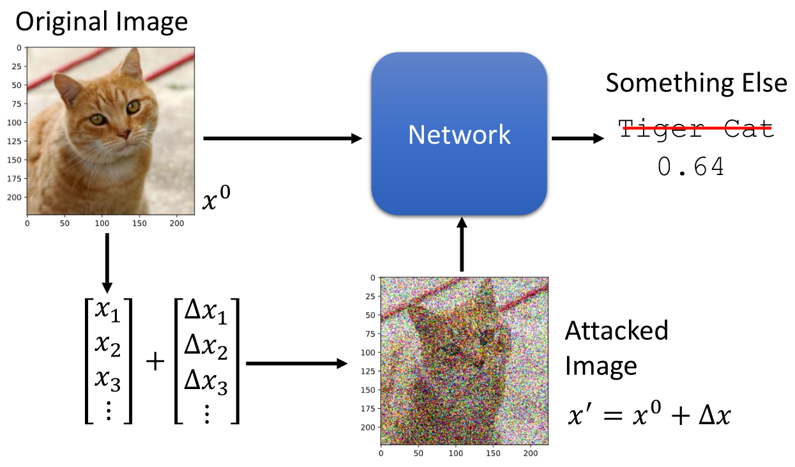

#### Loss Function for Attack

即找一张图片，使得loss(cross-entropy loss)越大越好，此时网络的参数训练完了，不能改变，而是只改变输入，使我们找到这样一张图片，能够让结果“越错越好”，离正确答案越远越好。

普通的训练模型，$x^0$不变，希望找到一个θ，使cross-entropy越小越好

Non-targeted Attack，θ不变，希望找到一个$x’$，使得cross-entropy越大越好，cross-entropy越大Loss越小

Targeted Attack，希望找到一个$x’$，使得cross-entropy越大越好，同时与目标（错误）标签越近越好

输入不能改变太大，$x^0$ 和$x’$越接近越好

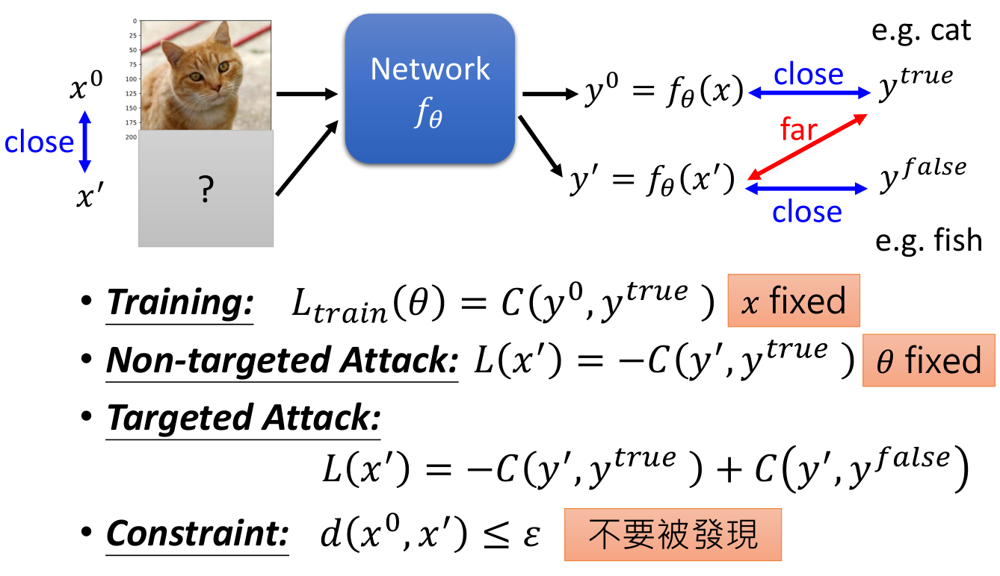

##### Constraint

$distance(x^0,x')$由任务的不同而不同，主要取决于对人来说什么样的文字、语音、图像信号是相似的。

L-infinity稍微更适合用于影像的攻击上面

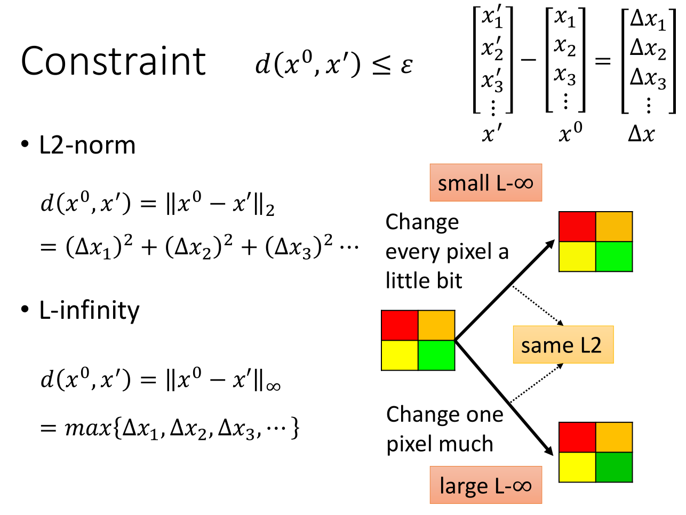

#### How to Attack

损失函数的梯度为$（此时变量为x）$
$$
\nabla L(x)=
\begin{bmatrix}
\frac{\partial L(x)}{\partial x_1} \\
\frac{\partial L(x)}{\partial x_2} \\
\frac{\partial L(x)}{\partial x_3} \\
... \\

\end{bmatrix}_{gradient}
$$
Gradient Descent，但是加上限制，判断$x^t$是否符合限制，如果不符合，要修正$x^t$

修正方法：穷举$x^0$附近的所有x，用距离$x^t$最近的点来取代$x^t$

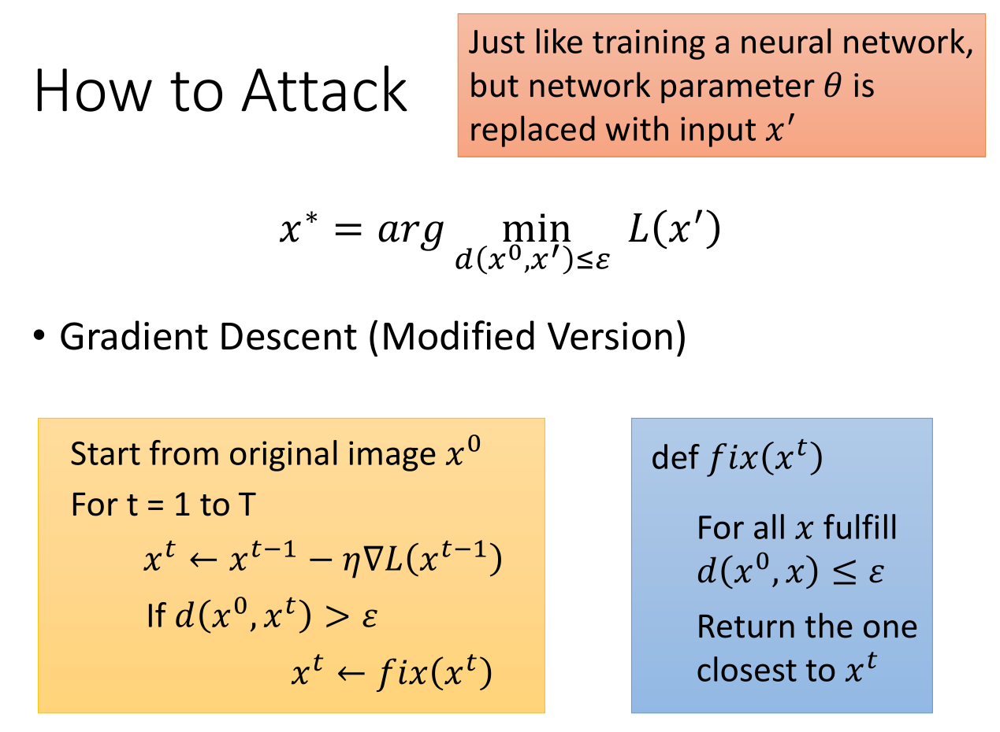

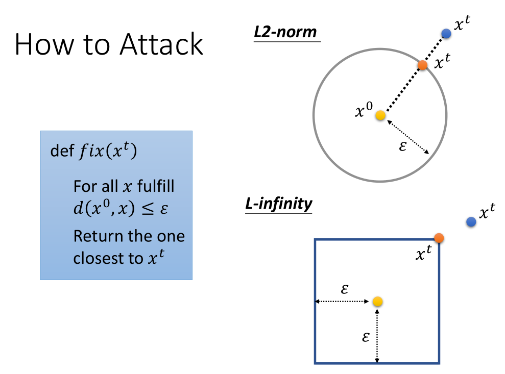

##### Example

使用一个猫，可以让它输出海星

两张图片的不同很小，要相减后乘以50倍才能看出

是否是因为网络很弱呢？随机加噪声，但是对结果的影响不大；加的噪声逐渐增大以后会有影响

#### What happened?

高维空间中，随机方向与特定方向的y表现不同，因此一般的杂讯没有效果，特定的杂讯会有效果。

你可以想象 $x^0$ 是在非常高维空间中的一个点，你把这个点随机的移动，你会发现多数情况下在这个点的附近很大一个范围内都是能正确辨识的空间，当你把这个点推到的很远的时候才会让机器识别成类似的事物，当你把它推的非常远时才会被辨识成不相关的事物。但是，有一些神奇维度，在这些神奇的维度上 $x^0$ 的正确区域只有非常狭窄的一点点，我们只要将 $x^0$ 推离原值一点点，就会让模型输出产生很大的变化。

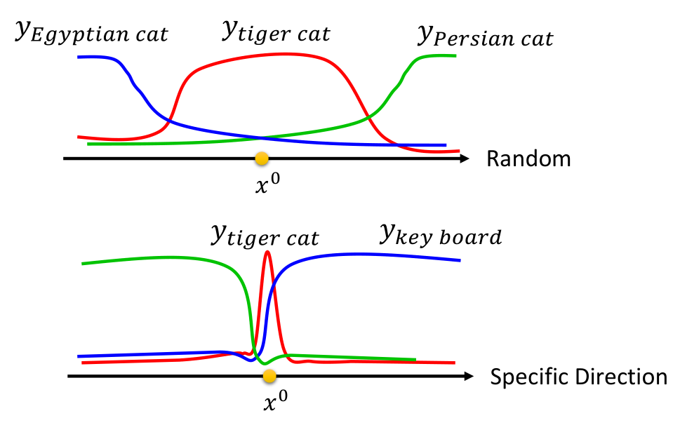

这种现象不止存在于Deep Model中，一般的Model也会被攻击。

#### Attack Approaches

- [FGSM](https://arxiv.org/abs/1412.6572)
- [Basic iterative method](https://arxiv.org/abs/1607.02533)
- [L-BFGS](https://arxiv.org/abs/1312.6199)
- [Deepfool](https://arxiv.org/abs/1511.04599)
- [JSMA](https://arxiv.org/abs/1511.07528)
- [C&W](https://arxiv.org/abs/1608.04644)
- [Elastic net attack](https://arxiv.org/abs/1709.04114)
- [Spatially Transformed](https://arxiv.org/abs/1801.02612)
- [One Pixel Attack](https://arxiv.org/abs/1710.08864)
- …… only list a few

##### Fast Gradient Sign Method (FGSM)

攻击方法的主要区别在于Different optimization methods和Different constraints

FGSM是一种简单的model attack方法，梯度下降的时候计算的梯度，如果是负的，则直接为-1，如果是正的，则直接为+1。所以$x^0$的更新要么为$-\varepsilon $，要么为$+\varepsilon $，只更新一次就结束了。

这个算法的思想就是只攻击一次就好（减去或者加上$\varepsilon$）。多攻击几次确实会更好，所以FGSM有一个进阶方法Iterative fast gradient sign method（I-FGSM）

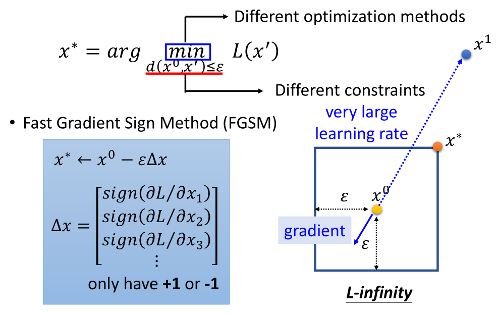

FGSM只在意gradient的方向，不在意它的大小。假设constrain用的是L-infinity，FGSM相当于设置了一个很大的learning rate，导致可以马上跳出范围，再拉回来。

#### White Box v.s. Black Box

 In the previous attack, we fix network parameters 𝜃 to find optimal 𝑥′.

To attack, we need to know network parameters 𝜃

- This is called **White Box Attack**. 

Are we safe if we do not release model?

- You cannot obtain model parameters in most on-line API.

No, because **Black Box Attack** is possible. 

##### Black Box Attack

If you have the **training data** of the target network

- Train a **proxy network** yourself

- Using the proxy network to generate attacked objects

Otherwise, obtaining input-output pairs from target network

如图中描述的是模型辨识正确的概率，也就是攻击失败的概率。上述五种神经网络的架构是不一样的，但是我们可以看到即使是不同架构的模型攻击成功的概率也是非常高的，而相同的架构的模型攻击成功率则明显是更高的。

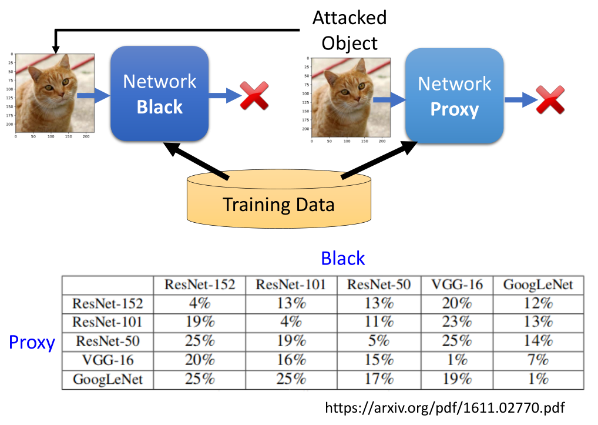

#### Universal Adversarial Attack

核心精神是找一个通用的攻击向量，将其叠加到任意样本上都会让模型辨识出错。

https://arxiv.org/abs/1610.08401

这件事做成以后，你可以想象，只要在做辨识任务的摄像机前面贴一张噪声照片，就可以让所有结果都出错。另外，这个通用攻击甚至也可以做上述的黑盒攻击。

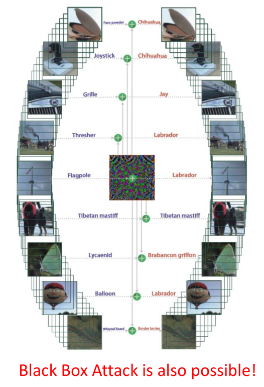

#### Adversarial Reprogramming

这个攻击的核心精神是：通过找一些噪声，让机器的行为发生改变，达到重编程实现其他功能的效果。改变原来network想要做的事情，例如从辨识动物变成数方块

当我们把图片中间贴上上图中那种方块图，机器就会帮我们数出途中方块的个数，如果有一个方块会输出tench，有两个方块就输出goldfish… 这件事还挺神奇的，因为我们并没有改变机器的任何参数，我们只是用了和前述相同的方法，找了一个噪声图片，然后把要数方块的图贴在噪声上，输入模型就会让模型帮我们数出方块的个数。具体方法细节参考引用文章。

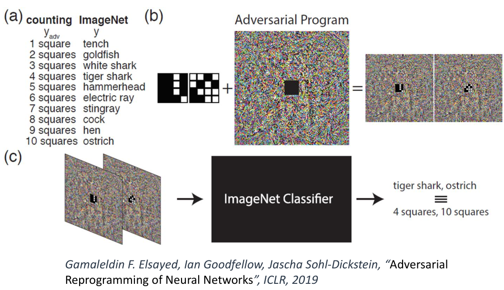

#### Attack in the Real World

我们想知道上述的攻击方法是否能应用在现实生活中，上述的所有方法中加入的噪声其实都非常的小，在数字世界中这些噪声会对模型的判别造成很大影响似乎是很合理的，但是在真实的世界中，机器是通过一个小相机看世界的，这样的小噪声通过相机以后可能就没有了。通过镜头是否会识别到那些微小的杂讯呢？实验把攻击的图像打印出来，然后用摄像头识别。证明这种攻击时可以在现实生活中做到的。

对人脸识别上进行攻击，可以把噪声变成实体眼镜，带着眼镜就可以实现攻击。

需要确保：多角度都是成功的；噪声不要有非常大的变化（比如只有1像素与其他不同），要以色块方式呈现，这样方便摄像头能看清；不用打印机打不出来的颜色。

1. An attacker would need to find perturbations that generalize beyond a single image.
2. Extreme differences between adjacent pixels in the perturbation are unlikely to be accurately captured by cameras.
3. It is desirable to craft perturbations that are comprised mostly of colors reproducible by the printer

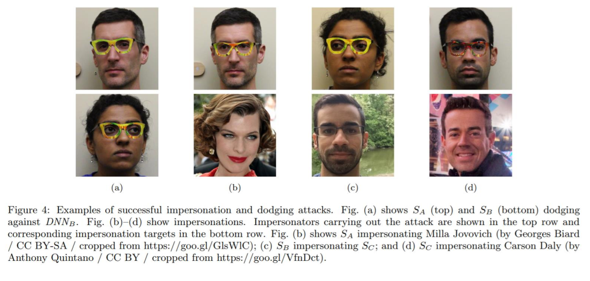

在不同角度变成限速45的标志

#### Beyond Images

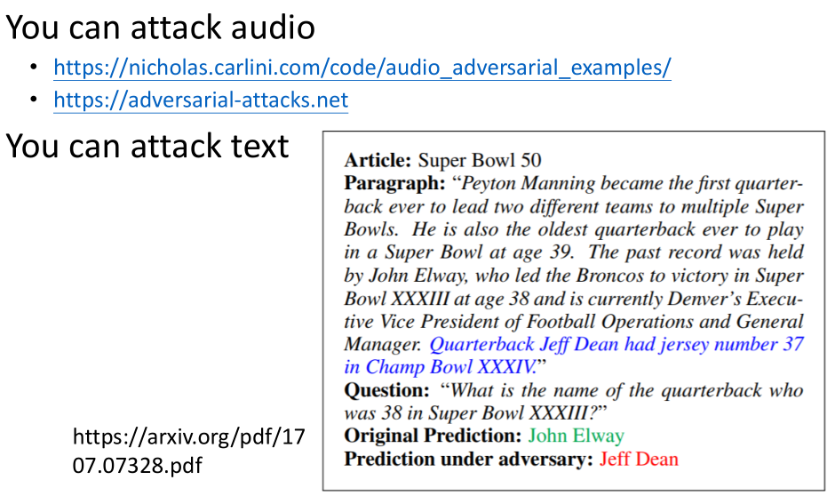

### Defense

 Adversarial Attack **cannot** be defended by weight regularization, dropout and model ensemble.

Two types of defense

- Passive defense: Finding the attached image without modifying the model
  - Special case of Anomaly Detection，找出加入攻击的图片，不修改网络

- Proactive defense: Training a model that is robust to adversarial attack

#### Passive Defense

加入filter，比如smoothing。

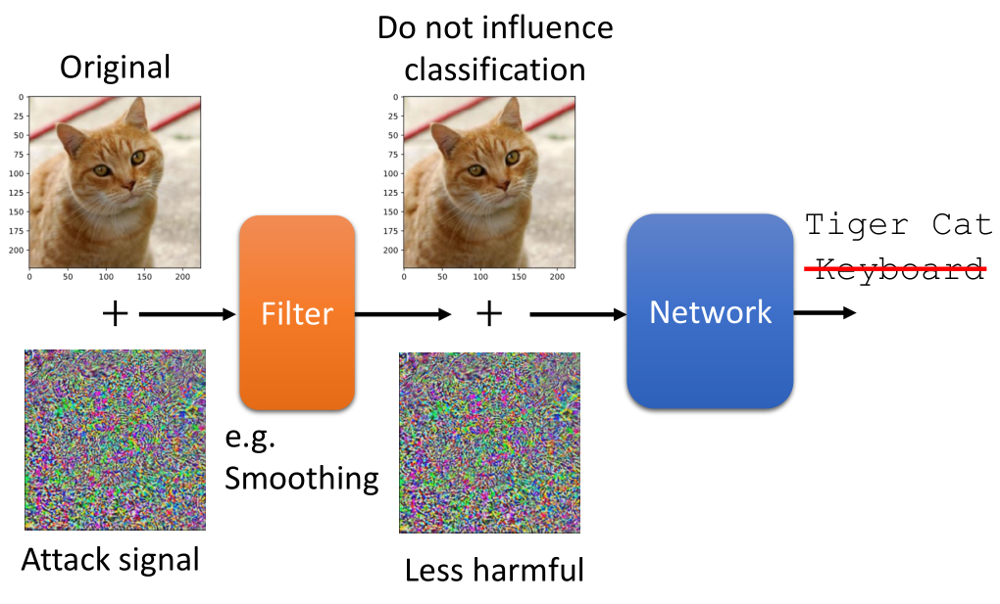

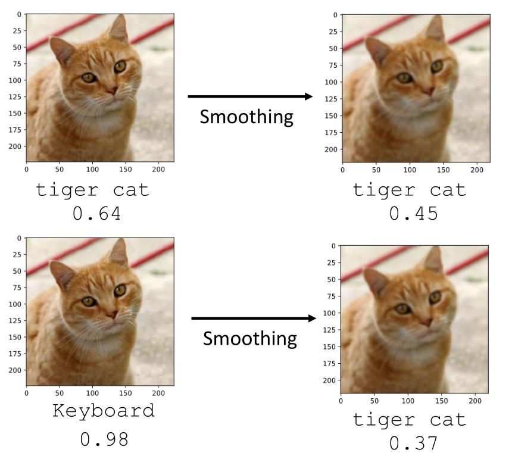

解释是，找攻击信号时，实际上只有某一种或者某几种攻击信号能够让攻击成功。虽然这种攻击信号能够让model失效，但是只有某几个方向上的攻击信号才能work。一旦加上一个filter，讯号改变了，攻击便失效。

##### Feature Squeeze

先用正常的model做一个prediction，再用model之前加上squeeze模块的model做一个prediction，如果这两个prediction差距很大，说明这个image被攻击过。

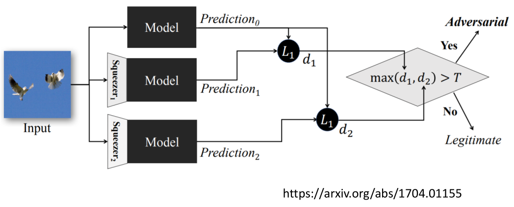

##### Randomization at Inference Phase

还可以在原图基础上做一点小小的缩放，一些小padding，让攻击杂讯与原来不太一样，让攻击杂讯失效。

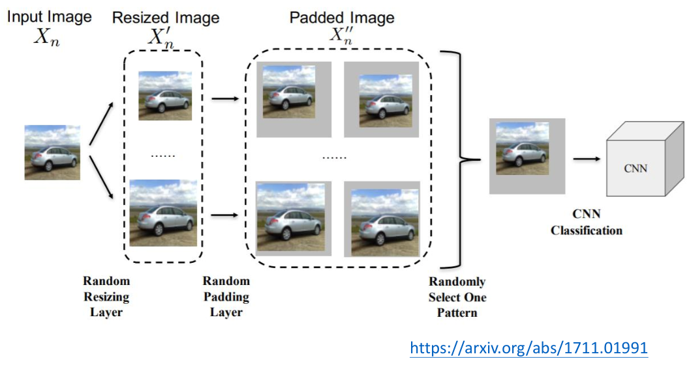

但问题是这样在model之前加“盾牌”的方法，有一个隐患是，如果，“盾牌”的机制被泄露出去，那么攻击仍然很有可能成功。（把filter想象成network的第一个layer，再去训练攻击杂讯即可）

#### Proactive Defense

精神：训练NN时，找出漏洞，补起来。

假设train T个iteration，在每一个iteration中，利用attack algorithm找出找出每一张图片的attack image，在把这些attack image标上正确的label，再作为training data，加入训练。这样的方法有点像data augmentation。

为什么需要进行T个iteration？因为加入新的训练数据后，NN的结构改变，会有新的漏洞出现。

This method would stop algorithm A, but is still vulnerable for algorithm B.

Defense今天仍然是个很困难，尚待解决的问题。

## 