# Network Compression

## Network Compression

由于未来我们的模型有可能要运行在很多类似手机，手表，智能眼镜，无人机上，这些移动终端的算力和存储空间有限，因此要对模型进行压缩。当然也可以根据具体的硬件平台定制专门的模型架构，但这不是本课的重点。

### Network Pruning

#### Network can be pruned

Networks are typically over-parameterized (there is significant redundant weights or neurons)

Prune them!

先要训练一个很大的模型，然后评估出重要的权重或神经元，移除不重要的权重或神经元，After pruning, the accuracy will drop (hopefully not too much)，要对处理后的模型进行微调，进行recovery把移除的损伤拿回来，若不满意就循环到第一步。注意：Don’t prune too much at once, or the network won’t recover.

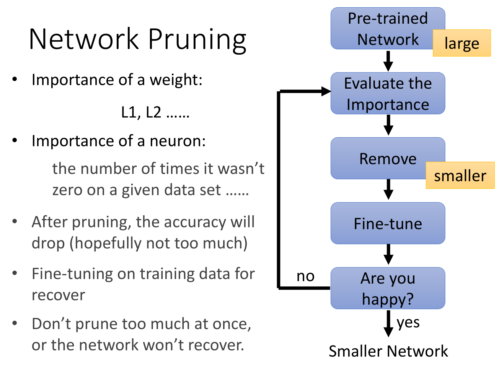

怎么判断哪些参数是冗余或者不重要的呢？

- 对权重(weight)而言，我们可以通过计算它的L1、L2值来判断重要程度
- 对neuron而言，我们可以给出一定的数据集，然后查看在计算这些数据集的过程中neuron参数为0的次数，如果次数过多，则说明该neuron对数据的预测结果并没有起到什么作用，因此可以去除。

#### Why Pruning?

How about simply train a smaller network?

- It is widely known that smaller network is more difficult to learn successfully.

  - Larger network is easier to optimize? 更容易找到global optimum

    https://www.youtube.com/watch?v=_VuWvQUMQVk

- Lottery Ticket Hypothesis

  https://arxiv.org/abs/1803.03635

  首先看最左边的网络，它表示大模型，我们随机初始化它权重参数（红色）。然后我们训练这个大模型得到训练后的模型以及权重参数（紫色）。最后我们对训练好的大模型做pruning得到小模型。作者把小模型拿出来后随机初始化参数（绿色，右上角），结果发现无法训练。然后他又把最开始的大模型的随机初始化的weight复制到小模型上（即把对应位置的权重参数复制过来，右下角）发现可以train出好的结果。

  就像我们买彩票，买的彩票越多，中奖的机率才会越大。而最开始的大模型可以看成是由超级多的小模型组成的，也就是对大模型随机初始化参数会得到各种各样的初始化参数的小模型，有的小模型可能train不起来，但是有的就可以。大的Network比较容易train起来是因为，其中只要有小的Network可以train起来，大的Network就可以train起来。对大的Network做pruning，得到了可以train起来的小Network，因此它的初始参数是好的参数，用此参数去初始化，就train起来了。

  
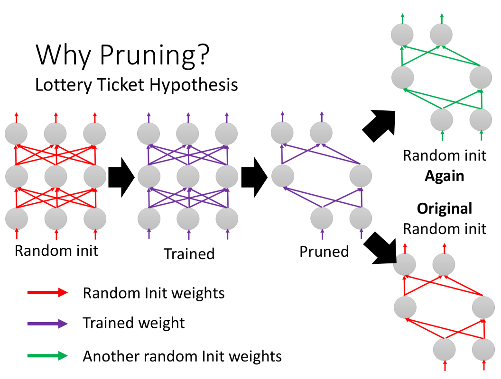

- Rethinking the Value of Network Pruning

  这个文献提出了不同见解，其实直接train小的network也可以得到好的结果，无需初始化参数。Scratch-B比Scratch-E训练epoch多一些，可以看到比微调的结果要好。

  
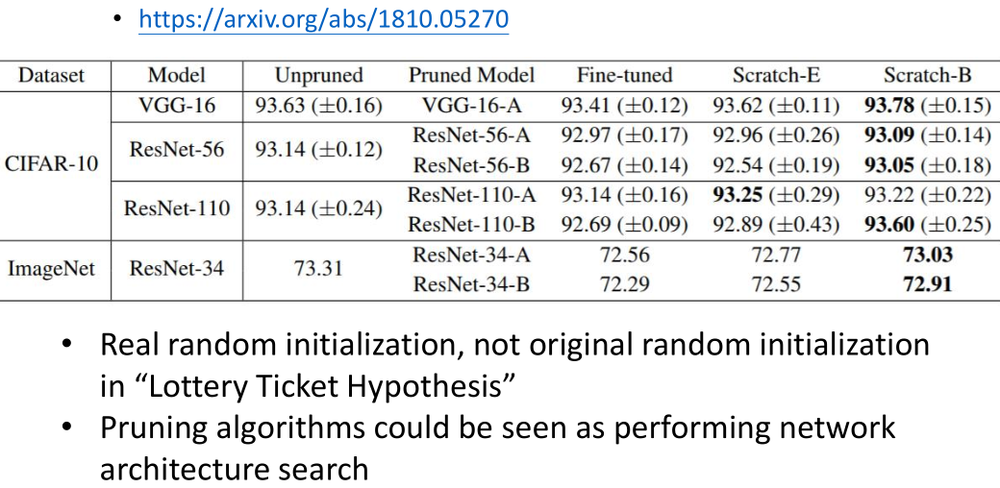

#### Practical Issue

##### Weight pruning

- The network architecture becomes irregular.

- Hard to implement, hard to speedup ……
- 可以补0，但是这种方法使得算出来Network的大小与原Network的大小一样。

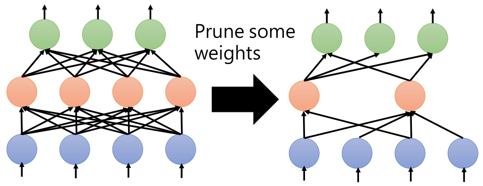

- 模型参数去掉了95%，最后的准确率只降低了2%左右，说明weight pruning的确能够在保证模型准确率的同时减少了模型大小，但是由于模型不规则，GPU加速没有效率，模型计算速度并没有提速，甚至有时使得速度降低了。

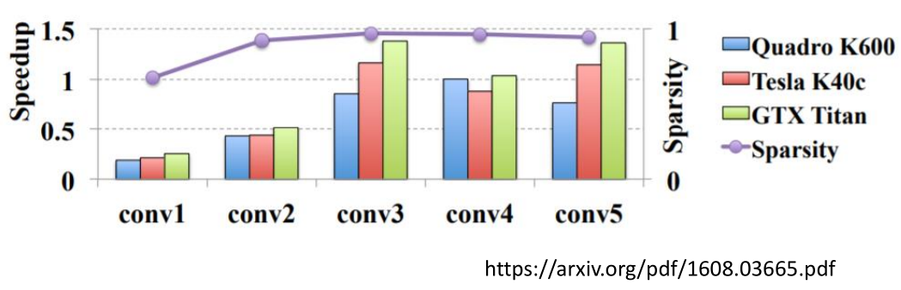

##### Neuron pruning

- The network architecture is regular.
- Easy to implement, easy to speedup ……

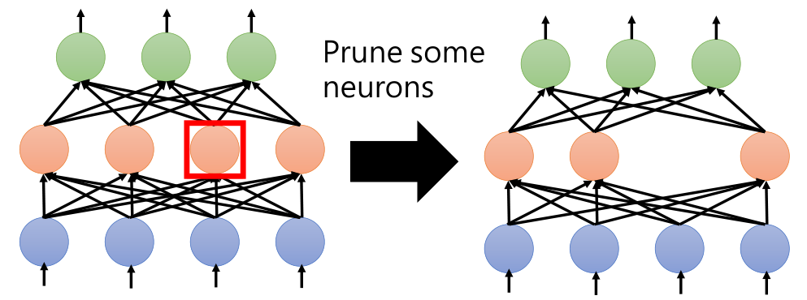

### Knowledge Distillation

我们可以使用一个student network来学习teacher network的输出分布，并计算两者之间的cross-entropy，使其最小化，从而可以使两者的输出分布相近。teacher提供了比label data更丰富的资料，比如teacher net不仅给出了输入图片和1很像的结果，还说明了1和7长得很像，1和9长得很像；所以，student跟着teacher net学习，是可以得到更多的information的。

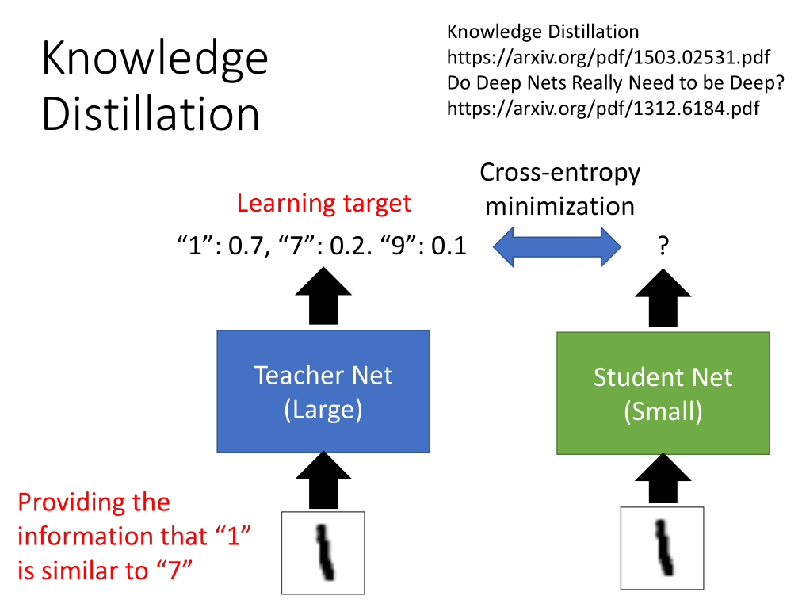

可以让多个老师出谋划策来教学生，即通过Ensemble来进一步提升预测准确率。

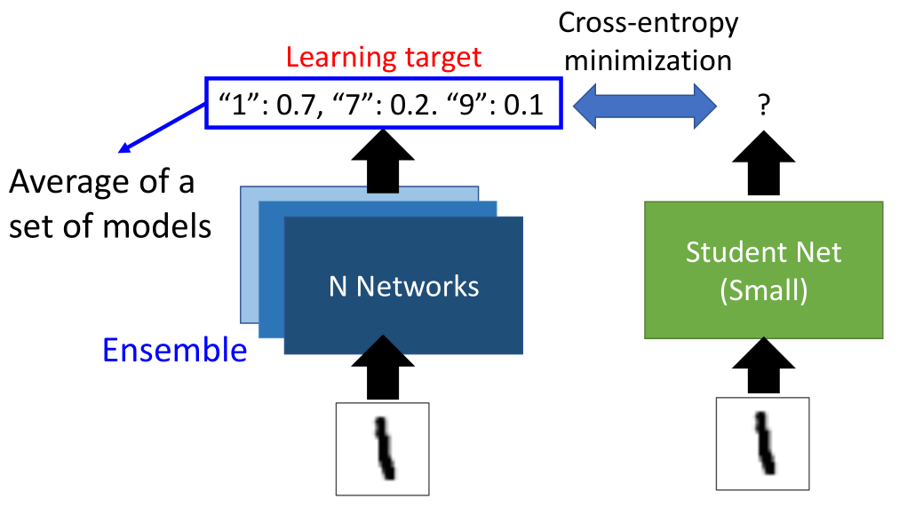

#### Temperature

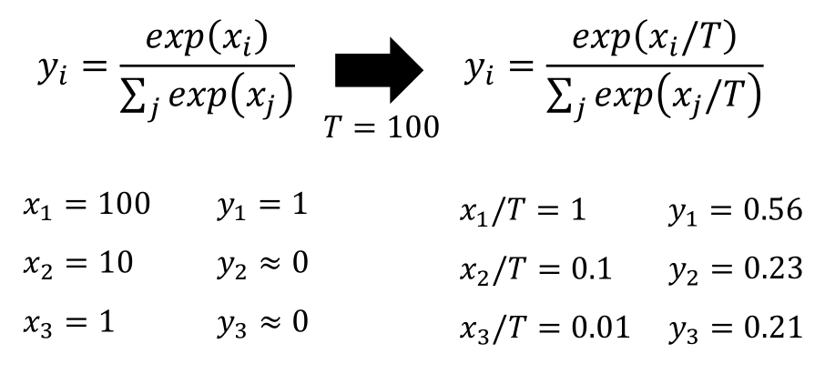

在多类别分类任务中，我们用到的是softmax来计算最终的概率，但是这样有一个缺点，因为使用了指数函数，如果在使用softmax之前的预测值是$x_1=100,x_2=10,x_3=1$，那么使用softmax之后三者对应的概率接近于$y_1=1,y_2=0,y_3=0$，这样小模型没有学到另外两个分类的信息，和直接学习label没有区别。

引入了一个新的参数Temperature，通过T把y的差距变小了，导致各个分类都有机率，小模型学习的信息就丰富了。T需要自行调整。

### Parameter Quantization

Using less bits to represent a value

- 一个很直观的方法就是使用更少bit来存储数值，例如一般默认是32位，那我们可以用16或者8位来存数据。

Weight clustering

- 最左边表示网络中正常权重矩阵，之后我们对这个权重参数做聚类（比如用kmean），比如最后得到了4个聚类，那么为了表示这4个聚类我们只需要2个bit，即用00,01,10,11来表示不同聚类。之后每个聚类的值就用均值来表示。这样的缺点是误差可能会比较大。每个参数不用保存具体的数值，而是只需要保存参数所属的类别即可。

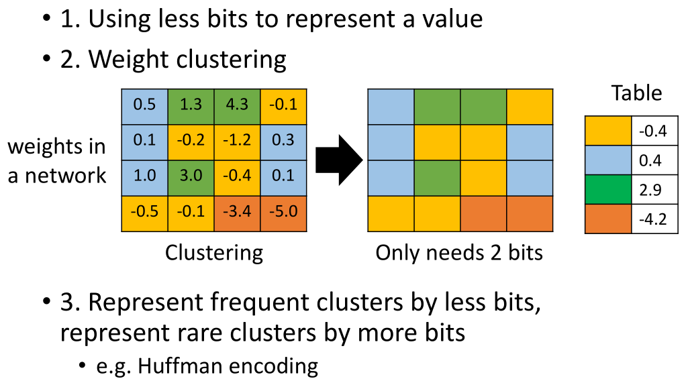

Represent frequent clusters by less bits, represent rare clusters by more bits

- Huffman Encoding
  - 对常出现的聚类用少一点的bit来表示，而那些很少出现的聚类就用多一点的bit来表示。

Binary Weights

- Binary Connect

  - 一种更加极致的思路来对模型进行压缩，Your weights are always +1 or -1

  - 简单介绍一下Binary Connect的思路，如下图示，灰色节点表示一组binary weights，蓝色节点是一组real value weights

    我们先计算出和蓝色节点最接近的灰色节点，并计算出其梯度方向（红色剪头）。

    蓝色节点按照红色箭头方向更新，而不是按照自身的梯度方向更新。

    最后在满足一定条件后(例如训练至最大epoch)，蓝色节点会停在一个灰色节点附近，那么我们就使用该灰色节点的weights为Network的参数。

  
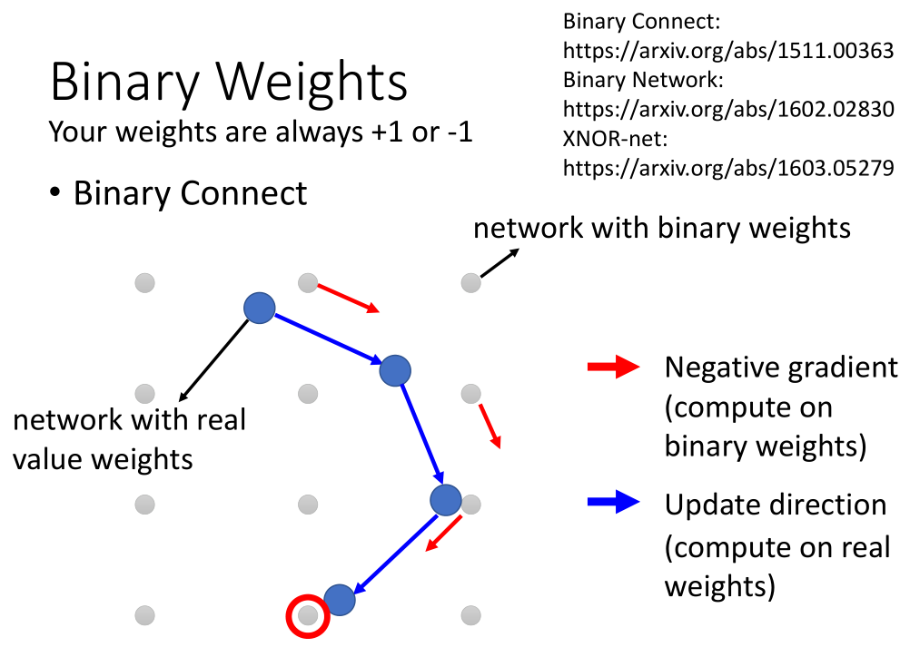

  * Binary Connect的效果并没有因为参数只有1/-1而坏掉，相反，Binary Connect有点像regularization，虽然效果不如Dropout，但是比正常的Network效果还要稍微好点

  
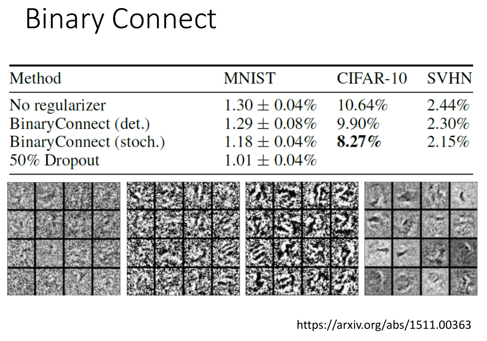

### Architecture Design

#### Low rank approximation

下图是低秩近似的简单示意图，左边是一个普通的全连接层，可以看到权重矩阵大小为M×N，而低秩近似的原理就是在两个全连接层之间再插入一层K。很反直观，插入一层后，参数还能变少？没错，的确变少了，我们可以看到新插入一层后的参数数量为K×(M+N)​，若让K不要太大，就可以减少Network的参数量。

但是低秩近似之所以叫低秩，是因为原来的矩阵的秩最大可能是$min(M,N)$，而新增一层后可以看到矩阵U和V的秩都是小于等于K的，我们知道$rank(AB)≤min(rank(A),rank(B))$，所以相乘之后的矩阵的秩一定还是小于等于K。

因此会限制Network的参数，限制原来Network所做到的事情。

#### Standard CNN

看一下标准卷积所需要的参数量。如下图示，输入数据由两个6\*6的feature map组成，之后用4个大小为3*3的卷积核做卷积，最后的输出特征图大小为4\*4\*4。每个卷积核参数数量为2\*3\*3=18，所以总共用到的参数数量为4\*18=72。

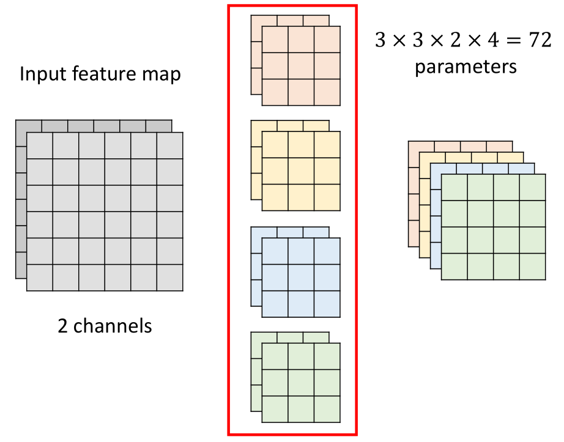

#### Depthwise Separable Convolution

##### Depthwise Convolution

首先是输入数据的每个通道只由一个二维的卷积核负责，即卷积核通道数固定为1，这样最后得到的输出特征图等于输入通道。

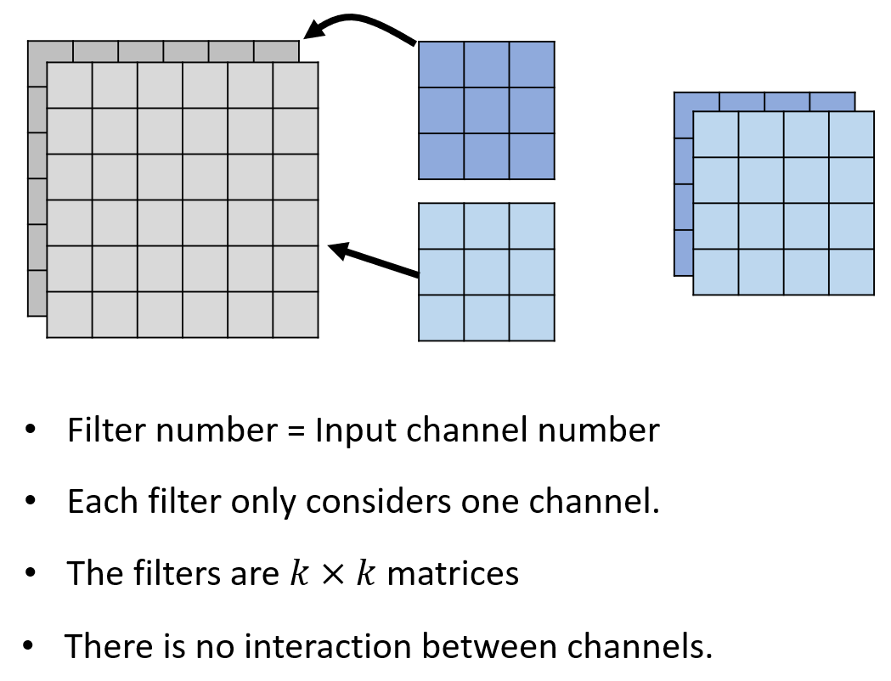

##### Pointwise Convolution

因为第一步得到的输出特征图是用不同卷积核计算得到的，所以不同通道之间是独立的，因此我们还需要对不同通道之间进行关联。为了实现关联，在第二步中使用了1\*1大小的卷积核，通道数量等于输入数据的通道数量。另外1\*1卷积核的数量等于预期输出特征图的数量，在这里等于4。最后我们可以得到和标准卷积一样的效果，而且参数数量更少，3 × 3 × 2 = 18、2 × 4 = 8，相比72个参数，合起来只用了26个参数。

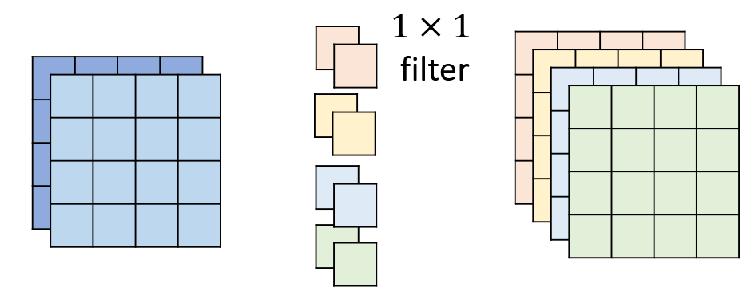

##### 比较

与上文中插入一层linear hidden layer的思想相似，在其中插入feature map，使得参数减少

把filter当成神经元，可以发现Depthwise Separable Convolution是对普通Convolution filter的拆解。共用第一层filter的参数，第二层才用不同的参数。即不同filter间共用同样的参数。

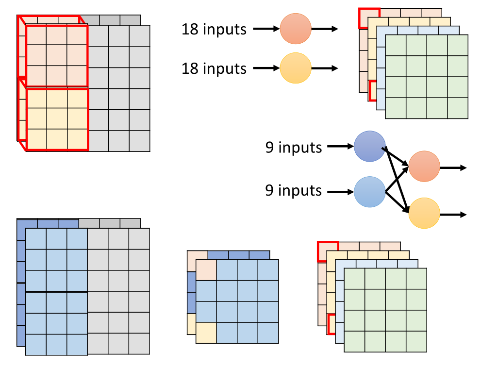

下面我们算一下标准卷积和Depthwise Separable卷积参数量关系

假设输入特征图通道数为$I$，输出特征图通道数为$O$，卷积核大小为$k×k$。

标准卷积参数量：$(𝑘 × 𝑘 × 𝐼) × 𝑂$

Depthwise Separable Convolution参数量：$𝑘 × 𝑘 × 𝐼 + 𝐼 × 𝑂$

两者相除，一般来说O很大，因此考虑后一项，k=3时，参数量变成原来的$\frac{1}{9}$

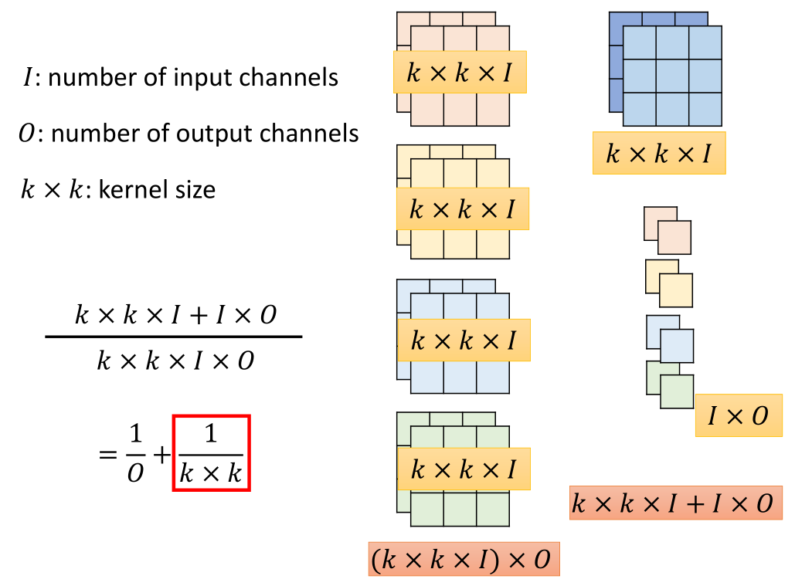

#### To learn more ……

这样的设计广泛运用在各种号称比较小的网络上面

- SqueezeNet
  - https://arxiv.org/abs/1602.07360

- MobileNet
  - https://arxiv.org/abs/1704.04861

- ShuffleNet
  - https://arxiv.org/abs/1707.01083

- Xception
  - https://arxiv.org/abs/1610.02357

### Dynamic Computation

Can network adjust the computation power it need? 该方法的主要思路是如果目前的资源充足（比如你的手机电量充足），那么算法就尽量做到最好，比如训练更久，或者训练更多模型等；反之，如果当前资源不够（如电量只剩10%），那么就先求有，再求好，先算出一个过得去的结果。

#### Possible Solutions

1. Train multiple classifiers

比如说我们提前训练多种网络，比如大网络，中等网络和小网络，那么我们就可以根据资源情况来选择不同的网络。但是这样的缺点是我们需要保存多个模型。

2. Classifiers at the intermedia layer

当资源有限时，我们可能只是基于前面几层提取到的特征做分类预测，但是一般而言这样得到的结果会打折扣，因为前面提取到的特征是比较细腻度的，可能只是一些纹理，而不是比较高层次抽象的特征。

左下角的图表就展示了不同中间层的结果比较，可以看到DenseNet和ResNet越靠近输入，预测结果越差。

右下角的图则展示了在不同中间层插入分类器对于模型训练的影响，可以看到插入的分类器越靠近输入层，模型的性能越差。

因为一般而言，前面的网络结构负责提取浅层的特征，但是当我们在前面就插入分类器后，那么分类器为了得到较好的预测结果会强迫前面的网络结构提取一些复杂的特征，进而扰乱了后面特征的提取。

具体的解决方法可以阅读[Multi-Scale Dense Networks](https://arxiv.org/abs/1703.09844)

  
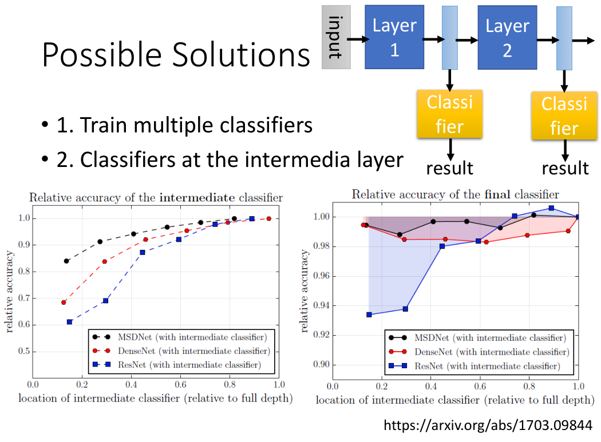

## 