# Seq2Seq

## Conditional Generation by RNN & Attention

### Generation

Sentences are composed of characters/words

- 英文characters: a-z，word: 用空格分割；中文word: 有意义的最小单位，如“葡萄”，characters: 单字 “葡”

- Generating a character/word at each time by RNN

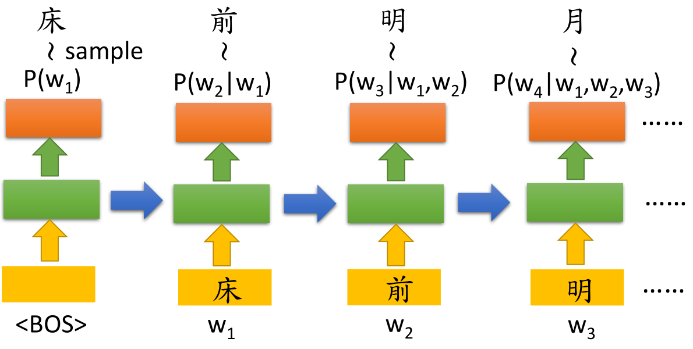

Images are composed of pixels

- Generating a pixel at each time by RNN

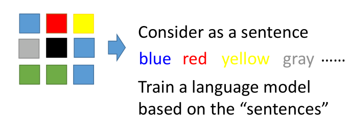

同样道理也可以用来生成一张照片，只要将每一个Pixel想成是一个Word，给模型一个BOS讯号，它就会开始生成颜色。

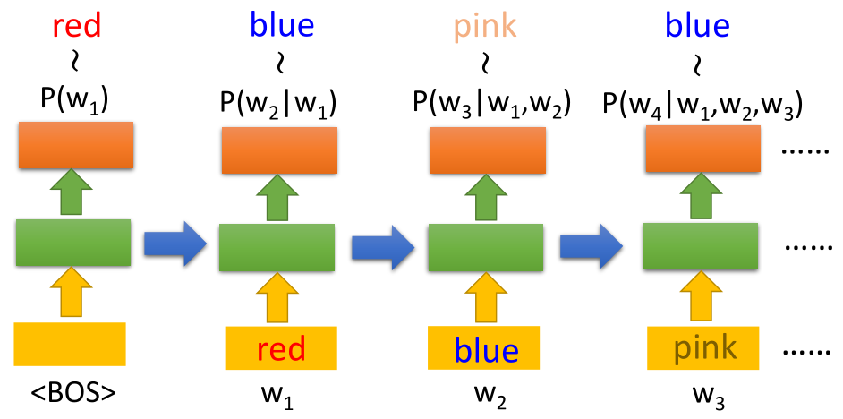

一般生成照片的时候如果单纯的按序生成可能会无法考量到照片之间的几何关系，但如果在生成Pixel的同时可以考量周围Pixel的话，那就可以有好的生成，可以利用3D Grid-LSTM

首先convolution filter在左下角计算，经过3D Grid-LSTM得到蓝色。filter右移一格，这时候会考虑蓝色，而3D Grid-LSTM的输入会往三个维度丢出，因此在计算第二个颜色的时候它会考虑到左边蓝色那排，得到红色。相同方式再一次得到黄色。filter往上一格移至左边起始点，同时会考量蓝色，才产生灰色。filter右移一格，这时候的filter计算含盖了灰、蓝、红三个资讯，得到黑色。

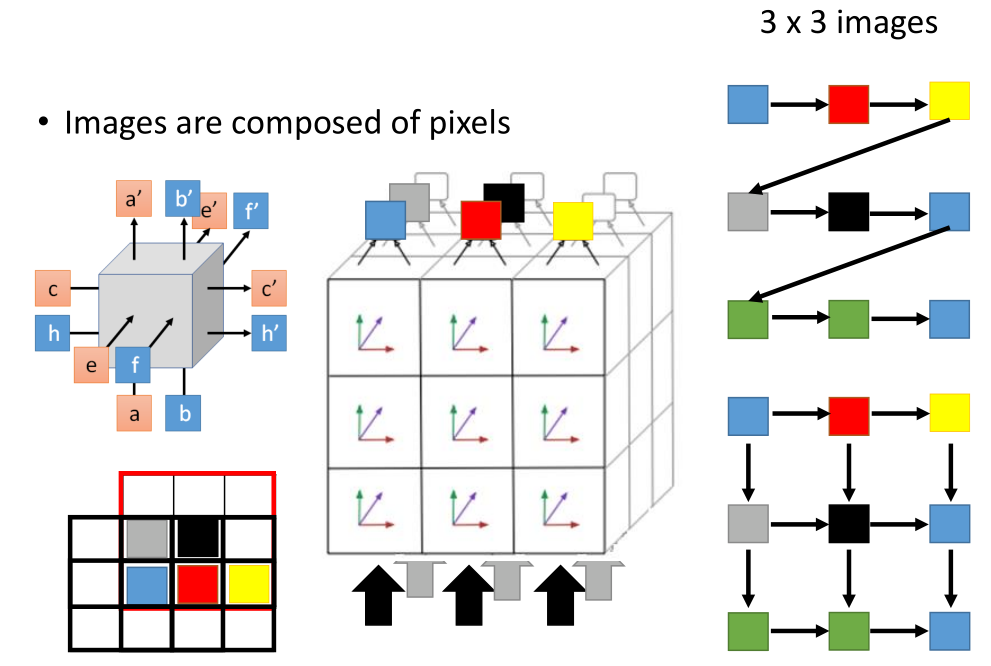

其他例子

Image

- Aaron van den Oord, Nal Kalchbrenner, Koray Kavukcuoglu, Pixel Recurrent Neural Networks, arXiv preprint, 2016
- Aaron van den Oord, Nal Kalchbrenner, Oriol Vinyals, Lasse Espeholt, Alex Graves, Koray Kavukcuoglu, Conditional Image Generation with PixelCNN Decoders, arXiv preprint, 2016

Video

- Aaron van den Oord, Nal Kalchbrenner, Koray Kavukcuoglu, Pixel Recurrent Neural Networks, arXiv preprint, 2016

Handwriting

- Alex Graves, Generating Sequences With Recurrent Neural Networks, arXiv preprint, 2013

Speech

- Aaron van den Oord, Sander Dieleman, Heiga Zen, Karen Simonyan, Oriol Vinyals, Alex Graves, Nal Kalchbrenner, Andrew Senior,Koray Kavukcuoglu, WaveNet: A Generative Model for Raw Audio, 2016

### Conditional Generation

We don’t want to simply generate some random sentences.

Generate sentences based on conditions.

单纯的利用RNN来产生句子那可能是不足的，因为它可以胡乱产生合乎文法的句子，因此我们希望模型可以根据某些条件来产生句子，也许给一张照片由机器来描述照片，或是像聊天机器人，给一个句子，机器回一个句子。

Represent the input condition as a vector, and consider the vector as the input of RNN generator.

将照片通过一个CNN产生一个Vector，在每一个时间点都将该Vector输入RNN，这样子每次产生的Word都会被该照片的Vector给影响，就不会是胡乱产生句子了。

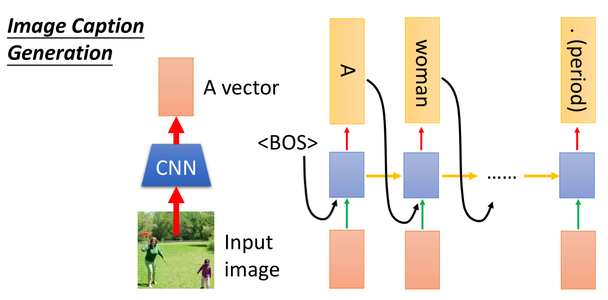

相同做法也可以应用在机器翻译与聊天机器人上，例如机器翻译中把“机器学习”这个句子表示成一个vector（先通过另一个RNN，抽出最后一个时间点Hidden Layer的Output）丢到一个可以产生英语句子的RNN里即可。

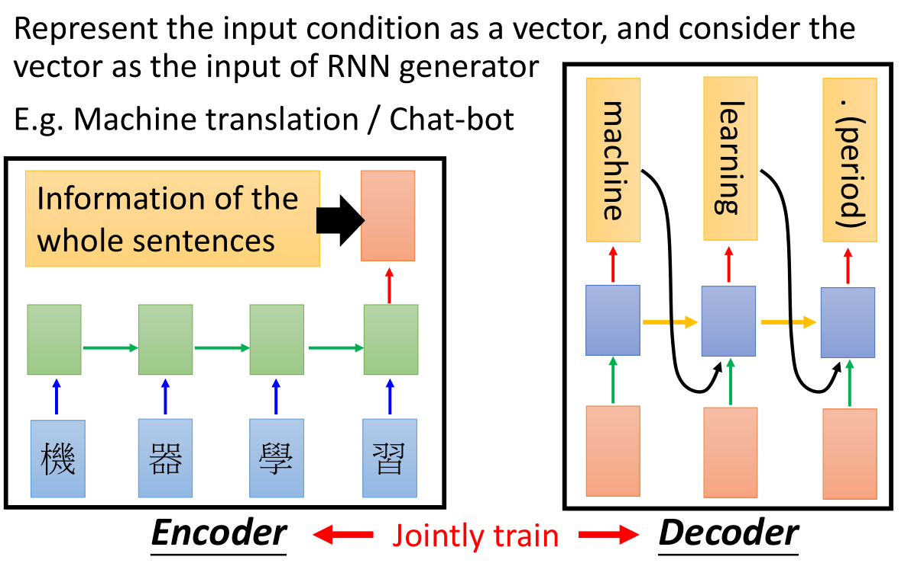

前半部分称为Encoder，后半部分称为Decoder，两边可以结合一起训练参数，这种方式称为**Sequence-to-Sequence Learning**。资料量大时可以两边学习不同参数，资料量小时也可以共用参数（不容易过拟合）。 

Need to consider longer context during chatting.

在聊天机器人中状况比较复杂，举例来说，机器人说了Hello之后，人类说了Hi，这时候机器人再说一次Hi就显的奇怪。因此机器必需要可以考虑比较长的资讯，它必需知道之前已经问过什么，或使用者说过什么。

我们可以再加入一个RNN来记忆对话，也就是双层的Encoder。首先，机器说的Hello跟人类回复的Hi都先变成一个code，接着第二层RNN将过去所有互动记录读一遍，变成一个code，再把这个结果做为后面Decoder的输入。

### Attention

#### Dynamic Conditional Generation

Dynamic Conditional Generation可以让机器考虑仅需要的information，让Decoder在每个时间点看到的information都是不一样的。

#### Attention-based model

##### Machine Translation

下图中的match是一个function，可以自己设计，“机”，“器”，“学”，“习”通过RNN得到各自的vector，$z_0$是一个parameter。$α^1_0$，上标1表示$z_0$和$h_1$算匹配度，下标0表示时间是0这个时间点，α的值表示匹配程度。

match function可以自己设计，无论是那种方式，如果match方法中有参数，要和模型一起训练jointly train

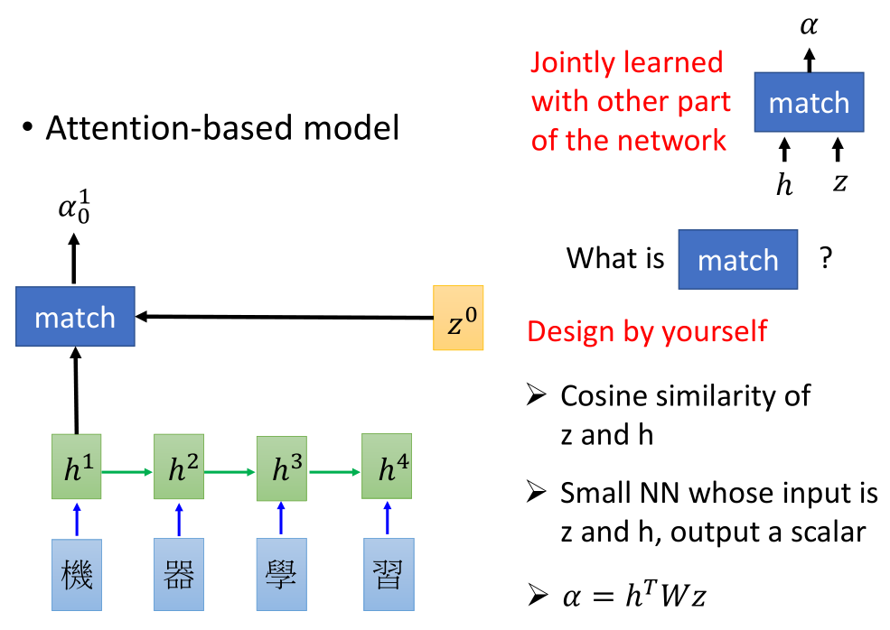

对每个输入都做match后，分别得到各自的$α$，然后softmax得到$\hat α$，$c^0$为加权的句子表示

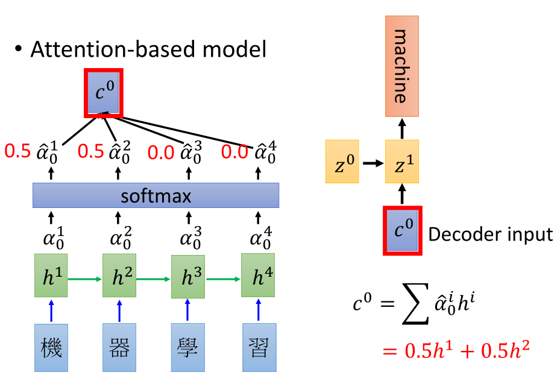

$z_1$可以是$c^0$丢到RNN以后，hidden layer的output，也可以是其他。$z_1$再去算一次match的分数

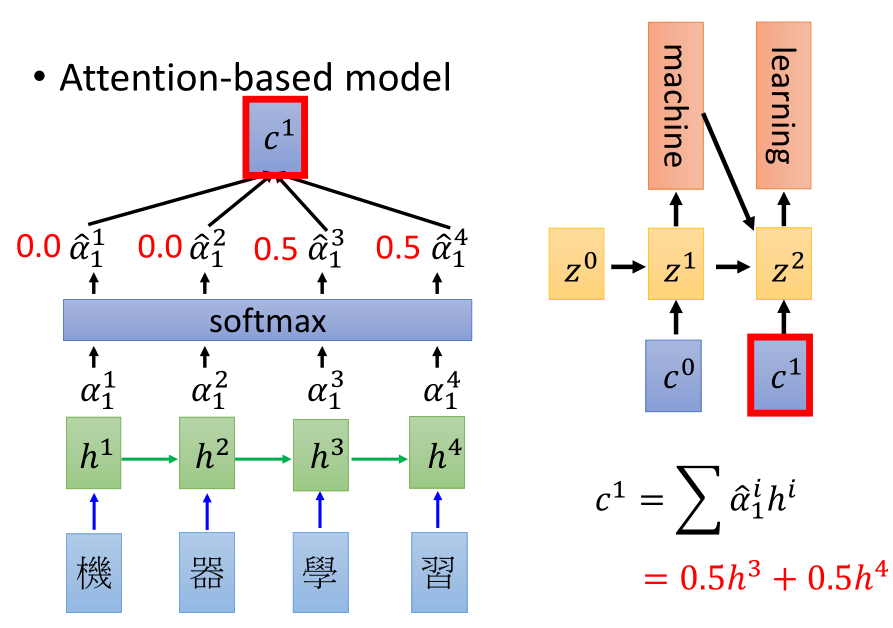

得到的$c^1$就是下一个decoder的input，此时只关注“学”，“习”。

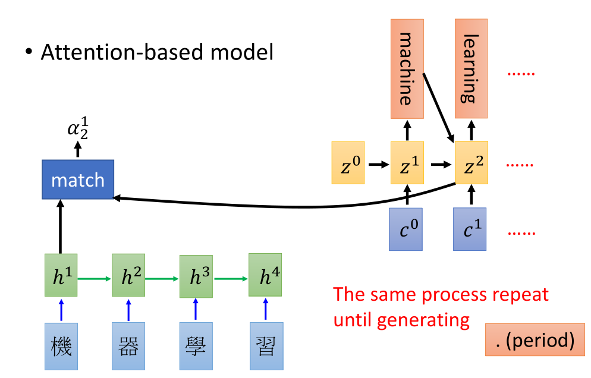

得到的$z_2$再去match得到$c^2$，直到生成句号。

##### Speech Recognition

input声音讯号，output是文字，甚至可以产生空格，但是seq2seq的方法效果目前还不如传统做法，完全不需要human knowledge是它的优点。

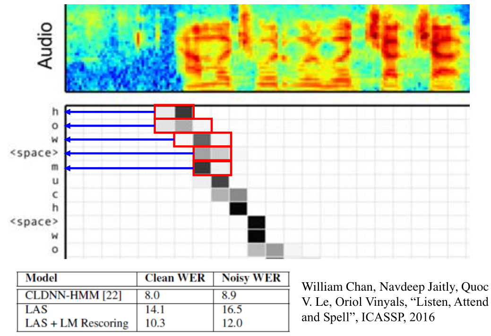

##### Image Caption Generation

用一组vector描述image，比如用CNN filter的输出

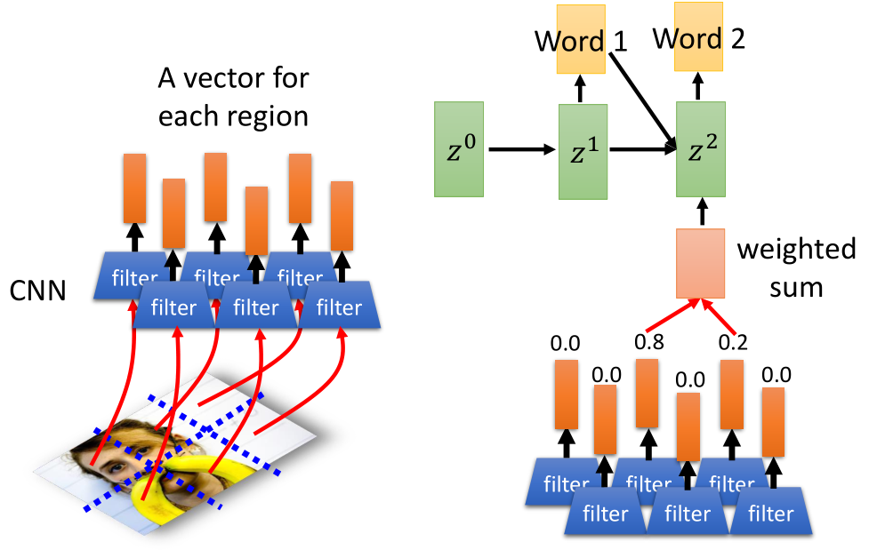

产生划线词语时，attention的位置如图光亮处

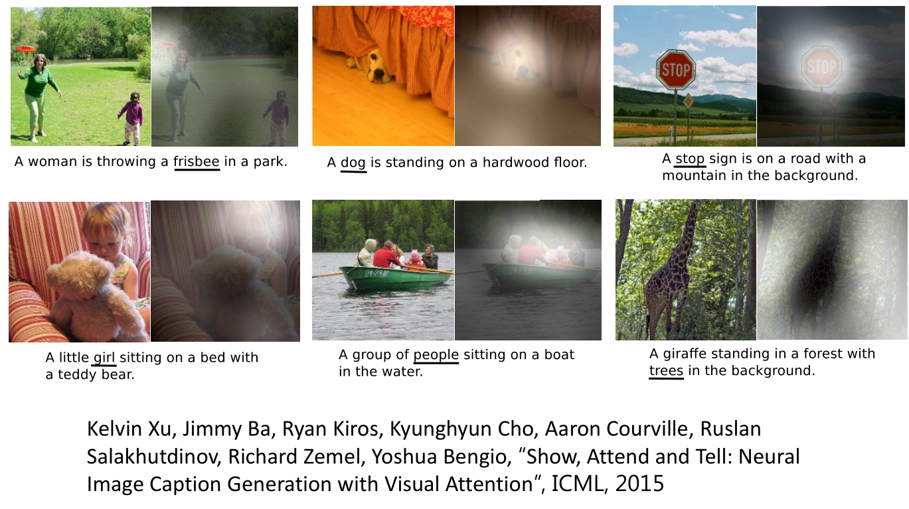

当然也有不好的例子，但是从attention里面可以了解到它为什么会犯这些错误

从一段影像中也可以进行文字生成

#### Memory Network

Memory Network是在memory上面做attention，Memory Network最开始也是最常见的应用是在阅读理解上面，如下图所示：文章里面有很多句子组成，每个句子表示成一个vector，假设有N个句子，向量表示成$x^1,x^2……x^N$，问题也用一个向量描述出来，接下来算问题与句子的匹配分数$\alpha$，做加权和，然后丢进DNN里面，就可以得到答案了。

Memory Network有一个更复杂的版本，这个版本是这样的，算match的部分跟抽取information的部分不见得是一样的，如果他们是不一样的，其实你可以得到更好的performance。把文档中的同一句子用两组向量表示；Query对x这一组vector算Attention，但是它是用h这一组向量来表示information，把这些Attention乘以h的加和得到提取的信息，放入DNN，得到答案。

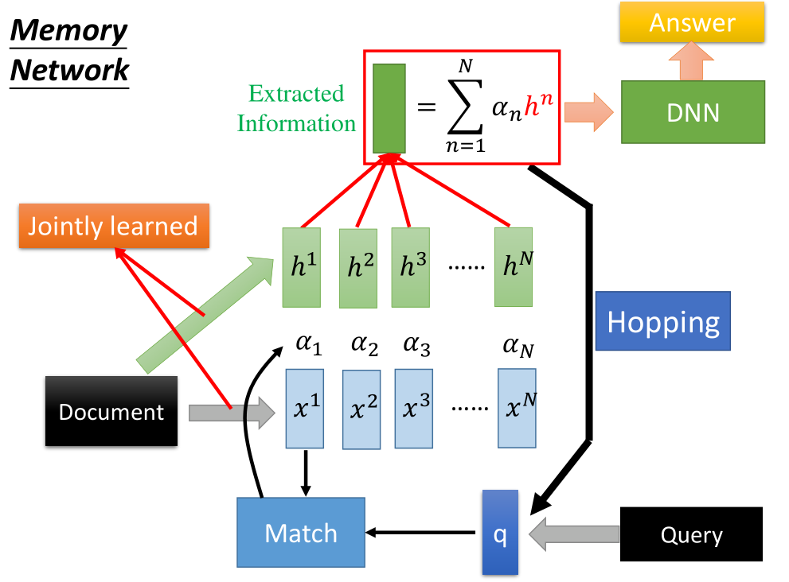

通过Hopping可以反复进行运算，会把计算出的 extracted information 和 query 加在一起，重新计算 match score，然后又再算出一次 extracted information，就像反复思考一样。

如下图所示，我们用蓝色的vector计算attention，用橙色的vector做提取information。蓝色和蓝色，橙色和橙色的vector不一定是一样的。以下是两次加和后丢进去DNN得到答案。所以整件事情也可以看作两个layer的神经网络。

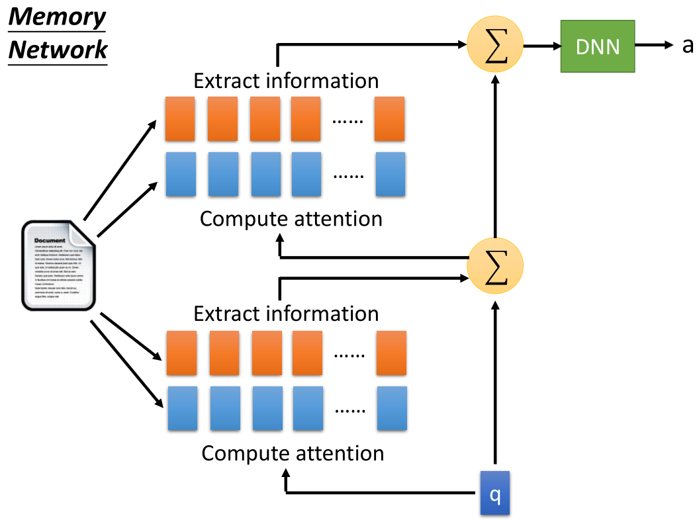

#### Neural Turing Machine

刚刚的 memory network 是在 memory 里面做 attention，并从 memory 中取出 information。而 Neural Turing Machine 还可以根据 match score 去修改 memory 中的内容。

$m^i_0$ 初始 memory sequence 的第 i 个 vector

$α^i_0$ 第 i 个 vector 初始的 attention weight

$r^0$ 初始的 extracted information

$f$ 可以是 DNN\LSTM\GRU... ，会 output 三个vector $k,e,a$

用 $k,m$一起计算出 match score 得到 $α^i_1$，然后 softmax，得到新的 attention $\hat α^i_1$ ，计算 match score 的流程如下图

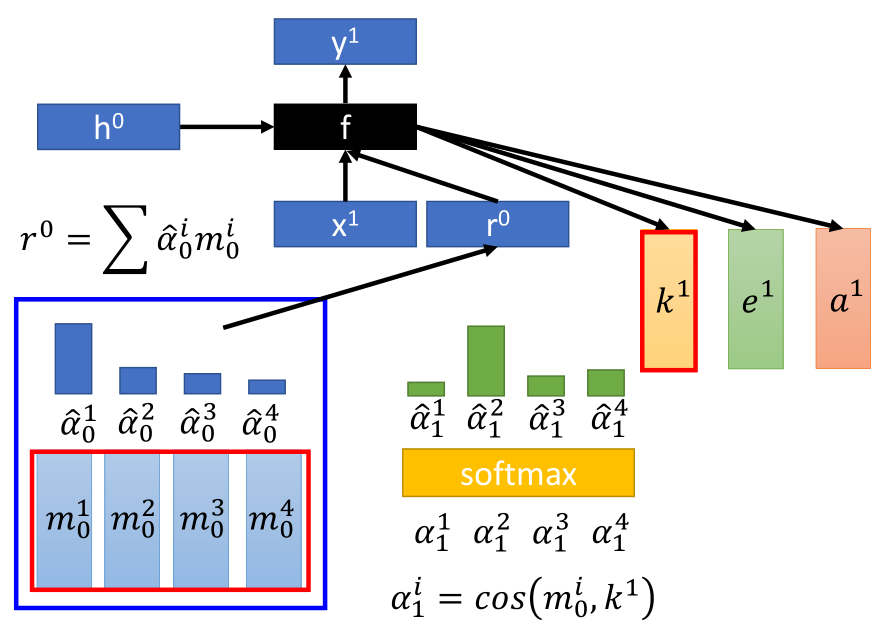

$e, a$的作用分别是把之前的 memory 清空(erase)，以及 写入新的 memory

$e$ 的每个 dimension 的 output 都介于 0~1 之间

$m^i_1$就是新的 memory，更新后再计算match score，更新 attention weight，计算$r^1$，用于下一时刻模型输入

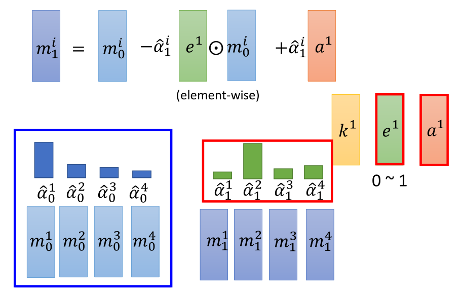

### Tips for Generation

#### Attention

我们今天要做video的generation，我们给machine看一段如下的视频，如果你今天用的是Attention-based model的话，那么machine在每一个时间点会给video里面的每一帧(每一张image)一个attention，那我们用$\alpha _t^i$来代表attention，上标i代表是第i个component，下标t代表是时间点。那么下标是1的四个$\alpha$会得到$w_1$,下标是2的四个$\alpha$会得到$w_2$,下标是3的四个$\alpha$会得到$w_3$,下标是4的四个$\alpha$会得到$w_4$。

可能会有Bad Attention，如图所示，在得到第二个词的时候，attention(柱子最高的地方)主要在woman那儿，得到第四个词的时候，attention主要也在woman那儿，这样得到的不是一个好句子。

一个好的attention应该cover input所有的帧，而且每一帧的cover最好不要太多。最好的是：每一个input 组件有大概相同attention 权重。举一个最简单的例子，在本例中，希望在处理过程中所有attention的加和接近于一个值：$\tau$ ，这里的$\tau$是类似于learning rate的一个参数。用这个正则化的目的是可以调整比较小的attention，使得整个的performance达到最好。

不要让attention过度关注于一个field，可以设置一个regularization term，使attention可以关注到其它的field。相当于加大其它component的权重 。

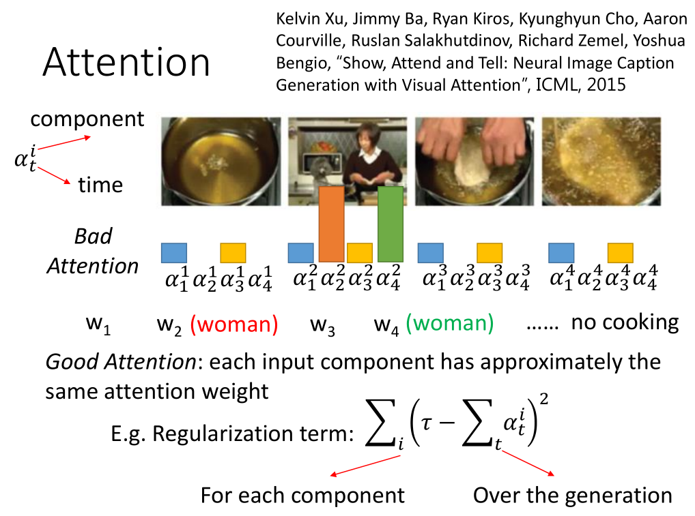

#### Mismatch between Train and Test

我们做的是 把condition和begin of sentence 丢进去，然后output一个distribution，颜色越深表示产生的机率越大，再把产生的output 作为下一个的input。

这里有一个注意的是，在training的时候，RNN 每个 step 的 input 都是正确答案 (reference)，然而 testing 时，RNN 每个 step 的 input 是它上个 step 的 output (from model)，可能输出与正确不同，这称为 Exposure Bias。

曝光误差简单来讲是因为文本生成在训练和推断时的不一致造成的。不一致体现在推断和训练时使用的输入不同，在训练时每一个词输入都来自真实样本，但是在推断时当前输入用的却是上一个词的输出。

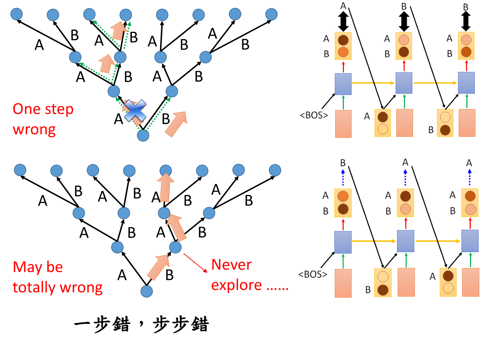

#####  Modifying Training Process?

如果把 training 的 process 改成：把上个 step 的 output 当成下个 step 的 input，听起来似乎很合理，不过实际上不太容易 train 起来。比如下图：在training的时候，与reference不同，假设你的gradient告诉你要使A上升，第二个输出时使B上升，如果让A的值上升，它的output就会改变，即第二个时间点的input就会不一样，那它之前学的让B上升就没有意义了，可能反而会得到奇怪的结果。

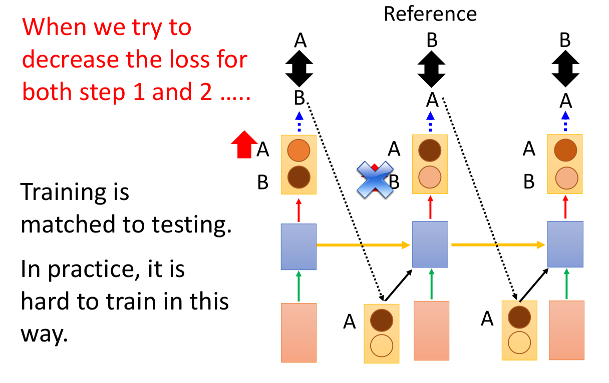

##### Scheduled Sampling

Scheduled Sampling通过修改我们的训练过程来解决上面的问题，一开始我们只用真实的句子序列进行训练，而随着训练过程的进行，我们开始慢慢加入模型的输出作为训练的输入这一过程。

我们纠结的点就是到底下一个时间点的input到底是从模型的output来呢，还是从reference来呢？这个Scheduled Sampling方法就说给他一个概率，概率决定以哪个作为input

一开始我们只用真实的句子序列（reference）进行训练，而随着训练过程的进行，我们开始慢慢加入模型的输出作为input这一过程。如果这样train的话，就可能得到更好的效果。

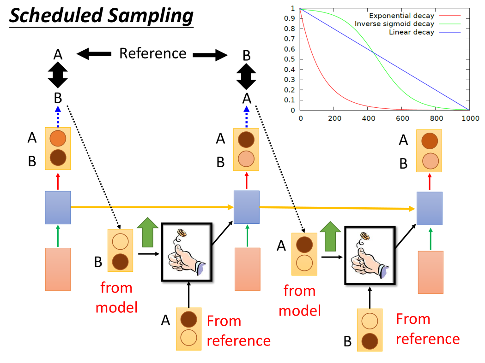

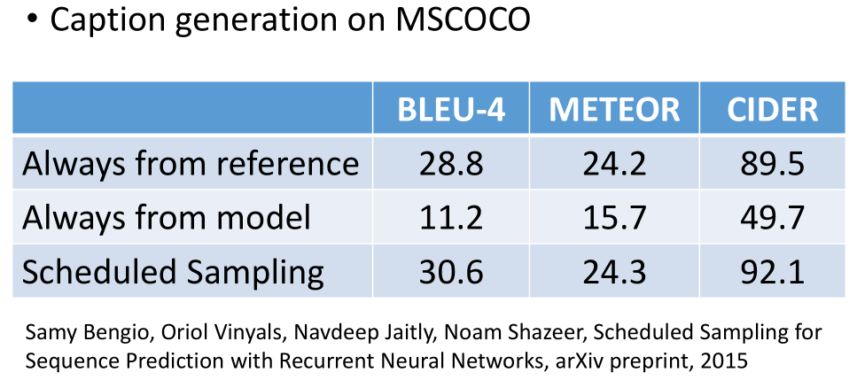

#### Beam Search

Beam Search是一个介于greedy search和暴力搜索之间的方法。第一个时间点都看，然后保留分数最高的k个，一直保留k个。

贪心搜索：直接选择每个输出的最大概率；暴力搜索：枚举当前所有出现的情况，从而得到需要的情况。

The green path has higher score.

Not possible to check all the paths

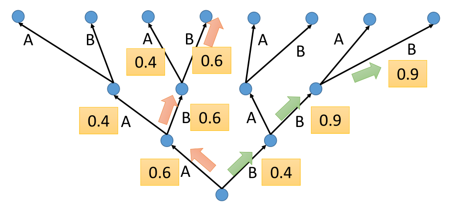

Keep several best path at each step

Beam Search方法是指在某个时间只pick几个分数最高的路径；选择一个beam size，即选择size个路径最佳。在搜索的时候，设置Beam size = 2，就是每一次保留分数最高的两条路径，走到最后的时候，哪一条分数最高，就输出哪一条。如下图所示：一开始，可以选择A和B两条路径，左边的第一个A点有两条路径，右边第一个B点有两条路径，此时一共有四条路径，选出分数最高的两条，再依次往下走 。

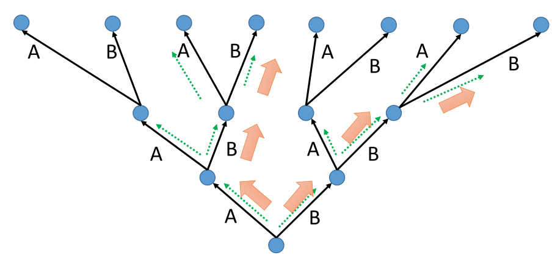

下一张图是如果使用beam search的时候，应该是怎么样的；

假设世界上只有三个词XYW和一个代表句尾的符号s，我们选择size=3，每一步都选最佳的三条路径。

输出分数最高的三个X,Y,W，再分别将三个丢进去，这样就得到三组不同的distribution（一共4*3条路径），选出分数最高的三条放入......

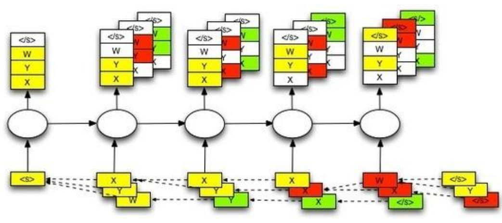

#### Better Idea?

之前 Scheduled Sampling 要解决的 problem 为何不直接把 RNN 每个 step 的 output distribution 当作下一个 step 的 input 就好了呢? 有很多好处

- training 的时候可以直接 BP 到上一个 step

- testing 的时候可以不用考虑多个 path，不用做 beam search ，直接 output distribution

老师直觉这个做法会变糟，原因如下：

如下图所示，对于左边，高兴和难过的机率几乎是一样的，所以我们现在选择高兴丢进去，后面接想笑的机率会很大；而对于右边，高兴和难过的机率几乎是一样的，想笑和想哭的机率几乎是一样的，那么就可能出现高兴想哭和难过想笑这样的输出，产生句子杂糅。

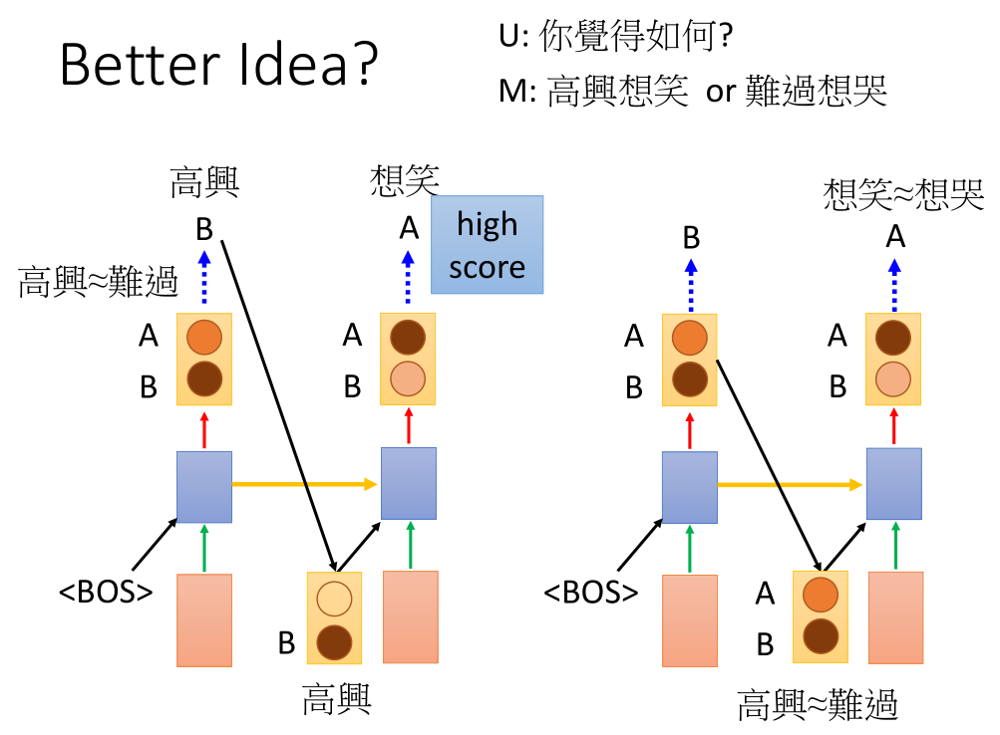

#### Object level v.s. Component level

我们现在要生成的是整个句子，而不是单一的词语，所以我们在考量生成的结果好不好的时候，我们应该看一整个句子，而不是看单一的词汇。

举例来说，The dog is is fast，loss很小，但是效果并不好。用object level criterion可以根据整个句子的好坏进行评价。

但是使用这样的object level criterion是没办法做 gradient descent 的，因为$R(y,\hat y)$看的是 RNN 的 hard output，即使生成 word 的机率有改变，只要最终 output 的 y 一样，那$R(y,\hat y)$就不会变，也就是 gradient 仍然会是 0，无法更新。而cross entropy在调整参数的时候，是会变的，所以可以做GD

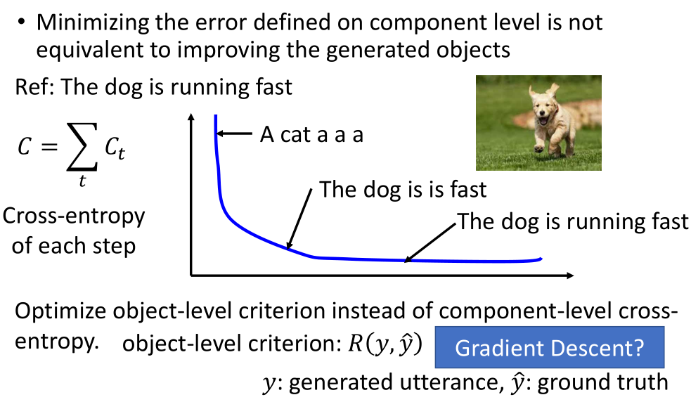

#### Reinforcement learning?

RL 的 reward，基本只有最后才会拿到，可以用这招来 maximize 我们的 object level criterion

前面的r都是0，只有最后一个参数通过调整得到一个reward。

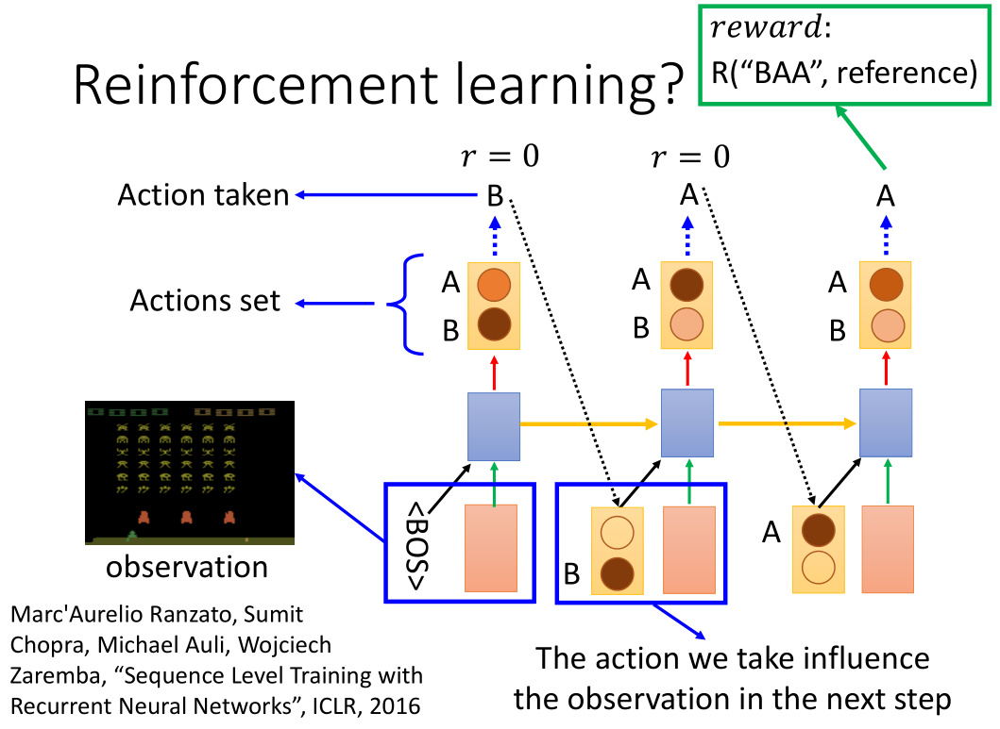

#### Pointer Network

Pointer Network最早是用来解决演算法(电脑算数学的学问)的问题。

举个例子：如下图所示，给出十个点，让你连接几个点能把所有的点都包含在区域内。拿一个NN出来，它的input就是10个坐标，我们期待它的输出是427653，就可以把十个点圈起来。那就要准备一大堆的训练数据；这个 Neural Network 的输入是所有点的坐标，输出是构成凸包的点的合集。

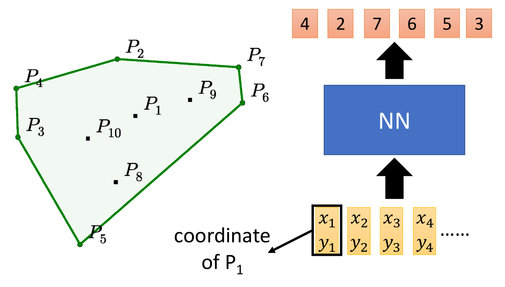

如何求解Pointer Network？

输入一排sequence，输出另一个sequence，理论上好像是可以用Seq2Seq解决的。那么这个 Network 可以用 seq2seq 的模式么？

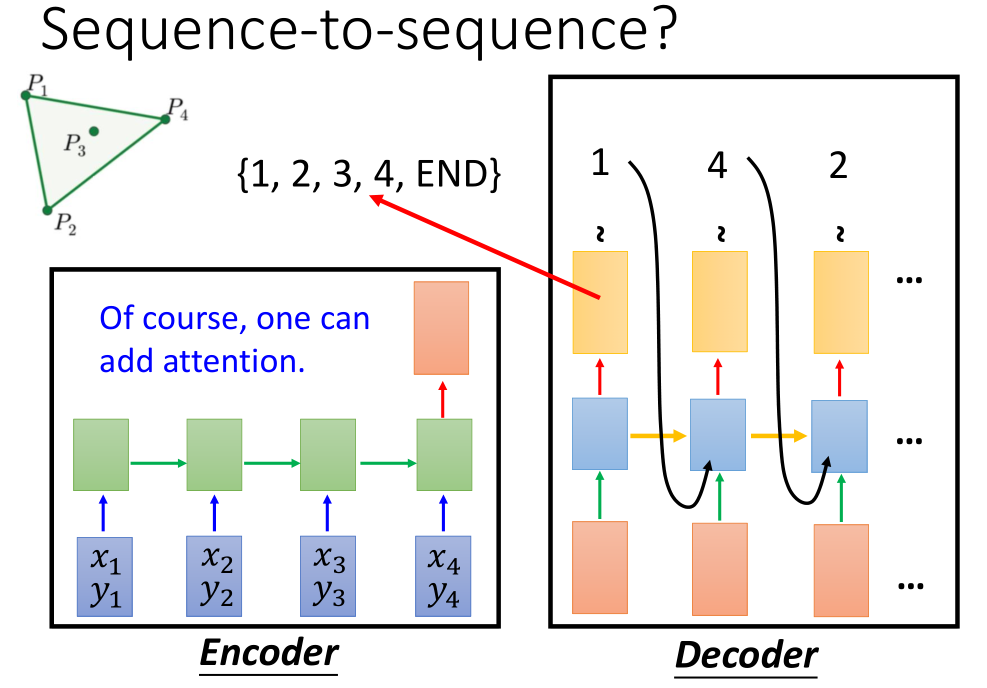

答案是不行的，因为，我们并不知道输出的数据的多少。更具体地说，就是在 encoder 阶段，我们只知道这个凸包问题的输入，但是在 decoder 阶段，我们不知道我们一共可以输出多少个值。

举例来说，第一次我们的输入是 50 个点，我们的输出可以是 0-50 (0 表示 END)；第二次我们的输入是 100 个点，我们的输出依然是 0-50, 这样的话，我们就没办法输出 51-100 的点了。

为了解决这个问题，我们可以引入 Attention 机制，让network可以动态决定输出有多大。

现在用Attention模型把这个sequence读取进来，第1-4个点$h^1,h^2,h^3,h^4,$在这边我们要加一个特殊的点$h^0=\{x_0,y_0\}$，代表END的点。

接下来，我们就采用我们之前讲过的attention-based model，初始化一个key，即为$z^0$，然后用这个key去做attention，用$z^0$对每一input做attention，每一个input都产生有一个Attention Weight。

举例来说，在$(x^1,y^1)$这边attention的weight是0.5，在$(x^2,y^2)$这边attention的weight是0.3，在$(x^3,y^3)$这边attention的weight是0.2，在$(x^4,y^4)$这边attention的weight是0，在$(x^0,y^0)$这边attention的weight是0.0。

这个attention weight就是我们输出的distribution，我们根据这个weight的分布取argmax，在这里，我取到$(x^1,y^1)$，output 1，然后得到下一个key，即$z^1$；同理，算权重，取argmax，得到下一个key,即$z^2$，循环以上。

这样output set会跟随input变化

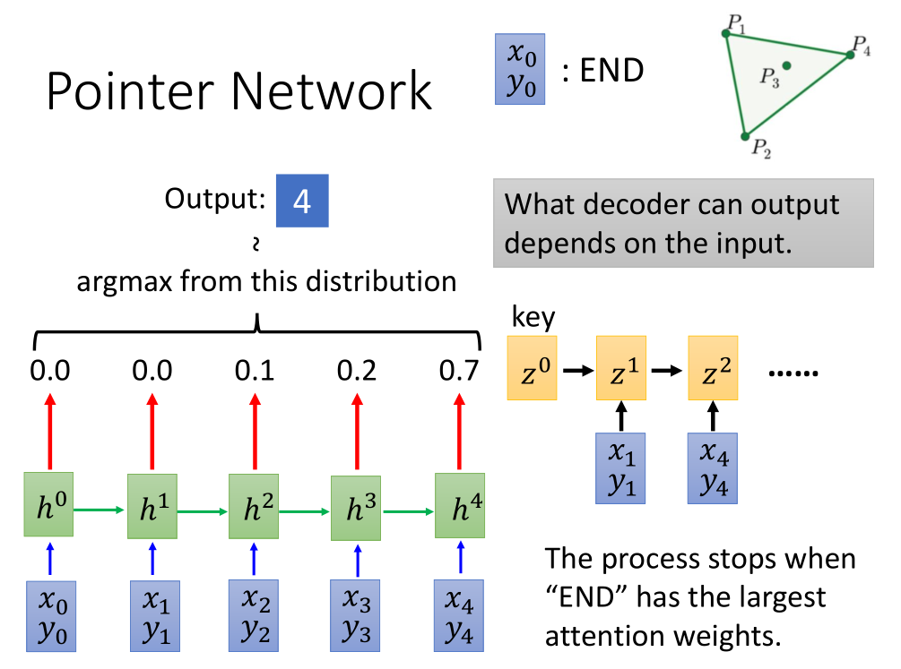

##### Applications

传统的seq2seq模型是无法解决输出序列的词汇表会随着输入序列长度的改变而改变的问题的，如寻找凸包等。因为对于这类问题，输出往往是输入集合的子集（输出严重依赖输入）。基于这种特点，考虑能不能找到一种结构类似编程语言中的指针，每个指针对应输入序列的一个元素，从而我们可以直接操作输入序列而不需要特意设定输出词汇表。

###### Summarization

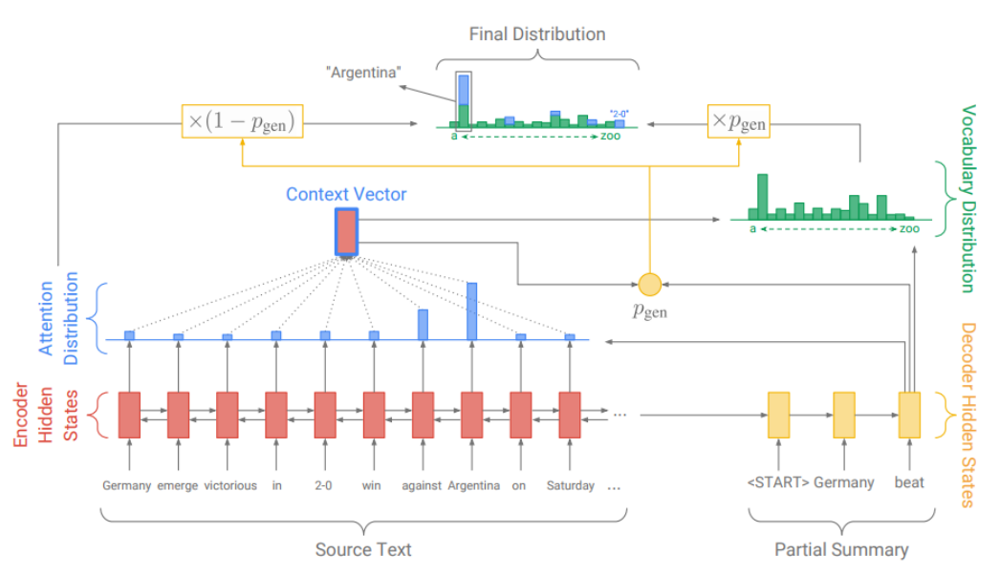

###### Machine Translation \ Chat-bot

### Recursive Structure

RNN是Recursive Network的subset

#### Application: Sentiment Analysis

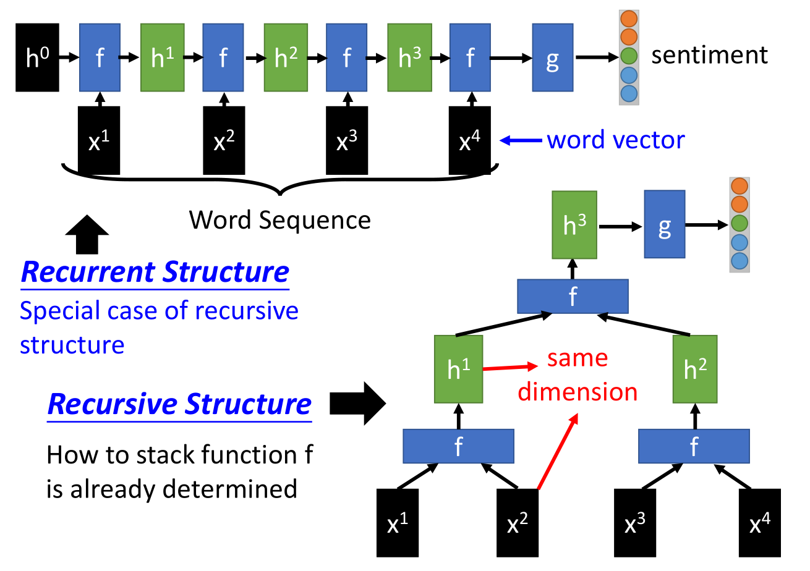

从RNN来看情绪分析的案例，将Word Sequence输入NN，经过相同的function-f最后经过function-g得到结果。

如果是Recursive Network的话，必需先决定这4个input word的structure，上图中，我们$x_1,x_2$关联得到$h_1$，$x_3,x_4$关联得到$h_2$

$x,h$的维度必需要相同(因为用的是同一个f)。

##### Recursive Model

输入和输出vector维度一致

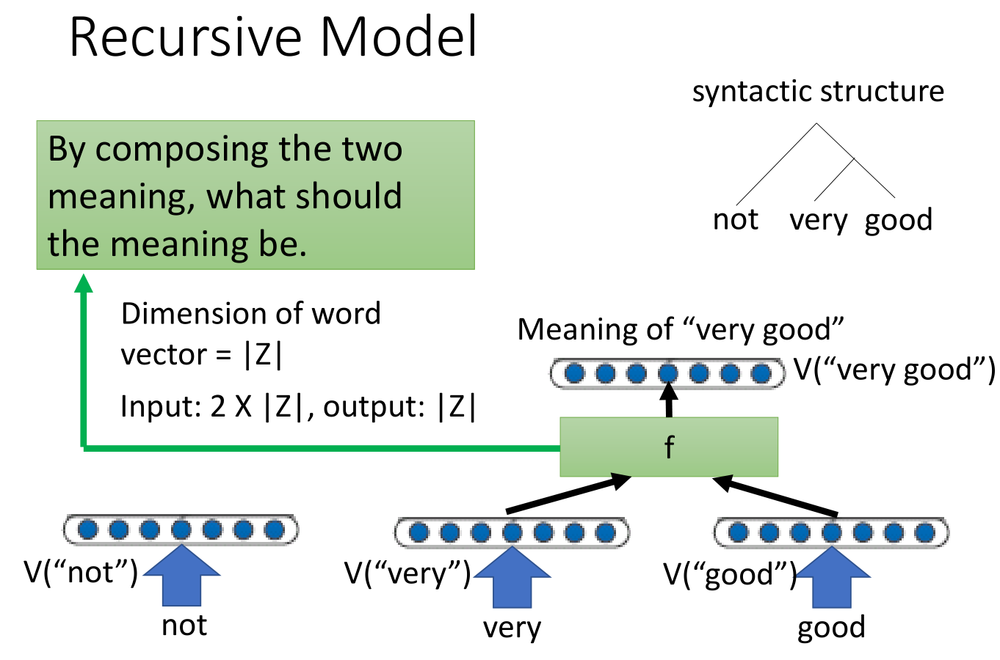

中间的f是一个复杂的neural network，而不是两个单词vector的简单相加。$V(w_A\  w_B) ≠ V(w_A) + V(w_B)$

“good”: positive，“not”: neutral，“not good”: negative

“棒”: positive，“好棒”: positive，“好棒棒”: negative

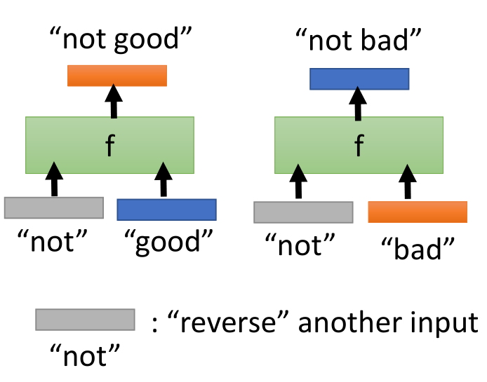

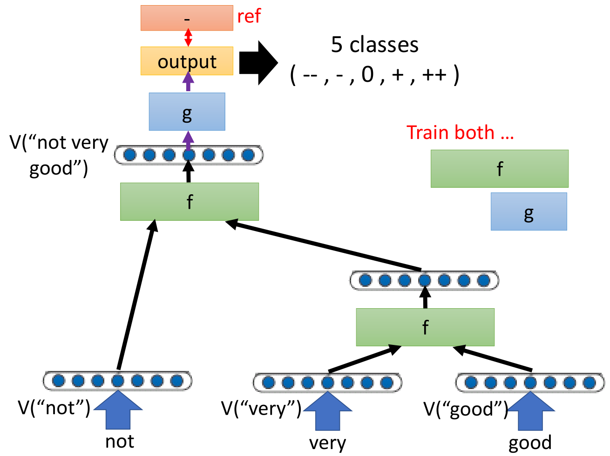

function-f可以很简单，单纯的让a,b两个向量相加之后乘上权重W，但这么做可能无法满足我们上说明的需求期望，或者很难达到理想的效果。

当然也可以自己设计，比如：我们要让a,b两个向量是有相乘的关联，因此调整为下所示，两个向量堆叠之后转置$X^T$乘上权重$W$再乘上$X$，它的计算逻辑就是将两个元素相乘$x_ix_j$之后再乘上相对应的权重索引元素值$W_{ij}$ 做sum ，这么计算之后得到的是一个数值，而后面所得项目是一个2x1矩阵，无法相加，因此需要重复一次，要注意两个W颜色不同代表的是不同的权重值。

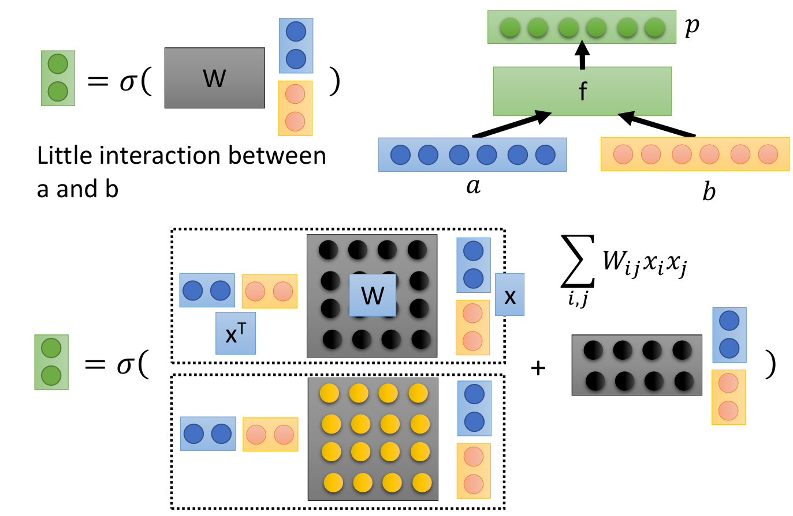

#### Matrix-Vector Recursive Network

它的word vector有两个部分：一个是包含自身信息的vector，另一个是包含影响其他词关系的matrix。

经过如图所示计算，得到输出：两个绿色的点的matrix代表not good本身的意思，四个绿色的点是要影响别人的matrix，再把它们拉平拼接起来得到output。

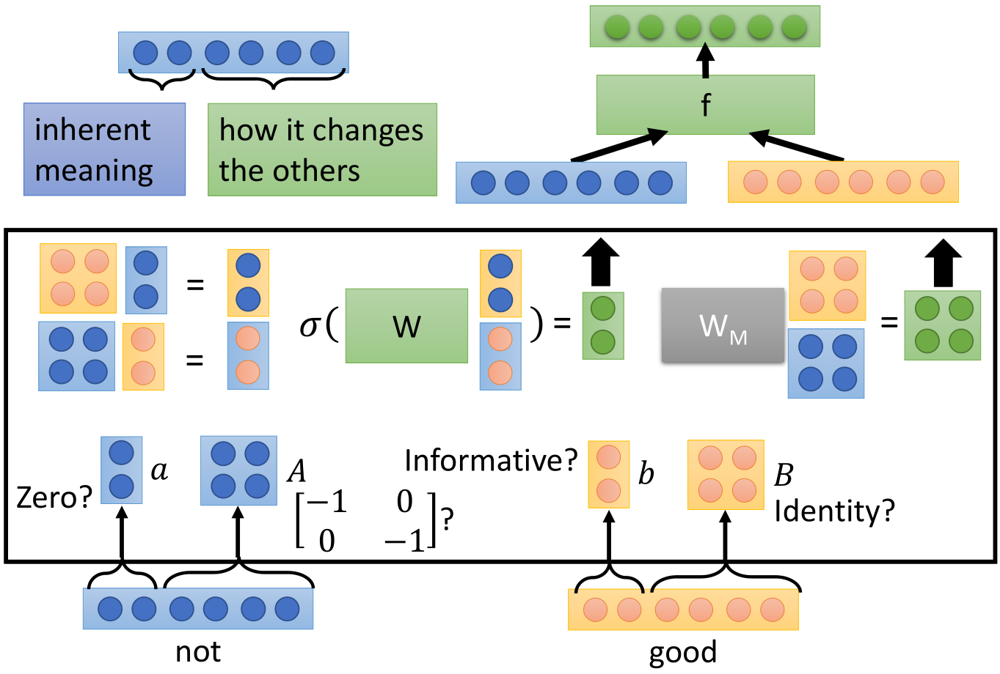

#### Tree LSTM

Typical LSTM：h和m的输入对应相应的输出，但是h的输入输出差别很大，m的差别不大

Tree LSTM：就是把f换成LSTM

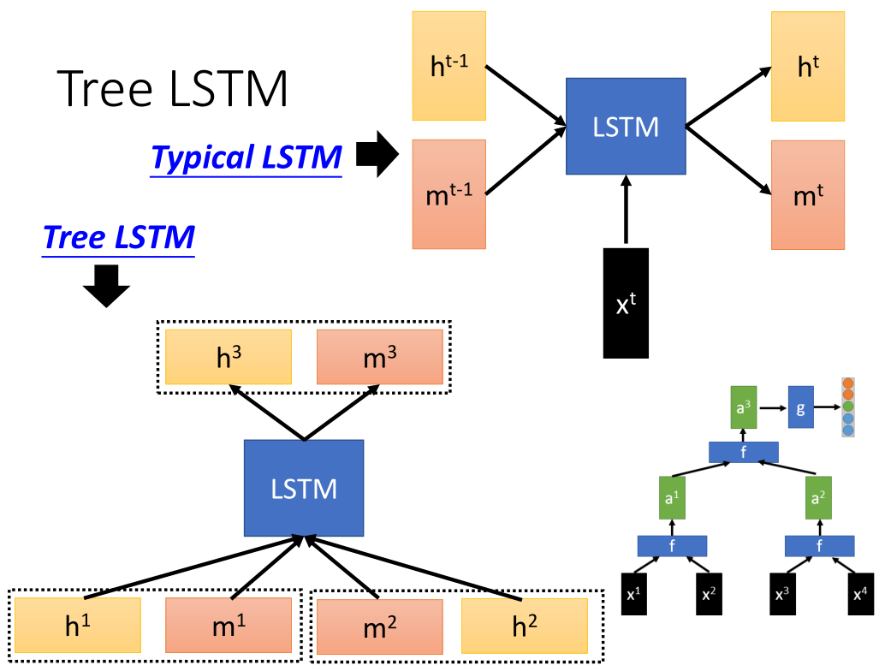

#### More Applications

如果处理的是sequence，它背后的结构你是知道的，就可以使用Recursive Network，若结构越make sence（比如数学式），相比RNN效果越好

侦测两个句子是不是同一个意思，把两个句子分别得到embedding，然后再丢到f，把output输入到NN里面来预测

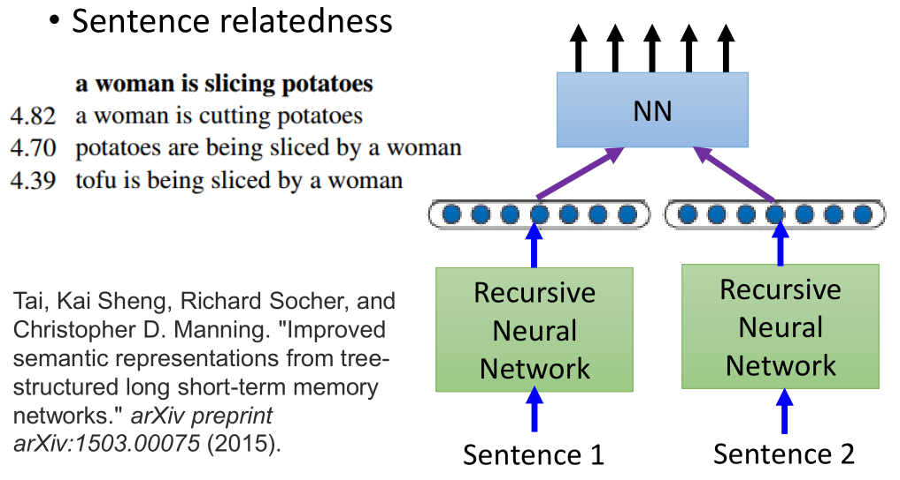

### Transformer

Seq2seq model with “Self-attention”

处理Seq2seq问题时一般会首先想到RNN，但是RNN的问题在于无论使用单向还是双向RNN都无法并行运算，输出一个值必须等待其依赖的其他部分计算完成。

为了解决并行计算的问题，可以尝试使用CNN来处理。如下图，使用CNN时其同一个卷积层的卷积核的运算是可以并行执行的，但是浅层的卷积核只能获取部分数据作为输入，只有深层的卷积层的卷积核才有可能会覆盖到比较广的范围的数据，因此CNN的局限性在于无法使用一层来输出考虑了所有数据的输出值。

#### Self-Attention

self-attention可以取代原来RNN做的事情。输入是一个sequence，输出是另一个sequence。

它和双向RNN相同，每个输出也看过整个输入sequence，特别的地方是，输出是同时计算的。

You can try to replace any thing that has been done by RNN with self-attention.

##### 步骤

首先input是$x^1$到$x^4$，是一个sequence。

每个input先通过一个embedding $a^i=Wx^i$变成$a^1$到$a^4$ ，然后丢进self-attention layer。

self-attention layer里面，每一个input分别乘上三个不同的transformation（matrix)，产生三个不同的向量。这个三个不同的向量分别命名为q、k、v。

- q 代表query，to match others，把每个input $a^i$都乘上某个matrix $W^q$，得到$q^i$ ($q^1$到$q^4$)
- k 代表key，to be matched，每个input $a^i$都乘上某个matrix $W^k$，得到$k^i$ ($k^1$到$k^4$)
- v 代表information，information to be extracted，每个input $a^i$都乘上某个matrix $W^v$，得到$v^i$ ($v^1$到$v^4$)

现在每个时刻，每个$a^i$都有q、k、v三个不同的向量。

接下来要做的事情是拿每一个q对每个k做attention。attention是吃两个向量，output一个分数，告诉你这两个向量有多匹配，至于怎么吃这两个向量，则有各种各样的方法，这里我们采用Scaled Dot-Product Attention，$q^1$和$k^i$做点积，然后除以$\sqrt d$。

- 把$q^1$拿出来，对$k^i$做attention得到一个分数$α_{1,i}$

d是q跟k的维度，因为q要跟k做点积，所以维度是一样的。因为dim越大，点积结果越大，因此除以一个$\sqrt d$来平衡。

- 接下来$α_{1,i}$通过一个softmax layer 得到$\hat α_{1,i}$

- 然后拿 $\hat α_{1,i}$分别和每一个$v^i$相乘。即$\hat α_{1,1}$乘上$v^1$，$\hat α_{1,2}$乘上$v^2$，....，最后相加起来。等于$v^1$到$v^4$拿$\hat α_{1,i}$做加权求和，得到$b^1$。

现在就得到了sequence的第一个向量$b^1$ 。在产生$b^1$的时候，用了整个sequence的信息，看到了$a^1$到$a^4$的信息。如果你不想考虑整个句子的信息，只想考虑局部信息，只要让$\hat α_{1,i}$的值为0，意味着不会考虑$a^i$的信息。如果想考虑某个$a^i$的信息，只要让对应的$\hat α_{1,i}$有值即可。所以对self-attention来说，只要它想看，就能用attention看到，只要自己学习就行。

在同一时间，就可以用同样的方式，把$b^2,b^3,b^4$也算出来。

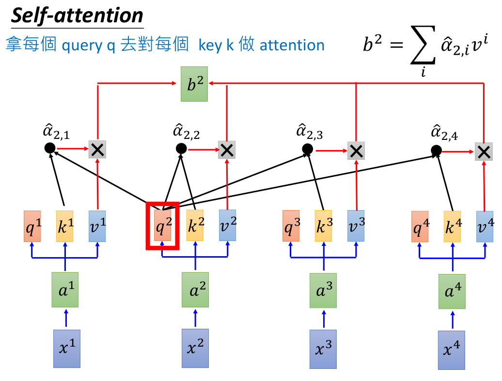

##### 矩阵运算

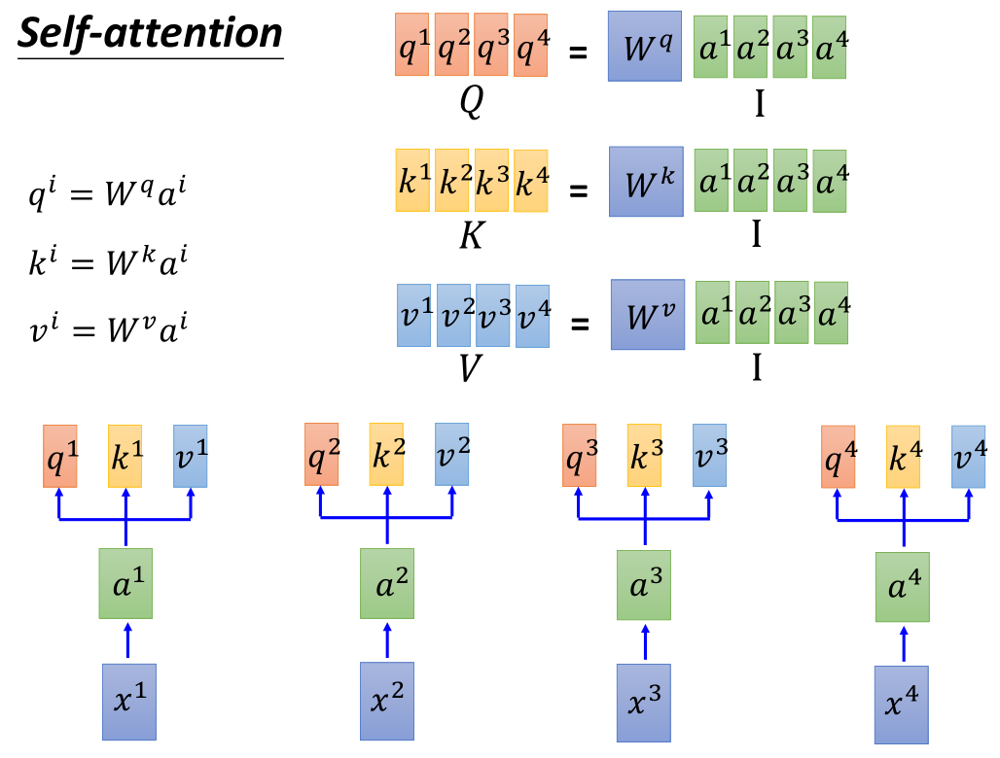

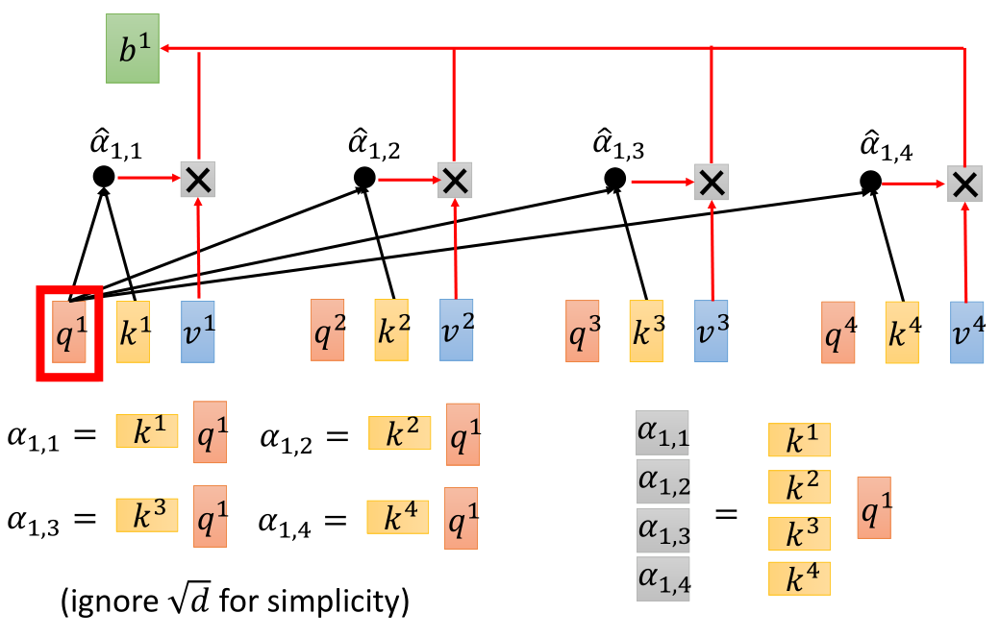

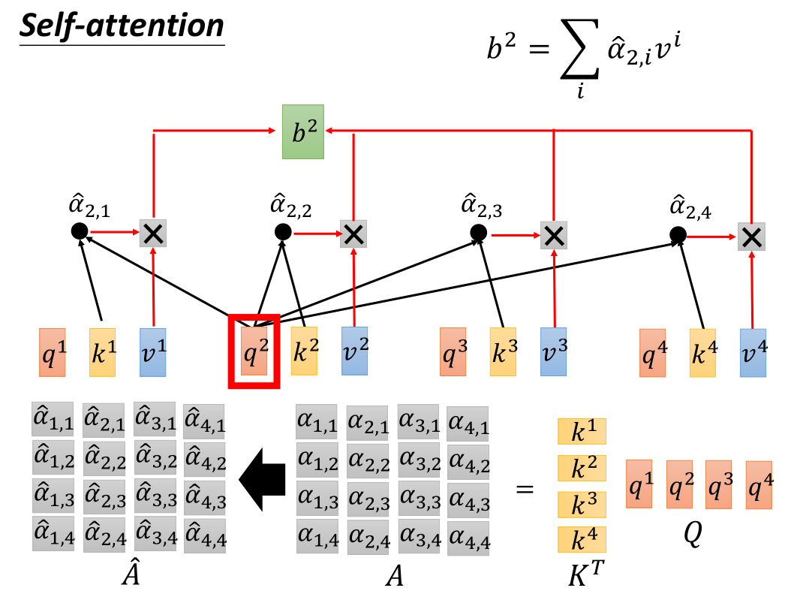

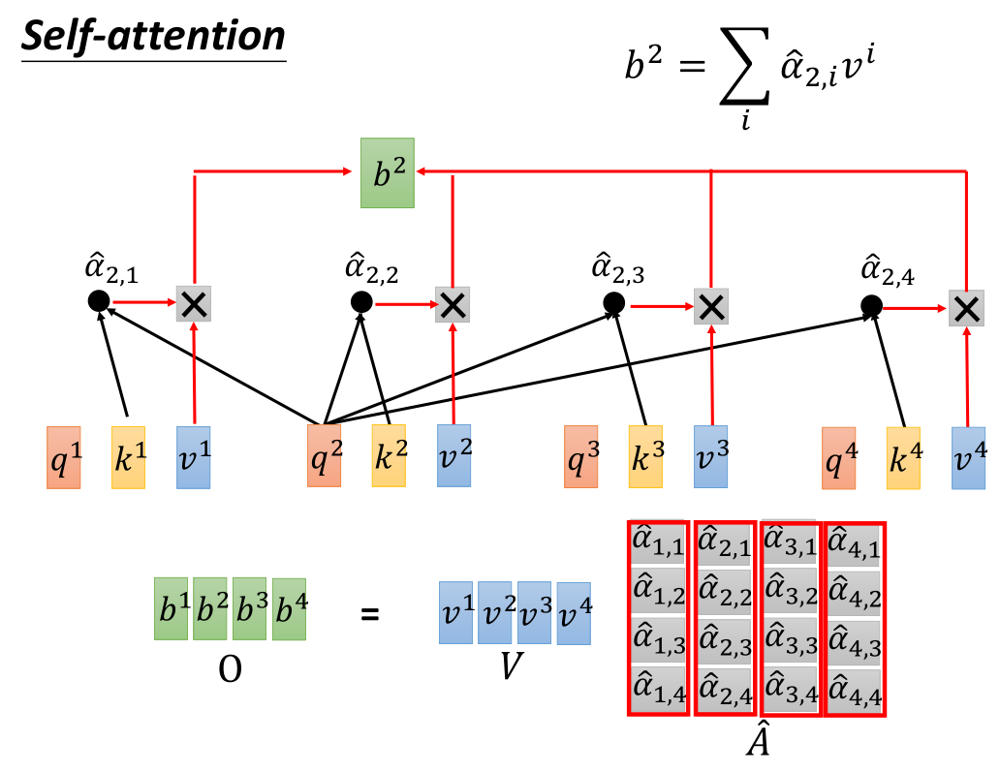

反正就是一堆矩阵乘法，用 GPU 可以加速

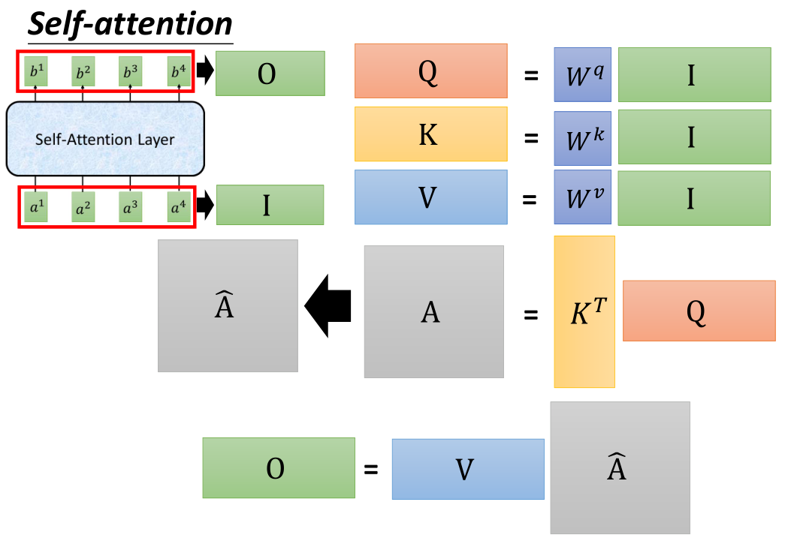

##### Multi-head Self-attention

(2 heads as example)

在2个head的情况下，你会进一步把$q^i$分裂，变成$q^{i,1}、q^{i,2}$，做法是$q^i$可以乘上两个矩阵$W^{q,1}、W^{q,2}$。

$k^i、v^i$也一样，产生$k^{i,1}、k^{i,2}$和$v^{i,1}、v^{i,2}$。

但是现在$q^{i,1}$只会对$k^{i,1}、k^{j,1}$(同样是第一个向量)做attention，然后计算出$b^{i,1}$

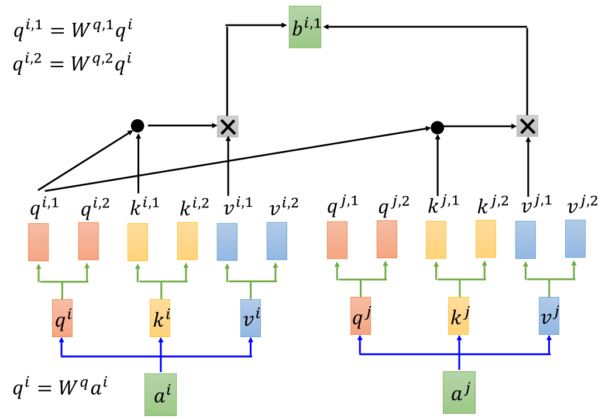

$q^{i,2}$只会对$k^{i,2}、k^{j,2}$做attention，然后得到$b^{i,2}$。

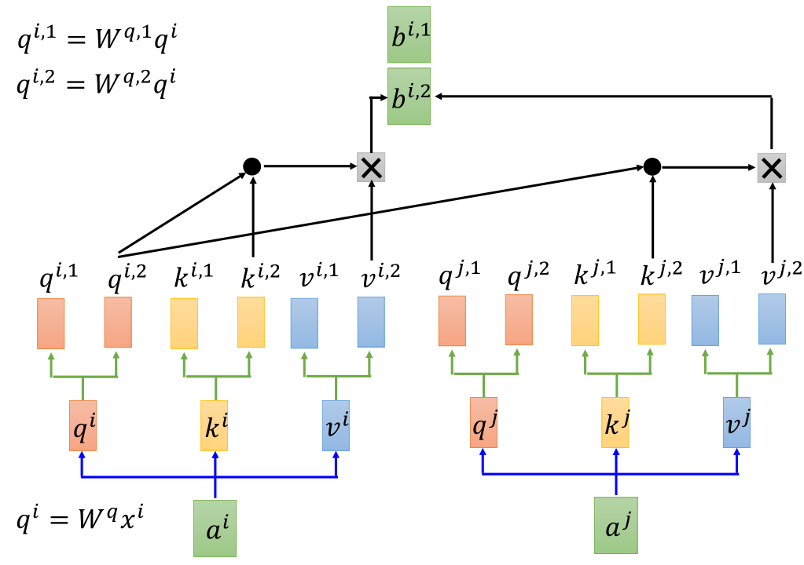

然后把$b^{i,1}、b^{i,2}$接在一起，如果你还想对维度做调整，那么再乘上一个矩阵$W^O$做降维就可以了。

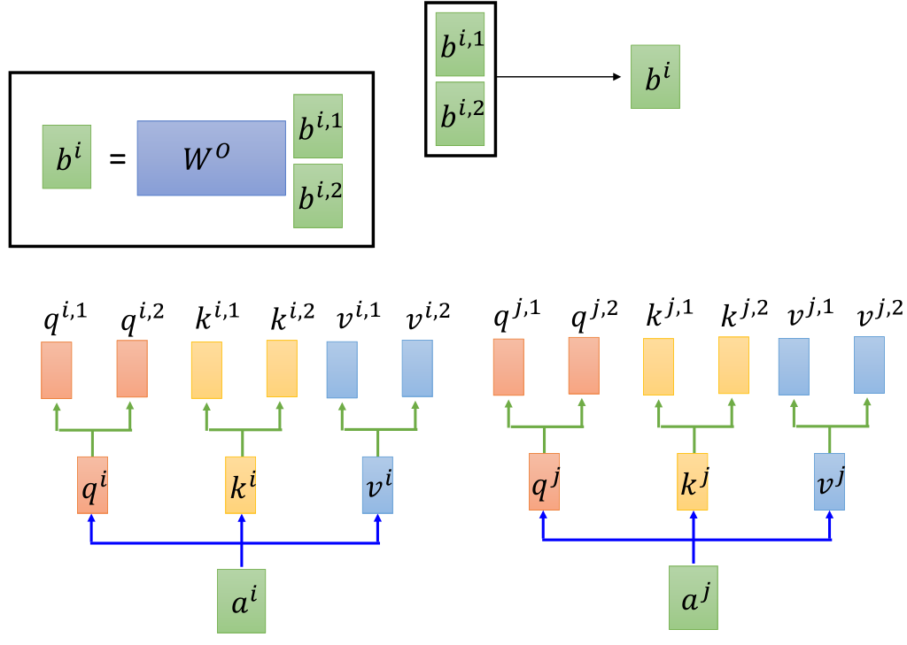

有可能不同的head关注的点不一样，比如有的head想看的是local（短期）的信息，有的head想看的是global（长期）的信息。有了Multi-head之后，每个head可以各司其职，自己做自己想做的事情。

当然head的数目是可以自己调的，比如8个head，10个head等等都可以。

##### Positional Encoding

No position information in self-attention.

但是这个显然不是我们想要的，我们希望把input sequence的顺序考虑进self-attention layer里去。

在原始的paper中说，在把$x^i$变成$a^i$后，还要加上一个$e^i$(要跟$a^i$的维度相同)，$e^i$是人工设定的，不是学出来的，代表了位置的信息，所以每个位置都有一个不同的$e^i$。比如第一个位置为$e^1$，第二个位置为$e^2$......。

把$e^i$加到$a^i$后，接下来的步骤就跟之前的一样。

通常这里会想，为什么$e^i$跟$a^i$是相加，而不是拼接，相加不是把位置信息混到$a^i$里去了吗

我们可以想象，给$x^i$再添加一个one-hot向量$p^i$（代表了位置信息），$p^i$是一个很长的向量，位置i为1，其他为0。

$x^i,p^i$拼接后乘上一个矩阵W，你可以想像为等于把W拆成两个矩阵$W^I、W^P$，之后$W^I$跟$x^i$相乘+$W^P$跟$p^i$相乘。而$W^I$跟$x^i$相乘部分就是$a^i，W^P$跟$p^i$相乘部分是$e^i$ ，那么就是$a^i+e^i$，所以相加也是说得通的。
$$
W\begin{pmatrix} x^{i}\\ p^{i} \end{pmatrix}=\begin{pmatrix} W^{I} & W^{P} \end{pmatrix}\begin{pmatrix} x^{i}\\ p^{i} \end{pmatrix}=\underset{a^{i}}{\underbrace{W^{I}x^{i}}}+\underset{e^{i}}{\underbrace{W^{P}p^{i}}}
$$
$W^P$是可以学习的，但是有人做过实验，学出来的$W^P$效果并不如手动设定好。

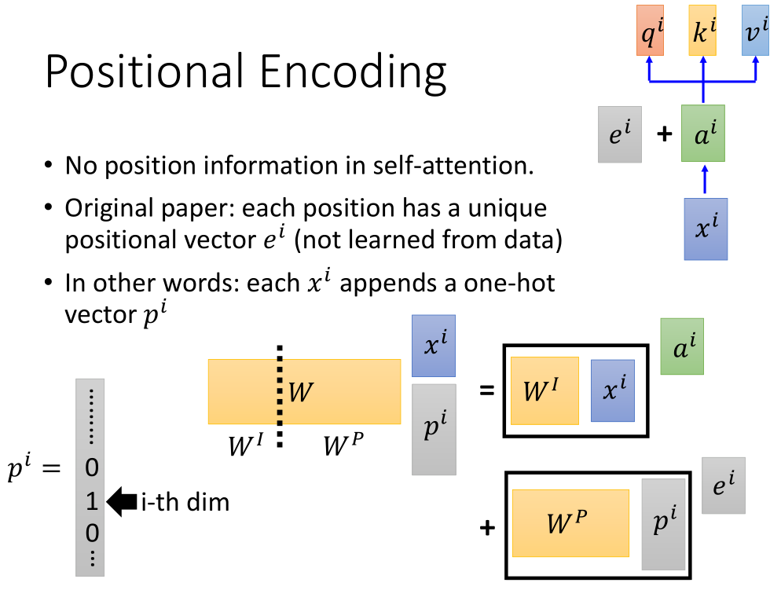

#### Seq2seq with Attention

Encode：所有word两两之间做attention，有三个attention layer

Decode：不只 attend input 也会attend 之前已经输出的部分

More specifically, to compute the next representation for a given word - “bank” for example - the Transformer compares it to every other word in the sentence. The result of these comparisons is an attention score for every other word in the sentence. These attention scores determine how much each of the other words should contribute to the next representation of “bank”. In the example, the disambiguating “river” could receive a high attention score when computing a new representation for “bank”. The attention scores are then used as weights for a weighted average of all words’ representations which is fed into a fully-connected network to generate a new representation for “bank”, reflecting that the sentence is talking about a river bank.

The animation above illustrates how we apply the Transformer to machine translation. Neural networks for machine translation typically contain an encoder reading the input sentence and generating a representation of it. A decoder then generates the output sentence word by word while consulting the representation generated by the encoder. The Transformer starts by generating initial representations, or embeddings, for each word. These are represented by the unfilled circles. Then, using self-attention, it aggregates information from all of the other words, generating a new representation per word informed by the entire context, represented by the filled balls. This step is then repeated multiple times in parallel for all words, successively generating new representations.

The decoder operates similarly, but generates one word at a time, from left to right. It attends not only to the other previously generated words, but also to the final representations generated by the encoder.

#### Transformer

Using Chinese to English translation as example

左半部是encoder，右半部是decoder。encoder的输入是机器学习（一个中文的character），decoder先给一个begin token ，然后输出machine，在下一个时间点把machine作为输入，输出learning，这个翻译的过程就结束了。

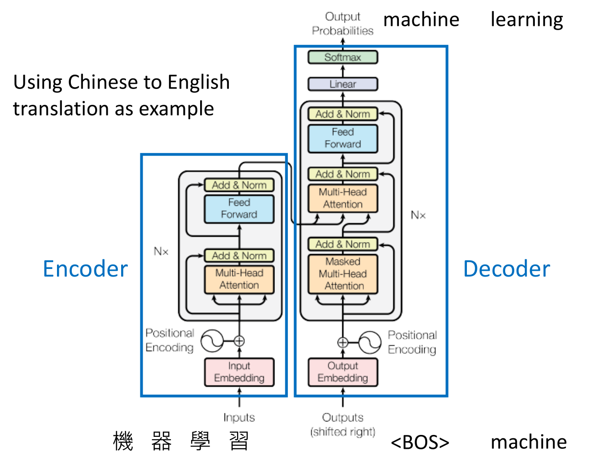

接下来看里面的每个layer在干什么。

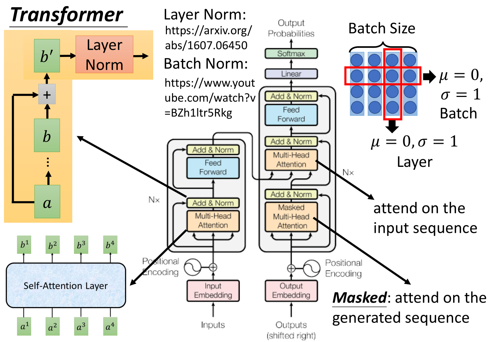

Encoder：

input通过一个input embedding layer变成一个向量，然后加上位置encoding向量

然后进入灰色的block，这个block会重复多次

- 第一层是Multi-Head Attention，input一个sequence，输出另一个sequence
- 第二层是Add&Norm
  - 把Multi-Head Attention的input a和output b加起来得到b'（Add）
  - 把b'再做Layer Norm，上图右上方所示为Batch Norm（行，n个样本的同一个维度标准化），和Layer Norm（列，1个样本的n个维度标准化）。一般Layer Norm会搭配RNN使用，所以这里也使用Layer Norm
- 第三层是Feed Forward，会把sequence 的每个b'向量进行处理
- 第四层是另一个Add&Norm

最终输出的是输入信号的向量表示

Decoder：

decoder的input是前一个时间点产生的output，通过output embedding，再加上位置encoding变成一个向量，然后进去灰色的block，灰色block同样会重复多次

- 第一层是Masked Multi-Head Attention，Masked的意思是，在做self-attention的时候，这个decoder只会attend到已经产生的sequence，因为没有产生的部分无法做attention
- 第二层是Add&Norm
- 第三层是Multi-Head Attention，attend的是encoder部分的输出和第二层的输出结果
- 第四层是Add&Norm
- 第五层是Feed Forward
- 第六层是Add&Norm

不再循环后，进行Linear，最后再进行softmax

#### Attention Visualization

Transformer paper最后附上了一些attention的可视化，每两个word之间都会有一个attention。attention权重越大，线条颜色越深。

现在input一个句子，在做attention的时候，你会发现it attend到animal；但是把tired换成wide，it会attend到street。

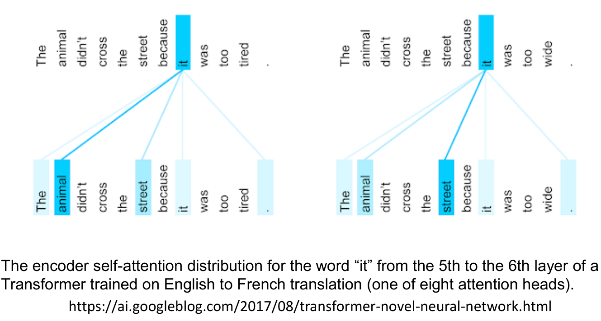

对于Multi-head attention，每一组$q,k$都做不同的事情，这里会发现，确实是这样。如下图所示，上面的部分可以看出这个head主要关注比较长序列（global）的信息，而下面的head比较关注距自己相近的序列（local）的信息，说明使用多个head时不同的head通过学习会关注不同的信息。

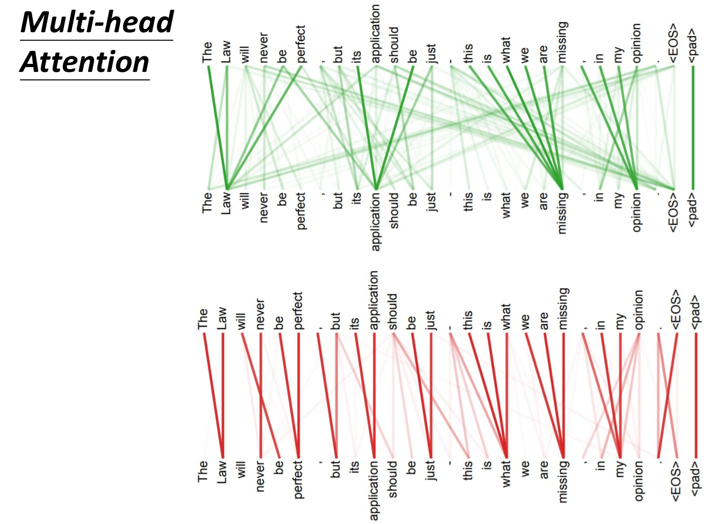

#### Example Application

使用Transformer可以做多文档摘要，通过训练一个Summarizer来输入一个文档的集合然后输出这些文档的摘要。https://arxiv.org/abs/1801.10198

Transformer很好地解决了输入序列长度较大的情况，而向RNN中输入长序列结果通常不会好。

##### Universal Transformer

将Transformer在深度上随时间循环使用，即重复使用相同的网络结构。

https://ai.googleblog.com/2018/08/moving-beyond-translation-with.html

##### Self-Attention GAN

将Transformer用在影像上，用每一个pixel去attention其他pixel，这样可以考虑到比较global的信息。

https://arxiv.org/abs/1805.08318