# Unsupervised Learning

## Word Embedding

> 本文介绍NLP中词嵌入(Word Embedding)相关的基本知识，基于降维思想提供了count-based和prediction-based两种方法，并介绍了该思想在机器问答、机器翻译、图像分类、文档嵌入等方面的应用

### Introduction

词嵌入(word embedding)是降维算法(Dimension Reduction)的典型应用

那如何用vector来表示一个word呢？

#### 1-of-N Encoding

最传统的做法是1-of-N Encoding，假设这个vector的维数就等于世界上所有单词的数目，那么对每一个单词来说，只需要某一维为1，其余都是0即可；但这会导致任意两个vector都是不一样的，你无法建立起同类word之间的联系

#### Word Class

还可以把有同样性质的word进行聚类(clustering)，划分成多个class，然后用word所属的class来表示这个word，但光做clustering是不够的，不同class之间关联依旧无法被有效地表达出来

#### Word Embedding

词嵌入(Word Embedding)把每一个word都投影到高维空间上，当然这个空间的维度要远比1-of-N Encoding的维度低，假如后者有10w维，那前者只需要50\~100维就够了，这实际上也是Dimension Reduction的过程

类似语义(semantic)的词汇，在这个word embedding的投影空间上是比较接近的，而且该空间里的每一维都可能有特殊的含义

假设词嵌入的投影空间如下图所示，则横轴代表了生物与其它东西之间的区别，而纵轴则代表了会动的东西与静止的东西之间的差别

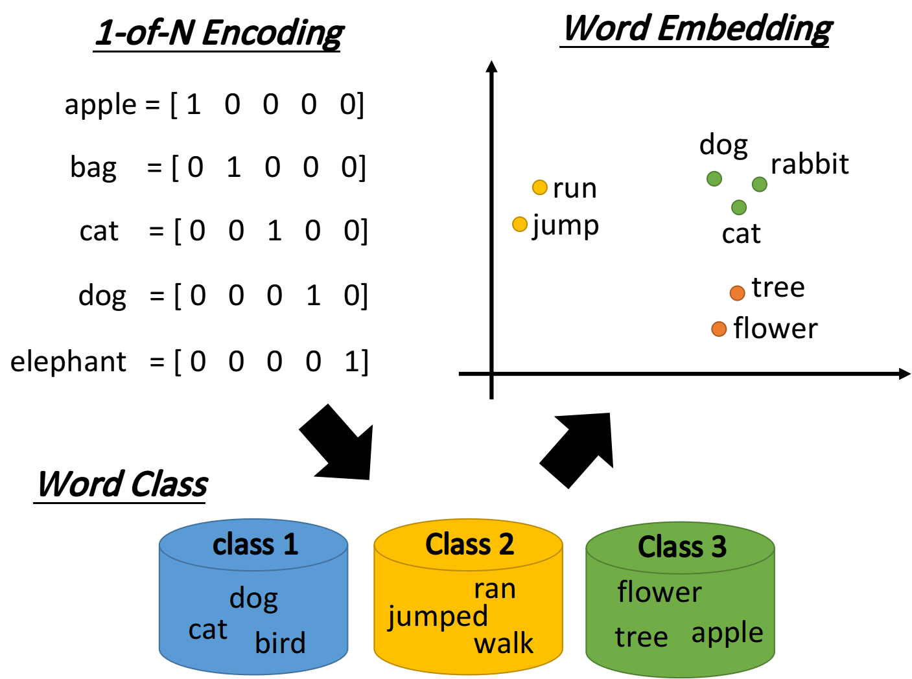

word embedding是一个无监督的方法(unsupervised approach)，只要让机器阅读大量的文章，它就可以知道每一个词汇embedding之后的特征向量应该长什么样子

Machine learns the meaning of words from reading a lot of documents without supervision

我们的任务就是训练一个neural network，input是词汇，output则是它所对应的word embedding vector，实际训练的时候我们只有data的input，该如何解这类问题呢？

之前提到过一种基于神经网络的降维方法，Auto-Encoder，就是训练一个model，让它的输入等于输出，取出中间的某个隐藏层就是降维的结果，自编码的本质就是通过自我压缩和解压的过程来寻找各个维度之间的相关信息。但word embedding这个问题是不能用Auto-encoder来解的，因为输入的向量通常是1-of-N encoding，各维无关，很难通过自编码的过程提取出什么有用信息。

### Word Embedding

基本精神就是，每一个词汇的含义都可以根据它的上下文来得到

A word can be understood by its context

比如机器在两个不同的地方阅读到了“马英九宣誓就职”、“蔡英文宣誓就职”，它就会发现“马英九”和“蔡英文”前后都有类似的文字内容，于是机器就可以推测“马英九”和“蔡英文”这两个词汇代表了可能有同样地位的东西，即使它并不知道这两个词汇是人名

怎么用这个思想来找出word embedding的vector呢？有两种做法：

- Count based
- Prediction based

### Count based

假如$w_i$和$w_j$这两个词汇常常在同一篇文章中出现(co-occur)，它们的word vector分别用$V(w_i)$和$V(w_j)$来表示，则$V(w_i)$和$V(w_j)$会比较接近

假设$N_{i,j}$是$w_i$和$w_j$这两个词汇在相同文章里同时出现的次数，我们希望它与$V(w_i)\cdot V(w_j)$的内积越接近越好，这个思想和之前的文章中提到的矩阵分解(matrix factorization)的思想其实是一样的

这种方法有一个很代表性的例子是[Glove Vector](http://nlp.stanford.edu/projects/glove/)

### Prediction based

#### how to do perdition 

给定一个sentence，我们要训练一个神经网络，它要做的就是根据当前的word $w_{i-1}$，来预测下一个可能出现的word $w_i$是什么 

假设我们使用1-of-N encoding把$w_{i-1}$表示成feature vector，它作为neural network的input。output的维数和input相等，只不过每一维都是小数，代表在1-of-N编码中该维为1其余维为0所对应的word会是下一个word $w_i$的概率

把第一个hidden layer的input $z_1,z_2,...$拿出来，它们所组成的$Z$就是word的另一种表示方式，当我们input不同的词汇，向量$Z$就会发生变化

也就是说，第一层hidden layer的维数可以由我们决定，而它的input又唯一确定了一个word，因此提取出第一层hidden layer的input，实际上就得到了一组可以自定义维数的Word Embedding的向量

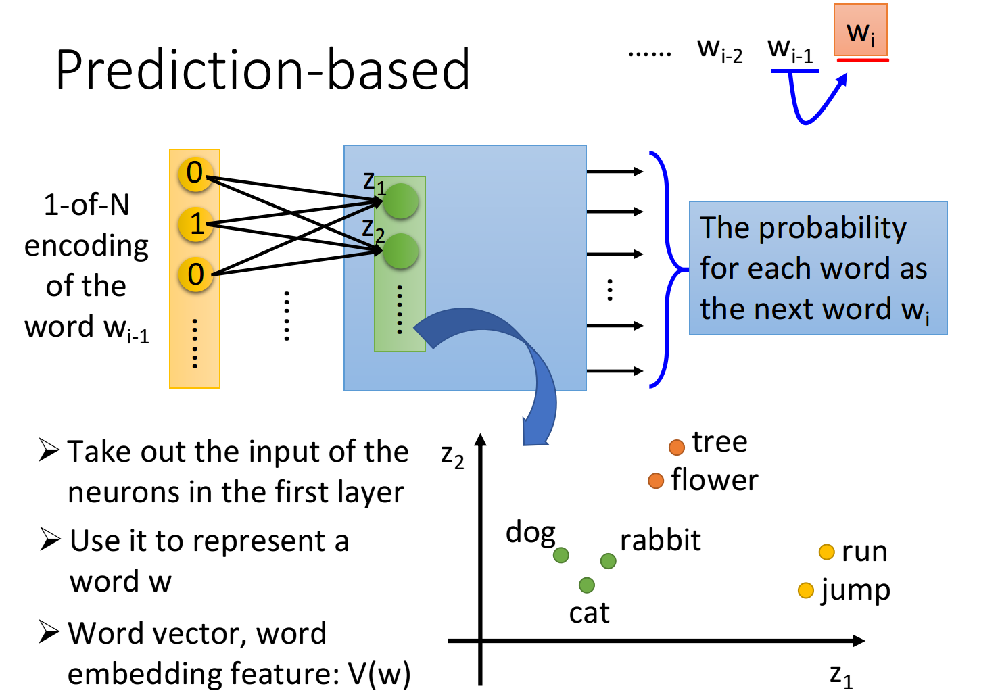

#### Why prediction works

prediction-based方法是如何体现根据词汇的上下文来了解该词汇的含义这件事呢？

假设在两篇文章中，“蔡英文”和“马英九”代表$w_{i-1}$，“宣誓就职”代表$w_i$，我们希望对神经网络输入“蔡英文”或“马英九”这两个词汇，输出的vector中对应“宣誓就职”词汇的那个维度的概率值是高的

为了使这两个不同的input通过NN能得到相同的output，就必须在进入hidden layer之前，就通过weight的转换将这两个input vector投影到位置相近的低维空间上

也就是说，尽管两个input vector作为1-of-N编码看起来完全不同，但经过参数的转换，将两者都降维到某一个空间中，在这个空间里，经过转换后的new vector 1和vector 2是非常接近的，因此它们同时进入一系列的hidden layer，最终输出时得到的output是相同的

因此，词汇上下文的联系就自动被考虑在这个prediction model里面

总结一下，对1-of-N编码进行Word Embedding降维的结果就是神经网络模型第一层hidden layer的输入向量$\left [ \begin{matrix} z_1\ z_2\ ... \end{matrix} \right ]^T$，该向量同时也考虑了上下文词汇的关联，我们可以通过控制第一层hidden layer的大小从而控制目标降维空间的维数

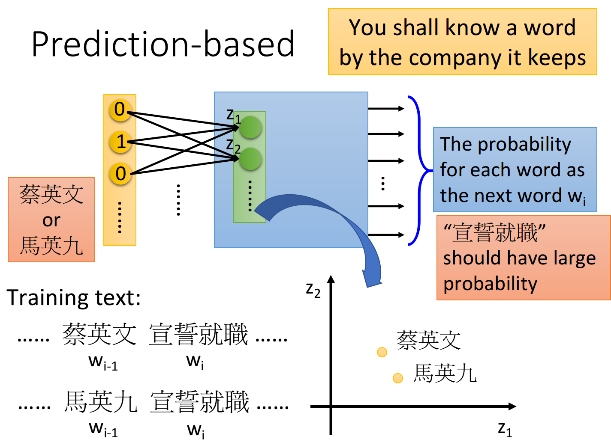

#### Sharing Parameters

你可能会觉得通过当前词汇预测下一个词汇这个约束太弱了，由于不同词汇的搭配千千万万，即便是人也无法准确地给出下一个词汇具体是什么

你可以扩展这个问题，使用10个及以上的词汇去预测下一个词汇，可以帮助得到较好的结果

这里用2个词汇举例，如果是一般是神经网络，我们直接把$w_{i-2}$和$w_{i-1}$这两个vector拼接成一个更长的vector作为input即可

但实际上，我们希望和$w_{i-2}$相连的weight与和$w_{i-1}$相连的weight是tight在一起的，简单来说就是$w_{i-2}$与$w_{i-1}$的相同dimension对应到第一层hidden layer相同neuron之间的连线拥有相同的weight，在下图中，用同样的颜色标注相同的weight：

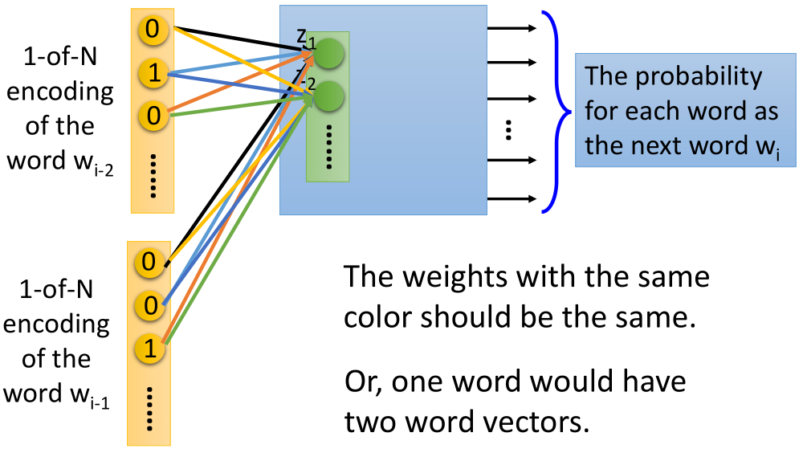

如果我们不这么做，那把同一个word放在$w_{i-2}$的位置和放在$w_{i-1}$的位置，得到的Embedding结果是会不一样的，把两组weight设置成相同，可以使$w_{i-2}$与$w_{i-1}$的相对位置不会对结果产生影响

除此之外，这么做还可以通过共享参数的方式有效地减少参数量，不会由于input的word数量增加而导致参数量剧增

#### Formulation

假设$w_{i-2}$的1-of-N编码为$x_{i-2}$，$w_{i-1}$的1-of-N编码为$x_{i-1}$，维数均为$|V|$，表示数据中的words总数

hidden layer的input为向量$z$，长度为$|Z|$，表示降维后的维数
$$
z=W_1 x_{i-2}+W_2 x_{i-1}
$$
其中$W_1$和$W_2$都是$|Z|×|V|$维的weight matrix，它由$|Z|$组$|V|$维的向量构成，第一组$|V|$维向量与$|V|$维的$x_{i-2}$相乘得到$z_1$，第二组$|V|$维向量与$|V|$维的$x_{i-2}$相乘得到$z_2$，...，依次类推

我们强迫让$W_1=W_2=W$，此时$z=W(x_{i-2}+x_{i-1})$

因此，只要我们得到了这组参数$W$，就可以与1-of-N编码$x$相乘得到word embedding的结果$z$

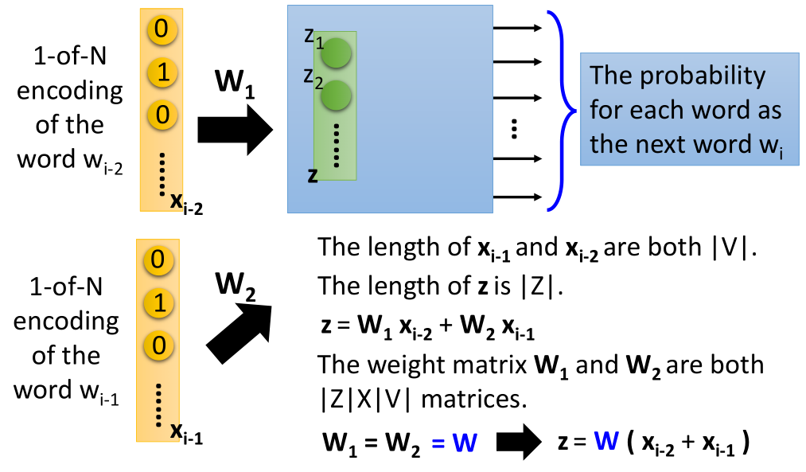

#### In Practice

那在实际操作上，我们如何保证$W_1$和$W_2$一样呢？

以下图中的$w_i$和$w_j$为例，我们希望它们的weight是一样的：

- 首先在训练的时候就要给它们一样的初始值

- 然后分别计算loss function $C$对$w_i$和$w_j$的偏微分，并对其进行更新
  $$
  w_i=w_i-\eta \frac{\partial C}{\partial w_i}\\
  w_j=w_j-\eta \frac{\partial C}{\partial w_j}
  $$
  这个时候你就会发现，$C$对$w_i$和$w_j$的偏微分是不一样的，这意味着即使给了$w_i$和$w_j$相同的初始值，更新过一次之后它们的值也会变得不一样，因此我们必须保证两者的更新过程是一致的，即：
  $$
  w_i=w_i-\eta \frac{\partial C}{\partial w_i}-\eta \frac{\partial C}{\partial w_j}\\
  w_j=w_j-\eta \frac{\partial C}{\partial w_j}-\eta \frac{\partial C}{\partial w_i}
  $$

- 这个时候，我们就保证了$w_i$和$w_j$始终相等：

  - $w_i$和$w_j$的初始值相同
  - $w_i$和$w_j$的更新过程相同

如何去训练这个神经网络呢？注意到这个NN完全是unsupervised，你只需要上网爬一下文章数据直接喂给它即可

比如喂给NN的input是“潮水”和“退了”，希望它的output是“就”，之前提到这个NN的输出是一个由概率组成的vector，而目标“就”是只有某一维为1的1-of-N编码，我们希望minimize它们之间的cross entropy，也就是使得输出的那个vector在“就”所对应的那一维上概率最高

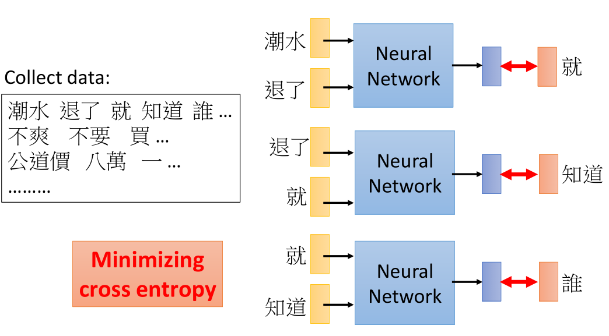

#### Various Architectures

除了上面的基本形态，Prediction-based方法还可以有多种变形

- CBOW(Continuous bag of word model)

  拿前后的词汇去预测中间的词汇

- Skip-gram

  拿中间的词汇去预测前后的词汇

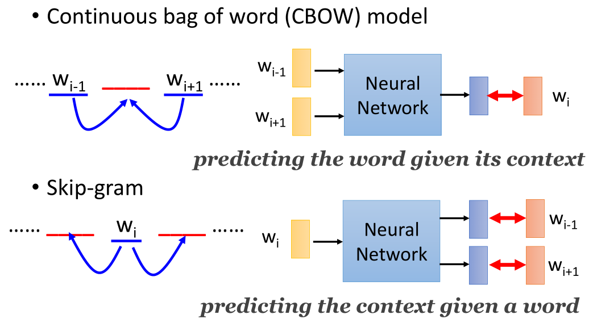

#### Others

假设你有读过word vector的文献的话，你会发现这个neural network其实并不是deep的，它就只有一个linear的hidden layer

我们把1-of-N编码输入给神经网络，经过weight的转换得到Word Embedding，再通过第一层hidden layer就可以直接得到输出

其实过去有很多人使用过deep model，但这个task不用deep就可以实现，这样做既可以减少运算量，跑大量的data，又可以节省下训练的时间(deep model很可能需要长达好几天的训练时间)

### Application

#### Word Embedding

从得到的word vector里，我们可以发现一些原本并不知道的word与word之间的关系

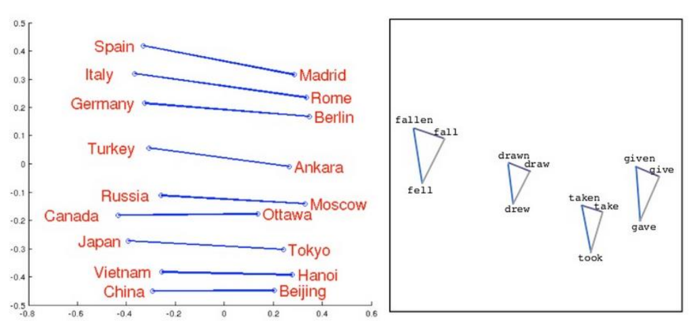

把word vector两两相减，再投影到下图中的二维平面上，如果某两个word之间有类似包含于的相同关系，它们就会被投影到同一块区域

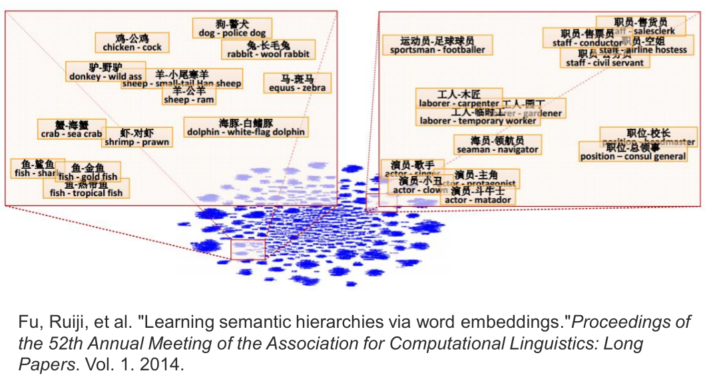

利用这个概念，我们可以做一些简单的推论：

- 在word vector的特征上，$V(Rome)-V(Italy)≈V(Berlin)-V(Germany)$

- 此时如果有人问“罗马之于意大利等于柏林之于？”，那机器就可以回答这个问题

  因为德国的vector会很接近于“柏林的vector-罗马的vector+意大利的vector”，因此机器只需要计算$V(Berlin)-V(Rome)+V(Italy)$，然后选取与这个结果最接近的vector即可

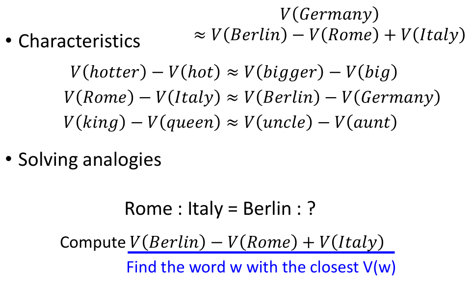

#### Multi-lingual Embedding

此外，word vector还可以建立起不同语言之间的联系

如果你要用上述方法分别训练一个英文的语料库(corpus)和中文的语料库，你会发现两者的word vector之间是没有任何关系的，因为Word Embedding只体现了上下文的关系，如果你的文章没有把中英文混合在一起使用，机器就没有办法判断中英文词汇之间的关系

但是，如果你知道某些中文词汇和英文词汇的对应关系，你可以先分别获取它们的word vector，然后再去训练一个模型，把具有相同含义的中英文词汇投影到新空间上的同一个点

接下来遇到未知的新词汇，无论是中文还是英文，你都可以采用同样的方式将其投影到新空间，就可以自动做到类似翻译的效果

参考文献：*Bilingual Word Embeddings for Phrase-Based Machine Translation, Will Zou, Richard Socher, Daniel Cer and Christopher Manning, EMNLP, 2013*

#### Multi-domain Embedding

在这个word embedding 不局限于文字，你可以对影像做embedding。举例：我们现在已经找好一组word vector，dog vector，horse vector，auto vector，cat vector在空间中是这个样子。接下来，你learn一个model，input一张image，output是跟word vector一样dimension的vector。你会希望说，狗的vector分布在狗的周围，马的vector散布的马的周围，车辆的vector散布在auto的周围，你可以把影像的vector project到它们对应的word vector附近。

假设有一张新的image进来(它是猫，但是你不知道它是猫)，你通过同样的projection把它project这个space以后。神奇的是，你发现它就可能在猫的附近，machine就会知道这是个猫。我们一般做影像分类的时候，你的machine很难去处理新增加的，它没有看过的图片。如果你用这个方法的话，就算有一张image，在training的时候你没有看到过的class。比如说猫这个image，从来都没有看过，但是猫这个image project到cat附近的话，你就会说，这张image叫做cat。

如果你可以做到这件事的话，就好像是machine阅读了大量的文章以后，它知道说：每一个词汇它是什么意思。先通过阅读大量的文章，先了解词汇之间的关系，接下来再看image的时候，会根据它阅读的知识去match每一个image所该对应的位置。这样就算它没有看过的东西，它也有可能把它的名字叫出来。

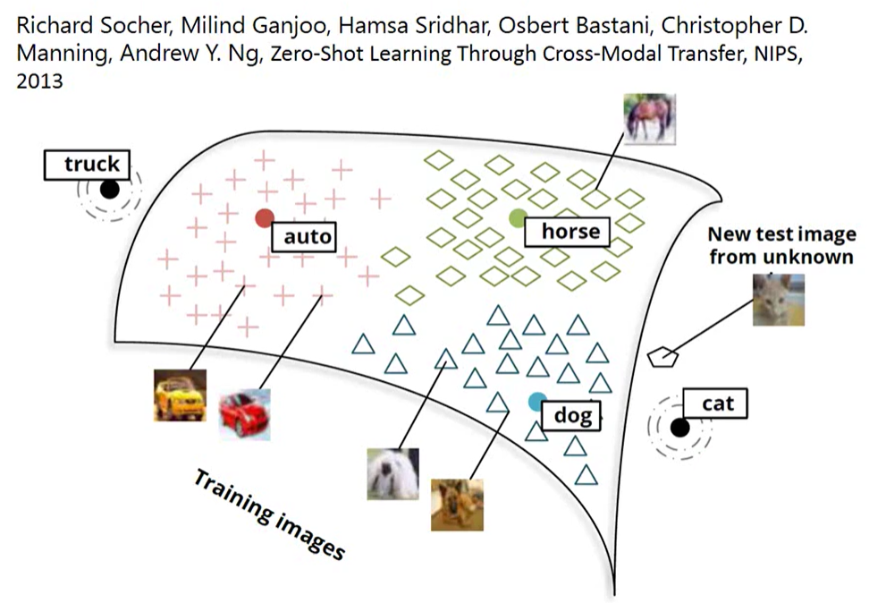

#### Document Embedding

除了Word Embedding，我们还可以对Document做Embedding

最简单的方法是把document变成bag-of-word，然后用Auto-encoder就可以得到该文档的语义嵌入(Semantic Embedding)，但光这么做是不够的

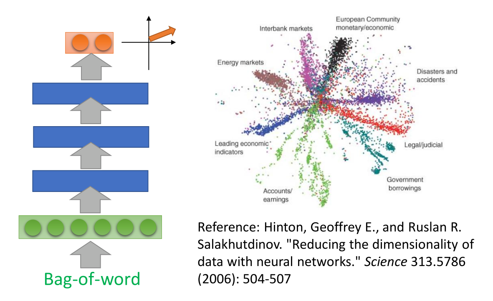

词汇的顺序代表了很重要的含义，两句词汇相同但语序不同的话可能会有完全不同的含义，比如

- 白血球消灭了传染病——正面语义
- 传染病消灭了白血球——负面语义

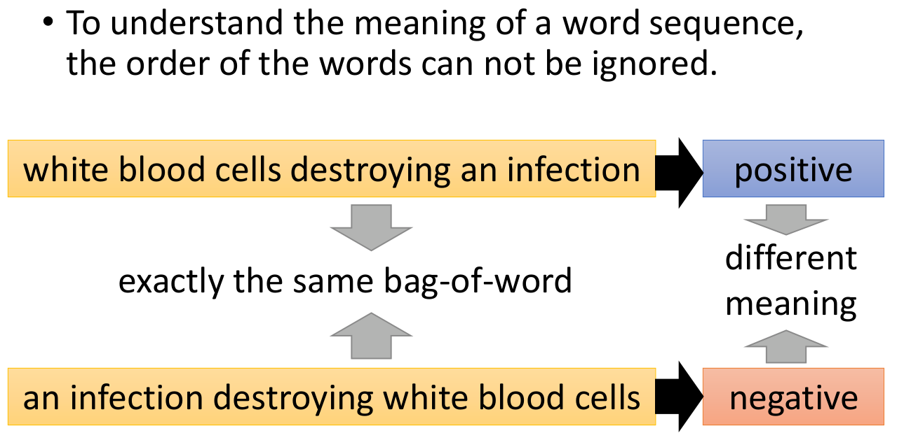

想要解决这个问题，具体可以参考下面的几种处理方法（Unsupervised）：

- **Paragraph Vector**: *Le, Quoc, and Tomas Mikolov. "Distributed Representations of Sentences and Documents.“ ICML, 2014*
- **Seq2seq Auto-encoder**: *Li, Jiwei, Minh-Thang Luong, and Dan Jurafsky. "A hierarchical neural autoencoder for paragraphs and documents." arXiv preprint, 2015*
- **Skip Thought**: *Ryan Kiros, Yukun Zhu, Ruslan Salakhutdinov, Richard S. Zemel, Antonio Torralba, Raquel Urtasun, Sanja Fidler, “Skip-Thought Vectors” arXiv preprint, 2015.*

## Principle Component Analysis

### Unsupervised Learning

无监督学习(Unsupervised Learning)可以分为两种：

- 化繁为简
  - 聚类(Clustering)
  - 降维(Dimension Reduction)
- 无中生有(Generation)

对于无监督学习(Unsupervised Learning)来说，我们通常只会拥有$(x,\hat y)$中的$x$或$\hat y$，其中：

- **化繁为简**就是把复杂的input变成比较简单的output，比如把一大堆没有打上label的树图片转变为一棵抽象的树，此时training data只有input $x$，而没有output $\hat y$
- **无中生有**就是随机给function一个数字，它就会生成不同的图像，此时training data没有input $x$，而只有output $\hat y$

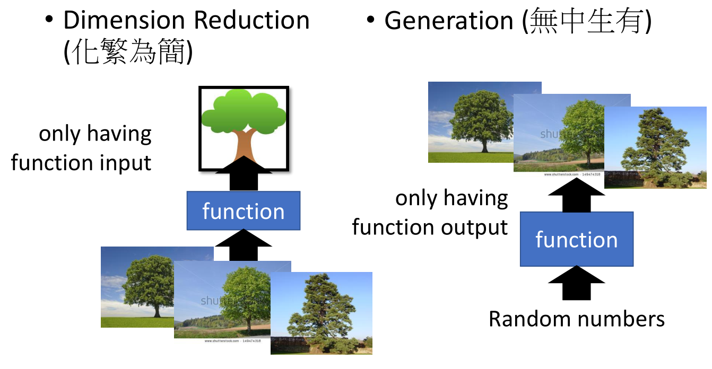

#### Clustering

聚类，顾名思义，就是把相近的样本划分为同一类，比如对下面这些没有标签的image进行分类，手动打上cluster 1、cluster 2、cluster 3的标签，这个分类过程就是化繁为简的过程

一个很critical的问题：我们到底要分几个cluster？

##### K-means

最常用的方法是**K-means**：

- 我们有一大堆的unlabeled data $\{x^1,...,x^n,...,x^N\}$，我们要把它划分为K个cluster
- 对每个cluster都要找一个center $c^i,i\in \{1,2,...,K\}$，initial的时候可以从training data里随机挑K个object $x^n$出来作为K个center $c^i$的初始值
- Repeat
  - 遍历所有的object $x^n$，并判断它属于哪一个cluster，如果$x^n$与第i个cluster的center $c^i$最接近，那它就属于该cluster，我们用$b_i^n=1$来表示第n个object属于第i个cluster，$b_i^n=0$表示不属于
  - 更新center：把每个cluster里的所有object取平均值作为新的center值，即$c^i=\sum\limits_{x^n}b_i^n x^n/\sum\limits_{x^n} b_i^n$

注：如果不是从原先的data set里取center的初始值，可能会导致部分cluster没有样本点

##### HAC

HAC，全称Hierarchical Agglomerative Clustering，层次聚类

假设现在我们有5个样本点，想要做clustering：

- build a tree:

  整个过程类似建立Huffman Tree，只不过Huffman是依据词频，而HAC是依据相似度建树

  - 对5个样本点两两计算相似度，挑出最相似的一对，比如样本点1和2
  - 将样本点1和2进行merge (可以对两个vector取平均)，生成代表这两个样本点的新结点
  - 此时只剩下4个结点，再重复上述步骤进行样本点的合并，直到只剩下一个root结点

- pick a threshold：

  选取阈值，形象来说就是在构造好的tree上横着切一刀，相连的叶结点属于同一个cluster

  下图中，不同颜色的横线和叶结点上不同颜色的方框对应着切法与cluster的分法

  
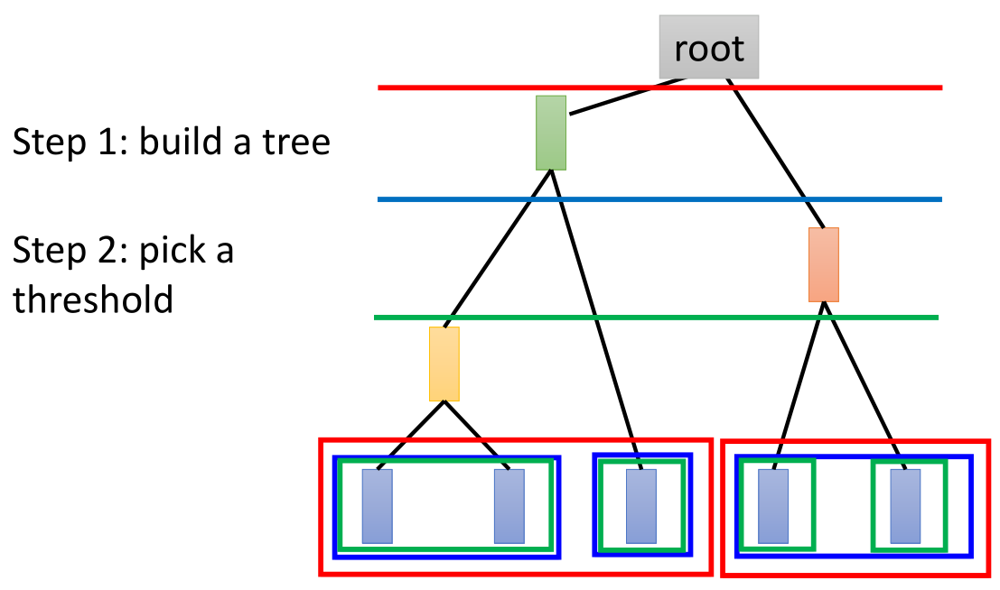

HAC和K-means最大的区别在于如何决定cluster的数量，在K-means里，K的值是要你直接决定的；而在HAC里，你并不需要直接决定分多少cluster，而是去决定这一刀切在树的哪里

#### Dimension Reduction

clustering的缺点是**以偏概全**，它强迫每个object都要属于某个cluster

但实际上某个object可能拥有多种属性，或者多个cluster的特征，如果把它强制归为某个cluster，就会失去很多信息；我们应该用一个vector来描述该object，这个vector的每一维都代表object的某种属性，这种做法就叫做Distributed Representation，或者说，Dimension Reduction

如果原先的object是high dimension的，比如image，那现在用它的属性来描述自身，就可以使之从高维空间转变为低维空间，这就是所谓的**降维(Dimension Reduction)**

##### Why Dimension Reduction Help?

接下来我们从另一个角度来看为什么Dimension Reduction可能是有用的

假设data为下图左侧中的3D螺旋式分布，你会发现用3D的空间来描述这些data其实是很浪费的，因为我们完全可以把这个卷摊平，此时只需要用2D的空间就可以描述这个3D的信息

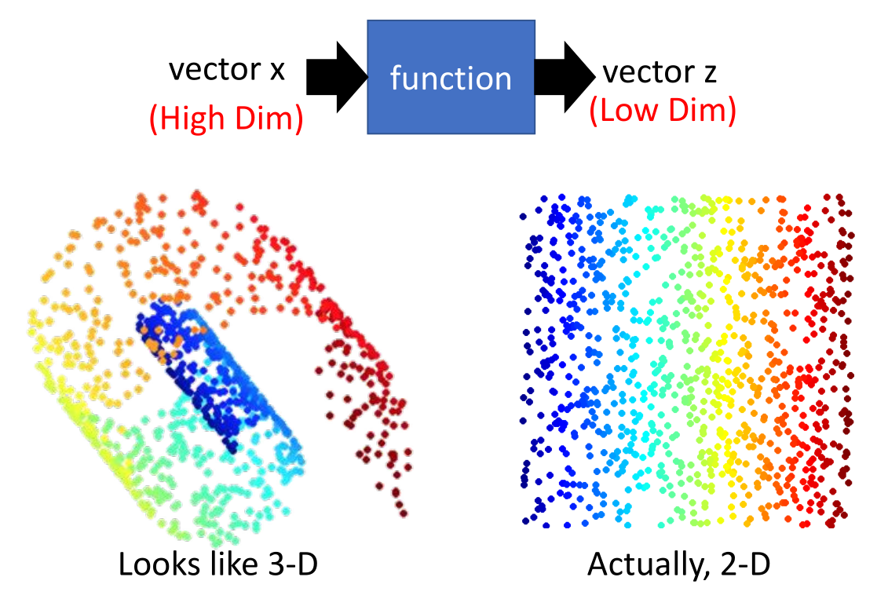

如果以MNIST(手写数字集)为例，每一张image都是28\*28 dimension，但我们反过来想，大多数28\*28 dimension的vector转成image，看起来都不会像是一个数字，所以描述数字所需要的dimension可能远比28\*28要来得少。

举一个极端的例子，对于只是存在角度差异的image，我们完全可以用某张image旋转的角度$\theta$来描述，也就是说，我们只需要用$\theta$这1个dimension就可以描述原先28\*28 dims的图像

##### How to do Dimension Reduction？

在Dimension Reduction里，我们要找一个function，这个function的input是原始的x，output是经过降维之后的z

最简单的方法是**Feature Selection**，即直接从原有的dimension里拿掉一些直观上就对结果没有影响的dimension，就做到了降维，比如下图中从$x_1,x_2$两个维度中直接拿掉$x_1$；但这个方法不总是有用，因为很多情况下任何一个dimension其实都不能被拿掉。

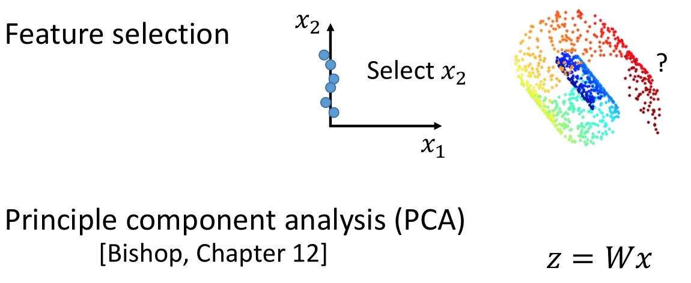

另一个常见的方法叫做**PCA**(Principe Component Analysis)

PCA认为降维就是一个很简单的linear function，它的input x和output z之间是linear transform，即$z=Wx$，PCA要做的，就是根据一大堆的x**把W给找出来**($z$未知)

#### PCA

为了简化问题，这里我们假设z是1维的vector，也就是把x投影到一维空间

注：$w_i$为行向量，$x_i$为列向量，下文中$w_i\cdot x_i$表示的是矢量内积，而$(w^i)^T x_i$表示的是矩阵相乘

$z_1=w_1\cdot x_1$，为Scalar，其中$w_1$表示$W$的第一个row vector，假设$w_1$的长度为1，即$||w_1||_2=1$，那$w_1$跟$x_1$做内积得到的$z_1$意味着：$x_1$是高维空间中的一个点，$w_1$是高维空间中的一个vector，此时$z_1$就是$x_1$在$w_1$上的投影，投影的值就是$w_1$和$x$的inner product
$$
\begin{pmatrix} w_1 \end{pmatrix} \begin{pmatrix} x_1 & x_2 & \cdots & x_N \end{pmatrix} = \begin{pmatrix} z_1 & z_2 & \cdots & z_N \end{pmatrix}
$$
那我们到底要找什么样的$w_1$呢？

假设我们现在已有的宝可梦样本点分布如下，横坐标代表宝可梦的攻击力，纵坐标代表防御力，我们的任务是把这个二维分布投影到一维空间上

我们希望选这样一个$w_1$，它使得$x$经过投影之后得到的$z$分布越大越好，也就是说，经过这个投影后，不同样本点之间的区别，应该仍然是可以被看得出来的，即：

- 我们希望找一个projection的方向，它可以让projection后的variance越大越好

- 我们不希望projection使这些data point通通挤在一起，导致点与点之间的奇异度消失
- 其中，variance的计算公式：$Var(z)=\frac{1}{N}\sum\limits_{z}(z-\bar{z})^2, ||w_1||_2=1$，$\bar {z}$是$z$的平均值

下图给出了所有样本点在两个不同的方向上投影之后的variance比较情况

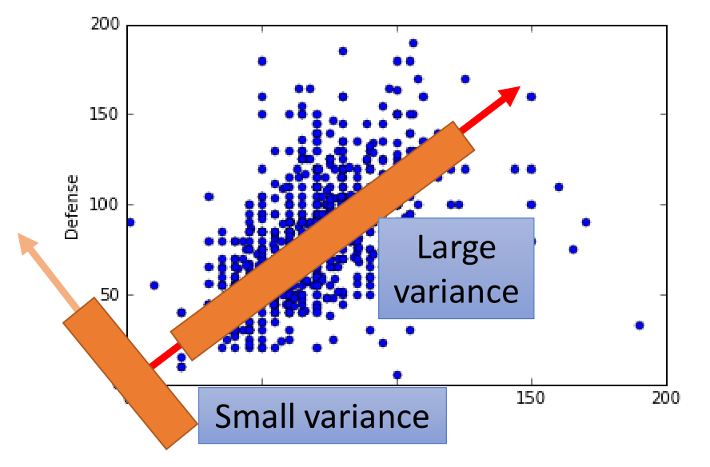

当然我们不可能只投影到一维空间，我们还可以投影到更高维的空间

对$z=Wx$来说：

- $z^1_1=w_1\cdot x_1$**（注意是内积）**，表示$x_1$在$w_1$方向上的投影，为Scalar
- $z^2_1=w_2\cdot x_1$，表示$x_1$在$w_2$方向上的投影
- ...

$z^1_1,z^2_1,...$串起来就得到列向量$z_1$，而$w_1,w_2,...$分别是$W$的第1,2,...个row，需要注意的是，这里的$w_i$必须相互正交，此时$W$是正交矩阵(orthogonal matrix)，如果不加以约束，则找到的$w_1,w_2,...$实际上是相同的值 

**两个矩阵相乘的意义是将右边矩阵中的每一列列向量变换到左边矩阵中每一行行向量为基所表示的空间中去。**

如果我们有M个N维向量，想将其变换为由**R个N维向量表示的新空间**中，那么首先将R个基按行组成矩阵A，然后将向量按列组成矩阵B，那么**两矩阵的乘积AB就是变换结果**，其中AB的第m列为A中第m列变换后的结果。我们可以将一N维数据变换到更低维度的空间中去，变换后的维度取决于基的数量。因此这种矩阵相乘的表示也可以表示降维变换。

[PCA的数学原理](http://blog.codinglabs.org/articles/pca-tutorial.html)
$$
\begin{pmatrix} w_1 \\ w_2 \\ \vdots \\ w_R \end{pmatrix} \begin{pmatrix} x_1 & x_2 & \cdots & x_N \end{pmatrix} = \begin{pmatrix} w_1\cdot x_1 & w_1\cdot x_2 & \cdots & w_1\cdot x_N \\ w_2\cdot x_1 & w_2\cdot x_2 & \cdots & w_2\cdot x_N \\ \vdots & \vdots & \ddots & \vdots \\ w_R\cdot x_1 & w_R\cdot x_2 & \cdots & w_R\cdot x_N \end{pmatrix}= \begin{pmatrix} z_1 & z_2 & \cdots & z_N \end{pmatrix}
$$

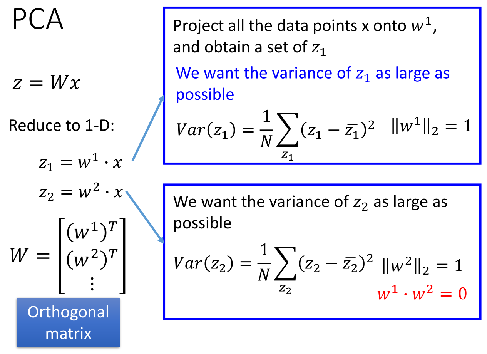

##### Lagrange multiplier

求解PCA，实际上已经有现成的函数可以调用，此外你也可以把PCA描述成neural network，然后用gradient descent的方法来求解，这里主要介绍用拉格朗日乘数法(Lagrange multiplier)求解PCA的数学推导过程

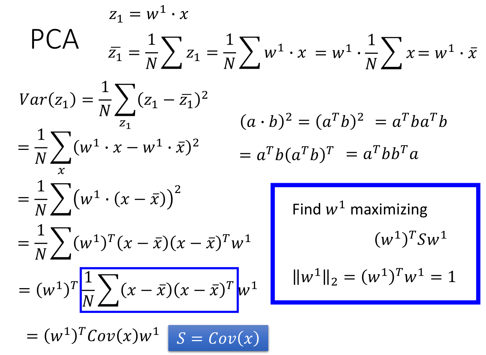

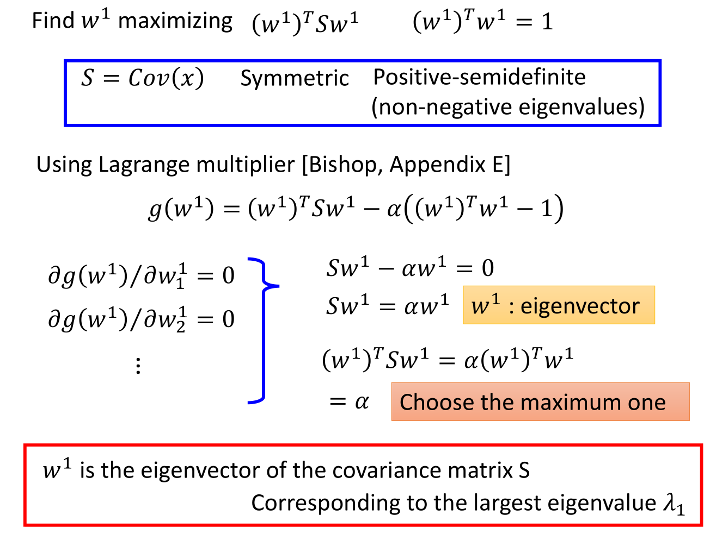

###### Calculate $w^1$

注：根据PPT，$w^1$为列向量，$z_1$和$x$为多个列向量

- 首先计算出$\bar{z_1}$：

  $$
  \begin{split}
  &z_1=w^1\cdot x\\
  &\bar{z_1}=\frac{1}{N}\sum z_1=\frac{1}{N}\sum w^1\cdot x=w^1\cdot \frac{1}{N}\sum x=w^1\cdot \bar x
  \end{split}
  $$

- 然后计算maximize的对象$Var(z_1)$：

  其中$Cov(x)=\frac{1}{N}\sum(x-\bar x)(x-\bar x)^T$

  $$
  \begin{split}
  Var(z_1)&=\frac{1}{N}\sum\limits_{z_1} (z_1-\bar{z_1})^2\\
  &=\frac{1}{N}\sum\limits_{x} (w^1\cdot x-w^1\cdot \bar x)^2\\
  &=\frac{1}{N}\sum (w^1\cdot (x-\bar x))^2\\
  &=\frac{1}{N}\sum(w^1)^T(x-\bar x)(x-\bar x)^T w^1\\
  &=(w^1)^T\frac{1}{N}\sum(x-\bar x)(x-\bar x)^T w^1\\
  &=(w^1)^T Cov(x)w^1
  \end{split}
  $$

- 当然这里想要求$Var(z_1)=(w^1)^TCov(x)w^1$的最大值，还要加上$||w^1||_2=(w^1)^Tw^1=1$的约束条件，否则$w^1$可以取无穷大

- 令$S=Cov(x)$，它是：

  - 对称的(symmetric)
  - 半正定的(positive-semidefine)
  - 所有特征值(eigenvalues)非负的(non-negative)

- 目标：maximize $(w^1)^TSw^1 $，条件：$(w^1)^Tw^1=1$

- 使用拉格朗日乘数法，利用目标和约束条件构造函数：

  $$
  g(w^1)=(w^1)^TSw^1-\alpha((w^1)^Tw^1-1)
  $$

- 对$w^1$这个vector里的每一个element做偏微分：

  $$
  \partial g(w^1)/\partial w_1^1=0\\
  \partial g(w^1)/\partial w_2^1=0\\
  \partial g(w^1)/\partial w_3^1=0\\
  ...
  $$

- 整理上述推导式，可以得到：

  $$
  Sw^1=\alpha w^1
  $$
  其中，$w^1$是S的特征向量(eigenvector)

- 注意到满足$(w^1)^Tw^1=1$的特征向量$w^1$有很多，我们要找的是可以maximize $(w^1)^TSw^1$的那一个，于是利用上一个式子：

$$
  (w^1)^TSw^1=(w^1)^T \alpha w^1=\alpha (w^1)^T w^1=\alpha
$$

- 此时maximize $(w^1)^TSw^1$就变成了maximize $\alpha$，也就是当$S$的特征值$\alpha$最大时对应的那个特征向量$w^1$就是我们要找的目标

- 结论：**$w^1$是$S=Cov(x)$这个matrix中的特征向量，对应最大的特征值$\lambda_1$**

###### Calculate $w^2$

在推导$w^2$时，相较于$w^1$，多了一个限制条件：$w^2$必须与$w^1$正交(orthogonal)

目标：maximize $(w^2)^TSw^2$，条件：$(w^2)^Tw^2=1,(w^2)^Tw^1=0$

- 同样是用拉格朗日乘数法求解，先写一个关于$w^2$的function，包含要maximize的对象，以及两个约束条件

  $$
  g(w^2)=(w^2)^TSw^2-\alpha((w^2)^Tw^2-1)-\beta((w^2)^Tw^1-0)
  $$

- 对$w^2$的每个element做偏微分：

  $$
  \partial g(w^2)/\partial w_1^2=0\\
  \partial g(w^2)/\partial w_2^2=0\\
  \partial g(w^2)/\partial w_3^2=0\\
  ...
  $$

- 整理后得到：

  $$
  Sw^2-\alpha w^2-\beta w^1=0
  $$

- 上式两侧同乘$(w^1)^T$，得到：

  $$
  (w^1)^TSw^2-\alpha (w^1)^Tw^2-\beta (w^1)^Tw^1=0
  $$

- 其中$\alpha (w^1)^Tw^2=0,\beta (w^1)^Tw^1=\beta$，

  而由于$(w^1)^TSw^2$是vector×matrix×vector=scalar，因此在外面套一个transpose不会改变其值，因此该部分可以转化为：

  注：S是symmetric的，因此$S^T=S$

  $$
  \begin{split}
  (w^1)^TSw^2&=((w^1)^TSw^2)^T\\
  &=(w^2)^TS^Tw^1\\
  &=(w^2)^TSw^1
  \end{split}
  $$

  我们已经知道$w^1$满足$Sw^1=\lambda_1 w^1$，代入上式：
  $$
  \begin{split}
  (w^1)^TSw^2&=(w^2)^TSw^1\\
  &=\lambda_1(w^2)^Tw^1\\
  &=0
  \end{split}
  $$

- 因此有$(w^1)^TSw^2=0$，$\alpha (w^1)^Tw^2=0$，$\beta (w^1)^Tw^1=\beta$，又根据

  $$
  (w^1)^TSw^2-\alpha (w^1)^Tw^2-\beta (w^1)^Tw^1=0
  $$

  可以推得$\beta=0$

- 此时$Sw^2-\alpha w^2-\beta w^1=0$就转变成了$Sw^2-\alpha w^2=0$，即

  $$
  Sw^2=\alpha w^2
  $$

- 由于$S$是symmetric的，因此在不与$w_1$冲突的情况下，这里$\alpha$选取第二大的特征值$\lambda_2$时，可以使$(w^2)^TSw^2$最大

- 结论：**$w^2$也是$S=Cov(x)$这个matrix中的特征向量，对应第二大的特征值$\lambda_2$**

##### Decorrelation

神奇之处在于$Cov(z)=D$，即z的covariance是一个diagonal matrix

如果你把原来的input data通过PCA之后再给其他model使用，其它的model就可以假设现在的input data它的dimension之间没有decorrelation。所以它就可以用简单的model处理你的input data，参数量大大降低，相同的data量可以得到更好的训练结果，从而可以避免overfitting的发生

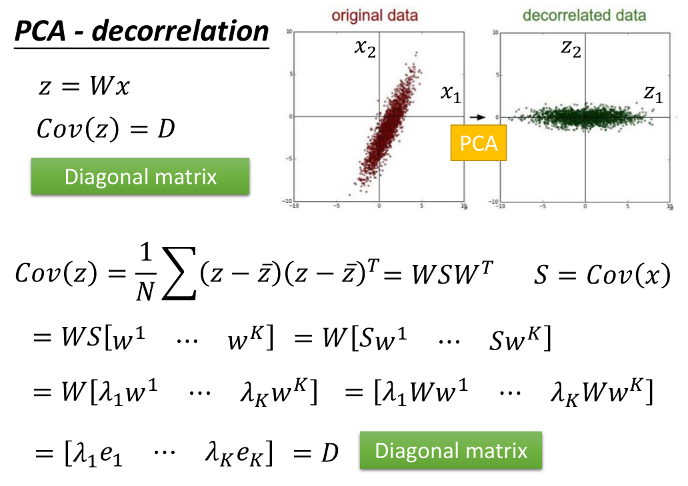

##### Reconstruction Component

假设我们现在考虑的是手写数字识别，这些数字是由一些类似于笔画的basic component组成的，本质上就是一个vector，记做$u_1,u_2,u_3,...$，以MNIST为例，不同的笔画都是一个28×28维的vector，把某几个vector加起来，就组成了一个28×28维的digit

写成表达式就是：$x≈c_1u^1+c_2u^2+...+c_ku^k+\bar x$

其中$x$代表某张digit image中的pixel，它等于k个component的加权和$\sum c_iu^i$加上所有image的平均值$\bar x$

比如7就是$x=u^1+u^3+u^5$，我们可以用$\left [\begin{matrix}c_1\ c_2\ c_3...c_k \end{matrix} \right]^T$来表示一张digit image，如果component的数目k远比pixel的数目要小，那这个描述就是比较有效的

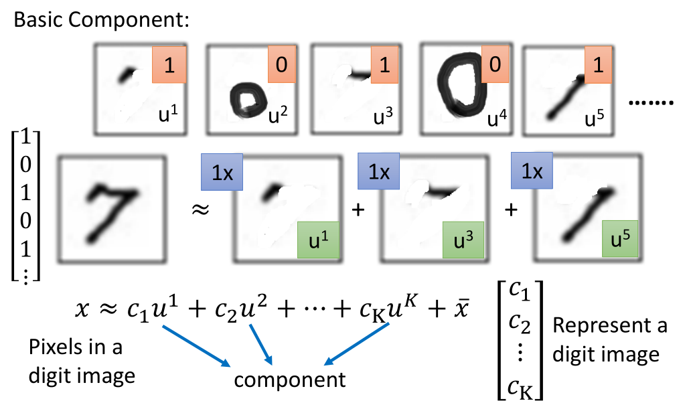

实际上目前我们并不知道$u^1$~$u^k$具体的值，因此我们要找这样k个vector，使得$x-\bar x$与$\hat x$越接近越好：
$$
x-\bar x≈c_1u^1+c_2u^2+...+c_ku^k=\hat x
$$
而用未知component来描述的这部分内容，叫做Reconstruction error，即$||(x-\bar x)-\hat x||$

接下来我们就要去找k个vector $u^i$去minimize这个error：
$$
L=\min\limits_{u^1,...,u^k}\sum||(x-\bar x)-(\sum\limits_{i=1}^k c_i u^i) ||_2
$$
回顾PCA，$z=W x$

实际上我们通过PCA最终解得的$\{w^1,w^2,...,w^k\}$就是使reconstruction error最小化的$\{u^1,u^2,...,u^k\}$，简单证明如下：

- 我们将所有的$x^i-\bar x≈c_1^i u^1+c_2^i u^2+...$都用下图中的矩阵相乘来表示，我们的目标是使等号两侧矩阵之间的差距越小越好，把$u^1,u^2...$看作一行。

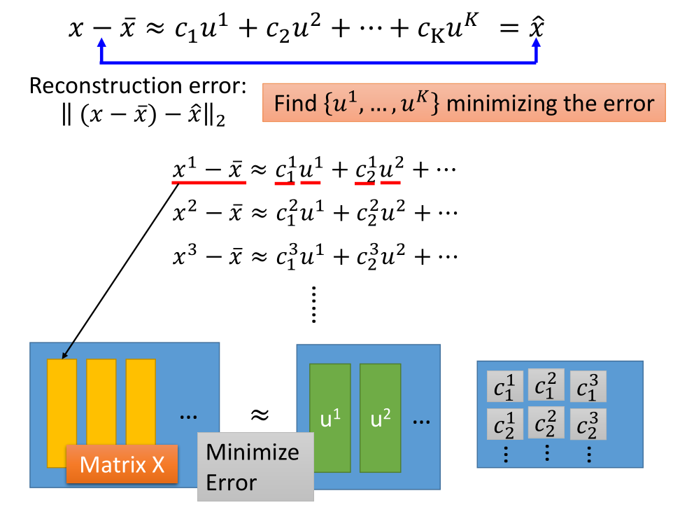

- 可以使用[SVD](http://speech.ee.ntu.edu.tw/~tlkagk/courses/LA_2016/Lecture/SVD.pdf)将每个matrix $X_{m×n}$都拆成matrix $U_{m×k}$、$\Sigma_{k×k}$、$V_{k×n}$的乘积，其中k为component的数目
- 使用SVD拆解后的三个矩阵相乘的结果，是跟等号左边的矩阵$X$最接近的，此时$U$就对应着$u^i$那部分的矩阵，$\Sigma\cdot V$就对应着$c_k^i$那部分的矩阵
- 根据SVD的结论，组成矩阵$U$的k个列向量(标准正交向量, orthonormal vector)就是$XX^T$最大的k个特征值(eignvalue)所对应的特征向量(eigenvector)，而$\frac1{N}XX^T$实际上就是$x$的covariance matrix，因此$U$就是PCA的k个解
- 因此我们可以发现，通过PCA找出来的Dimension Reduction的transform $w$，实际上就是把$X$拆解成能够最小化Reconstruction error的component，通过PCA所得到的$w^i$就是component $u^i$，而Dimension Reduction的结果就是参数$c_i$
- 简单来说就是，用PCA对$x$进行降维的过程中，我们要找的投影方式$w^i$就相当于恰当的组件$u^i$，投影结果$z^i$就相当于这些组件各自所占的比例$c_i$
- PCA求解关键在于求解协方差矩阵$\frac1{N}XX^T$的特征值分解，SVD关键在于$XX^T$的特征值分解。

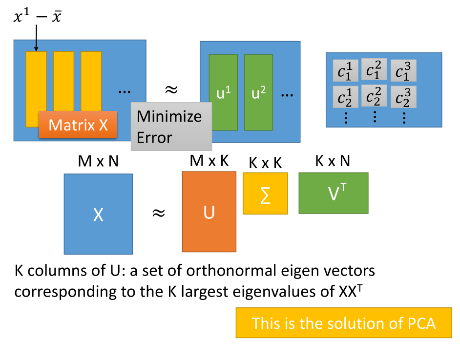

- 下面的式子简单演示了将一个样本点$x$划分为k个组件的过程，其中$\left [\begin{matrix}c_1 \ c_2\ ... c_k \end{matrix} \right ]^T$是每个组件的比例；把$x$划分为k个组件即从n维投影到k维空间，$\left [\begin{matrix}c_1 \ c_2\ ... c_k \end{matrix} \right ]^T$也是投影结果

  注：$x$和$u_i$均为n维列向量
  $$
  \begin{split}
  &x=
  \left [
  \begin{matrix}
  u_1\ u_2\ ...\ u_k
  \end{matrix}
  \right ]\cdot
  \left [
  \begin{matrix}
  c_1\\
  c_2\\
  ...\\
  c_k
  \end{matrix}
  \right ]\\ \\
  
  &\left [
  \begin{matrix}
  x_1\\
  x_2\\
  ...\\
  x_n
  \end{matrix}
  \right ]=\left [
  \begin{matrix}
  u_1^1\ u_2^1\ ... u_k^1 \\
  u_1^2\ u_2^2\ ... u_k^2 \\
  ...\\
  u_1^n\ u_2^n\ ... u_k^n
  \end{matrix}
  \right ]\cdot
  \left [
  \begin{matrix}
  c_1\\
  c_2\\
  ...\\
  c_k
  \end{matrix}
  \right ]\\
  \end{split}
  
  \\
  \left [\begin{matrix} (u_1)^T \\ (u_2)^T \\ \vdots \\ (u_k)^T \end{matrix}\right ] x= I z \ \ \ （z = Wx，证明\text{SVD得到的}u就是\text{PCA求到的}w\text{，对x进行SVD即可得到第一个式子}）
  $$

##### Neural Network

现在我们已经知道，用PCA找出来的$\{w^1,w^2,...,w^k\}$就是k个component $\{u^1,u^2,...,u^k\}$

而$\hat x=\sum\limits_{k=1}^K c_k w^k$，我们要使$\hat x$与$x-\bar x$之间的差距越小越好，我们已经根据SVD找到了$w^k$的值，而对每个不同的样本点，都会有一组不同的$c_k$值

在PCA中我们已经证得，$\{w^1,w^2,...,w^k\}$这k个vector是标准正交化的(orthonormal)，因此：
$$
c_k=(x-\bar x)\cdot w^k （内积）
$$
这个时候我们就可以使用神经网络来表示整个过程，假设$x$是3维向量，要投影到k=2维的component上：

- 对$x-\bar x$与$w^k$做inner product的过程中，$x-\bar x$在3维空间上的坐标就相当于是neuron的input，而$w^1_1$，$w^1_2$，$w^1_3$则是neuron的weight，表示在$w^1$这个维度上投影的参数，而$c_1$则是这个neuron的output，表示在$w^1$这个维度上投影的坐标值；对$w^2$也同理

  
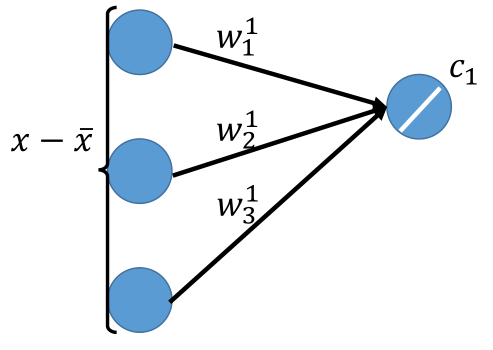

- 得到$c_1$之后，再让它乘上$w^1$，得到$\hat x$的一部分

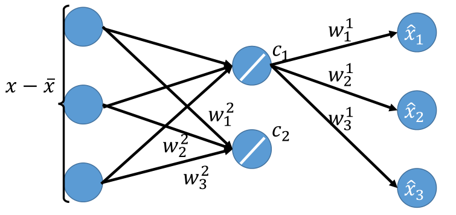

- 对$c_2$进行同样的操作，乘上$w^2$，贡献$\hat x$的剩余部分，此时我们已经完整计算出$\hat x$三个分量的值

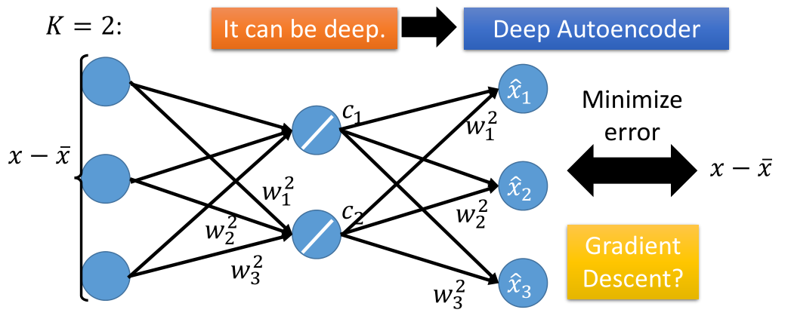

- 此时，PCA就被表示成了只含一层hidden layer的神经网络，且这个hidden layer是线性的激活函数，训练目标是让这个NN的input $x-\bar x$与output $\hat x$越接近越好，这件事就叫做**Autoencoder**
- PCA looks like a neural network with one hidden layer (linear activation function)
- 注意，通过PCA求解出的$w^i$与直接对上述的神经网络做梯度下降所解得的$w^i$是会不一样的，因为PCA解出的$w^i$是相互垂直的(orgonormal)，而用NN的方式得到的解无法保证$w^i$相互垂直，NN无法做到Reconstruction error比PCA小，因此：
  - 在linear的情况下，直接用PCA找$W$远比用神经网络的方式更快速方便
  - 用NN的好处是，它可以使用不止一层hidden layer，它可以做**deep** autoencoder

##### Weakness

PCA有很明显的弱点：

- 它是**unsupervised**的，如果我们要将下图绿色的点投影到一维空间上，PCA给出的从左上到右下的划分很有可能使原本属于蓝色和橙色的两个class的点被merge在一起；

  LDA是考虑了labeled data之后进行降维的一种方式，属于supervised

- 它是**linear**的，对于下图中的彩色曲面，我们期望把它平铺拉直进行降维，但这是一个non-linear的投影转换，PCA无法做到这件事情，PCA只能做到把这个曲面打扁压在平面上，类似下图，而无法把它拉开

  对类似曲面空间的降维投影，需要用到non-linear transformation（non-linear dimension reduction）

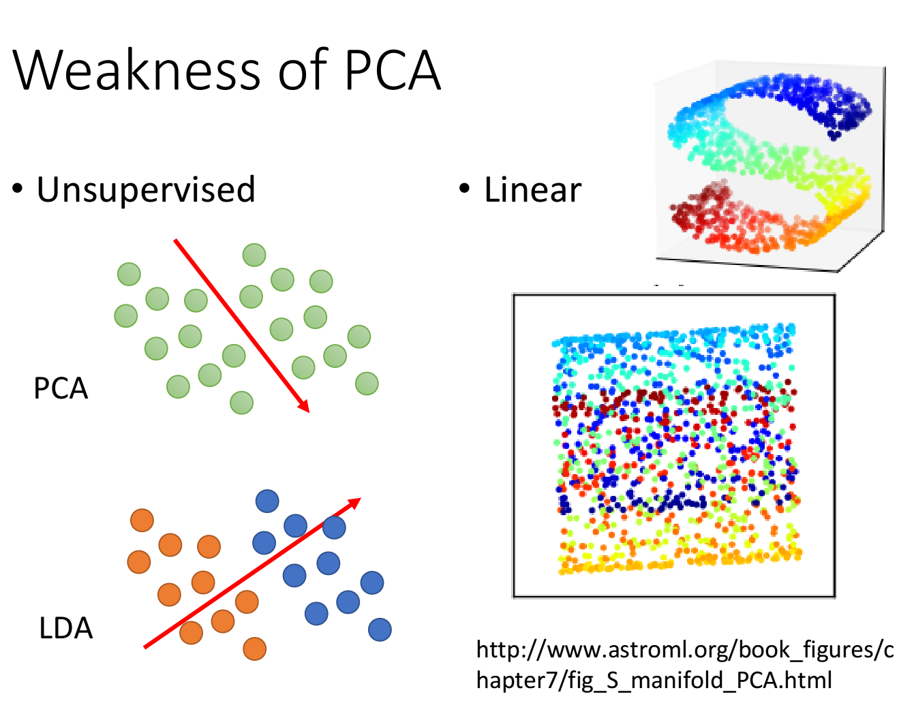

##### Application

###### Pokémon

用PCA来分析宝可梦的数据

假设总共有800只宝可梦，每只都是一个六维度的样本点，即vector={HP, Atk, Def, Sp Atk, Sp Def, Speed}，接下来的问题是，我们要投影到多少维的空间上？要多少个component就好像是neural network要几个layer，每个layer要有几个neural一样，所以这是你要自己决定的。

如果做可视化分析的话，投影到二维或三维平面可以方便人眼观察。

一个常见的方法是这样的：我们去计算每一个principle components的$\lambda$(每一个principle component 就是一个eigenvector，一个eigenvector对应到一个eigenvalue $\lambda$)。这个eigenvalue代表principle component去做dimension reduction的时候，在principle component的那个dimension上，它的variance有多大(variance就是$\lambda$)。

今天这个宝可梦的data总共有6维，所以covariance matrix是有6维。你可以找出6个eigenvector，找出6个eigenvalue。现在我们来计算一下每个eigenvalue的ratio(每个eigenvalue除以6个eigenvalue的总和)，得到的结果如图。

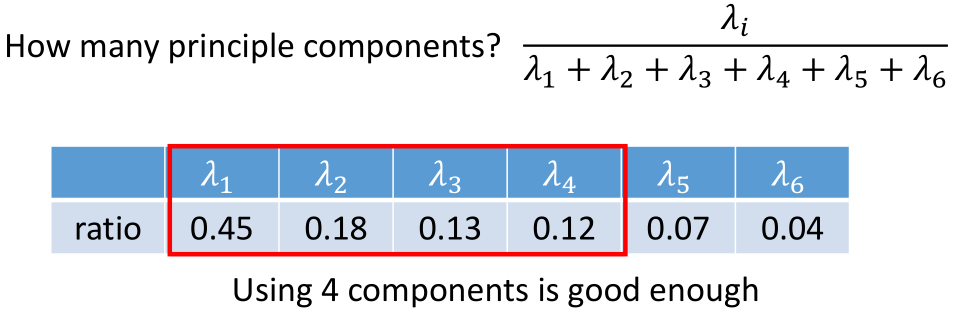

可以从这个结果看出来说：第五个和第六个principle component的作用是比较小的，你用这两个dimension来做projection的时候project出来的variance是很小的，代表说：现在宝可梦的特性在第五个和第六个principle component上是没有太多的information。所以我们今天要分析宝可梦data的话，感觉只需要前面四个principle component就好了。

我们实际来分析一下，做PCA以后得到四个principle component就是这个样子，每一个principle component就是一个vector，每一个宝可梦是用6维的vector来描述。

如果你要产生一只宝可梦的时候，每一个宝可梦都是由这四个vector做linear combination，

新的维度本质上就是旧的维度的加权矢量和，下图给出了前4个维度的加权情况，从PC1到PC4这4个principle component都是6维度加权的vector，它们都可以被认为是某种组件，大多数的宝可梦都可以由这4种组件拼接而成，也就是用这4个6维的vector做linear combination的结果

我们来看每一个principle component做的事情是什么：

- 对第一个vector PC1来说，每个值都是正的，在选第一个principle component的时候，你给它的weight比较大，那这个宝可梦的六维都是强的，所以这第一个principle component就代表了这一只宝可梦的强度。

- 对第二个vector PC2来说，防御力Def很大而速度Speed很小，你给第二个principle component一个weight的时候，你会增加那只宝可梦的防御力但是会减低它的速度。

- 如果将宝可梦仅仅投影到PC1和PC2这两个维度上，则降维后的二维可视化图像如下图所示：

  从该图中也可以得到一些信息：

  - 在PC2维度上特别大的那个样本点刚好对应着海龟，确实是防御力且速度慢的宝可梦
  - 在PC1维度上特别大的那三个样本点则对应着盖欧卡、超梦等综合实力很强的宝可梦

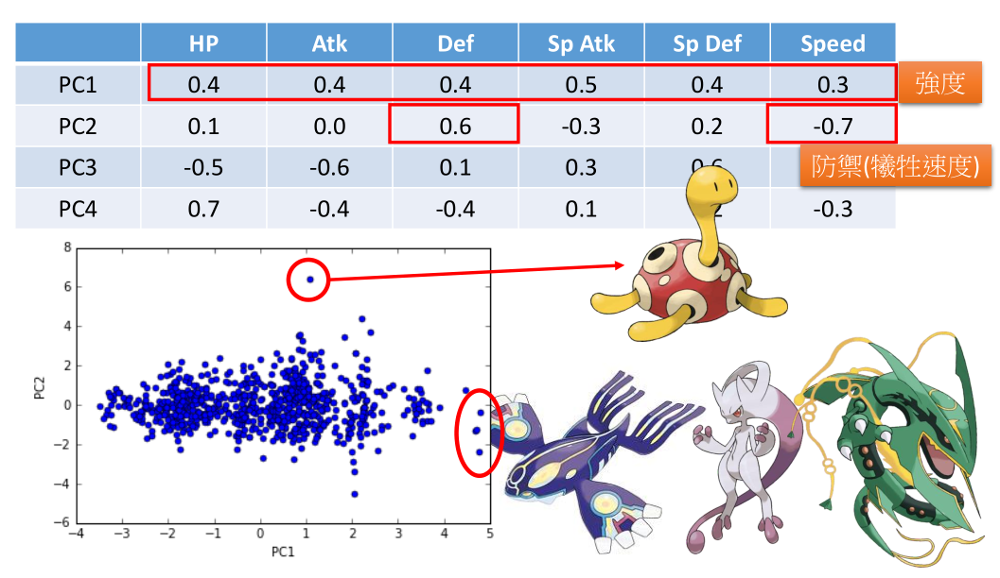

- 对第三个principle component来说，sp Def很大而HP和Atk很小，这个组件是用生命力和攻击力来换取特殊防御力。

- 对第四个vector PC4来说，HP很大而Atk和Def很小，这个组件是用攻击力和防御力来换取生命力

- 同样将宝可梦只投影到PC3和PC4这两个维度上，则降维后得到的可视化图像如下图所示：

  该图同样可以告诉我们一些信息：

  - 在PC3维度上特别大的样本点依旧是普普，第二名是冰柱机器人，它们的特殊防御力都比较高
  - 在PC4维度上特别大的样本点则是吉利蛋和幸福蛋，它们的生命力比较强

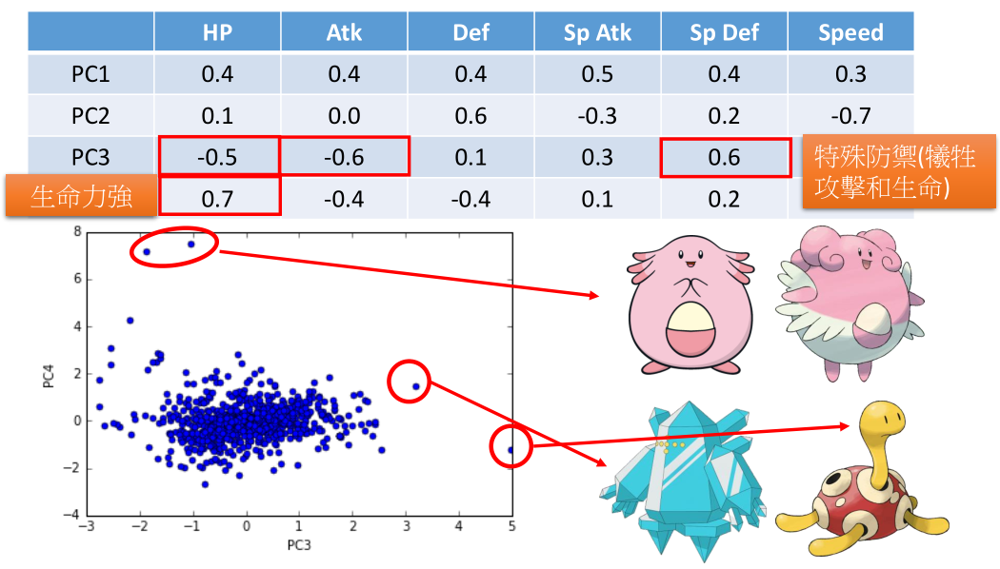

###### MNIST

我们拿它来做手写数字辨识的话，我们可以把每一张数字都拆成component乘以weight，加上另外一个component乘以weight，每一个component是一张image(28* 28的vector)。
$$
digit\ image=a_1 w^1+a_2 w^2+...
$$
我们现在来画前PCA得到的前30个component的话，你得到的结果是这样子的(如图所示)，你用这些component做linear combination，你就得到所有的digit(0-9)，所以这些component就叫做Eigen digits(这些component其实都是covariance matrix的eigenvector)

注：PCA就是求$Cov(x)=\frac{1}{N}\sum (x-\bar x)(x-\bar x)^T$的前30个最大的特征值对应的特征向量

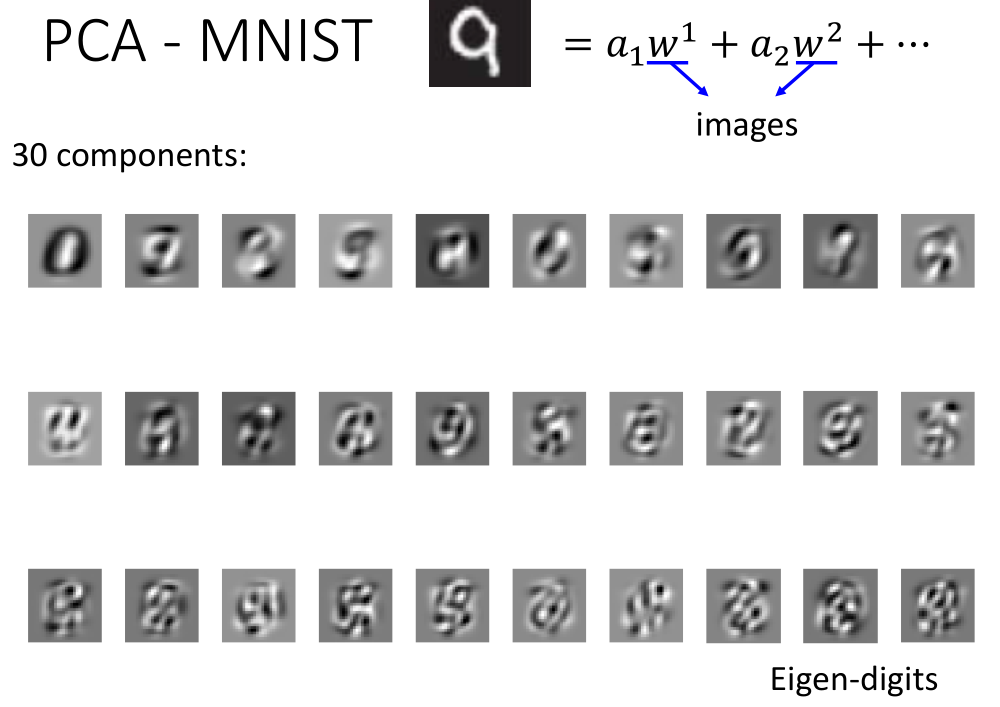

###### Face

同理，通过PCA找出人脸的前30个principle component，得到的结果是这样子的。这些叫做Eigen-face。你把这些脸做linear combination以后就可以得到所有的脸。但是这边跟我们预期的有些是不一样的，因为现在我们找出来的不是component，我们找出来的每一个图都几乎是完整的脸。

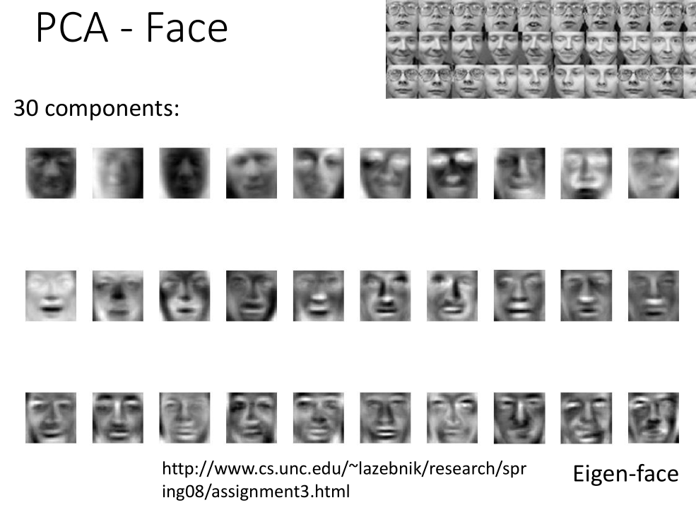

##### What happens to PCA

在对MNIST和Face的PCA结果展示的时候，你可能会注意到我们找到的组件好像并不算是组件，比如MNIST找到的几乎是完整的数字雏形，而Face找到的也几乎是完整的人脸雏形，但我们预期的组件不应该是类似于横折撇捺，眼睛鼻子眉毛这些吗？

如果你仔细思考了PCA的特性，就会发现得到这个结果是可能的
$$
image=a_1 w^1+a_2 w^2+...
$$
注意到linear combination的weight $a_i$可以是正的也可以是负的，因此我们可以通过把组件进行相加或相减来获得目标图像，这会导致你找出来的component不是基础的组件，但是通过这些组件的加加减减肯定可以获得基础的组件元素

#### NMF

##### Introduction

如果你要一开始就得到类似笔画这样的基础组件，就要使用NMF(non-negative matrix factorization)，非负矩阵分解的方法

PCA可以看成对原始矩阵$X$做SVD进行矩阵分解，但并不保证分解后矩阵的正负，实际上当进行图像处理时，如果部分组件的matrix包含一些负值的话，如何处理负的像素值也会成为一个问题(可以做归一化处理，但比较麻烦)

而NMF的基本精神是，强迫使所有组件和它的加权值都必须是正的，也就是说**所有图像都必须由组件叠加得到**：

- Forcing $a_1$, $a_2$...... be non-negative
  - additive combination
- Forcing $w_1$, $w_2$...... be non-negative
  - More like “parts of digits”

注：关于NMF的具体算法内容可参考paper(公众号回复“NMF”获取pdf)：

*Daniel D. Lee and H. Sebastian Seung. "Algorithms for non-negative matrix factorization."Advances in neural information processing systems. 2001.* 

##### MNIST

在MNIST数据集上，通过NMF找到的前30个组件如下图所示，可以发现这些组件都是由基础的笔画构成：

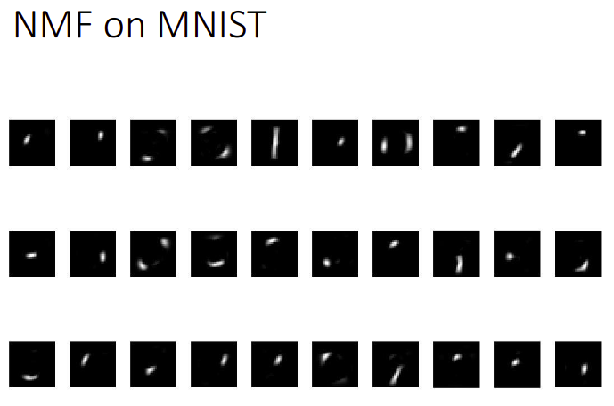

##### Face

在Face数据集上，通过NMF找到的前30个组价如下图所示，相比于PCA这里更像是脸的一部分

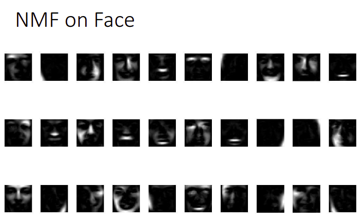

#### More Related Approaches

降维的方法有很多，这里再列举一些与PCA有关的方法：

- Multidimensional Scaling (**MDS**) [Alpaydin, Chapter 6.7]

  MDS不需要把每个data都表示成feature vector，只需要知道特征向量之间的distance，就可以做降维

  一般教科书举的例子会说：我现在一堆城市，你不知道如何把城市描述成vector，但你知道城市跟城市之间的距离(每一笔data之间的距离)，那你就可以画在二维的平面上。

  其实MDS跟PCA是有一些关系的，如果你用某些特定的distance来衡量两个data point之间的距离的话，你做MDS就等于做PCA。

  其实PCA有个特性是：它保留了原来在高维空间中的距离（在高维空间的距离是远的，那么在低维空间中的距离也是远的，在高维空间的距离是近的，那么在低维空间中的距离也是近的）

- **Probabilistic PCA** [Bishop, Chapter 12.2]

  PCA概率版本

- **Kernel PCA** [Bishop, Chapter 12.3]

  PCA非线性版本

- Canonical Correlation Analysis (**CCA**) [Alpaydin, Chapter 6.9]

  CCA常用于两种不同的data source的情况，假如说你要做语音辨识，两个source（一个是声音讯号，另一个是嘴巴的image，可以看到这个人的唇形）把这两种不同的source都做dimension reduction，那这个就是CCA。

- Independent Component Analysis (**ICA**)

  ICA常用于source separation，PCA找的是正交的组件，而ICA则只需要找“独立”的组件即可

- Linear Discriminant Analysis (**LDA**) [Alpaydin, Chapter 6.8]

  LDA是supervised的方式

## Matrix Factorization

> 通过一个详细的例子分析矩阵分解思想及其在推荐系统上的应用

### Introduction

接下来介绍**矩阵分解**的思想：有时候存在两种object，它们之间会受到某种共同**潜在因素**(latent factor)的操控，如果我们找出这些潜在因素，就可以对用户的行为进行预测，这也是**推荐系统**常用的方法之一

假设我们现在去调查每个人购买的公仔数目，ABCDE代表5个人，每个人或者每个公仔实际上都是有着傲娇的属性或天然呆的属性

我们可以用vector去描述人和公仔的属性，如果某个人的属性和某个公仔的属性是match的，即他们背后的vector很像(内积值很大)，这个人就会偏向于拥有更多这种类型的公仔

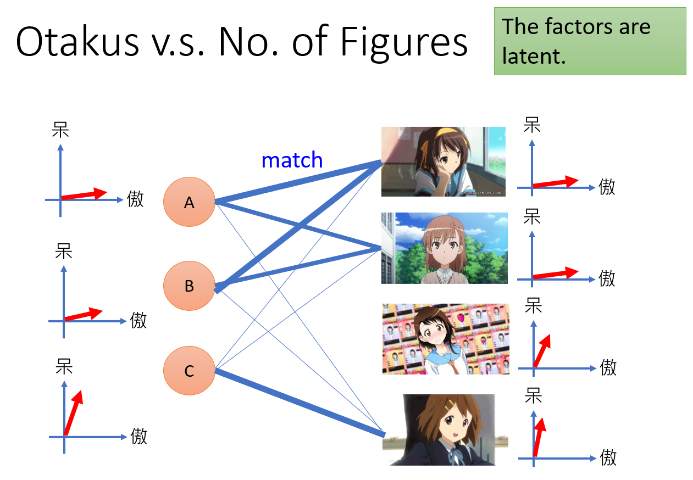

### Matrix Expression

但是，我们没有办法直接观察某个人背后这些潜在的属性，也不会有人在意一个肥宅心里想的是什么；我们同样也没有办法直接得到动漫人物背后的属性；

我们目前有的，只是动漫人物和人之间的关系，即每个人已购买的公仔数目，我们要通过这个关系去推测出动漫人物与人背后的潜在因素(latent factor)

我们可以把每个人的属性用vector $r^A$、$r^B$、$r^C$、$r^D$、$r^E$来表示，而动漫人物的属性则用vector $r^1$、$r^2$、$r^3$、$r^4$来表示，购买的公仔数目可以被看成是matrix $X$，对$X$来说，行数为人数，列数为动漫角色的数目

做一个假设：matrix $X$里的每个element，都是属于人的vector和属于动漫角色的vector的内积

比如，$r^A\cdot r^1≈5$，表示$r^A$和$r^1$的属性比较贴近

接下来就用下图所示的矩阵相乘的方式来表示这样的关系，其中$K$为latent factor的数量，这是未知的，需要你自己去调整选择

我们要找一组$r^A$\~$r^E$和$r^1$\~$r^4$，使得右侧两个矩阵相乘的结果与左侧的matrix $X$越接近越好，可以使用SVD的方法求解

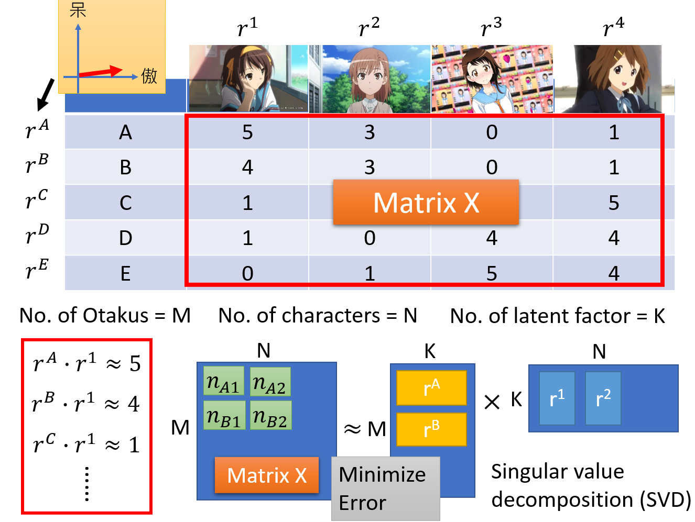

### Prediction

但有时候，部分的information可能是会missing的，这时候就难以用SVD精确描述，但我们可以使用梯度下降的方法求解，loss function如下：
$$
L=\sum\limits_{(i,j)}(r^i\cdot r^j-n_{ij})^2
$$
其中$r^i$值的是人背后的latent factor，$r^j$指的是动漫角色背后的latent factor，我们要让这两个vector的内积与实际购买该公仔的数量$n_{ij}$越接近越好，这个方法的关键之处在于，计算上式时，可以跳过missing的数据，最终通过gradient descent求得$r^i$和$r^j$的值

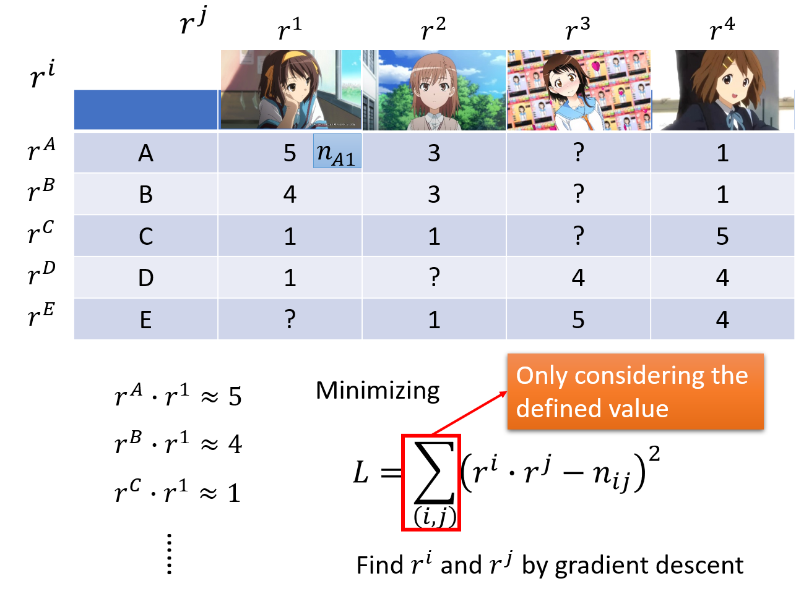

假设latent factor的数目等于2，则人的属性$r^i$和动漫角色的属性$r^j$都是2维的vector，这里实际进行计算后，把属性中较大值标注出来，可以发现：

- 人：A、B属于同一组属性，C、D、E属于同一组属性
- 动漫角色：1、2属于同一组属性，3、4属于同一组属性

- 结合动漫角色，才可以分析出动漫角色的第一个维度是天然呆属性，第二个维度是傲娇属性

- 接下来就可以预测未知的值，只需要将人和动漫角色的vector做内积即可

这也是**推荐系统的常用方法**

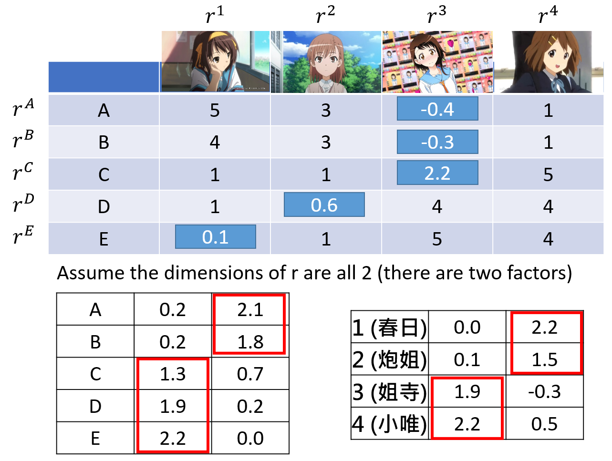

### More about Matrix Factorization

实际上除了人和动漫角色的属性之外，可能还存在其他因素操控购买数量这一数值，因此我们可以将式子更精确地改写为：
$$
r^A\cdot r^1+b_A+b_1≈5
$$
其中$b_A$这个Scalar表示A这个人本身有多喜欢买公仔，$b_1$这个Scalar则表示这个动漫角色本身有多让人想要购买，这些内容是跟属性vector无关的，此时Minimizing的loss function被改写为：
$$
L=\sum\limits_{(i,j)}(r^i\cdot r^j+b_i+b_j-n_{ij})^2
$$
当然你也可以加上一些regularization去对结果做约束

Paper Ref: Matrix Factorization Techniques For Recommender Systems

### Latent Semantic Analysis

如果把matrix factorization的方法用在topic analysis上，就叫做LSA(Latent semantic analysis)，潜在语义分析

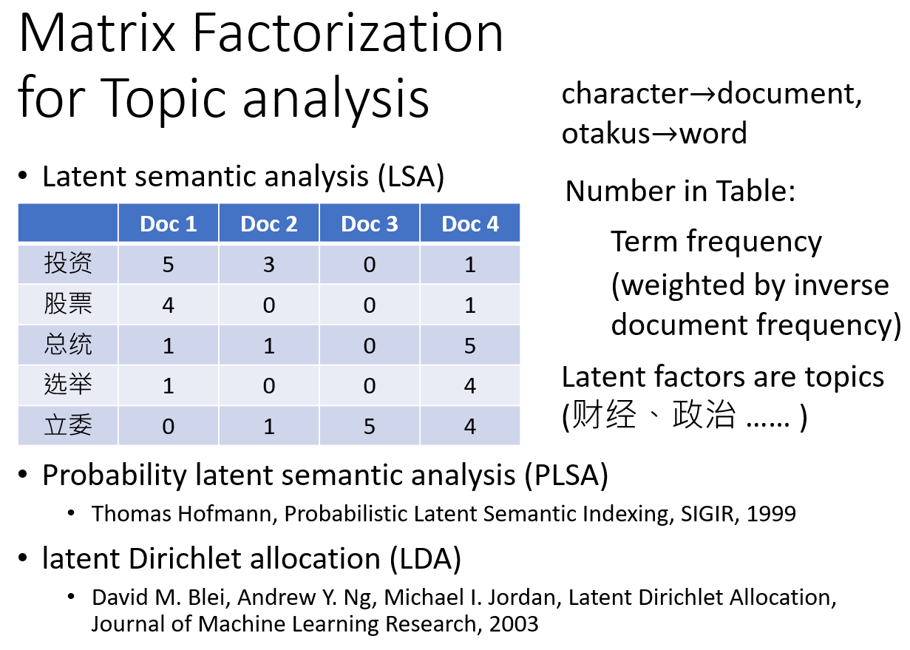

把刚才的动漫人物换成文章，把刚才的人换成词汇，table里面的值就是term frequency（词频），把这个term frequency乘上一个weight代表说这个term本身有多重要。

怎样evaluation一个term重不重要呢？常用的方式是：inverse document frequency（计算某一个词汇在整个paper有多少比率的document涵盖这个词汇，假如说，某一个词汇，每个document都有，那它的inverse document frequency就很小，代表着这个词汇的重要性是低的，假设某个词汇只有某一篇document有，那它的inverse document frequency就很大，代表这个词汇的重要性是高的。在各种文章中出现次数越多的词汇越不重要，出现次数越少则越重要。）

在这个task里面，如果你今天把这个matrix做分解的话，你就会找到每一个document背后那个latent factor，那这边的latent factor是什么呢？可能指的是topic（主题），这个topic有多少是跟财经有关的，有多少是跟政治有关的。document1跟document2有比较多的“投资，股票”这样的词汇，那document1跟document2的latent factor有比较高的可能性是比较偏向“财经”的

topic analysis的方法多如牛毛，基本的精神是差不多的(有很多各种各样的变化)。常见的是Probability latent semantic analysis (PLSA)和latent Dirichlet allocation (LDA)。注意这跟之前在machine learning讲的LDA是完全不一样的东西。

## Neighbor Embedding

> 介绍非线性降维的一些算法，包括局部线性嵌入LLE、拉普拉斯特征映射和t分布随机邻居嵌入t-SNE，其中t-SNE特别适用于可视化的应用场景

PCA和Word Embedding介绍了线性降维的思想，而Neighbor Embedding要介绍的是非线性的降维

### Manifold Learning

我们知道data point可能是在高维空间里面的一个manifold，也就是说：data point的分布其实是在低维的一个空间里，只是被扭曲地塞到高维空间里面。

讲到manifold ，常常举的例子是地球，地球的表面就是一个manifold（一个二维的平面，被塞到一个三维的空间里面）。

在manifold里面只有很近距离的点，欧氏距离Euclidean distance才会成立，如果距离很远的时候，欧式几何不一定成立。

所以manifold learning要做的事情是把S型的这块东西展开，把塞到高维空间的低维空间摊平。摊平的好处就是：把这个塞到高维空间里的manifold摊平以后，那我们就可以在这个manifold上面用Euclidean distance来算点和点之间的距离，描述样本点之间的相似程度，这会对接下来你要做supervised learning都是会有帮助的。

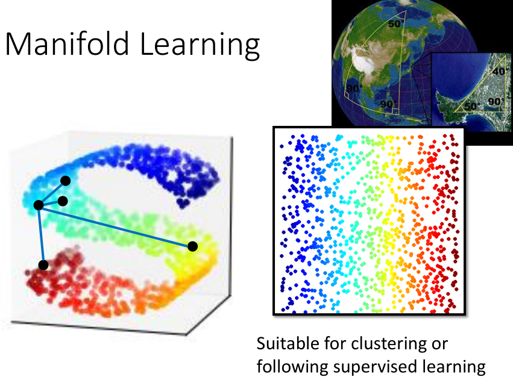

#### Locally Linear Embedding

局部线性嵌入，locally linear embedding，简称**LLE**

在原来的空间里面，有某一个点叫做$x^i$，我们先选出$x^i$的neighbor叫做$x^j$。接下来我们找$x^i$跟$x^j$之间的关系，它们之间的关系我们写作$w_{ij}$。

我们假设说：每一个$x^i$都是可以用它的neighbor做linear combination以后组合而成，这个$w_{ij}$是拿$x^j$组成$x^i$的时候，linear combination的weight。因此找点与点的关系$w_{ij}$这个问题就转换成，找一组使得所有样本点与周围点线性组合的差距能够最小的参数$w_{ij}$。那找这一组$w_{ij}$要如何做呢，我们现在找一组$w_{ij}$，$x^i$减掉summation over$w_{ij}$乘以$x^j$的L2-Norm越接近越好，然后summation over所以的data point i。
$$
\sum\limits_i||x^i-\sum\limits_j w_{ij}x^j ||_2
$$

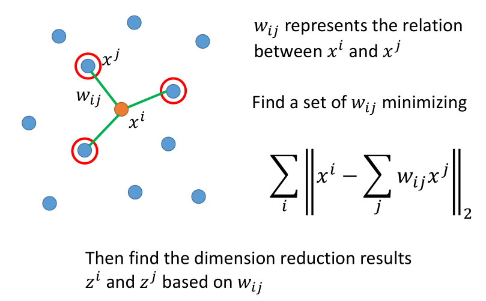

接下来就要做Dimension Reduction，把$x^i$和$x^j$降维到$z^i$和$z^j$，并且保持降维前后两个点之间的关系$w_{ij}$是不变的

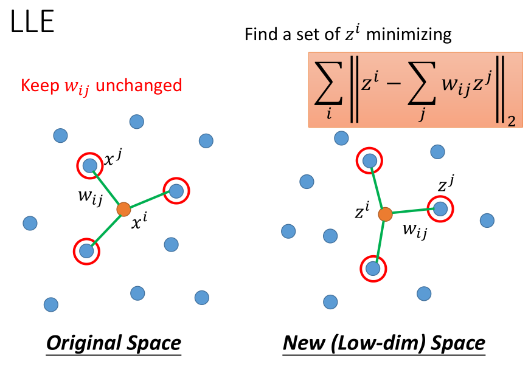

LLE的具体做法如下：

- 在原先的高维空间中找到$x^i$和$x^j$之间的关系$w_{ij}$以后就把它固定住

- 使$x^i$和$x^j$降维到新的低维空间上的$z^i$和$z^j$

- $z^i$和$z^j$需要minimize下面的式子：
  $$
  \sum\limits_i||z^i-\sum\limits_j w_{ij}z^j ||_2
  $$

- 即在原本的空间里，$x^i$可以由周围点通过参数$w_{ij}$进行线性组合得到，则要求在降维后的空间里，$z^i$也可以用同样的线性组合得到

实际上，LLE并没有给出明确的降维函数，它没有明确地告诉我们怎么从$x^i$降维到$z^i$，只是给出了降维前后的约束条件。它并没有一个明确的function告诉你说我们如何来做dimension reduction，不像我们在做auto encoding的时候，你learn出一个encoding的network，你input一个新的data point，然后你就得到dimension结果。在LLE里面，你并没有找一个明确的function告诉我们，怎么样从一个x变到z，z完全就是另外凭空找出来的。

在实际应用LLE的时候，LLE要好好的调neighbor，neighbor的数目要刚刚好，对$x^i$来说，需要选择合适的邻居点数目K才会得到好的结果

下图给出了原始paper中的实验结果，K太小或太大得到的结果都不太好。

为什么k太大，得出的结果也不好呢？因为我们之前的假设是Euclidean distance只是在很近的距离里面可以这样想，当k很大的时候，你会考虑很远的点，所以你不应该把它考虑进来，你的k要选一个适当的值。注意到在原先的空间里，只有距离很近的点之间的关系需要被保持住，如果K选的很大，就会选中一些由于空间扭曲才导致距离接近的点，而这些点的关系我们并不希望在降维后还能被保留。

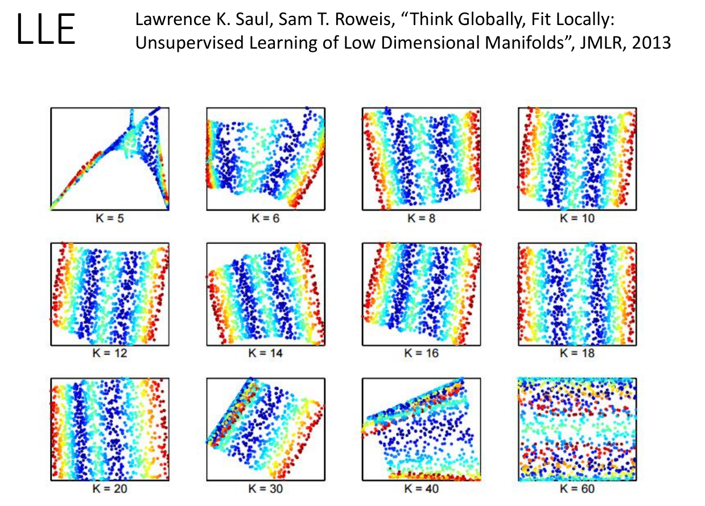

#### Laplacian Eigenmaps

##### Introduction

另一种方法叫拉普拉斯特征映射，Laplacian Eigenmaps

之前在semi-supervised learning有提到smoothness assumption，即我们仅知道两点之间的欧氏距离是不够的，还需要观察两个点在high density区域下的距离，如果两个点之间有high density connection，那它们才是真正的很接近。

我们依据某些规则把样本点建立graph，把比较近的点连起来，变成一个graph，那么smoothness的距离就可以被graph上面的connection来approximate

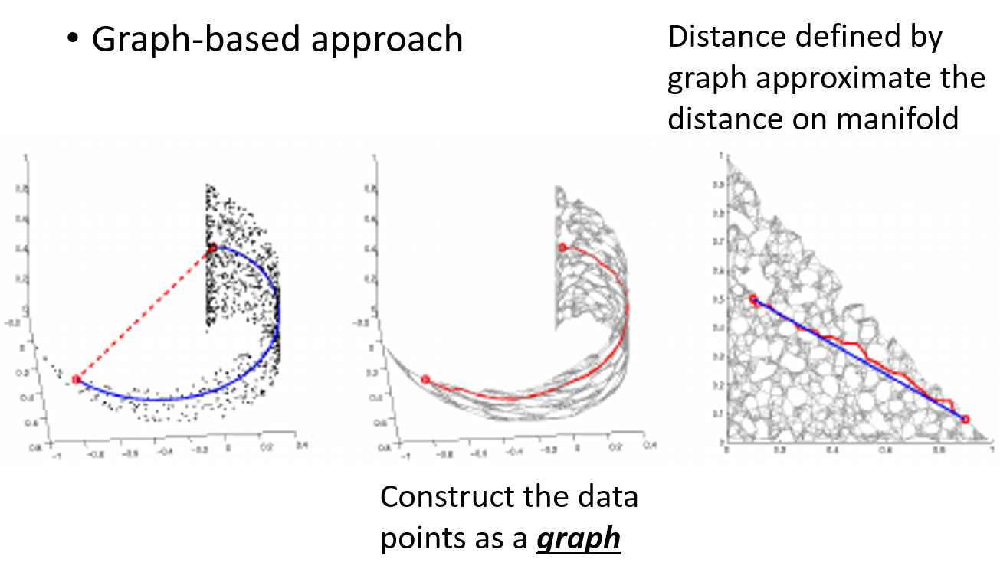

##### Review for Smoothness Assumption

简单回顾一下在semi-supervised里的说法：如果两个点$x^1$和$x^2$在高密度区域上是相近的，那它们的label $y^1$和$y^2$很有可能是一样的
$$
L=\sum\limits_{x^r} C(y^r,\hat y^r) + \lambda S\\
S=\frac{1}{2}\sum\limits_{i,j} w_{i,j}(y^i-y^j)^2=y^TLy
$$
其中$C(y^r,\hat y^r)$表示labeled data项，$\lambda S$表示unlabeled data项，它就像是一个regularization term，用于判断我们当前得到的label是否是smooth的

其中如果点$x^i$与$x^j$是相连的，则$w_{i,j}$等于相似度，否则为0，$S$的表达式希望在$x^i$与$x^j$很接近，相似度$w_{i,j}$很大的情况下，而label差距$|y^i-y^j|$越小越好，同时也是对label平滑度的一个衡量

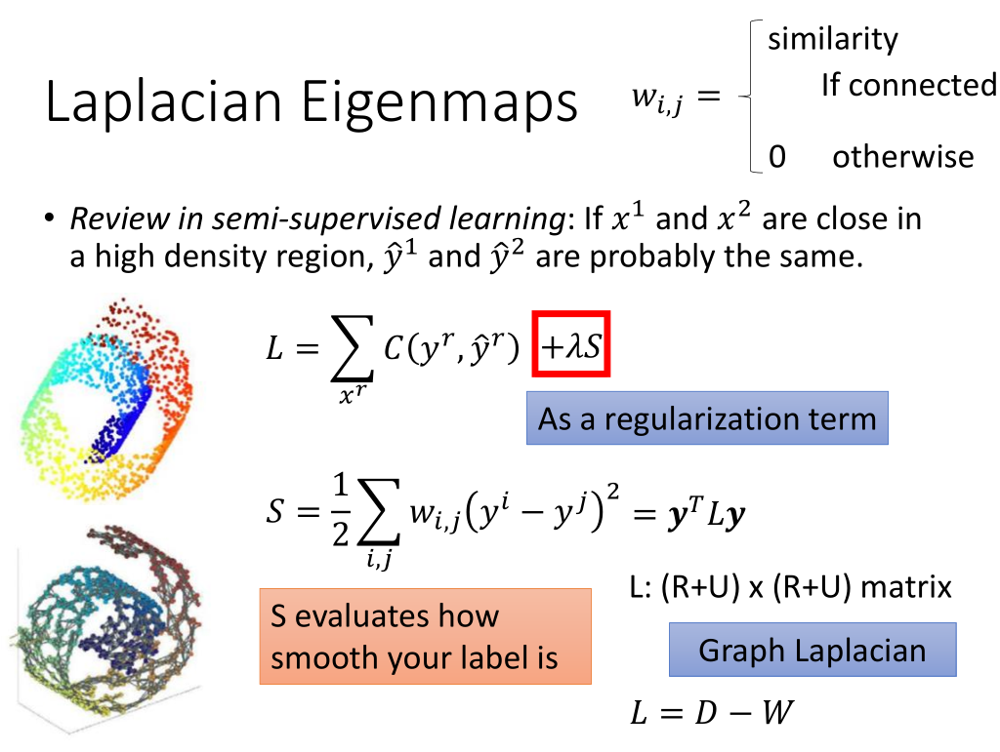

##### Application in Unsupervised Task

降维的基本原则：如果$x^i$和$x^j$在high density区域上是相近的，即相似度$w_{i,j}$很大，则降维后的$z^i$和$z^j$也需要很接近，总体来说就是让下面的式子尽可能小
$$
S=\sum\limits_{i,j} w_{i,j} ||z^i-z^j||_2
$$
这里的$w_{i,j}$表示$x^i$与$x^j$这两点的相似度

如果说$x^1,x^2$在high desity region 是close的，那我们就希望$z^1,z^2$也是相近的。如果$x^i,x^j$两个data point很像，那$z^i,z^j$做完dimension reduction以后距离就很近，反之$w_{i,j}$很小，距离要怎样都可以。

但光有上面这个式子是不够的，假如令所有的z相等，比如令$z^i=z^j=0$，那上式就会直接停止更新

在semi-supervised中，如果所有label $z^i$都设成一样，会使得supervised部分的$\sum\limits_{x^r} C(y^r,\hat y^r)$变得很大，因此lost就会很大，但在这里少了supervised的约束，因此我们需要给$z$一些额外的约束：

- 假设降维后$z$所处的空间为$M$维，则$\{z^1,z^2,...,z^N\}=R^M$，我们希望降维后的$z$占据整个$M$维的空间，而不希望它分布在一个比$M$更低维的空间里，
- 最终解出来的$z$其实就是Graph Laplacian $L$比较小的特征值所对应的特征向量

这也是Laplacian Eigenmaps名称的由来，我们找的$z$就是Laplacian matrix的特征向量

如果通过拉普拉斯特征映射找到$z$之后再对其利用K-means做聚类，就叫做谱聚类(spectral clustering)

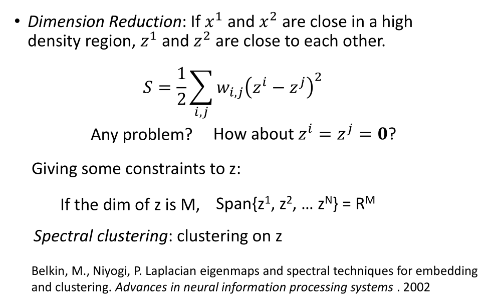

#### t-SNE

t-SNE，全称为T-distributed Stochastic Neighbor Embedding，t分布随机邻居嵌入

##### Shortage in LLE

前面的方法**只假设了相邻的点要接近，却没有假设不相近的点要分开**

所以在MNIST使用LLE会遇到下图的情形，它确实会把同一个class的点都聚集在一起，却没有办法避免不同class的点重叠在一个区域，这就会导致依旧无法区分不同class的现象

COIL-20数据集包含了同一张图片进行旋转之后的不同形态，对其使用LLE降维后得到的结果是，同一个圆圈代表同张图像旋转的不同姿态，但许多圆圈之间存在重叠

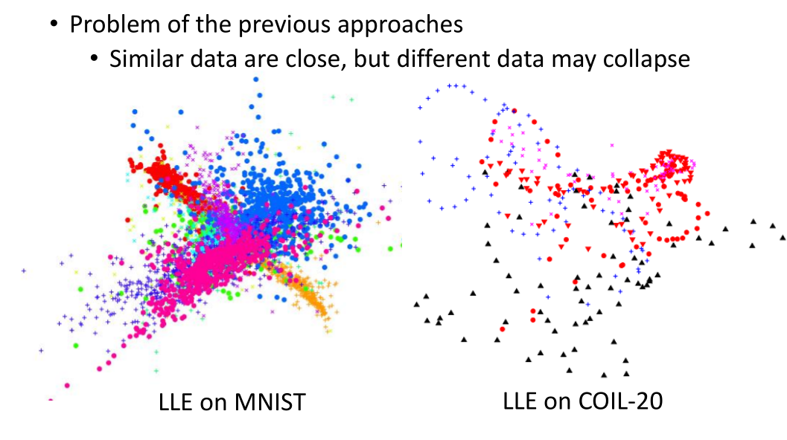

##### How t-SNE works

做t-SNE同样要降维，把原来的data point x变成low dimension vector z，在原来$x$的分布空间上，我们需要计算所有$x^i$与$x^j$之间的相似度$S(x^i,x^j)$

然后需要将其做归一化：$P(x^j|x^i)=\frac{S(x^i,x^j)}{\sum_{k\ne i}S(x^i,x^k)}$，即$x^j$与$x^i$的相似度占所有与$x^i$相关的相似度的比例

将$x$降维到$z$，同样可以计算相似度$S'(z^i,z^j)$，并做归一化：$Q(z^j|z^i)=\frac{S'(z^i,z^j)}{\sum_{k\ne i}S'(z^i,z^k)}$

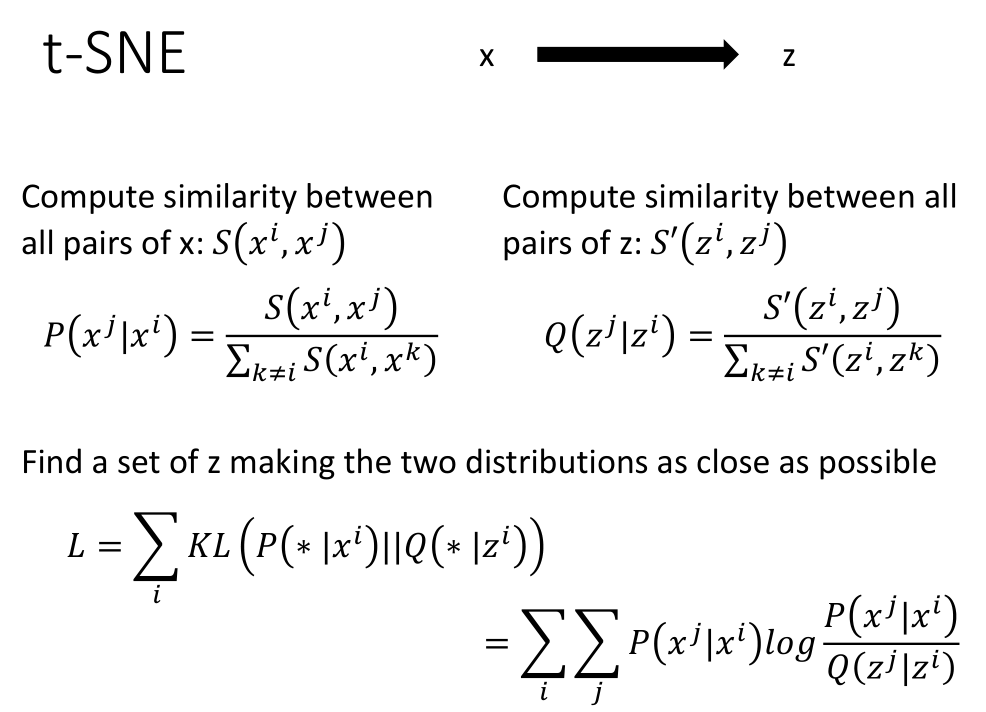

这里的归一化是有必要的，因为我们无法判断在$x$和$z$所在的空间里，$S(x^i,x^j)$与$S'(z^i,z^j)$的范围是否是一致的，需要将其映射到一个统一的概率区间。

我们希望找到的投影空间$z$，可以让$P(x^j|x^i)$和$Q(z^j|z^i)$的分布越接近越好

所以我们要做的事情就是找一组z，它可以做到，$x^i$对其他point的distribution跟$z^i$对其他point的distribution，这样的distribution之间的KL距离越小越好，然后summation over 所有的data point，使得这这个值$L$越小越好。

用于衡量两个分布之间相似度的方法就是**KL散度(KL divergence)**，我们的目标就是让$L$越小越好：
$$
L=\sum\limits_i KL(P(*|x^i)||Q(*|z^i))\\
=\sum\limits_i \sum\limits_jP(x^j|x^i)log \frac{P(x^j|x^i)}{Q(z^j|z^i)}
$$

##### KL Divergence

这里简单补充一下KL散度的基本知识

KL 散度，最早是从信息论里演化而来的，所以在介绍 KL 散度之前，我们要先介绍一下信息熵，信息熵的定义如下：
$$
H=-\sum\limits_{i=1}^N p(x_i)\cdot log\ p(x_i)
$$
其中$p(x_i)$表示事件$x_i$发生的概率，信息熵其实反映的就是要表示一个概率分布所需要的平均信息量

在信息熵的基础上，我们定义KL散度为：
$$
D_{KL}(p||q)=\sum\limits_{i=1}^N p(x_i)\cdot (log\ p(x_i)-log\ q(x_i))\\
=\sum\limits_{i=1}^N p(x_i)\cdot log\frac{p(x_i)}{q(x_i)}
$$
$D_{KL}(p||q)$表示的就是概率$q$与概率$p$之间的差异，很显然，KL散度越小，说明概率$q$与概率$p$之间越接近，那么预测的概率分布与真实的概率分布也就越接近

##### How to use

t-SNE会计算所有样本点之间的相似度，运算量会比较大，当在data point比较多的时候跑起来效率会比较低

常见的做法是对原先的空间用类似PCA的方法先做一次降维，然后用t-SNE对这个简单降维空间再做一次更深层次的降维，以期减少运算量。比如说：原来的dimension很大，不会直接从很高的dimension直接做t-SNE，因为这样计算similarity时间会很长，通常会先用PCA做将降维，降到50维，再用t-SNE降到2维，这个是比较常见的做法。

值得注意的是，t-SNE的式子无法对新的样本点进行处理，一旦出现新的$x^i$，就需要重新跑一遍该算法，所以**t-SNE通常不是用来训练模型的，它更适合用于做基于固定数据的可视化**。

t-SNE常用于将固定的高维数据可视化到二维平面上。你有一大堆的x是high dimension，你想要它在二维空间的分布是什么样子，你用t-SNE，t-SNE会给你往往不错的结果。

##### Similarity Measure

如果根据欧氏距离计算降维前的相似度，往往采用**RBF function**（Radial Basis Function ） $S(x^i,x^j)=e^{-||x^i-x^j||_2}$，这个表达式的好处是，只要两个样本点的欧氏距离稍微大一些，相似度就会下降得很快

在t-SNE之前，有一个方法叫做SNE：dimension reduction以后的space，它选择的measure跟原来的space是一样的$S'(z^i,z^j)=e^{-||z^i-z^j||_2}$。

对t-SNE来说，它在降维后的新空间所采取的相似度算法是与之前不同的，它选取了**t-distribution**中的一种，即$S'(z^i,z^j)=\frac{1}{1+||z^i-z^j||_2}$

以下图为例，假设横轴代表了在原先$x$空间上的欧氏距离$||x^i-x^j||_2$或者做降维之后在$z$空间上的欧氏距离$||z^i-z^j||_2$，红线代表RBF function，是降维前的分布；蓝线代表了t-distribution，是降维后的分布

你会发现，降维前后相似度从RBF function到t-distribution：

- 如果原先两个点距离($\Delta x$)比较近，则降维转换之后，如果要维持原先的相似度，它们的距离依旧是比较接近的
- 如果原先两个点距离($\Delta x$)比较远，则降维转换之后，如果要维持原先的相似度，它们的距离会被拉得更远

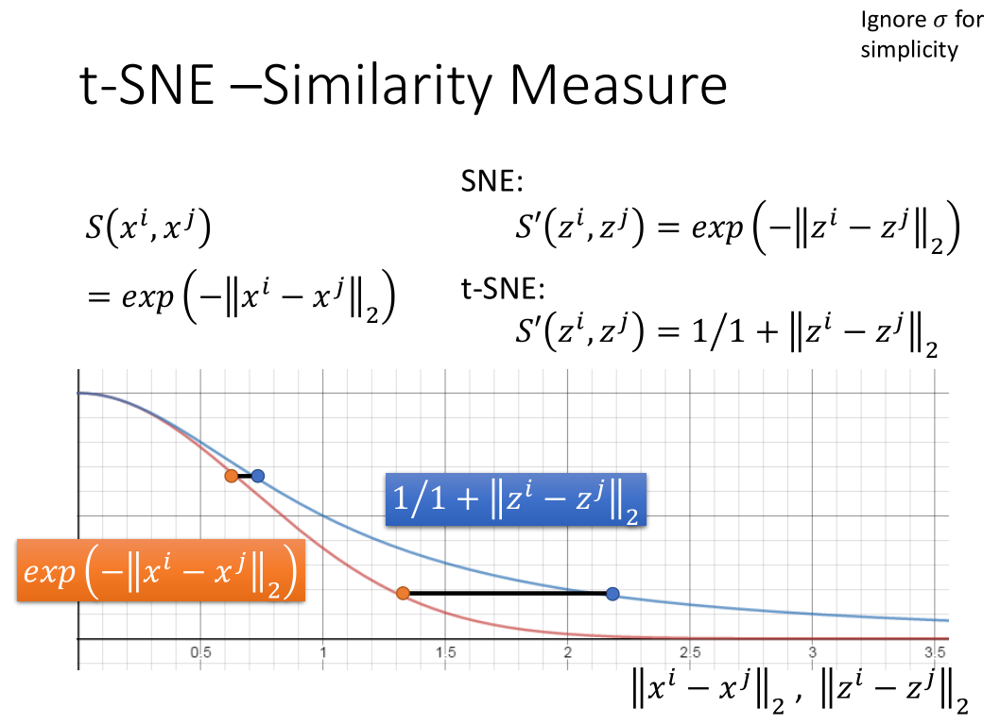

也就是说t-SNE可以聚集相似的样本点，同时还会放大不同类别之间的距离，从而使得不同类别之间的分界线非常明显，特别适用于可视化。

下图则是对MNIST和COIL-20先做PCA降维，再做t-SNE降维可视化的结果，t-SNE画出来的图往往长的这样，它会把你的data point 聚集成一群一群的，只要你的data point离的比较远，那做完t-SNE之后，就会强化，变得更远了。

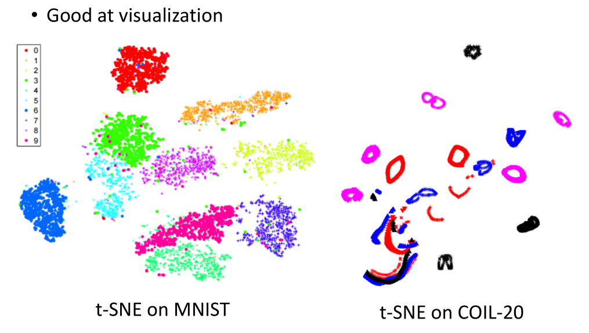

如图为t-SNE的动画。因为这是利用gradient descent 来train的，所以你会看到随着iteration process，点会被分的越来越开。

### Conclusion

小结一下，本文主要介绍了三种非线性降维的算法：

- LLE(Locally Linear Embedding)，局部线性嵌入算法，主要思想是降维前后，每个点与周围邻居的线性组合关系不变，$x^i=\sum\limits_j w_{ij}x^j$、$z^i=\sum\limits_j w_{ij}z^j$
- Laplacian Eigenmaps，拉普拉斯特征映射，主要思想是在high density的区域，如果$x^i$、$x^j$这两个点相似度$w_{i,j}$高，则投影后的距离$||z^i-z^j||_2$要小
- t-SNE(t-distribution Stochastic Neighbor Embedding)，t分布随机邻居嵌入，主要思想是，通过降维前后计算相似度由RBF function转换为t-distribution，在聚集相似点的同时，拉开不相似点的距离，比较适合用在数据固定的可视化领域

## Deep Auto-encoder

> 文本介绍了自编码器的基本思想，与PCA的联系，从单层编码到多层的变化，在文字搜索和图像搜索上的应用，预训练DNN的基本过程，利用CNN实现自编码器的过程，加噪声的自编码器，利用解码器生成图像等内容

自动编码器的想法是这样子的：我们先去找一个encoder，这个encoder input一个东西(假如说，我们来做NMIST的话，就是input一张digit，它是784维的vector)，这个encoder可能就是一个neural network，它的output就是code(这个code远比784维要小的，类似压缩的效果)，这个coder代表了原来input一张image compact representation。

但是现在问题是：我们现在做的是Unsupervised learning，你可以找到一大堆的image当做这个NN encoder的input，但是我们不知道任何的output。你要learn 一个network，只有一个input，你没有办法learn它。那没有关系，我们要做另外一件事情：想要learn 一个decoder，decoder做的事情就是：input一个vector，它就通过这个NN decoder，它的output就是一张image。但是你也没有办法train一个NN decoder，因为你只要output，没有input。

这两个network，encoder decoder单独你是没有办法去train它。但是我们可以把它接起来，然后一起train。也就是说： 接一个neural network ，input一张image，中间变成code，再把code变成原来的image。这样你就可以把encoder跟decoder一起学，那你就可以同时学出来了。

Auto-encoder本质上就是一个自我压缩和解压的过程，我们想要获取压缩后的code，它代表了对原始数据的某种紧凑精简的有效表达，即降维结果，这个过程中我们需要：

- Encoder(编码器)，它可以把原先的图像压缩成更低维度的向量
- Decoder(解码器)，它可以把压缩后的向量还原成图像

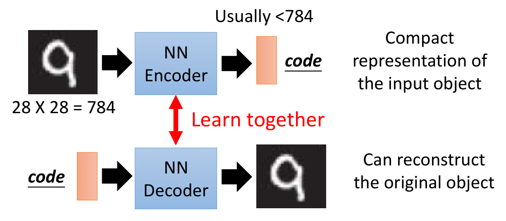

Encoder和Decoder单独拿出一个都无法进行训练，我们需要把它们连接起来，这样整个神经网络的输入和输出都是我们已有的图像数据，就可以同时对Encoder和Decoder进行训练，而降维后的编码结果就可以从最中间的那层hidden layer中获取

### Compare with PCA

那我们刚才在PCA里面看过非常类似的概念，我们讲过：PCA其实在做的事情是：input一张image x（在刚才的例子里面，我们会让$x-\bar{x}$当做input，这边我们把减掉$\bar{x}$省略掉，省略掉并不会太奇怪，因为通常在做NN的时候，你拿到的data其实会normlize，其实你的data mean是为0，所以就不用再去减掉mean），把x乘以一个weight，通过NN一个layer得到component weight $c$，$c$乘以matrix $w$的transpose得到$\hat {x}$。$\hat{x}$是根据这些component的reconstruction的结果。

实际上PCA用到的思想与Auto-encoder非常类似，**PCA的过程本质上就是按组件拆分，再按组件重构的过程**

在PCA中，我们先把均一化后的$x$根据组件$W$分解到更低维度的$c$，然后再将组件权重$c$乘上组件的转置$W^T$得到重组后的$\hat x$，同样我们期望重构后的$\hat x$与原始的$x$越接近越好

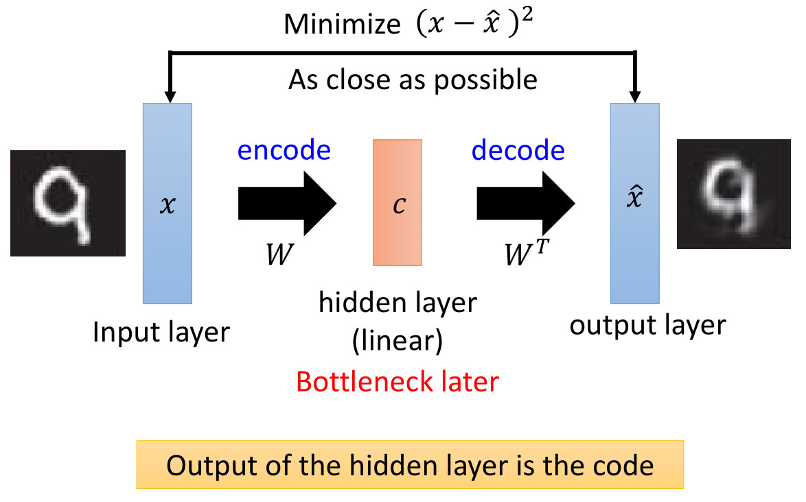

如果把这个过程看作是神经网络，那么原始的$x$就是input layer，重构$\hat x$就是output layer，中间组件分解权重$c$就是hidden layer，在PCA中它是linear的，我们通常又叫它瓶颈层(Bottleneck layer)。你可以用gradient descent来解PCA。

hidden layer的output就是我们要找的那些code。由于经过组件分解降维后的$c$，维数要远比输入输出层来得低，因此hidden layer实际上非常窄，因而有瓶颈层的称呼。

对比于Auto-encoder，从input layer到hidden layer的按组件分解实际上就是编码(encode)过程，从hidden layer到output layer按组件重构实际上就是解码(decode)的过程。

这时候你可能会想，可不可以用更多层hidden layer呢？答案是肯定的

### Deep Auto-encoder

#### Multi Layer

对deep的自编码器来说，实际上就是通过多级编码降维，再经过多级解码还原的过程

此时：

- 从input layer $x$到bottleneck layer的部分都属于$Encoder$
- 从bottleneck layer到output layer $\hat{x}$的部分都属于$Decoder$
- bottleneck layer的output就是自编码结果$code$

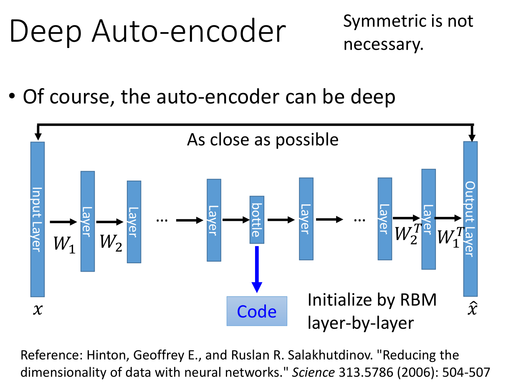

注意到，如果按照PCA的思路，则Encoder的参数$W_i$需要和Decoder的参数$W_i^T$保持一致的对应关系，这样做的好处是，可以节省一半的参数，降低overfitting的概率

但这件事情并不是必要的，实际操作的时候，你完全可以对神经网络用Backpropagation直接train下去，而不用保持编码器和解码器的参数一致

#### Visualize

下图给出了Hinton分别采用PCA和Deep Auto-encoder对手写数字进行编码解码后的结果。

original image做PCA，从784维降到30维，然后从30维reconstruction回784维，得到的image差不多，可以看出它是比较模糊的。

如果是用deep encoder的话，784维先扩为1000维，再不断下降，下降到30维（你很难说为什么它会设计成这样子），然后再把它解回来。你会发现，如果用的是deep Auto-encoder的话，它的结果看起来非常的好。

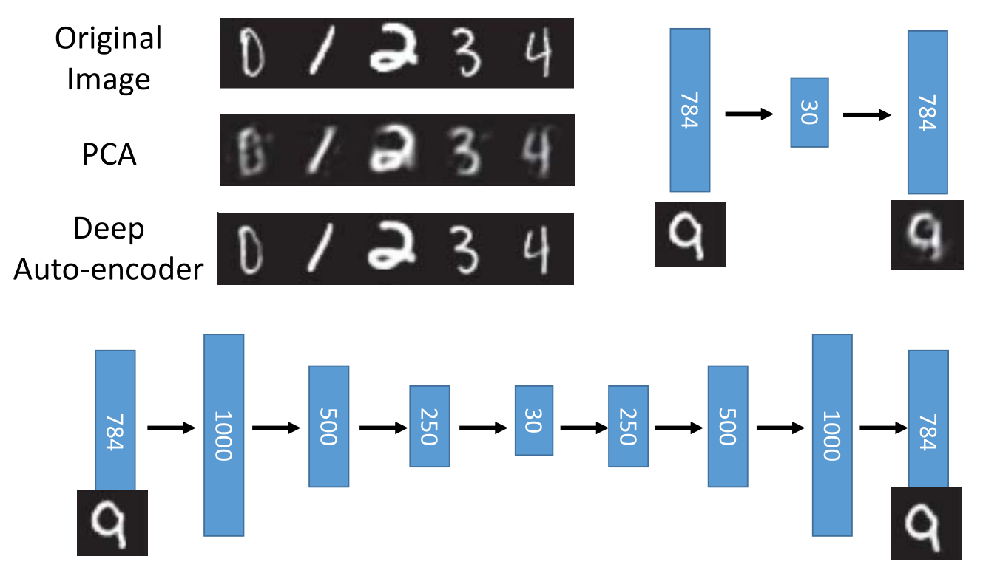

如果将其降到2维平面做可视化，不同颜色代表不同的数字，可以看到

- 通过PCA降维得到的编码结果中，不同颜色代表的数字被混杂在一起
- 通过Deep Auto-encoder降维得到的编码结果中，不同颜色代表的数字被分散成一群一群的

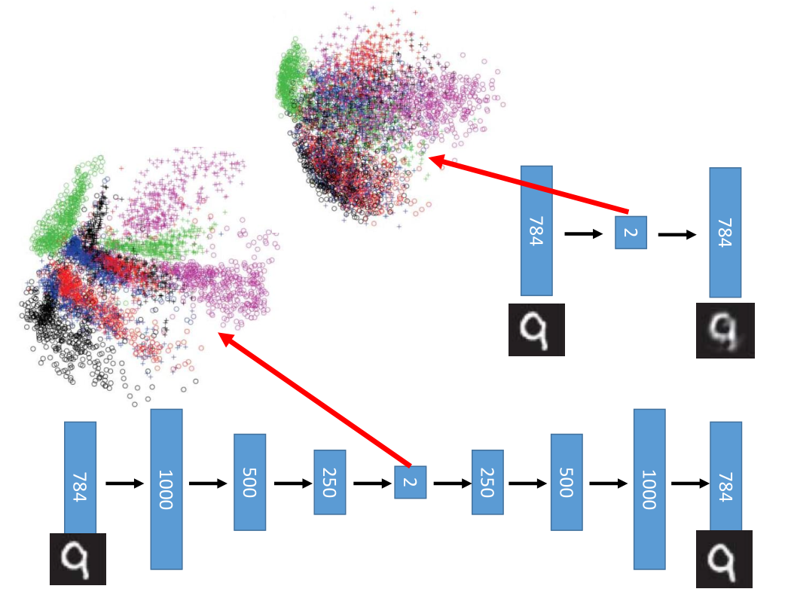

### Text Retrieval

Auto-encoder也可以用在文字处理上，比如说：我们把一篇文章压成一个code。

比如我们要做文字检索，很简单的一个做法是Vector Space Model，把每一篇文章都表示成空间中的一个vector

假设查询者输入了某个词汇，那我们就把该查询词汇也变成空间中的一个点，并计算query和每一篇document之间的内积(inner product)或余弦相似度(cos-similarity)

注：余弦相似度有均一化的效果，可能会得到更好的结果

下图中跟query向量最接近的几个向量的cosine-similarity是最大的，于是可以从这几篇文章中去检索

实际上这个模型的好坏，就取决于从document转化而来的vector的好坏，它是否能够充分表达文章信息

#### Bag-of-word

把一个document表示成一个vector，最简单的表示方法是Bag-of-word，维数等于所有词汇的总数，某一维等于1则表示该词汇在这篇文章中出现，此外还可以根据词汇的重要性将其加权；但这个模型是非常weak的，它没有考虑任何Semantics相关的东西，对它来说每个词汇都是相互独立的。

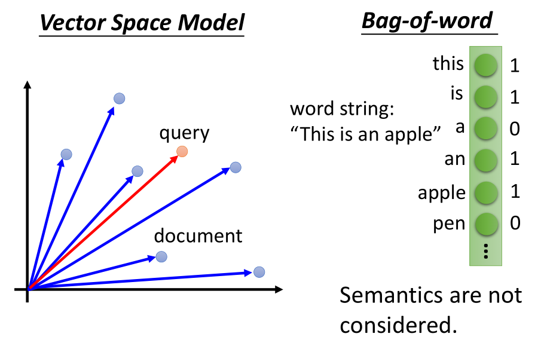

#### Auto-encoder

我们可以把它作为Auto-encoder的input，通过降维来抽取有效信息，以获取所需的vector

同样为了可视化，这里将Bag-of-word降维到二维平面上，下图中每个点都代表一篇文章，不同颜色则代表不同的文章类型

我们可以用Auto-encoder让语义被考虑进来 ，举例来说，你learn一个Auto-encoder，它的input就是一个document 或一个query，通过encoder把它压成二维。

每一个点代表一个document，不同颜色代表document属于哪一类。今天要做搜寻的时候，今天输入一个词汇，那你就把那个query也通过这个encoder把它变为一个二维的vector。假设query落在某一类，你就可以知道这个query与哪一类有关，就把document retrieve出来。

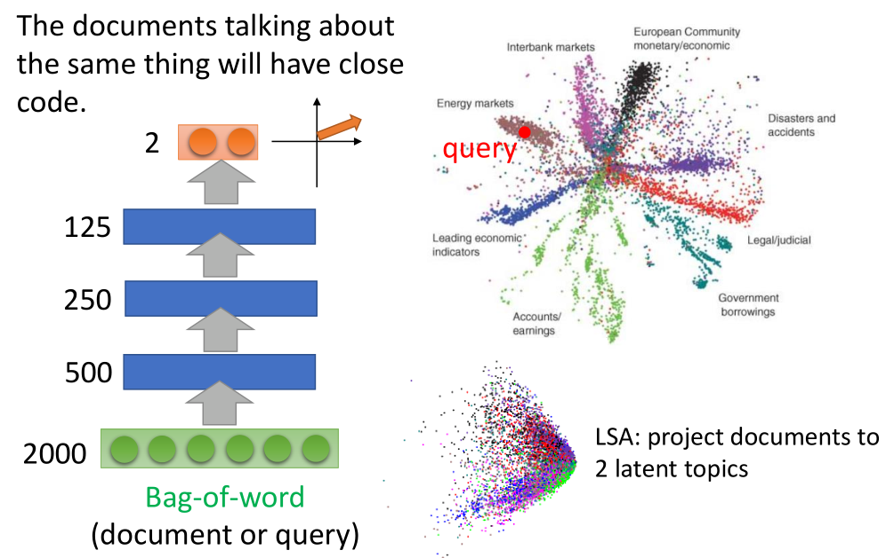

在矩阵分解(Matrix Factorization)中，我们介绍了LSA算法，它可以用来寻找每个词汇和每篇文章背后的隐藏关系(vector)，在这里我们采用LSA，并使用二维latent vector来表示每篇文章。

Auto-encoder的结果是相当惊人的。则如果用LSA的话，得不到类似的结果。

### Similar Image Search

Auto-encoder同样可以被用在图像检索上

image search最简单的做法就是直接对image query与database中的图片计算pixel的相似度，并挑出最像的图片，但这种方法的效果是不好的，因为单纯的pixel所能够表达的信息太少了。

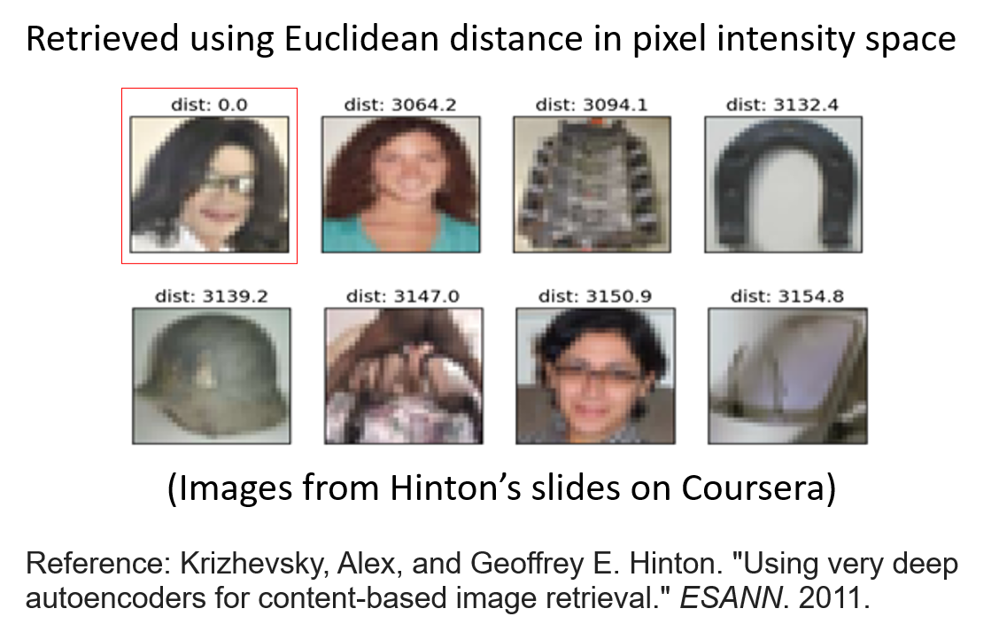

我们需要使用Auto-encoder对图像进行降维和特征提取，把每一张image变成一个code，然后再code上面去做搜寻，在编码得到的code所在空间做检索。

learn一个Auto-encoder是unsupervised，所以你要多少data都行（supervised是很缺data的，unsupervised是不缺data的）

input一张32*32的image，每一个pixel用RGB来表示(32 * 32 *3)，变成8192维，然后dimension reduction变成4096维，最后一直变为256维，你用256维的vector来描述这个image。然后你把这个code再通过另外一个decoder（形状反过来，变成原来的image），它的reconstruction是右上角如图。

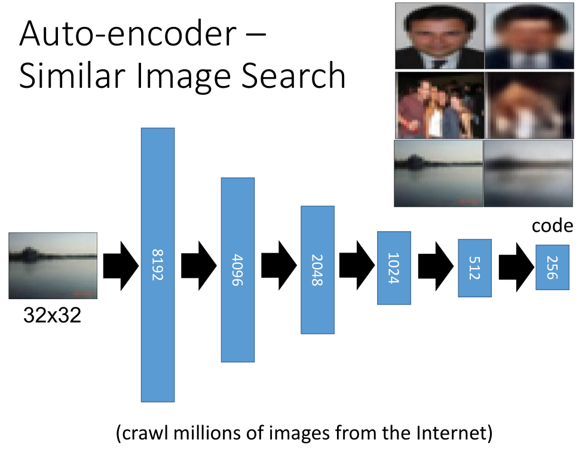

这么做的好处如下：

- Auto-encoder可以通过降维提取出一张图像中最有用的特征信息，包括pixel与pixel之间的关系
- 降维之后数据的size变小了，这意味着模型所需的参数也变少了，同样的数据量对参数更少的模型来说，可以训练出更精确的结果，一定程度上避免了过拟合的发生
- Auto-encoder是一个无监督学习的方法，数据不需要人工打上标签，这意味着我们只需简单处理就可以获得大量的可用数据

如果你不是在pixel上算相似度，是在code上算相似度的话，你就会得到比较好的结果。举例来说：你是用Jackson当做image的话，你找到的都是人脸，相比之前的结果进步了一些。可能这个image在pixel label上面看起来是不像的，但是你通过很多的hidden layer把它转成code的时候，在那个256维的空间上看起来是像的，可能在投影空间中某一维就代表了人脸的特征，因此能够被检索出来。

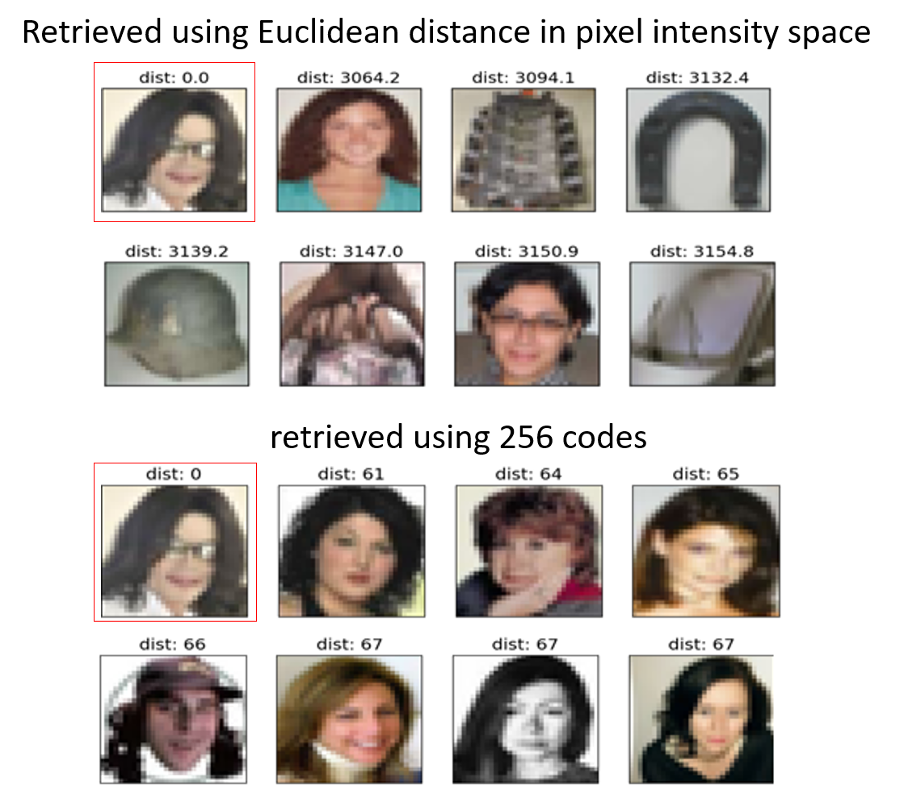

### Pre-training

在训练神经网络的时候，我们一般都会对如何做参数的initialization比较困扰，预训练(pre-training)是一种寻找比较好的参数initialization的方法，而我们可以用Auto-encoder来做pre-training

以MNIST数据集为例，我们使用的neural network input 784维，第一个hidden layer是1000维，第二个hidden layer是1000维，第三个hidden layer是500维，然后到10维。

我们对每层hidden layer都做一次auto-encoder，**使每一层都能够提取到上一层最佳的特征向量**

#### Greedy Layer-wise Pre-training

那我做Pre-taining的时候，我先train一个Auto-encoder，这个Auto-encoder input784维，中间有1000维的vector，然后把它变回784维，我期望input 跟output越接近越好。

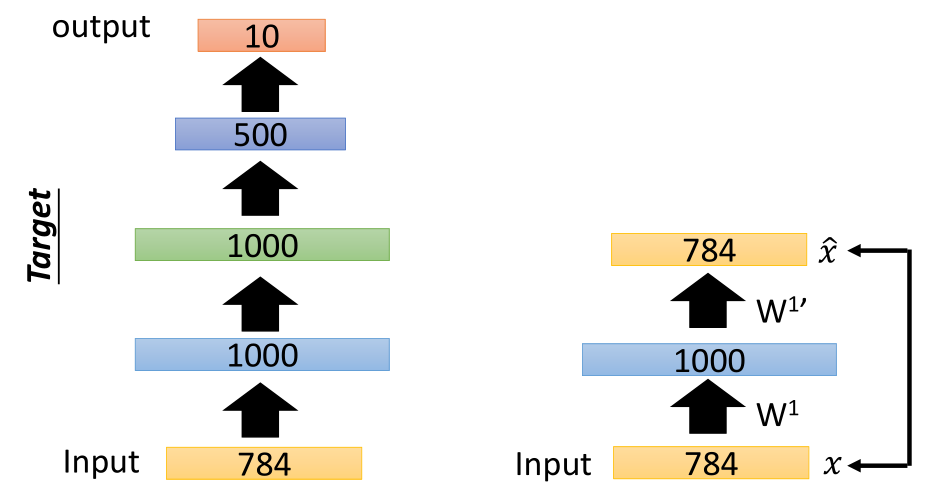

在做这件事的时候，你要稍微小心一点，我们一般做Auto-encoder的时候，你会希望你的coder要比dimension还要小。比dimension还要大的话，你会遇到的问题是：它突然就不learn了，把784维直接放进去，得到一个接近identity的matrix。

所以你今天发现你的hidden layer比你的input还要大的时候，你要加一个很强的regularization在1000维上，你可以对这1000维的output做L1的regularization，可以希望说：这1000维的output里面，只有某几维是可以有值的，其他维要必须为0。这样你就可以避免Auto-encoder直接把input背起来再输出的问题。总之你今天的code比你input还要大，你要注意这种问题。

- 首先使input通过一个如上图的Auto-encoder，input784维，code1000维，output784维，learn参数，当该自编码器训练稳定后（它会希望input跟output越接近越好），就把参数$W^1$fix住。然后将数据集中所有784维的图像都转化为1000维的vector

- 接下来再让这些1000维的vector通过另外一个Auto-encoder，input1000维，code1000维，output1000维learn参数，当其训练稳定后，再把参数$W^2$固定住，对数据集再做一次转换

  
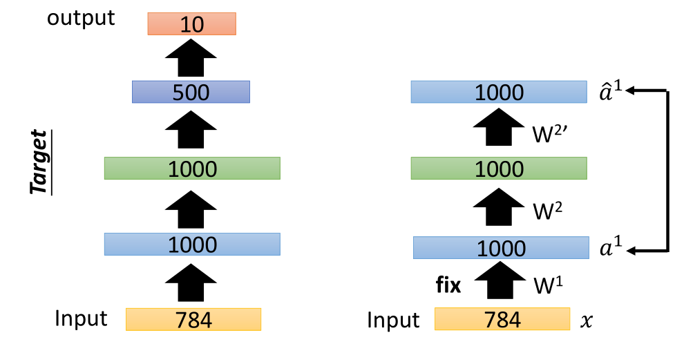

- 接下来再用转换后的数据集去训练第三个Auto-encoder，input1000维，code500维，output1000维，训练稳定后固定$W^3$，数据集再次更新转化为500维

  
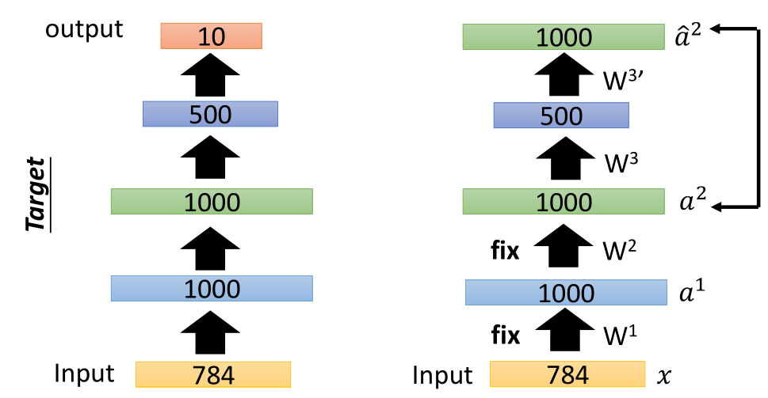

- 此时三个隐藏层的参数$W^1$、$W^2$、$W^3$就是训练整个神经网络时的参数初始值

- 然后random initialization最后一个隐藏层到输出层之间的参数$W^4$

- 再用backpropagation去调整一遍参数，因为$W^1$、$W^2$、$W^3$都已经是很好的weight了，这里只是做微调，因此这个步骤称为**Find-tune**

  
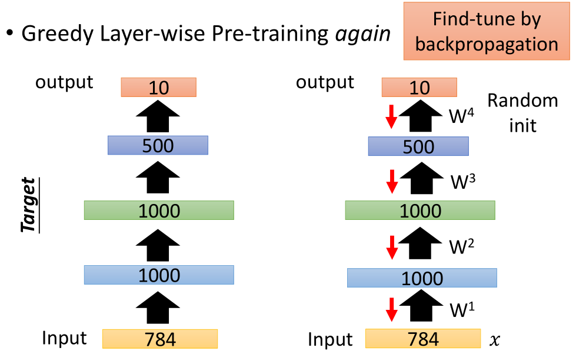

pre-training在过去learn一个deep neural network还是很需要的，不过现在neural network不需要pre-training往往都能train的起来。由于现在训练机器的条件比以往更好，因此pre-training并不是必要的，但它也有自己的优势。

如果你今天有很多的unlabeled data，少量的labeled data，你可以用大量的unlabeled data先去把$W^1$、$W^2$、$W^3$learn 好，最后再用labeled data去微调$W^1$~$W^4$即可。所以pre-training在大量的unlabeled data时还是有用的。

### De-noising Auto-encoder

去噪自编码器的基本思想是，把输入的$x$加上一些噪声(noise)变成$x'$，再对$x'$依次做编码(encode)和解码(decode)，得到还原后的$y$

值得注意的是，一般的自编码器都是让输入输出尽可能接近，但在去噪自编码器中，我们的目标是让解码后的$y$与加噪声之前的$x$越接近越好

这种方法可以增加系统的鲁棒性，因为此时的编码器Encoder不仅仅是在学习如何做编码，它还学习到了如何过滤掉噪声这件事情

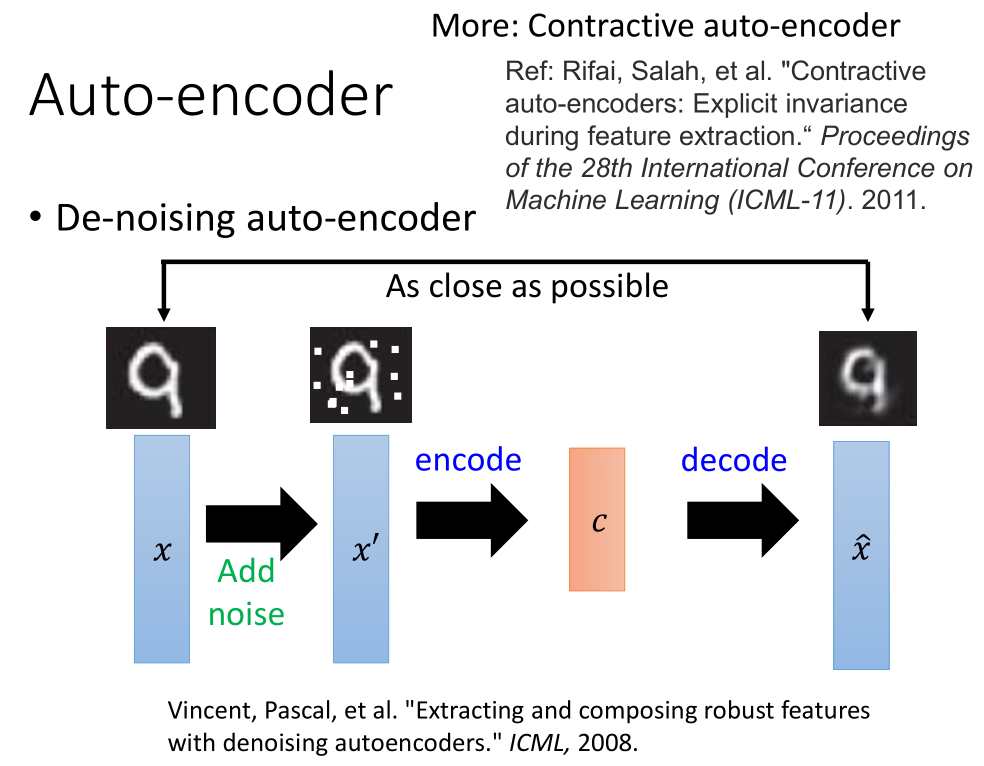

### Contractive Auto-encoder

收缩自动编码器的基本思想是，在做encode编码的时候，要加上一个约束，它可以使得：当input有变化的时候，对code的影响是被minimize的。

这个描述跟去噪自编码器很像，只不过去噪自编码器的重点在于加了噪声之后依旧可以还原回原先的输入，而收缩自动编码器的重点在于加了噪声之后能够保持编码结果不变。

### Restricted Boltzmann Machine

还有很多non-linear 的 dimension reduction的方法，比如Restricted Boltzmann Machine，它不是NN

### Deep Belief Network

和RBM一样，只是看起来比较像NN，但是并不是NN

### Auto-encoder for CNN

处理图像通常都会用卷积神经网络CNN，它的基本思想是交替使用卷积层和池化层，让图像越来越小，最终展平，这个过程跟Encoder编码的过程其实是类似的。

理论上要实现自编码器，Decoder只需要做跟Encoder相反的事即可，那对CNN来说，解码的过程也就变成了交替使用去卷积层和去池化层即可

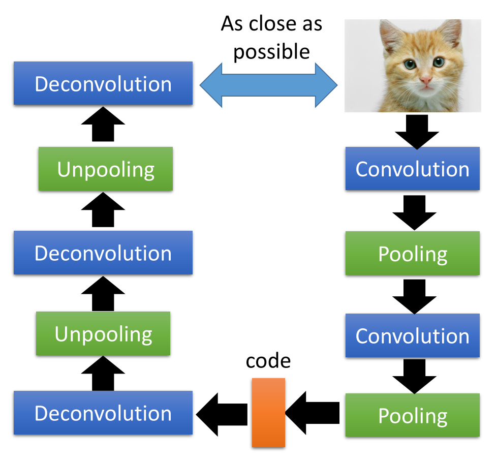

那什么是去卷积层(Deconvolution)和去池化层(Unpooling)呢？

#### Unpooling

做pooling的时候，假如得到一个4×4的matrix，就把每4个pixel分为一组，从每组中挑一个最大的留下，此时图像就变成了原来的四分之一大小

如果还要做Unpooling，就需要提前记录pooling所挑选的pixel在原图中的位置，下图中用灰色方框标注

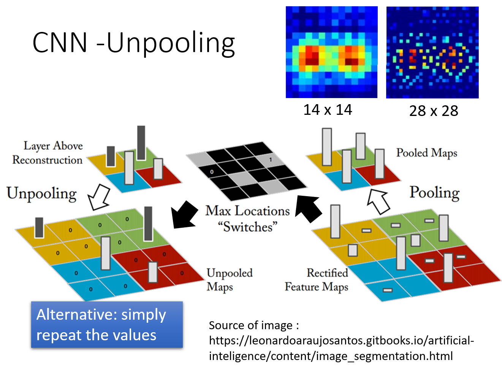

然后做Unpooling，就要把当前的matrix放大到原来的四倍，也就是把2×2 matrix里的pixel按照原先记录的位置插入放大后的4×4 matrix中，其余项补0即可。

做完unpooling以后，比较小的image会变得比较大，比如说：原来是14 * 14的image会变成28 *28的image。你会发现说：它就是把原来的14 *14的image做一下扩散，在有些地方补0。

当然这不是唯一的做法，在Keras中，pooling并没有记录原先的位置，做Unpooling的时候就是直接把pixel的值复制四份填充到扩大后的matrix里即可

#### Deconvolution

实际上，Deconvolution就是convolution

这里以一维的卷积为例，假设输入是5维，过滤器(filter)的大小是3

卷积的过程就是每三个相邻的点通过过滤器生成一个新的点，如下图左侧所示

在你的想象中，去卷积的过程应该是每个点都生成三个点，不同的点对生成同一个点的贡献值相加；但实际上，这个过程就相当于在周围补0之后再次做卷积，如下图右侧所示，两个过程是等价的

卷积和去卷积的过程中，不同点在于，去卷积需要补零且过滤器的weight与卷积是相反的：

- 在卷积过程中，依次是橙线、蓝线、绿线weight
- 在去卷积过程中，依次是绿线、蓝线、橙线weight

因此在实践中，做Deconvolution的时候直接对模型加卷积层即可

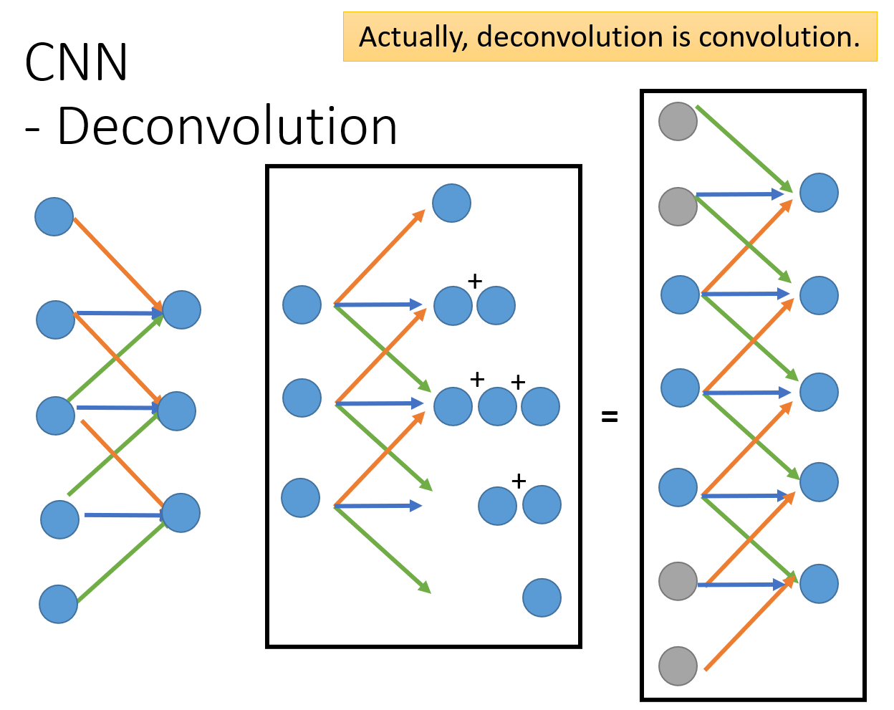

### Seq2Seq Auto-encoder

在之前介绍的自编码器中，输入都是一个固定长度的vector，但类似文章、语音等信息实际上不应该单纯被表示为vector，那会丢失很多前后联系的信息。比如说语音（一段声音讯号有长有短），文章（你可能用bag-of-word变成一个vector，但是你会失去词汇和词汇之间的前后关系，是不好的）

Seq2Seq就是为了解决这个问题提出的，具体内容在RNN部分已经介绍

### Generate

在用自编码器的时候，通常是获取Encoder之后的code作为降维结果，但实际上Decoder也是有作用的，我们可以拿它来生成新的东西

以MNIST为例，训练好Encoder之后，取出其中的Decoder，输入一个随机的code，就可以生成一张图像。

把每一张28×28维的image，通过hidden layer，把它project到2维，2维再通过一个hidden layer解回原来的image。在Encoder的部分，2维的vector画出来如下图左，不同颜色的点代表不同的数字。

然后在红色方框中，等间隔的挑选2维向量丢进Decoder中，就会生成许多数字的图像。这些2维的vector，它不见得是某个原来的image就是对应的vector。我们发现在红框内，等距离的做sample，得到的结果如下图右。在没有image对应的位置，画出的图像怪怪的。

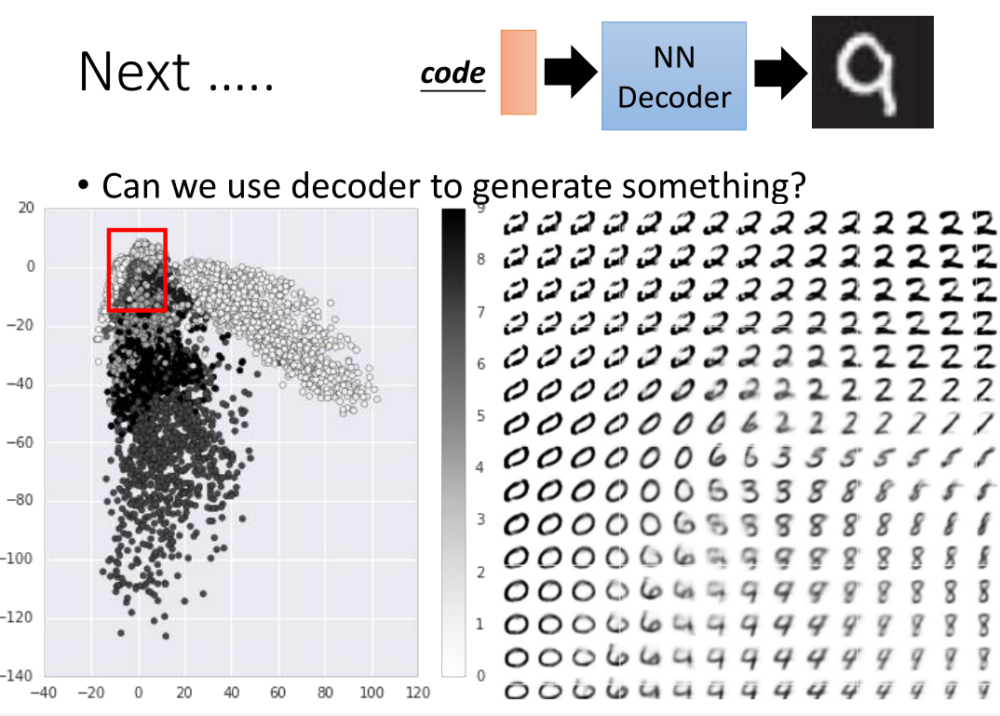

此外，我们还可以对code加L2 regularization，以限制code分布的范围集中在0附近，此时就可以直接以0为中心去随机采取样本点，再通过Decoder生成图像。

观察生成的数字图像，可以发现这两个dimension是有意义的，横轴的维度表示是否含有圆圈，纵轴的维度表示是否倾斜。

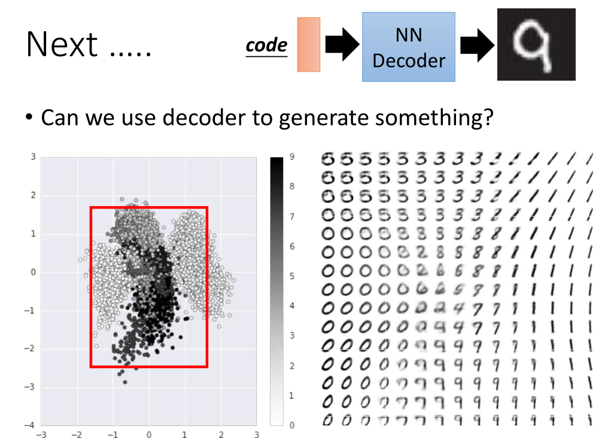

## More About Auto-encoder

Auto-encoder主要包含一个编码器（Encoder）和一个解码器（Decoder），通常它们使用的都是神经网络。Encoder接收一张图像（或是其他类型的数据，这里以图像为例）输出一个vector，它也可称为Embedding、Latent Representation或Latent code，它是关于输入图像的表示；然后将vector输入到Decoder中就可以得到重建后的图像，希望它和输入图像越接近越好，即最小化重建误差（reconstruction error），误差项通常使用的平方误差。

### More than minimizing reconstruction error

#### What is good embedding?

**An embedding should represent the object.**

最直观的想法是它应该包含了关于输入的**关键信息**，从中我们就可以大致知道输入是什么样的。

#### Beyond Reconstruction

除了使用重建误差来驱动模型训练外，可以使用其他的方式来衡量Encoder是否学到了关于输入的重要表征吗？

假设我们现在有两类动漫人物的图像，一类是三九，一类是凉宫春日。如果将三九的图像丢给Encoder后，它就会给出一个蓝色的Embedding；如果Encoder接收的是凉宫春日的图像，它就会给出一个黄色的Embedding。那么除了Encoder之外，还有一个Discriminator（可以看作Binary Classifier），它接收图像和Embedding，然后给出一个结果表示它们是否是两两对应的。

如果是三九和蓝色的Embedding、凉宫春日和黄色的Embedding，那么Discriminator给出的就是YES；如果它们彼此交换一下，Discriminator给出的就应该是NO。

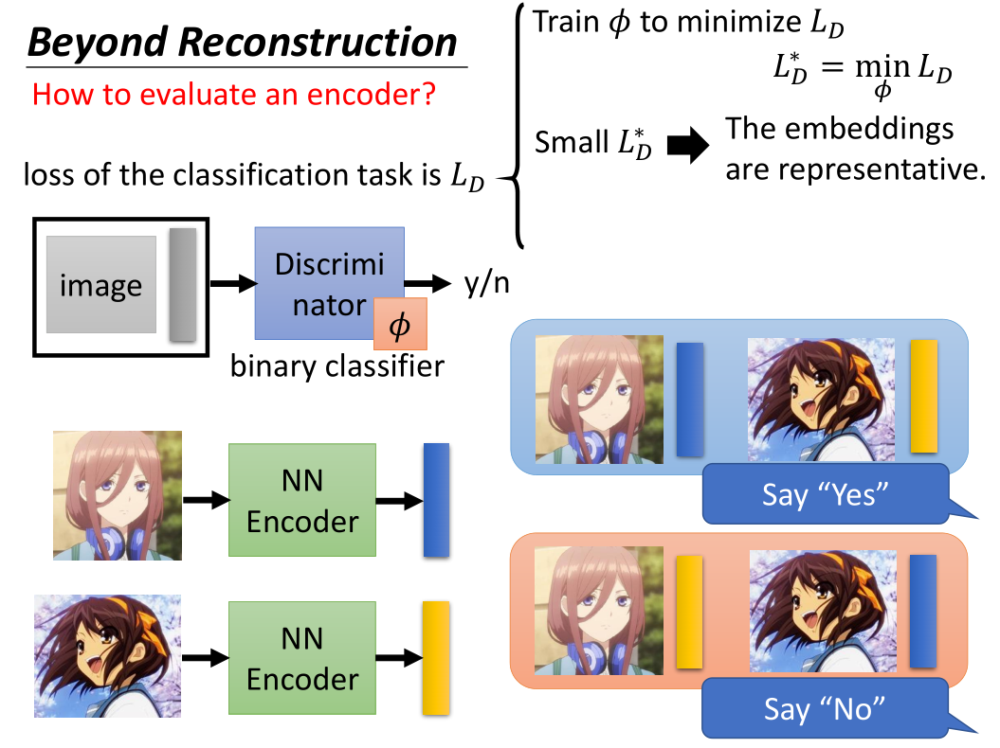

借助GAN的思想，我们用$\phi$来表述Discriminator，希望通过训练最小化D的损失函数 $L_{D}^{*}={arg}\ \underset{\phi}{min} L_{D}$，得到最小的损失值$L_{D}^*$。如果 $L_{D}^{*}$的值比较小，就认为Encoder得到的Embedding很有代表性；相反 $L_{D}^{*}$的值很大时，就认为得到的Embedding不具有代表性。

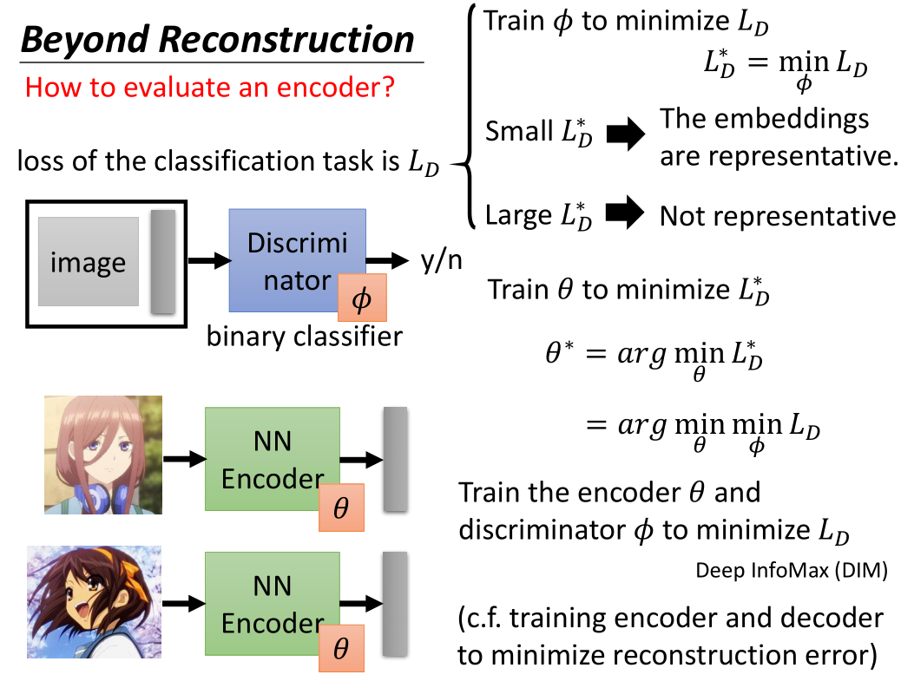

如果用$\theta$表示Encoder，Train the encoder 𝜃 and discriminator 𝜙 to minimize $L_{D}$，即$\theta^*= {arg}\ \underset{\theta}{min} \underset{\phi}{min} L_{D}$ ，这样的方法也称为Deep InfoMax(DIM)。这个和training encoder and decoder to minimize reconstruction error的思想其实是差不多的。

Typical auto-encoder is a special case。Discriminator接收一个图像和vector的组合，然后给出一个判断它们是否是配对的分数。在Discriminator的内部先使用Decoder来解码vector生成一个重建的图像，然后和输入图像相减，得到score。只不过这种情况下不考虑negative，只判断有多相似。

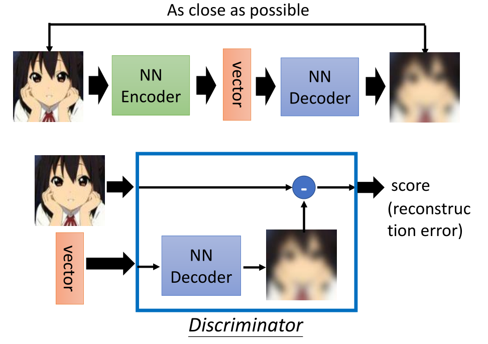

#### Sequential Data

##### Skip thought

Skip thought就是根据中间句来预测上下句。模型在大量的文档数据上训练结束后，Encoder接收一个句子，然后给出输入句子的上一句和下一句是什么。这个模型训练过程和训练word embedding很像，因为训练word embedding的时候有这么一个原则，就是两个词的上下文很像的时候，这两个词的embedding就会很接近。换到句子的模型上，如果两个句子的上下文很像，那么这两个句子的embedding就应该很接近。

这个东西多少钱？答：10元；这个东西多贵？答：10元。发现答案一样，所以问句的embedding是很接近的。

##### Quick thought

由于Skip thought要训练encoder和decoder，训练速度比较慢，因此有出现一个改进版本Quick thought，顾名思义就是训练速度上很快。

Quick thought不使用Decoder，而是使用一个辅助的分类器。它将当前的句子、当前句子的下一句和一些随机采样得到的句子分别送到Encoder中得到对应的Embedding，然后将它们丢给分类器。因为当前的句子的Embedding和它下一句的Embedding应该是越接近越好，而它和随机采样句子的Embedding应该差别越大越好，因此分类器应该可以判断出哪一个Embedding代表的是当前句子的下一句。

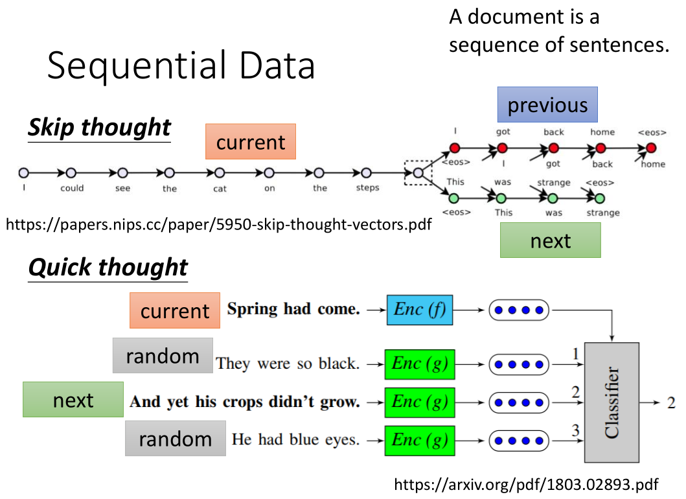

##### Contrastive Predictive Coding (CPC)

这个模型和Quick thought的思想是很像的，它接收一段序列数据，得到Embedding，然后用它预测接下来数据的Embedding。模型结构如下所示，具体内容可见原论文。

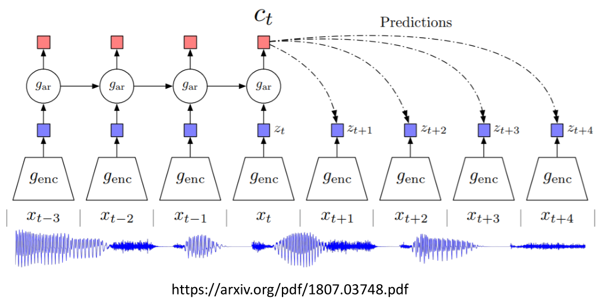

### More interpretable embedding

#### Feature Disentangle

An object contains multiple aspect information

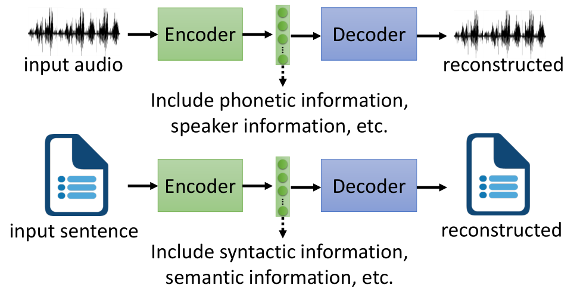

现在我们只用一个向量来表示一个object，我们是无法知道向量的哪些维度包含哪些信息，例如哪些维度包含内容信息，哪些包含讲话人信息等。也就是说这些信息是交织在一起的，我们希望模型可以帮我们把这些信息disentangle开来。

我们以声音讯号为例，假设通过Encoder得到的Embedding是一个100维 的向量，它只包含内容和讲话者身份两种信息。我们希望经过不断的训练，它的前50维代表内容信息，后50维代表讲话者的身份信息。可以用1个Encoder，也可以训练两个encoder分别抽取不同内容，然后把两个部分拼接起来，才能还原原来的内容。

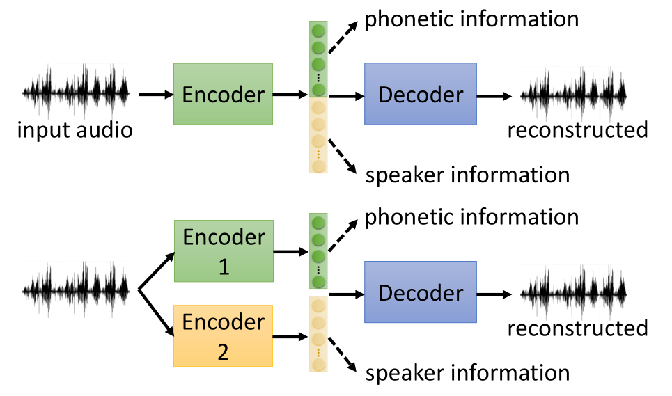

##### Voice Conversion

The same sentence has different impact when it is said by different people.

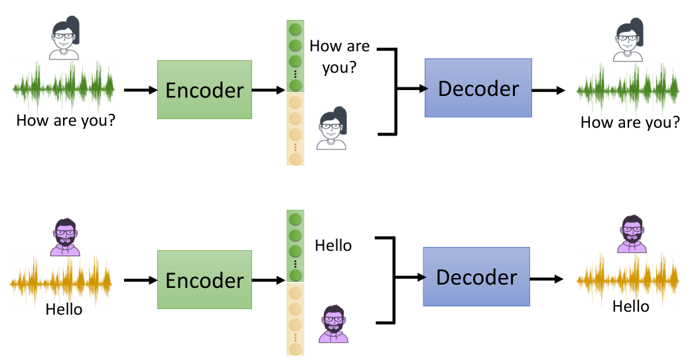

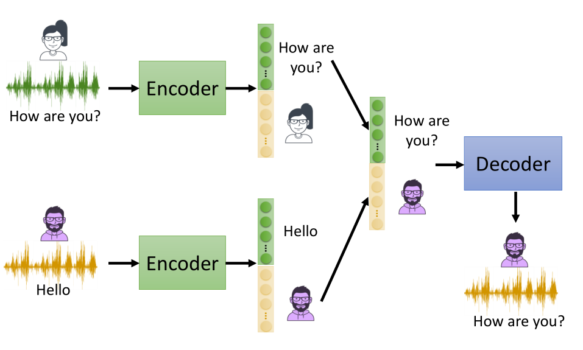

##### Adversarial Training

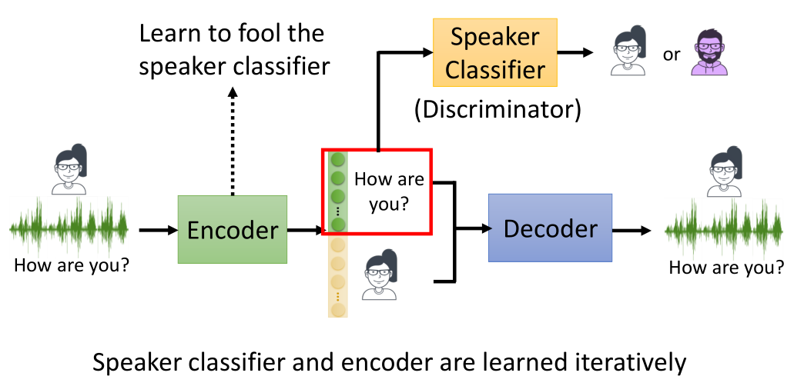

 一种方法就是使用GAN的思想，我们在Encoder-Decoder架构中引入一个Classifier，通过Embedding某个具体的部分判断讲话者身份，通过不断地训练，希望Encoder得到的Embedding可以骗过Classifier，就是要使得不能让Classifier分辨出语者的性别，那么那个具体的部分就不包含讲话者的信息。

在实作过程中，通常是利用GAN来完成这个过程，也就是把Encoder看做Generator，把Classifier看做Discriminator。Speaker classifier and encoder are learned iteratively.

##### Designed Network Architecture

使用两个Encoder来分别得到内容信息和讲话者身份信息的Embedding，在Encoder中使用instance normalization，然后将得到的两个Embedding结合起来送入Decoder重建输入数据，除了将两个Embedding直接组合起来的方式，还可以在Decoder中使用Adaptive instance normalization。

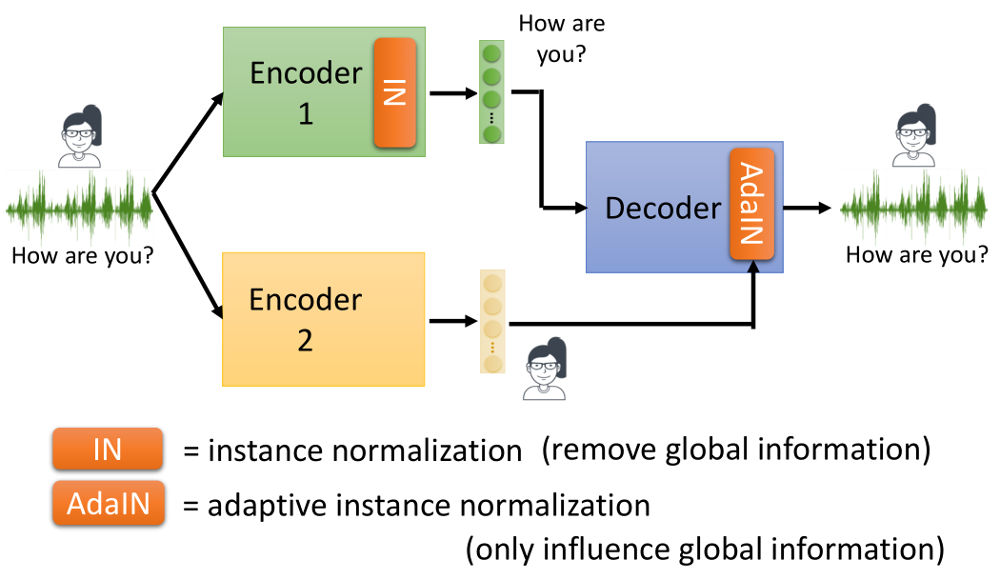

#### Discrete Representation

##### Easier to interpret or clustering

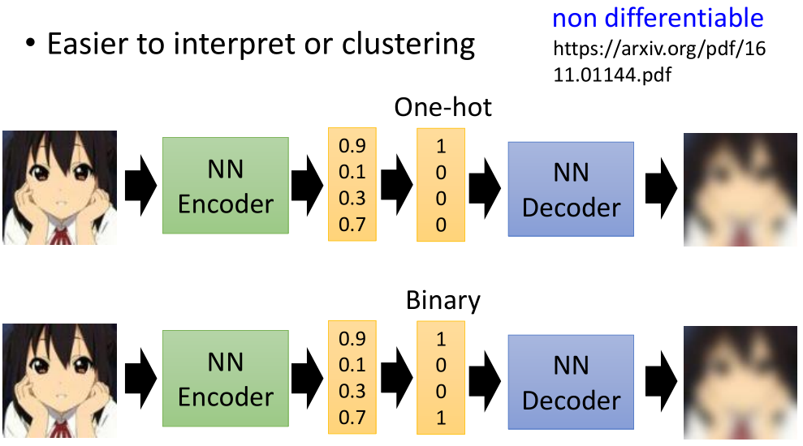

通常情况下，Encoder输出的Embedding都是连续值的向量，但如果可以将其转换为离散值的向量，例如one-hot向量或是binary向量，我们就可以更加方便的解读Embedding的哪一部分表示什么信息。

当然此时不能直接使用反向传播来训练模型，一种方式就是用强化学习来进行训练。

当然，上面两个离散向量的模型比较起来，个人觉得Binary模型要好，原因有两点：同样的类别Binary需要的参数量要比独热编码少，例如1024个类别Binary只需要10维即可，独热需要1024维；使用Binary模型可以处理在训练数据中未出现过的类别。

##### Vector Quantized Variational Auto-encoder (VQVAE)

基于这样的想法就出现了一种方法叫VQVAE，它引入了一个Codebook（内容是学出来的）。先用Encoder抽取为连续型的vector；再用vector与Codebook中的离散变量进行相似度计算，哪一个和输入更像，就将其丢给Decoder重建输入。

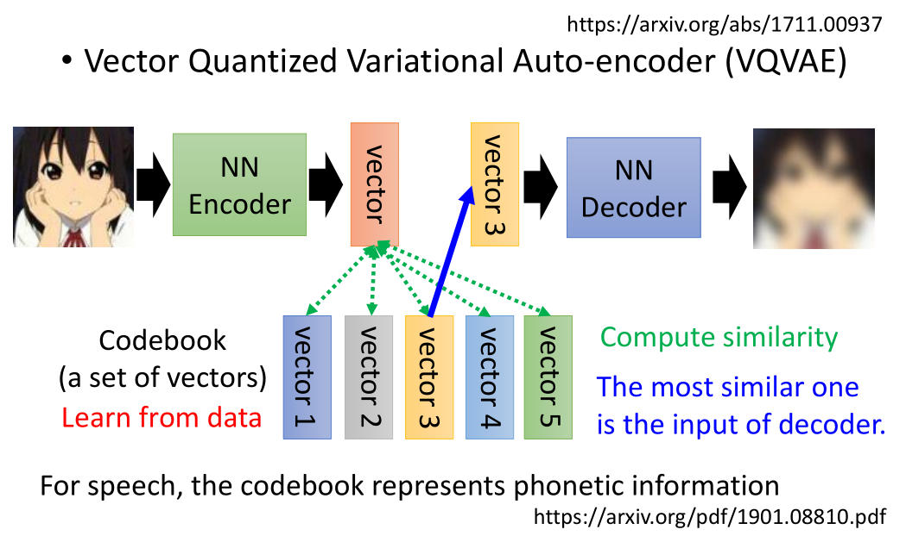

上面的模型中，如果输入的是语音信号，那么不是Discrete的语者信息和噪音信息会被过滤掉，比较容易保留去辨识的内容和资讯。因为上面的Codebook中保存的是离散变量，而声音里面有关文字的内容信息是一个个的token，是容易用离散向量来表示的，其他不是Discrete的信息会被过滤掉。

#### Sequence as Embedding

seq2seq2seq auto-encoder.

Using a sequence of words as latent representation.

一篇文章经过encoder得到一串文字，然后这串文字再通过decoder还原回文章。

但是这个机器抽取出的sequence是看不懂的，是机器自己的暗号。

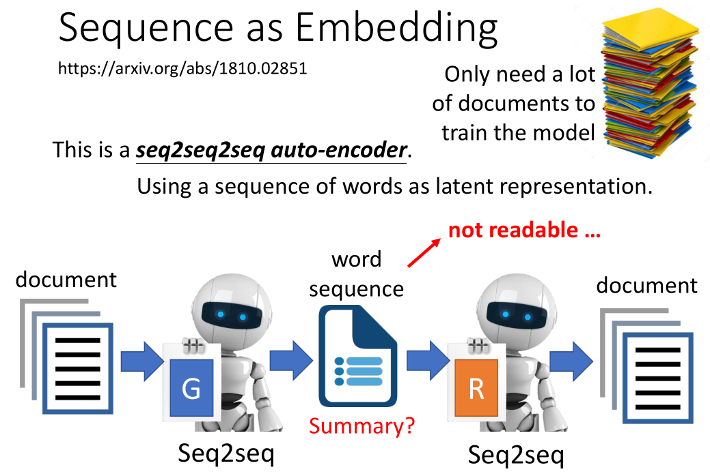

可以采用GAN的概念，训练一个Discriminator，判断是否是人写的句子。使得中间的seq可读。

不能微分，实际上用RL train encoder和decoder，loss当作reward。

#### Tree as Embedding

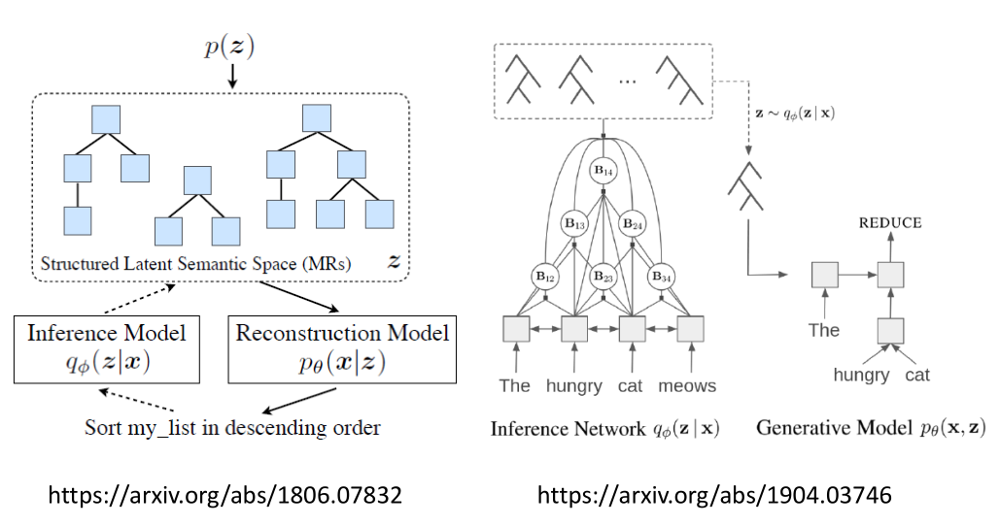

### Concluding Remarks

More than minimizing reconstruction error

- Using Discriminator
- Sequential Data

More interpretable embedding

- Feature Disentangle
- Discrete and Structured

## BERT

### Representation of Word

#### 1-of-N Encoding

最早的词表示方法。它就是one-hot encoding 没什么好说的，就是说如果词典中有N个词，就用N维向量表示每个词，向量中只有一个位置是1，其余位置都是0。但是这么做词汇之间的关联没有考虑。

#### Word Class

根据词的类型划分，但是这种方法还是太粗糙了，举举例说dog、cat和bird都是动物，它们应该是同类。但是动物之间也是有区别的，如dog和cat是哺乳类动物，和鸟类还是有些区别的。

#### Word Embedding

有点像是soft 的word class，我们用一个向量来表示一个单词，向量的每一个维度表示某种意思，相近的词汇距离较近，如cat和dog。

### A word can have multiple senses

> Have you paid that *money* to the **bank** yet ?
>
> It is safest to deposit your *money* in the **bank**.
>
> The victim was found lying dead on the *river* **bank**.
>
> They stood on the *river* **bank** to fish.

The four **word tokens** have the same **word type**.

In typical word embedding, <u>each word type has an embedding</u>.

**bank**一词在上述前两个句子与后两个句子中的token是不一样的，但是type是一样的。也就是说同样的词有存在不用语义的情况，而词嵌入会为同一个词只唯一确定一个embedding。

那我们能不能标记一词多义的形式呢？可以尝试的解决方案是为**bank**这个词设置2个不同的embedding，但是确定一个词有几个词义是困难的，可以参看以下句子：

> The hospital has its own blood **bank**.

The third sense or not?下个句子中的**bank**又有了不同的词义，这个词义可以看做一个新的词义，也可以看做与“银行”词义相同，因此机械地确定一个词有几个词义是困难的，因为很多词的意义是微妙的。

此时我们需要根据上下文来计算对应单词的embedding结果，这种技术称之为**Contextualized Word Embedding（语境词嵌入）** 。

### Embeddings from Language Model (ELMO)

ELMO是一个RNN-based Language Model，训练的方法就是找一大堆的句子，也不需要做标注，然后做上图所示的训练。

RNN-based Language Model 的训练过程就是不断学习预测下一个单词是什么。举例来说，你要训练模型输出“潮水退了就知道谁没穿裤子”，你教model，如果看到一个开始符号<BOS> ，就输出潮水，再给它潮水，就输出退了，再给它退了，就输出就......学完以后你就有Contextualized Word Embedding ，我们可以把RNN 的hidden layer 拿出来作为Embedding 。为什么说这个hidden layer 做Embedding 就是Contextualized 呢，因为RNN中每个输出都是结合前面所有的输入做出的。

我们做了正反双向的训练，最终的word embedding 是把正向的RNN 得到的token embedding 和反向RNN 得到的token embedding 接起来作为最终的Contextualized Word Embedding 。

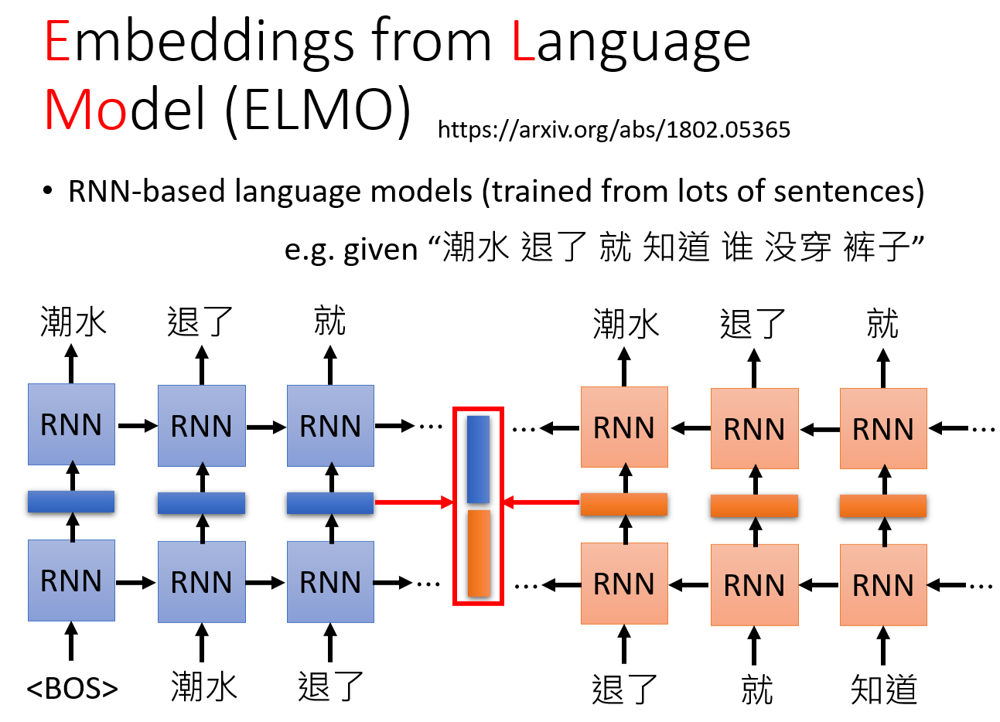

该过程也是可以deep的，如下图的网络结构，每一个隐藏层都会输出一个词的embedding，它们全部都会被使用到。

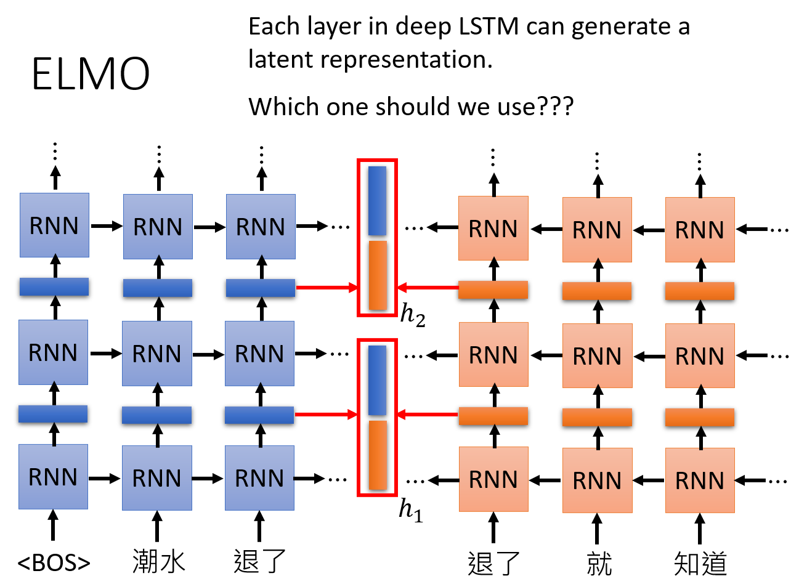

ELMO会将每个词输出多个embedding，这里我们假设LSTM叠两层。ELMO会用做weighted sum，weight是根据你做的下游任务训练出来的，下游任务就是说用EMLO做SRL（Sematic Role Labeling 语义角色标注）、Coref（Coreference resolution 共指解析）、SNLI（Stanford Natural Language Inference 自然语言推理）、SQuAD（Stanford Question Answering Dataset） 、SST-5（5分类情感分析数据集）等等。

具体来说，你要先train好EMLO，得到每个token 对应的多个embedding，然后决定你要做什么task，然后在下游task 的model 中学习weight $\alpha _{1}$和$\alpha _{2}$的值。

原始ELMO的paper 中给出了图中的实验结果，Token是说没有做Contextualized Embedding之前的原始向量，LSTM-1、LSTM-2是EMLO的两层得到的embedding，然后根据下游5个task 学出来的weight 的比重情况。我们可以看出Coref 和SQuAD 这两个任务比较看重LSTM-1抽出的embedding，而其他task 都比较平均的看了三个输入。

### Bidirectional Encoder Representations from Transformers (BERT)

BERT = Encoder of Transformer 

BERT其实就是Transformer的Encoder，可以从大量没有注释的文本中学习

BERT会输入一些词的序列然后输出每个词的一个embedding。

需要注意，实际操作中如果训练中文，应该以中文的字作为输入。因为中文的词语很难穷举，但字的穷举相对容易，常用汉字约4000个左右，而词的数量非常多，使用词作为输入可能导致输入向量维度非常高（one-hot），所以也许使用字作为基本单位更好。

#### Training of BERT

paper上提及的BERT的训练方法有两种，**Masked LM** 和**Next Sentence Prediction** 。

##### Masked LM

Masked LM这种训练方式指的是在词序列中每个词汇有15%的机率被一个特殊的token[MASK]遮盖掉，得到被遮盖掉的词对应输出的embedding后，使用一个Linear Multi-class Classifier来预测被遮盖掉的词是哪一个，由于Linear Multi-class Classifier的能力很弱，所以训练得到的embedding会是一个非常好的表示。

BERT的embedding是什么样子的呢？如果两个词填在同一个地方没有违和感，那它们就有类似的embedding，代表他们的语义是类似的。

##### Next Sentence Prediction 

给BERT两个句子，然后判断这两个句子是不是应该接在一起。

具体做法是，[SEP]符号告诉BERT句子交接的地方在哪里，[CLS]这个符号通常放在句子开头，将其通过BERT得到的embedding 输入到简单的Linear Binary Classifier中，Linear Binary Classifier 判断当前这个两个句子是不是应该接在一起。

你可能会疑惑[CLS]难道不应该放在句末，让BERT看完整个句子再做判断吗？

BERT里面一般用的是Transformer的Encoder，也就是说它做的是self-attention，self-attention layer 不受位置的影响，它会看完整个句子，所以一个token放在句子的开头或者结尾是没有差别的。

上述两个方法中，Linear classifier 是和BERT一起训练的。

两个方法在文献上是同时使用的，让BERT的输出去解这两个任务的时候会得到最好的训练效果。

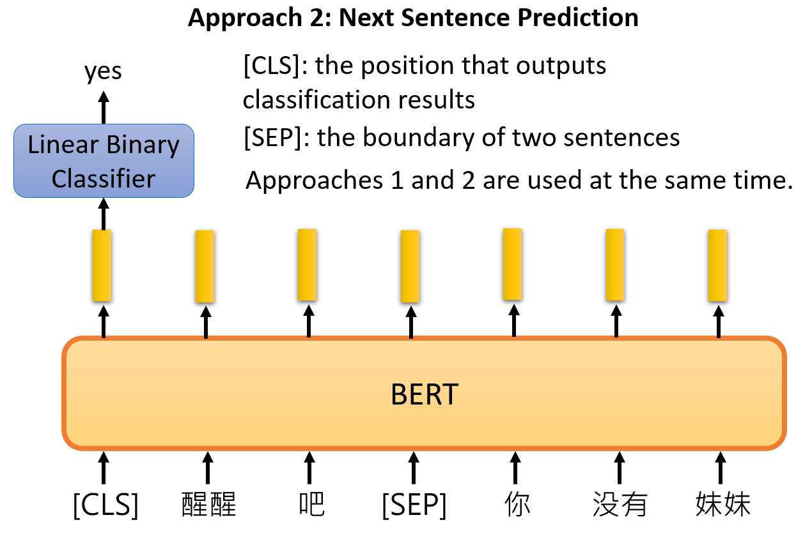

#### How to use BERT

你可以把BERT当作一个抽embedding 的工具，抽出embedding 以后去做别的task。

但是在BERT的paper中是把BERT和down stream task 一起做训练。

##### Case 1

输入一个sentence 输出一个class ，有代表性的任务有情感分析，文章分类等。

以句子情感分析为例，你找一堆带有情感标签的句子，丢给BERT，再句子开头设一个判断情感的符号[CLS]，把这个符号通过BERT的输出丢给一个线性分类器做情感分类。线性分类器是随机初始化参数，再用你的训练资料train 的，这个过程中也可以对BRET进行fine-tune ，也可以fix住BRET的参数。

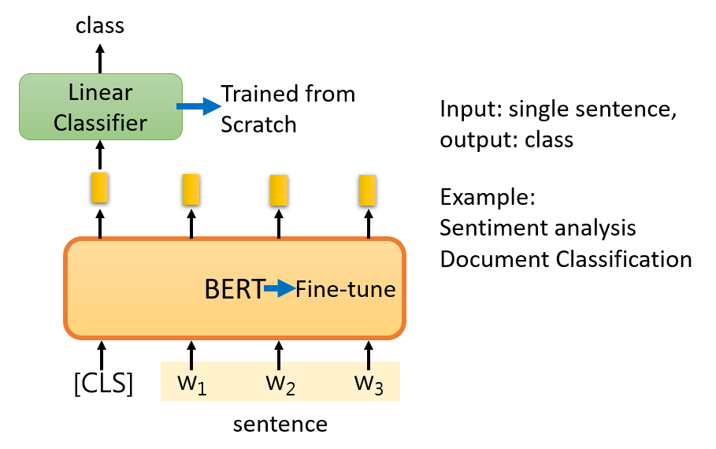

##### Case 2

输入：一个句子；输出：词的类别；例子：槽位填充

将句子输入到BERT，将每个token对应输出的embedding输入到一个线性分类器中进行分类。线性分类器要从头开始训练，BERT的参数只需要微调即可。

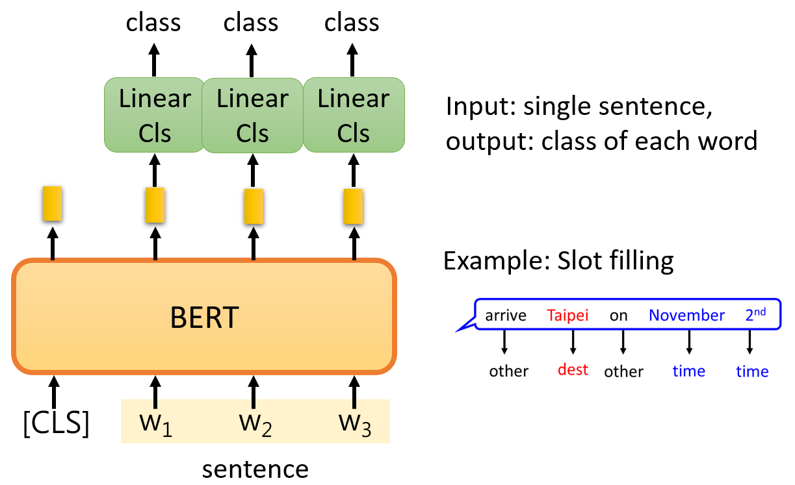

##### Case 3

输入：两个句子；输出：类别；例子：自然语言推理

可以将两个句子输入到BERT，两个句子之间添加一个token[SEP]，这两个句子分别是premise和hypothesis，第一个token设置为[CLS]表示句子的分类。

将第一个token对应输出的embedding输入到一个线性分类器中进行分类，分类结果代表在该假设下该推断是true (entailment), false (contradiction), or undetermined (neutral) 。线性分类器要从头开始训练，BERT的参数只需要微调即可。

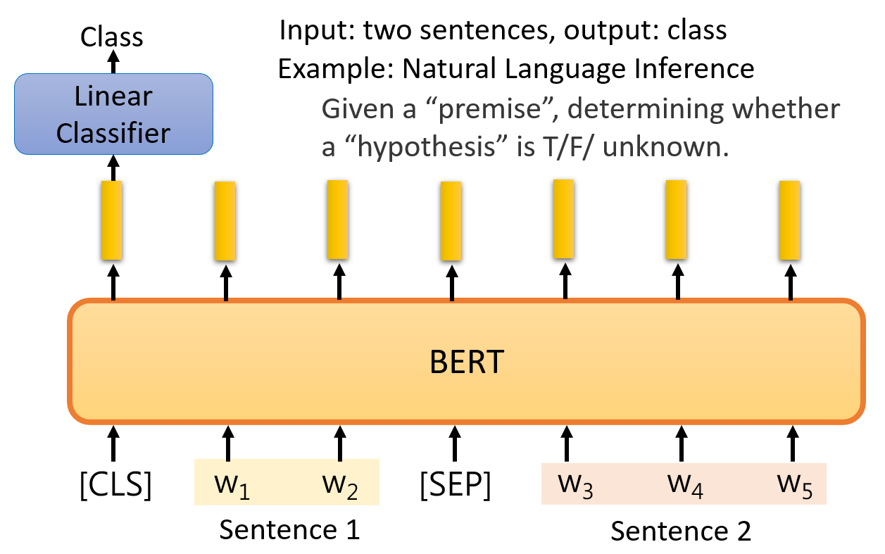

##### Case 4 

BERT还可以用来做Extraction-based Question Answering，也就是阅读理解，如下图所示，给出一篇文章然后提问一个问题，BERT就会给出答案，前提是答案在文中出现。

模型输入Document D 有N个单词，Query Q有M个单词，模型输出答案在文中的起始位置和结束位置：s和e。举例来说，图中第一个问题的答案是gravity，是Document 中第17个单词；第三个问题的答案是within a cloud，是Document 中第77到第79个单词。

怎么用BERT解这个问题呢？

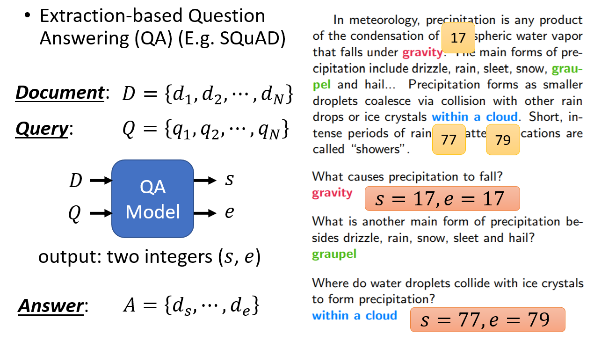

通过BERT后，Document 中每个词都会有一个向量表示，然后你再去learn 两个向量，得到图中红色和蓝色向量，这两个向量的维度和BERT的输出向量相同，红色向量和Document 中的词汇做点积得到一堆数值，把这些数值做softmax 最大值的位置就是s，同样的蓝色的向量做相同的运算，得到e：如果e落在s的前面，有可能就是无法回答的问题。

这个训练方法，你需要label很多data，每个问题的答案都需要给出在文中的位置。两个向量是从头开始学出来的，BERT只要fine-tune就好 。

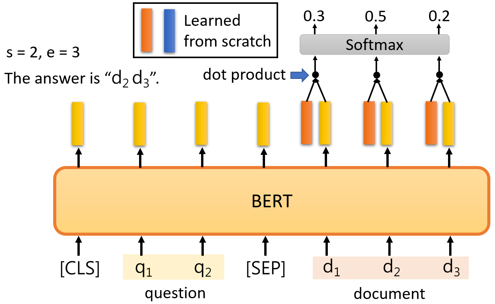

#### Enhanced Representation through Knowledge Integration (ERNIE)

ERNIE是类似BERT的模型，是专门为中文设计的，如果使用BERT的第一种训练方式时，一次只会盖掉一个字，对于BERT来说是非常好猜到的，因此ERNIE会一次盖掉中文的一个词。

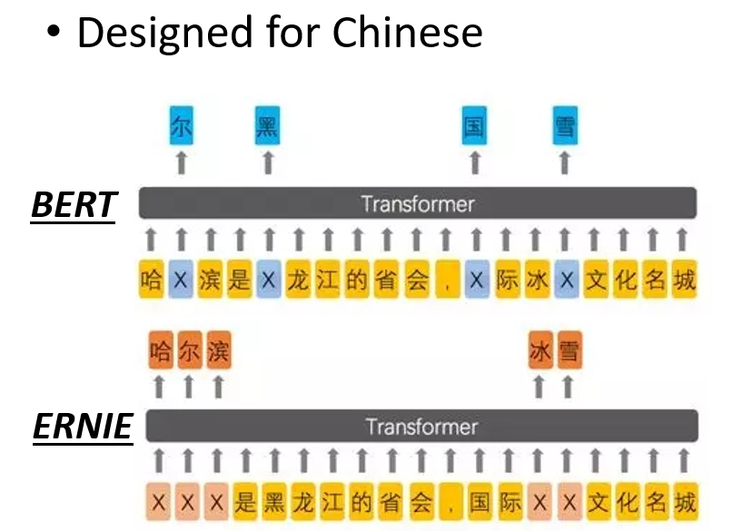

### What does BERT learn?

思考一下BERT每一层都在做什么，列出两个reference 给大家做参考。

假如我们的BERT有24层，单纯用BERT做embedding，用得到的词向量做下游任务。down stream task有POS、Consts等等，实验把BERT的每一层的Contextualized Embedding 抽出来做weighted sum，然后通过下游任务learn 出weight，看最后learn出的weight 的情况，就可以知道这个任务更需要那些层的vector 。

图中右侧蓝色的柱状图，代表通过不同任务learn出的BERT各层的weight ，POS是做词性标注任务，会更依赖11-13层；Coref是做分析代词指代，会更依赖BERT高层的向量（17-20层）；而SRL语义角色标注就比较平均地依赖各层抽出的信息。前三个任务都是文法相关的，因此更需要前面几层。若任务更困难，通常会需要比较深层抽出的embedding。

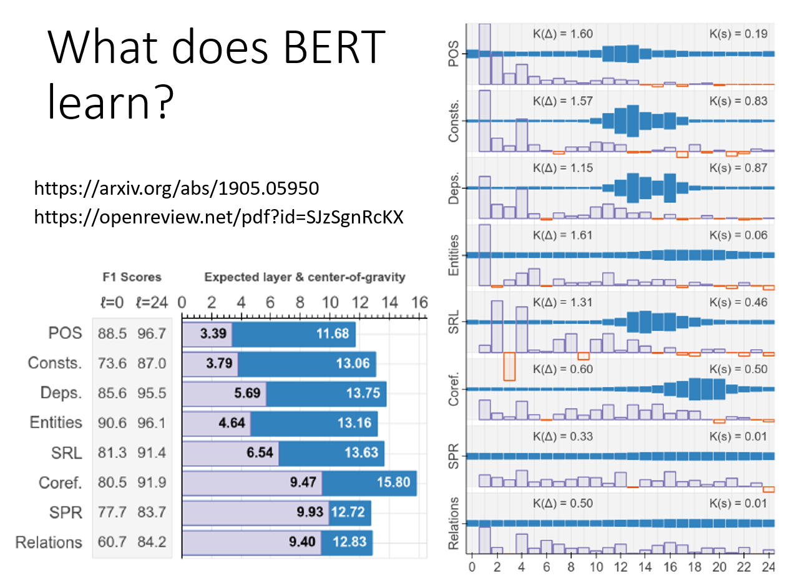

### Multilingual BERT

用104种语言的文本资料给BERT学习，虽然BERT没看过这些语言之间的翻译，但是它看过104种语言的文本资料以后，它似乎自动学会了不同语言之间的对应关系。

所以，如果你现在要用这个预训练好的BERT去做文章分类，你只要给他英文文章分类的label data set，它学完之后，竟然可以直接去做中文文章的分类。

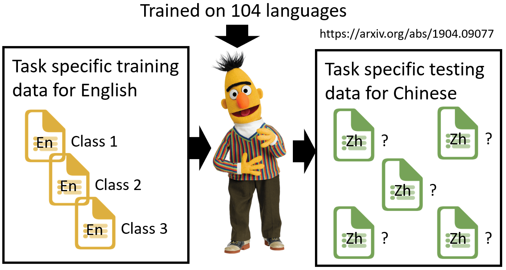

### Generative Pre-Training (GPT) 

GPT-2是OpenAI 做的，OpenAI 用GPT-2 做了一个续写故事的例子，他们给机器看第一段，后面都是机器脑补出来的。机器生成的段落中提到了独角兽和安第斯山，所以现在都拿独角兽和安第斯山来隐喻GPT。

OpenAI担心GPT-2最大的模型过于强大，可能会被用来产生假新闻这种事上，所以只发布了GPT-2的小模型。

有人用GPT-2的公开模型做了一个在线[demo](https://talktotransformer.com/)。

我们上面说BERT是Transformer 的Encoder ，GPT其实是Transformer 的Decoder 。

GPT和一般的Language Model 做的事情一样，就是你给他一些词汇，它预测接下来的词汇。举例来说，如上图所示，把“潮水的”q拿出来做self-attention，然后做softmax 产生 $\hat{\alpha}$ ，再分别和v做相乘求和得到b，self-attention 可以有很多层（b是vector，上面还可以再接self-attention layer），通过很多层以后要预测“退了”这个词汇。

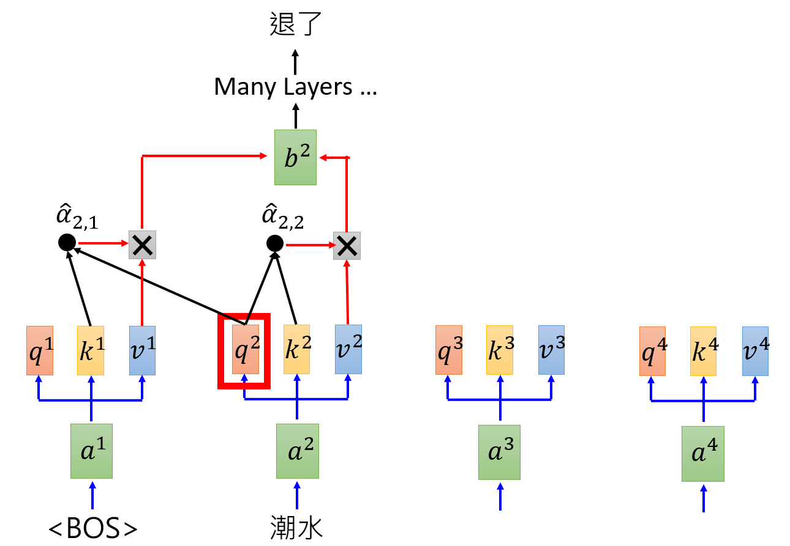

预测出“退了”以后，把“退了”拿下来，做同样的计算，预测“就”这个词汇，如此往复。

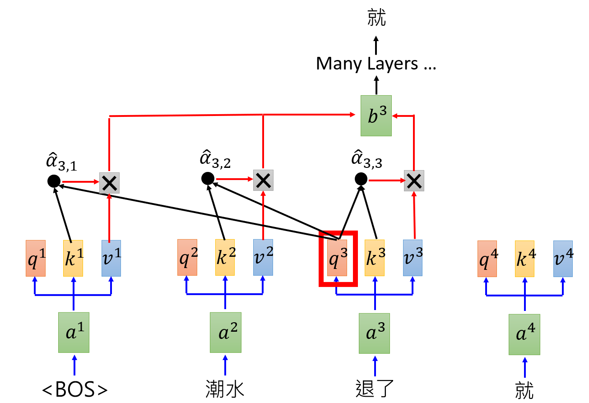

#### Zero-shot Learning?

GPT-2是一个巨大的预训练模型，它可以在没有更多训练资料的情况下做以下任务：

- **Reading Comprehension**

BERT也可以做Reading Comprehension，但是BERT需要新的训练资料train 线性分类器，对BERT本身进行微调。而GPT可以在没有训练资料的情况下做这个任务。

给GPT-2一段文章，给出一个问题，再写一个A:，他就会尝试做出回答。下图是GPT-2在CoQA上的结果，最大的GPT-2可以和DrQA达到相同的效果，不要忘了GPT-2在这个任务上是zero-shot learning ，从来没有人教过它做QA 。

- **Summarization**

给出一段文章加一个too long don’t read 的缩写"TL;DR:" 就会尝试总结这段文字。

- **Translation**

以上图所示的形式给出 一段英文=对应的法语，这样的例子，然后机器就知道要给出第三句英文的法语翻译。

其实后两个任务效果其实不是很好，Summarization就像是随机生成的句子一样。

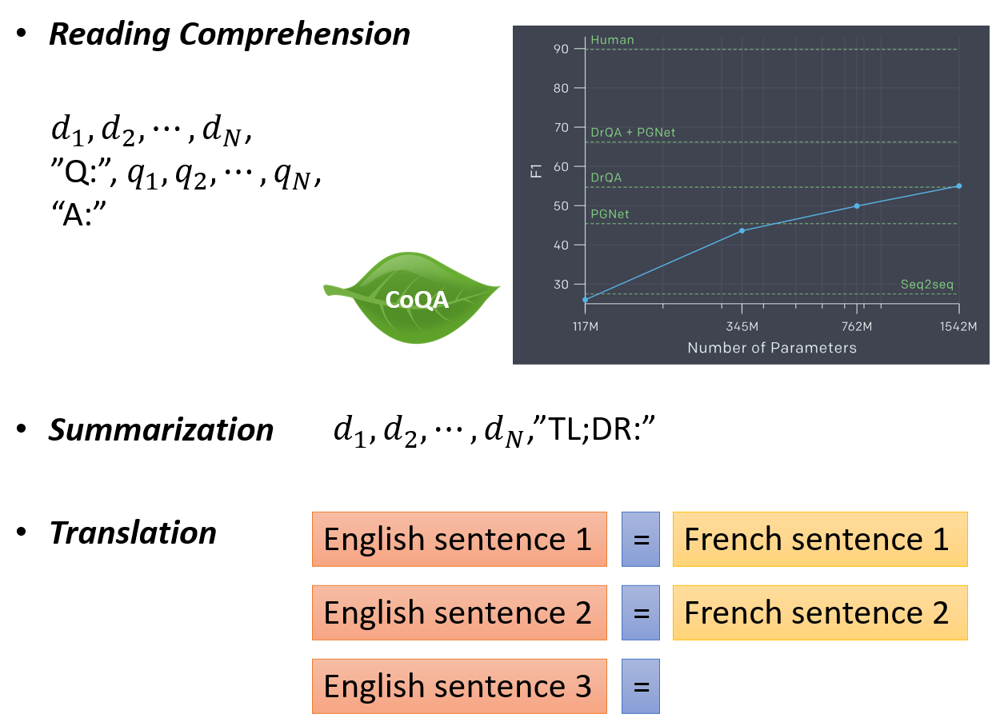

#### Visualization

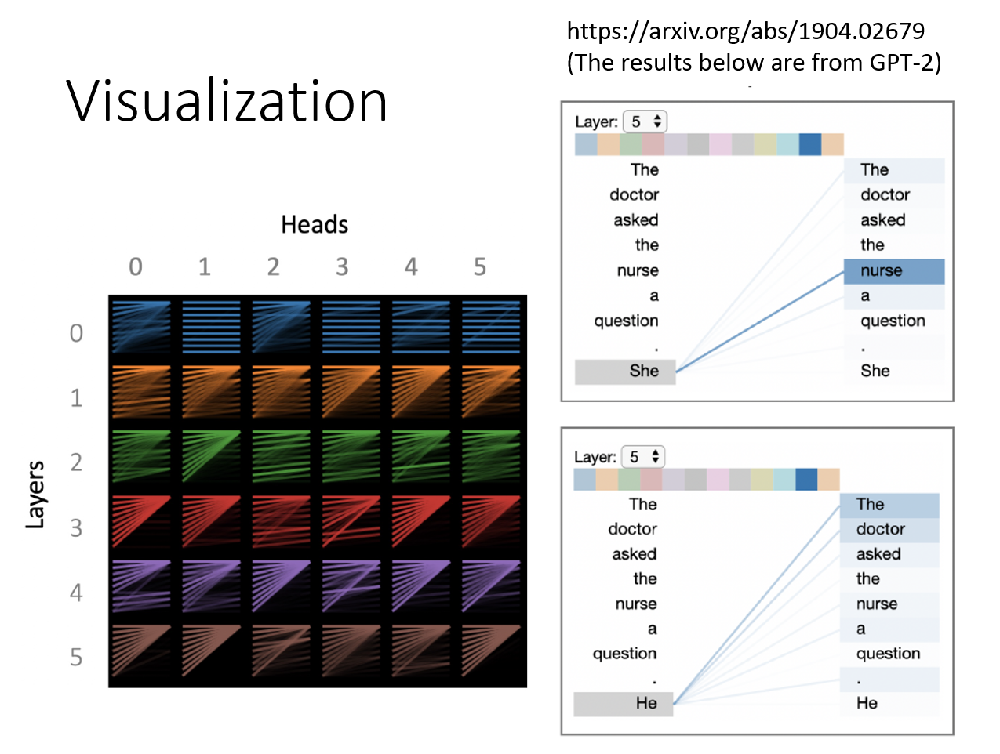

有人分析了一下GTP-2的attention做的事情是什么。

上图右侧的两列，GPT-2中左列词汇是下一层的结果，右列是前一层需要被attention的对象，我们可以观察到，She 是通过nurse attention 出来的，He是通过doctor attention 出来的，所以机器学到了某些词汇是和性别有关系的（虽然它大概不知道性别是什么）。

上图左侧，是对不同层的不同head 做一下分析，你会发现一个现象，很多不同的词汇都要attend 到第一个词汇。一个可能的原因是，如果机器不知道应该attend 到哪里，或者说不需要attend 的时候就attend 在第一个词汇。如果真是这样的话，以后我们未来在做这种model 的时候可以设一个特别的token，当机器不知道要attend到哪里的时候就attend到这个特殊token上。

## Unsupervised Learning: Generation

> 本文将简单介绍无监督学习中的生成模型，包括PixelRNN、VAE

### Introduction

正如*Richard Feynman*所说，*“What I cannot create, I do not understand”*，我无法创造的东西，我也无法真正理解，机器可以做猫狗分类，但却不一定知道“猫”和“狗”的概念，但如果机器能自己画出“猫”来，它或许才真正理解了“猫”这个概念

这里将简要介绍：PixelRNN、VAE和GAN这三种方法

### PixelRNN

#### Introduction

RNN可以处理长度可变的input，它的基本思想是根据过去发生的所有状态去推测下一个状态

PixelRNN的基本思想是每次只画一个pixel，这个pixel是由过去所有已产生的pixel共同决定的

这个方法也适用于语音生成，可以用前面一段的语音去预测接下来生成的语音信号

总之，这种方法的精髓在于根据过去预测未来，画出来的图一般都是比较清晰的

#### pokemon creation

用这个方法去生成宝可梦，有几个tips：

- 为了减少运算量，将40×40的图像截取成20×20

- 如果将每个pixel都以[R, G, B]的vector表示的话，生成的图像都是灰蒙蒙的，原因如下：

  - 亮度比较高的图像，一般都是RGB值差距特别大而形成的，如果各个维度的值大小比较接近，则生成的图像偏向于灰色

  - 如果用sigmoid function，最终生成的RGB往往都是在0.5左右，导致色彩度不鲜艳

  - 解决方案：将所有色彩集合成一个1-of-N编码，由于色彩种类比较多，因此这里先对类似的颜色做clustering聚类，最终获得了167种色彩组成的向量

    我们用这样的向量去表示每个pixel，可以让生成的色彩比较鲜艳

使用PixelRNN训练好模型之后，给它看没有被放在训练集中的3张图像的一部分，分别遮住原图的50%和75%，得到的原图和预测结果的对比如下：

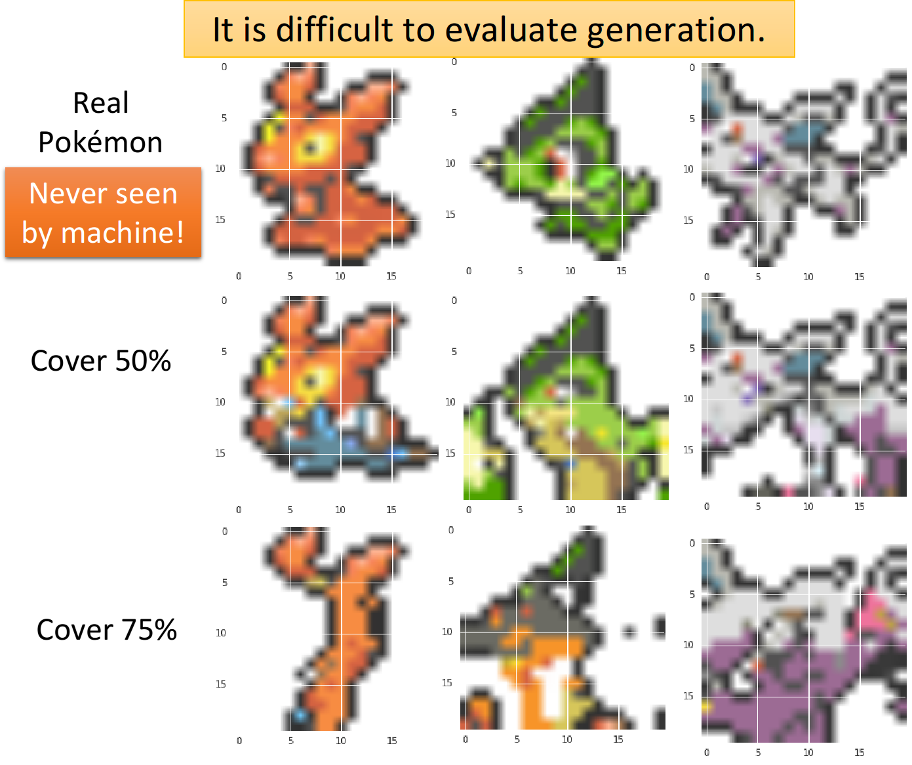

### Variational Autoencoder(VAE)

#### Introduction

前面的文章中已经介绍过Autoencoder的基本思想，我们拿出其中的Decoder，给它随机的输入数据，就可以生成对应的图像

但普通的Decoder生成效果并不好，VAE可以得到更好的效果

在VAE中，code不再直接等于Encoder的输出，这里假设目标降维空间为3维，那我们使Encoder分别输出$m_1,m_2,m_3$和$\sigma_1,\sigma_2,\sigma_3$，此外我们从正态分布中随机取出三个点$e_1,e_2,e_3$，将下式作为最终的编码结果：
$$
c_i = e^{\sigma_i}\cdot e_i+m_i
$$

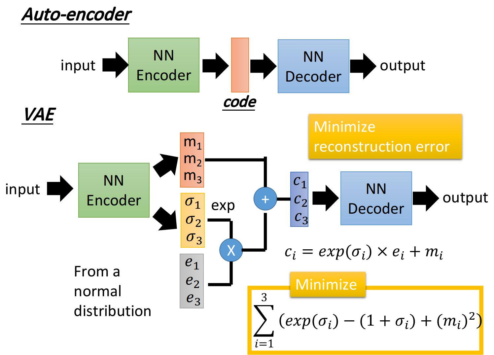

此时，我们的训练目标不仅要最小化input和output之间的差距，还要同时最小化下式：
$$
\sum_{i=1}^{3}\left(\exp \left(\sigma_{i}\right)-\left(1+\sigma_{i}\right)+\left(m_{i}\right)^{2}\right)
$$
与PixelRNN不同的是，VAE画出的图一般都是不太清晰的，但使用VAE可以在某种程度上控制生成的图像

#### Pokémon Creation

假设我们将这个VAE用在pokemon creation上面。

那我们在train的时候，input一个pokemon，然后你output一个的pokemon，然后learn出来的这个code就设为10维。learn好这个pockmon的VAE以后，我么就把decoder的部分拿出来。因为我们现在有一个decoder，可以input一个vector。所以你在input的时候你可以这样做：我现在有10维的vector，我固定其中8维只选其中的二维出来，在这两维dimension上面散不同的点，然后把每个点丢到decoder里面，看它合出来的image长什么样子。

那如果我们做这件事情的话，你就可以看到说：这个code的每一个dimension分别代表什么意思。如果我们可以解读code每一个dimension代表的意思，那以后我们就可以把code当做拉杆一样可以调整它，就可以产生不同的pokemon。

#### Write Poetry

VAE还可以用来写诗，我们只需要得到某两句话对应的code，然后在降维后的空间中得到这两个code所在点的连线，从中取样，并输入给Decoder，就可以得到类似下图中的效果

#### Why VAE?

VAE和传统的Autoencoder相比，有什么优势呢？

事实上，VAE就是加了噪声noise的Autoencoder，它的抗干扰能力更强，过渡生成能力也更强

对原先的Autoencoder来说，假设我们得到了满月和弦月的code，从两者连线中随机获取一个点并映射回原来的空间，得到的图像很可能是完全不一样的东西。

而对VAE来说，它要保证在降维后的空间中，加了noise的一段范围内的所有点都能够映射到目标图像，如下图所示，当某个点既被要求映射到满月、又被要求映射到弦月，VAE training的时候你要minimize mean square，所以这个位置最后产生的图会是一张介于满月和半月的图。所以你用VAE的话，你从你的code space上面去sample一个code再产生image的时候，你可能会得到一个比较好的image。如果是原来的auto-encoder的话，得到的都不像是真实的image。

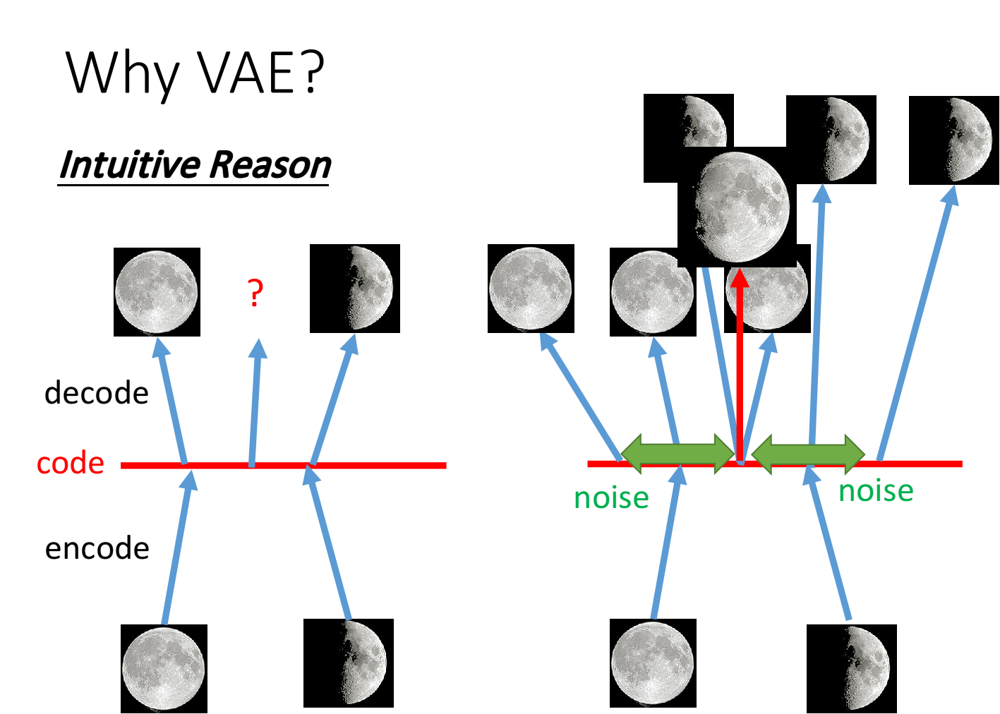

再回过来头看VAE的结构，其中：

- $m_i$其实就代表原来的code

- $c_i$则代表加了noise以后的code

- $\sigma_i$代表了noise的variance，描述了noise的大小，这是由NN学习到的参数

  注：使用$e^{\sigma_i}$的目的是保证variance是正的

- $e_i$是正态分布中随机采样的点

注意到，损失函数仅仅让input和output差距最小是不够的，因为variance是由机器自己决定的，如果不加以约束，它自然会去让variance=0，这就跟普通的Autoencoder没有区别了

额外加的限制函数解释如下：

下图中，蓝线表示$e^{\sigma_i}$，红线表示$1+\sigma_i$，两者相减得到绿线

绿线的最低点$\sigma_i=0$，则variance $e^{\sigma_i}=1$，此时loss最低

而$(m_i)^2$项则是对code的L2 regularization，让它比较sparse，不容易过拟合，比较不会 learn 出太多 trivial 的 solution

刚才是比较直观的理由，正式的理由这样的，以下是paper上比较常见的说法。

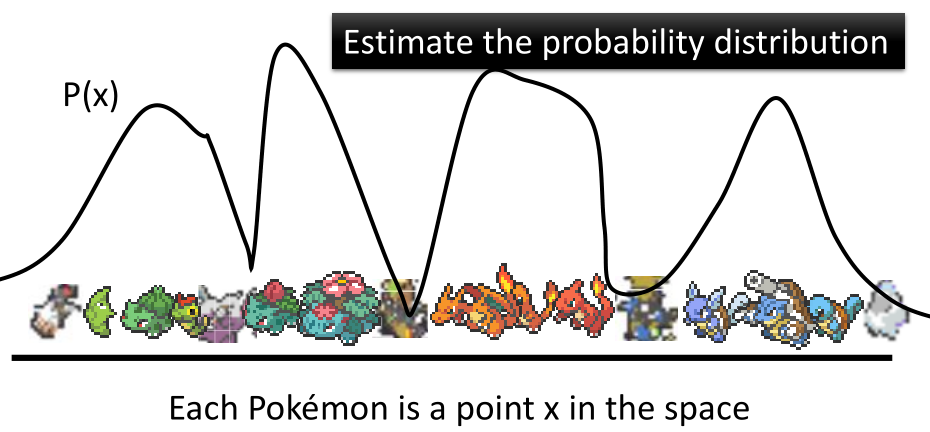

回归到我们要做的事情是什么，你要machine generate 这个pokemon的图，那每一张pokemon的图都可以想成是高维空间中的一个点。一张 image，假设它是 20\*20 的 image，它在高维的空间中就是一个 20*20，也就是一个 400 维的点。我们这边写做 x，虽然在图上，我们只用一维来描述它，但它其实是一个高维的空间。那我们现在要做的事情其实就是 estimate 高维空间上面的机率分布，P(x)。只要我们能够 estimate 出这个 P(x) 的样子，注意，这个 x 其实是一个 vector，我们就可以根据这个 P(x)，去 sample 出一张图。那找出来的图就会像是宝可梦的样子，因为你取 P(x) 的时候，机率高的地方比较容易被 sample 出来，所以，这个 P(x) 理论上应该是在有宝可梦的图的地方，它的机率是大的；如果是一张怪怪的图的话，机率是低的。如果我们今天能够 estimate 出这一个 probability distribution那就结束了。

#### Gaussian Mixture Model

那怎么 estimate 一个 probability 的 distribution 呢？

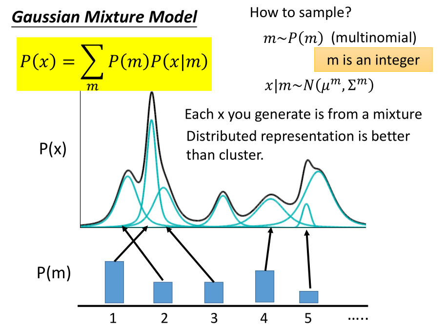

我们可以用 Gaussian mixture model。我们现在有一个 distribution，它长这个样子，黑色的、很复杂。我们说这个很复杂的黑色 distribution，它其实是很多的 Gaussian。这一边蓝色的代表有很多的 Gaussian用不同的 weight 迭合起来的结果。假设你今天 Gaussian 的数目够多，你就可以产生很复杂的 distribution。所以，虽然黑色很复杂，但它背后其实是有很多 Gaussian 迭合起来的结果。根据每一个 Gaussian 的 weight去决定你要从哪一个 Gaussian sample data，然后，再从你选择的那个 Gaussian 里面 sample data。如果你的gaussion数目够多，你就可以产生很复杂的distribution，公式为 $P(x)=\sum_{m} P(m) P(x|m)$ 。

如果你要从p(x)sample出一个东西的时候，你先要决定你要从哪一个gaussion sample东西，假设现在有100gaussion，你根据每个gaussion的weight去决定你要从哪一个gaussion sample data。所以你要咋样从一个gaussion mixture model smaple data呢？首先你有一个multinomial distribution，你从multinomial distribution里面决定你要sample哪一个gaussion，m代表第几个gaussion，它是一个integer。你决定好你要从哪一个m sample gaussion以后，，你有了m以后就可以找到 $\mu ^m,\sigma^m$（每一个gaussion有自己的 $\mu ^m,\sigma^m$），根据 $\mu ^m,\sigma^m$ 就可以sample一个x出来。所以p(x)写为summation over 所有的gaussion的weight乘以sample出x的机率 。

每一个x都是从某一个mixture被sample出来的，这件事情其实就很像是做classification一样。我们每一个所看到的x，它都是来自于某一个分类。但是我们之前有讲过说：把data做cluster是不够的，更好的表示方式是用distributed representation，也就是说每一个x它并不是属于某一个class，而是它有一个vector来描述它的各个不同的特性。所以VAE就是gaussion mixture model的 distributed representation的版本。

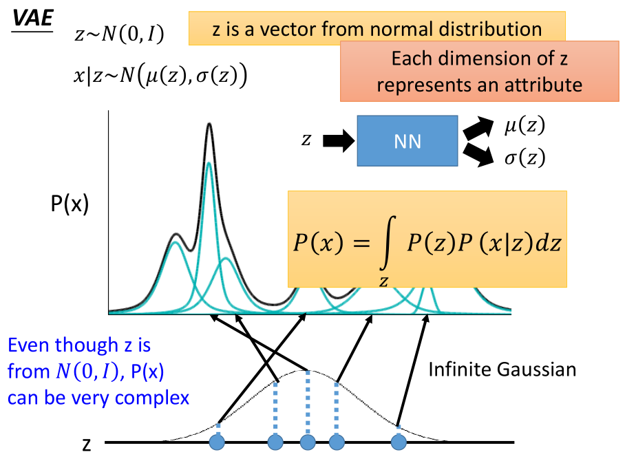

首先我们要sample一个z，这个z是从normal distribution 中sample出来的。这个vector z的每一个dimension就代表了某种attribute，如图中所示，假设是z是一维的，实际上 z 可能是一个 10 维的、100 维的 vector。到底有几维，是由你自己决定。接下来你Sample $z$以后，根据$z$你可以决定 $\mu(z),\sigma(z)$ ，你可以决定gaussion的 $\mu,\sigma$ 。刚才在gaussion model里面，你有10个mixture，那你就有10个 $\mu,\sum $ ，但是在这个地方，你的z有无穷多的可能，所以你的 $\mu(z),\sigma(z)$ 也有无穷多的可能。那咋样找到这个 $\mu(z),\sigma(z)$ 呢？做法是：假设 $\mu(z),\sigma(z)$ 都来自于一个function，你把z带到产生 $\mu$ 的这个function $N(\mu(z),\sigma(z))$ ， $\mu(z)$ 代表说：现在如果你的attribute是z的时候，你在x space上面的 $\mu$ 是多少。同理 $\sigma(z)$ 代表说：$\sigma$是多少

其实P(x)是这样产生的：在z这个space上面，每一个点都有可能被sample到，只不过是中间这些点被sample出来的机率比较大。当你sample出来点以后，这个point会对应到一个guassion。至于一个点对应到什么样的gaussion，它的 $\mu,\sigma$ 是多少，是由某一个function来决定的。所以当gaussion是从normal distribution所产生的时候，就等于你有无穷多个gaussion。

另外一个问题就是：我们怎么知道每一个$z$应该对应到什么样的 $\mu,\sigma$(这个function如何去找)。我们知道neural network就是一个function，所以你就可以说：我就是在train一个neural network，这个neural network的input就是$z$，它的output就是两个vector( $\mu(z),\sigma(z)$ )。

P(x)的distribution为$P(x)=\int_{Z} P(z) P(x|z) d z$

那你可能会困惑，为什么是gaussion呢？你可以假设任何形状的，这是你自己决定的。你可以说每一个attribute的分布就是gaussion，因为极端的case总是少的，比较没有特色的东西总是比较多的。你不用担心如果假设gaussion会不会对P(x)带来很大的限制：NN是非常powerful的，NN可以represent任何的function。所以就算你的z是normal distribution，最后的P(x)最后也可以是很复杂的distribution。

#### Maximizing Likelihood

p(z) is a normal distribution，$x|z$ 表示我们先知道 z 是什么，然后我们就可以决定 x 是从什么样子的 mean 跟 variance 的 Gaussian里面被 sample 出来的， $\mu(z),\sigma(z)$ 是等待被找出来的。

但是，问题是要怎么找呢？它的criterion就是maximizing the likelihood，我们现在手上已经有一笔data x，你希望找到一组 $\mu$ 的function和 $\sigma$ 的function，它可以让你现在已经有的image x，它的p(x)取log之后相加被maximize 。 $z$ 通过一个$NN$产生这个 $μ$ 跟 $σ$ ，所以我们要做的事情就是，调整$NN$里面的参数(每个neural的weight bias)，使得likehood可以被maximize 。

引入另外一个distribution，叫做 $q(z|x)$ 。也就是我们有另外一个 $NN'$ ，input一个$x$以后，它会告诉你说：对应在$z$这个space上面的 $\mu',\sigma'$ (给它$x$以后，它会决定这个$z$要从什么样的 $\mu',\sigma'$ 被sample出来)。这个$NN’$就是VAE里的Encoder，前面说的 $NN$ 就是Decoder

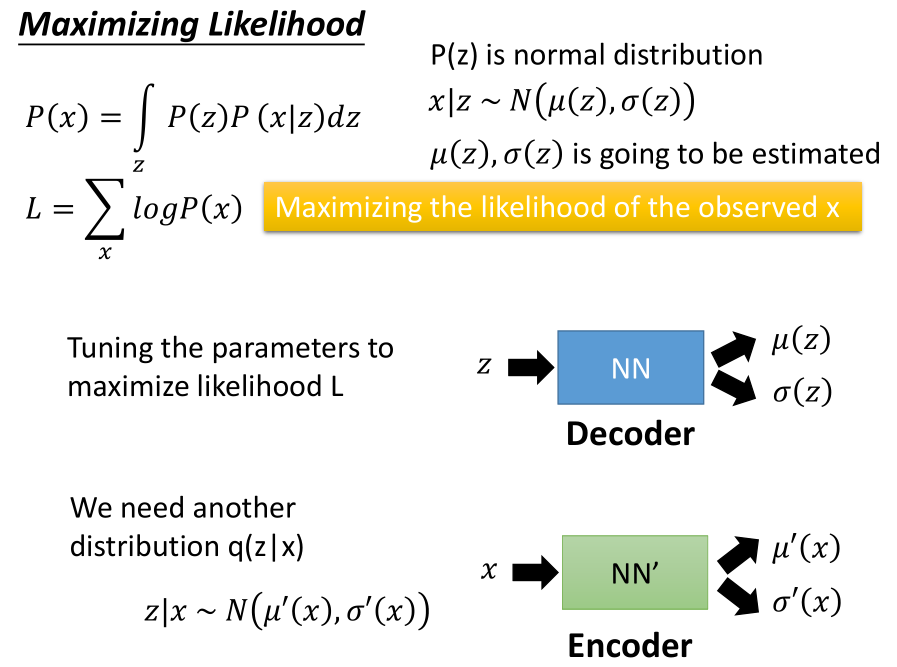

 $logP(x)=\int_{z}q(z|x)logP(x)dz$ ，对任何distribution$q(z|x)$都成立。因为这个积分是跟P(x)无关的，然后就可以提出来，积分的部分就会变成1，所以左式就等于右式。

由条件概率$P(A|B)=P(AB)/P(B)$，得到第二行。log中的式子拆开，得到第三行。右边这一项，它代表了一个 KL divergence。KL divergence 代表的是这两个 distribution 相近的程度，如果 KL divergence 它越大代表这两个 distribution 越不像，这两个 distribution 一模一样的时候，KL divergence 会是 0。所以，KL divergence 它是一个距离的概念，它衡量了两个 distribution 之间的距离。最小为0。左边一项经过变化，得到L的lower bound $L_b$。 

我们要maximize的对象是由这两项加起来的结果，在 $L_b$ 这个式子中，$p(z)$是已知的，我们不知道的是 $p(x|z)$ 跟 $q(z|x)$。我们本来要做的事情是要找 $p(x|z)$ ，让likelihood越大越好，现在我们要做的事情变成要找找 $p(x|z)$ 跟 $q(z|x)$ ，让 $L_b$ 越大越好。

如果我们只找 $p(x|z)$ ，然后去maximizing  $L_b$  的话，那因为你要找的这个 likelihood，它是 $L_b$ 的 upper bound，所以，你增加 $L_b$ 的时候，你有可能会增加你的 likelihood。但是，你不知道你的这个 likelihood跟你的 lower bound 之间到底有什么样的距离。你希望做到的事情是当你的 lower bound 上升的时候，你的 likelihood 是会比 lower bound 高，然后你的 likelihood 也跟着上升。但是，你有可能会遇到一个比较糟糕的状况是你的 lower bound 上升的时候，likelihood 反而下降。虽然，它还是 lower bound，它还是比 lower bound 大，但是，它有可能下降。因为根本不知道它们之间的差距是多少。

所以，引入 q 这一项呢，其实可以解决刚才说的那一个问题。因为likelihood = $L_b$ + KL divergence。如果你今天去这个调$q(z|x)$，去 maximize $L_b$ 的话，会发生什么事呢？首先 q 这一项跟 log P(x) 是一点关系都没有的，log P(x) 只跟 $P(x|z)$ 有关，所以，这个值是不变的，蓝色这一条长度都是一样的。我们现在去 maximize $L_b$，maximize $L_b$ 代表说你 minimize 了 KL divergence，也就是说你会让你的 lower bound 跟你的这个 likelihood越来越接近，假如你固定住 $P(x|z)$ 这一项，然后一直去调 $q(z|x)$ 这一项的话，让这个 $L_b$ 一直上升，最后这一个 KL divergence 会完全不见。

假如你最后可以找到一个 q，它跟这个 $p(z|x)$ 正好完全 distribution 一模一样的话，你就会发现说你的 likelihood 就会跟lower bound 完全停在一起，它们就完全是一样大。这个时候呢，如果你再把 lower bound 上升的话，因为你的 likelihood 一定要比 lower bound大。所以这个时候你的 likelihood你就可以确定它一定会上升。所以，这个就是引入 q 这一项它有趣的地方。

一个副产物，当你在 maximize q 这一项的时候，你会让这个 KL divergence 越来越小，你会让这个 $q(z|x)$ 跟 $P(z|x)$ 越来越接近。

所以我们接下要做的事情就是找$𝑃 (𝑥|𝑧)$ and $𝑞 (𝑧|𝑥)$，可以让 $L_b$ 越大越好。让 $L_b$ 越大越好就等同于我们可以让 likelihood 越来越大，而且你顺便会找到 $q$ 可以去 approximation of $p(z|x)$

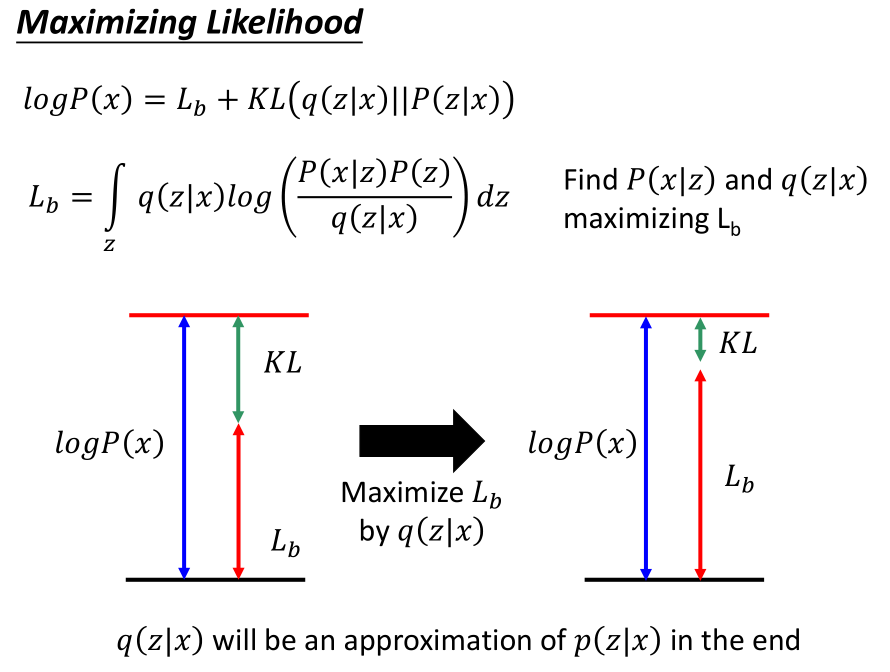

对于$L_b$ log 里面相乘，拆开，得到 $P(z)$ 跟 $q(z|x)$ 的 KL divergence

#### Connection with Network

q是一个 neural network，当你给 x 的时候，它会告诉你 $q(z|x)$ 是从什么样的mean 跟 variance 的 Gaussian 里面 sample 出来的。所以，我们现在如果你要minimize 这个 $P(z)$ 跟 $q(z|x)$ 的 KL divergence 的话，你就是去调output让它产生的 distribution 可以跟这个 normal distribution 越接近越好。minimize这一项其实就是我们刚才在reconstruction error外加的那一项$\sum_{i=1}^{3}\left(\exp \left(\sigma_{i}\right)-\left(1+\sigma_{i}\right)+\left(m_{i}\right)^{2}\right)$，它要做的事情就是minimize KL divergence，希望 $q(z|x)$ 的output跟normal distribution是接近的。

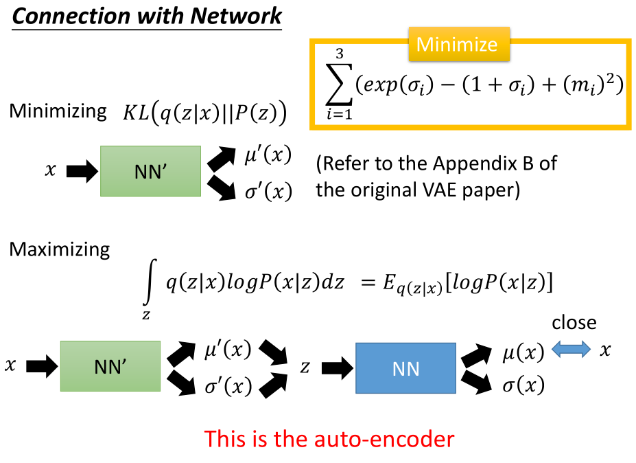

另外一项是要这个积分的意思就是

你可以想象，我们有一个 $log P(x|z)$，然后，它用 $q(z|x)$ 来做 weighted sum。所以，你可以把它写成$[log P(x|z)]$ 根据 $q(z|x)$ 的期望值

这个式子的意思就好像是说：给我们一个 $x$ 的时候，我们去根据这个 $q(z|x)$，这个机率分布去 sample 一个 data，然后，要让 $log P(x|z)$ 的机率越大越好。那这一件事情其实就 Auto-encoder 在做的事情。

怎么从 $q(z|x)$ 去 sample 一个 data 呢？你就把 $x$ 丢到 neural network 里面去，它产生一个 mean 跟一个 variance，根据这个 mean 跟 variance，你就可以 sample 出一个 $z$。

你已经根据现在的 x sample 出 一个 z，接下来，你要 maximize 这一个 z，产生这个 x 的机率。

这个 z 产生这个 x ，是把这个 z 丢到另外一个 neural network 里面去，它产生一个 mean 跟 variance，要怎么让这个 NN output所代表 distribution 产生 x 的 机率越大越好呢？假设我们无视 variance 这一件事情的话，因为在一般实作里面你可能不会把 variance 这一件事情考虑进去。你只考虑 mean 这一项的话，那你要做的事情就是：让这个 mean跟你的 x 越接近越好。你现在是一个 Gaussian distribution，那 Gaussian distribution 在 mean 的地方机率是最高的。所以，如果你让这个 NN output 的这个 mean 正好等于你现在这个 data x 的话，这一项 $log P(x|z)$ 它的值是最大的。

所以，现在这整个 case 就变成说，input 一个 x，然后，产生两个 vector，然后 sample 产生一个 z，再根据这个 z，你要产生另外一个 vector，这个 vector 要跟原来的 x 越接近越好。这件事情其实就是Auto-encoder 在做的事情。所以这两项合起来就是刚才我们前面看到的 VAE 的 loss function。

#### problems of VAE

VAE其实有一个很严重的问题就是：它从来没有真正学过如何产生一张看起来像真的image，它学到的东西是：它想要产生一张image，跟我们在database里面某张image越接近越好。

但它不知道的是：我们evaluate它产生的image跟database里面的相似度的时候(MSE等等)，decoder output跟真正的image之间有一个pixel的差距，不同的pixel落在不同的位置会得到非常不一样的结果。假设这个不一样的pixel落在7的尾部(让7比较长一点)，跟落在另外一个地方(右边)。你一眼就看出说：右边这是怪怪的digit，左边这个搞不好是真的。但是对VAE来说都是一个pixel的差异，对它来说这两张image是一样的好或者是一样的不好。

所以VAE学的只是怎么产生一张image跟database里面的一模一样，从来没有想过：要真的产生可以一张以假乱真的image。所以你用VAE来做training的时候，其实你产生出来的image往往都是database里面的image linear combination而已。因为它从来都没有想过要产生一张新的image，它唯一做的事情就是希望它产生的 image 跟 data base 的某张 image 越像越好，模仿而已。

### GAN

GAN，对抗生成网络，是近两年非常流行的神经网络，基本思想就像是天敌之间相互竞争，相互进步

GAN由生成器(Generator)和判别器(Discriminator)组成：

- 对判别器的训练：把生成器产生的图像标记为0，真实图像标记为1，丢给判别器训练分类
- 对生成器的训练：input: Vectors from a distribution，调整生成器的参数，使产生的图像能够骗过判别器
- 每次训练调整判别器或生成器参数的时候，都要固定住另一个的参数

#### In practical ……

- GANs are difficult to optimize.
- No explicit signal about how good the generator is
  - In standard NNs, we monitor loss
  - In GANs, we have to keep “well-matched in a contest”
- When discriminator fails, it does not guarantee that generator generates realistic images
  - Just because discriminator is stupid
  - Sometimes generator find a specific example that can fail the discriminator
- Making discriminator more robust may be helpful.

GAN的问题：没有明确的训练目标，很难调整生成器和判别器的参数使之始终处于势均力敌的状态，当两者之间的loss很小的时候，并不意味着训练结果是好的，有可能它们两个一起走向了一个坏的极端，所以在训练的同时还要有人在旁边关注着训练的情况