# Anomaly Detection

## Anomaly Detection

异常探测就是要让机器知道它不知道这件事

### Problem Formulation

异常侦测的问题通常formulation成这样，假设我们现在有一堆训练数据（$x^1, x^2, ... x^N$），（在这门课里面，我们通常用上标来表示一个完整的东西，用下标来表示一个完整东西的其中一部分）。我们现在要找到一个function，这个function要做的事情是：检测输入x的时，决定现在输入的x到底跟我们的训练数据是相似还是不相似的。

我们一直在用Anoamly这个词汇，可能会让某些同学觉得机器在做Anoamly Detector都是要Detector不好的结果，因为异常这个词汇显然通常代表的是负面意思。其实Anoramly Detector并不一定是找不好的结果，只是找跟训练数据不一样的数据。所以我们找出结果不见得是异常的数据，你会发现Anoamly Detector在不同的领域里面有不同名字。有时候我们会叫它为“Outlier Detector, Novelty Detector, Exceprions Detector”

总之我们要找的是跟训练数据不一样的数据，但至于什么叫做similar，这就是Anoamly Detector需要探讨的问题。不同的方法就有不同的方式来定义什么叫做“像”、什么叫做“不像”。

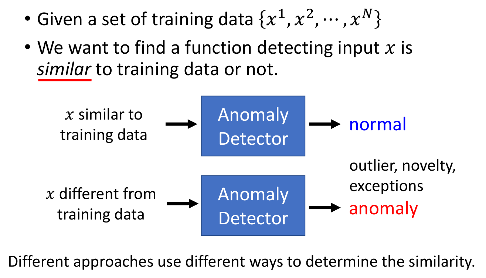

### What is Anomaly?

这里我要强调一下什么叫做异常，机器到底要看到什么就是Anormaly。其实是取决你提供给机器什么样的训练数据。

假设你提供了很多的雷丘作为训练数据，皮卡丘就是异常的。若你提供了很多的皮卡丘作为训练数据，雷丘就是异常的。若你提供很多的宝可梦作为训练数据，这时数码宝贝就是异常的。

### Applications

#### Fraud Detection

异常侦测有很多的应用，你可以应用到诈欺侦测（Fraud Detection）。训练数据是正常的刷卡行为，收集很多的交易记录，这些交易记录视为正常的交易行为，若今天有一笔新的交易记录，就可以用异常检测的技术来侦测这笔交易记录是否有盗刷的行为。（正常的交易金额比较小，频率比较低，若短时间内有非常多的高额消费，这可能是异常行为）

#### Network Intrusion Detection

异常侦测还可以应用到网络系统的入侵侦测，训练数据是正常连线。若有一个新的连线，你希望用Anoramly Detection让机器自动决定这个新的连线是否为攻击行为

#### Cancer Detection

异常侦测还可以应用到医疗（癌细胞的侦测），训练数据是正常细胞。若给一个新的细胞，让机器自动决定这个细胞是否为癌细胞。

### Binary Classification?

我们咋样去做异常侦测这件事呢？很直觉的想法就是：若我们现在可以收集到很多正常的资料$\{x^1, x^2, ...,x^N\}$，我们可以收集到很多异常的资料$\{\tilde{x}^1, \tilde{x}^2,..., \tilde{x}^N\}$。我们可以将normal data当做一个Class（Class1），anomaly data当做另外一个Class（Class2）。我们已经学过了binary classification，这时只需要训练一个binary classifier，然后就结束了。

这个问题其实并没有那么简单，因为不太容易把异常侦测视为一个binary classification的问题。为什么这样说呢？

假设现在有一笔正常的训练数据是宝可梦，只要不是宝可梦就视为是异常的数据，这样不只是数码宝贝是异常数据，凉宫春日也是异常数据，茶壶也是异常的数据。不属于宝可梦的数据太多了，不可能穷举所有不是宝可梦的数据。根本没有办法知道整个异常的数据（Class2）是怎样的，所以不应该将异常的数据视为一个类别，应为它的变化太大了。这是第一个不能将异常侦测视为二元分类的原因。

第二个原因是：很多情况下不太容易收集到异常的资料，收集正常的资料往往比较容易，收集异常的资料往往比较困难。对于刚才的诈欺侦测例子而言，你可以想象多数的交易通常都是正常的，很难找到异常的交易。这样就造成异常侦测不是一个单纯的二元分类问题，需要想其它的方法，它是一个独立的研究主题，仍然是一个尚待研究的问题。

### Categories

接下来对异常侦测做一个简单的分类

#### With labels

一类，是不只有训练数据 $\{x^1,x^2,⋯,x^N\}$ ，同时这些数据还具有label $\{\hat{y}^1,\hat{y}^2,⋯,\hat{y}^N\}$。 用这样的数据集可以train出一个classifier，让机器通过学习这些样本，以预测出新来的样本的label，但是我们希望分类器有能力知道新给样本不属于原本的训练数据的任何类别，它会给新样本贴上“unknown”的标签。训练classifier 可以用generative model、logistic regression、deep learning等方法，你可以从中挑一个自己喜欢的算法train 出一个classifier 。

上述的这种类型的任务，train出的classifier 具有看到不知道的数据会标上这是未知物的能力，这算是异常检测的其中一种，又叫做Open-set Recognition。我们希望做分类的时候模型是open 的，它可以辨识它没看过的东西，没看过的东西它就贴一个“unknown”的标签。

#### Without labels

另一类，所有训练数据都是没有label 的，这时你只能根据现有资料的特征去判断，新给的样本跟原先的样本集是否相像。这种类型的数据又分成两种情况：

- Clean：手上的样本是干净的（所有的训练样本都是正常的样本）
- Polluted：手上的样本已经被污染（训练样本已经被混杂了一些异常的样本，更常见）

情况二是更常见的，对于刚才的诈欺检测的例子而言，银行收集了大量的交易记录，它把所有的交易记录都当做是正常的，然后告诉机器这是正常交易记录，然后希望机器可以借此检测出异常的交易。但所谓的正常的交易记录可能混杂了异常的交易，只是银行在收集资料的时候不知道这件事。所以我们更多遇到的是：手上有训练样本，但我没有办法保证所有的训练样本都是正常的，可能有非常少量的训练样本是异常的。

### Case 1: With Classifier

现在给定的例子是要侦测一个人物是不是来自辛普森家庭，可以看出$x^1, x^2, x^3,x^4$是来自辛普森家庭（辛普森家庭的人有很明显的特征：脸是黄色的，嘴巴像似鸭子），同时也可以看出凉宫春日显然不是来自辛普森家庭。

假设我们收集的辛普森家庭的人物都具有标注（霸子，丽莎，荷马，美枝），有了这些训练资料以后就可以训练出一个辛普森家庭成员的分类器。我们就可以给分类器看一张照片，它就可以判断这个照片中的人物是辛普森家庭里面的哪个人物。

#### How to use the Classifier

现在我们想做的事情是根据这个分类器来进行异常侦测，判断这个人物是否来自辛普森家庭。

我们原本是使用分类器来进行分类，现在希望分类器不仅可以来自分类，还会输出一个数值，这个数值代表信心分数（Confidence score ），然后根据信心分数做异常侦测这件事情。

定义一个阈值称之为$\lambda$，若信心分数大于$\lambda$就说明是来自于辛普森家庭。若信心分数小于$\lambda$就说明不是来自于辛普森家庭

##### How to estimate Confidence

咋样可以得到信心分数呢？若我们将图片输入辛普森家庭的分类器中，若分类器非常的肯定这个图片到底是谁，输出的信心分数就会非常的高。当我们将图片输入分类器时，分类器的输出是一个机率分布（distribution），所以将一张图片输入分类器时，分类器会给事先设定的标签一个分数。

如图所示，将“霸子”图片输入分类器，分类器就会给“霸子”一个很高的分数。

但你若给它一张很奇怪的图片（凉宫春日），这时输出的分数会特别的平均，代表机器是没有信心的。若输出特别平均，那这张图片就是异常的图片

刚才讲的都是定性的分析，现在需要将定性分析的结果化为信心分数。

一个非常直觉的方法就是将分类器的分布中最高数值作为信心分数，所以上面那张图输出的信心分数为0.97（霸子），下面那张图输出的信心分数为0.26（凉宫春日）

根据信心分数来进行异常检测不是唯一的方法，因为输出的是distribution，那么就可以计算entropy。entropy越大就代表输出越平均，代表机器没有办法去肯定输出的图片是哪个类别，表示输出的信心分数是比较低。总之我们有不同的方法根据分类器决定它的信心分数。

现在我输入一张训练资料没有的图片（荷马），分类器输出荷马的信心分数是1.00；输入霸子的图片，分类器输出霸子的信心分数为0.81，输出郭董的信心分数为0.12；输入三玖的图片，分类器输出柯阿三的信心分数为0.34，输出陈趾鹹的信心分数为0.31，输出鲁肉王的信心分数为0.10。

以上都是动漫人物，现在输入一张真人的图片，分类器输出柯阿三的信心分数为0.63，输出宅神的信心分数为0.08，输出小丑阿基的信心分数为0.04，输出孔龙金的信心分数为0.03。

我们可以发现，如果输入的是辛普森家庭的人物，分类器输出比较高信心分数。如果输入不是辛普森家庭的任务，分类器输出的信心分数是比较低。

但是也有一些例外，比如输入凉宫春日的图片，分类器输出柯阿三的信心分数为0.99。

若输入大量的训练资料输入至分类器中，输出的信心分数分布如图所示。几乎所有的辛普家庭的人物输入分类器中，无论是否辨识有错都会给出一个较高的信心分数。

但还是发现若辨识有错误会得到较低的信心分数，如图所示的红色点就是辨识错误图片的信心分数的分布。蓝色区域分布相较于红色区域集中在1的地方，有很高的信心分数认为是辛普森家庭的人物。

若输入其它动画的人物图片，其分类器输出的信心分数如题所示，我们会发现有1/10的图片的信心分数比较高（不是辛普森家庭的人物，但给了比较高的分数），多数的图片得到的信心分数比较低。

##### Network for Confidence Estimation

刚才是比较直观的给出了一个信心分数，你可能会觉得这种方法会让你觉得非常弱，不过刚才那种非常简单的方法其实在实作上往往还可以有不错的结果。

若你要做异常侦测的问题，现在有一个分类器，这应该是你第一个要尝试的baseline。虽然很简单，但不见得结果表现会很差。

也有更好的方法，比如你训练一个neuron network时，可以直接让neuron network输出信心分数，具体细节可参考：Terrance DeVries, Graham W. Taylor, Learning Confidence for Out-of-Distribution Detection in Neural Networks, arXiv, 2018

#### Example Framework

##### Training Set

我们有大量的训练资料，且训练资料具有标注（辛普森家庭哪个人物），因此我们可以训练一个分类器。不管用什么方法，可以从分类器中得到对所有图片的信心分数。然后就根据信心分数建立异常侦测的系统，若信心分数高于某个阀值（threshold）时就认为是正常，若低于某个阀值（threshold）时就认为是异常。

##### Dev Set

在之前的课程中已经讲了Dev Set的概念，需要根据Dev Set调整模型的超参数（hyperparameter），才不会过拟合。

在异常侦测的任务里面我们的Dev Set，不仅是需要大量的images，还需要被标注这些图片是来自辛普森家庭的人物还是不是来自辛普森家庭的人物。需要强调的是在训练时所有的资料都是来自辛普森家庭的人物，标签是来自辛普森家庭的哪一个人物。

但是我们要做Dev Set时，Dev Set要模仿测试数据集（testing Set），Dev Set要的并不是一张图片（辛普森家庭的哪一个人物），而应该是：辛普森家庭的人物和不是辛普森家庭的人物。

有了Dev Set以后，我们就可以把我们异常侦测的系统用在Dev Set，然后计算异常侦测系统在Dev Set上的performance是多少。你能够在Dev Set衡量一个异常侦测系统的performance以后，你就可以用Dev Set调整阀值（threshold），找出让最好的阀值（threshold）。

##### Testing Set

决定超参数以后（hyperparameters），就有了一个异常侦测的系统，你就可以让它上线。输入一张图片，系统就会决定是不是辛普森家庭的人物。

#### Evaluation

接下里要讲的是：如何计算一个异常侦测系统的性能好坏？现在有100张辛普森家庭人物的图片和5张不是辛普森家庭人物的图片。如图所示，辛普森家庭是用蓝色来进行表示，你会发现基本都集中在高分的区域。5张不是辛普森家庭的图片用红色来表示。

你会发现图的左边有一个辛普森家庭人物的分数是非常低的，在异常侦测时机器显然会在这里犯一个错误，认为它不是辛普森家庭人物，这张图片是辛普森家庭的老爷爷。

第一个图片是看起来像安娜贝尔的初音，第二张图片是小樱，第三张图片也是小樱，第四张图是凉宫春日，第五张图是魔法少女。我们会发现这个魔法少女的信心分数非常的高（0.998），事实上在这个bar中有百分之七十五的信心分数都高于0.998，多数辛普森家庭人物得到的信心分数都是1。

很多人在实作时，发现这张异常的图片却给到了0.998很高的分数。但你发现那些正常的图片往往得到更高的分数。虽然这些异常的图片可以得到很高的分数，但如果没有正常图片的分数那么高，还是可以得到较好的异常侦测的结果。

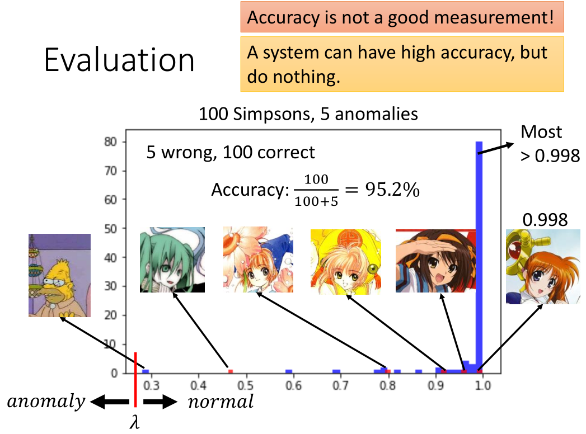

我们咋样来评估一个异常侦测系统的好坏呢？我们知道异常侦测其实是一个二元分类（binary classification）的问题。在二元分类中我们都是用正确率来衡量一个系统的好坏，但是在异常侦测中正确率并不是一个好的评估系统的指标。你可能会发现一个系统很可能有很高的正确率，但其实这个系统什么事都没有做。为什么这样呢？因为在异常侦测的问题中正常的数据和异常的数据之间的比例是非常悬殊的。在这个例子里面，我们使用了正常的图片有一百张，异常的图片有五张。

通常来说正常的资料和异常的资料之间的比例是非常悬殊的，所以只用准确率衡量系统的好坏会得到非常奇怪的结果的。

在如图所示的例子中，我们认为有一个异常侦测的系统，它的$\lambda$设为0.3以下。$\lambda$以上认为是正常的，$\lambda$以下认为是异常的。这时你会发现这个系统的正确率是95.2%，由于异常资料很少，所以正确率仍然是很高的。所以**异常侦测问题中不会用正确率来直接当做评估指标。**

首先我们要知道在异常侦测中有两种错误：一种错误是异常的资料被判断为正常的资料，另外一种是正常的资料被判为异常的资料。假设我们将$\lambda$设为0.5（0.5以上认为是正常的资料，0.5以下认为是异常的资料），这时就可以计算机器在这两种错误上分别犯了多少错误。

对于所有异常的资料而言，有一笔资料被侦测出来，其余四笔资料没有被侦测为异常的资料。对于所有正常的资料而言，只有一笔资料被判断为异常的资料，其余的九十九笔资料被判断为正常的资料。这时我们会说机器有一个false alarm（正常的资料被判断为异常的资料）错误，有四个missing（异常的资料却没有被侦测出来）错误。

若我们将阀值（threshold）切在比0.8稍高的部分，这时会发现在五张异常的图片中，其中有两张认为是异常的图片，其余三种被判断为正常的图片；在一百张正确的图片中，其中有六张图片被认为是异常的图片，其余九十四张图片被判断为正常的图片。

哪一个系统比较好呢？其实你是很难回答这个问题。有人可能会很直觉的认为：当阀值为0.5时有五个错误，阀值为0.8时有九个错误，所以认为左边的系统好，右边的系统差。

但其实一个系统是好还是坏，取决你觉得false alarm比较严重还是missing比较严重。

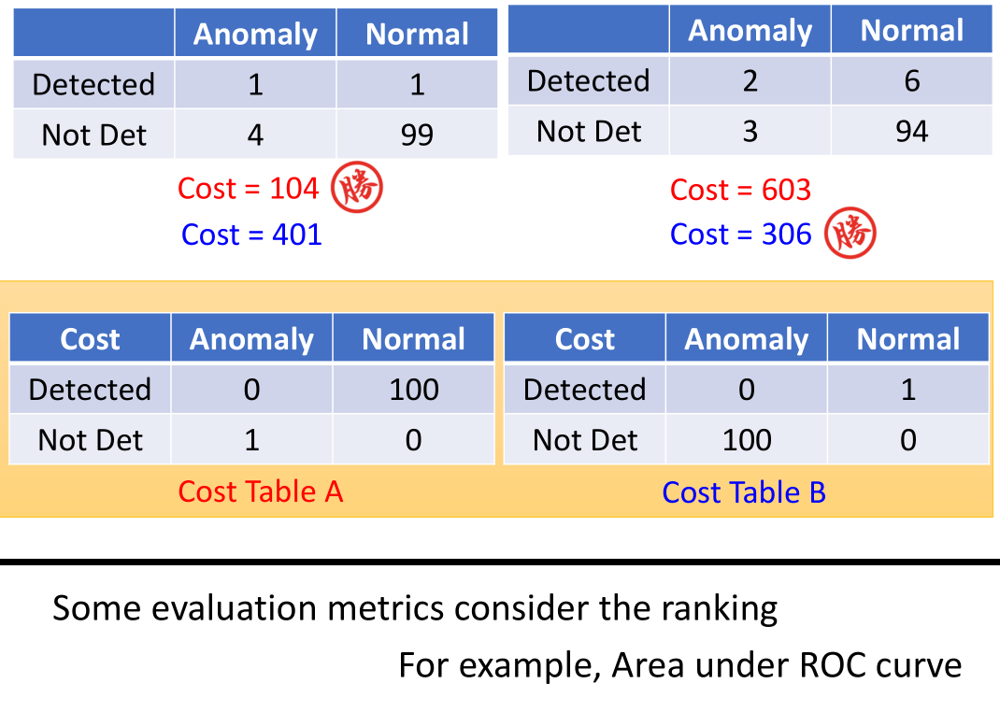

所以你在做异常侦测时，可能有一个Cost Table告诉你每一种错误有多大的Cost。若没有侦测到资料就扣一分，若将正确的资料被误差为错误的资料就扣100分。若你是使用这样的Cost来衡量系统的话，左边的系统会被扣104分，右边的系统会被扣603分。所以你会认为左边的系统较好。若Cost Table为Cost Table B 时，异常的资料没有被侦测出来就扣100分，将正常的资料被误判为错误的资料就扣1分，计算出来的结果会很不一样。

在不同的情景下、不同的任务，其实有不同的Cost Table：假设你要做癌症检测，你可能就会比较倾向想要用右边的Cost Table。因为一个人没有癌症却被误判为有癌症，顶多就是心情不好，但是还可以接受。若一个人其实有癌症，但没有检查出来，这时是非常严重的，这时的Cost也是非常的高。

这些Cost要给出来，其实是要问你现在是什么样的任务，根据不同的任务有不同的Cost Table。所以根据右边的Cost Table，左边的Cost为401分，右边的Cost为306分，所以这时右边的系统较好。

其实还有很多衡量异常检测系统的指标，有一个常用的指标为AUC（Area under ROC curve）。若使用这种衡量的方式，你就不需要决定阀值（threshold），而是看你将测试集的结果做一个排序（高分至低分），根据这个排序来决定这个系统好还是不好。

如果我们直接用一个分类器来侦测输入的资料是不是异常的，这并不是一种很弱的方法，但是有时候无法给你一个perfect的结果，我们用这个图来说明用classifier做异常侦测时有可能会遇到的问题。

假设现在做一个猫和狗的分类器，将属于的一类放在一边，属于狗的一类放在一边。若输入一笔资料即没有猫的特征也没有狗的特征，机器不知道该放在哪一边，就可能放在这个boundary上，得到的信息分数就比较低，你就知道这些资料是异常的。

你有可能会遇到这样的状况：有些资料会比猫更像猫（老虎），比狗还像狗（狼）。机器在判断猫和狗时是抓一些猫的特征跟狗的特征，也许老虎在猫的特征上会更强烈，狼在狗的特征上会更强烈。对于机器来说虽然有些资料在训练时没有看过（异常），但是它有非常强的特征会给分类器很大的信心看到某一种类别。

在解决这个问题之前我想说辛普森家庭人物脸都是黄的，如果用侦测辛普森家庭人物的classifier进行侦测时，会不会看到黄脸的人信心分数会不会暴增呢？所以将三玖的脸涂黄，结果侦测为是宅神，信心分数为0.82；若再将其头发涂黄，结果侦测为丽莎，信心分数为1.00。若将我的脸涂黄，结果侦测为丽莎，信心分数为0.88。

当然有些方法可以解这个问题，这里列一些文献给大家进行参考。其中的一个解决方法是：假设我们可以收集到一些异常的资料，我们可以教机器看到正常资料时不要只学会分类这件事情，要学会一边做分类一边看到正常的资料信心分数就高，看到异常的资料就要给出低的信心分数。

但是会遇到的问题是：很多时候不容易收集到异常的数据。有人就想出了一个神奇的解决方法就是：既然收集不到异常的资料，那我们就通过Generative Model来生成异常的资料。这样你可能遇到的问题是：若生成的资料太像正常的资料，那这样就不是我们所需要的。所以还要做一些特别的constraint，让生成的资料有点像正常的资料，但是又跟正常的资料又没有很像。接下来就可以使用上面的方法来训练你的classifier。

### Case 2: Without Labels

#### Twitch Plays Pokémon

接下来我们再讲第二个例子，在第二个例子中我们没有classifier，我们只能够收集到一些资料，但没有这些资料的label

这是一个真实的Twitch Plays Pokemon例子，这个的例子是这样的：有人开了一个宝可梦的游戏，全世界的人都可以连接一起玩这个宝可梦的游戏。右边的框是每一个人都在输入指令同时操控这个游戏，这个游戏最多纪录好像是有八万人同时玩这个游戏。当大家都在同时操作同一个角色时，玩起来其实是相当崩溃的。

人们玩的时候就非常的崩溃，那么崩溃的原因是什么呢？可能是因为有网络小白（Troll）。有一些人根本就不会玩，所以大家都没有办法继续玩下去；或者觉得很有趣；或者是不知名的恶意，不想让大家结束这个游戏。人们相信有一些小白潜藏在人们当中，他们想要阻挠游戏的进行。

所以我们就可以用异常侦测的技术，假设多数的玩家都是想要破关的（训练资料），我们可以从多数玩家的行为知道正常玩家的行为是咋样的，然后侦测出异常的玩家（网络小白）。至于侦测出来给网路小白做什么，还需要待讨论的问题。有人说：小白只是人们的幻想，为什么这么说呢？

也许实际上根本就没有在阻挠这个游戏的进行，只是因为大家同时玩这个游戏时，大家的想法会是不一样的，这样玩起来会非常的卡。甚至有人说若没有网络小白，大家也根本没办法玩下去，因为在这个游戏里面同时可能会有非常多的指令被输入，而系统pick一个指令，所以多数时你的指定根本就没有被选到。如果所有人的想法都是一致的（输入同一个指令），结果某一个人的指令被选到。那你可能就会觉得这有什么好玩的，反正我又没有操控那个角色。所以大家相信有网络小白的存在，大家一起联手起来抵挡网络小白的攻击，这会让你觉得最后系统没有选到我，但是至少降低了小白被选到的可能，所以大家可以继续玩下去。

我们需要一些训练的资料，每一个x代表一个玩家，如果我们使用machine learning的方法来求解这个问题，首先这个玩家能够表示为feature vector。向量的第一维可以是玩家说垃圾话的频率，第二维是统计玩家无政府状态发言。

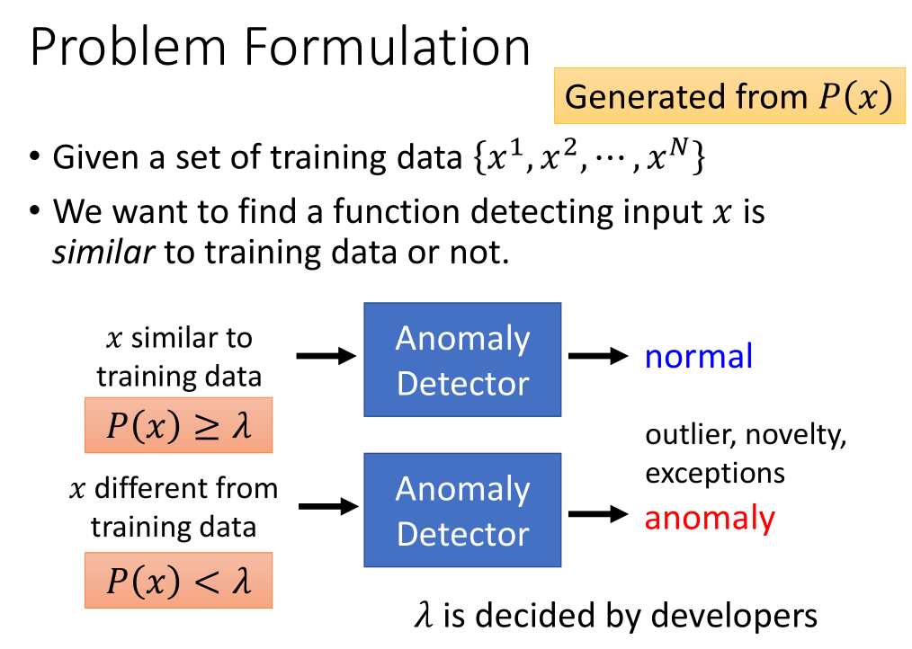

我们刚才可以根据分类器的conference来判断是不是异常的资料，但我们现在只有大量的训练资料，没有label。我们在没有classifier的情况下可以建立一个模型，这个模型是告诉我们P(x)的机率有多大。（根据这些训练资料，我们可以找出一个机率模型，这个模型可以告诉我们某一种行为发生的概率多大）。如果有一个玩家的机率大于某一个阀值（threshold），我们就说他是正常的；如果机率小于某一个阀值（threshold），我们就说他是异常的。

如图这是一个真实的资料，假设每一个玩家可以用二维的向量来描述（一个是说垃圾话的机率，一个是无政府状态发言的机率）。

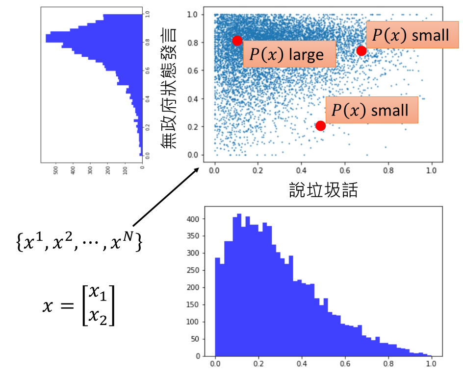

如果我们只看说垃圾话的那一维如图所示，会发现并不是完全不说垃圾话的是最多的。很多人可能会想象说大多数人是在民主状态下发言的（民主时比较想发言，无政府混乱时不想发言），但是实际上统计的结果跟直觉的想象是不一样的，如图所示大多数人有八成的机率是在无政府状态下发言的，因为这个游戏多数时间是在无政府状态下进行的。游戏进行到某一个地方以后，官方决定加入民主机制（20秒内最多人选择的那一个行为是控制角色所采取的决策，这个听起来好像是很棒的主意，马上就遭到了大量的反对。在游戏里面要投票选择民主状态还是无政府状态，若很多人选择无政府状态，就会进入无政府状态。

事实上很多人强烈支持无政府状态，强烈反对民主状态，所以这个游戏多数是在无政府状态下进行。假设一个玩家不考虑自己是要在什么状态下发言，大多数人有八成的机率是在无政府下进行发言，有人甚至觉得多数小白是在民主状态下发言，因为进入了民主状态，所以他要多发言才能够让他的行为被选中，所以小白会特别喜欢在民主状态下发言。

我们还没有讲任何的机率模型，从这个图上可以很直觉的看出一个玩家落在说垃圾的话机率低，通常在无政府状态下发言，这个玩家有可能是一个正常的玩家。假设有玩家落在有五成左右的机率说垃圾话，二成的机率在无政府状态下发言；或者落在有七成左右的机率说垃圾话，七成的机率在无政府状态下发言，显然这个玩家比较有可能是一个不正常的玩家。我们直觉上明白这件事情，但是我们仍然希望用一个数值化的方法告诉我们玩家落在哪里会更加的异常。

#### Maximum Likelihood

我们需要likelihood这个概念：我们收集到n笔资料，假设我们有一个probability density function$f_{\theta}(x)$，其中$\theta$是这个probability density function的参数（$\theta$的数值决定这个probability density function的形状），$\theta$必须要从训练资料中学习出来。假设这个probability density function生成了我们所看到的数据，而我们所做的事情就是找出这个probability density function究竟长什么样子。

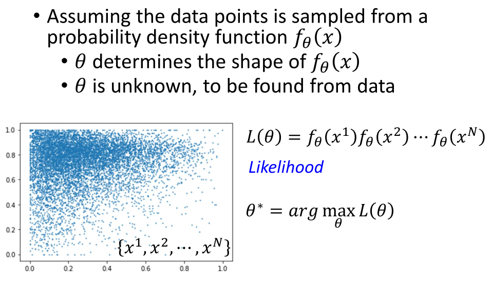

likelihood的意思是：根据probability density function产生如图所示的数据机率有多大。若严格说的话，$f_{\theta}(x)$并不是机率，它的output是probability density；输出的范围也并不是(0,1)，有可能大于1。

$x^1$根据probability density function产生的机率$f_{\theta}(x^1)$，乘以$x^2$根据probability density function产生的机率$f_{\theta}(x^2)$，一直乘到$x^N$根据probability density function产生的机率，得到的结果就是likelihood。likelihood的可能性显然是由$\theta$控制的，选择不同的$\theta$就有不同的probability density function，就可以算出不同的likelihood。

而我们现在并不知道这个$\theta$是多少，所以我们找一个$\theta^*$，使得算出来的likelihood是最大的。

#### Gaussian Distribution

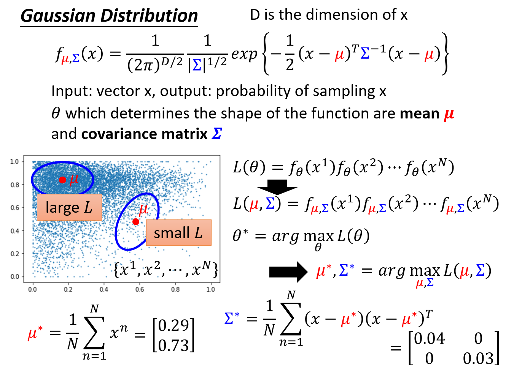

第二项分母为 Determinant 行列式

一个常用的probability density function就是Gaussian Distribution，你可以将这个公式想象为一个function，这个function就是输入一个vector x，输出为这个vector x被sample到的机率。这个function由两个参数（$\mu $和covariance matrix $\sum$）所控制，它们相当于我们刚才所讲的$\theta$。这个Gaussian function的形状由$\mu$和covariance matrix $\mu$所控制。将$\theta$替换为$\mu, \sum$，不同的$\mu, \sum$就有不同的probability density function。

假设如图所示的数据是由左上角的$\mu$来生成的，它的likelihood是比较大（Gaussian function的特性就是在$\mu$附近时data被sample的机率很高）假设这个$\mu$远离高密度，若从这个$\mu$被sample出来的资料应该落在这个蓝色圈圈的范围内，但是资料没有落在这个蓝色圈圈的范围内，显然这样计算出来的likelihood是比较低的。

所以我们要做的事情就是穷举所有的$\mu, \sum$，观察哪个$\mu, 
\sum$计算的likelihood最大，那这个$\mu, \sum$就是我们要找的$\mu^*,\sum^*$。得到$\mu^*,\sum^*$以后就可以知道产生这笔资料的Distribution的形状。

但是往往有同学问的问题是：为什么要用Gaussian Distribution，为什么不用其它的Distribution。最简答的答案是：我选别的Distribution，你也会问同样的问题。Gaussian是真的常用，这是一个非常非常强的假设，因为你的资料分布可能根本就不是Gaussian，有可能你会做的的更好，但不是我们这门课要讲的范围。

如果$f_{\theta}(x)$是一个非常复杂的function（network），而操控这个network的参数有非常大量，那么就不会有那么强的假设了，就会有多的自由去选择function来产生资料。这样就不会限制在看起来就不像Gaussian产生的资料却硬要说是Gaussian产生的资料。因为我们这门课还没有讲到其它进阶的生成模型，所以现在用Gaussian Distribution来当做我们资料是由Gaussian Distribution所产生的。

$\mu^*, \sum^*$可以代入相应的公式来解这个这个公式，$\mu^*$等于将所有的training data x做平均，结果为$\begin{bmatrix}
0.29\\ 
0.73
\end{bmatrix}$，$\sum^*$等于将x减去$\mu^*$乘以x减去$\mu^*$的转置，然后做平均，得到的结果为$\begin{bmatrix}
0.04 & 0\\ 
0 & 0.03
\end{bmatrix}$

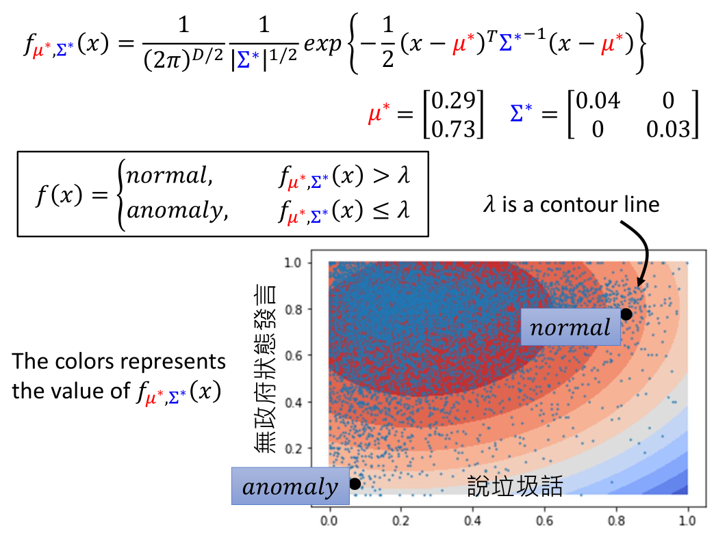

我们根据如图所示的资料找出了$\mu^*$和$\sum^*$，接下来就可以做异常侦测了。将$\mu^*,\sum^*$代入probability density function，若大于某一个阀值（threshold）就说明是正常的，若小于某一个阀值（threshold）就说明是异常的。

每一笔资料都可以代入probability density function算出一个数值，结果如图所示。若落在颜色深的红色区域，就说明算出来的数值越大，越是一般的玩家，颜色浅的蓝色区域，就说明这个玩家的行为越异常。其中$\lambda$就是如图所示的等高线的其中一条，若有一个玩家落在很喜欢说垃圾话，多数喜欢在无政府状态下发言的区域，就说明是一个正常的玩家。若有一个玩家落在很少说垃圾话，特别喜欢在民主时发言，就说明是一个异常的玩家。

#### More Features

machine learning最厉害的就是让machine做，所以你要选择多少feature都可以，把能想到觉得跟判断玩家是正常的还是异常的feature加进去。

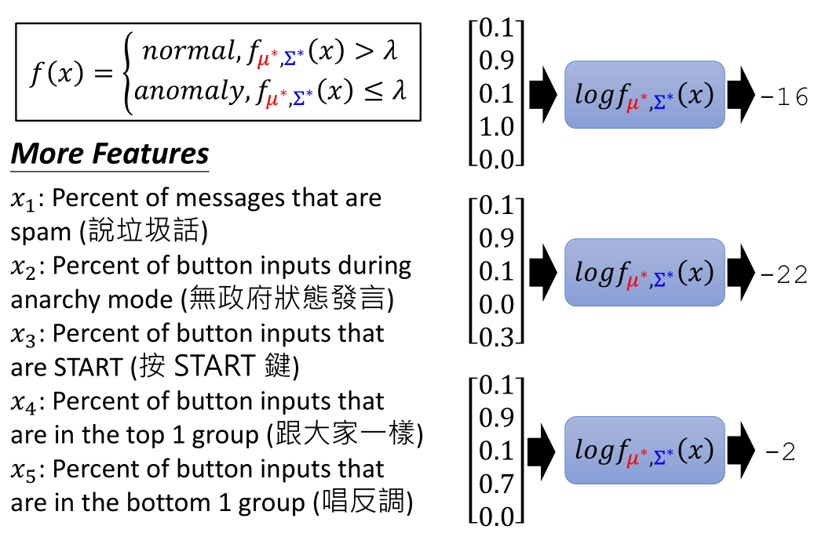

有了这些feature以后就训练训练出$\mu^*, \sum^*$，然后创建一个新的玩家代入这个function，就可以知道这个玩家算出来的分数有多高（对这个function进行log变化，因为一般function计算出来的分数会比较小）。

假设输入的这个玩家有0.1 percent说垃圾话，0,9 percent无政府状态下发言，0.1 percent按START键，1.0 percent跟大家一样，0.0 percent唱反调，这个玩家计算出来的likelihood为-16。

假设输入的这个玩家有0.1 percent说垃圾话，0,9 percent无政府状态下发言，0.1 percent按START键，0.0 percent跟大家一样，0.3 percent唱反调，这个玩家计算出来的likelihood为-22。

假设输入的这个玩家有0.1 percent说垃圾话，0,9 percent无政府状态下发言，0.1 percent按START键，0.7 percent跟大家一样，0.0 percent唱反调，这个玩家计算出来的likelihood为-2。

我们可以看到第一个和第三个玩家除了第四个特征都一样，但是第一个玩家和大家的选择完全一样，第三个玩家和大家的选择在大多数情况下是相同的，这时第一个得到的分数反而低，是因为机器会觉得如果你和所有人完全一样这件事就是很异常的。

### Outlook: Auto-encoder

上述是用生成模型（Generative Model） 来进行异常侦测这件事情，我们也可以使用Auto-encoder来做这件事情。

我们把所有的训练资料训练一个Encoder，Encoder所做的事情是将输入的图片（辛普森）变为code（一个向量），Decoder所做事情是将code解回原来的图片。训练时Encoder和Decoder是同时训练，训练目标是希望输入和输出越接近越好。

测试时将一个图片输入Encoder，Decoder还原原来的图片。如果这张图片是一个正常的照片，很容易被还原为正常的图片。因为Auto-encoder训练时输入的都是辛普森家庭的图片，那么就特别擅长还原辛普森家庭的图片。

但是若你输入异常的图片，通过Encoder变为code，再通过Decoder将coede解回原来的图片时，你会发现无法解回原来的图片。解回来的图片跟输入的图片差很多时，这时你就可以认为这是一张异常的图片。

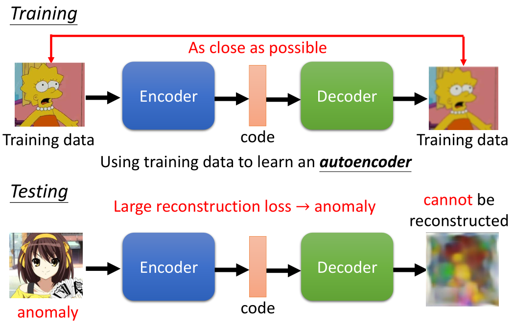

### More …

machine learning中也有其它做异常侦测的方法，比如One-class SVM，只需要正常的资料就可以训练SVM，然后就可以区分正常的还是异常的资料。

Isolated Forest，它所做的事情跟One-class SVM所做的事情很像（给出正常的训练进行训练，模型会告诉你异常的资料是什么模样）。

### Concluding Remarks

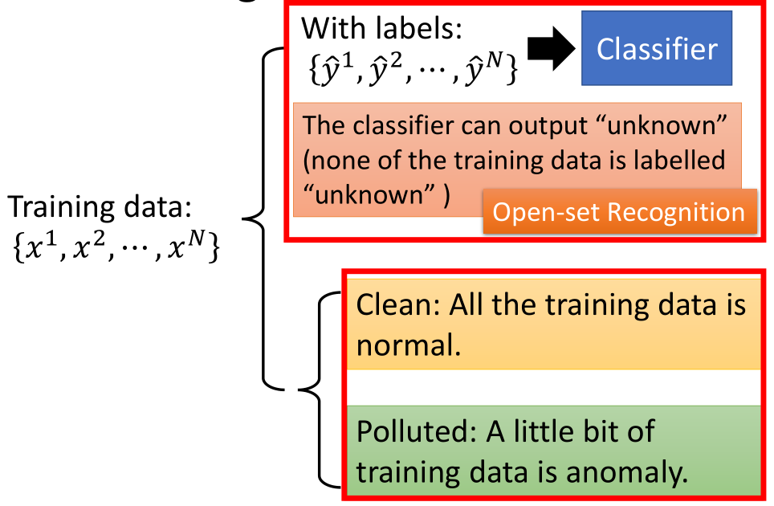

