# Meta Learning

## Meta Learning

Meta learning 总体来说就是让机器学习如何学习。

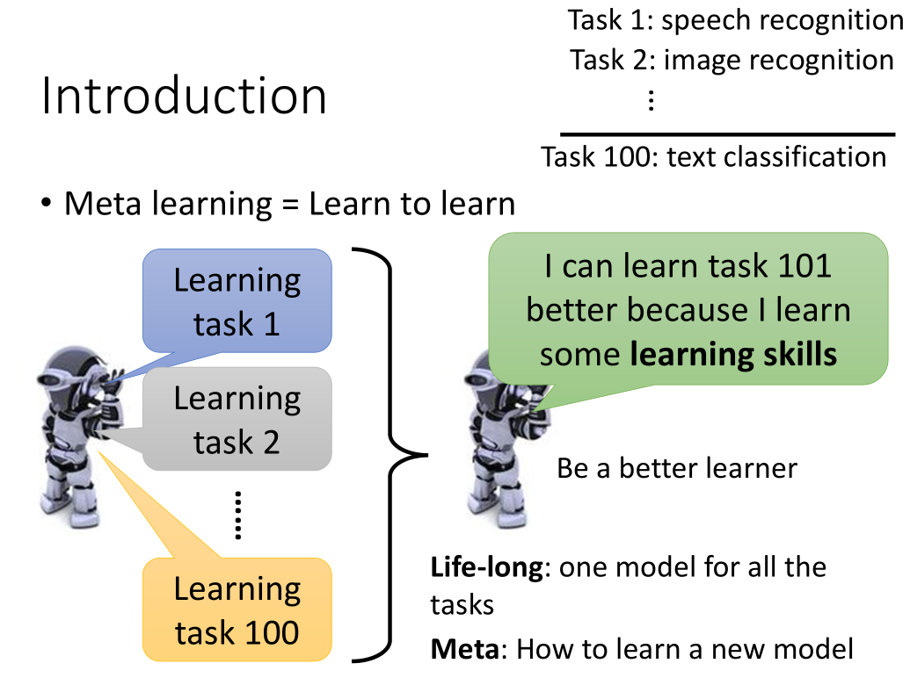

如上图，我们希望机器在学过一些任务以后，它学会如何去学习更有效率，也就是说它会成为一个更优秀的学习者，因为它学会了**学习的技巧**。举例来说，我们教机器学会了语音辨识、图像识别等模型以后，它就可以在文本分类任务上做的更快更好，虽然说语音辨识、图像识别和文本分类没什么直接的关系，但是我们希望机器从先前的任务学习中学会了学习的技巧。

讲到这里，你可能会觉得Meta Learning 和 Life-Long Learning 有点像，确实很像，但是 Life-Long Learning 的着眼点是用同一个模型apply 到不同的任务上，让一个模型可以不断地学会新的任务，而Meta Learning 中不同的任务有不同的模型，我们的着眼点是机器可以从过去的学习中学到学习的方法，让它在以后的学习中更快更好。

我们先来看一下传统的ML 的做法：

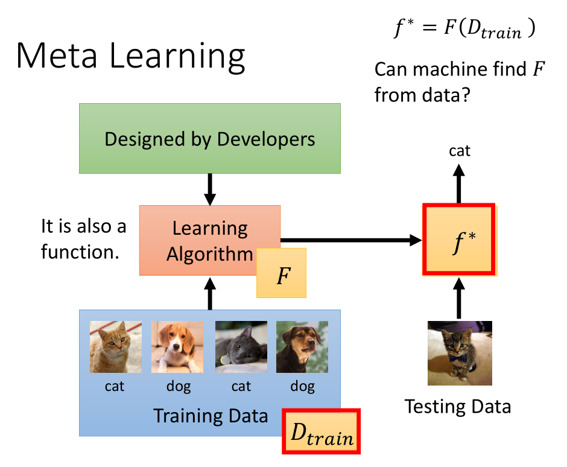

我们过去学过的ML ，通常来说就是定义一个学习算法，然后用训练数据train ，吐出一组参数（或者说一个参数已定的函数式），也就是得到了模型，这个模型可以告诉我们测试数据应该对应的结果。比如我们做猫狗分类，train 完以后，给模型一个猫的照片，它就会告诉我们这是一只猫。

我们把学习算法记为 $F$ ，这个学习算法吃training data 然后吐出目标模型 $f^*$ ，形式化记作：
$$
f^* = F(D_{train})
$$
Meta Learning 就是要让机器自动的找一个可以吃training data 吐出函数 $f^*$ 的函数 $F$ 。

总结一下：

Machine Learning 和Meta Learning 都是让机器找一个function ，只不过要找的function 是不一样的。

我们知道Machine Learning 一共分三步（如下图），Meta Learning 也是一样的，你只要把**Function $f$** 换成**学习的算法 $F$ **这就是Meta Learning 的步骤：

1. 我们先定义一组Learning 的Algorithm 我们不知道哪一个算法是比较好的，

2. 然后定义一个Learning Algorithm 的Loss ，它会告诉你某个算法的好坏，

3. 最后，去train 一发找出哪个Learning Algorithm比较好。

所以接下来我们将分三部分来讲Meta Learning 的具体过程。

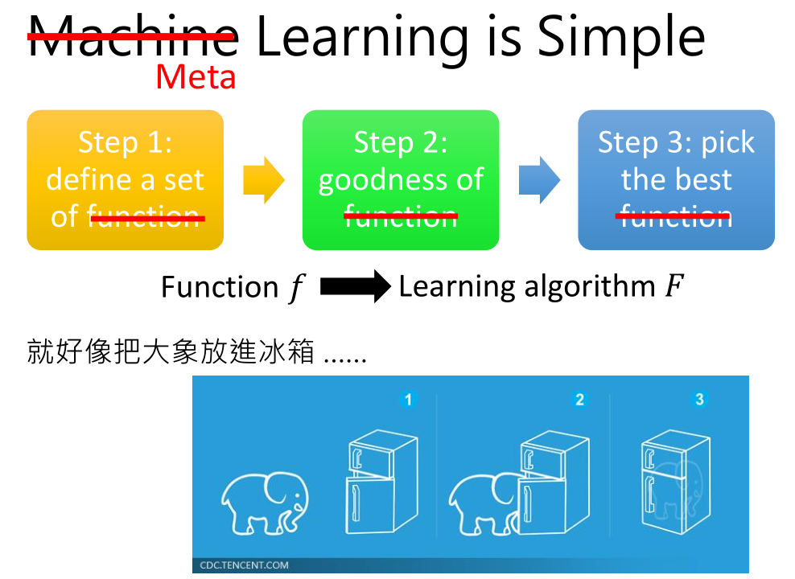

### Three Step of Meta-Learning

#### Define a set of learning algorithm

什么是一组learning algorithm 呢？

如上图所示，灰色框中的，包括网络（模型）架构，初始化参数的方法，更新参数的方法，学习率等要素构成的整个process ，可以被称为一个learning algorithm 。在训练的过程中有很多要素（图中的红色方框）都是人设计的，当我们选择不同的设计的时候就相当于得到了不同的learning algorithm 。现在，我们考虑能不能让机器自己学出某一环节，或者全部process 的设计。比如说，我们用不同的初始化方法得到不同的初始化参数以后，保持训练方法其他部分的相同，且用相同的数据来训练模型，最后都会得到不同的模型，那我们就考虑能不能让机器自己学会初始化参数，直接得到最好的一组初始化参数，用于训练。

我们就希望通过Meta Learning 学习到初始化参数这件事，好，现在我们有了一组learning algorithm ，其中各个算法只有初始化参数的方法未知，是希望机器通过学习得出来的。

那现在我们怎么衡量一个learning algorithm 的好坏呢？

#### Define the goodness of a function F

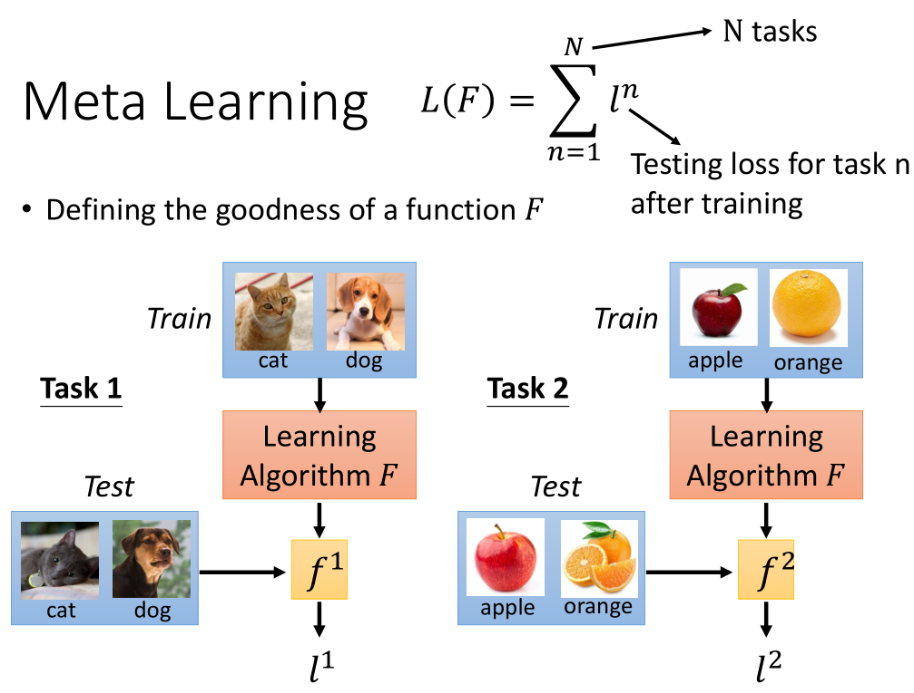

我们需要很多个task，每个task都有training set 和testing set，然后就把learning algorithm 应用到每个task上，用training set 训练，用testing set 测试，得到每一个task 的loss $l^i$，对于一个learning algorithm $F$ 的整体loss 就可以用每个task 的loss 进行求和。
$$
L(F) = \sum\limits_{n=1}^{N}l^n
$$

从这里我们就能看出，meta learning 和传统的machine learning 在训练资料上是有些不同的：

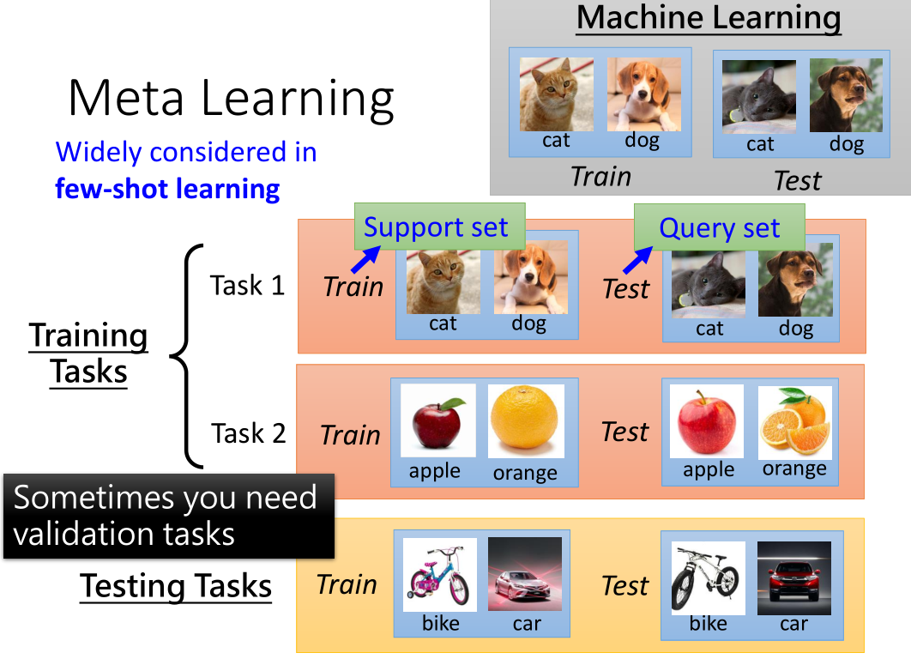

做meta learning 的话你可能需要准备成百上千个task，每个task 都有自己的training set 和testing set 。这里为了区分，我们把meta learning的训练集叫做Training Tasks，测试集叫做Testing Tasks，其中中每个task 的训练集叫做Support set ，测试集叫做 Query set 。

Widely considered in few-shot learning，常常和few-shot learning搭配使用

讲到这里你可能觉得比较抽象，后面会讲到实际的例子，你可能就理解了meta learning 的实际运作方法。Meta learning 有很多方法，加下来会讲几个比较常见的算法，本节课会讲到一个最有名的叫做MAML ，以及MAML 的变形叫做Reptile 。

#### Find the best function $F^*$

定好了loss function 以后我们就要找一个最好的$F^*$ ，这个$F^*$可以使所有的training tasks 的loss 之和最小，形式化的写作下图下面的公式（具体计算方法后面再讲）：

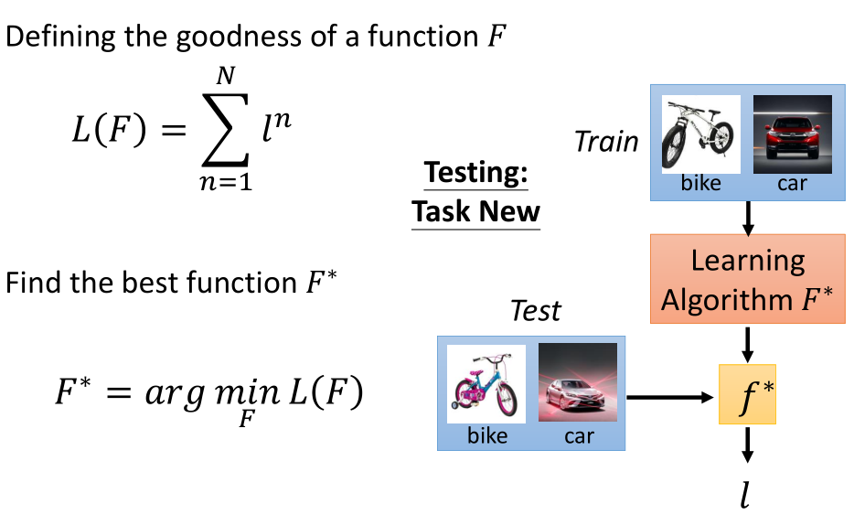

现在我们就有了meta learning 的algorithm ，我们可以用testing tasks 测试这个$F^*$。把测试任务的训练集放丢入Learning Algorithm $F^*$，就会得到一个$f^*$ ，再用测试任务的测试集去计算这个$f^*$ 的loss ，这个loss 就是整个meta learning algorithm 的loss ，来衡量这个方法的好坏。

### Omniglot Corpus

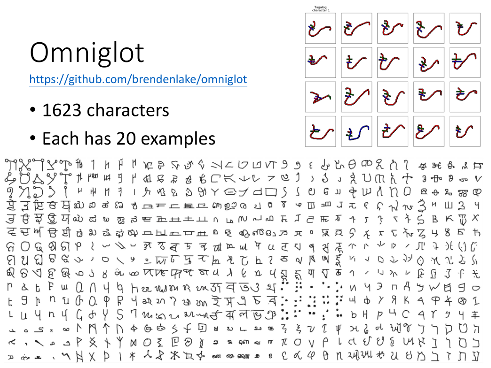

这是一个corpus，这里面有一大堆奇怪的符号，总共有1623个不同的符号，每个符号有20个不同的范例。上图下侧就是那些符号，右上角是一个符号的20个范例。

#### Few-shot Classification

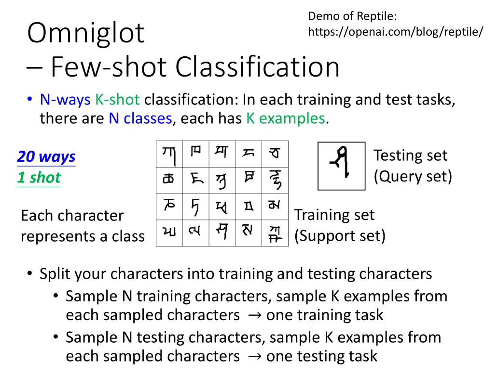

N-ways K-shot classification 的意思是，分N个类别，每个类别有K个样例。

所以，20 ways 1shot 就是说分20类，每类只有1个样例。这个任务的数据集就例如上图中间的20张support set 和1张query set 。

- 把符号集分为训练符号集和测试符号集
  - 从训练符号集中随机抽N个符号，从这N个符号的范例中各随机抽K个样本，这就组成了一个训练任务training task 。
  - 从测试符号集中随机抽N个符号，从这N个符号的范例中各随机抽K个样本，这就组成了一个测试任务testing task 。

### Techniques Today

这两个大概是最近（2019年）比较火的吧，Reptile 可以参考一下openai的这篇文章。

> [Reptile: A Scalable Meta-Learning Algorithm (openai.com)](https://openai.com/blog/reptile/)

MAML

- Chelsea Finn, Pieter Abbeel, and Sergey Levine, “Model-Agnostic Meta-Learning for Fast Adaptation of Deep Networks”, ICML, 2017

Reptile

- Alex Nichol, Joshua Achiam, John Schulman, On First-Order Meta-Learning Algorithms, arXiv, 2018

### MAML

MAML要做的就是学一个初始化的参数。过去你在做初始化参数的时候你可能要从一个distribution 中sample 出来，现在我们希望通过学习，机器可以自己给出一组最好的初始化参数。

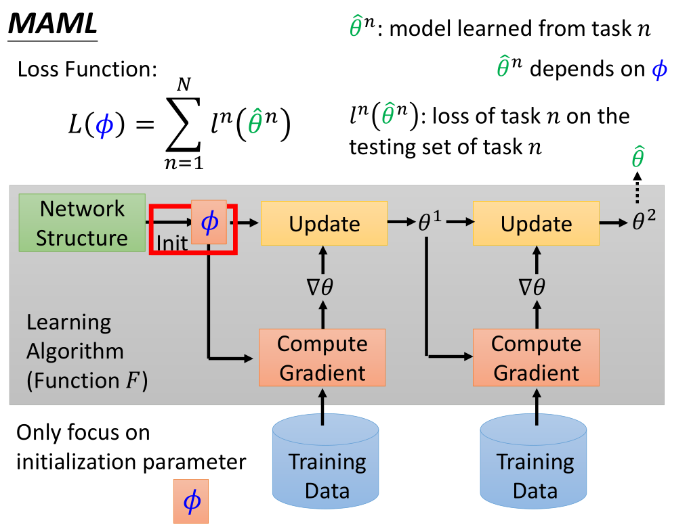

做法就如上图所示，我们先拿一组初始化参数 $\phi$ 去各个training task 做训练，在第n个task 上得到的最终参数记作 $\hat{θ}^n$ ，而$l^n(\hat{θ}^n)$ 代表第n个task 在其testing set 上的loss，此时整个MAML 算法的Loss 记作：
$$
L(\phi) = \sum\limits_{n=1}^{N}l^n(\hat{θ}^n)
$$
这里提示一下，MAML就是属于需要所有任务的网络架构相同的meta learning algorithm，因为其中所有的function 要共用相同的初始化参数 $\phi$ 。

那怎么minimize $L(\phi)$ 呢？

答案就是Gradient Descent，你只要能得到 $L(\phi)$ 对 $\phi$ 的梯度，那就可以更新 $\phi$ 了，结束。
$$
\phi = \phi - \eta \nabla_{\phi}L(\phi)
$$
这里我们先假装已经会算这个梯度了，先把这个梯度更新参数的思路理解就好，我们先来看一下MAML 和 Model Pre-training 在Loss Function 上的区别。

#### MAML v.s. Model Pre-training

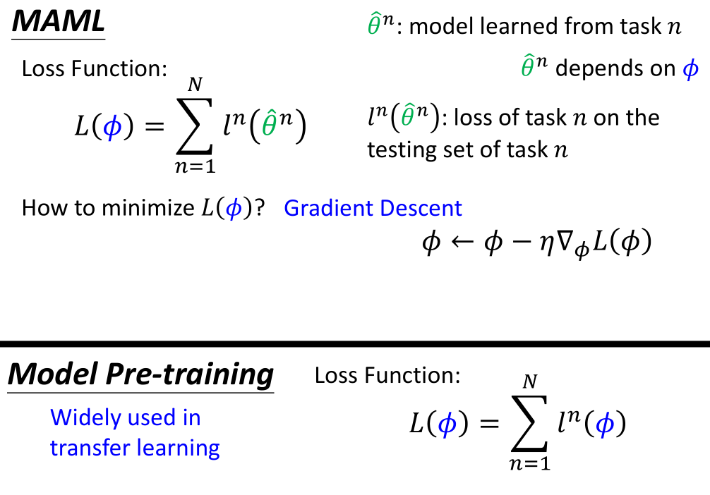

通过上图我们仔细对比两个损失函数，可以看出，MAML是根据训练完的参数 $\hat{θ}^n$ 计算损失，计算的是训练好的参数在各个task 的训练集上的损失；而预训练模型的损失函数则是根据当前初始化的参数计算损失，计算的是当前参数在要应用pre-training 的task 上的损失。

再举一个形象一点的例子：

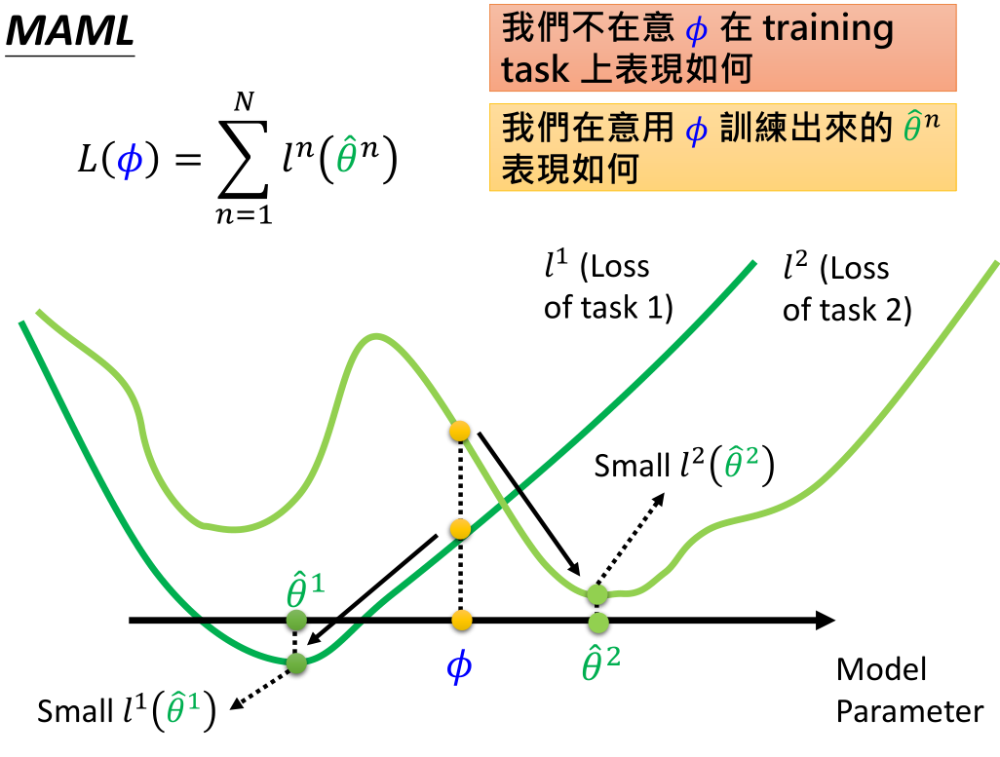

（横轴是模型参数，简化为一个参数，纵轴是loss）

如上图说的，我们在意的是这个初始化参数经过各个task 训练以后的参数在对应任务上的表现，也就是说如果初始参数 $\phi$ 在中间位置（如上图），可能这个位置根据当前参数计算的总体loss 不是最好的，但是在各个任务上经过训练以后 $\hatθ$ 都能得到较低的loss（如 $\hat{θ}^1$、$\hat{θ}^2$），那这个初始参数 $\phi$ 就是好的，其loss 就是小的。

反之，在Model pre-training 上：

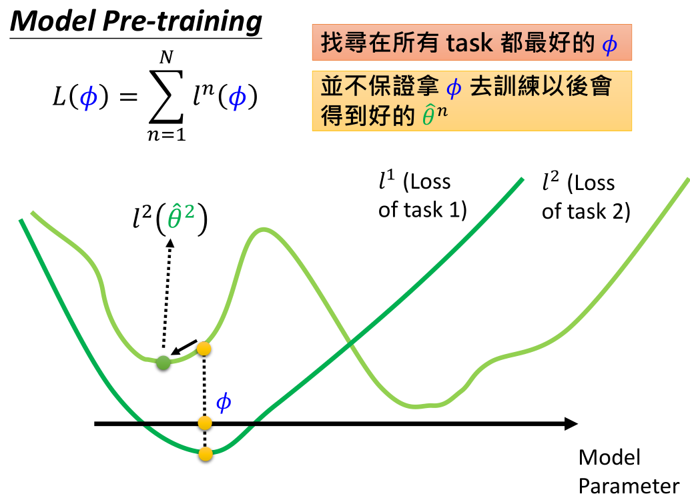

我们希望直接通过这个 $\phi$ 计算出来的各个task 的loss 是最小的，所以它的取值点就可能会是上图的样子。此时在task 2上初始参数可能不能够被更新到global minima，会卡在local minima 的点 $\hat{θ}^2$。

综上所述：

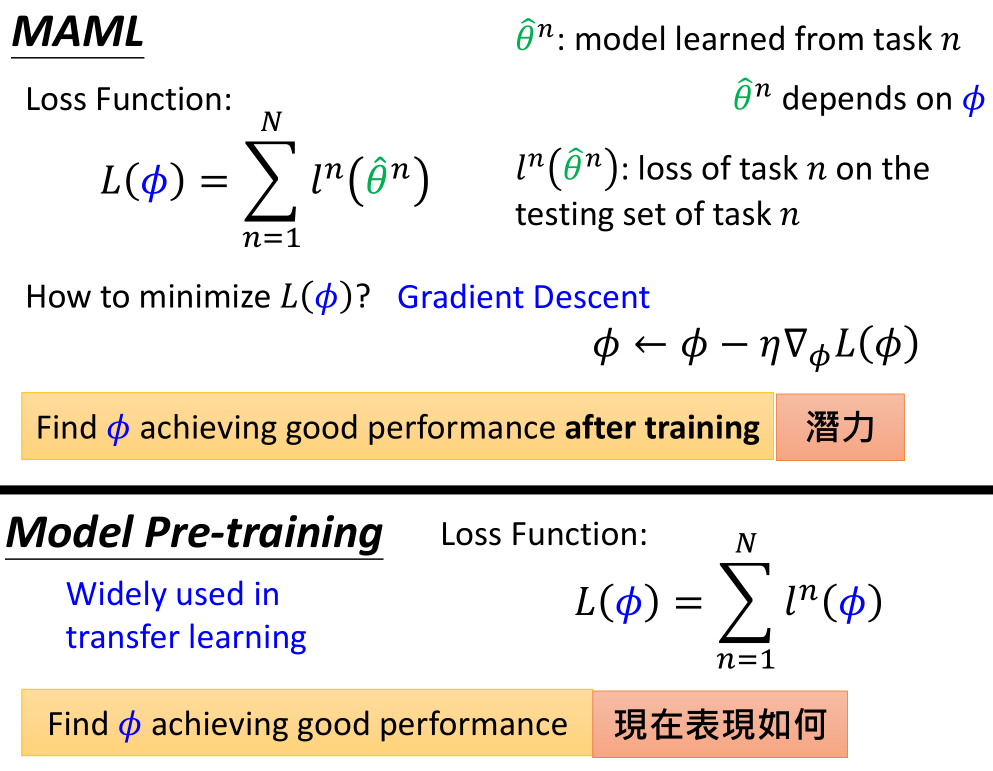

MAML 是要找一个 $\phi$ 在**训练以后**具有好的表现，注重参数的潜力，Model Pre-training 是要找一个 $\phi$ 在训练任务上得到好的结果，注重现在的表现。

#### One-Step Training

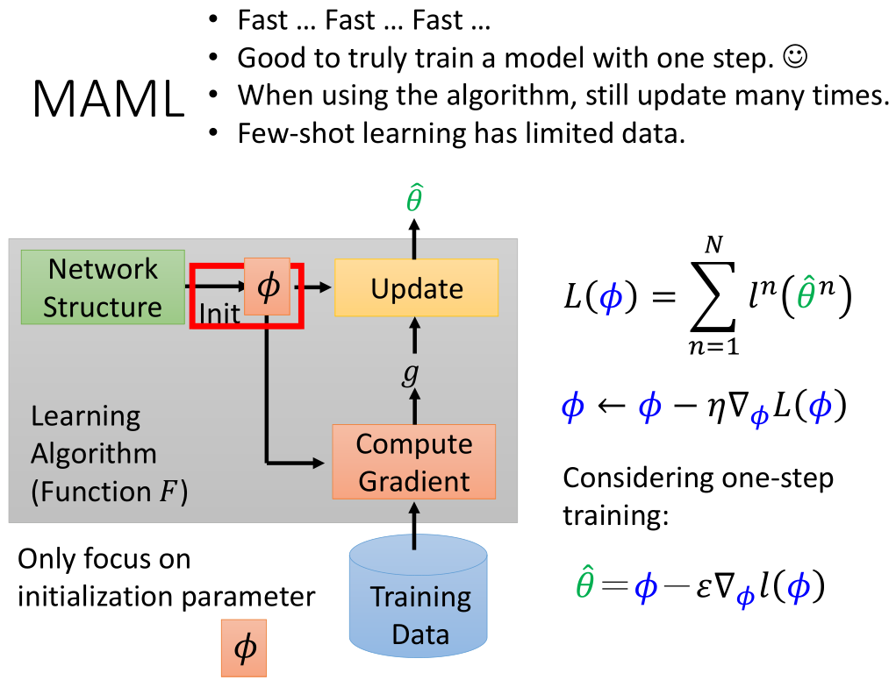

在MAML 中我们假设只update 参数一次。所以在训练阶段，你只做one-step training ，参数更新公式就变成
$$
\hat{\theta}=\phi-\varepsilon \nabla_{\phi} l(\phi)
$$
只更新一次是有些理由的：

- 为了速度，多次计算梯度更新参数是比较耗时的，而且MAML 要train 很多个task
- 把只更新一次就得到好的performance作为目标，这种情况下初始化参数是好的参数
- 实际上你可以在training 的时候update 一次，在测试的时候，解testing task 的时候多update 几次，结果可能就会更好
- 如果是few-shot learning 的task，由于data 很少，update 很多次很容易overfitting

#### Toy Example

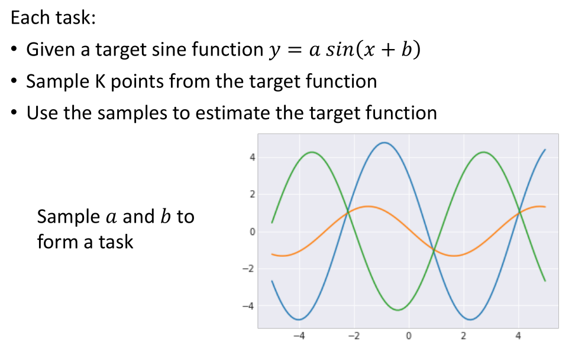

- 要拟合的目标函数是 $y=asin(x+b)$ 
- 对每个函数，也就是每个task，sample k个点
- 通过这些点做拟合

我们只要sample 不同的a, b就可以得到不同的目标函数。

来看看对比结果：

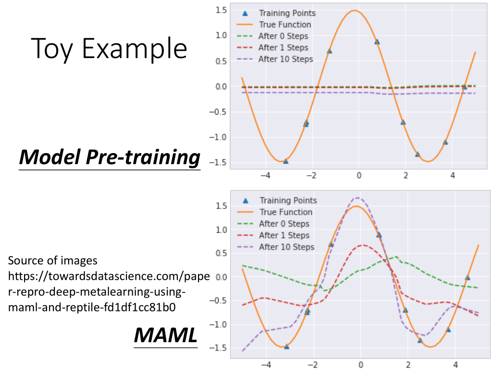

可以看到，预训练模型想要让参数在所有的training task上都做好，也就是一大堆sin函数，多个task叠加起来，导致预训练模型的参数最后拟合得到的是一条直线。

MAML的结果直接用上去是绿色的线，在测试task 上training step 增加的过程中有明显的拟合效果提升。

#### Omniglot & Mini-ImageNet

在MAML 的原始论文中也把这个技术用于Omniglot & Mini-ImageNet

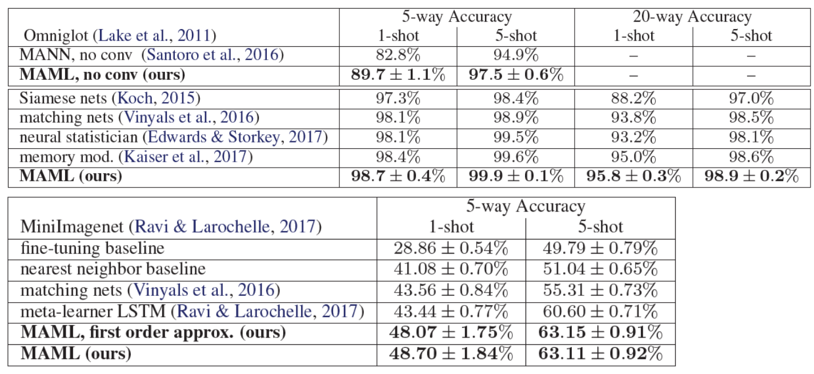

> https://arxiv.org/abs/1703.03400

我们看上图下侧，MAML, first order approx 和 MAML 的结果很相似，那first order approx 是怎么做的呢？解释这个东西需要一点点数学：

#### first-order approximation

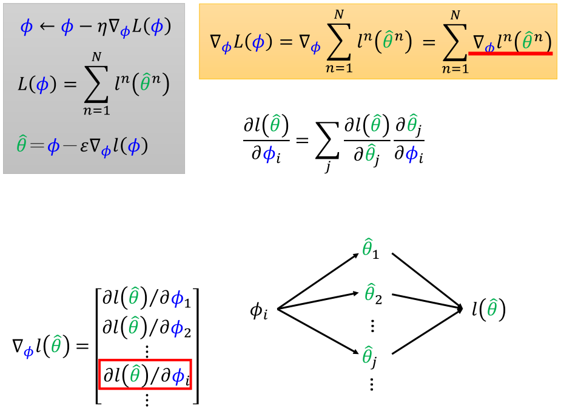

MAML 的参数更新方法如上图左上角灰色方框所示，我们来具体看看这个 $\nabla_\phi L(\phi)$ 怎么算，把灰框第二条公式带入，如黄色框所示。其中 $\nabla_\phi l^n(\hat{θ}^n)$ 就是左下角所示，它就是loss 对初始参数集 $\phi$ 的每个分量的偏微分。也就是说 $\phi_i$ 的变化会通过 $\hat{θ}$ 中的每个参数 $\hat{θ}_i$ ，影响到最终训练出来的 $\hat{θ}$ ，所以根据chain rule 你就可以把左下角的每个偏微分写成上图中间的公式。
$$
\frac{\partial{l(\hat{θ})}}{\partial{\phi_i}} = \sum\limits_{j}\frac{\partial{l(\hat{θ})}}{\partial\hat{θ}_j}\frac{\partial\hat{θ}_j}{\partial{\phi}_i}
$$
上式中前面的项 $\frac{\partial{l(\hat{θ})}}{\partial\hat{θ}_j}$ 是容易得到的，具体的计算公式取决于你的model 的loss function ，比如cross entropy 或者regression，结果的数值却决于你的训练数据的测试集。

后面的项 $\frac{\partial\hat{θ}_j}{\partial{\phi}_i}$ 是需要我们算一下。可以分成两个情况来考虑：

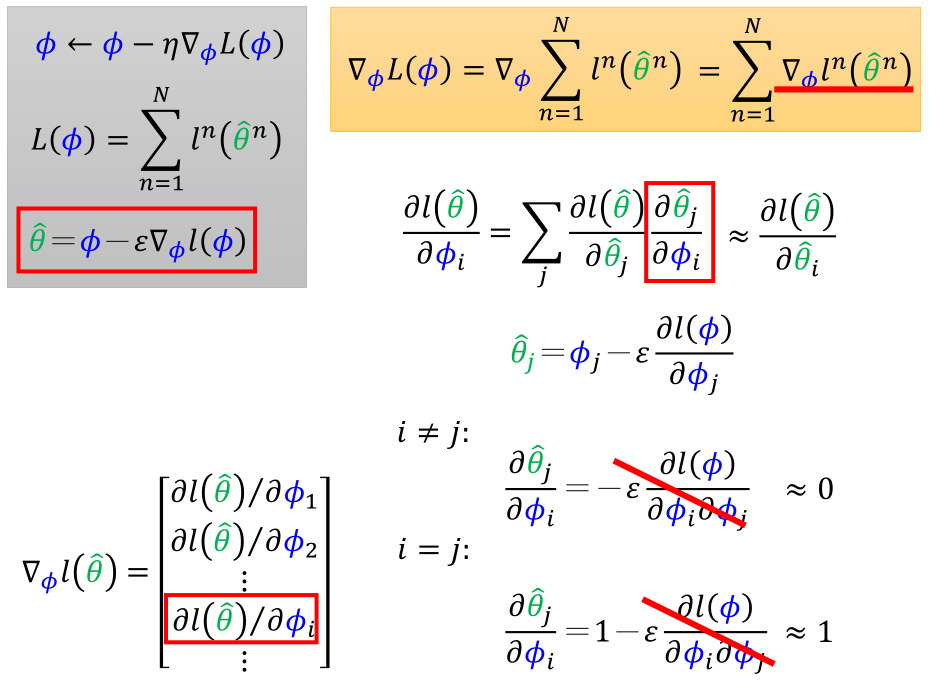

根据灰色框中第三个式子，我们知道 $\hat{θ}_j$ 可以用下式代替：
$$
\hat{θ}_j = \phi_j - \epsilon\frac{\partial{l(\phi)}}{\partial{\phi_j}}
$$
此时，对于 $\frac{\partial\hat{θ}_j}{\partial{\phi}_i}$ 这一项，分为i=j 和 i!=j 两种情况考虑，如上图所示。在MAML 的论文中，作者提出一个想法，不计算二次微分这一项。如果不计算二次微分，式子就变得非常简单，我们只需要考虑i=j 的情况，i!=j 时偏微分的答案总是0。

此时， $\frac{\partial{l(\hat{θ})}}{\partial\phi_i}$ 就等于 $\frac{\partial{l(\hat{θ})}}{\partial{θ}_i}$ 。这样后一项也解决了，那就可以算出上图左下角 $\nabla_\phi l(\hat{θ})$ ，就可以算出上图黄色框  $\nabla_\phi L(\phi)$ ，就可以根据灰色框第一条公式更新 $\phi$ ，结束。

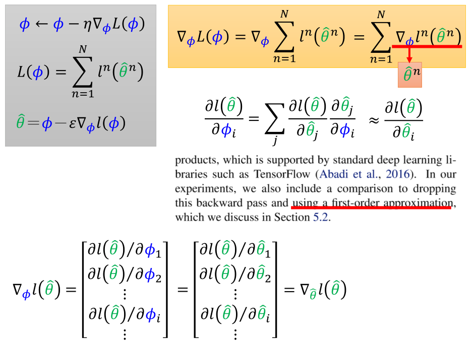

在原始paper 中作者把，去掉二次微分这件事，称作using a first-order approximation 。

当我们把二次微分去掉以后，上图左下角的 $\nabla_\phi l(\hat{θ})$ 就变成 $\nabla_\hat{θ} l(\hat{θ})$ ，所以我们就是再用 $\hat{θ}$ 直接对 $\hat{θ}$ 做偏微分，就变得简单很多。

#### Real Implementation

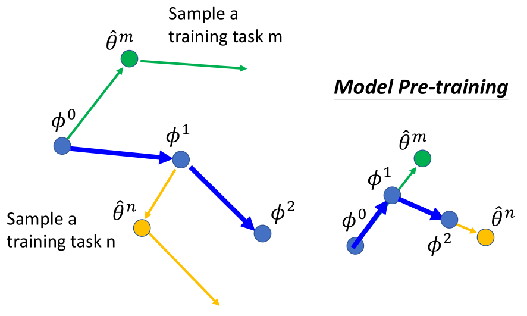

实际上，我们在MAML 中每次训练的时候会拿一个task batch 去做。如上图，当我们初始化好参数 $\phi_0$ 我们就开始进行训练，sample出task m，完成task m训练以后，根据一次update 得到 $\hat{θ}^m$ ，我们再计算一下 $\hat{θ}^m$ 对它的loss function 的偏微分，也就是说我们虽然只需要update 一次参数就可以得到最好的参数，但现在我们update 两次参数， $\phi $ 的更新方向就和第二次更新参数的方向相同，可能大小不一样，毕竟它们的learning rate 不一样。

刚才我们讲了在精神上MAML 和Model Pre-training 的不同，现在我们来看看这两者在实际运作上的不同。如上图，预训练的参数更新完全和每个task 的gradient 的方向相同。

#### Translation

这里有一个把MAML 应用到机器翻译的例子：

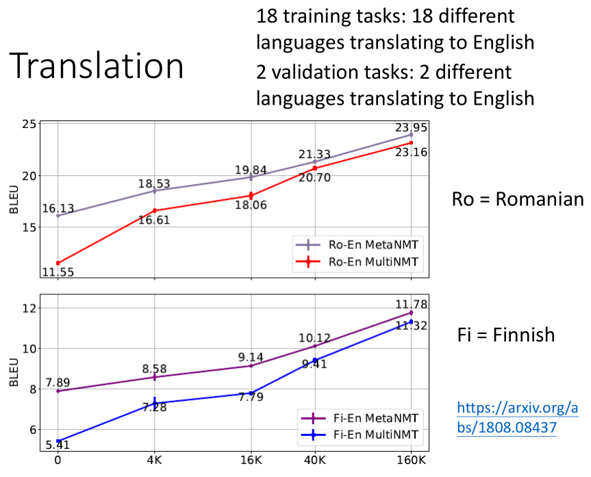

18个不同的task：18种不同语言翻译成英文

2个验证task：2种不同语言翻译成英文

Ro 是validation tasks 中的任务，Fi 即没有出现在training tasks 也没出现在validation tasks，是test的结果

横轴是每个task 中的训练资料量。MetaNMT 是MAML 的结果，MultiNMT 是 Model Pre-training 的结果，我们可以看到在所有case上面，前者都好过后者，尤其是在训练资料量少的情况下，MAML 更能发挥优势。

### Reptile

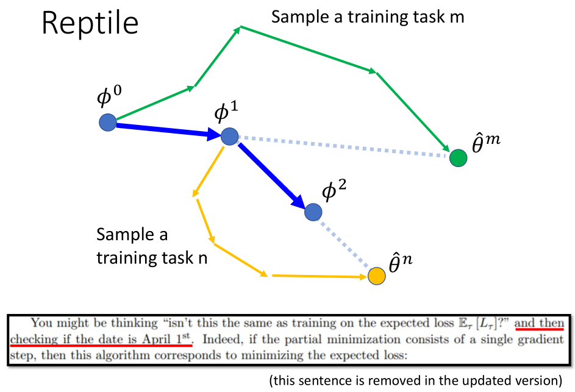

做法就是初始化参数 $\phi_0$ 以后，通过在task m上训练更新参数，可以多更新几次，然后根据最后的 $\hat{θ}^m$ 更新 $\phi_0$ ，同样的继续，训练在task n以后，多更新几次参数，得到 $\hat{θ}^n$ ，据此更新 $\phi_1$ ，如此往复。

你可能会说，这不是和预训练很像吗，都是根据参数的更新来更新初始参数，希望最后的参数在所有的任务上都能得到很好的表现。作者自己也说，如上图下侧。

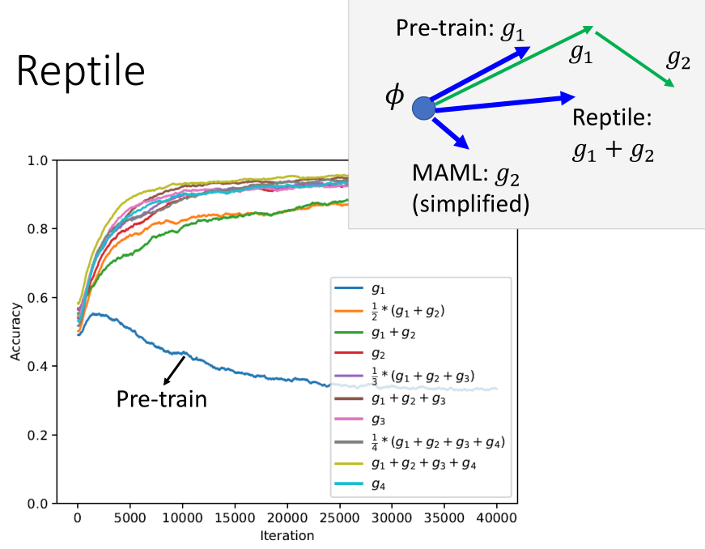

通过上图来对比三者在更新参数 $\phi$ 的不同，似乎Reptile 在综合两者。但是Reptile 并没有限制你只能走两步，所以如果你多更新几次参数多走几步，或许Reptile 可以考虑到另外两者没有考虑到的东西。

上图中，蓝色的特别惨的线是pre-training ，所以说和预训练比起来meta learning 的效果要好一些。

### More...

上面所有的讨论都是在初始化参数这件事上，让机器自己学习，那有没有其他部分可以让机器学习呢，当然有很多。

比如说，学习网络结构和激活函数、学习如何更新参数......

[Automatically Determining Hyperparameters](https://www.youtube.com/watch?v=c10nxBcSH1) AutoML

### Think about it...

我们使用MAML 或Reptile 来寻找最好的初始化参数，但是这个算法本身也需要初始化参数，那我们是不是也要训练一个模型找到这个模型的初始化参数......

就好像说神话中说世界在乌龟背上，那这只乌龟应该在另一只乌龟背上......

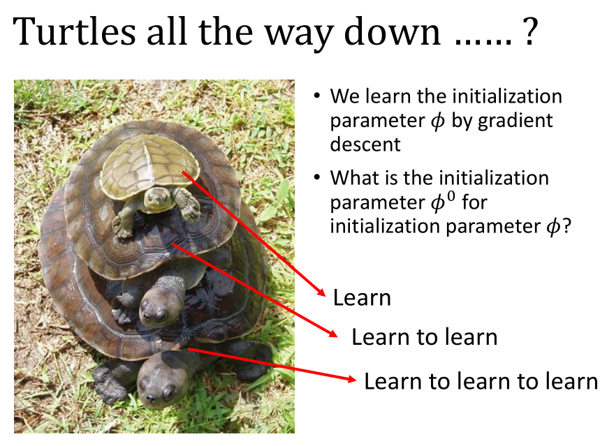

### Crazy Idea?

传统的机器学习和深度学习的算法基本上都还是gradient descent ，你能不能做一个更厉害的算法，只要我们给他所有的training data 它就可以返回给我们需要model，它是不是梯度下降train 出来的不重要，它只要能给我一个能完成这个任务的model 就好。

或者，反之我们最后都要应用到测试集上，那我们干脆就搞一个大黑箱，把training set 和testing set 全部丢给他，它直接返回testing data 的结果，连测试都帮你做好。这些想法能不能做到，留到下一节讲。

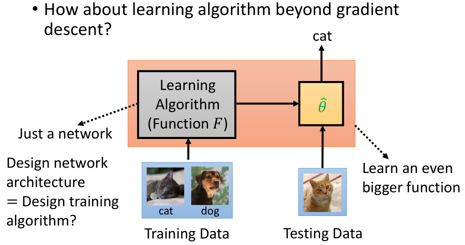

### Gradient Descent as LSTM

上节课讲了MAML 和Reptile ，我们说Meta Learning 就是要让机器自己learn 出一个learning 的algorithm。今天我们要讲怎么把我们熟悉的learning algorithm ：Gradient Descent ，当作一个LSTM 来看待，你直接把这个LSTM train下去，你就train 出了Gradient Descent 这样的Algorithm 。（也就是说我现在要把学习算法，即参数的更新算法当作未知数，用Meta Learning 训练出来）

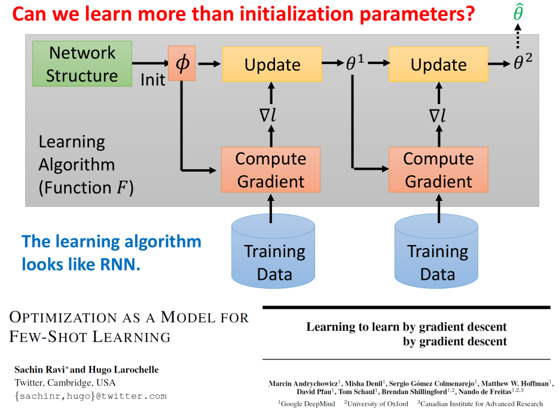

上周我们讲的MAML 和Reptile 都是在Initial Parameters 上做文章，用Meta Learning 训练出一组好的初始化参数，现在我们希望能更进一步，通过Meta Learning 训练出一个好的参数update 算法，上图黄色方块。

我们可以把整个Meta Learning 的算法看作RNN，它和RNN 有点像的，同样都是每次吃一个batch 的data ，RNN 中的memory 可以类比到Meta Learning 中的参数 $\theta$ 。

把这个Meta Learning 的算法看作RNN 的思想主要出自两篇paper ：

> [Optimization as a Model for Few-Shot Learning | OpenReview](https://openreview.net/forum?id=rJY0-Kcll&noteId=ryq49XyLg)
>
> Sachin Ravi, Hugo Larochelle
>
> [[1606.04474\] Learning to learn by gradient descent by gradient descent (arxiv.org)](https://arxiv.org/abs/1606.04474)
> Marcin Andrychowicz, Misha Denil, Sergio Gomez, Matthew W. Hoffman, David Pfau, Tom Schaul, Brendan Shillingford, Nando de Freitas

第二篇文章的题目非常有趣，也说明了此篇文章的中心：让机器学习用梯度下降学习这件事，使用的方法就是梯度下降。

#### Review: RNN

从与之前略微不同的角度快速回顾一下RNN。

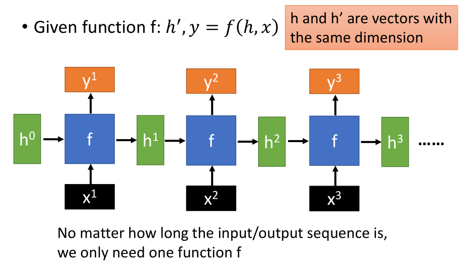

RNN就是一个function $f$，这个函数吃$h,x$ 吐出 $h',y$  ，每个step 会有一个$x$（训练样本数据）作为input，还有一个初始的memory 的值 $h_0$ 作为input，这个初始参数有时候是人手动设置的，有时候是可以让模型learn 出来的，然后输出一个$y$和一个 $h^1$ 。到下一个step，它吃上一个step 得到的 $h^1$ 和新的$x$，也是同样的输出。需要注意的是，$h$的维度都是一致的，这样同一个$f$ 才能吃前一个step 得到$h$ 。这个过程不断重复，就是RNN。

所以，无论多长的input/output sequence 我们只需要一个函数$f$ 就可以运算，无论你的输入再怎么多，模型的参数量不会变化，这就是RNN 厉害的地方，所以它特别擅长处理input 是一个sequence 的状态。（比如说自然语言处理中input 是一个长句子，用word vector 组成的很长的sequence）

我们如今用的一般都是RNN 的变形LSTM，而且我们现在说使用RNN 基本上就是在指使用LSTM 的技术。那LSTM 相比于RNN 有什么特别的地方呢。

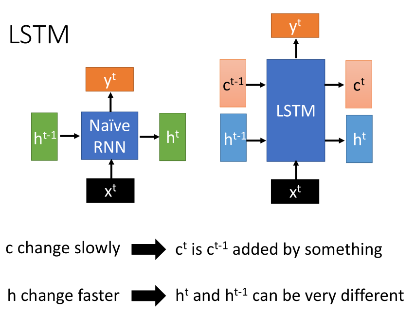

如上图，LSTM（右）相比于RNN ，把input 的h 拆解成两部分，一部分仍然叫做 $h$ ，一部分我们叫做 $c$ 。为什么要这样分呢，你可以想象是因为 $c$ 和 $h$ 扮演了不同的角色。

- $c$ 变化较慢，通常就是把某个向量加到上一个 $c^{t-1}$ 上就得到了新的 $c^t$ ，这个 $c^t$ 就是LSTM 中memory cell 存储的值，由于这个值变化很慢，所以LSTM 可以记住时间比较久的数据
- $h$ 变化较快， $h^{t-1}$ 和 $h^t$ 的变化是很大的

#### Review: LSTM

我们接下来看看LSTM 的做法和结构：

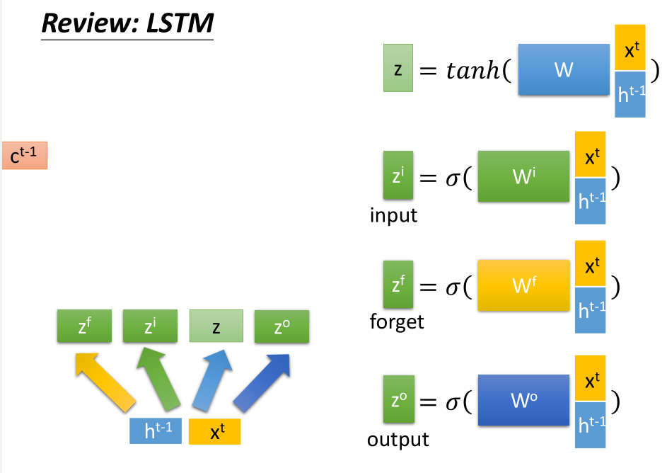

$c^{t-1}$ 是memory 记忆单元，把$x$和$h$拼在一起乘上一个权重矩阵W，再通过一个tanh 函数得到input $z$，$z$是一个向量。同样的x和h拼接后乘上对应的权重矩阵得到对应向量input gate $z^i$ ，forget gate $z^f$ ，output  gate $z^o$ ，接下来：

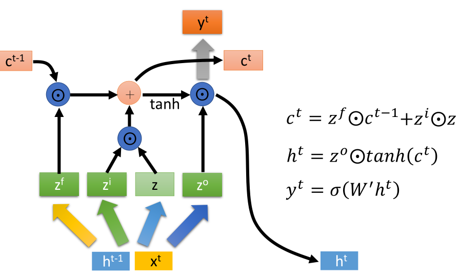

 $z^f \cdot c^{t-1}$ 决定是否保留上个memory， $z^i \cdot z$ 决定是否把现在的input 存到memory；

通过 $z^o \cdot tanh(c^t)$ 得到新的 $h^t$ ；

$W'$ 乘上新的 $h^t$ ，再通过一个sigmoid function 得到当前step 的output $y^t$ ；

重复上述步骤，就是LSTM 的运作方式：

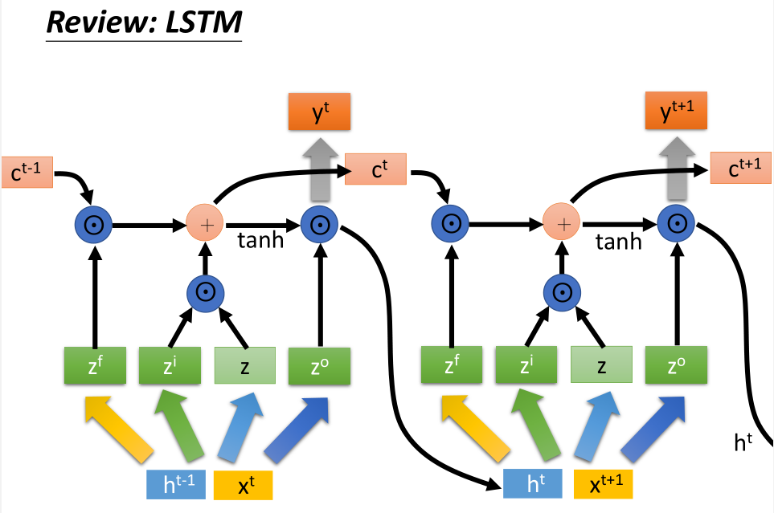

好，讲了这么多，它和Gradient Descent 到底有什么样的关系呢？

#### Similar to gradient descent based algorithm

我们把梯度下降参数θ更新公式和LSTM 的memory c更新公式都列出来，如下：

$$
\theta^{t}=\theta^{t-1}-\eta \nabla_{\theta} l \\
c^{t}=z^{f} \odot c^{t-1}+z^{i} \odot z\\h^{t}=z^{o} \odot \tanh \left(c^{t}\right)\\y^{t}=\sigma\left(W^{\prime} h^{t}\right)
$$
我们知道在gradient descent 中我们在每个step 中，把旧的参数减去，learning rate 乘梯度，作为更新后的新参数，此式和LSTM 中memory 单元 $c$ 有些相似，我们就把 $c$ 替换成 $\theta$ ：

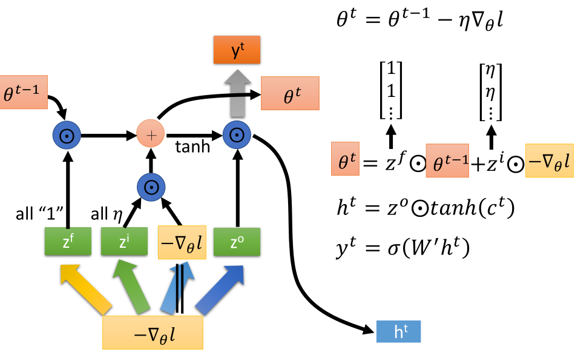

接下来我们再做一些变换。输入$h^{t-1}$ 来自上一个step，$x^t$ 来自外界输入，我们就把$h^{t-1}$ $x^t$ 换成$-\nabla_\theta l $ 。然后我们假设从input 到$z$ 的公式中乘的matrix 是单位矩阵，所以$z$ 就等于$-\nabla_\theta l $ 。再然后，我们把$z^f$ 定为全1的列向量，$z^i$ 定位全为learning rate 的列向量，此时LSTM 的memory $c$ 的更新公式变得和Gradient Descent 一样。

所以你可以说Gradient Descent 就是LSTM 的简化版，LSTM中input gate 和forget gate是通过机器学出来的，而在梯度下降中input gate 和forget gate 都是人设的，input gate 永远都是学习率，forget gate 永远都是不可以忘记。

现在，我们考虑能不能让机器自己学习gradient descent 中的input gate 和forget gate 呢？

另外，input的部分刚才假设只有gradient 的值，实作上可以拿更多其他的数据作为input，比如常见的做法，可以把 $c^{t-1}(\theta^{t-1})$ 在现在这个step算出来的loss 作为输入来control 这个LSTM的input gate 和forget gate 的值。

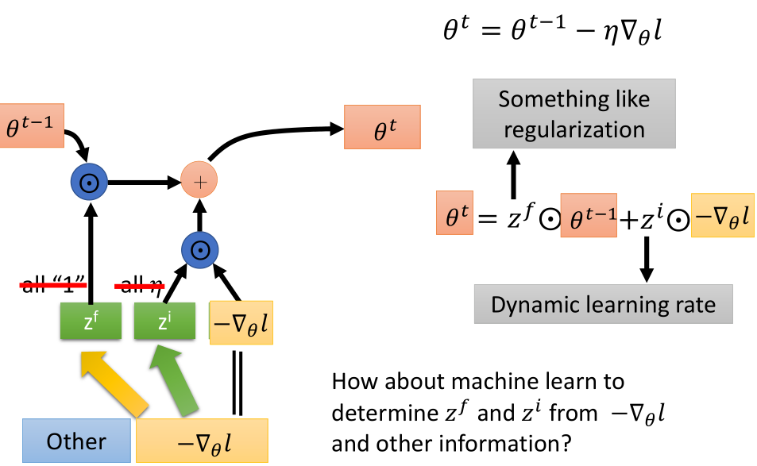

如果们可以让机器自动的学input gate 和forget gate 的值意味着什么？意味着我们可以拥有动态的learning rate，每一个dimension在每一个step的learning rate 都是不一样的而不是一个不变的值。

而 $z^f$ 就像一个正则项，它做的事情是把前一个step 算出来的参数缩小。我们以前做的L2 regularization 又叫做Weight Decay ，为什么叫Weight Decay，因为如果你把update的式子拿出来看，每个step 都会把原来的参数稍微变小，现在这个$z^f$ 就扮演了像是Weight Decay的角色。但是我们现在不是直接告诉机器要做多少Weight Decay，而是要让机器学出来，它应该做多少Weight Decay 。

#### LSTM for Gradient Descent

我们来看看一般的LSTM和for Gradient Descent 的LSTM：

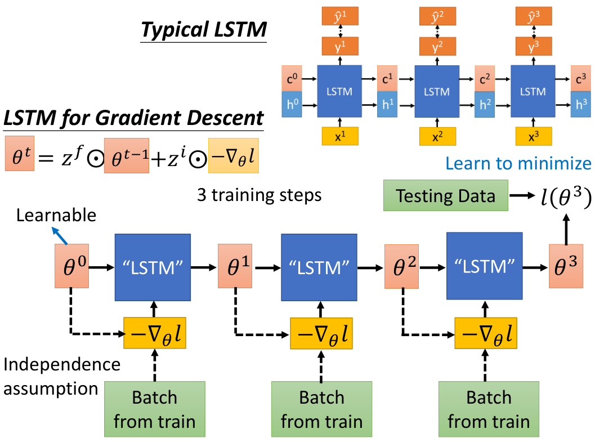

Typical LSTM 就是input x ，output c 和 h，每个step 会output 一个y ，希望y 和label 越接近越好。

Gradient Descent 的LSTM是这样：我们先sample 一个初始参数θ ，然后sample 一个batch 的data ，根据这一组data 算出一个gradient $\nabla_\theta l$ ，把负的gradient input 到LSTM 中进行训练，这个LSTM 的参数过去是人设死的，我们现在让参数在Meta Learning 的架构下被learn 出来。上述的这个update 参数的公式就是：
$$
\theta^t = z^f \cdot \theta^{t-1} + z^i \cdot -\nabla_\theta l
$$
$z^f$ $z^i$ 以前是人设死的，现在LSTM 可以自动把它学出来。

现在就可以output 新的参数$\theta^1$ ，接着就是做一样的事情：再sample 一组数据，算出梯度作为新的input，放到LSTM 中就得到output $\theta^2$ ，以此类推，不断重复这个步骤。最后得到一组参数$θ^3$（这里假设只update 3次，实际上要update 更多次），拿这组参数去应用到Testing data 上算一下loss ： $l(θ^3)$ ，这个loss 就是我们要minimize 的目标，然后你就要用gradient descent 调LSTM 的参数，去minimize 最后的loss 。

这里有一些需要注意的地方。在一般的LSTM 中$c$ 和$x$ 是独立的，LSTM 的memory 存储的值不会影响到下一次的输入，但是Gradient Descent LSTM 中参数$θ$会影响到下一个step 中算出的gradient 的值，如上图虚线所示。

所以说在Gradient Descent LSTM 中现在的参数会影响到未来看到的梯度。所以当你做back propagation 的时候，理论上你的error signal 除了走实线的一条路，它还可以走$θ$到$-\nabla_\theta l$ 虚线这一条路，可以通过gradient 这条路更新参数。但是这样做会很麻烦，和一般的LSTM 不太一样了，一般的LSTM $c$ 和$x$ 是没有关系的，现在这里确实有关系，为了让它和一般的LSTM 更像，为了少改一些code ，我们就假设没有虚线那条路，结束。现在的文献上其实也是这么做的。

另外，在LSTM input 的地方memory 中的初始值$\theta_0$可以通过训练直接被learn 出来，所以在LSTM中也可以做到和MAML相同的事，可以把初始的参数跟着LSTM一起学出来。

#### Real Implementation

LSTM 的memory 就是要训练的network 的参数，这些参数动辄就是十万百万级别的，难道要开十万百万个cell 吗？平常我们开上千个cell 就会train 很久，所以这样是train不起来的。在实际的实现上，我们做了一个非常大的简化：我们所learn 的LSTM 只有一个cell 而已，它只处理一个参数，所有的参数都共用一个LSTM。所以就算你有百万个参数，都是使用这同一个LSTM 来处理。

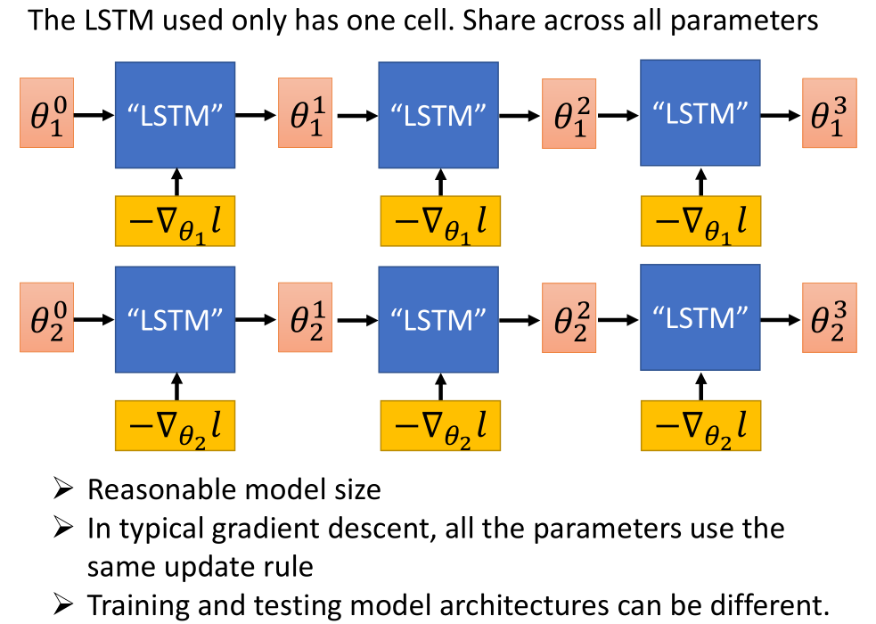

也就是说如上图所示，现在你learn 好一个LSTM以后，它是直接被用在所有的参数上，虽然这个LSTM 一次只处理一个参数，但是同样的LSTM 被用在所有的参数上。$θ^1$ 使用的LSTM 和$θ^2$ 使用的LSTM 是同一个处理方式也相同。那你可能会说，$θ^1$ 和 $θ^2$ 用的处理方式一样，会不会算出同样的值呢？会不，因为他们的初始参数是不同的，而且他们的gradient 也是不一样的。在初始参数和算出来的gradient 不同的情况下，就算你用的LSTM的参数是一样的，就是说你update 参数的规则是一样的， 最终算出来的也是不一样的 $θ^3$ 。

这就是实作上真正implement LSTM Gradient Descent 的方法。

这么做有什么好处：

- 在模型规模上问题上比较容易实现
- 在经典的gradient descent 中，所有的参数也都是使用相同的规则，所以这里使用相同的LSTM ，就是使用相同的更新规则是合理的
- 训练和测试的模型架构可以是不一样的，而之前讲的MAML 需要保证训练任务和测试任务使用的model architecture 相同

#### Experimental Results

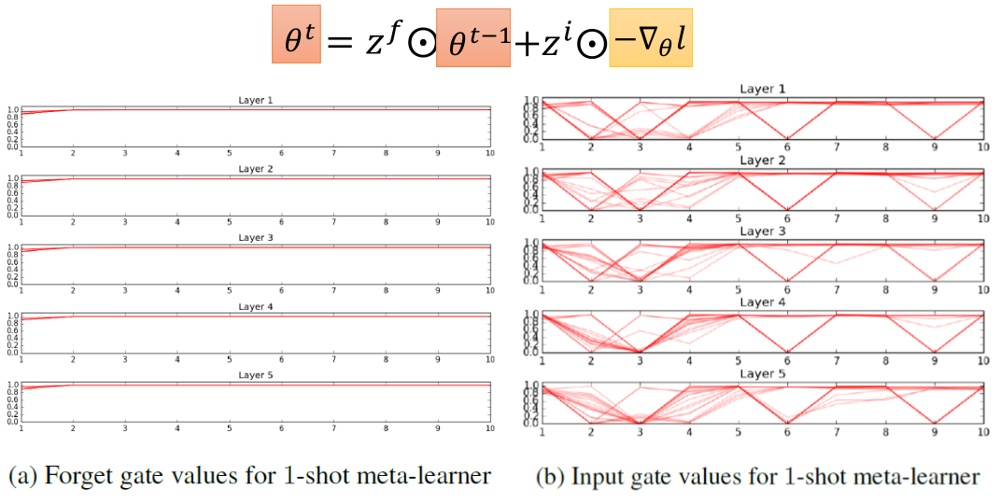

我们来看一个文献上的实验结果，这是做在few-shot learning 的task上。横轴是update 的次数，每次train 会update 10次，左侧是forget gate $z^f$ 的变化，不同的红色线就是不同的task 中forget gate 的变化，可以看出$z^f$ 的值多数时候都保持在1附近，也就是说LSTM 有learn到$θ^{t-1}$是很重要的东西，没事就不要忘掉，只做一个小小的weight decay，这和我们做regularization 时候的思想相同，只做一个小小的weight decay 防止overfitting 。

右侧是input gate $z^i$ 的变化，红线是不同的task，可以看出它的变化有点复杂，但是至少我们知道，它不是一成不变的固定值，它是有学到一些东西的，是动态变化的，放到经典梯度下降中来说就是learning rate 是动态变化的。

#### LSTM for Gradient Descent (v2)

只有刚才的架构还不够，我们还可以更进一步。想想看，过去我们在用经典梯度下降更新参数的时候我们不仅会考虑当前step 的梯度，我们还会考虑过去的梯度，比如RMSProp、Momentum 等。

在刚才的架构中，我们没有让机器去记住过去的gradient ，所以我们可以做更进一步的延伸。我们在过去的架构上再加一层LSTM，如下图所示：

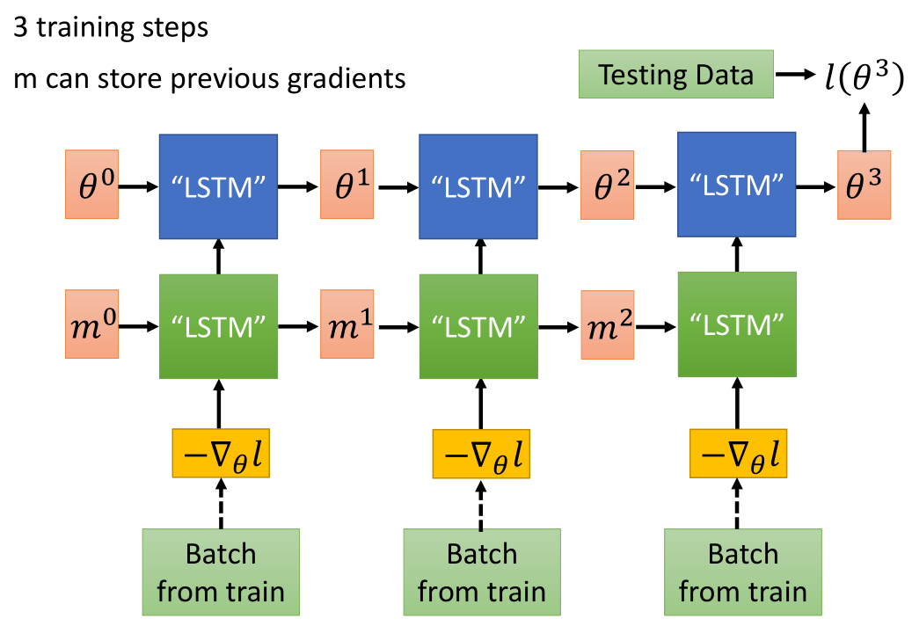

蓝色的一层LSTM 是原先的算learning rate、做weight decay 的LSTM，我们再加入一层LSTM ，让算出来的gradient $-\nabla_\theta l$ 先通过这个LSTM ，把这个LSTM 吐出来的东西input 到原先的LSTM 中，我们希望绿色的这一层能做到记住以前算过的gradient 这件事。这样，可能就可以做到Momentum 可以做的的事情。

上述的这个方法，是老师自己想象的，在learning to learn by gradient descent by gradient descent 这篇paper 中上图中蓝色的LSTM 使用的是一般的梯度下降算法，而在另一篇paper 中只有上面没有下面，而老师觉得这样结合起来才是合理的能考虑过去的gradient 的gradient descent 算法的完全体。

#### Experimental Result 2

learning to learn by gradient descent by gradient descent 这篇paper 的实验结果。

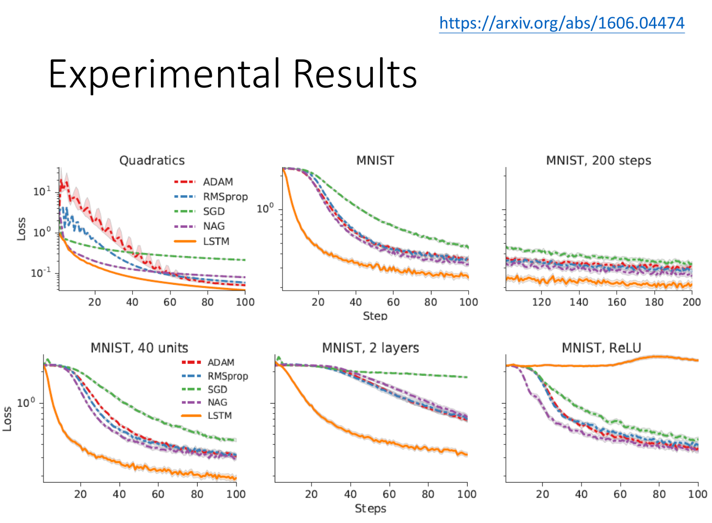

> https://arxiv.org/abs/1606.04474

第一个实验图，是做在toy example 上，它可以制造一大堆训练任务，然后测试在测试任务上，然后发现，LSTM 来当作gradient descent 的方法要好过人设计的梯度下降方法。

其他图中这个实验是训练任务测试任务都是MNIST。虽然训练和测试任务都是相同的dataset也是相同的，但是train 和test 的时候network 的架构是不一样的。 在train 的时候network 是只有一层，只有20个neuron。

第四张图是上述改变network 架构后在testing 的结果，testing 的时候network 只有一层该层40个neuron。从图上看还是做的起来，而且比一般的gradient descent 方法要好很多。

第五张图是上述改变network 架构后在testing 的结果，testing 的时候network 有两层。从图上看还是做的起来，而且比一般的gradient descent 方法要好很多。

第六张图是上述改变network 激活函数后在testing 的结果，training 的时候激活函数是sigmoid 而testing 的时候改成ReLU。从图上看做不起来，崩掉了，training 和testing 的network 的激活函数不一样的时候，LSTM 没办法跨model 应用。

### Metric-based

加下来我们就要实践我们之前提到的疯狂的想法：直接学一个function，输入训练数据和对应的标签，以及测试数据，直接输出测试数据的预测结果。也就是说这个模型把训练和预测一起做了。

虽然这个想法听起很crazy，但是实际上现实生活中有在使用这样的技术，举例来说：手机的人脸验证

我们在使用手机人脸解锁的时候需要录制人脸信息，这个过程中我们转动头部，就是手机在收集资料，收集到的资料就是作为few-shot learning 的训练资料。另外，语音解锁Speaker Verification 也是一样的技术，只要换一下输入资料和network 的架构。

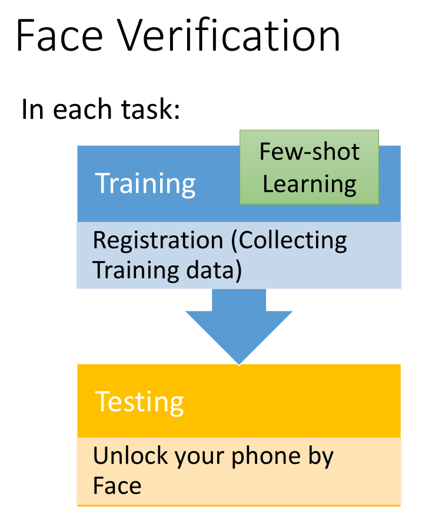

这里需要注意Face Verification 和Face Recognition 是不一样的，前者是说给你一张人脸，判定是否是指定的人脸，比如人脸验证来解锁设备；后者是辨别一个人脸是人脸集合里面谁，比如公司人脸签到打卡。

下面我们就以Face Verification 为例，讲一下Metric-based Meta Learning

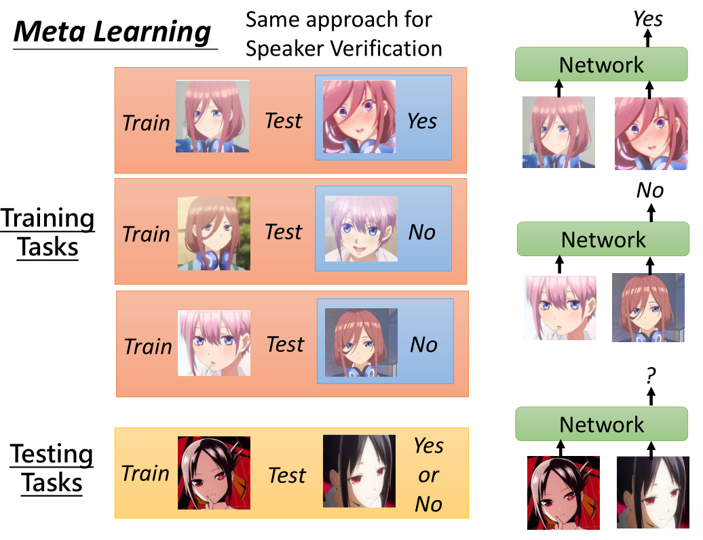

训练任务集中的任务都是人脸辨识数据，每个任务的测试集就是某个人的面部数据，测试集就是按标准（如手机录制人脸）收集的人脸数据，如果这个人和训练集相同就打一个Yes 标签，否则就打一个No 标签。测试任务和训练任务类似。总的来说，network 就是吃训练的人脸和测试的人脸，它会告诉你Yes or No 。

测试任务要与训练任务有点不同，测试的脸应该没有出现在测试任务中。

#### Siamese Network

实际上是怎么做的呢，使用的技术是Siamese Network（孪生网络）。

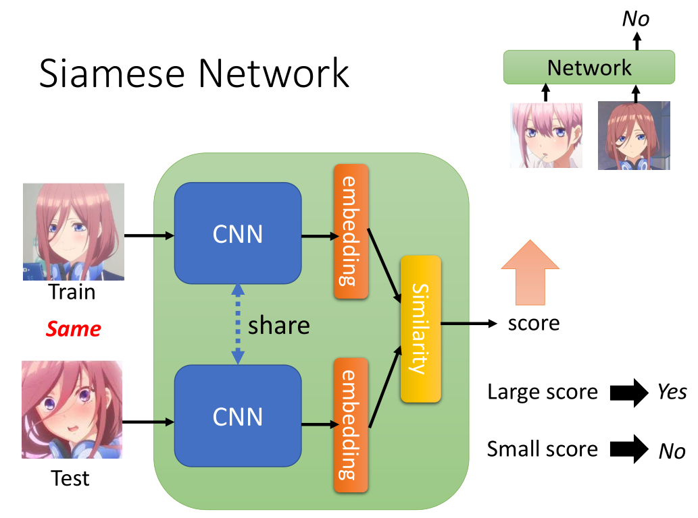

Siamese Network 的结构如上图所示，两个网络往往是共享参数的，根据需要有时候也可以不共享，假如说你现在觉得Training data 和Testing data 在形态上有比较大的区别，那你就可以不共享两个网络的参数。

从两个CNN 中抽出两个embedding ，然后计算这两个embedding 的相似度，比如说计算conference similarity 或者Euclidean Distance ，你得到一个数值score ，这个数值大就代表Network 的输出是Yes ，如果数值小就代表输出是No 。

##### Intuitive Explanation

接下来从直觉上来解释一下孪生网络。

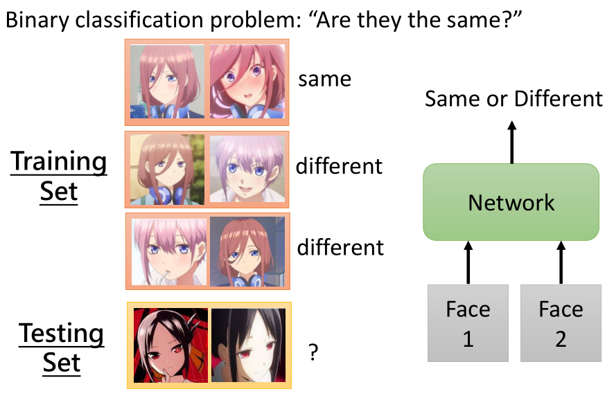

如上图所示，你可以把Siamese Network 看成一个二分类器，他就是吃进去两张人脸比较一下相似度，然后告诉我们Yes or No 。这样解释会比从Meta Learning 的角度来解释更容易理解。

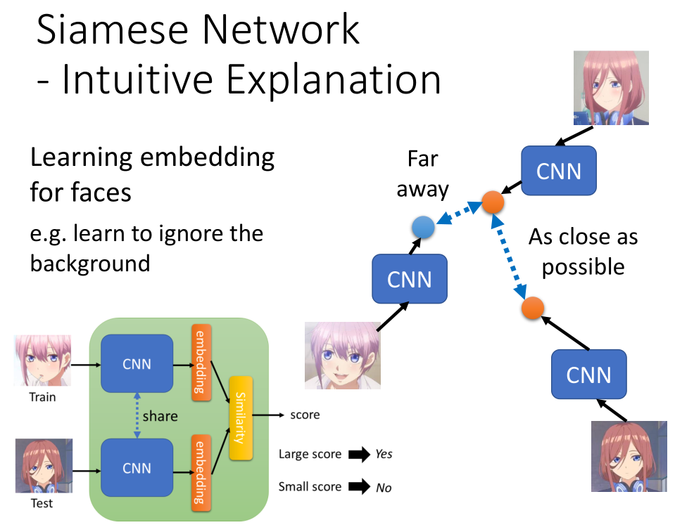

如上图所示，Siamese Network 做的事情就是把人脸投影到一个空间上，在这个空间上只要是同一个人的脸，不管机器看到的是他的哪一侧脸，都能被投影到这个空间的同一个位置上。同一个人距离越近越好，不同的人距离越远越好。

这种图片降维的方法，这和Auto-Encoder有什么区别呢，他比Auto-Encoder 好在哪？

你想你在做Auto-Encoder 的时候network不知道你要解的任务是什么，它会尽可能记住图片中所有的信息，但是它不知道什么样的信息是重要的什么样的信息是不重要的。

例子里面上图右侧，如果用Auto-Encoder 它可能会认为一花（左下）和三玖（右上）是比较接近的，因为他们的背景相似。在Siamese Network 中，因为你要求network 把一花（左下）和三玖（右上）拉远，把三玖（右上）和三玖（右下）拉近，它可能会学会更加注意头发颜色的信息，要忽略背景的信息。

##### To learn more...

计算两个embedding的相近度

- What kind of distance should we use?
  - SphereFace: Deep Hypersphere Embedding for Face Recognition
  - Additive Margin Softmax for Face Verification
  - ArcFace: Additive Angular Margin Loss for Deep Face Recognition
- Triplet loss（三元是指：从训练集中选取一个样本作为Anchor，然后再随机选取一个与Anchor属于同一类别的样本作为Positive，最后再从其他类别随机选取一个作为Negative）
  - Deep Metric Learning using Triplet Network
  - FaceNet: A Unified Embedding for Face Recognition and Clustering

#### N-way Few/One-shot Learning 

刚才的例子中，训练资料都只有一张，机器只要回答Yes or No 。那现在如果是一个分类的问题呢？现在我们打算把同样的概念用在5-way 1-shot 的任务上该怎么办呢？

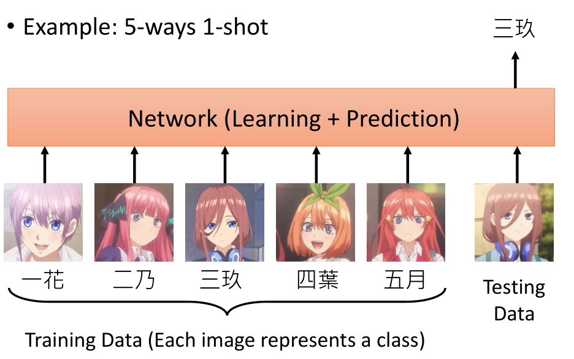

5-way 1-shot 就是说5个类别，每个类别中只有1个样本。就比如说上图，《五等分花嫁》中的五姐妹，要训一个模型分辨一个人脸是其中的谁，而训练资料是每个人只有一个样本。我们期待做到的事情是，Network 就把这五张带标签的训练图片外加一张测试图片都吃进去，然后模型就会告诉我们测试图片的分辨结果。

##### Prototypical Network

那模型的架构要怎么设计呢，这是一个经典的做法：

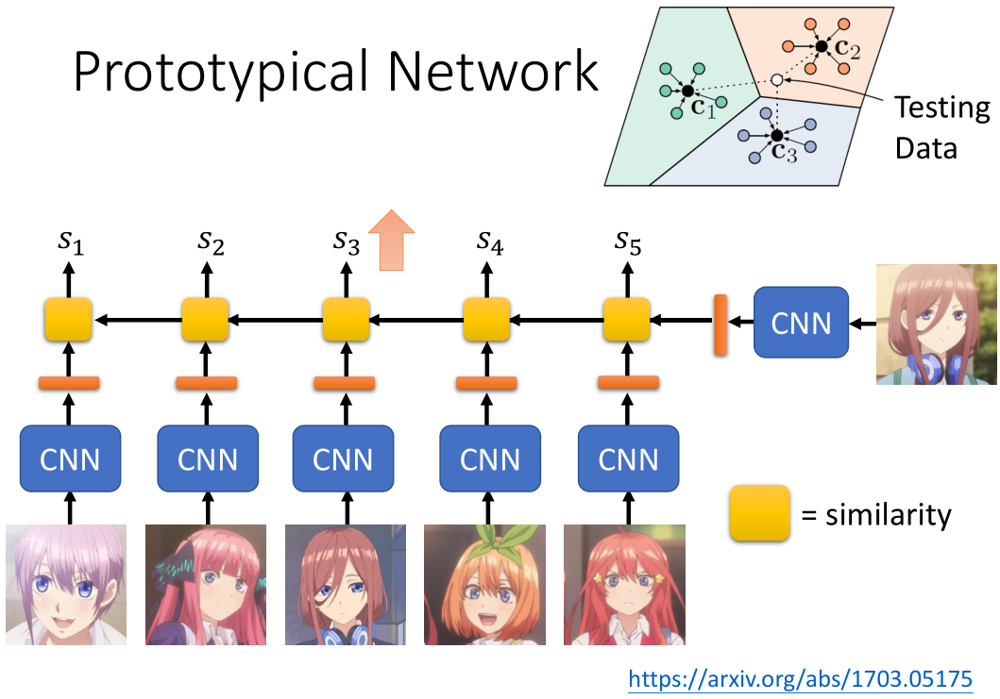

这个方法和Siamese Network 非常相似，只不过从input 一张training data 扩展到input 多张training data 。

如上图所示，把每张图片丢到同一个CNN 中算出一个embedding 用橙色条表示，然后把测试图片的embedding 和所有训练图片的embedding 分别算出相似度 $s_i$ 。黄色的方块表示计算相似度。

接下来，取一个softmax ，这样就可以和正确的标签做cross entropy ，去minimize cross entropy，这就和一般的分类问题的loss function相同的，就可以根据这个loss 做一次gradient descent ，因为是1-shot 所以只能做一次参数更新。

那如果是few-shot 呢，怎么用Prototypical Network 解决呢。如右上角，我们把每个类别的几个图片用CNN 抽出的embedding 做average 来代表这个类别就好了。进来一个Testing Data 我们就看它和哪个class 的average 值更接近，就算作哪一个class 。

##### Matching Network

Matching Network 和Prototypical Network 最不同的地方是，Matching Network 认为也许Training data 中的图片互相之间也是有关系的，所以用Bidirectional LSTM 处理Training data，把Training data 通过一个Bidirectional LSTM 也会得到对应的embedding ，然后的做法就和Prototypical Network 是一样的。

事实上是Matching Network 先被提出来的，然后人们觉得这个方法有点问题，问题出在Bidirectional LSTM 上，就是说如果输入Training data 的顺序发生变化，那得到的embedding 就变了，整个network 的辨识结果就可能发生变化，这是不合理的。

##### Relation Network

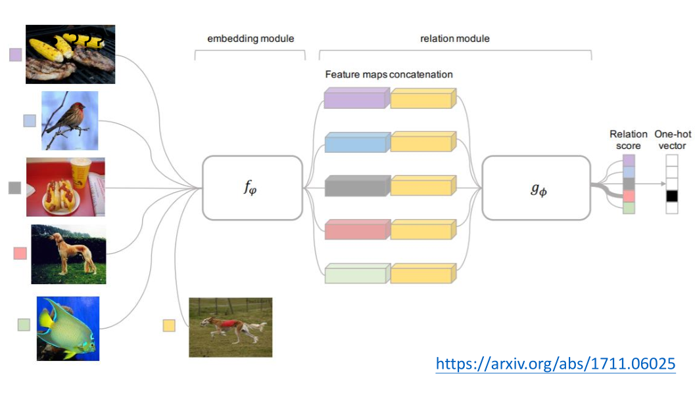

这个方法和上面讲过的很相似，只是说我们之前通过人定的相似度计算方法计算每一类图片和测试图片的相似度，而Relation Network 是希望用另外的模型 $g_\phi$ 来计算相似度。

具体做法就是先通过一个 $f_\phi$ 计算每个类别的以及测试数据的embedding ，然后把测试数据的embedding 接在所有类别embedding 后面丢入 $g_\phi$ 计算相似度分数。

#### Few-shot learning for Imaginary Data

我们在做Few-Shot Learning 的时候的难点就是训练数据量太少了，那能不能让机器自己生成一些数据提供给训练使用呢。这就是Few-shot learning for Imaginary Data 的思想。

Learn 一个Generator $G$ ，怎么Learn 出这个Generator 我们先不管，你给Generator 一个图片，他就会生成更多图片，比如说你给他三玖面无表情的样子，他就会YY出三玖卖萌的样子、害羞的样子、生气的样子等等。然后把生成的图片丢到Network 中做训练，结束。

实际上，真正做训练的时候Generator 和Network 是一起training的，这就是Few-shot learning for Imaginary Data 的意思。

#### Meta Learning-Train+Test as RNN

我们在讲Siamese Network 的时候说，你可以把Siamese Network 或其他Metric-based 的方法想成是Meta Learning ，但其实你是可以从其他更容易理解的角度来考虑这些方法。总的来说，我们就是要找一个function，这个function 可以做的到就是吃训练数据和测试数据，然后就可以吐出测试数据的预测结果。我们实际上用的Siamese Network 或者Prototypical Network 、Matching Network 等等的方法多可以看作我们为了实现这个目的做模型架构的变形。

现在我们想问问，有没有可能直接用常规的network 做出这件事？有的。

用LSTM 把训练数据和测试数据吃进去，在最后输出测试数据的判别结果。训练图片通过一个CNN 得到一个embedding ，这个embedding 和这个图片的label（one-hot vector）做concatenate（拼接）丢入LSTM 中，Testing data 我们不知道label 怎么办，我们就用0 vector 来表示，然后同样丢入LSTM ，得到output 结束。这个方法用常规的LSTM 是train 不起来的，我们需要修改LSTM 的架构，有两个方法，具体方法我们就不展开讲了，放出参考链接：

>One-shot Learning with Memory-Augmented Neural Networks
>
>https://arxiv.org/abs/1605.06065
>
>A Simple Neural Attentive Meta-Learner
>
>https://arxiv.org/abs/1707.03141

SNAIL和我们上面刚说过想法的是一样的，输入一堆训练数据给RNN 然后给他一个测试数据它输出预测结果，唯一不同的东西就是，它不是一个单纯的RNN ，它里面有在做回顾这件事，它在input 第二笔数据的时候会回去看第一笔数据，在input 第三笔数据的时候会回去看第一第二笔数据...在input 测试数据额时候会回去看所有输入的训练数据。

所以你会发现这件事是不是和prototypical network 和matching network 很相似呢，matching network 就是计算input 的图片和过去看过的图片的相似度，看谁最像，就拿那张最像的图片的label 当作network 的输出。SNAIL 的回顾过去看过的数据的做法就和matching network 的计算相似度的做法很像。

所以说，你虽然想用更通用的方法做到一个模型直接给出测试数据预测结果这件事，然后你发现你要改network 的架构，改完起了个名字叫SNAIL 但是他的思想变得和原本专门为这做到这件事设计的特殊的方法如matching network 几乎一样了，有点殊途同归的意思。

