# Life-long Learning

## Life-long Learning

> 开始之前的说明，如果读者是学过transfer learning 的话，学这一节可能会轻松很多，LLL的思想在我看来是和transfer learning是很相似的。

可以直观的翻译成终身学习，我们人类在学习过程中是一直在用同一个大脑在学习，但是我们之前讲的所有机器学习的方法都是为了解决一个专门的问题设计一个模型架构然后去学习的。所以，传统的机器学习的情景和人类的学习是很不一样的，现在我们就要考虑为什么不能用同一个模型学会所有的任务。

也有人把Life Long Learning 称为Continuous Learning，Never Ending Learning，Incremental Learning，在不同的文献中可能有不同的叫法，我们只要知道这些方法都是再指终生学习就可。

我想大多数人在学习机器学习之前的是这样认为的，我们教机器学学会任务1，再教会它任务2，我们就不断地较它各种任务，学到最后它就成了天网。但是实际上我们都知道，现在的机器学习是分开任务来学的，就算是这样很多任务还是得不到很好的结果。所以机器学习现在还是很初级的阶段，在很多任务上都无法胜任。

我们今天分三个部分来叙述**Life-Long Learning**：

- **Knowledge Retention 知识保留**
  - but NOT Intransigence 但不固执，不会拒绝学习新的东西
- **Knowledge Transfer 知识潜移**
- **Model Expansion 模型扩展**
  - but Parameter Efficiency 但参数高效

### Knowledge Retention

知识保留，但不顽固

知识保留但不顽固的精神是：我们希望模型在做完一个任务的学习之后，在学新的知识的时候，能够保留对原来任务能力，但是这种能力的保留又不能太过顽固以至于不能学会新的任务。

#### Example - Image

我们举一个例子看看机器的脑洞有多大。这里是影像辨识的例子，来看看在影像辨识任务中是否需要终身学习。

我们有两个任务，都是在做手写数字辨识，但是两个的corpus 是不同的（corpus1 图片上存在一些噪声）。network 的架构是三层，每层都是50个neuron，然后让机器先学任务1，学完第一个任务以后在两个corpus 上进行测试，得到的结果task1: 90%；task2: 96%（task2的结果更好一点其实是很直觉的，因为corpus2上没有noise，这可以理解为transfer learning）。然后我们在把这个模型用corpus2 进行一波训练，再在两个corpus上进行测试得到的结果task1: 80%；task2: 97%，发现第一个任务有被遗忘的现象发生。

这时候你可能会说，这个模型的架构太小了，他只有三层每层只有50个neuron，会发生遗忘的现象搞不好是因为它脑容量有限。但是我们实践过发现并不是模型架构太小。我们把两个corpus 混到一起用同样的模型架构train 一发，得到的结果task1: 89%；task2: 98%

所以说，明明这个模型的架构可以把两个任务都学的很好，为什么先学一个在学另一个的话会忘掉第一个任务学到的东西呢。

#### Example - Question Answering

问答系统要做的事情是训练一个Deep Network ，给这个模型看很多的文章和问题，然后你问它一个问题，他就会告诉你答案。具体怎么输入文章和问题，怎么给你答案，怎么设计网络，不展开。

对于QA系统已经被玩烂的corpus 是bAbi 这个数据集，这里面有20种不同的题型，比如问where、what 等。可以分别用20个模型解题，也可以用1个模型同时解20个题型。我们训练一个模型从第一个题型开始学习，依次学完20种题型，每次学习完成以后我们都用题型五做一次测试，也就是以题型五作为baseline，结果如下：

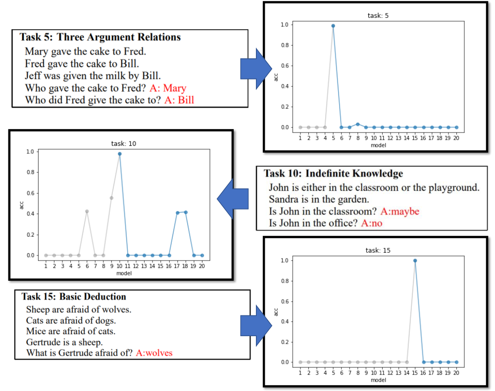

我们可以看到只有在学完题型五的时候，再问机器题型五的问题，它可以给出很好的答案，但是在学完题型六以后它马上把题型五忘的一干二净了。这个现象在以其他的题型作为baseline 的时候同样出现了。

有趣的是，在题型10作为baseline 的时候可能是由于题型6、9、17、18和题型10比较相似，所以在做完这些题型的QA任务的时候在题型10上也能得到比较好的结果。

那你又会问了，是不是因为网络的架构不够大，机器的脑容量太小以至于学不起来。其实不是，当我们同时train这20种题型得到的结果是还不错的。

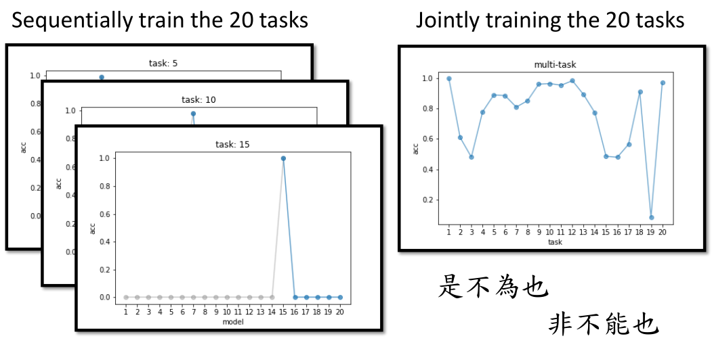

#### Catastrophic Forgetting

所以机器的遗忘是和人类很不一样的，他不是因为脑容量不够而忘记的，不知道为什么它在学过一些新的任务以后就会较大程度的遗忘以前学到的东西，这个状况我们叫做Catastrophic Forgetting（灾难性遗忘）。之所以加个形容词是因为这种遗忘是不可接受，只要学新的东西旧的东西就都出来了。

你可能会说这个灾难性遗忘的问题你上面不是已经有了一个很好的解决方法了吗，你只要把多个任务的corpus 放在一起train 就好了啊。

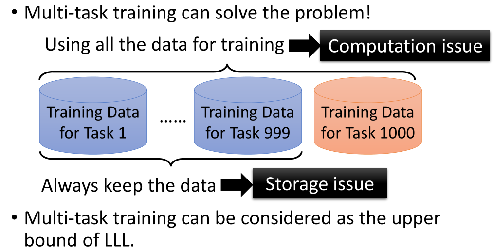

但是，长远来说这一招是行不通的，因为我们很难一直维护所有使用过的训练数据；而且就算我们很好的保留了所有数据，在计算上也有问题，我们每次学新任务的时候就要重新训练所有的任务，这样的代价是不可接受的。

另外，**多任务同时train 这个方法其实可以作为LLL的上界**。

我们期待的是，不做Multi-task training的情况下，让机器不要忘记过去学过的东西。

那这个问题有什么样的解法呢，接下来就来介绍一个经典解法。

### Elastic Weight Consolidation (EWC)

基本精神：网络中的部分参数对先前任务是比较有用的，我们在学新的任务的时候只改变不重要的参数。

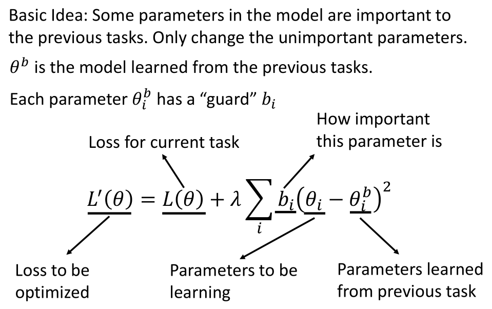

如上图所示， $\theta^b$ 是模型从先前的任务中学出来的参数。

每个参数 $\theta^{b}_{i}$ 都有一个守卫 $b_i$ ，这个守卫就会告诉我们这个参数有多重要，我们有多么不能更改这个参数。

我们在做EWC 的时候（train 新的任务的时候）需要再原先的损失函数上加上一个regularization ，如上图所示，我们通过平方差的方式衡量新的参数 $\theta_i$ 和旧的参数 $\theta^{b}_{i}$ 的差距，然后乘上守卫，把所有参数加起来。

我们学习新的任务时，不止希望把新的任务做好，也希望新的参数和旧的参数差别不要太大，这种限制对每个参数是不同的：当这个守卫 $b_i$ 等于零的时候就是说参数 $\theta_i$ 是没有约束的，可以根据当前任务随意更改，当守卫 $b_i$ 趋近于无穷大的时候，说明这个参数 $\theta_i$ 对先前的任务是非常重要的，希望模型不要变动这个参数。

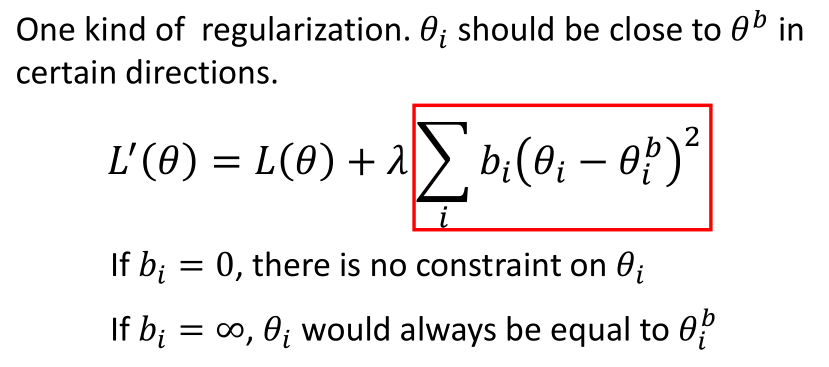

所以现在问题是， $b_i$ 如何决定。这个问题我们下面来讲，先来通过一个简单的例子再理解一下EWC的思想：

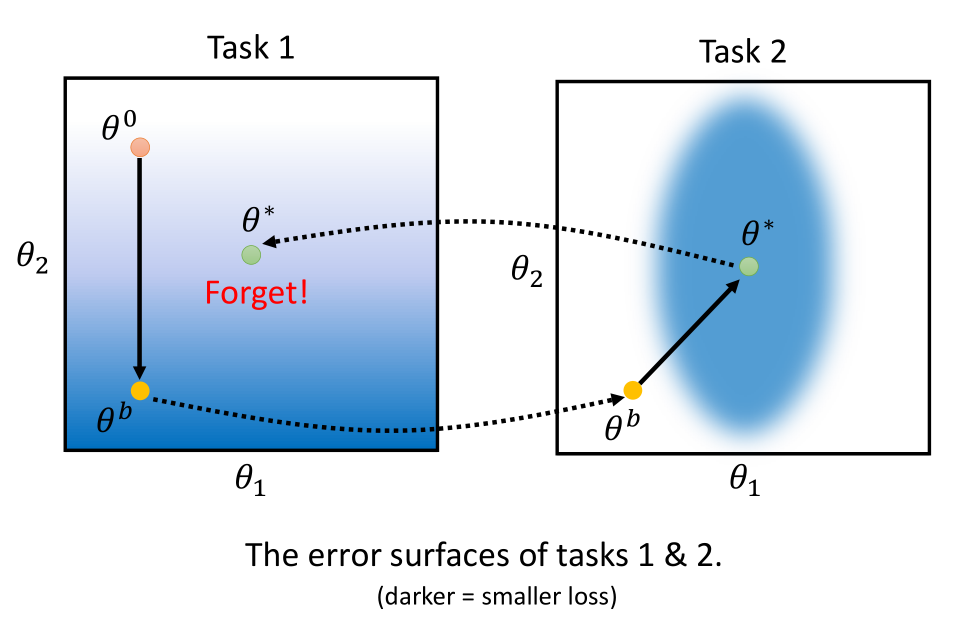

上图是这样的，假设我们的模型只有两个参数，这两个图是两个task 的error surface ，颜色越深loss 越大。假如说我们让机器学task1的时候我们的参数从 $θ^0$ 移动到 $θ^b$ ，然后我们又让机器学task2，在这学这个任务的时候我们没有加任何约束，它学完之后参数移动到了 $θ^*$ ，这时候模型参数在task1的error surface 上就是一个不太好的点。 这就直观的解释了为什么会出现Catastrophic Forgetting 。

当我们使用EWC 对模型的参数的变化做一个限制，就如上面说的，我们给每个参数加一个守卫 $b_i$ ，这个 $b_i$ 是这么来的呢？

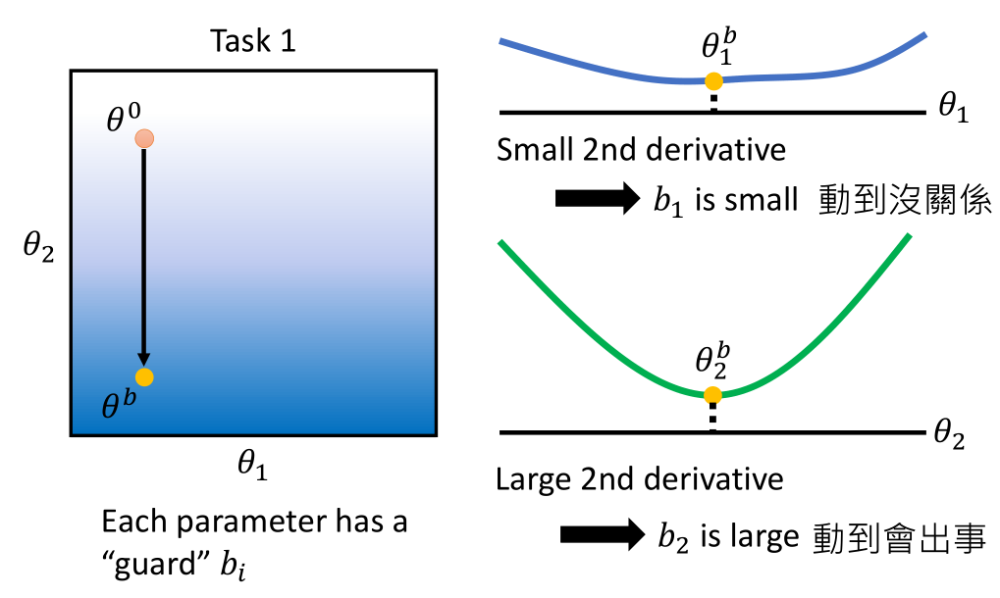

不同文章有不同的做法，这里有一个简单的做法就是算这个参数的二次微分（loss对$θ$的二次微分体现参数loss变化的剧烈程度，二次微分值越大，原函数图像在该点变化越剧烈），如上图所示。我们可以看出， $θ^b_1$ 在二次微分曲线的平滑段其变化不会造成原函数图像的剧烈变化，我们要给它一个小的守卫 $b_1$ ， 反之 $θ^b_2$ 则在谷底其变化会造成二次微分值的增大，导致原函数的变化更剧烈，我们要给它一个大的守卫 $b_2$ 。也就是说，$θ^b_1$ 可以动，$θ^b_2$ 尽量别动。

有了上述的constraint ，我们就能让模型参数尽量不要在 $θ_2$ 方向上移动，可以在 $θ_1$ 上移动，得到的效果可能就会是这样的：

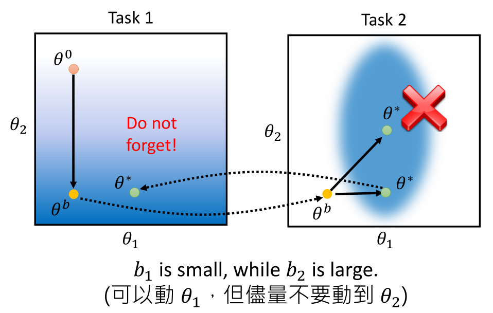

#### Experiment 

我们来看看EWC的原始paper中的实验结果：

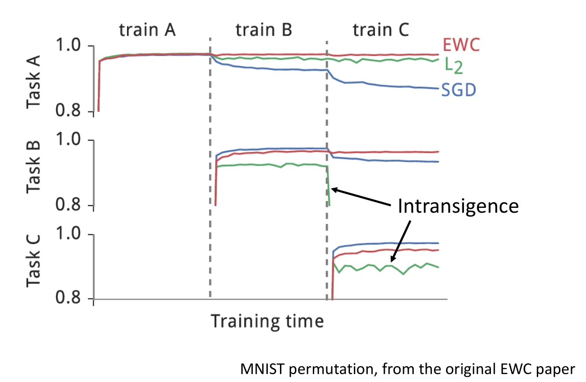

三个task其实就是对MNIST 数据集做不同的变换后做辨识任务。每行是模型对该行的task准确率的变化，从第一行可以看出，当我们用EWC的方法做完三个任务学习以后仍然能维持比较好的准确率。值得注意的是，在下面两行中，L2的方法在学习新的任务的时候发生了Intransigence（顽固）的现象，就是模型顽固的记住了以前的任务，过于保守，而无法学习新的任务。

#### Variant

有很多EWC 的变体，给几个参考：

- Elastic Weight Consolidation (EWC)
  - http://www.citeulike.org/group/15400/article/14311063

- Synaptic Intelligence (SI)
  - https://arxiv.org/abs/1703.04200
- Memory Aware Synapses (MAS)
  - Special part: Do not need labelled data
  - https://arxiv.org/abs/1711.09601

### Generating Data

上面我们说Mutli-task Learning 虽然好用，但是由于存储和计算的限制我们不能这么做，所以采取了EWC 等其他方法，而Mutli-task Learning 可以考虑为Life-Long Learning 的upper bound。 反过来我们不禁在想，虽然说要存储所有过去的资料很难，但是Multi-task Learning 确实那么好用，那我们能不能Learning 一个model，这个model 可以产生过去的资料，所以我们只要存一个model 而不用存所有训练数据，这样我们就做Multi-task 的learning。（这里暂时忽略算力限制，只讨论数据生成问题）

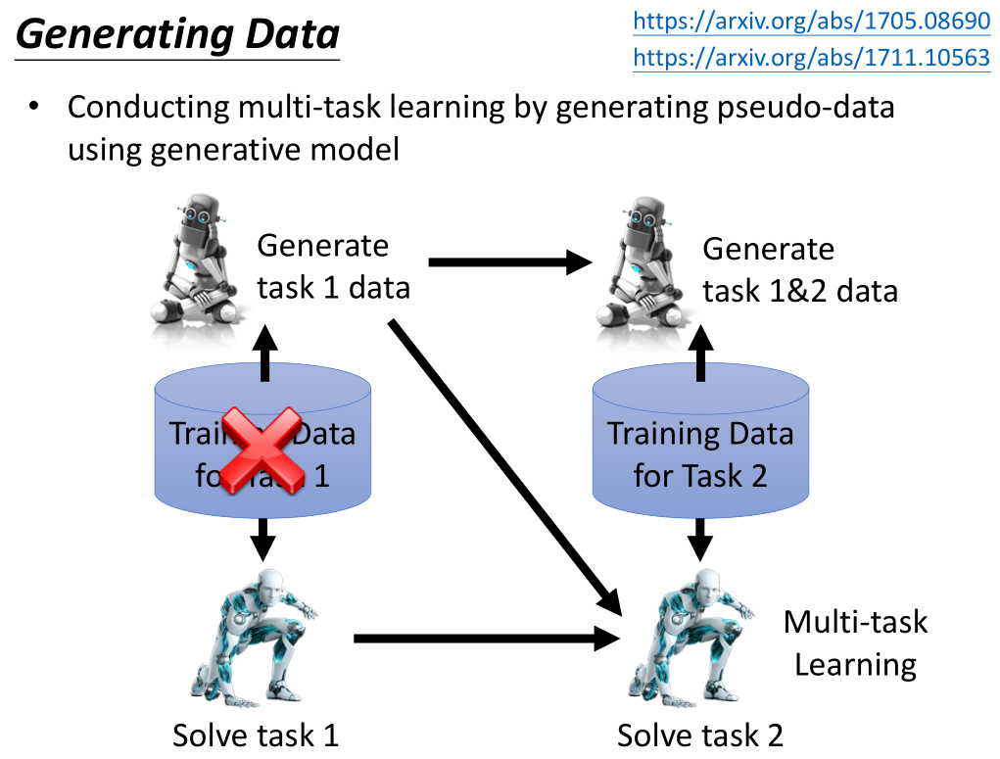

这个过程是这样的，我们先用training data 1 训练得到解决task 1 的model，同时用这些数据生成train 一个能生成这些数据的generator ，存储这个generator 而不是存储training data ；当来了新的任务，我们就用这个generator 生成task 1的training data 和 task2 的training data 混在一起，用Multi-task Learning 的方法train 出能同时解决task1 和task2 的model，同时我们用混在一起的数据集train 出一个新的generator ，这个generator 能生成这个混合数据集；以此类推。这样我们就可以做Mutli-task Learning ，而不用存储大量数据。但是这个方法在实际中到底能不能做起来，还尚待研究，一个原因是实际上生成数据是没有那么容易的，比如说生成贴合实际的高清的影像对于机器来说就很难，所以这个方法是否做的起来还是一个尚待研究的问题。

### Adding New Classes

在刚才的讨论中，我们都是假设解不同的任务用的是相同的网络架构，但是如果现在我们的task 是不同，需要我们更改网络架构的话要怎么办呢？比如说，两个分类任务的class数量不同，我们就要修改network 的output layer 。这里就列一些参考给大家：

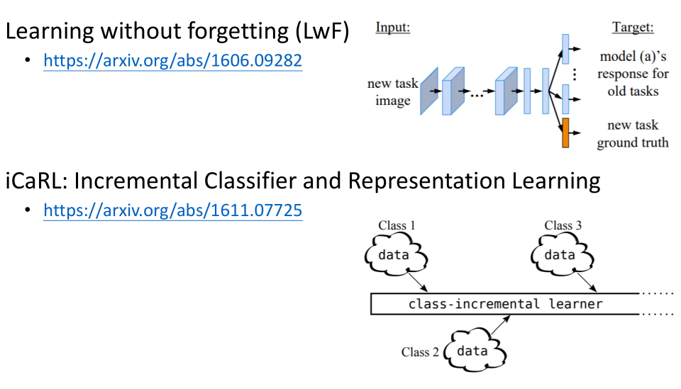

### Knowledge Transfer

我们不仅希望机器可以可以记住以前学的knowledge ，我们还希望机器在学习新的knowledge 的时候能把以前学的知识做transfer。

Train a model for each task？

- Knowledge cannot transfer across different tasks

- Eventually we cannot store all the models …

我们之前都是每个任务都训练一个单独的模型，这种方式会损失一个很重要的信息，就是解决不同问题之间的通用知识。形象点来说，比如你先学过线性代数和概率论，那你在学机器学习的时候就会应用先前学过的知识，学起来就会很顺利。我们希望机器可以学完某些task后，可以在之后的task学习中更加顺利，希望机器能够把不同任务之间的知识进行迁移，让以前学过的知识可以应用到解决新的任务上面。

#### Life-Long v.s. Transfer

讲了这么多，你可能会说，这不就是在做transfer Learning 吗？

Transfer Learning 的精神是应用先前任务的模型到新的任务上，让模型可以解决或者说更好的解决新的任务，而不在乎此时模型是否还能解决先前的任务；

但是LLL 就比Transfer Learning 更进一步，它会考虑到模型在学会新的任务的同时，还不能忘记以前的任务的解法。

### Evaluation

讲到这里，我们来说一下如何衡量LLL 的好坏。其实，有很多不同的的衡量方法，这里简介一种。

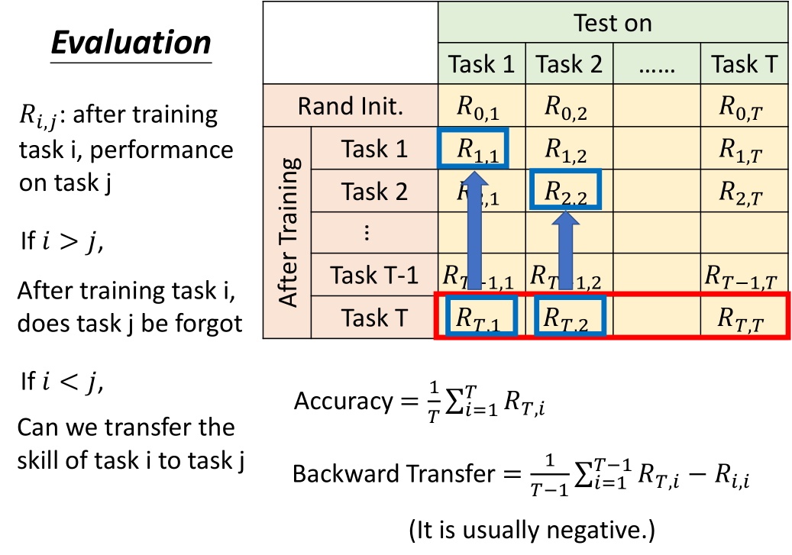

这里每一行是一个模型在不同任务上的测试结果，每一列是用一个任务对一个模型在做完某些任务的训练以后进行测试的结果。

$R_{i,j}$ : 在训练完task i 后，模型在task j 上的performance 。

如果 $i > j$ : 在学完task i 以后，模型在先前的task j 上的performance。

如果 $i < j$ : 在学完task i 以后，模型在没学过的task j 上的performance，来说明前面学完的 i 个task 能不能transfer 到 task j 上。

Accuracy $=\frac{1}{T} \sum_{i=1}^{T} R_{T, i}$

Backward Transfer $=\frac{1}{T-1} \sum_{i=1}^{T-1} R_{T, i}-R_{i, i}$，（It is usually negative.）

Forward Transfer $=\frac{1}{T-1} \sum_{i=2}^{T} R_{i-1, i}-R_{0, i}$

Accuracy 是指说机器在学玩所有T 个task 以后，在所有任务上的平均准确率，所以如上图红框，就把最后一行加起来取平均就是现在这个LLL model 的Accuracy ，形式化公式如上图所示。

Backward Transfer 是指机器有多会做Knowledge Retention（知识保留），有多不会遗忘过去学过的任务。做法是针对每一个task 的测试集（每列），计算模型学完T 个task 以后的performance 减去模型刚学完对应该测试集的时候的performance ，求和取平均，形式化公式如上图所示。

Backward Transfer 的思想就是把机器学到最后的表现减去机器刚学完那个任务还记忆犹新的表现，得到的差值通常都是负的，因为机器总是会遗忘的，它学到最后往往就一定程度的忘记以前学的任务，如果你做出来是正的，说明机器在学过新的知识以后对以前的任务有了触类旁通的效果，那就很强。

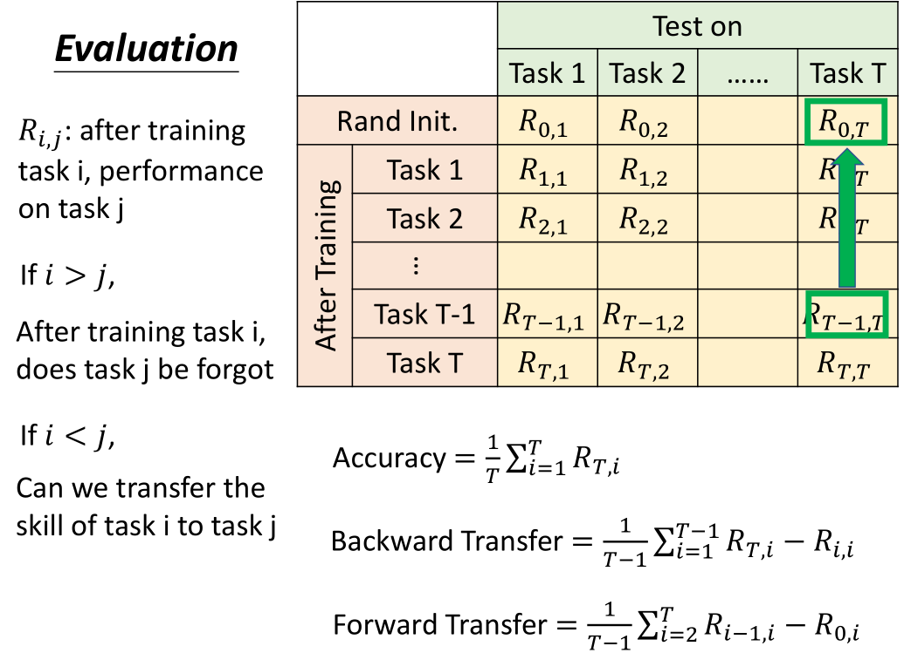

Forward Transfer 是指机器有多会做Knowledge Transfer （知识迁移），有多会把过去学到的知识应用到新的任务上。做法是对每个task 的测试集，计算模型学过task i 以后对task i+1 的performance 减去随机初始的模型在task i+1 的performance ，求和取平均。

### Gradient Episodic Memory (GEM)

上述的Backward Transfer 让这个值是正的就说明，model 不仅没有遗忘过学过的知识，还在学了新的知识以后对以前的任务触类旁通，这件事是有研究的，比如GEM 。

> GEM: https://arxiv.org/abs/1706.08840
>
> A-GEM: https://arxiv.org/abs/1812.00420

GEM 想做到的事情是，在新的task 上训练出来的gradient 在更新的参数的时候，要考虑一下过去的gradient ，使得参数更新的方向至少不能是以前梯度的方向（更新参数是要向梯度的反方向更新）。

需要注意的是，这个方法需要我们保留少量的过去的数据，以便在train 新的task 的时候（每次更新参数的时候）可以计算出以前的梯度。

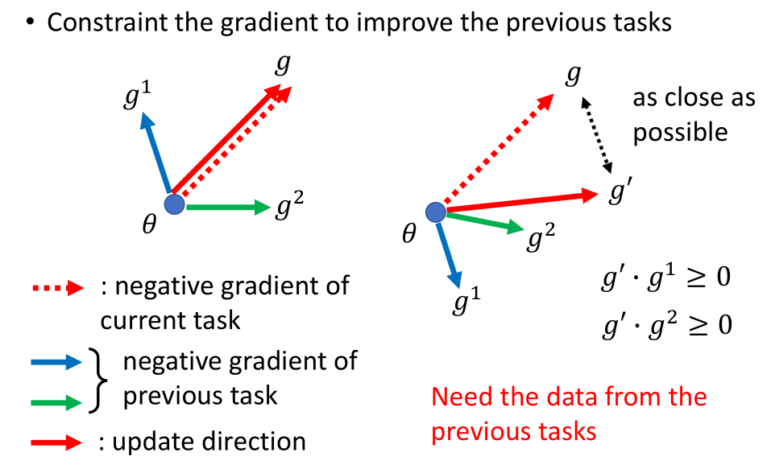

形象点来说，以上图为例，左边，如果现在新的任务学出来的梯度是$g$ ，那更新的时候不会对以前的梯度$g^1 ,g^2$ 造成反向的影响；右边，如果现在新的情况是这样的，那梯度在更新的时候会影响到$g^1$，$g$ 和$g1$ 的内积是负的，意味着梯度$g$ 会把参数拉向$g^1$ 的反方向，因此会损害model 在task 1上的performance。所以我们取一个尽可能接近$g$ 的$g'$ ，使得$g'$ 和两个过去任务数据算出来的梯度的内积都大于零。这样的话就不会损害到以前task 的performance ，搞不好还能让过去的task 的loss 变得更小。

我们来看看GEM 的效果：

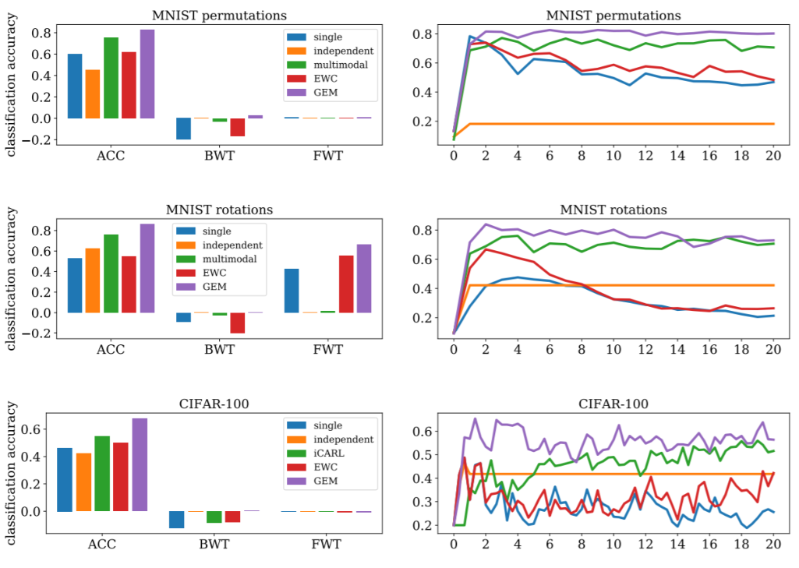

### Model Expansion

but parameter efficiency

上面讲的内容，我们都假设模型是足够大的，也就是说模型的参数够多，它是有能力把所有任务都做好，只不过因为某些原因它没有做到罢了。但是如果现在我们的模型已经学了很多任务了，所有参数都被充分利用了，他已经没有能力学新的任务了，那我们就要给模型进行扩张。同时，我们还要保证扩张不是任意的，而是有效率的扩张，如果每次学新的任务，模型都要进行一次扩张，那这样的话model会扩张的太快导致你最终就会无法存下你的模型，而且臃肿的模型中大概率很多参数都是没有用的。

这个问题在2018年老师讲课的时候还没有很多文献可以参考，存在的模型也都做的不是特别好。

### Progressive Neural Networks

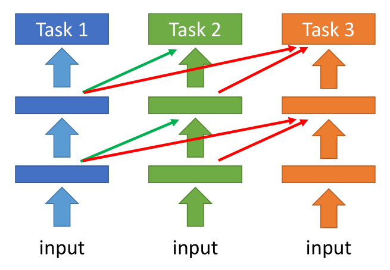

> https://arxiv.org/abs/1606.04671

这个方法是这样的，我们在学task 1的时候就正常train，在学task 2的时候就搞一个新的network ，这个网路不仅会吃训练集数据，而且会把训练集数据input 到task 1的network中得到的每层输出吃进去，这时候是fix 住task 1 network，而调整task 2 network 。同理，当学task 3的时候，搞一个新的network ，这个网络不仅吃训练集数据，而且会把训练集数据丢入task 1 network 和 task 2 network ，将其每层输出吃进去，也是fix 住前两个network 只改动第三个network 。

这是一个早期的想法，2016年就出现了，但是这个方法终究还是不太能学很多任务。

### Expert Gate

> https://arxiv.org/abs/1611.06194
>
> Aljundi, R., Chakravarty, P., Tuytelaars, T.: Expert gate: Lifelong learning with a network of
>
> experts. In: CVPR (2017)

思想是这样的：每一个task 训练一个network 。

但是train 了另一个network ，这个network 会判断新的任务和原先的哪个任务最相似，加入现在新的任务和T1 最相似，那他就把network 1最为新任务的初始化network，希望以此做到知识迁移。

但是这个方法还是每一个任务都会有一个新的network ，所以还是不太好。

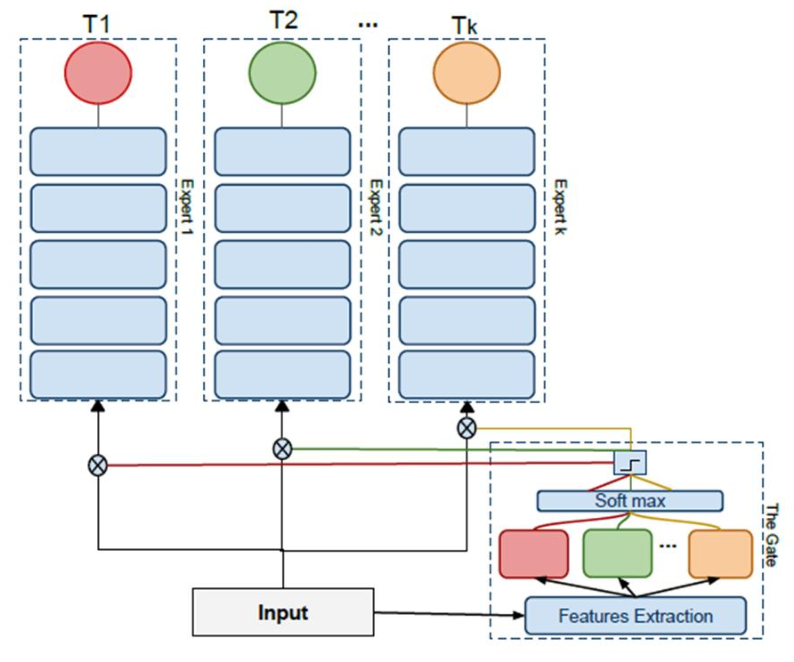

### Net2Net

如果我们在增加network 参数的时候直接增加神经元进去，可能会破坏这个模型原来做的准确率，那我们怎么增加参数才能保证不会损害模型在原来任务上的准确率呢？Net2Net 是一个解决方法：

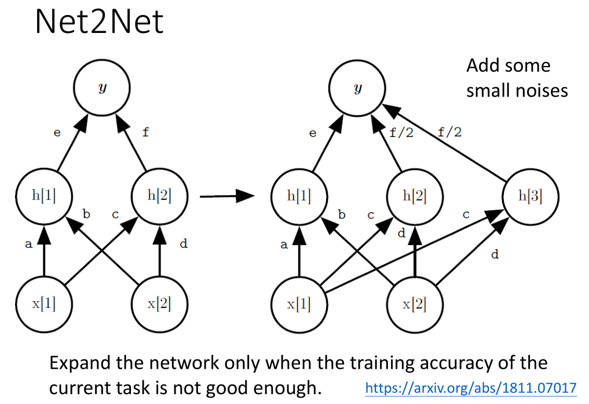

Net2Net的具体做法是这样的，如上图所示，当我么你要在中间增加一个neuron 时，我们把f 变为f/2 ，这样的话同样的输入在新旧两个模型中得到的输出就还是相同的，同时我们也增加了模型的参数。但是这样做出现一个问题，就是h[2] h[3] 两个神经元将会在后面更新参数的时候完全一样，这样的话就相当于没有扩张模型，所以我们要在这些参数上加上一个小小的noise ，让他们看起来还是有小小的不同，以便更新参数。

图中引用的文章就用了Net2Net，需要注意，不是来一个任务就扩张一次模型，而是当模型在新的任务的training data 上得不到好的Accuracy 的时候才用Net2Net 扩张模型。

### Curriculum Learning

模型的效果是非常受任务训练顺序影响的。也就是说，会不会发生遗忘，能不能做到知识迁移，和训练任务的先后顺序是有很大关系的。假如说LLL 在未来变得非常热门，那怎么安排机器学习的任务顺序可能会是一个需要讨论的热点问题，这个问题叫做Curriculum Learning 。

> [http://taskonomy.stanford.edu/#abstract](http://taskonomy.stanford.edu/) CVPR2018 的best paper

文章目的是找出任务间的先后次序，比如说先做3D-Edges 和 Normals 对 Point Matching 和Reshading 就很有帮助。