# Reinforcement Learning

## Deep Reinforcement Learning

### Scenario of Reinforcement Learning

在Reinforcement Learning里面会有一个Agent跟一个Environment。

这个Agent会有Observation看到世界种种变化，这个Observation又叫做State，这个State指的是环境的状态，也就是你的machine所看到的东西。我们的state能够观察到一部分的情况，机器没有办法看到环境所有的状态，这个state其实就是Observation。

machine会做一些事情，它做的事情叫做Action，Action会影响环境，会跟环境产生一些互动。因为它对环境造成的一些影响，它会得到Reward，这个Reward告诉它，它的影响是好的还是不好的。

举个例子，比如机器看到一杯水，然后它就take一个action，这个action把水打翻了，Environment就会得到一个negative的reward，告诉它不要这样做，它就得到一个负向的reward。在Reinforcement Learning，这些动作都是连续的，因为水被打翻了，接下来它看到的就是水被打翻的状态，它会take另外一个action，决定把它擦干净，Environment觉得它做得很对，就给它一个正向的reward。机器生来的目标就是要去学习采取哪些action，可以maximize reward 

接着，以alpha go为例子，一开始machine的Observation是棋盘，棋盘可以用一个19*19的矩阵来描述，接下来，它要take一个action，这个action就是落子的位置。落子在不同的位置就会引起对手的不同反应，对手下一个子，Agent的Observation就变了。Agent看到另外一个Observation后，就要决定它的action，再take一个action，落子在另外一个位置。用机器下围棋就是这么个回事。在围棋这个case里面，还是一个蛮难的Reinforcement Learning，在多数的时候，你得到的reward都是0，落子下去通常什么事情也没发生这样子。只有在你赢了，得到reward是1，如果输了，得到reward是-1。Reinforcement Learning困难的地方就是有时候你的reward是sparse的，即在只有少数的action 有reward的情况下去挖掘正确的action。

对于machine来说，它要怎么学习下围棋呢，就是找一某个对手一直下下，有时候输有时候赢，它就是调整Observation和action之间的关系，调整model让它得到的reward可以被maximize。

Agent learns to take actions maximizing expected reward.

#### Supervised v.s. Reinforcement 

我们可以比较下下围棋采用Supervised 和Reinforcement 有什么区别。如果是Supervised 你就是告诉机器说看到什么样的盘势就落在指定的位置。

Supervised不足的地方就是：具体盘势下落在哪个地方是最好的，其实人也不知道，因此不太容易做Supervised。机器可以看着棋谱学，但棋谱上面的这个应对不见得是最 optimal的，所以用 Supervised learning 可以学出一个会下围棋的 Agent，但它可能不是真正最厉害的 Agent。

如果是Reinforcement 呢，就是让机器找一个对手不断下下，赢了就获得正的reward，没有人告诉它之前哪几步下法是好的，它要自己去试，去学习。Reinforcement 是从过去的经验去学习，没有老师告诉它什么是好的，什么是不好的，machine要自己想办法知道。

其实在做Reinforcement 这个task里面，machine需要大量的training，可以两个machine互相下。alpha Go 是先做Supervised Learning，做得不错再继续做Reinforcement Learning。

#### Learning a chat-bot

Reinforcement  Learning 就是让机器去跟人讲话，讲讲人就生气了，machine就知道一句话可能讲得不太好。不过没人告诉它哪一句话讲得不好，它要自己去发掘这件事情。

这个想法听起来很crazy，但是真正有chat-bot是这样做的，这个怎么做呢？因为你要让machine不断跟人讲话，看到人生气后进行调整，去学怎么跟人对话，这个过程比较漫长，可能得好几百万人对话之后才能学会。这个不太现实，那么怎么办呢，就用Alpha Go的方式，Learning 两个agent，然后让它们互讲的方式。

两个chat-bot互相对话，对话之后有人要告诉它们它们讲得好还是不好。

在围棋里比较简单，输赢是比较明确的，对话的话就比较麻烦，你可以让两个machine进行无数轮互相对话，问题是你不知道它们这聊天聊得好还是不好，这是一个待解决问题。

现有的方式是制定几条规则，如果讲得好就给它positive reward ，讲得不好就给它negative reward，好不好由人主观决定，然后machine就从它的reward中去学说它要怎么讲才是好。后续可能会有人用GAN的方式去学chat-bot。通过discriminator判断是否像人对话，两个agent就会想骗过discriminator，即用discriminator自动learn出给reward的方式。

Reinforcement  Learning 有很多应用，尤其是人也不知道怎么做的场景非常适合。

#### Interactive retrieval

让machine学会做Interactive retrieval，意思就是说有一个搜寻系统，能够跟user进行信息确认的方式，从而搜寻到user所需要的信息。直接返回user所需信息，它会得到一个positive reward，然后每问一个问题，都会得到一个negative reward。

#### More applications

Reinforcement  Learning 还有很多应用，比如开个直升机，开个无人车呀，据说最近 DeepMind 用 Reinforcement Learning 的方法来帮 Google 的 server 节电，也有文本生成等。

现在Reinforcement  Learning最常用的场景是电玩。现在有现成的environment，比如Gym，Universe。

让machine 用Reinforcement  Learning来玩游戏，跟人一样，它看到的东西就是一幅画面，就是pixel，然后看到画面，它要做什么事情它自己决定，并不是写程序告诉它说你看到这个东西要做什么。需要它自己去学出来。

##### Playing Video Game

- Space invader

  游戏的终止条件是所有的外星人被消灭或者你的太空飞船被摧毁。

  这个游戏里面，你可以take的actions有三个，可以左右移动跟开火。

  machine会看到一个observation，这个observation就是一幕画面。一开始machine看到一个observation $s_1$，这个$s_1$其实就是一个matrix，因为它有颜色，所以是一个三维的pixel。machine看到这个画面以后，就要决定它take什么action，现在只有三个action可以选择。比如它take 往右移。每次machine take一个action以后，它会得到一个reward，这个reward就是左上角的分数。往右移不会得到任何的reward，所以得到的reward $r_1 = 0$，machine 的action会影响环境，所以machine看到的observation就不一样了。现在observation为$s_2$，machine自己往右移了，同时外星人也有点变化了，这个跟machine的action是没有关系的，有时候环境会有一些随机变化，跟machine无关。machine看到$s_2$之后就要决定它要take哪个action，假设它决定要射击并成功的杀了一只外星人，就会得到一个reward，杀不同的外星人，得到的分数是不一样的。假设杀了一只5分的外星人，这个observation就变了，少了一只外星人。

  这个过程会一直进行下去，直到某一天在第 T 个回合的时候，machine take action $a_T$，然后他得到的 reward $r_T$ 进入了另外一个 state，这个 state 是个 terminal state，它会让游戏结束。可能这个machine往左移，不小心碰到alien的子弹，就死了，游戏就结束了。从这个游戏的开始到结束，就是一个**episode**，machine要做的事情就是不断的玩这个游戏，学习怎么在一个episode里面怎么去maximize reward，在死之前杀最多的外星人同时要闪避子弹，让自己不会被杀死。

#### Difficulties of Reinforcement Learning

那么Reinforcement  Learning的难点在哪里呢？它有两个难点

- Reward delay

  第一个难点是，reward出现往往会存在delay，比如在space invader里面只有开火才会得到reward，但是如果machine只知道开火以后就会得到reward，最后learn出来的结果就是它只会乱开火。对它来说，往左往右移没有任何reward。事实上，往左往右这些moving，它对开火是否能够得到reward是有关键影响的。虽然这些往左往右的action，本身没有办法让你得到任何reward，但它帮助你在未来得到reward，就像规划未来一样，machine需要有这种远见，要有这种vision，才能玩好。在下围棋里面，有时候也是一样的，短期的牺牲可以换来最好的结果。

- Agent's actions affect the subsequent data it receives

  Agent采取行动后会影响之后它所看到的东西，所以Agent要学会去探索这个世界。比如说在这个space invader里面，Agent只知道往左往右移，它不知道开火会得到reward，也不会试着击杀最上面的外星人，就不会知道击杀这个东西可以得到很高的reward，所以要让machine去explore它没有做过的行为，这个行为可能会有好的结果也会有坏的结果。但是探索没有做过的行为在Reinforcement  Learning里面也是一种重要的行为。

#### Outline

Reinforcement Learning 其实有一个 typical 的讲法，要先讲 Markov Decision Process，在 Reinforcement Learning 里面很红的一个方法叫 Deep Q Network，今天也不讲 Deep Q Network，现在最强的方法叫 A3C，所以我想说不如直接来讲 A3C，直接来讲最新的东西。

#### Approach

Reinforcement  Learning 的方法分成两大块，一个是Policy-based的方法，另一个是Valued-based的方法。先有Valued-based的方法，再有Policy-based的方法，所以一般教科书都是讲 Value-based 的方法比较多。

在Policy-based的方法里面，会learn一个负责做事的Actor，在Valued-based的方法会learn一个不做事的Critic。我们要把Actor和Critic加起来叫做Actor+Critic的方法。

现在最强的方法就是Asynchronous Advantage Actor-Critic(A3C)。Alpha Go是各种方法大杂烩，有Policy-based的方法，有Valued-based的方法，有model-based的方法。下面是一些学习deep Reinforcement Learning的资料

#### Reference

- Textbook: Reinforcement Learning: An Introduction
  https://webdocs.cs.ualberta.ca/~sutton/book/the-book.html
- Lectures of David Silver
  http://www0.cs.ucl.ac.uk/staff/D.Silver/web/Teaching.html (10 lectures, 1:30 each)
  http://videolectures.net/rldm2015_silver_reinforcement_learning/ (Deep Reinforcement Learning )
- Lectures of John Schulman
  https://youtu.be/aUrX-rP_ss4

### Policy-based Approach

先来看看怎么学一个Actor，所谓的Actor是什么呢?我们之前讲过，Machine Learning 就是找一个Function，Reinforcement Learning也是Machine Learning 的一种，所以要做的事情也是找Function。Actor就是一个Function $\pi$，这个Function的input就是Machine看到的observation，它的output就是Machine要采取的Action。我们要通过reward来帮我们找这个best Function。

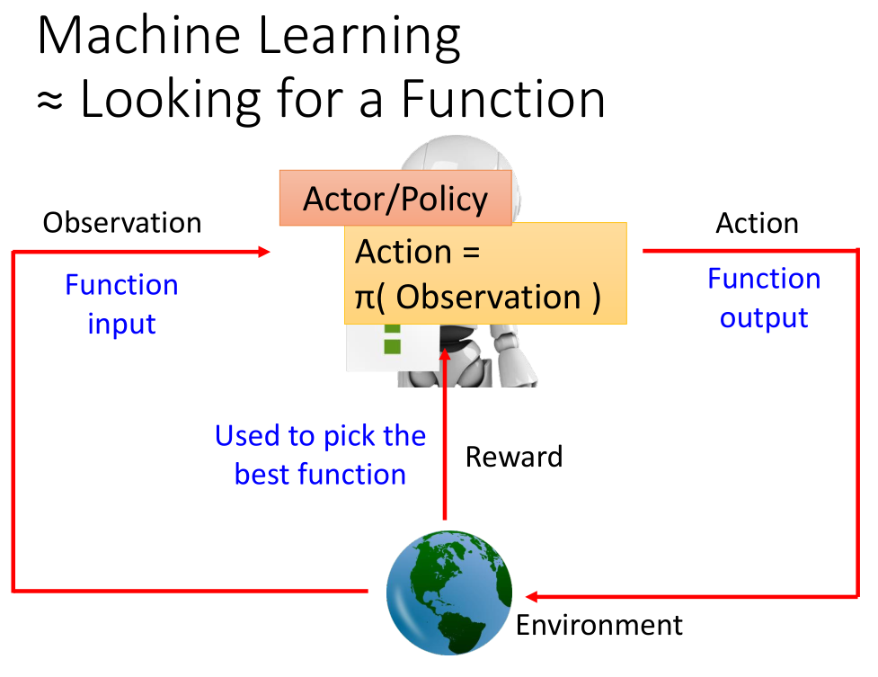

找个这个Function有三个步骤：

#### Neural Network as Actor

第一个步骤就是决定你的Function长什么样子，假设你的Function是一个Neural Network，就是一个deep reinforcement learning。

如果Neural Network作为一个Actor，这个Neural Network的输入就是observation，可以通过一个vector或者一个matrix 来描述。output就是你现在可以采取的action。

举个例子，Neural Network作为一个Actor，inpiut是一张image，output就是你现在有几个可以采取的action，output就有几个dimension。假设我们在玩Space invader，output就是可能采取的action左移、右移和开火，这样output就有三个dimension分别代表了左移、右移和开火。

这个Neural Network怎么决定这个Actor要采取哪个action呢？通常做法是这样，把 image 丢到 Neural Network 里面去，他就会告诉你每一个 output 的 dimension 也就是每一个 action 所对应的分数。你可以采取分数最高的 action，比如说 left 分数最高，假设已经找好这个 Actor，machine 看到这个画面他可能就采取 left。

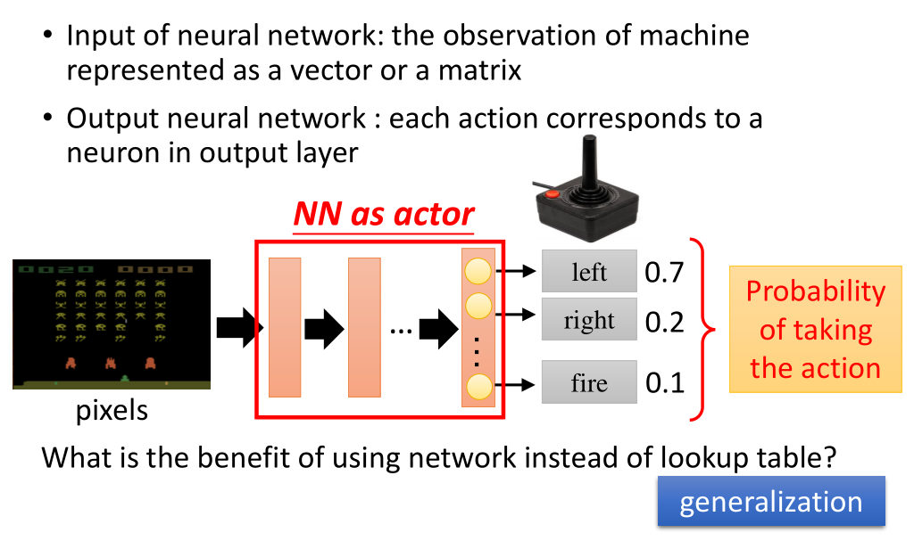

但是做 Policy Gradient 的时候，通常会假设Policy 是 stochastic，所谓的 stochastic 的意思是你的 Policy 的 output 其实是个机率，如果你的分数是 0.7、0.2 跟 0.1，有 70% 的机率会 left，有 20% 的机率会 right，10% 的机率会 fire，看到同样画面的时候，根据机率，同一个 Actor 会采取不同的 action。这种 stochastic 的做法其实很多时候是会有好处的，比如说要玩猜拳，如果 Actor 是 deterministic，可能就只会一直输，所以有时候会需要 stochastic 这种 Policy。在底下的 lecture 里面都假设 Actor 是 stochastic 的。

用 Neural Network 来当 Actor 有什么好处？传统的作法是直接存一个 table，这个 table 告诉我看到这个 observation 就采取这个 action，看到另外一个 observation 就采取另外一个 action。但这种作法要玩电玩是不行的，因为电玩的 input 是 pixel，要穷举所有可能 pixel 是没有办法做到的，所以一定要用 Neural Network 才能够让 machine 把电玩玩好。用 Neural Network 的好处就是 Neural Network 可以举一反三，就算有些画面完全没有看过，因为 Neural Network 的特性，input 一个东西总是会有 output，就算是他没有看过的东西，他也有可能得到一个合理的结果，用 Neural Network 的好处是他比较 generalize。

#### Goodness of Actor

第二步骤就是，我们要决定一个Actor的好坏。在Supervised learning中，我们是怎样决定一个Function的好坏呢？假设给一个 Neural Network ，参数假设已经知道就是 $\theta$，有一堆 training example，假设在做 image classification，就把 image 丢进去看 output 跟 target 像不像，如果越像的话这个Function就会越好，定义一个东西叫做 Loss，算每一个 example 的 Loss ，合起来就是 Total Loss。需要找一个参数去 minimize 这个 Total Loss。

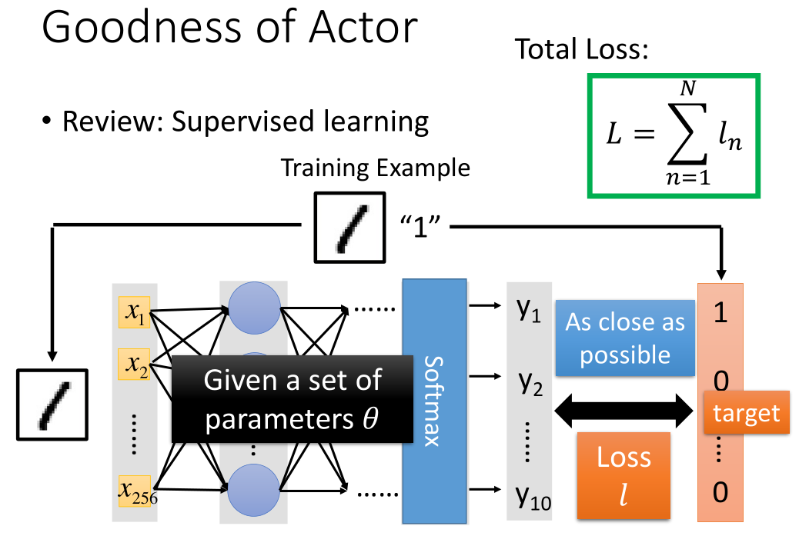

在Reinforcement Learning里面，一个Actor的好坏的定义是非常类似的。假设我们现在有一个Actor，这个Actor就是一个Neural Network。

Neural Network的参数是$\mathbf{\theta}$，即一个Actor可以表示为$\pi_\theta(s)$，它的input就是Mechine看到的observation。

那怎么知道一个Actor表现得好还是不好呢？我们让这个Actor实际的去玩一个游戏，玩完游戏得到的total reward为 $R_\theta=\sum_{t=1}^Tr_t$，把每个时间得到的reward合起来，这就是一个episode里面，你得到的total reward。

这个total reward是我们需要去maximize的对象。我们不需要去maximize 每个step的reward，我们是要maximize 整个游戏玩完之后的total reward。

假设我们拿同一个Actor，每次玩的时候，$R_\theta$其实都会不一样的。因为两个原因，首先 Actor 如果是 stochastic ，看到同样的场景也会采取不同的 actio。所以就算是同一个Actor，同一组参数，每次玩的时候你得到的$R_\theta$也会不一样的。游戏本身也有随机性，就算你采取同一个Action，你看到的observation每次也可能都不一样。所以$R_\theta$是一个Random Variable。我们做的事情，不是去maximize某一次玩游戏时的$R_\theta$，而是去maximize $R_\theta$的期望值。这个期望值就衡量了某一个Actor的好坏，好的Actor期望值就应该要比较大。

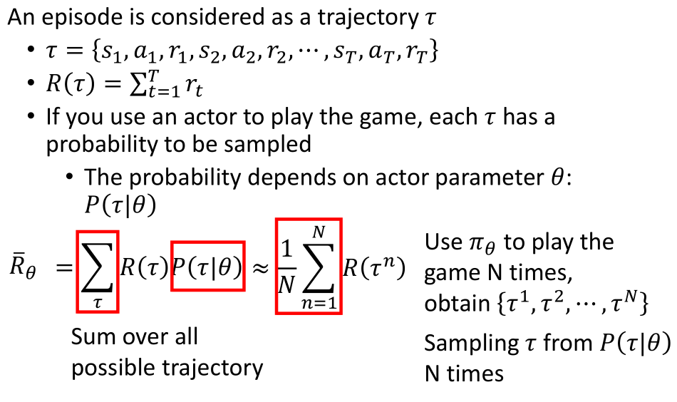

那么怎么计算呢，我们假设一场游戏就是一个trajectory $\tau$
$$
 \tau = \left\{ s_1,a_1,r_1, s_2,a_2,r_2,...,s_T,a_T,r_T \right\} 
$$
$\tau$ 包含了state(observation)，看到这个 observation 以后take的Action，得到的Reward，是一个sequence。
$$
R(\tau) = \sum_{n=1}^Nr_n
$$
$R(\tau)$代表在这个episode里面，最后得到的总reward。

当我们用某一个Actor去玩这个游戏的时候，每个$\tau$都会有出现的机率，$\tau$代表从游戏开始到结束过程，这个过程有千百万种。当你选择这个Actor的时候，你可能只会看到某一些过程，某些过程特别容易出现，某些过程比较不容易出现。每个游戏出现的过程，可以用一个机率$P(\tau|\theta)$来表示它，就是说参数是$\theta$时$\tau$这个过程出现的机率。

那么$R_\theta$的期望值为
$$
\bar{R}_\theta=\sum_\tau R(\tau)P(\tau|\theta)
$$
实际上要穷举所有的$\tau$是不可能的，那么要怎么做？让Actor去玩N场这个游戏，获得N个过程${\tau^1,\tau^2,...,\tau^N}$ ，玩N场就好像从$P(\tau|\theta)$去Sample N个$\tau$。假设某个$\tau$它的机率特别大，就特别容易被sample出来。让Actor去玩N场，相当于从$P(\tau|\theta)$概率场抽取N个过程，可以通过N个Reward的均值进行近似，如下表达
$$
\bar{R}_\theta=\sum_\tau R(\tau)P(\tau|\theta) \approx \frac{1}{N}R(\tau^n)
$$

#### Pick the best function

怎么选择最好的function，其实就是用我们的Gradient Ascent。我们已经找到目标了，就是最大化这个$\bar{R}_\theta$

$$
\theta^\ast = arg \max_\theta \bar{R}_\theta \  \ \ \ \ \ \bar{R}_\theta = \sum_\tau R(\tau)P(\tau|\theta)
$$
就可以用Gradient Ascent进行最大化，过程为：
$$
\text{start with }\theta^{0}
\\
\theta^{1} \leftarrow \theta^{0}+\eta \nabla \bar{R}_{\theta^{0}}
\\
\theta^{2} \leftarrow \theta^{1}+\eta \nabla \bar{R}_{\theta^{1}}\\
......
$$
参数$\theta = {w_1,w_2,...,b_1,...}$，那么$\triangledown \bar{R}_{\theta}$就是$\bar{R}_{\theta}$对每个参数的偏微分，如下
$$
\triangledown \bar{R}_{\theta} = \begin{bmatrix}
\partial{ \bar{R}_{\theta}}/\partial w_1 \\ \partial{ \bar{R}_{\theta}}/\partial w_2
\\ \vdots
\\ \bar{R}_{\theta}/\partial b_1
\\ \vdots
\end{bmatrix} 
 
$$
实际的计算中

$\bar{R}_\theta = \sum_\tau R(\tau)P(\tau|\theta)$中，只有$P(\tau|\theta)$跟$\theta$有关系，所以只需要对$P(\tau|\theta)$做Gradient ，即
$$
\nabla \bar{R}_{\theta}=\sum_{\tau} R(\tau) \nabla P(\tau | \theta)
$$
所以$R(\tau)$就算不可微也没有关系，或者是不知道它的function也可以，我们只要知道把$\tau$放进去得到值就可以。

接下来，为了让$P(\tau|\theta)$出现
$$
\nabla \bar{R}_{\theta}=\sum_{\tau} R(\tau) \nabla P(\tau | \theta)=\sum_{\tau} R(\tau) P(\tau | \theta) \frac{\nabla P(\tau | \theta)}{P(\tau | \theta)}
$$
由于
$$
\frac{\operatorname{dlog}(f(x))}{d x}=\frac{1}{f(x)} \frac{d f(x)}{d x}
$$
所以
$$
\nabla \bar{R}_{\theta}=\sum_{\tau} R(\tau) P(\tau | \theta) \frac{\nabla P(\tau | \theta)}{P(\tau | \theta)}=\sum_{\tau} R(\tau) P(\tau | \theta) \nabla \log P(\tau | \theta)
$$
从而可以通过抽样的方式去近似，即
$$
\nabla \bar{R}_{\theta}=\sum_{\tau} R(\tau) P(\tau | \theta) \nabla \log P(\tau | \theta)\approx \frac{1}{N} \sum_{n=1}^{N} R\left(\tau^{n}\right) \nabla \log P\left(\tau^{n} | \theta\right)
$$
即拿$\theta$去玩N次游戏，得到${\tau^1,\tau^2,...,\tau^N}$，算出每次的$R(\tau)$。

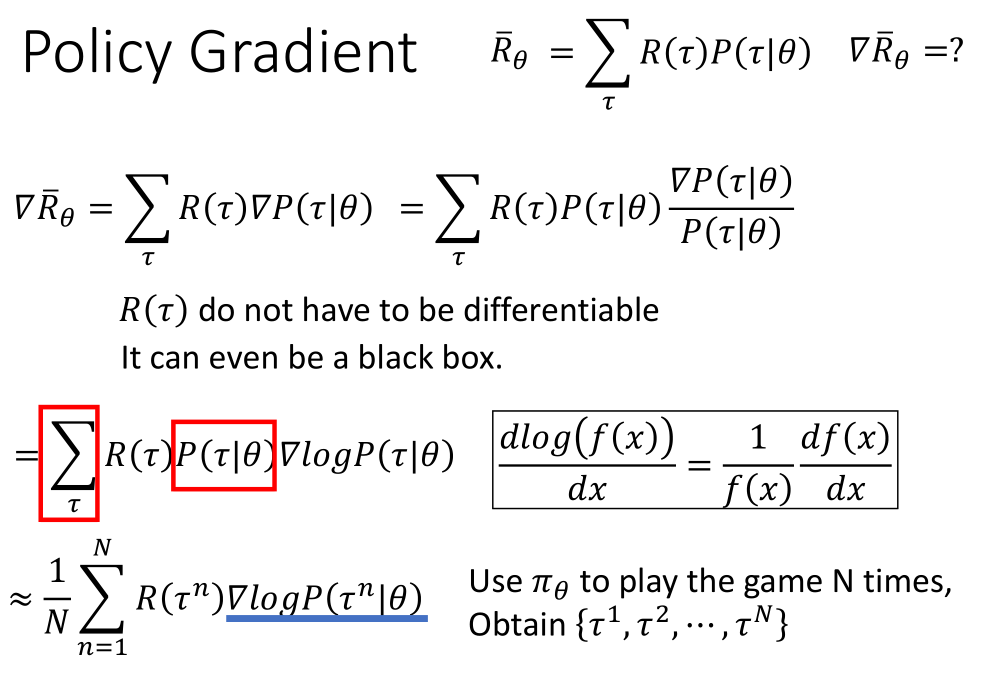

接下来的问题是怎么计算$\nabla \log P\left(\tau^{n} | \theta\right)$，因为
$$
P(\tau|\theta)=p\left(s_{1}\right) p\left(a_{1} | s_{1}, \theta\right) p\left(r_{1}, s_{2} | s_{1}, a_{1}\right) p\left(a_{2} | s_{2}, \theta\right) p\left(r_{2}, s_{3} | s_{2}, a_{2}\right) \cdots \\
=p\left(s_{1}\right) \prod_{t=1}^{T} p\left(a_{t} | s_{t}, \theta\right) p\left(r_{t}, s_{t+1} | s_{t}, a_{t}\right)
$$
其中$P(s_1)$是初始状态出现的机率，接下来根据$\theta$会有某个概率在$s_1$状态下采取Action $a_1$，然后根据$a_1,s_1$会得到某个reward $r_1$，并跳到另一个state $s_2$，以此类推。其中$p\left(s_{1}\right)$和$p\left(r_{t}, s_{t+1} | s_{t}, a_{t}\right)$跟Actor是无关的，只有$p\left(a_{t} | s_{t}, \theta\right)$跟Actor $\pi_\theta$有关系。

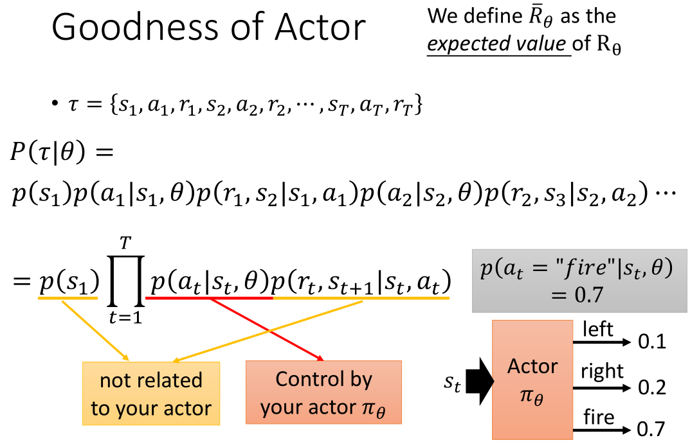

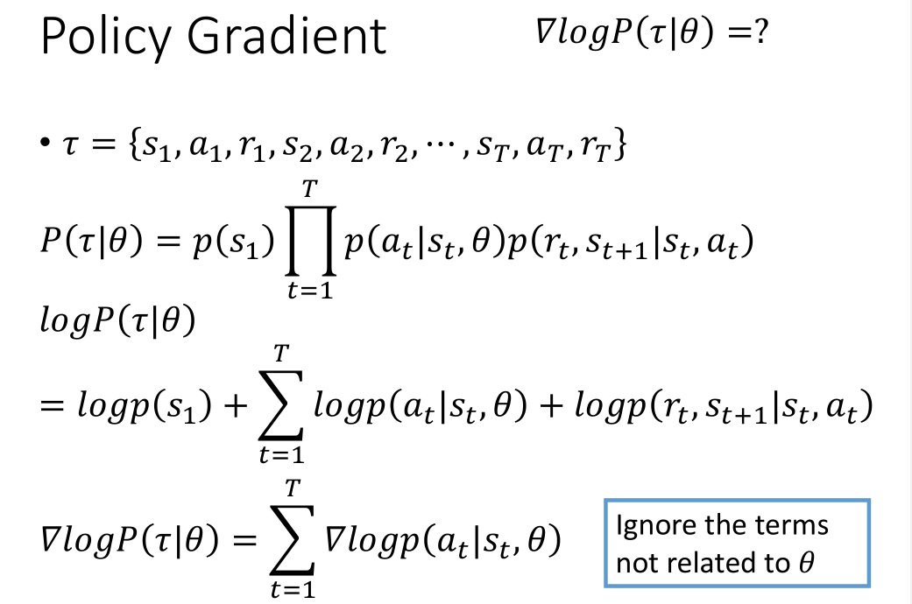

通过取log，连乘转为连加，即
$$
\log P(\tau | \theta) =\log p\left(s_{1}\right)+\sum_{t=1}^{T} \log p\left(a_{t} | s_{t}, \theta\right)+\log p\left(r_{t}, s_{t+1} | s_{t}, a_{t}\right)
$$
然后对$\theta$取Gradient，删除无关项，得到
$$
\nabla \log P(\tau | \theta)=\sum_{t=1}^{T} \nabla \log p\left(a_{t} | s_{t}, \theta\right)
$$
则
$$
\begin{aligned} \nabla \bar{R}_{\theta} & \approx \frac{1}{N} \sum_{n=1}^{N} R\left(\tau^{n}\right) \nabla \log P\left(\tau^{n} | \theta\right)=\frac{1}{N} \sum_{n=1}^{N} R\left(\tau^{n}\right) \sum_{t=1}^{T_{n}} \nabla \log p\left(a_{t}^{n} | s_{t}^{n}, \theta\right) \\ &=\frac{1}{N} \sum_{n=1}^{N} \sum_{t=1}^{T_{n}} R\left(\tau^{n}\right) \nabla \log p\left(a_{t}^{n} | s_{t}^{n}, \theta\right) \end{aligned}
$$
这个式子就告诉我们，当我们在某一次$\tau^n$游戏中，在$s_t^n$状态下采取$a_t^n$得到$R(\tau^n)$是正的，我们就希望$\theta$能够使$p(a_t^n|s_t^n)$的概率越大越好。反之，如果$R(\tau^n)$是负的，就要调整$\theta$参数，能够使$p(a_t^n|s_t^n)$的机率变小。

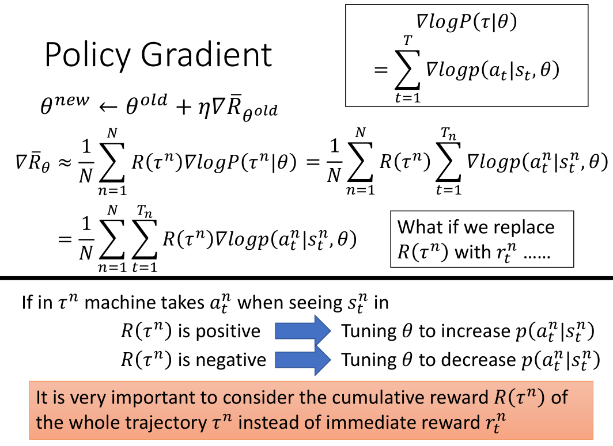

注意，某个时间点的$p\left(a_{t}^{n} | s_{t}^{n}, \theta\right)$是乘上这次游戏的所有reward $R(\tau^n)$而不是这个时间点的reward。假设我们只考虑这个时间点的reward，那么就是说只有fire才能得到reward，其他的action你得到的reward都是0。Machine就只会增加fire的机率，不会增加left或者right的机率。最后Learn出来的Agent它就只会fire。

接着还有一个问题，为什么要取log呢？

$$
\nabla \log p\left(a_{t}^{n} | s_{t}^{n}, \theta\right)=\frac{\nabla  p\left(a_{t}^{n} | s_{t}^{n}, \theta\right)}{p\left(a_{t}^{n} | s_{t}^{n}, \theta\right)}
$$
那么为什么要除以$p\left(a_{t}^{n} | s_{t}^{n}, \theta\right)$呢？

假设现在让 machine 去玩 N 次游戏，那某一个 state 在第 13 次、第 15 次、第 17 次、第 33 次的游戏，$\tau^{13},\tau^{15},\tau^{17},\tau^{33}$里面看到了同一个 observation。因为 Actor 其实是 stochastic，所以它有个机率，所以看到同样的 s，不见得采取同样 action，所以假设在第 13 个 trajectory，它采取 action a，在第 17 个它采取 b，在 15 个采取 b，在 33 也采取 b，最后$\tau^{13}$的这个 trajectory 得到的 reward 比较大是 2，另外三次得到的 reward 比较小。

但实际上在做 update 的时候，它会偏好那些出现次数比较多的 action，就算那些 action 并没有真的比较好。

因为是 summation over 所有 sample 到的结果，如果 take action b 这件事情，出现的次数比较多，就算它得到的 reward 没有比较大，machine 把这件事情的机率调高，也可以增加最后这一项的结果，虽然这个 action a 感觉比较好，但是因为它很罕见，所以调高这个 action 的机率，最后也不会对你要 maximize 的对象 Objective 的影响也是比较小的，machine 就会变成不想要 maximize action a 出现的机率，转而 maximize action b 出现的机率。这就是为什么这边需要除掉一个机率，除掉这个机率的好处就是做一个 normalization，如果有某一个 action 它本来出现的机率就比较高，它除掉的值就比较大，让它除掉一个比较大的值，machine 最后在 optimize 的时候，就不会偏好那些机率出现比较高的 action。

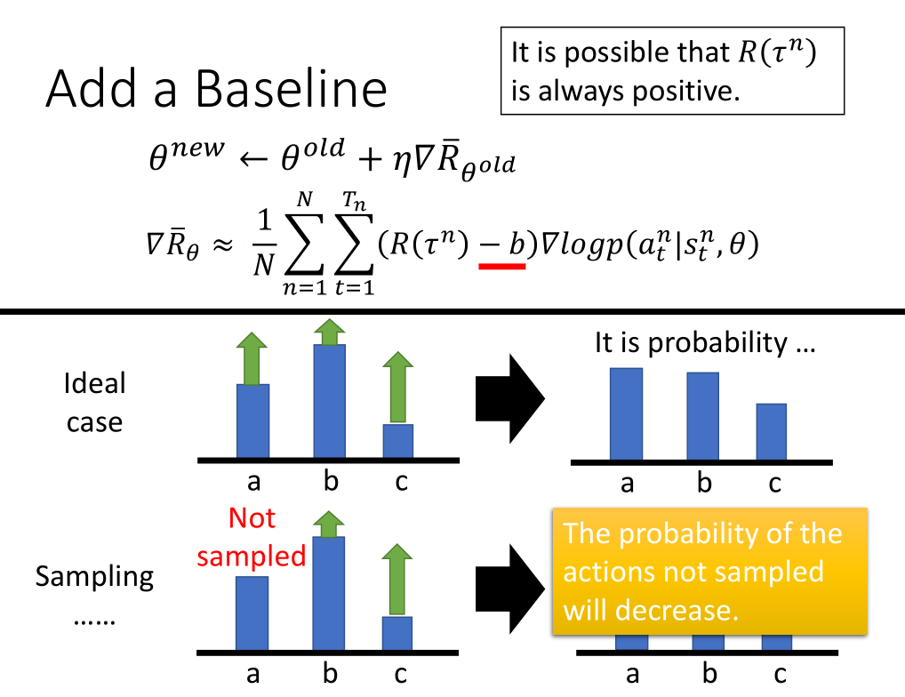

还有另外一个问题，假设$R(\tau^n)$总是正的，那么会出现什么事情呢？在理想的状态下，这件事情不会构成任何问题。假设有三个action，$a,b,c$采取的结果得到的reward都是正的，这个正有大有小，假设$a$和$c$的$R(\tau^n)$比较大，$b$的$R(\tau^n)$比较小，经过update之后，你还是会让$b$出现的机率变小，$a,c$出现的机率变大，因为会做normalization。但是实做的时候，我们做的事情是sampling，所以有可能只sample b和c，这样b,c机率都会增加，$a$没有sample到，机率就自动减少，这样就会有问题了。

这样，我们就希望$R(\tau^n)$有正有负这样，可以通过将$R(\tau^n)-b$来避免，$b$需要自己设计。如下
$$
\nabla \bar{R}_{\theta} \approx \frac{1}{N} \sum_{n=1}^{N} \sum_{t=1}^{T_{n}}\left(R\left(\tau^{n}\right)-b\right) \nabla \log p\left(a_{t}^{n} | s_{t}^{n}, \theta\right)
$$
这样$R(\tau^n)$超过b的时候就把机率增加，小于b的时候就把机率降低，不会造成没被sample到的action机率会减小。

##### Policy Gradient

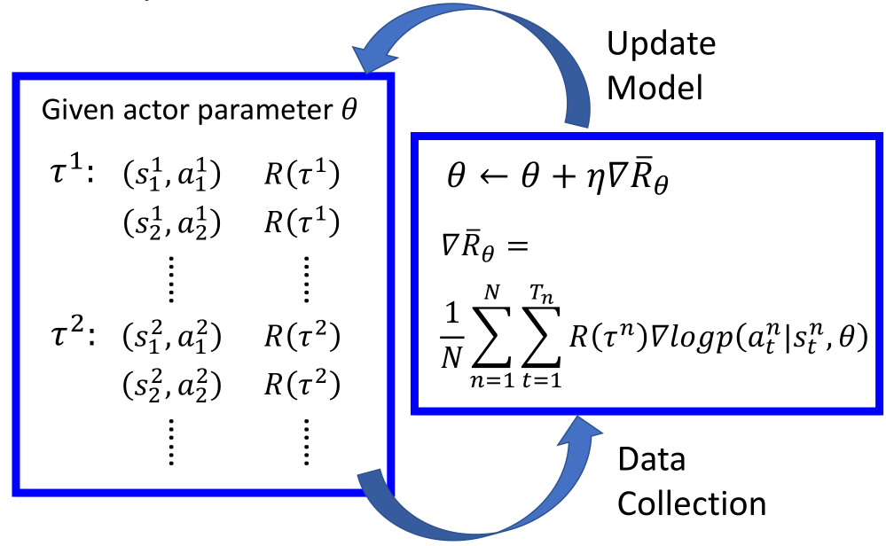

可以把训练过程看成多个分类网络的训练过程，优化目标一致。实作上也一样。

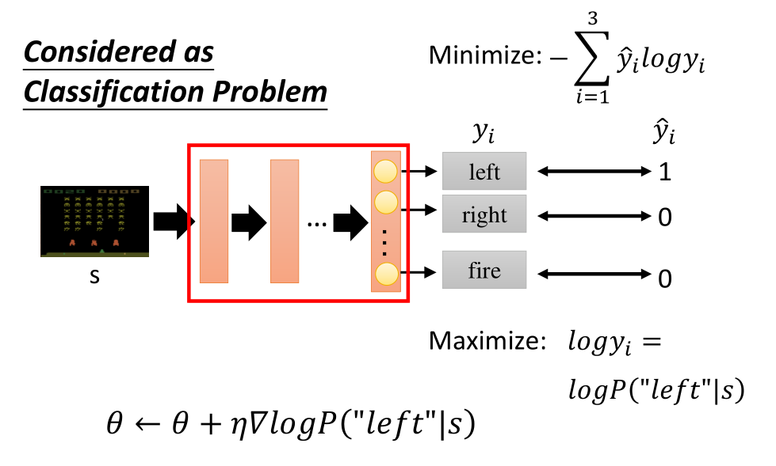

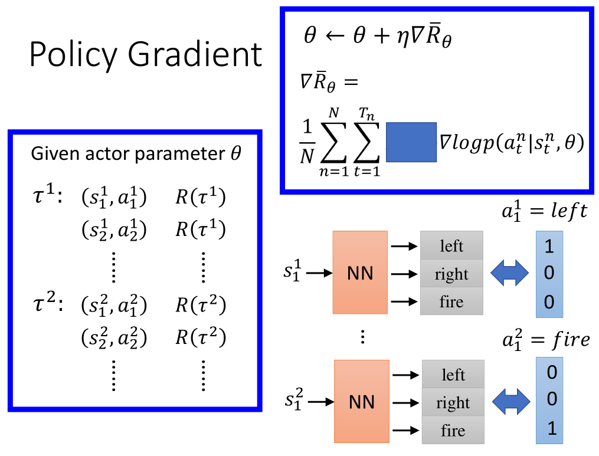

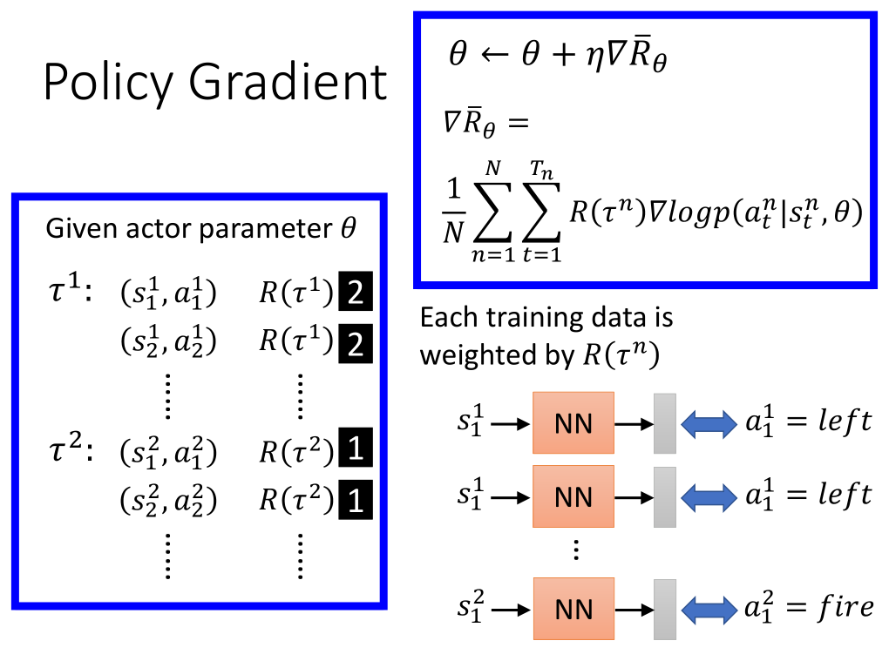

### Value-based Approach

#### Critic

Critic就是Learn一个Neural Network，这个Neural Network不做事。

A critic does not determine the action.Given an actor $π$, it evaluates the how good the actor is.

An actor can be found from a critic. e.g. Q-learning。其实也可以从 Critic 得到一个 Actor，这就是Q-learning。

Critic就是learn一个function，这个function可以告诉你说现在看到某一个observation的时候，这个observation有有多好这样。

这个 Critic 其实有很多种，我们今天介绍 state value function

##### State value function $V^\pi(s)$

When using actor 𝜋, the cumulated reward expects to be obtained after seeing observation (state) s.

##### How to estimate $V^\pi(s)$

###### Monte-Carlo based approach

类似回归问题，训练时需要cumulated reward

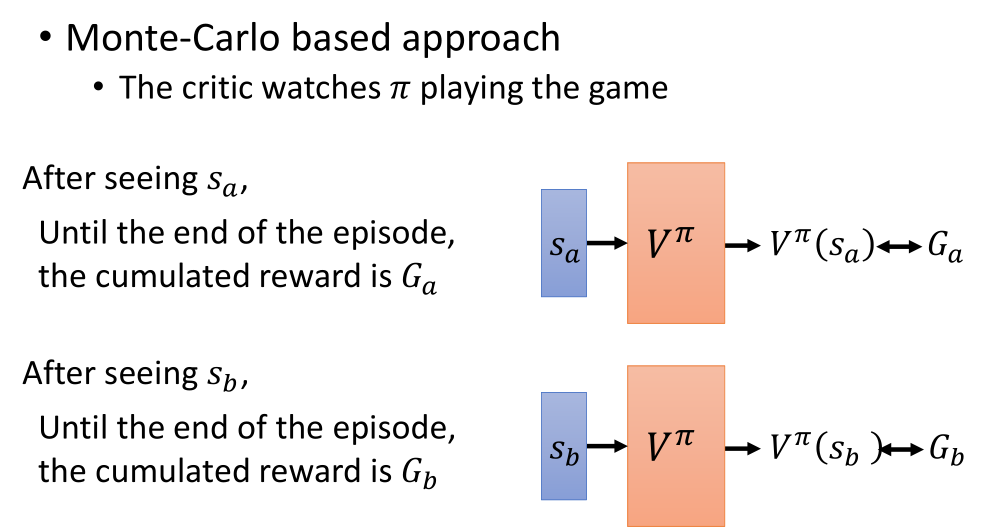

###### Temporal-difference approach

同样类似回归问题，训练时只需要让 $s_{t+1}$ 和 $s_t$ 中间差的 reward 接近 $r_(t)$，输出仍然是游戏结束时的reward

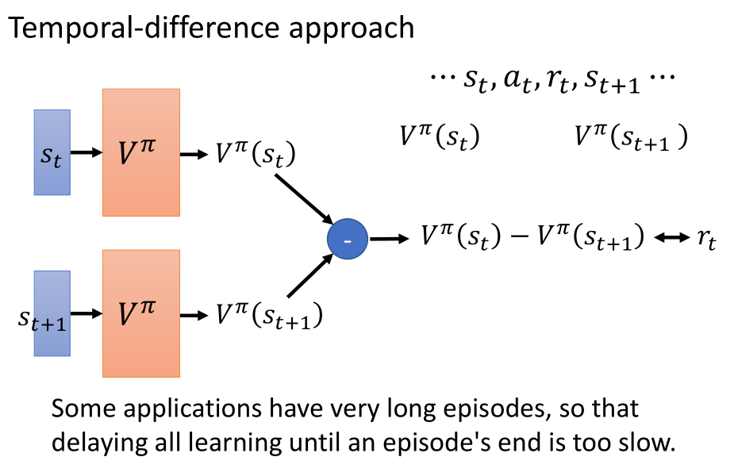

##### State-action value function $Q^\pi(s,a)$

另外一种 critic，它可以拿来决定 action，这种 critic 我们叫做 Q function。它的 input 就是一个 state，一个 action，output 是在这个 state 采取了 action a 的话，到游戏结束的时候，会得到多少 accumulated reward

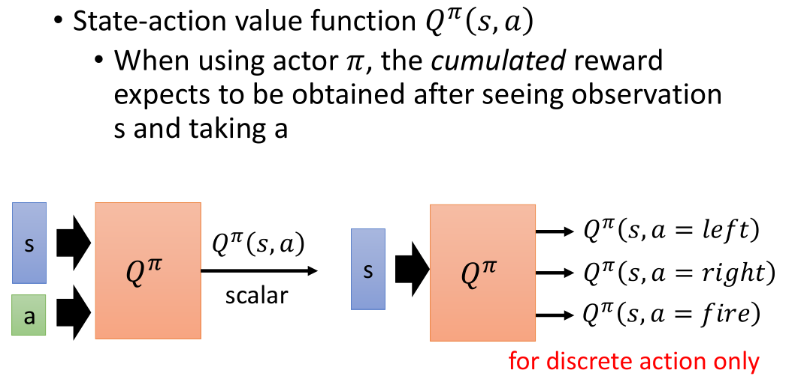

有时候我们会改写这个 Q function，假设你的 a 是可以穷举的，你只要输入一个 state s ，你就可以知道说，所有action的情况下，输出分数是多少。它的妙用是这个样子，你可以用 Q function 找出一个比较好的 actor。这一招就叫做 Q learning。

##### DQN（Deep Q-Learning）

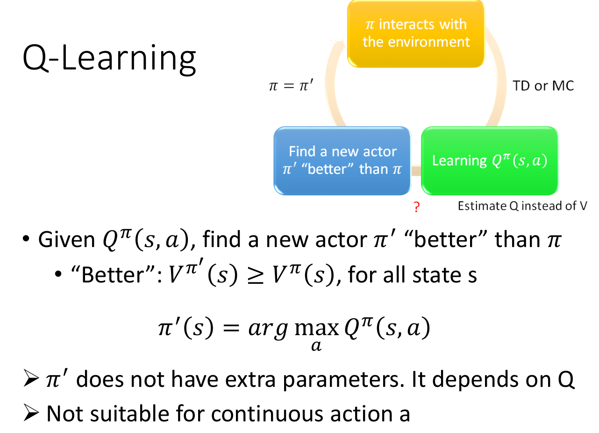

####  Actor-Critic

### Inverse Reinforcement Learning

用 inverse reinforcement learning 的方法去推出 reward function，再用 reinforcement learning 的方法去找出最好的 actor

## Proximal Policy Optimization (PPO)

我们要讲一个 policy gradient 的进阶版叫做 Proximal Policy Optimization (PPO)，这个技术是 default reinforcement learning algorithm at OpenAI，所以今天假设你要 implement reinforcement learning，也许这是一个第一个你可以尝试的方法。

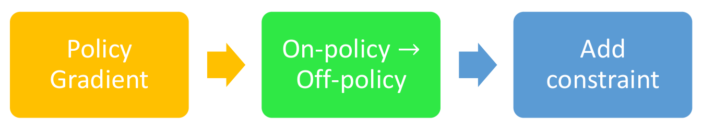

### Policy Gradient (Review)

那我们就来先复习一下 policy gradient，PPO 是 policy gradient 一个变形，所以我们先讲 policy gradient。

#### Basic Components

在 reinforcement learning 里面呢有 3 个 components，一个 actor，一个 environment，一个 reward function。

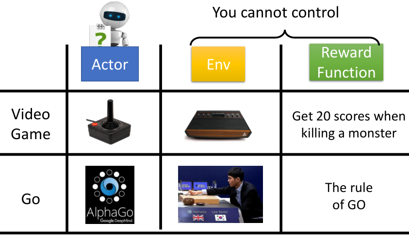

让机器玩 video game，那这个时候你 actor 做的事情，就是去操控，游戏的游戏杆，，比如说向左向右，开火，等等。你的 environment 就是游戏的主机，负责控制游戏的画面，负责控制说，怪物要怎么移动，你现在要看到什么画面，等等。所谓的 reward function，就是决定，当你做什么事情，发生什么状况的时候，你可以得到多少分数，比如说杀一只怪兽，得到20 分等等。

那同样的概念，用在围棋上也是一样，actor 就是 alpha Go，它要决定，下哪一个位置，那你的 environment 呢，就是对手，你的 reward function 就是按照围棋的规则，赢就是得一分，输就是负一分等等。

那在 reinforcement 里面，你要记得说 environment 跟 reward function，不是你可以控制的，environment 跟 reward function 是在开始学习之前，就已经事先给定的。

你唯一能做的事情，是调整你的 actor，调整你 actor 里面的 policy，使得它可以得到最大的 reward，你可以调的只有 actor。environment 跟 reward function 是事先给定，你是不能够去动它的。

那这个 actor 里面，会有一个 policy，这个 policy 决定了 actor 的行为。那所谓的 policy 呢，就是给一个外界的输入，然后它会输出 actor 现在应该要执行的行为。

#### Policy of Actor

那今天假设你是用 deep learning 的技术来做 reinforcement learning 的话，那你的 policy，policy 我们一般写成 $\pi$，policy 就是一个 network，那我们知道说，network 里面，就有一堆参数，我们用 $\theta$ 来代表 $\pi$ 的参数。

你的 policy 它是一个 network，这个 network 的 input 它就是现在 machine 看到的东西，如果让 machine 打电玩的话，那 machine 看到的东西，就是游戏的画面，当然让 machine 看到什么东西，会影响你现在 training，到底好不好 train。举例来说，在玩游戏的时候，也许你觉得游戏的画面，前后是相关的，也许你觉得说，你应该让你的 policy，看从游戏初始，到现在这个时间点，所有画面的总和，你可能会觉得你要用到 RNN 来处理它，不过这样子，你会比较难处理就是了。那要让，你的 machine 你的 policy 看到什么样的画面，这个是你自己决定的。

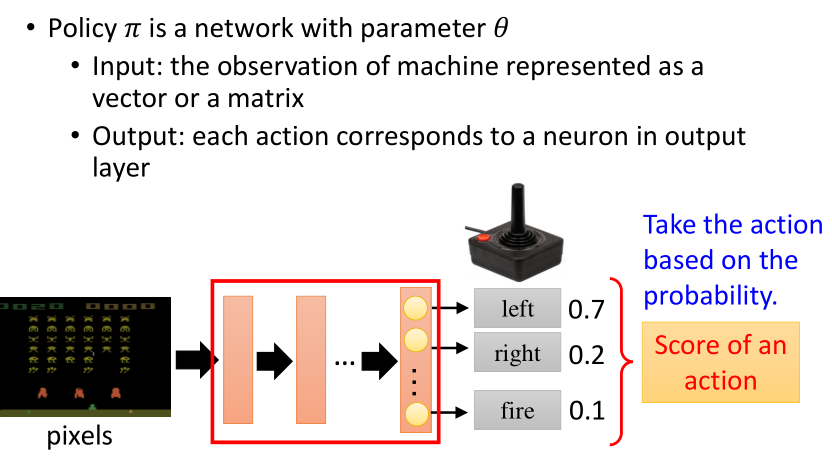

那在 output 的部分，输出的就是今天机器要采取什么样的行为，这边这个是具体的例子，你的 policy 就是一个 network，input 就是游戏的画面，那它通常就是由 $\pi$xels 所组成的，那 output 就是看看说现在有那些选项是你可以去执行的，那你的 output layer 就有几个 neurons，假设你现在可以做的行为就是有 3 个，那你的 output layer 就是有 3 个 neurons，每个 neuron 对应到一个可以采取的行。

那 input 一个东西以后呢，你的 network 就会给每一个可以采取的行为一个分数，接下来你把这个分数当作是机率，那你的 actor 就是看这个机率的分布，根据这个机率的分布，决定它要采取的行为，比如说 70% 会走 left，20% 走 right，10% 开火，等等，那这个机率分布不同，你的 actor 采取的行为就会不一样。

那这是 policy 的部分，它就是一个 network。

##### Example: Playing Video Game

接下来用一个例子，具体的很快地说一下说，今天你的 actor 是怎么样跟环境互动的。

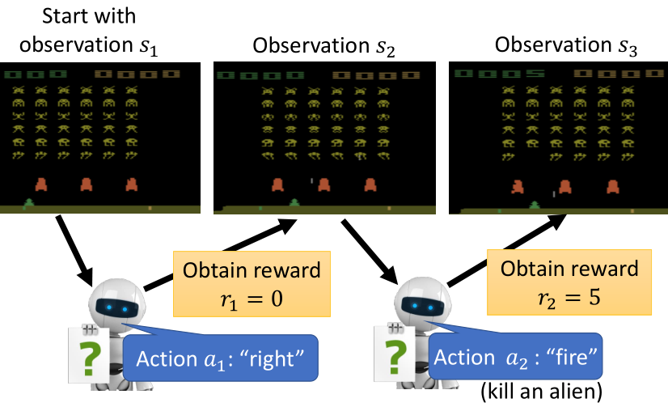

首先你的 actor 会看到一个游戏画面，这个游戏画面，我们就用 s1 来表示它，它代表游戏初始的画面。接下来你的 actor 看到这个游戏的初始画面以后，根据它内部的 network，根据它内部的 policy，它就会决定一个 action，那假设它现在决定的 action 是向右，那它决定完 action 以后，它就会得到一个  reward，代表它采取这个 action 以后，它会得到多少的分数，那这边我们把一开始的初始画面，写作 s1，我们把第一次执行的动作叫做 a1，我们把第一次执行动作完以后得到的 reward，叫做 r1，那不同的文献，其实有不同的定义，有人会觉得说，这边应该要叫做 r2，这个都可以，你自己看得懂就好。

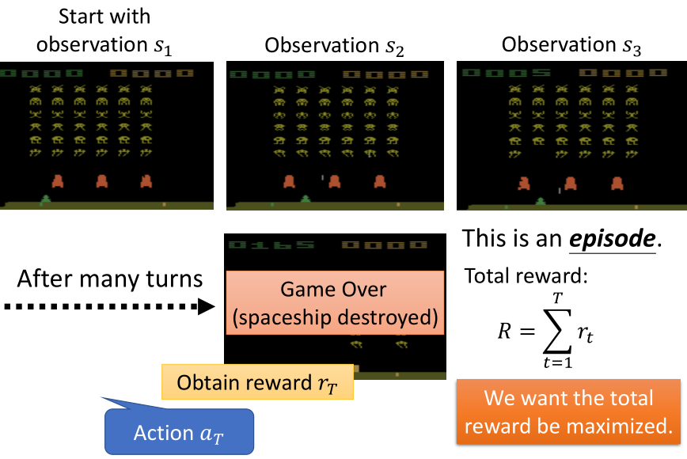

那接下来就看到新的游戏画面，你的，actor 决定一个的行为以后，，就会看到一个新的游戏画面，这边是 s2，然后把这个 s2 输入给 actor，这个 actor 决定要开火，然后它可能杀了一只怪，就得到五分，然后这个 process 就反复的持续下去，直到今天走到某一个 time step，执行某一个 action，得到 reward 之后，这个 environment 决定这个游戏结束了，比如说，如果在这个游戏里面，你是控制绿色的船去杀怪，如果你被杀死的话，游戏就结束，或是你把所有的怪都清空，游戏就结束了。那一场游戏，叫做一个 episode，把这个游戏里面，所有得到的 reward，通通总合起来，就是 Total reward，那这边用大 R 来表示它，那今天这个 actor 它存在的目的，就是想办法去 maximize 它可以得到的 reward。

#### Actor, Environment, Reward

那这边是用图像化的方式，来再跟大家说明一下，你的 environment，actor，还有 reward 之间的关系。

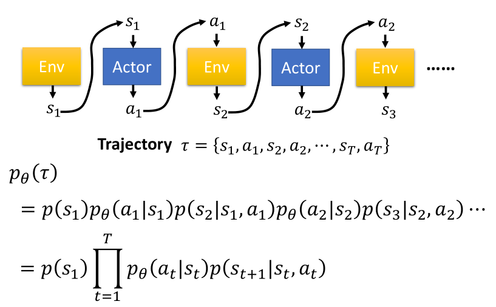

 首先，environment 其实它本身也是一个 function，连那个游戏的主机，你也可以把它看作是一个 function，虽然它里面不见得是 neural network，可能是 rule-based 的规则，但你可以把它看作是一个 function。

那这个 function，一开始就先吐出一个 state，也就是游戏的画面，接下来你的 actor 看到这个游戏画面 s1 以后，它吐出 a1，接下来 environment 把这个 a1 当作它的输入，然后它再吐出 s2，吐出新的游戏画面，actor 看到新的游戏画面，又再决定新的行为 a2，然后 environment 再看到 a2，再吐出 s3，那这个 process 就一直下去，直到 environment 觉得说应该要停止为止。

在一场游戏里面，我们把 environment 输出的 s，跟 actor 输出的行为 a，把这个 s 跟 a 全部串起来，叫做一个 Trajectory，每一个 trajectory，你可以计算它发生的机率，假设现在 actor 的参数已经被给定了话，就是 $\theta$，根据这个 $\theta$，你其实可以计算某一个 trajectory 发生的机率，你可以计算某一个回合，某一个 episode 里面，发生这样子状况的机率。

假设你 actor 的参数就是 $\theta$ 的情况下，某一个 trajectory $\tau$，它的机率就是这样算的，你先算说 environment 输出 s1 的机率，再计算根据 s1 执行 a1 的机率，这个机率是由你 policy 里面的那个network 参数 $\theta$ 所决定的，它是一个机率，因为我们之前有讲过说，你的 policy 的 network，它的 output 它其实是一个 distribution，那你的 actor 是根据这个 distribution 去做 sample，决定现在实际上要采取的 action是哪一个。

接下来你这个 environment，根据，这边图中是说根据 a1 产生 s2，那其实它是根据，a1 跟 s1 产生 s2，因为s2 跟 s1 还是有关系的，下一个游戏画面，跟前一个游戏画面，通常还是有关系的，至少要是连续的，所以这边是给定前一个游戏画面 s1，跟你现在 actor 采取的行为 a1，然后会产生 s2，这件事情它可能是机率，也可能不是机率，这个是就取决于那个 environment，就是那个主机它内部设定是怎样，看今天这个主机在决定，要输出什么样的游戏画面的时候，有没有机率。如果没有机率的话，那这个游戏的每次的行为都一样，你只要找到一条 path，就可以过关了，这样感觉是蛮无聊的。所以游戏里面，通常是还是有一些机率的，你做同样的行为，给同样的给前一个画面，下次产生的画面其实不见得是一样的，Process 就反复继续下去，你就可以计算说，一个 trajectory s1,a1, s2, a2 它出现的机率有多大。

那这个机率，取决于两件事，一部分是 environment 本身的行为， environment 的 function，它内部的参数或内部的规则长什么样子，那这个部分，就这一项 $p\left(s_{t+1} \mid s_{t}, a_{t}\right)$，代表的是 environment，这个 environment 这一项通常你是无法控制它的，因为那个是人家写好的，你不能控制它，你能控制的是 $p_{\theta}\left(a_{t} \mid s_{t}\right) $，你就 given 一个 st，你的 actor 要采取什么样的行为 at 这件事，会取决于你 actor 的参数，你的 passed 参数 $\theta$，所以这部分是 actor 可以自己控制的。随着 actor 的行为不同，每个同样的 trajectory，它就会有不同的出现的机率。

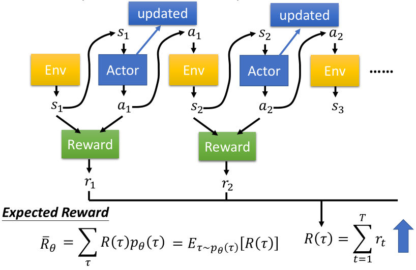

我们说在 reinforcement learning 里面，除了 environment 跟 actor 以外呢，还有第三个角色，叫做 reward function。Reward function 做的事情就是，根据在某一个 state 采取的某一个 action，决定说现在这个行为，可以得到多少的分数，它是一个 function，给它 s1，a1，它告诉你得到 r1，给它 s2，a2，它告诉你得到 r2，我们把所有的小 r 都加起来，我们就得到了大 R，我们这边写做大  $R(\tau)$，代表说是，某一个 trajectory $\tau$，在某一场游戏里面，某一个 episode 里面，我们会得到的大 R。

那今天我们要做的事情就是调整 actor 内部的参数 $\theta$，使得 R 的值越大越好，但是实际上 reward，它并不只是一个 scalar，reward 它其实是一个 random variable，这个大 R 其实是一个 random variable。

为什么呢？因为你的 actor 本身，在给定同样的 state 会做什么样的行为，这件事情是有随机性的，你的 environment，在给定同样的 action 要产生什么样的 observation，本身也是有随机性的。所以这个大 R 其实是一个 random variable，你能够计算的是它的期望值。你能够计算的是，在给定某一组参数 $\theta$ 的情况下，我们会得到的这个大 R 的期望值是多少，那这个期望值是怎么算的呢？这期望值的算法就是，穷举所有可能的 trajectory，穷举所有可能的 trajectory $\tau$，每一个 trajectory $\tau$，它都有一个机率，比如说今天你的 $\theta$ 是一个很强的 model，它都不会死，那如果今天有一个 episode 是很快就死掉了，它的机率就很小，如果有一个 episode 是都一直没有死，那它的机率就很大，那根据你的 $\theta$，你可以算出某一个 trajectory $\tau$ 出现的机率，接下来你计算这个 $\tau$ 的 total reward 是多少，把 total reward weighted by 这个 $\tau$ 出现的机率，summation over 所有的 $\tau$，显然就是 given 某一个参数你会得到的期望值，或你会写成这样，从 p($\theta$) of $\tau$ 这个 distribution，sample 一个 trajectory $\tau$，然后计算 R of $\tau$ 的期望值，就是你的 expected reward。

#### Policy Gradient

那我们要做的事情，就是 maximize expected reward，怎么 maximize expected reward 呢？我们用的就是 gradient ascent。因为我们是要让它越大越好，所以是 gradient ascent，所以跟 gradient decent 唯一不同的地方就只是，本来在 update 参数的时候，要减，现在变成加。

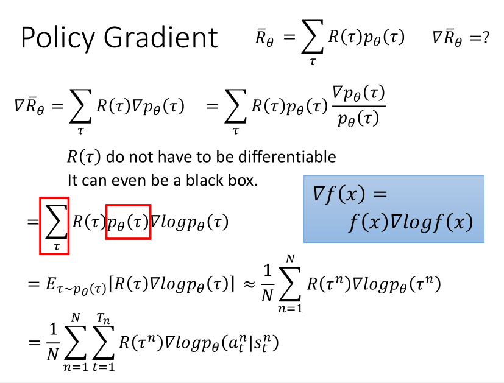

然后这 gradient ascent 你就必须计算，R bar 这个 expected reward，它的 gradient，R bar 的 gradient 怎么计算呢？这跟 GAN 做 sequence generation 的式子，其实是一模一样的。

R bar 我们取一个 gradient，这里面只有 $p(\theta)$，是跟 $\theta$ 有关，所以 gradient 就放在 $p(\theta)$ 这个地方。

R 这个 reward function ，不需要是 differentiable，我们也可以解接下来的问题，举例来说，如果是在 GAN 里面，你的这个 R 其实是一个 discriminator，它就算是没有办法微分也无所谓，你还是可以做接下来的运算。

接下来要做的事情，分子分母，上下同乘 $p_\theta (\tau)$，后面这一项其实就是这个 $\log p_\theta (\tau)$，取 gradient。

或者是你其实之后就可以直接背一个公式，就某一个 function f of x，你对它做 gradient 的话，就等于 f of x 乘上 gradient log f of x。

所以今天这边有一个 gradient $p_\theta (\tau)$，带进这个公式里面呢，这边应该变成  $p_\theta (\tau)$乘上 gradient $\log p_\theta (\tau)$。

然后接下来呢，这边又 summation over $\tau$，然后又有把这个 R 跟这个 log 这两项，weighted by $p_\theta (\tau)$，那既然有 weighted by $p_\theta (\tau)$，它们就可以被写成这个 expected 的形式，也就是你从 $p_\theta (\tau)$ 这个 distribution 里面 sample $\tau$ 出来，去计算 R of $\tau$ 乘上 gradient $\log p_\theta (\tau)$，然后把它对所有可能的 $\tau$ 做 summation，就是这个 expected value。

这个 expected value 实际上你没有办法算，所以你是用 sample 的方式，来 sample 一大堆的 $\tau$，你 sample 大 N 笔 $\tau$，然后每一笔呢，你都去计算它的这些 value，然后把它全部加起来，最后你就得到你的 gradient。你就可以去 update 你的参数，你就可以去 update 你的 agent。

那这边呢，我们跳了一大步，这边这个 p($\theta$) of $\tau$，我们前面有讲过 p($\theta$) of $\tau$ 是可以算的，那 p($\theta$) of $\tau$ 里面有两项，一项是来自于 environment，一项是来自于你的 agent，来自 environment 那一项，其实你根本就不能算它，你对它做 gradient 是没有用的，因为它跟 $\theta$ 是完全没有任何关系的，所以你不需要对它做 gradient。你真正做 gradient 的，只有 log p($\theta$) of at given st 而已。

这个部分，其实你可以非常直观的来理解它，也就是在你 sample 到的 data 里面，你 sample 到，在某一个 state st 要执行某一个 action at。就是这个 st 跟 at，它是在整个 trajectory $\tau$ 的里面的某一个 state and action 的 pair，假设你在 st 执行 at，最后发现 $\tau$ 的 reward 是正的，那你就要增加这一项的机率，你就要增加在 st 执行 at 的机率，反之，在 st 执行 at 会导致整个，trajectory 的 reward 变成负的，你就要减少这一项的机率，那这个概念就是怎么简单。

这个怎么实作呢？你用 gradient ascent 的方法，来 update 你的参数，所以你原来有一个参数 $\theta$，你把你的 $\theta$ 加上你的 gradient 这一项，那当然前面要有个 learning rate，learning rate 其实也是要调的，你要用 adam、rmsprop 等等，还是要调一下。那这 gradient 这一项怎么来呢？gradient 这一项，就套下面这个公式，把它算出来，那在实际上做的时候，要套下面这个公式，首先你要先收集一大堆的 s 跟 a 的 pair，你还要知道这些 s 跟 a，如果实际上在跟环境互动的时候，你会得到多少的 reward，所以这些数据，你要去收集起来，这些资料怎么收集呢？你就要拿你的 agent，它的参数是 $\theta$，去跟环境做互动，也就是你拿你现在已经 train 好的那个 agent，先去跟环境玩一下，先去跟那个游戏互动一下，那互动完以后，你就会得到一大堆游戏的纪录，你会记录说，今天先玩了第一场，在第一场游戏里面，我们在 state s1，采取 action a1，在 state s2，采取 action a2。那要记得说其实今天玩游戏的时候，是有随机性的，所以你的 agent 本身是有随机性的，所以在同样 state s1，不是每次都会采取 a1，所以你要记录下来，在 state s1，采取 a1，在 state s2，采取 a2，整场游戏结束以后，得到的分数，是 R of $\tau$(1)，那你会 sample 到另外一笔 data，也就是另外一场游戏，在另外一场游戏里面，你在第一个 state 采取这个 action，在第二个 state 采取这个 action，在第二个游戏画面采取这个 action，你得到的 reward 是 R of $\tau$(2)，你有了这些东西以后，你就去把这边你 sample 到的东西，带到这个 gradient 的式子里面，把 gradient 算出来。

也就是说你会做的事情是，把这边的每一个 s 跟 a 的 pair，拿进来，算一下它的 log probability，你计算一下，在某一个 state，采取某一个 action 的 log probability，然后对它取 gradient，然后这个 gradient 前面会乘一个 weight，这个 weight 就是这场游戏的 reward。

你有了这些以后，你就会去 update 你的 model，你 update 完你的 model 以后，你回过头来要重新再去收集你的 data，再 update model...

那这边要注意一下，一般 policy gradient，你 sample 的 data 就只会用一次，你把这些 data sample 起来，然后拿去 update 参数，这些 data 就丢掉了，再重新 sample data，才能够再重新去 update 参数。等一下我们会解决这个问题。

##### Implementation

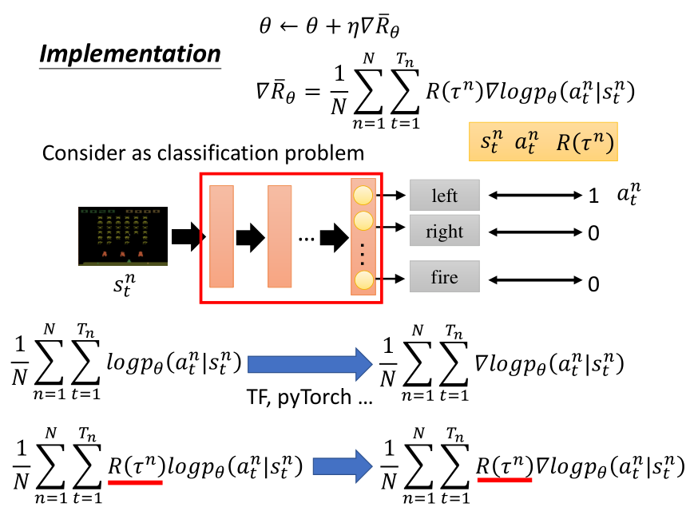

那接下来的就是实作的时候你会遇到的实作的一些细节，这个东西到底实际上在用这个 deep learning 的 framework implement 的时候，它是怎么实作的呢，其实你的实作方法是这个样子，你要把它想成你就是在做一个分类的问题，所以那要怎么做 classification，当然要收集一堆 training data，你要有 input 跟 output 的 pair，那今天在 reinforcement learning 里面，在实作的时候，你就把 state 当作是 classifier 的 input，你就当作你是要做 image classification 的 problem，只是现在的 class 不是说 image 里面有什么 objects，现在的 class 是说，看到这张 image 我们要采取什么样的行为，每一个行为就叫做一个 class，比如说第一个 class 叫做向左，第二个 class 叫做向右，第三个 class 叫做开火。

那这些训练的资料是从哪里来的呢？我们说你要做分类的问题，你要有 classified 的 input，跟它正确的 output，这些训练数据，就是从 sampling 的 process 来的，假设在 sampling 的 process 里面，在某一个 state，你 sample 到你要采取 action a，你就把这个 action a 当作是你的 ground truth，你在这个 state，你 sample 到要向左，本来向左这件事机率不一定是最高，因为你是 sample，它不一定机率最高，假设你 sample 到向左，那接下来在 training 的时候，你叫告诉 machine 说，调整 network 的参数，如果看到这个 state，你就向左。

在一般的 classification 的 problem 里面，其实你在 implement classification 的时候，你的 objective function，都会写成minimize cross entropy，那其实 minimize cross entropy 就是 maximize log likelihood，所以你今天在做 classification 的时候，你的 objective function，你要去 maximize 或是 minimize 的对象，因为我们现在是 maximize likelihood，所以其实是 maximize，你要 maximize 的对象，其实就长这样子，像这种 lost function，你在 TensorFlow 里面，你 even 不用手刻，它都会有现成的 function 就是了，你就 call 个 function，它就会自动帮你算这样子的东西。

然后接下来呢，你就 apply 计算 gradient 这件事，那你就可以把 gradient 计算出来，这是一般的分类问题。

那如果今天是 RL 的话，唯一不同的地方只是，你要记得在你原来的 loss 前面，乘上一个 weight，这个 weight 是什么？这个weight 是，今天在这个 state，采取这个 action 的时候，你会得到的 reward，这个 reward 不是当时得到的 reward，而是整场游戏的时候得到的 reward，它并不是在 state s 采取 action a 的时候得到的 reward，而是说，今天在 state s 采取 action a 的这整场游戏里面，你最后得到的 total reward 这个大 R。你要把你的每一笔 training data，都 weighted by 这个大 R。然后接下来，你就交给 TensorFlow 或 PyTorch 去帮你算 gradient，然后就结束了。跟一般 classification 其实也没太大的差别。

###### Tip 1: Add a Baseline

这边有一些通常实作的时候，你也许用得上的 tip，一个就是你要 add 一个东西叫做 baseline，所谓的 add baseline 是什么意思呢？今天我们会遇到一个状况是，我们说这个式子，它直觉上的含意就是，假设 given state s 采取 action a，会给你整场游戏正面的 reward，那你就要增加它的机率，如果说今天在 state s 执行 action a，整场游戏得到负的 reward，你就要减少这一项的机率。但是我们今天很容易遇到一个问题是，很多游戏里面，它的 reward 总是正的，就是说最低都是 0。这个 R 总是正的，所以假设你直接套用这个式子，你会发现说在 training 的时候，你告诉 model 说，今天不管是什么 action，你都应该要把它的机率提升，这样听起来好像有点怪怪的。在理想上，这么做并不一定会有问题，因为今天虽然说 R 总是正的，但它正的量总是有大有小，你采取某些 action 可能是得到 0 分，采取某些 action 可能是得到 20 分。

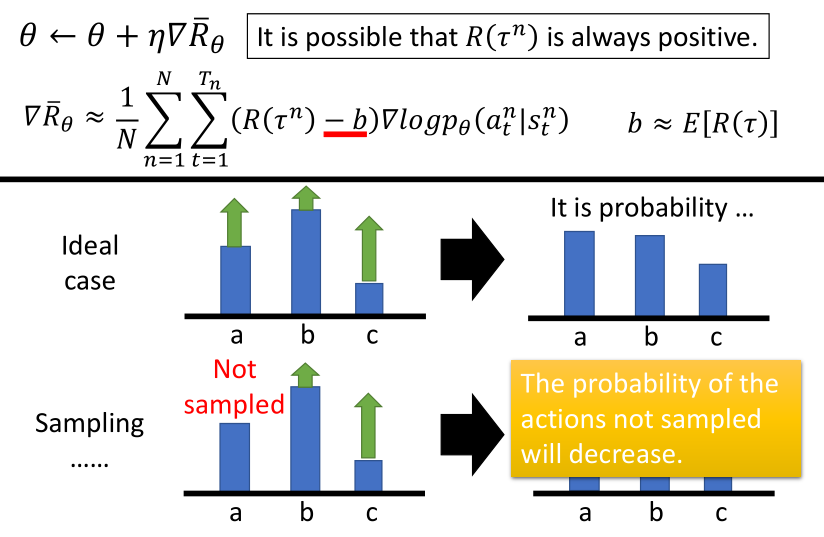

假设在某一个 state 有 3 个 action a/b/c，可以执行，根据这个式子，你要把这 3 项的log probability 都拉高，但是它们前面 weight 的这个 R，是不一样的，那么前面 weight 的这个 R 是有大有小的，weight 小的，它上升的就少，weight 多的，它上升的就大一点。那因为今天这个 log probability，它是一个机率，所以，这三项的和，要是 1，所以上升的少的，在做完 normalize 以后，它其实就是下降的，上升的多的，才会上升，那这个是一个理想上的状况。但是实际上，你千万不要忘了，我们是在做 sampling，本来这边应该是一个 expectation，summation over 所有可能的 s 跟 a 的 pair，但是实际上你真正在学的时候，当然不可能是这么做的，你只是 sample 了少量的 s 跟 a 的 pair 而已。

所以我们今天做的是 sampling，有一些 action 你可能从来都没有 sample 到，在某一个 state，虽然可以执行的 action 有 a/b/c 3 个，但你可能没有 sample 到 action a，但现在所有 action 的 reward 都是正的，今天它的每一项的机率都应该要上升，但现在你会遇到的问题是，因为 a 没有被 sample 到，其它人的机率如果都要上升，那 a 的机率就下降，所以，a 可能不是一个不好的 action，它只是没被 sample 到，也就是运气不好没有被 sample 到，但是只是因为它没被 sample 到，它的机率就会下降，那这个显然是有问题的。要解决这个问题要怎么办呢？

你会希望你的 reward 不要总是正的。为了解决你的 reward 不要总是正的这个问题，你可以做的一个非常简单的改变就是，把你的 reward 减掉一项叫做 b，这项 b 叫做 baseline，你减掉这项 b 以后，就可以让 R - b 有正有负，所以今天如果你得到的 reward 这个 R of $\tau$(n)，，这个 total reward 大于 b 的话，就让他的机率上升，如果这个 total reward 小于 b，你就要让这个 state 采取这个 action 的分数下降。

那这个 b 怎么设呢？你就随便设，你就自己想个方法来设，那一个最最简单的做法就是，你把 $\tau$(n) 的值，取 expectation，算一下 $\tau$(n) 的平均值，你就可以把它当作 b 来用，这是其中一种做法。

所以在实作上，你就是在 implement/training 的时候，你会不断的把 R of $\tau$ 的分数，把它不断的记录下来，你会不断的去计算 R of $\tau$ 的平均值，然后你会把你的这个平均值，当作你的 b 来用，这样就可以让你在 training 的时候，这个 gradient log probability 乘上前面这一项，是有正有负的，这个是第一个 tip。

###### Tip 2: Assign Suitable Credit

第二个 tip 是在 machine learning 那一门课没有讲过的 tip。这个 tip 是这样子，今天你应该要给每一个 action，合适的 credit。

如果我们看今天下面这个式子的话，我们原来会做的事情是，今天在某一个 state，假设，你执行了某一个 action a，它得到的 reward ，它前面乘上的这一项，就是 (R of $\tau$)-b，今天只要在同一个 episode 里面，在同一场游戏里面，所有的 state 跟 a 的 pair，它都会 weighted by 同样的 reward/term，这件事情显然是不公平的。因为在同一场游戏里面，也许有些 action 是好的，也许有些 action 是不好的，那假设最终的结果，整场游戏的结果是好的，并不代表这个游戏里面每一个行为都是对的，若是整场游戏结果不好，但不代表游戏里面的所有行为都是错的。所以我们其实希望，可以给每一个不同的 action，前面都乘上不同的 weight，那这个每一个 action 的不同 weight，它真正的反应了每一个 action，它到底是好还是不好。

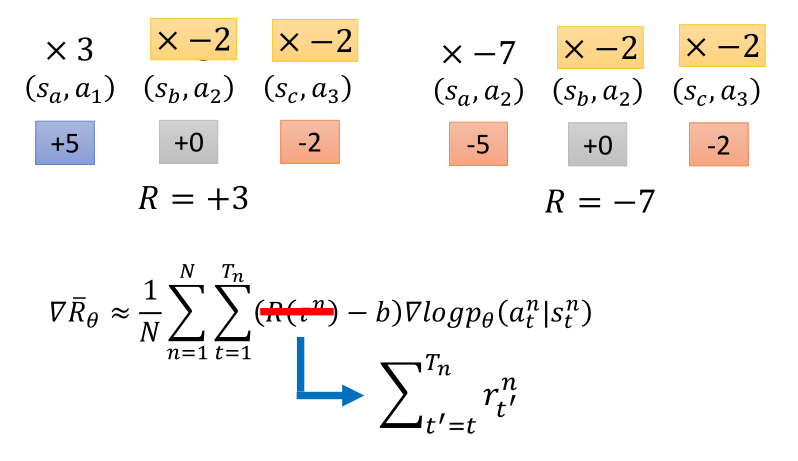

假设现在这个游戏都很短，只会有 3-4 个互动，在 sa 这个 state 执行 a1 这件事，得到 5 分，在 sb 这个 state 执行 a2 这件事，得到 0 分，在 sc 这个 state 执行 a3 这件事，得到 -2 分，整场游戏下来，你得到 +3 分。那今天你得到 +3 分，代表在 state sb 执行 action a2 是好的吗？并不见得。因为这个正的分数，主要是来自于在一开始的时候 state sa 执行了 a1，也许跟在 state sb 执行 a2 是没有关系的，也许在 state sb 执行 a2 反而是不好的，因为它导致你接下来会进入 state sc 执行 a3 被扣分。

所以今天整场游戏得到的结果是好的，并不代表每一个行为都是对的，如果按照我们刚才的讲法，今天整场游戏得到的分数是 3 分，那到时候在 training 的时候，每一个 state 跟 action 的 pair，都会被乘上 +3。

在理想的状况下，这个问题，如果你 sample 够多，就可以被解决，为什么？因为假设你今天 sample 够多，在 state sb 执行 a2 的这件事情，被 sample 到很多次，就某一场游戏，在 state sb 执行 a2，你会得到 +3 分，但在另外一场游戏，在 state sb 执行 a2，你却得到了 -7 分，为什么会得到 -7 分呢？因为在 state sb 执行 a2 之前，你在 state sa 执行 a2 得到 -5 分，那这 -5 分可能也不是，中间这一项的错，这 -5 分这件事可能也不是在 sb 执行 a2 的错，这两件事情，可能是没有关系的，因为它先发生了，这件事才发生，所以他们是没有关系的。在 state sb 执行 a2，它可能造成问题只有，会在接下来 -2 分，而跟前面的 -5 分没有关系的，但是假设我们今天 sample 到这项的次数够多，把所有有发生这件事情的情况的分数通通都集合起来，那可能不是一个问题。

但现在的问题就是，我们 sample 的次数，是不够多的，那在 sample 的次数，不够多的情况下，你就需要想办法，给每一个 state 跟 action pair 合理的 credit，你要让大家知道它实际上对这些分数的贡献到底有多大，那怎么给它一个合理的 contribution 呢？

一个做法是，我们今天在计算这个 pair，它真正的 reward 的时候，不把整场游戏得到的 reward 全部加起来，我们只计算从这一个 action 执行以后，所得到的 reward。因为这场游戏在执行这个 action 之前发生的事情，是跟执行这个 action 是没有关系的，前面的事情都已经发生了，那跟执行这个 action 是没有关系的。所以在执行这个 action 之前，得到多少 reward 都不能算是这个 action 的功劳。跟这个 action 有关的东西，只有在执行这个 action 以后发生的所有的 reward，把它总合起来，才是这个 action 它真正的 contribution，才比较可能是这个 action 它真正的 contribution。

所以在这个例子里面，在 state sb，执行 a2 这件事情，也许它真正会导致你得到的分数，应该是 -2 分而不是 +3 分，因为前面的 +5 分，并不是执行 a2 的功劳，实际上执行 a2 以后，到游戏结束前，你只有被扣 2 分而已，所以它应该是 -2。

那一样的道理，今天执行 a2 实际上不应该是扣 7 分，因为前面扣 5 分，跟在 sb 这个 state 执行 a2 是没有关系的。所以也许在 sb 这个 state 执行 a2，你真正会导致的结果只有扣两分而已。

那如果要把它写成式子的话是什么样子呢？你本来前面的 weight，是 R  of $\tau$，是整场游戏的 reward 的总和，那现在改一下，怎么改呢？改成从某个时间 t 开始，假设这个 action 是在 t 这个时间点所执行的，从 t 这个时间点，一直到游戏结束，所有 reward R 的总和，才真的代表这个 action，是好的，还是不好的。

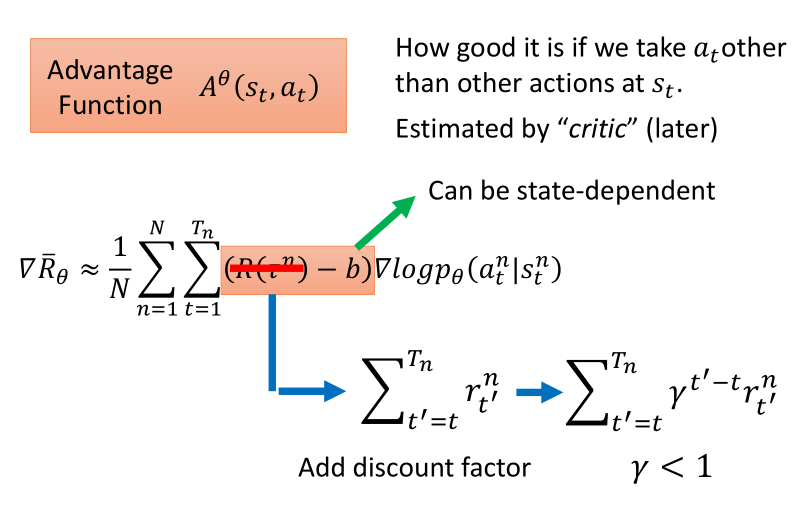

接下来再更进一步，我们会把比较未来的 reward，做一个 discount，为什么我要把比较未来的 reward 做一个 discount 呢？因为今天虽然我们说，在某一个时间点，执行某一个 action，会影响接下来所有的结果，有可能在某一个时间点执行的 action，接下来得到的 reward 都是这个 action 的功劳。但是在比较真实的情况下，如果时间拖得越长，影响力就越小，就是今天我在第二个时间点执行某一个 action，我在第三个时间点得到 reward，那可能是再第二个时间点执行某个 action 的功劳，但是在 100 个 time step 之后，又得到 reward，那可能就不是在第二个时间点执行某一个 action 得到的功劳。

所以我们实际上在做的时候，你会在你的 R 前面，乘上一个 term 叫做 gamma，那 gamma 它是小于 1 的，它会设个 0.9 或 0.99，那如果你今天的 R，它是越之后的 time stamp，它前面就乘上越多次的 gamma，就代表现在在某一个 state st，执行某一个 action at 的时候，真正它的 credit，其实是它之后，在执行这个 action 之后，所有 reward 的总和，而且你还要乘上 gamma。

实际上你 implement 就是这么 implement 的，那这个 b 呢，b 这个我们之后再讲，它可以是 state-dependent 的，事实上 b  它通常是一个 network estimate 出来的，这还蛮复杂，它是一个 network 的 output，这个我们之后再讲。

那把这个 R 减掉 b 这一项，这一项我们可以把它合起来，我们统称为 advantage function，我们这边用 A 来代表 advantage function，那这个 advantage function ，它是 dependent on s and a，我们就是要计算的是，在某一个 state s 采取某一个 action a 的时候，你的 advantage function 有多大，然后这个 advantage function 它的上标是 $\theta$，$\theta$ 是什么意思呢？因为你实际上在算这个 summation 的时候，你会需要有一个 interaction 的结果嘛，对不对，你会需要有一个 model 去跟环境做 interaction，你才知道你接下来得到的 reward 会有多少，而这个 $\theta$ 就是代表说，现在是用 $\theta$ 这个 model，跟环境去做 interaction，然后你才计算出这一项，从时间 t 开始到游戏结束为止，所有 R 的 summation，把这一项减掉 b，然后这个就叫 advantage function。

它的意义就是，现在假设，我们在某一个 state st，执行某一个 action at，相较于其他可能的 action，它有多好，它真正在意的不是一个绝对的好，而是说在同样的 state 的时候，是采取某一个 action at，相较于其它的 action，它有多好，它是相对的好，不是绝对好，因为今天会减掉一个 b ，减掉一个 baseline，所以这个东西是相对的好，不是绝对的好，那这个 A 我们之后再讲，它通常可以是由一个 network estimate 出来的，那这个 network 叫做 critic，我们讲到 Actor-Critic 的方法的时候，再讲这件事情。

### From on-policy to off-policy

> Using the experience more than once

#### On-policy v.s. Off-policy

那在讲 PPO 之前呢，我们要讲 on-policy and off-policy，这两种 training 方法的区别，那什么是 on-policy 什么是 off-policy 呢？

我们知道在 reinforcement learning 里面，我们要 learn 的就是一个 agent，那如果我们今天拿去跟环境互动的那个 agent，跟我们要 learn 的 agent 是同一个的话，这个叫做 on-policy，如果我们今天要 learn 的 agent，跟和环境互动的 agent 不是同一个的话，那这个叫做 off-policy，比较拟人化的讲法就是，如果今天要学习的那个 agent，它是一边跟环境互动，一边做学习，这个叫 on-policy，果它是在旁边看别人玩，透过看别人玩，来学习的话，这个叫做 off-policy。

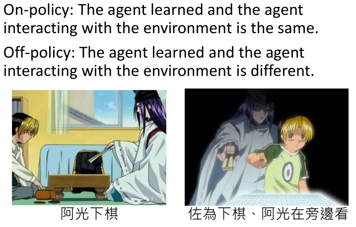

为什么我们会想要考虑 off-policy 这样的选项呢？让我们来想想看我们已经讲过的 policy gradient，其实我们之前讲的 policy gradient，它是 on-policy 还是 off-policy 的做法呢？它是 on-policy 的做法。为什么？我们之前讲说，在做 policy gradient 的时候呢，我们会需要有一个 agent，我们会需要有一个 policy，我们会需要有一个 actor，这个 actor 先去跟环境互动，去搜集资料，搜集很多的 $\tau$，那根据它搜集到的资料，会按照这个 policy gradient 的式子，去 update 你 policy 的参数，这个就是我们之前讲过的 policy gradient，所以它是一个 on-policy 的 algorithm，你拿去跟环境做互动的那个 policy，跟你要 learn 的 policy 是同一个。

那今天的问题是，我们之前有讲过说，因为在这个 update 的式子里面，其中有一项，你的这个 expectation，应该是对你现在的 policy $\theta$，所 sample 出来的 trajectory $\tau$，做 expectation，所以当你今天 update 参数以后，一旦你 update 了参数，从 $\theta$ 变成 $\theta'$，那这一个机率，就不对了，之前 sample 出来的 data，就变的不能用了。

所以我们之前就有讲过说，policy gradient，是一个会花很多时间来 sample data 的algorithm，你会发现大多数时间都在 sample data。你的 agent 去跟环境做互动以后，接下来就要 update 参数，你只能做一次 gradient decent，你只能 update 参数一次，接下来你就要重新再去 collect data，然后才能再次 update 参数，这显然是非常花时间的。

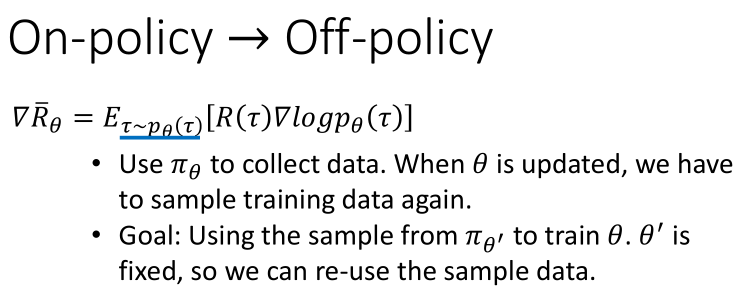

所以我们现在想要从 on-policy 变成 off-policy 的好处就是，我们希望说现在我们可以用另外一个 policy，另外一个 actor $\theta'$ 去跟环境做互动，用 $\theta'$ collect 到的 data 去训练 $\theta$，假设我们可以用 $\theta'$ collect 到的 data 去训练 $\theta$，意味着说，我们可以把 $\theta'$ collect 到的 data 用非常多次，你在做 gradient ascent 的时候，我们可以执行那个 gradient ascent 好几次，我们可以 update 参数好几次，都只要用同一笔 data 就好了。

因为假设现在 $\theta$ 有能力从另外一个 actor $\theta'$，它所 sample 出来的 data 来学习的话，那 $\theta'$ 就只要 sample 一次，也许 sample 多一点的 data，让 $\theta$ 去 update 很多次，这样就会比较有效率。

##### Importance Sampling

所以怎么做呢？这边就需要介绍一个 important sampling 的概念，那这个 important sampling 的概念不是只能用在 RL 上，它是一个 general 的想法，可以用在其他很多地方。

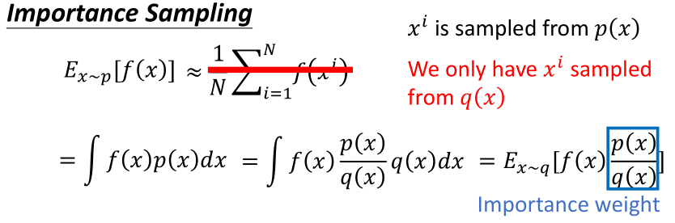

我们先介绍这个 general 的想法，那假设现在你有一个 function f(x)，那你要计算，从 p 这个 distribution，sample x，再把 x 带到，f 里面，得到 f(x)，你要计算这个 f(x) 的期望值，那怎么做呢？假设你今天没有办法对 p 这个 distribution 做积分的话，那你可以从 p 这个 distribution 去 sample 一些 data $x^i$，那这个 f(x) 的期望值，就等同是你 sample 到的 $x^i$，把 $x^i$ 带到 f(x) 里面，然后取它的平均值，就可以拿来近似这个期望值。

假设你知道怎么从 p 这个 distribution 做 sample 的话，你要算这个期望值，你只需要从 p 这个 distribution，做 sample 就好了。

但是我们现在有另外一个问题，那等一下我们会更清楚知道说为什么会有这样的问题。

我们现在的问题是这样，我们没有办法从 p 这个 distribution 里面 sample data。

假设我们不能从 p sample data，我们只能从另外一个 distribution q 去 sample data，q 这个 distribution 可以是任何 distribution，不管它是怎么样的 distribution，在多数情况下，等一下讨论的情况都成立，我们不能够从 p 去 sample data，但我们可以从 q 去 sample $x^i$，但我们从 q 去 sample $x^i$，我们不能直接套这个式子，因为这边是假设你的 $x^i$ 都是从 p sample 出来的，你才能够套这个式子，从 q sample 出来的 $x^i$ 套这个式子，你也不会等于左边这项期望值。

所以怎么办？做一个修正，这个修正是这样子的，期望值这一项，其实就是积分，然后我们现在上下都同乘 q(x)，我们可以把这一个式子，写成对 q 里面所 sample 出来的 x 取期望值，我们从 q 里面，sample x，然后再去计算 f(x) 乘上 p(x) 除以 q(x)，再去取期望值。

左边这一项，会等于右边这一项。要算左边这一项，你要从 p 这个 distribution sample x，但是要算右边这一项，你不是从 p 这个 distribution sample x，你是从 q 这个 distribution sample x，你从 q 这个 distribution sample x，sample 出来之后再带入，接下来你就可以计算左边这项你想要算的期望值，所以就算是我们不能从 p 里面去 sample data，你想要计算这一项的期望值，也是没有问题的，你只要能够从 q 里面去 sample data，可以带这个式子，你就一样可以计算，从 p 这个 distribution sample x，带入 f 以后所算出来的期望值。

那这个两个式子唯一不同的地方是说，这边是从 p 做 sample，这边是从 q 做 sample，因为他是从 q 里做 sample，所以 sample 出来的每一笔 data，你需要乘上一个 weight，修正这两个 distribution 的差异。而这个 weight 就是 p(x) 的值除以 q(x) 的值，所以 q(x) 它是任何 distribution 都可以，这边唯一的限制就是，你不能够说 q 的机率是 0 的时候，p 的机率不为 0，不然这样会没有定义。假设 q 的机率是 0 的时候，p 的机率也都是 0 的话，那这样 p 除以 q 是有定义的，所以这个时候你就可以，apply important sampling 这个技巧。所以你就可以本来是从 p 做 sample，换成从 q 做 sample。

###### Issue of Importance Sampling

这个跟我们刚才讲的从 on-policy 变成 off-policy，有什么关系呢？在继续讲之前，我们来看一下 important sampling 的 issue。

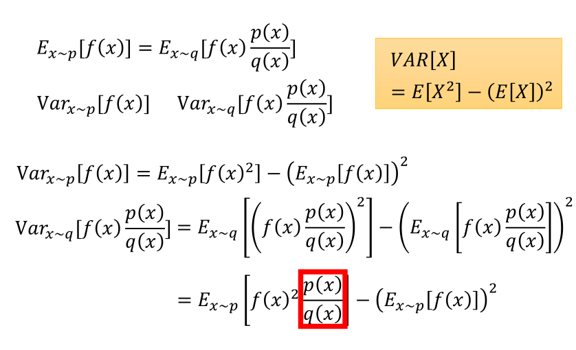

虽然理论上你可以把 p 换成任何的 q，但是在实作上，并没有那么容易，实作上 p q 还是不能够差太多，如果差太多的话，会有一些问题，什么样的问题呢？虽然我们知道说，左边这个式子，等于右边这个式子，但你想想看，如果今天左边这个是 f(x)，它的期望值 distribution 是 p，这边是 f(x) 乘以 p 除以 q 的期望值，它的 distribution 是 q，我们现在如果不是算期望值，而是算 various 的话，这两个 various 会一样吗？不一样的。两个 random variable 它的 mean 一样，并不代表它的 various 一样。

所以可以实际算一下，f(x) 这个 random variable，跟 f(x) 乘以 p(x) 除以 q(x)，这个 random variable，他们的这个 various 是不是一样的，这一项的 various，就套一下公式。

其实可以做一些整理的，这边有一个 f(x) 的平方，然后有一个 p(x) 的平方，有一个 q(x) 的平方，但是前面呢，是对 q 取 expectation，所以 q 的 distribution 取 expectation，所以如果你要算积分的话，你就会把这个 q 呢，乘到前面去，然后 q 就可以消掉了，然后你可以把这个 p 拆成两项，然后就会变成是对 p 呢，取期望值。这个是左边这一项。

那右边这一项，其实就写在最前面的公式。

他们various的差别在第一项，第一项这边多乘了 p 除以 q，如果 p 除以 q 差距很大的话，这个时候，$\operatorname{Var}_{x \sim q}\left[f(x) \frac{p(x)}{q(x)}\right]$就会很大，所以虽然理论上 expectation 一样，也就是说，你只要对 p 这个 distribution sample  够多次，q 这个 distribution sample  够多次，你得到的结果会是一样的。

但是假设你 sample 的次数不够多，因为它们的 various 差距是很大的，所以你就有可能得到非常大的差别。

这边就是举一个具体的例子告诉你说，当 p q 差距很大的时候，会发生什么样的问题。

假设这个是 p 的 distribution，这个是 q 的 distribution，这个是 f(x)，那如果我们要计算 f(x) 的期望值，它的 distribution 是从 p 这个 distribution 做 sample，那显然这一项是负的。因为 f(x) 在这个区域，这个区域 p(x) 的机率很高，所以要 sample 的话，都会 sample 到这个地方，而 f(x) 在这个区域是负的，所以理论上这一项算出来会是负的。

接下来我们改成从 q 这边做 sample，那因为 q 在右边这边的机率比较高，所以如果你 sample 的点不够的话，那你可能都只 sample 到右侧，如果你都只 sample 到右侧的话，你会发现说，如果只 sample 到右侧的话，算起来右边这一项，你 sample 到这些点，都是正的，所以你去计算 $f(x) \frac{p(x)}{q(x)}$，都是正的。那为什么会这样，那是因为你 sample 的次数不够多。假设你 sample 次数很少，你只能 sample 到右边这边，左边这边虽然机率很低，但也不是没有可能被 sample 到，假设你今天好不容易 sample 到左边的点，因为左边的点pq 是差很多的，p 很大，q 很小，这个负的就会被乘上一个非常巨大的 weight，就可以平衡掉刚才那边，一直 sample 到 positive 的 value 的情况。eventually，你就可以算出这一项的期望值，终究还是负的。

但问题就是，这个前提是你要 sample 够多次，这件事情才会发生。如果 sample 不够，左式跟右式就有可能有很大的差距，所以这是 importance sampling 的问题。

#### On-policy → Off-policy

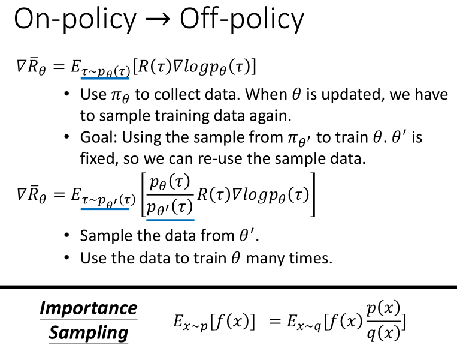

现在要做的事情就是，把 importance sampling 这件事，用在 off-policy 的 case。

我要把 on-policy training 的 algorithm，改成 off-policy training 的 algorithm。

那怎么改呢？之前我们是看，我们是拿 $\theta$ 这个 policy，去跟环境做互动，sample 出 trajectory $\tau$，然后计算中括号里面这一项，现在我们不根据 $\theta$，我们不用 $\theta$ 去跟环境做互动，我们假设有另外一个 policy，另外一个 policy 它的参数$\theta'$，它就是另外一个 actor，它的工作是他要去做 demonstration，它要去示范给你看，这个 $\theta'$ 它的工作是要去示范给 $\theta$ 看，它去跟环境做互动，告诉$\theta$ 说，它跟环境做互动会发生什么事，然后，借此来训练 $\theta$，我们要训练的是 $\theta$ 这个 model，$\theta'$ 只是负责做 demo 负责跟环境做互动，我们现在的 $\tau$，它是从 $\theta'$ sample 出来的，不是从 $\theta$ sample 出来的，但我们本来要求的式子是这样，但是我们实际上做的时候，是拿 $\theta'$ 去跟环境做互动，所以 sample 出来的 $\tau$，是从 $\theta'$ sample 出来的，这两个 distribution 不一样。

但没有关系，我们之前讲过说，假设你本来是从 p 做 sample，但你发现你不能够从 p 做 sample，所以现在我们说我们不拿 $\theta$ 去跟环境做互动，所以不能跟 p 做 sample，你永远可以把 p 换成另外一个 q，然后在后面这边补上一个 importance weight。

所以现在的状况就是一样，把 $\theta$ 换成 $\theta'$ 以后，要在中括号里面补上一个 importance weight，这个 importance weight 就是某一个 trajectory $\tau$，它用 $\theta$ 算出来的机率，除以这个 trajectory $\tau$，用 $\theta'$ 算出来的机率。

这一项是很重要的，因为，今天你要 learn 的是 actor $\theta$ and $\theta'$ 是不太一样的，$\theta'$ 会遇到的状况，会见到的情形，跟 $\theta$ 见到的情形，不见得是一样的，所以中间要做一个修正的项。

所以我们做了一下修正，现在的 data 不是从 $\theta'$ sample 出来的，是从 $\theta$ sample 出来的，那我们从 $\theta$ 换成 $\theta'$ 有什么好处呢？我们刚才就讲过说，因为现在跟环境做互动是 $\theta'$ 而不是 $\theta$，所以你今天 sample 出来的东西，跟 $\theta$ 本身是没有关系的，所以你就可以让 $\theta'$ 做互动 sample 一大堆的 data 以后，$\theta$ 可以 update 参数很多次，然后一直到 $\theta$ 可能 train 到一定的程度，update 很多次以后，$\theta'$ 再重新去做 sample，这就是 on-policy 换成 off-policy 的妙用。

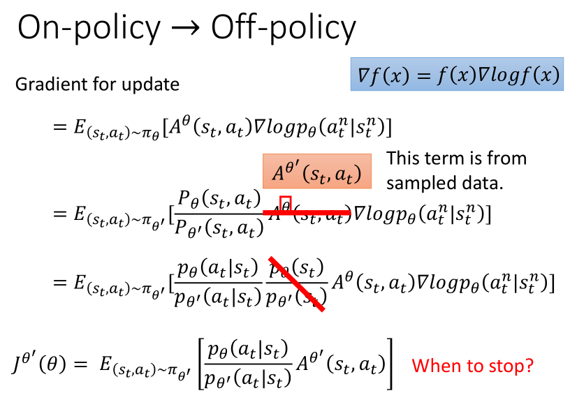

那我们其实讲过，实际上我们在做 policy gradient 的时候，我们并不是给一整个 trajectory $\tau$ 都一样的分数，而是每一个 state/action 的 pair，我们会分开来计算，所以我们上周其实有讲过说，我们实际上 update 我们的 gradient 的时候，我们的式子是长这样子的。

我们用 $\theta$ 这个 actor 去 sample 出 state 跟 action 的 pair，我们会计算这个 state 跟 action pair 它的 advantage，就是它有多好，这一项就是那个 accumulated 的 reward 减掉 bias，这一项是估测出来的，它要估测的是，现在在 state st 采取 action at，它是好的，还是不好的。那接下来后面会乘上这个$\nabla \log p_{\theta}\left(a_{t}^{n} \mid s_{t}^{n}\right)$，也就是说如果这一项是正的，就要增加机率，这一项是负的，就要减少机率，那我们现在用了 importance sampling 的技术把 on-policy 变成 off-policy，就从 $\theta$ 变成 $\theta'$。

所以现在 st at 它不是 $\theta$ 跟环境互动以后所 sample 到的 data，它是 $\theta'$，另外一个 actor 跟环境互动以后，所 sample 到的 data，但是拿来训练我们要调整参数的那个 model $\theta$，但是我们有讲过说，因为 $\theta'$ 跟 $\theta$ 是不同的 model，所以你要做一个修正的项，那这项修正的项，就是用 importance sampling 的技术，把 st at 用 $\theta$ sample 出来的机率，除掉 st at 用 $\theta'$ sample 出来的机率。

那这边其实有一件事情我们需要稍微注意一下，这边  A 有一个上标 $\theta$ 代表说，这个是 actor $\theta$ 跟环境互动的时候，所计算出来的 A，但是实际上我们今天从 $\theta$ 换到 $\theta'$ 的时候，这一项，你其实应该改成 $\theta'$，而不是 $\theta$。为什么？A 这一项是想要估测说现在在某一个 state，采取某一个 action 接下来，会得到 accumulated reward 的值减掉 base line。在这个 state st，采取这个 action at，接下来会得到的 reward 的总和，再减掉 baseline，就是这一项。

之前是 $\theta$ 在跟环境做互动，所以你观察到的是 $\theta$ 可以得到的 reward，但现在不是 $\theta$ 跟环境做互动，现在是 $\theta'$ 在跟环境做互动，所以你得到的这个 advantage，其实是根据 $\theta'$ 所 estimate 出来的 advantage，但我们现在先不要管那么多，我们就假设这两项可能是差不多的。

那接下来，st at的机率，你可以拆解成 st 的机率乘上 at given st 的机率。

接下来这边需要做一件事情是，我们假设当你的 model 是 $\theta$ 的时候，你看到 st 的机率，跟你的 model 是 $\theta'$ 的时候，你看到 st 的机率，是差不多的，你把它删掉，因为它们是一样的。

为什么可以假设它是差不多的，当然你可以找一些理由，举例来说，会看到什么 state，往往跟你会采取什么样的 action 是没有太大的关系的，也许不同的 $\theta$ 对 st 是没有影响的。

但是有一个更直觉的理由就是，这一项到时候真的要你算，你会算吗？你不觉得这项你不太能算吗？因为想想看这项要怎么算，这一项你还要说，我有一个参数 $\theta$，然后拿 $\theta$ 去跟环境做互动，算 st 出现的机率，这个你根本很难算，尤其是你如果 input 是 image 的话，同样的 st 根本就不会出现第二次。所以你根本没有办法估这一项，干脆就无视这个问题。这一项其实不太好算，所以你就说服自己，其实这一项不太会有影响，我们只管前面这个部分就好了。

但是 given st，接下来产生 at 这个机率，你是会算的，这个很好算，你手上有 $\theta$ 这个参数，它就是个 network，你就把 st 带进去，st 就是游戏画面，你ˋ把游戏画面带进去，它就会告诉你某一个 state 的 at 机率是多少。我们其实有个 policy 的 network，把 st 带进去，它会告诉我们每一个 at 的机率是多少，所以这一项你只要知道 $\theta$ 的参数，知道 $\theta'$ 的参数，这个就可以算。

这一项是 gradient，其实我们可以从 gradient 去反推原来的 objective function，怎么从 gradient 去反推原来的 objective function 呢？这边有一个公式，我们就背下来，f(x) 的 gradient，等于 f(x) 乘上 log f(x) 的 gradient。把公式带入到 gradient 的项，还原原来没有取 gradient 的样子。那所以现在我们得到一个新的 objective function。

所以实际上，当我们 apply importance sampling 的时候，我们要去 optimize 的那一个 objective function 长什么样子呢，我们要去 optimize 的那一个 objective function 就长这样子，
$$
J^{\theta^{\prime}}(\theta)=E_{\left(s_{t}, a_{t}\right) \sim \pi_{\theta^{\prime}}}\left[\frac{p_{\theta}\left(a_{t} \mid s_{t}\right)}{p_{\theta^{\prime}}\left(a_{t} \mid s_{t}\right)} A^{\theta^{\prime}}\left(s_{t}, a_{t}\right)\right]
$$
这个括号里面那个 $\theta$ 代表我们要去 optimize 的那个参数，我们拿 $\theta'$ 去做 demonstration。

现在真正在跟环境互动的是 $\theta'$，sample 出 st at 以后，那你要去计算 st 跟 at 的 advantage，然后你再去把它乘上$\frac{p_{\theta}\left(a_{t} \mid s_{t}\right)}{p_{\theta^{\prime}}\left(a_{t} \mid s_{t}\right)}$，这两项都是好算的，advantage是可以从 sample 的结果里面去估测出来的，所以这一整项，你是可以算的。

那我们实际上在 update 参数的时候，就是按照上面这个式子 update 参数。现在我们做的事情，我们可以把 on-policy 换成 off-policy，但是我们会遇到的问题是，我们在前面讲 importance sampling 的时候，我们说 importance sampling 有一个 issue，这个 issue 是什么呢？其实你的  $p(\theta)$ 跟  $p(\theta')$ 不能差太多。差太多的话，importance sampling 结果就会不好。

所以怎么避免它差太多呢？这个就是 PPO 在做的事情。

### Add Constraint

> 稳扎稳打，步步为营

#### PPO / TRPO

PPO 你虽然你看它原始的 paper 或你看 PPO 的前身 TRPO 原始的 paper 的话，它里面写了很多的数学式，但它实际上做的事情式怎么样呢？

它实际上做的事情就是这样：

我们原来在 off-policy 的方法里面说，我们要 optimize 的是这个 objective function，但是我们又说这个 objective function 又牵涉到 importance sampling，在做 importance sampling 的时候， $p(\theta)$ 不能跟  $p(\theta')$ 差太多，你做 demonstration 的 model 不能够跟真正的 model 差太多，差太多的话 importance sampling 的结果就会不好。

我们在 training 的时候，多加一个 constrain。这个 constrain 是什么？这个 constrain 是 $\theta$ 跟 $\theta'$，这两个 model 它们 output 的 action 的 KL diversions。

就是简单来说，这一项的意思就是要衡量说 $\theta$ 跟 $\theta'$ 有多像，然后我们希望，在 training 的过程中，我们 learn 出来的 $\theta$ 跟 $\theta'$ 越像越好，因为 $\theta$ 如果跟 $\theta'$ 不像的话，最后你做出来的结果，就会不好。

所以在 PPO 里面呢，有两个式子，一方面就是 optimize 你要得到的你本来要 optimize 的东西。但是再加一个 constrain，这个 constrain 就好像那个 regularization 的 term 一样，就好像我们在做 machine learning 的时候不是有 L1/L2 的 regularization，这一项也很像 regularization，这样 regularization 做的事情就是希望最后 learn 出来的 $\theta$，不要跟 $\theta'$ 太不一样。

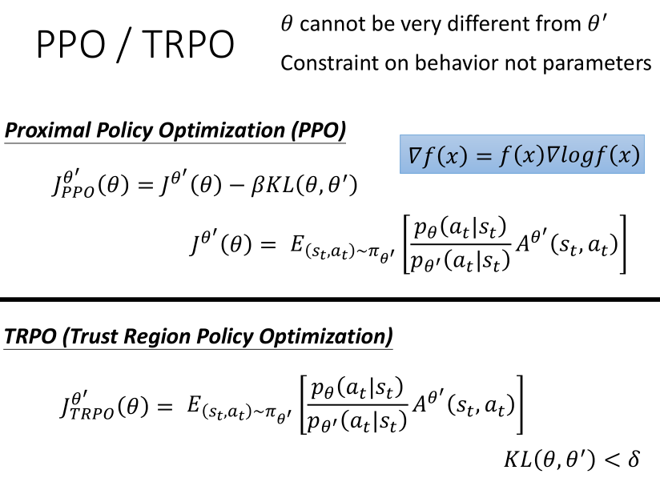

那 PPO 有一个前身叫做 TRPO，TRPO 写的式子是这个样子的，它唯一不一样的地方是说，这一个 constrain 摆的位置不一样，PPO是直接把 constrain 放到你要 optimize 的那个式子里面，然后接下来你就可以用 gradient ascent 的方法去 maximize 这个式子，但是如果是在 TRPO 的话，它是把 KL diversions 当作 constrain，他希望 $\theta$ 跟 $\theta'$ 的 KL diversions，小于一个 $\delta$。

那你知道如果你是用 gradient based optimization 的时候，有 constrain 是很难处理的。那个是很难处理的，就是因为它是把这一个 KL diversions constrain 当做一个额外的 constrain，没有放 objective 里面，所以它很难算，所以如果你不想搬石头砸自己的脚的话，你就用 PPO 不要用 TRPO。

看文献上的结果是，PPO 跟 TRPO 可能 performance 差不多，但是 PPO 在实作上，比 TRPO 容易的多。

那这边要注意一下，所谓的 KL diversions，到底指的是什么？这边我是直接把 KL diversions 当做一个 function，它吃的 input 是 $\theta$ 跟 $\theta'$，但我的意思并不是说把 $\theta$和$\theta'$ 当做 distribution，算这两个 distribution 之间的距离，今天这个所谓的 $\theta$ 跟 $\theta'$ 的距离，并不是参数上的距离，而是它们 behavior 上的距离，我不知道大家可不可以了解这中间的差异，就是假设你现在有一个 model，有一个 actor 它的参数是 $\theta$，你有另外一个 actor 它的参数是 $\theta'$，所谓参数上的距离就是你算这两组参数有多像，今天所讲的不是参数上的距离，今天所讲的是它们行为上的距离，就是你先带进去一个 state s，它会对这个 action 的 space output 一个 distribution，假设你有 3 个 actions，个可能 actions 就 output 3 个值。

那我们今天所指的 distance 是 behavior distance，也就是说，给同样的 state 的时候，他们 output 的 action 之间的差距，这两个 actions 的 distribution 他们都是一个机率分布，所以就可以计算这两个机率分布的 KL diversions。

把不同的 state 它们 output 的这两个 distribution 的 KL diversions，平均起来，才是我这边所指的这两个 actor 间的 KL diversions。

那你可能说那怎么不直接算这个 $\theta$ 或 $\theta'$ 之间的距离，甚至不要用 KL diversions 算，L1 跟 L2 的 norm 也可以保证，$\theta$ 跟 $\theta'$ 很接近。

在做 reinforcement learning 的时候，之所以我们考虑的不是参数上的距离，而是 action 上的距离，是因为很有可能对 actor 来说，参数的变化跟 action 的变化，不一定是完全一致的，就有时候你参数小小变了一下，它可能 output 的行为就差很多，或是参数变很多，但 output 的行为可能没什么改变。所以我们真正在意的是这个 actor 它的行为上的差距，而不是它们参数上的差距。

所以这里要注意一下，在做 PPO 的时候，所谓的 KL diversions 并不是参数的距离，而是 action 的距离。

#### PPO algorithm

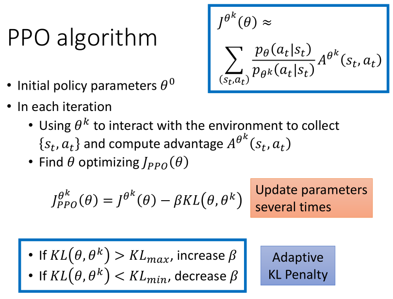

我们来看一下 PPO 的 algorithm，它就是这样，initial 一个 policy 的参数$\theta^0$，然后在每一个 iteration 里面呢，你要用你在前一个 training 的 iteration，得到的 actor 的参数 $\theta^k$，去跟环境做互动，sample 到一大堆 state/action 的 pair，然后你根据 $\theta^k$互动的结果，你也要估测一下，st 跟 at 这个 state/action pair它的 advantage，然后接下来，你就 apply PPO 的 optimization 的 formulation。

但是跟原来的 policy gradient 不一样，原来的 policy gradient 你只能 update 一次参数，update 完以后，你就要重新 sample data。但是现在不用，你拿 $\theta^k$去跟环境做互动，sample 到这组 data 以后，你就努力去train $\theta$，你可以让 $\theta$ update 很多次，想办法去 maximize 你的 objective function，你让 $\theta$ update 很多次，这边 $\theta$ update 很多次没有关系，因为我们已经有做 importance sampling，所以这些 experience，这些 state/action 的 pair 是从  $\theta^k$ sample 出来的是没有关系的，$\theta$ 可以 update 很多次，它跟  $\theta^k$ 变得不太一样也没有关系，你还是可以照样训练 $\theta$，那其实就说完了。

在 PPO 的 paper 里面，这边还有一个 adaptive 的 KL diversions，因为这边会遇到一个问题就是，这个$\beta $要设多少，它就跟那个 regularization 一样，regularization 前面也要乘一个 weight，所以这个 KL diversions 前面也要乘一个 weight。但是$\beta $要设多少呢？所以有个动态调整$\beta $的方法。

这个调整方法也是蛮直观的，在这个直观的方法里面呢，你先设一个 KL diversions，你可以接受的最大值，然后假设你发现说，你 optimize 完这个式子以后，KL diversions 的项太大，那就代表说后面这个 penalize 的 term 没有发挥作用，那就把$\beta $调大，那另外你定一个 KL diversions 的最小值，而且发现 optimize 完上面这个式子以后，你得到 KL diversions 比最小值还要小，那代表后面这一项它的效果太强了，怕它都只弄后面这一项，那 $\theta$ 跟 $\theta^k$ 都一样，这不是你要的，所以你这个时候你就要减少$\beta $，所以这个$\beta $是可以动态调整的，这个叫做 adaptive 的 KL penalty。

#### PPO2 algorithm

如果你觉得这个很复杂，有一个 PPO2。

PPO2 它的式子我们就写在这边，要去 maximize 的 objective function 写成这样，它的式子里面就没有什么 KL 了。

这个式子看起来有点复杂，但实际 implement 就很简单。

我们来实际看一下说这个式子到底是什么意思，这边是 summation over state/action 的 pair，min 这个 operator 做的事情是，第一项跟第二项里面选比较小的那个，第一项比较单纯，第二项比较复杂，第二项前面有个 clip function，clip 这个 function 是什么意思呢？clip 这个function 的意思是说，在括号里面有 3 项，如果第一项小于第二项的话，那就 output 1-epsilon，第一项如果大于第三项的话，那就 output 1+epsilon，那 epsilon 是一个 hyper parameter，你要 tune 的，比如说你就设 0.1、0.2。也就是说，假设这边设 0.2 的话，就是说这个值如果算出来小于 0.8，那就当作 0.8，这个值如果算出来大于 1.2，那就当作 1.2。

这个式子到底是什么意思呢？我们先来解释一下，我们先来看第二项这个算出来到底是什么的东西。

第二项这项算出来的意思是这样，假设这个横轴是 $\frac{p_{\theta}\left(a_{t} \mid s_{t}\right)}{p_{\theta^{k}}\left(a_{t} \mid s_{t}\right)}$，纵轴是 clip 这个 function 它实际的输出，那我们刚才讲过说，如果 $\frac{p_{\theta}\left(a_{t} \mid s_{t}\right)}{p_{\theta^{k}}\left(a_{t} \mid s_{t}\right)}$ 大于 1+epsilon，它输出就是 1+epsilon，如果小于 1-epsilon 它输出就是 1-epsilon，如果介于 1+epsilon 跟 1-epsilon 之间，就是输入等于输出。$\frac{p_{\theta}\left(a_{t} \mid s_{t}\right)}{p_{\theta^{k}}\left(a_{t} \mid s_{t}\right)}$ 跟 clip function 输出的关系，是这样的一个关系。

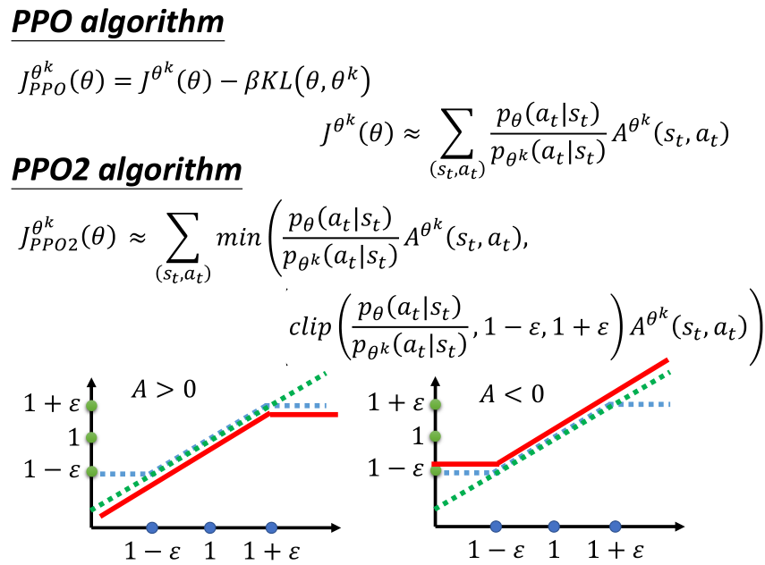

接下来，我们就加入前面这一项，来看看前面这一项，到底在做什么？前面这一项呢，其实就是绿色的这一条线，就是绿色的这一条线。这两项里面，第一项跟第二项，也就是绿色的线，跟蓝色的线中间，我们要取一个最小的。假设今天前面乘上的这个 term A，它是大于 0 的话，取最小的结果，就是红色的这一条线。反之，如果 A 小于 0 的话，取最小的以后，就得到红色的这一条线，这一个结果，其实非常的直观，这一个式子虽然看起来有点复杂，implement 起来是蛮简单的，想法也非常的直观。

因为这个式子想要做的事情，就是希望 $\frac{p_{\theta}\left(a_{t} \mid s_{t}\right)}{p_{\theta^{k}}\left(a_{t} \mid s_{t}\right)}$，也就是你拿来做 demonstration 的那个 model，跟你实际上 learn 的 model，最后在 optimize 以后，不要差距太大。那这个式子是怎么让它做到不要差距太大的呢？

复习一下这横轴的意思，就是 $\frac{p_{\theta}\left(a_{t} \mid s_{t}\right)}{p_{\theta^{k}}\left(a_{t} \mid s_{t}\right)}$，如果今天 A 大于 0，也就是某一个 state/action 的 pair 是好的，那我们想要做的事情，当然是希望增加这个 state/action pair 的机率。也就是说，我们想要让  $p_\theta$ 越大越好，没有问题，但是，它跟这个 $\theta^k$ 的比值，不可以超过 1+ epsilon。红色的线就是我们的 objective function，我们希望我们的 objective 越大越好，比值只要大过 1+epsilon，就没有 benefit 了，所以今天在 train 的时候，$p_\theta$ 只会被 train 到，比 $p_{\theta^k}$ 它们相除大 1+epsilon，它就会停止。

那假设今天不幸的是， $p_\theta$ 比 $p_{\theta^k}$ 还要小，假设这个 advantage 是正的，我们当然希望 $p_\theta$ 越大越好，假设这个 action 是好的，我们当然希望这个 action 被采取的机率，越大越好，所以假设 $p_\theta$ 还比 $p_{\theta^k}$ 小，那就尽量把它挪大，但只要大到 1+epsilon 就好。

那负的时候也是一样，如果今天，某一个 state/action pair 是不好的，我们当然希望 $p_\theta$ 把它减小，假设今天 $p_\theta$ 比 $p_{\theta^k}$ 还大那你就要赶快尽量把它压小，那压到什么样就停止呢？，压到 $p_\theta$ 除以 $p_{\theta^k}$ 是 1-epsilon 的时候，就停了，就算了，就不要再压得更小。

那这样的好处就是，你不会让$p_\theta$ 跟  $p_{\theta^k}$差距太大，那要 implement 这个东西，其实对你来说可能不是太困难的事情。

#### Experimental Results

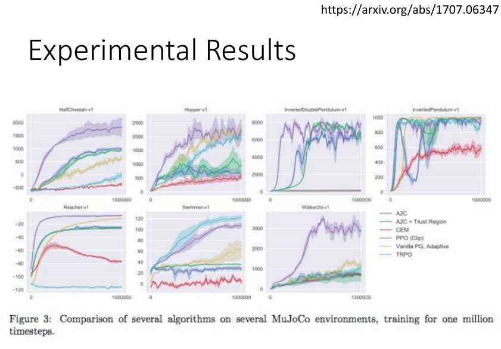

那最后这页投影片呢，只是想要 show 一下，在文献上，PPO 跟其它方法的比较，有 Actor-Critic 的方法，这边有 A2C+TrustRegion，他们都是 Actor-Critic based 的方法，然后这边有 PPO，PPO 是紫色线的方法，然后还有 TRPO。

PPO 就是紫色的线，那你会发现在多数的 task 里面，这边每张图就是某一个 RL 的任务，你会发现说在多数的 cases 里面，PPO 都是不错的，不是最好的，就是第二好的。

## Q-Learning

### Introduction of Q-Learning

#### Critic

Q-learning 这种方法，它是 value-based 的方法，在value based 的方法里面，我们并不是直接 learn policy，我们要 learn 的是一个 critic，critic 并不直接采取行为，它想要做的事情是，评价现在的行为有多好或者是有多不好。

这边说的是 critic 并不直接采取行为，它是说我们假设有一个 actor $\pi$，那 critic 的工作就是来评价这个 actor $\pi $ 它做得有多好，或者是有多不好。

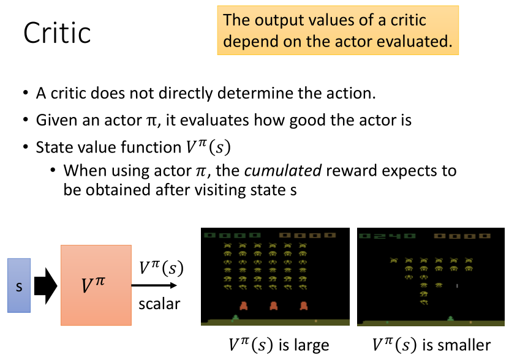

举例来说，有一种 function 叫做 state value 的 function。这个 state value function 的意思就是说，假设现在的 actor 叫做 $\pi$，拿这个 $\pi$ 跟环境去做互动。拿 $\pi $ 去跟环境做互动的时候，现在假设$\pi$ 这个 actor，它看到了某一个 state s，那如果在玩游戏的话，state s 是某一个画面，看到某一个画面，某一个 state s 的时候，接下来一直玩到游戏结束，累积的 reward 的期望值有多大，accumulated reward 的 expectation 有多大。

所以 $V^{\pi}$ 它是一个 function，这个 function 它是吃一个 state，当作 input，然后它会 output 一个 scalar，这个 scalar 代表说，现在$\pi $ 这个 actor 它看到 state s 的时候，接下来预期到游戏结束的时候，它可以得到多大的 value。

假设你是玩 space invader 的话，也许这个 state 这个 s，这一个游戏画面，你的 $V^{\pi}(s)$ 会很大，因为接下来还有很多的怪可以杀，所以你会得到很大的分数，一直到游戏结束的时候，你仍然有很多的分数可以吃。

那在这个 case，也许你得到的 $V^{\pi}(s)$，就很小，因为一方面，剩下的怪也不多了，那再来就是现在因为那个防护罩，这个红色的东西防护罩已经消失了，所以可能很快就会死掉，所以接下来得到预期的 reward，就不会太大。

那这边需要强调的一个点是说，当你在讲这个 critic 的时候，你一定要注意，critic 都是绑一个 actor 的，就 critic 它并没有办法去凭空去 evaluate 一个 state 的好坏，而是它所 evaluate 的东西是，在 given 某一个 state 的时候，假设我接下来互动的 actor 是$\pi$，那我会得到多少 reward，因为就算是给同样的 state，你接下来的$\pi $ 不一样，你得到的 reward 也是不一样的，举例来说，在这个 case，虽然假设是一个正常的$\pi $，它可以杀很多怪，那假设它是一个很弱的$\pi $，它就站在原地不动，然后马上就被射死了，那你得到的 V 还是很小，所以今天这个 critic output 值有多大，其实是取决于两件事，一个是 state，另外一个其实是 actor。所以今天你的 critic 其实都要绑一个 actor，它是在衡量某一个 actor 的好坏，而不是 generally 衡量一个 state 的好坏，这边有强调一下，你这个 critic output 是跟 actor 有关的。

你的 state value 其实是 depend on 你的 actor，当你的 actor 变的时候，你的 state value function 的 output，其实也是会跟着改变的。

#### How to estimate $V^{\pi}(s)$

再来问题就是，怎么衡量这一个 state value function 呢？怎么衡量这一个 $V^{\pi}(s)$ 呢？有两种不同的作法，那等一下会讲说，像这种 critic，它是怎么演变成可以真的拿来采取 action。我们现在要先问的是怎么 estimate 这些 critic。

##### Monte-Carlo (MC) based approach

那怎么 estimate $V^{\pi}(s)$ 呢，有两个方向，一个是用 Monte-Carlo MC based 的方法，如果是 MC based 的方法，它非常的直觉，它怎么直觉呢，它就是说，你就让 actor 去跟环境做互动，你要量 actor 好不好，你就让 actor 去跟环境做互动，给 critic 看，然后，接下来 critic 就统计说，这个 actor 如果看到 state sa，它接下来 accumulated reward，会有多大，如果它看到 state sb，它接下来 accumulated reward，会有多大。但是实际上，你当然不可能把所有的 state 通通都扫过，不要忘了如果你是玩 Atari 游戏的话，你的 state 可是 image，你可是没有办法把所有的 state 通通扫过。

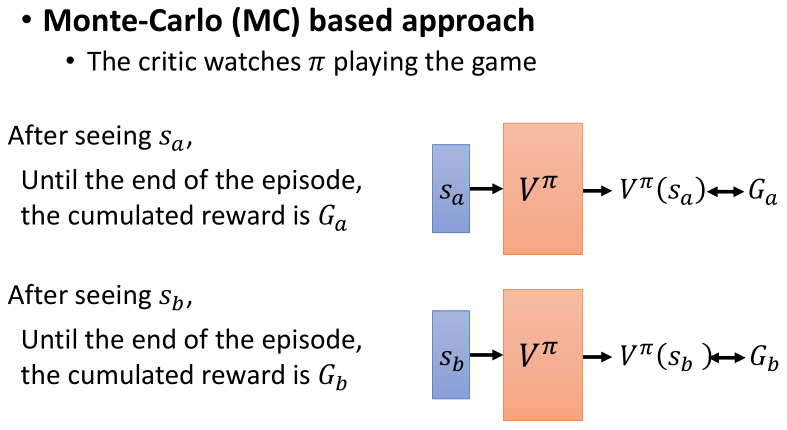

所以实际上我们的 $V^{\pi}(s)$，它是一个 network，对一个 network 来说，就算是 input state 是从来都没有看过的，它也可以想办法估测一个 value 的值。

怎么训练这个 network 呢？因为我们现在已经知道说，如果在 state sa，接下来的 accumulated reward 就是 Ga，也就是说，今天对这 value function 来说，如果 input 是 state sa，正确的 output 应该是 Ga，如果 input state sb，正确的 output 应该是 value Gb，所以在 training 的时候，其实它就是一个 regression 的 problem，你的 network 的 output 就是一个 value，你希望在 input sa 的时候，output value 跟 Ga 越近越好，input sb 的时候，output value 跟 Gb 越近越好，接下来把 network train 下去，就结束了。这是第一个方法，这是 MC based 的方法。

##### Temporal-difference (TD) approach

那还有第二个方法是 Temporal-difference 的方法，这个是 TD based 的方法，那 TD based 的方法是什么意思呢？在刚才那个 MC based 的方法，每次我们都要算 accumulated reward，也就是从某一个 state Sa，一直玩游戏玩到游戏结束的时候，你会得到的所有 reward 的总和，我在前一个投影片里面，把它写成 Ga 或 Gb，所以今天你要 apply MC based 的 approach，你必须至少把这个游戏玩到结束，你才能够估测 MC based 的 approach。但是有些游戏非常的长，你要玩到游戏结束才能够 update network，你可能根本收集不到太多的数据，花的时间太长了。所以怎么办？

有另外一种 TD based 的方法，TD based 的方法，不需要把游戏玩到底，只要在游戏的某一个情况，某一个 state st 的时候，采取 action at，得到 reward rt，跳到 state s(t+1)，就可以 apply TD 的方法，怎么 apply TD 的方法呢？基于以下这个式子，这个式子是说，我们知道说，假设我们现在用的是某一个 policy $\pi$，在 state st，以后在 state st，它会采取 action at，给我们 reward rt，接下来进入 s(t+1)，那就告诉我们说，state s(t+1) 的 value，跟 state st 的 value，它们的中间差了一项 rt，因为你把 s(t+1) 得到的 value，加上这边得到的 reward rt，就会等于 st 得到的 value。

有了这个式子以后，你在 training 的时候，你要做的事情并不是真的直接去估测 V，而是希望你得到的结果，你得到的这个 V，可以满足这个式子。

也就是说你 training 的时候，会是这样 train 的：你把 st 丢到 network 里面，会得到 V of st，你把 s(t+1) 丢到你的 value network 里面，会得到 V of s(t+1)。V of st 减 V of s(t+1)，它得到的值应该是 rt。然后按照这样的 loss，希望它们两个相减跟 rt 越接近越好的 loss train 下去，update V 的参数，你就可以把 V function learn 出来。

##### MC v.s. TD

这边是比较一下 MC 跟 TD 之间的差别，那 MC 跟 TD 它们有什么样的差别呢？

MC 它最大的问题就是它的 various 很大。因为今天我们在玩游戏的时候，它本身是有随机性的，所以 Ga 本身你可以想成它其实是一个 random 的 variable，因为你每次同样走到 sa 的时候，最后你得到的 Ga，其实是不一样的。你看到同样的 state sa，最后玩到游戏结束的时候，因为游戏本身是有随机性的，你的玩游戏的 model 本身搞不好也有随机性，所以你每次得到的 Ga 是不一样的。那每一次得到 Ga 的差别，其实会很大。为什么它会很大呢？假设你每一个 step 都会得到一个 reward，Ga 是从 state sa 开始，一直玩到游戏结束，每一个 time step reward 的和。

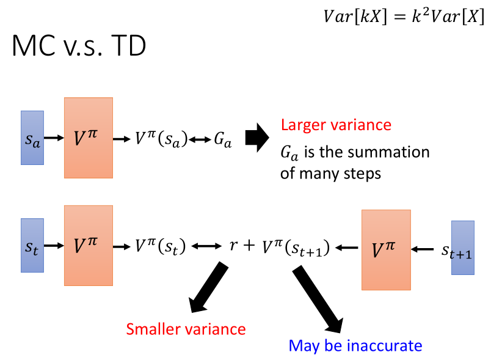

那举例来说，我在右上角就列一个式子是说，假设本来只有 X，它的 various 是 var of X，但是你把某一个 variable 乘上 K 倍的时候，它的 various 就会变成原来的 K 平方。所以Ga 的 variance 相较于某一个 state，你会得到的 reward variance 是比较大的。

如果说用 TD 的话呢？用 TD 的话，你是要去 minimize 这样的一个式子，在这中间会有随机性的是 r，因为你在 st 就算你采取同一个 action，你得到的 reward 也不见得是一样的，所以 r 其实也是一个 random variable，但这个 random variable 它的 variance，会比 Ga 要小，因为 Ga 是很多 r 合起来，这边只是某一个 r 而已，Ga 的 variance 会比较大，r 的 variance 会比较小。但是这边你会遇到的一个问题是 V 不见得估的准，假设你的这个 V 估的是不准的，那你 apply 这个式子 learn 出来的结果，其实也会是不准的。

所以今天 MC 跟 TD，它们是各有优劣，那等一下其实会讲一个 MC 跟 TD 综合的版本。今天其实 TD 的方法是比较常见的，MC 的方法其实是比较少用的。

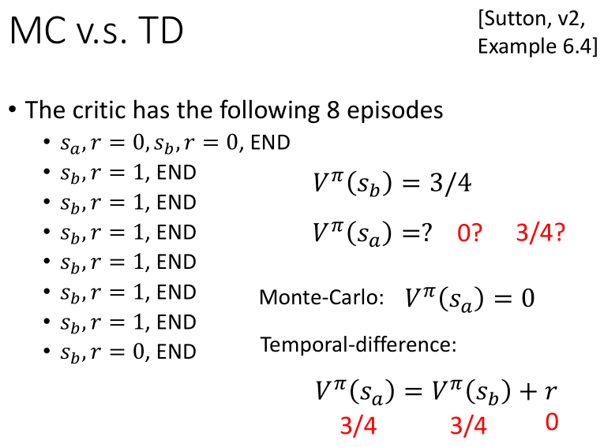

那这张图是想要讲一下，TD 跟 MC 的差异，这个图想要说的是什么呢？

这个图想要说的是，假设我们现在有某一个 critic，它去观察某一个 policy pi，跟环境互动8个 episode 的结果，有一个 actor pi  它去跟环境互动了 8 次，得到了 8 次玩游戏的结果是这个样子。

接下来我们要这个 critic 去估测 state 的 value，那如果我们看 sb 这个 state 它的 value 是多少，sb 这个 state 在 8场游戏里面都有经历过，然后在这 8 场游戏里面，其中有 6 场得到 reward 1，再有两场得到 reward 0。所以如果你是要算期望值的话，看到 state sb 以后，一直到游戏结束的时候，得到的 accumulated reward 期望值是 3/4，非常直觉。但是，不直觉的地方是说，sa 期望的 reward 到底应该是多少呢？

这边其实有两个可能的答案，一个是 0，一个是 3/4，为什么有两个可能的答案呢？这取决于你用 MC 还是 TD。

假如你用 MC 的话，你用 MC 的话，你会发现说，这个 sa 就出现一次，它就出现一次，看到 sa 这个 state，接下来 accumulated reward 就是 0，所以今天 sa 它的 expected reward 就是 0。

但是如果你今天去看 TD 的话，TD 在计算的时候，它是要 update 下面这个式子。下面这个式子想要说的事情是，因为我们在 state sa 得到 reward r=0 以后，跳到 state sb，所以 state sa 的 reward，会等于 state sb 的 reward，加上在 state sa 它跳到 state sb 的时候可能得到的 reward r。而这个可能得到的 reward r 的值是多少？它的值是 0，而 sb expected reward 是多少呢？它的 reward 是 3/4。那 sa 的 reward 应该是 3/4。

有趣的地方是用 MC 跟TD 你估出来的结果，其实很有可能是不一样的，就算今天你的 critic observed 到一样的 training data，它最后估出来的结果，也不见得会是一样。那为什么会这样呢？你可能问，那一个比较对呢？其实都对，因为今天在 sa 这边，今天在第一个 trajectory，sa 它得到 reward 0 以后，再跳到 sb 也得到 reward 0。

这边有两个可能，一个可能是，只要有看到 sa 以后，sb 就会拿不到 reward，有可能 sa 其实影响了 sb，如果是用 MC 的算法的话，它就会考虑这件事，它会把 sa 影响 sb 这件事，考虑进去，所以看到 sa 以后，接下来 sb 就得不到 reward，所以看到 sa 以后，期望的 reward 是 0。

但是今天看到 sa 以后，sb 的 reward 是 0 这件事有可能只是一个巧合，就并不是 sa 所造成，而是因为说，sb 有时候就是会得到 reward 0，这只是单纯运气的问题，其实平常 sb 它会得到 reward 期望值是 3/4，跟 sa 是完全没有关系的。所以 sa 假设之后会跳到 sb，那其实得到的 reward 按照 TD 来算，应该是 3/4。

所以不同的方法，它考虑了不同的假设，最后你其实是会得到不同的运算结果的。

##### Another Critic

那接下来我们要讲的是另外一种 critic，这种 critic 叫做 Q function，它又叫做 state-action value function。

那我们刚才看到的那一个 state function，它的 input，就是一个 state，它是根据 state 去计算出看到这个 state 以后的 expected accumulated reward 是多少。

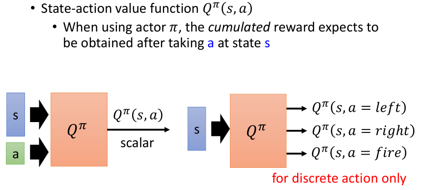

那这个 state-action value function 它的 input 不是 state，它是一个 state 跟action 的 pair，它的意思是说，在某一个 state，采取某一个 action，接下来假设我们都使用 actor pi，得到的 accumulated reward 它的期望值有多大。

在讲这个 Q-function 的时候，有一个会需要非常注意的问题是，今天这个 actor pi，在看到 state s 的时候，它采取的 action，不一定是 a。Q function 是假设在 state s，强制采取 action a，不管你现在考虑的这个 actor pi，它会不会采取 action a不重要，在 state s，强制采取 action a，接下来，都用 actor pi 继续玩下去，就只有在 state s，我们才强制一定要采取 action a，接下来就进入自动模式，让 actor pi 继续玩下去，得到的 expected reward，才是 $Q (s,a)$。

Q function 有两种写法，一种写法是你 input 就是 state 跟 action，那 output 就是一个 scalar，就跟 value function 是一样。

那还有另外一种写法，也许是比较常见的写法是这样，你 input 一个 state s，接下来你会 output 好几个 value，假设你 action 是 discrete 的，你 action 就只有 3 个可能，往左往右或是开火，那今天你的这个 Q function output 的 3 个 values，就分别代表假设，a 是向左的时候的 Q value，a 是向右的时候的 Q value，还有 a 是开火的时候的 Q value。那你要注意的事情是，像这样的 function 只有 discrete action 才能够使用。如果你的 action 是无法穷举的，你只能够用左边这个式子，不能够用右边这个式子。

###### State-action value function

这个是文献上的结果，一个碰的游戏你去 estimate Q function 的话，看到的结果可能会像是这个样子，这是什么意思呢？它说假设上面这个画面就是 state，我们有 3 个 actions，原地不动，向上，向下。那假设是在第一幅图这个 state，最后到游戏结束的时候，得到的 expected reward，其实都差不了多少，因为球在这个地方，就算是你向下，接下来你其实应该还来的急救，所以今天不管是采取哪一个 action，就差不了太多。但假设现在这个球，这个乒乓球它已经反弹到很接近边缘的地方，这个时候你采取向上，你才能得到 positive 的 reward，才接的到球，如果你是站在原地不动或向下的话，接下来你都会 miss 掉这个球，你得到的 reward 就会是负的。这个 case 也是一样，球很近了，所以就要向上。接下来，球被反弹回去，这时候采取那个 action，就都没有差了。

大家应该都知道说，deep reinforcement learning 最早受到大家重视的一篇paper 就是 deep mind 发表在 Nature 上的那个 paper，就是用 DQN 玩 Atari 可以痛扁人类，这个是 state-action value 的一个例子，是那篇 paper  上截下来的。

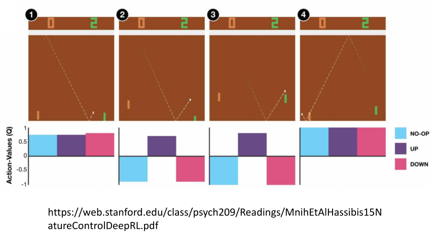

#### Another Way to use Critic: Q-Learning

接下来要讲的是说，虽然表面上我们 learn 一个 Q function，它只能拿来评估某一个 actor pi 的好坏，但是实际上只要有了这个 Q function，我们就可以做 reinforcement learning。其实有这个 Q function，我们就可以决定要采取哪一个 action。

它的大原则是这样，假设你有一个初始的 actor，也许一开始很烂，随机的也没有关系，初始的 actor 叫做$\pi$，那这个$\pi$ 跟环境互动，会 collect data。

接下来你你去衡量一下$\pi $ 这个 actor，它在某一个 state 强制采取某一个 action，接下来用$\pi$ 这个 policy 会得到的 expected reward，那你可以用 TD 也可以用 MC 都是可以的。

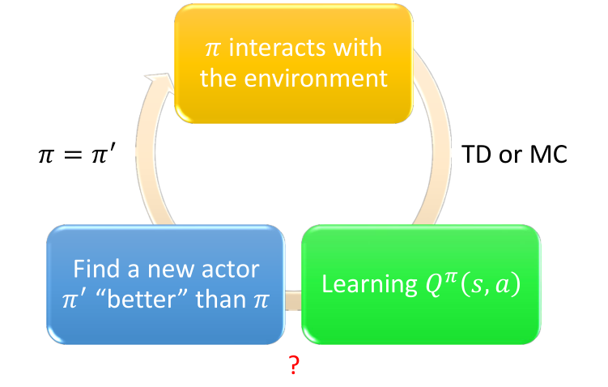

你 learn 出一个 Q function 以后，一个神奇的地方就是，只要 learn 得出某一个 policy pi 的 Q function，就保证你可以找到一个新的 policy，这个 policy 就做 $\pi'$，这一个 policy $\pi'$，它一定会比原来的 policy pi 还要好。

那等一下会定义什么叫做好，所以这边神奇的地方是，假设你只要有一个 Q function，你有某一个 policy pi，你根据那个 policy $\pi$ learn 出 policy $\pi$ 的 Q function，接下来保证你可以找到一个新的 policy 叫做 $\pi'$，它一定会比$\pi$ 还要好，你今天找到一个新的 $\pi'$，一定会比$\pi $ 还要好以后，你把原来的$\pi $ 用 $\pi'$ 取代掉，再去找它的 Q。得到新的 Q 以后，再去找一个更好的 policy，然后这个循环一直下去，你的 policy 就会越来越好。

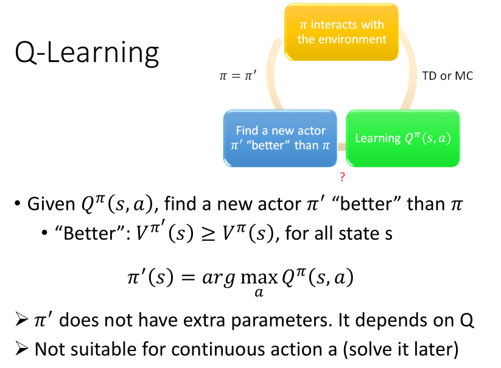

首先要定义的是，什么叫做比较好？我们说 $\pi'$ 一定会比 $\pi$ 还要好，什么叫做好呢？这边所谓好的意思是说，对所有可能的 state s 而言，对同一个 state s ，$\pi$ 的 value function 一定会小于 $\pi'$ 的 value function，也就是说我们走到同一个 state s 的时候，如果拿 $\pi$ 继续跟环境互动下去，我们得到的 reward 一定会小于用 $\pi'$ 跟环境互动下去得到的 reward，所以今天不管在哪一个 state，你用 $\pi'$ 去做 interaction，你得到的 expected reward 一定会比较大，所以 $\pi'$ 是比 $\pi$ 还要好的一个 policy。

那有了这个 Q 以后，怎么找这个 $\pi'$ 呢？这边的构想非常的简单，事实上这个 $\pi'$是什么？如果根据以下的这个式子去决定你的 action 的步骤叫做$\pi'$的话，那这个 $\pi'$ 一定会比 $\pi$ 还要好。

这个意思是说，假设你已经 learn 出 $\pi$ 的 Q function，今天在某一个 state s，你把所有可能的 action a，都一一带入这个 Q function，看看说那一个 a，可以让 Q function 的 value 最大，那这一个 action，就是 $\pi'$ 会采取的 action。

那这边要注意一下，我们刚才有讲过 Q function 的定义，given 这个 state s，你的 policy $\pi$，并不一定会采取 action a。今天是 given 某一个 state s，强制采取 action a，用 $\pi$ 继续互动下去，得到的 expected reward，才是这个 Q function 的定义。所以我们强调，在 state s 里面，不一定会采取 action a。

今天假设我们用这一个 $\pi'$，它在 state s 采取 action a，跟 $\pi$ 所谓采取 action，是不一定会一样的，然后 $\pi'$ 所采取的 action，会让它得到比较大的 reward。

所以实际上，根本就没有所谓一个 policy 叫做 $\pi'$，这个 $\pi'$ 其实就是用 Q function 推出来的，所以并没有另外一个 network 决定 $\pi'$ 怎么 interaction。我们只要 Q 就好，有 Q 就可以找出 $\pi'$。

但是这边有另外一个问题是我们等一下会解决的就是，在这边要解一个 Arg Max 的 problem，所以 a 如果是 continuous 的就会有问题，如果是 discrete 的，a 只有 3 个选项，一个一个带进去，看谁的 Q 最大，没有问题。但如果是 continuous 要解 Arg Max problem，你就会有问题，但这个是之后才会解决的。

##### Proof

为什么用 Q function，所决定出来的 $\pi'$，一定会比 $\pi$ 还要好？

假设我们有一个 policy  $\pi^{\prime}(s)=\arg \max _{a} Q^{\pi}(s, a)$，它是由 $Q^{\pi}$ 决定的。我们要证：对所有的 state s 而言，$V^{\pi^{\prime}}(s) \geq V^{\pi}(s)$。

假设你在 state s 这个地方，你 follow $\pi$ 这个 actor，它会采取的 action也就是 $\pi(s)$，那$V^{\pi}(s)=Q^{\pi}(s, \pi(s))$。In general 而言，$Q^{\pi}$ 不见得等于 $V^{\pi}$，是因为 action 不见得是 $\pi(s)$，但这个 action 如果是 $\pi(s)$ 的话，$Q^{\pi}$ 是等于 $V^{\pi}$ 的。

因为这边是某一个 action，这边是所有 action 里面可以让 Q 最大的那个 action，所以$Q^{\pi}(s, \pi(s))\leq \max _{a} Q^{\pi}(s, a)$。

a 就是 $\pi^{\prime}(s)$，所以今天这个式子可以写成 $\begin{array}{l}Q^{\pi}(s, \pi(s))\leq \max _{a} Q^{\pi}(s, a)=Q^{\pi}\left(s, \pi^{\prime}(s)\right)\end{array}$

因此我们知道 $V^{\pi}(s) \leq Q^{\pi}\left(s, \pi^{\prime}(s)\right)$，也就是说你在某一个 state，如果你按照 policy $\pi$，一直做下去，你得到的 reward 一定会小于等于你在现在这个 state s，你故意不按照 $\pi$ 所给你指示的方向，你故意按照 $\pi^{\prime}$ 的方向走一步。

但之后，只有第一步是按照 $\pi^{\prime}$ 的方向走，只有在 state s 这个地方，你才按照 $\pi^{\prime}$ 的指示走，但接下来你就按照 $\pi$的指示走。

虽然只有一步之差，但是我们可以按照上面这个式子知道说，这个时候你得到的 reward，只有一步之差，你得到的 reward 一定会比完全 follow $\pi$ ，得到的 reward 还要大。

那接下来，eventually，想要证的东西就是，这一个 $Q^{\pi}\left(s, \pi^{\prime}(s)\right)$，会小于等于 $V^{\pi^{\prime}}(s)$，也就是说，只有一步之差，你会得到比较大的 reward，但假设每步都是不一样的，每步通通都是 follow $\pi'$ 而不是 $\pi $ 的话，那你得到的 reward 一定会更大。直觉上想起来是这样子的。

如果你要用数学式把它写出来的话，略嫌麻烦，但也没有很难，只是比较繁琐而已。

你可以这样写$Q^{\pi}\left(s, \pi^{\prime}(s)\right)=E\left[r_{t+1}+V^{\pi}\left(s_{t+1}\right) \mid s_{t}=s, a_{t}=\pi^{\prime}\left(s_{t}\right)\right]$，它的意思就是说，我们在 state st，我们会采取 action at，接下来我们会得到 reward r(t+1)，然后跳到 state s(t+1)。

这边写得不太好，这边应该写成 rt ，跟之前的 notation 比较一致，但这边写成了 r(t+1)，其实这都是可以的，在文献上有时候有人会说，在 state st 采取 action at 得到 reward r(t+1)，有人会写成 rt，但意思其实都是一样的。

$V^{\pi}\left(s_{t+1}\right)$是 state s(t+1)，根据 $\pi$ 这个 actor 所估出来的 value，上面这个式子，等于下面这个式子。

要取一个期望值，因为在同样的 state 采取同样的 action，你得到的 reward 还有会跳到 state 不见得是一样，所以这边需要取一个期望值。

因为$V^{\pi}(s)\leq Q^{\pi}\left(s, \pi^{\prime}(s)\right)$，带入，可以得到
$$
E\left[r_{t+1}+V^{\pi}\left(s_{t+1}\right) \mid s_{t}=s, a_{t}=\pi^{\prime}\left(s_{t}\right)\right]\\
\leq E\left[r_{t+1}+Q^{\pi}\left(s_{t+1}, \pi^{\prime}\left(s_{t+1}\right)\right) \mid s_{t}=s, a_{t}=\pi^{\prime}\left(s_{t}\right)\right]\\
$$
也就是说，现在你一直 follow $\pi$，跟某一步 follow $\pi^{\prime}$，接下来都 follow $\pi$，比起来，某一步 follow $$\pi^{\prime}$$ 得到的 reward 是比较大的。

就可以写成下面这个式子，因为 $Q^\pi$ 这个东西可以写成 r(t+2) + s(t+2) 的 value。
$$
E\left[r_{t+1}+Q^{\pi}\left(s_{t+1}, \pi^{\prime}\left(s_{t+1}\right)\right) \mid s_{t}=s, a_{t}=\pi^{\prime}\left(s_{t}\right)\right]\\=E\left[r_{t+1}+r_{t+2}+V^{\pi}\left(s_{t+2}\right) \mid \ldots\right]\\\leq E\left[r_{t+1}+r_{t+2}+Q^{\pi}\left(s_{t+2}, \pi^{\prime}\left(s_{t+2}\right)\right) \mid \ldots\right] \ldots \leq V^{\pi^{\prime}}(s)
$$
你再把 $V^{\pi}(s)\leq Q^{\pi}\left(s, \pi^{\prime}(s)\right)$带进去，然后一直算，算到 episode 结束，那你就知道$V^{\pi }\left(s\right)\leq V^{\pi'}\left(s\right)$。

假设你没有办法 follow 的话，总是想要告诉你的事情是说，你可以 estimate 某一个 policy 的 Q function，接下来你就一定可以找到另外一个 policy 叫做 $\pi^{\prime}$，它一定比原来的 policy 还要更好。

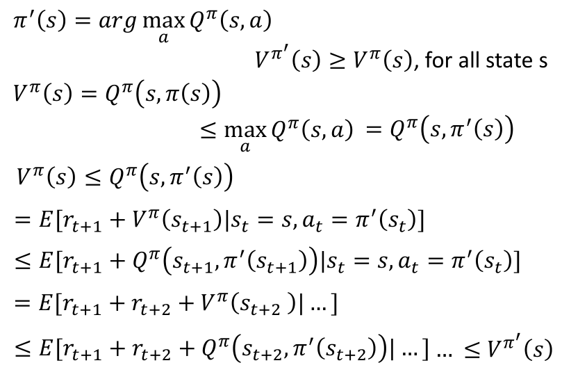

#### Target Network

我们讲一下接下来在 Q learning 里面，typically 你一定会用到的 tip。

第一个，你会用一个东西叫做 target network，什么意思呢？

我们在 learn Q function 的时候，你也会用到 TD 的概念，那怎么用 TD 的概念呢？

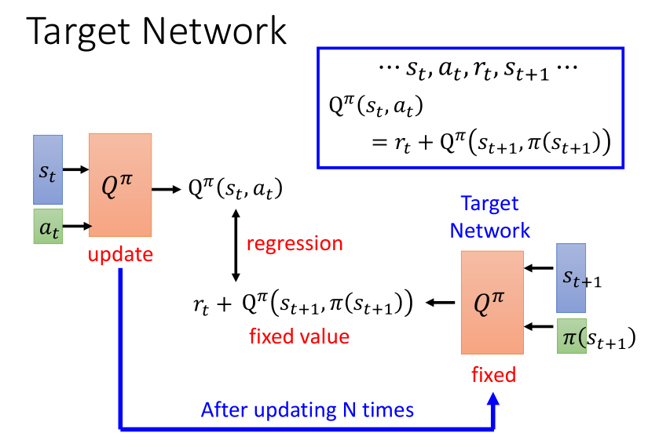

就是说你现在收集到一个 data，是说在 state st，你采取 action at 以后，你得到 reward rt，然后跳到 state s(t+1)。

然后今天根据这个 Q function 你会知道说，${Q}^{\pi}\left(s_{t}, a_{t}\right)=r_{t}+{Q}^{\pi}\left(s_{t+1}, \pi\left(s_{t+1}\right)\right)$，它们中间差了一项就是 rt，所以你在 learn 的时候，你会说我们有 Q function，input  st, at 得到的 value，跟 input s(t+1), $\pi(s_{t+1})$ 得到的 value 中间，我们希望它差了一个 rt，这跟 TD 的概念是一样的。

但是实际上在 learn 的时候，这样 in general 而言这样的一个 function 并不好 learn。因为假设你说这是一个 regression 的 problem，${Q}^{\pi}\left(s_{t}, a_{t}\right)$是你 network 的 output，$r_{t}+{Q}^{\pi}\left(s_{t+1}, \pi\left(s_{t+1}\right)\right)$是你的 target，你会发现你的  target 是会动的。当然你要 implement 这样的 training 其实也没有问题。

就是你在做 back propagation 的时候，这两个 model 的参数都要被 update。它们是同一个 model，所以两个 update 的结果会加在一起。

但是实际上在做的时候，你的 training 会变得不太稳定，因为假设你把这个当作你 model 的 output，这个当作 target 的话，你会变成说你要去 fit 的 target，它是一直在变的。这种一直在变的 target 的 training 其实是不太好 train 的。

所以实际上怎么做呢？实际上你会把其中一个 Q，通常是选择下面这个 Q，把它固定住，也就是说你在 training 的时候，你并不 update 这个 Q 的参数，你只 update 左边这个 Q 的参数，而右边这个 Q 的参数，它会被固定住，我们叫它 target network。它负责产生 target，所以叫做 target network。因为 target network 是固定的，所以你现在得到的 target，也就是 $r_{t}+{Q}^{\pi}\left(s_{t+1}, \pi\left(s_{t+1}\right)\right)$ 的值也会是固定的。

那我们只调左边这个 network 的参数，那假设因为 target network 是固定的，我们只调左边 network 的参数，它就变成是一个 regression 的 problem。我们希望我们 model 的 output，它的值跟你的目标越接近越好，你会 minimize 它的 mean square error，那你会 minimize 它们 L2 的 distance，那这个东西就是 regression。

在实作上呢，你会把这个 Q update 好几次以后，再去把这个 target network 用 update 过的 Q，去把它替换掉。你在 train 的时候，先update 它好几次，然后再把它替换掉，但它们两个不要一起动，它们两个一起动的话，你的结果会很容易坏掉。

一开始这两个 network 是一样的，然后接下来在 train 的时候，你在做 gradient decent 的时候，只调左边这个 network 的参数，那你可能 update 100 次以后，才把这个参数，复制到右边去，把它盖过去。把它盖过去以后，你这个 target 的 value，就变了，就好像说你今天本来在做一个 regression 的 problem，那你 train 把这个 regression problem 的 loss 压下去以后，接下来你把这边的参数把它 copy 过去以后，你的 target 就变掉了，你 output 的 target 就变掉了，那你接下来就要重新再 train。

loss会不会变成 0？因为首先它们的 input 是不一样，同样的 function，这边的 input 是 st 跟 at，这边 input 是 s(t+1) 跟 action $\pi\left(s_{t+1}\right)$，因为 input 不一样，所以它 output 的值会不一样，今天再加上 rt，所以它们的值就会更不一样，但是你希望说你会把这两项的值把它拉近。

#### Exploration

第二个会用到的 tip 是 Exploration，我们刚才讲说，当我们使用 Q function 的时候，我们的 policy 完全 depend on 那个 Q function，看说 given 某一个 state，你就穷举所有的 a，看哪个 a 可以让 Q value 最大，它就是你采取的 policy，它就是采取的 action。

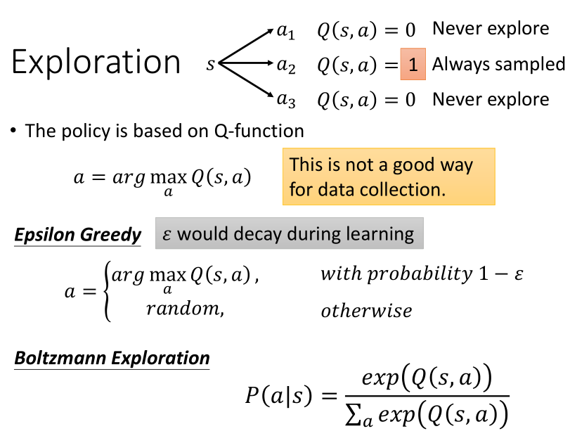

那其实这个跟 policy gradient 不一样，在做 policy gradient 的时候，我们的 output 其实是 stochastic 的，我们 output 一个 action 的 distribution，根据这个 action 的 distribution 去做 sample，所以在 policy gradient 里面，你每次采取的 action 是不一样的，是有随机性的。

那像这种 Q function，如果你采取的 action 总是固定的，会有什么问题呢？你会遇到的问题就是，这不是一个好的收集 data 的方式，为什么这不是一个好的收集 data 的方式呢？因为假设我们今天你要估测在某一个 state 采取某一个 action 会得到的 Q value，你一定要在那一个 state，采取过那一个 action，你才估得出它的 value 。

如果你没有在那个 state 采取过那个 action，你其实估不出那个 value 的。当然如果是用 deep 的 network，就你的 Q function 其实是一个 network。这种情形可能会比较没有那么严重，但是 in general 而言，假设你 Q function 是一个 table，没有看过的 state-action pair 就是估不出值来，当然 network 也是会有一样的问题，只是没有那么严重，但也会有一样的问题。

所以今天假设你在某一个 state，action a1, a2, a3 你都没有采取过，那你估出来的 (s, a1) (s, a2) (s, a3) 的 Q value，可能就都是一样的，就都是一个初始值，比如说 0。

但是今天假设你在 state s，你 sample 过某一个 action a2 了，那 sample 到某一个 action a2，它得到的值是 positive 的 reward，那现在 Q(s, a2)，就会比其它的 action 都要好。那我们说今天在采取 action 的时候，就看说谁的 Q value 最大，就采取谁。所以之后你永远都只会 sample 到 a2，其它的 action 就再也不会被做了，所以今天就会有问题。

就好像说你进去一个餐厅吃饭，餐厅都有一个菜单，那其实你都很难选，你今天点了某一个东西以后，假说点了某一样东西，比如说椒麻鸡，你觉得还可以，接下来你每次去，就都会点椒麻鸡，再也不会点别的东西了，那你就不知道说别的东西是不是会比椒麻鸡好吃，这个是一样的问题。

那如果你今天没有好的 exploration 的话，你在 training 的时候就会遇到这种问题。

举一个实际的例子，假设你今天是用 Q learning 来玩比如说slither.io，在玩 slither.io 你会有一个蛇，然后它在环境里面就走来走去，然后就吃到星星，它就加分。

那今天假设这个游戏一开始，它采取往上走，然后就吃到那个星星，它就得到分数，它就知道说往上走是 positive，接下来它就再也不会采取往上走以外的 action 了。所以接下来就会变成每次游戏一开始，它就往上冲，然后就死掉，再也做不了别的事。

所以今天需要有 exploration 的机制，需要让 machine 知道说，虽然 a2，根据之前 sample 的结果，好像是不错的，但你至少偶尔也试一下 a1 跟 a3，搞不好它们更好也说不定。

有两个方法解这个问题，一个是 Epsilon Greedy，Epsilon Greedy 的意思是说，我们有，1-epsilon 的机率，通常 epsilon 就设一个很小的值，1-epsilon 可能是 90%，也就是 90% 的机率完全按照 Q function 来决定 action，但是你有 10% 的机率是随机的。

通常在实作上 epsilon 会随着时间递减。

也就是在最开始的时候，因为还不知道那个 action 是比较好的，所以你会花比较大的力气在做 exploration。

那接下来随着 training 的次数越来越多，已经比较确定说哪一个 Q 是比较好的，你就会减少你的 exploration，你会把 epsilon 的值变小，主要根据 Q function 来决定你的 action，比较少做 random，这是 Epsilon Greedy。

那还有另外一个方法叫做 Boltzmann Exploration，这个方法就比较像是 policy gradient，在 policy gradient 里面我们说 network 的 output 是一个 probability distribution，再根据 probability distribution 去做 sample。

那其实你也可以根据 Q value 去定一个 probability distribution，你可以说，假设某一个 action，它的 Q value 越大，代表它越好，那我们采取这个 action 的机率就越高，但是某一个 action 它的 Q value 小，不代表我们不能 try try 看它好不好用，所以我们有时候也要 try try 那些 Q value 比较差的 action。

那怎么做呢？因为 Q value 它是有正有负的，所以你要把它弄成一个机率，你可能就先取 exponential，然后再做 normalize，然后把 Q(s, a) exponential，再做 normalize 以后的这个机率，就当作是你在决定 action 的时候 sample 的机率。

其实在实作上，你那个 Q 是一个 network，所以你有点难知道说，今天在一开始的时候 network 的 output，到底会长怎么样子。但是其实你可以猜测说，假设你一开始没有任何的 training data，你的参数是随机的，那 given 某一个 state s，你的不同的 a output 的值，可能就是差不多的。所以一开始 Q(s, a) 应该会倾向于是 uniform，也就是在一开始的时候，你这个 probability distribution 算出来，它可能是比较 uniform 的。

#### Replay Buffer

那还有第三个你会用的 tip，这个 tip 叫做 replay buffer。

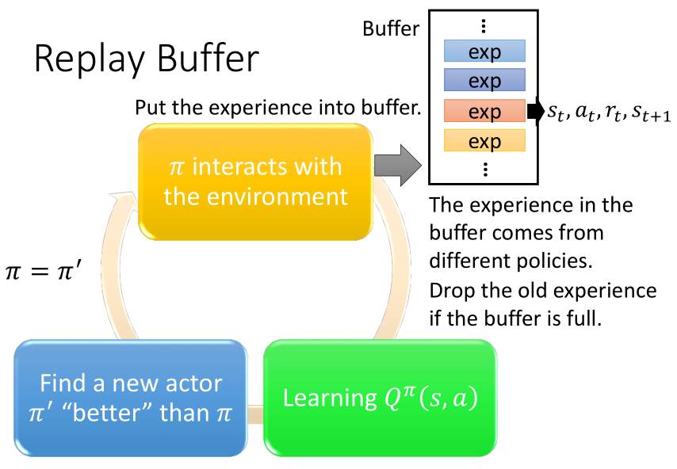

replay buffer 的意思是说，现在我们会有某一个 policy pi 去跟环境做互动，然后它会去收集 data，我们会把所有的 data 放到一个 buffer 里面，那 buffer 里面就排了很多 data，那你 buffer 设比如说 5万，这样它里面可以存 5 万笔数据，每一笔数据是什么？每一笔数据就是记得说，我们之前在某一个 state st，采取某一个 action at，接下来我们得到的 reward rt，然后接下来跳到 state s(t+1)，某一笔数据，就是这样。那你用 pi 去跟环境互动很多次，把所有收集到的数据通通都放到这个 replay buffer 里面。

这边要注意的事情是，这个 replay buffer 它里面的 experience，可能是来自于不同的 policy，就你每次拿 pi 去跟环境互动的时候，你可能只互动 10,000 次，然后接下来你就更新你的 pi 了。但是你的这个 buffer 里面可以放 5 万笔数据。所以那 5 万笔数据，它们可能是来自于不同的 policy。那这个 buffer 只有在它装满的时候，才会把旧的资料丢掉，所以这个 buffer 里面它其实装了很多不同的 policy，所计算出来的不同的 policy 的 experiences。

接下来你有了这个 buffer 以后，你做的事情，你是怎么 train 这个 Q 的 model 呢？你是怎么估 Q 的 function？

你的做法是这样，你会 iterative 去train 这个 Q function，在每一个 iteration 里面，你从这个 buffer 里面，随机挑一个 batch 出来。

就跟一般的 network training 一样，你从那个 training data set 里面，去挑一个 batch 出来，你去 sample 一个 batch 出来，里面有一把的 experiences。根据这把 experiences 去 update 你的 Q function。就跟我们刚才讲那个 TD learning 要有一个 target network 是一样的。你去 sample 一个 batch 的 data，sample 一堆 experiences，然后再去 update 你的 Q function。

这边其实有一个东西你可以稍微想一下，你会发现说，实际上当我们这么做的时候，它变成了一个 off policy 的做法。

因为本来我们的 Q 是要观察，pi 这个 action 它的 value，但实际上存在你的 replay buffer 里面的这些experiences，不是通通来自于 pi。有些是过去其它的 pi，所遗留下来的 experience。

因为你不会拿某一个 pi 就把整个 buffer 装满，然后拿去测 Q function，这个 pi 只是 sample 一些 data，塞到那个 buffer 里面去，然后接下来就让 Q 去 train，所以 Q 在 sample 的时候，它会 sample 到过去的一些数据，但是这么做到底有什么好处呢？

这么做有两个好处，第一个好处，其实在做 reinforcement learning 的时候，往往最花时间的 step，是在跟环境做互动，train network 反而是比较快的，因为你用 GPU train 其实很快，真正花时间的往往是在跟环境做互动。

今天用 replay buffer，你可以减少跟环境做互动的次数，因为今天你在做 training 的时候，你的 experience 不需要通通来自于某一个 policy，一些过去的 policy 它所得到的 experience，可以放在 buffer 里面被使用很多次，被反复的再利用。这样让你的 sample 到 experience 的利用是比较 efficient。

还有另外一个理由是，你记不记得我们说在 train network 的时候，其实我们希望一个 batch 里面的 data，越 diverse 越好。

如果你的 batch 里面的 data 通通都是同样性质的，你 train 下去，其实是容易坏掉的。不知道大家有没有这样子的经验，如果你 batch 里面都是一样的 data，你 train 的时候，performance 会比较差。我们希望 batch data 越 diverse 越好。

那如果你的这个 buffer 里面的那些 experience，它通通来自于不同的 policy 的话，那你得到的结果，你 sample 到的一个 batch 里面的 data，会是比较 diverse 的。

但是接下来你会问的一个问题是，我们明明是要观察 pi 的 value，我们要量的明明是 pi 的 value 啊，里面混杂了一些不是 pi 的 experience，到底有没有关系？

这一件事情其实是没有关系的，这并不是因为过去的 pi 跟现在的 pi 很像，就算过去的 pi 没有很像，其实也是没有关系的。这个留给大家回去想一下，为什么会这个样子。主要的原因是，我们并不是去 sample 一个 trajectory，我们只 sample 了一笔 experience，所以跟我们是不是 off policy 这件事是没有关系的。就算是 off-policy，就算是这些 experience 不是来自于 pi，我们其实还是可以拿这些experience 来估测 $Q^\pi(s, a)$。这件事有点难解释，不过你就记得说，replay buffer 这招其实是在理论上也是没有问题的。

#### Typical Q-Learning Algorithm

这个就是 typical 的一般的正常的 Q learning 演算法。

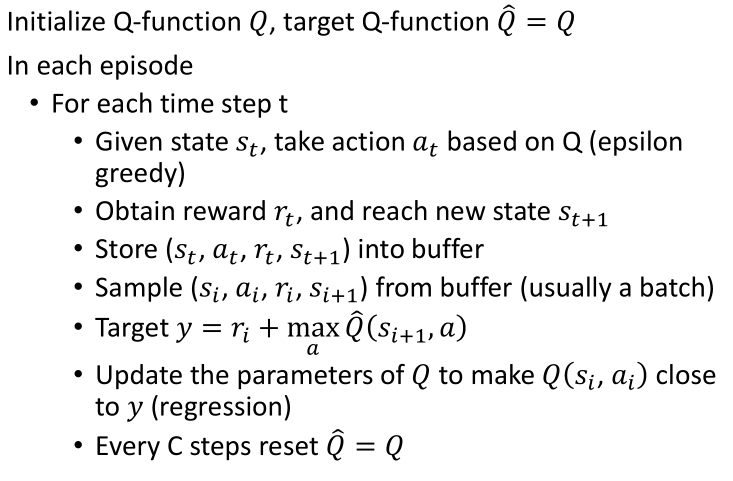

我们说我们需要一个 target network，先开始 initialize 的时候，你 initialize 2 个 network，一个 是 Q，一个是 Q hat，那其实 Q hat 就等于 Q，一开始这个 target Q-network，跟你原来的 Q network 是一样的。

那在每一个 episode，你拿你的 agent，你拿你的 actor 去跟环境做互动，那在每一次互动的过程中，你都会得到一个 state st，一个游戏的画面，那你会采取某一个 action at。那怎么知道采取那一个 action at 呢？你就根据你现在的 Q-function，但是记得你要有 exploration 的机制，比如说你用 Boltzmann exploration 或是 Epsilon Greedy的 exploration。

那接下来你得到 reward rt，然后跳到 state s(t+1)，所以现在 collect 到一笔 data，这笔 data 是 st, at ,rt, s(t+1)。把这笔 data 就塞到你的 buffer 里面去，那如果 buffer 满的话，你就再把一些旧的数据再把它丢掉。

那接下来你就从你的 buffer 里面去 sample data，那你 sample 到的是 si, ai, ri, s(i+1) 这笔 data 跟你刚放进去的，不见得是同一笔，抽到一个旧的也是有可能的。

那这边另外要注意的是，其实你 sample 出来不是一笔 data，你 sample 出来的是一个 batch 的 data，sample 一把 experiences 出来。

你 sample 这一把 experience 以后，接下来你要做的事情就是，计算你的 target，根据你 sample 出这么一笔 data 去算你的 target，你的 target 是什么呢？target 记得要用 target network，也就是 Q hat 来算，我们用 Q hat 来代表 target network。

target 是多少呢？ target 就是 ri 加上，Q hat of (s(i+1), a)。现在哪一个 a，可以让 Q hat 的值最大，你就选那一个 a。因为我们在 state s(i+1)，会采取的 action a，其实就是那个可以让 Q value 的值最大的那一个 a。

接下来我们要 update Q 的值，那就把它当作一个 regression 的 problem，希望 Q of (si, ai) 跟 target 越接近越好，然后今天假设这个 update，已经 update 了某一个数目的次，比如说 c 次，你就设一个c = 100，那你就把 Q hat 设成 Q，就这样。

### Tips of Q-Learning

#### Double DQN

接下来我们要讲的是 train Q learning 的一些 tip。

第一个要介绍的 tip，叫做 double DQN。那为什么要有 double DQN 呢？，因为在实作上，你会发现说，Q value 往往是被高估的。

那下面这几张图是来自于 double DQN 的原始 paper，它想要显示的结果就是，Q value 往往是被高估的。

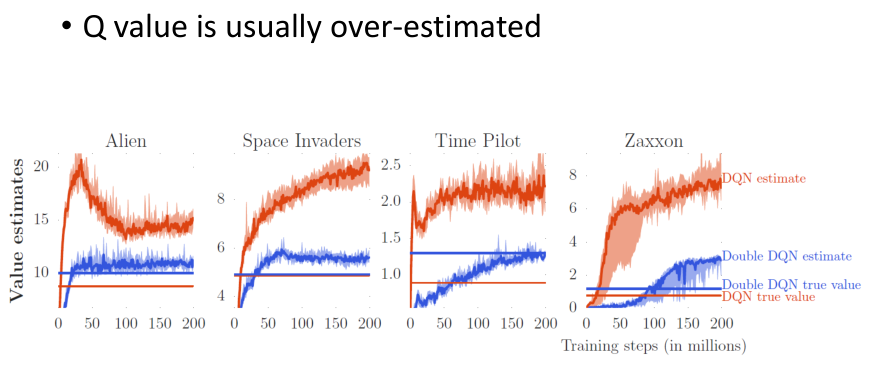

这边就是有 4 个不同的小游戏，那横轴是 training 的时间，然后红色这个锯齿状一直在变的线就是，对不同的 state estimate 出来的平均 Q value，就有很多不同的 state，每个 state 你都 sample 一下，然后算它们的 Q value，把它们平均起来，这是红色这一条线，它在 training 的过程中会改变，但它是不断上升的。为什么它不断上升，很直觉，不要忘了 Q function 是 depend on 你的 policy 的，你今天在 learn 的过程中你的 policy 越来越强，所以你得到 Q 的 value 会越来越大。在同一个 state，你得到 expected reward 会越来越大，所以 general 而言，这个值都是上升的。

但是它说，这是 Q network 估测出来的值，接下来你真的去算它。怎么真的去算？你有那个 policy，然后真的去玩那个游戏，你就可以估说，你就可以真的去算说，就玩很多次，玩个 1 百万次，然后就去真的估说，在某一个 state，你会得到的 Q value，到底有多少。你会得到说在某一个 state，采取某一个 action，你接下来会得到 accumulated reward 的总和是多少。那你会发现说，估测出来的值是远比实际的值大，在每一个游戏都是这样，都大很多。

double DQN 可以让估测的值跟实际的值是比较接近的。蓝色的锯齿状的线是 double DQN 的 Q network 所估测出来的 Q value，蓝色的是真正的 Q value，你会发现他们是比较接近的。

还有另外一个有趣可以观察的点就是说，用 double DQN 得出来真正的 accumulated reward，在这 3 个 case，都是比原来的 DQN 高的，代表 double DQN learn 出来那个 policy 比较强，所以它实际上得到的 reward 是比较大的。虽然说看那个 Q network 的话，一般的 DQN 的 Q network 虚张声势，高估了自己会得到的 reward，但实际上它得到的 reward 是比较低的。

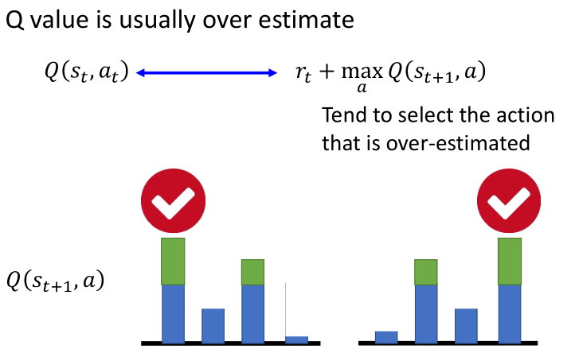

那接下来要讲的第一个问题就是，为什么 Q value 总是被高估了呢？这个是有道理的，因为我们实际上在做的时候，我们是要让左边这个式子，跟右边我们这个 target，越接近越好，那你会发现说，target 的值，很容易一不小心就被设得太高。

为什么 target 的值很容易一不小心就被设得太高呢？因为你在算这个 target 的时候，我们实际上在做的事情是说，看哪一个 a 它可以得到最大的 Q value，就把它加上去，就变成我们的 target。所以今天假设有某一个 action，它得到的值是被高估的。

举例来说，我们现在有 4 个 actions，那本来其实它们得到的值都是差不多的，他们得到的 reward 都是差不多的，但是在 estimate 的时候，那毕竟是个 network，所以 estimate 的时候是有误差的。

所以假设今天是第一个 action，它被高估了，假设绿色的东西代表是被高估的量，它被高估了，那这个 target 就会选这个高估的 Q value，来加上 rt，来当作你的 target。所以你总是会选那个 Q value 被高估的，你总是会选那个 reward 被高估的 action 当作这个 max 的结果，去加上 rt 当作你的 target，所以你的 target 总是太大。

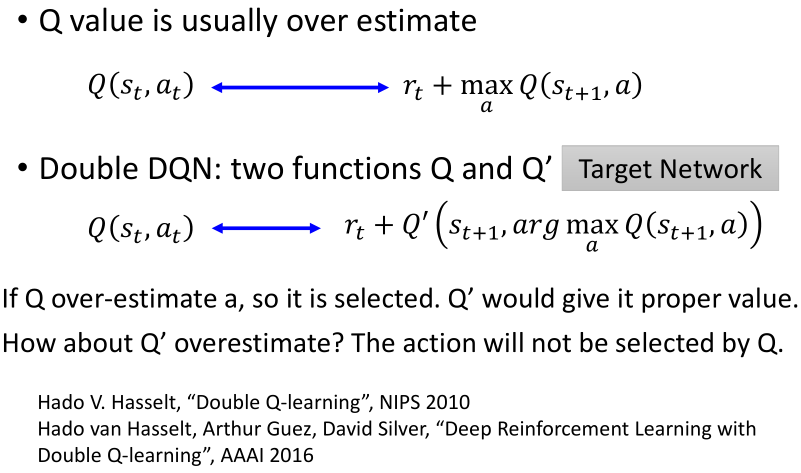

那怎么解决这 target 总是太大的问题呢？那 double DQN 它的设计是这个样子的。在 double DQN 里面，选 action 的 Q function，跟算 value 的 Q function，不是同一个。

今天在原来的 DQN 里面，你穷举所有的 a，把每一个 a 都带进去，看哪一个 a 可以给你的 Q value 最高，那你就把那个 Q value 加上 rt。

但是在 double DQN 里面，你有两个 Q network，第一个 Q network 决定那一个 action 的 Q value 最大，你用第一个 Q network 去带入所有的 a，去看看哪一个 Q value 最大，然后你决定你的 action 以后，实际上你的 Q value 是用 $Q'$ 所算出来的。这样子有什么好处呢？为什么这样就可以避免 over estimate 的问题呢？

因为今天假设我们有两个 Q function，假设第一个 Q function 它高估了它现在选出来的 action a，那没关系，只要第二个 Q function  $Q'$ ，它没有高估这个 action a 的值，那你算出来的，就还是正常的值。那今天假设反过来是  $Q'$  高估了某一个 action 的值，那也没差，因为反正只要前面这个 Q 不要选那个 action 出来，就没事了。这个就跟行政跟立法是分立的概念是一样的。Q 负责提案，它负责选 a， $Q'$ 负责执行，它负责算出 Q value 的值。所以今天就算是前面这个 Q，做了不好的提案，它选的 a 是被高估的，只要后面  $Q'$  不要高估这个值就好了，那就算  $Q'$  会高估某个 a 的值，只要前面这个 Q 不提案那个 a，算出来的值就不会被高估了，所以这个就是 double DQN 神奇的地方。

然后你可能会说，哪来两个 Q 跟  $Q'$  呢？哪来两个 network 呢？其实在实作上，你确实是有两个 Q value 的，因为一个就是你真正在 update 的 Q，另外一个就是 target 的 Q network。就是你其实有两个 Q network，一个是 target 的 Q network，一个是真正你会 update 的 Q network。所以在 double DQN 里面，你的实作方法会是，你拿真正的 Q network，你会 update 参数的那个 Q network，去选 action，然后你拿 target 的 network，那个固定住不动的 network，去算 value。那 double DQN 相较于原来的 DQN 的更动是最少的，它几乎没有增加任何的运算量，看连新的 network 都不用，因为你原来就有两个 network 了。

你唯一要做的事情只有，本来你在找最大的 a 的时候，你在决定这个 a 要放哪一个的时候，你是用  $Q'$ 来算，你是用 freeze 的 那个 network 来算，你是用 target network 来算，现在改成用另外一个会 update 的 Q network 来算，这个应该是改一行 code 就可以解决了，所以这个就是轻易的就可以 implement。

#### Dueling DQN

那第二个 tip，叫做 dueling 的 DQN。dueling DQN 是什么呢？

其实 dueling DQN 也蛮好做的，相较于原来的 DQN，它唯一的差别是改了 network 的架构。等一下你听了如果觉得，有点没有办法跟上的话，你就要记住一件事，dueling DQN 它唯一做的事情，是改 network 的架构。

我们说 Q network 就是 input state，output 就是每一个 action 的 Q value。dueling DQN 唯一做的事情，是改了 network 的架构，其它的演算法，你都不要去动它。

那 dueling DQN 它是怎么改了 network 的架构呢？它是这样说的，本来的 DQN 就是直接output Q value 的值，现在这个 dueling 的 DQN 就是下面这个 network 的架构，它不直接 output Q value 的值，它是怎么做的？

它在做的时候，它分成两条 path 去运算，第一个 path，它算出一个 scalar，那这个 scalar 因为它跟 input s 是有关系，所以叫做 V(s)。

那下面这个，它会 output 另外一个 vector 叫做 A(s, a)，它的dimension与action的数目相同。那下面这个 vector，它是每一个 action 都有一个 value，然后你再把这两个东西加起来，就得到你的 Q value。

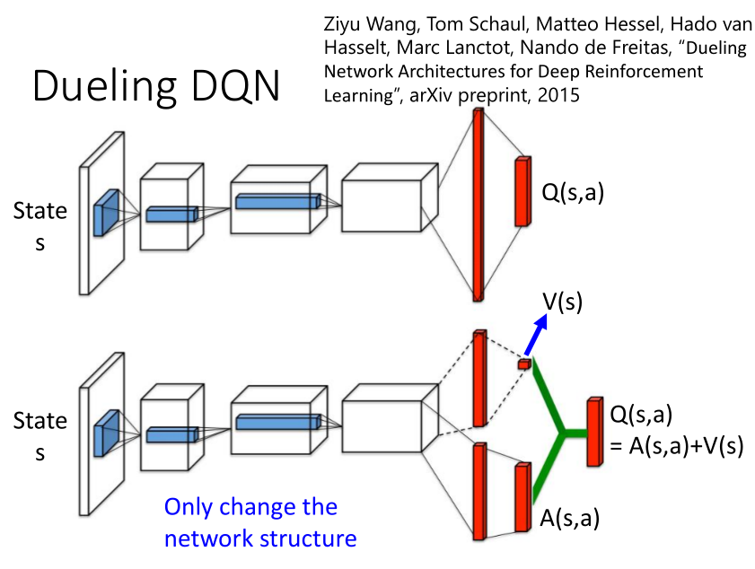

这么改有什么好？

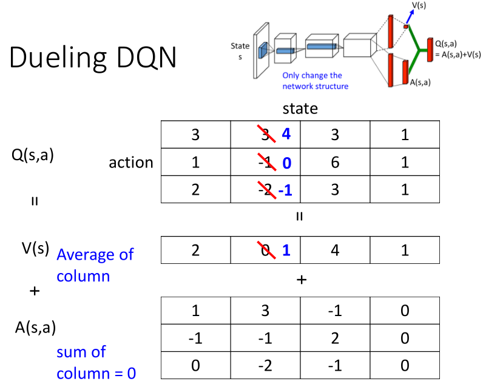

那我们假设说，原来的 Q(s, a)，它其实就是一个 table。我们假设 state 是 discrete 的，那实际上 state 不是 discrete 的，那为了说明方便，我们假设就是只有 4  个不同的 state，只有3 个不同的 action，所以 Q of (s, a) 你可以看作是一个 table。

那我们说 Q(s, a) 等于 V(s) 加上 A(s, a)，那 V(s) 是对不同的 state 它都有一个值，A(s, a) 它是对不同的 state，不同的 action，都有一个值，那你把这个 V 的值加到 A 的每一个 column，就会得到 Q 的值。你把 V 加上 A，就得到 Q。

那今天假设说，你在 train network 的时候，你现在的 target 是希望，这一个值变成 4，这一个值变成 0，但是你实际上能更动的，并不是 Q 的值，你的 network 更动的是 V 跟 A 的值，根据 network 的参数，V 跟 A 的值 output 以后，就直接把它们加起来，所以其实不是更动 Q 的值。

然后在 learn network 的时候，假设你希望这边的值，这个 3 增加 1 变成 4，这个 -1 增加 1 变成 0，最后你在 train network 的时候，network 可能会选择说，我们就不要动这个 A 的值，就动 V 的值，把 V 的值，从 0 变成 1。那你把 0 变成 1 有什么好处呢？这个时候你会发现说，本来你只想动这两个东西的值，那你会发现说，这个第三个值也动了。所以有可能说你在某一个 state，你明明只 sample 到这 2 个 action，你没 sample 到第三个 action，但是你其实也可以更动到第三个 action 的 Q value。

那这样的好处就是，你就变成你不需要把所有的 state action pair 都 sample 过，你可以用比较 efficient 的方式，去 estimate Q value 出来。

因为有时候你 update 的时候，不一定是 update 下面这个 table，而是只 update 了 V(s)，但 update V(s) 的时候，只要一改，所有的值就会跟着改，这是一个比较有效率的方法，去使用你的 data。

这个是 Dueling DQN 可以带给我们的好处，那可是接下来有人就会问说，真的会这么容易吗？

会不会最后 learn 出来的结果是，反正 machine就学到说我们也不要管什么 V 了，V 就永远都是 0，然后反正 A 就等于 Q，那你就没有得到任何 Dueling DQN 可以带给你的好处，就变成跟原来的 DQN 一模一样。

所以为了避免这个问题，实际上你会对下面这个 A 下一些 constrain。

你要给 A 一些 constrain，让 update A 其实比较麻烦，让 network 倾向于 会想要去用 V 来解问题。举例来说，你可以看原始的文献，它有不同的 constrain。那一个最直觉的 constrain 是，你必须要让这个 A 的每一个 column 的和都是 0，每一个 column 的值的和都是 0，所以看我这边举的的例子，我的 column 的和都是 0。

那如果这边 column 的和都是 0，这边这个 V 的值，你就可以想成是上面 Q 的每一个 column 的平均值，这个平均值，加上这些值，才会变成是 Q 的 value。

所以今天假设你发现说你在 update 参数的时候，你是要让整个 row 一起被 update，你就不会想要 update Ａ这个 matrix，因为 A 这个 matrix 的每一个 column 的和都要是 0，所以你没有办法说，让这边的值，通通都 +1，这件事是做不到的，因为它的 constrain 就是你的和永远都是要 0，所以不可以都 +1，这时候就会强迫 network 去 update V 的值。这样你可以用比较有效率的方法，去使用你的 data。

那实作上怎么做呢？所以实作上我们刚才说，你要给这个 A 一个 constrain。

那所以在实际 implement 的时候，你会这样 implement。

假设你有 3 个 actions，然后在这边 network 的 output 的 vector 是 7 3 2，你在把这个 A 跟这个 B 加起来之前，先加一个 normalization，就好像做那个 layer normalization 一样，加一个 normalization。

这个 normalization 做的事情，就是把 7+3+2 加起来等于 12，12/3 = 4，然后把这边通通减掉 4，变成 3, -1, 2，再把  3, -1, 2 加上 1.0，得到最后的 Q value。

这个 normalization 的这个 step，就是 network 的其中一部分，在 train 的时候，你从这边也是一路 back propagate 回来的。只是 normalization 这一个地方，是没有参数的，它就是一个 normalization 的 operation，它可以放到 network 里面，跟 network 的其他部分 jointly trained，这样 A 就会有比较大的 constrain，这样 network 就会给它一些penalty，倾向于去 update V 的值，这个是 Dueling DQN。

#### Prioritized Reply

那其实还有很多技巧可以用，这边我们就比较快的带过去。

有一个技巧叫做 Prioritized Replay。Prioritized Replay 是什么意思呢？

我们原来在 sample data 去 train 你的 Q-network 的时候，你是 uniform 地从 experience buffer，从 buffer 里面去 sample data。那这样不见得是最好的，因为也许有一些 data 比较重要呢，比如你做不好的那些 data。

就假设有一些 data，你之前有 sample 过，你发现说那一笔 data 的 TD error 特别大，所谓 TD error 就是你的 network 的 output 跟 target 之间的差距。那这些 data 代表说你在 train network 的时候，你是比较 train 不好的，那既然比较 train 不好，那你就应该给它比较大的机率被 sample 到，所以这样在 training 的时候，才会考虑那些 train 不好的 training data 多一点。这个非常的直觉。

那详细的式子呢，你再去看一下 paper。

实际上在做 prioritized replay 的时候，你还不只会更改 sampling 的 process，你还会因为更改了 sampling 的 process，你会更改 update 参数的方法，所以 prioritized replay 其实并不只是改变了，sample data 的 distribution 这么简单，你也会改 training process。

#### Multi-step

那另外一个可以做的方法是，你可以 balance MC 跟 TD，我们刚才讲说 MC 跟 TD 的方法，他们各自有各自的优劣。

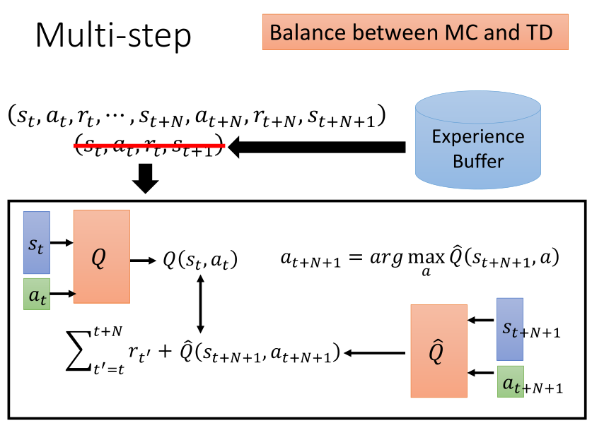

我们怎么在 MC 跟 TD 里面取得一个平衡呢？那我们的做法是这样，在 TD 里面，你只需要存，在某一个 state st，采取某一个 action at，得到 reward rt，还有接下来跳到哪一个 state s(t+1)，但是我们现在可以不要只存一个 step 的 data，我们存 N 个 step 的 data，我们记录在 st 采取 at，得到 rt，会跳到什么样 st，一直纪录到在第 N 个 step 以后，在 s(t+N) 采取 a(t+N) 得到 reward r(t+N)，跳到 s(t+N+1) 的这个经验，通通把它存下来。

实际上你今天在做 update 的时候，在做你 Q network learning 的时候，你的 learning 的方法会是这样，你要让 Q(st, at)，跟你的 target value 越接近越好。而你的 target value 是什么？你的 target value 是会把从时间 t，一直到 t+N 的 N 个 reward 通通都加起来。然后你现在 Q hat 所计算的，不是 s(t+1)，而是 s(t+N+1)，你会把 N 个 step 以后的 state 丢进来，去计算 N 个 step 以后，你会得到的 reward，再加上 multi-step 的 reward，然后希望你的 target value，跟这个 multi-step reward 越接近越好。

那你会发现说这个方法，它就是 MC 跟 TD 的结合，因为它有 MC 的好处跟坏处，也有 TD 的好处跟坏处。

那如果看它的这个好处的话，因为我们现在 sample 了比较多的 step。之前是只 sample 了一个 step，所以某一个 step 得到的 data 是 real 的，接下来都是 Q value 估测出来的，现在 sample 比较多 step，sample N 个 step，才估测 value，所以估测的部分所造成的影响就会比较轻微。当然它的坏处就跟 MC 的坏处一样，因为你的 r 比较多项，你把大 N 项的 r 加起来，你的 variance 就会比较大。但是你可以去调这个 N 的值，去在 variance 跟不精确的 Q 之间取得一个平衡，那这个就是一个 hyper parameter，你要调这个大 N 到底是多少。你是要多 sample 三步，还是多 sample 五步，这个就跟 network structure 是一样，是一个你需要自己调一下的值。

#### Noisy Net

那还有其他的技术，有一个技术是要 improve 这个 exploration 这件事，我们之前讲的 Epsilon Greedy 这样的 exploration，它是在 action 的 space 上面加 noise。

但是有另外一个更好的方法叫做 Noisy Net，它是在参数的 space 上面加 noise。Noisy Net 的意思是说，每一次在一个 episode 开始的时候，在你要跟环境互动的时候，你就把你的 Q function 拿出来，那 Q function 里面其实就是一个 network，你把那个 network 拿出来，在 network 的每一个参数上面，加上一个 Gaussian noise，那你就把原来的 Q function，变成 Q tilde，因为 Q hat 已经用过，Q hat 是那个 target network，我们用 Q tilde 来代表一个 Noisy Q function。

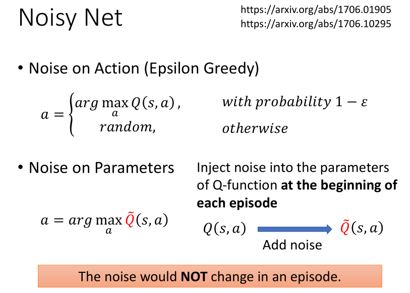

那我们把每一个参数都可能都加上一个 Gaussian noise，你就得到一个新的 network 叫做 Q tilde。

那这边要注意的事情是，我们每次在 sample noise 的时候，要注意在每一个 episode 开始的时候，我们才 sample network。每个 episode 开始的时候，开始跟环境互动之前，我们就 sample network，接下来你就会用这个固定住的 noisy network，去玩这个游戏直到游戏结束，你才重新再去 sample 新的 noise。

那这个方法神奇的地方就是，OpenAI 跟 Deep Mind 又在同时间 propose 一模一样的方法，通通都 publish 在 ICLR 2018，两篇 paper 的方法就是一样的，不一样的地方是，他们用不同的方法，去加 noise。我记得那个 OpenAI 加的方法好像比较简单，他就直接加一个 Gaussian noise 就结束了，就你把每一个参数，每一个 weight，都加一个 Gaussian noise 就结束了。然后 Deep Mind 他们做比较复杂，他们的 noise 是由一组参数控制的，也就是说 network 可以自己决定说，它那个 noise 要加多大。

但是概念就是一样的，总之你就是把你的 Q function 里面的那个 network 加上一些 noise，把它变得跟原来的 Q function 不一样，然后拿去跟环境做互动。那两篇 paper 里面都有强调说，参数虽然会加 noise，但在同一个 episode 里面，你的参数就是固定的，你是在换 episode，玩第二场新的游戏的时候，你才会重新 sample noise，在同一场游戏里面，就是同一个 noisy Q network，在玩那一场游戏，这件事非常重要。

为什么这件事非常重要呢？因为这是 Noisy Net 跟原来的 Epsilon Greedy 或是其他在 action 做 sample 方法本质上的差异。

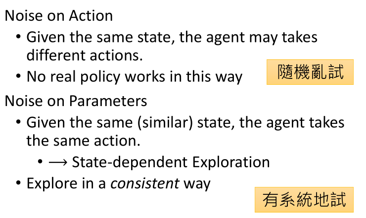

有什么样本质上的差异呢？在原来 sample 的方法，比如说 Epsilon Greedy 里面，就算是给同样的 state，你的 agent 采取的 action，也不一定是一样的。因为你是用 sample 决定的，given 同一个 state，你如果 sample 到说，要根据 Q function 的 network，你会得到一个 action，你 sample 到 random，你会采取另外一个 action。

所以 given 同样的 state，如果你今天是用 Epsilon Greedy 的方法，它得到的 action，是不一样的。但是你想想看，实际上你的 policy，并不是这样运作的，在一个真实世界的 policy，给同样的 state，他应该会有同样的响应，而不是给同样的 state，它其实有时候吃 Q function，然后有时候又是随机的，所以这是一个比较奇怪的，不正常的 action，是在真实的情况下不会出现的 action。

但是如果你是在 Q function 上面去加 noise 的话，就不会有这个情形，在 Q function 的 network 的参数上加 noise，那在整个互动的过程中，在同一个 episode 里面，它的 network 的参数总是固定的。所以看到同样的 state，或是相似的 state，就会采取同样的 action，那这个是比较正常的。

那在 paper 里面有说，这个叫做 state dependent exploration，也就是说你虽然会做 explore 这件事，但是你的 explore 是跟 state 有关系的，看到同样的 state，你就会采取同样的 exploration 的方式。也就是说你在 explore 你的环境的时候，你是用一个比较 consistent 的方式，去测试这个环境，也就是上面你是 noisy 的 action，你只是随机乱试，但是如果你是在参数下加 noise，那在同一个 episode 里面，你的参数是固定的，那你就是有系统地在尝试。每次会试说，在某一个 state，我都向左试试看，然后再下一次在玩这个同样游戏的时候，看到同样的 state，你就说我再向右试试看，你是有系统地在 explore 这个环境。

#### Distributional Q-function

Distributional Q-function，我们就讲大的概念。

Distributional Q-function 我觉得还蛮有道理的，但是它没有红起来，你就发现说没有太多人真的在实作的时候用这个技术，可能一个原因就是，是因为他不好实作。

我们说 Q function 是accumulated reward 的期望值。

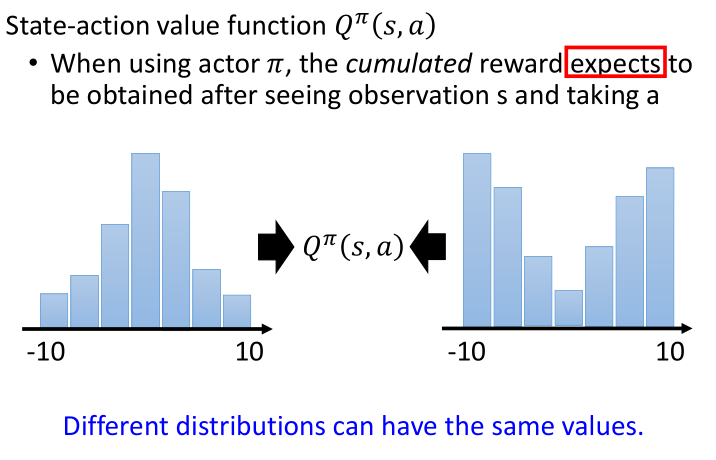

所以我们算出来的这个 Q value 其实是一个期望值，也就是说实际上我在某一个 state 采取某一个 action 的时候，因为环境是有随机性，在某一个 state 采取某一个 action 的时候，实际上我们把所有的 reward 玩到游戏结束，的时候所有的 reward，进行一个统计，你其实得到的是一个 distribution。

也许在 reward 得到 0 的机率很高，在 -10 的机率比较低，在 +10 的机率比较低，它是一个 distribution。

那这个 Q value 代表的值是说，我们对这一个 distribution 算它的 mean，才是这个 Q value，我们算出来是 expected accumulated reward。真正的 accumulated reward 是一个 distribution，对它取 expectation，对它取 mean，你得到了 Q value。

但是有趣的地方是，不同的 distribution，他们其实可以有同样的 mean，也许真正的 distribution 是这个样子，它算出来的 mean 跟这个 distribution 算出来的 mean，其实是一样的，但它们背后所代表的 distribution 是不一样的。

所以今天假设我们只用一个 expected 的 Q value，来代表整个 reward 的话。其实可能是有一些 information 是 loss 的，你没有办法 model reward 的 distribution。

所以今天 Distributional Q function 它想要做的事情是，model distribution。所以怎么做？

在原来的 Q function 里面，假设你只能够采取 a1, a2, a3, 3 个 actions，那你就是 input 一个 state，output 3 个 values，3个 values 分别代表 3 个actions 的 Q value。但是这个 Q value 是一个 distribution 的期望值。

所以今天 Distributional Q function，它的 ideas 就是何不直接 output 那个 distribution。但是要直接 output 一个 distribution 也不知道怎么做，实际上的做法是说，假设 distribution 的值就分布在某一个 range 里面，比如说 -10 到 10，那把 -10 到 10 中间，拆成一个一个的 bin，拆成一个一个的直方图。

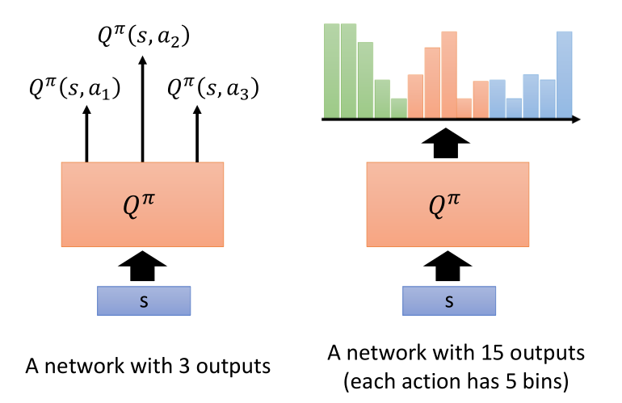

举例来说，在这个例子里面，对我们把 reward 的 space 就拆成 5 个 bin。详细一点的作法就是，假设 reward 可以拆成 5 个 bin 的话，今天你的 Q function 的 output，是要预测你在某一个 state，采取某一个 action，你得到的 reward，落在某一个 bin 里面的机率。所以其实这边的机率的和，这些绿色的 bar 的和应该是 1，它的高度代表说，在某一个 state，采取某一个 action 的时候，它落在某一个 bin 的机率。这边绿色的代表 action 1，红色的代表 action 2，蓝色的代表 action 3。

所以今天你就可以真的用 Q function 去 estimate a1 的 distribution，a2 的 distribution，a3 的 distribution。

那实际上在做 testing 的时候，我们还是要选某一个 action，去执行。那选哪一个 action 呢？实际上在做的时候，它还是选这个 mean 最大的那个 action 去执行。但是假设我们今天可以 model distribution 的话，除了选 mean 最大的以外，也许在未来你可以有更多其他的运用。

举例来说，你可以考虑它的 distribution 长什么样子，若 distribution variance 很大，代表说采取这个 action，虽然 mean 可能平均而言很不错，但也许风险很高。你可以 train一个 network 它是可以规避风险的，就在 2 个 action mean 都差不多的情况下，也许他可以选一个风险比较小的 action 来执行。这是 Distributional Q function 的好处。

那细节，怎么 train 这样的 Q network，我们就不讲，你只要记得说反正 Q network 有办法 output 一个 distribution 就对了。我们可以不只是估测 得到的期望 reward mean 的值，我们其实是可以估测一个 distribution 的。

#### Rainbow

那最后跟大家讲的是一个叫做 rainbow 的技术，这个 rainbow 它的技术是什么呢？

rainbow 这个技术就是，把刚才所有的方法都综合起来就变成 rainbow 。

因为刚才每一个方法，就是有一种自己的颜色，把所有的颜色通通都合起来，就变成 rainbow，我仔细算一下，不是才 6 种方法而已吗？为什么你会变成是 7 色的，也许它把原来的 DQN 也算是一种方法。

那我们来看看这些不同的方法。

这个横轴是你 training process，纵轴是玩了 10 几个 ATARI 小游戏的平均的分数的和，但它取的是 median 的分数，为什么是取 median 不是直接取平均呢？因为它说每一个小游戏的分数，其实差很多，如果你取平均的话，到时候某几个游戏就 dominate 你的结果，所以它取 median 的值。

那这个如果你是一般的 DQN，就是灰色这一条线，没有很强。

那如果是你换 noisy DQN，就强很多，然后如果这边每一个单一颜色的线是代表说只用某一个方法，那紫色这一条线是 DDQN double DQN，DDQN 还蛮有效的，你换 DDQN 就从灰色这条线跳成紫色这一条线，然后 Prioritized DQN， Dueling DQN，还有 Distributional DQN 都蛮强的，它们都差不多很强的。

这边有个 A3C，A3C 其实是 Actor-Critic 的方法。那单纯的 A3C 看起来是比 DQN 强的，这边没有 Multi step 的方法，我猜是因为 A3C 本身内部就有做 Multi step 的方法，所以他可能觉得说有 implement A3C 就算是有 implement，Multi step 的方法，所以可以把这个 A3C 的结果想成是 Multi step 的方法。

最后其实这些方法他们本身之间是没有冲突的，所以全部都用上去，就变成七彩的一个方法，就叫做 rainbow，然后它很高这样。

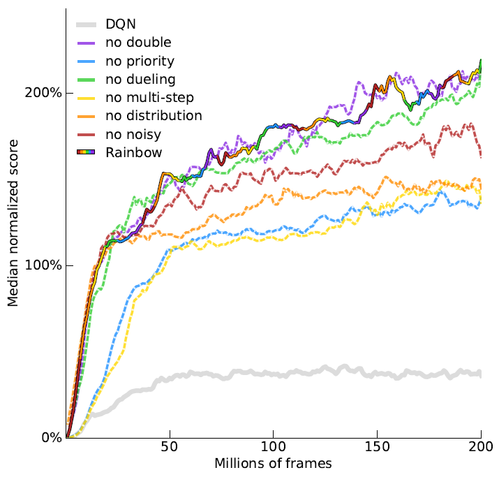

这是下一张图，这张图要说的是什么呢？这张图要说的事情是说，在 rainbow 这个方法里面，如果我们每次拿掉其中一个技术，到底差多少。因为现在是把所有的方法通通倒在一起，发现说进步很多，但会不会有些方法其实是没用的。所以看看说，哪些方法特别有用，哪些方法特别没用，所以这边的虚线就是，拿掉某一种方法以后的结果，那你发现说，拿掉 Multi time step 掉很多，然后拿掉 Prioritized replay，也马上就掉下来，拿掉这个 distribution，它也掉下来。

那这边有一个有趣的地方是说，在开始的时候，distribution 训练的方法跟其他方法速度差不多，但是如果你拿掉 distribution 的时候，你的训练不会变慢，但是你最后 performance，最后会收敛在比较差的地方。

拿掉 Noisy Net，performance 也是差一点，拿掉 Dueling 也是差一点，那发现拿掉 Double，没什么用这样子，拿掉 Double 没什么差，所以看来全部倒再一起的时候，Double 是比较没有影响的。

那其实在 paper 里面有给一个 make sense 的解释说，其实当你有用 Distributional DQN的时候，本质上就不会 over estimate 你的 reward。

因为我们之所以用 Double 是因为，害怕会 over estimate reward ，那在 paper 里面有讲说，如果有做 Distributional DQN，就比较不会有 over estimate 的结果。

事实上他有真的算了一下发现说，它其实多数的状况，是 under estimate reward 的，所以会变成 Double DQN 没有用。

那为什么做Distributional DQN，不会 over estimate reward，反而会 under estimate reward 呢？可能是说，现在这个 distributional DQN，我们不是说它 output 的是一个 distribution 的 range 吗？所以你 output 的那个 range 啊，不可能是无限宽的，你一定是设一个 range，比如说我最大 output range 就是从 -10 到 10，那假设今天得到的 reward 超过 10 怎么办？是 100 怎么办，就当作没看到这件事，所以会变成说，reward 很极端的值，很大的值，其实是会被丢掉的，所以变成说你今天用 Distributional DQN 的时候，你不会有 over estimate 的现象，反而有 under estimate 的倾向。

### Q-Learning for Continuous Actions

那其实跟 policy gradient based 方法比起来，Q learning 其实是比较稳的，policy gradient 其实是没有太多游戏是玩得起来的。policy gradient 比较不稳，尤其在没有 PPO 之前，你很难用 policy gradient 做什么事情，Q learning 相对而言是比较稳的，可以看最早 Deep reinforcement learning 受到大家注意，最早 deep mind 的 paper 拿 deep reinforcement learning 来玩 Atari 的游戏，用的就是 Q-learning。

那我觉得 Q-learning 比较容易，比较好train 的一个理由是，我们说在 Q-learning 里面，你只要能够 estimate 出Q-function，就保证你一定可以找到一个比较好的 policy，也就是你只要能够 estimate 出 Q-function，就保证你可以 improve 你的 policy，而 estimate Q function 这件事情，是比较容易的。

为什么？因为它就是一个 regression 的 problem，在这个 regression 的 problem 里面，你可以轻易地知道，你现在的 model learn 的是不是越来越好，你只要看那个 regression 的 loss 有没有下降，你就知道说你的 model learn 的好不好。

所以 estimate Q function 相较于 learn 一个 policy，是比较容易的，你只要 estimate Q function，就可以保证你现在一定会得到比较好的 policy，所以一般而言 Q learning 是比较容易操作。

那 Q learning 有什么问题呢？它一个最大的问题是，它不太容易处理 continuous action。

#### Continuous Actions

很多时候你的 action 是 continuous 的，什么时候你的 action 会是 continuous 的呢？你的 agent 只需要决定，比如说上下左右，这种 action 是 discrete 的，那很多时候你的 action 是 continuous 的，举例来说假设你的 agent 要做的事情是开自驾车，它要决定说它方向盘要左转几度，，右转几度，这是 continuous 的。假设你的 agent 是一个机器人，它的每一个 action 对应到的就是它的，假设它身上有 50 个 关节，它的每一个 action 就对应到它身上的这 50 个关节的角度，而那些角度，也是 continuous 的。

所以很多时候你的 action，并不是一个 discrete 的东西。它是一个 vector，这个 vector 里面，它的每一个 dimension 都有一个对应的 value，都是 real number，它是 continuous 的。

假设你的 action 是 continuous 的时候，做 Q learning 就会有困难，为什么呢？

因为我们说在做 Q-learning 里面，很重要的一步是，你要能够解这个 optimization 的 problem。你 estimate 出Q function，Q (s, a) 以后，必须要找到一个 a，它可以让 Q (s, a) 最大，假设 a 是 discrete 的，那 a 的可能性都是有限的。举例来说 Atari 的小游戏里面，a 就是上下左右跟开火。它是有限的，你可以把每一个可能的 action 都带到 Q 里面，算它的 Q value。

但是假如 a 是 continuous 的，会很麻烦，你无法穷举所有可能 continuous action 试试看那一个 continuous action 可以让 Q 的 value 最大。所以怎么办呢？就有各种不同的 solution。

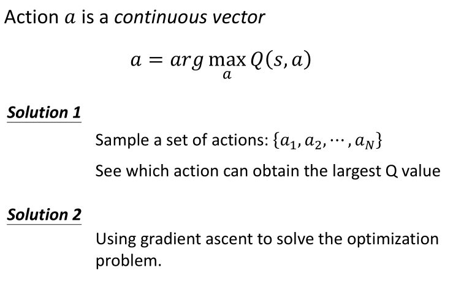

#### Solution 1

第一个 solution 是，假设你不知道怎么解这个问题，因为 a 是很多的，a 是没有办法穷举的，怎么办？用 sample 。

sample 出 N 个 可能的 a，一个一个带到 Q function 里面，那看谁最快。这个方法其实也不会太不  efficient，因为其实你真的在运算的时候，你会用 GPU，所以你一次会把 N 个 continuous action，都丢到 Q function 里面，一次得到 N 个 Q value，然后看谁最大，那当然这个不是一个 非常精确的做法，因为你真的没有办法做太多的 sample，所以你 estimate 出来的 Q value，你最后决定的 action，可能不是非常的精确。

#### Solution 2

第二个 solution 是今天既然我们要解的是一个 optimization 的 problem，你会不会解这种 optimization 的 problem 呢？你其实是会的，因为你其实可以用 gradient decent 的方法，来解这个 optimization 的 problem，我们现在其实是要 maximize 我们的 objective function，所以是 gradient ascent，我的意思是一样的。你就把 a 当作是你的 parameter，然后你要找一组 a 去 maximize 你的 Q function，那你就用 gradient ascent 去 update a 的 value，最后看看你能不能找到一个 a，去 maximize 你的 Q function，也就是你的 objective function。当然这样子你会遇到的问题就是 global maximum ，不见得能够真的找到最 optimal 的结果。而且这个运算量显然很大，因为你要 iterative 的去 update 你的 a，我们 train 一个 network 就很花时间了，今天如果你是用 gradient ascent 的方法来处理这个 continuous 的 problem，等于是你每次要决定要 take 哪一个 action 的时候，你都还要做一次 train network 的 process，这个显然运算量是很大的。

#### Solution 3

第三个 solution 是，特别 design 一个network 的架构，特别 design 你的 Q function，使得解那个 arg max 的 problem，变得非常容易。也就是这边的 Q function 不是一个 general 的 Q function，特别设计一下它的样子，让你要找哪一个 a 可以让这个 Q function 最大的时候，非常容易。

那这边是一个例子，这边有我们的 Q function，然后这个 Q function 它的作法是这样，input 你的 state s，通常它就是一个 image，它可以用一个向量，或是一个 matrix 来表示。

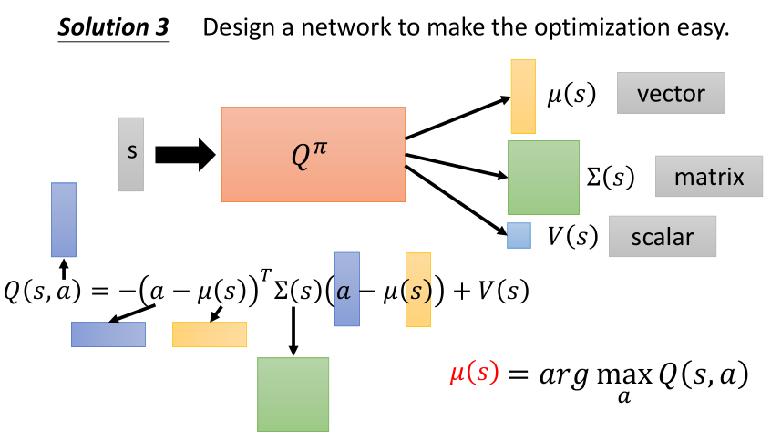

input 这个 s，这个 Q function 会 output 3 个东西，它会 output mu(s)，这是一个 vector，它会 output sigma(s)，是一个 matrix，它会 output V(s)，是一个 scalar。output 这 3 个东西以后，我们知道 Q function 其实是吃一个 s 跟 a，然后决定一个 value。

Q function 意思是说在某一个 state，take 某一个 action 的时候，你 expected 的 reward 有多大，到目前为止这个 Q function 只吃 s，它还没有吃 a 进来。a 在那里呢？当这个 Q function 吐出 mu，sigma 跟 V 的时候，我们才把 s 引入，用 a 跟这 3 个东西互相作用一下，你才算出最终的 Q value。

a 怎么和这 3 个东西互相作用呢？它的作用方法就写在下面，所以实际上 Q (s, a)，你的 Q function 的运作方式是，先 input s，让你得到 mu，sigma 跟 V，然后再 input a，然后接下来的计算方法是把 a 跟 mu 相减。

注意一下 a 现在是 continuous 的 action，所以它也是一个 vector，假设你现在是要操作机器人的话，这个 vector 的每一个 dimension，可能就对应到机器人的某一个关节，它的数值，就是那关节的角度，所以 a 是一个 vector。

把 a 的这个 vector，减掉 mu 的这个 vector，取 transpose，所以它是一个横的 vector，sigma 是一个 matrix，然后 a 减掉 mu(s)，这两个都是 vector，减掉以后还是一个竖的 vector。

然后接下来你把这一个 vector，乘上这个 matrix，再乘上这个 vector，你得到的是什么？你得到是一个 scalar 。

把这个 scalar 再加上 V(s)，得到另外一个 scalar，这一个数值就是你的 Q (s, a)，就是你的 Q value。

假设我们的 Q of (s, a) 定义成这个样子，我们要怎么找到一个 a，去 maximize 这个 Q value 呢？

其实这个 solution 非常简单，因为我们把 formulation 写成这样，那什么样的 a，可以让这一个 Q function 最终的值最大呢？因为a 减 mu 乘上 sigma，再乘上 a 减 mu 这一项一定是正的，然后前面乘上一个负号，所以第一项这个值越小，你最终的这个 Q value 就越大。

因为我们是把 V 减掉第一项，所以第一项，假设不要看这个负号的话，第一项的值越小，最后的 Q value 就越大。

怎么让第一项的值最小呢？你直接把 a 带 mu，让它变成 0，就会让第一项的值最小。

这个东西，就像是那个 Gaussian distribution，所以 mu 就是 Gaussian 的 mean，sigma 就是 Gaussian 的 various，但是 various 是一个 positive definite 的 matrix。所以其实怎么样让这个 sigma，一定是 positive definite 的 matrix 呢？其实在 $Q^\pi$ 里面，它不是直接 output sigma，就如果直接 output 一个 sigma，它可能不见得是 positive definite 的 matrix。它其实是 output 一个 matrix，然后再把那个 matrix 跟另外一个 matrix，做 transpose 相乘，然后可以确保它是 positive definite 的。

这边要强调的点就是说，实际上它不是直接output 一个 matrix，你去那个 paper 里面 check 一下它的 trick，它可以保证说 sigma 是  positive definite 的。

所以今天前面这一项，因为 sigma 是 positive definite，所以它一定是正的。

所以现在怎么让它值最小呢？你就把 a 带 mu(s)。

你把 a 带 mu(s) 以后呢，你可以让 Q 的值最大，所以这个 problem 就解了。

所以今天假设要你 arg max 这个东西，虽然 in general 而言，若 Q 是一个 general function，你很难算，但是我们这边 design 了 Q 这个 function，所以 a 只要设 mu(s)，我们就得到 maximum 的 value，你在解这个 arg max 的 problem 的时候，就变得非常的容易。

所以其实 Q learning 也不是不能够用在 continuous case。

是可以用的，只是就是有一些局限，就是你的 function 就是不能够随便乱设，它必须有一些限制。

#### Solution 4

第 4 招就是不要用 Q-learning，用 Q learning 处理 continuous 的 action 还是比较麻烦。

那到目前为止，我们讲了 policy based 的方法，我们讲了 PPO，讲了 value based 的方法，也就是 Q learning，但是这两者其实是可以结合在一起的，也就是 Actor-Critic 的方法。

## Actor-Critic

在 Actor-Critic 里面，最知名的方法就是 A3C，Asynchronous Advantage Actor-Critic。如果去掉前面这个 Asynchronous，只有 Advantage Actor-Critic，就叫做 A2C。

### Review – Policy Gradient

那我们很快复习一下 policy gradient，在 policy gradient 里面，我们是怎么说的呢？在 policy gradient 里面我们说我们在 update policy 的参数 $θ$的时候，我们是用了以下这个式子，来算出我们的 gradient。

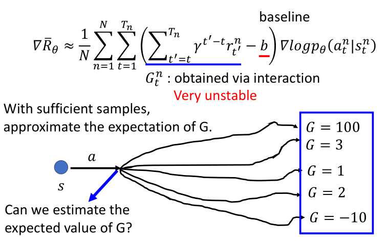

那我们说这个式子其实是还蛮直觉的，这个式子在说什么呢？我们先让 agent 去跟环境互动一下，然后我们知道我们在某一个 state s，采取了某一个 action a，那我们可以计算出在某一个 state s，采取了某一个 action a 的机率。接下来，我们去计算说，从这一个 state 采取这个 action a 之后，accumulated reward 有多大。从这个时间点开始，在某一个 state s，采取了某一个 action a 之后，到游戏结束，互动结束为止，我们到底 collect 了多少的 reward。

那我们把这些 reward，从时间 t 到时间 T 的 reward 通通加起来。

有时候我们会在前面，乘一个 discount factor，因为我们之前也有讲过说，离现在这个时间点比较久远的 action，它可能是跟现在这个 action 比较没有关系的，所以我们会给它乘一个 discount 的 factor，可能设 0.9 或 0.99。

那我们接下来还说，我们会减掉一个 baseline b，减掉这个值 b 的目的，是希望括号这里面这一项，是有正有负的。那如果括号里面这一项是正的，那我们就要增加在这个 state 采取这个 action 的机率，如果括号里面是负的，我们就要减少在这个 state 采取这个 action 的机率。

那我们把这个 accumulated reward，从这个时间点采取 action a，一直到游戏结束为止会得到的 reward，用 G 来表示它。但是问题是 G 这个值啊，它其实是非常的 unstable 的。

为什么会说 G 这个值是非常的 unstable 的呢？因为这个互动的 process，其实本身是有随机性的，所以我们在某一个 state s，采取某一个 action a，然后计算 accumulated reward。每次算出来的结果，都是不一样的，所以 G 其实是一个 random variable，给同样的 state s，给同样的 action a，G 它可能有一个固定的 distribution。但我们是采取 sample 的方式，我们在某一个 state s，采取某一个 action a，然后玩到底，我们看看说我们会得到多少的 reward，我们就把这个东西当作 G。

把 G 想成是一个 random variable 的话，我们实际上做的事情是，对这个 G 做一些 sample，然后拿这些 sample 的结果，去 update 我们的参数。

但实际上在某一个 state s 采取某一个 action a，接下来会发生什么事，它本身是有随机性的，虽然说有个固定的 distribution，但它本身是有随机性的。而这个 random variable，它的 variance，可能会非常的巨大。你在同一个 state 采取同一个 action，你最后得到的结果，可能会是天差地远的。

那今天假设我们在每次 update 参数之前，我们都可以 sample 足够的次数，那其实没有什么问题。

但问题就是，我们每次做 policy gradient，每次 update 参数之前都要做一些 sample，这个 sample 的次数，其实是不可能太多的，我们只能够做非常少量的 sample。那如果你今天正好 sample 到差的结果，比如说你正好 sample 到 G = 100，正好 sample 到 G = -10，那显然你的结果会是很差的。

所以接下来我们要问的问题是，能不能让这整个 training process，变得比较 stable 一点，我们能不能够直接估测，G 这个 random variable 的期望值。

我们在 state s 采取 action a 的时候，我们直接想办法用一个 network去估测在 state s 采取 action a 的时候，你的 G 的期望值。

如果这件事情是可行的，那之后 training 的时候，就用期望值来代替 sample 的值，那这样会让 training 变得比较 stable。

### Review – Q-Learning

那怎么拿期望值代替 sample 的值呢？这边就需要引入 value based 的方法。

value based 的方法我们介绍的就是 Q learning。在讲 Q learning 的时候我们说，有两种 functions，有两种 critics，第一种 critic 我们写作 V，它的意思是说，假设我们现在 actor 是 $ \pi $，那我们拿 $ \pi $ 去跟环境做互动，当今天我们看到 state s 的时候，接下来 accumulated reward 的期望值有多少。

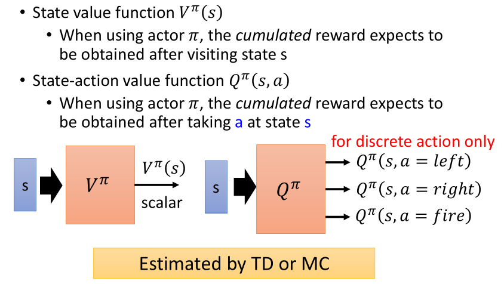

还有另外一个 critic，叫做 Q ，Q 是吃 s 跟 a 当作 input，它的意思是说，在 state s 采取 action a，接下来都用 actor $ \pi $ 来跟环境进行互动，那 accumulated reward 的期望值，是多少。

V input s，output 一个 scalar，Q input s，然后它会给每一个 a 呢，都 assign 一个 Q value。

那 estimate 的时候，你可以用 TD 也可以用 MC。TD 会比较稳，用 MC 比较精确。

### Actor-Critic

那接下来我们要做的事情其实就是，G 这个 random variable，它的期望值到底是什么呢？其实 G 的 random variable 的期望值，正好就是 Q 这样子。

因为这个就是 Q 的定义，Q 的定义就是，在某一个 state s，采取某一个 action a，假设我们现在的 policy，就是 $ \pi $ 的情况下，accumulated reward 的期望值有多大，而这个东西就是 G 的期望值。Q function 的定义，其实就是 accumulated reward 的期望值，就是 G 的期望值。

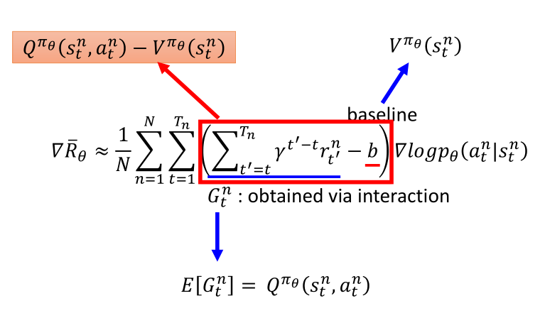

所以我们现在要做的事情就是，假设我们把式子中的G用期望值来代表的话，然后把 Q function 套在这里，就结束了，那我们就可以 Actor 跟 Critic 这两个方法，把它结合起来。

这个其实很直觉。通常一个常见的做法是，就用 value function，来表示 baseline。所谓 value function 的意思就是说，假设现在 policy 是 $ \pi $，在某一个 state s，一直 interact 到游戏结束，那你 expected 的 reward 有多大。 V 没有 involve action，然后 Q 有 involve action。那其实 V 它会是 Q 的期望值，所以你今天把 Q，减掉 V，你的括号里面这一项，就会是有正有负的。

所以我们现在很直觉的，我们就把原来在 policy gradient 里面，括号这一项，换成了 Q function 的 value，减掉 V function 的 value，就结束了。

### Advantage Actor-Critic

那接下来呢，其实你可以就单纯的这么实作，但是如果你这么实作的话，他有一个缺点是，你要 estimate 两个 networks，而不是一个 network，你要 estimate Q 这个 network，你也要 estimate V 这个 network，那你现在就有两倍的风险，你有estimate 估测不准的风险就变成两倍，所以我们何不只估测一个 network 就好了呢？

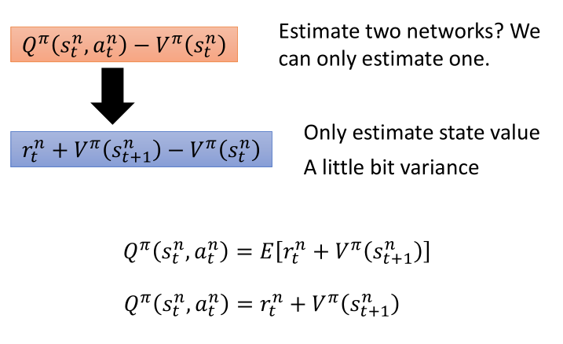

事实上在这个 Actor-Critic 方法里面，你可以只估测 V 这个 network。你可以把 Q 的值，用 V 的值来表示。什么意思呢？

现在其实 Q(s, a) 呢，它可以写成 r + V(s) 的期望值。当然这个 r 这个本身，它是一个 random variable，就是你今天在 state s，你采取了 action a，接下来你会得到什么样的 reward，其实是不确定的，这中间其实是有随机性的。所以小 r 呢，它其实是一个 random variable，所以要把右边这个式子，取期望值它才会等于 Q function。但是，我们现在把期望值这件事情去掉，就当作左式等于右式，就当作 Q function 等于 r 加上 state value function。

然后接下来我们就可以把这个 Q function，用 r + V 取代掉。变成$r_{t}^{n}+V^{\pi}\left(s_{t+1}^{n}\right)-V^{\pi}\left(s_{t}^{n}\right)$

如果大家可以接受这个想法，因为这个其实也是很直觉。

因为我们说 Q function 的意思就是在 state s 采取 action a 的时候，接下来会得到 reward 的期望值，那接下来会得到 reward 的期望值怎么算呢？我们现在在 state st，然后我们采取 action at，然后我们想要知道说，接下来会得到多少 reward，那接下来会发生什么事呢？接下来你会得到 reward rt，然后跳到 state s(t+1)，那在 state s 采取 action a 得到的 reward，其实就是等于接下来得到 reward rt，加上从 state s(t+1) 开始，得到接下来所有 reward 的总和。

而从 state s(t+1) 开始，得到接下来所有 reward 的总和，就是 $V^{\pi}\left(s_{t+1}^{n}\right)$，那在 state st 采取 action at 以后得到的 reward rt，就写在这个地方，所以这两项加起来，会等于 Q function。那为什么前面要取期望值呢？因为你在 st 采取 action at 会得到什么样的 reward，跳到什么样的 state 这件事情，本身是有随机性的，不见得是你的 model 可以控制的，为了要把这随机性考虑进去，前面你必须加上期望值。

但是我们现在把这个期望值拿掉就说他们两个是相等的，把 Q 替换掉。

这样的好处就是，你不需要再 estimate Q 了，你只需要 estimate V 就够了，你只要 estimate 一个 network 就够了。但这样的坏处是什么呢？这样你引入了一个随机的东西，r 现在，它是有随机性的，它是一个 random variable。但是这个 random variable，相较于刚才的 G，accumulated reward 可能还好，因为它是某一个 step 会得到的 reward，而 G 是所有未来会得到的 reward 的总和，G variance 比较大，r 虽然也有一些 variance，但它的 variance 会比 G 还要小，所以把原来 variance 比较大的 G，换成现在只有 variance 比较小的 r 这件事情也是合理的。

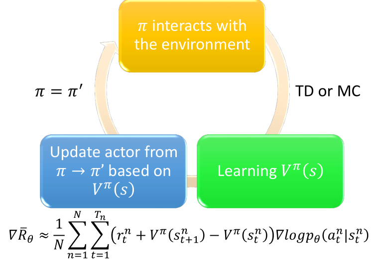

那如果你不相信的话，如果你觉得说什么期望值拿掉不相信的话，那我就告诉你原始的 A3C paper，它试了各式各样的方法，最后做出来就是这个最好。当然你可能说，搞不好 estimate Q 跟 V 也都 estimate 很好。那我给你的答案就是做实验的时候，最后结果就是这个最好。所以后来大家都用这个。

所以那这整个流程就是这样。

前面这个式子叫做 advantage function，所以这整个方法就叫 Advantage Actor-Critic。

整个流程是这样子的，我们现在先有一个 $ \pi $，有个初始的 actor 去跟环境做互动，先收集资料，在每一个 policy gradient 收集资料以后，你就要拿去 update 你的 policy。但是在 actor critic 方法里面，你不是直接拿你的那些数据，去 update 你的 policy。你先拿这些资料去 estimate 出 value function。

假设你是用别的方法，你有时候可能也需要 estimate Q function，那我们这边是 Advantage Actor-Critic，我们只需要 value function 就好，我们不需要 Q function。你可以用 TD，也可以用 MC，你 estimate 出 value function 以后，接下来，你再 based on value function，套用下面这个式子去 update 你的 $ \pi $，然后你有了新的 $ \pi $ 以后，再去跟环境互动，再收集新的资料，去 estimate 你的 value function，然后再用新的 value function，去 update 你的 policy，去 update 你的 actor。

整个 actor-critic 的 algorithm，就是这么运作的。

#### Tips

implement Actor-Critic 的时候，有两个几乎一定会用的 tip。

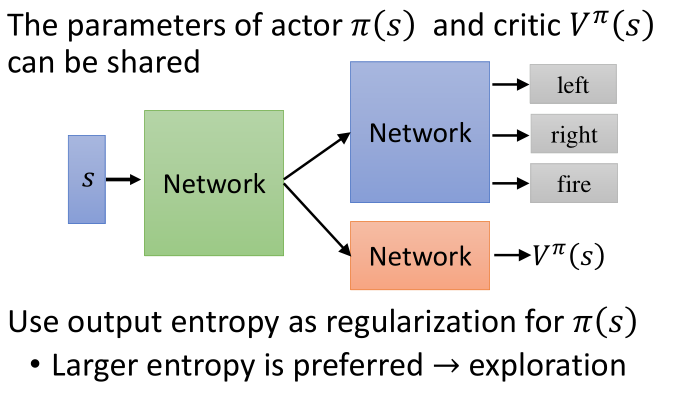

第一个 tip 是，我们现在说，我们其实要 estimate 的 network 有两个，我们只要 estimate V function，而另外一个需要 estimate 的 network，是 policy 的 network，也就是你的 actor。那这两个 network，那个 V 那个 network 它是 input 一个 state，output 一个 scalar。然后 actor 这个 network，它是 input 一个 state，output 就是一个 action 的 distribution。假设你的  action 是 discrete 不是 continuous 的话。如果是 continuous 的话，它也是一样，如果是 continuous 的话，就只是 output 一个 continuous 的 vector。这边是举 discrete 的例子，但是 continuous 的 case，其实也是一样的。

input 一个 state，然后它要决定你现在要 take 那一个 action，那这两个 network，这个 actor 跟你的 critic，跟你的 value function，它们的 input 都是 s，所以它们前面几个 layer，其实是可以 share 的。尤其是假设你今天是玩 ATARI 游戏，或者是你玩的是那种什么 3D 游戏，那 input 都是 image，那 input 那个 image 都非常复杂，通常你前面都会用一些 CNN 来处理，把那些 image 抽成 high level 的 information。把那个 pixel level 到 high level information 这件事情，其实对 actor 跟 critic 来说可能是可以共享的。

所以通常你会让这个 actor 跟 critic 的前面几个 layer 是 shared，你会让 actor 跟 critic 的前面几个 layer 共享同一组参数，那这一组参数可能是 CNN，先把 input 的 pixel，变成比较high level 的信息，然后再给 actor 去决定说它要采取什么样的行为，给这个 critic，给 value function，去计算 expected 的 return，也就是 expected reward。

那另外一个事情是，我们一样需要 exploration 的机制。那我们之前在讲 Q learning 的时候呢，我们有讲过 exploration 这件事是很重要的。

那今天在做 Actor-Critic 的时候呢，有一个常见的 exploration 的方法是你会对你的 $ \pi $ 的 output 的这个 distribution，下一个 constrain。

这个 constrain 是希望这个 distribution 的 entropy 不要太小，希望这个 distribution 的 entropy 可以大一点，也就是希望不同的 action，它的被采用的机率平均一点，这样在 testing 的时候，才会多尝试各种不同的 action，才会把这个环境探索的比较好，explore 的比较好，才会得到比较好的结果，这个是 advantage 的 Actor-Critic。

### Asynchronous Advantage Actor-Critic (A3C)

那接下来什么东西是 Asynchronous Advantage Actor-Critic 呢？因为 reinforcement learning 它的一个问题，就是它很慢，那怎么增加训练的速度呢？

A3C 这个方法的精神，同时开很多个 worker，那每一个 worker 其实就是一个分身，那最后这些分身会把所有的经验，通通集合在一起。

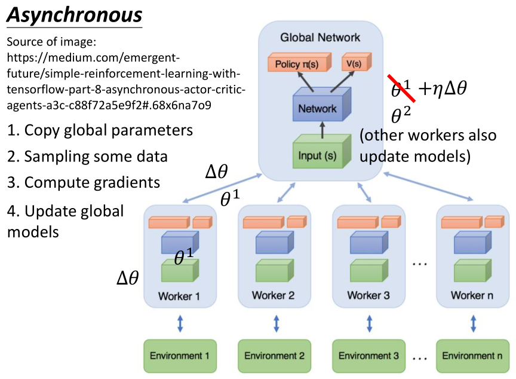

这个 A3C 是怎么运作的呢？首先，当然这个你可能自己实作的时候，你如果没有很多个 CPU，你可能也是不好做。

那 A3C 是这样子，一开始有一个 global network，那我们刚才有讲过说，其实 policy network 跟 value network 是 tie 在一起的，他们的前几个 layer 会被 tie 一起。我们有一个 global network，它们有包含 policy 的部分，有包含 value 的部分，假设他的参数就是 θ1。你会开很多个 worker，那每一个 worker 就用一张 CPU 去跑，比如你就开 8 个 worker 那你至少 8 张 CPU。那第一个 worker 呢，就去跟 global network 进去把它的参数 copy 过来，每一个  work 要工作前就把他的参数 copy 过来，接下来你就去跟环境做互动，那每一个 actor 去跟环境做互动的时候，为了要 collect 到比较 diverse 的 data，所以举例来说如果是走迷宫的话，可能每一个 actor 它出生的位置起始的位置都会不一样，这样他们才能够收集到比较多样性的 data。

每一个 actor 就自己跟环境做互动，互动完之后，你就会计算出 gradient，那计算出 gradient 以后，你要拿 gradient 去 update global network 的参数。（图中应该是倒三角形）。这个 worker，它算出 gradient 以后，就把 gradient 传回给中央的控制中心，然后中央的控制中心，就会拿这个 gradient，去 update 原来的参数。但是要注意一下，所有的 actor，都是平行跑的，就每一个 actor 就是各做各的，互相之间就不要管彼此，就是各做各的，所以每个人都是去要了一个参数以后，做完它就把它的参数传回去，做完就把参数传回去，所以，当今天第一个 worker 做完，想要把参数传回去的时候，本来它要的参数是 θ1，等它要把 gradient 传回去的时候，可能别人 已经把原来的参数覆盖掉，变成 θ2了，但是没有关系，就不要在意这种细节，它一样会把这个 gradient 就覆盖过去就是了，这个 Asynchronous actor-critic 就是这么做的。

### Pathwise Derivative Policy Gradient

那在讲 A3C 之后，我们要讲另外一个方法叫做，Pathwise Derivative Policy Gradient。

#### Another Way to use Critic

这个方法很神奇，它可以想成是 Q learning 解 continuous action 的一种特别的方法。它也可以想成是一种特别的 Actor-Critic 的方法。

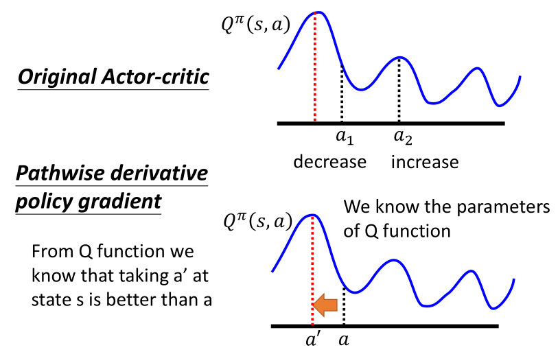

一般的这个 Actor-Critic 里面那个 critic，就是 input state 或 input state 跟 action 的 pair，然后给你一个 value，然后就结束了，所以对 actor 来说它只知道说现在，它做的这个行为，到底是好还是不好，但是，如果是 Pathwise derivative policy gradient 里面，这个 critic 会直接告诉 actor 说，采取什么样的 action，才是好的。critic 会直接引导 actor 做什么样的 action，才是可以得到比较大的 value 的。

那如果今天从这个 Q learning 的观点来看，我们之前说，Q learning 的一个问题是，你没有办法在用 Q learning 的时候，考虑 continuous vector，其实也不是完全没办法，就是比较麻烦，比较没有 general solution。

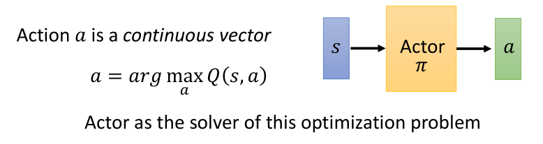

那今天我们其实可以说，我们怎么解这个 optimization problem 呢？我们用一个 actor 来解这个 optimization 的 problem。所以我们本来在 Q learning 里面，如果是一个 continuous action，我们要解这个 optimization problem，现在这个 optimization problem由 actor 来解，我们假设 actor 就是一个 solver，这个 solver 它的工作就是，给你 state s，然后它就去解解解告诉我们说，那一个 action，可以给我们最大的 Q value，这是从另外一个观点来看，Pathwise derivative policy gradient 这件事情。

那这个说法，你有没有觉得非常的熟悉呢？我们在讲 GAN 的时候，不是也讲过一个说法，我们说，我们 learn 一个 discriminator，它是要 evaluate 东西好不好，discriminator 要自己生东西，非常的困难，那怎么办？因为要解一个 Arg Max 的 problem，非常的困难，所以用 generator 来生，所以今天的概念其实是一样的。Q 就是那个 discriminator，要根据这个 discriminator 决定 action 非常困难，怎么办？另外 learn 一个 network，来解这个 optimization problem，这个东西就是 actor。所以今天是从两个不同的观点，其实是同一件事。从两个不同的观点来看，一个观点是说，原来的 Q learning 我们可以加以改进，怎么改进呢？我们 learn 一个 actor 来决定 action，以解决 Arg Max 不好解的问题。或换句话说，或是另外一个观点是，原来的 actor-critic 的问题是，critic 并没有给 actor 足够的信息，它只告诉它好或不好，没有告诉它说什么样叫好，那现在有新的方法可以直接告诉 actor 说，什么样叫做好。

那我们就实际讲一下它的 algorithm，那其实蛮直觉的。

就假设我们 learn 了一个 Q function，假设我们 learn 了一个 Q function，Q function 就是 input s 跟 a，output 就是 Q(s, a)。

那接下来呢，我们要 learn 一个 actor，这个 actor 的工作是什么，这个 actor 的工作就是，解这个 Arg Max 的 problem，这个 actor 的工作，就是 input 一个 state s，希望可以 output 一个 action a，这个 action a 被丢到 Q function 以后，它可以让 Q(s, a) 的值，越大越好，那实际上在 train 的时候，你其实就是把 Q 跟 actor 接起来，变成一个比较大的 network，Q 是一个 network，input s 跟 a，output 一个 value。那 actor 它在 training 的时候，它要做的事情就是 input s，output a，把 a 丢到 Q 里面，希望 output 的值越大越好。在 train 的时候会把 Q 跟 actor 直接接起来，当作是一个大的 network，然后你会 fix 住 Q 的参数，只去调 actor 的参数，就用 gradient ascent 的方法，去 maximize Q 的 output。

这个东西你有没有觉得很熟悉呢？这就是 conditional GAN，Q 就是 discriminator，但在 reinforcement learning 就是 critic，actor 在 GAN 里面它就是 generator，其实就是同一件事情。

那我们来看一下这个，Pathwise derivative policy gradient 的演算法，一开始你会有一个 actor $ \pi $，它去跟环境互动，然后，你可能会要它去 estimate Q value，estimate 完 Q value 以后，你就把 Q value 固定，只去update 那个 actor。

假设这个 Q 估得是很准的，它真的知道说，今天在某一个 state 采取什么样的 action，会真的得到很大的 value，

actor learning 的方向，就是希望actor 在 given s 的时候 output，采取了 a，可以让最后 Q function 算出来的 value 越大越好。

你用这个 criteria，去 update 你的 actor $ \pi $，然后接下来有新的 $ \pi $ 再去跟环境做互动，然后再 estimate Q，然后再得到新的 $ \pi $，去 maximize Q 的 output。

那其实本来在 Q learning 里面，你用得上的技巧，在这边也几乎都用得上，比如说 replay buffer，exploration 等等，这些都用得上。

##### Q-Learning Algorithm

这个是原来 Q learning 的 algorithm，你有一个 Q function，那你会有另外一个 target 的 Q function，叫做 Q hat。

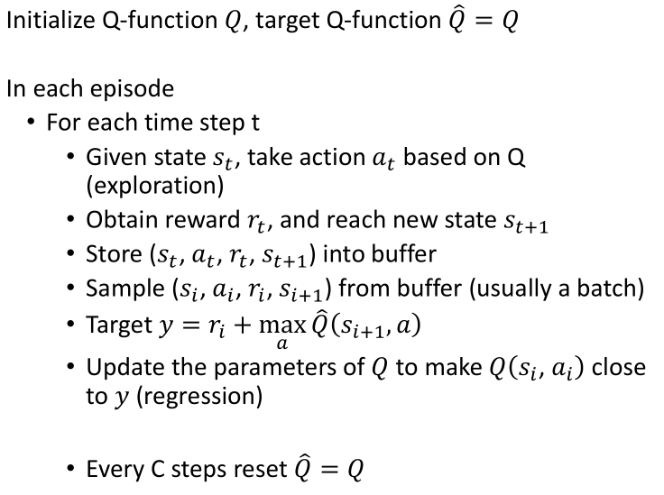

在每一个 episode 里面，在每一个 episode 的每一个 time step 里面，你会看到一个 state st，你会 take 某一个 action at，那至于 take 哪一个 action，是由 Q function 所决定的。因为解一个 Arg Max 的 problem，如果是 discrete 的话没有问题，你就看说哪一个 a 可以让 Q 的 value 最大，就 take 那一个 action。那你需要加一些 exploration，这样 performance 才会好，你会得到 reward rt，跳到新的 state s(t+1)，你会把 st, at, rt, s(t+1) 塞到你的 buffer 里面去。你会从你的 buffer 里面 sample 一个 batch 的 data，这个 batch data 里面，可能某一笔是 si, ai, ri, s(i+1)。接下来你会算一个 target，这个 target 叫做 y，y 是 ri 加上你拿你的 target Q function 过来，拿你的 Q function 过来，去计算 target 的 Q function，input 那一个 a 的时候，它的 value 会最大，你把这个 target Q function 算出来的 Q value 跟 r 加起来，你就得到你的 target y，然后接下来你怎么 learn 你的 Q 呢？你就希望你的 Q function，在带 si 跟 ai 的时候，跟 y 越接近越好，这是一个 regression 的 problem。最后，每 t 个 step，你要把 Q hat 用 Q 替代掉。

##### Pathwise Derivative Policy Gradient

接下来我们把它改成，Pathwise Derivative  Policy Gradient。

这边就是只要做四个改变就好。

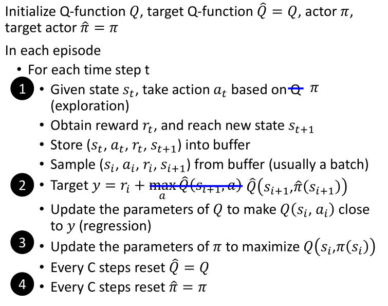

第一个改变是，你要把 Q 换成 $ \pi $。本来是用 Q 来决定在 state st，产生那一个 action at，现在是直接用 $ \pi $，我们不用再解 Arg Max 的 problem 了，我们直接 learn 了一个 actor，这个 actor input st，就会告诉我们应该采取哪一个 at。所以本来 input st，采取哪一个 at，是 Q 决定的，在 Pathwise Derivative  Policy Gradient 里面，我们会直接用 $ \pi $ 来决定，这是第一个改变。

第二个改变是，本来这个地方是要计算在 s(t+1)，根据你的 policy，采取某一个 action a，会得到多少的 Q value，那你会采取的 action a，就是看说哪一个 action a 可以让 Q hat 最大，你就会采取那个 action a。这就是你为什么把式子写成这样。

那现在因为我们其实不好解这个 Arg Max 的 problem，所以 Arg Max problem，其实现在就是由 policy $ \pi $ 来解了，所以我们就直接把 s(t+1)，带到 policy $ \pi $ 里面。那你就会知道说，现在 given s(t+1)，哪一个 action 会给我们最大的 Q value，那你在这边就会 take 那一个 action。

这边还有另外一件事情要讲一下，我们原来在 Q function 里面，我们说，有两个 Q network，一个是真正的 Q network，另外一个是 target Q network，实际上你在 implement 这个 algorithm 的时候，你也会有两个 actor，你会有一个真正要 learn 的 actor $ \pi $，你会有一个 target actor $ \hat \pi $，这个原理就跟，为什么要有 target Q network 一样，我们在算 target value 的时候，我们并不希望它一直的变动，所以我们会有一个 target 的 actor，跟一个 target 的 Q function，那它们平常的参数，就是固定住的，这样可以让你的这个 target，它的 value 不会一直的变化。

所以本来到底是要用哪一个 action a，你会看说哪一个 action a，可以让 Q hat 最大。但是现在，因为哪一个 action a 可以让 Q hat 最大这件事情，已经被直接用那个 policy 取代掉了，所以我们要知道哪一个 action a 可以让 Q hat 最大，就直接把那个 state带到 $ \hat \pi $ 里面，看它得到哪一个 a，就用那一个 a。那一个 a 就是会让 Q hat of (s, a) 的值最大的那个 a 。

其实跟原来的这个 Q learning 也是没什么不同，只是原来 Max a 的地方，通通都用 policy 取代掉就是了。

第三个不同就是，之前只要 learn Q，现在你多 learn 一个 $ \pi $，那 learn $ \pi $ 的时候的方向是什么呢？learn $ \pi $ 的目的，就是为了 Maximize Q function，希望你得到的这个 actor，它可以让你的 Q function output 越大越好，这个跟 learn GAN 里面的 generator 的概念，其实是一样的。

第四个 step，就跟原来的 Q function 一样，你要把 target 的 Q network 取代掉，你现在也要把 target policy 取代掉。

#### Connection with GAN

那其实确实 GAN 跟 Actor-Critic 的方法是非常类似的。

那我们这边就不细讲，你可以去找到一篇 paper 叫 Connecting Generative Adversarial Network and Actor-Critic Method。

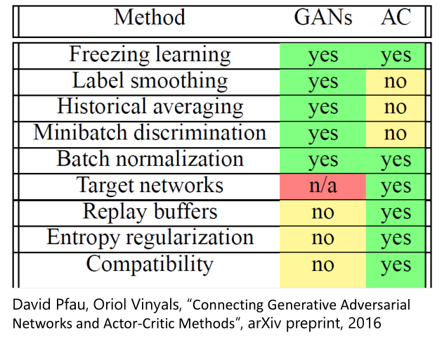

那知道 GAN 跟 Actor-Critic 非常像有什么帮助呢？一个很大的帮助就是 GAN 跟 Actor-Critic 都是以难 train 而闻名的。所以在文献上就会收集 develop 的各式各样的方法，告诉你说怎么样可以把 GAN train 起来，怎么样可以把 Actor-Critic train 起来，但是因为做 GAN 跟 Actor-Critic 的其实是两群人，所以这篇 paper 里面就列出说在 GAN 上面，有哪些技术是有人做过的，在 Actor-Critic 上面，有哪些技术是有人做过的。

但是也许在 GAN 上面有试过的技术，你可以试着 apply 在 Actor-Critic 上，在 Actor-Critic 上面做过的技术，你可以试着 apply 在 GAN 上面，看看 work 不 work。

这个就是 Actor-Critic 和 GAN 之间的关系，可以带给我们的一个好处，那这个其实就是 Actor-Critic。

## Sparse Reward

我们稍微讲一下 sparse reward problem。

sparse reward 是什么意思呢？就是实际上当我们在用 reinforcement learning learn agent 的时候，多数的时候 agent 都是没有办法得到 reward 的。

在没有办法得到 reward 的情况下，对 agent 来说它的训练是非常困难的。假设你今天要训练一个机器手臂，然后桌上有一个螺丝钉跟螺丝起子，那你要训练他用螺丝起子把螺丝钉栓进去，那这个很难，为什么？因为你知道一开始你的 agent，它是什么都不知道的，它唯一能够做不同的 action 的原因，是因为 exploration。举例来说你在做 Q learning 的时候，你会有一些随机性，让它去采取一些过去没有采取过的 action，那你要随机到说它把螺丝起子捡起来，再把螺丝栓进去，然后就会得到 reward 1，这件事情是永远不可能发生的。所以你会发现，不管今天你的 actor 它做了什么事情，它得到 reward 永远都是 0，对它来说不管采取什么样的 action，都是一样糟或者是一样的好，所以它最后什么都不会学到。

所以今天如果你环境中的 reward 非常的 sparse，那这个 reinforcement learning 的问题，就会变得非常的困难。对人类来说，人类很厉害，人类可以在非常 sparse 的 reward 上面去学习，就我们的人生通常多数的时候我们就只是活在那里，都没有得到什么 reward 或者是 penalty，但是人还是可以采取各种各式各样的行为。所以，一个真正厉害的人工智能，它应该能够在 sparse reward 的情况下，也学到要怎么跟这个环境互动。

所以，接下来我想要跟大家很快的，非常简单的介绍，就是一些handle sparse reward 的方法。

### Reward Shaping

那怎么解决 sparse reward 的这件事情呢？我们会讲三个方向。

第一个方向叫做 reward shaping。reward shaping 是什么意思呢？

reward shaping 的意思是说，环境有一个固定的 reward，它是真正的 reward，但是我们为了引导 machine，为了引导 agent，让它学出来的结果是我们要的样子，developer 就是我们人类，刻意的去设计了一些 reward，来引导我们的 agent。

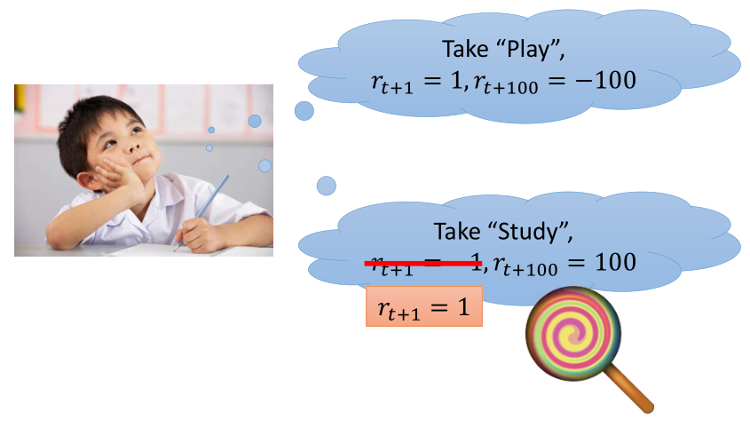

举例来说，如果是把小孩当作一个 agent 的话，那一个小孩，他可以 take 两个 actions，一个 action 是他可以出去玩，那他出去玩的话，在下一秒钟它会得到 reward 1，但是他可能在月考的时候，成绩会很差，所以，在 100 个小时之后呢，他会得到 reward -100。他也可以决定他要念书，然后在下一个时间，因为他没有出去玩，所以他觉得很不爽，所以他得到 reward -1。但是在 100 个小时后，他可以得到 reward 100。对一个小孩来说，他可能就会想要 take play，而不是 take study。因为今天我们虽然说，我们计算的是 accumulated reward，但是也许对小孩来说，他的 discount factor 很大这样。所他就不太在意未来的 reward，而且也许因为他是一个小孩，他还没有很多 experience，所以，他的 Q function estimate 是非常不精准的，所以要他去 estimate 很遥远以后，会得到的 accumulated reward，他其实是预测不出来的。

所以怎么办呢？这时候大人就要引导他，怎么引导呢？就骗他说，如果你坐下来念书我就给你吃一个棒棒糖。

所以对他来说，下一个时间点会得到的 reward 就变成是 positive 的，所以他就觉得说，也许 take 这个 study 是比 play 好的，虽然实际上这并不是真正的 reward，而是其他人去骗他的 reward，告诉他说你采取这个 action是好的，所以我给你一个 reward，虽然这个不是环境真正的 reward。

reward shaping 的概念是一样的，简单来说，就是你自己想办法 design 一些 reward，他不是环境真正的 reward，在玩 ATARI 游戏里面，真的 reward 是那个游戏的主机给你的 reward。但是你自己去设一些 reward，好引导你的 machine，做你想要它做的事情。

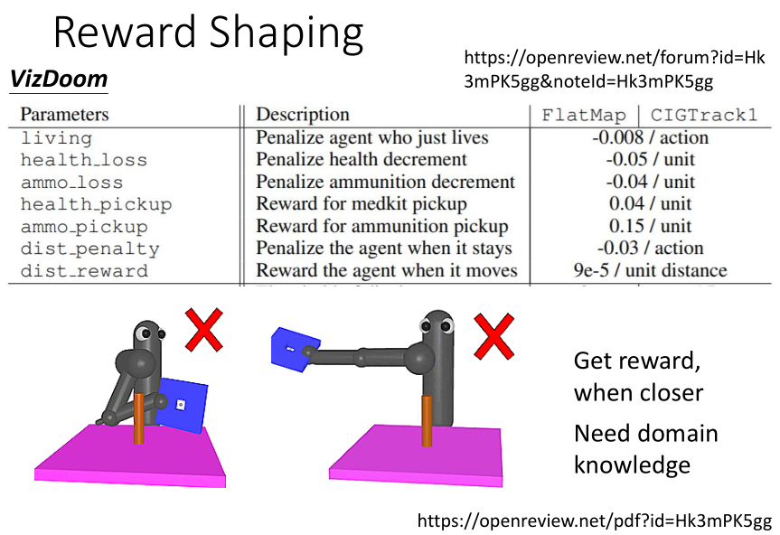

#### Curiosity

接下来介绍各种你可以自己加进去，In general 看起来是有用的 reward，举例来说，一个技术是，给 machine 加上 curiosity，给它加上好奇心，所以叫 curiosity driven 的 reward。

那这个是我们之前讲 Actor-Critic 的时候看过的图，我们有一个 reward function，它给你某一个 state，给你某一个 action，它就会评断说，在这个 state 采取这个 action 得到多少的 reward。

那我们当然是希望 total reward 越大越好，那在 curiosity driven 的这种技术里面，你会加上一个新的 reward function，这个新的 reward function 叫做 ICM，Intrinsic curiosity module，它就是要给机器加上好奇心。

这个 ICM，它会吃 3 个东西，它会吃 state s1，它会吃 action a1 跟 state s2，根据 s1, a1, a2，它会 output 另外一个 reward，我们这边叫做 r1(i)，那你最后你的 total reward，对 machine 来说，total reward 并不是只有 r 而已，还有 r(i)，它不是只有把所有的 r 都加起来，他把所有 r(i) 加起来当作 total reward，所以，它在跟环境互动的时候，它不是只希望 r 越大越好，它还同时希望 r(i) 越大越好，它希望从 ICM 的 module 里面，得到的 reward 越大越好。

那这个 ICM 呢，它就代表了一种 curiosity。

那怎么设计这个 ICM 让它变成一种，让它有类似这种好奇心的功能呢？

##### Intrinsic Curiosity Module

这个是最原始的设计。这个设计是这样，我们说 curiosity module 就是 input 3 个东西。input 现在的 state，input 在这个 state 采取的 action，然后接下来 input 下一个 state s(t+1)，然后接下来会 output 一个 reward, r(i)，那这个 r(i) 怎么算出来的呢？

在 ICM 里面，你有一个 network，这个 network 会 take a(t) 跟 s(t)，然后去 output s(t+1) hat，也就是这个 network 做的事情，是根据 a(t) 跟 s(t)，去 predict 接下来我们会看到的 s(t+1) hat。

你会根据现在的 state，跟在现在这个 state 采取的 action，我们有另外一个 network 去预测，接下来会发生什么事。

接下来再看说，machine 自己的预测，这个 network 自己的预测，跟真实的情况像不像，越不像，那越不像那得到的 reward 就越大。

所以今天这个 reward 呢，它的意思是说，如果今天未来的 state，越难被预测的话，那得到的 reward 就越大。这就是鼓励 machine 去冒险，现在采取这个 action，未来会发生什么事，越没有办法预测的话，那这个 action 的 reward 就大。

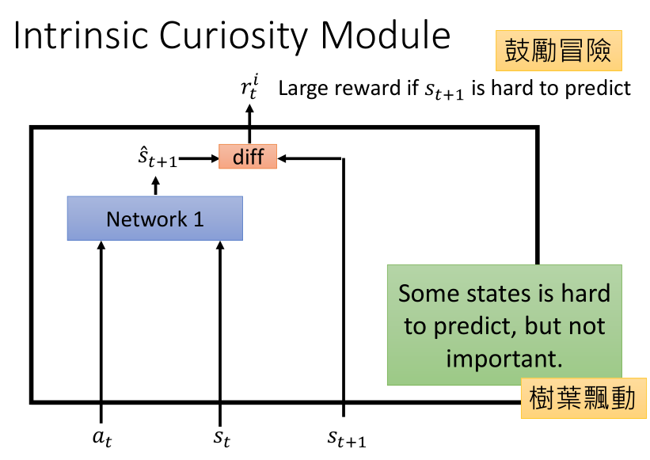

所以，machine 如果有这样子的 ICM，它就会倾向于采取一些风险比较大的 action。它想要去探索未知的世界，想要去看看说，假设某一个 state，是它没有办法预测，假设它没有办法预测未来会发生什么事，它会特别去想要采取那种 state，可以增加 machine exploration 的能力。

那这边这个 network 1，其实是另外 train 出来的。在 training 的时候，你会给它 at, st, s(t+1)，然后让这个 network 1 去学说 given at, st，怎么 predict s(t+1) hat。

apply 到 agent 互动的时候，这个 ICM module，其实要把它 fix 住。

其实，这一整个想法里面，是有一个问题的，这个问题是什么呢？这个问题是，某一些 state，它很难被预测，并不代表它就是好的，它就应该要去被尝试的。

所以，今天光是告诉 machine，鼓励 machine 去冒险是不够的，因为如果光是只有这个 network 的架构，machine 只知道说什么东西它无法预测，如果在某一个 state 采取某一个 action，它无法预测接下来结果，它就会采取那个 action，但并不代表这样的结果一定是好的。

举例来说，可能在某个游戏里面，背景会有树叶飘动，那也许树叶飘动这件事情，是很难被预测的，对 machine 来说它在某一个 state 什么都不做，看着树叶飘动，然后，发现这个树叶飘动是没有办法预测的，接下来它就会一直站在那边，看树叶飘动。

所以说，光是有好奇心是不够的，还要让它知道说，什么事情是真正重要的。那怎么让 machine 真的知道说什么事情是真正重要的，而不是让它只是一直看树叶飘动呢？

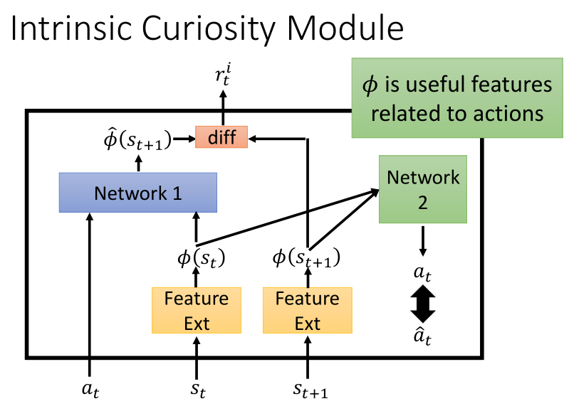

你要加上另外一个 module，我们要 learn 一个 feature 的 extractor，这个黄色的格子代表 feature extractor，它是 input 一个 state，然后 output 一个 feature vector，代表这个 state。

那我们现在期待的是，这个 feature extractor 可以做的事情是把 state 里面没有意义的东西把它滤掉，比如说风吹草动，白云的飘动，树叶的飘动这种，没有意义的东西直接把它滤掉。假设这个 feature extractor，真的可以把无关紧要的东西，滤掉以后，那我们的 network 1 实际上做的事情是，给它一个 actor，给他一个 state s1 的 feature representation，让它预测，state s(t+1) 的 feature representation，然接下来我们再看说，这个预测的结果，跟真正的 state s(t+1) 的 feature representation 像不像。越不像，reward 就越大。

接下来的问题就是，怎么 learn 这个 feature extractor 呢？让这个 feature extractor 它可以把无关紧要的事情滤掉呢？这边的 learn 法就是，learn 另外一个 network 2，这个 network 2 它是吃这两个 vector 当做 input，然后接下来它要 predict action a ，然后它希望这个 action a，跟真正的 action a越接近越好（这里这个 a 跟 a hat 应该要反过来，预测出来的东西我们用 hat 来表示，真正的东西没有 hat，这样感觉比较对）。

所以这个 network 2，它会 output 一个 action。根据 state st 的 feature 跟 state s(t+1) 的 feature， output 从 state st，跳到 state s(t+1)，要采取哪一个 action，才能够做到。希望这个action 跟真正的 action，越接近越好。

那加上这个 network 的好处就是，因为这两个东西要拿去预测 action，所以，今天我们抽出来的 feature，就会变成是跟 action，跟预测 action 这件事情是有关的。

所以，假设是一些无聊的东西，是跟 machine 本身采取的 action 无关的东西，风吹草动或是白云飘过去，是 machine 自己要采取的 action 无关的东西，那就会被滤掉，就不会被放在抽出来的 vector representation 里面。

### Curriculum Learning

Curriculum learning 不是 reinforcement learning 所独有的概念，那其实在很多 machine learning，尤其是 deep learning 里面，你都会用到 Curriculum learning 的概念。

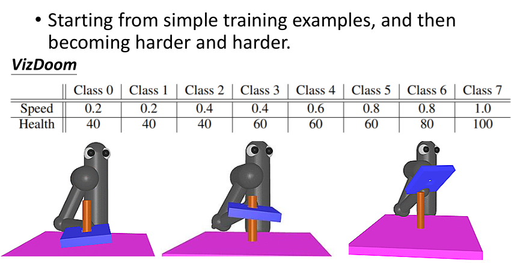

所谓 Curriculum learning 的意思是说，你为机器的学习做规划，你给他喂 training data 的时候，是有顺序的，那通常都是由简单到难。就好比说假设你今天要交一个小朋友作微积分，他做错就打他一巴掌，可是他永远都不会做对，太难了，你要先教他乘法，然后才教他微积分，打死他，他都学不起来这样，所以很。所以 Curriculum learning 的意思就是在教机器的时候，从简单的题目，教到难的题目，那如果不是 reinforcement learning，一般在 train deep network 的时候，你有时候也会这么做。举例来说，在 train RNN 的时候，已经有很多的文献，都 report 说，你给机器先看短的 sequence，再慢慢给它长的 sequence，通常可以学得比较好。

那用在 reinforcement learning 里面，你就是要帮机器规划一下它的课程，从最简单的到最难的。举例来说，Facebook 那个 VizDoom 的 agent 据说蛮强的，他们在参加机器的 VizDoom 比赛是得第一名的，他们是有为机器规划课程的，先从课程 0 一直上到课程 7。在这个课程里面，那些怪有不同的 speed 跟 health，怪物的速度跟血量是不一样的。所以，在越进阶的课程里面，怪物的速度越快，然后他的血量越多。在 paper 里面也有讲说，如果直接上课程 7，machine 是学不起来的，你就是要从课程 0 一路玩上去，这样 machine 才学得起来。

所以，再拿刚才的把蓝色的板子放到柱子上的实验。怎么让机器一直从简单学到难呢？也许一开始你让机器初始的时候，它的板子就已经在柱子上了，这个时候，你要做的事情只有，这个时候，机器要做的事情只有把蓝色的板子压下去，就结束了，这比较简单，它应该很快就学的会。它只有往上跟往下这两个选择，往下就得到 reward 就结束了。

这边是把板子挪高一点。假设它现在学的到，只要板子接近柱子，它就可以把这个板子压下去的话。接下来，你再让它学更 general 的 case，先让一开始，板子离柱子远一点，然后，板子放到柱子上面的时候，它就会知道把板子压下去，这个就是 Curriculum Learning 的概念。

#### Reverse Curriculum Generation

当然 Curriculum learning 这边有点 ad hoc，就是你需要人当作老师去为机器设计它的课程。

那有一个比较 general 的方法叫做，Reverse Curriculum Generation，你可以用一个比较通用的方法，来帮机器设计课程。这个比较通用的方法是怎么样呢？假设你现在一开始有一个 state sg，这是你的 gold state，也就是最后最理想的结果，如果是拿刚才那个板子和柱子的例子的话，就把板子放到柱子里面，这样子叫做 gold state。你就已经完成了，或者你让机器去抓东西，你训练一个机器手臂抓东西，抓到东西以后叫做 gold state。

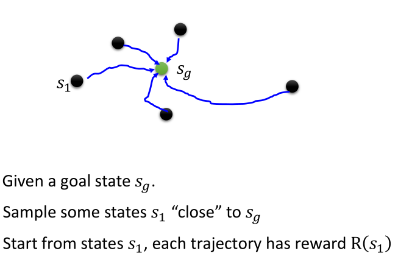

那接下来你根据你的 gold state，去找其他的 state，这些其他的 state，跟 gold state 是比较接近的。

举例来说，假装这些跟 gold state 很近的 state 我们叫做 s1，你的机械手臂还没有抓到东西，但是，它离 gold state 很近，那这个叫做 s1。

至于什么叫做近，这个就麻烦，就是 case dependent，你要根据你的 task，来 design 说怎么从 sg sample 出 s1，如果是机械手臂的例子，可能就比较好想，其他例子可能就比较难想。

接下来呢，你再从这些 state 1 开始做互动，看它能不能够达到 gold state sg。那每一个 state，你跟环境做互动的时候，你都会得到一个 reward R。接下来，我们把 reward 特别极端的 case 去掉。reward 特别极端的 case 的意思就是说，那些 case 它太简单，或者是太难，就 reward 如果很大，代表说这个 case 太简单了，就不用学了，因为机器已经会了，它可以得到很大的 reward。那 reward 如果太小代表这个 case 太难了，依照机器现在的能力这个课程太难了，它学不会，所以就不要学这个，所以只找一些 reward 适中的 case。那当然什么叫做适中，这个就是你要调的参数。

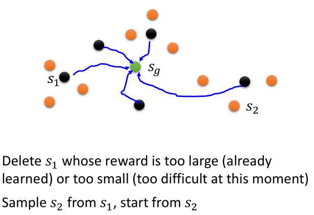

找一些 reward 适中的 case，接下来，再根据这些 reward 适中的 case，再去 sample 出更多的 state，更多的 state，就假设你一开始，你的东西在这里，你机械手臂在这边，可以抓的到以后，接下来，就再离远一点，看看能不能够抓得到，又抓的到以后，再离远一点，看看能不能抓得到。

因为它说从 gold state 去反推，就是说你原来的目标是长这个样子，我们从我们的目标去反推，所以这个叫做 reverse。

这个方法很直觉，但是，它是一个有用的方法就是了，特别叫做 Reverse Curriculum learning。

### Hierarchical Reinforcement learning

那刚才讲的是 Curriculum learning，就是你要为机器规划它学习的顺序。

那最后一个要跟大家讲的 tip，叫做 Hierarchical Reinforcement learning，有阶层式的 reinforcement learning。

所谓阶层式的 Reinforcement learning 是说，我们有好几个 agent，然后，有一些 agent 负责比较 high level 的东西，它负责订目标，然后它订完目标以后，再分配给其他的 agent，去把它执行完成。

那这样的想法其实也是很合理的，因为我们知道说，我们人在一生之中，我们并不是时时刻刻都在做决定。

举例来说，假设你想要写一篇 paper，那你会先想说我要写一篇 paper 的时候，我要做那些 process，就是说我先想个梗这样子。然后想完梗以后，你还要跑个实验，跑完实验以后，你还要写，写完以后呢，你还要去发表这样子，那每一个动作下面又还会再细分。比如说，怎么跑实验呢？你要先 collect data，collect 完 data 以后，你要再 label，你要弄一个 network，然后又 train 不起来，要 train 很多次，然后重新 design network 架构好几次，最后才把 network train 起来。

所以，我们要完成一个很大的 task 的时候，我们并不是从非常底层的那些 action开始想起，我们其实是有个 plan，我们先想说，如果要完成这个最大的任务，那接下来要拆解成哪些小任务，每一个小任务要再怎么拆解成，小小的任务，这个是我们人类做事情的方法。

举例来说，叫你直接写一本书可能很困难，但叫你先把一本书拆成好几个章节，每个章节拆成好几段，每一段又拆成好几个句子，每一个句子又拆成好几个词汇，这样你可能就比较写得出来。这个就是阶层式的 Reinforcement learning 的概念。

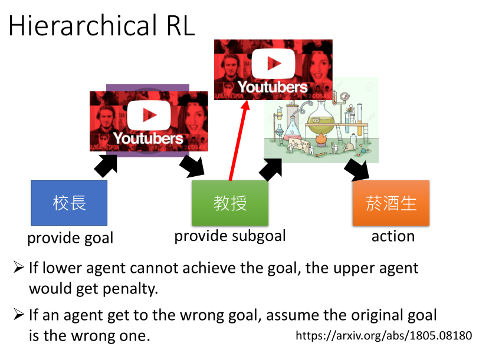

这边是随便举一个好像可能不恰当的例子，就是假设校长跟教授跟研究生通通都是 agent。那今天假设我们的 reward 就是，只要进入百大就可以得到 reward 这样，假设进入百大的话，校长就要提出愿景，告诉其他的 agent 说，现在你要达到什么样的目标，那校长的愿景可能就是说，教授每年都要发三篇期刊。然后接下来，这些 agent 都是有阶层式的，所以上面的 agent，他的 action 他所提出的动作，他不真的做事，他的动作就是提出愿景这样，那他把他的愿景传给下一层的 agent。

下一层的 agent 就把这个愿景吃下去，如果他下面还有其他人的话，它就会提出新的愿景，比如说，校长要教授发期刊，但是其实教授自己也是不做实验的，所以，教授也只能够叫下面的苦命研究生做实验，所以教授就提出愿景，就做出实验的规划，然后研究生才是真的去执行这个实验的人，然后，真的把实验做出来，最后大家就可以得到 reward。

这个例子其实有点差。因为真实的情况是，校长其实是不会管这些事情的，校长并不会管教授有没有发期刊，而且发期刊跟进入百大其实关系也不大，而且更退一步说好了，我们现在是没有校长的。所以，现在显然这个就不是指台大，所以，这是一个虚构的故事，我随便乱编的，没有很恰当。

那现在是这样子的，在 learn 的时候，其实每一个 agent 都会 learn。他们的整体的目标，就是要达成，就是要达到最后的 reward。那前面的这些 agent，他提出来的 actions，就是愿景。你如果是玩游戏的话，他提出来的就是，我现在想要产生这样的游戏画面，然后，下面的能不能够做到这件事情，上面的人就是提出愿景。但是，假设他提出来的愿景，是下面的 agent 达不到的，那就会被讨厌，举例来说，教授对研究生，都一直逼迫研究生做一些很困难的实验，研究生都做不出来的话，研究生就会跑掉，所以他就会得到一个 penalty。

如果今天下层的 agent，他没有办法达到上层 agent 所提出来的 goal 的话，上层的 agent 就会被讨厌，它就会得到一个 negative reward，所以他要避免提出那些愿景是，底下的 agent 所做不到的。那每一个 agent 他都是吃，上层的 agent 所提出来的愿景，当作输入，然后决定他自己要产生什么输出，决定他自己要产生什么输出。但是你知道说，就算你看到，上面的的愿景说，叫你做这一件事情，你最后也不见得，做得到这一件事情。

假设，本来教授目标是要写期刊，但是不知道怎么回事，他就要变成一个 YouTuber。

这个 paper 里面的 solution，我觉得非常有趣，给大家做一个参考，这其实本来的目标是要写期刊，但却变成 YouTuber，那怎么办呢？把原来的愿景改成变成 YouTuber，就结束了。在 paper 里面就是这么做的，为什么这么做呢？因为虽然本来的愿景是要写期刊，但是后来变成 YouTuber。

难道这些动作都浪费了吗？不是，这些动作是没有被浪费的。

我们就假设说，本来的愿景，其实就是要成为 YouTuber，那你就知道说，成为 YouTuber 要怎做了。

这个细节我们就不讲了，你自己去研究一下 paper，这个是阶层式 RL，可以做得起来的 tip。

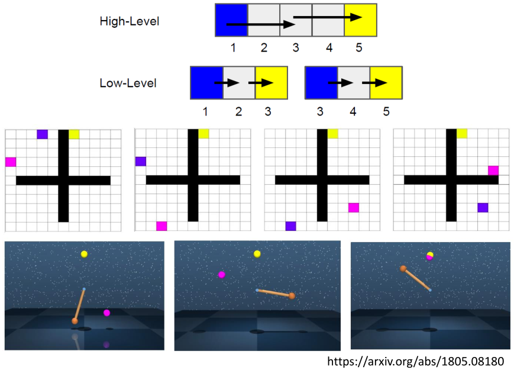

那这个是真实的例子，给大家参考一下，实际上呢，这里面就做了一些比较简单的游戏，这个是走迷宫，蓝色是 agent，蓝色的 agent 要走走走，走到黄色的目标。

这边也是，这个单摆要碰到黄色的球。那愿景是什么呢？在这个 task 里面，它只有两个 agent ，只有下面的一个，最底层的 agent 负责执行，决定说要怎么走，还有一个上层的 agent，负责提出愿景。虽然实际上你 general 而言可以用很多层，但是paper 我看那个实验，只有两层。

那今天这个例子是说，粉红色的这个点，代表的就是愿景，上面这个 agent，它告诉蓝色的这个 agent 说，你现在的第一个目标是先走到这个地方。

蓝色的 agent 走到以后，再说你的新的目标是走到这里，蓝色的 agent 再走到以后，新的目标在这里，接下来又跑到这边，然后，最后希望蓝色的 agent 就可以走到黄色的这个位置。

这边也是一样，就是，粉红色的这个点，代表的是目标，代表的是上层的 agent 所提出来的愿景。所以，这个 agent 先摆到这边，接下来，新的愿景又跑到这边，所以它又摆到这里，然后，新的愿景又跑到上面，然后又摆到上面，最后就走到黄色的位置了。

这个就是 hierarchical 的 Reinforcement Learning。

## Imitation Learning

Imitation learning 就更进一步讨论的问题是，假设我们今天连 reward 都没有，那要怎么办才好呢？

### Introduction

这个 Imitation learning 又叫做 learning by demonstration，或者叫做 apprenticeship learning。apprenticeship 是学徒的意思。

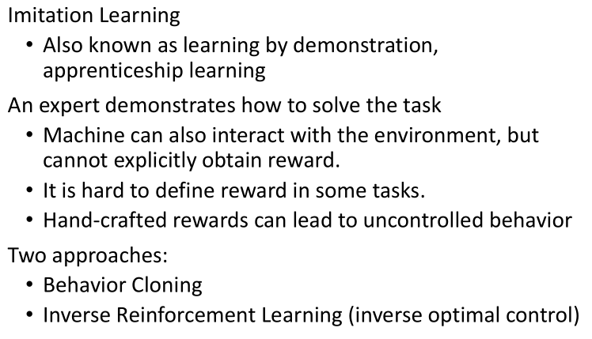

那在这 Imitation learning 里面，你有一些 expert 的 demonstration，machine 也可以跟环境互动，但它没有办法从环境里面得到任何的 reward，他只能够看着 expert 的 demonstration，来学习什么是好，什么是不好。

那你说为什么有时候，我们没有办法从环境得到 reward。其实，多数的情况，我们都没有办法，真的从环境里面得到非常明确的 reward。

如果今天是棋类游戏，或者是电玩，你有非常明确的 reward，但是其实多数的任务，都是没有 reward 的。举例来说，虽然说自驾车，我们都知道撞死人不好，但是，撞死人应该扣多少分数，这个你没有办法订出来，撞死人的分数，跟撞死一个动物的分数显然是不一样的，但你也不知道要怎么订，这个问题很难，你根本不知道要怎么订 reward。

或是 chat bot 也是一样，今天机器跟人聊天，聊得怎么样算是好，聊得怎么样算是不好，你也无法决定，所以很多 task，你是根本就没有办法订出reward 的。

虽然没有办法订出 reward，但是收集 expert 的 demonstration 是可能可以做到的，举例来说，在自驾车里面，虽然，你没有办法订出自驾车的 reward，但收集很多人类开车的纪录，这件事情是可行的。

在 chat bot 里面，你可能没有办法收集到太多，你可能没有办法真的定义什么叫做好的对话，什么叫做不好的对话，但是，收集很多人的对话当作范例，这一件事情，也是可行的。

所以，今天 Imitation learning，其实他的实用性非常高，假设，你今天有一个状况是，你不知道该怎么定义 reward，但是你可以收集到  expert 的 demonstration，你可以收集到一些范例的话，你可以收集到一些很厉害的 agent，比如说人跟环境实际上的互动的话，那你就可以考虑 Imitation learning 这个技术。

那在 Imitation learning  里面，我们介绍两个方法，第一个叫做 Behavior Cloning，第二个叫做 Inverse Reinforcement Learning，或者又叫做 Inverse Optimal Control。

### Behavior Cloning

我们先来讲 Behavior Cloning，其实 Behavior Cloning，跟 Supervised learning 是一模一样的，举例来说，我们以自驾车为例。

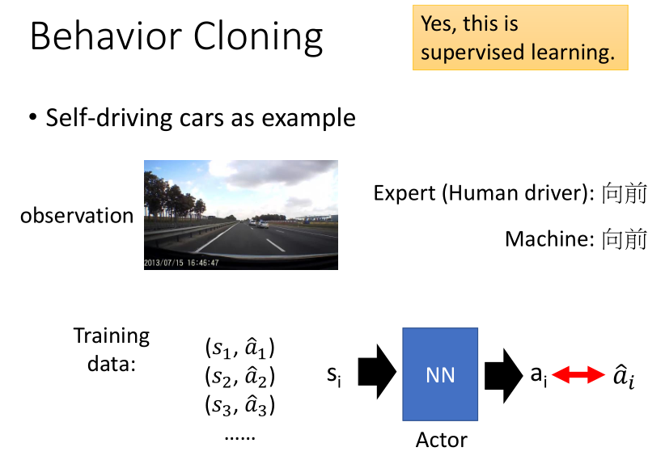

今天，你可以收集到人开自驾车的所有数据，比如说，人类的驾驶跟收集人的行车记录器，看到这样子的 observation 的时候，人会决定向前，机器就采取跟人一样的行为，也采取向前，也踩个油门就结束了，这个就叫做 Behavior Cloning。expert 做什么，机器就做一模一样的事。

那怎么让机器学会跟 expert 一模一样的行为呢？就把它当作一个 Supervised learning 的问题，你去收集很多自驾车，你去收集很多行车纪录器，然后再收集人在那个情境下会采取什么样的行为，你知道说人在state s1  会采取 action a1，人在state s2  会采取 action , a2，人在 state s3  会采取 action  a3。

接下来，你就 learn 一个 network，这个 network 就是你的 actor，他 input si 的时候，你就希望他的 output 是 ai，就这样结束了。他就是一个非常单纯的 Supervised learning 的 problem。

#### Problem

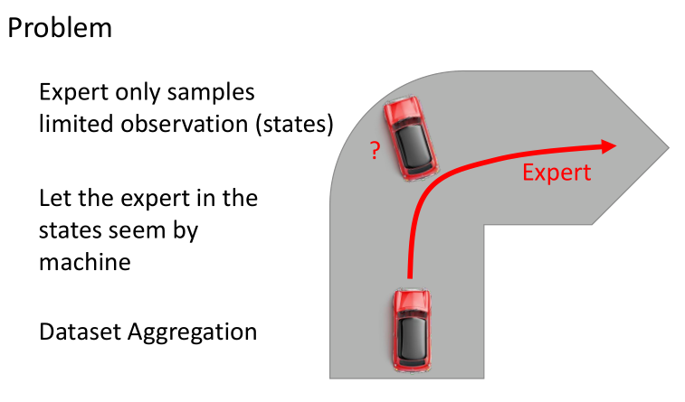

Behavior Cloning 虽然非常简单，但是他的问题是，今天如果你只收集 expert 的资料，你可能看过的 observation 会是非常 limited，举例来说，假设你要 learn 一部自驾车，自驾车就是要过这个弯道。那如果是 expert  的话，你找人来，不管找多少人来，他就是把车，顺着这个红线就开过去了。

但是，今天假设你的 agent 很笨，他今天开着开着，不知道怎么回事，就开到撞墙了，他永远不知道撞墙这种状况要怎么处理。为什么？因为 taring data 里面从来没有撞过墙，所以他根本就不知道撞墙这一种 case，要怎么处理。

或是打电玩也是一样，让机器让人去玩 Mario，那可能 expert 非常强，他从来不会跳不上水管，所以，机器根本不知道跳不上水管时要怎么处理，人从来不会跳不上水管，但是机器今天如果跳不上水管时，就不知道要怎么处理。

#### Dataset Aggregation

所以，今天光是做 Behavior Cloning 是不够的，只观察 expert 的行为是不够的，需要一个招数，这个招数叫作 Data aggregation。

我们会希望收集更多样性的 data，而不是只有收集 expert 所看到的 observation，我们会希望能够收集 expert 在各种极端的情况下，他会采取什么样的行为。

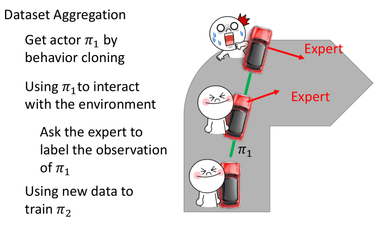

如果以自驾车为例的话，那就是这样，假设一开始，你的 actor 叫作 π1。

然后接下来，你让 π1，真的去开这个车，车上坐了一个 expert，这个 expert 会不断的告诉，如果今天在这个情境里面，我会怎么样开。所以，今天 π1，machine 自己开自己的，但是 expert 会不断地表示他的想法，比如说，在这个时候，expert 可能说，那就往前走，这个时候，expert 可能就会说往右转。

但是，π1 是不管 expert 的指令的，所以，他会继续去撞墙。expert 虽然说要一直往右转，但是不管他怎么下指令都是没有用的，π1 会自己做自己的事情。

因为我们要做的纪录的是说，今天 expert，在 π1 看到这种 observation 的情况下，他会做什么样的反应。

那这个方法显然是有一些问题的，因为每次你开一次自驾车，都会牺牲一个人。

那你用这个方法，你牺牲一个 expert 以后，你就会得到说，人类在这样子的 state 下，在快要撞墙的时候，会采取什么样的反应，再把这个 data 拿去 train 新的 π2。这个 process 就反复继续下去，这个方法就叫做 Data aggregation。

#### The agent will copy every behavior, even irrelevant actions.

那 Behavior Cloning 这件事情，会有什么的样的 issue？还有一个 issue 是说，今天机器会完全 copy expert 的行为。不管今天 expert 的行为，有没有道理，就算没有道理，没有什么用的，这是 expert 本身的习惯，机器也会硬把它记下来。

机器就是你教他什么，他就硬学起来，不管那个东西到底是不是值得的学的。

那如果今天机器确实可以记住，所有 expert 的行为，那也许还好，为什么呢？因为如果 expert 这么做，有些行为是多余的，但是没有问题，在机器假设他的行为，可以完全仿造 expert 行为，那也就算了，那他是跟 expert  一样的好，只是做一些多余的事。

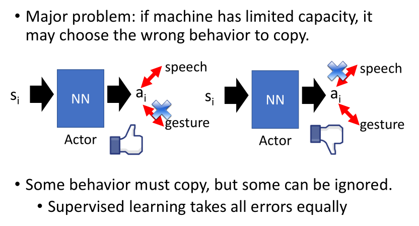

但是问题就是，他毕竟是一个 machine，他是一个 network，network 的 capacity 是有限的，我们知道说，今天就算给 network training data，他在 training data 上得到的正确率，往往也不是 100，他有些事情，他是学不起来。这个时候，什么该学，什么不该学，就变得很重要。

举例来说，在学习中文的时候，你看到你的老师，他有语音，他也有行为，他也有知识，但是今天其实只有语音部分是重要的，知识的部分是不重要的，也许 machine 他只能够学一件事，也许他就只学到了语音，那没有问题。如果他今天只学到了手势，那这样子就有问题了。

所以，今天让机器学习什么东西是需要 copy，什么东西是不需要copy，这件事情是重要的，而单纯的 Behavior Cloning，其实就没有把这件事情学进来，因为机器唯一做的事情只是复制 expert 所有的行为而已，他并不知道哪些行为是重要，是对接下来有影响的，哪些行为是不重要的，接下来是没有影响的。

#### Mismatch

那 Behavior Coning 还有什么样的问题呢？在做 Behavior Cloning  的时候，这个你的 training data 跟 testing data，其实是 mismatch 的，我们刚才其实是有讲到这个样子的 issue，那我们可以用这个 Data aggregation 的方法，来稍微解决这个问题。

那这样子的问题到底是什么样的意思呢？这样的问题是，我们在 training 跟 testing 的时候，我们的 data distribution 其实是不一样，因为我们知道在 Reinforcement learning 里面，有一个特色是你的 action 会影响到接下来所看到的 state，我们是先有 state s1，然后再看到 action a1，action a1 其实会决定接下来你看到什么样的 state s2。

所以在 Reinforcement learning 里面，一个很重要的特征就是你采取的 action 会影响你接下来所看到的 state。

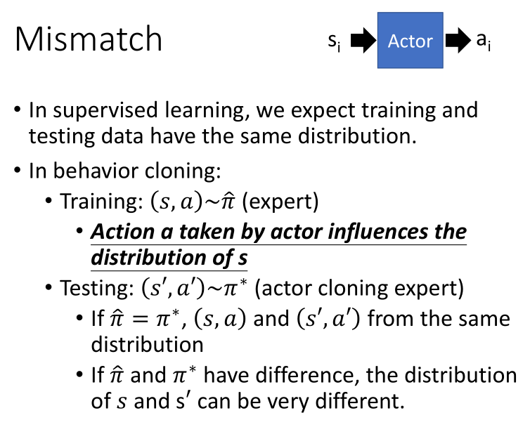

那今天如果我们做了 Behavior Cloning 的话，做 Behavior Cloning 的时候，我们只能够观察到 expert  的一堆 state 跟 action 的 pair。

然后，我们今天希望说我们可以 learn 一个 policy，假设叫做 $π^*$ 好了，我们希望这一个 $π^*$ 跟 $\hatπ  $ 越接近越好，如果 $π^*$ 确实可以跟 $\hatπ  $ 一模一样的话，那这个时侯，你 training 的时候看到的 state，跟 testing 的时候所看到的 state 会是一样。

因为虽然 action 会影响我们看到的 state，假设两个 policy 都一模一样，在同一个 state 都会采取同样的 action，那你接下来所看到的 state 都会是一样。但是问题就是，你很难让你的 learn 出来的 π，跟 expert 的 π 一模一样，expert 是一个人，network 要跟人一模一样感觉很难。

今天你的 $π^*$ 如果跟 $\hatπ  $ 有一点误差，这个误差也许在一般 Supervised  learning problem 里面，每一个 example 都是 independent 的，也许还好。但是，今天假设 Reinforcement learning 的 problem，你可能在某个地方，也许你的 machine 没有办法完全复制 expert 的行为，它只差了一点点，也许最后得到的结果，就会差很多这样。

所以，今天这个 Behavior Cloning 的方法，并不能够完全解决 Imatation learning 这件事情。

### Inverse Reinforcement Learning (IRL)

所以接下来，就有另外一个比较好的做法，叫做 Inverse Reinforcement Learning。

为什么叫 Inverse Reinforce Learning？因为原来的 Reinforce Learning 里面，也就是有一个环境，跟你互动的环境，然后你有一个 reward function，然后根据环境跟 reward function，透过 Reinforce Learning 这个技术，你会找到一个 actor，你会 learn 出一个 optimal actor。

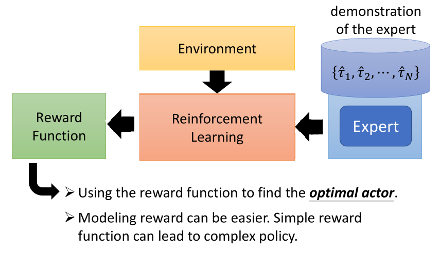

但是 Inverse Reinforce Learning 刚好是相反的，你今天没有 reward function，你只有一堆 expert 的 demonstration，但是你还是有环境的，IRL 的做法是说，假设我们现在有一堆 expert 的 demonstration，我们用这个 $\hatτ $来，代表 expert  的demonstration。

如果今天是在玩电玩的话，每一个 $\hatτ $就是一个很会玩电玩的人，他玩一场游戏的纪录，如果是自驾车的话，就是人开自驾车的纪录，如果是用人开车的纪录，这一边就是 expert 的 demonstration，每一个$\hatτ $ 是 一个 trajectory，把所有 trajectory expert demonstration 收集起来，然后使用 Inverse Reinforcement Learning 这个技术。

使用 Inverse Reinforcement Learning 技术的时候，机器是可以跟环境互动的，但是他得不到 reward，他的 reward 必须要从 expert 那边推论出来。

现在有了环境，有了 expert demonstration 以后，去反推出 reward function 长什么样子。

之前 Reinforcement learning 是由 reward function，反推出什么样的 actor 是最好的。

Inverse Reinforcement Learning 是反过来，我们有 expert 的 demonstration，我们相信他是不错的，然后去反推，expert 既然做这样的行为，那实际的 reward function 到底长什么样子。我就反推说，expert 是因为什么样的 reward function，才会采取这些行为。你今天有了reward function以后，接下来，你就可以套用一般的，Reinforcement learning 的方法，去找出 optimal actor，所以Inverse Reinforcement Learning 里面是先找出 reward function。找出 reward function 以后，再去实际上用 Reinforcement Learning，找出 optimal actor。

有人可能就会问说，把 Reinforcement Learning，把这个 reward function learn 出来，到底相较于原来的 Reinforcement Learning有什么样好处？

一个可能的好处是，也许 reward function 是比较简单的。虽然这个 actor，这个 expert 他的行为非常复杂，也许简单的 reward function，就可以导致非常复杂的行为。一个例子就是，也许人类本身的 reward function 就只有活着这样，每多活一秒，你就加一分，但是，人类有非常复杂的行为，但是这些复杂的行为，都只是围绕着，要从这个 reward function 里面得到分数而已。有时候很简单的 reward function，也许可以推导出非常复杂的行为。

#### Framework of IRL

那 Inverse Reinforcement Learning，实际上是怎么做的呢？首先，我们有一个 expert ，我们叫做 $\hatπ$，这个 expert 去跟环境互动，给我们很多 $\hatτ_1$ 到 $\hatτ_n$，如果是玩游戏的话，就让某一个电玩高手，去玩 n 场游戏，把 n 场游戏的 state 跟 action 的 sequence，通通都记录下来。

接下来，你有一个 actor，一开始 actor 很烂，他叫做 π，这个 actor 他也去跟环境互动，他也去玩了n 场游戏，他也有 n 场游戏的纪录。

接下来，我们要反推出 reward function。

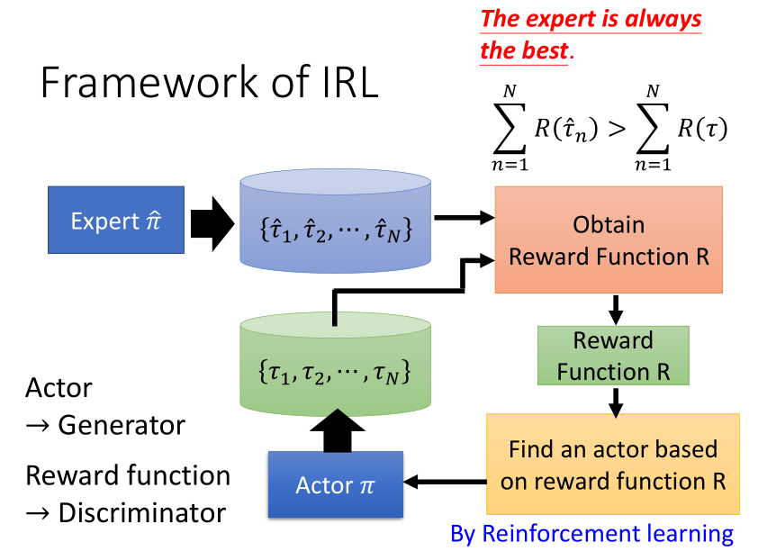

怎么推出 reward function 呢？这一边的原则就是，expert 永远是最棒的，是先射箭，再画靶的概念。expert 他去玩一玩游戏，得到这一些游戏的纪录，你的 actor 也去玩一玩游戏，得到这些游戏的纪录。接下来，你要定一个 reward function，这个 reward function 的原则就是，expert 得到的分数，要比 actor 得到的分数高。

先射箭，再画靶。所以我们今天就 learn 出一个 reward  function，你要用什么样的方法都可以，你就找出一个 reward function R，这个 reward function 会使 expert 所得到的 reward，大过于 actor 所得到的 reward。

你有 reward function 就可以套用一般，Reinforcement Learning  的方法，去 learn 一个 actor，这个 actor 会对这一个 reward function，去 maximize 他的 reward，他也会采取一大堆的 action。

但是，今天这个 actor，他虽然可以 maximize 这个 reward function，采取一大堆的行为，得到一大堆游戏的纪录，但接下来，我们就改 reward function，这个 actor 已经可以在这个 reward function 得到高分，但是他得到高分以后，我们就改 reward function，仍然让 expert 比我们的 actor，可以得到更高的分数。

这个就是 Inverse Reinforcement learning，你有新的 reward function 以后，根据这个新的 reward function，你就可以得到新的 actor，新的 actor 再去跟环境做一下互动，他跟环境做互动以后，你又会重新定义你的 reward function，让 expert 得到 reward 大过 actor得到的reward。

这边其实就没有讲演算法的细节，那你至于说要，怎么让他大于他，其实你在 learning 的时候，你可以很简单地做一件事。我们的 reward function 也许就是 neural network，这个 neural network 它就是吃一个 $τ$，然后，output 就是这个 $τ$ 应该要给他多少的分数，或者是说，你假设觉得 input 整个 $τ$ 太难了，因为 $τ$ 是 s  跟 a 一个很长的 sequence，也许就说 ，他就是 input s 跟 a，他是一个 s 跟 a 的 pair，然后 output 一个 real number，把整个 sequence，整个 $τ$，会得到的 real number 都加起来，就得到 total R，在 training 的时候，你就说，今天这组数字，我们希望他 output 的 R 越大越好，今天这个 ，我们就希望他 R 的值，越小越好。

你有没有觉得这个东西，其实看起来还颇熟悉呢？其实你只要把他换个名字说，actor 就是 generator，然后说 reward function 就是 discriminator。

其实他就是 GAN，他就是 GAN，所以你说，他会不会收敛这个问题，就等于是问说 GAN 会不会收敛，你应该知道说也是很麻烦，不见得会收敛，但是，除非你对 R 下一个非常严格的限制，如果你的 R 是一个 general 的 network 的话，你就会有很大的麻烦就是了。

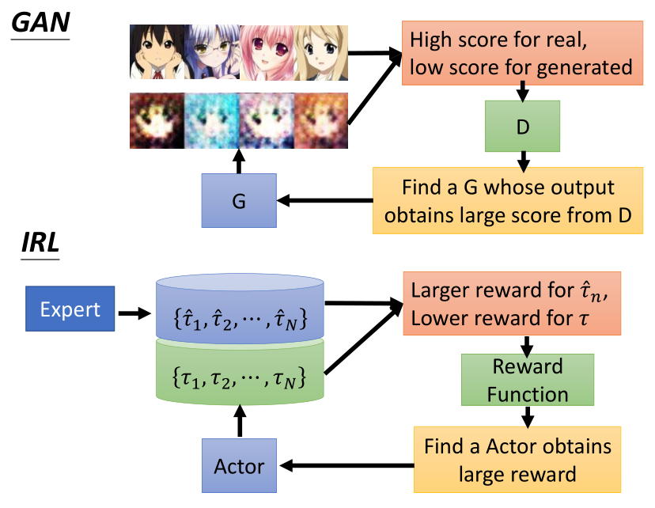

那怎么说他像是一个 GAN？我们来跟 GAN 比较一下。

GAN 里面，你有一堆很好的图，然后你有一个 generator，一开始他根本不知道要产生什么样的图，他就乱画，然后你有一个 discriminator，discriminator 的工作就是，expert  画的图就是高分，generator 画的图就是低分，你有 discriminator 以后，generator 会想办法去骗过 discriminator，generator 会希望他产生的图，discriminator 也会给他高分。这整个 process 跟 Inverse Reinforcement Learning，是一模一样的，我们只是把同样的东西换个名子而已。

今天这些人画的图，在这边就是 expert 的 demonstration，你的 generator 就是 actor，今天 generator 画很多图，但是 actor 会去跟环境互动，产生很多 trajectory。这些 trajectory 跟环境互动的记录，游戏的纪录其实就等于是 GAN 里面的这些图。

然后，你 learn 一个 reward function，这个 reward function 其实就是 discriminator，这个 rewards function 要给 expert 的 demonstration 高分，给  actor 互动的结果低分。然后接下来，actor 会想办法，从这个已经 learn 出来的 reward function 里面得到高分，然后接下来 iterative 的去循环，跟 GAN 其实是一模一样的。我们只是换个说法来讲同样的事情而已。

#### Parking Lot Navigation

那这个 IRL 其实有很多的 application，举例来说，当然可以用开来自驾车，然后，有人用这个技术来学开自驾车的不同风格。

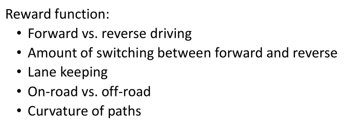

每个人在开车的时候，其实你会有不同风格，举例来说，能不能够压到线，能不能够倒退，要不要遵守交通规则等等，每个人的风格是不同的。用 Inverse Reinforcement Learning，又可以让自驾车学会各种不同的开车风格。

这个是文献上真实的例子，在这个例子里面，Inverse Reinforcement Learning 有一个有趣的地方，通常你不需要太多的 training data，因为 training data 往往都是个位数，因为 Inverse Reinforcement Learning 只是一种 demonstration，他只是一种范例。今天机器他仍然实际上可以去跟环境互动，非常的多次，所以在Inverse Reinforcement Learning 的文献，往往会看到说，只用几笔 data 就训练出一些有趣的结果。

比如说，在这个例子里面，然后就是给机器只看一个 row，的四个 demonstration，然后让他去学怎么样开车，怎么样开车。

今天给机器看不同的 demonstration，最后他学出来开车的风格，就会不太一样。举例来说，这个是不守规的矩开车方式，因为他会开到道路之外，这边，他会穿过其他的车，然后从这边开进去，所以机器就会学到说，不一定要走在道路上，他可以走非道路的地方。

或是这个例子，机器是可以倒退的，他可以倒退一下，他也会学会说，他可以倒退。

#### Robot

那这种技术，也可以拿来训练机器人，你可以让机器人，做一些你想要他做的动作。过去如果你要训练机器人，做你想要他做的动作，其实是比较麻烦的，怎么麻烦，过去如果你要操控机器的手臂，你要花很多力气去写那 program，才让机器做一件很简单的事。

那今天假设你有 Imitation Learning 的技术，那也许你可以做的事情是，让人做一下示范，然后机器就跟着人的示范来进行学习。

#### Third Person Imitation Learning

其实还有很多相关的研究。举例来说，你在教机械手臂的时候，要注意就是，也许机器看到的视野，跟人看到的视野，其实是不太一样的。

在刚才那个例子里面，我们人跟机器的动作是一样的，但是在未来的世界里面，也许机器是看着人的行为学的。假设你要让机器学会打高尔夫球，在刚才的例子里面就是，人拉着机器人手臂去打高尔夫球，但是在未来有没有可能，机器就是看着人打高尔夫球，他自己就学会打高尔夫球了呢？

但这个时候，要注意的事情是，机器的视野，跟他真正去采取这个行为的时候的视野，是不一样的，机器必须了解到，当他是作为第三人称的时候，当他是第三人的视角的时候，看到另外一个人在打高尔夫球，跟他实际上自己去打高尔夫球的时候，看到的视野显然是不一样的，但他怎么把他是第三人的时候，所观察到的经验，把它 generalize 到他是第一人称视角的时候，第一人称视角的时候，所采取的行为，这就需要用到 Third Person Imitation Learning 的技术。

那这个怎么做呢？细节其实我们就不细讲，他的技术，其实也是不只是用到 Imitation Learning，他用到了 Domain-Adversarial Training，这也是一个 GAN 的技术，那我们希望今天有一个 extractor，有两个不同 domain 的 image，通过这个 extractor 以后，没有办法分辨出他来自哪一个 domain。

Imitation Learning 用的技术其实也是一样的，希望 learn 一个 Feature Extractor，当机器在第三人称的时候，跟他在第一人称的时候，看到的视野其实是一样的，就是把最重要的东西抽出来就好了。

#### Recap: Sentence Generation & Chat-bot

其实我们在讲 Sequence GAN 的时候，我们有讲过 Sentence Generation 跟 Chat-bot，那其实 Sentence Generation 或 Chat-bot 这件事情，也可以想成是 Imitation Learning。机器在 imitate 人写的句子。

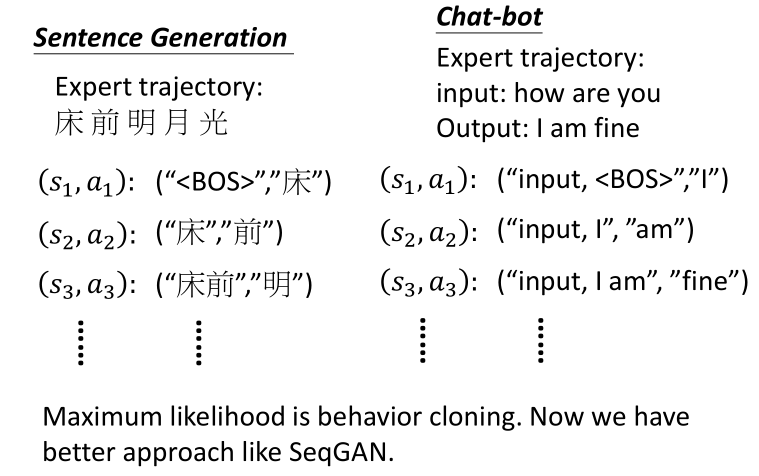

你可以把写句子这件事情，你在写句子的时候，你写下去的每一个 word，你都想成是一个 action，所有的 word 合起来就是一个 episode。

举例来说， sentence generation 里面，你会给机器看很多人类写的文字，那这个人类写的文字，你要让机器学会写诗，那你就要给他看唐诗 300 首，这个人类写的文字，其实就是这个 expert 的 demonstration，每一个词汇，其实就是一个 action。

你让机器做 Sentence Generation 的时候，其实就是在 imitate expert 的 trajectory，或是如果 Chat-bot 也是一样，在 Chat-bot 里面你会收集到很多人互动对话的纪录，那一些就是 expert 的 demonstration。

如果我们今天单纯用 Maximum likelihood 这个技术，来 maximize 会得到 likelihood，这个其实就是 behavior cloning，对不对？用我们今天做 behavior cloning ，就是看到一个 state，接下来预测，我们会得到，看到一个 state，然后有一个 Ground truth 告诉机器说，什么样的 action 是最好的，在做 likelihood 的时候也是一样，Given sentence 已经产生的部分，接下来 machine 要 predict 说，接下来要写哪一个 word 才是最好的。

所以，Maximum likelihood 对应到 Imitation Learning 里面，就是 behavior cloning。

那我们说光 Maximum likelihood 是不够的，我们想要用 Sequence GAN，其实 Sequence GAN 就是对应到 Inverse Reinforcement Learning，我们刚才已经有讲过说，其实 Inverse Reinforcement Learning，就是一种 GAN 的技术。

你把 Inverse Reinforcement Learning 的技术，放在 Sentence generation，放到 Chat-bot 里面，其实就是 Sequence GAN 跟他的种种的变形。