# Structured Learning

## Structured Learning

什么是Structured Learning呢? 到目前为止，我们考虑的input都是一个vector，output也是一个vector，不管是SVM还是 Deep Learning的时候，我们的input，output都是vector而已。但是实际上我们要真正面对的问题往往比这个更困难，我们可能需要input或者output是一个sequence，我们可能希望output是一个list，是一个tree，是一个bounding box等等。比如recommendation里面你希望output是一个list，而不是一个个element。

当然，大原则上我们知道怎么做，我们就是要找一个function，它的input就是我们要的object，它的output就是另外一种object，只是我们不知道要怎么做。比如说，我们目前学过的deep learning的Neural Network的架构，你可能不知道怎样Network的input才是一个tree structure，output是另外一个tree structure。

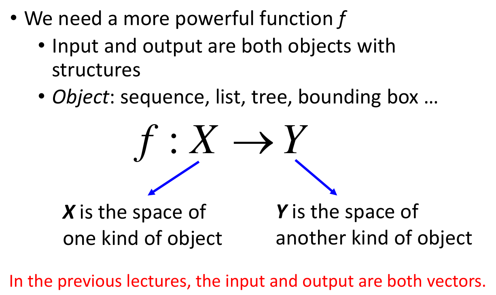

特点：

- 输入输出都是一种带有结构的对象
- 对象：sequence,list,tree,bounding box

### Example Application

Structured Learning 的应用比比皆是

- Speech recognitian(语音辨识)

  input 是一个signal sequence，output是另一个text sequence

- Translation(翻译)

  input 是一种语言的sequence,output是另外一种语言的sequence

- Syntatic Paring(文法解析)

  input 是一个sentence，output 是一个文法解析树

- Object Detection(目标检测)

  或者你要做Object detection，input 是一张image，output是一个bounding box。你会用这个bounding box把这个object给框出来。

- Summarization

  或者你要做一个Summarization，input是一个大的document，output是一个summary。input 和output都是一个sequence。

- Retrieval

  或者你要做一个Retrieval，input是搜寻的关键词，output是搜寻的结果，是一个webpage的list。

### Unified Framework

那么Structured到底要怎么做呢？虽然这个Structured听起来很困难，但是实际上它有一个Unified Framework，统一的框架。

在Training的时候，就是找到function，记为$F$，这个大写$F$的input是$X$跟$Y$，它的output是一个real number。这个大写的$F$它所要做的事情就是衡量出输入x，输出y都是structure的时候，x和y有多匹配。越匹配，R值越大。

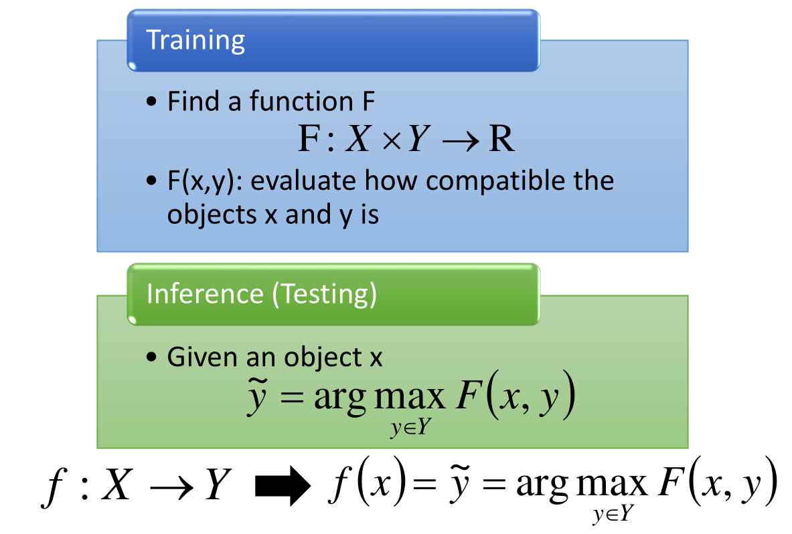

那testing的时候，给定一个新的x，我们去穷举所有的可能的y，一一带进大写的$F$ function，看哪一个y可以让$F$函数值最大，此时的$\tilde{y}$就是最后的结果，model的output。

之前我们所要做的事情，是找一个小写的$f:X\rightarrow Y$，可以想象成现在小写的$f(x)=\tilde{y}=arg \max_{y \in Y}F(x,y)$，这样讲可能比较抽象，我们来举个实际的例子。

#### Object Detection

用一个方框标识出一张图片中的要它找的object，在我们的task中input是一张image，output是一个Bounding Box。举例来说，我们的目标是要检测出Haruhi。input是一张image，output就是Haruhi所在的位置。可以用于侦测人脸，无人驾驶等等。

在做object detection的时候，也可以用Deep Learning。事实上，Deep Learning 和Structured Learning是有关系的，这个是我个人的想法，GAN就是F(X,Y)，具体的后续再讲。

那么Object Detection是怎么做的呢？input就是一张image，output就是一个Bounding Box，F(x,y)就是这张image配上这个红色的bounding box，它们有多匹配。如果是按照Object Detection的例子，就是它有多正确，真的吧Harihu给框出来。所以你会期待，给这一张图，如果框得很对，那么它的分数就会很高。如下图右侧所示。

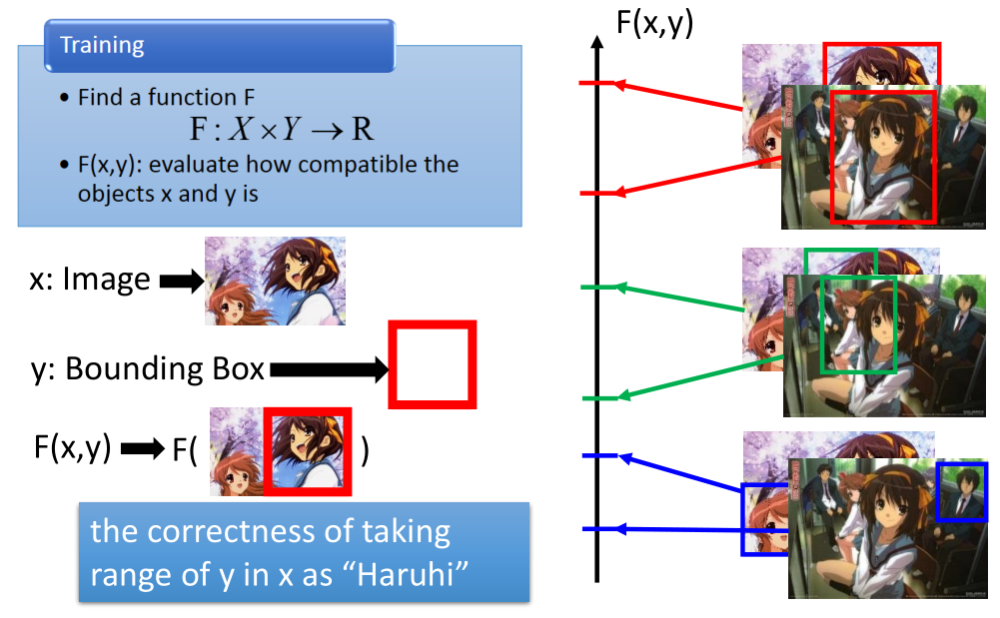

接下来，testing的时候，给一张image，这个x是从来没有看过的东西。你穷举所有可能的bounding box，画在各种不同的地方，然后看说哪一个bounding box得到的分数最高。红色的最高，所以红色的就是你的model output。

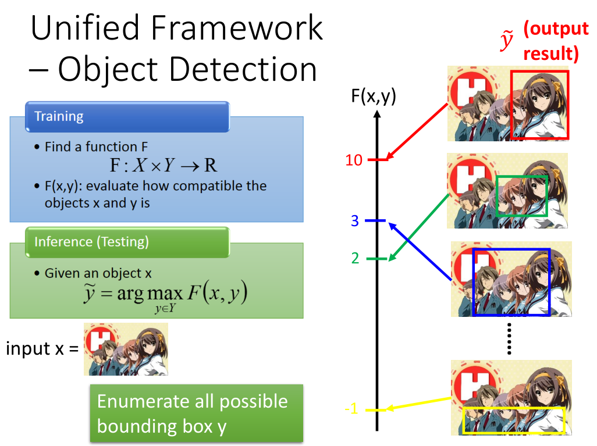

在别的task上其实也是差不多的，比如

#### Summarization

input 一个长document，里面有很多句子。output是一个summary，summary可以从document上取几个句子出来。

那么我们training的时候，你的这个F(x,y)，当document和summary配成一对的时候，F的值就很大，如果document和不正确的summary配成一对的时候，F的值就很小，对每一个training data 都这么做。

testing的时候，就穷举所有可能的summary，看哪个summary配上的值最大，它就是model的output。

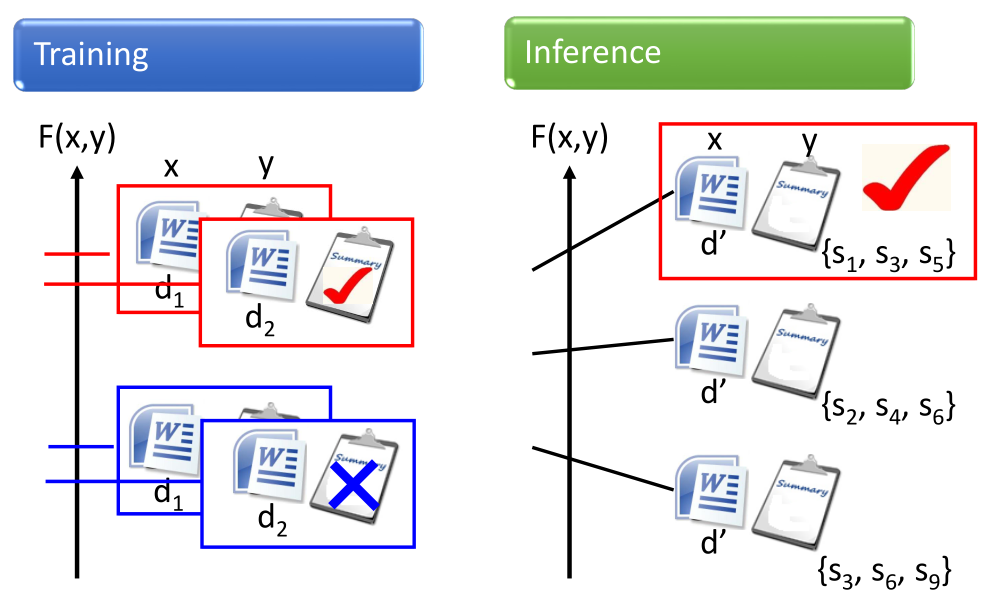

#### Retrieval

input 是一个查询集（查询关键字），output是一个webpages的list

Training的时候，我们要知道input一个query时，output是哪一些list，才是perfect。以及那些output是不对的，分数就会很低。

Testing的时候，根据input，穷举所有的可能，看看哪个list的分数最高，就是model的输出。

### Statistics

这个Unified Framework或许你听得觉得很怪这样，第一次听到，搞什么东西呀。

那么我换一个说法，我们在Training的时候要estimate x和y的联合概率P(x,y)，即x和y一起出现的机率，这样，input就是X和Y，output就是一个介于0到1之间的值。

那我在做testing的时候，给我一个object x，我去计算所有的$p(y|x)$，经过条件概率的推导，哪一个$p(x,y)$的机率最高，$\tilde {y}$就是model的输出。

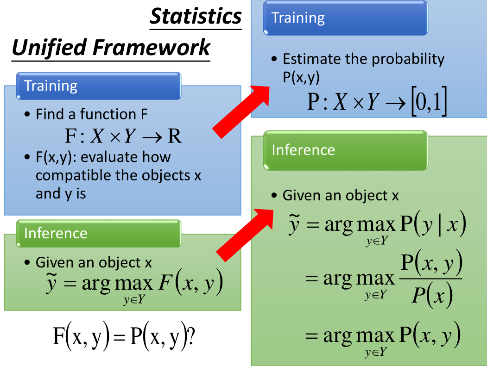

graphical model也是一种structured learning，就是把$F(x,y)$换成机率

用机率表达的方式

- 缺点
  - 机率解释性有限，比如搜寻，我们说查询值和结果共同出现的机率就很怪
  - 机率值限定在[0,1]范围，X和Y都是很大的space，要变成机率可能很多时间都用来做normalization，不一定有必要
- 优点
  - 具有现象意义，机率比较容易描述现象

Energy-based model 也是structured learning

### Three Problems

要做这个Framework要解三个问题

#### Problem 1: Evaluation

第一个问题是，在不同的问题中，F(x,y)到底应该是什么样的。

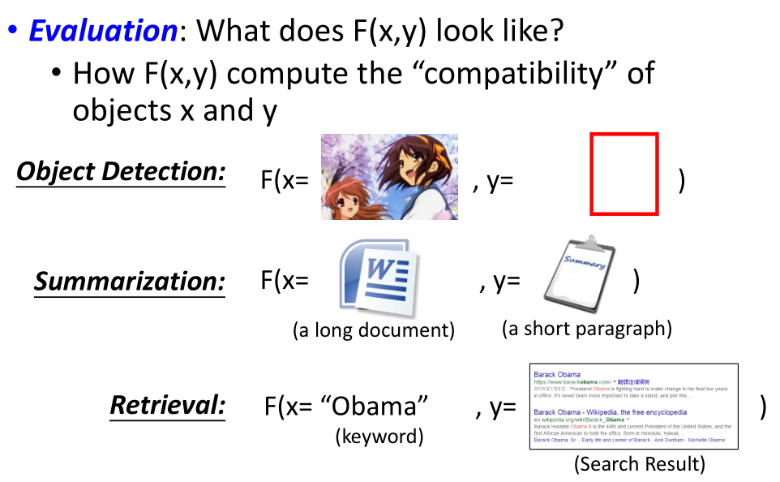

#### Problem 2: Inference

再来就是那个荒唐的Inference，怎么解 “arg max”这个问题。这个Y可是很大的，比如说你要做Object Detection，这个Y是所有可能的bounding box。这件事情做得到吗？

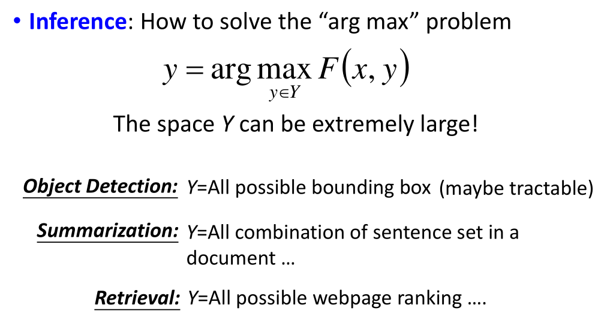

#### Problem 3:  Training

第三个问题是Training，给定training data ，如何找到$F(x,y)$。Training Principle是正确的$F(x,\hat{y})$能大过其他的情况，这个Training 应该是可以完成的。

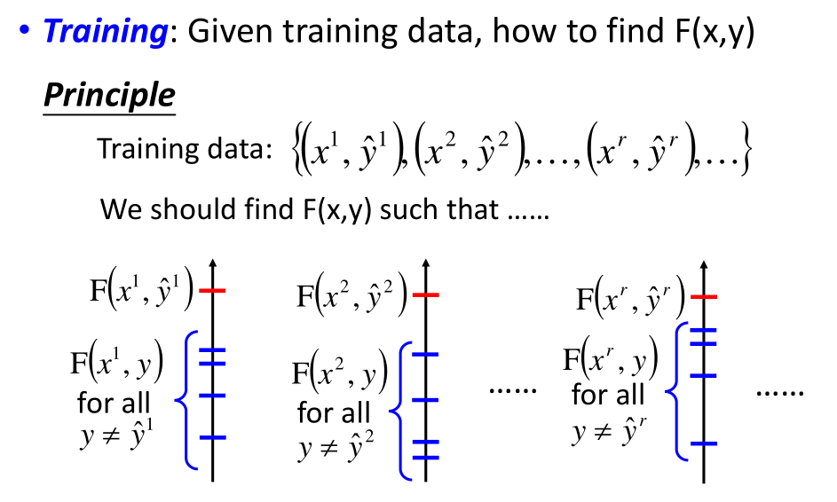

只要你解出这三个问题，你就可以做Structured Learning。

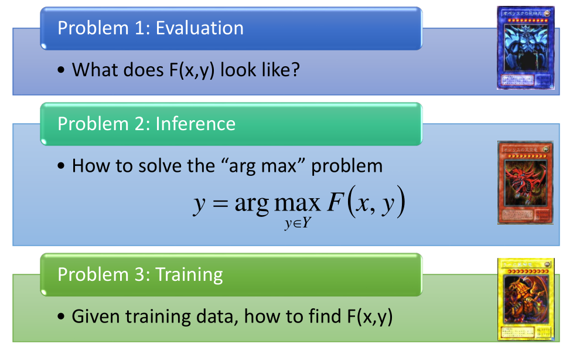

这三个问题可以跟HMM的三个问题联系到一起，也可以跟DNN联系到一起。

#### Link to DNN?

怎么说呢，比如说我们现在要做手写数字辨识，input一个image，把它分成10类，先把x扔进一个DNN，得到一个N(x)，接下来我再input y，y是一个vector，把这个y和N(x)算cross entropy， $-CE(N(x),y)$就是$F(x,y)$。

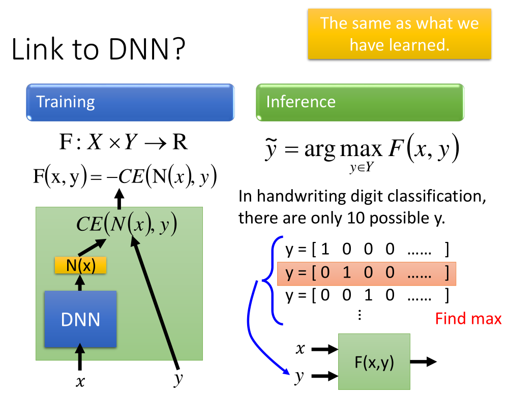

接下来，在testing的时候，就是说，我穷所有可能的辨识结果，也就是说10个y，每个都带进去这个Function里面，看哪个辨识结果能够让$F(x,y)$最大，它就是我的辨识结果。这个跟我们之前讲的知识是一模一样的。

## Structured Linear Model

### Solution

假如Problem 1中的F(x,y)有一种特殊的形式，那么Problem 3就不是个问题。所以我们就要先来讲special form应该长什么样子。

#### Problem 1

Evaluation: What does F(x,y) look like?

special form必须是Linear，也就是说一个(x,y)的pair，首先我用一组特征来描述(x,y)的pair，其中$\phi_{i}$代表一种特征，也就说(x,y)具有特征$\phi_1$是$\phi_1(x,y)$这个值，具有特征$\phi_2$是$\phi_2(x,y)$这个值，等等。然后F(x,y)它长得什么样子呢?
$$
F(x,y)=w_1\phi_1(x,y)+w_2\phi_2(x,y)+w_3\phi_3(x,y)+...\\
$$
向量形式可以写为$F(x,y)=\mathbf{w} ·\phi(x,y)$

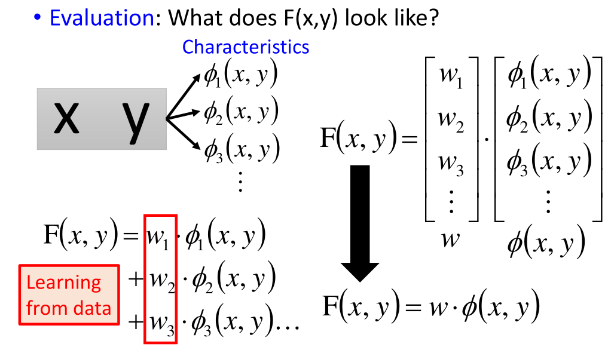

##### Object Detection

举个object detection的例子，框出Harihu，$\phi$函数可能为红色的pixel在框框里出现的百分比为一个维度，绿色的pixel在框框里出现的百分比为一个维度，蓝色的是一个维度，或者是红色在框框外的百分比是一个维度，等等，或者是框框的大小是一个维度。

现在image中比较state-of-the-art 可能是用visual word，visual word就是图片上的小方框片，每一个方片代表一种pattern，不同颜色代表不同的pattern，就像文章词汇一样。你就可以说在这个框框里面，编号为多少的visual word出现多少个就是一个维度的feature。

这些feature要由人找出来的吗？还是我们直接用一个model来抽呢，F(x,y)是一个linear function，它的能力有限，没有办法做太厉害的事情。如果你想让它最后performance好的话，那么就需要抽出很好的feature。用人工抽取的话，不见得能找出好的feature。

所以如果是在object detection 这个task上面，state-of-the-art 方法，比如你去train一个CNN，你可以把image丢进CNN，然后output一个vector，这个vector能够很好的代表feature信息。现在google在做object detection 的时候其实是用deep network 加上 structured learning 的方法做的，抽feature是用deep learning的方式来做，具体如下图

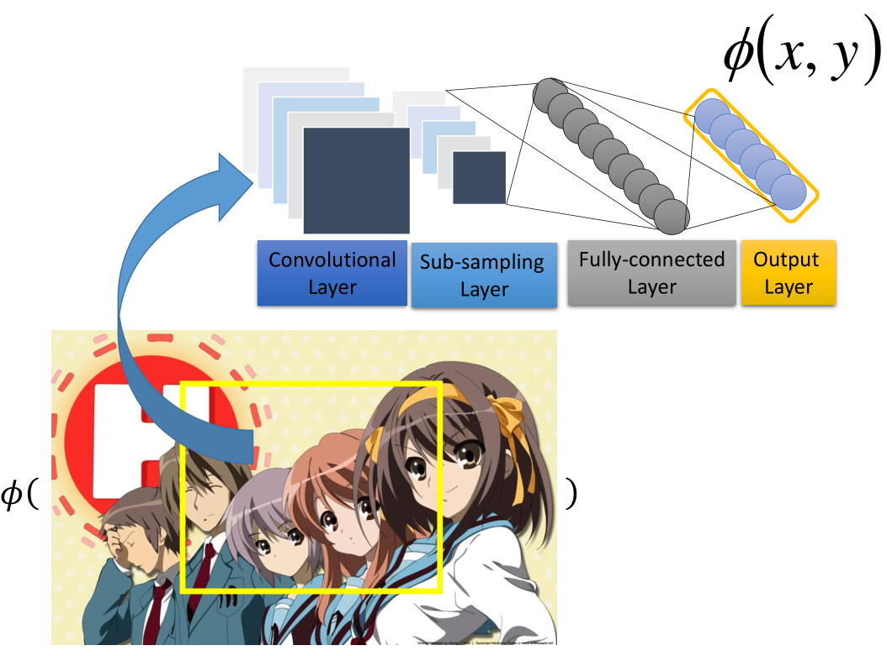

##### Summarization

你的x是一个document，y是一个paragraph。你可以定一些feature，比如说$\phi_1(x,y)$表示y里面包含“important”这个单词则为1，反之为0，包含的话y可能权重会比较大，可能是一个合理的summarization，或者是$\phi_2(x,y)$，y里面有没有包含“definition”这个单词，或者是$\phi_3(x,y)$，y的长度，或者你可以定义一个evaluation说y的精简程度等等，也可以想办法用deep learning找比较有意义的表示。具体如下图

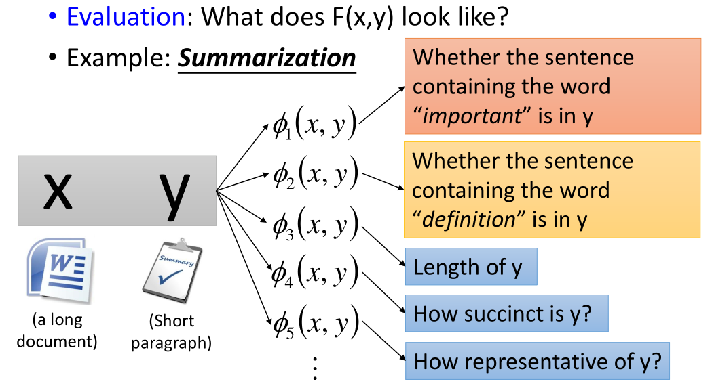

##### Retrieval

那比如说是Retrieval，其实也是一样啦。x是keyword，y是搜寻的结果。比如$\phi_1(x,y)$表示y第一笔搜寻结果跟x的相关度，或者$\phi_2(x,y)$表示y的第一笔搜寻结果有没有比第二笔高等等，或者y的Diversity的程度是多少，看看我们的搜寻结果是否包含足够的信息。具体如下图

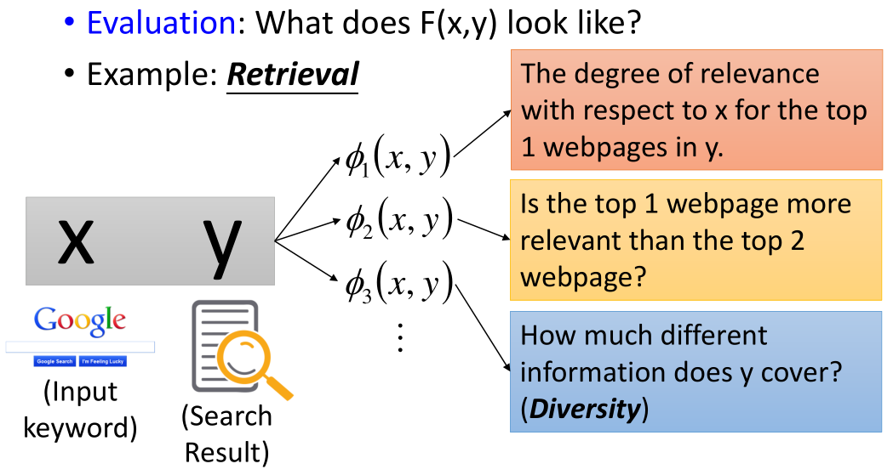

#### Problem 2

如果第一个问题定义好了以后，那第二个问题怎么办呢。$F(x,y)=w \cdot \phi(x,y)$ 但是我们一样需要去穷举所有的$y$，$y = arg \max _{y \in Y}w \cdot \phi(x,y)$ 来看哪个$y$可以让$F(x,y)$值最大。

这个怎么办呢？假设这个问题已经被解决了

#### Problem 3

假装第二个问题已经被解决的情况下，我们就进入第三个问题。

有一堆的Training data：$\{(x^1,\hat{y}^1),(x^2,\hat{y}^2),...,(x^r,\hat{y}^r,...)\}$，我希望找到一个function $F(x,y)$，其实是希望找到一个$w$，怎么找到这个$w$使得以下条件被满足：

对所有的training data而言，希望正确的$w\cdot \phi(x^r,\hat{y}^r)$应该大过于其他的任何$w\cdot \phi(x^r,y)$。

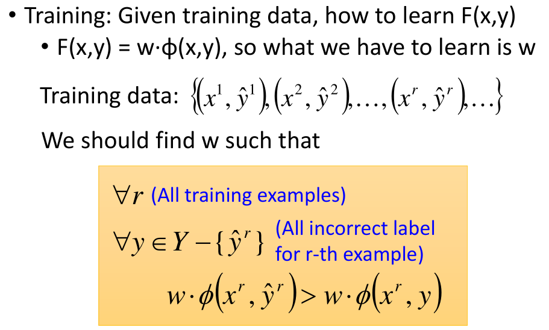

用比较具体的例子来说明，假设我现在要做的object detection，我们收集了一张image $x^1$，然后呢，知道$x^1$所对应的$\hat{y}^1$，我们又收集了另外一张图片，对应的框框也标出。对于第一张图，我们假设$(x^1,\hat{y}^1)$所形成的feature是红色$\phi(x^1,\hat{y}^1)$这个点，其他的y跟$x^1$所形成的是蓝色的点。红色的点只有一个，蓝色的点有好多好多。

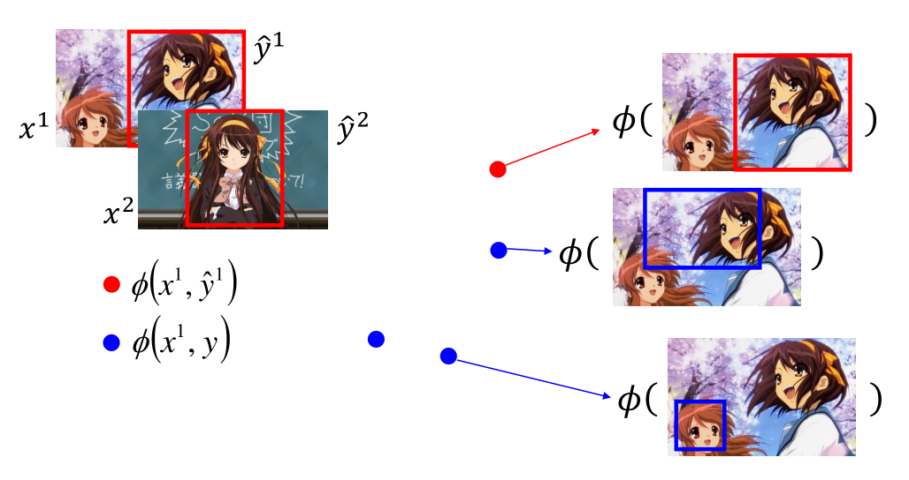

假设$(x^2,\hat{y}^2)$所形成的feature是红色的星星，$x^2$与其他的y所形成的是蓝色的星星。可以想象，红色的星星只有一个，蓝色的星星有无数个。把它们画在图上，假设它们是如下图所示位置

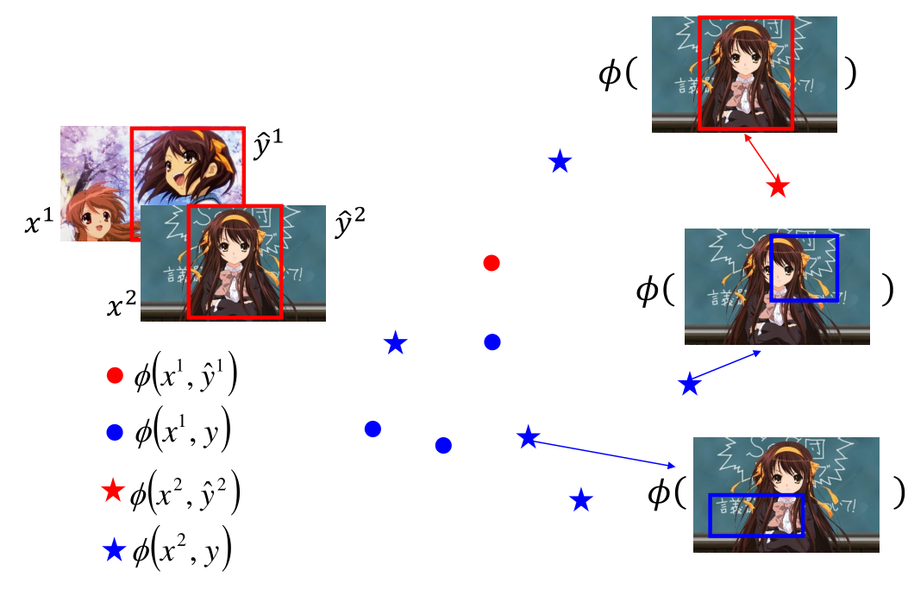

我们所要达到的任务是，希望找到一个$w$，那这个$w$可以做到什么事呢？我们把这上面的每个点，红色的星星，红色的圈圈，成千上万的蓝色圈圈和蓝色星星通通拿去和$w$做inner cdot后，我得到的结果是红色星星所得到的大过于所有蓝色星星，红色的圈圈大过于所有红色的圈圈所得到的值。

不同形状之间我们就不比较。圈圈自己跟圈圈比，星星自己跟星星比。做的事情就是这样子，也就是说我希望正确的答案结果大于错误的答案结果，即$w \cdot \phi(x^1,\hat{y}^1) \geq w \cdot \phi(x^1,y^1),w \cdot \phi(x^2,\hat{y}^2) \geq w \cdot \phi(x^2,y^2)$。

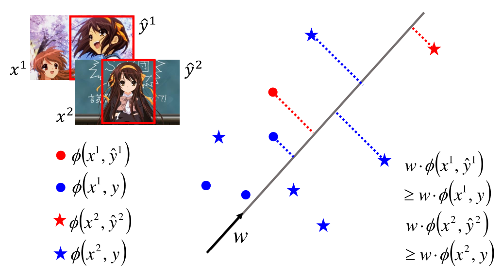

你可能会觉得这个问题会不会很难，蓝色的点有成千上万，我们有办法找到这样的$w$吗？这个问题没有我们想象中的那么难，以下我们提供一个演算法。

##### Algorithm

输入：训练数据$\{(x^1,\hat{y}^1),(x^2,\hat{y}^2),...,(x^r,\hat{y}^r),...\}$

输出：权重向量 $w$

假设我刚才说的那个要让红色的大于蓝色的vector，只要它存在，用这个演算法可以找到答案。

这个演算法是长什么样子呢？这个演算法的input就是我们的training data，output就是要找到一个vector $w$，这个vector $w$要满足我们之前所说的特性。

一开始，我们先initialize $w=0$，然后开始跑一个循环，这个循环里面，每次我们都取出一笔training data  $(x^r,\hat{y}^r)$，然后我们去找一个$\tilde{y}^r$，它可以使得$w \cdot (x^r,y)$的值最大，那么这个事情要怎么做呢？

这个问题其实就是Problem 2，我们刚刚假设这个问题已经解决了的，如果找出来的$\tilde{y}^r$不是正确答案，即$\tilde{y}^r \neq \hat{y}^r$，代表这个$w$不是我要的，就要把这个$w$改一下。

怎么改呢？把$\phi(x^r,\hat{y}^r)$计算出来，把$\phi(x^r,\tilde{y}^r)$也计算出来，两者相减在加到$w$上，update $w$。

有新的$w$后，再去取一个新的example，然后重新算一次max，如果算出来不对再update，步骤一直下去，如果我们要找的$w$是存在的，那么最终就会停止。

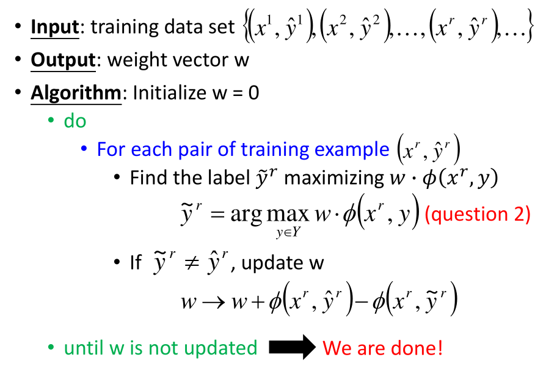

这个算法有没有觉得很熟悉呢？这就是perceptron algorithm。perceptron 做的是二元分类， 其实也是structured learning 的一个特例，它们的证明几乎是一样的。

举个例子来说明一下，刚才那个演算法是怎么运作的。

我们的目标是要找到一个$w$，它可以让红色星星大过蓝色星星，红色圈圈大过蓝色圈圈，假设这个$w$是存在的。首先我们假设$w=0$，然后我们随便pick 一个example $(x^1,\hat{y}^1)$，根据手上的data 和 $w$ 去看 哪一个$\tilde{y}^1$使得$w \cdot \phi(x^1,y)$的值最大。

现在$w=0$，不管是谁，所算出来的值都为0，所以结果值都是一样的。那么没关系，我们随机选一个$y$当做$\tilde{y}^1$就可以。我们假设选了下图的点作为$\tilde{y}^1$，选出来的$\tilde{y}^1 \neq \hat{y}^1$，对$w$进行调整，把$\phi(x^r,\hat{y}^r)$值减掉$\phi(x^r,\tilde{y}^r)$的值再和$w$加起来，更新$w$
$$
w \rightarrow w + \phi(x^1,\hat{y}^1) -\phi(x^1,\tilde{y}^1)     
$$

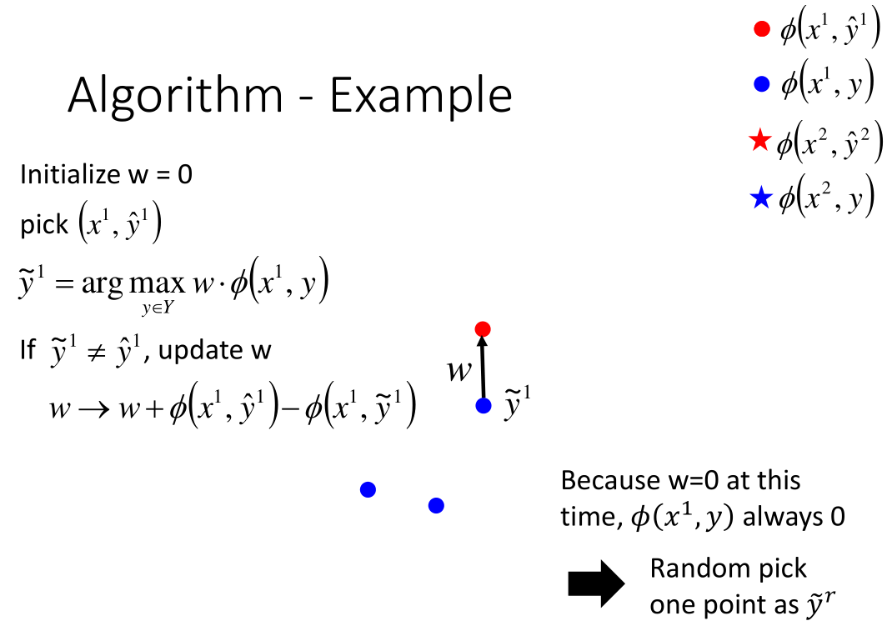

我们就可以获取到第一个$w$，第二步呢，我们就在选一个example  $(x^2,\hat{y}^2）$，穷举所有可能的$y$，计算$w \cdot \phi(x^2,y)$，找出值最大时对应的$y$，假设选出下图的$\tilde{y}^2$，发现不等于$\hat{y}^2$，按照公式$w \rightarrow w+\phi\left(x^{2}, \hat{y}^{2}\right)-\phi\left(x^{2}, \tilde{y}^{2}\right)$更新$w$，得到一个新的$w$。

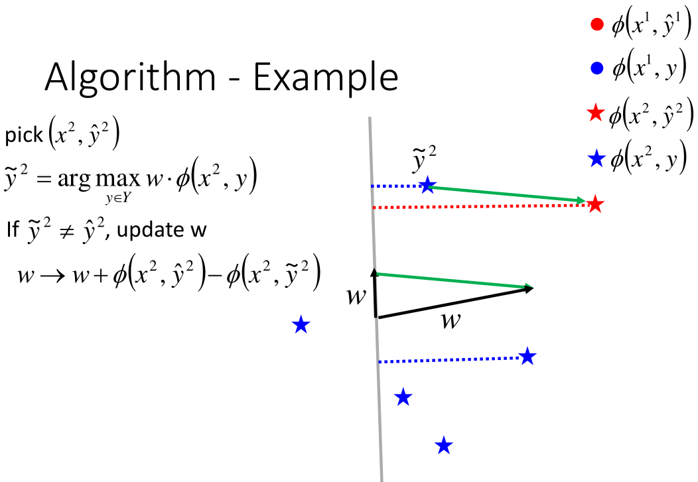

然后再取出$(x^1,\hat{y}^1)$，得到$\tilde{y}^1=\hat{y}^2$，对于第一笔就不用更新。再测试第二笔data，发现$\tilde{y}^1 = \hat{y}^2$，$w$也不用更新，等等。看过所有data后，发现$w$不再更新，就停止整个training。所找出的$w$可以让$\tilde{y}^r = \hat{y}^r$。

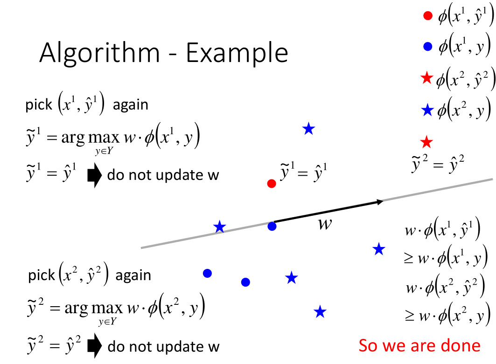

下一节会证明这个演算法的收敛性，即演算法会结束。

## Structured SVM

结构化学习要解决的问题，即需要找到一个强有力的函数 **f**
$$
f : X \rightarrow Y
$$

> 1. 输入和输出都是结构化的对象；
> 2. 对象可以为：sequence(序列)，list(列表)，tree(树结构)，bounding box(包围框)，等等

其中，**X**是一种对象的空间表示，**Y**是另一种对象的空间表示。

这些问题有一个Unified Framework，只有两步

  - 第一步：训练

    - 寻找一个函数 **F**，input是x和y，output是一个real number
      $$
      \mathrm{F} : X \times Y \rightarrow \mathrm{R}
      $$

    - $F(x, y)$: 用来评估对象x和y的兼容性 or 合理性

  - 第二步：推理 or 测试

    - 即给定任意一个x，穷举所有的y，将$(x, y)$带入F，找出最适当的y作为系统的输出。
      $$
      \tilde{y}=\arg \max _{y \in Y} F(x, y)
      $$

虽然这个架构看起来很简单，但是想要使用的话要回答三个问题

  - Q1: 评估

    - **What** does F(x,y) look like?

  - Q2: 推理

    - **How** to solve the “arg max” problem，y的可能性很多，穷举是一件很困难的事，需要找到某些方法解optimization的问题
      $$
      \tilde{y}=\arg \max _{y \in Y} F(x, y)
      $$

  - Q3: 训练

    - 给定训练数据，如何求解 F(x, y)？

### Example Task: Object Detection

有比找框框更复杂的问题，比如画出物体轮廓，找出人的动作，甚至不只是image processing的问题，这些问题都可以套用接下来的解法。

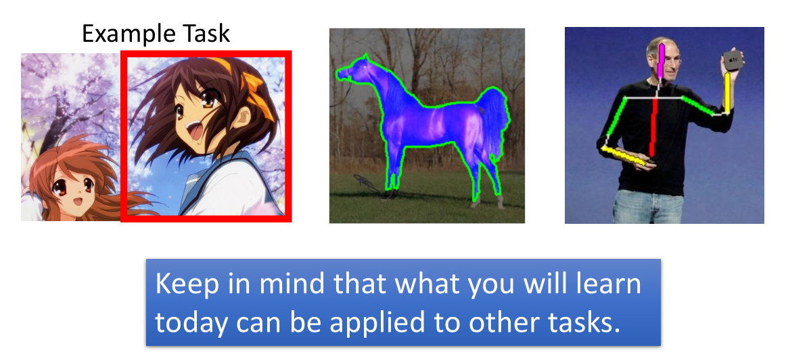

- Q1: Evaluation

  - 假设$F(x, y)$是线性的，$F(x,y)=w \cdot \phi(x,y)$，$\phi$是人为定义的规则，w是在Q3中利用训练数据来学习到的参数。

  - 开放问题：如果$F(x,y)$不是线性，该如何处理？$F$是线性的话会很weak，依赖于复杂的抽取特征的方式$\phi$，我们希望机器做更复杂的事，减少人类的接入。如果是非线性的话等下的讨论就不成立了，因此目前的讨论多数是基于线性的$F$。

- Q2: Inference
  $$
  \tilde{y}=\arg \max _{y \in \mathbb{Y}} w \cdot \phi(x, y)
  $$
  即给定一张图片x，穷举出所有可能的标记框y，对每一对(x, y)，用$w\cdotϕ$计算出一对分数最大的(x, y)，我们就把对应的y作为输出。

  算法的选择取决于task，也取决于$ϕ(x, y)$

  - 对于Object Detection可以选择的解决方法有
    - Branch & Bound algorithm(分支定界法)
    - Selective Search(选择性搜索)
  - Sequence Labeling
    - Viterbi Algorithm(维特比译码算法)
  - Genetic Algorithm(基因演算)
  - 开放问题：What happens if the inference is non exact? 对结果影响会有多大呢？这件事目前还没有太多讨论。

- Q3: Training

  - Principle

    对所有的training data$\left\{\left(x^{1}, \hat{y}^{1}\right),\left(x^{2}, \hat{y}^{2}\right) \ldots,\left(x^{\mathrm{N}}, \hat{y}^{\mathrm{N}}\right)\right\}$而言，希望正确的$F(x^r,\hat{y}^r)$应该大过于其他的任何$F(x^r,y)$。

    假定我们已经解决了Q1和Q2，只关注Q3如何处理：找到最佳的$F(x, y)$。

### Assumption: Separable

 Separable：存在一个权值向量$\hat{w}$，使得：
$$
\begin{aligned} \hat{w} \cdot \phi\left(x^{1}, \hat{y}^{1}\right) & \geq \hat{w} \cdot \phi\left(x^{1}, y\right)+\delta \\ \hat{w} \cdot \phi\left(x^{2}, \hat{y}^{2}\right) & \geq \hat{w} \cdot \phi\left(x^{2}, y\right)+\delta \end{aligned}
$$

红色代表正确的特征点(feature point)，蓝色代表错误的特征点(feature point)，可分性可以理解为，我们需要找到一个权值向量，其与 $ϕ(x, y)$ 做内积(inner product) ，能够让正确的point比蓝色的point的值均大于一个$δ$。

如果可以找到的话，就可以用以下的演算法找出w

#### Structured Perceptron

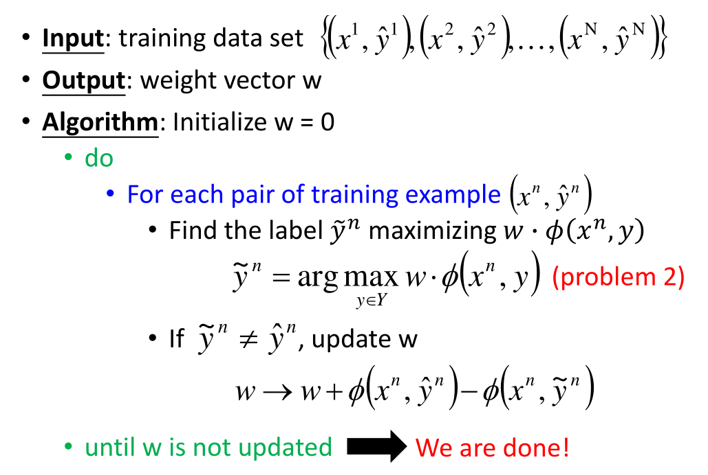

**输入**：训练数据集
$$
  \left\{\left(x^{1}, \hat{y}^{1}\right),\left(x^{2}, \hat{y}^{2}\right) \ldots,\left(x^{\mathrm{N}}, \hat{y}^{\mathrm{N}}\right)\right\}
$$

**输出**：可以让data point separate 的 weight vector w

**算法**：首先我们假设$w=0$，然后我们随便pick 一个example $(x^1,\hat{y}^1)$，根据手上的data 和 $w$ 去看 哪一个$\tilde{y}^1$使得$w \cdot \phi(x^1,y)$的值最大。假设选出来的$\tilde{y}^1 \neq \hat{y}^1$，对$w$进行调整，把$\phi(x^r,\hat{y}^r)$值减掉$\phi(x^r,\tilde{y}^r)$的值再和$w$加起来，更新$w$。不断进行iteration，当对于所有data来说，找到的$\tilde{y}^n$与$\hat{y}^n$都相等，$w$不再更新，就停止整个training。所找出的$w$可以让$\tilde{y}^r = \hat{y}^r$。

问题是这个演算法要花多久的时间才可以收敛，是否可以轻易的找到一个vector把蓝色的点和红色的点分开？

**结论**：在可分情形下，我们最多只需更新$(R / \delta)^{2}$次就可以找到$\hat{w}$。其中，$δ$为margin(使得误分的点和正确的点能够线性分离)，$R$为$ϕ(x, y)$ 与 $ϕ(x, y')$的最大距离，与y的space无关，因此蓝色的点非常多也不会影响我们update的次数。

#### Proof of Termination

一旦有错误产生，w将会被更新
$$
w^{0}=0 \rightarrow w^{1} \rightarrow w^{2} \rightarrow \ldots \ldots \rightarrow w^{k} \rightarrow w^{k+1} \rightarrow \ldots \ldots\\w^{k}=w^{k-1}+\phi\left(x^{n}, \hat{y}^{n}\right)-\phi\left(x^{n}, \widetilde{y}^{n}\right))
$$

注意：此处我们仅考虑可分情形

假定存在一个权值向量$\widehat{w}$使得对于$\forall n$（所有的样本）、$\forall y \in Y-\left\{\hat{y}^{n}\right\}$（对于一个样本的所有不正确的标记）

$$
  \hat{w} \cdot \phi\left(x^{n}, \hat{y}^{n}\right) \geq \hat{w} \cdot \phi\left(x^{n}, y\right)+\delta
$$
不失一般性，假设$\|\widehat{w}\|=1$

**证明：**随着k的增加$\hat{w}$与$w^{k}$之间的角度$\rho_{\mathrm{k}}$将会变小，$\cos \rho_{k}$会越来越大
$$
\cos \rho_{k}=\frac{\hat{w}}{\|\hat{w}\|} \cdot \frac{w^{k}}{\left\|w^{k}\right\|}
$$

$$
\begin{aligned} \hat{w} \cdot w^{k} &=\hat{w} \cdot\left(w^{k-1}+\phi\left(x^{n}, \hat{y}^{n}\right)-\phi\left(x^{n}, \widetilde{y}^{n}\right)\right) \\ &=\hat{w} \cdot w^{k-1}+\hat{w} \cdot \phi\left(x^{n}, \hat{y}^{n}\right)-\hat{w} \cdot \phi\left(x^{n}, \widetilde{y}^{n}\right) \end{aligned}
$$

在可分情形下，有
$$
  [\hat{w} \cdot \phi\left(x^{n}, \hat{y}^{n}\right)-\hat{w} \cdot \phi\left(x^{n}, \widetilde{y}^{n}\right)]\geq \delta
$$
所以得到
$$
  \hat{w} \cdot w^{k} \geq \hat{w} \cdot w^{k-1}+\delta
$$
可得：
$$
\hat{w} \cdot w^{1} \geq \hat{w} \cdot w^{0}+ \delta \quad and \quad w^{0}=0  \Rightarrow  \ \hat{w} \cdot w^{1} \geq   \delta \\
\hat{w} \cdot w^{2} \geq \hat{w} \cdot w^{1}+ \delta \quad and \quad  \hat{w} \cdot w^{1} \geq \delta \Rightarrow\hat{w} \cdot w^{2} \geq   2\delta 

  \\......\\\hat{w} \cdot w^{k} \geq k\delta
$$
分子项不断增加

考虑分母$\left\|w^{k}\right\|$，$w^k$的长度
$$
  w^{k}=w^{k-1}+\phi\left(x^{n}, \hat{y}^{n}\right)-\phi\left(x^{n}, \widetilde{y}^{n}\right)
$$
则：
$$
\left\|w^{k}\right\|^{2}=\| w^{k-1}+\phi\left(x^{n}, \hat{y}^{n}\right)-\phi\left.\left(x^{n}, \widetilde{y}^{n}\right)\right|^{2}\\
  =\left\|w^{k-1}\right\|^{2}+\left\|\phi\left(x^{n}, \hat{y}^{n}\right)-\phi\left(x^{n}, \widetilde{y}^{n}\right)\right\|^{2}+2 w^{k-1} \cdot\left(\phi\left(x^{n}, \hat{y}^{n}\right)-\phi\left(x^{n}, \widetilde{y}^{n}\right)\right)
$$
其中，
$$
\| \phi\left(x^{n}, \hat{y}^{n}\right)-\phi\left(x^{n}, \widetilde{y}^{n}\right)\|^{2}\gt 0
  \\2 w^{k-1} \cdot\left(\phi\left(x^{n}, \hat{y}^{n}\right)-\phi\left(x^{n}, \widetilde{y}^{n}\right)\right)\lt0
$$
由于w是错误的，和此时找出的$\tilde y^n$内积要大于与正确$\hat{y}^{n}$的内积，因此第二个式子是小于零。

我们假设任意两个特征向量之间的距离$\| \phi\left(x^{n}, \hat{y}^{n}\right)-\phi\left(x^{n}, \widetilde{y}^{n}\right)\|^{2}$小于R，则有
$$
\left\|w^{k}\right\|^{2}\leq\left\|w^{k-1}\right\|^{2}+\mathrm{R}^{2}
$$
于是
$$
  \left\|w^{1}\right\|^{2} \leq\left\|w^{0}\right\|^{2}+\mathrm{R}^{2}=\mathrm{R}^{2}\\
  \left\|w^{2}\right\|^{2} \leq\left\|w^{1}\right\|^{2}+\mathrm{R}^{2}\leq2\mathrm{R}^{2}\\
  ......\\ \left\|w^{k}\right\|^{2} \leq k\mathrm{R}^{2}
$$
综上可以得到
$$
  \hat{w} \cdot w^{k} \geq k \delta \qquad \left\|w^{k}\right\|^{2} \leq k \mathrm{R}^{2}
$$
则
$$
\cos \rho_{k}=\frac{\hat{w}}{\|\hat{w}\|} \cdot \frac{w^{k}}{\left\|w^{k}\right\|}
  \geq \frac{k \delta}{\sqrt{k R^{2}}}=\sqrt{k} \frac{\delta}{R} \leq 1
$$
因此随着k的增加，$\cos \rho_{k}$的lower bound也在增加，并且$\cos \rho_{k} \leq 1$

即得到
$$
k \leq\left(\frac{R}{\delta}\right)^{2}.
$$

#### How to make training fast?

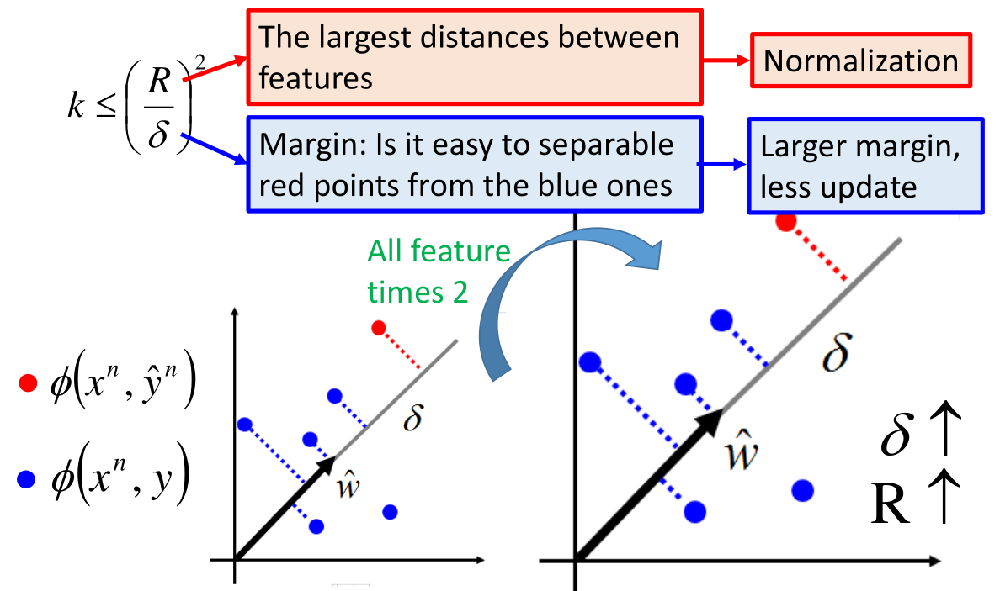

单纯把feature×2，随着$δ$的增大，$R$也会增大，因此training不会变快

### Non-separable Case

虽然可能没有任何一个vector可以让正确和错误答案完全分开，但是还是可以鉴别出vector的好坏。比如下图左就比右要好。

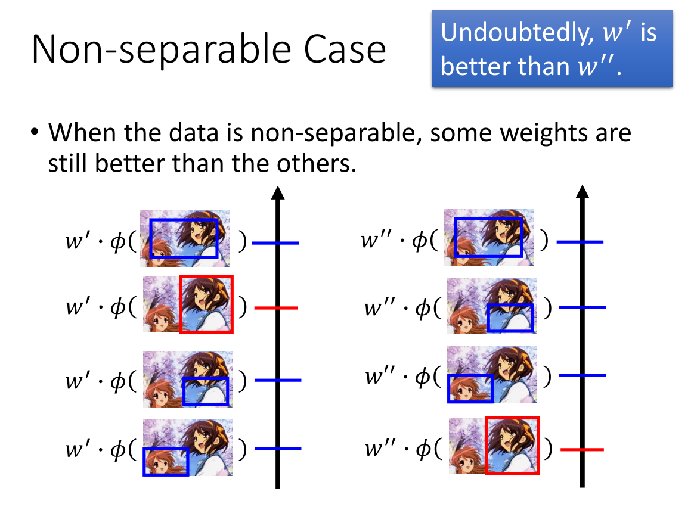

#### Defining Cost Function

定义一个成本函数C来评估w的效果有多差，然后选择w，从而最小化成本函数C。

第n笔data的Cost为，在此w下，与$x^n$最匹配的$y$的分数减去真实的$\hat y$的分数
$$
  C^{n}=  \max _{y}\left[w \cdot \phi\left(x^{n}, y\right)\right] -w \cdot \phi\left(x^{n}, \hat{y}^{n}\right) \\ C=\sum_{n=1}^{N} C^{n}  
$$
What is the minimum value?

$C^n \geq 0$

Other alternatives?

Problem 2中已经计算出了第一名的值是多少，因此用第一名的值减去$\hat y$最方便，其他的方案，比如用前三名的值，需要算出前三名的结果才可以

#### (Stochastic) Gradient Descent

Find w minimizing the cost 𝐶
$$
C=\sum_{n=1}^{N} C^{n}\\C^{n}=\max _{y}\left[w \cdot \phi\left(x^{n}, y\right)\right]-w \cdot \phi\left(x^{n}, \hat{y}^{n}\right)
$$
我们只需要算出$C^n$的梯度，就可以利用梯度下降法，但是式子中有$max$，如何求梯度？

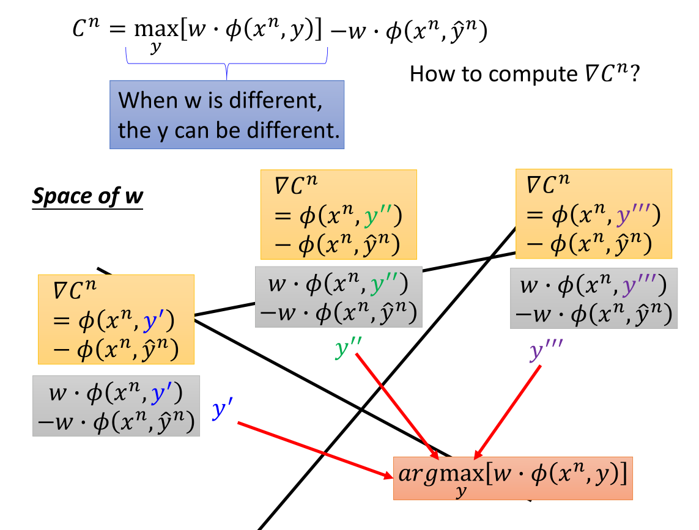

当w不同时，得到的$y=\arg \max _{y}\left[w \cdot \phi\left(x^{n}, y\right)\right]$也会改变；假设w的space被$y=\arg \max _{y}\left[w \cdot \phi\left(x^{n}, y\right)\right]$切割成好几块，得到的$y=\arg \max _{y}\left[w \cdot \phi\left(x^{n}, y\right)\right]$分别等于$$y^{\prime },y^{\prime \prime  },y^{\prime \prime \prime}$$，在边界的地方没有办法微分，但是在每一个region里面都是可以微分的。得到的梯度如图中黄色方框中。

利用(Stochastic) Gradient Descent求解

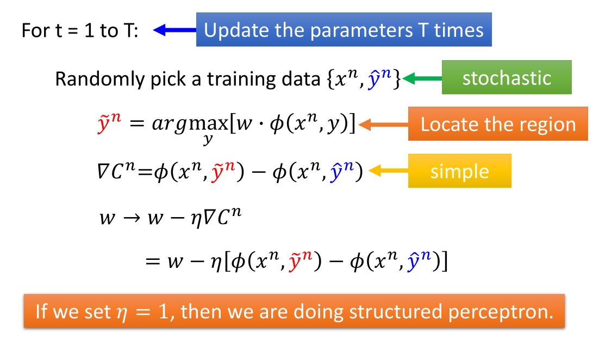

当学习率设为1时，就转换为structured perceptron。

### Considering Errors

在刚才，所有错误是视为一样的，然而不同的错误之间是存在差异的，错误可以分为不同的等级，我们在训练时需要考虑进去。比如框在樱花树上分数会特别低，框在凉宫春日脸上，分数会比较高，接近正确的分数也是可以的。如果有一个w只知道把正确的摆在第一位；相反另一个w，可以按照方框好坏来排序，那learn到的结果是比较安全的，因为分数比较高的和第一名差距没有很大。

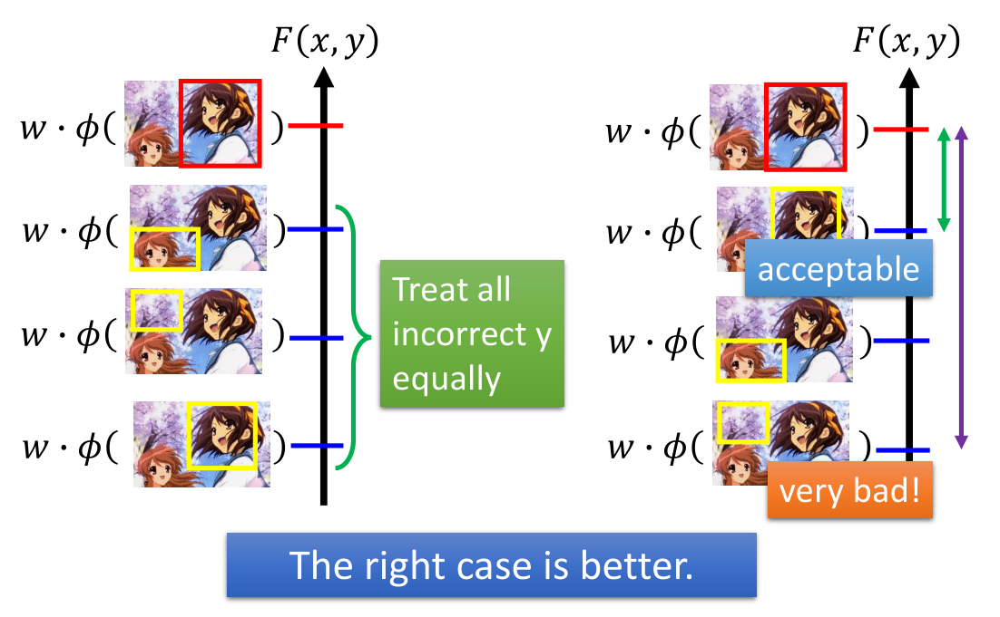

#### Defining Error Function

错误的结果和正确的结果越像，那么分数的差距比较小；相反，差距就比较大。问题是如何衡量这种差异呢？

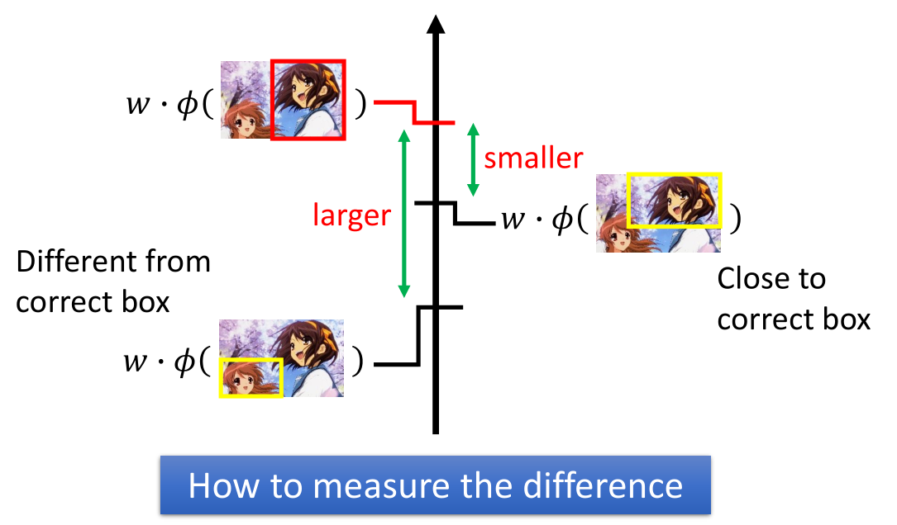

$\hat{y}$(正确的标记)与某一个$y$之间的差距定义为$\Delta(\hat{y}, y)$（>0），如果和真实结果相同$\Delta=0$，具体形式根据任务不同而不同。

在下面的讨论中我们定义为

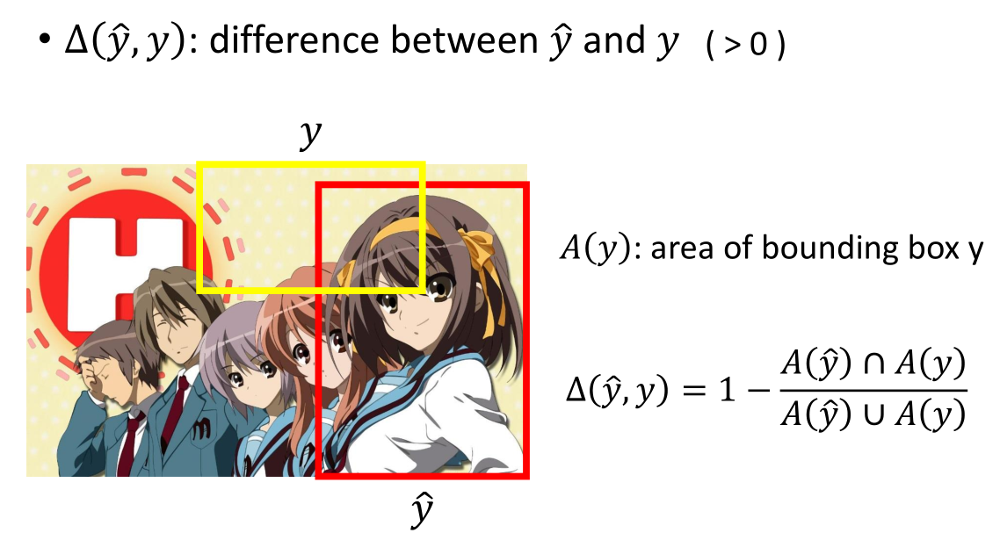

#### Another Cost Function

修改Cost Function，本来的Cost是取分数最高的$y$的分数减去$\hat y$得到的分数；

我们会把y的分数加上$Δ$，这样可以使得当存在与$x^n$最匹配的y分数大，margin也大的项时，Cost会很大，当分数大，$Δ$小，我们才认为他是真正的比较好的。

当$Δ$很大时，我们希望他的分数很小；当$Δ$很小时，即使它的分数高也没有关系。margin越大，也就说明和真实之间的差距越大，损失也就越大，当然你可以定其他的差距式子，定的好不好可能会影响损失函数的结果。

什么时候Cost最小？当真实值比最大的y+margin的值还要大时，Cost最小。
$$
\\ {C^{n}=\max _{y}\left[\Delta\left(\hat{y}^{n}, y\right)+w \cdot \phi\left(x^{n}, y\right)\right]-w \cdot \phi\left(x^{n}, \hat{y}^{n}\right)}
$$

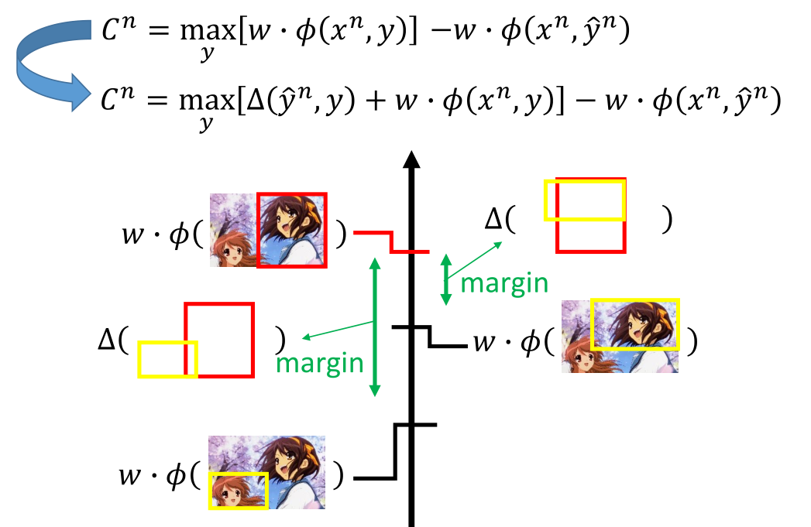

##### Gradient Descent

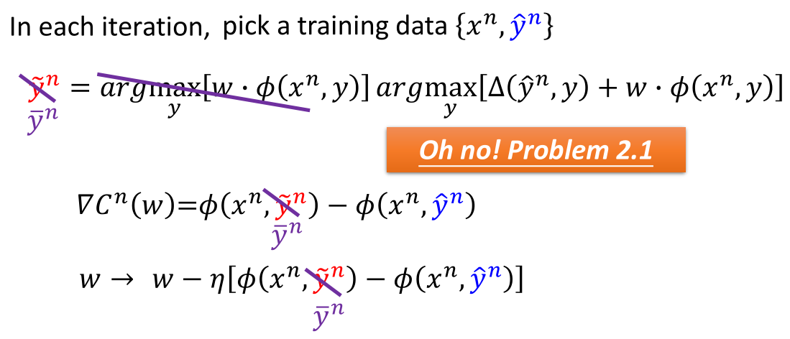

#### Another Viewpoint

我们也可以从另外一个角度来分析，最小化新的目标函数，其实就是最小化训练集里的损失上界，我们想最小化我们的最大y和真实y之间的差距本来是这样的，假设我们的output是$\tilde{y}$，希望minimize $C^{\prime}$  。

但是这个很难，因为$\Delta$可能是任何的函数，比如阶梯状函数，就不好微分了，梯度下降法就不好做了，比如语音识别，就算w有改变，但是$\Delta$不一定就有改变，可能要到某个点上才可能会出现变化。所以我们就最小化它的上界，或许没办法让他变小，至少不会变大。

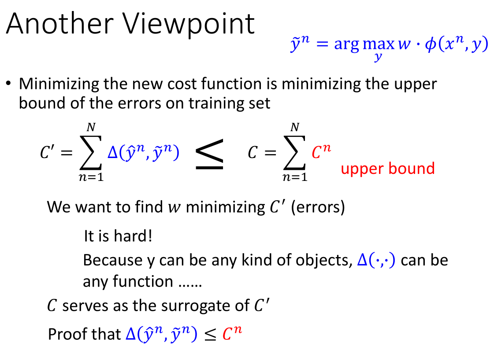

那接下来就是证明上面的式子为什么最小化新的代价函数，就是在最小化训练集上误差的上界：
$$
C^{\prime}=\sum_{n=1}^{N} \Delta\left(\hat{y}^{n}, \tilde{y}^{n}\right) \leq C=\sum_{n=1}^{N} C^{n}
$$
只需要证明：
$$
\Delta\left(\hat{y}^{n}, \tilde{y}^{n}\right) \leq C^{n}
$$

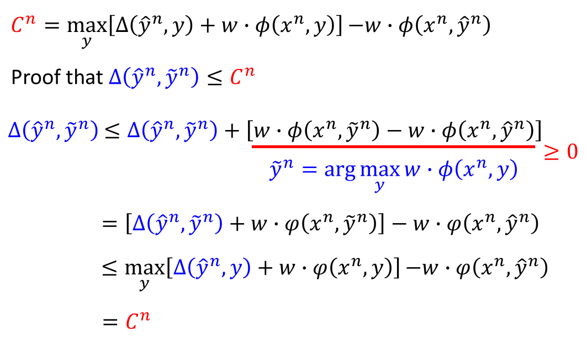

#### More Cost Functions

也可以满足下式
$$
  \Delta\left(\hat{y}^{n}, \tilde{y}^{n}\right) \leq C^{n}
$$

  - **Margin Rescaling**(间隔调整)
    $$
    C^{n}=\max _{y}\left[\Delta\left(\hat{y}^{n}, y\right)+w \cdot \phi\left(x^{n}, y\right)\right]-w \cdot \phi\left(x^{n}, \hat{y}^{n}\right)
    $$

  - **Slack Variable Rescaling**(松弛变量调整)
    $$
    C^{n}=\max _{y} \Delta\left(\hat{y}^{n}, y\right)\left[1+w \cdot \phi\left(x^{n}, y\right)-w \cdot \phi\left(x^{n}, \hat{y}^{n}\right)\right]
    $$

### Regularization

训练数据和测试数据可以有不同的分布；

如果w与0比较接近，那么我们就可以最小化误差匹配的影响；

即在原来的基础上，加上一个正则项$\frac{1}{2}\|w\|^{2}$，$λ$为权衡参数；
$$
C=\sum_{n=1}^{N} C^{n}\quad \Rightarrow \quad C=\lambda \sum_{n=1}^{N} C^{n}+\frac{1}{2}\|w\|^{2}
$$

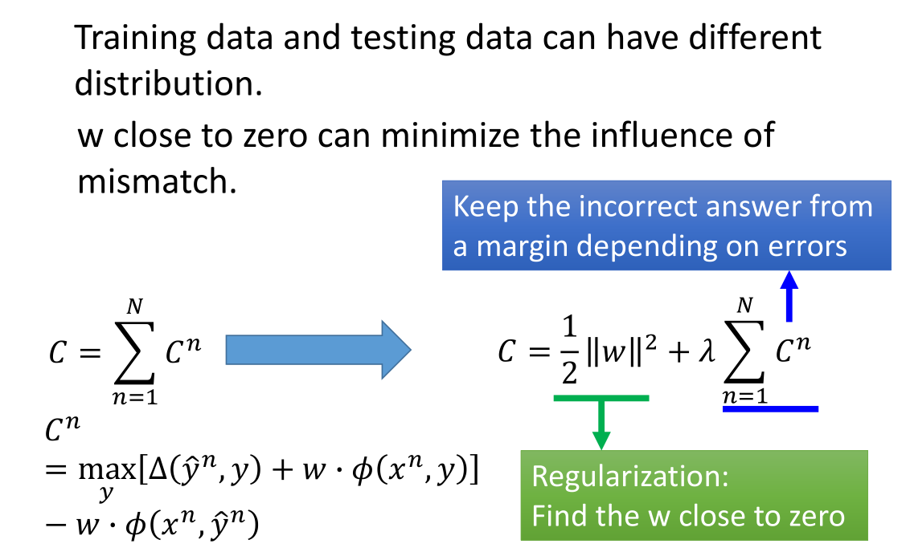

每次迭代，选择一个训练数据$\left\{x^{n}, \hat{y}^{n}\right\}$

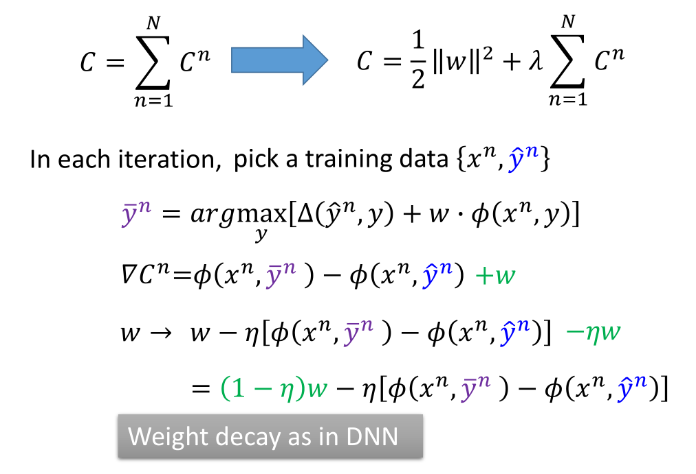

得到的结果类似于**DNN**中的**weight decay**

### Structured SVM

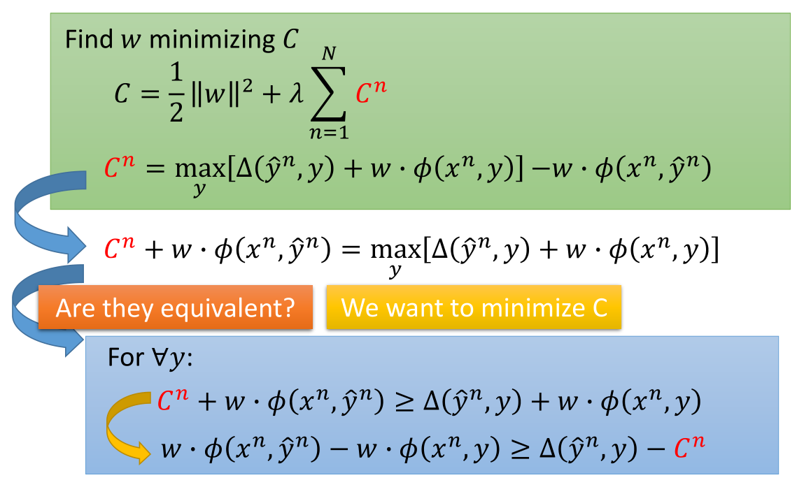

注意：第二个蓝色箭头并不完全等价，当最小化$C^n$时等价。

一般我们将$C^n$用$ε^n$代替之，表示松弛变量，此时条件变成了Find $ {w}, \varepsilon^{1}, \cdots, \varepsilon^{N}$ minimizing $C$

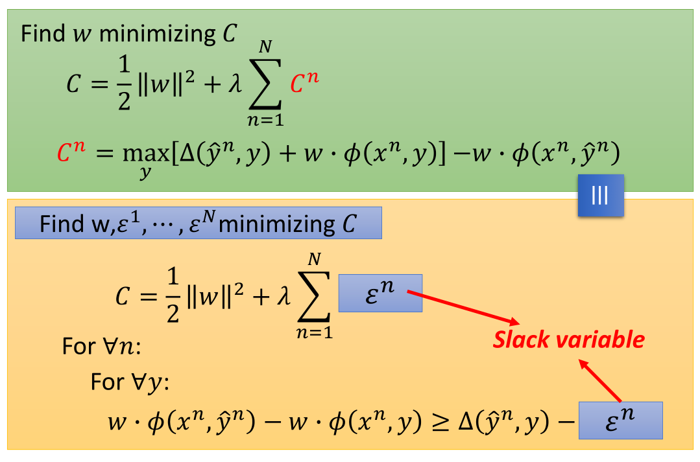

单独讨论$ {y}=\hat{y}^{n}$时的情况，得到新的表达式

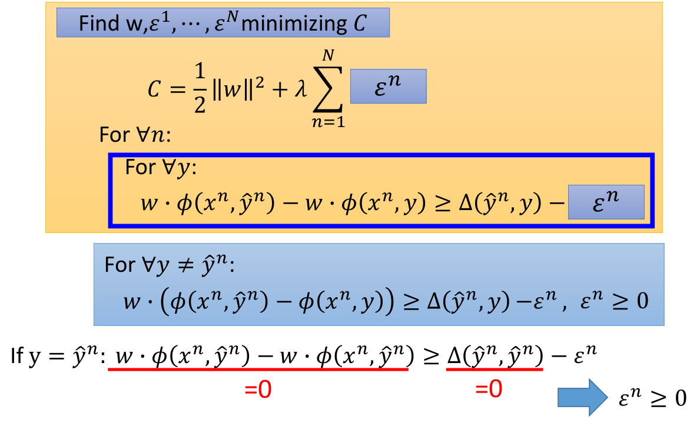

#### Intuition

我们希望分数差大于margin

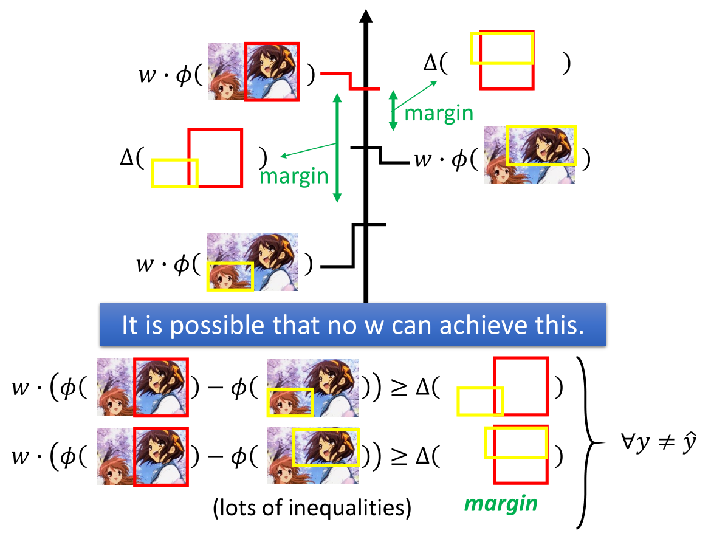

我们可能找不到一个w满足以上所有的不等式都成立。

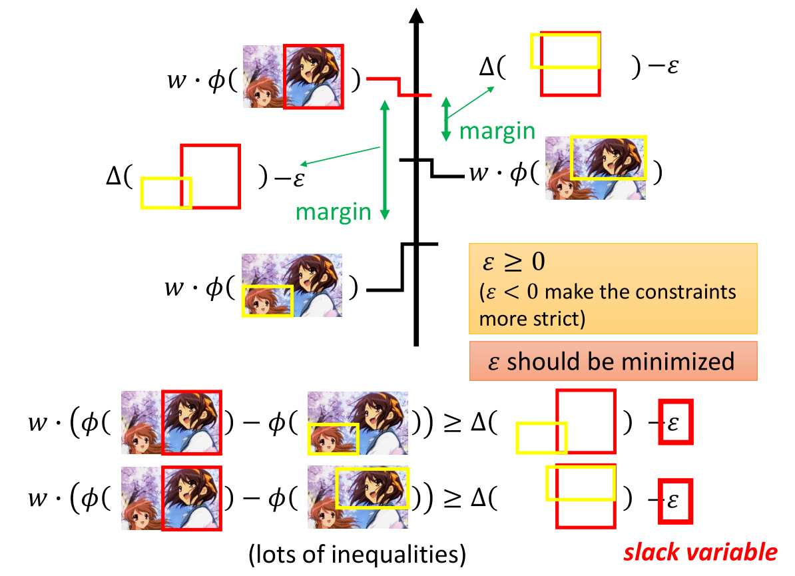

因此将margin减去一个$ε$（为了放宽限制，但限制不应过宽，否则会失去意义，$ε$越小越好，且要大于等于0）

假设，我们现在有两个训练数据：$\left(x^{1}, \hat{y}^{1}\right) 和 \left(x^{2}, \hat{y}^{2}\right)$

对于$x^{1}$而言，我们希望正确的分数减去错误的分数大于它们之间的$\Delta$减去$\varepsilon^{1}$，同时满足$ \varepsilon^{1} \geq 0$

对于$x^{2}$而言，同理，我们希望正确的分数减去错误的分数，要求大于它们之间的$\Delta$减去$\varepsilon^{2}$，同时满足： $\varepsilon^{2} \geq 0$

在满足以上这些不等式的前提之下，我们希望$\lambda \sum_{n=1}^{2} \varepsilon^{n}$是最小的，同时加上对应的正则项也满足最小化。

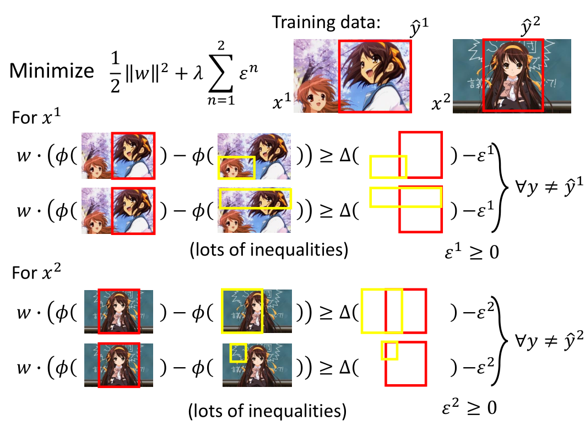

我们的目标是，求得$w, \varepsilon^{1}, \cdots, \varepsilon^{N}$，最小化C
$$
C=\frac{1}{2}\|w\|^{2}+\lambda \sum_{n=1}^{N}\varepsilon^{n}
$$
同时，要满足：

对所有的训练样本的所有不是正确答案的标记，$w \cdot\left(\phi\left(x^{n}, \hat{y}^{n}\right)-\phi\left(x^{n}, y\right)\right) \geq \Delta\left(\hat{y}^{n}, y\right)-\varepsilon^{n}, \quad \varepsilon^{n} \geq 0$

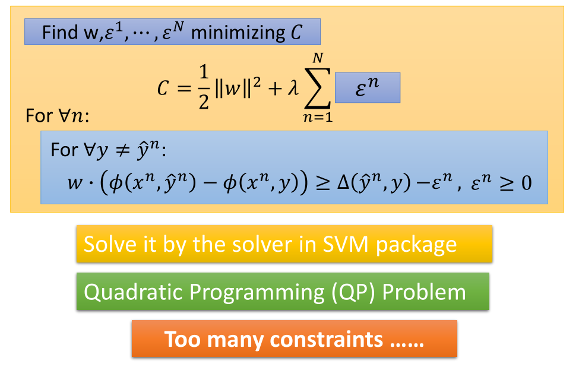

可以利用**SVM包**中的solver来解决以上的问题；是一个二次规划(Quadratic Programming **QP**)的问题；但是约束条件过多，需要通过切割平面算法(**Cutting Plane Algorithm**)解决受限的问题。

### Cutting Plane Algorithm for Structured SVM

在$w$和$ε^i$组成的参数空间中，颜色表示C的值，在没有限制的情况下，$w$和$ε$越小越好，在有限制的情况下，只有内嵌的多边形区域内是符合约束条件的，因此需要在该区域内寻找最小值，即
$$
C=\frac{1}{2}\|w\|^{2}+\lambda \sum_{n=1}^{N} \varepsilon^{n}
$$

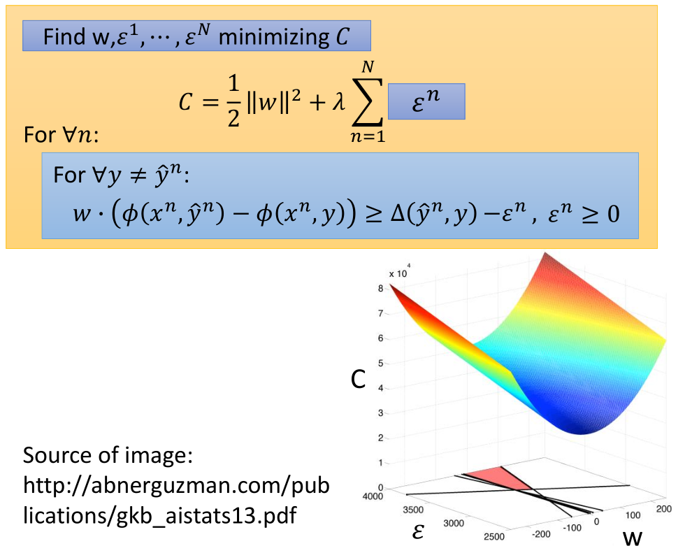

#### Cutting Plane Algorithm

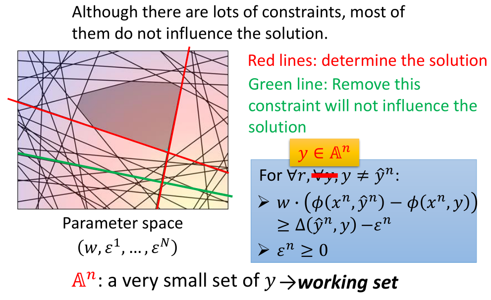

虽然有很多约束条件，但它们中的大多数的约束都是**冗元**，并不影响问题的解决；

原本是穷举$y \neq \hat{y}^{n}$，而现在我们需要移除那些不起作用的线条，保留有用的线条，这些有影响的线条集可以理解为Working Set，用$\mathbb{A}^{n}$表示。

Elements in working set $\mathbb{A}^{n}$ is selected iteratively

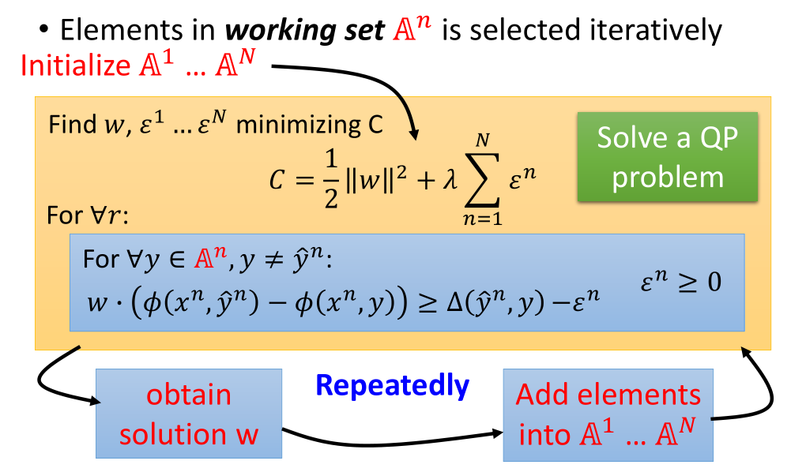

Strategies of adding elements into working set $\mathbb{A}^{n}$

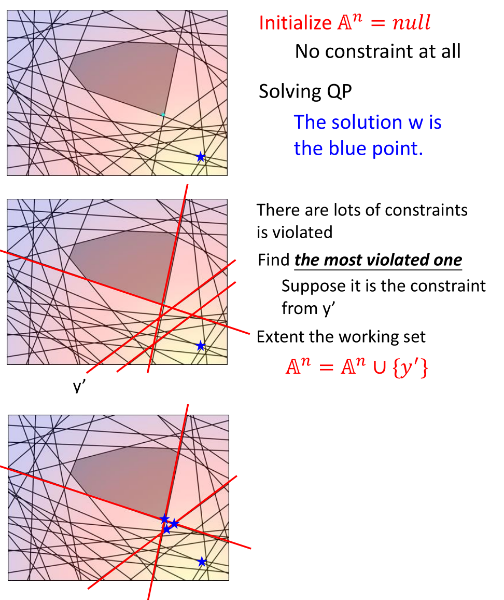

假设$\mathbb{A}^{n}$初始值为空集合null，即没有任何约束限制，求解QP的结果就是对应的蓝点，但是不能满足条件的线条有很多很多，我们现在只找出没有满足的最“严重的”那一个即可。那么我们就把$\mathbb{A}^{n}=\mathbb{A}^{n} \cup\left\{y^{\prime}\right\}$

根据新获得的Working Set中唯一的成员y'，找寻新的最小值，进而得到新的w，尽管得到新的w和最小值，但依旧存在不满足条件的约束，需要继续把最难搞定的限制添加到有效集中，再求解一次。得到新的w，直到所有难搞的线条均添加到Working Set之中，最终Working Set中有三个线条，根据这些线条确定求解区间内的point，最终得到问题的解。

##### Find the most violated one

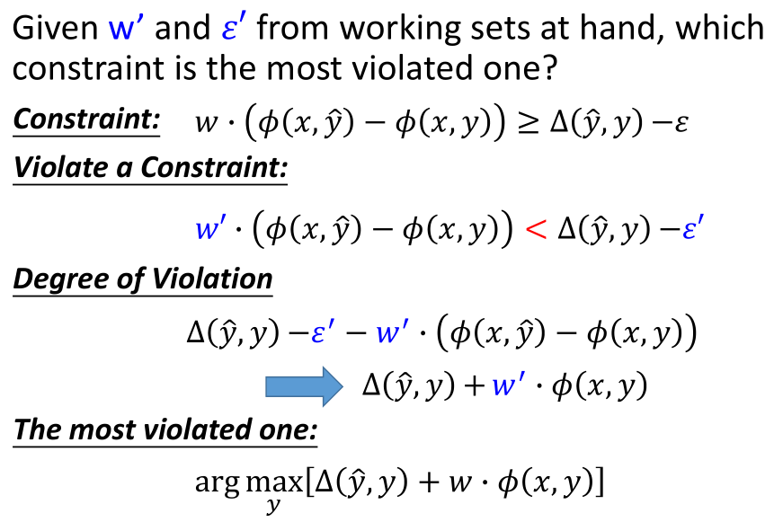

Cutting Plane Algorithm

- 给定训练数据集
  $$
  \left\{\left(x^{1}, \hat{y}^{1}\right),\left(x^{2}, \hat{y}^{2}\right), \cdots,\left(x^{N}, \hat{y}^{N}\right)\right\} 
  $$
  Working Set初始设定为
  $$
  \mathbb{A}^{1} \leftarrow \text { null, } \mathbb{A}^{2} \leftarrow \text { null, } \cdots, \mathbb{A}^{N} \leftarrow null
  $$

- 重复以下过程

  - 在初始的Working Set中求解一个QP问题的解，只需求解出w即可。
  - 针对求解出的w，要求对每一个训练数据$\left(x^{n}, \hat{y}^{n}\right)$，寻找最violated的限制，同时更新Working Set

- 直到Working Set中的元素不再发生变化，迭代终止，即得到要求解的w。

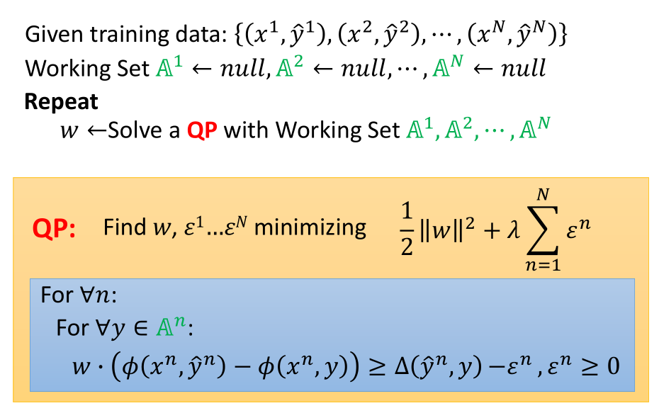

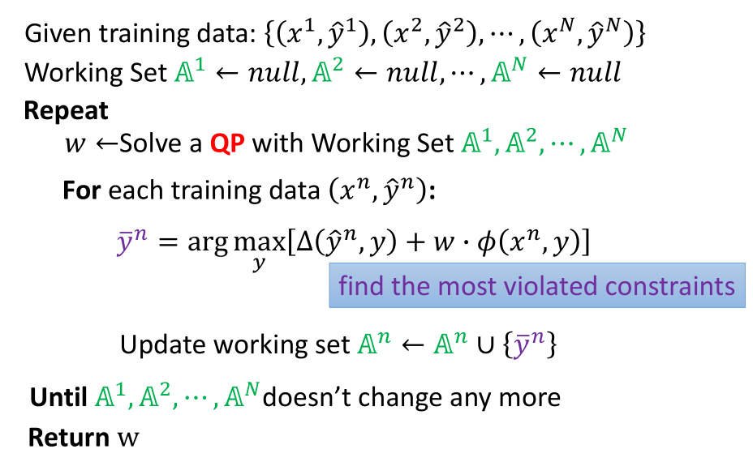

### Multi-class and binary SVM

#### Multi-class SVM

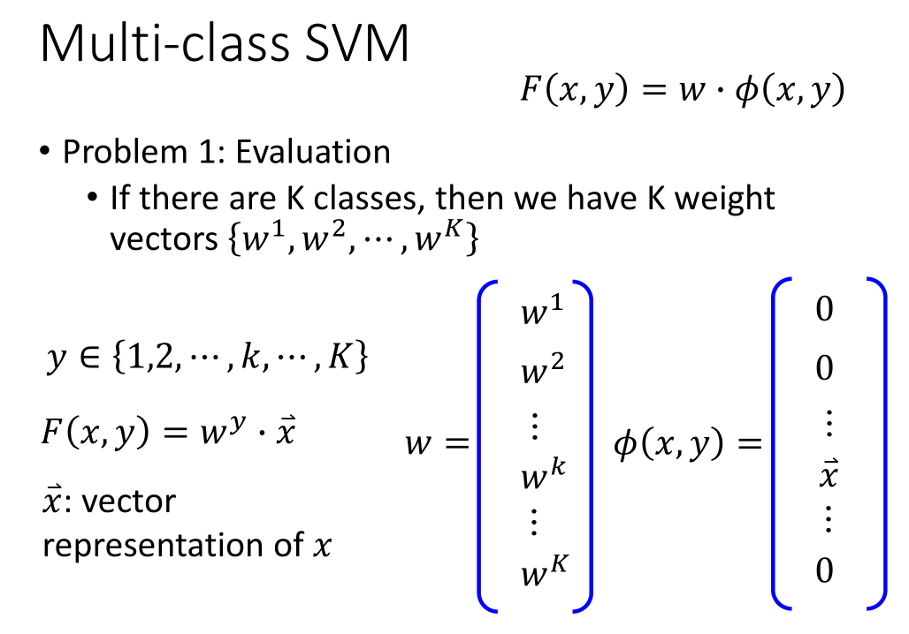

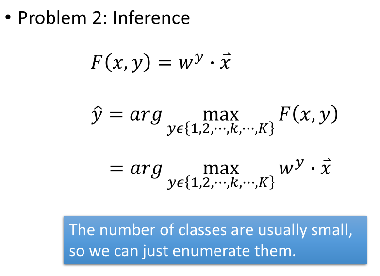

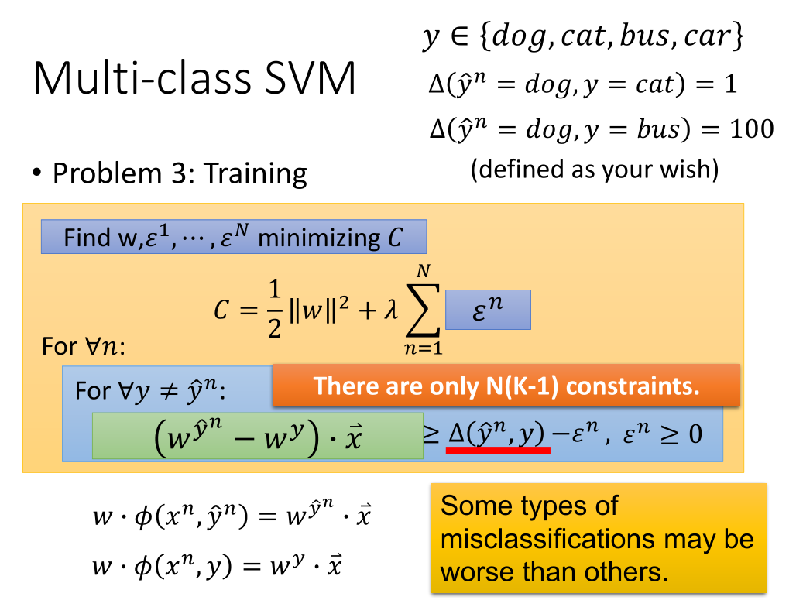

#### Binary SVM

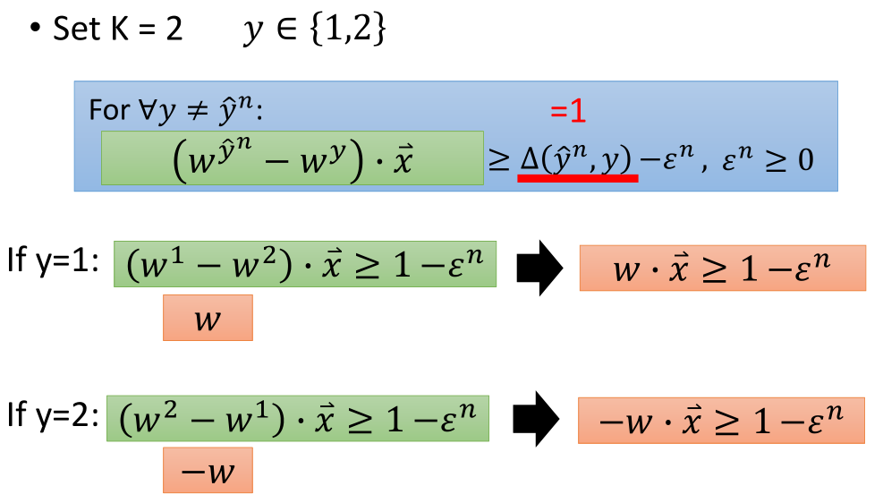

### Beyond Structured SVM

结构化SVM是线性结构的，如果想要结构化SVM的表现更好，我们需要定义一个较好的特征，但是人为设定特征往往十分困难，一个较好的方法是利用DNN生成特征，先用一个DNN，最后训练的结果往往十分有效。

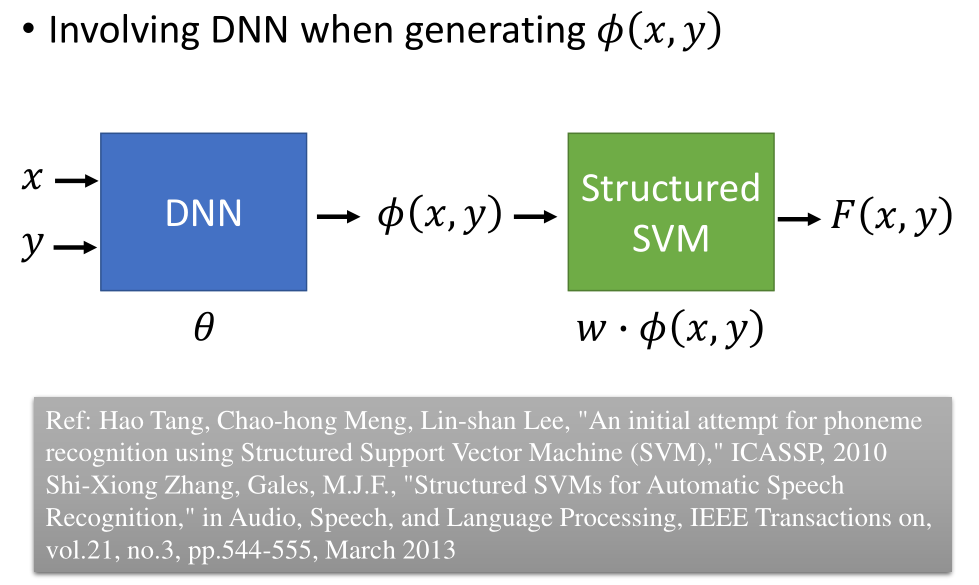

将DNN与结构化SVM一起训练，同时更新DNN与结构化SVM中的参数。

用一个DNN代替结构化SVM，即将x和y作为输入，$F(x, y)$(为一个标量)作为输出。

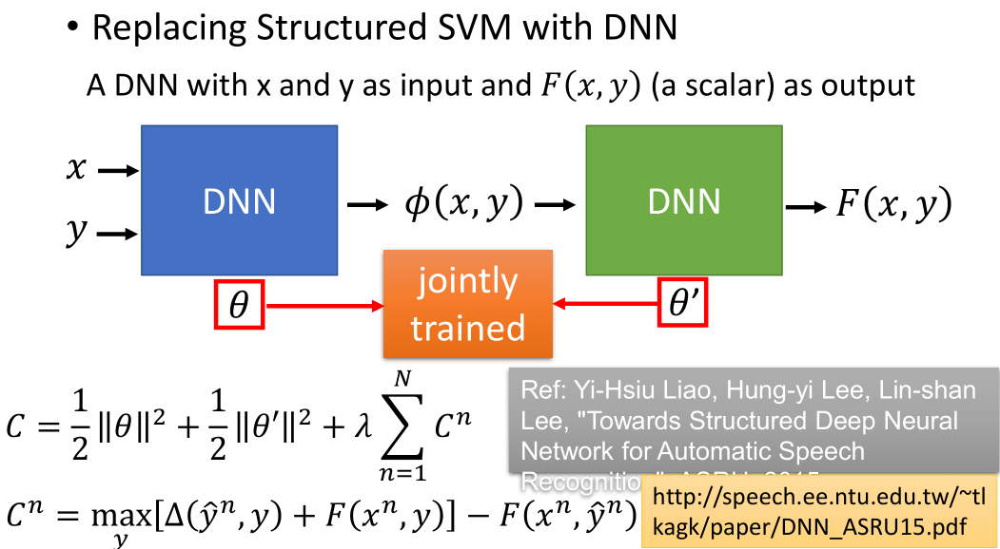

## Sequence Labeling Problem

### Sequence Labeling

$$
f : X \rightarrow Y
$$

序列标注的问题可以理解为：机器学习所要寻找的目标函数的输入是一个序列，输出也为一个序列，并且假设输入输出的序列长度相同，即输入可以写成序列向量的形式，输出也为序列向量。该任务可以利用**循环神经网络**来解决，但本章节我们可以基于**结构化学习**的其它方法进行解决(**两步骤，三问题**)。

#### Example Task

词性标记(POS tagging)

- 标记一个句子中每一个词的词性(名词、动词等等)；

- 输入一个句子(比如，John saw the saw)，系统将会标记John为专有名词，saw为动词，the为限定词，saw为名词；

- 其在自然语言处理(NLP)中，是非常典型且重要的任务，也是许多文字理解的基石，用于后续句法分析和词义消歧。

如果不考虑序列，问题就无法解决(POS tagging仅仅依靠查表的方式是不够的，比如Hash Table，你需要知道一整个序列的信息，才能有可能把每个词汇的词性找出)

- John saw the saw.
  - 第一个"saw"更有可能是动词V，而不是名词N；
  - 然而，第二个"saw"是名词N，因为名词N更可能跟在限定词后面。

### Hidden Markov Model (HMM)

#### How to generate a sentence?

Step 1

- 生成POS序列

- 基于语法(根据脑中内建的的语法)

假设你大脑中一个马尔科夫链，开始说一句话时，放在句首的词性有50%的可能性为冠词，40%的可能性为专有名词，10%的可能性为动词，然后进行随机采样，再从专有名词开始，有80%的可能性后面为动词，动词后面有25%的可能性为冠词，冠词后面有95%的可能性为名词，名词后面有10%的可能性句子就结束了。

Step 2

  - 根据词序生成一个句子

  - 基于词典      

根据词性找到词典中中对应的词汇，从不同的词性集合中采样出不同词汇所出现的机率。 HMM可以描述为利用POS标记序列得到对应句子的机率，即

$$
P(x, y)=P(y) P(x | y)
$$

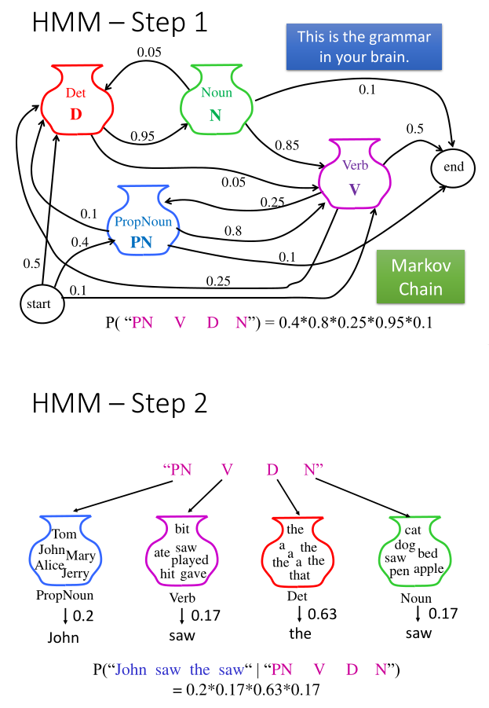

$$
    \begin{array}{l}{\mathrm{x} : \text { John saw the saw. }} \\ {\mathrm{Y} : \mathrm{PN} \quad \mathrm{V} \quad \mathrm{D} \quad \mathrm{N}}\end{array}
$$

对应于：
$$
    \begin{array}{l}{x=x_{1}, x_{2} \cdots x_{L}} \\ {y=y_{1}, y_{2} \cdots y_{L}}\end{array}
$$
  其中，
$$
  P(x, y)=P(y) P(x | y)
$$

  - Step1(Transition probability)

$$
    P(y)=P\left(y_{1} | s t a r t\right)\times \prod_{l=1}^{L-1} P\left(y_{l+1} | y_{l}\right) \times P\left(e n d | y_{L}\right)
$$

  - Step2(Emission probability)

    $$
    P(x | y)=\prod_{l=1}^{L} P\left(x_{l} | y_{l}\right)
    $$

##### Estimating the probabilities

  - 我们如何知道P(V|PN), P(saw|V)......？

    - 从训练数据中得到

$$
P(x, y)=P\left(y_{1} | \text {start}\right) \prod_{l=1}^{L-1} P\left(y_{l+1} | y_{l}\right) P\left(e n d | y_{L}\right) \prod_{l=1}^{L} P\left(x_{l} | y_{l}\right)
$$

其中，计算$y_{l}=s$，下一个标记为$s'$的机率，就等价于现在训练集里面s出现的次数除去s后面跟s'的次数；
$$
    \frac{P\left(y_{l+1}=s^{\prime} | y_{l}=s\right)}{\left(s \text { and } s^{\prime} \text { are tags }\right)}=\frac{\operatorname{count}\left(s \rightarrow s^{\prime}\right)}{\operatorname{count}(s)}
$$
计算某一个标记为s所产生的词为t的机率，就等价于s在整个词汇中出现的次数除去某个词标记为t的次数。
$$
\frac{P\left(x_{l}=t | y_{l}=s\right)}{(s \text { is tag, and } t \text { is word })}=\frac{\operatorname{count}(s \rightarrow t)}{\operatorname{count}(s)}
$$

#### How to do POS Tagging?

We can compute P(x,y)

给定x(Observed)，发现y(Hidden)，即如何计算P(x, y)的问题

given x, find y
$$
\begin{aligned} y &=\arg \max _{y \in Y} P(y | x)  \\ &=\arg \max _{y \in Y} \frac{P(x, y)}{P(x)} \\ &=\arg \max _{y \in \mathbb{Y}} P(x, y)  \end{aligned}
$$

##### Viterbi Algorithm

$$
\tilde{y}=\arg \max _{y \in \mathbb{Y}} P(x, y)
$$

- 穷举所有可能的y

  - 假设有|S|个标记，序列y的长度为L；
  - 有可能的y即$|s|^{L}$(空间极为庞大)。

- 利用维特比算法解决此类问题

  - 复杂度为：

  $$
  O\left(L|S|^{2}\right)
  $$

#### HMM - Summary

##### Evaluation

$$
  F(x, y)=P(x, y)=P(y) P(x | y)
$$

该评估函数可以理解为x与y的联合概率。

##### Inference

$$
  \tilde{y}=\arg \max _{y \in \mathbb{Y}} P(x, y)
$$

给定一个x，求出最大的y，使得我们定义函数的值达到最大(即维特比算法)。

##### Training

从训练数据集中得到$P(y)$与$P(x | y)$

该过程就是计算机率的问题或是统计语料库中词频的问题。

#### HMM - Drawbacks

- 在推理过程
  $$
  \tilde{y}=\arg \max _{y \in \mathbb{Y}} P(x, y)
  $$
  把求解最大的y作为我们的输出值。

- 为了得到正确的结果，我们需要让
  $$
  (x, \hat{y}) : P(x, \hat{y})>P(x, y)
  $$
  但是HMM可能无法处理这件事情，它不能保证错误的y带进去得到的P(x,y)一定是小的。

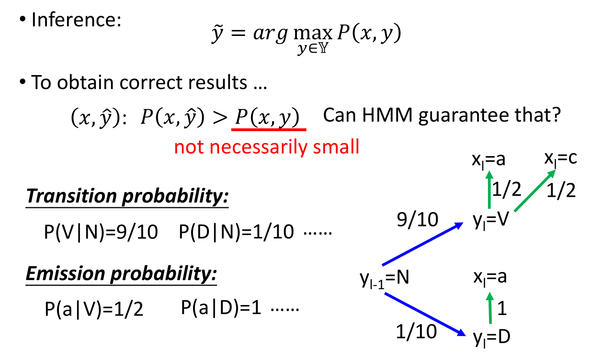

假设我们知道在$l-1$时刻词性标记为N，即$\mathrm{y}_{\mathrm{l}-1}=\mathrm{N}$，在$l$时刻我们看到的单词为a，现在需要求出$y_{l}=?$

根据计算可以得到V的机率是0.45，D的机率是0.1。但是如果测试数据中有9个$N→V→c$，9个$P→V→a$，1个$N→D→a$，里面存有和训练数据一样的数据，因此D更合理。

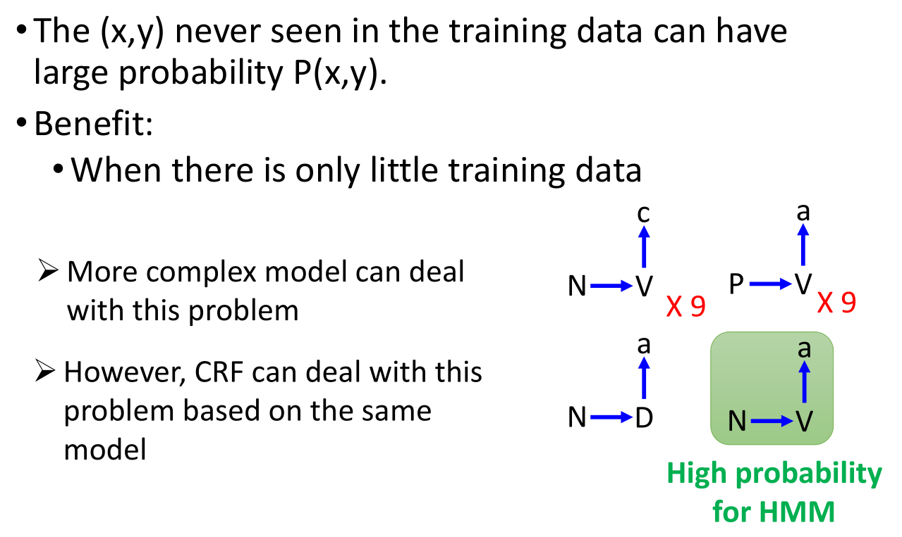

通常情况下，隐马尔可夫模型是判断**未知数据**出现的**最大可能性**，即(x,y)在训练数据中从未出现过，但也可能有较大的概率P(x,y)；

当训练数据很少的时候，使用隐马尔可夫模型，其性能表现是可行的，但当训练集很大时，性能表现较差；

隐马尔可夫模型会产生**未卜先知**的情况，是因为转移概率和发散概率，在训练时是分开建模的，两者是相互独立的，我们也可以用一个更复杂的模型来模拟两个序列之间的可能性，但要避免过拟合。

条件随机场的模型和隐马尔可夫模型是一样的，同时可以克服隐马尔可夫模型的缺点。

### Conditional Random Field (CRF)

$$
\mathrm{P}(x, y) \propto \exp (w \cdot \phi(x, y))
$$

条件随机场模型描述的也是$P(x, y)$的问题，但与HMM表示形式很不一样(本质上是在训练阶段不同)，其机率正比于$exp(w\cdot ϕ(x,y))$。

- $ϕ(x,y)$为一个特征向量；
- w是一个权重向量，可以从训练数据中学习得到；
- $exp(w\cdot ϕ(x,y))$总是正的，可能大于1。

$$
\mathrm{P}(x, y)=\frac{\exp (w \cdot \phi(x, y))}{R}
$$

$$
P(y | x)=\frac{P(x, y)}{\sum_{y^{\prime}} P\left(x, y^{\prime}\right)}=\frac{\exp (w \cdot \phi(x, y))}{\sum_{y^{\prime} \in \mathbb{Y}} \exp \left(w \cdot \phi\left(x, y^{\prime}\right)\right)}=\frac{\exp (w \cdot \phi(x, y))}{Z(x)}
$$

$$
其中\sum_{y^{\prime} \in \mathbb{Y}} \exp \left(w \cdot \phi\left(x, y^{\prime}\right)\right)仅与x有关，与y无关
$$

#### $P(x,y)$ for CRF

- HMM
  $$
  P(x, y)=P\left(y_{1} | s t a r t\right) \prod_{l=1}^{L-1} P\left(y_{l+1} | y_{l}\right) P\left(e n d | y_{L}\right) \prod_{l=1}^{L} P\left(x_{l} | y_{l}\right)
  $$
  取对数
  $$
  \begin{array}{l}{\log P(x, y)} \\ {=\log P\left(y_{1} | \operatorname{start} \right)+\sum_{l=1}^{L-1} \log P\left(y_{l+1} | y_{l}\right)+\log P\left(\text {end} | y_{L}\right)} \\ {\quad+\sum_{l=1}^{L} \log P\left(x_{l} | y_{l}\right)}\end{array}
  $$
  其中，
  $$
  \sum_{l=1}^{L} \log P\left(x_{l} | y_{l}\right)=\sum_{s, t} \log P(t | s) \times N_{s, t}(x, y)
  $$

  - $\sum_{s, t}$穷举所有可能的标记s和所有可能的单词t；

  - $ \log P(t | s)$表示给定标记s的得到单词t的概率取对数

  - $N_{s, t}(x, y)$表示为单词t被标记成s的事情，在(x, y)对中总共出现的次数。

##### Example

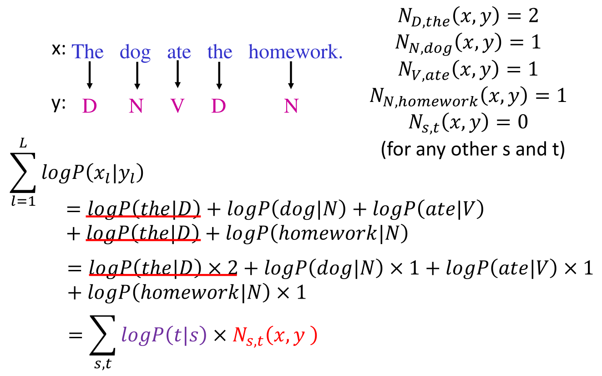

每个单词都已经标记成对应的词性，我们分别计算出 D，N，V 在(x, y)对中出现的次数

然后计算所有的机率相乘的结果$\sum_{l=1}^{L} \log P\left(x_{l} | y_{l}\right)$，如上图，整理之后的结果为$\sum_{s, t} \log P(t | s) \times N_{s, t}(x, y)$

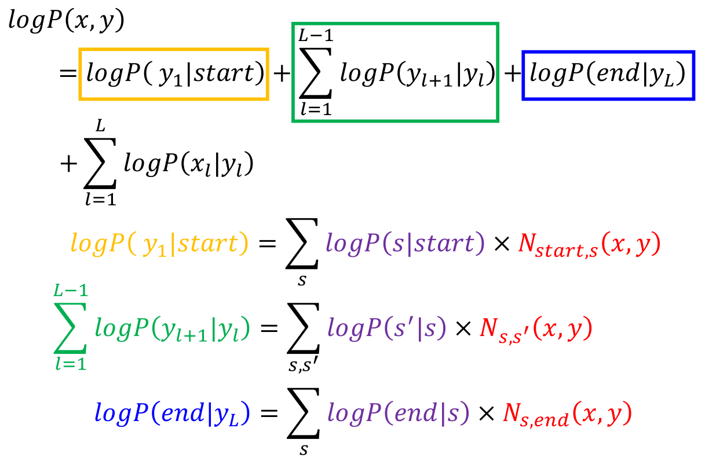

分析$logP(x, y)$的其他项

其中，黄色表示对所有词性s放在句首的机率取对数，再乘上在(x, y)对中，s放在句首所出现的次数；

绿色表示计算s后面跟s'在(x, y)里面所出现的次数，再乘上s后面跟s'的机率取对数；

紫色同理，最后一项表示两项相乘的形式。

则有$logP(x, y)$

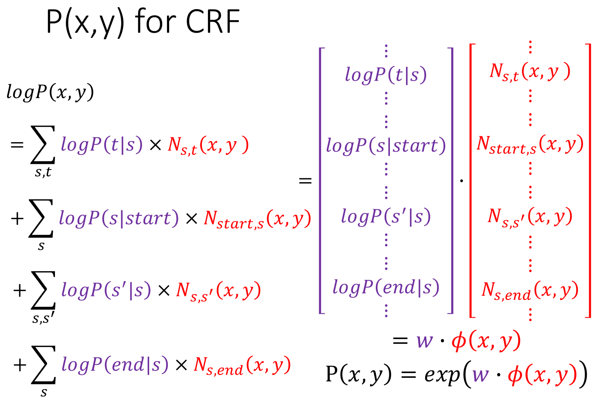

等价于两个向量做内积，进而可以用$logP(x,y)=w·ϕ(x,y)$表示，第二个向量每一个element是依赖于(x, y)的，因此可以写成$\phi(x,y)$

由此可知，$P(x,y)=exp(w·ϕ(x,y))$，其中每一个w，都对应着HMM模型中的某一个机率取对数。

因此对于每一个w，取exponential就可以变为机率。但是我们在训练时对w没有任何限制，得到w大于0时，机率会大于一。

因此需要把$P(x, y)$表达式变化为$P(x,y)∝exp(w·ϕ(x,y))$

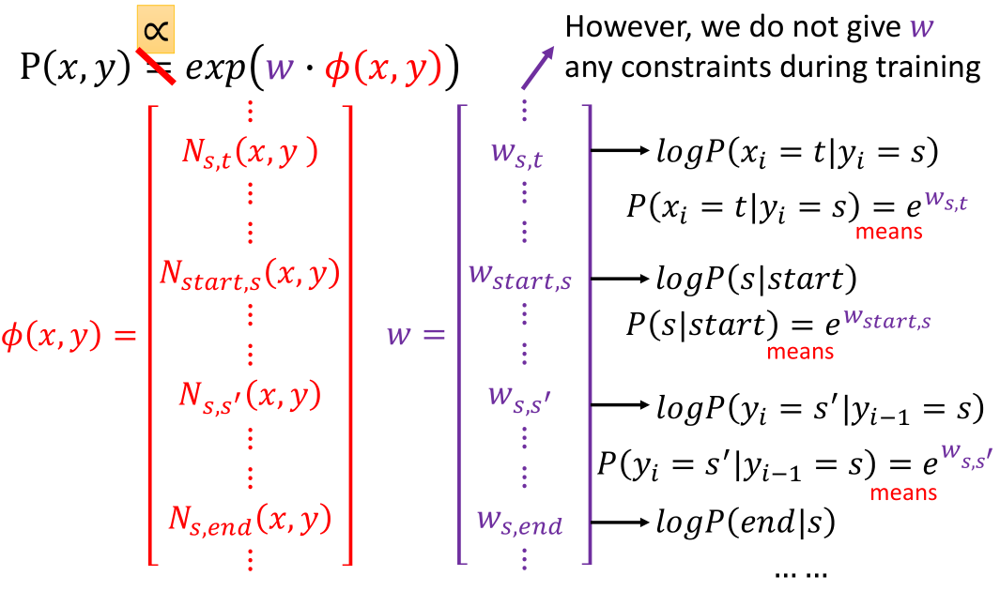

#### Feature Vector

$ϕ(x,y)$的形式是什么样的？$ϕ(x,y)$分为两部分

Part 1：relations between tags and words

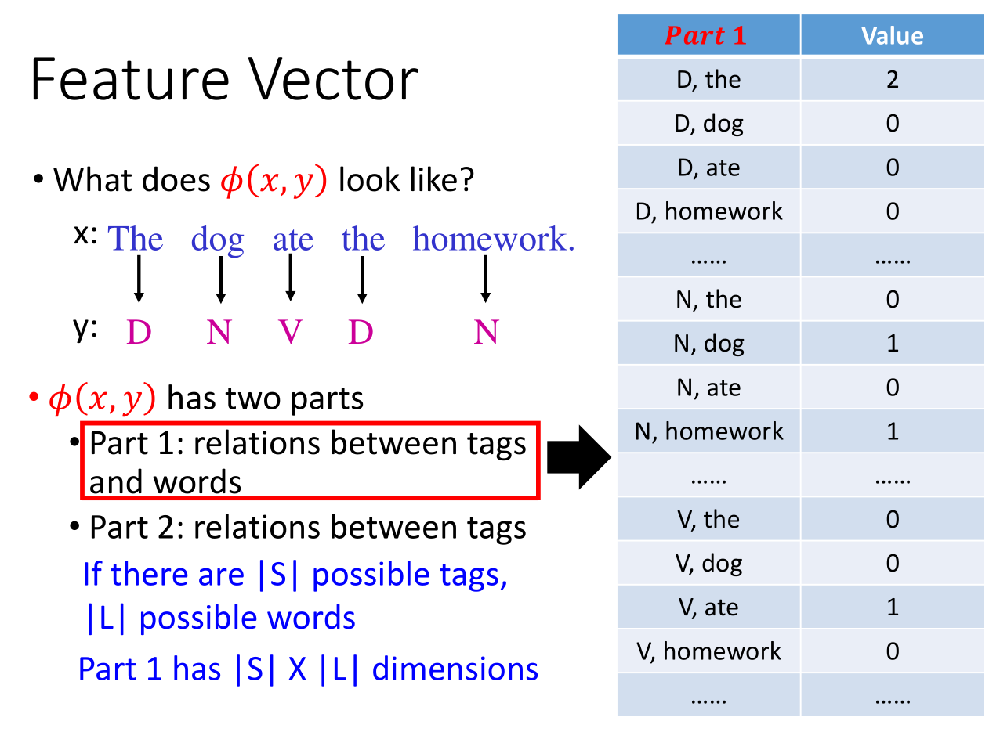

如果有|S|个可能的标记，|L|个可能的单词，Part 1的维度为 |S| X |L|，value表示在(标记, 单词)对中出现的次数，所以这是一个维度很大的稀疏vector；

Part 2：标签之间的关系

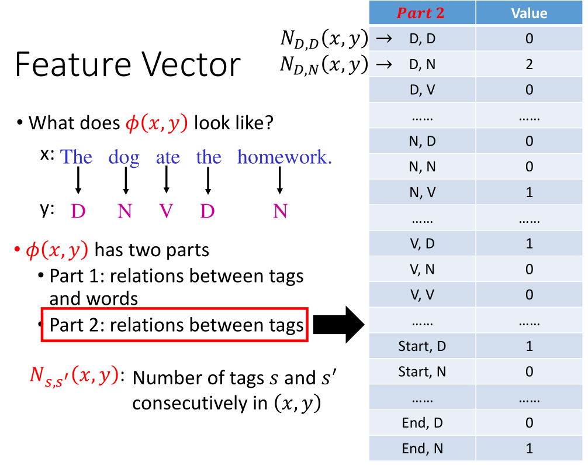

定义$N_{S, S^{\prime}}(x, y) :$为标记s和s'在(x, y)对中连续出现的次数，如果有|S|个可能的标记，这部分向量维度为|S| X |S| + 2|S|(s之间、start、end)。

CRF中可以自己定义$ϕ(x,y)$

#### CRF – Training Criterion

给定训练数据：
$$
\left\{\left(x^{1}, \hat{y}^{1}\right),\left(x^{2}, \hat{y}^{2}\right), \cdots\left(x^{N}, \hat{y}^{N}\right)\right\}
$$
找到一个权重向量$w^{*}$去**最大化**目标函数$O(w)$；

其中，$w^{*}$与目标函数定义如下：
$$
w^{*}=\arg \max _{w} \mathrm{O}(w)
$$

$$
O(w)=\sum_{n=1}^{N} \log P\left(\hat{y}^{n} | x^{n}\right)
$$

表示为我们要寻找一个w，使得最大化给定的$x_n$所产生$\hat{y}^{n}$正确标记的机率，再取对数进行累加，此处可以联想到交叉熵也是最大化正确维度的机率再取对数，只不过此时是针对整个序列而言的。

对$logP(y|x)$做相应的转换
$$
\begin{array}{l}{P(y | x)}  {=\frac{P(x, y)}{\sum_{y^{\prime}} P\left(x, y^{\prime}\right)}}\end{array}
$$

$$
\log P\left(\hat{y}^{n} | x^{n}\right)=\log P\left(x^{n}, \hat{y}^{n}\right)-\log \sum_{y^{\prime}} P\left(x^{n}, y^{\prime}\right)
$$

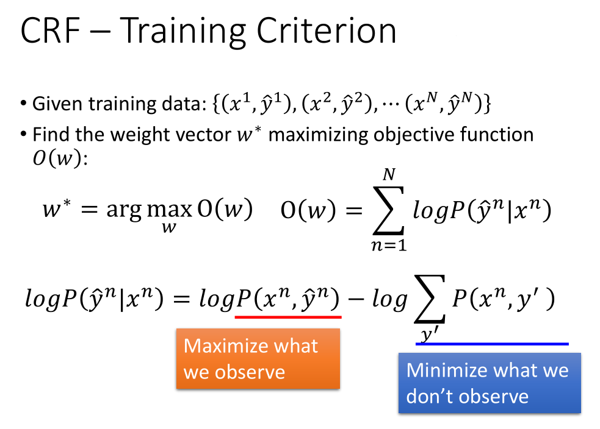

根据CRF的定义可知，可以分解为两项再分别取对数，即最大化观测到的机率，最小化没有观测到的机率。

##### Gradient Ascent

梯度下降：找到一组参数θ，最小化成本函数$C(θ)$，即梯度的反方向
$$
\theta \rightarrow \theta-\eta \nabla C(\theta)
$$
梯度上升：找到一组参数θ，最大化成本函数$O(θ)$，即梯度的同方向
$$
\theta \rightarrow \theta+\eta \nabla O(\theta)
$$

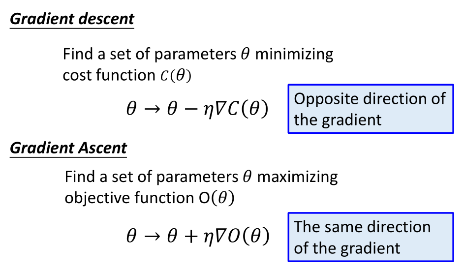

#### CRF - Training

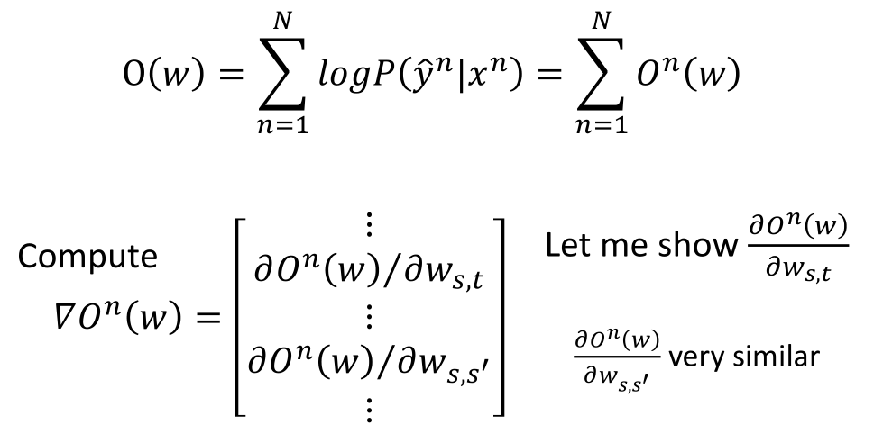

求偏导

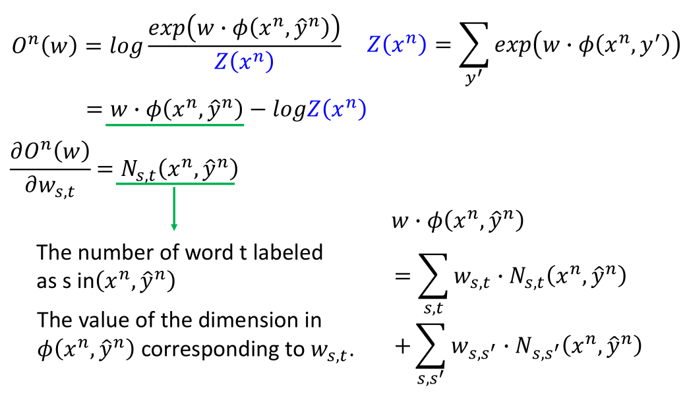

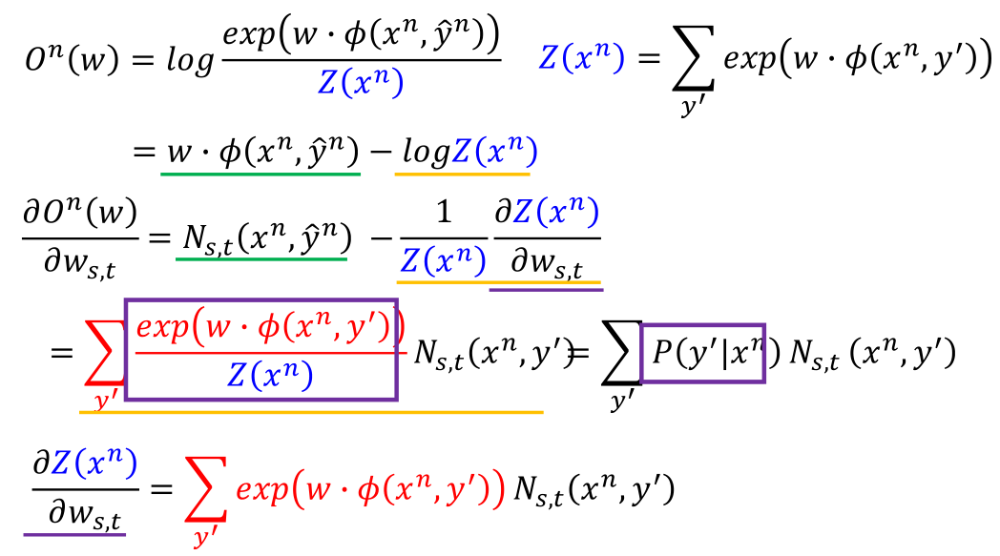

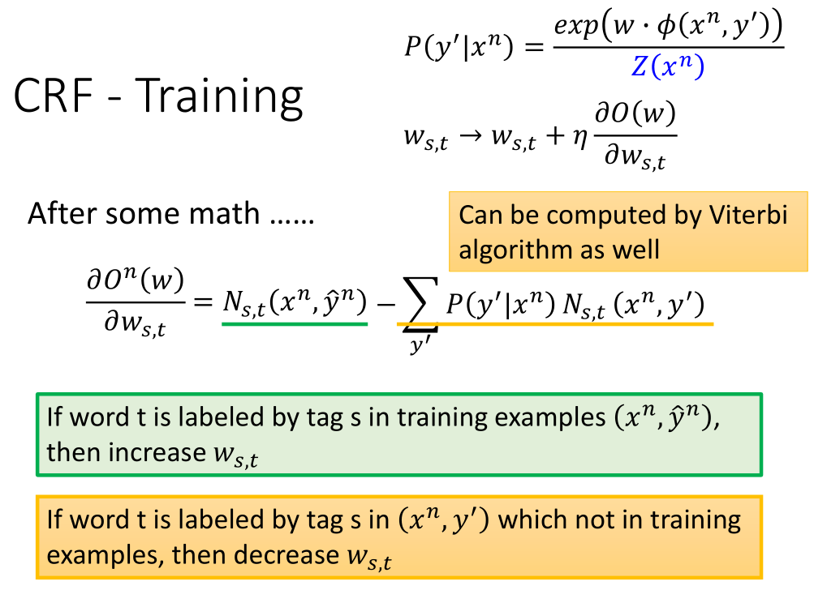

偏导求解得到两项：
$$
\frac{\partial O^{n}(w)}{\partial w_{s, t}}=N_{s, t}\left(x^{n}, \hat{y}^{n}\right)-\sum_{y^{\prime}} P\left(y^{\prime} | x^{n}\right) N_{s, t}\left(x^{n}, y^{\prime}\right)
$$

- 第一项为单词t被标记为s，在$\left(x^{n}, \hat{y}^{n}\right)$中出现的次数；
- 第二项为累加所有可能的y，每一项为 单词t被标记成s在$x_n$与任意y的pair里面出现的次数乘上给定$x_n$下产生这个y的机率。
- 实际意义解释
  - 第一项说明：如果(s, t)在训练数据集正确出现的次数越多，对应的w的值就会越大，即如果单词t在训练数据对集$\left(x^{n}, \hat{y}^{n}\right)$中被标记成s，则会增加$w_{s, t}$；
  - 第二项说明：如果(s, t)在训练数据集任意的y与x配对之后出现的次数依然越多，那么我们应该将其权值进行减小(可以通过Viterbi算法计算)，即如果任意一个单词t在任意一个训练数据对集$\left(x^{n}, y^{\prime}\right)$中被标记成s的话，我们要减小$w_{s, t}$。

对所有的权值向量来说，更新过程是：正确的$\hat{y}^{n}$所形成的的向量减去任意一个y'形成的的向量乘上y‘的机率。

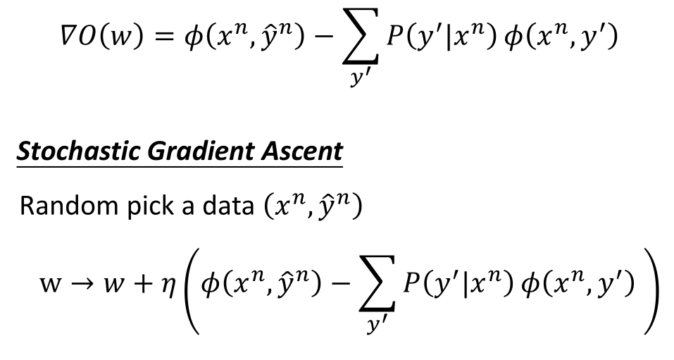

#### CRF – Inference

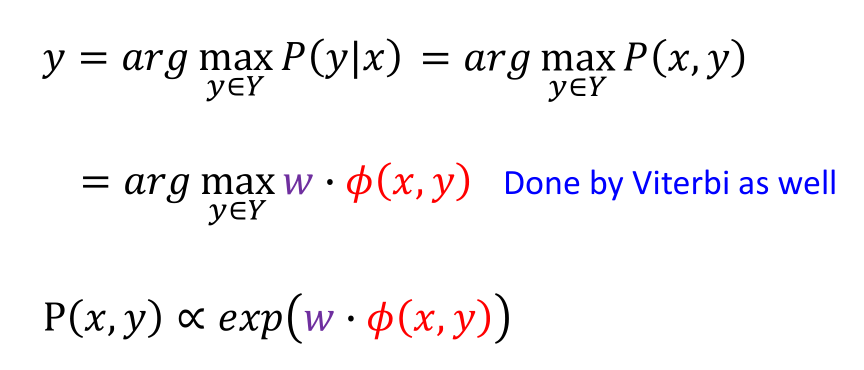

等同于找一个y，使得$w·ϕ(x,y)$机率最大，因为由$P(x,y)∝exp(w·ϕ(x,y))$可知。

### CRF v.s. HMM

CRF增加$P(x, \hat{y})$，减少$P\left(x, y^{\prime}\right)$(HMM做不到这一点)

- 如果要得到正确的答案，我们希望
  $$
  (x, \hat{y}) : P(x, \hat{y})>P(x, y)
  $$
  条件随机场更有可能得到正确的结果。

  CRF可能会想办法调整参数，把V产生a的机率变小，让正确的机率变大，错误的变小。

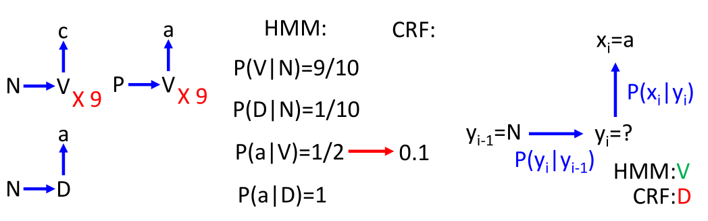

#### Synthetic Data

输入输出分别为：
$$
x_{i} \in\{a-z\}, y_{i} \in\{A-E\}
$$
从混合顺序隐马尔科夫模型生成数据

- 转移概率
  $$
  \alpha P\left(y_{i} | y_{i-1}\right)+(1-\alpha) P\left(y_{i} | y_{i-1}, y_{i-2}\right)
  $$
  $α$ 取1时，变为一般的隐马尔科夫模型，其值可以任意地进行调整。

- 发散概率
  $$
  \alpha P\left(x_{i} | y_{i}\right)+(1-\alpha) P\left(x_{i} | y_{i}, x_{i-1}\right)
  $$
  如果$α$取1时，变为一般的隐马尔科夫模型。

##### Comparing HMM and CRF

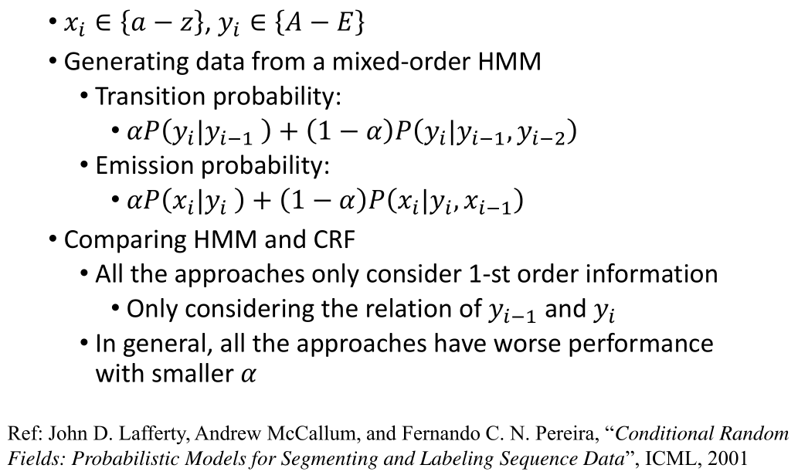

$α$从左下方到右上方不断减小，每一个圈圈表示不同的$α$所得到的结果，对每一个点都做一个隐马尔科夫模型与条件随机场的实验，横轴代表隐马尔科夫模型犯错的百分比，纵轴表示条件随机场犯错的百分比。

当模型与假设不合的时候，CRF比HMM得到了更好的结果

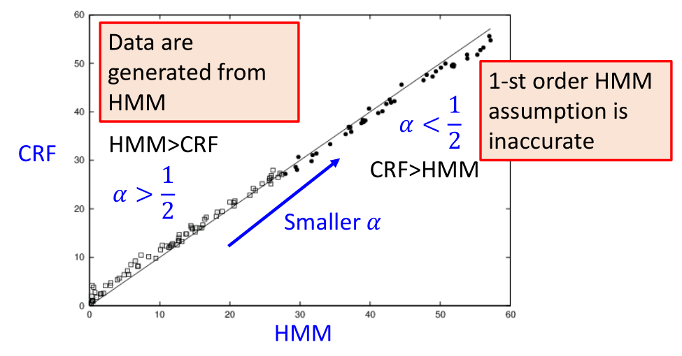

### CRF - Summary

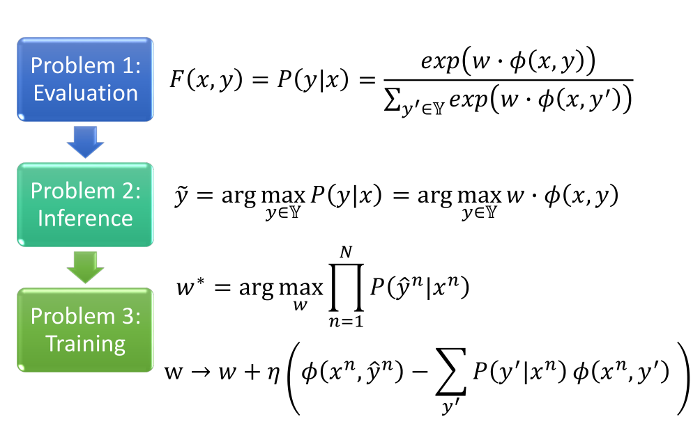

$w^{*}=\arg \max $的式子，可以写成对数相加形式。

### Structured Perceptron

x, y假设都为序列，可以用**条件随机场模型**来定义$ϕ(x,y)$；

Problem 2  利用**维特比算法**求解即可；

训练时，对所有的训练数据n，以及对所有的$y \neq \hat{y}^{n}$，我们希望：
$$
w \cdot \phi\left(x^{n}, \hat{y}^{n}\right)>w \cdot \phi\left(x^{n}, y\right)
$$
在每个iteration里面，我们会根据目前的w，找到一个$\tilde{y}^{n}$，使得：
$$
\tilde{y}^{n}=\arg \max _{y} w \cdot \phi\left(x^{n}, y\right)
$$
然后，更新w
$$
  w \rightarrow w+\phi\left(x^{n}, \hat{y}^{n}\right)-\phi\left(x^{n}, \tilde{y}^{n}\right)
$$
即正确的$\hat{{y}}^{n}$减去其他的$\tilde{y}^{n}$所形成的向量。

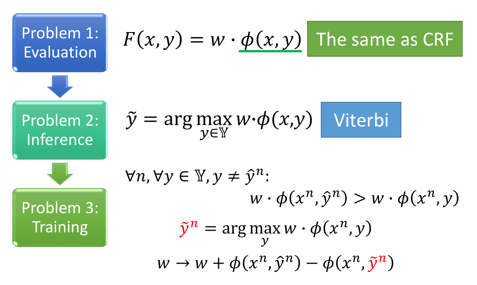

#### Structured Perceptron v.s. CRF

##### Structured Perceptron

$$
  \begin{array}{l}{\tilde{y}^{n}=\arg \max _{y} w \cdot \phi\left(x^{n}, y\right)} \\ {w \rightarrow w+\phi\left(x^{n}, \hat{y}^{n}\right)-\phi\left(x^{n}, \tilde{y}^{n}\right)}\end{array}
$$

只减去机率最大的y的特征向量

##### CRF

$$
  \mathrm{w} \rightarrow w+\eta\left(\underline{\phi\left(x^{n}, \hat{y}^{n}\right)}-\sum_{y^{\prime}} P\left(y^{\prime} | x^{n}\right) \phi\left(x^{n}, y^{\prime}\right)\right)
$$

减去了所有的y'所形成的特征向量与对应的机率做weighted sum

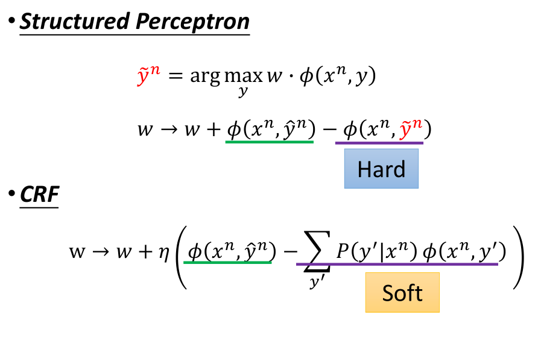

### Structured SVM

目标函数需要考虑到间隔和误差，训练时可以采用梯度下降法，也可以作为QP问题，因为限制条件过多，所以采用切割平面算法解。

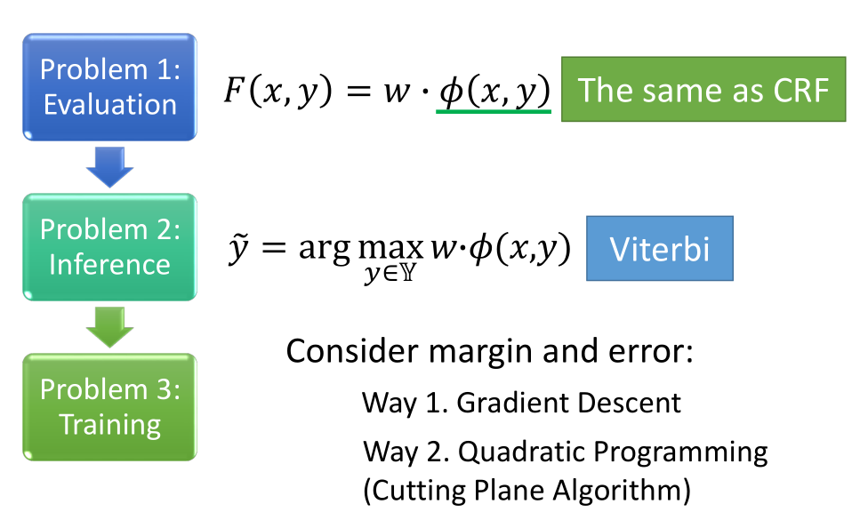

#### Error Function

Error function
$$
\Delta\left(\hat{y}^{n}, y\right)
$$

- $∆$用来计算$y$与$\hat{y}^{n}$之间的差异性；

- 结构化支持向量机的成本函数就是∆的上界，最小化Cost Function就是在最小化上界；

- 理论上讲，∆可以为任何适当的函数；但是，我们必须要考虑到，我们需要穷举所有的y，看哪一个使得∆加上$w·ϕ$最大化（这是Problem 2.1，相比Problem 2是一个不一样的问题）

在下图示例情况下，把Δ定义成错误率，Problem 2.1可以通过维特比算法求解。

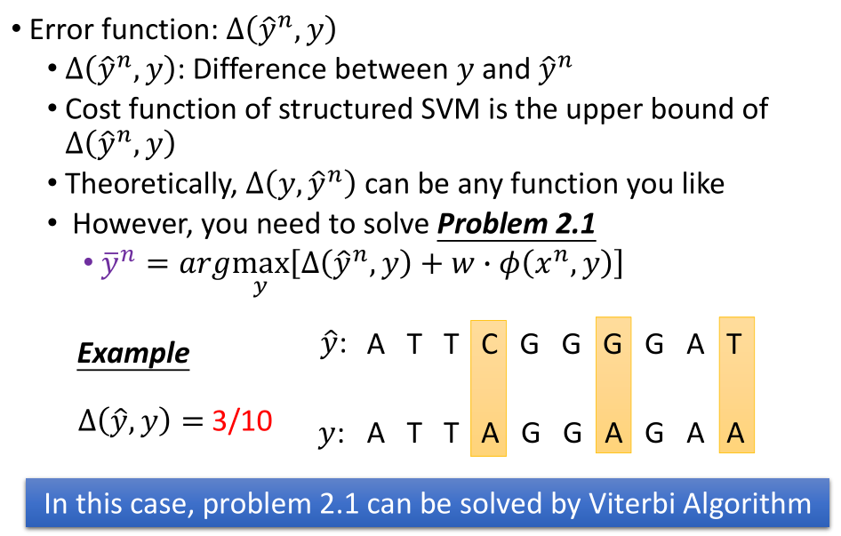

### Performance of Different Approaches

POS

- HMM performance表现最差，但是当训练数据更少的情况下，可能隐马尔科夫模型表现会相比其他方法好一些；CRF赢过HMM，
- 条件随机场与结构化感知机谁比较强文献上是没有定论的，条件随机场是soft的，而结构化感知机是hard的。但是结构化感知机只需要求解Problem 2就可以了，而条件随机场需要summation over 所有的y'，这件事不一定知道怎么解，如果不知道怎么解的话，推荐用结构化感知机。
- 结构化支持向量机整体表现最好；

命名实体识别（把tag换成公司名/地名/人名等）

- 结构化支持向量机模型表现最好；
- 隐马尔科夫模型表现最差。

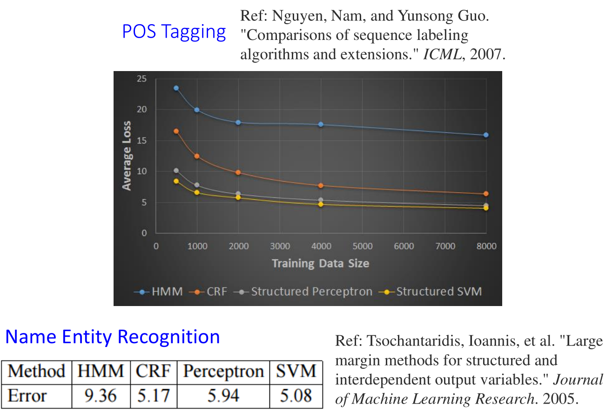

### RNN v.s. Structured Learning

#### RNN, LSTM

- 单方向的循环神经网络或长短时记忆网络并没有考虑到全部的序列，换言之，只考虑时间$t_1$至当前时间$t_k$的情形，对$t_{k+1}$的情形没有考虑。
- 有足够多的data，或许可以learn到标签之间的依赖关系
- Cost和Error并不见得总是相关的
- 可以叠加很多层（利用Deep的特性）

#### HMM, CRF, Structured Perceptron/SVM

- 在输出结果之前，做的都是利用维特比算法穷举所有的序列，观测最大的序列，在计算过程中考虑到的是整个序列；（开放问题：如果利用双向的循环神经网络与其相比，结果如何？）胜的可能比较牵强。
- 我们可以直接把限制加到维特比算法中，可以只穷举符合限制的sequence，可以把标签之间的依赖关系明确的描述在model中；
- 结构化支持向量机的Cost Function就是Error的上界，当Cost Function不断减小的时候，Error很有可能会随之降低。
- 其实也可以是deep，但是它们要想拿来做deep learning 是比较困难的。在我们讲的内容里面它们都是linear，因为他们定义的evaluation函数是线性的。如果不是线性的话也会很麻烦，因为只有是线性的我们才能套用这些方法来做inference和training。

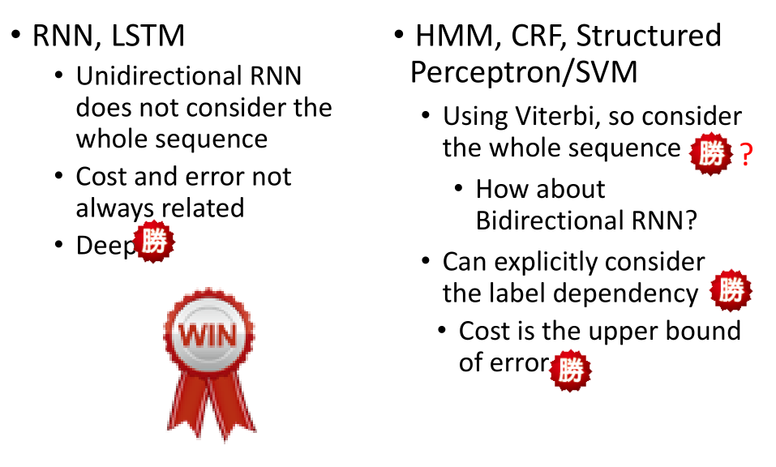

最后总结来看，RNN/LSTM在deep这件事的表现其实会比较好，同时在SOTA上，RNN是不可或缺的，如果只是线性的模型，function space就这么大，就算可以直接最小化一个错误的上界，但是这样没什么，因为所有的结果都是坏的，所以相比之下，deep learning占到很大的优势。

### Integrated Together

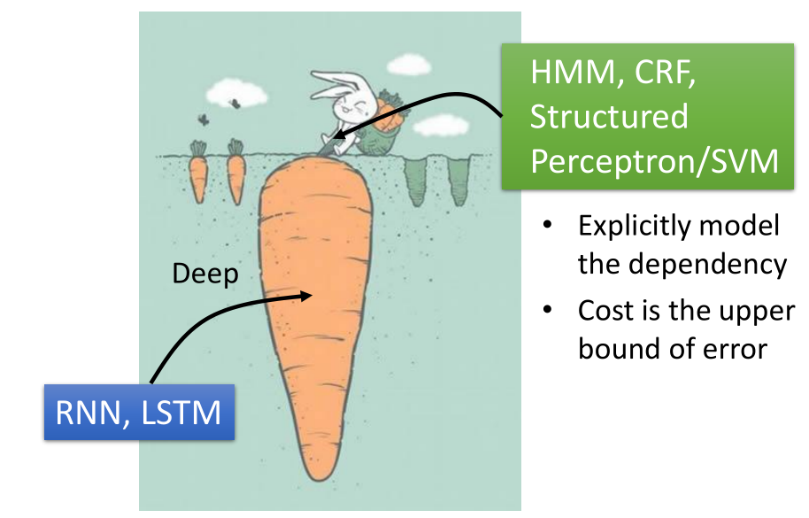

- 底层（埋在土里的萝卜）
  - 循环神经网络与长短时记忆网络
- 叶子
  - 隐马尔可夫模型，条件随机场与结构化感知机/支持向量机，有很多优点。

语音识别

- 卷积神经网络/循环神经网络或长短时记忆网络/深度神经网络 + **隐马尔可夫模型**

$$
P(x, y)=P\left(y_{1} | s t a r t\right) \prod_{l=1}^{L-1} P\left(y_{l+1} | y_{l}\right) P\left(e n d | y_{L}\right) \prod_{l=1}^{L} P\left(x_{l} | y_{l}\right)
$$

- 根据隐马尔科夫模型中，发散概率可以由神经网络得到，用循环神经网络的输出结果经过变换代替发散概率；不需要考虑$P(x_l)$的机率；
- 双向循环神经网络/长短时记忆网络 + 条件随机场/结构化支持向量机。

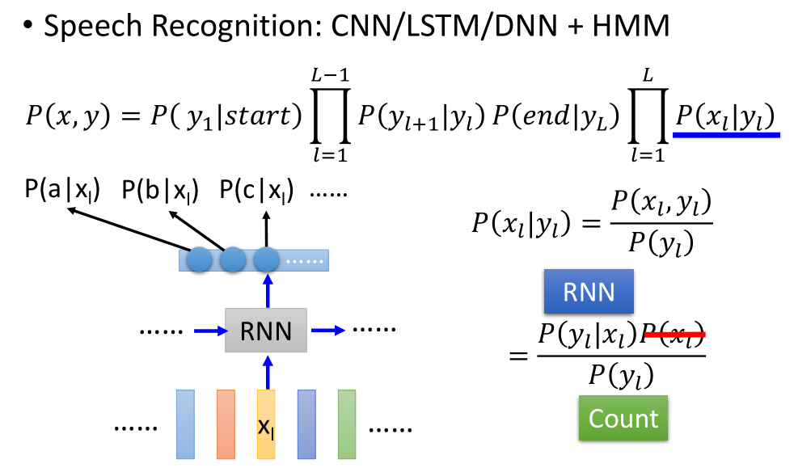

其实加上HMM在语音辨识里很有帮助，就算是用RNN，但是在辨识的时候，常常会遇到问题，假设我们是一个frame，用RNN来问这个frame属于哪个form，往往会产生奇怪的结果，比如说一个frame往往是蔓延好多个frame，比如理论是是看到第一个frame是A，第二个frame是A，第三个是A，第四个是A，然后BBB，但是如果用RNN做的时候，RNN每个产生的label都是独立的，所以可能会若无其事的改成B，然后又是A，RNN很容易出现这个现象。HMM则可以把这种情况修复。因为RNN在训练的时候是每个frame分来考虑的，因此不同地方犯的错误对结果的影响相同，结果就会不好，如果想要不同，加上结构化学习的概念才可以做到。所以加上结构化学习的概念会很有帮助。

Semantic Tagging

- 从RNN的输出结果中，抽出新的特征再计算；$w \cdot \phi(x, y)$作为评估函数

  - 训练阶段

    利用梯度下降法让w和循环神经网络中的所有参数一起训练；

  - 测试阶段
    $$
    \tilde{y}=\arg \max _{y \in \mathbb{Y}} w \cdot \phi(x, y)
    $$
    找一个y，使得$w·ϕ(x, y)$的结果最大化，但此时的x不是input x，而是来自于循环神经网络的输出结果。

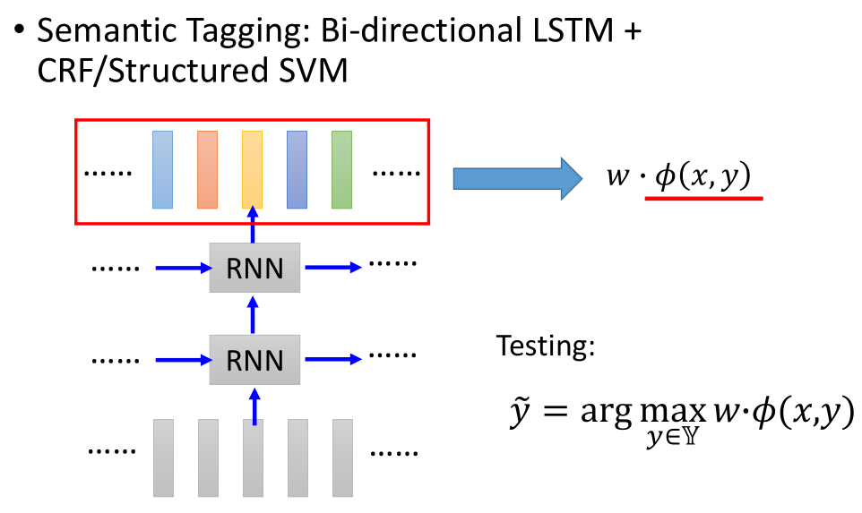

### Is Structure learning practical？

structured learning需要解三个问题，其中problem 2往往很困难，因为要穷举所有的y让其最大，解一个optimization的问题，大部分状况都没有好的解决办法。所有有人说structured learning应用并不广泛，但是未来未必是这样的。

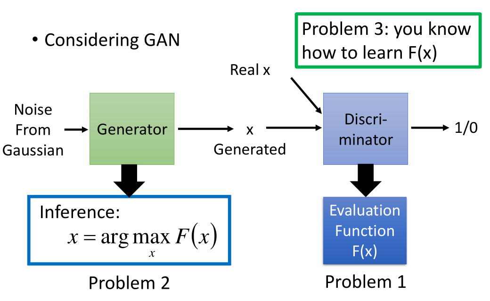

其实GAN就是一种structured learning。可以把discriminator看做是evaluation function（也就是problem 1）我们要解一个inference的问题（problem 2），我们要穷举我们未知的东西，看哪个可以让我们的evaluation function最大。这步往往比较困难，因为x的可能性太多了。但这个东西可以就是generator，我们可以想成generator就是给出一个noise，输出一个object，它输出的这个object，就是让discriminator分辨不出的object，如果discriminator就是evaluation function的话，那output的值就是让evaluation function的值很大的那个对应值。所以这个generator就是在解problem 2，其实generator的输出就是argmax的输出，可以把generator当做在解inference这个问题。Problem 3的solution就是train GAN的方法。

在 structured SVM 的 training 里面，我们每次找出最 competitive 的那些 example，然后我们希望正确的 example的 evaluation function 的分数大过 competitive 的 example，然后 update 我们的 model，然后再重新选 competitive 的 example，然后再让正确的，大过 competitive，就这样 iterative 去做。

GAN 的 training 是我们有正确的 example，它应该要让 evaluation function 的值比 Discriminator 的值大，然后我们每次用这个 Generator，Generate 出最competitive 的那个 x，也就是可以让 Discriminator 的值最大的那个 x，然后再去 train Discriminator。Discriminator 要分辨正确的跟 Generated 的。也就是 Discriminator 要给 real 的 example 比较大的值，给那些 most competitive 的 x 比较小的值，然后这个 process 就不断的 iterative 的进行下去，你会 update 你的 Discriminator ，然后 update 你的 Generator。

其实这个跟 Structured SVM 的 training 是有异曲同工之妙的。

我们在讲 structured SVM 的时候都是有一个 input/output，有一个 x 有一个 y； GAN 只有 x，听起来好像不太像，那我们就另外讲一个像的。

GAN也可以是conditional的GAN，example 都是 x,y 的 pair，现在的任务是，given x 找出最有可能的 y。

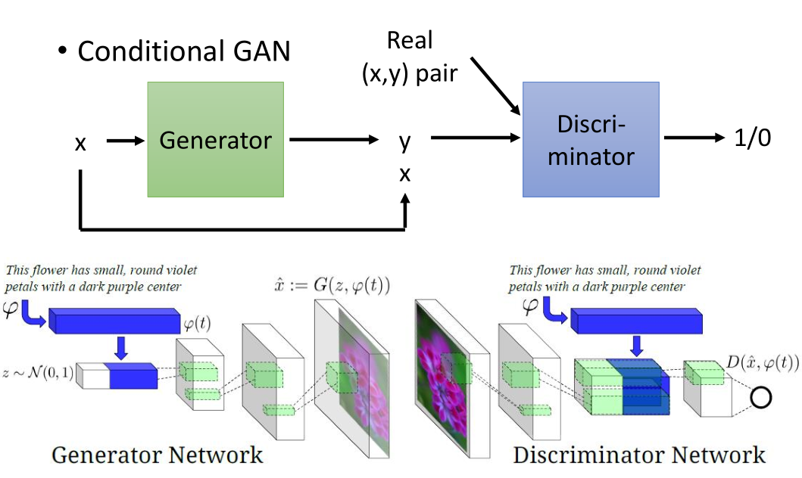

比如语音辨识，x是声音讯号，y是辨识出来的文字，如果是用conditional的概念，generator输入一个x，就会output一个y，discriminator是去检查y的pair是不是对的，如果给他一个真正的x,y的pair，会得到一个比较高的分数，给一个generator输出的一个y配上输入的x所产生的一个假的pair，就会给他一个比较低的分数。

训练的过程就和原来的GAN就是一样的，这个已经成功运用在文字产生图片这个task上面。这个task的input就是一句话，output就是一张图，generator做的事就是输入一句话，然后产生一张图片，而discriminator要做的事就是给他一张图片和一句话，要他判断这个x,y的pair是不是真的，如果把 discriminator换成evaluation function，把generator换成解inference的problem，其实conditional GAN和structured learning就是可以类比，或者说GAN就是训练structured learning model 的一种方法。

很多人都有类似的想法，比如GAN 可以跟 energy based model 做 connection，可以视为 train energy based model 的一种方法。所谓 energy based model，它就是 structured learning 的另外一种称呼。

Generator 视做是在做 inference 这件事情，是在解 arg max 这个问题，听起来感觉很荒谬。但是也有人觉得一个 neural network ，它有可能就是在解 arg max 这个 problem，这里也给出一些Reference。

所以也许 deep and structured 就是未来一个研究的重点的方向。

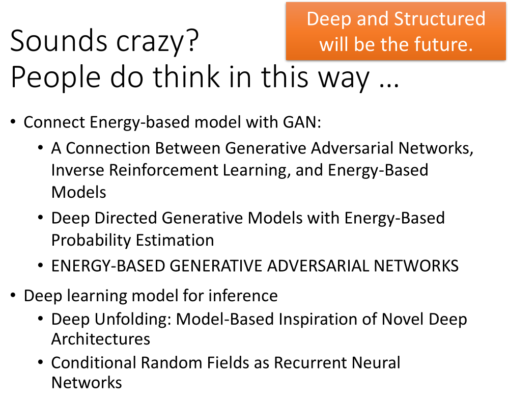

### Concluding Remarks

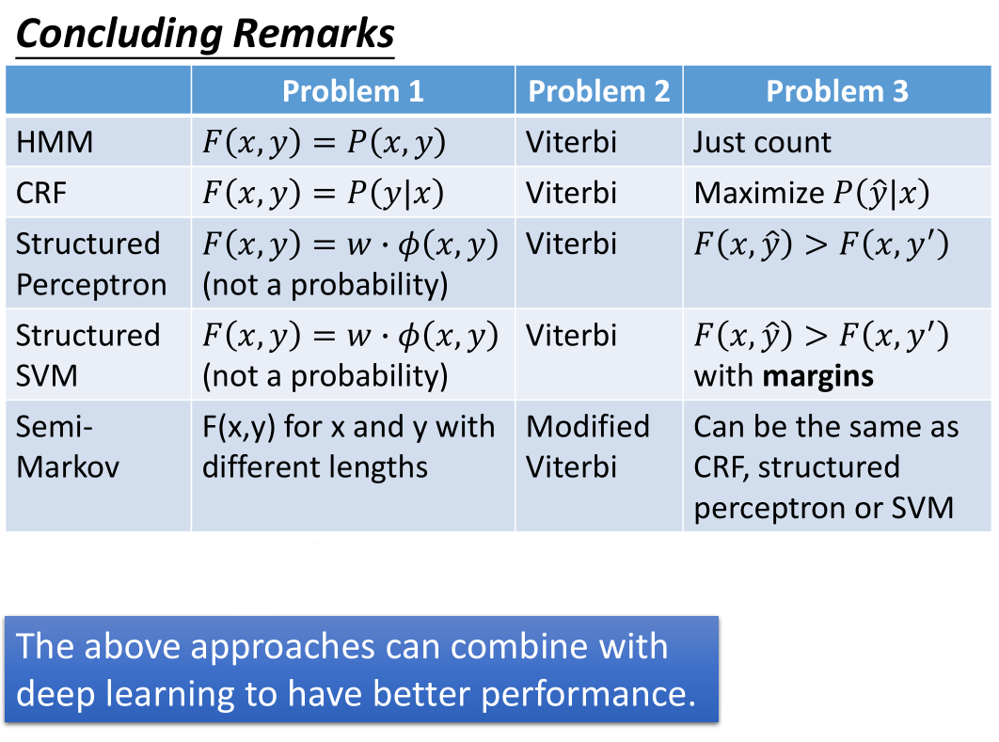

- 隐马尔可夫模型，条件随机场，结构化感知机或支持向量机都是求解三个问题；
- 三个方法定义Evaluation Function的方式有所差异；结构化感知机或支持向量机跟机率都没有关系；
- 以上这些方法都可以加上深度学习让它们的性能表现地更好。