# Flow-based Generative Model

## Flow-based Generative Model

### Generative Models

- Component-by-component (Auto-regressive Model)
  - What is the best order for the components?
  - Slow generation

- Variational Auto-encoder
  - Optimizing a lower bound (of likelihood)

- Generative Adversarial Network
  - Unstable training

### Generator

A generator G is a network. The network defines a probability distribution $p_G$

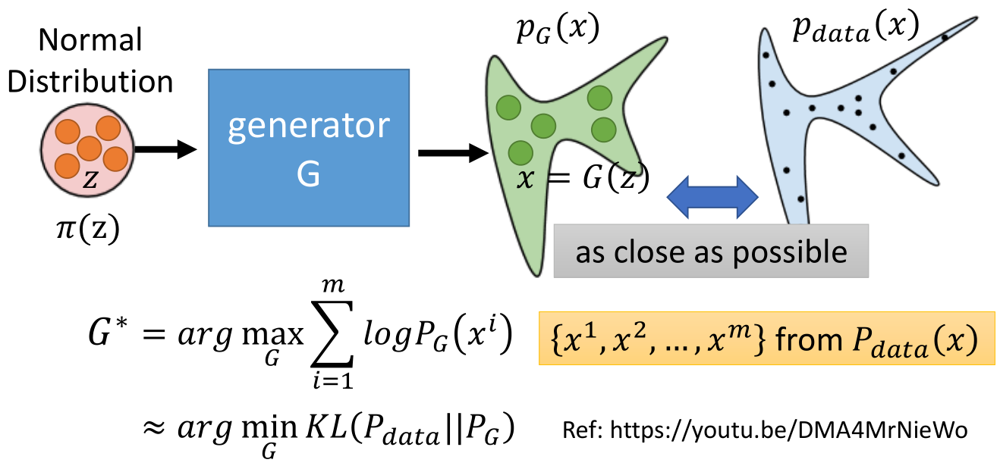

Flow-based model directly optimizes the objective function.

### Math Background

#### Jacobian Matrix

$$
\begin{array}{ll}
z=\left[\begin{array}{l}
z_{1} \\
z_{2}
\end{array}\right] \quad x=\left[\begin{array}{l}
x_{1} \\
x_{2}
\end{array}\right] \\
x=f(z) \quad z=f^{-1}(x)
\end{array}\\J_{f}=\overbrace{\left[\begin{array}{cc} 
\partial x_{1} / \partial z_{1} & \partial x_{1} / \partial z_{2} \\
\partial x_{2} / \partial z_{1} & \partial x_{2} / \partial z_{2}
\end{array}\right] }^{\text {input }}   \  \text { output }
\\J_{f^{-1}}=\left[\begin{array}{cc}
\partial z_{1} / \partial x_{1} & \partial z_{1} / \partial x_{2} \\
\partial z_{2} / \partial x_{1} & \partial z_{2} / \partial x_{2}
\end{array}\right]\\
J_{f} J_{f^{-1}}=I
$$

Demo
$$
\begin{array}{c}
{\left[\begin{array}{c}
x_{1} \\
x_{2}
\end{array}\right]} =
{\left[\begin{array}{c}
z_{1}+z_{2} \\
2 z_{1}
\end{array}\right]=f\left(\left[\begin{array}{c}
z_{1} \\
z_{2}
\end{array}\right]\right)} \\
{\left[\begin{array}{c}
z_{1} \\
z_{2}
\end{array}\right]} =
{\left[\begin{array}{c}
x_{2} / 2 \\
x_{1}-x_{2} / 2
\end{array}\right]=f^{-1}\left(\left[\begin{array}{c}
x_{1} \\
x_{2}
\end{array}\right]\right)} \\
J_{f}=\left[\begin{array}{cc}
1 & 1 \\
2 & 0
\end{array}\right] \\
J_{f^{-1}}=\left[\begin{array}{cc}
0 & 1 / 2 \\
1 & -1 / 2
\end{array}\right]
\end{array}
$$

#### Determinant

The determinant of a **square matrix** is a **scalar** that provides information about the matrix.

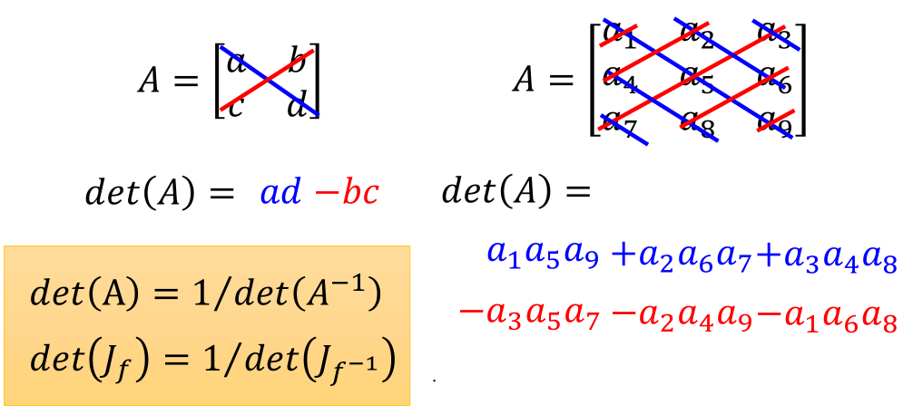

高维空间中的体积的概念

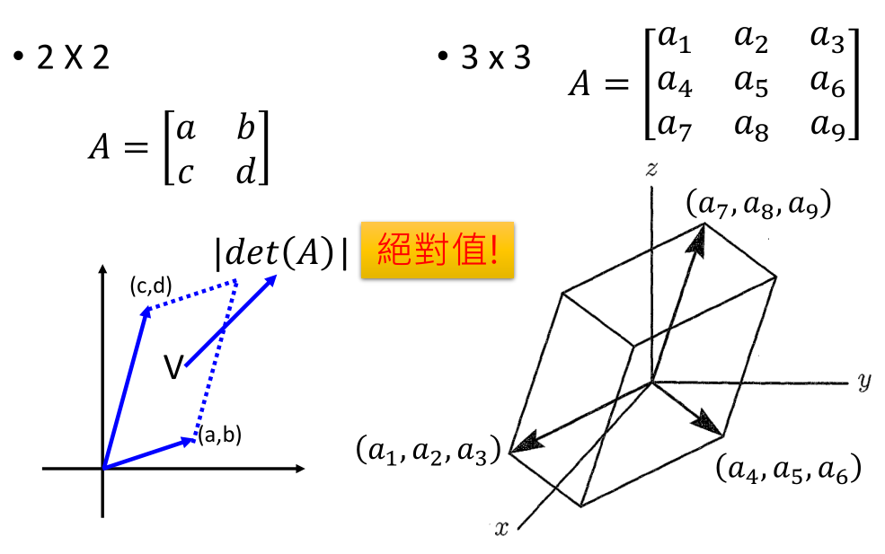

#### Change of Variable Theorem

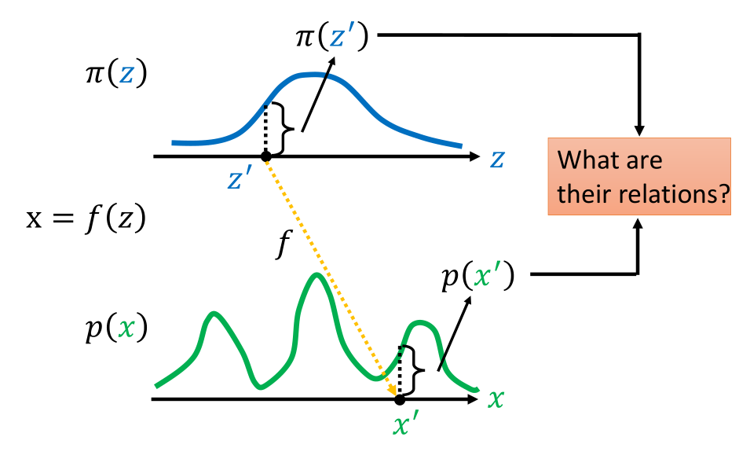

如上图所示，给定两组数据$z$和$x$，其中z服从已知的简单先验分布$π(z)$（通常是高斯分布），$x$服从复杂的分布$p(x)$（即训练数据代表的分布），现在我们想要找到一个变换函数$f$，它能建立一种z到x的映射，使得每对于$π(z)$中的一个采样点，都能在$p(x)$中有一个（新）样本点与之对应。

如果这个变换函数能找到的话，那么我们就实现了一个生成模型的构造。因为，$p(x)$中的每一个样本点都代表一张具体的图片，如果我们希望机器画出新图片的话，只需要从$π(z)$中随机采样一个点，然后通过映射，得到新样本点，也就是对应的生成的具体图片。

接下来的关键在于，这个变换函数f如何找呢？我们先来看一个最简单的例子。

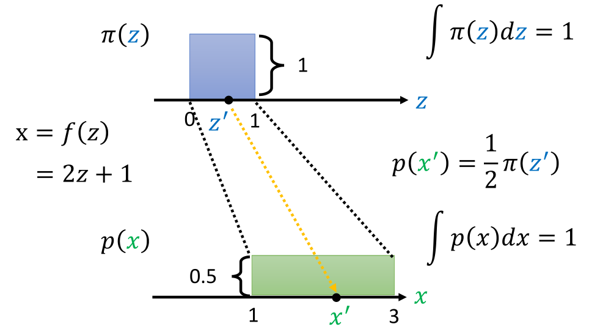

如上图所示，假设z和x都是一维分布，其中z满足简单的均匀分布：$\pi(z)=1(z \in[0,1])$，x也满足简单均匀分布：$p(x)=0.5(x \in[1,3])$。

那么构建z与x之间的变换关系只需要构造一个线性函数即可：$x=f(z)=2z+1$。

下面再考虑非均匀分布的更复杂的情况

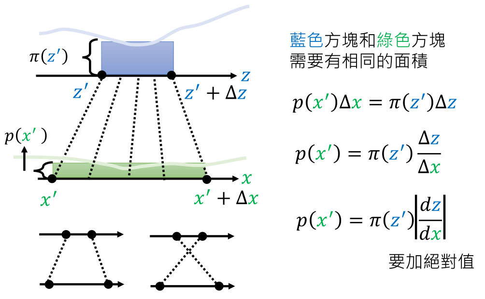

如上图所示，$π(z)$与$p(x)$都是较为复杂的分布，为了实现二者的转化，我们可以考虑在很短的间隔上将二者视为简单均匀分布，然后应用前边方法计算小段上的，最后将每个小段变换累加起来（每个小段实际对应一个采样样本）就得到最终的完整变换式$f$。

如上图所示，假设在$[𝑧',𝑧'+∆𝑧]$上$π(z)$近似服从均匀分布，在$[x',x'+∆x]$上$p(x)$也近似服从均匀分布，于是有$𝑝(𝑥')∆𝑥=𝜋(𝑧')∆𝑧$（因为变换前后的面积/即采样概率是一致的），当$∆x$与$∆𝑧$极小时，有：
$$
𝑝(𝑥')=𝜋(𝑧')\lvert\frac{𝑑𝑧}{𝑑𝑥}\rvert
$$
又考虑到$\frac{𝑑𝑧}{𝑑𝑥}$有可能是负值，而$𝑝(𝑥')、𝜋(𝑧')$都为非负，所以的实际关系需要加上绝对值

进一步地做推广，我们考虑z与x都是二维分布的情形。

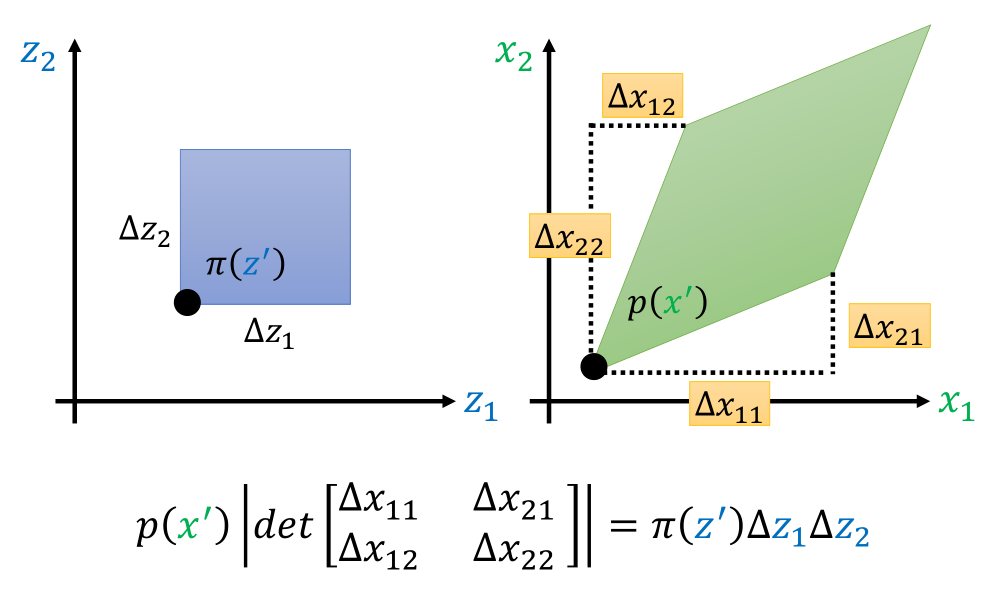

如上图所示，z与x都是二维分布，左图中浅蓝色区域表示初始点在$z_1$方向上移动$Δz_1$，在$z_2$方向上移动$Δz_2$所形成的区域，这一区域通过映射，形成x域上的浅绿色菱形区域。其中，二维分布$π(z)$与$p(x)$均服从简单均匀分布，其高度在图中未画出（垂直纸面向外）。$Δx_{11}$代表$z_1$改变时，$x_1$改变量；$Δx_{21}$是$z_1$改变时，$x_2$改变量。$Δx_{12}$代表$z_2$改变时，$x_1$改变量；$Δx_{22}$是$z_2$改变时，$x_2$改变量.

因为蓝色区域与绿色区域具有相同的体积，所以有：
$$
p\left(x^{\prime}\right)\left|\operatorname{det}\left[\begin{array}{ll}\Delta x_{11} & \Delta x_{21} \\ \Delta x_{12} & \Delta x_{22}\end{array}\right]\right|=\pi\left(z^{\prime}\right) \Delta z_{1} \Delta z_{2} \quad x=f(z)
$$
 其中$\operatorname{det}\left[\begin{array}{ll}\Delta x_{11} & \Delta x_{21} \\ \Delta x_{12} & \Delta x_{22}\end{array}\right]$代表行列式计算，它的计算结果等于上图中浅绿色区域的面积（行列式的定义）。下面我们将移$\Delta z_{1} \Delta z_{2}$至左侧，得到：
$$
p\left(x^{\prime}\right)\left|\frac{1}{\Delta z_{1} \Delta z_{2}} \operatorname{det}\left[\begin{array}{ll}\Delta x_{11} & \Delta x_{21} \\ \Delta x_{12} & \Delta x_{22}\end{array}\right]\right|=\pi\left(z^{\prime}\right)
$$
即可得到
$$
p\left(x^{\prime}\right)\left|\operatorname{det}\left[\begin{array}{ll}\Delta x_{11} / \Delta z_{1} & \Delta x_{21} / \Delta z_{1} \\ \Delta x_{12} / \Delta z_{2} & \Delta x_{22} / \Delta z_{2}\end{array}\right]\right|=\pi\left(z^{\prime}\right)
$$
当变化很小时
$$
p\left(x^{\prime}\right)\left|\operatorname{det}\left[\begin{array}{ll}\partial x_{1} / \partial z_{1} & \partial x_{2} / \partial z_{1} \\ \partial x_{1} / \partial z_{2} & \partial x_{2} / \partial z_{2}\end{array}\right]\right|=\pi\left(z^{\prime}\right)
$$
做转置，转置不会改变行列式
$$
p\left(x^{\prime}\right)\left|\operatorname{det}\left[\begin{array}{l}\partial x_{1} / \partial z_{1} & \partial x_{1} / \partial z_{2} \\ \partial x_{2} / \partial z_{1} & \partial x_{2} / \partial z_{2}\end{array}\right]\right|=\pi\left(z^{\prime}\right)
$$
就得到
$$
p\left(x^{\prime}\right)\left|\operatorname{det}\left(J_{f}\right)\right|=\pi\left(z^{\prime}\right)
$$
根据雅各比行列式的逆运算，得到
$$
p\left(x^{\prime}\right)=\pi\left(z^{\prime}\right)\left|\frac{1}{\operatorname{det}\left(J_{f}\right)}\right| =\pi\left(z^{\prime}\right)\left|\operatorname{det}\left(J_{f^{-1}}\right)\right|
$$
 至此，我们得到了一个比较重要的结论：如果$z$与$x$分别满足两种分布，并且$z$通过函数$f$能够转变为$x$，那么$z$与$x$中的任意一组对应采样点$z'$与$x'$之间的关系为：
$$
\left\{\begin{array}{l}\pi\left(z^{\prime}\right)=p\left(x^{\prime}\right)\left|\operatorname{det}\left(J_{f}\right)\right| \\ p\left(x^{\prime}\right)=\pi\left(z^{\prime}\right)\left|\operatorname{det}\left(J_{f^{-1}}\right)\right|\end{array}\right.
$$

### Formal Explanation

那么基于这一结论，再带回到生成模型要解决的问题当中，我们就得到了Flow-based Model（流模型）的初步建模思维。

上图所示，为了实现 ${z} \sim \pi({z})$ 到 $x=G(z) \sim p_{G}({x})$ 间的转化，待求解的生成器G的表达式为：
$$
G^{*}=\arg \max _{G} \sum_{i=1}^{m} \log p_{G}\left(x^{i}\right)
$$
基于前面推导, 我们有 $p_{c}({x})$ 中的样本点与 $\pi({z})$ 中的样本点间的关系为：
$$
p_{G}\left(x^{i}\right)=\pi\left(z^{i}\right)\left|\operatorname{det}\left(J_{G^{-1}}\right)\right|
$$
其中 $z^{i}=G^{-1}\left(x^{i}\right)$

所以，如果$G^*$的目标式能够通过上述关系式求解出来，那么我们就实现了一个完整的生成模型的求解。

Flow-based Model就是基于这一思维进行理论推导和模型构建，下面详细解释Flow-based Model的求解过程。

将上述式子取log，得到
$$
\log p_{G}\left(x^{i}\right)=\log \pi\left(G^{-1}\left(x^{i}\right)\right)+\log \left|\operatorname{det}\left(J_{G^{-1}}\right)\right|
$$
现在，如果想直接maximize求解这个式子有两方面的困难。

第一个困难是$\operatorname{det}\left(J_{G^{-1}}\right)$是不好计算的——由于$G^{-1}$的Jacobian矩阵一般维度不低（譬如256*256矩阵），其行列式的计算量是异常巨大的，所以在实际计算中，我们必须对$G^{-1}$的Jacobian行列式做一定优化，使其能够在计算上变得简洁高效。

第二个困难是，表达式中出现了$G^{-1}$，这意味着我们要知道$G^{-1}$长什么样子，而我们的目标是求$G$，所以这需要巧妙地设计$G$的结构使得$G^{-1}$也是好计算的，同时要求z和x的dimension是一样的才能使$G^{-1}$存在。

这些要求使得G有很多限制。由于单个G受到了较多的约束，所以可能表征能力有限，因此可以进行多层扩展，其对应的关系式只要进行递推便可。

### What you actually do?

下面我们来逐步设计G的结构，首先从最基本的架构开始构思。考虑到$G^{-1}$必须是存在的且能被算出，这意味着G的输入和输出的维度必须是一致的并且G的行列式不能为0。

然后，既然$G^{-1}$可以计算出来，而$\log p_{G}\left(x^{i}\right)$的目标表达式只与$G^{-1}$有关，所以在实际训练中我们可以训$G^{-1}$对应的网络，然后想办法算出G来，并且在测试时改用G做图像生成。

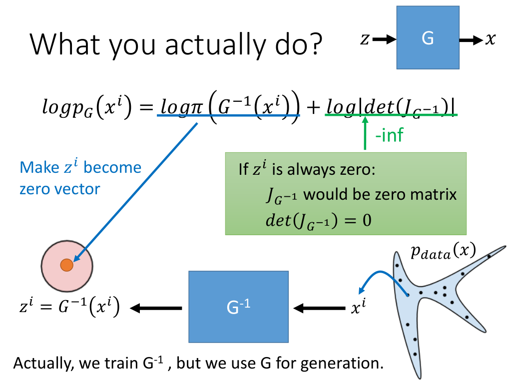

如上图所示，在训练时我们从真实分布$p_{data}(x)$中采样出$x^{i}$，然后去训练$G^{-1}$，使得通过$G^{-1}$生成的满足特定$z^{i}=G^{-1}\left(x^{i}\right)$的先验分布，maximize上面的objective function，这里一般需要保证 $x^{i}$ 和 $z^{i}$ 具有相同的尺寸；接下来在测试时，我们从z中采样出一个点$z^{j}$，然后通过G生成的样本$x^{j}=G \left(z^{j}\right)$就是新的生成图像。

由于$z^i$是符合Normal Distribution，等于0时$\pi\left(z^{i}\right)$最大，因此第一项让$z^i$趋向于0，第二项又让$z^i$远离0。

### Coupling Layer

接下来开始具体考虑 G 的内部设计，为了让$G_{-1}$可以计算并且 G 的 Jacobian 行列式也易于计算，Flow-based Model采用了一种称为耦合层（Coupling Layer）的设计来实现。其被应用在[NICE](https://arxiv.org/abs/1410.8516)和[Real NVP](https://arxiv.org/abs/1605.08803)这两篇论文当中。

整个流程可以表述为

先将输入$z$ 拆分成两个部分（可以是按channel进行拆分，也可以还是按照pixel的location进行拆分）, 对于上面的部分 $z_{1}, \ldots, z_{d}$ 直接copy得到对应的output $x_{1}, \ldots, x_{d}$，而对于下面的分支则有如下的变换（公式中符号代表element-wise相乘）
$$
\left(z_{d+1}, \ldots, z_{D}\right) \odot F\left(z_{1}, \ldots, z_{d}\right)+H\left(z_{1}, \ldots, z_{d}\right)=x_{d+1}, \ldots, x_{D},
$$
可以简化为：$\left(z_{d+1}, \ldots, z_{D}\right) \odot\left(\beta_{1}, \ldots, \beta_{d}\right)+\left(\gamma_{1}, \ldots, \gamma_{d}\right)=x_{d+1}, \ldots, x_{D}$ 或$\beta_{i} z_{i}+\gamma_{i}=x_{i>d}$ 。

之所以采用以上设计结构的原因在于上述的结构容易进行逆运算。

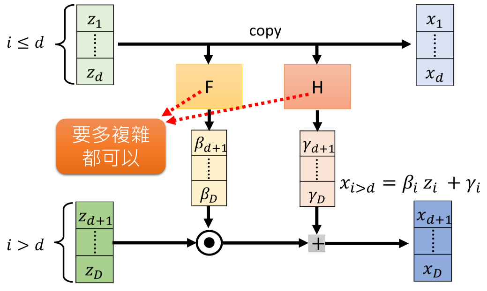

#### Inverse

$z, x$ 都被分成两部分, 前 $d$ 维直接copy，因此求逆也是直接copy。

后$D-d$维使用两个函数进行仿射变化，可以将 $x_{i>d}; z_{i>d}$ 之间看作线性关系，因此求逆时直接进行反操作即可。 

$F, H$ 可以是任意复杂的函数，我们并不需要求他的逆。在逆向过程中，容易得到 $z_{i \leq d}=x_{i}$ 和 $z_{i>d}=\frac{x_{i}-\gamma_{i}}{\beta_{i}}$ 。

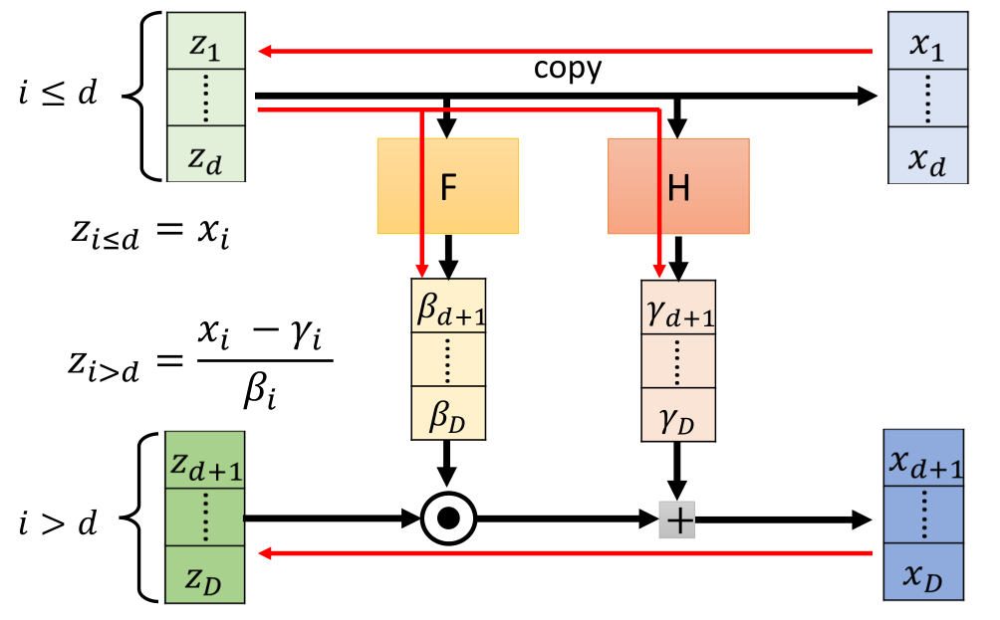

解决完 $G^{-1}$ 部分，还需要求解生成器对应的雅可比矩阵 $J_{G}$ 的行列式

#### Jacobian

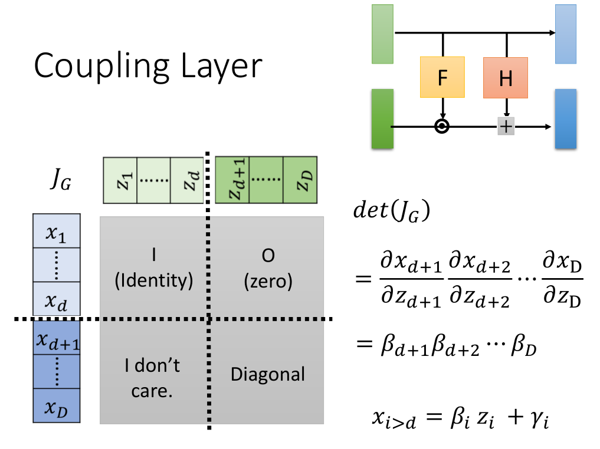

我们们可以将生成器对应的雅克比矩阵分为以上的四个子块, 左上角由于是直接copy的，所以对应的部分应该是一个单位矩阵，右上角中由于 $x_{1}, \ldots, x_{d}$ 与 $z_{d+1}, \ldots, z_{D}$ 没有任何关系，所以是一个零矩阵，而左下角We don't care，因为行列式的右上角为0，所以只需要求解主对角线上的值即可。

右下角由于$x_{i}=\beta_{i} z_{i}，i>d$，是一对一的关系，因此是对角阵，对角线上的元素分别为 $\beta_{d+1}, \ldots, \beta_{D}$ 。

所以上述的 $\left|\operatorname{det}\left(J_{G}\right)\right|=\left|\beta_{d+1} \beta_{d+2} \cdots \beta_{D}\right|$ 。

那么这么一来coupling layer的设计把 $G^{-1}$ 和 $\operatorname{det}\left(J_{G}\right)$这个问题都解决了​

#### Stacking

我们将多个耦合层堆叠在一起，从而形成一个更完整的生成器。但是这样会有一个新问题，就是最终生成数据的前 d 维与初始数据的前d 维是一致的，这会导致生成数据中总有一片区域看起来像是固定的图样（实际上它代表着来自初始高斯噪音的一个部分），我们可以通过将复制模块（copy）与仿射模块（affine）交换顺序的方式去解决这一问题。

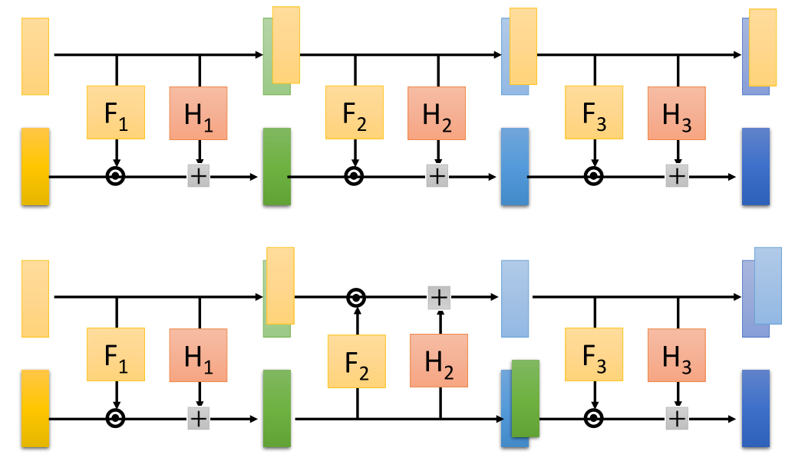

如上图所示，通过将某些耦合层的copy与affine模块进行位置上的互换，使得每一部分数据都能走向 copy->affine->copy->affine 的交替变换通道，这样最终的生成图像就不会包含完全copy自初始图像的部分。值得说明的是，在图像生成当中，这种copy与affine模块互换的方式有很多种，下面举两个例子来说明：

##### 像素维度划分/通道维度划分

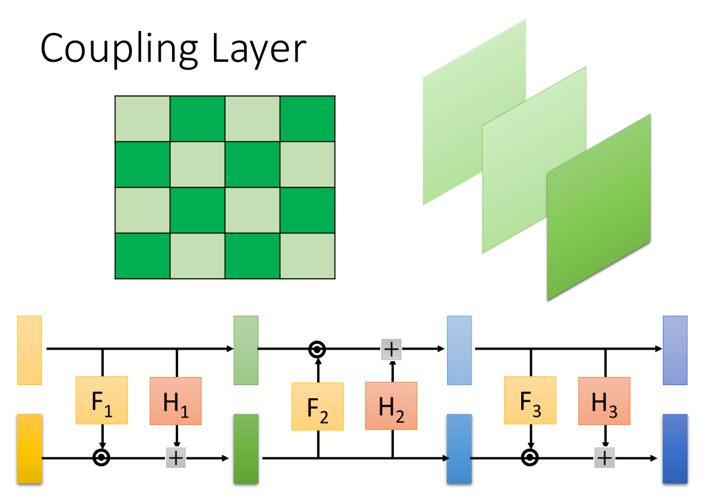

上图展示了两种按照不同的数据划分方式做 copy 与 affine 的交替变换。左图代表的是在像素维度上做划分，即将横纵坐标之和为偶数的划分为一类，和为奇数的划分为另外一类， 然后两类分别交替做 copy 和 affine 变换（两两交替）；右图代表的是在通道维度上做划分， 通常图像会有三通道，那么在每一次耦合变换中按顺序选择一个通道做 copy，其他通道做 affine（三个轮换交替），从而最终变换出我们需要的生成图形出来。

##### 1×1 convolution layer

更进一步地，如何进行 copy 和 affine 的变换能够让生成模型学习地更好，这是一个可以由机器来学习的部分，所以我们引入 W 矩阵，帮我们决定按什么样的顺序做 copy 和 affine 变换，这种方法叫做 1×1 convolution（被用于知名的[GLOW](https://arxiv.org/abs/1807.03039)当中）。

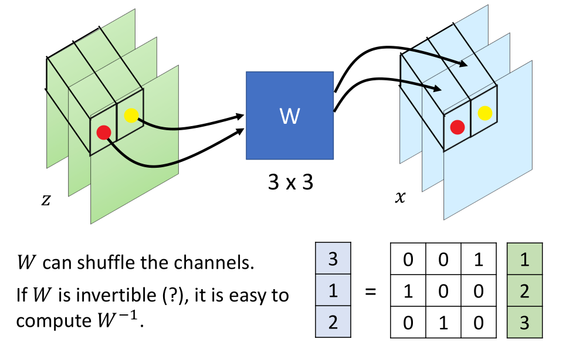

$𝑊$ can shuffle the channels. 所以copy时可以只copy第一个channel，反正1×1 convolution会在适当的时机对channel进行对调。

1×1 convolution 只需要让机器决定在每次仿射计算前对图片哪些区域实行像素对调，而保持 copy 和 affine 模块 的顺序不变，这实际上和对调 copy 和 affine 模块顺序产生的效果是一致的。

比如右侧三个通道分别是1，2，3，经过一个$W$矩阵就会变成3，1，2，相当于对通道调换了顺序。而coupling layer不要动，只copy某几个channel。至于channel如何交换，需要机器学出来。

$W$也在$G$里面，也需要invertible。

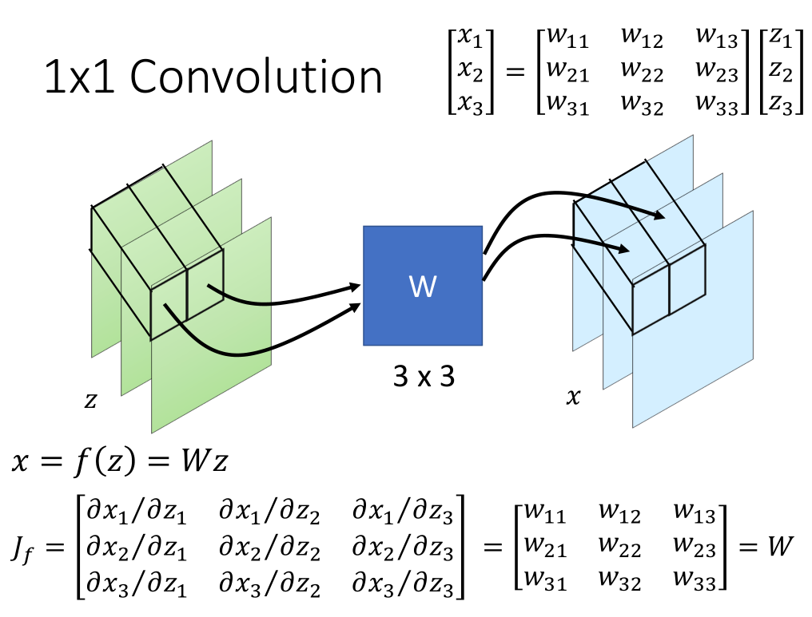

下面我们看一下，将$W$引入flow模型之后，对于原始的Jacobian行列式的计算是否会有影响。

对于每一个3\*3维划分上的仿射操作来说，由$x=f(z)=W z$，可以得到Jacobian行列式的计算结果就是$W$

代入到整个含有d\*d个3*3维的仿射变换矩阵当中，只有对应位置相同的时候才会有权值，得到最终的Jacobian行列式的计算结果就为$(\operatorname{det}(W))^{d \times d}$

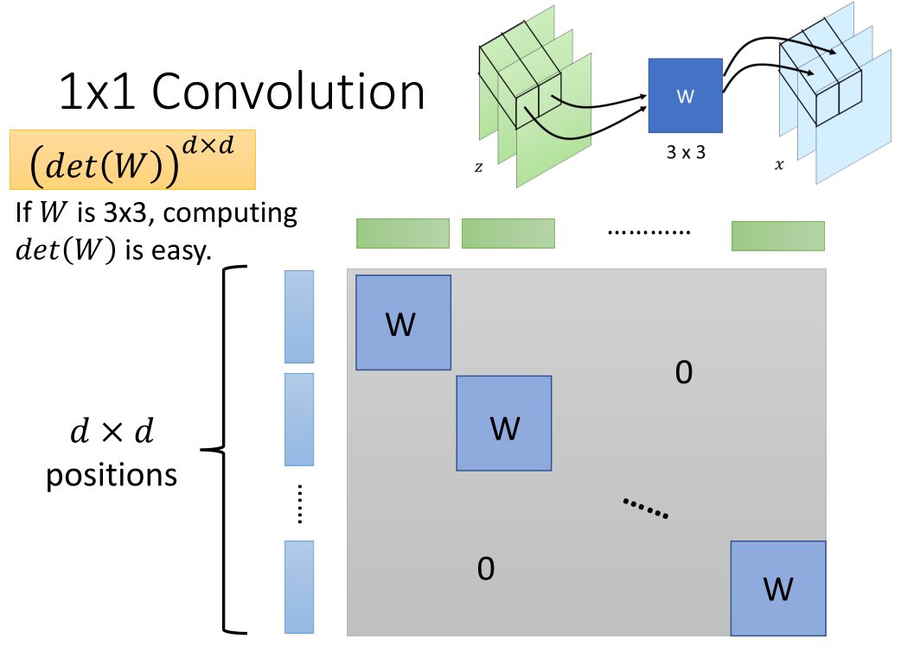

因此，引入1×1 convolution后的$G$的Jacobian行列式计算依然非常简单，所以引入1×1 convolution是可取的，这也是GLOW这篇Paper最有突破和创意的地方。

### Demo of OpenAI

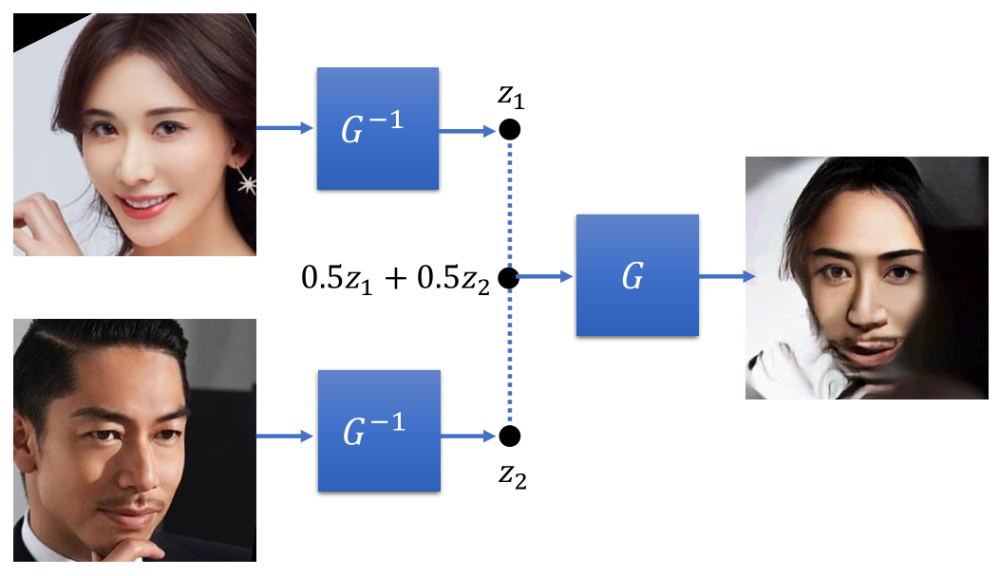

### To Learn More ……

Flow-based Model可以用于语音合成

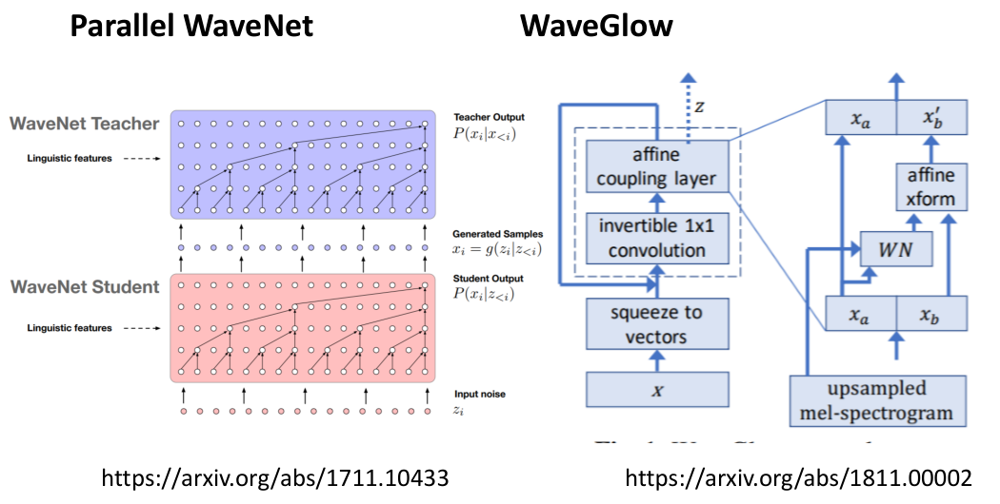

综上，关于 Flow-based Model 的理论讲解和架构分析就全部结束了，它通过巧妙地构造仿射变换的方式实现不同分布间的拟合，并实现了可逆计算和简化雅各比行列式计算的功能和优点，最终我们可以通过堆叠多个这样的耦合层去拟合更复杂的分布变化，从而达到生成模型需要的效果。

