# Machine Learning

## Introduction

### Machine Learning

Machine Learning的本质就是寻找一个function

- 首先要做的是明确你要找什么样的function，大致上分为以下三类：

  - Regression——让机器输出一个数值，如预测PM2.5
  - Classification——让机器做选择题
    - 二元选择题——binary classification，如用RNN做文本语义的分析，是正面还是负面
    - 多元选择题——muti-class classification，如用CNN做图片的多元分类
  - Generation——让机器去创造、生成
    - 如用seq2seq做机器翻译
    - 如用GAN做二次元人物的生成

- 其次是要告诉机器你想要找什么样的function，分为以下三种方式：

  - Supervised Learning：用labeled data明确地告诉机器你想要的理想的正确的输出是什么
  - Reinforcement Learning：不需要明确告诉机器正确的输出是什么，而只是告诉机器它做的好还是不好，引导它自动往正确的方向学习
  - Unsupervised Learning：给机器一堆没有标注的data

- 接下来就是机器如何去找出你想要的function

  当机器知道要找什么样的function之后，就要决定怎么去找这个function，也就是使用loss去衡量一个function的好坏

  - 第一步，给定function寻找的范围

    - 比如Linear Function、Network Architecture都属于指定function的范围

      两个经典的Network Architecture就是RNN和CNN

  - 第二步，确定function寻找的方法

    - 主要的方法就是gradient descent以及它的扩展

      可以手写实现，也可以用现成的Deep Learning Framework，如PyTorch来实现

### 前沿研究

- Explainable AI

  举例来说，对猫的图像识别，Explained AI要做的就是让机器告诉我们为什么它觉得这张图片里的东西是猫

- Adversarial Attack 

  现在的图像识别系统已经相当的完善，甚至可以在有诸多噪声的情况下也能成功识别，而Adversarial Attack要做的事情是专门针对机器设计噪声，刻意制造出那些对人眼影响不大，却能够对机器进行全面干扰使之崩溃的噪声图像

- Network Compression

  你可能有一个识别准确率非常高的model，但是它庞大到无法放到手机、平板里面，而Network Compression要做的事情是压缩这个硕大无比的network，使之能够成功部署在手机甚至更小的平台上

- Anomaly Detection

  如果你训练了一个识别动物的系统，但是用户放了一张动漫人物的图片进来，该系统还是会把这张图片识别成某种动物，因此Anomaly Detection要做的事情是，让机器知道自己无法识别这张图片，也就是能不能让机器知道“我不知道”

- Transfer Learning (即Domain Adversarial Learning)

  学习的过程中，训练资料和测试资料的分布往往是相同的，因此能够得到比较高的准确率，比如黑白的手写数字识别。但是在实际场景的应用中，用户给你的测试资料往往和你用来训练的资料很不一样，比如一张彩色背景分布的数字图，此时原先的系统的准确率就会大幅下降。

  而Transfer Learning要做的事情是，在训练资料和测试资料很不一样的情况下，让机器也能学到东西

- Meta Learning

  Meta Learning的思想就是让机器学习该如何学习，也就是Learn to learn。

  传统的机器学习方法是人所设计的，是我们赋予了机器学习的能力；而Meta Learning并不是让机器直接从我们指定好的function范围中去学习，而是让它自己有能力自己去设计一个function的架构，然后再从这个范围内学习到最好的function。我们期待用这种方式让机器自己寻找到那个最合适的model，从而得到比人类指定model的方法更为有效的结果。

  传统：我们指定model->机器从这个model中学习出best function

  Meta：我们教会机器设计model的能力->机器自己设计model->机器从这个model中学习出best function

  原因：人为指定的model实际上效率并不高，我们常常见到machine在某些任务上的表现比较好，但是这是它花费大量甚至远超于人类所需的时间和资料才能达到和人类一样的能力。相当于我们指定的model直接定义了这是一个天资不佳的机器，只能通过让它勤奋不懈的学习才能得到好的结果；由于人类的智慧有限无法设计高效的model才导致机器学习效率低下，因此Meta learning就期望让机器自己去定义自己的天赋，从而具备更高效的学习能力。

- Life-long Learning

  一般的机器学习都是针对某一个任务设计的model，而Life-long Learning想要让机器能够具备终身学习的能力，让它不仅能够学会处理任务1，还能接着学会处理任务2、3...也就是让机器成为一个全能型人才

## Regression

### 3 Steps

* 定义一个model即function set
* 定义一个goodness of function，损失函数去评估该function的好坏
* 找一个最好的function

### Step 1: Model

#### Linear Model

$$
y=b+w \cdot X_{cp}
$$

y代表进化后的cp值，$X_{cp}$代表进化前的cp值，w和b代表未知参数，可以是任何数值

根据不同的w和b，可以确定不同的无穷无尽的function，而$y=b+w \cdot X_{cp}$这个抽象出来的式子就叫做model，是以上这些具体化的function的集合，即function set

实际上这是一种**Linear Model**，我们可以将其扩展为：

$$
y=b+ \sum w_ix_i
$$
**x~i~**： an attribute of input X  ( x~i~ is also called **feature**，即特征值)

**w~i~**：weight of x~i~

**b**：  bias

### Step 2: Goodness of Function

$x^i$：用上标来表示一个完整的object的编号，$x^{i}$表示第i只宝可梦(下标表示该object中的component)

$\widehat{y}^i$：用$\widehat{y}$表示一个real data的标签，上标为i表示是第i个object

由于regression的输出值是scalar，因此$\widehat{y}$里面并没有component，只是一个简单的数值；但是未来如果考虑structured Learning的时候，我们output的object可能是有structured的，所以我们还是会需要用上标下标来表示一个完整的output的object和它包含的component

#### Loss function

The loss function computes the error for a single training example; the cost function is the average of the loss functions of the entire training set.

为了衡量function set中的某个function的好坏，我们需要一个评估函数，即Loss function，损失函数。Loss function是一个function的function
$$
L(f)=L(w,b)
$$
Input: a function；output: how bad/good it is

由于$f:y=b+w \cdot x_{cp}$，即$f$是由$b$和$w$决定的，因此Loss function实际上是在衡量一组参数的好坏

最常用的方法就是采用类似于方差和的形式来衡量参数的好坏，即预测值与真值差的平方和

这里真正的数值减估测数值的平方，叫做估测误差，Estimation error，将10个估测误差合起来就是loss function
$$
L(f)=L(w,b)=\sum_{n=1}^{10}(\widehat{y}^n-(b+w \cdot {x}^n_{cp}))^2
$$
如果$L(f)$越大，说明该function表现得越不好；$L(f)$越小，说明该function表现得越好

### Step 3: Best Function

挑选最好的function写成formulation/equation就是：
$$
f^*={arg} \underset{f}{\min} L(f)
$$
或者是
$$
w^*,b^*={arg}\ \underset{w,b}{\min} L(w,b)={arg}\  \underset{w,b}{\min} \sum\limits^{10}_{n=1}(\widehat{y}^n-(b+w \cdot x^n_{cp}))^2
$$
使$L(f)=L(w,b)$最小的$f$或$(w,b)$，就是我们要找的$f^*$或$(w^*,b^*)$

#### Gradient Descent

只要$L(f)$是可微分的，Gradient Descent都可以拿来处理$f$，找到表现比较好的parameters

**单个参数的问题**

以只带单个参数w的Loss Function $L(w)$为例

首先保证$L(w)$是**可微**的

我们的目标就是找到这个使Loss最小的$w^*={arg}\ \underset{w}{\min} L(w) $，实际上就是寻找切线L斜率为0的global minima，但是存在一些local minima极小值点，其斜率也是0

有一个暴力的方法是，穷举所有的w值，去找到使loss最小的$w^*$，但是这样做是没有效率的；而gradient descent就是用来解决这个效率问题的

* 首先随机选取一个初始的点$w^0$ (当然也不一定要随机选取，如果有办法可以得到比较接近$w^*$的表现得比较好的$w^0$当初始点，可以有效地提高查找$w^*$的效率)

* 计算$L$在$w=w^0$的位置的微分，即$\frac{dL}{dw}|_{w=w^0}$，几何意义就是切线的斜率

* 如果切线斜率是negative，那么就应该使w变大，即往右踏一步；如果切线斜率是positive，那么就应该使w变小，即往左踏一步，每一步的步长step size就是w的改变量

  w改变量step size的大小取决于两件事

  * 一是现在的微分值$\frac{dL}{dw}$有多大，微分值越大代表现在在一个越陡峭的地方，那它要移动的距离就越大，反之就越小；

  * 二是一个常数项$η$，被称为**learning rate**，即学习率，它决定了每次踏出的step size不只取决于现在的斜率，还取决于一个事先就定好的数值，如果learning rate比较大，那每踏出一步的时候，参数w更新的幅度就比较大，反之参数更新的幅度就比较小

    如果learning rate设置的大一些，那机器学习的速度就会比较快；但是learning rate如果太大，可能就会跳过最合适的global minima的点

* 因此每次参数更新的大小是 $η \frac{dL}{dw}$，为了满足斜率为负时w变大，斜率为正时w变小，应当使原来的w减去更新的数值，即
  $$
  w^1=w^0-η \frac{dL}{dw}|_{w=w^0} \\
  w^2=w^1-η \frac{dL}{dw}|_{w=w^1} \\
  w^3=w^2-η \frac{dL}{dw}|_{w=w^2} \\
  ... \\
  w^{i+1}=w^i-η \frac{dL}{dw}|_{w=w^i} \\
  \text{if}\ \  \frac{dL}{dw}|_{w=w^i}==0 \ \text{stop}
  $$
  $w^i$对应的斜率为0，我们找到了一个极小值local minima。

  这就出现了一个问题，当微分为0的时候，参数就会一直卡在这个点上没有办法再更新了，因此通过gradient descent找出来的solution其实并不是最佳解global minima
  
  但幸运的是，在linear regression上，是没有local minima的，因此可以使用这个方法

**两个参数的问题**

今天要解决的关于宝可梦的问题，是含有two parameters的问题，即$(w^*,b^*)=arg\ \underset{w,b} {min} L(w,b)$

当然，它本质上处理单个参数的问题是一样的

* 首先，也是随机选取两个初始值，$w^0$和$b^0$

* 然后分别计算$(w^0,b^0)$这个点上，L对w和b的偏微分，即$\frac{\partial L}{\partial w}|_{w=w^0,b=b^0}$ 和 $\frac{\partial L}{\partial b}|_{w=w^0,b=b^0}$

* 更新参数，当迭代跳出时，$(w^i,b^i)$对应着极小值点
  $$
  w^1=w^0-η\frac{\partial L}{\partial w}|_{w=w^0,b=b^0} \ \ \ \ \ \ \ \  \ b^1=b^0-η\frac{\partial L}{\partial b}|_{w=w^0,b=b^0} \\
  w^2=w^1-η\frac{\partial L}{\partial w}|_{w=w^1,b=b^1} \ \ \ \ \ \ \ \  \ b^2=b^1-η\frac{\partial L}{\partial b}|_{w=w^1,b=b^1} \\
  ... \\
  w^{i+1}=w^{i}-η\frac{\partial L}{\partial w}|_{w=w^{i},b=b^{i}} \ \ \ \ \ \ \ \  \ b^{i+1}=b^{i}-η\frac{\partial L}{\partial b}|_{w=w^{i},b=b^{i}} \\
  
  \text{if}\ \  \frac{\partial L}{\partial w}==0 \text{ and }\frac{\partial L}{\partial b}==0  \   \ \text{stop}
  $$

实际上，L 的gradient就是微积分中的那个梯度的概念，即
$$
\nabla L=
\begin{bmatrix}
\frac{\partial L}{\partial w} \\
\frac{\partial L}{\partial b}
\end{bmatrix}_{gradient}
$$
每次计算得到的梯度gradient，就是由$\frac{\partial L}{\partial b}和\frac{\partial L}{\partial w}$组成的vector向量，就是该点等高线的法线方向；而$(-η\frac{\partial L}{\partial b},-η\frac{\partial L}{\partial w})$的作用就是让原先的$(w^i,b^i)$朝着gradient的反方向前进，其中learning rate的作用是每次更新的跨度(对应图中红色箭头的长度)；经过多次迭代，最终gradient达到极小值点

这里**两个方向的learning rate必须保持一致**，这样每次更新坐标的step size是等比例缩放的，保证坐标前进的方向始终和梯度下降的方向一致；否则坐标前进的方向将会发生偏移

##### local minima

gradient descent有一个令人担心的地方，它每次迭代完毕，寻找到的梯度为0的点必然是极小值点 local minima；却不一定是最小值点 global minima

这会造成一个问题，如果loss function长得比较坑坑洼洼（极小值点比较多），而每次初始化$w^0$的取值又是随机的，这会造成每次gradient descent停下来的位置都可能是不同的极小值点

而且当遇到梯度比较平缓（gradient≈0）的时候，gradient descent也可能会效率低下甚至可能会stuck

也就是说通过这个方法得到的结果，是看人品的

但是在linear regression里，loss function实际上是**convex**的，是一个凸函数，是没有local optimal 局部最优解的，它只有一个global minima，visualize出来的图像就是从里到外一圈一圈包围起来的椭圆形的等高线，因此随便选一个起始点，根据gradient descent最终找出来的，都会是同一组参数

#### Overfitting

随着$(x_{cp})^i$的高次项的增加，对应的average error会不断地减小

实际上这件事情非常容易解释，实际上低次的式子是高次的式子的特殊情况（令高次项$(x_{cp})^i$对应的$w_i$为0，高次式就转化成低次式）

在gradient descent可以找到best function的前提下（多次式为Non-linear model，存在local optimal，gradient descent不一定能找到global minima）function所包含的项的次数越高，越复杂，error在training data上的表现就会越来越小

但是，我们关心的不是model在training data上的error表现，而是model在testing data上的error表现，在training data上，model越复杂，error就会越低；但是在testing data上，model复杂到一定程度之后，error非但不会减小，反而会暴增。

从含有$(x_{cp})^4$项的model开始往后的model，testing data上的error出现了大幅增长的现象，通常被称为**Overfitting**

原来的loss function只考虑了prediction error，即$\sum\limits_n(\widehat{y}^n-(b+\sum w_ix_i))^2$

**regularization**则是在原来的loss function的基础上加上了一项$\lambda\sum(w_i)^2$，就是把这个model里面所有的$w_i$的平方和用λ加权

也就是说，我们期待参数$w_i$越小甚至接近于0的function。为什么呢？

因为参数值接近0的function，是比较平滑的；所谓的平滑的意思是，当今天的输入有变化的时候，output对输入的变化是比较不敏感的

举例来说，对$y=b+\sum w_ix_i$这个model，当input变化$\Delta x_i$，output的变化就是$w_i\Delta x_i$，也就是说，如果$w_i$越小越接近0的话，输出对输入就越不sensitive，我们的function就是一个越平滑的function；

我们没有把bias b这个参数考虑进去的原因是，bias的大小跟function的平滑程度是没有关系的，bias值的大小只是把function上下移动而已

如果我们有一个比较平滑的function，由于输出对输入是不敏感的，测试的时候，一些noises噪声对这个平滑的function的影响就会比较小，而给我们一个比较好的结果

这里的λ需要我们手动去调整以取得最好的值

λ值越大代表考虑smooth的那个regularization那一项的影响力越大，我们找到的function就越平滑

当我们的λ越大的时候，在training data上得到的error其实是越大的，但是这件事情是非常合理的，因为当λ越大的时候，我们就越倾向于考虑w的值而越少考虑error的大小

但是有趣的是，虽然在training data上得到的error越大，但是在testing data上得到的error可能会是比较小的；当然λ太大的时候，在testing data上的error就会越来越大

我们喜欢比较平滑的function，因为它对noise不那么sensitive；但是我们又不喜欢太平滑的function，因为它就失去了对data拟合的能力；而function的平滑程度，就需要通过调整λ来决定

### Conclusion

根据已有的data特点(labeled data，包含宝可梦及进化后的cp值)，确定使用supervised learning监督学习

根据output的特点(输出的是scalar数值)，确定使用regression回归(linear or non-linear)

#### Back to step 1: Redesign the Model Again

考虑包括进化前cp值、species、hp等各方面变量属性以及高次项的影响，我们的model可以采用：

#### Back to step 2: Regularization

而为了保证function的平滑性，不overfitting，应使用regularization，即$L=\sum\limits_{i=1}^n(\widehat{y}^i-y^i)^2+\lambda\sum\limits_{j}(w_j)^2$

注意bias b对function平滑性无影响

#### Back to step 3

利用gradient descent对regularization版本的loss function进行梯度下降迭代处理，每次迭代都减去L对该参数的微分与learning rate之积，假设所有参数合成一个vector：$[w_0,w_1,w_2,...,w_j,...,b]^T$，那么每次梯度下降的表达式如下：
$$
\nabla L=
\begin{bmatrix}
\frac{\partial L}{\partial w_0} \\
\frac{\partial L}{\partial w_1} \\
\frac{\partial L}{\partial w_2} \\
... \\
\frac{\partial L}{\partial w_j} \\
... \\
\frac{\partial L}{\partial b}
\end{bmatrix}_{gradient}
\ \ \ 
\\gradient \ descent:
\begin{bmatrix}
w'_0\\
w'_1\\
w'_2\\
...\\
w'_j\\
...\\
b'
\end{bmatrix}_{L=L'}
= \ \ \ \ \ \ 
\begin{bmatrix}
w_0\\
w_1\\
w_2\\
...\\
w_j\\
...\\
b
\end{bmatrix}_{L=L_0}
-\ \ \ \ \eta
\begin{bmatrix}
\frac{\partial L}{\partial w_0} \\
\frac{\partial L}{\partial w_1} \\
\frac{\partial L}{\partial w_2} \\
... \\
\frac{\partial L}{\partial w_j} \\
... \\
\frac{\partial L}{\partial b}
\end{bmatrix}_{L=L_0}
$$
当梯度稳定不变时，即$\nabla L$为0时，gradient descent便停止，此时如果采用的model是linear的，那么vector必然落于global minima处；如果采用的model是Non-linear的，vector可能会落于local minima处，此时需要采取其他办法获取最佳的function

假定我们已经通过各种方法到达了global minima的地方，此时的vector：$[w_0,w_1,w_2,...,w_j,...,b]^T$所确定的那个唯一的function就是在该λ下的最佳$f^*$，即loss最小

这里λ的最佳数值是需要通过我们不断调整来获取的，因此令λ等于0，10，100，1000，...不断使用gradient descent或其他算法得到最佳的parameters$[w_0,w_1,w_2,...,w_j,...,b]^T$，并计算出这组参数确定的function $f^*$对training data和testing data上的error值，直到找到那个使testing data的error最小的λ

λ=0就是没有使用regularization时的loss function

## Where does the error come from?

### Estimator

$\widehat{y}$表示那个真正的function，而$f^*$表示这个$\widehat{f}$的估测值estimator

就好像在打靶，$\widehat{f}$是靶的中心点，收集到一些data做training以后，你会得到一个你觉得最好的function即$f^*$，这个$f^*$落在靶上的某个位置，它跟靶中心有一段距离，这段距离就是由bias和variance决定的

实际上对应着物理实验中系统误差和随机误差的概念，假设有n组数据，每一组数据都会产生一个相应的$f^*$，此时bias表示所有$f^*$的平均落靶位置和真值靶心的距离，variance表示这些$f^*$的集中程度

#### Bias and Variance of Estimator

假设独立变量为x(这里的x代表每次独立地从不同的training data里训练找到的$f^*$)，那么

总体期望$E(x)=u$ ；总体方差$Var(x)=\sigma^2$ 

**用样本均值$\overline{x}$估测总体期望$u$**

由于我们只有有限组样本 $\{x^1,x^2,...,x^N\}$，故样本均值$\overline{x}=\frac{1}{N}\sum\limits_{i=1}^{N}x^i \neq \mu$ ；样本均值的期望$E(\overline{x})=E(\frac{1}{N}\sum\limits_{i=1}^{N}x^i)=\mu$ ; 样本均值的方差$Var(\overline{x})=\frac{\sigma^2}{N}$

样本均值 $\overline{x}$的期望是总体期望$\mu$，也就是说$\overline{x}$是按概率对称地分布在总体期望$\mu$的两侧的；而$\overline{x}$分布的密集程度取决于N，即数据量的大小，如果N比较大，$\overline{x}$就会比较集中，如果N比较小，$\overline{x}$就会以$\mu$为中心分散开来

综上，样本均值$\overline{x}$以总体期望$\mu$为中心对称分布，可以用来估测总体期望$\mu$

**用样本方差$s^2$估测总体方差$\sigma^2$**

由于我们只有有限组样本 $\{x^1,x^2,...,x^N\}$，故样本均值$\overline{x}=\frac{1}{N}\sum\limits_{i=1}^{N}x^i$ ；样本方差$s^2=\frac{1}{N-1}\sum\limits_{i=1}^N(x^i-\overline{x})^2$ ；样本方差的期望$E(s^2)=\frac{N-1}{N}\sigma^2 \neq \sigma^2$ 

同理，样本方差$s^2$以总体方差$\sigma^2$为中心对称分布，可以用来估测总体方差$\sigma^2$，而$s^2$分布的密集程度也取决于N

现在我们要估测的是靶的中心$\widehat{f}$，每次collect data训练出来的$f^*$是打在靶上的某个点；产生的error取决于：

* 多次实验得到的$f^*$的期望$\overline{f}$与靶心$\widehat{f}$之间的bias——$E(f^*)$，可以形象地理解为瞄准的位置和靶心的距离的偏差
* 多次实验的$f^*$之间的variance——$Var(f^*)$，可以形象地理解为多次打在靶上的点的集中程度

### Error

#### Variance

$f^*$的variance是由model决定的，一个简单的model在不同的training data下可以获得比较稳定分布的$f^*$，而复杂的model在不同的training data下的分布比较杂乱（如果data足够多，那复杂的model也可以得到比较稳定的分布）

如果采用比较简单的model，那么每次在不同data下的实验所得到的不同的$f^*$之间的variance是比较小的，就好像说，你在射击的时候，每次击中的位置是差不多的，就如同下图中的linear model，100次实验找出来的$f^*$都是差不多的

但是如果model比较复杂，那么每次在不同data下的实验所得到的不同的$f^*$之间的variance是比较大的，它的散布就会比较开，就如同图中含有高次项的model，每一条$f^*$都长得不太像，并且散布得很开

那为什么比较复杂的model，它的散布就比较开呢？比较简单的model，它的散布就比较密集呢？

原因其实很简单，其实前面在讲regularization正规化的时候也提到了部分原因。简单的model实际上就是没有高次项的model，或者高次项的系数非常小的model，这样的model表现得相当平滑，受到不同的data的影响是比较小的

举一个很极端的例子，我们的整个model(function set)里面，只有一个function: f=c，这个function只有一个常数项，因此无论training data怎么变化，从这个最简单的model里找出来的$f^*$都是一样的，它的variance就是等于0

#### Bias

bias是说，我们把所有的$f^*$平均起来得到$E(f^*)=\overline{f^*}$，这个$\overline{f^*}$与真值$\widehat{f}$有多接近

当然这里会有一个问题是说，总体的真值$\widehat{f}$我们根本就没有办法知道，因此这里只是假定了一个$\widehat{f}$

当model比较简单的时候，每次实验得到的$f^*$之间的variance会比较小，这些$f^*$会稳定在一个范围内，但是它们的平均值$\overline{f}$距离真实值$\widehat{f}$会有比较大的偏差；

而当model比较复杂的时候，每次实验得到的$f^*$之间的variance会比较大，实际体现出来就是每次重新实验得到的$f^*$都会与之前得到的有较大差距，但是这些差距较大的$f^*$的平均值$\overline{f}$却和真实值$\widehat{f}$比较接近

也就是说，复杂的model，单次实验的结果是没有太大参考价值的，但是如果把考虑多次实验的结果的平均值，也许会对最终的结果有帮助

这里的单次实验指的是，用一组training data训练出model的一组有效参数以构成$f^*$(每次独立实验使用的training data都是不同的)

因此

* 如果是一个比较简单的model，那它有比较小的variance和比较大的bias。每次实验的$f^*$都比较集中，但是他们平均起来距离靶心会有一段距离（比较适合实验次数少甚至只有单次实验的情况）
* 如果是一个比较复杂的model，每次实验找出来的$f^*$都不一样，它有比较大的variance但是却有比较小的bias。每次实验的$f^*$都比较分散，但是他们平均起来的位置与靶心比较接近（比较适合多次实验的情况）

#### Why？

实际上我们的model就是一个function set，当你定好一个model的时候，实际上就已经定好这个function set的范围了，那个最好的function只能从这个function set里面挑出来

如果是一个简单的model，它的function set的space是比较小的，这个范围可能根本就没有包含你的target；如果这个function set没有包含target，那么不管怎么sample，平均起来永远不可能是target

如果这个model比较复杂，那么这个model所代表的function set的space是比较大的，那它就很有可能包含target

只是它没有办法找到那个target在哪，因为你给的training data不够，你给的training data每一次都不一样，所以它每一次找出来的$f^*$都不一样，但是如果他们是散布在这个target附近的，那平均起来，实际上就可以得到和target比较接近的位置

### Bias vs Variance

由前面的讨论可知，比较简单的model，variance比较小，bias比较大；而比较复杂的model，bias比较小，variance比较大

$\text{error}_{observed}=\text{error}_{variance}+\text{error}_{bias}$

可以发现，随着model的逐渐复杂：

* bias逐渐减小，bias所造成的error也逐渐下降，也就是打靶的时候瞄得越来越准
* variance逐渐变大，variance所造成的error也逐渐增大，也就是**虽然瞄得越来越准，但是每次射出去以后，你的误差是越来越大的**
* 当bias和variance这两项同时被考虑的时候，也就是实际体现出来的error的变化
* 实际观测到的error先是减小然后又增大，因此实际error为最小值的那个点，即为bias和variance的error之和最小的点，就是表现最好的model
* 如果实际error主要来自于variance很大，这个状况就是**overfitting**过拟合；如果实际error主要来自于bias很大，这个状况就是**underfitting**欠拟合。

这就是我们之前要先计算出每一个model对应的error，再挑选error最小的model的原因

只有这样才能综合考虑bias和variance的影响，找到一个实际error最小的model

#### Where does the error come from?

当你自己在做research的时候，你必须要搞清楚，手头上的这个model，它目前主要的error是来源于哪里；你觉得你现在的问题是bias大，还是variance大

你应该先知道这件事情，你才能知道你的future work，你要improve你的model的时候，你应该要走哪一个方向

* 如果model没有办法fit training data的examples，代表bias比较大，这时是underfitting

  形象地说，就是该model找到的$f^*$上面并没有training data的大部分样本点，代表说这个model跟正确的model是有一段差距的，所以这个时候是bias大的情况，是underfitting

* 如果model可以fit training data，在training data上得到小的error，但是在testing data上，却得到一个大的error，代表variance比较大，这时是overfitting

遇到bias大或variance大的时候，你其实是要用不同的方式来处理它们

#### What to do with large bias?

bias大代表，你现在这个model里面可能根本没有包含你的target，$\widehat{f}$可能根本就不在你的function set里

对于error主要来自于bias的情况，是由于该model（function set）本来就不好，collect更多的data是没有用的，必须要从model本身出发redesign，重新设计你的model

**For bias, redesign your model**

* Add more features as input

  比如pokemon的例子里，只考虑进化前cp值可能不够，还要考虑hp值、species种类...作为model新的input变量

* Add more features as input

#### What to do with large variance?

* More data
  * Very effective, but not always practical
  * 如果是5次式，找100个$f^*$，每次实验我们只用10只宝可梦的数据训练model，那我们找出来的100个$f^*$的散布就会杂乱无章；但如果每次实验我们用100只宝可梦的数据训练model，那我们找出来的100个$f^*$的分布就非常地集中
  * 增加data是一个很有效控制variance的方法，假设你variance太大的话，collect data几乎是一个万能的东西，并且它不会伤害你的bias。但是它存在一个很大的问题是，实际上并没有办法去collect更多的data
  * 如果没有办法collect更多的data，其实有一招，根据你对这个问题的理解，自己去generate更多“假的”data
    * 比如手写数字识别，因为每个人手写数字的角度都不一样，那就把所有training data里面的数字都左转15°，右转15°
    * 比如做火车的影像辨识，只有从左边开过来的火车影像资料，没有从右边开过来的火车影像资料，实际上可以把每张图片都左右颠倒，就generate出右边的火车数据了，这样就多了一倍data出来
    * 比如做语音辨识的时候，只有男生说的“你好”，没有女生说的“你好”，那就用男生的声音用一个变声器把它转化一下，这样男女生的声音就可以互相转化，这样data就多了
    * 比如现在你只有录音室里录下的声音，但是detection实际要在真实场景下使用的，那你就去真实场景下录一些噪音加到原本的声音里，就可以generate出符合条件的data
* Regularization
  * 在loss function里面再加一个与model高次项系数相关的term，它会希望你的model里高次项的参数越小越好，也就是说希望你今天找出来的曲线越平滑越好；这个新加的term前面可以有一个weight，代表你希望你的曲线有多平滑
  * 加了regularization后，一些怪怪的、很不平滑的曲线就不会再出现，所有曲线都集中在比较平滑的区域；增加weight可以让曲线变得更平滑
  * 加了regularization以后，因为你强迫所有的曲线都要比较平滑，所以这个时候也会让你的variance变小。**但regularization是可能会伤害bias的，因为它实际上调整了function set的space范围，变成它只包含那些比较平滑的曲线**，这个缩小的space可能没有包含原先在更大space内的$\widehat{f}$，因此伤害了bias，所以当你做regularization的时候，需要调整regularization的weight，在variance和bias之间取得平衡

### Model Selection

我们现在会遇到的问题往往是这样：我们有很多个model可以选择，还有很多参数可以调，比如regularization的weight，那通常我们是在bias和variance之间做一些trade-off

我们希望找一个model，它variance够小，bias也够小，这两个合起来给我们最小的testing data的error

#### Cross Validation

你要做的事情是，把你的training set分成两组：

* 一组是真正拿来training model的，叫做training set(训练集)
* 另外一组不拿它来training model，而是拿它来选model，叫做validation set(验证集)

先在training set上找出每个model最好的function $f^*$，然后用validation set来选择你的model

也就是说，你手头上有3个model，你先把这3个model用training set训练出三个$f^*$，接下来看一下它们在validation set上的performance

假设现在model 3的performance最好，那你可以直接把这个model 3的结果拿来apply在testing data上

如果你担心现在把training set分成training和validation两部分，感觉training data变少的话，可以这样做：已经从validation决定model 3是最好的model，那就定住model 3不变（function的表达式不变），然后使用全部的data去更新model 3表达式的参数

这个时候，如果你把这个训练好的model的$f^*$apply到public testing set上面，虽然这么做，你得到的error表面上看起来是比较大的，但是这个时候你在public set上的error才能够真正反映你在private set上的error

当你得到public set上的error的时候（尽管它可能会很大），不建议回过头去重新调整model的参数，因为当你再回去重新调整什么东西的时候，你就又会把public testing set的bias给考虑进去了，这就又回到围绕着有偏差的testing data做model的优化。这样的话此时你在public set上看到的performance就没有办法反映实际在private set上的performance了。因为你的model是针对public set做过优化的，虽然public set上的error数据看起来可能会更好看，但是针对实际未知的private set，这个“优化”带来的可能是反作用，反而会使实际的error变大

因此这里只是说，你要keep in mind，benchmark corpus上面所看到的testing的performance，说不定是别人特意调整过的，并且testing set与实际的数据也会有偏差，它的error，肯定是大于它在real application上应该有的值

比如说你现在常常会听到说，在image lab的那个corpus上面，error rate都降到3%，已经超越人类了。但是真的是这样子吗？如果已经用testing data调过参数了，你把那些model真的apply到现实生活中，它的error rate肯定是大于3%的。

##### N-fold Cross Validation

如果你不相信某一次分train和validation的结果的话，那你就分很多种不同的样子

比如说，如果你做3-fold的validation，把training set分成三份

你每一次拿其中一份当做validation set，另外两份当training；分别在每个情境下都计算一下3个model的error，然后计算一下它的average error；然后你会发现在这三个情境下的average error，是model 1最好

然后接下来，你就把用整个完整的training data重新训练一遍model 1的参数；然后再去testing data上test

原则上是，如果你少去根据public testing set上的error调整model的话，那你在private testing set上面得到的error往往是比较接近public testing set上的error的

## Gradient Descent

### Gradient Descent

$$
\theta^{*}=\arg \underset{\theta}{\min} L(\theta) \quad
$$

L : loss function

$\theta:$ parameters(上标表示第几组参数，下标表示这组参数中的第几个参数)

Suppose that $\theta$ has two variables $\left\{\theta_{1}, \theta_{2}\right\}$ 

Randomly start at $\theta^{0}=\left[\begin{array}{l}{\theta_{1}^{0}} \\ {\theta_{2}^{0}}\end{array}\right] \quad$ 

计算$\theta$处的梯度：$\nabla L(\theta)=\left[\begin{array}{l}{\partial L\left(\theta_{1}\right) / \partial \theta_{1}} \\ {\partial L\left(\theta_{2}\right) / \partial \theta_{2}}\end{array}\right]$

$$
\left[\begin{array}{l}{\theta_{1}^{1}} \\ {\theta_{2}^{1}}\end{array}\right]=\left[\begin{array}{l}{\theta_{1}^{0}} \\ {\theta_{2}^{0}}\end{array}\right]-\eta\left[\begin{array}{l}{\partial L\left(\theta_{1}^{0}\right) / \partial \theta_{1}} \\ {\partial L\left(\theta_{2}^{0}\right) / \partial \theta_{2}}\end{array}\right] \Rightarrow \theta^{1}=\theta^{0}-\eta \nabla L\left(\theta^{0}\right)\\\left[\begin{array}{c}{\theta_{1}^{2}} \\ {\theta_{2}^{2}}\end{array}\right]=\left[\begin{array}{c}{\theta_{1}^{1}} \\ {\theta_{2}^{1}}\end{array}\right]-\eta\left[\begin{array}{c}{\partial L\left(\theta_{1}^{1}\right) / \partial \theta_{1}} \\ {\partial L\left(\theta_{2}^{1}\right) / \partial \theta_{2}}\end{array}\right] \Rightarrow \theta^{2}=\theta^{1}-\eta \nabla L\left(\theta^{1}\right)
$$
在整个gradient descent的过程中，梯度不一定是递减的，但是沿着梯度下降的方向，函数值loss一定是递减的（如果学习率足够小），且当gradient=0时，loss下降到了局部最小值，梯度下降法指的是函数值loss随梯度下降的方向减小

初始随机在三维坐标系中选取一个点，这个三维坐标系的三个变量分别为$(\theta_1,\theta_2,loss)$，我们的目标是找到最小的那个loss也就是三维坐标系中高度最低的那个点，而gradient梯度（Loss等高线的法线方向）可以理解为高度上升最快的那个方向，它的反方向就是梯度下降最快的那个方向

于是每次update沿着梯度反方向，update的步长由梯度大小和learning rate共同决定，当某次update完成后，该点的gradient=0，说明到达了局部最小值

### Tip 1: Tuning your learning rates

* 如果learning rate刚刚好，就可以顺利地到达到loss的最小值
* 如果learning rate太小的话，虽然最后能够走到local minimal的地方，但是它可能会走得非常慢，以至于你无法接受
* 如果learning rate太大，它的步伐太大了，它永远没有办法走到特别低的地方，可能永远在这个“山谷”的口上振荡而无法走下去
* 如果learning rate非常大，可能一瞬间就飞出去了，结果会造成update参数以后，loss反而会越来越大

当参数有很多个的时候(>3)，其实我们很难做到将loss随每个参数的变化可视化出来（因为最多只能可视化出三维的图像，也就只能可视化三维参数），但是我们可以把update的次数作为唯一的一个参数，将loss随着update的增加而变化的趋势给可视化出来

所以做gradient descent一个很重要的事情是，要**把不同的learning rate下，loss随update次数的变化曲线给可视化出**来，它可以提醒你该如何调整当前的learning rate的大小，直到出现稳定下降的曲线

#### Adaptive Learning rates

显然这样手动地去调整learning rates很麻烦，因此我们需要有一些自动调整learning rates的方法

最基本、最简单的大原则是：learning rate通常是随着参数的update越来越小的

因为在起始点的时候，通常是离最低点是比较远的，这时候步伐就要跨大一点；而经过几次update以后，会比较靠近目标，这时候就应该减小learning rate，让它能够收敛在最低点的地方

举例：假设到了第t次update，此时$\eta^t=\eta/ \sqrt{t+1}$

这种方法使所有参数以同样的方式同样的learning rate进行update，而最好的状况是每个参数都给它不同的learning rate去update

##### Adagrad

> Divide the learning rate of each parameter by the root mean square(方均根) of its previous derivatives

Adagrad就是将不同参数的learning rate分开考虑的一种算法（adagrad算法update到后面速度会越来越慢，当然这只是adaptive算法中最简单的一种）

这里的w是function中的某个参数，t表示第t次update，$g^t$表示Loss对w的偏微分，而$\sigma^t$是之前所有Loss对w偏微分的方均根(根号下的平方均值)，这个值对每一个参数来说都是不一样的
$$
\begin{equation}
\begin{split}
&Adagrad\\
&w^1=w^0-\frac{\eta^0}{\sigma^0}\cdot g^0 \ \ \ \sigma^0=\sqrt{(g^0)^2} \\
&w^2=w^1-\frac{\eta^1}{\sigma^1}\cdot g^1 \ \ \ \sigma^1=\sqrt{\frac{1}{2}[(g^0)^2+(g^1)^2]} \\
&w^3=w^2-\frac{\eta2}{\sigma^2}\cdot g^2 \ \ \ \sigma^2=\sqrt{\frac{1}{3}[(g^0)^2+(g^1)^2+(g^2)^2]} \\
&... \\
&w^{t+1}=w^t-\frac{\eta^t}{\sigma^t}\cdot g^t \ \ \ \sigma^t=\sqrt{\frac{1}{1+t}\sum\limits_{i=0}^{t}(g^i)^2}
\end{split}
\end{equation}
$$
由于$\eta^t$和$\sigma^t$中都有一个$\sqrt{\frac{1}{1+t}}$的因子，两者相消，即可得到adagrad的最终表达式：$w^{t+1}=w^t-\frac{\eta}{\sqrt{\sum\limits_{i=0}^t(g^i)^2}}\cdot g^t$

###### Contradiction

Adagrad的表达式$w^{t+1}=w^t-\frac{\eta}{\sqrt{\sum\limits_{i=0}^t(g^i)^2}}\cdot g^t$里面有一件很矛盾的事情：

我们在做gradient descent的时候，希望的是当梯度值即微分值$g^t$越大的时候（此时斜率越大，还没有接近最低点）更新的步伐要更大一些，但是Adagrad的表达式中，分母表示梯度越大步伐越小，分子却表示梯度越大步伐越大，两者似乎相互矛盾

在一些paper里是这样解释的：Adagrad要考虑的是，这个gradient有多surprise，即反差有多大，假设t=4的时候$g^4$与前面的gradient反差特别大，那么$g^t$与$\sqrt{\frac{1}{t+1}\sum\limits_{i=0}^t(g^i)^2}$之间的大小反差就会比较大，它们的商就会把这一反差效果体现出来

同时，gradient越大，离最低点越远这件事情在有多个参数的情况下是不一定成立的

实际上，对于一个二次函数$y=ax^2+bx+c$来说，最小值点的$x=-\frac{b}{2a}$，而对于任意一点$x_0$，它迈出最好的步伐长度是$|x_0+\frac{b}{2a}|=|\frac{2ax_0+b}{2a}|$(这样就一步迈到最小值点了)，联系该函数的一阶和二阶导数$y'=2ax+b$、$y''=2a$，可以发现the best step is $|\frac{y'}{y''}|$，也就是说他不仅跟一阶导数(gradient)有关，还跟二阶导数有关

再来回顾Adagrad的表达式：$w^{t+1}=w^t-\frac{\eta}{\sqrt{\sum\limits_{i=0}^t(g^i)^2}}\cdot g^t$

$g^t$就是一次微分，而分母中的$\sum\limits_{i=0}^t(g^i)^2$反映了二次微分的大小，所以Adagrad想要做的事情就是，在不增加任何额外运算的前提下，想办法去估测二次微分的值

### Tip 2: Stochastic Gradient Descent

随机梯度下降的方法可以让训练更快速，传统的gradient descent的思路是看完所有的样本点之后再构建loss function，然后去update参数；而stochastic gradient descent的做法是，看到一个样本点就update一次，因此它的loss function不是所有样本点的error平方和，而是这个随机样本点的error平方

### Tip 3: Mini-batch Gradient Descent

这里有一个秘密，就是我们在做deep learning的gradient descent的时候，并不会真的去minimize total loss，那我们做的是什么呢？我们会把Training data分成一个一个的batch，比如说你的Training data一共有一万张image，每次random选100张image作为一个batch

- 像gradient descent一样，先随机initialize network的参数

- 选第一个batch出来，然后计算这个batch里面的所有element的total loss，$L'=l^1+l^{31}+...$，接下来根据$L'$去update参数，也就是计算$L'$对所有参数的偏微分，然后update参数

  注意：$L'$不是全部data的total loss

- 再选择第二个batch，现在这个batch的total loss是$L''=l^2+l^{16}+...$，接下来计算$L''$对所有参数的偏微分，然后update参数

- 反复做这个process，直到把所有的batch通通选过一次，所以假设你有100个batch的话，你就把这个参数update 100次，把所有batch看过一次，就叫做一个epoch

- 重复epoch的过程，所以你在train network的时候，你会需要好几十个epoch，而不是只有一个epoch

整个训练的过程类似于stochastic gradient descent，不是将所有数据读完才开始做gradient descent的，而是拿到一部分数据就做一次gradient descent

#### Batch size and Training Speed

**batch size太小会导致不稳定，速度上也没有优势**

前面已经提到了，stochastic gradient descent速度快，表现好，既然如此，为什么我们还要用Mini-batch呢？这就涉及到了一些实际操作上的问题，让我们必须去用Mini-batch

举例来说，我们现在有50000个examples，如果我们把batch size设置为1，就是stochastic gradient descent，那在一个epoch里面，就会update 50000次参数；如果我们把batch size设置为10，在一个epoch里面，就会update 5000次参数

看上去stochastic gradient descent的速度貌似是比较快的，它一个epoch更新参数的次数比batch size等于10的情况下要快了10倍，但是我们好像忽略了一个问题，我们之前一直都是下意识地认为不同batch size的情况下运行一个epoch的时间应该是相等的，然后我们才去比较每个epoch所能够update参数的次数，可是它们又怎么可能会是相等的呢？

实际上，当你batch size设置不一样的时候，一个epoch需要的时间是不一样的，以GTX 980为例

- case 1：如果batch size设为1，也就是stochastic gradient descent，一个epoch要花费166秒，接近3分钟

- case 2：如果batch size设为10，那一个epoch是17秒

也就是说，当stochastic gradient descent算了一个epoch的时候，batch size为10的情况已经算了近10个epoch了

所以case 1跑一个epoch，做了50000次update参数的同时，case 2跑了十个epoch，做了近5000\*10=50000次update参数；你会发现batch size设1和设10，update参数的次数几乎是一样的

如果不同batch size的情况，update参数的次数几乎是一样的，你其实会想要选batch size更大的情况，相较于batch size=1，你会更倾向于选batch size=10，因为batch size=10的时候，是会比较稳定的，因为**由更大的数据集计算的梯度能够更好的代表样本总体，从而更准确的朝向极值所在的方向**

我们之前把gradient descent换成stochastic gradient descent，是因为后者速度比较快，update次数比较多，可是现在如果你用stochastic gradient descent并没有见得有多快，那你为什么不选一个update次数差不多，又比较稳定的方法呢？

**batch size会受到GPU平行加速的限制，太大可能导致在train的时候卡住**

上面例子的现象产生的原因是我们用了GPU，用了平行运算，所以batch size=10的时候，这10个example其实是同时运算的，所以你在一个batch里算10个example的时间跟算1个example的时间几乎可以是一样的

那你可能会问，既然batch size越大，它会越稳定，而且还可以平行运算，那为什么不把batch size变得超级大呢？这里有两个claim：

- 第一个claim就是，如果你把batch size开到很大，最终GPU会没有办法进行平行运算，它终究是有自己的极限的，也就是说它同时考虑10个example和1个example的时间是一样的，但当它考虑10000个example的时候，时间就不可能还是跟1个example一样，因为batch size考虑到硬件限制，是没有办法无穷尽地增长的

- 第二个claim是说，如果把batch size设的很大，在train gradient descent的时候，可能跑两下你的network就卡住了，就陷到saddle point或者local minima里面去了

  因为在neural network的error surface上面，如果你把loss的图像可视化出来的话，它并不是一个convex的optimization problem，不会像理想中那么平滑，实际上它会有很多的坑坑洞洞

  如果你用的batch size很大，甚至是Full batch，那你走过的路径会是比较平滑连续的，可能这一条平滑的曲线在走向最低点的过程中就会在坑洞或是缓坡上卡住了；但是，如果你的batch size没有那么大，意味着你走的路线没有那么的平滑，有些步伐走的是随机性的，路径是会有一些曲折和波动的

  可能在你走的过程中，它的曲折和波动刚好使得你绕过了那些saddle point或是local minima的地方；或者当你陷入不是很深的local minima或者没有遇到特别麻烦的saddle point的时候，它步伐的随机性就可以帮你跳出这个gradient接近于0的区域，于是你更有可能真的走向global minima的地方

  而对于Full batch的情况，它的路径是没有随机性的，是稳定朝着目标下降的，因此在这个时候去train neural network其实是有问题的，可能update两三次参数就会卡住，所以mini batch是有必要的

如下图，左边是full batch(拿全部的Training data做一个batch)的梯度下降效果，可以看到每一次迭代成本函数都呈现下降趋势，这是好的现象，说明我们w和b的设定一直再减少误差， 这样一直迭代下去我们就可以找到最优解；右边是mini batch的梯度下降效果，可以看到它是上下波动的，成本函数的值有时高有时低，但总体还是呈现下降的趋势， 这个也是正常的，因为我们每一次梯度下降都是在min batch上跑的而不是在整个数据集上， 数据的差异可能会导致这样的波动(可能某段数据效果特别好，某段数据效果不好)，但没关系，因为它整体是呈下降趋势的

把下面的图看做是梯度下降空间：蓝色部分是full batch而紫色部分是mini batch，就像上面所说的mini batch不是每次迭代损失函数都会减少，所以看上去好像走了很多弯路，不过整体还是朝着最优解迭代的，而且由于mini batch一个epoch就走了5000步（5000次梯度下降），而full batch一个epoch只有一步，所以虽然mini batch走了弯路但还是会快很多

而且，就像之前提到的那样，mini batch在update的过程中，步伐具有随机性，因此紫色的路径可以在一定程度上绕过或跳出saddle point、local minima这些gradient趋近于0的地方；而蓝色的路径因为缺乏随机性，只能按照既定的方式朝着目标前进，很有可能就在中途被卡住，永远也跳不出来了

当然，如果batch size太小，会造成速度不仅没有加快反而会导致下降的曲线更加不稳定的情况产生

因此batch size既不能太大，因为它会受到硬件GPU平行加速的限制，导致update次数过于缓慢，并且由于缺少随机性而很容易在梯度下降的过程中卡在saddle point或是local minima的地方；

而且batch size也不能太小，因为它会导致速度优势不明显的情况下，梯度下降曲线过于不稳定，算法可能永远也不会收敛

##### Speed - Matrix Operation

整个network，不管是Forward pass还是Backward pass，都可以看做是一连串的矩阵运算的结果

那今天我们就可以比较batch size等于1(stochastic gradient descent)和10(mini batch)的差别

如下图所示，stochastic gradient descent就是对每一个input x进行单独运算；而mini batch，则是把同一个batch里面的input全部集合起来，假设现在我们的batch size是2，那mini batch每一次运算的input就是把黄色的vector和绿色的vector拼接起来变成一个matrix，再把这个matrix乘上$w_1$，你就可以直接得到$z^1$和$z^2$

这两件事在理论上运算量是一样多的，但是在实际操作上，对GPU来说，在矩阵里面相乘的每一个element都是可以平行运算的，所以图中stochastic gradient descent运算的时间反而会变成下面mini batch使用GPU运算速度的两倍，这就是为什么我们要使用mini batch的原因

所以，如果你买了GPU，但是没有使用mini batch的话，其实就不会有多少加速的效果。

### Tip 4: Feature Scaling

特征缩放，当多个特征的分布范围很不一样时，最好将这些不同feature的范围缩放成一样

$y=b+w_1x_1+w_2x_2$，假设$x_1$的值都是很小的，比如1,2...；$x_2$的值都是很大的，比如100,200...

此时去画出loss的error surface，如果对$w_1$和$w_2$都做一个同样的变动$\Delta w$，那么$w_1$的变化对$y$的影响是比较小的，而$w_2$的变化对$y$的影响是比较大的

对于error surface表示，$w_1$对$y$的影响比较小，所以$w_1$对loss是有比较小的偏微分的，因此在$w_1$的方向上图像是比较平滑的；$w_2$对$y$的影响比较大，所以$w_2$对loss的影响比较大，因此在w_2的方向上图像是比较sharp的

如果$x_1$和$x_2$的值，它们的scale是接近的，那么$w_1$和$w_2$对loss就会有差不多的影响力，loss的图像接近于圆形，那这样做对gradient descent有什么好处呢？

对于长椭圆形的error surface，如果不使用Adagrad之类的方法，是很难搞定它的，因为在像$w_1$和$w_2$这样不同的参数方向上，会需要不同的learning rate，用相同的学习率很难达到最低点

如果有scale的话，loss在参数$w_1$、$w_2$平面上的投影就是一个正圆形，update参数会比较容易

而且gradient descent的每次update并不都是向着最低点走的，每次update的方向是顺着等高线的方向（梯度gradient下降的方向），而不是径直走向最低点；

但是当经过对input的scale使loss的投影是一个正圆的话，不管在这个区域的哪一个点，它都会向着圆心走。因此feature scaling对参数update的效率是有帮助的。

假设有R个example(上标i表示第i个样本点)，$x^1,x^2,x^3,...,x^r,...x^R$，每一笔example，它里面都有一组feature(下标j表示该样本点的第j个特征)

对每一个dimension i，都去算出它的平均值mean $m_i$，以及标准差standard deviation $\sigma_i$

对第r个example的第i个component，减掉均值，除以标准差，即$x_i^r=\frac{x_i^r-m_i}{\sigma_i}$

实际上就是将每一个参数都归一化成标准正态分布，即$f(x_i)=\frac{1}{\sqrt{2\pi}}e^{-\frac{x_i^2}{2}}$，其中$x_i$表示第i个参数

### Gradient Descent Theory

When solving: $\theta^{*}=\arg \min _{\theta} L(\theta)$ by gradient descent

Each time we update the parameters, we obtain $𝜃$ that makes $𝐿(𝜃)$ smaller. 

$L\left(\theta^{0}\right)>L\left(\theta^{1}\right)>L\left(\theta^{2}\right)>\cdots$

Is this statement correct?

不正确

#### Taylor Series

泰勒表达式：$h(x)=\sum\limits_{k=0}^\infty \frac{h^{(k)}(x_0)}{k!}(x-x_0)^k=h(x_0)+h'(x_0)(x-x_0)+\frac{h''(x_0)}{2!}(x-x_0)^2+...$

When x is close to $x_0$ :  $h(x)≈h(x_0)+h'(x_0)(x-x_0)$

同理，对于二元函数，when x and y is close to $x_0$ and $y_0$：

$h(x,y)≈h(x_0,y_0)+\frac{\partial h(x_0,y_0)}{\partial x}(x-x_0)+\frac{\partial h(x_0,y_0)}{\partial y}(y-y_0)$

#### Formal Derivation

对于loss图像上的某一个点(a,b)，如果我们想要找这个点附近loss最小的点，就可以用泰勒展开的思想

假设用一个red circle限定点的范围，这个圆足够小以满足泰勒展开的精度，那么此时我们的loss function就可以化简为：

$L(\theta)≈L(a,b)+\frac{\partial L(a,b)}{\partial \theta_1}(\theta_1-a)+\frac{\partial L(a,b)}{\partial \theta_2}(\theta_2-b)$

令$s=L(a,b)$，$u=\frac{\partial L(a,b)}{\partial \theta_1}$，$v=\frac{\partial L(a,b)}{\partial \theta_2}$

则$L(\theta)≈s+u\cdot (\theta_1-a)+v\cdot (\theta_2-b)$

假定red circle的半径为d，则有限制条件：$(\theta_1-a)^2+(\theta_2-b)^2≤d^2$

此时去求$L(\theta)_{min}$，这里有个小技巧，把$L(\theta)$转化为两个向量的乘积：$u\cdot (\theta_1-a)+v\cdot (\theta_2-b)=(u,v)\cdot (\theta_1-a,\theta_2-b)=(u,v)\cdot (\Delta \theta_1,\Delta \theta_2)$

当向量$(\theta_1-a,\theta_2-b)$与向量$(u,v)$反向，且刚好到达red circle的边缘时，$L(\theta)$最小

$(\theta_1-a,\theta_2-b)$实际上就是$(\Delta \theta_1,\Delta \theta_2)$，于是$L(\theta)$局部最小值对应的参数为中心点减去gradient的加权

用$\eta$去控制向量的长度
$$
\begin{bmatrix}
\Delta \theta_1 \\ 
\Delta \theta_2
\end{bmatrix}=
-\eta
\begin{bmatrix}
u \\
v
\end{bmatrix}\Rightarrow
\begin{bmatrix}
\theta_1 \\
\theta_2
\end{bmatrix}=
\begin{bmatrix}
a\\
b
\end{bmatrix}-\eta
\begin{bmatrix}
u\\
v
\end{bmatrix}=
\begin{bmatrix}
a\\
b
\end{bmatrix}-\eta
\begin{bmatrix}
\frac{\partial L(a,b)}{\partial \theta_1}\\
\frac{\partial L(a,b)}{\partial \theta_2}
\end{bmatrix}
$$
这就是gradient descent在数学上的推导，注意它的重要前提是，给定的那个红色圈圈的范围要足够小，这样泰勒展开给我们的近似才会更精确，而$\eta$的值是与圆的半径成正比的，因此理论上learning rate要无穷小才能够保证每次gradient descent在update参数之后的loss会越来越小，于是当learning rate没有设置好，泰勒近似不成立，就有可能使gradient descent过程中的loss没有越来越小

当然泰勒展开可以使用二阶、三阶乃至更高阶的展开，但这样会使得运算量大大增加，反而降低了运行效率

#### More Limitation of Gradient Descent

gradient descent的限制是，它在gradient即微分值接近于0的地方就会停下来，而这个地方不一定是global minima，它可能是local minima，可能是saddle point鞍点，甚至可能是一个loss很高的plateau平缓高原

## Classification: Probabilistic Generative Model

### Classification

分类问题是找一个function，它的input是一个object，它的输出是这个object属于哪一个class

要想把一个东西当做function的input，就需要把它数值化

### How to classification

#### Classification as Regression？

- Penalize to the examples that are “too correct”
- 如果是多元分类问题，把class 1的target当做是1，class 2的target当做是2，class 3的target当做是3的做法是错误的，因为当你这样做的时候，就会被Regression认为class 1和class 2的关系是比较接近的，class 2和class 3的关系是比较接近的，而class 1和class 3的关系是比较疏远的；但是当这些class之间并没有什么特殊的关系的时候，这样的标签用Regression是没有办法得到好的结果的。

#### Ideal Alternatives

Regression的output是一个real number，但是在classification的时候，它的output是discrete(用来表示某一个class)

##### Function(Model)

我们要找的function f(x)里面会有另外一个function g(x)，当我们的input x输入后，如果g(x)>0，那f(x)的输出就是class 1，如果g(x)<0，那f(x)的输出就是class 2，这个方法保证了function的output都是离散的表示class的数值

之前不是说输出是1,2,3...是不行的吗，注意，那是针对Regression的loss function而言的，因为Regression的loss function是用output与“真值”的平方和作为评判标准的，这样输出值(3,2)与(3,1)之间显然是(3,2)关系更密切一些，为了解决这个问题，我们只需要重新定义一个loss function即可

##### Loss function

我们可以把loss function定义成$L(f)=\sum\limits_n\delta(f(x^n)≠\hat{y}^n)$，即这个model在所有的training data上predict预测错误的次数，也就是说分类错误的次数越少，这个function表现得就越好

但是这个loss function没有办法微分，无法用gradient descent的方法去解的，当然有Perceptron、SVM这些方法可以用，但这里先用另外一个solution来解决这个问题

### Generative model

假设我们考虑一个二元分类的问题，我们拿到一个input x，想要知道这个x属于class 1或class 2的概率

实际上就是一个贝叶斯公式，x属于class 1的概率就等于class 1自身发生的概率乘上在class 1里取出x这种颜色的球的概率除以在class 1和 class 2里取出x这种颜色的球的概率（后者是全概率公式）

贝叶斯公式=单条路径概率/所有路径概率和

~~~mermaid
graph LR
A(摸球) -->|从class 1里摸球的概率| B(class 1)
A -->|从class 2里摸球的概率| C(class 2)
B -->|在class 1里摸到x的概率|D(摸到x)
C -->|在class 2里摸到x的概率|D
~~~

- x属于Class 1的概率为第一条路径除以两条路径和：$P(C_1|x)=\frac{P(C_1)P(x|C_1)}{P(C_1)P(x|C_1)+P(C_2)P(x|C_2)}$
- x属于Class 2的概率为第二条路径除以两条路径和：$P(C_2|x)=\frac{P(C_2)P(x|C_2)}{P(C_1)P(x|C_1)+P(C_2)P(x|C_2)}$

因此我们想要知道x属于class 1或是class 2的概率，只需要知道4个值：$P(C_1),P(x|C_1),P(C_2),P(x|C_2)$，我们希望从Training data中估测出这四个值

这一整套想法叫做Generative model，因为如果你可以计算出每一个x出现的概率，就可以用这个distribution分布来生成x、sample x出来

#### Prior Probability

$P(C_1)$和$P(C_2)$这两个概率，被称为Prior，计算这两个值还是比较简单的

假设我们还是考虑二元分类问题，Water and Normal type with ID < 400 for training, rest for testing，如果想要严谨一点，可以在Training data里面分一部分validation出来模拟testing的情况。

在Training data里面，有79只水系宝可梦，61只一般系宝可梦，那么$P(C_1)=79/(79+61)=0.56$，$P(C_2)=61/(79+61)=0.44$

现在的问题是，怎么得到$P(x|C_1)$和$P(x|C_2)$的值

#### Probability from Class

##### Gaussian Distribution

这里$u$表示均值，$\Sigma$表示方差，那高斯函数的概率密度函数则是：

Input: vector x, output: probability of sampling x

The shape of the function determines by mean $u$ and covariance matrix $\Sigma$
$$
f_{u,\Sigma}(x)=\frac{1}{(2\pi)^{\frac{D}{2}}}\frac{1}{|\Sigma|^{\frac{1}{2}}}e^{-\frac{1}{2}(x-u)^T\Sigma^{-1}(x-u)}
$$
同样的$\Sigma$，不同的$u$，概率分布最高点的地方是不一样的；同理，如果是同样的$u$，不同的$\Sigma$，概率分布最高点的地方是一样的，但是分布的密集程度是不一样的。

那从这79个已有的点找出Gaussian，只需要去估测出这个Gaussian的均值$u$和协方差$\Sigma$即可

##### Maximum Likelihood

估测$u$和$\Sigma$的方法就是**Maximum Likelihood**，极大似然估计的思想是，找出最特殊的那对$u$和$\Sigma$，从它们共同决定的高斯函数中再次采样出79个点，使得到的分布情况与当前已知79点的分布情况相同发生的可能性最大

极大似然函数$L(u,\Sigma)=f_{u,\Sigma}(x^1)\cdot f_{u,\Sigma}(x^2)...f_{u,\Sigma}(x^{79})$，实际上就是该事件发生的概率就等于每个点都发生的概率之积，我们只需要把每一个点的data代进去，就可以得到一个关于$u$和$\Sigma$的函数，分别求偏导，解出微分是0的点，即 使L最大的那组参数，便是最终的估测值，通过微分得到的高斯函数$u$和$\Sigma$的最优解如下：
$$
u^*,\Sigma^*=\arg \max\limits_{u,\Sigma} L(u,\Sigma) \\
u^*=\frac{1}{79}\sum\limits_{n=1}^{79}x^n \ \ \ \ \Sigma^*=\frac{1}{79}\sum\limits_{n=1}^{79}(x^n-u^*)(x^n-u^*)^T
$$
当然如果你不愿意去求微分的话，这也可以当做公式来记忆($u^*$刚好是数学期望，$\Sigma^*$刚好是协方差)

数学期望：$u=E(X)$，协方差：$\Sigma=cov(X,Y)=E[(X-u)(Y-u)^T]$，对同一个变量来说，协方差为$cov(X,X)=E[(X-u)(X-u)^T$

#### Do Classification

根据$P(C_1|x)=\frac{P(C_1)P(x|C_1)}{P(C_1)P(x|C_1)+P(C_2)P(x|C_2)}$，只要带入某一个input x，就可以通过这个式子计算出它属于class 1的机率

#### Modifying Model

其实之前使用的model是不常见的，你不会经常看到给每一个Gaussian都有自己的mean和covariance，比如我们的class 1用的是$u_1$和$\Sigma_1$，class 2用的是$u_2$和$\Sigma_2$

比较常见的做法是，不同的class可以share同一个covariance matrix

其实variance是跟input的feature size的平方成正比的，所以当feature的数量很大的时候，$\Sigma$大小的增长是可以非常快的，在这种情况下，给不同的Gaussian以不同的covariance matrix，会造成model的参数太多，而参数多会导致该model的variance过大，出现overfitting的现象，因此对不同的class使用同一个covariance matrix，可以有效减少参数

此时就把$u_1$、$u_2$和共同的$\Sigma$一起去合成一个极大似然函数，此时可以发现，得到的$u_1$和$u_2$和原来一样，还是各自的均值，而$\Sigma$则是原先两个$\Sigma_1$和$\Sigma_2$的加权$\Sigma = \frac{79}{140}\Sigma_1 + \frac{61}{140} \Sigma_2 $ 

看一下结果，class 1和class 2在没有共用covariance matrix之前，它们的分界线是一条曲线，正确率只有54%；如果共用covariance matrix的话，它们之间的分界线就会变成一条直线，这样的model，我们也称之为linear model（尽管Gaussian不是linear的，但是它分两个class的boundary是linear）

如果我们考虑所有的feature，并共用covariance的话，原来的54%的正确率就会变成73%。但是为什么会做到这样子，我们是很难分析的，因为这是在高维空间中发生的事情，我们很难知道boundary到底是怎么切的，但这就是machine learning它fancy的地方，人没有办法知道怎么做，但是machine可以帮我们做出来

#### Three Steps of classification

* Find a function set(model)

  prior probability $P(C)$和probability distribution $P(x|C)$就是model的参数

  当posterior Probability $P(C|x)>0.5$的话，就output class 1，反之就output class 2

* Goodness of function

  对于Gaussian distribution这个model来说，我们要评价的是决定这个高斯函数形状的均值$u$和协方差$\Sigma$这两个参数的好坏，而极大似然函数$L(u,\Sigma)$的输出值，就评价了这组参数的好坏

* Find the best function

  找到的那个最好的function，就是使$L(u,\Sigma)$值最大的那组参数，实际上就是所有样本点的均值和协方差
  $$
  u^*=\frac{1}{n}\sum\limits_{i=0}^n x^i \ \ \ \ \Sigma^*=\frac{1}{n}\sum\limits_{i=0}^n (x^i-u^*)(x^i-u^*)^T
  $$
  这里上标i表示第i个点，这里x是一个features的vector，用下标来表示这个vector中的某个feature

#### Probability distribution

##### Why Gaussian distribution

你可以选择自己喜欢的Probability distribution概率分布函数，如果你选择的是简单的分布函数（参数比较少），那你的bias就大，variance就小；如果你选择复杂的分布函数，那你的bias就小，variance就大，那你就可以用data set来判断一下，用什么样的Probability distribution作为model是比较好的

##### Naive Bayes Classifier

我们可以考虑这样一件事情，假设$x=[x_1 \ x_2 \ x_3 \ ... \ x_k \ ... \ ]$中每一个dimension $x_k$的分布都是相互独立的，它们之间的covariance都是0，那我们就可以把x产生的机率拆解成$x_1,x_2,...,x_k$产生的机率之积

这里每一个dimension的分布函数都是一维的Gaussian distribution，如果这样假设的话，等于是说，原来那多维度的Gaussian，它的covariance matrix变成是diagonal，在不是对角线的地方，值都是0，这样就可以更加减少需要的参数量，就可以得到一个更简单的model

我们把上述这种方法叫做**Naive Bayes Classifier**，如果真的明确了所有的feature之间是相互独立的，是不相关的，使用朴素贝叶斯分类法的performance是会很好的

如果这个假设是不成立的，那么Naive Bayes Classifier的bias就会很大，它就不是一个好的classifier（朴素贝叶斯分类法本质就是减少参数）

总之，寻找model总的原则是，尽量减少不必要的参数，但是必然的参数绝对不能少

那怎么去选择分布函数呢？有很多时候凭直觉就可以看出来，比如某个feature是binary的，它代表是或不是，这个时候就不太可能是高斯分布了，而很有可能是Bernoulli distributions

#### Posterior Probability

接下来我们来分析一下这个表达式，会发现一些有趣的现象

表达式上下同除以分子，令$z = ln\frac{P(C_2)P(x|C_2)}{P(C_1)P(x|C_1)}$
$$
\begin{array}{l}
P(C_1|x)=\frac{P(C_1)P(x|C_1)}{P(C_1)P(x|C_1)+P(C_2)P(x|C_2)}\\
=\frac1{1+\frac{P(C_2)P(x|C_2)}{P(C_1)P(x|C_1)}} = \frac1{1+exp(-z)} = \sigma(z)\\

\end{array}
$$
得到$\sigma(z)=\frac{1}{1+e^{-z}}$，这个function叫做sigmoid function

其中，Sigmoid函数是已知函数，因此我们来推导一下z的具体形式
$$
\begin{array}{l}
P\left(C_{1}\mid x \right)=\sigma(z) \text { sigmoid } \quad z=\ln \frac{P\left(x \mid C_{1}\right) P\left(C_{1}\right)}{P\left(x \mid C_{2}\right) P\left(C_{2}\right)} \\
z=\ln \frac{P\left(x \mid C_{1}\right)}{P\left(x \mid C_{2}\right)}+\ln \frac{P\left(C_{1}\right)}{P\left(C_{2}\right)} \quad\frac{P\left(C_{1}\right)}{P\left(C_{2}\right)}= \frac{\frac{N_{1}}{N_{1}+N_{2}}}{\frac{N_{2}}{N_{1}+N_{2}}}=\frac{N_{1}}{N_{2}} \\
P\left(x \mid C_{1}\right)=\frac{1}{(2 \pi)^{D / 2}} \frac{1}{\left|\Sigma^{1}\right|^{1 / 2}} \exp \left\{-\frac{1}{2}\left(x-\mu^{1}\right)^{T}\left(\Sigma^{1}\right)^{-1}\left(x-\mu^{1}\right)\right\} \\
P\left(x \mid C_{2}\right)=\frac{1}{(2 \pi)^{D / 2}} \frac{1}{\left|\Sigma^{2}\right|^{1 / 2}} \exp \left\{-\frac{1}{2}\left(x-\mu^{2}\right)^{T}\left(\Sigma^{2}\right)^{-1}\left(x-\mu^{2}\right)\right\}
\end{array}\\
$$

$$
\begin{array}{l}
\ln \frac{P\left(x \mid C_{1}\right)}{P\left(x \mid C_{2}\right)}&=
\ln \frac{\frac{1}{(2 \pi)^{D / 2}} \frac{1}{\left|\Sigma^{1}\right|^{1 / 2}} \exp \left\{-\frac{1}{2}\left(x-\mu^{1}\right)^{T}\left(\Sigma^{1}\right)^{-1}\left(x-\mu^{1}\right)\right\}}{\frac{1}{(2 \pi)^{D / 2}} \frac{1}{\left|\Sigma^{2}\right|^{1 / 2}} \exp \left\{-\frac{1}{2}\left(x-\mu^{2}\right)^{T}\left(\Sigma^{2}\right)^{-1}\left(x-\mu^{2}\right)\right\}}\\ &= 
\left. \ln \frac{\left|\Sigma^{2}\right|^{1 / 2}}{\left|\Sigma^{1}\right|^{1 / 2}} \exp \left\{-\frac{1}{2}\left[\left(x-\mu^{1}\right)^{T}\left(\Sigma^{1}\right)^{-1}\left(x-\mu^{1}\right)\right.\right.\right.
\left.\left.-\left(x-\mu^{2}\right)^{T}\left(\Sigma^{2}\right)^{-1}\left(x-\mu^{2}\right)\right]\right\}\\
&=\ln \frac{\left|\Sigma^{2}\right|^{1 / 2}}{\left|\Sigma^{1}\right|^{1 / 2}}-\frac{1}{2}\left[\left(x-\mu^{1}\right)^{T}\left(\Sigma^{1}\right)^{-1}\left(x-\mu^{1}\right)-\left(x-\mu^{2}\right)^{T}\left(\Sigma^{2}\right)^{-1}\left(x-\mu^{2}\right)\right] 
\end{array}\\
$$
$$
\begin{array}{l}
\left(x-\mu^{1}\right)^{T}\left(\Sigma^{1}\right)^{-1}\left(x-\mu^{1}\right) \\
=x^{T}\left(\Sigma^{1}\right)^{-1} x-x^{T}\left(\Sigma^{1}\right)^{-1} \mu^{1}-\left(\mu^{1}\right)^{T}\left(\Sigma^{1}\right)^{-1} x+\left(\mu^{1}\right)^{T}\left(\Sigma^{1}\right)^{-1} \mu^{1} \\
=x^{T}\left(\Sigma^{1}\right)^{-1} x-2\left(\mu^{1}\right)^{T}\left(\Sigma^{1}\right)^{-1} x+\left(\mu^{1}\right)^{T}\left(\Sigma^{1}\right)^{-1} \mu^{1} \\
\left(x-\mu^{2}\right)^{T}\left(\Sigma^{2}\right)^{-1}\left(x-\mu^{2}\right) \\
=x^{T}\left(\Sigma^{2}\right)^{-1} x-2\left(\mu^{2}\right)^{T}\left(\Sigma^{2}\right)^{-1} x+\left(\mu^{2}\right)^{T}\left(\Sigma^{2}\right)^{-1} \mu^{2} \\
\end{array}
$$
$$
\begin{align}
 z= \ln \frac{\left|\Sigma^{2}\right|^{1 / 2}}{\left|\Sigma^{1}\right|^{1 / 2}}-\frac{1}{2} x^{T}\left(\Sigma^{1}\right)^{-1} x+\left(\mu^{1}\right)^{T}\left(\Sigma^{1}\right)^{-1} x-\frac{1}{2}\left(\mu^{1}\right)^{T}\left(\Sigma^{1}\right)^{-1} \mu^{1} \\
+\frac{1}{2} x^{T}\left(\Sigma^{2}\right)^{-1} x-\left(\mu^{2}\right)^{T}\left(\Sigma^{2}\right)^{-1} x+\frac{1}{2}\left(\mu^{2}\right)^{T}\left(\Sigma^{2}\right)^{-1} \mu^{2}+\ln \frac{N_{1}}{N_{2}}
\end{align}
$$

当$\Sigma_1$和$\Sigma_2$共用一个$\Sigma$时，经过化简相消z就变成了一个linear的function，x的系数是一个vector w，后面的一大串数字其实就是一个常数项b

$P(C_1|x)=\sigma (w\cdot x+b)$这个式子就解释了，当class 1和class 2共用$\Sigma$的时候，它们之间的boundary会是linear的

在Generative model里面，我们做的事情是，我们用某些方法去找出$N_1,N_2,u_1,u_2,\Sigma$，找出这些后算出w和b，把它们代进$P(C_1|x)=\sigma(w\cdot x+b)$，就可以算概率，但是，当你看到这个式子的时候，你可能会有一个直觉的想法，为什么要这么麻烦呢？我们的最终目标都是要找一个vector w和constant b，我们何必先去搞个概率，算出一些$u,\Sigma$什么的，然后再回过头来又去算w和b，这不是舍近求远吗？

所以我们能不能直接把w和b找出来呢？

## Logistic Regression

### Step 1: Function Set

在Classification这一章节，我们讨论了如何通过样本点的均值$u$和协方差$\Sigma$来计算$P(C_1),P(C_2),P(x|C_1),P(x|C_2)$，进而利用$P(C_1|x)=\frac{P(C_1)P(x|C_1)}{P(C_1)P(x|C_1)+P(C_2)P(x|C_2)}$计算得到新的样本点x属于class 1的概率，由于是二元分类，属于class 2的概率$P(C_2|x)=1-P(C_1|x)$。

可知$P(C_1|x)=\sigma(z)=\frac{1}{1+e^{-z}}$，$z = ln\frac{P(C_2)P(x|C_2)}{P(C_1)P(x|C_1)}$。

之后我们推导了在Gaussian distribution下考虑class 1和class 2共用$\Sigma$，可以得到一个线性的z（很多其他的Probability model经过化简以后也都可以得到同样的结果）
$$
P_{w,b}(C_1|x)=\sigma(z)=\frac{1}{1+e^{-z}} \\
z=w\cdot x+b=\sum\limits_i w_ix_i+b 
$$
这里的w和x都是vector，两者的乘积是inner product，从上式中我们可以看出，现在这个model（function set）是受w和b控制的，因此我们不必要再去像前面一样计算一大堆东西，而是用这个全新的由w和b决定的model——Logistic Regression

因此Function Set为：$ f_{w,b}( x)=P_{w,b}(C_1|x)=\sigma(\sum\limits_i w_ix_i+b)$ 

$w_i$：weight，$b$：bias，$\sigma(z)$：sigmoid function，$x_i$：input

### Step 2: Goodness of a Function

现在我们有N笔Training data，每一笔data都要标注它是属于哪一个class

假设这些Training data是从我们定义的posterior Probability中产生的，而w和b就决定了这个posterior Probability，那我们就可以去计算某一组w和b去产生这N笔Training data的概率，利用极大似然估计的思想，最好的那组参数就是有最大可能性产生当前N笔Training data分布的$w^*$和$b^*$

似然函数只需要将每一个点产生的概率相乘即可，注意，这里假定是二元分类，class 2的概率为1减去class 1的概率
$$
L(w, b)=f_{w, b}\left(x^{1}\right) f_{w, b}\left(x^{2}\right)\left(1-f_{w, b}\left(x^{3}\right)\right) \cdots f_{w, b}\left(x^{N}\right)
$$
由于$L(w,b)$是乘积项的形式，为了方便计算，我们将上式做个变换：
$$
\begin{split}
&w^*,b^*=\arg \max\limits_{w,b} L(w,b)=\arg\min\limits_{w,b}(-\ln L(w,b)) \\
&\begin{equation}
\begin{split}
-\ln L(w,b)=&-\ln f_{w,b}(x^1)\\
&-\ln f_{w,b}(x^2)\\
&-\ln(1-f_{w,b}(x^3))\\
&\ -...
\end{split}
\end{equation}
\end{split}
$$
为了统一格式，这里将Logistic Regression里的所有Training data都打上0和1的标签，即output  $\hat{y}=1$代表class 1，output  $\hat{y}=0$代表class 2，于是上式进一步改写成：
$$
\begin{split}
-\ln L(w,b)=&-[\hat{y}^1 \ln f_{w,b}(x^1)+(1-\hat{y}^1)ln(1-f_{w,b}(x^1))]\\
&-[\hat{y}^2 \ln f_{w,b}(x^2)+(1-\hat{y}^2)ln(1-f_{w,b}(x^2))]\\
&-[\hat{y}^3 \ln f_{w,b}(x^3)+(1-\hat{y}^3)ln(1-f_{w,b}(x^3))]\\
&\ -...
\end{split}
$$

现在已经有了统一的格式，我们就可以把要minimize的对象写成一个summation的形式：
$$
-\ln L(w,b)=\sum\limits_n -[\hat{y}^n \ln f_{w,b}(x^n)+(1-\hat{y}^n) \ln(1-f_{w,b}(x^n))]
$$
这里$x^n$表示第n个样本点，$\hat{y}^n$表示第n个样本点的class标签（1表示class 1,0表示class 2），最终这个summation的形式，里面其实是<u>两个Bernoulli distribution的cross entropy</u>
$$
\begin{aligned}
&\mathrm{p}(x=1)=\hat{y}^{n}&\mathrm{q}(x=1)=f\left(x^{n}\right)\\
&\mathrm{p}(x=0)=1-\hat{y}^{n}&\mathrm{q}(x=0)=1-f\left(x^{n}\right)\\
 \end{aligned}
$$
假设有如上两个distribution p和q，它们的交叉熵就是$H(p,q)=-\sum\limits_{x} p(x) \ln (q(x))$

**cross entropy**的含义是表达这两个distribution有多接近，如果p和q这两个distribution一模一样的话，那它们算出来的cross entropy就是0，而这里$f(x^n)$表示function的output，$\hat{y}^n$表示预期的target，因此交叉熵实际上表达的是希望这个function的output和它的target越接近越好

总之，我们要找的参数实际上就是：
$$
w^*,b^*=\arg \max\limits_{w,b} L(w,b)=\arg\min\limits_{w,b}(-\ln L(w,b)=\sum\limits_n -[\hat{y}^n \ln f_{w,b}(x^n)+(1-\hat{y}^n) \ln(1-f_{w,b}(x^n))]
$$

### Step 3: Find the best function

实际上就是去找到使loss function即交叉熵之和最小的那组参数$w^*,b^*$就行了，这里用gradient descent的方法进行运算就可以

**sigmoid function的微分**：$\frac{\partial \sigma(z)}{\partial z}=\sigma(z)(1-\sigma(z))$

先计算$-\ln L(w,b)=\sum\limits_n -[\hat{y}^n \ln f_{w,b}(x^n)+(1-\hat{y}^n) \ln(1-f_{w,b}(x^n))]$对$w_i$的偏微分，这里$\hat{y}^n$和$1-\hat{y}^n$是常数先不用管它，只需要分别求出$\ln f_{w,b}(x^n)$和$\ln (1-f_{w,b}(x^n))$对$w_i$的偏微分即可，整体推导过程如下：

将得到的式子进行进一步化简，可得：

我们发现最终的结果竟然异常的简洁，gradient descent每次update只需要做：
$$
w_i=w_i-\eta \sum\limits_{n}-(\hat{y}^n-f_{w,b}(x^n))x_i^n \\
b=b-\eta \sum\limits_{n}-(\hat{y}^n-f_{w,b}(x^n))
$$
那这个式子到底代表着什么意思呢？现在你的update取决于三件事：

* learning rate，是你自己设定的
* $x_i$，来自于data
* $\hat{y}^n-f_{w,b}(x^n)$，代表function的output跟理想target的差距有多大，如果离目标越远，update的步伐就要越大

### Logistic Regression v.s. Linear Regression

我们可以把逻辑回归和之前将的线性回归做一个比较

#### Compare In Step 1

Logistic Regression是把每一个feature $x_i$加权求和，加上bias，再通过sigmoid function，当做function的output

因为Logistic Regression的output是通过sigmoid function产生的，因此一定是介于0~1之间；而Linear Regression的output并没有通过sigmoid function，所以它可以是任何值

#### Compare In Step 2

在Logistic Regression中，我们定义的loss function，即要去minimize的对象，是所有example的output( $f(x^n)$ )和实际target( $\hat{y}^n$ )在Bernoulli distribution下的cross entropy总和

而在Linear Regression中，loss function的定义相对比较简单，就是单纯的function的output( $f(x^n)$ )和实际target( $\hat{y}^n$ )在数值上的平方和的均值

这里可能会有一个疑惑，为什么Logistic Regression的loss function不能像linear Regression一样用square error来表示呢？后面会有进一步的解释

#### Compare In Step 3

神奇的是，Logistic Regression和Linear Regression的$w_i$update的方式是一模一样的

### Logistic Regression + Square Error？

之前提到了，为什么Logistic Regression的loss function不能用square error来描述呢？

现在会遇到一个问题：

如果第n个点的目标target是class 1，$\hat{y}^n=1$，此时如果function的output $f_{w,b}(x^n)=1$的话，得到的微分$\frac{\partial L}{\partial w_i}$为0；但是当function的output $f_{w,b}(x^n)=0$的时候，微分$\frac{\partial L}{\partial w_i}$也是0

如果举class 2的例子，得到的结果与class 1是一样的

#### Cross Entropy v.s. Square Error

如果我们把参数的变化对total loss作图的话，loss function选择cross entropy或square error，参数的变化跟loss的变化情况可视化出来如下所示：

假设中心点就是距离目标很近的地方，如果是cross entropy的话，距离目标越远，微分值就越大，参数update的时候变化量就越大，迈出去的步伐也就越大

但当你选择square error的时候，过程就会很卡，因为距离目标远的时候，微分也是非常小的，移动的速度是非常慢的，我们之前提到过，实际操作的时候，当gradient接近于0的时候，其实就很有可能会停下来，因此使用square error很有可能在一开始的时候就卡住不动了，而且这里也不能随意地增大learning rate，因为在做gradient descent的时候，你的gradient接近于0，有可能离target很近也有可能很远，因此不知道learning rate应该设大还是设小

综上，尽管square error可以使用，但是会出现update十分缓慢的现象，而使用cross entropy可以让你的Training更顺利

### Discriminative v.s. Generative

Logistic Regression的方法，我们把它称之为discriminative的方法

而我们用Gaussian来描述posterior Probability这件事，我们称之为Generative的方法

实际上它们用的model(function set)是一模一样的，都是$P(C_1|x)=\sigma(w\cdot x+b)$，如果是用Logistic Regression的话，可以用gradient descent的方法直接去把b和w找出来；如果是用Generative model的话，我们要先去算$u_1,u_2,\Sigma^{-1}$，然后算出b和w

你会发现用这两种方法得到的b和w是不同的，尽管我们的function set是同一个，但是由于做了不同的假设，最终从同样的Training data里找出来的参数会是不一样的

这是因为在Logistic Regression里面，我们没有做任何实质性的假设，没有对Probability distribution有任何的描述，我们就是单纯地去找b和w

而在Generative model里面，我们对Probability distribution是有实质性的假设的，之前我们假设的是Gaussian，甚至假设在相互独立的前提下是否可以是Naive Bayes，根据这些假设我们才找到最终的b和w

哪一个假设的结果是比较好的呢？实际上Discriminative的方法常常会比Generative的方法表现得更好，这里举一个简单的例子来解释一下

#### Example

假设总共有两个class，有这样的Training data：每一笔data有两个feature，总共有1+4+4+4=13笔data

如果我们的testing data的两个feature都是1，凭直觉来说会认为它肯定是class 1，但是如果用Naive Bayes的方法(朴素贝叶斯假设所有的feature相互独立，方便计算)，得到的结果又是怎样的呢？

通过Naive Bayes得到的结果竟然是这个测试点属于class 2的可能性更大，这跟我们的直觉比起来是相反的

实际上我们直觉认为两个feature都是1的测试点属于class 1的可能性更大是因为我们潜意识里认为这两个feature之间是存在某种联系的

但是对Naive Bayes来说，它是不考虑不同dimension之间的correlation，Naive Bayes认为在dimension相互独立的前提下，class 2没有sample出都是1的data，是因为sample的数量不够多，如果sample够多，它认为class 2观察到都是1的data的可能性会比class 1要大

Naive Bayes认为从class 2中找到样本点x的概率是x中第一个feature出现的概率与第二个feature出现的概率之积：$P(x|C_2)=P(x_1=1|C_2)\cdot P(x_2=1|C_2)$

但是我们的直觉告诉自己，两个feature之间肯定是有某种联系的，$P(x|C_2)$不能够那么轻易地被拆分成两个独立的概率乘积，也就是说Naive Bayes自作聪明地多假设了一些条件

所以，Generative model和discriminative model的差别就在于，Generative的model它有做了某些假设，假设你的data来自于某个概率模型；而Discriminative的model是完全不作任何假设的

通常脑补不是一件好的事情，因为你给你的data强加了一些它并没有告诉你的属性，但是在data很少的情况下，脑补也是有用的，discriminative model并不是在所有的情况下都可以赢过Generative model，discriminative model是十分依赖于data的，当data数量不足或是data本身的label就有一些问题，那Generative model做一些脑补和假设，反而可以把data的不足或是有问题部分的影响给降到最低

在Generative model中，priors probabilities和class-dependent probabilities是可以拆开来考虑的，以语音辨识为例，现在用的都是neural network，是一个discriminative的方法，但事实上整个语音辨识的系统是一个Generative的system，DNN只是其中的一块

它需要算一个prior probability是某一句话被说出来的机率，而想要estimate某一句话被说出来的机率并不需要有声音的data，去互联网上爬取大量文字就可以计算出某一段文字出现的机率，这个就是language model，prior的部分只用文字data来处理，而class-dependent的部分才需要声音和文字的配合，这样的处理可以把prior estimate更精确

Generative model的好处是，它对data的依赖并没有像discriminative model那么严重，在data数量少或者data本身就存在noise的情况下受到的影响会更小，而它还可以做到Prior部分与class-dependent部分分开处理，如果可以借助其他方式提高Prior model的准确率，对整一个model是有所帮助的

而Discriminative model的好处是，在data充足的情况下，它训练出来的model的准确率一般是比Generative model要来的高的

#### Benefit of generative model

- With the assumption of probability distribution, less training data is needed
- With the assumption of probability distribution, more robust to the noise
- Priors and class-dependent probabilities can be estimated from different sources.

### Multi-class Classification

#### Softmax

之前讲的都是二元分类的情况，这里讨论一下多元分类问题，其原理的推导过程与二元分类基本一致

假设有三个class：$C_1,C_2,C_3$，每一个class都有自己的weight和bias，这里$w_1,w_2,w_3$分别代表三个vector，$b_1,b_2,b_3$分别代表三个const，input x也是一个vector

**softmax**的意思是对最大值做强化，因为在做第一步的时候，对$z$取exponential会使大的值和小的值之间的差距被拉得更开，也就是强化大的值

我们把$z_1,z_2,z_3$丢进一个softmax的function，softmax做的事情是这样三步：

* 取exponential，得到$e^{z_1},e^{z_2},e^{z_3}$
* 把三个exponential累计求和，得到total sum=$\sum\limits_{j=1}^3 e^{z_j}$
* 将total sum分别除去这三项(归一化)，得到$y_1=\frac{e^{z_1}}{\sum\limits_{j=1}^3 e^{z_j}}$、$y_2=\frac{e^{z_2}}{\sum\limits_{j=1}^3 e^{z_j}}$、$y_3=\frac{e^{z_3}}{\sum\limits_{j=1}^3 e^{z_j}}$

原来的output z可以是任何值，但是做完softmax之后，你的output $y_i$的值一定是介于0~1之间，并且它们的和一定是1，$\sum\limits_i y_i=1$，以上图为例，$y_i$表示input x属于第i个class的概率，比如属于Class 1的概率是$y_1=0.88$，属于Class 2的概率是$y_2=0.12$，属于Class 3的概率是$y_3=0$

而softmax的output，就是拿来当z的posterior probability

假设我们用的是Gaussian distribution（共用covariance），经过一般推导以后可以得到softmax的function

同样从information theory也可以推导出softmax function，Maximum entropy本质内容和Logistic Regression是一样的，它是从另一个观点来切入为什么我们的classifier长这样子

#### Multi-class Classification

如下图所示，input x经过三个式子分别生成$z_1,z_2,z_3$，经过softmax转化成output $y_1,y_2,y_3$分别是这三个class的posterior probability，由于summation=1，因此做完softmax之后就可以把y的分布当做是一个probability contribution

我们在训练的时候还需要有一个target，因为是三个class，output是三维的，对应的target也是三维的，为了满足交叉熵的条件，target $\hat{y}$也必须是probability distribution，这里我们不能使用1,2,3作为class的区分，为了保证所有class之间的关系是一样的，这里使用类似于one-hot编码的方式，即
$$
\hat{y}=
\begin{bmatrix}
1\\
0\\
0
\end{bmatrix}_{x \ ∈ \ class 1}
\hat{y}=
\begin{bmatrix}
0\\
1\\
0
\end{bmatrix}_{x \ ∈ \ class 2}
\hat{y}=
\begin{bmatrix}
0\\
0\\
1
\end{bmatrix}_{x \ ∈ \ class 3}
$$

这个时候就可以计算output $y$和 target $\hat{y}$之间的交叉熵，即$-\sum\limits_{i=1}^3 \hat{y}_i \ln y_i$，同二元分类一样，多元分类问题也是通过极大似然估计法得到最终的交叉熵表达式的，这里不再赘述

### Limitation of Logistic Regression

Logistic Regression其实有很强的限制，给出下图的例子中的Training data，想要用Logistic Regression对它进行分类，其实是做不到的

因为Logistic Regression在两个class之间的boundary就是一条直线，但是在这个平面上无论怎么画直线都不可能把图中的两个class分隔开来

#### Feature Transformation

如果坚持要用Logistic Regression的话，有一招叫做Feature Transformation，原来的feature分布不好划分，那我们可以将之转化以后，找一个比较好的feature space，让Logistic Regression能够处理

假设这里定义$x_1'$是原来的点到$\begin{bmatrix}0\\0 \end{bmatrix}$之间的距离，$x_2'$是原来的点到$\begin{bmatrix}1\\ 1 \end{bmatrix}$之间的距离，重新映射之后如下图右侧(红色两个点重合)，此时Logistic Regression就可以把它们划分开来

但麻烦的是，我们并不知道怎么做feature Transformation，如果在这上面花费太多的时间就得不偿失了，于是我们会希望这个Transformation是机器自己产生的，怎么让机器自己产生呢？我们可以让很多Logistic Regression cascade(连接)起来

我们让一个input x的两个feature $x_1,x_2$经过两个Logistic Regression的transform，得到新的feature $x_1',x_2'$，在这个新的feature space上，class 1和class 2是可以用一条直线分开的，那么最后只要再接另外一个Logistic Regression的model（对它来说，$x_1',x_2'$才是每一个样本点的feature，而不是原先的$x_1,x_2$），它根据新的feature，就可以把class 1和class 2分开

因此整个流程是，先用n个Logistic Regression做Feature Transformation（n为每个样本点的feature数量），生成n个新的feature，然后再用一个Logistic Regression作classifier

Logistic Regression的boundary一定是一条直线，具体的分布是由Logistic Regression的参数决定的，直线是由$b+\sum\limits_i^nw_ix_i=0$决定的（二维feature的直线画在二维平面上，多维feature的直线则是画在多维空间上）

下图是二维feature的例子，分别表示四个点经过transform之后的$x_1'$和$x_2'$，在新的feature space中可以通过最后的Logistic Regression划分开来

注意，这里的Logistic Regression只是一条直线，它指的是属于这个类或不属于这个类这两种情况，因此最后的这个Logistic Regression是跟要检测的目标类相关的

当只是二元分类的时候，最后只需要一个Logistic Regression即可，当面对多元分类问题，需要用到多个Logistic Regression来画出多条直线划分所有的类，每一个Logistic Regression对应它要检测的那个类

通过上面的例子，我们发现，多个Logistic Regression连接起来会产生powerful的效果，我们把每一个Logistic Regression叫做一个neuron（神经元），把这些Logistic Regression串起来所形成的network，就叫做Neural Network，就是类神经网路，这个东西就是Deep Learning。

## Support Vector Machine

SVM = Hinge Loss + Kernel Method

### Hinge Loss

#### Binary Classification

先回顾一下二元分类的做法，为了方便后续推导，这里定义data的标签为-1和+1

- 当$f(x)>0$时，$g(x)=1$，表示属于第一类别；当$f(x)<0$时，$g(x)=-1$，表示属于第二类别

- 原本用$\sum \delta(g(x^n)\ne \hat y^n)$，不匹配的样本点个数，来描述loss function，其中$\delta=1$表示$x$与$\hat y$相匹配，反之$\delta=0$，但这个式子不可微分，无法使用梯度下降法更新参数

  因此使用近似的可微分的$l(f(x^n),\hat y^n)$来表示损失函数

下图中，横坐标为$\hat y^n f(x)$，我们希望横坐标越大越好：

- 当$\hat y^n>0$时，希望$f(x)$越正越好
- 当$\hat y^n<0$时，希望$f(x)$越负越好

纵坐标是loss，原则上，当横坐标$\hat y^n f(x)$越大的时候，纵坐标loss要越小，横坐标越小，纵坐标loss要越大

#### ideal loss

在$L(f)=\sum\limits_n \delta(g(x^n)\ne \hat y^n)$的理想情况下，如果$\hat y^n f(x)>0$，则loss=0，如果$\hat y^n f(x)<0$，则loss=1，如下图中加粗的黑线所示，可以看出该曲线是无法微分的，因此我们要另一条近似的曲线来替代该损失函数

#### square loss

下图中的红色曲线代表了square loss的损失函数：$l(f(x^n),\hat y^n)=(\hat y^n f(x^n)-1)^2$

- 当$\hat y^n=1$时，$f(x)$与1越接近越好，此时损失函数化简为$(f(x^n)-1)^2$
- 当$\hat y^n=-1$时，$f(x)$与-1越接近越好，此时损失函数化简为$(f(x^n)+1)^2$
- 但实际上整条曲线是不合理的，它会使得$\hat y^n f(x)$很大的时候有一个更大的loss

#### sigmoid + square loss

此外蓝线代表sigmoid+square loss的损失函数：$l(f(x^n),\hat y^n)=(\sigma(\hat y^n f(x^n))-1)^2$

- 当$\hat y^n=1$时，$\sigma (f(x))$与1越接近越好，此时损失函数化简为$(\sigma(f(x))-1)^2$
- 当$\hat y^n=-1$时，$\sigma (f(x))$与0越接近越好，此时损失函数化简为$(\sigma(f(x)))^2$
- 在逻辑回归的时候实践过，一般square loss的方法表现并不好，而是用cross entropy会更好

#### sigmoid + cross entropy

绿线则是代表了sigmoid+cross entropy的损失函数：$l(f(x^n),\hat y^n)=ln(1+e^{-\hat y^n f(x)})$

- $\sigma (f(x))$代表了一个分布，而Ground Truth则是真实分布，这两个分布之间的交叉熵，就是我们要去minimize的loss
- 当$\hat y^n f(x)$很大的时候，loss接近于0
- 当$\hat y^n f(x)$很小的时候，loss特别大
- 下图是把损失函数除以$ln2$的曲线，使之变成ideal loss的upper bound，且不会对损失函数本身产生影响
- 我们虽然不能minimize理想的loss曲线，但我们可以minimize它的upper bound，从而起到最小化loss的效果

#### cross entropy v.s. square error

为什么cross entropy要比square error要来的有效呢？

- 我们期望在极端情况下，比如$\hat y^n$与$f(x)$非常不匹配导致横坐标非常负的时候，loss的梯度要很大，这样才能尽快地通过参数调整回到loss低的地方

- 对sigmoid+square loss来说，当横坐标非常负的时候，loss的曲线反而是平缓的，此时去调整参数值对最终loss的影响其实并不大，它并不能很快地降低

  形象来说就是，“没有回报，不想努力”

- 而对cross entropy来说，当横坐标非常负的时候，loss的梯度很大，稍微调整参数就可以往loss小的地方走很大一段距离，这对训练是友好的

  形象来说就是，“努力可以有回报""

#### Hinge Loss

紫线代表了hinge loss的损失函数：$l(f(x^n),\hat y^n)=\max(0,1-\hat y^n f(x))$

- 当$\hat y^n=1$，损失函数化简为$\max(0,1-f(x))$
  - 此时只要$f(x)>1$，loss就会等于0
- 当$\hat y^n=-1$，损失函数化简为$\max(0,1+f(x))$
  - 此时只要$f(x)<-1$，loss就会等于0
- 总结一下，如果label为1，则当$f(x)>1$，机器就认为loss为0；如果label为-1，则当$f(x)<-1$，机器就认为loss为0，因此该函数并不需要$f(x)$有一个很大的值

在紫线中，当$\hat y^n f(x)>1$，则已经实现目标，loss=0；当$\hat y^n f(x)>0$，表示已经得到了正确答案，但Hinge Loss认为这还不够，它需要你继续往1的地方前进

事实上，Hinge Loss也是Ideal loss的upper bound，但是当横坐标$\hat y^n f(x)>1$时，它与Ideal loss近乎是完全贴近的

比较Hinge loss和cross entropy，最大的区别在于他们对待已经做得好的样本点的态度，在横坐标$\hat y^n f(x)>1$的区间上，cross entropy还想要往更大的地方走，而Hinge loss则已经停下来了，就像一个的目标是”还想要更好“，另一个的目标是”及格就好“

在实作上，两者差距并不大，而Hinge loss的优势在于它不怕outliers，训练出来的结果鲁棒性(robust)比较强

### Linear SVM

#### model description

在线性的SVM里，我们把$f(x)=\sum\limits_i w_i x_i+b=w^Tx$看做是向量$\left [\begin{matrix}w\\b \end{matrix}\right ]$和向量$\left [\begin{matrix}x\\1 \end{matrix}\right ]$的内积，也就是新的$w$和$x$，这么做可以把bias项省略掉

在损失函数中，我们通常会加上一个正规项，即$L(f)=\sum\limits_n l(f(x^n),\hat y^n)+\lambda ||w||_2$

这是一个convex的损失函数，好处在于无论从哪个地方开始做梯度下降，最终得到的结果都会在最低处，曲线中一些折角处等不可微的点可以参考NN中relu、maxout等函数的微分处理

对比Logistic Regression和Linear SVM，两者唯一的区别就是损失函数不同，前者用的是cross entropy，后者用的是Hinge loss

事实上，SVM并不局限于Linear，尽管Linear可以带来很多好的特质，但我们完全可以在一个Deep的神经网络中使用Hinge loss的损失函数，就成为了Deep SVM，其实Deep Learning、SVM这些方法背后的精神都是相通的，并没有那么大的界限

#### gradient descent

尽管SVM大多不是用梯度下降训练的，但使用该方法训练确实是可行的，推导过程如下：

#### another formulation

前面列出的式子可能与你平常看到的SVM不大一样，这里将其做一下简单的转换

对$L(f)=\sum\limits_n \max(0,1-\hat y^n f(x))+\lambda ||w||_2$

用 $L(f)=\sum\limits_n \epsilon^n+\lambda ||w||_2$来表示，其中$\epsilon^n=\max(0,1-\hat y^n f(x^n))$

对$\epsilon^n\geq0$、$\epsilon^n\geq1-\hat y^n f(x)$来说，它与上式是不同的，因为max得到的$\epsilon^n$是二选一，而$\geq$得到的$\epsilon^n$则多大都可以

但是当加上取loss function $L(f)$最小化这个条件时，$\geq$就要取到等号，两者就是等价的

此时该表达式就和你熟知的SVM一样了：

$L(f)=\sum\limits_n \epsilon^n+\lambda ||w||_2$，且$\hat y^n f(x)\geq 1-\epsilon^n$

其中$\hat y^n$和$f(x)$要同号，$\epsilon^n$要大于等于0，这里$\epsilon^n$的作用就是放宽1的margin，也叫作松弛变量slack variable

这是一个QP问题Quadratic programming problem，可以用对应方法求解，当然前面提到的梯度下降法也可以解

### Kernel Method

#### Linear combination of data points

你要先说服你自己一件事：实际上我们找出来的可以minimize损失函数的参数，其实就是data的线性组合
$$
w^*=\sum\limits_n \alpha^*_n x^n
$$
你可以通过拉格朗日乘数法去求解前面的式子来验证，这里试图从梯度下降的角度来解释：

观察$w$的更新过程$w=w-\eta\sum\limits_n c^n(w)x^n$可知，如果$w$被初始化为0，则每次更新的时候都是加上data point $x$的线性组合，因此最终得到的$w$依旧会是$x$的Linear Combination

而使用Hinge loss的时候，$c^n(w)$或者说$\alpha^\star_n$往往会是0（如果作用在max=0的区域），SVM解出来的$\alpha_n$是sparse的，因为有很多$x^n$的系数微分为0，这意味着即使从数据集中把这些$x^n$的样本点移除掉，对结果也是没有影响的，这可以增强系统的鲁棒性

不是所有的$x^n$都会被加到$w$里去，而被加到$w$里的那些$x^n$，才是会决定model和parameter样子的data point，就叫做**support vector**

而在传统的cross entropy的做法里，每一笔data对结果都会有影响，因此鲁棒性就没有那么好

#### redefine model and loss function

知道$w$是$x^n$的线性组合之后，我们就可以对原先的SVM函数进行改写：
$$
w=\sum_n\alpha_nx^n=X\alpha \\
f(x)=w^Tx=\alpha^TX^Tx=\sum_n\alpha_n(x^n\cdot x)
$$
这里的$x$表示新的data，$x^n$表示数据集中已存在的所有data，由于很多$\alpha_n$为0，因此内积的计算量并不是很大

接下来把$x^n$与$x$的内积改写成**Kernel function**的形式：$x^n\cdot x=K(x^n,x)$

此时model就变成了$f(x)= \sum\limits_n\alpha_n K(x^n,x)$，未知的参数变成了$\alpha_n$

现在我们的目标是，找一组最好的$\alpha_n$，让loss最小，此时损失函数改写为：
$$
L(f)=\sum\limits_n l(\sum\limits_{n'} \alpha_{n'}K(x^{n'},x^n),\hat y^n)
$$
从中可以看出，我们并不需要真的知道$x$的vector是多少，需要知道的只是$x$跟另外一个vector$z$之间的内积值$K(x,z)$，也就是说，只要知道$K(x,z)$的值，就可以去对参数做优化了，这招就叫做**Kernel Trick**

只要满足$w$是$x^n$的线性组合，就可以使用Kernel Trick，所以也可以有Kernel based Logistic Regression，Kernel based Linear Regression

#### Kernel Trick

linear model会有很多的限制，有时候需要对输入的feature做一些转换之后，才能用linear model来处理

假设现在我们的data是二维的，$x=\left[ \begin{matrix}x_1\\x_2 \end{matrix} \right]$，先要对它做feature transform，然后再去应用Linear SVM

如果要考虑特征之间的关系，则把特征转换为$\phi(x)=\left[ \begin{matrix}x_1^2\\\sqrt{2}x_1x_2\\ x_2^2 \end{matrix} \right]$，此时Kernel function就变为：
$$
K(x,z)=\phi(x)\cdot \phi(z)=\left[ \begin{matrix}x_1^2\\\sqrt{2}x_1x_2\\ x_2^2 \end{matrix} \right] \cdot \left[ \begin{matrix}z_1^2\\\sqrt{2}z_1z_2\\ z_2^2 \end{matrix} \right]=(x_1z_1+x_2z_2)^2=(\left[ \begin{matrix}x_1\\x_2 \end{matrix} \right]\cdot \left[ \begin{matrix}z_1\\z_2 \end{matrix} \right])^2=(x\cdot z)^2
$$

可见，我们对$x$和$z$做特征转换$\phi(x)$+内积，就等同于**在原先的空间上先做内积再平方**，在高维空间里，这种方式可以有更快的速度和更小的运算量

#### Radial Basis Function Kernel

在Radial Basis Function Kernel中，$K(x,z)=e^{-\frac{1}{2}||x-z||_2}$，如果x和z越像，Kernel的值越大。实际上也可以表示为$\phi(x)\cdot \phi(z)$，只不过$\phi(*)$的维数是无穷大的，所以我们直接使用Kernel trick计算，其实就等同于在无穷多维的空间中计算两个向量的内积

将Kernel展开成无穷维如下：

把与$x$相关的无穷多项串起来就是$\phi(x)$，把与$z$相关的无穷多项串起来就是$\phi(z)$，也就是说，当你使用RBF Kernel的时候，实际上就是在无穷多维的平面上做事情，当然这也意味着很容易过拟合

#### Sigmoid Kernel

Sigmoid Kernel：$K(x,z)=\tanh(x·z)$，$\tanh(x·z)$是哪两个 high dimension vector 做 Inner Product 的结果，自己回去用 Taylor Expansion 展开来看就知道了

如果使用的是Sigmoid Kernel，那model $f(x)$就可以被看作是只有一层hidden layer的神经网络，其中$x^1$\~$x^n$可以被看作是neuron的weight，变量$x$乘上这些weight，再通过Hyperbolic Tangent 激活函数，最后全部乘上$\alpha^1$\~$\alpha^n$做加权和，得到最后的$f(x)$

其中neuron的数目，由support vector的数量决定

#### Design Kernel Function

既然有了Kernel Trick，其实就可以直接去设计Kernel Function，**它代表了投影到高维以后的内积，类似于相似度的概念**

我们完全可以不去管$x$和$z$的特征长什么样，因为用低维的$x$和$z$加上$K(x,z)$，就可以直接得到高维空间中$x$和$z$经过转换后的内积，这样就省去了转换特征这一步

当$x$是一个有结构的对象，比如不同长度的sequence，它们其实不容易被表示成vector，我们不知道$x$的样子，就更不用说$\phi(x)$了，但是**只要知道怎么计算两者之间的相似度，就有机会把这个Similarity当做Kernel来使用**

我们随便定义一个Kernel Function，其实并不一定能够拆成两个向量内积的结果，但有Mercer's theory可以帮助你判断当前的function是否可拆分

下图是直接定义语音vector之间的相似度$K(x,z)$来做Kernel Trick的示例：

### SVM related methods

- Support Vector Regression(SVR)
  - [ Bishop chapter 7.1.4]
- Ranking SVM
  - [ Alpaydin, Chapter 13.11]
- One-class SVM
  - [ Alpaydin, Chapter 13.11]

### SVM vs Deep Learning

这里简单比较一下SVM和Deep Learning的差别：

- deep learning的前几层layer可以看成是在做feature transform，而后几层layer则是在做linear classifier

- SVM也类似，先用Kernel Function把feature transform到高维空间上，然后再使用linear classifier

  在SVM里一般Linear Classifier都会采用Hinge Loss

事实上SVM的Kernel是 learnable 的，但是它没有办法 learn 的像 Deep Learning 那么多。

你可以做的是你有好几个不同的 kernel，然后把不同 kernel combine 起来，它们中间的 weight 是可以 learn 的。

当你只有一个 kernel 的时候，SVM 就好像是只有一个 Hidden Layer 的 Neural Network，当你把 kernel 在做 Linear Combination 的时候，它就像一个有两个 layer 的 Neural Network

## Ensemble

Ensemble的方法就是一种团队合作，好几个模型一起上的方法。

### Framework of Ensemble

#### Get a set of classifiers

第一步：通常情况是有很多的classifier，想把他们集合在一起发挥更强大的功能，这些classifier一般是diverse的，这些classifier有不同的属性和不同的作用。就像moba游戏中每个人都有自己需要做的工作。

#### Aggregate the classifiers (properly)

第二步：就是要把classifier用比较好的方法集合在一起，就好像打团的时候输出和肉都站不同的位置。通常用ensemble可以让我们的表现提升一个档次，在kaggle之类的比赛中，你有一个好的模型，你可以拿到前几名，但你要夺得冠军你通常会需要 ensemble。

### Bagging

我们先来回顾一下bias和variance，对于简单的模型，我们会有比较大的bias但是有比较小的variance，如果是复杂的模型，则有比较小的bias但是有比较大的variance。在这两者的组合下，我们最后的误差（蓝色的线）会随着模型复杂度的增加，先下降后逐渐上升。

如果一个复杂的模型就会有很大的variance。这些模型的variance虽然很大，但是bias是比较小的，所以我们可以把不同的模型都集合起来，把输出做一个平均，得到一个新的模型$\hat{f}$，这个结果可能和正确的答案就是接近的。Bagging就是要体现这个思想。

Bagging就是我们自己创造出不同的dataset，再用不同的dataset去训练一个复杂的模型，每个模型独自拿出来虽然方差很大，但是把不同的方差大的模型集合起来，整个的方差就不会那么大，而且偏差也会很小。

怎么自己制造不同的 data 呢？

假设现在有 N 笔 Training Data，对这 N 笔 Training Data 做 Sampling，从这 N 笔 Training Data 里面每次取 N' 笔 data组成一个新的 Data Set。

通常在做 Sampling 的时候会做 replacement，抽出一笔 data 以后会再把它放到 pool 里面去，那所以通常 N' 可以设成 N。所以把 N' 设成 N，从 N 这个 Data Set 里面做 N 次的 Sample with replacement，得到的 Data Set 跟原来的这 N 笔 data 并不会一样，因为你可能会反复抽到同一个 example。

总之我们就用 sample 的方法建出好几个 Data Set。每一个 Data Set 都有 N' 笔 Data，每一个 Data Set 里面的 Data 都是不一样的。

接下来你再用一个复杂的模型去对这四个 Data Set 做 Learning，就找出了四个 function。接下来在 testing 的时候，就把一笔 testing data 丢到这四个 function 里面，再把得出来的结果作平均或者是作 Voting。通常就会比只有一个 function 的时候performance 还要好，Variance 会比较小，所以你得到的结果会是比较 robust 的，比较不容易 Overfitting。

如果做的是 regression 方法的时候，你可能会用 average 的方法来把四个不同 function 的结果组合起来，如果是分类问题的话可能会用 Voting 的方法把四个结果组合起来。

注意一下，当你的 model 很复杂的时候、担心它 Overfitting 的时候才做 Bagging。

做 Bagging 的目的是为了要减低 Variance，你的 model Bias 已经很小但 Variance 很大，想要减低 Variance 的时候，你才做 Bagging。

This approach would be helpful when your model is complex, easy to overfit.

所以适用做 Bagging 的情况是，你的 Model 本身已经很复杂，在 Training Data 上很容易就 Overfit，这个时候你会想要用 Bagging。

举例来说 Decision Tree就是一个非常容易 Overfit 的方法。所以 Decision Tree 很需要做 Bagging。Random Forest 就是 Decision Tree 做 Bagging 的版本。

### Decision Tree

假设给定的每个Object有两个feature，我们就用这个training data建立一颗树，如果$x_{1}$小于0.5就是yes（往左边走），当$x_{1}$大于0.5就是no（往右边走），接下来看$x_{2}$，当$x_{2}$小于0.3时就是class 1（对应坐标轴图中左下角的蓝色）当大于0.3时候就是class 2（红色）；对右边的当$x_{2}$小于0.7时就是红色，当$x_{2}$大于0.7就是蓝色。这是一个比较简单的例子，其实可以同时考虑多个dimension，变得更复杂。

做决策树时会有很多地方需要注意：比如每个节点分支的数量，用什么样的criterion 来进行分支，什么时候停止分支，有那些可以问的问题等等，也是有很多参数要调。

#### Experiment: Function of Miku

描述：输入的特征是二维的，其中class 1分布的和初音的样子是一样的。我们用决策树对这个问题进行分类。

上图可以看到，深度是5的时候效果并不好，图中白色的就是class 1，黑色的是class 2.当深度是10的时候有一点初音的样子，当深度是15的时候，基本初音的轮廓就出来了，但是一些细节还是很奇怪（比如一些凸起来的边角）当深度是20的时候，就可以完美的把class 1和class 2的位置区别开来，就可以完美地把初音的样子勾勒出来了。对于决策树，理想的状况下可以达到错误是0的时候，最极端的就是每一笔data point就是很深的树的一个节点，这样正确率就可以达到100%（树够深，决策树可以做出任何的function）但是决策树很容易过拟合，如果只用决策树一般很难达到好的结果。

### Random Forest

传统的随机森林是通过之前的重采样的方法做，但是得到的结果是每棵树都差不多（效果并不好）。比较typical 的方法是在每一次要产生 Decision Tree 的 branch 要做 split 的时候，都 random 的决定哪一些 feature 或哪一些问题是不能用。这样就能保证就算用同样的dataset，每次产生的决策树也会是不一样的，最后把所有的决策树的结果都集合起来，就会得到随机森林。

如果是用Bagging的方法的话，用**out-of-bag**可以做验证。用这个方法可以不用把label data划分成training set和validation set，一样能得到同样的效果。

具体做法：假设我们有training data是$x^{1}$,$x^{2}$,$x^{3}$,$x^{4}$，$f_{1}$我们只用第一笔和第二笔data训练（上图中圆圈表示训练，叉表示没训练），$f_{2}$我们只用第三笔第四笔data训练，$f_{3}$用第一，第三笔data训练，$f_{4}$表示用第二，第四笔data训练，我们知道，在训练$f_{1}$和$f_{4}$的时候没用用到$x^{1}$，所以我们就可以用$f_{1}$和$f_{4}$Bagging的结果在$x^{1}$上面测试他们的表现。

同理，我们可以用$f_{2}$和$f_{3}$Bagging的结果来测试$x^{2}$，用 $f_1$ 跟 $f_4$ Bagging 的结果 test $x_3$，用 $f_1$ 跟 $f_3$ Bagging 的结果 test $x_4$。

接下来再把 $x_1$ 跟 $x_4$ 的结果把它做平均，算一下 error rate 就得到 Out-of-bag 的 error。虽然我们没有明确的切出一个验证集，但是我们做测试的时候所有的模型并没有看过那些测试的数据。所有这个输出的error也是可以作为反映测试集结果的估测效果。

接下来是用随机森林做的实验结果：

强调一点是做Bagging并不会使模型能更fit data，所以用深度为5的时候还是不能fit出那个function，就是5颗树的一个平均，相当于得到一个比较平滑的树。当深度是10的时候，大致的形状能看出来了，当15的时候效果就还不错，但是细节没那么好，当20 的时候就可以完美的把初音分出来。

### Boosting

Boosting是用在很弱的模型上的，当我们有很弱的模型的时候，不能fit我们的data的时候，我们就可以用Boosting的方法。

Boosting有一个很强的guarantee ：假设有一个 ML 的 algorithm，它可以给你一个错误率高过 50% 的 classifier，只要能够做到这件事，Boosting 这个方法可以保证最后把这些错误率仅略高于 50% 的 classifier 组合起来以后，它可以让错误率达到 0%。

Boosting的结构：

- 首先要找一个分类器$f_1{(x)}$
- 接下再找一个辅助$f_1{(x)}$的分类器$f_2{(x)}$（注意$f_2{(x)}$如果和$f_1{(x)}$很像，那么$f_2{(x)}$的帮助效果就不好，所以要尽量找互补的$f_2{(x)}$，能够弥补$f_1{(x)}$没办法做到的事情）
- 得到第二个分类器$f_2{(x)}$
- ......
- 最后就结合所有的分类器得到结果

要注意的是在做 Boosting 的时候，classifier 的训练是有顺序的（sequential），要先找 $f_1$ 才知道怎么找跟 $f_1$ 互补的 $f_2$ ，所以它是有顺序的找。在 Bagging 的时候，每一个 classifier 是没有顺序的

#### How to obtain different classifiers?

制造不同的训练数据来得到不同的分类器

用重采样的方法来训练数据得到新的数据集；用重新赋权重的的方法来训练数据得到新的数据集。

上图中用u来代表每一笔data的权重，可以通过改变weight来制造不同的data，举例来说就是刚开始都是1，第二次就分别改成0.4,2.1,0.7，这样就制造出新的data set。在实际中，就算改变权重，对训练没有太大影响。在训练时，原来的loss function是$L(w)=\sum_{n}l(f(x^n),\hat{y}^n)$，其中$l$可以是任何不同的function，只要能衡量$f(x^n)$和$\hat{y}^n$之间的差距就行，然后用gradient descent 的方法来最小化这个L（total loss function）。当加上权重后，变成了$L(w)=\sum_{n}u_nl(f(x^n),\hat{y}^n)$，相当于就是在原来的基础上乘以$u$。这样从loss function来看，如果有一笔data的权重比较重，那么在训练的时候就会被多考虑一点。

#### Adaboost

想法：先训练好一个分类器$f_1(x)$，要找一组新的training data，让$f_1(x)$在这组data上的表现很差，然后让$f_2(x)$在这组training data上训练。

怎么找一个新的训练数据集让$f_1(x)$表现差？

上图中的$\varepsilon_1$就是训练数据的error rate，这个就是对所有训练的样本求和，$\delta(f_1(x^n)\neq\hat{y}^n)$是计算每笔的training sample分类正确与否，用0来表示正确，用1来表示错误，乘以一个weight $u$，然后做normalization，这个$Z_1$对所有的weight标准化，这里的$\varepsilon_1<0.5$

然后我们想要用$u_2$作为权重的数据来进行计算得到error rate，在新的权重上，$f_1(x)$的表现就是随机的，恰好等于0.5，接下来我们拿这组新的训练数据集再去训练$f_2(x)$，这样的$f_2(x)$和$f_1(x)$就是互补的。

##### Re-weighting Training Data

假设我们上面的四组训练数据，权重就是$u_1$到$u_4$，并且每个初始值都是1，我们现在用这四组训练数据去训练一个模型$f_1(x)$，假设$f_1(x)$只分类正确其中的三笔训练数据，所以$\varepsilon_1=0.25$
然后我们改变每个权重，把对的权重改小一点，把第二笔错误的权重改大一点，$f_1(x)$在新的训练数据集上表现就会变差$\varepsilon_1=0.5$。
然后在得到的新的训练数据集上训练得到$f_2(x)$，这个$f_2(x)$训练完之后得到的$\varepsilon_2$会比0.5小。

假设训练数据$x^n$会被$f_1(x)$分类错，那么就把第n笔data的$u^n_1$乘上$d_1$变成$u_2^n$，这个$d_1$是大于1的值

如果$x^n$正确的被$f_1(x)$分类的话，那么就用$u^n_1$除以$d_1$变成$u_2^n$

$f_2(x)$就会在新的权重$u^n_2$上进行训练。

分类错误的$f_1(x^n)\neq\hat{y}^n$对应的$u^n_1$就乘上$d_1$；

$Z_2$就等于$\sum\limits_n{u^n_2}$，也等于分类错误和分类正确的两个$u^n_1$的权重和。

所以结合一下然后再取个倒数，就可以得到图中最后一个式子。

最后得到的结果是$d_1=\sqrt{(1-\varepsilon_1)/\varepsilon_1}$

然后用这个$d_1$去乘或者除权重，就能得到让$f_2(x)$表现不好的新的训练数据集

由于$\varepsilon_1$小于0.5，所以$d_1$大于1

##### Algorithm for AdaBoost

给定一笔训练数据以及其权重，设置初始的权重为1，接下来用不同的权重来进行很多次迭代训练弱分类器，然后再把这些弱的分类器集合起来就变成一个强的分类器。

其中在每次迭代中，每一笔训练数据都有其对应的权重$u_{t}^{n}$，用每个弱分类器对应的权重训练出每个弱分类器$f_t(x)$，计算$f_t(x)$在各自对应权重中的错误率$\varepsilon_t$。

然后就可以重新给训练数据赋权值，如果分类错误的数据，就用原来的$u^n_t$乘上$d_t$来更新其权重，反之就把原来的$u^n_t$除以$d_t$得到一组新的权重，然后就继续在下一次迭代中继续重复操作。（其中$d_t=\sqrt{(1-\varepsilon_t)/\varepsilon_t}$）

或者对$d_t$我们还可以用$\alpha_t=ln\sqrt{(1-\varepsilon)/\varepsilon}$来代替，这样我们就可以直接统一用乘的形式来更新$u^n_t$，变成了乘以$exp(\alpha_t)$或者乘以$exp(-\alpha_t)$

这里用$-\hat{y}^nf_t(x^n)$来取正负号（当分类错误该式子就是正的，分类正确该式子就是负的），这样表达式子就会更加简便。
$$
u_{t+1}^{n} \leftarrow u_{t}^{n} \times \exp \left(-\hat{y}^{n} f_{t}\left(x^{n}\right) \alpha_{t}\right)
$$

经过刚才的训练之后我们就得到了$f_1(x)$到$f_T(x)$

一般有两种方法进行集合：

Uniform weight：

我们把T个分类器加起来，看其结果是正的还是负的（正的就代表class 1，负的就代表class 2），这样可以但不是最好的，因为分类器中有好有坏，如果每个分类器的权重都一样的，显然是不合理的。

Non-uniform weight：

在每个分类器前都乘上一个权重$\alpha_t$，然后全部加起来后取结果的正负号，这种方法就能得到比较好的结果。

这里的$\alpha_t=ln\sqrt{(1-\varepsilon)/\varepsilon}$，从后面的例子可以看到，错误率比较低的$\varepsilon_t$=0.1得到的$\alpha_t$=1.10就比较大；反之，如果错误率比较高的$\varepsilon_t$=0.4得到的$\alpha_t$=0.20就比较小

错误率比较小的分类器，最后在最终结果的投票上会有比较大的权重。

##### Toy example

Decision stump，决策树桩：假设所有的特征都分布在二维平面上，在二维平面上选一个维度切一刀，其中一边为class 1，另外一边就当做class 2。

上图中t=1时，我们先用decision stump找一个$f_1(x)$，左边就是正类，右边就是负类，其中会发现有三笔data是错误的，所以能得到错误率是0.3，$d_1$=1.53(训练数据更新的权重),$\alpha_1$=0.42（在最终结果投票的权重），然后改变每笔训练数据的权重。

t=2和t=3按照同样的步骤，就可以得到第二和第三个分类器。由于设置了三次迭代，这样训练就结束了，用之前每个分类器乘以对应的权重，就可以得到最终分类器。

这个三个分类器把平面分割成六个部分，左上角三个分类器都是蓝色的，那就肯定就蓝色的。

上面中间部分第一个分类器是红色的，第二个第三个是蓝色的，但是后面两个加起来的权重比第一个大，所以最终中间那块是蓝色的。

对于右边部分，第一个第二个分类器合起来的权重比第三个蓝色的权重大，所以就是红色的。

下面部分也是按照同样道理，分别得到蓝色，红色和红色。

所以这三个弱分类器其实都会犯错，但是我们把这三个整合起来就能达到100%的正确率了。

##### Proof

$$
H(x)=\operatorname{sign}\left(\sum_{t=1}^{T} \alpha_{t} f_{t}(x)\right) \quad \alpha_{t}=\ln \sqrt{\left(1-\varepsilon_{t}\right) / \varepsilon_{t}}
$$

上式中的$H(x)$是最终分类结果的表达式，$\alpha_t$是权重，$\varepsilon_t$是错误率。

Proof: As we have more and more $𝑓(𝑡)$ (T increases), $𝐻(𝑥)$ achieves smaller and smaller error rate on training data.

先计算总的训练数据集的错误率，也就是$\frac{1}{N}\sum\limits_{n}\delta{H(x^n)\neq\hat{y^n}}$其中$H(x^n)\neq\hat{y^n}$得到的就是1，反之如果$H(x^n)=\hat{y^n}$就是0。

进一步，可以把$H(x^n)\neq\hat{y^n}$写成$\hat{y^n}g(x^n)<0$,如果$\hat{y^n}g(x^n)$是同号的代表是正确的，如果是异号就代表分类错误的。整个错误率有一个upper bound就是$\frac{1}{N}\sum\limits_{n}exp(-\hat{y}^ng(x^n))$

上图中横轴是$\hat{y^n}g(x^n)$，绿色的线代表的是$\delta$的函数，蓝色的是$exp(-\hat{y}^ng(x^n))$也就是绿色函数的上限。

我们要证明upper bound会越来越小

上式证明中，思路是先求出$Z_{T+1}$（也就是第T+1次训练数据集权重的和），就等于$\sum\limits_{n}u_{T+1}^n$

而$u_{t+1}^n$与$u_{t}^n$有关系，通过$u_{t+1}^n$在图中的表达式

能得到$u_{T+1}^n$就是T次连乘的$exp(-\hat{y}^nf_t(x^n)\alpha_t)$，也就是$u_{T+1}^n$，然后在累加起来得到$Z_{T+1}$

同时把累乘放到exp里面去变成了累加，由于$\hat{y}^n$是迭代中第n笔的正确答案，所以和累乘符号没有关系

就会发现后面的$\sum\limits_{t=1}f_t(x^n)\alpha_t$恰好等于图片最上面的$g(x)$。

这样就说明了，训练数据的权重的和会和训练数据的错误率有关系。接下来就是证明权重的和会越来越小就可以了。

$Z_1$的权重就是每一笔初试权重的和N，然后这里的$Z_{t}$就是要根据$Z_{t-1}$来求出；

对于分类正确的，用$Z_{t-1}$乘以$exp(\alpha_t)$乘以$\varepsilon_t$，对于分类错误的就乘以$exp(-\alpha_t)$再乘以$1-\varepsilon_t$。

然后再把$\alpha_t$代入到这个式子中化简得到得到$Z_{t-1}\times{2\sqrt{\epsilon_t(1-\epsilon_t)}}$

其中，$\varepsilon_t$是错误率，肯定小于0.5，所以$2\sqrt{\epsilon_t(1-\epsilon_t)}$当$\epsilon_t=0.5$时，最大值为1，所以$Z_t$小于等于$Z_{t-1}$。

$Z_{T+1}$就是N乘以T个$2\sqrt{\varepsilon_t(1-\varepsilon_t)}$连乘。

这样的一来训练数据的错误率的upper bound就会越来越小。

##### Margin

其中图中x轴是训练的次数，y轴是错误大小，从这张图我们发现训练数据集上的错误率其实很快就变成了0，但是在 testing data 上的 error 仍然可以继续下降。

我们把$\hat{y}g(x)$定义为margin，我们希望它们是同号，同时不只希望它同号，希望它相乘以后越大越好

原因：图中是5，100，1000个权重的分类器结合在一起时margin的分布图，当5个分类器结合的时候，其实margin已经大于0了，但是当增加弱分类器的数量的时候，margin还会一直变大，增加 margin 的好处是让你的方法比较 robust，可以在 testing set 上得到比较好的 performance。

为什么margin会增加？

该图是$\hat{y}^ng(x^n)$的函数图像，红色的线就是AdaBoost的目标函数，从图中可以看出AdaBoost的在为$\hat{y}^ng(x^n)>0$时，error 并不是 0，它可以把$\hat{y}^ng(x^n)$再更往右边推然后得到更小的 error，依然能不断的下降，也就是让$\hat{y}^ng(x^n)$(margin)能不断增大，得到更小的错误。

Logistic Regression和SVM也可以做到同样的效果。

##### Experiment: Function of Miku

本来深度是5的决策树是不能做好初音的分类（只能通过增加深度来进行改进），但是现在有了AdaBoost的决策树是互补的，所以用AdaBoost就可以很好的进行分类。T代表AdaBoost运行次数，图中可知用AdaBoost，100棵树就可以很好的对初音进行分类。

### Gradient Boosting

Gradient Boosting是Boosting的更泛化的一个版本。
具体步骤：

- 初始化一个$g_{0}(x)=0$,
- 现在进行很多次的迭代，找到一组$f_t(x)$和$\alpha_t$来共同改进$g_{t-1}(x)$
  - $g_{t-1}(x)$就是之前得到所有的$f(x)$和$\alpha$乘积的和
  - 把找到的一组$f_t(x)$和$\alpha_t$相乘（与$g_{t-1}(x)$互补）加上原来的$g_{t-1}(x)$得到新的$g_{t}(x)$，这样$g_{t}(x)$就比原来的$g_{t-1}(x)$更好
- 经过T次迭代，得到的$H(x)$

这里的cost function是$L(g)=\sum\limits_{n}l(\hat{y}^n,g(x^n))$，其中$l$用来衡量$\hat{y}^n$和$g(x^n)$的差异（比如说可以用 Cross Entropy 或 Mean Square Error 等等）这里定义成了$exp(-\hat{y}^ng(x^n))$。

接下来我们要最小化损失函数，我们就需要用梯度下降来更新每个$g(x)$

从梯度下降角度考虑：上图式子中，我们需要用函数$g(x)$对$L(g)$求梯度，然后用这个得到的梯度去更新$g_{t-1}$,得到新的$g_{t}$

这里对$L(g)$求梯度的函数$g(x)$就是可以想成每一点就是一个参数，那其实 $g(x)$ 就是一个 vector $\begin{bmatrix}g(x_1) \\g(x_2) \\....\end{bmatrix}$，通过调整参数就能改变函数的形状，这样就可以对$L(g)$做偏微分。

从Boosting角度考虑，红色框的两部分应该是同方向的，如果$f_t(x)$和其方向是一致的话，那么就可以把$f_t(x)$加上$g_{t-1}(x)$，就可以让新的损失减少。

我们希望$f_t(x)$和$\sum\limits_{n}exp(-\hat{y}^ng_t(x^n))(\hat{y}^n)$方向越一致越好。所以我们希望maximize两个式子相乘，保证这两个式子方向一致。

对于得到的新式子，可以想成对每一笔 training data 都希望$\hat y$跟$f_t $他们是同号的，然后每一笔 training data 前面都乘上了一个 weight $exp(-\hat{y}^ng_{t-1}(x^n))$

经过计算之后发现这个权重恰好就是AdaBoost上的权重

这里找出来的$f_t(x)$，其实也就是AdaBoost找出来的$f_t(x)$，所以用AdaBoost找一个弱的分类器$f_t(x)$的时候，就相当于用梯度下降更新损失，值得损失会变小。

Gradient Boosting 里面，$f_t(x)$ 是一个 classifier，在找 $f_t(x)$ 的过程中运算量可能就是很大的，甚至如果 $f_t(x)$ 是个 Neural Network，要把 $f_t(x)$ 找出来的时候本身就需要很多次的 Gradient Descent 的 iteration。

由于求$f_t(x)$是很不容易才找到的，所以我们这里就会给$f_t(x)$配一个最好的$\alpha_t$，把$f_t(x)$的价值发挥到最大。

$\alpha_t$有点像学习率，但是这里我们固定$f_t(x)$，穷举所有的$\alpha_t$，找到一个$\alpha_t$使得$g_{t}(x)$的损失更小。

实际中不可能穷举，就是求解一个optimization 的 problem，找出一个$\alpha_t$，让$L(g)$最小，这里用计算偏微分的方法求极值。巧合的是找出来的$\alpha_t$就是$\alpha_t=ln\sqrt{(1-\varepsilon_t)/\varepsilon_t}$。

所以 Adaboost 整件事情，就可以想成它也是在做 Gradient Descent。只是 Gradient 是一个 function。

Gradient Boosting 有一个好的地方是，可以任意更改 Objective Function，创造出不一样的Boosting。

### Stacking

为了让 performance 再提升，就要把四个人的 model combine 起来，把一笔数据x输入到四个不同的模型中，然后每个模型输出一个y，然后用Majority Vote决定出最好的（对于分类问题）。

但是有个问题就是并不是所有系统都是好的，有些系统会比较差，但是如果采用之前的设置低权重的方法又会伤害小毛的自尊心，这样我们就提出一种方法：

把得到的system 的 output 当做feature输入到一个classifier 中，然后再决定最终的结果。

这个最终的 classifier 就不需要太复杂，最前面如果都已经用好几个 Hidden Layer 的 Neural Network 了，也许 final classifier 就不需要再好几个 Hidden Layer 的 Neural Network，它可以只是 Logistic Regression 就行了。

那在做这个实验的时候要注意，我们会把有 label 的 data 分成 training set 跟 validation set。在做 Stacking 的时候要把 training set 再分成两部分，一部分的 training set 拿来 learn 这些 classifier，另外一部分的 training data 拿来 learn 这个 final classifier。

有的要来做 Stacking 的前面 classifier，它可能只是 fit training data的overfit model。如果 final classifier 的 training data跟这些 system 用的 training data 是同一组的话，就会因为这个model在training set上正确率很高而给其很高的权重。所以在 train final classifier 的时候必须要用另外一笔 training data 来 train final classifier，不能跟前面 train system的 classifier 一样。

## Batch Normalization

很快地介绍一下Batch Normalization 这个技术。

### Changing Landscape

我们之前讲过 error surface 如果很崎岖的时候，它比较难 train，那我们能不能够直接把山铲平，让它变得比较好 train 呢？Batch Normalization 就是其中一个，把山铲平的想法。

我们在讲 optimization 的时候，我们一开始就跟大家讲说，不要小看 optimization 这个问题，有时候就算你的 error surface 是 convex，它就是一个碗的形状，都不见得很好 train。

那我们举的例子就是，假设你的两个参数，它们对 Loss 的斜率差别非常大，在 $w_1$ 这个方向上面，你的斜率变化很小，在 $w_2$ 这个方向上面斜率变化很大，你今天如果是固定的 learning rate，你可能很难得到好的结果，所以我们才说你需要 adaptive 的 learning rate，你需要用 Adam 等等比较进阶的 optimization 的方法，才能够得到好的结果。

那现在我们要从另外一个方向想，直接把难做的 error surface 把它改掉，看能不能够改得好做一点。

那在做这件事之前，也许我们第一个要问的问题就是，有这一种状况，$w_1$ 跟 $w_2$ 它们的斜率差很多的这种状况，到底是从什么地方来的。

那我们这边就是举一个例子，假设我现在有一个非常非常非常简单的 model，它的输入是 $x_1$ 跟 $x_2$，$x_1$ 跟 $x_2$ 它对应的参数就是 $w_1$ 跟 $w_2$，它是一个 linear 的 model，没有 activation function，$w_1$ 乘 $x_1$，$w_2$ 乘 $x_2$ 加上 b 以后就得到 y，然后会计算 y 跟 y hat 之间的差距当做 e，把所有 training data 的 e 加起来呢，就是你的 Loss，你希望去 minimize 你的 Loss。

那什么样的状况我们会产生像上面这样子，比较不好 train 的 error surface 呢？

当我们对 $w_1$ 有一个小小的改变，比如说加上  $\Delta w_1$ 的时候，那这个 L 也会有一个改变，那什么时候 $w_1$ 的改变会对 L 的影响很小呢，什么时候 $w_1$ 这边的变化，它在 error surface 上的斜率会很小呢？

一个可能性是当你的 input 很小的时候，假设 $x_1$ 的值都很小，假设 $x_1$ 的值在不同的 training example 里面，它的值都很小。那因为 $x_1$ 是直接乘上 $w_1$，如果 $x_1$ 的值都很小，$w_1$ 有一个变化的时候，它对 y 的影响也是小的，对 e 的影响也是小的，它对 L 的影响就会是小的。

所以如果 $w_1$ 接的 input 它的值都很小，那就会产生这边这样的 case，你在 $w_1$ 上面的变化对大 L 的影响是小的。

反之呢，如果今天是 $x_2$ 的话，假设 $x_2$ 它的值都很大，那假设 $x_2$ 的值都很大，当你的 $w_2$ 有一个小小的变化的时候，虽然 $w_2$ 这个变化可能很小，但是因为它乘上了 $x_2$，$x_2$ 的值很大，那 y 的变化就很大，那 e 的变化就很大，那 L 的变化就会很大，就会导致我们在 w 这个方向上，做变化的时候，我们把 w 改变一点点，那我们的 error surface 就会有很大的变化。

所以你发现说，既然在这个 linear 的 model 里面，当我们 input 的 feature，每一个 dimension 的值，它的 scale 差距很大的时候，我们就可能产生像这样子的 error surface，就可能产生不同方向，它的斜率非常不同的，它的坡度非常不同的 error surface。所以我们有没有可能给不同的 dimension，feature 里面不同的 dimension，让它有同样的数值的范围？

如果我们可以给不同的 dimension，同样的数值范围的话，那我们可能就可以制造比较好的 error surface，让 training 变得比较容易一点。

那怎么让不同的 dimension，有类似的有接近的数值的范围呢，其实有很多不同的方法。那这些不同的方法，往往就合起来统称为 Feature Normalization。

### Feature Normalization

那我以下所讲的方法只是，Feature Normalization 的一种可能性，它并不是 Feature Normalization 的全部。

你可以说假设 $x_1$ 到 $x_R$，是我们所有的训练数据的 feature vector，我们把所有训练数据的 feature vector ，统统都集合起来，那每一个 vector 呢，$x_1$ 里面就 x 上标 1 下标 1，代表 $x_1$ 的第一个 element，x 上标 2 下标 1，就代表 $x_2$ 的第一个 element，以此类推。

那我们把不同 feature vector，同一个 dimension 里面的数值，把它取出来，然后去计算某一个 dimension 的 mean。

那我们现在计算的是第 i 个 dimension，而它的 mean 就是 $m_i$。

我们计算第 i 个 dimension 的，standard deviation，我们用 $\sigma_{i}$ 来表示它。

那接下来我们就可以做一种 normalization，那这种 normalization 呢，其实叫做标准化，其实叫 standardization，不过我们这边呢，就等一下都统称 normalization 就好了。

那我们怎么做 normalization？我们就是把这个 x ，把这边的某一个数值减掉 mean，除掉 standard deviation，得到新的数值叫做 $ \tilde x$。

得到新的数值以后，再把新的数值塞回去。

我们用这个 tilde ，来代表有被 normalize 后的数值。

做完 normalize 以后，这个 dimension 上面的数值就会平均是 0，然后它的 variance 就会是 1，所以这一排数值，它的分布就都会在 0 上下。

那你对每一个 dimension，每一个 dimension，都做一样的 normalization，把他们变成 mean 接近 0，variance 是 1，那你就会发现说所有的数值，所有 feature 不同 dimension 的数值，都在 0 上下，那你可能就可以制造一个，比较好的 error surface。

所以像这样子 Feature Normalization 的方式，往往对你的 training 有帮助，它可以让你在做 gradient descent 的时候，这个 gradient descent，它的 Loss 收敛更快一点，可以让你的 gradient descent，它的训练更顺利一点。这个是 Feature Normalization。

#### Considering Deep Learning

当然 Deep Learning 可以做 Feature Normalization，得到 $\tilde x$以后，把 $\tilde x_1$通过第一个 layer 得到 $z_1$，那你有可能通过 activation function，不管是选 Sigmoid 或者 ReLU 都可以。然后再得到 $a_1$，然后再通过下一层等等，那就看你有几层 network 你就做多少的运算。所以每一个 x 都做类似的事情。

但是如果我们进一步来想的话，对 $w_2$ 来说，这边的 $a_1$ $a_3$ 这边的 $z_1$ $z_3$，其实也是另外一种 input，如果这边 $\tilde x$，虽然它已经做 normalize 了，但是通过 $w_1$ 以后它就没有做 normalize，如果 $\tilde x$ 通过 $w_1$ 得到是 $z_1$，而 $z_1$ 不同的 dimension 间，它的数值的分布仍然有很大的差异的话，那我们要 train $w_2$ 第二层的参数，会不会也有困难呢？所以这样想起来，我们也应该要对这边的 a 或对这边的 z，做 Feature Normalization。对 $w_2$ 来说，这边的 a 或这边的 z 其实也是一种 feature，我们应该要对这些 feature 也做 normalization。

但这边有人就会问一个问题，应该要在 activation function 之前，做 normalization，还是要在 activation function 之后，做 normalization 呢？

在实作上这两件事情其实差异不大，所以你对 z 做 Feature Normalization，或对 a 做 Feature Normalization，其实都可以。

那如果你选择的是 Sigmoid，那可能比较推荐对 z 做 Feature Normalization，因为 Sigmoid 是一个 s 的形状，那它在 0 附近斜率比较大，所以如果你对 z 做 Feature Normalization，把所有的值都挪到 0 附近，那你到时候算 gradient 的时候，算出来的值会比较大。

那不过因为你不见得是跟 sigmoid ，所以你也不一定要把 Feature Normalization 放在 z 这个地方，如果是选别的，也许你选 a 也会有好的结果，也说不定。In general 而言，这个 normalization，要放在 activation function 之前，或之后都是可以的，在实作上，可能没有太大的差别。

那我们这边就是对 z ，做一下 Feature Normalization。那怎么对 z 做 Feature Normalization 呢？那你就把 z，想成是另外一种 feature 

我们这边有 $z_1$ $z_2$ $z_3$，我们就把 $z_1$ $z_2$ $z_3$ 拿出来，算一下它的 mean，standard deviation。

这个 notation 有点 abuse ，这边的平方就是指，对每一个 element 都去做平方，然后再开根号，这边开根号指的是对每一个 element，向量里面的每一个 element，都去做开根号，得到 $\sigma$。

就把这三个 vector，里面的每一个 dimension，都去把它的 μ 算出来，把它的 $\sigma$ 算出来。从 $z_1$ $z_2$ $z_3$，算出 μ，算出 $\sigma$。接下来呢，你就把这边的每一个 z ，都去减掉 μ 除以 $\sigma$，你把 $z_i$ 减掉 μ，除以 $\sigma$，就得到$\tilde z_i$。

那这边的 μ 跟 $\sigma$，它都是向量，所以这边这个除，它的 notation 有点 abuse。这边的除的意思是说，element wise 的相除，就是 $z_i$ 减 μ，它是一个向量，所以分子的地方是一个向量，分母的地方也是一个向量，把这个两个向量，它们对应的 element 的值相除，是我这边这个除号的意思。这边得到 $\tilde z$ 。

所以我们就是把 $z_i$ 减 μ 除以 $\sigma$，做 Feature Normalization得到 $\tilde z_i$。

那接下来通过 activation function，得到其他 vector，然后再通过，再去通过其他 layer 等等，这样就可以了。这样你就等于对 $z_1$ $z_2$ $z_3$，做了 Feature Normalization，变成 $\tilde z_i$。

在这边有一件有趣的事情，这件事情是这样子的。这边的 μ 跟 $\sigma$，它们其实都是根据 $z_1$ $z_2$ $z_3$ 算出来的，所以这边 $z_1$ ，它本来，如果我们没有做 Feature Normalization 的时候，你改变了 $z_1$ 的值，你会改变这边 a 的值，但是现在，当你改变 $z_1$ 的值的时候，μ 跟 $\sigma$ 也会跟着改变，μ 跟 $\sigma$ 改变以后，$z_2$ 的值 $a_2$ 的值，$z_3$ 的值 $a_3$ 的值，也会跟着改变。所以之前，我们每一个 $  \tilde x_1$  $\tilde  x_2$ $\tilde x_3$ ，它是独立分开处理的，但是我们在做 Feature Normalization 以后，这三个 example，它们变得彼此关联了，我们这边 $z_1$ 只要有改变，接下来 $z_2,a_2,z_3,a_3$，也都会跟着改变。

所以当你有做 Feature Normalization 的时候，你要把这一整个 process，就是有收集一堆 feature，把这堆 feature 算出 μ 跟 $\sigma$ 这件事情，当做是 network 的一部分。

也就是说，你现在有一个比较大的 network，你之前的 network，都只吃一个 input，得到一个 output，现在你有一个比较大的 network，这个大的 network，它是吃一堆 input，用这堆 input 在这个 network 里面，要算出 μ 跟$\sigma$ ，然后接下来产生一堆 output。

那这一段只可会意不可言传这样子，不知道你听不听得懂这一段的意思。就是现在不是一个 network 处理一个 example，而是有一个巨大的 network，它处理一把 example，用这把 example，还要算个 μ 跟 $σ$，得到一把 output。

那这边就会有一个问题了，因为你的训练资料里面，你的 data 非常多，现在一个 data set，benchmark corpus 都上百万笔资料，你哪有办法一次把上百万笔资料，丢到一个 network 里面。那你那个 GPU 的 memory，根本没有办法，把它整个 data set 的 data 都 load 进去。

### Batch normalization

所以怎么办？在实作的时候，你不会让这一个 network 考虑，整个 training data 里面的所有 example。你只会考虑一个 batch 里面的 example。

举例来说，你 batch 设 64，那你这个巨大的 network，就是把 64 笔 data 读进去，算这 64 笔 data 的 μ，算这 64 笔 data 的 $σ$，对这 64 笔 data 都去做 normalization。

因为我们在实作的时候，我们只对一个 batch 里面的 data，做 normalization，所以这招叫做 **Batch Normalization**。

这个就是你常常听到的，Batch Normalization。

那这个 Batch Normalization，显然有一个问题 就是，你一定要有一个够大的 batch，你才算得出 μ 跟 σ。

假设你今天，你 batch size 设 1，那你就没有什么 μ 或 σ 可以算，你就会有问题，所以这个 Batch Normalization，是适用于 batch size 比较大的时候。

因为 batch size 如果比较大，也许这个 batch size 里面的 data，就足以表示，整个 corpus 的分布，那这个时候你就可以，把这个本来要对整个 corpus，做 Feature Normalization 这件事情，改成只在一个 batch 做 Feature Normalization 作为 approximation。

那在做 Batch Normalization 的时候，往往还会有这样的设计，你算出这个 $ \tilde z$ 以后，接下来你会把这个 $ \tilde z$，再乘上另外一个向量，叫做 γ，这个 γ 也是一个向量，所以你就是把 $ \tilde z$ 跟 γ 做 element wise 的相乘，再加上 β 这个向量，得到 $\hat z$ ，而 β 跟 γ，你要把它想成是 network 的参数，它是另外再被learn出来的。

那为什么要加上 β 跟 γ 呢？那是因为有人可能会觉得说，如果我们做 normalization 以后，那这边的 $ \tilde z$，它的平均呢，就一定是 0，今天如果平均是 0 的话，就是给那 network 一些限制，那也许这个限制会带来什么负面的影响，所以我们把 β 跟 γ 加回去，然后让 network 呢，现在它的 hidden layer 的 output 呢，不需要平均是 0。如果它想要平均不是 0 的话，它就自己去learn这个 β 跟 γ，来调整一下输出的分布，来调整这个 $\hat z$ 的分布。

但讲到这边又会有人问说，刚才不是说做 Batch Normalization 就是，为了要让每一个不同的 dimension，它的 range 都是一样，我们才做这个 normalization 吗，现在如果加去乘上 γ，再加上 β，把 γ 跟 β 加进去，这样不会不同 dimension 的分布，它的 range 又都不一样了吗？

有可能，但是你实际上在训练的时候，你会把这个 γ 的初始值就都设为 1

所以 γ 是一个里面的值，一开始其实是一个里面的值，全部都是 1 的向量，那 β 是一个里面的值，全部都是 0 的向量。

所以让你的 network 在一开始训练的时候，每一个 dimension 的分布，是比较接近的。

也许训练到后来，你已经训练够长的一段时间，已经找到一个比较好的 error surface，走到一个比较好的地方以后，那再把 γ 跟 β 慢慢地加进去。所以加 Batch Normalization，往往对你的训练是有帮助的。

#### Testing

那接下来就要讲 testing 的部分了，刚才讲的都是 training 的部分，还没有讲到 testing 的部分 testing ，有时候又叫 inference ，所以有人在文件上看到有人说做个 inference，inference 指的就是 testing。

这个 Batch Normalization 在 inference，或是 testing 的时候呢，会有问题，会有什么样的问题呢？

假设你真的有系统上线，你是一个真正的在线的 application，你可以说，比如说你的 batch size 设 64，我一定要等 64 笔数据都进来，我才一次做运算吗？这显然是不行的。如果你是一个在线的服务，一笔资料进来，你就要每次都做运算，你不能等说，我累积了一个 batch 的资料，才开始做运算。

但是在做 Batch Normalization 的时候，我们今天，一个$\tilde x$，一个 normalization 过的 feature 进来，然后你有一个 z，要减掉 μ 跟除 σ，那这个 μ 跟 σ，是用一个 batch 的资料算出来的。但如果今天在 testing 的时候，根本就没有 batch，那我们要怎么算这个 μ，跟怎么算这个 σ 呢？

这个实作上的解法是这个样子的，如果你看那个 PyTorch 的话呢，Batch Normalization 在 testing 的时候，你并不需要做什么特别的处理，PyTorch 帮你处理好了。

PyTorch 是怎么处理这件事的呢？如果你有在做 Batch Normalization 的话，在 training 的时候，你每一个 batch 计算出来的 μ 跟 σ，他都会拿出来算 moving average，什么意思呢，你每一次取一个 batch 出来的时候，你就会算一个 $μ^1$，取第二个 batch 出来的时候，你就算个 $μ^2$，一直到取第 t 个 batch 出来的时候，你就算一个 $μ^t$，接下来你会算一个 moving average，也就是呢，你会把你现在算出来的 μ 的一个平均值，叫做 $\bar μ$ ，乘上某一个 factor，那这也是一个常数，是一个 constant，也是一个 hyper parameter，也是需要调的那种。在 PyTorch 里面，我记得 p 就设 0.1，然后加上 1 减 p，乘上 $μ^t$，然后来更新你的 μ 的平均值。

最后在 testing 的时候，你就不用算 batch 里面的 μ 跟 σ 了，因为 testing 的时候，在真正 application 上，也没有 batch 这个东西，你就直接拿就是 μ 跟 σ 在训练的时候，得到的 moving average，$\bar μ$  跟 $\bar σ$ ，来取代这边的 μ 跟 σ，这个就是 Batch Normalization，在 testing 的时候的运作方式。

那这个是从 Batch Normalization，原始的文献上面截出来的一个实验结果，那在原始的文献上还讲了很多其他的东西。

举例来说，我们今天还没有讲的是，Batch Normalization 用在 CNN 上，要怎么用呢？那你自己去读一下原始的文献，里面会告诉你说，Batch Normalization 如果用在 CNN 上，应该要长什么样子。

那这个是原始文献上面截出来的一个数据，这个横轴，代表的是训练的过程，纵轴代表的是 validation set 上面的 accuracy，那这个黑色的虚线是没有做 Batch Normalization 的结果，它用的是 inception 的 network，就是某一种 network 架构，也是以 CNN 为基础的 network 架构。

总之黑色的这个虚线，它代表没有做 Batch Normalization 的结果，如果有做 Batch Normalization，你会得到红色的这一条虚线，你会发现说，红色这一条虚线，它训练的速度，显然比黑色的虚线还要快很多，虽然最后收敛的结果，你只要给它足够的训练的时间，可能都跑到差不多的 accuracy，但是红色这一条虚线，可以在比较短的时间内，就跑到一样的 accuracy。那这边这个蓝色的菱形，代表说这几个点的那个 accuracy 是一样的。红色的相较于没有做 Batch Normalization只需要一半或甚至更少的时间，就跑到同样的正确率了。

粉红色的线是 sigmoid function，我们一般都会选择 ReLU，而不是用 sigmoid function，因为 sigmoid function，它的 training 是比较困难的。

但是这边想要强调的点是说，就算是 sigmoid 比较难搞的，加 Batch Normalization 还是 train 的起来。作者说sigmoid 不加 Batch Normalization，根本连 train 都 train 不起来。

蓝色的实线跟这个蓝色的虚线，是把 learning rate 设比较大一点，×5 就是 learning rate 变原来的 5 倍，×30 就是 learning rate 变原来的 30 倍。那因为如果你做 Batch Normalization 的话，那你的 error surface ，会比较平滑 比较容易训练。所以你就可以把你的 learning rate 呢，设大一点。

那这边有个不好解释的奇怪的地方，就是不知道为什么，learning rate 设 30 倍的时候，是比 5 倍差。作者也没有解释，做 deep learning 就是有时候会产生这种怪怪的，不知道怎么解释的现象就是了，不过作者就是照实，把他做出来的实验结果，呈现在这个图上面。

### Internal Covariate Shift?

接下来的问题就是，Batch Normalization，它为什么会有帮助呢？在原始的 Batch Normalization 那篇 paper 里面，他提出来一个概念，叫做 internal 的 covariate shift。

covariate shift 这个词汇是原来就有的，internal covariate shift，我认为是 Batch Normalization 的作者自己发明的，他认为今天在 train network 的时候，会有以下这个问题。

这个问题是这样，network 有很多层，x 通过第一层以后 得到 a，a 通过第二层以后 得到 b，那我们今天计算出 gradient 以后，把 A update 成 A′，把 B 这一层的参数 update 成 B′。

但是作者认为，现在我们在把 B update 到 B′ 的时候，那我们在计算 B，update 到 B′ 的 gradient 的时候，这个时候前一层的参数是 A ，或者是前一层的 output 是小 a ，那当前一层从 A 变成 A′ 的时候，它的 output 就从小 a 变成小 a′ ，但是我们计算这个 gradient 的时候，我们是根据这个 a 算出来的，所以这个 update 的方向，也许它适合用在 a 上，但不适合用在 a′ 上面。

那如果说 Batch Normalization 的话，因为我们每次都有做 normalization，我们就会让 a 跟 a′ 呢，它的分布比较接近，也许这样就会对训练有帮助。

但是有一篇 paper 叫 How Does Batch Normalization Help Optimization，就打脸了internal covariate shift 的这一个观点，这篇 paper 从各式各样的方向来告诉你说 internal covariate shift 首先它不一定是 training network 时候的一个问题，然后 Batch Normalization，它会比较好，可能不见得是因为它解决了 internal covariate shift。

那在这篇 paper 里面，他做了很多很多的实验，比如说他比较了训练的时候，这个 a 的分布的变化发现，不管有没有做 Batch Normalization，它的变化都不大。然后他又说就算是变化很大，对 training 也没有太大的伤害。然后他又说，不管你是根据 a 算出来的 gradient，还是根据 a′ 算出来的 gradient，方向居然都差不多。

所以他告诉你说，internal covariate shift，可能不是 training network 的时候，最主要的问题。它可能也不是 Batch Normalization 会好的一个的关键，那有关更多的实验，你就自己参见这篇文章。

为什么 Batch Normalization 会比较好呢？那在这篇 How Does Batch Normalization，Help Optimization 这篇论文里面，他从实验上，也从理论上，至少支持了 Batch Normalization，可以改变 error surface，让 error surface 比较不崎岖这个观点。所以这个观点是有理论的支持，也有实验的左证的。

这篇文章里面，作者说，如果我们要让 network，这个 error surface 变得比较不崎岖，其实不见得要做 Batch Normalization，感觉有很多其他的方法都可以让 error surface 变得不崎岖，那他就试了一些其他的方法，发现说跟 Batch Normalization performance 也差不多，甚至还稍微好一点。

所以他就讲了下面这句感叹，他觉得 positive impact of batchnorm on training might be somewhat serendipitous

什么是 serendipitous 呢？这个字眼可能可以翻译成偶然的，但偶然并没有完全表达这个词汇的意思，这个词汇的意思是说，你发现了一个什么意料之外的东西。举例来说，青霉素就是意料之外的发现，有一个人叫做弗莱明，然后他本来想要那个，培养一些葡萄球菌，然后但是因为他实验没有做好，他的那个葡萄球菌被感染了，有一些霉菌掉到他的培养皿里面，然后发现那些培养皿，那些霉菌呢，会杀死葡萄球菌，所以他就发现了青霉素，所以这是一种偶然的发现。

那这篇文章的作者也觉得，Batch Normalization 也像是盘尼西林一样，是一种偶然的发现，但无论如何，它是一个有用的方法。

### To learn more ……

那其实 Batch Normalization，不是唯一的 normalization，normalization 的方法有一把，那这边就是列了几个比较知名的参考。

- Batch Renormalization
  - https://arxiv.org/abs/1702.03275
- Layer Normalization
  - https://arxiv.org/abs/1607.06450
- Instance Normalization
  - https://arxiv.org/abs/1607.08022
- Group Normalization
  - https://arxiv.org/abs/1803.08494
- Weight Normalization
  - https://arxiv.org/abs/1602.07868
- Spectrum Normalization
  - https://arxiv.org/abs/1705.10941
# Deep Learning

## Deep Learning

### Ups and downs of Deep Learning

* 1958: Perceptron (linear model)，感知机的提出
  * 和Logistic Regression类似，只是少了sigmoid的部分
* 1969: Perceptron has limitation，from MIT
* 1980s: Multi-layer Perceptron，多层感知机
  * Do not have significant difference from DNN today
* 1986: Backpropagation，反向传播
  * Hinton propose的Backpropagation
  * 存在problem：通常超过3个layer的neural network，就train不出好的结果
* 1989: 1 hidden layer is “good enough”，why deep？
  * 有人提出一个理论：只要neural network有一个hidden layer，它就可以model出任何的function，所以根本没有必要叠加很多个hidden layer，所以Multi-layer Perceptron的方法又坏掉了，这段时间Multi-layer Perceptron这个东西是受到抵制的
* 2006: RBM initialization(breakthrough)，Restricted Boltzmann Machine
  * Deep learning = another Multi-layer Perceptron ？在当时看来，它们的不同之处在于在做gradient descent的时候选取初始值的方法如果是用RBM，那就是Deep learning；如果没有用RBM，就是传统的Multi-layer Perceptron
  * 那实际上，RBM用的不是neural network base的方法，而是graphical model，后来大家试验得多了发现RBM并没有什么太大的帮助，因此现在基本上没有人使用RBM做initialization了
  * RBM最大的贡献是，它让大家重新对Deep Learning这个model有了兴趣（石头汤）
* 2009: GPU加速的发现
* 2011: start to be popular in speech recognition，语音识别领域
* 2012: win ILSVRC image competition，Deep learning开始在图像领域流行

实际上，Deep learning跟machine learning一样，也是“大象放进冰箱”三个步骤

Step 1: define a set of function

Step 2: goodness of function

Step 3: pick the best function

### Neural Network

#### Concept

把多个Logistic Regression前后connect在一起，然后把一个Logistic Regression称之为neuron，整个称之为neural network

我们可以用不同的方法连接这些neuron，就可以得到不同的structure，neural network里的每一个Logistic Regression都有自己的weight和bias，这些weight和bias集合起来，就是这个network的parameter，我们用$\theta$来描述

#### Fully Connect Feedforward Network

那该怎么把它们连接起来呢？这是需要你手动去设计的，最常见的连接方式叫做Fully Connect Feedforward Network（全连接前馈网络）

如果一个neural network里面的参数weight和bias已知的话，它就是一个function，它的input是一个vector，output是另一个vector，这个vector里面放的是样本点的feature，vector的dimension就是feature的个数

如果我们还不知道参数，只是定出了这个network的structure，只是决定好这些neuron该怎么连接在一起，这样的一个network structure其实是define了一个function set(model)，我们给这个network设不同的参数，它就变成了不同的function，把这些可能的function集合起来，就是function set

只不过我们用neural network决定function set的时候，这个function set是比较大的，它包含了很多Logistic Regression、Linear Regression没有办法包含的function

下图中，每一排表示一个layer，每个layer里面的每一个球都代表一个neuron。因为layer和layer之间，所有的neuron都是两两连接，所以它叫**Fully connected**的network；因为现在传递的方向是从layer 1->2->3，由后往前传，所以它叫做**Feedforward network**

* layer和layer之间neuron是两两互相连接的，layer 1的neuron output会连接给layer 2的每一个neuron作为input
* 对整个neural network来说，它需要一个input，这个input就是一个feature的vector，而对layer 1的每一个neuron来说，它的input就是input layer的每一个dimension
* 最后那个layer L，由于它后面没有接其它东西了，所以它的output就是整个network的output
* 这里每一个layer都是有名字的
  * input的地方，叫做**input layer**，输入层(严格来说input layer其实不是一个layer，它跟其他layer不一样，不是由neuron所组成的)
  * output的地方，叫做**output layer**，输出层
  * 其余的地方，叫做**hidden layer**，隐藏层
* 每一个neuron里面的sigmoid function，在Deep Learning中被称为**activation function**，事实上它不见得一定是sigmoid function，还可以是其他function（sigmoid function是从Logistic Regression迁移过来的，现在已经较少在Deep learning里使用了）
* 有很多层layers的neural network，被称为**DNN(Deep Neural Network)**

那所谓的deep，是什么意思呢？有很多层hidden layer，就叫做deep，具体的层数并没有规定，现在只要是neural network base的方法，都被称为Deep Learning。

使用了152个hidden layers的Residual Net(2015)，不是使用一般的Fully Connected Feedforward Network，它需要设计特殊的special structure才能训练这么深的network

#### Matrix Operation

network的运作过程，我们通常会用Matrix Operation来表示，以下图为例，假设第一层hidden layers的两个neuron，它们的weight分别是$w_1=1,w_2=-2,w_1'=-1,w_2'=1$，那就可以把它们排成一个matrix：$\begin{bmatrix}1 \ \ \ -2\\ -1 \ \ \ 1 \end{bmatrix}$，而我们的input又是一个2\*1的vector：$\begin{bmatrix}1\\-1 \end{bmatrix}$，将w和x相乘，再加上bias的vector：$\begin{bmatrix}1\\0 \end{bmatrix}$，就可以得到这一层的vector z，再经过activation function得到这一层的output

这里还是用Logistic Regression迁移过来的sigmoid function作为运算
$$
\sigma(\begin{bmatrix}1 \ \ \ -2\\ -1 \ \ \ 1 \end{bmatrix} \begin{bmatrix}1\\-1 \end{bmatrix}+\begin{bmatrix}1\\0 \end{bmatrix})=\sigma(\begin{bmatrix}4\\-2 \end{bmatrix})=\begin{bmatrix}0.98\\0.12 \end{bmatrix}
$$

这里我们把所有的变量都以matrix的形式表示出来，注意$W^i$的matrix，每一行对应的是一个neuron的weight，行数就是neuron的个数，列数就是feature的数量

input x，bias b和output y都是一个列向量，行数是feature的个数，也是neuron的个数

neuron的本质就是把feature transform到另一个space

把这件事情写成矩阵运算的好处是，可以用GPU加速，GPU对matrix的运算是比CPU要来的快的，所以我们写neural network的时候，习惯把它写成matrix operation，然后call GPU来加速它

#### Output Layer

我们可以把hidden layers这部分，看做是一个feature extractor，这个feature extractor就replace了我们之前手动做feature engineering，feature transformation这些事情，经过这个feature extractor得到的output，$x_1,x_2,...,x_k$就可以被当作一组新的feature

output layer做的事情，其实就是一个Multi-class classifier，它是拿经过feature extractor转换后的那一组比较好的feature（能够被很好地separate）进行分类的，由于我们把output layer看做是一个Multi-class classifier，所以我们会在最后一个layer加上softmax

### Example Application

#### Handwriting Digit Recognition

#### Step 1: Neural Network

这里举一个手写数字识别的例子，input是一张image，对机器来说一张image实际上就是一个vector，假设这是一张16\*16的image，那它有256个pixel，对machine来说，它是一个256维的vector，image中的每一个都对应到vector中的一个dimension，简单来说，我们把黑色的pixel的值设为1，白色的pixel的值设为0

而neural network的output，如果在output layer使用了softmax，那它的output就是一个突出极大值的Probability distribution，假设我们的output是10维的话（10个数字，0~9），这个output的每一维都对应到它可能是某一个数字的机率，实际上这个neural network的作用就是计算image成为10个数字的机率各自有多少，机率最大（softmax突出极大值的意义所在）的那个数字，就是机器的预测值

在手写字体识别的demo里，我们唯一需要的就是一个function，这个function的input是一个256的vector，output是一个10维的vector，这个function就是neural network（这里我们用简单的Feedforward network）

input固定为256维，output固定为10维的feedforward neural network，实际上这个network structure就已经确定了一个function set(model)的形状，在这个function set里的每一个function都可以拿来做手写数字识别

接下来我们要做的事情是用gradient descent去计算出一组参数，挑一个最适合拿来做手写数字识别的function

所以这里很重要的一件事情是，我们要对network structure进行design，之前在做Logistic Regression或者是Linear Regression的时候，我们对model的structure是没有什么好设计的，但是对neural network来说，我们现在已知的constraint只有input是256维，output是10维，而中间要有几个hidden layer，每个layer要有几个neuron，都是需要我们自己去设计的，它们近乎是决定了function set长什么样子

如果你的network structure设计的很差，这个function set里面根本就没有好的function，那就会像大海捞针一样，结果针并不在海里

input、output的dimension，加上network structure，就可以确定一个model的形状，前两个是容易知道的，而决定这个network的structure则是整个Deep Learning中最为关键的步骤

input 256维，output 10维，以及自己design的network structure 决定了 function set(model)

Q: How many layers? How many neurons for each layer?

- Trial and Error + Intuition，试错和直觉，有时需要domain knowledge；非deep的model，做feature transform，找好的feature；deep learning不需要找好的feature，但是需要design network structure，让machine 自己找好的feature

Q: 有人可能会问，机器能不能自动地学习network的structure？

- 其实是可以的，基因演算法领域是有很多的technique是可以让machine自动地去找出network structure，只不过这些方法目前没有非常普及

Q: 我们可不可以自己去design一个新的network structure，比如说可不可以不要Fully connected layers(全连接层)，自己去DIY不同layers的neuron之间的连接？

- 当然可以，一个特殊的接法就是CNN(Convolutional Neural Network)

~~~mermaid
graph LR
A(input)
A--> |256 dimension|B[network structure]
B--> |10 dimension|C(output)
~~~

#### Step 2: Goodness of function

定义一个function的好坏，由于现在我们做的是一个Multi-class classification，所以image为数字1的label “1”告诉我们，现在的target是一个10维的vector，只有在第一维对应数字1的地方，它的值是1，其他都是0

input这张image的256个pixel，通过这个neural network之后，会得到一个output，称之为y；而从这张image的label中转化而来的target，称之为$\hat{y}$，有了output $y$和target $\hat{y}$之后，要做的事情是计算它们之间的cross entropy，这个做法跟我们之前做Multi-class classification的时候是一模一样的
$$
Cross \ Entropy :C(y,\hat{y})=-\sum\limits_{i=1}^{10}\hat{y}_i lny_i
$$

#### Step 3: Pick the best function

接下来就去调整参数，让这个cross entropy越小越好，当然整个training data里面不会只有一笔data，你需要把所有data的cross entropy都sum起来，得到一个total loss $L=\sum\limits_{n=1}^NC^n$，得到loss function之后你要做的事情是找一组network的parameters：$\theta^*$，它可以minimize这个total loss，这组parameter 对应的function就是我们最终训练好的model

那怎么去找这个使total loss minimize的$\theta^*$呢？使用的方法就是我们的老朋友Gradient Descent

实际上在deep learning里面用gradient descent，跟在linear regression里面使用完全没有什么差别，只是function和parameter变得更复杂了而已，其他事情都是一模一样的

现在你的$\theta$里面是一大堆的weight、bias参数，先random找一个初始值，接下来去计算每一个参数对total loss的偏微分，把这些偏微分全部集合起来，就叫做gradient，有了这些偏微分以后，你就可以更新所有的参数，都减掉learning rate乘上偏微分的值，这个process反复进行下去，最终找到一组好的参数，就做完deep learning的training了

所以，其实deep learning就是这样子了，就算是alpha go，也是用gradient descent train出来的，可能在你的想象中它有多么得高大上，实际上就是在用gradient descent这样朴素的方法

#### Toolkit

你可能会问，这个gradient descent的function式子到底是长什么样子呢？之前我们都是一步一步地把那个算式推导出来的，但是在neural network里面，有成百上千个参数，如果要一步一步地人工推导并求微分的话是比较困难的，甚至是不可行的

其实，在现在这个时代，我们不需要像以前一样自己去implement Backpropagation，因为有太多太多的toolkit可以帮你计算Backpropagation，比如tensorflow、pytorch

注：Backpropagation就是算微分的一个比较有效的方式

#### Why Deep？

最后还有一个问题，为什么我们要deep learning？一个很直觉的答案是，越deep，performance就越好，一般来说，随着deep learning中的layers数量增加，error率不断降低

但是，稍微有一点machine learning常识的人都不会觉得太surprise，因为本来model的parameter越多，它cover的function set就越大，它的bias就越小，如果今天你有足够多的training data去控制它的variance，一个比较复杂、参数比较多的model，它performance比较好，是很正常的

那变deep有什么特别了不起的地方？

甚至有一个Universality Theorem是这样说的，任何连续的function，它input是一个N维的vector，output是一个M维的vector，它都可以用一个hidden layer的neural network来表示，只要你这个hidden layer的neuron够多，它可以表示成任何的function，既然一个hidden layer的neural network可以表示成任何的function，而我们在做machine learning的时候，需要的东西就只是一个function而已，那做deep有什么特殊的意义呢？

所以有人说，deep learning就只是一个噱头而已，因为做deep感觉比较潮

如果你只是增加neuron把它变宽，变成fat neural network，那就感觉太“虚弱”了，所以我们要做deep learning，给它增加layers而不是增加neuron。

真的是这样吗？Why “Deep” neural network not “Fat” neural network? 

后面会解释这件事情

#### Design network structure V.s. Feature Engineering

其实network structure的design是一件蛮难的事情，我们到底要怎么决定layer的数目和每一个layer的neuron的数目呢？

这个只能够凭着经验和直觉、多方面的尝试，有时候甚至会需要一些domain knowledge（专业领域的知识），从非deep learning的方法到deep learning的方法，并不是说machine learning比较简单，而是我们把一个问题转化成了另一个问题

本来不是deep learning的model，要得到一个好的结果，往往需要做feature engineering，也就是做feature transform，然后找一组好的feature

一开始学习deep learning的时候，好像会觉得deep learning的layers之间也是在做feature transform，但实际上在做deep learning的时候，往往不需要一个好的feature ，比如说在做影像辨识的时候，你可以把所有的pixel直接丢进去

在过去做图像识别，你是需要对图像抽取出一些人定的feature出来的，这件事情就是feature transform，但是有了deep learning之后，你完全可以直接丢pixel进去硬做

但是，今天deep learning制造了一个新的问题，它所制造的问题就是，你需要去design network的structure，所以你的问题从本来的如何抽取feature转化成怎么design network structure，所以deep learning是不是真的好用，取决于你觉得哪一个问题比较容易

如果是影像辨识或者是语音辨识的话，design network structure可能比feature engineering要来的容易，因为，虽然我们人都会看、会听，但是这件事情，它太过潜意识了，它离我们意识的层次太远，我们无法意识到，我们到底是怎么做语音辨识这件事情，所以对人来说，你要抽一组好的feature，让机器可以很方便地用linear的方法做语音辨识，其实是很难的，因为人根本就不知道好的feature到底长什么样子；所以还不如design一个network structure，或者是尝试各种network structure，让machine自己去找出好的feature，这件事情反而变得比较容易，对影像来说也是一样的

有这么一个说法：deep learning在NLP上面的performance并没有那么好。语音辨识和影像辨识这两个领域是最早开始用deep learning的，一用下去进步量就非常地惊人，比如错误率一下子就降低了20%这样，但是在NLP上，它的进步量似乎并没有那么惊人，甚至有很多做NLP的人，现在认为说deep learning不见得那么work，这个原因可能是，人在做NLP这件事情的时候，由于人在文字处理上是比较强的，比如叫你设计一个rule去detect一篇document是正面的情绪还是负面的情绪，你完全可以列表，列出一些正面情绪和负面情绪的词汇，然后看这个document里面正面情绪的词汇出现的百分比是多少，你可能就可以得到一个不错的结果。所以NLP这个task，对人来说是比较容易设计rule的，你设计的那些ad-hoc（特别的）的rule，往往可以得到一个还不错的结果，这就是为什么deep learning相较于NLP传统的方法，觉得没有像其他领域一样进步得那么显著（但还是有一些进步的）

长久而言，可能文字处理中会有一些隐藏的资讯是人自己也不知道的，所以让机器自己去学这件事情，还是可以占到一些优势，眼下它跟传统方法的差异看起来并没有那么的惊人，但还是有进步的

## Backpropagation

Backpropagation(反向传播)，就是告诉我们用gradient descent来train一个neural network的时候该怎么做，它只是求微分的一种方法，而不是一种新的算法

### Gradient Descent

gradient descent的使用方法，跟前面讲到的linear Regression或者是Logistic Regression是一模一样的，唯一的区别就在于当它用在neural network的时候，network parameters $\theta=w_1,w_2,...,b_1,b_2,...$里面可能会有将近million个参数

所以现在最大的困难是，如何有效地把这个近百万维的vector给计算出来，这就是Backpropagation要做的事情，所以Backpropagation并不是一个和gradient descent不同的training的方法，它就是gradient descent，它只是一个比较有效率的算法，让你在计算这个gradient的vector的时候更有效率

### Chain Rule

Backpropagation里面并没有什么高深的数学，你唯一需要记得的就只有Chain Rule（链式法则）
$$
case1: y=g(x) \quad z=h(y)\\
\Delta x \rightarrow \Delta y \rightarrow \Delta z 
\\ \frac{d z}{d x}= \frac{d z}{d y}  \frac{d y}{d x}
 \\case2: x=g(s) \quad y=h(s) \quad z=k(x, y)\\
 \Delta s\rightarrow \Delta x \rightarrow\Delta z  \quad \quad   \Delta s\rightarrow \Delta y \rightarrow\Delta z
 \\
 \frac{d z}{d s}=\frac{\partial z}{\partial x} \frac{d x}{d s}+\frac{\partial z}{\partial y} \frac{d y}{d s}\\
$$

对整个neural network，我们定义了一个loss function：$L(\theta)=\sum\limits_{n=1}^N C^n(\theta)$，它等于所有training data的loss之和

我们把training data里任意一个样本点$x^n$代到neural network里面，它会output一个$y^n$，我们把这个output跟样本点本身的label标注的target $\hat{y}^n$作cross entropy，这个交叉熵定义了output $y^n$和target $\hat{y}^n$之间的距离$C^n(\theta)$，如果cross entropy比较大的话，说明output和target之间距离很远，这个network的parameter的loss是比较大的，反之则说明这组parameter是比较好的。

然后summation over所有training data的cross entropy $C^n(\theta)$，得到total loss $L(\theta)$，这就是我们的loss function，用这个$L(\theta)$对某一个参数w做偏微分，表达式如下：
$$
\frac{\partial L(\theta)}{\partial w}=\sum\limits_{n=1}^N\frac{\partial C^n(\theta)}{\partial w}
$$
这个表达式告诉我们，只需要考虑如何计算对某一笔data的$\frac{\partial C^n(\theta)}{\partial w}$，再将所有training data的cross entropy对参数w的偏微分累计求和，就可以把total loss对某一个参数w的偏微分给计算出来

我们先考虑某一个neuron，假设只有两个input $x_1,x_2$，通过这个neuron，我们先得到$z=b+w_1 x_1+w_2 x_2$，然后经过activation function从这个neuron中output出来，作为后续neuron的input，再经过了非常非常多的事情以后，会得到最终的output $y_1,y_2$

现在的问题是这样：$\frac{\partial C}{\partial w}$该怎么算？按照chain rule，可以把它拆分成两项，$\frac{\partial C}{\partial w}=\frac{\partial z}{\partial w} \frac{\partial C}{\partial z}$，这两项分别去把它计算出来。前面这一项是比较简单的，后面这一项是比较复杂的

计算前面这一项$\frac{\partial z}{\partial w}$的这个process，我们称之为**Forward pass**；而计算后面这项$\frac{\partial C}{\partial z}$的process，我们称之为**Backward pass**

### Forward pass

先考虑$\frac{\partial z}{\partial w}$这一项，完全可以秒算出来，$\frac{\partial z}{\partial w_1}=x_1 ,\ \frac{\partial z}{\partial w_2}=x_2$

它的规律是这样的：求$\frac{\partial z}{\partial w}$，就是看w前面连接的**input**是什么，那微分后的$\frac{\partial z}{\partial w}$值就是什么，因此只要计算出neural network里面每一个neuron的output就可以知道任意的z对w的偏微分

- 比如input layer作为neuron的输入时，$w_1$前面连接的是$x_1$，所以微分值就是$x_1$；$w_2$前面连接的是$x_2$，所以微分值就是$x_2$
- 比如hidden layer作为neuron的输入时，那该neuron的input就是前一层neuron的output，于是$\frac{\partial z}{\partial w}$的值就是前一层的z经过activation function之后输出的值

### Backward pass

再考虑$\frac{\partial C}{\partial z}$这一项，它是比较复杂的，这里我们假设activation function是sigmoid function

我们的z通过activation function得到a，这个neuron的output是$a=\sigma(z)$，接下来这个a会乘上某一个weight $w_3$，再加上其它一大堆的value得到$z'$，它是下一个neuron activation function的input，然后a又会乘上另一个weight $w_4$，再加上其它一堆value得到$z''$，后面还会发生很多很多其他事情

不过这里我们就只先考虑下一步会发生什么事情：
$$
\frac{\partial C}{\partial z}=\frac{\partial a}{\partial z} \frac{\partial C}{\partial a}
$$
这里的$\frac{\partial a}{\partial z}$实际上就是activation function的微分（在这里就是sigmoid function的微分），接下来的问题是$\frac{\partial C}{\partial a}$应该长什么样子呢？a会影响$z'$和$z''$，而$z'$和$z''$会影响$C$，所以通过chain rule可以得到
$$
\frac{\partial C}{\partial a}=\frac{\partial z'}{\partial a} \frac{\partial C}{\partial z'}+\frac{\partial z''}{\partial a} \frac{\partial C}{\partial z''}
$$
这里的$\frac{\partial z'}{\partial a}=w_3$，$\frac{\partial z''}{\partial a}=w_4$，那$\frac{\partial C}{\partial z'}$和$\frac{\partial C}{\partial z''}$又该怎么算呢？这里先假设我们已经通过某种方法把$\frac{\partial C}{\partial z'}$和$\frac{\partial C}{\partial z''}$这两项给算出来了，然后回过头去就可以把$\frac{\partial C}{\partial z}$给轻易地算出来
$$
\frac{\partial C}{\partial z}=\frac{\partial a}{\partial z} \frac{\partial C}{\partial a}=\sigma'(z)[w_3 \frac{\partial C}{\partial z'}+w_4 \frac{\partial C}{\partial z''}]
$$

这个式子还是蛮简单的，然后，我们可以从另外一个观点来看待这个式子

你可以想象说，现在有另外一个neuron，它不在我们原来的network里面，在下图中它被画成三角形，这个neuron的input就是$\frac{\partial C}{\partial z'}$和$\frac{\partial C}{\partial z''}$，那input $\frac{\partial C}{\partial z'}$就乘上$w_3$，input $\frac{\partial C}{\partial z''}$就乘上$w_4$，它们两个相加再乘上activation function的微分 $\sigma'(z)$，就可以得到output $\frac{\partial C}{\partial z}$

这张图描述了一个新的“neuron”，它的含义跟图下方的表达式是一模一样的，作这张图的目的是为了方便理解

值得注意的是，这里的$\sigma'(z)$是一个constant常数，它并不是一个function，因为z其实在计算forward pass的时候就已经被决定好了，z是一个固定的值

所以这个neuron其实跟我们之前看到的sigmoid function是不一样的，它并不是把input通过一个non-linear进行转换，而是直接把input乘上一个constant $\sigma'(z)$，就得到了output，因此这个neuron被画成三角形，代表它跟我们之前看到的圆形的neuron的运作方式是不一样的，它是直接乘上一个constant（这里的三角形有点像电路里的运算放大器op-amp，它也是乘上一个constant）

现在我们最后需要解决的问题是，怎么计算$\frac{\partial C}{\partial z'}$和$\frac{\partial C}{\partial z''}$这两项，假设有两个不同的case：

#### Case 1: Output Layer

假设蓝色的这个neuron已经是hidden layer的最后一层了，也就是说连接在$z'$和$z''$后的这两个红色的neuron已经是output layer，它的output就已经是整个network的output了，这个时候计算就比较简单
$$
\frac{\partial C}{\partial z'}=\frac{\partial y_1}{\partial z'} \frac{\partial C}{\partial y_1}
$$
其中$\frac{\partial y_1}{\partial z'}$就是output layer的activation function (softmax) 对$z'$的偏微分

而$\frac{\partial C}{\partial y_1}$就是loss对$y_1$的偏微分，它取决于你的loss function是怎么定义的，也就是你的output和target之间是怎么evaluate的，你可以用cross entropy，也可以用mean square error，用不同的定义，$\frac{\partial C}{\partial y_1}$的值就不一样

这个时候，你就已经可以把$C$对$w_1$和$w_2$的偏微分$\frac{\partial C}{\partial w_1}$、$\frac{\partial C}{\partial w_2}$算出来了

#### Case 2: Not Output Layer

假设现在红色的neuron并不是整个network的output，那$z'$经过红色neuron的activation function得到$a'$，然后output $a'$和$w_5$、$w_6$相乘并加上一堆其他东西分别得到$z_a$和$z_b$，如下图所示

根据之前的推导证明类比，如果知道$\frac{\partial C}{\partial z_a}$和$\frac{\partial C}{\partial z_b}$，我们就可以计算$\frac{\partial C}{\partial z'}$，如下图所示，借助运算放大器的辅助理解，将$\frac{\partial C}{\partial z_a}$乘上$w_5$和$\frac{\partial C}{\partial z_b}$乘上$w_6$的值加起来再通过op-amp，乘上放大系数$\sigma'(z')$，就可以得到output $\frac{\partial C}{\partial z'}$
$$
\frac{\partial C}{\partial z'}=\sigma'(z')[w_5 \frac{\partial C}{\partial z_a} + w_6 \frac{\partial C}{\partial z_b}]
$$

知道$z'$和$z''$就可以知道$z$，知道$z_a$和$z_b$就可以知道$z'$，...... ，现在这个过程就可以反复进行下去，直到找到output layer，我们可以算出确切的值，然后再一层一层反推回去

你可能会想说，这个方法听起来挺让人崩溃的，每次要算一个微分的值，都要一路往后走，一直走到network的output，如果写成表达式的话，一层一层往后展开，感觉会是一个很可怕的式子，但是实际上并不是这个样子做的

你只要换一个方向，从output layer的$\frac{\partial C}{\partial z}$开始算，你就会发现它的运算量跟原来的network的Feedforward path其实是一样的

假设现在有6个neuron，每一个neuron的activation function的input分别是$z_1$、$z_2$、$z_3$、$z_4$、$z_5$、$z_6$，我们要计算$C$对这些$z$的偏微分，按照原来的思路，我们想要知道$z_1$的偏微分，就要去算$z_3$和$z_4$的偏微分，想要知道$z_3$和$z_4$的偏微分，就又要去计算两遍$z_5$和$z_6$的偏微分，因此如果我们是从$z_1$、$z_2$的偏微分开始算，那就没有效率

但是，如果你反过来先去计算$z_5$和$z_6$的偏微分的话，这个process，就突然之间变得有效率起来了，我们先去计算$\frac{\partial C}{\partial z_5}$和$\frac{\partial C}{\partial z_6}$，然后就可以算出$\frac{\partial C}{\partial z_3}$和$\frac{\partial C}{\partial z_4}$，最后就可以算出$\frac{\partial C}{\partial z_1}$和$\frac{\partial C}{\partial z_2}$，而这一整个过程，就可以转化为op-amp运算放大器的那张图

这里每一个op-amp的放大系数就是$\sigma'(z_1)$、$\sigma'(z_2)$、$\sigma'(z_3)$、$\sigma'(z_4)$，所以整一个流程就是，先快速地计算出$\frac{\partial C}{\partial z_5}$和$\frac{\partial C}{\partial z_6}$，然后再把这两个偏微分的值乘上路径上的weight汇集到neuron上面，再通过op-amp的放大，就可以得到$\frac{\partial C}{\partial z_3}$和$\frac{\partial C}{\partial z_4}$这两个偏微分的值，再让它们乘上一些weight，并且通过一个op-amp，就得到$\frac{\partial C}{\partial z_1}$和$\frac{\partial C}{\partial z_2}$这两个偏微分的值，这样就计算完了，这个步骤，就叫做Backward pass

在做Backward pass的时候，实际上的做法就是建另外一个neural network，本来正向neural network里面的activation function都是sigmoid function，而现在计算Backward pass的时候，就是建一个反向的neural network，它的activation function就是一个运算放大器op-amp，要先算完Forward pass后，才算得出来

每一个反向neuron的input是loss $C$对后面一层layer的$z$的偏微分$\frac{\partial C}{\partial z}$，output则是loss $C$对这个neuron的$z$的偏微分$\frac{\partial C}{\partial z}$，做Backward pass就是通过这样一个反向neural network的运算，把loss $C$对每一个neuron的$z$的偏微分$\frac{\partial C}{\partial z}$都给算出来

如果是正向做Backward pass的话，实际上每次计算一个$\frac{\partial C}{\partial z}$，就需要把该neuron后面所有的$\frac{\partial C}{\partial z}$都给计算一遍，会造成很多不必要的重复运算，如果写成code的形式，就相当于调用了很多次重复的函数；而如果是反向做Backward pass，实际上就是把这些调用函数的过程都变成调用值的过程，因此可以直接计算出结果，而不需要占用过多的堆栈空间

### Summary

最后，我们来总结一下Backpropagation是怎么做的

**Forward pass**，每个neuron的activation function的output，就是它所连接的weight的$\frac{\partial z}{\partial w}$

**Backward pass**，建一个与原来方向相反的neural network，它的三角形neuron的output就是$\frac{\partial C}{\partial z}$

把通过forward pass得到的$\frac{\partial z}{\partial w}$和通过backward pass得到的$\frac{\partial C}{\partial z}$乘起来就可以得到$C$对$w$的偏微分$\frac{\partial C}{\partial w}$
$$
\frac{\partial C}{\partial w} = \frac{\partial z}{\partial w}|_{forward\ pass} \cdot \frac{\partial C}{\partial z}|_{backward \ pass}
$$

## Tips for Deep Learning

- 在training set上准确率不高：
  - new activation function: ReLU、Maxout
  - adaptive learning rate: Adagrad、RMSProp、Momentum、Adam

- 在testing set上准确率不高
  - Early Stopping、Regularization or Dropout

### Recipe of Deep Learning

#### 3 step of deep learning

Recipe，配方、秘诀，这里指的是做deep learning的流程应该是什么样子

我们都已经知道了deep learning的三个步骤

- define the function set(network structure) 
- goodness of function(loss function -- cross entropy)
- pick the best function(gradient descent -- optimization)

做完这些事情以后，你会得到一个更好的neural network，那接下来你要做什么事情呢？

#### Good Results on Training Data？

你要做的第一件事是，提高model在training set上的正确率

先检查training set的performance其实是deep learning一个非常unique的地方，如果今天你用的是k-nearest neighbor或decision tree这类非deep learning的方法，做完以后你其实会不太想检查training set的结果，因为在training set上的performance正确率就是100，没有什么好检查的

有人说deep learning的model里这么多参数，感觉很容易overfitting的样子，但实际上这个deep learning的方法，它才不容易overfitting，我们说的overfitting就是在training set上performance很好，但在testing set上performance没有那么好

只有像k nearest neighbor，decision tree这类方法，它们在training set上正确率都是100，这才是非常容易overfitting的，而对deep learning来说，overfitting往往不会是你遇到的第一个问题

因为你在training的时候，deep learning并不是像k nearest neighbor这种方法一样，一训练就可以得到非常好的正确率，它有可能在training set上根本没有办法给你一个好的正确率，所以，这个时候你要回头去检查在前面的step里面要做什么样的修改，好让你在training set上可以得到比较高的正确率

#### Good Results on Testing Data？

接下来你要做的事是，提高model在testing set上的正确率

假设现在你已经在training set上得到好的performance了，那接下来就把model apply到testing set上，我们最后真正关心的，是testing set上的performance，假如得到的结果不好，这个情况下发生的才是Overfitting，也就是在training set上得到好的结果，却在testing set上得到不好的结果

那你要回过头去做一些事情，试着解决overfitting，但有时候你加了新的technique，想要overcome overfitting这个problem的时候，其实反而会让training set上的结果变坏；所以你在做完这一步的修改以后，要先回头去检查新的model在training set上的结果，如果这个结果变坏的话，你就要从头对network training的process做一些调整，那如果你同时在training set还有testing set上都得到好结果的话，你就成功了，最后就可以把你的系统真正用在application上面了

#### Do not always blame overfitting

不要看到所有不好的performance就归责于overfitting

先看右边testing data的图，横坐标是model做gradient descent所update的次数，纵坐标则是error rate（越低说明model表现得越好），黄线表示的是20层的neural network，红色表示56层的neural network

你会发现，这个56层network的error rate比较高，它的performance比较差，而20层network的performance则是比较好的，有些人看到这个图，就会马上得到一个结论：56层的network参数太多了，56层果然没有必要，这个是overfitting。但是，真的是这样子吗？

你在说结果是overfitting之前，有检查过training set上的performance吗？对neural network来说，在training set上得到的结果很可能会像左边training error的图，也就是说，20层的network本来就要比56层的network表现得更好，所以testing set得到的结果并不能说明56层的case就是发生了overfitting

在做neural network training的时候，有太多太多的问题可以让你的training set表现的不好，比如说我们有local minimum的问题，有saddle point的问题，有plateau的问题...

所以这个56层的neural network，有可能在train的时候就卡在了一个local minimum的地方，于是得到了一个差的参数，但这并不是overfitting，而是在training的时候就没有train好

有人认为这个问题叫做underfitting，但我的理解，underfitting的本意应该是指这个model的complexity不足，这个model的参数不够多，所以它的能力不足以解出这个问题；但这个56层的network，它的参数是比20层的network要来得多的，所以它明明有能力比20层的network要做的更好，却没有得到理想的结果，这种情况不应该被称为underfitting，其实就只是没有train好而已

#### Conclusion

当你在deep learning的文献上看到某种方法的时候，永远要想一下，这个方法是要解决什么样的问题，因为在deep learning里面，有两个问题：

- 在training set上的performance不够好
- 在testing set上的performance不够好

当有一个方法propose（提出）的时候，它往往只针对这两个问题的其中一个来做处理，举例来说，deep learning有一个很潮的方法叫做dropout，那很多人就会说，哦，这么潮的方法，所以今天只要看到performance不好，我就去用dropout；

但是，其实只有在testing的结果不好的时候，才可以去apply dropout，如果你今天的问题只是training的结果不好，那你去apply dropout，只会越train越差而已

所以，你**必须要先想清楚现在的问题到底是什么，然后再根据这个问题去找针对性的方法**，而不是病急乱投医，甚至是盲目诊断

下面我们分别从Training data和Testing data两个问题出发，来讲述一些针对性优化的方法

### Good Results on Training Data？

如何在Training data上得到更好的performance，分为两个模块，New activation function和Adaptive Learning Rate

#### New activation function

##### activation function

如果你今天的training结果不好，很有可能是因为你的network架构设计得不好。举例来说，可能你用的activation function是对training比较不利的，那你就尝试着换一些新的activation function，也许可以带来比较好的结果

在1980年代，比较常用的activation function是sigmoid function，如果现在我们使用sigmoid function，你会发现deeper不一定imply better，在MNIST手写数字识别上training set的结果，当layer越来越多的时候，accuracy一开始持平，后来就掉下去了，在layer是9层、10层的时候，整个结果就崩溃了

但注意9层、10层的情况并不能被认为是因为参数太多而导致overfitting，实际上这只是training set的结果，你都不知道testing的情况，又哪来的overfitting之说呢？

##### Vanishing Gradient Problem

上面这个问题的原因不是overfitting，而是Vanishing Gradient（梯度消失），解释如下：

当你把network叠得很深的时候，在靠近input的地方，这些参数的gradient（即对最后loss function的微分）是比较小的；而在比较靠近output的地方，它对loss的微分值会是比较大的

因此当你设定同样learning rate的时候，靠近input的地方，它参数的update是很慢的；而靠近output的地方，它参数的update是比较快的

所以在靠近input的地方，参数几乎还是random的时候，output就已经根据这些random的结果找到了一个local minima，然后就converge(收敛)了

这个时候你会发现，参数的loss下降的速度变得很慢，你就会觉得gradient已经接近于0了，于是把程序停掉了，由于这个converge，是几乎base on random的参数，所以model的参数并没有被训练充分，那在training data上得到的结果肯定是很差的

为什么会有这个现象发生呢？如果你自己把Backpropagation的式子写出来的话，就可以很轻易地发现用sigmoid function会导致这件事情的发生；但是，我们今天不看Backpropagation的式子，其实从直觉上来想你也可以了解这件事情发生的原因

某一个参数$w$对total loss $l$的偏微分，即gradient $\frac{\partial l}{\partial w}$，它直觉的意思是说，当我今天把这个参数做小小的变化的时候，它对这个loss 的影响有多大；那我们就把第一个layer里的某一个参数$w$加上$\Delta w$，看看对network的output和target之间的loss有什么样的影响

$\Delta w$通过sigmoid function之后，得到output是会变小的，改变某一个参数的weight，会对某个neuron的output值产生影响，但是这个影响是会随着层数的递增而衰减的

sigmoid function的形状如图所示，它会把负无穷大到正无穷大之间的值都硬压到0~1之间，把较大的input压缩成较小的output

因此即使$\Delta w$值很大，但每经过一个sigmoid function就会被缩小一次，所以network越深，$\Delta w$被衰减的次数就越多，直到最后，它对output的影响就是比较小的，相应的也导致input对loss的影响会比较小，于是靠近input的那些weight对loss的gradient $\frac{\partial l}{\partial w}$远小于靠近output的gradient

那怎么解决这个问题呢？比较早年的做法是去train RBM，做layer-wise pre-training，它的精神就是，先把第一个layer train好，再去train第二个，然后再第三个...所以最后你在做Backpropagation的时候，尽管第一个layer几乎没有被train到，但一开始在做pre-train的时候就已经把它给pre-train好了，这就是RBM做pre-train有用的原因。可以在一定程度上解决问题

但其实改一下activation function可能就可以handle这个问题了

##### ReLU

现在比较常用的activation function叫做Rectified Linear Unit（整流线性单元函数，又称修正线性单元），它的缩写是ReLU，该函数形状如下图所示，z为input，a为output，如果input>0则output = input，如果input<0则output = 0

选择ReLU的理由如下：

- 跟sigmoid function比起来，ReLU的运算快很多
- ReLU的想法结合了生物上的观察（Andrew），跟人脑的神经脉冲很像，当z<0时，神经元是没有信号的。但是在sigmoid中，当z=0时，神经元输出为0.5，就是说神经元无论何时将会处于亢奋的状态，这与实际情况是相违背的
- 无穷多bias不同的sigmoid function叠加的结果会变成ReLU（Hitton）
- ReLU可以处理Vanishing gradient的问题（the most important reason）

###### Handle Vanishing gradient problem

下图是ReLU的neural network，以ReLU作为activation function的neuron，它的output要么等于0，要么等于input

当output=input的时候，这个activation function就是linear的；而output=0的neuron对整个network是没有任何作用的，因此可以把它们从network中拿掉

拿掉所有output为0的neuron后如下图所示，此时整个network就变成a thinner linear network，linear的好处是，output=input，不会像sigmoid function一样使input产生的影响逐层递减

Q: 这里就会有一个问题，我们之所以使用deep learning，就是因为想要一个non-linear、比较复杂的function，而使用ReLU不就会让它变成一个linear function吗？这样得到的function不是会变得很弱吗？

A: 其实，使用ReLU之后的network整体来说还是non-linear的，如果你对input做小小的改变，不改变neuron的operation region的话，那network就是一个linear function；但是，如果你对input做比较大的改变，导致neuron的operation region被改变的话，比如从output=0转变到了output=input，network整体上就变成了non-linear function

这里的region是指input z<0和input z>0的两个范围

Q: 还有另外一个问题，我们对loss function做gradient descent，要求neural network是可以做微分的，但ReLU是一个分段函数，它是不能微分的（至少在z=0这个点是不可微的），那该怎么办呢？

A: 在实际操作上，当region的范围处于z>0时，微分值gradient就是1；当region的范围处于z<0时，微分值gradient就是0；当z为0时，就不要管它

###### ReLU-variant

其实ReLU还存在一定的问题，比如当input<0的时候，output=0，此时微分值gradient也为0，你就没有办法去update参数了，所以我们应该让input<0的时候，微分后还能有一点点的值，比如令$a=0.01z$，这个东西就叫做**Leaky ReLU**

既然a可以等于$0.01z$，那这个z的系数可不可以是0.07、0.08之类呢？所以就有人提出了**Parametric ReLU**，也就是令$a=\alpha z$，其中$\alpha$并不是固定的值，而是network的一个参数，它可以通过training data学出来，甚至每个neuron都可以有不同的$\alpha$值

这个时候又有人想，为什么一定要是ReLU这样子呢，activation function可不可以有别的样子呢？所以后来有了一个更进阶的想法，叫做**Maxout network**

##### Maxout

Maxout的想法是，让network自动去学习它的activation function，那Maxout network就可以自动学出ReLU，也可以学出其他的activation function，这一切都是由training data来决定的

假设现在有input $x_1,x_2$，它们乘上几组不同的weight分别得到5,7,-1,1，这些值本来是不同neuron的input，它们要通过activation function变为neuron的output；但在Maxout network里，我们事先决定好将某几个“neuron”的input分为一个group，比如5,7分为一个group，然后在这个group里选取一个最大值7作为output

这个过程就好像在一个layer上做Max Pooling一样，它和原来的network不同之处在于，它把原来几个“neuron”的input按一定规则组成了一个group，然后并没有使它们通过activation function，而是选取其中的最大值当做这几个“neuron”的output

当然，实际上原来的”neuron“早就已经不存在了，这几个被合并的“neuron”应当被看做是一个新的neuron，这个新的neuron的input是原来几个“neuron”的input组成的vector，output则取input的最大值，而并非由activation function产生

在实际操作上，几个element被分为一个group这件事情是由你自己决定的，它就是network structure里一个需要被调的参数，不一定要跟上图一样两个分为一组

###### Maxout → ReLU

Maxout是如何模仿出ReLU这个activation function的呢？

下图左上角是一个ReLU的neuron，它的input x会乘上neuron的weight w，再加上bias b，然后通过activation function-ReLU，得到output a

- neuron的input为$z=wx+b$，为下图左下角紫线
- neuron的output为$a=z\ (z>0);\ a=0\ (z<0)$，为下图左下角绿线

如果我们使用的是上图右上角所示的Maxout network，假设$z_1$的参数w和b与ReLU的参数一致，而$z_2$的参数w和b全部设为0，然后做Max Pooling，选取$z_1,z_2$较大值作为a

- neuron的input为$\begin{bmatrix}z_1 \ z_2 \end{bmatrix}$
  - $z_1=wx+b$，为上图右下角紫线
  - $z_2=0$，为上图右下角红线
- neuron的output为$\max{\begin{bmatrix}z_1 \ z_2 \end{bmatrix}}$，为上图右下角绿线

你会发现，此时ReLU和Maxout所得到的output是一模一样的，它们是相同的activation function

###### Maxout → More than ReLU

除了ReLU，Maxout还可以实现更多不同的activation function

比如$z_2$的参数w和b不是0，而是$w',b'$，此时

- neuron的input为$\begin{bmatrix}z_1 \ z_2 \end{bmatrix}$
  - $z_1=wx+b$，为下图右下角紫线
  - $z_2=w'x+b'$，为下图右下角红线
- neuron的output为$\max{\begin{bmatrix}z_1 \ z_2 \end{bmatrix}}$，为下图右下角绿线

这个时候你得到的activation function的形状(绿线形状)，是由network的参数$w,b,w',b'$决定的，因此它是一个**Learnable Activation Function**，具体的形状可以根据training data去generate出来

###### Property

Maxout可以实现任何piecewise linear convex activation function（分段线性凸激活函数），其中这个activation function被分为多少段，取决于你把多少个element z放到一个group里，下图分别是2个element一组和3个element一组的activation function的不同形状

###### How to train Maxout

接下来我们要面对的是，怎么去train一个Maxout network，如何解决Max不能微分的问题

假设在下面的Maxout network中，红框内为每个neuron的output

其实Max operation就是linear的operation，只是它仅接在前面这个group里的某一个element上，因此我们可以把那些并没有被Max连接到的element通通拿掉，从而得到一个比较细长的linear network

实际上我们真正训练的并不是一个含有max函数的network，而是一个化简后如下图所示的linear network；当我们还没有真正开始训练模型的时候，此时这个network含有max函数无法微分，但是只要真的丢进去了一笔data，network就会马上根据这笔data确定具体的形状，此时max函数的问题已经被实际数据给解决了，所以我们完全可以根据这笔training data使用Backpropagation的方法去训练被network留下来的参数

所以我们担心的max函数无法微分，它只是理论上的问题；在具体的实践上，我们完全可以先根据data把max函数转化为某个具体的函数，再对这个转化后的thiner linear network进行微分

这个时候你也许会有一个问题，如果按照上面的做法，那岂不是只会train留在network里面的那些参数，剩下的参数该怎么办？那些被拿掉的直线（weight）岂不是永远也train不到了吗？

其实这也只是个理论上的问题，在实际操作上，我们之前已经提到过，每个linear network的structure都是由input的那一笔data来决定的，当你input不同data的时候，得到的network structure是不同的，留在network里面的参数也是不同的，由于我们有很多很多笔training data，所以network的structure在训练中不断地变换，实际上最后每一个weight参数都会被train到

所以，我们回到Max Pooling的问题上来，由于Max Pooling跟Maxout是一模一样的operation，既然如何训练Maxout的问题可以被解决，那训练Max Pooling又有什么困难呢？

Max Pooling有关max函数的微分问题采用跟Maxout一样的方案即可解决

#### Adaptive learning rate

##### Review - Adagrad

我们之前已经了解过Adagrad的做法，让每一个parameter都要有不同的learning rate，$w^{t+1}=w^t-\frac{\eta}{\sqrt{\sum\limits_{i=0}^t(g^i)^2}}\cdot g^t$

Adagrad的精神是，假设我们考虑两个参数$w_1,w_2$，如果在$w_1$这个方向上，平常的gradient都比较小，那它是比较平坦的，于是就给它比较大的learning rate；反过来说，在$w_2$这个方向上，平常gradient都比较大，那它是比较陡峭的，于是给它比较小的learning rate

但我们实际面对的问题，很有可能远比Adagrad所能解决的问题要来的复杂，我们之前做Linear Regression的时候，我们做optimization的对象，也就是loss function，它是convex的形状；但实际上我们在做deep learning的时候，这个loss function可以是任何形状

##### RMSProp

###### learning rate

loss function可以是任何形状，对convex loss function来说，在每个方向上它会一直保持平坦或陡峭的状态，所以你只需要针对平坦的情况设置较大的learning rate，对陡峭的情况设置较小的learning rate即可

但是在下图所示的情况中，即使是在同一个方向上(如$w_1$方向)，loss function也有可能一会儿平坦一会儿陡峭，所以你要随时根据gradient的大小来快速地调整learning rate

所以真正要处理deep learning的问题，用Adagrad可能是不够的，你需要更dynamic的调整learning rate的方法，所以产生了Adagrad的进阶版——**RMSProp**

RMSProp还是一个蛮神奇的方法，因为它并不是在paper里提出来的，而是Hinton在mooc的course里面提出来的一个方法，所以需要cite的时候，要去cite Hinton的课程链接

###### how to do RMSProp

RMSProp的做法如下：

我们的learning rate依旧设置为一个固定的值 $\eta$ 除掉一个变化的值 $\sigma$，这个$\sigma$等于上一个$\sigma$和当前梯度$g$的加权方均根（特别的是，在第一个时间点，$\sigma^0$就是第一个算出来的gradient值$g^0$），即：
$$
w^{t+1}=w^t-\frac{\eta}{\sigma^t}g^t \\
\sigma^t=\sqrt{\alpha(\sigma^{t-1})^2+(1-\alpha)(g^t)^2}
$$
这里的$\alpha$值是可以自由调整的，RMSProp跟Adagrad不同之处在于，Adagrad的分母是对过程中所有的gradient取平方和开根号，也就是说Adagrad考虑的是整个过程平均的gradient信息；

而RMSProp虽然也是对所有的gradient进行平方和开根号，但是它**用一个$\alpha$来调整对不同gradient的使用程度**，比如你把α的值设的小一点，意思就是你更倾向于相信新的gradient所告诉你的error surface的平滑或陡峭程度，而比较无视于旧的gradient所提供给你的information

所以当你做RMSProp的时候，一样是在算gradient的root mean square，但是你可以给现在已经看到的gradient比较大的weight，给过去看到的gradient比较小的weight，来调整对gradient信息的使用程度

##### Momentum

###### optimization - local minima？

除了learning rate的问题以外，在做deep learning的时候，也会出现卡在local minimum、saddle point或是plateau的地方，很多人都会担心，deep learning这么复杂的model，可能非常容易就会被卡住了

但其实Yann LeCun在07年的时候，就提出了一个蛮特别的说法，他说你不要太担心local minima的问题，因为一旦出现local minima，它就必须在每一个dimension都是下图中这种山谷的低谷形状，假设山谷的低谷出现的概率为p，由于我们的network有非常非常多的参数，这里假设有1000个参数，每一个参数都要位于山谷的低谷之处，这件事发生的概率为$p^{1000}$，当你的network越复杂，参数越多，这件事发生的概率就越低

所以在一个很大的neural network里面，其实并没有那么多的local minima，搞不好它看起来其实是很平滑的，所以当你走到一个你觉得是local minima的地方被卡住了，那它八成就是global minima，或者是很接近global minima的地方

###### where is Momentum from

有一个heuristic（启发性）的方法可以稍微处理一下上面所说的“卡住”的问题，它的灵感来自于真实世界

假设在有一个球从左上角滚下来，它会滚到plateau的地方、local minima的地方，但是由于惯性它还会继续往前走一段路程，假设前面的坡没有很陡，这个球就很有可能翻过山坡，走到比local minima还要好的地方

所以我们要做的，就是把**惯性**塞到gradient descent里面，这件事情就叫做**Momentum**

###### How to do Momentum

当我们在gradient descent里加上Momentum的时候，每一次update的方向，不再只考虑gradient的方向，还要考虑上一次update的方向，那这里我们就用一个变量$v$去记录前一个时间点update的方向

随机选一个初始值$\theta^0$，初始化$v^0=0$，接下来计算$\theta^0$处的gradient，然后我们要移动的方向是由前一个时间点的移动方向$v^0$和gradient的反方向$\nabla L(\theta^0)$来决定的，即
$$
v^1=\lambda v^0-\eta \nabla L(\theta^0)
$$
这里的$\lambda$也是一个手动调整的参数，它表示惯性对前进方向的影响有多大

接下来我们第二个时间点要走的方向$v^2$，它是由第一个时间点移动的方向$v^1$和gradient的反方向$\nabla L(\theta^1)$共同决定的

$\lambda v$是图中的绿色虚线，它代表由于上一次的惯性想要继续走的方向

$\eta \nabla L(\theta)$是图中的红色虚线，它代表这次gradient告诉你所要移动的方向

它们的矢量和就是这一次真实移动的方向，为蓝色实线

gradient告诉我们走红色虚线的方向，惯性告诉我们走绿色虚线的方向，合起来就是走蓝色的方向

我们还可以用另一种方法来理解Momentum这件事，其实你在每一个时间点移动的步伐$v^i$，包括大小和方向，就是过去所有gradient的加权和

具体推导如下图所示，第一个时间点移动的步伐$v^1$是$\theta^0$处的gradient加权，第二个时间点移动的步伐$v^2$是$\theta^0$和$\theta^1$处的gradient加权和...以此类推；由于$\lambda$的值小于1，因此该加权意味着越是之前的gradient，它的权重就越小，也就是说，你更在意的是现在的gradient，但是过去的所有gradient也要对你现在update的方向有一定程度的影响力，这就是Momentum

如果你对数学公式不太喜欢的话，那我们就从直觉上来看一下加入Momentum之后是怎么运作的

在加入Momentum以后，每一次移动的方向，就是negative的gradient加上Momentum建议我们要走的方向，Momentum其实就是上一个时间点的movement

下图中，红色实线是gradient建议我们走的方向，直观上看就是根据坡度要走的方向；绿色虚线是Momentum建议我们走的方向，实际上就是上一次移动的方向；蓝色实线则是最终真正走的方向

如果我们今天走到local minimum的地方，此时gradient是0，红色箭头没有指向，它就会告诉你就停在这里吧，但是Momentum也就是绿色箭头，它指向右侧就是告诉你之前是要走向右边的，所以你仍然应该要继续往右走，所以最后你参数update的方向仍然会继续向右；你甚至可以期待Momentum比较强，惯性的力量可以支撑着你走出这个谷底，去到loss更低的地方

##### Adam

其实**RMSProp加上Momentum，就可以得到Adam**

根据下面的paper来快速描述一下Adam的algorithm：

- 先初始化$m_0=0$，$m_0$就是Momentum中，前一个时间点的movement

  再初始化$v_0=0$，$v_0$就是RMSProp里计算gradient的root mean square的$\sigma$

  最后初始化$t=0$，t用来表示时间点

- 先算出gradient $g_t$
  $$
  g_t=\nabla _{\theta}f_t(\theta_{t-1})
  $$

- 再根据过去要走的方向$m_{t-1}$和gradient $g_t$，算出现在要走的方向 $m_t$——Momentum
  $$
  m_t=\beta_1 m_{t-1}+(1-\beta_1) g_t
  $$

- 然后根据前一个时间点的$v_{t-1}$和gradient $g_t$的平方，算一下放在分母的$v_t$——RMSProp
  $$
  v_t=\beta_2 v_{t-1}+(1-\beta_2) g_t^2
  $$

- 接下来做了一个原来RMSProp和Momentum里没有的东西，就是bias correction，它使$m_t$和$v_t$都除上一个值，分母这个值本来比较小，后来会越来越接近于1（原理详见paper）
  $$
  \hat{m}_t=\frac{m_t}{1-\beta_1^t} \\ \hat{v}_t=\frac{v_t}{1-\beta_2^t}
  $$

- 最后做update，把Momentum建议你的方向$\hat{m_t}$乘上learning rate $\alpha$，再除掉RMSProp normalize后建议的learning rate分母，然后得到update的方向
  $$
  \theta_t=\theta_{t-1}-\frac{\alpha \cdot \hat{m}_t}{\sqrt{\hat{v}_t}+\epsilon}
  $$

### Good Results on Testing Data？

在Testing data上得到更好的performance，分为三个模块，Early Stopping和Regularization是很typical的做法，它们不是特别为deep learning所设计的；而Dropout是一个蛮有deep learning特色的做法

#### Early Stopping

假设你今天的learning rate调的比较好，那随着训练的进行，total loss通常会越来越小，但是Training set和Testing set的情况并不是完全一样的，很有可能当你在Training set上的loss逐渐减小的时候，在Testing set上的loss反而上升了

所以，理想上假如你知道testing data上的loss变化情况，你会在testing set的loss最小的时候停下来，而不是在training set的loss最小的时候停下来；但testing set实际上是未知的东西，所以我们需要用validation set来替代它去做这件事情

很多时候，我们所讲的“testing set”并不是指代那个未知的数据集，而是一些已知的被你拿来做测试之用的数据集，比如kaggle上的public set，或者是你自己切出来的validation set

#### Regularization

regularization就是在原来的loss function上额外增加几个term，比如我们要minimize的loss function原先应该是square error或cross entropy，那在做Regularization的时候，就在后面加一个Regularization的term

##### L2 regularization

regularization term可以是参数的L2 norm，所谓的L2 norm，就是把model参数集$\theta$里的每一个参数都取平方然后求和，这件事被称作L2 regularization，即
$$
L2 \ regularization:||\theta||_2=(w_1)^2+(w_2)^2+...
$$

通常我们在做regularization的时候，新加的term里是不会考虑bias这一项的，因为加regularization的目的是为了让我们的function更平滑，而bias通常是跟function的平滑程度没有关系的

你会发现我们新加的regularization term $\lambda \frac{1}{2}||\theta||_2$里有一个$\frac{1}{2}$，由于我们是要对loss function求微分的，而新加的regularization term是参数$w_i$的平方和，对平方求微分会多出来一个系数2，我们的$\frac{1}{2}$就是用来和这个2相消的

L2 regularization具体工作流程如下：

- 我们加上regularization term之后得到了一个新的loss function：$L'(\theta)=L(\theta)+\lambda \frac{1}{2}||\theta||_2$
- 将这个loss function对参数$w_i$求微分，gradient：$\frac{\partial L'}{\partial w_i}=\frac{\partial L}{\partial w_i}+\lambda w_i$
- 然后update参数$w_i$：$w_i^{t+1}=w_i^t-\eta \frac{\partial L'}{\partial w_i}=w_i^t-\eta(\frac{\partial L}{\partial w_i}+\lambda w_i^t)=(1-\eta \lambda)w_i^t-\eta \frac{\partial L}{\partial w_i}$

如果把这个推导出来的式子和原式作比较，你会发现参数$w_i$在每次update之前，都会乘上一个$(1-\eta \lambda)$，而$\eta$和$\lambda$通常会被设为一个很小的值，因此$(1-\eta \lambda)$通常是一个接近于1的值，比如0.99

也就是说，regularization做的事情是，每次update参数$w_i$之前，不分青红皂白就先对原来的$w_i$乘个0.99，这意味着，随着update次数增加，参数$w_i$会越来越接近于0

Q: 你可能会问，要是所有的参数都越来越靠近0，那最后岂不是$w_i$通通变成0，得到的network还有什么用？

A: 其实不会出现最后所有参数都变为0的情况，因为通过微分得到的$\eta \frac{\partial L}{\partial w_i}$这一项是会和前面$(1-\eta \lambda)w_i^t$这一项最后取得平衡的

使用L2 regularization可以让weight每次都变得更小一点，这就叫做**Weight Decay**(权重衰减)

##### L1 regularization

除了L2 regularization中使用平方项作为new term之外，还可以使用L1 regularization，把平方项换成每一个参数的绝对值，即
$$
||\theta||_1=|w_1|+|w_2|+...
$$
Q: 你的第一个问题可能会是，绝对值不能微分啊，该怎么处理呢？

A: 实际上绝对值就是一个V字形的函数，在V的左边微分值是-1，在V的右边微分值是1，只有在0的地方是不能微分的，那真的走到0的时候就胡乱给它一个值，比如0，就OK了

如果w是正的，那微分出来就是+1，如果w是负的，那微分出来就是-1，所以这边写了一个w的sign function，它的意思是说，如果w是正数的话，这个function output就是+1，w是负数的话，这个function output就是-1

L1 regularization的工作流程如下：

- 我们加上regularization term之后得到了一个新的loss function：$L'(\theta)=L(\theta)+\lambda \frac{1}{2}||\theta||_1$

- 将这个loss function对参数$w_i$求微分：$\frac{\partial L'}{\partial w_i}=\frac{\partial L}{\partial w_i}+\lambda \ sgn(w_i)$

- 然后update参数$w_i$：
  $$
  w_i^{t+1}=w_i^t-\eta \frac{\partial L'}{\partial w_i}=w_i^t-\eta(\frac{\partial L}{\partial w_i}+\lambda \ sgn(w_i^t))=w_i^t-\eta \frac{\partial L}{\partial w_i}-\eta \lambda \ sgn(w_i^t)
  $$
  

这个式子告诉我们，每次update的时候，不管三七二十一都要减去一个$\eta \lambda \ sgn(w_i^t)$，如果w是正的，sgn是+1，就会变成减一个positive的值让你的参数变小；如果w是负的，sgn是-1，就会变成加一个值让你的参数变大；总之就是让它们的绝对值减小至接近于0

##### L1 v.s. L2

我们来对比一下L1和L2的update过程：
$$
L1: w_i^{t+1}=w_i^t-\eta \frac{\partial L}{\partial w_i}-\eta \lambda \ sgn(w_i^t)\\
L2: w_i^{t+1}=(1-\eta \lambda)w_i^t-\eta \frac{\partial L}{\partial w_i}
$$
L1和L2，虽然它们同样是让参数的绝对值变小，但它们做的事情其实略有不同：

- L1使参数绝对值变小的方式是每次update**减掉一个固定的值**
- L2使参数绝对值变小的方式是每次update**乘上一个小于1的固定值**

因此，当参数w的绝对值比较大的时候，L2会让w下降得更快，而L1每次update只让w减去一个固定的值，train完以后可能还会有很多比较大的参数

当参数w的绝对值比较小的时候，L2的下降速度就会变得很慢，train出来的参数平均都是比较小的，而L1每次下降一个固定的value，train出来的参数是比较sparse的，这些参数有很多是接近0的值，也会有很大的值

在的CNN的task里，用L1做出来的效果是比较合适的，是比较sparse的

##### Weight Decay

之前提到了Weight Decay，那实际上我们在人脑里面也会做Weight Decay

下图分别描述了，刚出生的时候，婴儿的神经是比较稀疏的；6岁的时候，就会有很多很多的神经；但是到14岁的时候，神经间的连接又减少了，所以neural network也会跟我们人有一些很类似的事情，如果有一些weight你都没有去update它，那它每次都会越来越小，最后就接近0然后不见了

这跟人脑的运作，是有异曲同工之妙

#### some tips

在deep learning里面，regularization虽然有帮助，但它的重要性往往没有SVM这类方法中来得高

因为我们在做neural network的时候，通常都是从一个很小的、接近于0的值开始初始参数的，而做update的时候，通常都是让参数离0越来越远，但是regularization要达到的目的，就是希望我们的参数不要离0太远

如果你做的是Early Stopping，它会减少update的次数，其实也会避免你的参数离0太远，这跟regularization做的事情是很接近的

所以在neural network里面，regularization的作用并没有SVM中来的重要，SVM其实是explicitly把regularization这件事情写在了它的objective function（目标函数）里面，SVM是要去解一个convex optimization problem，因此它解的时候不一定会有iteration的过程，它不会有Early Stopping这件事，而是一步就可以走到那个最好的结果了，所以你没有办法用Early Stopping防止它离目标太远，你必须要把regularization explicitly加到你的loss function里面去

在deep learning里面，regularization虽然有帮助，但是重要性相比在其他方法中没有那么高，regularization的帮助没有那么显著。

Early Stop可以决定什么时候training停下来，因为我们初试参数都是给一个很小的接近0的值，做update的时候，让参数离0越来越远，而regularization做的是让参数不要离0太远，因此regularization和减少update次数（Early Stop）的效果是很接近的。

因此在Neural Network里面，regularization虽然也有帮助，但是帮助没有那么重要，没有重要到SVM中那样。因为SVM的参数是一步走到结果，没有Early Stop

#### Dropout

##### How to do Dropout

###### Training

在training的时候，每次update参数之前，我们对每一个neuron（也包括input layer的“neuron”）做sampling，每个neuron都有p%的机率会被丢掉，如果某个neuron被丢掉的话，跟它相连的weight也都要被丢掉

实际上就是每次update参数之前都通过抽样只保留network中的一部分neuron来做训练

做完sampling以后，network structure就会变得比较细长了，然后你再去train这个细长的network

每次update参数之前都要做一遍sampling，所以每次update参数的时候，拿来training的network structure都是不一样的；你可能会觉得这个方法跟前面提到的Maxout会有一点像，但实际上，Maxout是每一笔data对应的network structure不同，而Dropout是每一次update的network structure都是不同的（每一个mini-batch对应着一次update，而一个mini-batch里含有很多笔data）

当你在training的时候使用dropout，得到的performance其实是会变差的，因为某些neuron在training的时候莫名其妙就会消失不见，但这并不是问题

因为Dropout真正要做的事情，就是要让你在training set上的结果变差，但是在testing set上的结果是变好的

所以如果你今天遇到的问题是在training set上得到的performance不够好，你再加dropout，就只会越做越差

不同的problem需要用不同的方法去解决，而不是胡乱使用，dropout就是针对testing set的方法，当然不能够拿来解决training set上的问题

###### Testing

在使用dropout方法做testing的时候要注意两件事情：

- testing的时候不做dropout，所有的neuron都要被用到
- 假设在training的时候，dropout rate是p%，从training data中被learn出来的所有weight都要乘上(1-p%)才能被当做testing的weight使用

##### Intuitive Reason

直觉的想法是这样子：在training的时候，会丢掉一些neuron，就好像是你要练轻功的时候，会在脚上绑一些重物；然后，你在实际战斗的时候，就是实际testing的时候，是没有dropout的，就相当于把重物拿下来，所以你就会变得很强

另一个直觉的理由是这样，neural network里面的每一个neuron就是一个学生，那大家被连接在一起就是大家听到说要组队做final project，那在一个团队里总是有人会拖后腿，就是他会dropout，所以假设你觉得自己的队友会dropout，这个时候你就会想要好好做，然后去carry这个队友，这就是training的过程

那实际在testing的时候，其实大家都有好好做，没有人需要被carry，由于每个人都比一般情况下更努力，所以得到的结果会是更好的，这也就是testing的时候不做dropout的原因

为什么training和testing使用的weight是不一样的呢？

直觉的解释是这样的：

假设现在的dropout rate是50%，那在training的时候，你总是期望每次update之前会丢掉一半的neuron，就像下图左侧所示，在这种情况下你learn好了一组weight参数，然后拿去testing

但是在testing的时候是没有dropout的，所以如果testing使用的是和training同一组weight，那左侧得到的output z和右侧得到的output z‘，它们的值其实是会相差两倍的，即$z'≈2z$，这样会造成testing的结果与training的结果并不match，最终的performance反而会变差

那这个时候，你就需要把右侧testing中所有的weight乘上0.5，然后做normalization，这样z就会等于z'，使得testing的结果与training的结果是比较match的

##### Dropout is a kind of ensemble

在文献上有很多不同的观点来解释为什么dropout会work，其中一种比较令人信服的解释是：dropout是一种终极的ensemble的方法

###### Ensemble

ensemble的方法在比赛的时候经常用得到，它的意思是说，我们有一个很大的training set，那你每次都只从这个training set里面sample一部分的data出来，像下图一样，抽取了set 1,set 2,set 3,set 4

我们之前在讲bias和variance的trade off的时候说过，打靶有两种情况：

- 一种是因为bias大而导致打不准（参数过少）
- 另一种是因为variance大而导致打不准（参数过多）

假设我们今天有一个很复杂的model，它往往是bias比较准，但variance很大的情况，如果你有很多个笨重复杂的model，虽然它们的variance都很大，但最后平均起来，结果往往就会很准

所以ensemble做的事情，就是利用这个特性，我们从原来的training data里面sample出很多subset，然后train很多个model，每一个model的structure甚至都可以不一样；在testing的时候，丢一笔testing data进来，使它通过所有的model，得到一大堆的结果，然后把这些结果平均起来当做最后的output

如果你的model很复杂，这一招往往是很有用的，random forest也是实践这个精神的一个方法，也就是如果你用一个decision tree，它就会很弱，也很容易overfitting，而如果采用random forest，它就没有那么容易overfitting

###### Dropout is a kind of ensemble

在training network的时候，每次拿一个mini-batch出来就做一次update，而根据dropout的特性，每次update之前都要对所有的neuron进行sample，因此每一个mini-batch所训练的network都是不同的

假设我们有M个neuron，每个neuron都有可能drop或不drop，所以总共可能的network数量有$2^M$个；所以当你在做dropout的时候，相当于是在用很多个mini-batch分别去训练很多个network（一个mini-batch设置为100笔data）

做了几次update，就相当于train了几个不同的network，最多可以训练到$2^M$个network

每个network都只用一个mini-batch的data来train，可能会让人感到不安，一个batch才100笔data，怎么train一个network呢？

其实没有关系，因为这些不同的network之间的参数是shared，也就是说，虽然一个network只能用一个mini-batch来train，但同一个weight可以在不同的network里被不同的mini-batch train，所以同一个weight实际上是被所有没有丢掉它的network一起share的，它是拿所有这些network的mini-batch合起来一起train的结果

那按照ensemble这个方法的逻辑，在testing的时候，你把那train好的一大把network通通拿出来，然后把手上这一笔testing data丢到这把network里面去，每个network都给你吐出一个结果来，然后你把所有的结果平均起来 ，就是最后的output

但是在实际操作上，如下图左侧所示，这一把network实在太多了，你没有办法每一个network都丢一个input进去，再把它们的output平均起来，这样运算量太大了

所以dropout最神奇的地方是，当你并没有把这些network分开考虑，而是用一个完整的network，这个network的weight是用之前那一把network train出来的对应weight乘上(1-p%)，然后再把手上这笔testing data丢进这个完整的network，得到的output跟network分开考虑的ensemble的output，是惊人的相近

也就是说下图左侧ensemble的做法和右侧dropout的做法，得到的结果是approximate(近似)的

这里用一个例子来解释：

我们train一个下图右上角所示的简单的network，它只有一个neuron，activation function是linear的，并且不考虑bias，这个network经过dropout训练以后得到的参数分别为$w_1,w_2$，那给它input $x_1,x_2$，得到的output就是$z=w_1 x_1+w_2 x_2$

如果我们今天要做ensemble的话，theoretically就是像下图这么做，每一个neuron都有可能被drop或不drop，这里只有两个input的neuron，所以我们一共可以得到2^2=4种network

我们手上这笔testing data $x_1,x_2$丢到这四个network中，分别得到4个output：$w_1x_1+w_2x_2,w_2x_2,w_1x_1,0$，然后根据ensemble的精神，把这四个network的output通通都average起来，得到的结果是$\frac{1}{2}(w_1x_1+w_2x_2)$

那根据dropout的想法，我们把从training中得到的参数$w_1,w_2$乘上(1-50%)，作为testing network里的参数，也就是$w'_1,w'_2=(1-50\%)(w_1,w_2)=0.5w_1,0.5w_2$

这边想要呈现的是，在这个最简单的case里面，用不同的network structure做ensemble这件事情，跟我们用一整个network，并且把weight乘上一个值而不做ensemble所得到的output，其实是一样的

值得注意的是，只有是linear的network，才会得到上述的等价关系，如果network是非linear的，ensemble和dropout是不equivalent的

但是，dropout最后一个很神奇的地方是，虽然在non-linear的情况下，它是跟ensemble不相等的，但最后的结果还是会work

如果network很接近linear的话，dropout所得到的performance会比较好，而ReLU和Maxout的network相对来说是比较接近于linear的，所以我们通常会把含有ReLU或Maxout的network与Dropout配合起来使用

## Why Deep Learning?

### Shallow v.s. Deep

#### Deep is Better？

我们都知道deep learning在很多问题上的表现都是比较好的，越deep的network一般都会有更好的performance

那为什么会这样呢？有一种解释是：

- 一个network的层数越多，参数就越多，这个model就越复杂，它的bias就越小，而使用大量的data可以降低这个model的variance，performance当然就会更好

若随着layer层数从1到7，得到的error rate不断地降低，所以有人就认为，deep learning的表现这么好，完全就是用大量的data去硬train一个非常复杂的model而得到的结果

既然大量的data加上参数足够多的model就可以实现这个效果，那为什么一定要用DNN呢？我们完全可以用一层的shallow neural network来做同样的事情，理论上只要这一层里neuron的数目足够多，有足够的参数，就可以表示出任何函数；那DNN中deep的意义何在呢？

#### Fat + Short v.s. Thin + Tall

其实深和宽这两种结构的performance是会不一样的，这里我们就拿下面这两种结构的network做一下比较：

值得注意的是：如果要给Deep和Shallow的model一个公平的评比，你就要故意调整它们的形状，让它们的参数是一样多的，在这个情况下Shallow的model就会是一个矮胖的model，Deep的model就会是一个瘦高的model

在这个公平的评比之下，得到的结果如下图所示：

左侧表示的是deep network的情况，右侧表示的是shallow network的情况，为了保证两种情况下参数的数量是比较接近的，因此设置了右侧一层3772个neuron和一层4634个neuron这两种size大小，它们分别对应比较左侧每层两千个neuron共五层和每层两千个neuron共七层这两种情况下的network，此时它们的参数数目是接近的（注意参数数目和neuron的数目并不是等价的）

这个时候你会发现，在参数数量接近的情况下，只有1层的network，它的error rate是远大于好几层的network的；这里甚至测试了一层16k个neuron大小的shallow network，把它跟左侧也是只有一层，但是没有那么宽的network进行比较，由于参数比较多所以才略有优势；但是把一层16k个neuron大小的shallow network和参数远比它少的2\*2k大小的deep network进行比较，结果竟然是后者的表现更好

也就是说，只有1层的shallow network的performance甚至都比不过很多参数比它少但层数比它多的deep network，这是为什么呢？

有人觉得deep learning就是一个暴力辗压的方法，我可以弄一个很大很大的model，然后collect一大堆的data，就可以得到比较好的performance

但根据上面的对比可知，deep learning显然是在结构上存在着某种优势，不然无法解释它会比参数数量相同的shallow learning表现得更好这个现象

### Modularization

#### introduction

DNN结构一个很大的优势是，Modularization(模块化)，它用的是结构化的架构

就像写程序一样，shallow network实际上就是把所有的程序都写在了同一个main函数中，所以它去检测不同的class使用的方法是相互独立的；而deep network则是把整个任务分为了一个个小任务，每个小任务又可以不断细分下去，以形成modularization

在DNN的架构中，实际上每一层layer里的neuron都像是在解决同一个级别的任务，它们的output作为下一层layer处理更高级别任务的数据来源，低层layer里的neuron做的是对不同小特征的检测，高层layer里的neuron则根据需要挑选低层neuron所抽取出来的不同小特征，去检测一个范围更大的特征；neuron就像是一个个classifier ，后面的classifier共享前面classifier的参数

这样做的好处是，低层的neuron输出的信息可以被高层不同的neuron重复使用，而并不需要像shallow network一样，每次在用到的时候都要重新去检测一遍，因此大大降低了程序的复杂度，做 modularization 的好处是, 让我们的模型变简单了，我们是把本来的比较复杂的问题，变得比较简单。所以，当我们把问题变简单的时候, 就算 training data 没有那么多, 我们也可以把这个 task 做好

#### example

这里举一个分类的例子，我们要把input的人物分为四类：长头发女生、长头发男生、短头发女生、短头发男生

如果按照shallow network的想法，我们分别独立地train四个classifier(其实就相当于训练四个独立的model)，然后就可以解决这个分类的问题；但是这里有一个问题，长头发男生的data是比较少的，没有太多的training data，所以，你train出来的classifier就比较weak，去detect长头发男生的performance就比较差

但其实我们的input并不是没有关联的，长头发的男生和长头发的女生都有一个共同的特征，就是长头发，因此如果我们分别独立地训练四个model作为分类器，实际上就是忽视了这个共同特征，也就是没有高效地用到data提供的全部信息，这恰恰是shallow network的弊端

而利用modularization的思想，使用deep network的架构，我们可以训练一个model作为分类器就可以完成所有的任务，我们可以把整个任务分为两个子任务：

- Classifier 1：检测是男生或女生
- Classifier 2：检测是长头发或短头发

虽然长头发的男生data很少，但长头发的人的data就很多，经过前面几层layer的特征抽取，就可以头发的data全部都丢给Classifier 2，把男生或女生的data全部都丢给Classifier 1，这样就真正做到了充分、高效地利用数据，Each basic classifier can have sufficient training examples，最终的Classifier再根据Classifier 1和Classifier 2提供的信息给出四类人的分类结果，

你会发现，经过层层layer的任务分解，其实每一个Classifier要做的事情都是比较简单的，又因为这种分层的、模组化的方式充分利用了data，并提高了信息利用的效率，所以只要用比较少的training data就可以把结果train好

#### Deep → modularization

做modularization的好处是把原来比较复杂的问题变得简单，比如原来的任务是检测一个长头发的女生，但现在你的任务是检测长头发和检测性别，而当检测对象变简单的时候，就算training data没有那么多，我们也可以把这个task做好，并且所有的classifier都用同一组参数检测子特征，提高了参数使用效率，这就是modularization、这就是模块化的精神

由于deep learning的deep就是在做modularization这件事，所以它需要的training data反而是比较少的，这可能会跟你的认知相反，AI=big data+deep learning，但deep learning其实是为了解决less data的问题才提出的

这边要强调的是，在做deep learning的时候，怎么做模块化这件事情是machine自动学到的，也就是说，第一层要检测什么特征、第二层要检测什么特征...这些都不是人为指定的，人只有定好有几层layer、每层layer有几个neuron，剩下的事情都是machine自己学到的

传统的机器学习算法，是人为地根据domain knowledge指定特征来进行提取，这种指定的提取方式，甚至是提取到的特征，也许并不是实际最优的，所以它的识别成功率并没有那么高；但是如果提取什么特征、怎么提取这件事让机器自己去学，它所提取的就会是那个最优解，因此识别成功率普遍会比人为指定要来的高

### Modularization - Image

每一个neuron其实就是一个basic的classifier：

- 第一层neuron，它是一个最basic的classifier，检测的是颜色、线条这样的小特征
- 第二层neuron是比较复杂的classifier，它用第一层basic的classifier的output当作input，也就是把第一层的classifier当作module，利用第一层得到的小特征分类出不同样式的花纹
- 而第三层的neuron又把第二层的neuron当作它module，利用第二层得到的特征分类出蜂窝、轮胎、人
- 以此类推

### Modularization - Speech

前面讲了deep learning的好处来自于modularization(模块化)，可以用比较efficient的方式来使用data和参数，这里以语音识别为例，介绍DNN的modularization在语音领域的应用

#### The hierarchical structure of human languages

当你说what do you think的时候，这句话其实是由一串phoneme所组成的，所谓phoneme，中文翻成音素，它是由语言学家制订的人类发音的基本单位，what由4个phoneme组成，do由两个phoneme组成，you由两个phoneme组成，等等

同样的phoneme也可能会有不太一样的发音，当你发d uw和y uw的时候，心里想要发的都是uw，但由于人类发音器官的限制，你的phoneme发音会受到前后的phoneme所影响；所以，为了表达这一件事情，我们会给同样的phoneme不同的model，这个东西就叫做tri-phone

一个phoneme可以拆成几个state，我们通常就定成3个state

以上就是人类语言的基本构架

#### The first stage of speech recognition

语音辨识的过程其实非常复杂，这里只是讲语音辨识的第一步

你首先要做的事情是把acoustic feature(声学特征)转成state，这是一个单纯的classification的problem

大致过程就是在一串wave form(声音信号)上面取一个window(通常不会取太大，比如250个mini second大小)，然后用acoustic feature来描述这个window里面的特性，每隔一个时间段就取一个window，一段声音信号就会变成一串vector sequence，这个就叫做acoustic feature sequence

你要建一个Classifier去识别acoustic feature属于哪个state，再把state转成phoneme，然后把phoneme转成文字，接下来你还要考虑同音异字的问题...

这里不会详细讲述整个过程，而是想要比较一下过去在用deep learning之前和用deep learning之后，在语音辨识上的分类模型有什么差异

#### Classification

##### HMM-GMM

传统的方法叫做HMM-GMM

GMM，即Gaussian Mixture Model ，它假设语音里的每一个state都是相互独立的（跟前面长头发的shallow例子很像，也是假设每种情况相互独立），因此属于每个state的acoustic feature都是stationary distribution（静态分布）的，因此我们可以针对每一个state都训练一个GMM model来识别

但这个方法其实不太现实，因为要列举的model数目太多了，一般语言中英文都有30几、将近40个phoneme，那这边就假设是30个，而在tri-phone里面，每一个phoneme随着context的不同又有变化，假设tri-phone的形式是a-b-c，那总共就有30\*30\*30=27000个tri-phone，而每一个tri-phone又有三个state，每一个state都要用一个GMM来描述，那参数实在是太多了

在有deep learning之前的传统处理方法是，让一些不同的state共享同样的model distribution，这件事情叫做Tied-state，实际操作上就把state当做pointer，不同的pointer可能会指向同样的distribution，所以有一些state的distribution是共享的，具体哪些state共享distribution则是由语言学等专业知识决定

那这样的处理方法太粗糙了，所以又有人提出了subspace GMM，它里面其实就有modularization、有模块化的影子

它的想法是，我们先找一个Gaussian pool（里面包含了很多不同的Gaussian distribution），每一个state的information就是一个key，它告诉我们这个state要从Gaussian pool里面挑选哪些Gaussian出来

比如有某一个state 1，它挑第一、第三、第五个Gaussian；另一个state 2，它挑第一、第四、第六个Gaussian；如果你这样做，这些state有些时候就可以share部分的Gaussian，有些时候又可以完全不share Gaussian，至于要share多少Gaussian，这都是可以从training data中学出来的

HMM-GMM的方法，默认把所有的phone或者state都看做是无关联的，对它们分别训练independent model，这其实是不efficient的，它没有充分利用data提供的信息

对人类的声音来说，不同的phoneme都是由人类的发音器官所generate出来的，它们并不是完全无关的，下图画出了人类语言里面所有的元音，这些元音的发音其实就只受到三件事情的影响：

- 舌头的前后位置
- 舌头的上下位置
- 嘴型

比如图中所标英文的5个元音a，e，i，o，u，当你发a到e到i的时候，舌头是由下往上；而i跟u，则是舌头放在前面或放在后面的差别；在图中同一个位置的元音，它们舌头的位置是一样的，只是嘴型不一样

##### DNN

如果采用deep learning的做法，就是去learn一个deep neural network，这个deep neural network的input是一个acoustic feature，它的output就是该feature属于某个state的概率，这就是一个简单的classification problem

那这边最关键的一点是，所有的state识别任务都是用同一个DNN来完成的；值得注意的是DNN并不是因为参数多取胜的，实际上在HMM-GMM里用到的参数数量和DNN其实是差不多的，区别只是GMM用了很多很小的model ，而DNN则用了一个很大的model

DNN把所有的state通通用同一个model来做分类，会是一种比较有效率的做法，解释如下

我们拿一个hidden layer出来，然后把这个layer里所有neuron的output降维到2维得到下图，每个点的颜色对应着input a，e，i，o，u，神奇的事情发生了：降维图上这5个元音的分布跟右上角元音位置图的分布几乎是一样的

因此，DNN并不是马上就去检测发音是属于哪一个phone或哪一个state，比较lower的layer会先观察人是用什么样的方式在发这个声音，人的舌头位置应该在哪里，是高是低，是前是后；接下来的layer再根据这个结果，去决定现在的发音是属于哪一个state或哪一个phone

这些lower的layer是一个人类发音方式的detector，而所有phone的检测都share这同一组detector的结果，因此最终的这些classifier是share了同一组用来detect发音方式的参数，这就做到了模块化，同一个参数被更多的地方share，因此显得更有效率

### Result

这个时候就可以来回答Why Deep中提到的问题了

Universality Theorem告诉我们任何的continuous的function都可以用一层足够宽的neural network来实现，在90年代，这是很多人放弃做deep learning的一个原因

但是这个理论只告诉了我们可能性，却没有说明这件事的效率问题；根据上面的几个例子我们已经知道，只用一个hidden layer来描述function其实是没有效率的；当你用multi-layer，用hierarchy structure来描述function的时候，才会是比较有效率的

### Analogy

下面用逻辑电路和剪窗花的例子来更形象地描述Deep和shallow的区别

#### Logic Circuit

逻辑电路其实可以拿来类比神经网络

- Logic circuits consists of **gates**；Neural network consists of **neurons**

- A two layers of logic gates can represent any Boolean function；有一个hidden layer的network(input layer+hidden layer共两层)可以表示任何continuous function

  - 逻辑门只要根据input的0、1状态和对应的output分别建立起门电路关系即可建立两级电路

- 实际设计电路的时候，为了节约成本，会进行多级优化，建立起hierarchy架构，如果某一个结构的逻辑门组合被频繁用到的话，其实在优化电路里，这个组合是可以被多个门电路共享的，这样用比较少的逻辑门就可以完成一个电路；在deep neural network里，践行modularization的思想，许多neuron作为子特征检测器被多个classifier所共享，本质上就是参数共享，就可以用比较少的参数就完成同样的function

  比较少的参数意味着不容易overfitting，用比较少的data就可以完成同样任务

#### 剪窗花

我们之前讲过这个逻辑回归的分类问题，可能会出现下面这种linear model根本就没有办法分类的问题，而当你加了hidden layer的时候，就相当于做了一个feature transformation，把原来的$x_1$，$x_2$转换到另外一个平面，变成$x_1'$，$x_2'$

你会发现，在例子中通过这个hidden layer的转换，其实就好像把原来这个平面按照对角线对折了一样，对折后两个蓝色的点就重合在了一起，这个过程跟剪窗花很像：

- 我们在做剪窗花的时候，每次把色纸对折，就相当于把原先的这个多维空间对折了一次来提高维度
- 如果你在某个地方戳一个洞，再把色纸打开，你折了几折，在对应的这些地方就都会有一个洞；那你在这个高维空间上的某一个点，就相当于展开后空间上的许多点，由于可以对这个空间做各种各样复杂的对折和剪裁，所以二维平面上无论多少复杂的分类情况，经过多次折叠，不同class最后都可以在一个高维空间上以比较明显的方式被分隔开来

这样做既可以解决某些情况下难以分类的问题，又能够以比较有效率的方式充分利用data（比如高维空间上的1个点等于二维空间上的5个点，相当于1笔data发挥出5笔data的作用），deep learning是更有效率的利用data

下面举了一个小例子：

左边的图是training data，右边则是1层hidden layer与3层hidden layer的不同network的情况对比，这里已经控制它们的参数数量趋于相同，试验结果是，当training data为10万笔的时候，两个network学到的样子是比较接近原图的，而如果只给2万笔training data，1层hidden layer的情况就完全崩掉了，而3层hidden layer的情况会比较好一些，它其实可以被看作是剪窗花的时候一不小心剪坏了，然后展开得到的结果

关于如何得到model学到的图形，可以用固定model的参数，然后对input进行梯度下降，最终得到结果

### End-to-end Learning

#### Introduction

所谓的End-to-end learning，指的是只给model input和output，而不告诉它中间每一个function要怎么分工，让它自己去学会知道在生产线的每一站，自己应该要做什么事情；在DNN里，就是叠一个很深的neural network，每一层layer就是生产线上的一个站

#### Speech Recognition

End-to-end Learning在语音识别上体现的非常明显

在传统的Speech Recognition里，只有最后GMM这个蓝色的block，才是由training data学出来的，前面绿色的生产线部分都是由过去的古圣先贤手动制订出来的，其实制订的这些function非常非常的强，可以说是增一分则太肥，减一分则太瘦这样子，以至于在这个阶段卡了将近20年

后来有了deep learning，我们就可以用neural network把DCT离散余弦变换取代掉，甚至你从spectrogram开始都拿deep neural network取代掉，也可以得到更好的结果，如果你分析DNN的weight，它其实可以自动学到要做filter bank这件事情（filter bank是模拟人类的听觉器官所制定出来的filter）

那能不能够叠一个很深很深的neural network，input直接就是time domain上的声音信号，而output直接就是文字，中间完全不要做Fourier transform之类？

目前的结果是，它学到的极限也只是做到与做了Fourier transform的结果打平而已。Fourier transform很强，但是已经是信号处理的极限了，machine做的事情就很像是在做Fourier transform，但是只能做到一样好，没有办法做到更好

有关End-to-end Learning在Image Recognition的应用和Speech Recognition很像，这里不再赘述

### Complex Task

那deep learning还有什么好处呢？

有时候我们会遇到非常复杂的task：

- 有时候非常像的input，它会有很不一样的output

  比如在做图像辨识的时候，下图这个白色的狗跟北极熊其实看起来是很像的，但是你的machine要有能力知道，看到左边这张图要output狗，看到右边这张图要output北极熊

- 有时候看起来很不一样的input，output其实是一样的

  比如下面这两个方向上看到的火车，横看成岭侧成峰，尽管看到的很不一样，但是你的machine要有能力知道这两个都是同一种东西

如果你的network只有一层的话，就只能做简单的transform，没有办法把一样的东西变得很不一样，把不一样的东西变得很像；如果要实现这些，就需要做很多层次的转换

以语音识别为例，把MFCC投影到二维平面，不同颜色代表不同人说的同一句话，第一个隐藏层输出还是很不一样，第八个隐藏层输出，不同人说的同样的句子，变得很像，经过很多的隐藏层转换后，就把他们map在一起了。

这里以MNIST手写数字识别为例，展示一下DNN中，在高维空间上对这些Complex Task的处理能力

如果把28\*28个pixel组成的vector投影到二维平面上就像左上角所示，你会发现4跟9的pixel几乎是叠在一起的，因为4跟9很像，都是一个圈圈再加一条线，所以如果你光看input的pixel的话，4跟9几乎是叠在一起的，你几乎没有办法把它分开

但是，等到第二个、第三个layer的output，你会发现4、7、9逐渐就被分开了，所以使用deep learning的deep，这也是其中一个理由

### Conclusion

- 考虑input之间的内在关联，所有的class用同一个model来做分类
- modularization思想，复杂问题简单化，把检测复杂特征的大任务分割成检测简单特征的小任务
- 所有的classifier使用同一组参数的子特征检测器，共享检测到的子特征
- 不同的classifier会share部分的参数和data，效率高
- 联系logic circuit和剪纸的例子
- 多层hidden layer对complex问题的处理上比较有优势

### To learn more …

Do Deep Nets Really Need To Be Deep? (by Rich Caruana)

http://research.microsoft.com/apps/video/default.aspx?id=232373&r=1

Deep Learning: Theoretical Motivations (Yoshua Bengio)

http://videolectures.net/deeplearning2015_bengio_theoretical_motivations/

Connections between physics and deep learning

https://www.youtube.com/watch?v=5MdSE-N0bxs

Why Deep Learning Works: Perspectives from Theoretical Chemistry

https://www.youtube.com/watch?v=kIbKHIPbxiU

## Convolutional Neural Network

### CNN v.s. DNN

我们当然可以用一般的neural network来做影像处理，不一定要用CNN，比如说，你想要做图像的分类，那你就去train一个neural network，它的input是一张图片，你就用里面的pixel来表示这张图片，也就是一个很长很长的vector，而output则是由图像类别组成的vector，假设你有1000个类别，那output就有1000个dimension

但是，我们现在会遇到的问题是这样子：实际上，在train neural network的时候，我们会有一种期待说，在这个network structure里面的每一个neuron，都应该代表了一个最基本的classifier；事实上，在文献上，根据训练的结果，也有很多人得到这样的结论，举例来说，下图中：

- 第一个layer的neuron，它就是最简单的classifier，它做的事情就是detect有没有绿色出现、有没有黄色出现、有没有斜的条纹出现等等
- 那第二个layer，它做的事情是detect更复杂的东西，根据第一个layer的output，它如果看到直线横线，就是窗框的一部分；如果看到棕色的直条纹就是木纹；看到斜条纹加灰色的，这个有可能是很多东西，比如说，轮胎的一部分等等
- 再根据第二个hidden layer的output，第三个hidden layer会做更复杂的事情，比如它可以知道说，当某一个neuron看到蜂巢，它就会被activate；当某一个neuron看到车子，它就会被activate；当某一个neuron看到人的上半身，它就会被activate等等

那现在的问题是这样子：当我们直接用一般的fully connected的feedforward network来做图像处理的时候，往往会需要太多的参数

举例来说，假设这是一张100\*100的彩色图片，它的分辨率才100\*100，那这已经是很小张的image了，然后你需要把它拉成一个vector，总共有100\*100\*3个pixel（如果是彩色的图的话，每个pixel其实需要3个value，即RGB值来描述它的），把这些加起来input vector就已经有三万维了；如果input vector是三万维，又假设hidden layer有1000个neuron，那仅仅是第一层hidden layer的参数就已经有30000\*1000个了，这样就太多了

所以，CNN做的事情其实是，来简化这个neural network的架构，我们根据自己的知识和对图像处理的理解，一开始就把某些实际上用不到的参数给过滤掉

我们一开始就想一些办法，不要用fully connected network，而是用比较少的参数，来做图像处理这件事情，所以CNN其实是比一般的DNN还要更简单的

虽然CNN看起来，它的运作比较复杂，但事实上，它的模型比DNN还要更简单，我们就是用prior knowledge，去把原来fully connected的layer里面的一些参数拿掉，就变成CNN

#### Why CNN for Image？

为什么我们有可能把一些参数拿掉？为什么我们有可能只用比较少的参数就可以来做图像处理这件事情？下面列出三个对影像处理的观察，这也是CNN架构提出的基础所在

##### Some patterns are much smaller than the whole image

在影像处理里面，如果在network的第一层hidden layer里，那些neuron要做的事情是侦测有没有一种东西、一种pattern（图案样式）出现，那大部分的pattern其实是比整张image要小的，所以对一个neuron来说，想要侦测有没有某一个pattern出现，它其实并不需要看整张image，只需要看这张image的一小部分，就可以决定这件事情了

举例来说，假设现在我们有一张鸟的图片，那第一层hidden layer的某一个neuron的工作是，检测有没有鸟嘴的存在（你可能还有一些neuron侦测有没有鸟嘴的存在、有一些neuron侦测有没有爪子的存在、有一些neuron侦测有没有翅膀的存在、有没有尾巴的存在，之后合起来，就可以侦测，图片中有没有一只鸟），那它其实并不需要看整张图，因为，其实我们只要给neuron看个小的区域，它其实就可以知道说，这是不是一个鸟嘴，对人来说也是一样，只要看这个小的区域你就会知道说这是鸟嘴，所以，**每一个neuron其实只要连接到一个小块的区域就好，它不需要连接到整张完整的图，因此也对应着更少的参数**

##### The same patterns appear in different regions

同样的pattern，可能会出现在image的不同部分，但是它们有同样的形状、代表的是同样的含义，因此它们也可以用同样的neuron、同样的参数，被同一个detector检测出来

举例来说，图中分别有一个处于左上角的鸟嘴和一个处于中央的鸟嘴，但你并不需要训练两个不同的detector去专门侦测左上角有没有鸟嘴和中央有没有鸟嘴这两件事情，这样做太冗余了，我们要cost down(降低成本)，我们并不需要有两个neuron、两组不同的参数来做duplicate的事情，所以**我们可以要求这些功能几乎一致的neuron共用一组参数，它们share同一组参数就可以帮助减少总参数的量**

##### Subsampling the pixels will not change the object

我们可以对一张image做subsampling，假如你把它奇数行、偶数列的pixel拿掉，image就可以变成原来的十分之一大小，而且并不会影响人对这张image的理解，对你来说，下面两张大小不一的image看起来不会有什么太大的区别，你都可以识别里面有什么物件，因此subsampling对图像辨识来说，可能是没有太大的影响的

所以，**我们可以利用subsampling这个概念把image变小，从而减少需要用到的参数量**

### The whole CNN structure

整个CNN的架构是这样的：

首先，input一张image以后，它会先通过Convolution的layer，接下来做Max Pooling这件事，然后再去做Convolution，再做Max Pooling...

这个process可以反复进行多次（重复次数需要事先决定），这就是network的架构，就好像network有几层一样，你要做几次convolution，做几次Max Pooling，在定这个network的架构时就要事先决定好

当你做完先前决定的convolution和max pooling的次数后，你要做的事情是Flatten，做完flatten以后，你就把Flatten output丢到一般的Fully connected network里面去，最终得到影像辨识的结果

我们基于之前提到的三个对影像处理的观察，设计了CNN这样的架构，第一个是要侦测一个pattern，你不需要看整张image，只要看image的一个小部分；第二个是同样的pattern会出现在一张图片的不同区域；第三个是我们可以对整张image做subsampling

前面两个property，是用convolution的layer来处理的；最后这个property，是用max pooling来处理的

### Convolution

假设现在我们network的input是一张6\*6的image，图像是黑白的，因此每个pixel只需要用一个value来表示，而在convolution layer里面，有一堆Filter，这边的每一个Filter，其实就等同于是Fully connected layer里的一个neuron

#### Property 1

每一个Filter其实就是一个matrix，这个matrix里面每一个element的值，就跟那些neuron的weight和bias一样，是network的parameter，它们具体的值都是通过Training data学出来的，而不是人去设计的

所以，每个Filter里面的值是什么，要做什么事情，都是自动学习出来的，图中每一个filter是3\*3的size，意味着它就是在侦测一个3\*3的pattern，**当它侦测的时候，并不会去看整张image，它只看一个3\*3范围内的pixel，就可以判断某一个pattern有没有出现，这就考虑了property 1**

#### Property 2

这个filter是从image的左上角开始，做一个slide window，每次向右挪动一定的距离，这个距离就叫做stride，由你自己设定，每次filter停下的时候就跟image中对应的3\*3的matrix做一个内积(相同位置的值相乘并累计求和)，这里假设stride=1，那么我们的filter每次移动一格，当它碰到image最右边的时候，就从下一行的最左边开始重复进行上述操作，经过一整个convolution的process，最终得到下图所示的红色的4\*4 matrix

观察上图中的Filter 1，它斜对角的地方是1,1,1，所以它的工作就是detect有没有连续的从左上角到右下角的1,1,1出现在这个image里面，检测到的结果已在上图中用蓝线标识出来，此时filter得到的卷积结果的左上和左下得到了最大的值，这就代表说，该filter所要侦测的pattern出现在image的左上角和左下角

**同一个pattern出现在image左上角的位置和左下角的位置，并不需要用到不同的filter，我们用filter 1就可以侦测出来，这就考虑了property 2**

#### Feature Map

在一个convolution的layer里面，它会有一打filter，不一样的filter会有不一样的参数，但是这些filter做卷积的过程都是一模一样的，你把filter 2跟image做完convolution以后，你就会得到另外一个蓝色的4\*4 matrix，那这个蓝色的4\*4 matrix跟之前红色的4\*4 matrix合起来，他们就叫做**Feature Map**，有多少个filter，对应就有多少个映射后的image，filter的数量等于feature map的数量

CNN对**不同scale的相同pattern的处理**上存在一定的困难，由于现在每一个filter size都是一样的，这意味着，如果你今天有同一个pattern，它有不同的size，有大的鸟嘴，也有小的鸟嘴，CNN并不能够自动处理这个问题；

DeepMind曾经发过一篇paper，提到了当你input一张image的时候，它在CNN前面，再接另外一个network，这个network做的事情是，它会output一些scalar，告诉你说，它要把这个image的里面的哪些位置做旋转、缩放，然后，再丢到CNN里面，这样你其实会得到比较好的performance

#### Colorful image

刚才举的例子是黑白的image，所以你input的是一个matrix，如果今天是彩色的image会怎么样呢？我们知道彩色的image就是由RGB组成的，所以一个彩色的image，它就是好几个matrix叠在一起，是一个立方体，如果我今天要处理彩色的image，要怎么做呢？

这个时候你的filter就不再是一个matrix了，它也会是一个立方体，如果你今天是RGB这三个颜色来表示一个pixel的话，那你的input就是3\*6\*6，你的filter就是3\*3\*3，你的filter的高就是3，在做convolution的话，就是将filter的9个值和image的9个值做内积，不是把每一个channel分开来算，而是合在一起来算，一个filter就考虑了不同颜色所代表的channel，具体操作为做内积，并且三层的结果相加，得到一个scalar，因此一个filter可以得到一个feature map，并且层数只能为1层

图中的这种情况，输出的feature map有2个channel，分别是filter 1和filter 2与原图卷积得到的矩阵。

#### Convolution v.s. Fully connected

接下来要讲的是，convolution跟fully connected有什么关系，你可能觉得说，它是一个很特别的operation，感觉跟neural network没半毛钱关系，其实，它就是一个neural network

convolution这件事情，其实就是fully connected的layer把一些weight拿掉而已，下图中绿色方框标识出的feature map的output，其实就是hidden layer的neuron的output

接下来我们来解释这件事情：

如下图所示，我们在做convolution的时候，把filter放在image的左上角，然后再去做inner product，得到一个值3；这件事情等同于，我们现在把这个image的6\*6的matrix拉直变成右边这个用于input的vector，然后，你有一个neuron，这些input经过这个neuron之后，得到的output是3

那这个neuron的output怎么来的呢？这个neuron实际上就是由filter转化而来的，我们把filter放在image的左上角，此时filter考虑的就是和它重合的9个pixel，假设你把这一个6\*6的image的36个pixel拉成直的vector作为input，那这9个pixel分别就对应着右侧编号1，2，3的pixel，编号7，8，9的pixel跟编号13，14，15的pixel

如果我们说这个filter和image matrix做inner product以后得到的output 3，就是input vector经过某个neuron得到的output 3的话，这就代表说存在这样一个neuron，这个neuron带weight的连线，就只连接到编号为1，2，3，7，8，9，13，14，15的这9个pixel而已，而这个neuron和这9个pixel连线上所标注的的weight就是filter matrix里面的这9个数值

作为对比，Fully connected的neuron是必须连接到所有36个input上的，但是，我们现在只用连接9个input，因为我们知道要detect一个pattern，不需要看整张image，看9个input pixel就够了，所以当我们这么做的时候，就用了比较少的参数

当我们把filter做stride = 1的移动的时候，会发生什么事呢？此时我们通过filter和image matrix的内积得到另外一个output值-1，我们假设这个-1是另外一个neuron的output，那这个neuron会连接到哪些input呢？下图中这个框起来的地方正好就对应到pixel 2，3，4，pixel 8，9，10跟pixel 14，15，16

你会发现output为3和-1的这两个neuron，它们分别去检测在image的两个不同位置上是否存在某个pattern，因此在Fully connected layer里它们做的是两件不同的事情，每一个neuron应该有自己独立的weight

但是，当我们做这个convolution的时候，首先我们把每一个neuron前面连接的weight减少了，然后我们强迫某些neuron（比如图中output为3和-1的两个neuron），它们一定要共享一组weight

虽然这两个neuron连接到的pixel对象各不相同，但它们用的weight都必须是一样的，等于filter里面的元素值

这件事情就叫做weight share，当我们做这件事情的时候，用的参数，又会比原来更少

因此我们可以这样想，有这样一些特殊的neuron，它们只连接着9条带weight的线（9=3\*3对应着filter的元素个数，这些weight也就是filter内部的元素值，上图中圆圈的颜色与连线的颜色一一对应）

当filter在image matrix上移动做convolution的时候，每次移动做的事情实际上是去检测这个地方有没有某一种pattern，对于Fully connected layer来说，它是对整张image做detection的，因此每次去检测image上不同地方有没有pattern其实是不同的事情，所以这些neuron都必须连接到整张image的所有pixel上，并且不同neuron的连线上的weight都是相互独立的

对于convolution layer来说，首先它是对image的一部分做detection的，因此它的neuron只需要连接到image的部分pixel上，对应连线所需要的weight参数就会减少；

其次由于是用同一个filter去检测不同位置的pattern，所以这对convolution layer来说，其实是同一件事情，因此不同的neuron，虽然连接到的pixel对象各不相同，但是在“做同一件事情”的前提下，也就是用同一个filter的前提下，这些neuron所使用的weight参数都是相同的，通过这样一种weight share的方式，再次减少network所需要用到的weight参数

CNN的本质，就是减少参数的过程

#### Training

看到这里你可能会问，这样的network该怎么搭建，又该怎么去train呢？

首先，第一件事情就是这都是用toolkit做的，所以你大概不会自己去写；如果你要自己写的话，它其实就是跟原来的Backpropagation用一模一样的做法，只是有一些weight就永远是0，你就不去train它，它就永远是0

然后，怎么让某些neuron的weight值永远都是一样呢？你就用一般的Backpropagation的方法，对每个weight都去算出gradient，再把本来要tight在一起、要share weight的那些weight的gradient平均，然后，让他们update同样值就ok了

### Max Pooling

#### Operation of max pooling

相较于convolution，max pooling是比较简单的，它就是做subsampling，根据filter 1，我们得到一个4\*4的matrix，根据filter 2，你得到另外一个4\*4的matrix，接下来，我们要做什么事呢？

我们把output四个分为一组，每一组里面通过选取平均值或最大值的方式，把原来4个value合成一个 value，这件事情相当于在image每相邻的四块区域内都挑出一块来检测，这种subsampling的方式就可以让你的image缩小！

讲到这里你可能会有一个问题，如果取Maximum放到network里面，不就没法微分了吗？max这个东西，感觉是没有办法对它微分的啊，其实是可以的，类比Maxout network，你就知道怎么用微分的方式来处理它

### The whole CNN

做完一次convolution加一次max pooling，我们就把原来6\*6的image，变成了一个2\*2的image；至于这个2\*2的image，它每一个pixel的深度，也就是每一个pixel用几个value来表示，就取决于你有几个filter，如果你有50个filter，就是50维，像下图中是两个filter，对应的深度就是两维，得到结果就是一个new smaller image，一个filter就代表了一个channel。

所以，这是一个新的比较小的image，它表示的是不同区域上提取到的特征，实际上不同的filter检测的是该image同一区域上的不同特征属性，所以每一层channel代表的是一种属性，一块区域有几种不同的属性，就有几层不同的channel，对应的就会有几个不同的filter对其进行convolution操作，**Each filter is a channel**

这件事情可以repeat很多次，你可以把得到的这个比较小的image，再次进行convolution和max pooling的操作，得到一个更小的image，依次类推

有这样一个问题：假设我第一个convolution有25个filter，通过这些filter得到25个feature map，然后repeat的时候第二个convolution也有25个filter，那这样做完，我是不是会得到25^2个feature map？

其实不是这样的，你这边做完一次convolution，得到25个feature map之后再做一次convolution，还是会得到25个feature map，因为convolution在考虑input的时候，是会考虑深度的，它并不是每一个channel分开考虑，而是一次考虑所有的channel，所以，你convolution这边有多少个filter，再次output的时候就会有多少个channel，**The number of the channel is the number of filters**，只不过下一次convolution时，25个filter都是一个立方体，它的高有25个value那么高

这件事可以repeat很多次，通过一个convolution + max pooling就得到新的 image。它是一个比较小的image，可以把这个小的image，做同样的事情，再次通过convolution + max pooling，将得到一个更小的image。

#### filter

- 假设我们input是一个1\*28\*28的image

- 通过25个filter的convolution layer以后你得到的output，会有25个channel，又因为filter的size是3\*3，因此如果不考虑image边缘处的处理的话，得到的channel会是26\*26的，因此通过第一个convolution得到25\*26\*26的cubic image

- 接下来就是做Max pooling，把2\*2的pixel分为一组，然后从里面选一个最大的组成新的image，大小为25\*13\*13

- 再做一次convolution，假设这次选择50个filter，每个filter size是3\*3的话，output的channel就变成有50个，那13\*13的image，通过3\*3的filter，就会变成11\*11，因此通过第二个convolution得到50\*11\*11的image

- 再做一次Max Pooling，变成50\*5\*5

在第一个convolution里面，每一个filter都有9个参数，它就是一个3\*3的matrix；但是在第二个convolution layer里面，虽然每一个filter都是3\*3，但它其实不是3\*3个参数，因为它的input是一个25\*13\*13的cubic，这个cubic的channel有25个，所以**要用同样高度的cubic filter对它进行卷积**，于是我们的**filter实际上是一个25\*3\*3的cubic**，所以第二个convolution layer这边每个filter共有225个参数

通过两次convolution和max pooling的组合，最终的image变成了50\*5\*5的size，然后使用Flatten将这个image拉直，变成一个1250维的vector，再把它丢到一个Fully Connected Feedforward network里面，network structure就搭建完成了

看到这里，你可能会有一个疑惑，第二次convolution的input是25\*13\*13的cubic，用50个3\*3的filter卷积后，得到的输出时应该是50个cubic，且每个cubic的尺寸为25\*11\*11，那么max pooling把长宽各砍掉一半后就是50层25\*5\*5的cubic，那flatten后不应该就是50\*25\*5\*5吗？

其实**不是这样的**，在第二次做convolution的时候，我们是**用25\*3\*3的cubic filter对25\*13\*13的cubic input进行卷积操作的**，**filter的每一层和input cubic中对应的每一层(也就是每一个channel)，它们==进行内积后，还要把cubic的25个channel的内积值进行求和，作为这个“neuron”的output，它是一个scalar==**，这个**cubic filter对整个cubic input做完一遍卷积操作后，得到的是一层scalar，然后有50个cubic filter，对应着50层scalar，因此最终得到的output是一个50\*11\*11的cubic**

这里的关键是**filter和image都是cubic，每个cubic filter有25层高，它和同样有25层高的cubic image做卷积，并==不是单单把每个cubic对应的channel进行内积，还会把这些内积求和，最终变为1层==**

因此**两个矩阵或者tensor做了卷积后，不管之前的维数如何，都会变为一个scalar**

故如果有50个Filter，无论input是什么样子的，最终的output还会是50层

### Flatten

做完convolution和max pooling之后，就是Flatten和Fully connected Feedforward network的部分

Flatten的意思是，把左边的feature map拉直，然后把它丢进一个Fully connected Feedforward network，然后就结束了，也就是说，我们之前通过CNN提取出了image的feature，它相较于原先一整个image的vector，少了很大一部分内容，因此需要的参数也大幅度地减少了，但最终，也还是要丢到一个Fully connected的network中去做最后的分类工作

### What does CNN learn？

如果今天有一个方法，它可以让你轻易地理解为什么这个方法会下这样的判断和决策的话，那其实你会觉得它不够intelligent；它必须要是你无法理解的东西，这样它才够intelligent，至少你会感觉它很intelligent

所以，大家常说deep learning就是一个黑盒子，你learn出来以后，根本就不知道为什么是这样子，于是你会感觉它很intelligent，但是其实还是有很多方法可以分析的，今天我们就来示范一下怎么分析CNN，看一下它到底学到了什么

要分析第一个convolution的filter是比较容易的，因为第一个convolution layer里面，每一个filter就是一个3\*3的matrix，它对应到3\*3范围内的9个pixel，所以你只要看这个filter的值，就可以知道它在detect什么东西，因此第一层的filter是很容易理解的

但是你比较没有办法想像它在做什么事情的，是第二层的filter，它们是50个同样为3\*3的filter，但是这些filter的input并不是pixel，而是做完convolution再做Max pooling的结果，因此filter考虑的范围并不是3\*3=9个pixel，而是一个长宽为3\*3，高为25的cubic，filter实际在image上看到的范围是远大于9个pixel的，所以你就算把它的weight拿出来，也不知道它在做什么

那我们怎么来分析一个filter它做的事情是什么呢？你可以这样做：

我们知道在第二个convolution layer里面的50个filter，每一个filter的output就是一个11\*11的matrix，假设我们现在把第k个filter的output拿出来，如下图所示，这个matrix里的每一个element，我们叫它$a^k_{ij}$，上标k表示这是第k个filter，下标$ij$表示它在这个matrix里的第i个row，第j个column

接下来我们define一个$a^k$叫做**Degree of the activation of the k-th filter**，这个值表示现在的第k个filter，它有多被activate，直观来讲就是描述现在input的东西跟第k个filter有多接近，它对filter的激活程度有多少

第k个filter被启动的degree $a^k$就定义成，它与input进行卷积所输出的output里所有element的summation，以上图为例，就是这11*11的output matrix里所有元素之和，用公式描述如下：
$$
a^k=\sum\limits^{11}_{i=1}\sum\limits^{11}_{j=1} a^k_{ij}
$$
也就是说，我们input一张image，然后把这个filter和image进行卷积所output的11\*11个值全部加起来，当作现在这个filter被activate的程度

接下来我们要做的事情是这样子，我们想要知道第k个filter的作用是什么，那我们就要找一张image，这张image可以让第k个filter被activate的程度最大；于是我们现在要解的问题是，找一个image x，它可以让我们定义的activation的degree $a^k$最大，即：
$$
x^*=\arg \max\limits_x a^k
$$
之前我们求minimize用的是gradient descent，那现在我们求Maximum用gradient ascent就可以做到这件事了

仔细一想这个方法还是颇为神妙的，因为我们现在是把input x作为要找的参数，对它去用gradient descent或ascent进行update，原来在train CNN的时候，input是固定的，model的参数是要用gradient descent去找出来的；但是现在这个立场是反过来的，在这个task里面model的参数是固定的，我们要用gradient ascent去update这个x，让它可以使degree of activation最大

上图就是得到的结果，50个filter理论上可以分别找50张image使对应的activation最大，这里仅挑选了其中的12张image作为展示，这些image有一个共同的特征，它们里面都是一些**反复出现的某种texture(纹路)**，比如说第三张image上布满了小小的斜条纹，这意味着第三个filter的工作就是detect图上有没有斜条纹，要知道现在每个filter检测的都只是图上一个小小的范围而已，所以图中一旦出现一个小小的斜条纹，这个filter就会被activate，相应的output也会比较大，所以如果整张image上布满这种斜条纹的话，这个时候它会最兴奋，filter的activation程度是最大的，相应的output值也会达到最大

因此每个filter的工作就是去detect某一种pattern，detect某一种线条，上图所示的filter所detect的就是不同角度的线条，所以今天input有不同线条的话，某一个filter会去找到让它兴奋度最高的匹配对象，这个时候它的output就是最大的

我们做完convolution和max pooling之后，会将结果用Flatten展开，然后丢到Fully connected的neural network里面去，之前已经搞清楚了filter是做什么的，那我们也想要知道在这个neural network里的每一个neuron是做什么的，所以就对刚才的做法如法炮制

我们定义第j个neuron的output就是$a_j$，接下来就用gradient ascent的方法去找一张image x，把它丢到neural network里面就可以让$a_j$的值被maximize，即：
$$
x^*=\arg \max\limits_x a^j
$$
找到的结果如上图所示，同理这里仅取出其中的9张image作为展示，你会发现这9张图跟之前filter所观察到的情形是很不一样的，刚才我们观察到的是类似纹路的东西，那是因为每个filter考虑的只是图上一部分的vision，所以它detect的是一种texture；

但是在做完Flatten以后，每一个neuron不再是只看整张图的一小部分，它现在的工作是看整张图，所以对每一个neuron来说，让它最兴奋的、activation最大的image，不再是texture，而是一个完整的图形，虽然它侦测的不是完整的数字，但是是比较大的pattern。

接下来我们考虑的是CNN的output，由于是手写数字识别的demo，因此这里的output就是10维，我们把某一维拿出来，然后同样去找一张image x，使这个维度的output值最大，即
$$
x^*=\arg \max_x y^i
$$
你可以想象说，既然现在每一个output的每一个dimension就对应到一个数字，那如果我们去找一张image x，它可以让对应到数字1的那个output layer的neuron的output值最大，那这张image显然应该看起来会像是数字1，你甚至可以期待，搞不好用这个方法就可以让machine自动画出数字

但实际上，我们得到的结果是这样子，如下图所示

上面的每一张图分别对应着数字0-8，你会发现，可以让数字1对应neuron的output值最大的image其实长得一点也不像1，就像是电视机坏掉的样子，为了验证程序有没有bug，这里又做了一个实验，把上述得到的image真的作为testing data丢到CNN里面，结果classify的结果确实还是认为这些image就对应着数字0-8

所以今天这个neural network，它所学到的东西跟我们人类一般的想象认知是不一样的

那我们有没有办法，让上面这个图看起来更像数字呢？想法是这样的，我们知道一张图是不是一个数字，它会有一些基本的假设，比如这些image，你不知道它是什么数字，你也会认为它显然就不是一个digit，因为人类手写出来的东西就不是长这个样子的，所以我们要对这个x做一些regularization，我们要对找出来的x做一些constraint，我们应该告诉machine说，虽然有一些x可以让你的y很大，但是它们不是数字

那我们应该加上什么样的constraint呢？最简单的想法是说，画图的时候，白色代表的是有墨水、有笔画的地方，而对于一个digit来说，整张image上涂白的区域是有限的，像上面这些整张图都是白白的，它一定不会是数字

假设image里的每一个pixel都用$x_{ij}$表示，我们把所有pixel值取绝对值并求和，也就是$\sum\limits_{i,j}|x_{ij}|$，这一项其实就是之前提到过的L1的regularization，再用$y^i$减去这一项，得到
$$
x^*=\arg \max\limits_x (y^i-\sum\limits_{i,j} |x_{ij}|)
$$
这次我们希望再找一个input x，它可以让$y^i$最大的同时，也要让$|x_{ij}|$的summation越小越好，也就是说我们希望找出来的image，大部分的地方是没有涂颜色的，只有少数数字笔画在的地方才有颜色出现

加上这个constraint以后，得到的结果会像下图右侧所示一样，已经隐约有些可以看出来是数字的形状了

如果再加上一些额外的constraint，比如你希望相邻的pixel是同样的颜色等等，你应该可以得到更好的结果

### Deep Dream

其实，这就是Deep Dream的精神，Deep Dream是说，如果你给machine一张image，它会在这个image里面加上它看到的东西

怎么做这件事情呢？你就找一张image丢到CNN里面去，然后你把某一个convolution layer里面的filter或是fully connected layer里的某一个hidden layer的output拿出来，它其实是一个vector；接下来把本来是positive的dimension值调大，negative的dimension值调小，也就是让正的更正，负的更负，然后把它作为新的image的目标

总体来说就是使它们的绝对值变大，然后用gradient descent的方法找一张image x，让它通过这个hidden layer后的output就是你调整后的target，这么做的目的就是，**让CNN夸大化它看到的东西**——make CNN exaggerates what is sees

也就是说，如果某个filter有被activate，那你让它被activate的更剧烈，CNN可能本来看到了某一样东西，那现在你就让它看起来更像原来看到的东西，这就是所谓的**夸大化**

如果你把上面这张image拿去做Deep Dream的话，你看到的结果就会好像背后有很多念兽，比如像上图右侧那一只熊，它原来是一个石头，对机器来说，它看这张图的时候，本来就觉得这个石头有点像熊，所以你就更强化这件事，让它看起来真的就变成了一只熊，这个就是Deep Dream

### Deep Style

Deep Dream还有一个进阶的版本，就叫做Deep Style，如果今天你input一张image，Deep Style做的事情就是让machine去修改这张图，让它有另外一张图的风格，如下所示

实际上机器做出来的效果惊人的好，具体的做法参考reference：[A Neural Algorithm of Artistic Style](https://arxiv.org/abs/1508.06576)

这里仅讲述Deep Style的大致思路，你把原来的image丢给CNN，得到CNN filter的output，代表这样image里面有什么样的content，然后你把呐喊这张图也丢到CNN里面得到filter的output，注意在这时我们并不在意一个filter output的value到底是什么，我们真正在意的是，filter和filter的output之间的correlation，这个**correlation代表了一张image的style**

接下来你就再用一个CNN去找一张image，**这张image的content像左边的图片**，比如这张image的filter output的value像左边的图片；同时让**这张image的style像右边的图片**，所谓的style像右边的图片是说，这张image output的filter之间的correlation像右边这张图片

最终你用gradient ascent找到一张image，同时可以maximize左边的content和右边的style，它的样子就像上图左下角所示

### Application

#### Playing Go

##### What does CNN do in Playing Go

CNN可以被运用到不同的应用上，不只是影像处理，比如出名的AlphaGo

想要让machine来下围棋，不见得要用CNN，其实一般typical的neural network也可以帮我们做到这件事情

你只要learn一个network，也就是找一个function，它的input是棋盘当前局势，output是你下一步根据这个棋盘的盘势而应该落子的位置，这样其实就可以让machine学会下围棋了，所以用fully connected的feedforward network也可以做到让machine下围棋这件事情

也就是说，你只要告诉它input是一个19\*19的vector，vector的每一个dimension对应到棋盘上的某一个位置，如果那一个位置有一个黑子的话，就是1，如果有一个白子的话，就是-1，反之呢，就是0，所以如果你把棋盘描述成一个19\*19的vector，丢到一个fully connected的feedforward network里，output也是19\*19个dimension ，每一个dimension对应到棋盘上的一个位置，那machine就可以学会下围棋了

但实际上如果我们采用CNN的话，会得到更好的performance，我们之前举的例子都是把CNN用在图像上面，也就是input是一个matrix，而棋盘其实可以很自然地表示成一个19\*19的matrix，那对CNN来说，就是直接把它当成一个image来看待，然后再output下一步要落子的位置，具体的training process是这样的：

你就搜集很多棋谱，比如说初手下在5之五，次手下在天元，然后再下在5之五，接下来你就告诉machine说，看到落子在5之五，CNN的output就是天元的地方是1，其他的output是0；看到5之五和天元都有子，那你的output就是5之五的地方是1，其他都是0

上面是supervised的部分，那其实呢Alpha Go还有reinforcement learning的部分，后面会讲到

##### Why CNN for Playing Go

自从AlphaGo用了CNN以后，大家都觉得好像CNN应该很厉害，所以有时候如果你没有用CNN来处理问题，人家就会来问你；比如你去面试的时候，你的论文里面没有用CNN来处理问题，面试的人可能不知道CNN是什么 ，但是他就会问你说为什么不用CNN呢，CNN不是比较强吗？这个时候如果你真的明白了为什么要用CNN，什么时候才要用CNN这个问题，你就可以直接给他怼回去

那什么时候我们可以用CNN呢？你要有image该有的那些特性，也就是上一篇文章开头所说的，根据观察到的三个property，我们才设计出了CNN这样的network架构：

- **Some patterns are much smaller than the whole image**
- **The same patterns appear in different regions**
- **Subsampling the pixels will not change the object**

CNN能够应用在AlphaGo上，是因为围棋有一些特性和图像处理是很相似的

在property 1，有一些pattern是比整张image要小得多，在围棋上，可能也有同样的现象，比如一个白子被3个黑子围住，如果下一个黑子落在白子下面，就可以把白子提走；只有另一个白子接在下面，它才不会被提走

那现在你只需要看这个小小的范围，就可以侦测这个白子是不是属于被叫吃的状态，你不需要看整个棋盘，才知道这件事情，所以这件事情跟image有着同样的性质；在AlphaGo里面，它第一个layer其实就是用5\*5的filter，显然做这个设计的人，觉得围棋上最基本的pattern可能都是在5\*5的范围内就可以被侦测出来

在property 2，同样的pattern可能会出现在不同的region，在围棋上也可能有这个现象，像这个叫吃的pattern，它可以出现在棋盘的左上角，也可以出现在右下角，它们都是叫吃，都代表了同样的意义，所以你可以用同一个detector，来处理这些在不同位置的同样的pattern

所以对围棋来说呢，它在第一个observation和第二个observation是有这个image的特性的，但是，让我们没有办法想通的地方，就是第三点

我们可以对一个image做subsampling，你拿掉奇数行、偶数列的pixel，把image变成原来的1/4的大小也不会影响你看这张图的样子，基于这个观察才有了Max pooling这个layer；但是，对围棋来说，它可以做这件事情吗？比如说，你对一个棋盘丢掉奇数行和偶数列，那它还和原来是同一个吗？显然不是的

如何解释在棋盘上使用Max Pooling这件事情呢？有一些人觉得说，因为AlphaGo使用了CNN，它里面有可能用了Max pooling这样的构架，所以，或许这是它的一个弱点，你要是针对这个弱点攻击它，也许就可以击败它

AlphaGo的paper内容不多，只有6页左右，它只说使用了CNN，却没有在正文里面仔细地描述它的CNN构架，但是在这篇paper长长附录里，其实是有描述neural network structure的

它是这样说的，input是一个19\*19\*48的image，其中19\*19是棋盘的格局，对Alpha来说，每一个位置都用48个value来描述，这是因为加上了domain knowledge，它不只是描述某位置有没有白子或黑子，它还会观察这个位置是不是处于叫吃的状态等等

先用一个hidden layer对image做zero padding，也就是把原来19\*19的image外围补0，让它变成一张23\*23的image，然后使用k个5\*5的filter对该image做convolution，stride设为1，activation function用的是ReLU，得到的output是21\*21的image；接下来使用k个3\*3的filter，stride设为1，activation function还是使用ReLU，...

你会发现这个AlphaGo的network structure一直在用convolution，其实根本就没有使用Max Pooling，原因并不是疏失了什么之类的，而是根据围棋的特性，我们本来就不需要在围棋的CNN里面，用Max pooling这样的构架

举这个例子是为了告诉大家：neural network架构的设计，是应用之道，存乎一心

#### Speech 

CNN也可以用在很多其他的task里面，比如语音处理上，我们可以把一段声音表示成spectrogram，spectrogram的横轴是时间，纵轴则是这一段时间里声音的频率

下图中是一段“你好”的音频，偏红色代表这段时间里该频率的energy是比较大的，也就对应着“你”和“好”这两个字，也就是说spectrogram用颜色来描述某一个时刻不同频率的能量

我们也可以让机器把这个spectrogram就当作一张image，然后用CNN来判断说，input的这张image对应着什么样的声音信号，那通常用来判断结果的单位，比如phoneme，就是类似音标这样的单位

这边比较神奇的地方就是，当我们把一段spectrogram当作image丢到CNN里面的时候，在语音上，我们通常只考虑在frequency(频率)方向上移动的filter，我们的filter就像上图这样，是长方形的，它的宽就跟image的宽是一样的，并且filter只在Frequency即纵坐标的方向上移动，而不在时间的序列上移动

这是因为在语音里面，CNN的output后面都还会再接别的东西，比如接LSTM之类，所以你在CNN里面再考虑一次时间的information其实没有什么特别的帮助，但是为什么在频率上的filter有帮助呢？

我们用CNN的目的是为了用同一个filter把相同的pattern给detect出来，在声音讯号上，虽然男生和女生说同样的话看起来这个spectrogram是非常不一样的，但实际上他们的不同只是表现在一个频率的shift而已，男生说的你好跟女生说的你好，它们的pattern其实是一样的，比如pattern是spectrogram变化的情形，男生女生的声音的变化情况可能是一样的，它们的差别可能只是所在的频率范围不同而已，所以filter在frequency的direction上移动是有效的，在time domain上移动是没有帮助的。

所以，这又是另外一个例子，当你把CNN用在一个Application的时候呢，你永远要想一想这个Application的特性是什么，根据这个特性你再去design network的structure，才会真正在理解的基础上去解决问题

#### Text

CNN也可以用在文字处理上，假设你的input是一个word sequence，你要做的事情是让machine侦测这个word sequence代表的意思是positive的还是negative的

首先你把这个word sequence里面的每一个word都用一个vector来表示，vector代表的这个word本身的semantic，那如果两个word本身含义越接近的话，它们的vector在高维的空间上就越接近，这个东西就叫做word embedding

把一个sentence里面所有word的vector排在一起，它就变成了一张image，你把CNN套用到这个image上，那filter的样子就是上图蓝色的matrix，它的高和image的高是一样的，然后把filter沿着句子里词汇的顺序来移动，每个filter移动完成之后都会得到一个由内积结果组成的vector，不同的filter就会得到不同的vector，接下来做Max pooling，然后把Max pooling的结果丢到fully connected layer里面，你就会得到最后的output

与语音处理不同的是，在文字处理上，filter只在时间的序列（按照word的顺序，蓝色的方向）上移动，而不在这个embedding的dimension上移动

因为在word embedding里面，不同dimension是independent的，它们是相互独立的，不会出现有两个相同的pattern的情况，所以在这个方向上面移动filter，是没有意义的

所以这又是另外一个例子，虽然大家觉得CNN很powerful，你可以用在各个不同的地方，但是当你应用到一个新的task的时候，你要想一想这个新的task在设计CNN的构架的时候，到底该怎么做

### Reference

如果你想知道更多visualization的事情，以下是一些reference

- The methods of visualization in these slides
  - https://blog.keras.io/how-convolutional-neural-networks-see-the-world.html
- More about visualization
  - http://cs231n.github.io/understanding-cnn/
- Very cool CNN visualization toolkit
  - http://yosinski.com/deepvis
  - http://scs.ryerson.ca/~aharley/vis/conv/

如果你想要用Deep Dream的方法来让machine自动产生一个digit，这件事是不太成功的，但是有很多其它的方法，可以让machine画出非常清晰的图。这里列了几个方法，比如说：PixelRNN，VAE，GAN等进行参考。

- PixelRNN
  - https://arxiv.org/abs/1601.06759
- Variation Autoencoder(VAE)
  - https://arxiv.org/abs/1312.6114
- Generative Adversarial Network(GAN)
  - https://arxiv.org/abs/1406.2661

## Recurrent Neural Network

### Introduction

#### Slot Filling

How to represent each word as a vector?

- 1-of-N encoding
- Beyond 1-of-N encoding
  - Dimension for “Other”
  - Word hashing

在智能客服、智能订票系统中，往往会需要slot filling技术，它会分析用户说出的语句，将时间、地址等有效的关键词填到对应的槽上，并过滤掉无效的词语

Solving slot filling by Feedforward network?

- Input: a word (Each word is represented as a vector)
- Output: Probability distribution that the input word belonging to the slots

但这样做会有一个问题，句子中“arrive”和“leave”这两个词汇，它们都属于“other”，这时对NN来说，输入是相同的，它没有办法区分出“Taipei”是出发地还是目的地

这个时候我们就希望神经网络是有记忆的，如果NN在看到“Taipei”的时候，还能记住之前已经看过的“arrive”或是“leave”，就可以根据上下文得到正确的答案

这种有记忆力的神经网络，就叫做**Recurrent Neural Network(RNN)**

在RNN中，hidden layer每次产生的output $a_1$、$a_2$，都会被存到memory里，下一次有input的时候，这些neuron就不仅会考虑新输入的$x_1$、$x_2$，还会考虑存放在memory中的$a_1$、$a_2$

注：在input之前，要先给内存里的$a_i$赋初始值，比如0

注意到，每次NN的输出都要考虑memory中存储的临时值，而不同的输入产生的临时值也尽不相同，因此改变输入序列的顺序会导致最终输出结果的改变，Changing the sequence order will change the output

#### Slot Filling with RNN

用RNN处理Slot Filling的流程举例如下：

- “arrive”的vector作为$x^1$输入RNN，通过hidden layer生成$a^1$，再根据$a^1$生成$y^1$，表示“arrive”属于每个slot的概率，其中$a^1$会被存储到memory中
- “Taipei”的vector作为$x^2$输入RNN，此时hidden layer同时考虑$x^2$和存放在memory中的$a^1$，生成$a^2$，再根据$a^2$生成$y^2$，表示“Taipei”属于某个slot的概率，此时再把$a^2$存到memory中
- 依次类推

注意：上图为同一个RNN在三个不同时间点被分别使用了三次，并非是三个不同的NN

这个时候，即使输入同样是“Taipei”，我们依旧可以根据前文的“leave”或“arrive”来得到不一样的输出

#### Deeper RNN

#### Elman Network & Jordan Network

RNN有不同的变形：

- Elman Network：将hidden layer的输出保存在memory里
- Jordan Network：将整个neural network的输出保存在memory里

由于hidden layer没有明确的训练目标，而整个NN具有明确的目标，y是有target的，所以可以比较清楚放在memory里面是什么样的东西。因此Jordan Network的表现会更好一些

#### Bidirectional RNN

RNN 还可以是双向的，你可以同时训练一对正向和反向的RNN，把它们对应的hidden layer $x^t$拿出来，都接给一个output layer，得到最后的$y^t$

使用Bi-RNN的好处是，NN在产生输出的时候，它能够看到的范围是比较广的，RNN在产生$y^{t+1}$的时候，它不只看了从句首$x^1$开始到$x^{t+1}$的输入，还看了从句尾$x^n$一直到$x^{t+1}$的输入，这就相当于RNN在看了整个句子之后，才决定每个词汇具体要被分配到哪一个槽中，这会比只看句子的前一半要更好

### LSTM

前文提到的RNN只是最简单的版本，并没有对memory的管理多加约束，可以随时进行读取，而现在常用的memory管理方式叫做长短期记忆Long Short-term Memory简称LSTM

可以被理解为比较长的短期记忆，因此是short-term

#### Three-gate

LSTM有三个gate：

- 当某个neuron的输出想要被写进memory cell，它就必须要先经过一道叫做**input gate**的闸门，如果input gate关闭，则任何内容都无法被写入，而关闭与否、什么时候关闭，都是由神经网络自己学习到的

- output gate决定了外界是否可以从memory cell中读取值，当**output gate**关闭的时候，memory里面的内容同样无法被读取，同样关闭与否、什么时候关闭，都是由神经网络自己学习到的
- **forget gate**则决定了什么时候需要把memory cell里存放的内容忘记清空，什么时候依旧保存

整个LSTM可以看做是4个input，1个output：

- 4个input=想要被存到memory cell里的值+操控input gate的信号+操控output gate的信号+操控forget gate的信号
- 1个output=想要从memory cell中被读取的值

#### Memory Cell

如果从表达式的角度看LSTM，它比较像下图中的样子

- $z$是想要被存到cell里的输入值
- $z_i$是操控input gate的信号
- $z_o$是操控output gate的信号
- $z_f$是操控forget gate的信号
- $a$是综合上述4个input得到的output值

把$z$、$z_i$、$z_o$、$z_f$通过activation function，分别得到$g(z)$、$f(z_i)$、$f(z_o)$、$f(z_f)$

其中对$z_i$、$z_o$和$z_f$来说，它们通过的激活函数$f()$一般会选sigmoid function，因为它的输出在0\~1之间，代表gate被打开的程度

令$g(z)$与$f(z_i)$相乘得到$g(z)\cdot f(z_i)$，然后把原先存放在cell中的$c$与$f(z_f)$相乘得到$cf(z_f)$，两者相加得到存在memory中的新值$c'=g(z)\cdot f(z_i)+cf(z_f)$

- 若$f(z_i)=0$，则相当于没有输入，若$f(z_i)=1$，则相当于直接输入$g(z)$
- 若$f(z_f)=1$，则保存原来的值$c$并加到新的值上，若$f(z_f)=0$，则旧的值将被遗忘清除

从中也可以看出，forget gate的逻辑与我们的直觉是相反的，控制信号打开表示记得，关闭表示遗忘

此后，$c'$通过激活函数得到$h(c')$，与output gate的$f(z_o)$相乘，得到输出$a=h(c')f(z_o)$

#### LSTM Example

下图演示了一个LSTM的基本过程，$x_1$、$x_2$、$x_3$是输入序列，$y$是输出序列，基本原则是：

- 当$x_2=1$时，将$x_1$的值写入memory
- 当$x_2=-1$时，将memory里的值清零
- 当$x_3=1$时，将memory里的值输出
- 当neuron的输入为正时，对应gate打开，反之则关闭

#### LSTM Structure

你可能会觉得上面的结构与平常所见的神经网络不太一样，实际上我们只需要把LSTM整体看做是下面的一个neuron即可

假设目前我们的hidden layer只有两个neuron，则结构如下图所示：

- 输入$x_1$、$x_2$会分别乘上四组不同的weight，作为neuron的输入以及三个状态门的控制信号
- 在原来的neuron里，1个input对应1个output，而在LSTM里，4个input才产生1个output，并且所有的input都是不相同的
- 从中也可以看出LSTM所需要的参数量是一般NN的4倍

#### LSTM

从上图中你可能看不出LSTM与RNN有什么关系，接下来我们用另外的图来表示它

假设我们现在有一整排的LSTM作为neuron，每个LSTM的cell里都存了一个scalar值，把所有的scalar连接起来就组成了一个vector $c^{t-1}$

在时间点$t$，输入了一个vector $x^t$，它会乘上一个matrix，通过转换得到$z$，而$z$的每个dimension就代表了操控每个LSTM的输入值，同理经过不同的转换得到$z^i$、$z^f$和$z^o$，得到操控每个LSTM的门信号

假设我们现在有一整排的 neuron 假设有一整排的 LSTM，那这一整排的 LSTM 里面，每一个 LSTM 的 cell，它里面都存了一个 scalar，把所有的 scalar 接起来，它就变成一个 vector，这边写成 $c^{t-1}$，那你可以想成这边每一个 memory 它里面存的 scalar，就是代表这个 vector 里面的一个 dimension，现在在时间点 t，input 一个 vector, $x^t$，这个 vector，它会先乘上一个 linear 的 transform，乘上一个 matrix，变成另外一个 vector z，这个 z也是一个 vector，z 这个 vector 的每一个 dimension，就操控每一个 LSTM 的 input，所以 z 它的 dimension 就正好是 LSTM 的 memory cell 的数目。那这个 z 的第一维就丢给第一个 cell，第二维就丢给第二个 cell，以此类推。

$x^t$ 会再乘上另外一个 transform，得到 $z^i$，然后这个 $z^i$ 呢，它的 dimension 也跟 cell 的数目一样，$z^i$ 的每一个 dimension，都会去操控一个 input gate，所以 $z^i$ 的第一维就是，去操控第一个 cell 的 input gate，第二维，就是操控第二个 cell 的 input gate，最后一维，就是操控最后一个 cell 的 input gate

那 forget gate 跟 output gate 也是一样，把 $x^t$ 乘上一个 transform，得到 $z^f$，$z^f$ 会去操控每一个 forget gate，然后 $x^t$ 乘上另外一个 transform，得到 $z^o$，$z^o$ 会去操控每一个 cell 的 output gate

所以我们把 $x^t$ 乘上 4 个不同的 transform，得到 4 个不同的 vector，这 4 个 vector 的 dimension，都跟 cell 的数目是一样的，那这 4 个 vector 合起来，就会去操控这些 memory cell 的运作

那我们知道一个 memory cell 就是长这样，那现在 input 分别是 $z, z^i, z^f, z^o$,  那注意一下这 4 个 z 其实都是 vector，丢到 cell 里面的值，其实只是每一个 vector 的一个 dimension，因为每一个 cell 它们 input 的 dimension 都是不一样的，所以它们 input 的值都会是不一样的

但是，所有的 cell 是可以共同一起被运算的。怎么一起共同被运算呢？我们说 z 要乘上 $z^i$，要把 $z^i$ 先通过 activation function，然后把它跟 z 相乘，所以我们就把 $z^i$ 先通过 activation function，跟 z 相乘，这个乘是element-wise 的相乘，好那这个 $z^f$ 也要通过，forget gate 的 activation function，$z^f$ 通过这个 activation function，它跟之前已经存在 cell 里面的值相乘，然后接下来呢，也要把这两个值加起来，你就是把 $z^i$ 跟 z 相乘的值加上 $z^f$，跟 $c^{t-1}$ 相乘的值，把他们加起来。

那 output gate ，$z^o$ 通过 activation function，然后把这个 output 跟相加以后的结果，再相乘，最后就得到最后的 output 的 y，这个时候相加以后的结果，也就是 memory 里面存的值，也就是 $c^t$，那这 process 呢，就反复地继续下去，在下一个时间点，input $x^{t+1}$，然后你把 z 跟 input gate 相乘，你把 forget gate 跟存在 memory 里面的值相乘，然后再把这个值跟这个值加起来，再乘上 output gate 的值，然后得到下一个时间点的输出...

这个不是 LSTM 的最终型态，这个只是一个 simplified 的 version，真正的 LSTM 会怎么做它会把这个 hidden layer 的输出把它接进来，当作下一个时间点的 input，也就是说，下一个时间点操控这些 gate 的值，不是只看，那个时间点的 input x，也看前一个时间点的 output h，然后其实还不只这样，还会加一个东西，叫peephole

这个 peephole 就是把存在 memory cell 里面的值，也拉过来，所以在操纵 LSTM 的 4个 gate 的时候，你是同时考虑了 x, h, c，你把这 3 个 vector 并在一起，乘上4个不同的 transform，得到这4个不同的 vector，再去操控 LSTM

下图是单个LSTM的运算情景，其中LSTM的4个input分别是$z$、$z^i$、$z^f$和$z^o$的其中1维，每个LSTM的cell所得到的input都是各不相同的，但它们却是可以一起共同运算的，整个运算流程如下图左侧所示：

$f(z^f)$与上一个时间点的cell值$c^{t-1}$相乘，并加到经过input gate的输入$g(z)\cdot f(z^i)$上，得到这个时刻cell中的值$c^t$，最终再乘上output gate的信号$f(z^o)$，得到输出$y^t$

上述的过程反复进行下去，就得到下图中各个时间点上，LSTM值的变化情况，其中与上面的描述略有不同的是，这里还需要把hidden layer的最终输出$y^t$以及当前cell的值$c^t$都连接到下一个时间点的输入上

因此在下一个时间点操控这些gate值，不只是看输入的$x^{t+1}$，还要看前一个时间点的输出$h^t$和cell值$c^t$，你需要把$x^{t+1}$、$h^t$和$c^t$这3个vector并在一起，乘上4个不同的转换矩阵，去得到LSTM的4个输入值$z$、$z^i$、$z^f$、$z^o$，再去对LSTM进行操控

注意：下图是**同一个**LSTM在两个相邻时间点上的情况

上图是单个LSTM作为neuron的情况，事实上LSTM基本上都会叠多层，如下图所示，左边两个LSTM代表了两层叠加，右边两个则是它们在下一个时间点的状态

### Learning Target

#### Loss Function

依旧是Slot Filling的例子，我们需要把model的输出$y^i$与映射到slot的reference vector求交叉熵，比如“Taipei”对应到的是“dest”这个slot，则reference vector在“dest”位置上值为1，其余维度值为0

RNN的output和reference vector的cross entropy之和就是损失函数，也是要minimize的对象

需要注意的是，word要依次输入model，比如“arrive”必须要在“Taipei”前输入，不能打乱语序

#### Training

有了损失函数后，训练其实也是用梯度下降法，为了计算方便，这里采取了反向传播(Backpropagation)的进阶版，Backpropagation through time，简称BPTT算法

BPTT算法与BP算法非常类似，只是多了一些时间维度上的信息，这里不做详细介绍

不幸的是，RNN的训练并没有那么容易

我们希望随着epoch的增加，参数的更新，loss应该要像下图的蓝色曲线一样慢慢下降，但在训练RNN的时候，你可能会遇到类似绿色曲线一样的学习曲线，loss剧烈抖动，并且会在某个时刻跳到无穷大，导致程序运行失败

#### Error Surface

分析可知，RNN的error surface，即loss由于参数产生的变化，是非常陡峭崎岖的

下图中，$z$轴代表loss，$x$轴和$y$轴代表两个参数$w_1$和$w_2$，可以看到loss在某些地方非常平坦，在某些地方又非常的陡峭

如果此时你的训练过程类似下图中从下往上的橙色的点，它先经过一块平坦的区域，又由于参数的细微变化跳上了悬崖，这就会导致loss上下抖动得非常剧烈

如果你的运气特别不好，一脚踩在悬崖上，由于之前一直处于平坦区域，gradient很小，你会把参数更新的步长(learning rate)调的比较大，而踩到悬崖上导致gradient突然变得很大，这会导致参数一下子被更新了一个大步伐，导致整个就飞出去了，这就是学习曲线突然跳到无穷大的原因

想要解决这个问题，就要采用Clipping方法，当gradient即将大于某个threshold的时候，就让它停止增长，比如当gradient大于15的时候就直接让它等于15

为什么RNN会有这种奇特的特性呢？下图给出了一个直观的解释：

假设RNN只含1个neuron，它是linear的，input和output的weight都是1，没有bias，从当前时刻的memory值接到下一时刻的input的weight是$w$，按照时间点顺序输入[1, 0, 0, 0, ..., 0]

当第1个时间点输入1的时候，在第1000个时间点，RNN输出的$y^{1000}=w^{999}$，想要知道参数$w$的梯度，只需要改变$w$的值，观察对RNN的输出有多大的影响即可：

- 当$w$从1->1.01，得到的$y^{1000}$就从1变到了20000，这表示$w$的梯度很大，需要调低学习率
- 当$w$从0.99->0.01，则$y^{1000}$几乎没有变化，这表示$w$的梯度很小，需要调高学习率
- 从中可以看出gradient时大时小，error surface很崎岖，尤其是在$w=1$的周围，gradient几乎是突变的，这让我们很难去调整learning rate

因此我们可以解释，RNN 会不好训练的原因，并不是来自于 activation function。而是来自于它有 time sequence，同样的 weight，在不同的时间点被反复的，不断的被使用。

从memory接到neuron输入的参数$w$，在不同的时间点被反复使用，$w$的变化有时候可能对RNN的输出没有影响，而一旦产生影响，经过长时间的不断累积，该影响就会被放得无限大，因此RNN经常会遇到这两个问题：

- 梯度消失(gradient vanishing)，一直在梯度平缓的地方停滞不前
- 梯度爆炸(gradient explode)，梯度的更新步伐迈得太大导致直接飞出有效区间

### Help Techniques

有什么技巧可以帮我们解决这个问题呢？LSTM就是最广泛使用的技巧，它会把error surface上那些比较平坦的地方拿掉，从而解决梯度消失(gradient vanishing)的问题，但它无法处理梯度崎岖的部分，因而也就无法解决梯度爆炸的问题(gradient explode)

但由于做LSTM的时候，大部分地方的梯度变化都很剧烈，因此训练时可以放心地把learning rate设的小一些

Q: 为什么要把RNN换成LSTM？

A: LSTM可以解决梯度消失的问题

Q: 为什么LSTM能够解决梯度消失的问题？

A: RNN和LSTM对memory的处理其实是不一样的：

- 在RNN中，每个新的时间点，memory里的旧值都会被新值所覆盖
- 在LSTM中，每个新的时间点，memory里的值会乘上$f(g_f)$与新值相加

对RNN来说，$w$对memory的影响每次都会被清除，而对LSTM来说，除非forget gate被打开，否则$w$对memory的影响就不会被清除，而是一直累加保留，因此它不会有梯度消失的问题

那你可能会想说，现在有 forget gate 啊，事实上 LSTM 在 97 年就被 proposed 了，LSTM 第一个版本就是为了解决 gradient vanishing 的问题，所以它是没有 forget gate 的，forget gate 是后来才加上去的。那甚至现在有一个传言是，你在训练 LSTM 时，不要给 forget gate 特别大的 bias ，你要确保 forget gate 在多数的情况下是开启的，在多数情况下都不要忘记

另一个版本GRU (Gated Recurrent Unit)，只有两个gate，需要的参数量比LSTM少，鲁棒性比LSTM好，performance与LSTM差不多，不容易过拟合，它的基本精神是旧的不去，新的不来，GRU会把input gate和forget gate连起来，当forget gate把memory里的值清空时，input gate才会打开，再放入新的值

当 input gate 被打开的时候，forget gate 就会被自动的关闭，就会自动忘记存在 memory 里面的值。当 forget gate 没有要忘记值，input gate 就会被关起来，也就是你要把存在 memory 里面的值清掉，才可以把新的值放进来。

此外，还有很多技术可以用来处理梯度消失的问题，比如Clockwise RNN、SCRN等

### More Applications

在Slot Filling中，我们输入一个word vector输出它的label，除此之外RNN还可以做更复杂的事情

#### Sentiment Analysis

Many to one: Input is a vector sequence, but output is only one vector 

语义情绪分析，我们可以把某影片相关的文章爬下来，并分析其正面情绪or负面情绪

RNN的输入是字符序列，在不同时间点输入不同的字符，并在最后一个时间点把hidden layer 拿出来，再经过一系列转换，可以得到该文章的语义情绪的prediction

#### Key term Extraction

关键词分析，RNN可以分析一篇文章并提取出其中的关键词，这里需要把含有关键词标签的文章作为RNN的训练数据

#### Speech Recognition

Many to Many (Output is shorter)：Both input and output are both sequences, but the output is shorter.

以语音识别为例，输入是一段声音信号，每隔一小段时间就用1个vector来表示，因此输入为vector sequence，而输出则是character sequence

如果依旧使用Slot Filling的方法，只能做到每个vector对应1个输出的character，识别结果就像是下图中的“好好好棒棒棒棒棒”，但这不是我们想要的，可以使用Trimming的技术把重复内容消去，剩下“好棒”

但“好棒”和“好棒棒”实际上是不一样的，如何区分呢？

需要用到CTC算法，它的基本思想是，输出不只是字符，还要填充NULL，输出的时候去掉NULL就可以得到叠字的效果

下图是CTC的示例，RNN的输出就是英文字母+NULL，Google的语音识别系统据说就是用CTC实现的

#### Sequence to Sequence Learning

Many to Many (No Limitation)：Both input and output are both sequences with different lengths.

在CTC中，input比较长，output比较短；而在Seq2Seq中，并不确定谁长谁短

比如现在要做机器翻译，将英文的word sequence翻译成中文的character sequence

假设在两个时间点分别输入“machine”和“learning”，则在最后1个时间点memory就存了整个句子的信息，接下来让RNN输出，就会得到“机”，把“机”当做input，并读取memory里的值，就会输出“器”，依次类推，这个RNN甚至会一直输出，不知道什么时候会停止

怎样才能让机器停止输出呢？

可以多加一个叫做“断”的symbol “===”，当输出到这个symbol时，机器就停止输出

具体的处理技巧这里不再详述

#### Machine Translation

一种语言的声音讯号翻译成另一种语言的文字，很神奇的可以work

#### Syntactic Parsing

Sequence-to-sequence还可以用在句法解析上，让机器看一个句子，它可以自动生成Syntactic parsing tree

过去，你可能要用 structure learning 的技术才能够解这一个问题，但现在有了 sequence to sequence 的技术以后，只要把这个树形图，描述成一个 sequence，直接 learn 一个 sequence to sequence 的 model，output 直接是这个 Syntactic 的 parsing tree

#### Sequence-to-sequence for Auto-encoder - Text

如果用bag-of-word来表示一篇文章，就很容易丢失词语之间的联系，丢失语序上的信息

比如“白血球消灭了感染病”和“感染病消灭了白血球”，两者bag-of-word是相同的，但语义却是完全相反的

这里就可以使用Sequence-to-sequence Auto-encoder，在考虑了语序的情况下，把文章编码成vector，只需要把RNN当做编码器和解码器即可

我们输入word sequence，通过RNN变成embedded vector，再通过另一个RNN解压回去，如果能够得到一模一样的句子，则压缩后的vector就代表了这篇文章中最重要的信息

如果是用 Seq2Seq auto encoder，input 跟 output 都是同一个句子。如果你用 skip-thought 的话，output target会是下一个句子。如果是用 Seq2Seq auto encoder，通常你得到的 code 比较容易表达文法的意思。如果你要得到语意的意思，用 skip-thought 可能会得到比较好结果。

这个结构甚至可以是 Hierarchy 的，你可以每一个句子都先得到一个 vector
再把这些 vector 加起来，变成一个整个document high level 的 vector

再用这个 document high level 的 vector去产生一串 sentence 的 vector

再根据每一个 sentence vector去解回 word sequence

所以这是一个 4 层的 LSTM，你从 word 变成 sentence sequence，再变成 document level 的东西，再解回 sentence sequence，再解回 word sequence

#### Sequence-to-sequence for Auto-encoder - Speech

Sequence-to-sequence Auto-encoder还可以用在语音处理上，它可以把一段 audio segment 变成一段 fixed length 的 vector

比如说这边有一堆声音讯号，它们长长短短的都不一样，你把它们变成 vector 的话，可能 dog/dogs 的 vector 比较接近，可能 never/ever 的 vector 是比较接近的

这种方法可以把声音信号都转化为低维的vector，并通过计算相似度来做语音搜索，不需要做语音识别，直接比对声音讯号的相似度即可。

如何把audio segment变成vector呢？先把声音信号转化成声学特征向量(acoustic features)，再通过RNN编码，最后一个时间点存在memory里的值就代表了整个声音信号的信息

为了能够对该神经网络训练，还需要一个RNN作为解码器，得到还原后的$y_i$，使之与$x_i$的差距最小

最后得到vector的可视化

#### Attention-based Model

除了RNN之外，Attention-based Model也用到了memory的思想

机器会有自己的记忆池，神经网络通过操控读写头去读或者写指定位置的信息，这个过程跟图灵机很像，因此也被称为neural turing machine

这种方法通常用在阅读理解上，让机器读一篇文章，再把每句话的语义都存到不同的vector中，接下来让用户向机器提问，神经网络就会去调用读写头的中央处理器，取出memory中与查询语句相关的信息，综合处理之后，可以给出正确的回答

# Semi-supervised Learning

## Semi-supervised Learning

### Introduction

Supervised learning: $(x^r,\hat y^r)$$_{r=1}^R$

- training data中，共有R笔data，每一笔data都有input $x^r$和对应的output $\hat y^r$

Semi-supervised Learning: $\{(x^r,\hat y^r)\}_{r=1}^R$} + $\{x^u\}_{u=R}^{R+U}$ 

- training data中，部分data没有标签，只有input $x^u$ ，没有output

- 通常遇到的场景是，无标签的数据量远大于有标签的数据量，即U>>R

- semi-supervised learning分为以下两种情况：

  - Transductive Learning: unlabeled data is the testing data

    即，把testing data当做无标签的training data使用，适用于事先已经知道testing data的情况（一些比赛的时候）

    值得注意的是，这种方法使用的仅仅是testing data的feature，而不是label，因此不会出现直接对testing data做训练而产生cheating的效果

  - Inductive Learning: unlabeled data is not the testing data

    即，不把testing data的feature拿去给机器训练，适用于事先并不知道testing data的情况（更普遍的情况）

- 为什么要做semi-supervised learning？

  实际上我们从来不缺data，只是缺有label的data，就像你可以拍很多照片，但它们一开始都是没有标签的

### Why semi-supervised learning help？

为什么semi-supervised learning会有效呢？

The distribution of the unlabeled data tell us something.

unlabeled data虽然只有input，但它的**分布**，却可以告诉我们一些事情

以下图为例，在只有labeled data的情况下，红线是二元分类的分界线

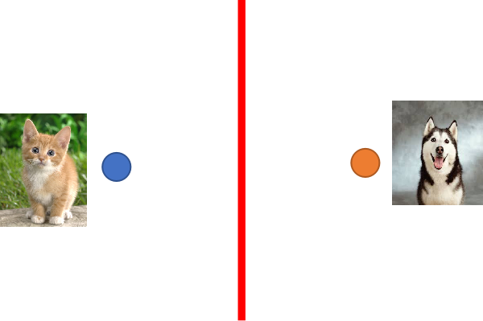

但当我们加入unlabeled data的时候，由于**特征分布**发生了变化，分界线也随之改变

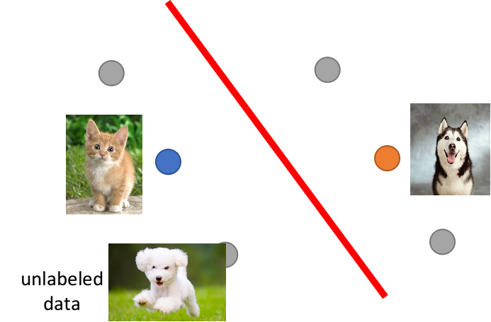

semi-supervised learning的使用往往伴随着假设，而该假设的合理与否，决定了结果的好坏程度；比如上图中的unlabeled data，它显然是一只狗，而特征分布却与猫被划分在了一起，很可能是由于这两张图片的背景都是绿色导致的，因此假设是否合理显得至关重要

### Semi-supervised Learning for Generative Model

#### Supervised Generative Model

事实上，在监督学习中，我们已经讨论过概率生成模型了，假设class 1和class 2的分布分别为$mean_1=u^1,covariance_1=\Sigma$、$mean_2=u^2,covariance_2=\Sigma$的高斯分布，计算出Prior Probability后，再根据贝叶斯公式可以推得新生成的x所属的类别

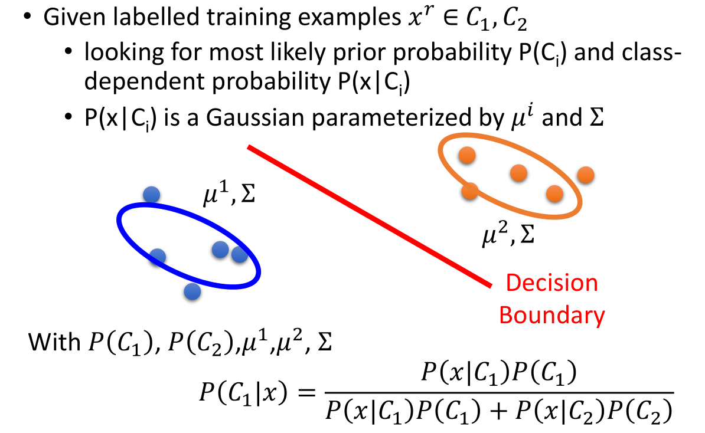

#### Semi-supervised Generative Model

如果在原先的数据下多了unlabeled data（下图中绿色的点），它就会影响最终的决定，你会发现原先的$u,\Sigma$显然是不合理的，新的$u,\Sigma$需要使得样本点的分布更接近下图虚线圆所标出的范围，除此之外，右侧的Prior Probability会给人一种比左侧大的感觉（右侧样本点变多了）

此时，unlabeled data对$P(C_1),P(C_2),u^1,u^2,\Sigma$都产生了一定程度的影响，划分两个class的decision boundary也会随之发生变化

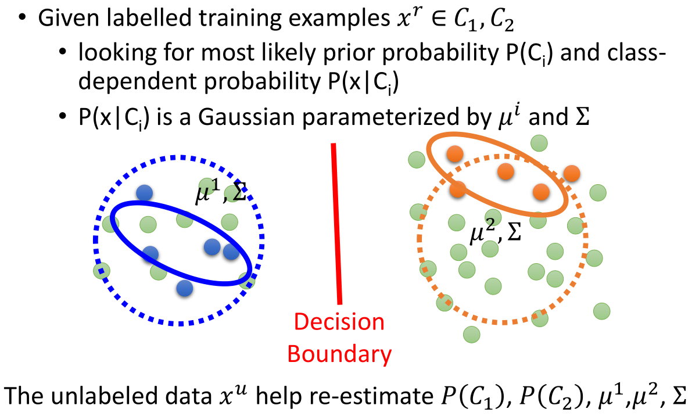

讲完了直观上的解释，接下来进行具体推导(假设做二元分类)：

- 先随机初始化一组参数：$\theta=\{P(C_1),P(C_2),u^1,u^2,\Sigma\}$

- Step 1: 利用初始model计算每一笔unlabeled data $x^u$属于class 1的posterior probability$P_{\theta}(C_1|x^u)$

- Step 2: update model

  如果不考虑unlabeled data，则先验概率显然为属于class 1的样本点数$N_1$/总的样本点数$N$，即$P(C_1)=\frac{N_1}{N}$

  而考虑unlabeled data时，分子还要加上所有unlabeled data属于class 1的概率和，此时它们被看作小数，可以理解为按照概率一部分属于$C_1$，一部分属于$C_2$
  $$
  P(C_1)=\frac{N_1+\sum_{x^u}P(C_1|x^u)}{N}
  $$
  同理，对于均值，原先的mean $u_1=\frac{1}{N_1}\sum\limits_{x^r\in C_1} x^r$加上根据概率对$x^u$求和再归一化的结果即可
  $$
  u_1=\frac{1}{N_1}\sum\limits_{x^r\in C_1} x^r+\frac{1}{\sum_{x^u}P(C_1|x^u)}\sum\limits_{x^u}P(C_1|x^u)x^u
  $$
  剩余的参数同理，接下来就有了一组新的参数$\theta'$

  于是回到step 1->step 2->step 1循环

  

- 理论上该方法保证是可以收敛的，而一开始给$\theta$的初始值会影响收敛的结果，类似gradient descent

- 上述的step 1就是EM algorithm里的E，step 2则是M

以上的推导基于的基本思想是，把unlabeled data $x^u$看成是可以划分的，一部分属于$C_1$，一部分属于$C_2$，此时它的概率$P_{\theta}(x^u)=P_{\theta}(x^u|C_1)P(C_1)+P_{\theta}(x^u|C_2)P(C_2)$，也就是$C_1$的先验概率乘上$C_1$这个class产生$x^u$的概率+$C_2$的先验概率乘上$C_2$这个class产生$x^u$的概率

实际上我们在利用极大似然函数更新参数的时候，就利用了该拆分的结果：
$$
logL(\theta)=\sum\limits_{x^r} logP_{\theta}(x^r,\hat y^r)+\sum\limits_{x^u}logP_{\theta}(x^u)
$$

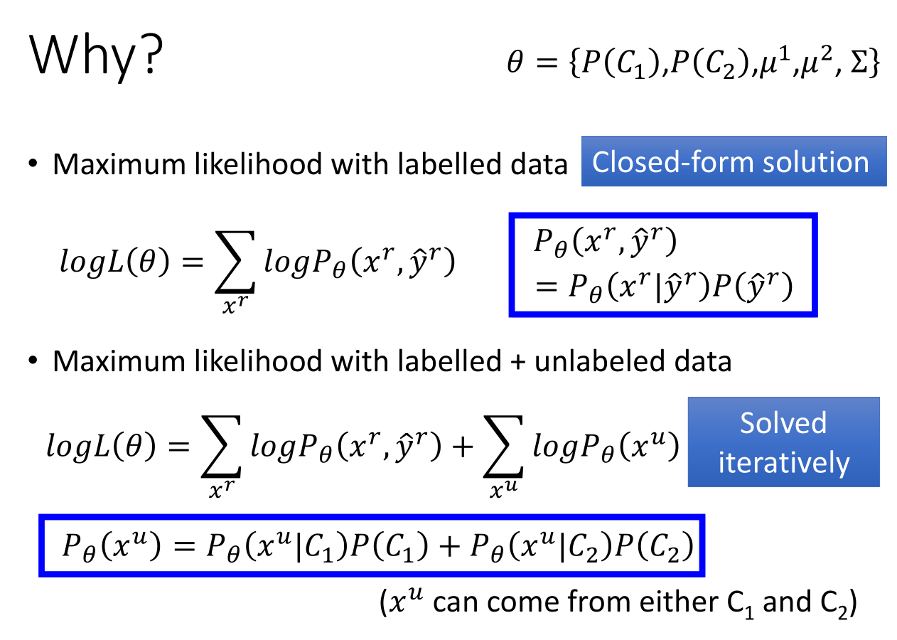

### Low-density Separation Assumption

接下来介绍一种新的方法，它基于的假设是Low-density separation

通俗来讲，就是这个世界是非黑即白的，在两个class的交界处data的密度(density)是很低的，它们之间会有一道明显的鸿沟，此时unlabeled data(下图绿色的点)就是帮助你在原本正确的基础上挑一条更好的boundary

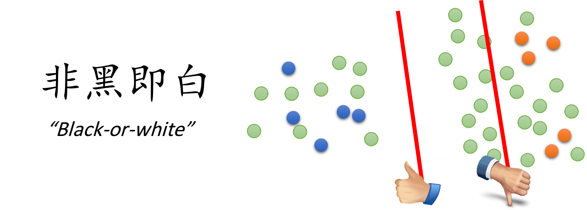

#### Self Training

low-density separation最具代表性也最简单的方法是**self training**

- 先从labeled data去训练一个model $f^*$，训练方式没有限制
- 然后用该$f^*$去对unlabeled data打上label，$y^u=f^*(x^u)$，也叫作pseudo label
- 从unlabeled data中拿出一些data加到labeled data里，至于data的选取需要你自己设计算法来挑选
- 回头再去训练$f^*$，循环即可

注：该方法对Regression是不适用的

该方法与之前提到的generative model还是挺像的，区别在于：

- Self Training使用的是hard label：假设一笔data强制属于某个class
- Generative Model使用的是soft label：假设一笔data可以按照概率划分，不同部分属于不同class

如果我们使用的是neural network的做法，$\theta^*$是从labeled data中得到的一组参数，此时丢进来一个unlabeled data $x^u$，通过$f^*_{\theta^*}()$后得到$\left [\begin{matrix} 0.7\\ 0.3 \end{matrix}\right ]$，即它有0.7的概率属于class 1，0.3的概率属于class 2

- 如果此时使用hard label，则$x^u$的label被转化成$\left [\begin{matrix}1\\ 0 \end{matrix}\right ]$
- 如果此时使用soft label，则$x^u$的label依旧是$\left [\begin{matrix} 0.7\\ 0.3 \end{matrix}\right ]$

可以看到，在neural network里使用soft label是没有用的，因为把原始的model里的某个点丢回去重新训练，得到的依旧是同一组参数，实际上low density separation就是通过强制分类（hard label）来提升分类效果的方法

#### Entropy-based Regularization

该方法是low-density separation的进阶版，你可能会觉得hard label这种直接强制性打标签的方式有些太武断了，而entropy-based regularization则做了相应的改进：$y^u=f^*_{\theta^*}(x^u)$，其中$y^u$是一个**概率分布(distribution)**

由于我们不知道unlabeled data $x^u$的label到底是什么，但如果通过entropy-based regularization得到的分布集中在某个class上的话，那这个model就是好的，而如果分布是比较分散的，那这个model就是不好的，如下图所示：

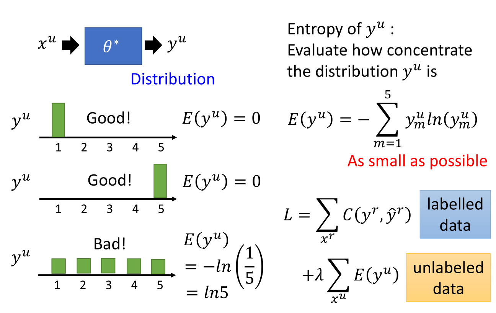

接下来的问题是，如何用数值的方法来evaluate distribution的集中(好坏)与否，要用到的方法叫entropy，一个distribution的entropy可以告诉你它的集中程度：
$$
E(y^u)=-\sum\limits_{m=1}^5 y_m^u ln(y_m^u)
$$
对上图中的第1、2种情况，算出的$E(y^u)=0$，而第3种情况，算出的$E(y^u)=-ln(\frac{1}{5})=ln(5)$，可见entropy越大，distribution就越分散；entropy越小，distribution就越集中

因此我们的目标是在labeled data上分类要正确，在unlabeled data上，output的entropy要越小越好，此时就要修改loss function

- 对labeled data来说，它的output要跟正确的label越接近越好，用cross entropy表示如下：
  $$
  L=\sum\limits_{x^r} C(y^r,\hat y^r)
  $$

- 对unlabeled data来说，要使得该distribution(也就是output)的entropy越小越好：
  $$
  L=\sum\limits_{x^u} E(y^u)
  $$

- 两项综合起来，可以用weight来加权，以决定哪个部分更为重要一些
  $$
  L=\sum\limits_{x^r} C(y^r,\hat y^r) + \lambda \sum\limits_{x^u} E(y^u)
  $$
  可以发现该式长得很像regularization，这也就是Entropy-based Regularization的名称由来

### Semi-supervised SVM

SVM要做的是，给你两个class的data，去找一个boundary：

- 要有最大的margin，让这两个class分的越开越好
- 要有最小的分类错误

对unlabeled data穷举所有可能的label，下图中列举了三种可能的情况；然后对每一种可能的结果都去算SVM，再找出可以让margin最大，同时又minimize error的那种情况，下图中是用黑色方框标注的情况

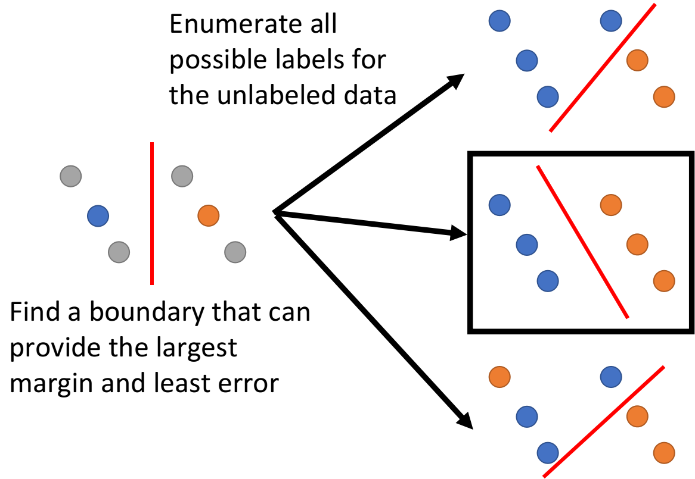

Thorsten Joachims, ”*Transductive* *Inference for Text Classification using Support Vector Machines”,* ICML, 1999

当然这么做会存在一个问题，对于n笔unlabeled data，意味着即使在二元分类里也有$2^n$种可能的情况，数据量大的时候，几乎难以穷举完毕，上面给出的paper提出了一种approximate的方法，基本精神是：一开始你先得到一些label，然后每次改一笔unlabeled data的label，看看可不可以让你的objective function变大，如果变大就去改变该label，具体内容详见paper

### Smoothness Assumption

#### Concepts

smoothness assumption的基本精神是：近朱者赤，近墨者黑

粗略的定义是相似的x具有相同的$\hat y$，精确的定义是：

- x的分布是不平均的，在某些地方很集中，某些地方很分散

- 如果$x^1$和$x^2$在一个high density region上很接近的话，那么$\hat y^1$和$\hat y^2$就是相同的

  也就是这两个点可以在样本点高密度集中分布的区域块中有一条可连接的路径，即 connected by a high density path

假设下图是data的分布，$x^1,x^2,x^3$是其中的三笔data，如果单纯地看x的相似度，显然$x^2$和$x^3$更接近一些，但对于smoothness assumption来说，$x^1$和$x^2$是处于同一块区域的，它们之间可以有一条相连的路径；而$x^2$与$x^3$之间则是“断开”的，没有high density path，因此$x^1$与$x^2$更“像”

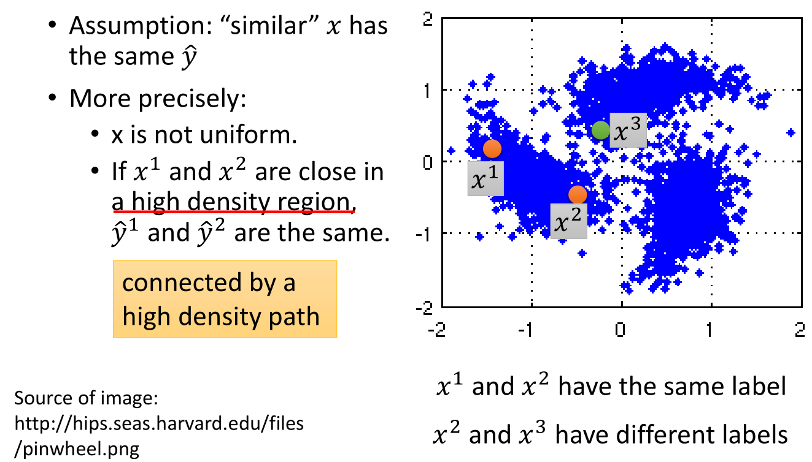

##### Digits Detection

以手写数字识别为例，对于最右侧的2和3以及最左侧的2，显然最右侧的2和3在pixel上相似度更高一些；但如果把所有连续变化的2都放进来，就会产生一种“不直接相连的相似”，根据Smoothness Assumption的理论，由于2之间有连续过渡的形态，因此第一个2和最后一个2是比较像的，而最右侧2和3之间由于没有过渡的data，因此它们是比较不像的

人脸的过渡数据也同理

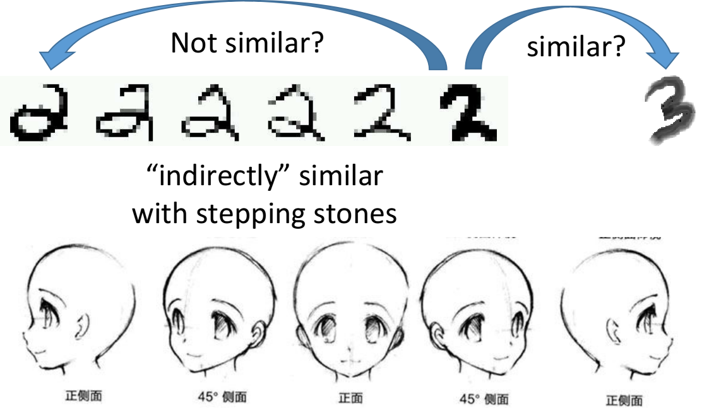

##### File Classification

Smoothness Assumption在文件分类上是非常有用的

假设对天文学(astronomy)和旅行(travel)的文章进行分类，它们各自有专属的词汇，此时如果unlabeled data与label data的词汇是相同或重合(overlap)的，那么就很容易分类；但在真实的情况下，unlabeled data和labeled data之间可能没有任何重复的words，因为世界上的词汇太多了，sparse的分布很难会使overlap发生

但如果unlabeled data足够多，就会以一种相似传递的形式，建立起文档之间相似的桥梁

#### Cluster and then label

在具体实现上，有一种简单的方法是cluster and then label，也就是先把data分成几个cluster，划分class之后再拿去训练，但这种方法不一定会得到好的结果，因为它的假设是你可以把同一个class的样本点cluster在一起，而这其实是没那么容易的

对图像分类来说，如果单纯用pixel的相似度来划分cluster，得到的结果一般都会很差，你需要设计一个很好的方法来描述image(类似Deep Autoencoder的方式来提取feature)，这样cluster才会有效果

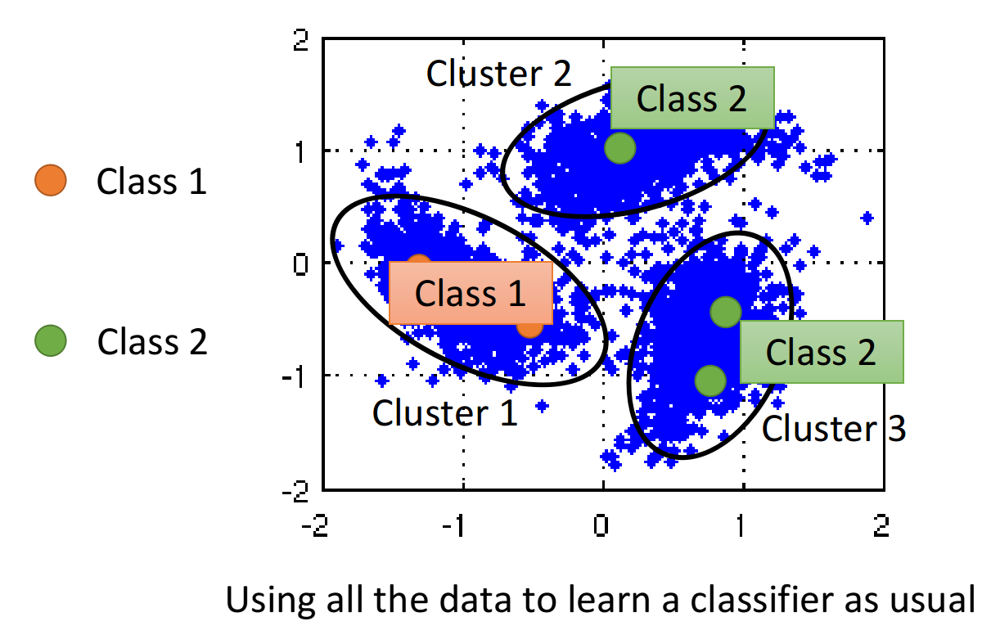

#### Graph-based Approach

之前讲的是比较直觉的做法，接下来引入Graph Structure来表达connected by a high density path这件事

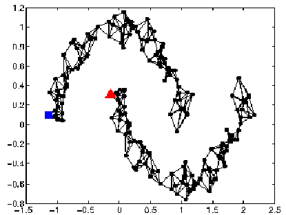

Represented the data points as a graph，有时候建立vertex之间的关系是比较容易的，比如网页之间的链接关系、论文之间的引用关系；但有时候需要你自己去寻找vertex之间的关系，建立graph

graph的好坏，对结果起着至关重要的影响，而如何build graph却是一件heuristic的事情，需要凭着经验和直觉来做

- 首先定义两个object $x^i,x^j$之间的相似度 $s(x^i, x^j)$

  如果是基于pixel的相似度，performance可能会不太好；建议使用autoencoder提取出来的feature来计算相似度，得到的performance会好一些

- 算完相似度后，就可以建graph了，方式有很多种：

  - k nearest neighbor：假设k=3，则每个point与相似度最接近的3个点相连
  - e-Neighborhood：每个point与相似度超过某个特定threshold e的点相连

- 除此之外，还可以给Edge特定的weight，让它与相似度$s(x^i,x^j)$成正比

  - 建议用Gaussian Radial Basis Function来确定相似度：$s(x^i,x^j)=e^{-\gamma||x^i-x^j||^2 }$

    这里$x^i,x^j$均为vector，计算它们的Euclidean Distance(欧几里得距离)，乘一个参数后再取exponential

  - 至于取exponential，经验上来说通常是可以帮助提升performance的，在这里只有当$x^i,x^j$非常接近的时候，similarity才会大；只要距离稍微远一点，similarity就会下降得很快，变得很小

  - 使用exponential的Gaussian Radial Basis Function可以做到只有非常近的两个点才能相连，稍微远一点就无法相连的效果，避免了下图中跨区域相连的情况

graph-based approach的基本精神是，在graph上已经有一些labeled data，那么跟它们相连的point，属于同一类的概率就会上升，每一笔data都会去影响它的邻居，而graph带来的最重要的好处是，这个影响是会随着edges传递出去的，即使有些点并没有真的跟labeled data相连，也可以被传递到相应的属性

比如下图右下，如果graph建的足够好，那么两个被分别label为蓝色和红色的点就可以传递完两张完整的图；从下图右上中我们也可以看出，如果想要让这种方法生效，收集到的data一定要足够多，否则可能传递到一半，graph就断掉了，information的传递就失效了

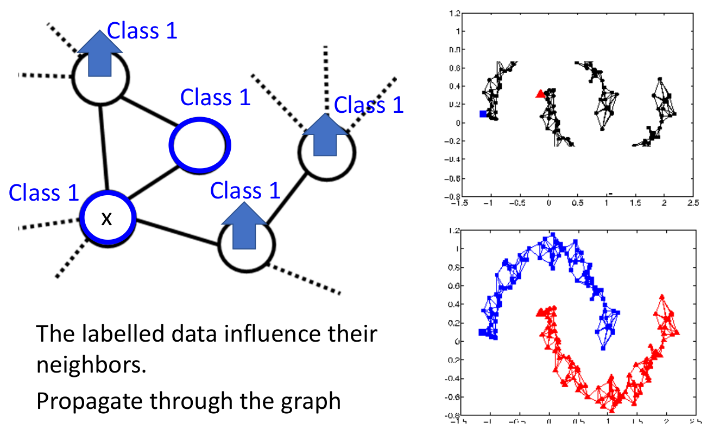

介绍完了如何定性使用graph，接下来介绍一下如何定量使用graph

定量的使用方式是定义label的smoothness，下图中，edge上的数字是weight，$x^i$表达data，$y^i$表示data的label，计算smoothness的方式为：
$$
S=\frac{1}{2}\sum\limits_{i,j} w_{i,j}(y^i-y^j)^2
$$
**我们期望smooth的值越小越好**

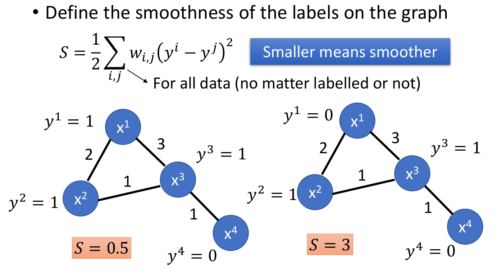

当然上面的式子还可以化简，如果把labeled data和unlabeled data的y组成一个(R+U)-dim vector，即
$$
\bold y=\left [\begin{matrix} 
...y^i...y^j
\end{matrix} \right ]^T
$$
于是smooth可以改写为：
$$
S=\frac{1}{2}\sum\limits_{i,j} w_{i,j}(y^i-y^j)^2=\bold y^TL\bold y
$$
其中L为(R+U)×(R+U) matrix，成为**Graph Laplacian**， 定义为$L=D-W$

- W：把data point两两之间weight的关系建成matrix，代表了$x^i$与$x^j$之间的weight值
- D：把W的每一个row上的值加起来放在该行对应的diagonal上即可，比如5=2+3,3=2+1,...

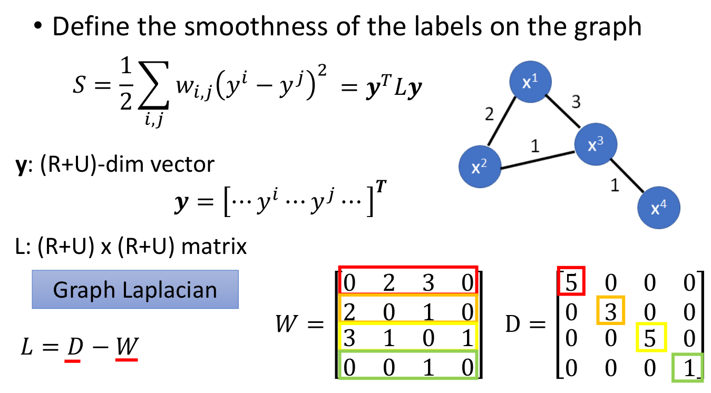

对$S=\bold y^TL\bold y$来说，y是label，是neural network的output，取决于neural network的parameters，因此要在原来仅针对labeled data的loss function中加上这一项，得到：
$$
L=\sum\limits_{x^r}C(y^r,\hat y^r) + \lambda S
$$
$\lambda S$实际上也象征着一个regularization term

训练目标：

- labeled data的cross entropy越小越好(neural network的output跟真正的label越接近越好)
- smooth S越小越好(neural network的output，不管是labeled还是unlabeled，都要符合Smoothness Assumption的假设)

具体训练的时候，不一定只局限于neural network的output要smooth，可以对中间任意一个hidden layer加上smooth的限制

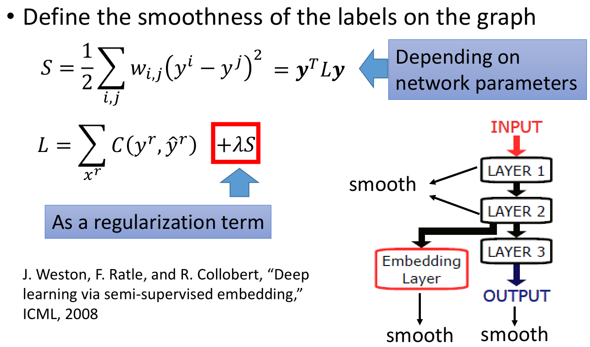

### Better Representation

Better Representation的精神是，去芜存菁，化繁为简

我们观察到的世界是比较复杂的，而在它的背后其实是有一些比较简单的东西，在操控着这个复杂的世界，所以只要你能够看透这个世界的假象，直指它的核心的话，就可以让training变得比较容易

Find the latent factors behind the observation

The latent factors (usually simpler) are better representations

算法具体思路和内容unsupervised learning中介绍
# Explainable Machine Learning

## Explainable Machine Learning

机器不但要知道，还要告诉我们它为什么会知道。

Local Explanation——Why do you think this image is a cat?

Global Explanation——What do you think a “cat” looks like?

### Why we need Explainable ML?

- 用机器来协助判断简历
  - 具体能力？还是性别？
- 用机器来协助判断犯人是否可以假释
  - 具体证据？还是肤色？
- 金融相关的决策常常依法需要提供理由
  - 为什么拒绝了某个人的贷款？
- 模型诊断：到底机器学到了什么
  - 不能只看正确率吗？今天我们看到各式各样机器学习非常强大的力量，感觉机器好像非常的聪明，过去有一只马叫做汉斯，它非常的聪明，聪明到甚至可以做数学。举例来说：你跟它讲根号9是多少，它就会敲它的马蹄，大家欢呼道，这是一只会算数学的马。可以解决根号的问题，大家都觉得非常的惊叹。后面就有人怀疑说：难道汉斯真的这么聪明吗？在没有任何的观众的情况下，让汉斯自己去解决一个数学都是题目，这时候它就会一直踏它的马蹄，一直的不停。这是为什么呢？因为它之前学会了观察旁观人的反应，它知道什么时候该停下来。它可能不知道自己在干什么，它也不知道数学是什么，但是踏对了正确的题目就有萝卜吃，它只是看了旁边人的反应得到了正确的答案。今天我们看到种种机器学习的成果，难道机器真的有那么的聪明吗？会不会它会汉斯一样用了奇怪的方法来得到答案的。

We can improve ML model based on explanation.

当我们可以做可解释的机器学习模型时，我们就能做模型诊断，就可以知道机器到底学到了什么，是否和我们的预期相同。准确率不足以让我们精确调整模型，只有当我们知道why the answer is wrong, so i can fix it. 

#### My Point of View

- Goal of ML Explanation ≠ you completely know how the ML model work（Not necessary）
  - Human brain is also a Black Box！
  - People don’t trust network because it is Black Box，but you trust the decision of human！
- Goal of ML Explanation is —— Make people（your customers，your boss，yourself）comfortable.
- Personalized explanation in the future

可解释机器学习的目标，不需要真正知道模型如何工作，只需要给出可信服的解释，让人满意就行。对此还可以针对不同人的接受能力给出不同层次的解释。

### Interpretable v.s.Powerful

- Some models are intrinsically interpretable.
  - For example，linear model（from weights，you know the importance of features）
  - But…not very powerful.
- Deep network is difficult to interpret.
  - Deep network is a black box.
  - But it is more powerful than linear model…
  - Because deep network is a black box，we don’t use it.（这样做是不对的，削足适履，Let’s make deep network interpretable.）
- Are there some models interpretable and powerful at the same time?
  - How about decision tree?

模型的可解释性和模型的能力之间有矛盾。

一些模型，比如线性模型，可解释性很好，但效果不佳。而深度网络，虽然能力一流，但缺乏可解释性。

我们的目标不是放弃复杂的模型，直接选择可解释性好的模型，而是让能力强的模型具有更好的解释性，去尝试解释复杂模型。

同时具有强大能力和可解释性的，是决策树。但决策树结构如果很复杂，那么可解释性也会很差。(森林)

### Local Explanation: Explain the Decision

假设我们的Object $x$有N个components$\{x_1,⋯,x_n,⋯,x_N \}$，Image: pixel, segment, etc；Text: a word

We want to know the importance of each components for making the decision.

#### Idea

Removing or modifying the values of the components, observing the change of decision. 

如果有Large decision change，那么就可以得到important component

比如找一个图片，把一个灰色的方块放在在图片中任意一个位置。当灰色方块位于某个位置导致机器判断改变，那么我们就把这个区域看为重要的component。注意，覆盖图片的方块的颜色、大小都是需要人工调整的参数，会影响结果，这其实是至关重要crucial的。甚至选择不同的参数可以得到不同的结果。
$$
\{x_1,⋯,x_n,⋯,x_N \} \rightarrow \{x_1,⋯,x_n+∆x,⋯,x_N \}\\y_k \rightarrow y_k+∆y\\
y_k: \text{the prob of the predicted class of the model}
$$
对于每一个输 $x$ 将其某个维度加上一个小小的扰动，然后观察模型判断结果和原判断结果的差值，根据这个扰动造成的结果差值来了解机器对图片中哪些像素比较敏感。影响可以用$|\cfrac{\Delta y}{\Delta x}|$来表示，计算方式就是偏微分：$|\cfrac{\partial{\Delta y_k}}{\partial{\Delta x_n}}|$

得到的图称为：Saliency Map，亮度代表了偏微分的绝对值，也是pixel的重要性

Karen Simonyan, Andrea Vedaldi, Andrew Zisserman, “Deep Inside Convolutional Networks: Visualising Image Classification Models and Saliency Maps”, ICLR, 2014

#### To Learn More……

[Grad-CAM](https://arxiv.org/abs/1610.02391)

[SmoothGrad](https://arxiv.org/abs/1706.03825)

[Layer-wise Relevance Propagation](https://arxiv.org/abs/1604.00825)

[Guided Backpropagation](https://arxiv.org/abs/1412.6806)

#### Limitation of Gradient based Approaches 

##### Gradient Saturation

刚才我们用gradient的方法判断一个pixel或者一个segment是否重要，但是梯度有一个限制就是gradient saturation（梯度饱和）。我们如果通过鼻子的长度来判断一个生物是不是大象，鼻子越长是大象的信心分数越高，但是当鼻子长到一定程度信心分数就不太会变化了，信心分数就封顶了。鼻子长到一定程度，就可以确定这是一只大象，但是导数却是0，得出鼻子不重要这样的结论，明显是不对的。

#### Attack Interpretation

攻击机器学习的解释是可能的。我们可以加一些神奇的扰动到图片上，人眼虽然辨识不出来，也不改变分类结果，但是模型聚焦的判定点却变了。

#### Case Study: Pokémon v.s. Digimon

通过Saliency Map，看到机器更在意边缘，而非宝可梦的本体

All the images of Pokémon are PNG, while most images of Digimon are JPEG. PNG文件透明背景，读档后背景是黑的。Machine discriminate Pokémon and Digimon based on Background color. 

This shows that **explainable ML is very critical.**

### Global Explanation: Explain the whole model

#### Activation Maximization

这块内容之前有讲过，就是找到一个图片，让某个隐藏层的输出最大，例如在手写数字辨识中，找出机器认为理想的数字如下

若不加限制，得到的结果经常会像是杂乱雪花，加一些额外的限制，使图像看起来更像数字（或其他正常图片）。我们不仅要maximize output的某个维度，还要加一个限制函数$R(x)$让$x$尽可能像一个数字图片，这个函数输入是一张图片，输出是这张图片有多像是数字。

那这个限制函数$R(x)$要怎么定义呢，定义方式有很多种，这里就简单的定义为所有pixel的和的数值，这个值越小说明黑色RGB(0,0,0)越多，这个图片就越像是一个数字，由于这里数字是用白色的笔写的，所以就加一个负号，整体去maximize $y_i$与$R(x)$的和，形式化公式就变成了：
$$
x^* = arg \max_{x}( y_i + R(x) )
$$
得到的结果如下图所示，比加限制函数之前要好很多了，从每个图片中多少能看出一点数字的形状了，尤其是6那一张。

With several regularization terms, and hyperparameter tuning …..

在更复杂的模型上，比如要在ImgNet这个大语料库训练出的模型上做上述的事情，在不加限制函数的情况下将会得到同样杂乱无章的结果。而且在这种复杂模型中要想得到比较好的Global Explanation结果，往往要加上更多、更复杂、更精妙的限制函数。

https://arxiv.org/abs/1506.06579

#### Constraint from Generator

上面提到要对图片做一个限制，比较像一个图片，这个事情可以用Generator来做。

我们将方法转变为：找一个$z$，将它输入到图片生成器中产生一个图片，再将这个图片输入原来的图片分类器，得到一个类别判断$y$，我们同样要maximize $y_i$. 其实可以考虑为我们把图片生成器和图片分类器连接在一起，fix住两者的参数，通过梯度下降的方法不断改变$z$，最终找到一个合适的$z^*$可以maximize $y_i$.之后我们只要将这个$z^*$丢入图片生成器就可以拿到图片$x^*$了。形式化表述为：
$$
z^* = arg \max_{x} y_i
$$
调整输入低维向量z得到理想的y，把z通过generator就可以得到理想的image

这里和GAN里面的discriminator不一样，discriminator只会判断generator生成的图片好或者不好，这里是要生成某一个类型的图片。并且generator是固定的，我们调整的是低维向量z。

### Using A Model to Explain Another

还有一种很神奇的方法用于解释模型，那就是用可解释的模型去模拟不可解释的模型，然后通过可解释的模型给出解释。

Some models are easier to Interpret. Using an interpretable model to mimic the behavior of an uninterpretable model. 

具体思路也很简单，就是喂给目标模型一些样本并记录输出作为训练集，然后用这个训练集训练一个解释性良好的模型对目标模型进行解释。然而可解释性好的模型往往是比较简单的模型，可解释性差的模型往往是比较复杂的模型，用一个简单模型去模拟一个复杂模型无疑是困难的。上图就是一个示例。用线性模型去模拟一个神经网络效果肯定是很差的，但是我们可以做的是局部的模拟。

#### Local Interpretable Model-Agnostic Explanations (LIME)

也就是说当我们给定一个输入的时候，我们要在这个输入附近找一些数据点，然后用线性模型进行拟合。那么当输入是图片的时候，什么样的数据算是这张图片附近的数据点呢？这需要不断调整参数。

##### LIME － Image

1. Given a data point you want to explain 

2. Sample at the nearby 

   - Each image is represented as a set of superpixels (segments).
   - Randomly delete some segments.
   - Compute the probability of “frog” by black box

   

3. Fit with linear (or interpretable) model 

   

4. Interpret the model you learned 

   

举例：

1. 首先现有一张要解释的图片，我们想知道模型为什么把它认作树蛙

2. 在这张图附近sample一些数据

   我们通常会用一些toolkit把图片做一下切割，然后随机的丢掉一些图块，得到的新图片作为原图片附近区域中的数据点。

3. 把上述这些图片输入原黑盒模型，得到黑盒的输出

4. 用线性模型（或者其他可解释模型）fit上述数据

   在上面的例子中我们在做图片辨识任务，此时我们可能需要在将图片丢到线性模型之前先做一个特征抽取。

5. 解释你的线性模型

   如上图所示，当线性模型种某个特征维度对应的weight：

   - 趋近于零，说明这个segment对模型判定树蛙不重要
   - 正值，说明这个segment对模型判定树蛙有作用
   - 负值，说明这个segment对模型判定树蛙有反作用

#### Decision Tree

下面用Decision Tree来代替上面的线性模型做解释工作。

Decision Tree足够复杂时，理论上完全可以模仿黑盒子的结果，但是这样Decision Tree会非常非常复杂，那么Decision Tree本身又变得没法解释了，因此我们不想Decision Tree太过复杂。这里我们用$O(T_\theta)$表示决策树的复杂度，定义方式可以自选，比如树的平均深度。

要考虑决策树的复杂度，因此要在损失函数中加一个正则项：$\theta=arg\underset{\theta}{min}L(\theta)+\lambda O(T_\theta)$

但是这个正则项没法做偏导，所以没有办法做GD。

解决方法：https://arxiv.org/pdf/1711.06178.pdf

train一个神奇的神经网络，我们给它一个神经网络的参数，它就可以输出一个数值，来表示输入的参数转成Decision Tree后Decision Tree的平均深度。

中心思想是用一个随机初始化的结构简单的Neural Network，找一些NN转成DT，算出平均深度，就有了训练data，训练后可以模拟出决策树的平均深度，然后用Neural Network替换上面的正则项，Neural Network是可以微分的，然后就可以Gradient Descent了。
# Adversarial Attack

## Adversarial Attack

### Motivation

We seek to deploy machine learning classifiers not only in the labs, but also in real world.

The classifiers that are robust to noises and work “most of the time” is not sufficient. We want the classifiers that are robust the inputs that are built to fool the classifier.

Especially useful for spam classification, malware detection, network intrusion detection, etc.

光是强还不够，还要应对人类的恶意攻击。

攻击是比较容易的，多数machine learning的model其实相当容易被各式各样的方法攻破，防御目前仍然是比较困难的。

### Attack

#### What do we want to do?

给当前的machine输入一个图片，输出Tiger Cat的信息分数为0.64，你不会说它是一个很差的model，你会说它是一个做的还不错的model。

我们现在想要做的是：往图片上面加上一些杂讯，这些杂讯不是从gaussion distribution中随机生成的（随机生成的杂讯，没有办法真的对Network造成太大的伤害），这是种很特殊的讯号，把这些很特殊的讯号加到一张图片上以后，得到稍微有点不一样的图片。将这张稍微有点不一样的图片丢到Network中，Network会得到非常不一样的结果。

本来的图片叫做$x_0$，而现在是在原来的$x_0$上加上一个很特别的$∆x$，得到一张新的图片$x'$（$x'=x_0+∆x$）。然后将$x'$丢到Network中，原来看到$x_0$时，Network会输出是一张Tiger Cat，但是这个Network看到时输出一个截然不同的答案（Attacked image，Else），那么这就是所谓攻击所要做的事情。

#### Loss Function for Attack

即找一张图片，使得loss(cross-entropy loss)越大越好，此时网络的参数训练完了，不能改变，而是只改变输入，使我们找到这样一张图片，能够让结果“越错越好”，离正确答案越远越好。

普通的训练模型，$x^0$不变，希望找到一个θ，使cross-entropy越小越好

Non-targeted Attack，θ不变，希望找到一个$x’$，使得cross-entropy越大越好，cross-entropy越大Loss越小

Targeted Attack，希望找到一个$x’$，使得cross-entropy越大越好，同时与目标（错误）标签越近越好

输入不能改变太大，$x^0$ 和$x’$越接近越好

##### Constraint

$distance(x^0,x')$由任务的不同而不同，主要取决于对人来说什么样的文字、语音、图像信号是相似的。

L-infinity稍微更适合用于影像的攻击上面

#### How to Attack

损失函数的梯度为$（此时变量为x）$
$$
\nabla L(x)=
\begin{bmatrix}
\frac{\partial L(x)}{\partial x_1} \\
\frac{\partial L(x)}{\partial x_2} \\
\frac{\partial L(x)}{\partial x_3} \\
... \\

\end{bmatrix}_{gradient}
$$
Gradient Descent，但是加上限制，判断$x^t$是否符合限制，如果不符合，要修正$x^t$

修正方法：穷举$x^0$附近的所有x，用距离$x^t$最近的点来取代$x^t$

##### Example

使用一个猫，可以让它输出海星

两张图片的不同很小，要相减后乘以50倍才能看出

是否是因为网络很弱呢？随机加噪声，但是对结果的影响不大；加的噪声逐渐增大以后会有影响

#### What happened?

高维空间中，随机方向与特定方向的y表现不同，因此一般的杂讯没有效果，特定的杂讯会有效果。

你可以想象 $x^0$ 是在非常高维空间中的一个点，你把这个点随机的移动，你会发现多数情况下在这个点的附近很大一个范围内都是能正确辨识的空间，当你把这个点推到的很远的时候才会让机器识别成类似的事物，当你把它推的非常远时才会被辨识成不相关的事物。但是，有一些神奇维度，在这些神奇的维度上 $x^0$ 的正确区域只有非常狭窄的一点点，我们只要将 $x^0$ 推离原值一点点，就会让模型输出产生很大的变化。

这种现象不止存在于Deep Model中，一般的Model也会被攻击。

#### Attack Approaches

- [FGSM](https://arxiv.org/abs/1412.6572)
- [Basic iterative method](https://arxiv.org/abs/1607.02533)
- [L-BFGS](https://arxiv.org/abs/1312.6199)
- [Deepfool](https://arxiv.org/abs/1511.04599)
- [JSMA](https://arxiv.org/abs/1511.07528)
- [C&W](https://arxiv.org/abs/1608.04644)
- [Elastic net attack](https://arxiv.org/abs/1709.04114)
- [Spatially Transformed](https://arxiv.org/abs/1801.02612)
- [One Pixel Attack](https://arxiv.org/abs/1710.08864)
- …… only list a few

##### Fast Gradient Sign Method (FGSM)

攻击方法的主要区别在于Different optimization methods和Different constraints

FGSM是一种简单的model attack方法，梯度下降的时候计算的梯度，如果是负的，则直接为-1，如果是正的，则直接为+1。所以$x^0$的更新要么为$-\varepsilon $，要么为$+\varepsilon $，只更新一次就结束了。

这个算法的思想就是只攻击一次就好（减去或者加上$\varepsilon$）。多攻击几次确实会更好，所以FGSM有一个进阶方法Iterative fast gradient sign method（I-FGSM）

FGSM只在意gradient的方向，不在意它的大小。假设constrain用的是L-infinity，FGSM相当于设置了一个很大的learning rate，导致可以马上跳出范围，再拉回来。

#### White Box v.s. Black Box

 In the previous attack, we fix network parameters 𝜃 to find optimal 𝑥′.

To attack, we need to know network parameters 𝜃

- This is called **White Box Attack**. 

Are we safe if we do not release model?

- You cannot obtain model parameters in most on-line API.

No, because **Black Box Attack** is possible. 

##### Black Box Attack

If you have the **training data** of the target network

- Train a **proxy network** yourself

- Using the proxy network to generate attacked objects

Otherwise, obtaining input-output pairs from target network

如图中描述的是模型辨识正确的概率，也就是攻击失败的概率。上述五种神经网络的架构是不一样的，但是我们可以看到即使是不同架构的模型攻击成功的概率也是非常高的，而相同的架构的模型攻击成功率则明显是更高的。

#### Universal Adversarial Attack

核心精神是找一个通用的攻击向量，将其叠加到任意样本上都会让模型辨识出错。

https://arxiv.org/abs/1610.08401

这件事做成以后，你可以想象，只要在做辨识任务的摄像机前面贴一张噪声照片，就可以让所有结果都出错。另外，这个通用攻击甚至也可以做上述的黑盒攻击。

#### Adversarial Reprogramming

这个攻击的核心精神是：通过找一些噪声，让机器的行为发生改变，达到重编程实现其他功能的效果。改变原来network想要做的事情，例如从辨识动物变成数方块

当我们把图片中间贴上上图中那种方块图，机器就会帮我们数出途中方块的个数，如果有一个方块会输出tench，有两个方块就输出goldfish… 这件事还挺神奇的，因为我们并没有改变机器的任何参数，我们只是用了和前述相同的方法，找了一个噪声图片，然后把要数方块的图贴在噪声上，输入模型就会让模型帮我们数出方块的个数。具体方法细节参考引用文章。

#### Attack in the Real World

我们想知道上述的攻击方法是否能应用在现实生活中，上述的所有方法中加入的噪声其实都非常的小，在数字世界中这些噪声会对模型的判别造成很大影响似乎是很合理的，但是在真实的世界中，机器是通过一个小相机看世界的，这样的小噪声通过相机以后可能就没有了。通过镜头是否会识别到那些微小的杂讯呢？实验把攻击的图像打印出来，然后用摄像头识别。证明这种攻击时可以在现实生活中做到的。

对人脸识别上进行攻击，可以把噪声变成实体眼镜，带着眼镜就可以实现攻击。

需要确保：多角度都是成功的；噪声不要有非常大的变化（比如只有1像素与其他不同），要以色块方式呈现，这样方便摄像头能看清；不用打印机打不出来的颜色。

1. An attacker would need to find perturbations that generalize beyond a single image.
2. Extreme differences between adjacent pixels in the perturbation are unlikely to be accurately captured by cameras.
3. It is desirable to craft perturbations that are comprised mostly of colors reproducible by the printer

在不同角度变成限速45的标志

#### Beyond Images

### Defense

 Adversarial Attack **cannot** be defended by weight regularization, dropout and model ensemble.

Two types of defense

- Passive defense: Finding the attached image without modifying the model
  - Special case of Anomaly Detection，找出加入攻击的图片，不修改网络

- Proactive defense: Training a model that is robust to adversarial attack

#### Passive Defense

加入filter，比如smoothing。

解释是，找攻击信号时，实际上只有某一种或者某几种攻击信号能够让攻击成功。虽然这种攻击信号能够让model失效，但是只有某几个方向上的攻击信号才能work。一旦加上一个filter，讯号改变了，攻击便失效。

##### Feature Squeeze

先用正常的model做一个prediction，再用model之前加上squeeze模块的model做一个prediction，如果这两个prediction差距很大，说明这个image被攻击过。

##### Randomization at Inference Phase

还可以在原图基础上做一点小小的缩放，一些小padding，让攻击杂讯与原来不太一样，让攻击杂讯失效。

但问题是这样在model之前加“盾牌”的方法，有一个隐患是，如果，“盾牌”的机制被泄露出去，那么攻击仍然很有可能成功。（把filter想象成network的第一个layer，再去训练攻击杂讯即可）

#### Proactive Defense

精神：训练NN时，找出漏洞，补起来。

假设train T个iteration，在每一个iteration中，利用attack algorithm找出找出每一张图片的attack image，在把这些attack image标上正确的label，再作为training data，加入训练。这样的方法有点像data augmentation。

为什么需要进行T个iteration？因为加入新的训练数据后，NN的结构改变，会有新的漏洞出现。

This method would stop algorithm A, but is still vulnerable for algorithm B.

Defense今天仍然是个很困难，尚待解决的问题。

## 
# Network Compression

## Network Compression

由于未来我们的模型有可能要运行在很多类似手机，手表，智能眼镜，无人机上，这些移动终端的算力和存储空间有限，因此要对模型进行压缩。当然也可以根据具体的硬件平台定制专门的模型架构，但这不是本课的重点。

### Network Pruning

#### Network can be pruned

Networks are typically over-parameterized (there is significant redundant weights or neurons)

Prune them!

先要训练一个很大的模型，然后评估出重要的权重或神经元，移除不重要的权重或神经元，After pruning, the accuracy will drop (hopefully not too much)，要对处理后的模型进行微调，进行recovery把移除的损伤拿回来，若不满意就循环到第一步。注意：Don’t prune too much at once, or the network won’t recover.

怎么判断哪些参数是冗余或者不重要的呢？

- 对权重(weight)而言，我们可以通过计算它的L1、L2值来判断重要程度
- 对neuron而言，我们可以给出一定的数据集，然后查看在计算这些数据集的过程中neuron参数为0的次数，如果次数过多，则说明该neuron对数据的预测结果并没有起到什么作用，因此可以去除。

#### Why Pruning?

How about simply train a smaller network?

- It is widely known that smaller network is more difficult to learn successfully.

  - Larger network is easier to optimize? 更容易找到global optimum

    https://www.youtube.com/watch?v=_VuWvQUMQVk

- Lottery Ticket Hypothesis

  https://arxiv.org/abs/1803.03635

  首先看最左边的网络，它表示大模型，我们随机初始化它权重参数（红色）。然后我们训练这个大模型得到训练后的模型以及权重参数（紫色）。最后我们对训练好的大模型做pruning得到小模型。作者把小模型拿出来后随机初始化参数（绿色，右上角），结果发现无法训练。然后他又把最开始的大模型的随机初始化的weight复制到小模型上（即把对应位置的权重参数复制过来，右下角）发现可以train出好的结果。

  就像我们买彩票，买的彩票越多，中奖的机率才会越大。而最开始的大模型可以看成是由超级多的小模型组成的，也就是对大模型随机初始化参数会得到各种各样的初始化参数的小模型，有的小模型可能train不起来，但是有的就可以。大的Network比较容易train起来是因为，其中只要有小的Network可以train起来，大的Network就可以train起来。对大的Network做pruning，得到了可以train起来的小Network，因此它的初始参数是好的参数，用此参数去初始化，就train起来了。

  

- Rethinking the Value of Network Pruning

  这个文献提出了不同见解，其实直接train小的network也可以得到好的结果，无需初始化参数。Scratch-B比Scratch-E训练epoch多一些，可以看到比微调的结果要好。

  

#### Practical Issue

##### Weight pruning

- The network architecture becomes irregular.

- Hard to implement, hard to speedup ……
- 可以补0，但是这种方法使得算出来Network的大小与原Network的大小一样。

- 模型参数去掉了95%，最后的准确率只降低了2%左右，说明weight pruning的确能够在保证模型准确率的同时减少了模型大小，但是由于模型不规则，GPU加速没有效率，模型计算速度并没有提速，甚至有时使得速度降低了。

##### Neuron pruning

- The network architecture is regular.
- Easy to implement, easy to speedup ……

### Knowledge Distillation

我们可以使用一个student network来学习teacher network的输出分布，并计算两者之间的cross-entropy，使其最小化，从而可以使两者的输出分布相近。teacher提供了比label data更丰富的资料，比如teacher net不仅给出了输入图片和1很像的结果，还说明了1和7长得很像，1和9长得很像；所以，student跟着teacher net学习，是可以得到更多的information的。

可以让多个老师出谋划策来教学生，即通过Ensemble来进一步提升预测准确率。

#### Temperature

在多类别分类任务中，我们用到的是softmax来计算最终的概率，但是这样有一个缺点，因为使用了指数函数，如果在使用softmax之前的预测值是$x_1=100,x_2=10,x_3=1$，那么使用softmax之后三者对应的概率接近于$y_1=1,y_2=0,y_3=0$，这样小模型没有学到另外两个分类的信息，和直接学习label没有区别。

引入了一个新的参数Temperature，通过T把y的差距变小了，导致各个分类都有机率，小模型学习的信息就丰富了。T需要自行调整。

### Parameter Quantization

Using less bits to represent a value

- 一个很直观的方法就是使用更少bit来存储数值，例如一般默认是32位，那我们可以用16或者8位来存数据。

Weight clustering

- 最左边表示网络中正常权重矩阵，之后我们对这个权重参数做聚类（比如用kmean），比如最后得到了4个聚类，那么为了表示这4个聚类我们只需要2个bit，即用00,01,10,11来表示不同聚类。之后每个聚类的值就用均值来表示。这样的缺点是误差可能会比较大。每个参数不用保存具体的数值，而是只需要保存参数所属的类别即可。

Represent frequent clusters by less bits, represent rare clusters by more bits

- Huffman Encoding
  - 对常出现的聚类用少一点的bit来表示，而那些很少出现的聚类就用多一点的bit来表示。

Binary Weights

- Binary Connect

  - 一种更加极致的思路来对模型进行压缩，Your weights are always +1 or -1

  - 简单介绍一下Binary Connect的思路，如下图示，灰色节点表示一组binary weights，蓝色节点是一组real value weights

    我们先计算出和蓝色节点最接近的灰色节点，并计算出其梯度方向（红色剪头）。

    蓝色节点按照红色箭头方向更新，而不是按照自身的梯度方向更新。

    最后在满足一定条件后(例如训练至最大epoch)，蓝色节点会停在一个灰色节点附近，那么我们就使用该灰色节点的weights为Network的参数。

  

  * Binary Connect的效果并没有因为参数只有1/-1而坏掉，相反，Binary Connect有点像regularization，虽然效果不如Dropout，但是比正常的Network效果还要稍微好点

  

### Architecture Design

#### Low rank approximation

下图是低秩近似的简单示意图，左边是一个普通的全连接层，可以看到权重矩阵大小为M×N，而低秩近似的原理就是在两个全连接层之间再插入一层K。很反直观，插入一层后，参数还能变少？没错，的确变少了，我们可以看到新插入一层后的参数数量为K×(M+N)​，若让K不要太大，就可以减少Network的参数量。

但是低秩近似之所以叫低秩，是因为原来的矩阵的秩最大可能是$min(M,N)$，而新增一层后可以看到矩阵U和V的秩都是小于等于K的，我们知道$rank(AB)≤min(rank(A),rank(B))$，所以相乘之后的矩阵的秩一定还是小于等于K。

因此会限制Network的参数，限制原来Network所做到的事情。

#### Standard CNN

看一下标准卷积所需要的参数量。如下图示，输入数据由两个6\*6的feature map组成，之后用4个大小为3*3的卷积核做卷积，最后的输出特征图大小为4\*4\*4。每个卷积核参数数量为2\*3\*3=18，所以总共用到的参数数量为4\*18=72。

#### Depthwise Separable Convolution

##### Depthwise Convolution

首先是输入数据的每个通道只由一个二维的卷积核负责，即卷积核通道数固定为1，这样最后得到的输出特征图等于输入通道。

##### Pointwise Convolution

因为第一步得到的输出特征图是用不同卷积核计算得到的，所以不同通道之间是独立的，因此我们还需要对不同通道之间进行关联。为了实现关联，在第二步中使用了1\*1大小的卷积核，通道数量等于输入数据的通道数量。另外1\*1卷积核的数量等于预期输出特征图的数量，在这里等于4。最后我们可以得到和标准卷积一样的效果，而且参数数量更少，3 × 3 × 2 = 18、2 × 4 = 8，相比72个参数，合起来只用了26个参数。

##### 比较

与上文中插入一层linear hidden layer的思想相似，在其中插入feature map，使得参数减少

把filter当成神经元，可以发现Depthwise Separable Convolution是对普通Convolution filter的拆解。共用第一层filter的参数，第二层才用不同的参数。即不同filter间共用同样的参数。

下面我们算一下标准卷积和Depthwise Separable卷积参数量关系

假设输入特征图通道数为$I$，输出特征图通道数为$O$，卷积核大小为$k×k$。

标准卷积参数量：$(𝑘 × 𝑘 × 𝐼) × 𝑂$

Depthwise Separable Convolution参数量：$𝑘 × 𝑘 × 𝐼 + 𝐼 × 𝑂$

两者相除，一般来说O很大，因此考虑后一项，k=3时，参数量变成原来的$\frac{1}{9}$

#### To learn more ……

这样的设计广泛运用在各种号称比较小的网络上面

- SqueezeNet
  - https://arxiv.org/abs/1602.07360

- MobileNet
  - https://arxiv.org/abs/1704.04861

- ShuffleNet
  - https://arxiv.org/abs/1707.01083

- Xception
  - https://arxiv.org/abs/1610.02357

### Dynamic Computation

Can network adjust the computation power it need? 该方法的主要思路是如果目前的资源充足（比如你的手机电量充足），那么算法就尽量做到最好，比如训练更久，或者训练更多模型等；反之，如果当前资源不够（如电量只剩10%），那么就先求有，再求好，先算出一个过得去的结果。

#### Possible Solutions

1. Train multiple classifiers

比如说我们提前训练多种网络，比如大网络，中等网络和小网络，那么我们就可以根据资源情况来选择不同的网络。但是这样的缺点是我们需要保存多个模型。

2. Classifiers at the intermedia layer

当资源有限时，我们可能只是基于前面几层提取到的特征做分类预测，但是一般而言这样得到的结果会打折扣，因为前面提取到的特征是比较细腻度的，可能只是一些纹理，而不是比较高层次抽象的特征。

左下角的图表就展示了不同中间层的结果比较，可以看到DenseNet和ResNet越靠近输入，预测结果越差。

右下角的图则展示了在不同中间层插入分类器对于模型训练的影响，可以看到插入的分类器越靠近输入层，模型的性能越差。

因为一般而言，前面的网络结构负责提取浅层的特征，但是当我们在前面就插入分类器后，那么分类器为了得到较好的预测结果会强迫前面的网络结构提取一些复杂的特征，进而扰乱了后面特征的提取。

具体的解决方法可以阅读[Multi-Scale Dense Networks](https://arxiv.org/abs/1703.09844)

  

## 
# Seq2Seq

## Conditional Generation by RNN & Attention

### Generation

Sentences are composed of characters/words

- 英文characters: a-z，word: 用空格分割；中文word: 有意义的最小单位，如“葡萄”，characters: 单字 “葡”

- Generating a character/word at each time by RNN

Images are composed of pixels

- Generating a pixel at each time by RNN

同样道理也可以用来生成一张照片，只要将每一个Pixel想成是一个Word，给模型一个BOS讯号，它就会开始生成颜色。

一般生成照片的时候如果单纯的按序生成可能会无法考量到照片之间的几何关系，但如果在生成Pixel的同时可以考量周围Pixel的话，那就可以有好的生成，可以利用3D Grid-LSTM

首先convolution filter在左下角计算，经过3D Grid-LSTM得到蓝色。filter右移一格，这时候会考虑蓝色，而3D Grid-LSTM的输入会往三个维度丢出，因此在计算第二个颜色的时候它会考虑到左边蓝色那排，得到红色。相同方式再一次得到黄色。filter往上一格移至左边起始点，同时会考量蓝色，才产生灰色。filter右移一格，这时候的filter计算含盖了灰、蓝、红三个资讯，得到黑色。

其他例子

Image

- Aaron van den Oord, Nal Kalchbrenner, Koray Kavukcuoglu, Pixel Recurrent Neural Networks, arXiv preprint, 2016
- Aaron van den Oord, Nal Kalchbrenner, Oriol Vinyals, Lasse Espeholt, Alex Graves, Koray Kavukcuoglu, Conditional Image Generation with PixelCNN Decoders, arXiv preprint, 2016

Video

- Aaron van den Oord, Nal Kalchbrenner, Koray Kavukcuoglu, Pixel Recurrent Neural Networks, arXiv preprint, 2016

Handwriting

- Alex Graves, Generating Sequences With Recurrent Neural Networks, arXiv preprint, 2013

Speech

- Aaron van den Oord, Sander Dieleman, Heiga Zen, Karen Simonyan, Oriol Vinyals, Alex Graves, Nal Kalchbrenner, Andrew Senior,Koray Kavukcuoglu, WaveNet: A Generative Model for Raw Audio, 2016

### Conditional Generation

We don’t want to simply generate some random sentences.

Generate sentences based on conditions.

单纯的利用RNN来产生句子那可能是不足的，因为它可以胡乱产生合乎文法的句子，因此我们希望模型可以根据某些条件来产生句子，也许给一张照片由机器来描述照片，或是像聊天机器人，给一个句子，机器回一个句子。

Represent the input condition as a vector, and consider the vector as the input of RNN generator.

将照片通过一个CNN产生一个Vector，在每一个时间点都将该Vector输入RNN，这样子每次产生的Word都会被该照片的Vector给影响，就不会是胡乱产生句子了。

相同做法也可以应用在机器翻译与聊天机器人上，例如机器翻译中把“机器学习”这个句子表示成一个vector（先通过另一个RNN，抽出最后一个时间点Hidden Layer的Output）丢到一个可以产生英语句子的RNN里即可。

前半部分称为Encoder，后半部分称为Decoder，两边可以结合一起训练参数，这种方式称为**Sequence-to-Sequence Learning**。资料量大时可以两边学习不同参数，资料量小时也可以共用参数（不容易过拟合）。 

Need to consider longer context during chatting.

在聊天机器人中状况比较复杂，举例来说，机器人说了Hello之后，人类说了Hi，这时候机器人再说一次Hi就显的奇怪。因此机器必需要可以考虑比较长的资讯，它必需知道之前已经问过什么，或使用者说过什么。

我们可以再加入一个RNN来记忆对话，也就是双层的Encoder。首先，机器说的Hello跟人类回复的Hi都先变成一个code，接着第二层RNN将过去所有互动记录读一遍，变成一个code，再把这个结果做为后面Decoder的输入。

### Attention

#### Dynamic Conditional Generation

Dynamic Conditional Generation可以让机器考虑仅需要的information，让Decoder在每个时间点看到的information都是不一样的。

#### Attention-based model

##### Machine Translation

下图中的match是一个function，可以自己设计，“机”，“器”，“学”，“习”通过RNN得到各自的vector，$z_0$是一个parameter。$α^1_0$，上标1表示$z_0$和$h_1$算匹配度，下标0表示时间是0这个时间点，α的值表示匹配程度。

match function可以自己设计，无论是那种方式，如果match方法中有参数，要和模型一起训练jointly train

对每个输入都做match后，分别得到各自的$α$，然后softmax得到$\hat α$，$c^0$为加权的句子表示

$z_1$可以是$c^0$丢到RNN以后，hidden layer的output，也可以是其他。$z_1$再去算一次match的分数

得到的$c^1$就是下一个decoder的input，此时只关注“学”，“习”。

得到的$z_2$再去match得到$c^2$，直到生成句号。

##### Speech Recognition

input声音讯号，output是文字，甚至可以产生空格，但是seq2seq的方法效果目前还不如传统做法，完全不需要human knowledge是它的优点。

##### Image Caption Generation

用一组vector描述image，比如用CNN filter的输出

产生划线词语时，attention的位置如图光亮处

当然也有不好的例子，但是从attention里面可以了解到它为什么会犯这些错误

从一段影像中也可以进行文字生成

#### Memory Network

Memory Network是在memory上面做attention，Memory Network最开始也是最常见的应用是在阅读理解上面，如下图所示：文章里面有很多句子组成，每个句子表示成一个vector，假设有N个句子，向量表示成$x^1,x^2……x^N$，问题也用一个向量描述出来，接下来算问题与句子的匹配分数$\alpha$，做加权和，然后丢进DNN里面，就可以得到答案了。

Memory Network有一个更复杂的版本，这个版本是这样的，算match的部分跟抽取information的部分不见得是一样的，如果他们是不一样的，其实你可以得到更好的performance。把文档中的同一句子用两组向量表示；Query对x这一组vector算Attention，但是它是用h这一组向量来表示information，把这些Attention乘以h的加和得到提取的信息，放入DNN，得到答案。

通过Hopping可以反复进行运算，会把计算出的 extracted information 和 query 加在一起，重新计算 match score，然后又再算出一次 extracted information，就像反复思考一样。

如下图所示，我们用蓝色的vector计算attention，用橙色的vector做提取information。蓝色和蓝色，橙色和橙色的vector不一定是一样的。以下是两次加和后丢进去DNN得到答案。所以整件事情也可以看作两个layer的神经网络。

#### Neural Turing Machine

刚刚的 memory network 是在 memory 里面做 attention，并从 memory 中取出 information。而 Neural Turing Machine 还可以根据 match score 去修改 memory 中的内容。

$m^i_0$ 初始 memory sequence 的第 i 个 vector

$α^i_0$ 第 i 个 vector 初始的 attention weight

$r^0$ 初始的 extracted information

$f$ 可以是 DNN\LSTM\GRU... ，会 output 三个vector $k,e,a$

用 $k,m$一起计算出 match score 得到 $α^i_1$，然后 softmax，得到新的 attention $\hat α^i_1$ ，计算 match score 的流程如下图

$e, a$的作用分别是把之前的 memory 清空(erase)，以及 写入新的 memory

$e$ 的每个 dimension 的 output 都介于 0~1 之间

$m^i_1$就是新的 memory，更新后再计算match score，更新 attention weight，计算$r^1$，用于下一时刻模型输入

### Tips for Generation

#### Attention

我们今天要做video的generation，我们给machine看一段如下的视频，如果你今天用的是Attention-based model的话，那么machine在每一个时间点会给video里面的每一帧(每一张image)一个attention，那我们用$\alpha _t^i$来代表attention，上标i代表是第i个component，下标t代表是时间点。那么下标是1的四个$\alpha$会得到$w_1$,下标是2的四个$\alpha$会得到$w_2$,下标是3的四个$\alpha$会得到$w_3$,下标是4的四个$\alpha$会得到$w_4$。

可能会有Bad Attention，如图所示，在得到第二个词的时候，attention(柱子最高的地方)主要在woman那儿，得到第四个词的时候，attention主要也在woman那儿，这样得到的不是一个好句子。

一个好的attention应该cover input所有的帧，而且每一帧的cover最好不要太多。最好的是：每一个input 组件有大概相同attention 权重。举一个最简单的例子，在本例中，希望在处理过程中所有attention的加和接近于一个值：$\tau$ ，这里的$\tau$是类似于learning rate的一个参数。用这个正则化的目的是可以调整比较小的attention，使得整个的performance达到最好。

不要让attention过度关注于一个field，可以设置一个regularization term，使attention可以关注到其它的field。相当于加大其它component的权重 。

#### Mismatch between Train and Test

我们做的是 把condition和begin of sentence 丢进去，然后output一个distribution，颜色越深表示产生的机率越大，再把产生的output 作为下一个的input。

这里有一个注意的是，在training的时候，RNN 每个 step 的 input 都是正确答案 (reference)，然而 testing 时，RNN 每个 step 的 input 是它上个 step 的 output (from model)，可能输出与正确不同，这称为 Exposure Bias。

曝光误差简单来讲是因为文本生成在训练和推断时的不一致造成的。不一致体现在推断和训练时使用的输入不同，在训练时每一个词输入都来自真实样本，但是在推断时当前输入用的却是上一个词的输出。

#####  Modifying Training Process?

如果把 training 的 process 改成：把上个 step 的 output 当成下个 step 的 input，听起来似乎很合理，不过实际上不太容易 train 起来。比如下图：在training的时候，与reference不同，假设你的gradient告诉你要使A上升，第二个输出时使B上升，如果让A的值上升，它的output就会改变，即第二个时间点的input就会不一样，那它之前学的让B上升就没有意义了，可能反而会得到奇怪的结果。

##### Scheduled Sampling

Scheduled Sampling通过修改我们的训练过程来解决上面的问题，一开始我们只用真实的句子序列进行训练，而随着训练过程的进行，我们开始慢慢加入模型的输出作为训练的输入这一过程。

我们纠结的点就是到底下一个时间点的input到底是从模型的output来呢，还是从reference来呢？这个Scheduled Sampling方法就说给他一个概率，概率决定以哪个作为input

一开始我们只用真实的句子序列（reference）进行训练，而随着训练过程的进行，我们开始慢慢加入模型的输出作为input这一过程。如果这样train的话，就可能得到更好的效果。

#### Beam Search

Beam Search是一个介于greedy search和暴力搜索之间的方法。第一个时间点都看，然后保留分数最高的k个，一直保留k个。

贪心搜索：直接选择每个输出的最大概率；暴力搜索：枚举当前所有出现的情况，从而得到需要的情况。

The green path has higher score.

Not possible to check all the paths

Keep several best path at each step

Beam Search方法是指在某个时间只pick几个分数最高的路径；选择一个beam size，即选择size个路径最佳。在搜索的时候，设置Beam size = 2，就是每一次保留分数最高的两条路径，走到最后的时候，哪一条分数最高，就输出哪一条。如下图所示：一开始，可以选择A和B两条路径，左边的第一个A点有两条路径，右边第一个B点有两条路径，此时一共有四条路径，选出分数最高的两条，再依次往下走 。

下一张图是如果使用beam search的时候，应该是怎么样的；

假设世界上只有三个词XYW和一个代表句尾的符号s，我们选择size=3，每一步都选最佳的三条路径。

输出分数最高的三个X,Y,W，再分别将三个丢进去，这样就得到三组不同的distribution（一共4*3条路径），选出分数最高的三条放入......

#### Better Idea?

之前 Scheduled Sampling 要解决的 problem 为何不直接把 RNN 每个 step 的 output distribution 当作下一个 step 的 input 就好了呢? 有很多好处

- training 的时候可以直接 BP 到上一个 step

- testing 的时候可以不用考虑多个 path，不用做 beam search ，直接 output distribution

老师直觉这个做法会变糟，原因如下：

如下图所示，对于左边，高兴和难过的机率几乎是一样的，所以我们现在选择高兴丢进去，后面接想笑的机率会很大；而对于右边，高兴和难过的机率几乎是一样的，想笑和想哭的机率几乎是一样的，那么就可能出现高兴想哭和难过想笑这样的输出，产生句子杂糅。

#### Object level v.s. Component level

我们现在要生成的是整个句子，而不是单一的词语，所以我们在考量生成的结果好不好的时候，我们应该看一整个句子，而不是看单一的词汇。

举例来说，The dog is is fast，loss很小，但是效果并不好。用object level criterion可以根据整个句子的好坏进行评价。

但是使用这样的object level criterion是没办法做 gradient descent 的，因为$R(y,\hat y)$看的是 RNN 的 hard output，即使生成 word 的机率有改变，只要最终 output 的 y 一样，那$R(y,\hat y)$就不会变，也就是 gradient 仍然会是 0，无法更新。而cross entropy在调整参数的时候，是会变的，所以可以做GD

#### Reinforcement learning?

RL 的 reward，基本只有最后才会拿到，可以用这招来 maximize 我们的 object level criterion

前面的r都是0，只有最后一个参数通过调整得到一个reward。

#### Pointer Network

Pointer Network最早是用来解决演算法(电脑算数学的学问)的问题。

举个例子：如下图所示，给出十个点，让你连接几个点能把所有的点都包含在区域内。拿一个NN出来，它的input就是10个坐标，我们期待它的输出是427653，就可以把十个点圈起来。那就要准备一大堆的训练数据；这个 Neural Network 的输入是所有点的坐标，输出是构成凸包的点的合集。

如何求解Pointer Network？

输入一排sequence，输出另一个sequence，理论上好像是可以用Seq2Seq解决的。那么这个 Network 可以用 seq2seq 的模式么？

答案是不行的，因为，我们并不知道输出的数据的多少。更具体地说，就是在 encoder 阶段，我们只知道这个凸包问题的输入，但是在 decoder 阶段，我们不知道我们一共可以输出多少个值。

举例来说，第一次我们的输入是 50 个点，我们的输出可以是 0-50 (0 表示 END)；第二次我们的输入是 100 个点，我们的输出依然是 0-50, 这样的话，我们就没办法输出 51-100 的点了。

为了解决这个问题，我们可以引入 Attention 机制，让network可以动态决定输出有多大。

现在用Attention模型把这个sequence读取进来，第1-4个点$h^1,h^2,h^3,h^4,$在这边我们要加一个特殊的点$h^0=\{x_0,y_0\}$，代表END的点。

接下来，我们就采用我们之前讲过的attention-based model，初始化一个key，即为$z^0$，然后用这个key去做attention，用$z^0$对每一input做attention，每一个input都产生有一个Attention Weight。

举例来说，在$(x^1,y^1)$这边attention的weight是0.5，在$(x^2,y^2)$这边attention的weight是0.3，在$(x^3,y^3)$这边attention的weight是0.2，在$(x^4,y^4)$这边attention的weight是0，在$(x^0,y^0)$这边attention的weight是0.0。

这个attention weight就是我们输出的distribution，我们根据这个weight的分布取argmax，在这里，我取到$(x^1,y^1)$，output 1，然后得到下一个key，即$z^1$；同理，算权重，取argmax，得到下一个key,即$z^2$，循环以上。

这样output set会跟随input变化

##### Applications

传统的seq2seq模型是无法解决输出序列的词汇表会随着输入序列长度的改变而改变的问题的，如寻找凸包等。因为对于这类问题，输出往往是输入集合的子集（输出严重依赖输入）。基于这种特点，考虑能不能找到一种结构类似编程语言中的指针，每个指针对应输入序列的一个元素，从而我们可以直接操作输入序列而不需要特意设定输出词汇表。

###### Summarization

###### Machine Translation \ Chat-bot

### Recursive Structure

RNN是Recursive Network的subset

#### Application: Sentiment Analysis

从RNN来看情绪分析的案例，将Word Sequence输入NN，经过相同的function-f最后经过function-g得到结果。

如果是Recursive Network的话，必需先决定这4个input word的structure，上图中，我们$x_1,x_2$关联得到$h_1$，$x_3,x_4$关联得到$h_2$

$x,h$的维度必需要相同(因为用的是同一个f)。

##### Recursive Model

输入和输出vector维度一致

中间的f是一个复杂的neural network，而不是两个单词vector的简单相加。$V(w_A\  w_B) ≠ V(w_A) + V(w_B)$

“good”: positive，“not”: neutral，“not good”: negative

“棒”: positive，“好棒”: positive，“好棒棒”: negative

function-f可以很简单，单纯的让a,b两个向量相加之后乘上权重W，但这么做可能无法满足我们上说明的需求期望，或者很难达到理想的效果。

当然也可以自己设计，比如：我们要让a,b两个向量是有相乘的关联，因此调整为下所示，两个向量堆叠之后转置$X^T$乘上权重$W$再乘上$X$，它的计算逻辑就是将两个元素相乘$x_ix_j$之后再乘上相对应的权重索引元素值$W_{ij}$ 做sum ，这么计算之后得到的是一个数值，而后面所得项目是一个2x1矩阵，无法相加，因此需要重复一次，要注意两个W颜色不同代表的是不同的权重值。

#### Matrix-Vector Recursive Network

它的word vector有两个部分：一个是包含自身信息的vector，另一个是包含影响其他词关系的matrix。

经过如图所示计算，得到输出：两个绿色的点的matrix代表not good本身的意思，四个绿色的点是要影响别人的matrix，再把它们拉平拼接起来得到output。

#### Tree LSTM

Typical LSTM：h和m的输入对应相应的输出，但是h的输入输出差别很大，m的差别不大

Tree LSTM：就是把f换成LSTM

#### More Applications

如果处理的是sequence，它背后的结构你是知道的，就可以使用Recursive Network，若结构越make sence（比如数学式），相比RNN效果越好

侦测两个句子是不是同一个意思，把两个句子分别得到embedding，然后再丢到f，把output输入到NN里面来预测

### Transformer

Seq2seq model with “Self-attention”

处理Seq2seq问题时一般会首先想到RNN，但是RNN的问题在于无论使用单向还是双向RNN都无法并行运算，输出一个值必须等待其依赖的其他部分计算完成。

为了解决并行计算的问题，可以尝试使用CNN来处理。如下图，使用CNN时其同一个卷积层的卷积核的运算是可以并行执行的，但是浅层的卷积核只能获取部分数据作为输入，只有深层的卷积层的卷积核才有可能会覆盖到比较广的范围的数据，因此CNN的局限性在于无法使用一层来输出考虑了所有数据的输出值。

#### Self-Attention

self-attention可以取代原来RNN做的事情。输入是一个sequence，输出是另一个sequence。

它和双向RNN相同，每个输出也看过整个输入sequence，特别的地方是，输出是同时计算的。

You can try to replace any thing that has been done by RNN with self-attention.

##### 步骤

首先input是$x^1$到$x^4$，是一个sequence。

每个input先通过一个embedding $a^i=Wx^i$变成$a^1$到$a^4$ ，然后丢进self-attention layer。

self-attention layer里面，每一个input分别乘上三个不同的transformation（matrix)，产生三个不同的向量。这个三个不同的向量分别命名为q、k、v。

- q 代表query，to match others，把每个input $a^i$都乘上某个matrix $W^q$，得到$q^i$ ($q^1$到$q^4$)
- k 代表key，to be matched，每个input $a^i$都乘上某个matrix $W^k$，得到$k^i$ ($k^1$到$k^4$)
- v 代表information，information to be extracted，每个input $a^i$都乘上某个matrix $W^v$，得到$v^i$ ($v^1$到$v^4$)

现在每个时刻，每个$a^i$都有q、k、v三个不同的向量。

接下来要做的事情是拿每一个q对每个k做attention。attention是吃两个向量，output一个分数，告诉你这两个向量有多匹配，至于怎么吃这两个向量，则有各种各样的方法，这里我们采用Scaled Dot-Product Attention，$q^1$和$k^i$做点积，然后除以$\sqrt d$。

- 把$q^1$拿出来，对$k^i$做attention得到一个分数$α_{1,i}$

d是q跟k的维度，因为q要跟k做点积，所以维度是一样的。因为dim越大，点积结果越大，因此除以一个$\sqrt d$来平衡。

- 接下来$α_{1,i}$通过一个softmax layer 得到$\hat α_{1,i}$

- 然后拿 $\hat α_{1,i}$分别和每一个$v^i$相乘。即$\hat α_{1,1}$乘上$v^1$，$\hat α_{1,2}$乘上$v^2$，....，最后相加起来。等于$v^1$到$v^4$拿$\hat α_{1,i}$做加权求和，得到$b^1$。

现在就得到了sequence的第一个向量$b^1$ 。在产生$b^1$的时候，用了整个sequence的信息，看到了$a^1$到$a^4$的信息。如果你不想考虑整个句子的信息，只想考虑局部信息，只要让$\hat α_{1,i}$的值为0，意味着不会考虑$a^i$的信息。如果想考虑某个$a^i$的信息，只要让对应的$\hat α_{1,i}$有值即可。所以对self-attention来说，只要它想看，就能用attention看到，只要自己学习就行。

在同一时间，就可以用同样的方式，把$b^2,b^3,b^4$也算出来。

##### 矩阵运算

反正就是一堆矩阵乘法，用 GPU 可以加速

##### Multi-head Self-attention

(2 heads as example)

在2个head的情况下，你会进一步把$q^i$分裂，变成$q^{i,1}、q^{i,2}$，做法是$q^i$可以乘上两个矩阵$W^{q,1}、W^{q,2}$。

$k^i、v^i$也一样，产生$k^{i,1}、k^{i,2}$和$v^{i,1}、v^{i,2}$。

但是现在$q^{i,1}$只会对$k^{i,1}、k^{j,1}$(同样是第一个向量)做attention，然后计算出$b^{i,1}$

$q^{i,2}$只会对$k^{i,2}、k^{j,2}$做attention，然后得到$b^{i,2}$。

然后把$b^{i,1}、b^{i,2}$接在一起，如果你还想对维度做调整，那么再乘上一个矩阵$W^O$做降维就可以了。

有可能不同的head关注的点不一样，比如有的head想看的是local（短期）的信息，有的head想看的是global（长期）的信息。有了Multi-head之后，每个head可以各司其职，自己做自己想做的事情。

当然head的数目是可以自己调的，比如8个head，10个head等等都可以。

##### Positional Encoding

No position information in self-attention.

但是这个显然不是我们想要的，我们希望把input sequence的顺序考虑进self-attention layer里去。

在原始的paper中说，在把$x^i$变成$a^i$后，还要加上一个$e^i$(要跟$a^i$的维度相同)，$e^i$是人工设定的，不是学出来的，代表了位置的信息，所以每个位置都有一个不同的$e^i$。比如第一个位置为$e^1$，第二个位置为$e^2$......。

把$e^i$加到$a^i$后，接下来的步骤就跟之前的一样。

通常这里会想，为什么$e^i$跟$a^i$是相加，而不是拼接，相加不是把位置信息混到$a^i$里去了吗

我们可以想象，给$x^i$再添加一个one-hot向量$p^i$（代表了位置信息），$p^i$是一个很长的向量，位置i为1，其他为0。

$x^i,p^i$拼接后乘上一个矩阵W，你可以想像为等于把W拆成两个矩阵$W^I、W^P$，之后$W^I$跟$x^i$相乘+$W^P$跟$p^i$相乘。而$W^I$跟$x^i$相乘部分就是$a^i，W^P$跟$p^i$相乘部分是$e^i$ ，那么就是$a^i+e^i$，所以相加也是说得通的。
$$
W\begin{pmatrix} x^{i}\\ p^{i} \end{pmatrix}=\begin{pmatrix} W^{I} & W^{P} \end{pmatrix}\begin{pmatrix} x^{i}\\ p^{i} \end{pmatrix}=\underset{a^{i}}{\underbrace{W^{I}x^{i}}}+\underset{e^{i}}{\underbrace{W^{P}p^{i}}}
$$
$W^P$是可以学习的，但是有人做过实验，学出来的$W^P$效果并不如手动设定好。

#### Seq2seq with Attention

Encode：所有word两两之间做attention，有三个attention layer

Decode：不只 attend input 也会attend 之前已经输出的部分

More specifically, to compute the next representation for a given word - “bank” for example - the Transformer compares it to every other word in the sentence. The result of these comparisons is an attention score for every other word in the sentence. These attention scores determine how much each of the other words should contribute to the next representation of “bank”. In the example, the disambiguating “river” could receive a high attention score when computing a new representation for “bank”. The attention scores are then used as weights for a weighted average of all words’ representations which is fed into a fully-connected network to generate a new representation for “bank”, reflecting that the sentence is talking about a river bank.

The animation above illustrates how we apply the Transformer to machine translation. Neural networks for machine translation typically contain an encoder reading the input sentence and generating a representation of it. A decoder then generates the output sentence word by word while consulting the representation generated by the encoder. The Transformer starts by generating initial representations, or embeddings, for each word. These are represented by the unfilled circles. Then, using self-attention, it aggregates information from all of the other words, generating a new representation per word informed by the entire context, represented by the filled balls. This step is then repeated multiple times in parallel for all words, successively generating new representations.

The decoder operates similarly, but generates one word at a time, from left to right. It attends not only to the other previously generated words, but also to the final representations generated by the encoder.

#### Transformer

Using Chinese to English translation as example

左半部是encoder，右半部是decoder。encoder的输入是机器学习（一个中文的character），decoder先给一个begin token ，然后输出machine，在下一个时间点把machine作为输入，输出learning，这个翻译的过程就结束了。

接下来看里面的每个layer在干什么。

Encoder：

input通过一个input embedding layer变成一个向量，然后加上位置encoding向量

然后进入灰色的block，这个block会重复多次

- 第一层是Multi-Head Attention，input一个sequence，输出另一个sequence
- 第二层是Add&Norm
  - 把Multi-Head Attention的input a和output b加起来得到b'（Add）
  - 把b'再做Layer Norm，上图右上方所示为Batch Norm（行，n个样本的同一个维度标准化），和Layer Norm（列，1个样本的n个维度标准化）。一般Layer Norm会搭配RNN使用，所以这里也使用Layer Norm
- 第三层是Feed Forward，会把sequence 的每个b'向量进行处理
- 第四层是另一个Add&Norm

最终输出的是输入信号的向量表示

Decoder：

decoder的input是前一个时间点产生的output，通过output embedding，再加上位置encoding变成一个向量，然后进去灰色的block，灰色block同样会重复多次

- 第一层是Masked Multi-Head Attention，Masked的意思是，在做self-attention的时候，这个decoder只会attend到已经产生的sequence，因为没有产生的部分无法做attention
- 第二层是Add&Norm
- 第三层是Multi-Head Attention，attend的是encoder部分的输出和第二层的输出结果
- 第四层是Add&Norm
- 第五层是Feed Forward
- 第六层是Add&Norm

不再循环后，进行Linear，最后再进行softmax

#### Attention Visualization

Transformer paper最后附上了一些attention的可视化，每两个word之间都会有一个attention。attention权重越大，线条颜色越深。

现在input一个句子，在做attention的时候，你会发现it attend到animal；但是把tired换成wide，it会attend到street。

对于Multi-head attention，每一组$q,k$都做不同的事情，这里会发现，确实是这样。如下图所示，上面的部分可以看出这个head主要关注比较长序列（global）的信息，而下面的head比较关注距自己相近的序列（local）的信息，说明使用多个head时不同的head通过学习会关注不同的信息。

#### Example Application

使用Transformer可以做多文档摘要，通过训练一个Summarizer来输入一个文档的集合然后输出这些文档的摘要。https://arxiv.org/abs/1801.10198

Transformer很好地解决了输入序列长度较大的情况，而向RNN中输入长序列结果通常不会好。

##### Universal Transformer

将Transformer在深度上随时间循环使用，即重复使用相同的网络结构。

https://ai.googleblog.com/2018/08/moving-beyond-translation-with.html

##### Self-Attention GAN

将Transformer用在影像上，用每一个pixel去attention其他pixel，这样可以考虑到比较global的信息。

https://arxiv.org/abs/1805.08318
# Unsupervised Learning

## Word Embedding

> 本文介绍NLP中词嵌入(Word Embedding)相关的基本知识，基于降维思想提供了count-based和prediction-based两种方法，并介绍了该思想在机器问答、机器翻译、图像分类、文档嵌入等方面的应用

### Introduction

词嵌入(word embedding)是降维算法(Dimension Reduction)的典型应用

那如何用vector来表示一个word呢？

#### 1-of-N Encoding

最传统的做法是1-of-N Encoding，假设这个vector的维数就等于世界上所有单词的数目，那么对每一个单词来说，只需要某一维为1，其余都是0即可；但这会导致任意两个vector都是不一样的，你无法建立起同类word之间的联系

#### Word Class

还可以把有同样性质的word进行聚类(clustering)，划分成多个class，然后用word所属的class来表示这个word，但光做clustering是不够的，不同class之间关联依旧无法被有效地表达出来

#### Word Embedding

词嵌入(Word Embedding)把每一个word都投影到高维空间上，当然这个空间的维度要远比1-of-N Encoding的维度低，假如后者有10w维，那前者只需要50\~100维就够了，这实际上也是Dimension Reduction的过程

类似语义(semantic)的词汇，在这个word embedding的投影空间上是比较接近的，而且该空间里的每一维都可能有特殊的含义

假设词嵌入的投影空间如下图所示，则横轴代表了生物与其它东西之间的区别，而纵轴则代表了会动的东西与静止的东西之间的差别

word embedding是一个无监督的方法(unsupervised approach)，只要让机器阅读大量的文章，它就可以知道每一个词汇embedding之后的特征向量应该长什么样子

Machine learns the meaning of words from reading a lot of documents without supervision

我们的任务就是训练一个neural network，input是词汇，output则是它所对应的word embedding vector，实际训练的时候我们只有data的input，该如何解这类问题呢？

之前提到过一种基于神经网络的降维方法，Auto-Encoder，就是训练一个model，让它的输入等于输出，取出中间的某个隐藏层就是降维的结果，自编码的本质就是通过自我压缩和解压的过程来寻找各个维度之间的相关信息。但word embedding这个问题是不能用Auto-encoder来解的，因为输入的向量通常是1-of-N encoding，各维无关，很难通过自编码的过程提取出什么有用信息。

### Word Embedding

基本精神就是，每一个词汇的含义都可以根据它的上下文来得到

A word can be understood by its context

比如机器在两个不同的地方阅读到了“马英九宣誓就职”、“蔡英文宣誓就职”，它就会发现“马英九”和“蔡英文”前后都有类似的文字内容，于是机器就可以推测“马英九”和“蔡英文”这两个词汇代表了可能有同样地位的东西，即使它并不知道这两个词汇是人名

怎么用这个思想来找出word embedding的vector呢？有两种做法：

- Count based
- Prediction based

### Count based

假如$w_i$和$w_j$这两个词汇常常在同一篇文章中出现(co-occur)，它们的word vector分别用$V(w_i)$和$V(w_j)$来表示，则$V(w_i)$和$V(w_j)$会比较接近

假设$N_{i,j}$是$w_i$和$w_j$这两个词汇在相同文章里同时出现的次数，我们希望它与$V(w_i)\cdot V(w_j)$的内积越接近越好，这个思想和之前的文章中提到的矩阵分解(matrix factorization)的思想其实是一样的

这种方法有一个很代表性的例子是[Glove Vector](http://nlp.stanford.edu/projects/glove/)

### Prediction based

#### how to do perdition 

给定一个sentence，我们要训练一个神经网络，它要做的就是根据当前的word $w_{i-1}$，来预测下一个可能出现的word $w_i$是什么 

假设我们使用1-of-N encoding把$w_{i-1}$表示成feature vector，它作为neural network的input。output的维数和input相等，只不过每一维都是小数，代表在1-of-N编码中该维为1其余维为0所对应的word会是下一个word $w_i$的概率

把第一个hidden layer的input $z_1,z_2,...$拿出来，它们所组成的$Z$就是word的另一种表示方式，当我们input不同的词汇，向量$Z$就会发生变化

也就是说，第一层hidden layer的维数可以由我们决定，而它的input又唯一确定了一个word，因此提取出第一层hidden layer的input，实际上就得到了一组可以自定义维数的Word Embedding的向量

#### Why prediction works

prediction-based方法是如何体现根据词汇的上下文来了解该词汇的含义这件事呢？

假设在两篇文章中，“蔡英文”和“马英九”代表$w_{i-1}$，“宣誓就职”代表$w_i$，我们希望对神经网络输入“蔡英文”或“马英九”这两个词汇，输出的vector中对应“宣誓就职”词汇的那个维度的概率值是高的

为了使这两个不同的input通过NN能得到相同的output，就必须在进入hidden layer之前，就通过weight的转换将这两个input vector投影到位置相近的低维空间上

也就是说，尽管两个input vector作为1-of-N编码看起来完全不同，但经过参数的转换，将两者都降维到某一个空间中，在这个空间里，经过转换后的new vector 1和vector 2是非常接近的，因此它们同时进入一系列的hidden layer，最终输出时得到的output是相同的

因此，词汇上下文的联系就自动被考虑在这个prediction model里面

总结一下，对1-of-N编码进行Word Embedding降维的结果就是神经网络模型第一层hidden layer的输入向量$\left [ \begin{matrix} z_1\ z_2\ ... \end{matrix} \right ]^T$，该向量同时也考虑了上下文词汇的关联，我们可以通过控制第一层hidden layer的大小从而控制目标降维空间的维数

#### Sharing Parameters

你可能会觉得通过当前词汇预测下一个词汇这个约束太弱了，由于不同词汇的搭配千千万万，即便是人也无法准确地给出下一个词汇具体是什么

你可以扩展这个问题，使用10个及以上的词汇去预测下一个词汇，可以帮助得到较好的结果

这里用2个词汇举例，如果是一般是神经网络，我们直接把$w_{i-2}$和$w_{i-1}$这两个vector拼接成一个更长的vector作为input即可

但实际上，我们希望和$w_{i-2}$相连的weight与和$w_{i-1}$相连的weight是tight在一起的，简单来说就是$w_{i-2}$与$w_{i-1}$的相同dimension对应到第一层hidden layer相同neuron之间的连线拥有相同的weight，在下图中，用同样的颜色标注相同的weight：

如果我们不这么做，那把同一个word放在$w_{i-2}$的位置和放在$w_{i-1}$的位置，得到的Embedding结果是会不一样的，把两组weight设置成相同，可以使$w_{i-2}$与$w_{i-1}$的相对位置不会对结果产生影响

除此之外，这么做还可以通过共享参数的方式有效地减少参数量，不会由于input的word数量增加而导致参数量剧增

#### Formulation

假设$w_{i-2}$的1-of-N编码为$x_{i-2}$，$w_{i-1}$的1-of-N编码为$x_{i-1}$，维数均为$|V|$，表示数据中的words总数

hidden layer的input为向量$z$，长度为$|Z|$，表示降维后的维数
$$
z=W_1 x_{i-2}+W_2 x_{i-1}
$$
其中$W_1$和$W_2$都是$|Z|×|V|$维的weight matrix，它由$|Z|$组$|V|$维的向量构成，第一组$|V|$维向量与$|V|$维的$x_{i-2}$相乘得到$z_1$，第二组$|V|$维向量与$|V|$维的$x_{i-2}$相乘得到$z_2$，...，依次类推

我们强迫让$W_1=W_2=W$，此时$z=W(x_{i-2}+x_{i-1})$

因此，只要我们得到了这组参数$W$，就可以与1-of-N编码$x$相乘得到word embedding的结果$z$

#### In Practice

那在实际操作上，我们如何保证$W_1$和$W_2$一样呢？

以下图中的$w_i$和$w_j$为例，我们希望它们的weight是一样的：

- 首先在训练的时候就要给它们一样的初始值

- 然后分别计算loss function $C$对$w_i$和$w_j$的偏微分，并对其进行更新
  $$
  w_i=w_i-\eta \frac{\partial C}{\partial w_i}\\
  w_j=w_j-\eta \frac{\partial C}{\partial w_j}
  $$
  这个时候你就会发现，$C$对$w_i$和$w_j$的偏微分是不一样的，这意味着即使给了$w_i$和$w_j$相同的初始值，更新过一次之后它们的值也会变得不一样，因此我们必须保证两者的更新过程是一致的，即：
  $$
  w_i=w_i-\eta \frac{\partial C}{\partial w_i}-\eta \frac{\partial C}{\partial w_j}\\
  w_j=w_j-\eta \frac{\partial C}{\partial w_j}-\eta \frac{\partial C}{\partial w_i}
  $$

- 这个时候，我们就保证了$w_i$和$w_j$始终相等：

  - $w_i$和$w_j$的初始值相同
  - $w_i$和$w_j$的更新过程相同

如何去训练这个神经网络呢？注意到这个NN完全是unsupervised，你只需要上网爬一下文章数据直接喂给它即可

比如喂给NN的input是“潮水”和“退了”，希望它的output是“就”，之前提到这个NN的输出是一个由概率组成的vector，而目标“就”是只有某一维为1的1-of-N编码，我们希望minimize它们之间的cross entropy，也就是使得输出的那个vector在“就”所对应的那一维上概率最高

#### Various Architectures

除了上面的基本形态，Prediction-based方法还可以有多种变形

- CBOW(Continuous bag of word model)

  拿前后的词汇去预测中间的词汇

- Skip-gram

  拿中间的词汇去预测前后的词汇

#### Others

假设你有读过word vector的文献的话，你会发现这个neural network其实并不是deep的，它就只有一个linear的hidden layer

我们把1-of-N编码输入给神经网络，经过weight的转换得到Word Embedding，再通过第一层hidden layer就可以直接得到输出

其实过去有很多人使用过deep model，但这个task不用deep就可以实现，这样做既可以减少运算量，跑大量的data，又可以节省下训练的时间(deep model很可能需要长达好几天的训练时间)

### Application

#### Word Embedding

从得到的word vector里，我们可以发现一些原本并不知道的word与word之间的关系

把word vector两两相减，再投影到下图中的二维平面上，如果某两个word之间有类似包含于的相同关系，它们就会被投影到同一块区域

利用这个概念，我们可以做一些简单的推论：

- 在word vector的特征上，$V(Rome)-V(Italy)≈V(Berlin)-V(Germany)$

- 此时如果有人问“罗马之于意大利等于柏林之于？”，那机器就可以回答这个问题

  因为德国的vector会很接近于“柏林的vector-罗马的vector+意大利的vector”，因此机器只需要计算$V(Berlin)-V(Rome)+V(Italy)$，然后选取与这个结果最接近的vector即可

#### Multi-lingual Embedding

此外，word vector还可以建立起不同语言之间的联系

如果你要用上述方法分别训练一个英文的语料库(corpus)和中文的语料库，你会发现两者的word vector之间是没有任何关系的，因为Word Embedding只体现了上下文的关系，如果你的文章没有把中英文混合在一起使用，机器就没有办法判断中英文词汇之间的关系

但是，如果你知道某些中文词汇和英文词汇的对应关系，你可以先分别获取它们的word vector，然后再去训练一个模型，把具有相同含义的中英文词汇投影到新空间上的同一个点

接下来遇到未知的新词汇，无论是中文还是英文，你都可以采用同样的方式将其投影到新空间，就可以自动做到类似翻译的效果

参考文献：*Bilingual Word Embeddings for Phrase-Based Machine Translation, Will Zou, Richard Socher, Daniel Cer and Christopher Manning, EMNLP, 2013*

#### Multi-domain Embedding

在这个word embedding 不局限于文字，你可以对影像做embedding。举例：我们现在已经找好一组word vector，dog vector，horse vector，auto vector，cat vector在空间中是这个样子。接下来，你learn一个model，input一张image，output是跟word vector一样dimension的vector。你会希望说，狗的vector分布在狗的周围，马的vector散布的马的周围，车辆的vector散布在auto的周围，你可以把影像的vector project到它们对应的word vector附近。

假设有一张新的image进来(它是猫，但是你不知道它是猫)，你通过同样的projection把它project这个space以后。神奇的是，你发现它就可能在猫的附近，machine就会知道这是个猫。我们一般做影像分类的时候，你的machine很难去处理新增加的，它没有看过的图片。如果你用这个方法的话，就算有一张image，在training的时候你没有看到过的class。比如说猫这个image，从来都没有看过，但是猫这个image project到cat附近的话，你就会说，这张image叫做cat。

如果你可以做到这件事的话，就好像是machine阅读了大量的文章以后，它知道说：每一个词汇它是什么意思。先通过阅读大量的文章，先了解词汇之间的关系，接下来再看image的时候，会根据它阅读的知识去match每一个image所该对应的位置。这样就算它没有看过的东西，它也有可能把它的名字叫出来。

#### Document Embedding

除了Word Embedding，我们还可以对Document做Embedding

最简单的方法是把document变成bag-of-word，然后用Auto-encoder就可以得到该文档的语义嵌入(Semantic Embedding)，但光这么做是不够的

词汇的顺序代表了很重要的含义，两句词汇相同但语序不同的话可能会有完全不同的含义，比如

- 白血球消灭了传染病——正面语义
- 传染病消灭了白血球——负面语义

想要解决这个问题，具体可以参考下面的几种处理方法（Unsupervised）：

- **Paragraph Vector**: *Le, Quoc, and Tomas Mikolov. "Distributed Representations of Sentences and Documents.“ ICML, 2014*
- **Seq2seq Auto-encoder**: *Li, Jiwei, Minh-Thang Luong, and Dan Jurafsky. "A hierarchical neural autoencoder for paragraphs and documents." arXiv preprint, 2015*
- **Skip Thought**: *Ryan Kiros, Yukun Zhu, Ruslan Salakhutdinov, Richard S. Zemel, Antonio Torralba, Raquel Urtasun, Sanja Fidler, “Skip-Thought Vectors” arXiv preprint, 2015.*

## Principle Component Analysis

### Unsupervised Learning

无监督学习(Unsupervised Learning)可以分为两种：

- 化繁为简
  - 聚类(Clustering)
  - 降维(Dimension Reduction)
- 无中生有(Generation)

对于无监督学习(Unsupervised Learning)来说，我们通常只会拥有$(x,\hat y)$中的$x$或$\hat y$，其中：

- **化繁为简**就是把复杂的input变成比较简单的output，比如把一大堆没有打上label的树图片转变为一棵抽象的树，此时training data只有input $x$，而没有output $\hat y$
- **无中生有**就是随机给function一个数字，它就会生成不同的图像，此时training data没有input $x$，而只有output $\hat y$

#### Clustering

聚类，顾名思义，就是把相近的样本划分为同一类，比如对下面这些没有标签的image进行分类，手动打上cluster 1、cluster 2、cluster 3的标签，这个分类过程就是化繁为简的过程

一个很critical的问题：我们到底要分几个cluster？

##### K-means

最常用的方法是**K-means**：

- 我们有一大堆的unlabeled data $\{x^1,...,x^n,...,x^N\}$，我们要把它划分为K个cluster
- 对每个cluster都要找一个center $c^i,i\in \{1,2,...,K\}$，initial的时候可以从training data里随机挑K个object $x^n$出来作为K个center $c^i$的初始值
- Repeat
  - 遍历所有的object $x^n$，并判断它属于哪一个cluster，如果$x^n$与第i个cluster的center $c^i$最接近，那它就属于该cluster，我们用$b_i^n=1$来表示第n个object属于第i个cluster，$b_i^n=0$表示不属于
  - 更新center：把每个cluster里的所有object取平均值作为新的center值，即$c^i=\sum\limits_{x^n}b_i^n x^n/\sum\limits_{x^n} b_i^n$

注：如果不是从原先的data set里取center的初始值，可能会导致部分cluster没有样本点

##### HAC

HAC，全称Hierarchical Agglomerative Clustering，层次聚类

假设现在我们有5个样本点，想要做clustering：

- build a tree:

  整个过程类似建立Huffman Tree，只不过Huffman是依据词频，而HAC是依据相似度建树

  - 对5个样本点两两计算相似度，挑出最相似的一对，比如样本点1和2
  - 将样本点1和2进行merge (可以对两个vector取平均)，生成代表这两个样本点的新结点
  - 此时只剩下4个结点，再重复上述步骤进行样本点的合并，直到只剩下一个root结点

- pick a threshold：

  选取阈值，形象来说就是在构造好的tree上横着切一刀，相连的叶结点属于同一个cluster

  下图中，不同颜色的横线和叶结点上不同颜色的方框对应着切法与cluster的分法

  

HAC和K-means最大的区别在于如何决定cluster的数量，在K-means里，K的值是要你直接决定的；而在HAC里，你并不需要直接决定分多少cluster，而是去决定这一刀切在树的哪里

#### Dimension Reduction

clustering的缺点是**以偏概全**，它强迫每个object都要属于某个cluster

但实际上某个object可能拥有多种属性，或者多个cluster的特征，如果把它强制归为某个cluster，就会失去很多信息；我们应该用一个vector来描述该object，这个vector的每一维都代表object的某种属性，这种做法就叫做Distributed Representation，或者说，Dimension Reduction

如果原先的object是high dimension的，比如image，那现在用它的属性来描述自身，就可以使之从高维空间转变为低维空间，这就是所谓的**降维(Dimension Reduction)**

##### Why Dimension Reduction Help?

接下来我们从另一个角度来看为什么Dimension Reduction可能是有用的

假设data为下图左侧中的3D螺旋式分布，你会发现用3D的空间来描述这些data其实是很浪费的，因为我们完全可以把这个卷摊平，此时只需要用2D的空间就可以描述这个3D的信息

如果以MNIST(手写数字集)为例，每一张image都是28\*28 dimension，但我们反过来想，大多数28\*28 dimension的vector转成image，看起来都不会像是一个数字，所以描述数字所需要的dimension可能远比28\*28要来得少。

举一个极端的例子，对于只是存在角度差异的image，我们完全可以用某张image旋转的角度$\theta$来描述，也就是说，我们只需要用$\theta$这1个dimension就可以描述原先28\*28 dims的图像

##### How to do Dimension Reduction？

在Dimension Reduction里，我们要找一个function，这个function的input是原始的x，output是经过降维之后的z

最简单的方法是**Feature Selection**，即直接从原有的dimension里拿掉一些直观上就对结果没有影响的dimension，就做到了降维，比如下图中从$x_1,x_2$两个维度中直接拿掉$x_1$；但这个方法不总是有用，因为很多情况下任何一个dimension其实都不能被拿掉。

另一个常见的方法叫做**PCA**(Principe Component Analysis)

PCA认为降维就是一个很简单的linear function，它的input x和output z之间是linear transform，即$z=Wx$，PCA要做的，就是根据一大堆的x**把W给找出来**($z$未知)

#### PCA

为了简化问题，这里我们假设z是1维的vector，也就是把x投影到一维空间

注：$w_i$为行向量，$x_i$为列向量，下文中$w_i\cdot x_i$表示的是矢量内积，而$(w^i)^T x_i$表示的是矩阵相乘

$z_1=w_1\cdot x_1$，为Scalar，其中$w_1$表示$W$的第一个row vector，假设$w_1$的长度为1，即$||w_1||_2=1$，那$w_1$跟$x_1$做内积得到的$z_1$意味着：$x_1$是高维空间中的一个点，$w_1$是高维空间中的一个vector，此时$z_1$就是$x_1$在$w_1$上的投影，投影的值就是$w_1$和$x$的inner product
$$
\begin{pmatrix} w_1 \end{pmatrix} \begin{pmatrix} x_1 & x_2 & \cdots & x_N \end{pmatrix} = \begin{pmatrix} z_1 & z_2 & \cdots & z_N \end{pmatrix}
$$
那我们到底要找什么样的$w_1$呢？

假设我们现在已有的宝可梦样本点分布如下，横坐标代表宝可梦的攻击力，纵坐标代表防御力，我们的任务是把这个二维分布投影到一维空间上

我们希望选这样一个$w_1$，它使得$x$经过投影之后得到的$z$分布越大越好，也就是说，经过这个投影后，不同样本点之间的区别，应该仍然是可以被看得出来的，即：

- 我们希望找一个projection的方向，它可以让projection后的variance越大越好

- 我们不希望projection使这些data point通通挤在一起，导致点与点之间的奇异度消失
- 其中，variance的计算公式：$Var(z)=\frac{1}{N}\sum\limits_{z}(z-\bar{z})^2, ||w_1||_2=1$，$\bar {z}$是$z$的平均值

下图给出了所有样本点在两个不同的方向上投影之后的variance比较情况

当然我们不可能只投影到一维空间，我们还可以投影到更高维的空间

对$z=Wx$来说：

- $z^1_1=w_1\cdot x_1$**（注意是内积）**，表示$x_1$在$w_1$方向上的投影，为Scalar
- $z^2_1=w_2\cdot x_1$，表示$x_1$在$w_2$方向上的投影
- ...

$z^1_1,z^2_1,...$串起来就得到列向量$z_1$，而$w_1,w_2,...$分别是$W$的第1,2,...个row，需要注意的是，这里的$w_i$必须相互正交，此时$W$是正交矩阵(orthogonal matrix)，如果不加以约束，则找到的$w_1,w_2,...$实际上是相同的值 

**两个矩阵相乘的意义是将右边矩阵中的每一列列向量变换到左边矩阵中每一行行向量为基所表示的空间中去。**

如果我们有M个N维向量，想将其变换为由**R个N维向量表示的新空间**中，那么首先将R个基按行组成矩阵A，然后将向量按列组成矩阵B，那么**两矩阵的乘积AB就是变换结果**，其中AB的第m列为A中第m列变换后的结果。我们可以将一N维数据变换到更低维度的空间中去，变换后的维度取决于基的数量。因此这种矩阵相乘的表示也可以表示降维变换。

[PCA的数学原理](http://blog.codinglabs.org/articles/pca-tutorial.html)
$$
\begin{pmatrix} w_1 \\ w_2 \\ \vdots \\ w_R \end{pmatrix} \begin{pmatrix} x_1 & x_2 & \cdots & x_N \end{pmatrix} = \begin{pmatrix} w_1\cdot x_1 & w_1\cdot x_2 & \cdots & w_1\cdot x_N \\ w_2\cdot x_1 & w_2\cdot x_2 & \cdots & w_2\cdot x_N \\ \vdots & \vdots & \ddots & \vdots \\ w_R\cdot x_1 & w_R\cdot x_2 & \cdots & w_R\cdot x_N \end{pmatrix}= \begin{pmatrix} z_1 & z_2 & \cdots & z_N \end{pmatrix}
$$

##### Lagrange multiplier

求解PCA，实际上已经有现成的函数可以调用，此外你也可以把PCA描述成neural network，然后用gradient descent的方法来求解，这里主要介绍用拉格朗日乘数法(Lagrange multiplier)求解PCA的数学推导过程

###### Calculate $w^1$

注：根据PPT，$w^1$为列向量，$z_1$和$x$为多个列向量

- 首先计算出$\bar{z_1}$：

  $$
  \begin{split}
  &z_1=w^1\cdot x\\
  &\bar{z_1}=\frac{1}{N}\sum z_1=\frac{1}{N}\sum w^1\cdot x=w^1\cdot \frac{1}{N}\sum x=w^1\cdot \bar x
  \end{split}
  $$

- 然后计算maximize的对象$Var(z_1)$：

  其中$Cov(x)=\frac{1}{N}\sum(x-\bar x)(x-\bar x)^T$

  $$
  \begin{split}
  Var(z_1)&=\frac{1}{N}\sum\limits_{z_1} (z_1-\bar{z_1})^2\\
  &=\frac{1}{N}\sum\limits_{x} (w^1\cdot x-w^1\cdot \bar x)^2\\
  &=\frac{1}{N}\sum (w^1\cdot (x-\bar x))^2\\
  &=\frac{1}{N}\sum(w^1)^T(x-\bar x)(x-\bar x)^T w^1\\
  &=(w^1)^T\frac{1}{N}\sum(x-\bar x)(x-\bar x)^T w^1\\
  &=(w^1)^T Cov(x)w^1
  \end{split}
  $$

- 当然这里想要求$Var(z_1)=(w^1)^TCov(x)w^1$的最大值，还要加上$||w^1||_2=(w^1)^Tw^1=1$的约束条件，否则$w^1$可以取无穷大

- 令$S=Cov(x)$，它是：

  - 对称的(symmetric)
  - 半正定的(positive-semidefine)
  - 所有特征值(eigenvalues)非负的(non-negative)

- 目标：maximize $(w^1)^TSw^1 $，条件：$(w^1)^Tw^1=1$

- 使用拉格朗日乘数法，利用目标和约束条件构造函数：

  $$
  g(w^1)=(w^1)^TSw^1-\alpha((w^1)^Tw^1-1)
  $$

- 对$w^1$这个vector里的每一个element做偏微分：

  $$
  \partial g(w^1)/\partial w_1^1=0\\
  \partial g(w^1)/\partial w_2^1=0\\
  \partial g(w^1)/\partial w_3^1=0\\
  ...
  $$

- 整理上述推导式，可以得到：

  $$
  Sw^1=\alpha w^1
  $$
  其中，$w^1$是S的特征向量(eigenvector)

- 注意到满足$(w^1)^Tw^1=1$的特征向量$w^1$有很多，我们要找的是可以maximize $(w^1)^TSw^1$的那一个，于是利用上一个式子：

$$
  (w^1)^TSw^1=(w^1)^T \alpha w^1=\alpha (w^1)^T w^1=\alpha
$$

- 此时maximize $(w^1)^TSw^1$就变成了maximize $\alpha$，也就是当$S$的特征值$\alpha$最大时对应的那个特征向量$w^1$就是我们要找的目标

- 结论：**$w^1$是$S=Cov(x)$这个matrix中的特征向量，对应最大的特征值$\lambda_1$**

###### Calculate $w^2$

在推导$w^2$时，相较于$w^1$，多了一个限制条件：$w^2$必须与$w^1$正交(orthogonal)

目标：maximize $(w^2)^TSw^2$，条件：$(w^2)^Tw^2=1,(w^2)^Tw^1=0$

- 同样是用拉格朗日乘数法求解，先写一个关于$w^2$的function，包含要maximize的对象，以及两个约束条件

  $$
  g(w^2)=(w^2)^TSw^2-\alpha((w^2)^Tw^2-1)-\beta((w^2)^Tw^1-0)
  $$

- 对$w^2$的每个element做偏微分：

  $$
  \partial g(w^2)/\partial w_1^2=0\\
  \partial g(w^2)/\partial w_2^2=0\\
  \partial g(w^2)/\partial w_3^2=0\\
  ...
  $$

- 整理后得到：

  $$
  Sw^2-\alpha w^2-\beta w^1=0
  $$

- 上式两侧同乘$(w^1)^T$，得到：

  $$
  (w^1)^TSw^2-\alpha (w^1)^Tw^2-\beta (w^1)^Tw^1=0
  $$

- 其中$\alpha (w^1)^Tw^2=0,\beta (w^1)^Tw^1=\beta$，

  而由于$(w^1)^TSw^2$是vector×matrix×vector=scalar，因此在外面套一个transpose不会改变其值，因此该部分可以转化为：

  注：S是symmetric的，因此$S^T=S$

  $$
  \begin{split}
  (w^1)^TSw^2&=((w^1)^TSw^2)^T\\
  &=(w^2)^TS^Tw^1\\
  &=(w^2)^TSw^1
  \end{split}
  $$

  我们已经知道$w^1$满足$Sw^1=\lambda_1 w^1$，代入上式：
  $$
  \begin{split}
  (w^1)^TSw^2&=(w^2)^TSw^1\\
  &=\lambda_1(w^2)^Tw^1\\
  &=0
  \end{split}
  $$

- 因此有$(w^1)^TSw^2=0$，$\alpha (w^1)^Tw^2=0$，$\beta (w^1)^Tw^1=\beta$，又根据

  $$
  (w^1)^TSw^2-\alpha (w^1)^Tw^2-\beta (w^1)^Tw^1=0
  $$

  可以推得$\beta=0$

- 此时$Sw^2-\alpha w^2-\beta w^1=0$就转变成了$Sw^2-\alpha w^2=0$，即

  $$
  Sw^2=\alpha w^2
  $$

- 由于$S$是symmetric的，因此在不与$w_1$冲突的情况下，这里$\alpha$选取第二大的特征值$\lambda_2$时，可以使$(w^2)^TSw^2$最大

- 结论：**$w^2$也是$S=Cov(x)$这个matrix中的特征向量，对应第二大的特征值$\lambda_2$**

##### Decorrelation

神奇之处在于$Cov(z)=D$，即z的covariance是一个diagonal matrix

如果你把原来的input data通过PCA之后再给其他model使用，其它的model就可以假设现在的input data它的dimension之间没有decorrelation。所以它就可以用简单的model处理你的input data，参数量大大降低，相同的data量可以得到更好的训练结果，从而可以避免overfitting的发生

##### Reconstruction Component

假设我们现在考虑的是手写数字识别，这些数字是由一些类似于笔画的basic component组成的，本质上就是一个vector，记做$u_1,u_2,u_3,...$，以MNIST为例，不同的笔画都是一个28×28维的vector，把某几个vector加起来，就组成了一个28×28维的digit

写成表达式就是：$x≈c_1u^1+c_2u^2+...+c_ku^k+\bar x$

其中$x$代表某张digit image中的pixel，它等于k个component的加权和$\sum c_iu^i$加上所有image的平均值$\bar x$

比如7就是$x=u^1+u^3+u^5$，我们可以用$\left [\begin{matrix}c_1\ c_2\ c_3...c_k \end{matrix} \right]^T$来表示一张digit image，如果component的数目k远比pixel的数目要小，那这个描述就是比较有效的

实际上目前我们并不知道$u^1$~$u^k$具体的值，因此我们要找这样k个vector，使得$x-\bar x$与$\hat x$越接近越好：
$$
x-\bar x≈c_1u^1+c_2u^2+...+c_ku^k=\hat x
$$
而用未知component来描述的这部分内容，叫做Reconstruction error，即$||(x-\bar x)-\hat x||$

接下来我们就要去找k个vector $u^i$去minimize这个error：
$$
L=\min\limits_{u^1,...,u^k}\sum||(x-\bar x)-(\sum\limits_{i=1}^k c_i u^i) ||_2
$$
回顾PCA，$z=W x$

实际上我们通过PCA最终解得的$\{w^1,w^2,...,w^k\}$就是使reconstruction error最小化的$\{u^1,u^2,...,u^k\}$，简单证明如下：

- 我们将所有的$x^i-\bar x≈c_1^i u^1+c_2^i u^2+...$都用下图中的矩阵相乘来表示，我们的目标是使等号两侧矩阵之间的差距越小越好，把$u^1,u^2...$看作一行。

- 可以使用[SVD](http://speech.ee.ntu.edu.tw/~tlkagk/courses/LA_2016/Lecture/SVD.pdf)将每个matrix $X_{m×n}$都拆成matrix $U_{m×k}$、$\Sigma_{k×k}$、$V_{k×n}$的乘积，其中k为component的数目
- 使用SVD拆解后的三个矩阵相乘的结果，是跟等号左边的矩阵$X$最接近的，此时$U$就对应着$u^i$那部分的矩阵，$\Sigma\cdot V$就对应着$c_k^i$那部分的矩阵
- 根据SVD的结论，组成矩阵$U$的k个列向量(标准正交向量, orthonormal vector)就是$XX^T$最大的k个特征值(eignvalue)所对应的特征向量(eigenvector)，而$\frac1{N}XX^T$实际上就是$x$的covariance matrix，因此$U$就是PCA的k个解
- 因此我们可以发现，通过PCA找出来的Dimension Reduction的transform $w$，实际上就是把$X$拆解成能够最小化Reconstruction error的component，通过PCA所得到的$w^i$就是component $u^i$，而Dimension Reduction的结果就是参数$c_i$
- 简单来说就是，用PCA对$x$进行降维的过程中，我们要找的投影方式$w^i$就相当于恰当的组件$u^i$，投影结果$z^i$就相当于这些组件各自所占的比例$c_i$
- PCA求解关键在于求解协方差矩阵$\frac1{N}XX^T$的特征值分解，SVD关键在于$XX^T$的特征值分解。

- 下面的式子简单演示了将一个样本点$x$划分为k个组件的过程，其中$\left [\begin{matrix}c_1 \ c_2\ ... c_k \end{matrix} \right ]^T$是每个组件的比例；把$x$划分为k个组件即从n维投影到k维空间，$\left [\begin{matrix}c_1 \ c_2\ ... c_k \end{matrix} \right ]^T$也是投影结果

  注：$x$和$u_i$均为n维列向量
  $$
  \begin{split}
  &x=
  \left [
  \begin{matrix}
  u_1\ u_2\ ...\ u_k
  \end{matrix}
  \right ]\cdot
  \left [
  \begin{matrix}
  c_1\\
  c_2\\
  ...\\
  c_k
  \end{matrix}
  \right ]\\ \\
  
  &\left [
  \begin{matrix}
  x_1\\
  x_2\\
  ...\\
  x_n
  \end{matrix}
  \right ]=\left [
  \begin{matrix}
  u_1^1\ u_2^1\ ... u_k^1 \\
  u_1^2\ u_2^2\ ... u_k^2 \\
  ...\\
  u_1^n\ u_2^n\ ... u_k^n
  \end{matrix}
  \right ]\cdot
  \left [
  \begin{matrix}
  c_1\\
  c_2\\
  ...\\
  c_k
  \end{matrix}
  \right ]\\
  \end{split}
  
  \\
  \left [\begin{matrix} (u_1)^T \\ (u_2)^T \\ \vdots \\ (u_k)^T \end{matrix}\right ] x= I z \ \ \ （z = Wx，证明\text{SVD得到的}u就是\text{PCA求到的}w\text{，对x进行SVD即可得到第一个式子}）
  $$

##### Neural Network

现在我们已经知道，用PCA找出来的$\{w^1,w^2,...,w^k\}$就是k个component $\{u^1,u^2,...,u^k\}$

而$\hat x=\sum\limits_{k=1}^K c_k w^k$，我们要使$\hat x$与$x-\bar x$之间的差距越小越好，我们已经根据SVD找到了$w^k$的值，而对每个不同的样本点，都会有一组不同的$c_k$值

在PCA中我们已经证得，$\{w^1,w^2,...,w^k\}$这k个vector是标准正交化的(orthonormal)，因此：
$$
c_k=(x-\bar x)\cdot w^k （内积）
$$
这个时候我们就可以使用神经网络来表示整个过程，假设$x$是3维向量，要投影到k=2维的component上：

- 对$x-\bar x$与$w^k$做inner product的过程中，$x-\bar x$在3维空间上的坐标就相当于是neuron的input，而$w^1_1$，$w^1_2$，$w^1_3$则是neuron的weight，表示在$w^1$这个维度上投影的参数，而$c_1$则是这个neuron的output，表示在$w^1$这个维度上投影的坐标值；对$w^2$也同理

  

- 得到$c_1$之后，再让它乘上$w^1$，得到$\hat x$的一部分

- 对$c_2$进行同样的操作，乘上$w^2$，贡献$\hat x$的剩余部分，此时我们已经完整计算出$\hat x$三个分量的值

- 此时，PCA就被表示成了只含一层hidden layer的神经网络，且这个hidden layer是线性的激活函数，训练目标是让这个NN的input $x-\bar x$与output $\hat x$越接近越好，这件事就叫做**Autoencoder**
- PCA looks like a neural network with one hidden layer (linear activation function)
- 注意，通过PCA求解出的$w^i$与直接对上述的神经网络做梯度下降所解得的$w^i$是会不一样的，因为PCA解出的$w^i$是相互垂直的(orgonormal)，而用NN的方式得到的解无法保证$w^i$相互垂直，NN无法做到Reconstruction error比PCA小，因此：
  - 在linear的情况下，直接用PCA找$W$远比用神经网络的方式更快速方便
  - 用NN的好处是，它可以使用不止一层hidden layer，它可以做**deep** autoencoder

##### Weakness

PCA有很明显的弱点：

- 它是**unsupervised**的，如果我们要将下图绿色的点投影到一维空间上，PCA给出的从左上到右下的划分很有可能使原本属于蓝色和橙色的两个class的点被merge在一起；

  LDA是考虑了labeled data之后进行降维的一种方式，属于supervised

- 它是**linear**的，对于下图中的彩色曲面，我们期望把它平铺拉直进行降维，但这是一个non-linear的投影转换，PCA无法做到这件事情，PCA只能做到把这个曲面打扁压在平面上，类似下图，而无法把它拉开

  对类似曲面空间的降维投影，需要用到non-linear transformation（non-linear dimension reduction）

##### Application

###### Pokémon

用PCA来分析宝可梦的数据

假设总共有800只宝可梦，每只都是一个六维度的样本点，即vector={HP, Atk, Def, Sp Atk, Sp Def, Speed}，接下来的问题是，我们要投影到多少维的空间上？要多少个component就好像是neural network要几个layer，每个layer要有几个neural一样，所以这是你要自己决定的。

如果做可视化分析的话，投影到二维或三维平面可以方便人眼观察。

一个常见的方法是这样的：我们去计算每一个principle components的$\lambda$(每一个principle component 就是一个eigenvector，一个eigenvector对应到一个eigenvalue $\lambda$)。这个eigenvalue代表principle component去做dimension reduction的时候，在principle component的那个dimension上，它的variance有多大(variance就是$\lambda$)。

今天这个宝可梦的data总共有6维，所以covariance matrix是有6维。你可以找出6个eigenvector，找出6个eigenvalue。现在我们来计算一下每个eigenvalue的ratio(每个eigenvalue除以6个eigenvalue的总和)，得到的结果如图。

可以从这个结果看出来说：第五个和第六个principle component的作用是比较小的，你用这两个dimension来做projection的时候project出来的variance是很小的，代表说：现在宝可梦的特性在第五个和第六个principle component上是没有太多的information。所以我们今天要分析宝可梦data的话，感觉只需要前面四个principle component就好了。

我们实际来分析一下，做PCA以后得到四个principle component就是这个样子，每一个principle component就是一个vector，每一个宝可梦是用6维的vector来描述。

如果你要产生一只宝可梦的时候，每一个宝可梦都是由这四个vector做linear combination，

新的维度本质上就是旧的维度的加权矢量和，下图给出了前4个维度的加权情况，从PC1到PC4这4个principle component都是6维度加权的vector，它们都可以被认为是某种组件，大多数的宝可梦都可以由这4种组件拼接而成，也就是用这4个6维的vector做linear combination的结果

我们来看每一个principle component做的事情是什么：

- 对第一个vector PC1来说，每个值都是正的，在选第一个principle component的时候，你给它的weight比较大，那这个宝可梦的六维都是强的，所以这第一个principle component就代表了这一只宝可梦的强度。

- 对第二个vector PC2来说，防御力Def很大而速度Speed很小，你给第二个principle component一个weight的时候，你会增加那只宝可梦的防御力但是会减低它的速度。

- 如果将宝可梦仅仅投影到PC1和PC2这两个维度上，则降维后的二维可视化图像如下图所示：

  从该图中也可以得到一些信息：

  - 在PC2维度上特别大的那个样本点刚好对应着海龟，确实是防御力且速度慢的宝可梦
  - 在PC1维度上特别大的那三个样本点则对应着盖欧卡、超梦等综合实力很强的宝可梦

- 对第三个principle component来说，sp Def很大而HP和Atk很小，这个组件是用生命力和攻击力来换取特殊防御力。

- 对第四个vector PC4来说，HP很大而Atk和Def很小，这个组件是用攻击力和防御力来换取生命力

- 同样将宝可梦只投影到PC3和PC4这两个维度上，则降维后得到的可视化图像如下图所示：

  该图同样可以告诉我们一些信息：

  - 在PC3维度上特别大的样本点依旧是普普，第二名是冰柱机器人，它们的特殊防御力都比较高
  - 在PC4维度上特别大的样本点则是吉利蛋和幸福蛋，它们的生命力比较强

###### MNIST

我们拿它来做手写数字辨识的话，我们可以把每一张数字都拆成component乘以weight，加上另外一个component乘以weight，每一个component是一张image(28* 28的vector)。
$$
digit\ image=a_1 w^1+a_2 w^2+...
$$
我们现在来画前PCA得到的前30个component的话，你得到的结果是这样子的(如图所示)，你用这些component做linear combination，你就得到所有的digit(0-9)，所以这些component就叫做Eigen digits(这些component其实都是covariance matrix的eigenvector)

注：PCA就是求$Cov(x)=\frac{1}{N}\sum (x-\bar x)(x-\bar x)^T$的前30个最大的特征值对应的特征向量

###### Face

同理，通过PCA找出人脸的前30个principle component，得到的结果是这样子的。这些叫做Eigen-face。你把这些脸做linear combination以后就可以得到所有的脸。但是这边跟我们预期的有些是不一样的，因为现在我们找出来的不是component，我们找出来的每一个图都几乎是完整的脸。

##### What happens to PCA

在对MNIST和Face的PCA结果展示的时候，你可能会注意到我们找到的组件好像并不算是组件，比如MNIST找到的几乎是完整的数字雏形，而Face找到的也几乎是完整的人脸雏形，但我们预期的组件不应该是类似于横折撇捺，眼睛鼻子眉毛这些吗？

如果你仔细思考了PCA的特性，就会发现得到这个结果是可能的
$$
image=a_1 w^1+a_2 w^2+...
$$
注意到linear combination的weight $a_i$可以是正的也可以是负的，因此我们可以通过把组件进行相加或相减来获得目标图像，这会导致你找出来的component不是基础的组件，但是通过这些组件的加加减减肯定可以获得基础的组件元素

#### NMF

##### Introduction

如果你要一开始就得到类似笔画这样的基础组件，就要使用NMF(non-negative matrix factorization)，非负矩阵分解的方法

PCA可以看成对原始矩阵$X$做SVD进行矩阵分解，但并不保证分解后矩阵的正负，实际上当进行图像处理时，如果部分组件的matrix包含一些负值的话，如何处理负的像素值也会成为一个问题(可以做归一化处理，但比较麻烦)

而NMF的基本精神是，强迫使所有组件和它的加权值都必须是正的，也就是说**所有图像都必须由组件叠加得到**：

- Forcing $a_1$, $a_2$...... be non-negative
  - additive combination
- Forcing $w_1$, $w_2$...... be non-negative
  - More like “parts of digits”

注：关于NMF的具体算法内容可参考paper(公众号回复“NMF”获取pdf)：

*Daniel D. Lee and H. Sebastian Seung. "Algorithms for non-negative matrix factorization."Advances in neural information processing systems. 2001.* 

##### MNIST

在MNIST数据集上，通过NMF找到的前30个组件如下图所示，可以发现这些组件都是由基础的笔画构成：

##### Face

在Face数据集上，通过NMF找到的前30个组价如下图所示，相比于PCA这里更像是脸的一部分

#### More Related Approaches

降维的方法有很多，这里再列举一些与PCA有关的方法：

- Multidimensional Scaling (**MDS**) [Alpaydin, Chapter 6.7]

  MDS不需要把每个data都表示成feature vector，只需要知道特征向量之间的distance，就可以做降维

  一般教科书举的例子会说：我现在一堆城市，你不知道如何把城市描述成vector，但你知道城市跟城市之间的距离(每一笔data之间的距离)，那你就可以画在二维的平面上。

  其实MDS跟PCA是有一些关系的，如果你用某些特定的distance来衡量两个data point之间的距离的话，你做MDS就等于做PCA。

  其实PCA有个特性是：它保留了原来在高维空间中的距离（在高维空间的距离是远的，那么在低维空间中的距离也是远的，在高维空间的距离是近的，那么在低维空间中的距离也是近的）

- **Probabilistic PCA** [Bishop, Chapter 12.2]

  PCA概率版本

- **Kernel PCA** [Bishop, Chapter 12.3]

  PCA非线性版本

- Canonical Correlation Analysis (**CCA**) [Alpaydin, Chapter 6.9]

  CCA常用于两种不同的data source的情况，假如说你要做语音辨识，两个source（一个是声音讯号，另一个是嘴巴的image，可以看到这个人的唇形）把这两种不同的source都做dimension reduction，那这个就是CCA。

- Independent Component Analysis (**ICA**)

  ICA常用于source separation，PCA找的是正交的组件，而ICA则只需要找“独立”的组件即可

- Linear Discriminant Analysis (**LDA**) [Alpaydin, Chapter 6.8]

  LDA是supervised的方式

## Matrix Factorization

> 通过一个详细的例子分析矩阵分解思想及其在推荐系统上的应用

### Introduction

接下来介绍**矩阵分解**的思想：有时候存在两种object，它们之间会受到某种共同**潜在因素**(latent factor)的操控，如果我们找出这些潜在因素，就可以对用户的行为进行预测，这也是**推荐系统**常用的方法之一

假设我们现在去调查每个人购买的公仔数目，ABCDE代表5个人，每个人或者每个公仔实际上都是有着傲娇的属性或天然呆的属性

我们可以用vector去描述人和公仔的属性，如果某个人的属性和某个公仔的属性是match的，即他们背后的vector很像(内积值很大)，这个人就会偏向于拥有更多这种类型的公仔

### Matrix Expression

但是，我们没有办法直接观察某个人背后这些潜在的属性，也不会有人在意一个肥宅心里想的是什么；我们同样也没有办法直接得到动漫人物背后的属性；

我们目前有的，只是动漫人物和人之间的关系，即每个人已购买的公仔数目，我们要通过这个关系去推测出动漫人物与人背后的潜在因素(latent factor)

我们可以把每个人的属性用vector $r^A$、$r^B$、$r^C$、$r^D$、$r^E$来表示，而动漫人物的属性则用vector $r^1$、$r^2$、$r^3$、$r^4$来表示，购买的公仔数目可以被看成是matrix $X$，对$X$来说，行数为人数，列数为动漫角色的数目

做一个假设：matrix $X$里的每个element，都是属于人的vector和属于动漫角色的vector的内积

比如，$r^A\cdot r^1≈5$，表示$r^A$和$r^1$的属性比较贴近

接下来就用下图所示的矩阵相乘的方式来表示这样的关系，其中$K$为latent factor的数量，这是未知的，需要你自己去调整选择

我们要找一组$r^A$\~$r^E$和$r^1$\~$r^4$，使得右侧两个矩阵相乘的结果与左侧的matrix $X$越接近越好，可以使用SVD的方法求解

### Prediction

但有时候，部分的information可能是会missing的，这时候就难以用SVD精确描述，但我们可以使用梯度下降的方法求解，loss function如下：
$$
L=\sum\limits_{(i,j)}(r^i\cdot r^j-n_{ij})^2
$$
其中$r^i$值的是人背后的latent factor，$r^j$指的是动漫角色背后的latent factor，我们要让这两个vector的内积与实际购买该公仔的数量$n_{ij}$越接近越好，这个方法的关键之处在于，计算上式时，可以跳过missing的数据，最终通过gradient descent求得$r^i$和$r^j$的值

假设latent factor的数目等于2，则人的属性$r^i$和动漫角色的属性$r^j$都是2维的vector，这里实际进行计算后，把属性中较大值标注出来，可以发现：

- 人：A、B属于同一组属性，C、D、E属于同一组属性
- 动漫角色：1、2属于同一组属性，3、4属于同一组属性

- 结合动漫角色，才可以分析出动漫角色的第一个维度是天然呆属性，第二个维度是傲娇属性

- 接下来就可以预测未知的值，只需要将人和动漫角色的vector做内积即可

这也是**推荐系统的常用方法**

### More about Matrix Factorization

实际上除了人和动漫角色的属性之外，可能还存在其他因素操控购买数量这一数值，因此我们可以将式子更精确地改写为：
$$
r^A\cdot r^1+b_A+b_1≈5
$$
其中$b_A$这个Scalar表示A这个人本身有多喜欢买公仔，$b_1$这个Scalar则表示这个动漫角色本身有多让人想要购买，这些内容是跟属性vector无关的，此时Minimizing的loss function被改写为：
$$
L=\sum\limits_{(i,j)}(r^i\cdot r^j+b_i+b_j-n_{ij})^2
$$
当然你也可以加上一些regularization去对结果做约束

Paper Ref: Matrix Factorization Techniques For Recommender Systems

### Latent Semantic Analysis

如果把matrix factorization的方法用在topic analysis上，就叫做LSA(Latent semantic analysis)，潜在语义分析

把刚才的动漫人物换成文章，把刚才的人换成词汇，table里面的值就是term frequency（词频），把这个term frequency乘上一个weight代表说这个term本身有多重要。

怎样evaluation一个term重不重要呢？常用的方式是：inverse document frequency（计算某一个词汇在整个paper有多少比率的document涵盖这个词汇，假如说，某一个词汇，每个document都有，那它的inverse document frequency就很小，代表着这个词汇的重要性是低的，假设某个词汇只有某一篇document有，那它的inverse document frequency就很大，代表这个词汇的重要性是高的。在各种文章中出现次数越多的词汇越不重要，出现次数越少则越重要。）

在这个task里面，如果你今天把这个matrix做分解的话，你就会找到每一个document背后那个latent factor，那这边的latent factor是什么呢？可能指的是topic（主题），这个topic有多少是跟财经有关的，有多少是跟政治有关的。document1跟document2有比较多的“投资，股票”这样的词汇，那document1跟document2的latent factor有比较高的可能性是比较偏向“财经”的

topic analysis的方法多如牛毛，基本的精神是差不多的(有很多各种各样的变化)。常见的是Probability latent semantic analysis (PLSA)和latent Dirichlet allocation (LDA)。注意这跟之前在machine learning讲的LDA是完全不一样的东西。

## Neighbor Embedding

> 介绍非线性降维的一些算法，包括局部线性嵌入LLE、拉普拉斯特征映射和t分布随机邻居嵌入t-SNE，其中t-SNE特别适用于可视化的应用场景

PCA和Word Embedding介绍了线性降维的思想，而Neighbor Embedding要介绍的是非线性的降维

### Manifold Learning

我们知道data point可能是在高维空间里面的一个manifold，也就是说：data point的分布其实是在低维的一个空间里，只是被扭曲地塞到高维空间里面。

讲到manifold ，常常举的例子是地球，地球的表面就是一个manifold（一个二维的平面，被塞到一个三维的空间里面）。

在manifold里面只有很近距离的点，欧氏距离Euclidean distance才会成立，如果距离很远的时候，欧式几何不一定成立。

所以manifold learning要做的事情是把S型的这块东西展开，把塞到高维空间的低维空间摊平。摊平的好处就是：把这个塞到高维空间里的manifold摊平以后，那我们就可以在这个manifold上面用Euclidean distance来算点和点之间的距离，描述样本点之间的相似程度，这会对接下来你要做supervised learning都是会有帮助的。

#### Locally Linear Embedding

局部线性嵌入，locally linear embedding，简称**LLE**

在原来的空间里面，有某一个点叫做$x^i$，我们先选出$x^i$的neighbor叫做$x^j$。接下来我们找$x^i$跟$x^j$之间的关系，它们之间的关系我们写作$w_{ij}$。

我们假设说：每一个$x^i$都是可以用它的neighbor做linear combination以后组合而成，这个$w_{ij}$是拿$x^j$组成$x^i$的时候，linear combination的weight。因此找点与点的关系$w_{ij}$这个问题就转换成，找一组使得所有样本点与周围点线性组合的差距能够最小的参数$w_{ij}$。那找这一组$w_{ij}$要如何做呢，我们现在找一组$w_{ij}$，$x^i$减掉summation over$w_{ij}$乘以$x^j$的L2-Norm越接近越好，然后summation over所以的data point i。
$$
\sum\limits_i||x^i-\sum\limits_j w_{ij}x^j ||_2
$$

接下来就要做Dimension Reduction，把$x^i$和$x^j$降维到$z^i$和$z^j$，并且保持降维前后两个点之间的关系$w_{ij}$是不变的

LLE的具体做法如下：

- 在原先的高维空间中找到$x^i$和$x^j$之间的关系$w_{ij}$以后就把它固定住

- 使$x^i$和$x^j$降维到新的低维空间上的$z^i$和$z^j$

- $z^i$和$z^j$需要minimize下面的式子：
  $$
  \sum\limits_i||z^i-\sum\limits_j w_{ij}z^j ||_2
  $$

- 即在原本的空间里，$x^i$可以由周围点通过参数$w_{ij}$进行线性组合得到，则要求在降维后的空间里，$z^i$也可以用同样的线性组合得到

实际上，LLE并没有给出明确的降维函数，它没有明确地告诉我们怎么从$x^i$降维到$z^i$，只是给出了降维前后的约束条件。它并没有一个明确的function告诉你说我们如何来做dimension reduction，不像我们在做auto encoding的时候，你learn出一个encoding的network，你input一个新的data point，然后你就得到dimension结果。在LLE里面，你并没有找一个明确的function告诉我们，怎么样从一个x变到z，z完全就是另外凭空找出来的。

在实际应用LLE的时候，LLE要好好的调neighbor，neighbor的数目要刚刚好，对$x^i$来说，需要选择合适的邻居点数目K才会得到好的结果

下图给出了原始paper中的实验结果，K太小或太大得到的结果都不太好。

为什么k太大，得出的结果也不好呢？因为我们之前的假设是Euclidean distance只是在很近的距离里面可以这样想，当k很大的时候，你会考虑很远的点，所以你不应该把它考虑进来，你的k要选一个适当的值。注意到在原先的空间里，只有距离很近的点之间的关系需要被保持住，如果K选的很大，就会选中一些由于空间扭曲才导致距离接近的点，而这些点的关系我们并不希望在降维后还能被保留。

#### Laplacian Eigenmaps

##### Introduction

另一种方法叫拉普拉斯特征映射，Laplacian Eigenmaps

之前在semi-supervised learning有提到smoothness assumption，即我们仅知道两点之间的欧氏距离是不够的，还需要观察两个点在high density区域下的距离，如果两个点之间有high density connection，那它们才是真正的很接近。

我们依据某些规则把样本点建立graph，把比较近的点连起来，变成一个graph，那么smoothness的距离就可以被graph上面的connection来approximate

##### Review for Smoothness Assumption

简单回顾一下在semi-supervised里的说法：如果两个点$x^1$和$x^2$在高密度区域上是相近的，那它们的label $y^1$和$y^2$很有可能是一样的
$$
L=\sum\limits_{x^r} C(y^r,\hat y^r) + \lambda S\\
S=\frac{1}{2}\sum\limits_{i,j} w_{i,j}(y^i-y^j)^2=y^TLy
$$
其中$C(y^r,\hat y^r)$表示labeled data项，$\lambda S$表示unlabeled data项，它就像是一个regularization term，用于判断我们当前得到的label是否是smooth的

其中如果点$x^i$与$x^j$是相连的，则$w_{i,j}$等于相似度，否则为0，$S$的表达式希望在$x^i$与$x^j$很接近，相似度$w_{i,j}$很大的情况下，而label差距$|y^i-y^j|$越小越好，同时也是对label平滑度的一个衡量

##### Application in Unsupervised Task

降维的基本原则：如果$x^i$和$x^j$在high density区域上是相近的，即相似度$w_{i,j}$很大，则降维后的$z^i$和$z^j$也需要很接近，总体来说就是让下面的式子尽可能小
$$
S=\sum\limits_{i,j} w_{i,j} ||z^i-z^j||_2
$$
这里的$w_{i,j}$表示$x^i$与$x^j$这两点的相似度

如果说$x^1,x^2$在high desity region 是close的，那我们就希望$z^1,z^2$也是相近的。如果$x^i,x^j$两个data point很像，那$z^i,z^j$做完dimension reduction以后距离就很近，反之$w_{i,j}$很小，距离要怎样都可以。

但光有上面这个式子是不够的，假如令所有的z相等，比如令$z^i=z^j=0$，那上式就会直接停止更新

在semi-supervised中，如果所有label $z^i$都设成一样，会使得supervised部分的$\sum\limits_{x^r} C(y^r,\hat y^r)$变得很大，因此lost就会很大，但在这里少了supervised的约束，因此我们需要给$z$一些额外的约束：

- 假设降维后$z$所处的空间为$M$维，则$\{z^1,z^2,...,z^N\}=R^M$，我们希望降维后的$z$占据整个$M$维的空间，而不希望它分布在一个比$M$更低维的空间里，
- 最终解出来的$z$其实就是Graph Laplacian $L$比较小的特征值所对应的特征向量

这也是Laplacian Eigenmaps名称的由来，我们找的$z$就是Laplacian matrix的特征向量

如果通过拉普拉斯特征映射找到$z$之后再对其利用K-means做聚类，就叫做谱聚类(spectral clustering)

#### t-SNE

t-SNE，全称为T-distributed Stochastic Neighbor Embedding，t分布随机邻居嵌入

##### Shortage in LLE

前面的方法**只假设了相邻的点要接近，却没有假设不相近的点要分开**

所以在MNIST使用LLE会遇到下图的情形，它确实会把同一个class的点都聚集在一起，却没有办法避免不同class的点重叠在一个区域，这就会导致依旧无法区分不同class的现象

COIL-20数据集包含了同一张图片进行旋转之后的不同形态，对其使用LLE降维后得到的结果是，同一个圆圈代表同张图像旋转的不同姿态，但许多圆圈之间存在重叠

##### How t-SNE works

做t-SNE同样要降维，把原来的data point x变成low dimension vector z，在原来$x$的分布空间上，我们需要计算所有$x^i$与$x^j$之间的相似度$S(x^i,x^j)$

然后需要将其做归一化：$P(x^j|x^i)=\frac{S(x^i,x^j)}{\sum_{k\ne i}S(x^i,x^k)}$，即$x^j$与$x^i$的相似度占所有与$x^i$相关的相似度的比例

将$x$降维到$z$，同样可以计算相似度$S'(z^i,z^j)$，并做归一化：$Q(z^j|z^i)=\frac{S'(z^i,z^j)}{\sum_{k\ne i}S'(z^i,z^k)}$

这里的归一化是有必要的，因为我们无法判断在$x$和$z$所在的空间里，$S(x^i,x^j)$与$S'(z^i,z^j)$的范围是否是一致的，需要将其映射到一个统一的概率区间。

我们希望找到的投影空间$z$，可以让$P(x^j|x^i)$和$Q(z^j|z^i)$的分布越接近越好

所以我们要做的事情就是找一组z，它可以做到，$x^i$对其他point的distribution跟$z^i$对其他point的distribution，这样的distribution之间的KL距离越小越好，然后summation over 所有的data point，使得这这个值$L$越小越好。

用于衡量两个分布之间相似度的方法就是**KL散度(KL divergence)**，我们的目标就是让$L$越小越好：
$$
L=\sum\limits_i KL(P(*|x^i)||Q(*|z^i))\\
=\sum\limits_i \sum\limits_jP(x^j|x^i)log \frac{P(x^j|x^i)}{Q(z^j|z^i)}
$$

##### KL Divergence

这里简单补充一下KL散度的基本知识

KL 散度，最早是从信息论里演化而来的，所以在介绍 KL 散度之前，我们要先介绍一下信息熵，信息熵的定义如下：
$$
H=-\sum\limits_{i=1}^N p(x_i)\cdot log\ p(x_i)
$$
其中$p(x_i)$表示事件$x_i$发生的概率，信息熵其实反映的就是要表示一个概率分布所需要的平均信息量

在信息熵的基础上，我们定义KL散度为：
$$
D_{KL}(p||q)=\sum\limits_{i=1}^N p(x_i)\cdot (log\ p(x_i)-log\ q(x_i))\\
=\sum\limits_{i=1}^N p(x_i)\cdot log\frac{p(x_i)}{q(x_i)}
$$
$D_{KL}(p||q)$表示的就是概率$q$与概率$p$之间的差异，很显然，KL散度越小，说明概率$q$与概率$p$之间越接近，那么预测的概率分布与真实的概率分布也就越接近

##### How to use

t-SNE会计算所有样本点之间的相似度，运算量会比较大，当在data point比较多的时候跑起来效率会比较低

常见的做法是对原先的空间用类似PCA的方法先做一次降维，然后用t-SNE对这个简单降维空间再做一次更深层次的降维，以期减少运算量。比如说：原来的dimension很大，不会直接从很高的dimension直接做t-SNE，因为这样计算similarity时间会很长，通常会先用PCA做将降维，降到50维，再用t-SNE降到2维，这个是比较常见的做法。

值得注意的是，t-SNE的式子无法对新的样本点进行处理，一旦出现新的$x^i$，就需要重新跑一遍该算法，所以**t-SNE通常不是用来训练模型的，它更适合用于做基于固定数据的可视化**。

t-SNE常用于将固定的高维数据可视化到二维平面上。你有一大堆的x是high dimension，你想要它在二维空间的分布是什么样子，你用t-SNE，t-SNE会给你往往不错的结果。

##### Similarity Measure

如果根据欧氏距离计算降维前的相似度，往往采用**RBF function**（Radial Basis Function ） $S(x^i,x^j)=e^{-||x^i-x^j||_2}$，这个表达式的好处是，只要两个样本点的欧氏距离稍微大一些，相似度就会下降得很快

在t-SNE之前，有一个方法叫做SNE：dimension reduction以后的space，它选择的measure跟原来的space是一样的$S'(z^i,z^j)=e^{-||z^i-z^j||_2}$。

对t-SNE来说，它在降维后的新空间所采取的相似度算法是与之前不同的，它选取了**t-distribution**中的一种，即$S'(z^i,z^j)=\frac{1}{1+||z^i-z^j||_2}$

以下图为例，假设横轴代表了在原先$x$空间上的欧氏距离$||x^i-x^j||_2$或者做降维之后在$z$空间上的欧氏距离$||z^i-z^j||_2$，红线代表RBF function，是降维前的分布；蓝线代表了t-distribution，是降维后的分布

你会发现，降维前后相似度从RBF function到t-distribution：

- 如果原先两个点距离($\Delta x$)比较近，则降维转换之后，如果要维持原先的相似度，它们的距离依旧是比较接近的
- 如果原先两个点距离($\Delta x$)比较远，则降维转换之后，如果要维持原先的相似度，它们的距离会被拉得更远

也就是说t-SNE可以聚集相似的样本点，同时还会放大不同类别之间的距离，从而使得不同类别之间的分界线非常明显，特别适用于可视化。

下图则是对MNIST和COIL-20先做PCA降维，再做t-SNE降维可视化的结果，t-SNE画出来的图往往长的这样，它会把你的data point 聚集成一群一群的，只要你的data point离的比较远，那做完t-SNE之后，就会强化，变得更远了。

如图为t-SNE的动画。因为这是利用gradient descent 来train的，所以你会看到随着iteration process，点会被分的越来越开。

### Conclusion

小结一下，本文主要介绍了三种非线性降维的算法：

- LLE(Locally Linear Embedding)，局部线性嵌入算法，主要思想是降维前后，每个点与周围邻居的线性组合关系不变，$x^i=\sum\limits_j w_{ij}x^j$、$z^i=\sum\limits_j w_{ij}z^j$
- Laplacian Eigenmaps，拉普拉斯特征映射，主要思想是在high density的区域，如果$x^i$、$x^j$这两个点相似度$w_{i,j}$高，则投影后的距离$||z^i-z^j||_2$要小
- t-SNE(t-distribution Stochastic Neighbor Embedding)，t分布随机邻居嵌入，主要思想是，通过降维前后计算相似度由RBF function转换为t-distribution，在聚集相似点的同时，拉开不相似点的距离，比较适合用在数据固定的可视化领域

## Deep Auto-encoder

> 文本介绍了自编码器的基本思想，与PCA的联系，从单层编码到多层的变化，在文字搜索和图像搜索上的应用，预训练DNN的基本过程，利用CNN实现自编码器的过程，加噪声的自编码器，利用解码器生成图像等内容

自动编码器的想法是这样子的：我们先去找一个encoder，这个encoder input一个东西(假如说，我们来做NMIST的话，就是input一张digit，它是784维的vector)，这个encoder可能就是一个neural network，它的output就是code(这个code远比784维要小的，类似压缩的效果)，这个coder代表了原来input一张image compact representation。

但是现在问题是：我们现在做的是Unsupervised learning，你可以找到一大堆的image当做这个NN encoder的input，但是我们不知道任何的output。你要learn 一个network，只有一个input，你没有办法learn它。那没有关系，我们要做另外一件事情：想要learn 一个decoder，decoder做的事情就是：input一个vector，它就通过这个NN decoder，它的output就是一张image。但是你也没有办法train一个NN decoder，因为你只要output，没有input。

这两个network，encoder decoder单独你是没有办法去train它。但是我们可以把它接起来，然后一起train。也就是说： 接一个neural network ，input一张image，中间变成code，再把code变成原来的image。这样你就可以把encoder跟decoder一起学，那你就可以同时学出来了。

Auto-encoder本质上就是一个自我压缩和解压的过程，我们想要获取压缩后的code，它代表了对原始数据的某种紧凑精简的有效表达，即降维结果，这个过程中我们需要：

- Encoder(编码器)，它可以把原先的图像压缩成更低维度的向量
- Decoder(解码器)，它可以把压缩后的向量还原成图像

Encoder和Decoder单独拿出一个都无法进行训练，我们需要把它们连接起来，这样整个神经网络的输入和输出都是我们已有的图像数据，就可以同时对Encoder和Decoder进行训练，而降维后的编码结果就可以从最中间的那层hidden layer中获取

### Compare with PCA

那我们刚才在PCA里面看过非常类似的概念，我们讲过：PCA其实在做的事情是：input一张image x（在刚才的例子里面，我们会让$x-\bar{x}$当做input，这边我们把减掉$\bar{x}$省略掉，省略掉并不会太奇怪，因为通常在做NN的时候，你拿到的data其实会normlize，其实你的data mean是为0，所以就不用再去减掉mean），把x乘以一个weight，通过NN一个layer得到component weight $c$，$c$乘以matrix $w$的transpose得到$\hat {x}$。$\hat{x}$是根据这些component的reconstruction的结果。

实际上PCA用到的思想与Auto-encoder非常类似，**PCA的过程本质上就是按组件拆分，再按组件重构的过程**

在PCA中，我们先把均一化后的$x$根据组件$W$分解到更低维度的$c$，然后再将组件权重$c$乘上组件的转置$W^T$得到重组后的$\hat x$，同样我们期望重构后的$\hat x$与原始的$x$越接近越好

如果把这个过程看作是神经网络，那么原始的$x$就是input layer，重构$\hat x$就是output layer，中间组件分解权重$c$就是hidden layer，在PCA中它是linear的，我们通常又叫它瓶颈层(Bottleneck layer)。你可以用gradient descent来解PCA。

hidden layer的output就是我们要找的那些code。由于经过组件分解降维后的$c$，维数要远比输入输出层来得低，因此hidden layer实际上非常窄，因而有瓶颈层的称呼。

对比于Auto-encoder，从input layer到hidden layer的按组件分解实际上就是编码(encode)过程，从hidden layer到output layer按组件重构实际上就是解码(decode)的过程。

这时候你可能会想，可不可以用更多层hidden layer呢？答案是肯定的

### Deep Auto-encoder

#### Multi Layer

对deep的自编码器来说，实际上就是通过多级编码降维，再经过多级解码还原的过程

此时：

- 从input layer $x$到bottleneck layer的部分都属于$Encoder$
- 从bottleneck layer到output layer $\hat{x}$的部分都属于$Decoder$
- bottleneck layer的output就是自编码结果$code$

注意到，如果按照PCA的思路，则Encoder的参数$W_i$需要和Decoder的参数$W_i^T$保持一致的对应关系，这样做的好处是，可以节省一半的参数，降低overfitting的概率

但这件事情并不是必要的，实际操作的时候，你完全可以对神经网络用Backpropagation直接train下去，而不用保持编码器和解码器的参数一致

#### Visualize

下图给出了Hinton分别采用PCA和Deep Auto-encoder对手写数字进行编码解码后的结果。

original image做PCA，从784维降到30维，然后从30维reconstruction回784维，得到的image差不多，可以看出它是比较模糊的。

如果是用deep encoder的话，784维先扩为1000维，再不断下降，下降到30维（你很难说为什么它会设计成这样子），然后再把它解回来。你会发现，如果用的是deep Auto-encoder的话，它的结果看起来非常的好。

如果将其降到2维平面做可视化，不同颜色代表不同的数字，可以看到

- 通过PCA降维得到的编码结果中，不同颜色代表的数字被混杂在一起
- 通过Deep Auto-encoder降维得到的编码结果中，不同颜色代表的数字被分散成一群一群的

### Text Retrieval

Auto-encoder也可以用在文字处理上，比如说：我们把一篇文章压成一个code。

比如我们要做文字检索，很简单的一个做法是Vector Space Model，把每一篇文章都表示成空间中的一个vector

假设查询者输入了某个词汇，那我们就把该查询词汇也变成空间中的一个点，并计算query和每一篇document之间的内积(inner product)或余弦相似度(cos-similarity)

注：余弦相似度有均一化的效果，可能会得到更好的结果

下图中跟query向量最接近的几个向量的cosine-similarity是最大的，于是可以从这几篇文章中去检索

实际上这个模型的好坏，就取决于从document转化而来的vector的好坏，它是否能够充分表达文章信息

#### Bag-of-word

把一个document表示成一个vector，最简单的表示方法是Bag-of-word，维数等于所有词汇的总数，某一维等于1则表示该词汇在这篇文章中出现，此外还可以根据词汇的重要性将其加权；但这个模型是非常weak的，它没有考虑任何Semantics相关的东西，对它来说每个词汇都是相互独立的。

#### Auto-encoder

我们可以把它作为Auto-encoder的input，通过降维来抽取有效信息，以获取所需的vector

同样为了可视化，这里将Bag-of-word降维到二维平面上，下图中每个点都代表一篇文章，不同颜色则代表不同的文章类型

我们可以用Auto-encoder让语义被考虑进来 ，举例来说，你learn一个Auto-encoder，它的input就是一个document 或一个query，通过encoder把它压成二维。

每一个点代表一个document，不同颜色代表document属于哪一类。今天要做搜寻的时候，今天输入一个词汇，那你就把那个query也通过这个encoder把它变为一个二维的vector。假设query落在某一类，你就可以知道这个query与哪一类有关，就把document retrieve出来。

在矩阵分解(Matrix Factorization)中，我们介绍了LSA算法，它可以用来寻找每个词汇和每篇文章背后的隐藏关系(vector)，在这里我们采用LSA，并使用二维latent vector来表示每篇文章。

Auto-encoder的结果是相当惊人的。则如果用LSA的话，得不到类似的结果。

### Similar Image Search

Auto-encoder同样可以被用在图像检索上

image search最简单的做法就是直接对image query与database中的图片计算pixel的相似度，并挑出最像的图片，但这种方法的效果是不好的，因为单纯的pixel所能够表达的信息太少了。

我们需要使用Auto-encoder对图像进行降维和特征提取，把每一张image变成一个code，然后再code上面去做搜寻，在编码得到的code所在空间做检索。

learn一个Auto-encoder是unsupervised，所以你要多少data都行（supervised是很缺data的，unsupervised是不缺data的）

input一张32*32的image，每一个pixel用RGB来表示(32 * 32 *3)，变成8192维，然后dimension reduction变成4096维，最后一直变为256维，你用256维的vector来描述这个image。然后你把这个code再通过另外一个decoder（形状反过来，变成原来的image），它的reconstruction是右上角如图。

这么做的好处如下：

- Auto-encoder可以通过降维提取出一张图像中最有用的特征信息，包括pixel与pixel之间的关系
- 降维之后数据的size变小了，这意味着模型所需的参数也变少了，同样的数据量对参数更少的模型来说，可以训练出更精确的结果，一定程度上避免了过拟合的发生
- Auto-encoder是一个无监督学习的方法，数据不需要人工打上标签，这意味着我们只需简单处理就可以获得大量的可用数据

如果你不是在pixel上算相似度，是在code上算相似度的话，你就会得到比较好的结果。举例来说：你是用Jackson当做image的话，你找到的都是人脸，相比之前的结果进步了一些。可能这个image在pixel label上面看起来是不像的，但是你通过很多的hidden layer把它转成code的时候，在那个256维的空间上看起来是像的，可能在投影空间中某一维就代表了人脸的特征，因此能够被检索出来。

### Pre-training

在训练神经网络的时候，我们一般都会对如何做参数的initialization比较困扰，预训练(pre-training)是一种寻找比较好的参数initialization的方法，而我们可以用Auto-encoder来做pre-training

以MNIST数据集为例，我们使用的neural network input 784维，第一个hidden layer是1000维，第二个hidden layer是1000维，第三个hidden layer是500维，然后到10维。

我们对每层hidden layer都做一次auto-encoder，**使每一层都能够提取到上一层最佳的特征向量**

#### Greedy Layer-wise Pre-training

那我做Pre-taining的时候，我先train一个Auto-encoder，这个Auto-encoder input784维，中间有1000维的vector，然后把它变回784维，我期望input 跟output越接近越好。

在做这件事的时候，你要稍微小心一点，我们一般做Auto-encoder的时候，你会希望你的coder要比dimension还要小。比dimension还要大的话，你会遇到的问题是：它突然就不learn了，把784维直接放进去，得到一个接近identity的matrix。

所以你今天发现你的hidden layer比你的input还要大的时候，你要加一个很强的regularization在1000维上，你可以对这1000维的output做L1的regularization，可以希望说：这1000维的output里面，只有某几维是可以有值的，其他维要必须为0。这样你就可以避免Auto-encoder直接把input背起来再输出的问题。总之你今天的code比你input还要大，你要注意这种问题。

- 首先使input通过一个如上图的Auto-encoder，input784维，code1000维，output784维，learn参数，当该自编码器训练稳定后（它会希望input跟output越接近越好），就把参数$W^1$fix住。然后将数据集中所有784维的图像都转化为1000维的vector

- 接下来再让这些1000维的vector通过另外一个Auto-encoder，input1000维，code1000维，output1000维learn参数，当其训练稳定后，再把参数$W^2$固定住，对数据集再做一次转换

  

- 接下来再用转换后的数据集去训练第三个Auto-encoder，input1000维，code500维，output1000维，训练稳定后固定$W^3$，数据集再次更新转化为500维

  

- 此时三个隐藏层的参数$W^1$、$W^2$、$W^3$就是训练整个神经网络时的参数初始值

- 然后random initialization最后一个隐藏层到输出层之间的参数$W^4$

- 再用backpropagation去调整一遍参数，因为$W^1$、$W^2$、$W^3$都已经是很好的weight了，这里只是做微调，因此这个步骤称为**Find-tune**

  

pre-training在过去learn一个deep neural network还是很需要的，不过现在neural network不需要pre-training往往都能train的起来。由于现在训练机器的条件比以往更好，因此pre-training并不是必要的，但它也有自己的优势。

如果你今天有很多的unlabeled data，少量的labeled data，你可以用大量的unlabeled data先去把$W^1$、$W^2$、$W^3$learn 好，最后再用labeled data去微调$W^1$~$W^4$即可。所以pre-training在大量的unlabeled data时还是有用的。

### De-noising Auto-encoder

去噪自编码器的基本思想是，把输入的$x$加上一些噪声(noise)变成$x'$，再对$x'$依次做编码(encode)和解码(decode)，得到还原后的$y$

值得注意的是，一般的自编码器都是让输入输出尽可能接近，但在去噪自编码器中，我们的目标是让解码后的$y$与加噪声之前的$x$越接近越好

这种方法可以增加系统的鲁棒性，因为此时的编码器Encoder不仅仅是在学习如何做编码，它还学习到了如何过滤掉噪声这件事情

### Contractive Auto-encoder

收缩自动编码器的基本思想是，在做encode编码的时候，要加上一个约束，它可以使得：当input有变化的时候，对code的影响是被minimize的。

这个描述跟去噪自编码器很像，只不过去噪自编码器的重点在于加了噪声之后依旧可以还原回原先的输入，而收缩自动编码器的重点在于加了噪声之后能够保持编码结果不变。

### Restricted Boltzmann Machine

还有很多non-linear 的 dimension reduction的方法，比如Restricted Boltzmann Machine，它不是NN

### Deep Belief Network

和RBM一样，只是看起来比较像NN，但是并不是NN

### Auto-encoder for CNN

处理图像通常都会用卷积神经网络CNN，它的基本思想是交替使用卷积层和池化层，让图像越来越小，最终展平，这个过程跟Encoder编码的过程其实是类似的。

理论上要实现自编码器，Decoder只需要做跟Encoder相反的事即可，那对CNN来说，解码的过程也就变成了交替使用去卷积层和去池化层即可

那什么是去卷积层(Deconvolution)和去池化层(Unpooling)呢？

#### Unpooling

做pooling的时候，假如得到一个4×4的matrix，就把每4个pixel分为一组，从每组中挑一个最大的留下，此时图像就变成了原来的四分之一大小

如果还要做Unpooling，就需要提前记录pooling所挑选的pixel在原图中的位置，下图中用灰色方框标注

然后做Unpooling，就要把当前的matrix放大到原来的四倍，也就是把2×2 matrix里的pixel按照原先记录的位置插入放大后的4×4 matrix中，其余项补0即可。

做完unpooling以后，比较小的image会变得比较大，比如说：原来是14 * 14的image会变成28 *28的image。你会发现说：它就是把原来的14 *14的image做一下扩散，在有些地方补0。

当然这不是唯一的做法，在Keras中，pooling并没有记录原先的位置，做Unpooling的时候就是直接把pixel的值复制四份填充到扩大后的matrix里即可

#### Deconvolution

实际上，Deconvolution就是convolution

这里以一维的卷积为例，假设输入是5维，过滤器(filter)的大小是3

卷积的过程就是每三个相邻的点通过过滤器生成一个新的点，如下图左侧所示

在你的想象中，去卷积的过程应该是每个点都生成三个点，不同的点对生成同一个点的贡献值相加；但实际上，这个过程就相当于在周围补0之后再次做卷积，如下图右侧所示，两个过程是等价的

卷积和去卷积的过程中，不同点在于，去卷积需要补零且过滤器的weight与卷积是相反的：

- 在卷积过程中，依次是橙线、蓝线、绿线weight
- 在去卷积过程中，依次是绿线、蓝线、橙线weight

因此在实践中，做Deconvolution的时候直接对模型加卷积层即可

### Seq2Seq Auto-encoder

在之前介绍的自编码器中，输入都是一个固定长度的vector，但类似文章、语音等信息实际上不应该单纯被表示为vector，那会丢失很多前后联系的信息。比如说语音（一段声音讯号有长有短），文章（你可能用bag-of-word变成一个vector，但是你会失去词汇和词汇之间的前后关系，是不好的）

Seq2Seq就是为了解决这个问题提出的，具体内容在RNN部分已经介绍

### Generate

在用自编码器的时候，通常是获取Encoder之后的code作为降维结果，但实际上Decoder也是有作用的，我们可以拿它来生成新的东西

以MNIST为例，训练好Encoder之后，取出其中的Decoder，输入一个随机的code，就可以生成一张图像。

把每一张28×28维的image，通过hidden layer，把它project到2维，2维再通过一个hidden layer解回原来的image。在Encoder的部分，2维的vector画出来如下图左，不同颜色的点代表不同的数字。

然后在红色方框中，等间隔的挑选2维向量丢进Decoder中，就会生成许多数字的图像。这些2维的vector，它不见得是某个原来的image就是对应的vector。我们发现在红框内，等距离的做sample，得到的结果如下图右。在没有image对应的位置，画出的图像怪怪的。

此外，我们还可以对code加L2 regularization，以限制code分布的范围集中在0附近，此时就可以直接以0为中心去随机采取样本点，再通过Decoder生成图像。

观察生成的数字图像，可以发现这两个dimension是有意义的，横轴的维度表示是否含有圆圈，纵轴的维度表示是否倾斜。

## More About Auto-encoder

Auto-encoder主要包含一个编码器（Encoder）和一个解码器（Decoder），通常它们使用的都是神经网络。Encoder接收一张图像（或是其他类型的数据，这里以图像为例）输出一个vector，它也可称为Embedding、Latent Representation或Latent code，它是关于输入图像的表示；然后将vector输入到Decoder中就可以得到重建后的图像，希望它和输入图像越接近越好，即最小化重建误差（reconstruction error），误差项通常使用的平方误差。

### More than minimizing reconstruction error

#### What is good embedding?

**An embedding should represent the object.**

最直观的想法是它应该包含了关于输入的**关键信息**，从中我们就可以大致知道输入是什么样的。

#### Beyond Reconstruction

除了使用重建误差来驱动模型训练外，可以使用其他的方式来衡量Encoder是否学到了关于输入的重要表征吗？

假设我们现在有两类动漫人物的图像，一类是三九，一类是凉宫春日。如果将三九的图像丢给Encoder后，它就会给出一个蓝色的Embedding；如果Encoder接收的是凉宫春日的图像，它就会给出一个黄色的Embedding。那么除了Encoder之外，还有一个Discriminator（可以看作Binary Classifier），它接收图像和Embedding，然后给出一个结果表示它们是否是两两对应的。

如果是三九和蓝色的Embedding、凉宫春日和黄色的Embedding，那么Discriminator给出的就是YES；如果它们彼此交换一下，Discriminator给出的就应该是NO。

借助GAN的思想，我们用$\phi$来表述Discriminator，希望通过训练最小化D的损失函数 $L_{D}^{*}={arg}\ \underset{\phi}{min} L_{D}$，得到最小的损失值$L_{D}^*$。如果 $L_{D}^{*}$的值比较小，就认为Encoder得到的Embedding很有代表性；相反 $L_{D}^{*}$的值很大时，就认为得到的Embedding不具有代表性。

如果用$\theta$表示Encoder，Train the encoder 𝜃 and discriminator 𝜙 to minimize $L_{D}$，即$\theta^*= {arg}\ \underset{\theta}{min} \underset{\phi}{min} L_{D}$ ，这样的方法也称为Deep InfoMax(DIM)。这个和training encoder and decoder to minimize reconstruction error的思想其实是差不多的。

Typical auto-encoder is a special case。Discriminator接收一个图像和vector的组合，然后给出一个判断它们是否是配对的分数。在Discriminator的内部先使用Decoder来解码vector生成一个重建的图像，然后和输入图像相减，得到score。只不过这种情况下不考虑negative，只判断有多相似。

#### Sequential Data

##### Skip thought

Skip thought就是根据中间句来预测上下句。模型在大量的文档数据上训练结束后，Encoder接收一个句子，然后给出输入句子的上一句和下一句是什么。这个模型训练过程和训练word embedding很像，因为训练word embedding的时候有这么一个原则，就是两个词的上下文很像的时候，这两个词的embedding就会很接近。换到句子的模型上，如果两个句子的上下文很像，那么这两个句子的embedding就应该很接近。

这个东西多少钱？答：10元；这个东西多贵？答：10元。发现答案一样，所以问句的embedding是很接近的。

##### Quick thought

由于Skip thought要训练encoder和decoder，训练速度比较慢，因此有出现一个改进版本Quick thought，顾名思义就是训练速度上很快。

Quick thought不使用Decoder，而是使用一个辅助的分类器。它将当前的句子、当前句子的下一句和一些随机采样得到的句子分别送到Encoder中得到对应的Embedding，然后将它们丢给分类器。因为当前的句子的Embedding和它下一句的Embedding应该是越接近越好，而它和随机采样句子的Embedding应该差别越大越好，因此分类器应该可以判断出哪一个Embedding代表的是当前句子的下一句。

##### Contrastive Predictive Coding (CPC)

这个模型和Quick thought的思想是很像的，它接收一段序列数据，得到Embedding，然后用它预测接下来数据的Embedding。模型结构如下所示，具体内容可见原论文。

### More interpretable embedding

#### Feature Disentangle

An object contains multiple aspect information

现在我们只用一个向量来表示一个object，我们是无法知道向量的哪些维度包含哪些信息，例如哪些维度包含内容信息，哪些包含讲话人信息等。也就是说这些信息是交织在一起的，我们希望模型可以帮我们把这些信息disentangle开来。

我们以声音讯号为例，假设通过Encoder得到的Embedding是一个100维 的向量，它只包含内容和讲话者身份两种信息。我们希望经过不断的训练，它的前50维代表内容信息，后50维代表讲话者的身份信息。可以用1个Encoder，也可以训练两个encoder分别抽取不同内容，然后把两个部分拼接起来，才能还原原来的内容。

##### Voice Conversion

The same sentence has different impact when it is said by different people.

##### Adversarial Training

 一种方法就是使用GAN的思想，我们在Encoder-Decoder架构中引入一个Classifier，通过Embedding某个具体的部分判断讲话者身份，通过不断地训练，希望Encoder得到的Embedding可以骗过Classifier，就是要使得不能让Classifier分辨出语者的性别，那么那个具体的部分就不包含讲话者的信息。

在实作过程中，通常是利用GAN来完成这个过程，也就是把Encoder看做Generator，把Classifier看做Discriminator。Speaker classifier and encoder are learned iteratively.

##### Designed Network Architecture

使用两个Encoder来分别得到内容信息和讲话者身份信息的Embedding，在Encoder中使用instance normalization，然后将得到的两个Embedding结合起来送入Decoder重建输入数据，除了将两个Embedding直接组合起来的方式，还可以在Decoder中使用Adaptive instance normalization。

#### Discrete Representation

##### Easier to interpret or clustering

通常情况下，Encoder输出的Embedding都是连续值的向量，但如果可以将其转换为离散值的向量，例如one-hot向量或是binary向量，我们就可以更加方便的解读Embedding的哪一部分表示什么信息。

当然此时不能直接使用反向传播来训练模型，一种方式就是用强化学习来进行训练。

当然，上面两个离散向量的模型比较起来，个人觉得Binary模型要好，原因有两点：同样的类别Binary需要的参数量要比独热编码少，例如1024个类别Binary只需要10维即可，独热需要1024维；使用Binary模型可以处理在训练数据中未出现过的类别。

##### Vector Quantized Variational Auto-encoder (VQVAE)

基于这样的想法就出现了一种方法叫VQVAE，它引入了一个Codebook（内容是学出来的）。先用Encoder抽取为连续型的vector；再用vector与Codebook中的离散变量进行相似度计算，哪一个和输入更像，就将其丢给Decoder重建输入。

上面的模型中，如果输入的是语音信号，那么不是Discrete的语者信息和噪音信息会被过滤掉，比较容易保留去辨识的内容和资讯。因为上面的Codebook中保存的是离散变量，而声音里面有关文字的内容信息是一个个的token，是容易用离散向量来表示的，其他不是Discrete的信息会被过滤掉。

#### Sequence as Embedding

seq2seq2seq auto-encoder.

Using a sequence of words as latent representation.

一篇文章经过encoder得到一串文字，然后这串文字再通过decoder还原回文章。

但是这个机器抽取出的sequence是看不懂的，是机器自己的暗号。

可以采用GAN的概念，训练一个Discriminator，判断是否是人写的句子。使得中间的seq可读。

不能微分，实际上用RL train encoder和decoder，loss当作reward。

#### Tree as Embedding

### Concluding Remarks

More than minimizing reconstruction error

- Using Discriminator
- Sequential Data

More interpretable embedding

- Feature Disentangle
- Discrete and Structured

## BERT

### Representation of Word

#### 1-of-N Encoding

最早的词表示方法。它就是one-hot encoding 没什么好说的，就是说如果词典中有N个词，就用N维向量表示每个词，向量中只有一个位置是1，其余位置都是0。但是这么做词汇之间的关联没有考虑。

#### Word Class

根据词的类型划分，但是这种方法还是太粗糙了，举举例说dog、cat和bird都是动物，它们应该是同类。但是动物之间也是有区别的，如dog和cat是哺乳类动物，和鸟类还是有些区别的。

#### Word Embedding

有点像是soft 的word class，我们用一个向量来表示一个单词，向量的每一个维度表示某种意思，相近的词汇距离较近，如cat和dog。

### A word can have multiple senses

> Have you paid that *money* to the **bank** yet ?
>
> It is safest to deposit your *money* in the **bank**.
>
> The victim was found lying dead on the *river* **bank**.
>
> They stood on the *river* **bank** to fish.

The four **word tokens** have the same **word type**.

In typical word embedding, <u>each word type has an embedding</u>.

**bank**一词在上述前两个句子与后两个句子中的token是不一样的，但是type是一样的。也就是说同样的词有存在不用语义的情况，而词嵌入会为同一个词只唯一确定一个embedding。

那我们能不能标记一词多义的形式呢？可以尝试的解决方案是为**bank**这个词设置2个不同的embedding，但是确定一个词有几个词义是困难的，可以参看以下句子：

> The hospital has its own blood **bank**.

The third sense or not?下个句子中的**bank**又有了不同的词义，这个词义可以看做一个新的词义，也可以看做与“银行”词义相同，因此机械地确定一个词有几个词义是困难的，因为很多词的意义是微妙的。

此时我们需要根据上下文来计算对应单词的embedding结果，这种技术称之为**Contextualized Word Embedding（语境词嵌入）** 。

### Embeddings from Language Model (ELMO)

ELMO是一个RNN-based Language Model，训练的方法就是找一大堆的句子，也不需要做标注，然后做上图所示的训练。

RNN-based Language Model 的训练过程就是不断学习预测下一个单词是什么。举例来说，你要训练模型输出“潮水退了就知道谁没穿裤子”，你教model，如果看到一个开始符号<BOS> ，就输出潮水，再给它潮水，就输出退了，再给它退了，就输出就......学完以后你就有Contextualized Word Embedding ，我们可以把RNN 的hidden layer 拿出来作为Embedding 。为什么说这个hidden layer 做Embedding 就是Contextualized 呢，因为RNN中每个输出都是结合前面所有的输入做出的。

我们做了正反双向的训练，最终的word embedding 是把正向的RNN 得到的token embedding 和反向RNN 得到的token embedding 接起来作为最终的Contextualized Word Embedding 。

该过程也是可以deep的，如下图的网络结构，每一个隐藏层都会输出一个词的embedding，它们全部都会被使用到。

ELMO会将每个词输出多个embedding，这里我们假设LSTM叠两层。ELMO会用做weighted sum，weight是根据你做的下游任务训练出来的，下游任务就是说用EMLO做SRL（Sematic Role Labeling 语义角色标注）、Coref（Coreference resolution 共指解析）、SNLI（Stanford Natural Language Inference 自然语言推理）、SQuAD（Stanford Question Answering Dataset） 、SST-5（5分类情感分析数据集）等等。

具体来说，你要先train好EMLO，得到每个token 对应的多个embedding，然后决定你要做什么task，然后在下游task 的model 中学习weight $\alpha _{1}$和$\alpha _{2}$的值。

原始ELMO的paper 中给出了图中的实验结果，Token是说没有做Contextualized Embedding之前的原始向量，LSTM-1、LSTM-2是EMLO的两层得到的embedding，然后根据下游5个task 学出来的weight 的比重情况。我们可以看出Coref 和SQuAD 这两个任务比较看重LSTM-1抽出的embedding，而其他task 都比较平均的看了三个输入。

### Bidirectional Encoder Representations from Transformers (BERT)

BERT = Encoder of Transformer 

BERT其实就是Transformer的Encoder，可以从大量没有注释的文本中学习

BERT会输入一些词的序列然后输出每个词的一个embedding。

需要注意，实际操作中如果训练中文，应该以中文的字作为输入。因为中文的词语很难穷举，但字的穷举相对容易，常用汉字约4000个左右，而词的数量非常多，使用词作为输入可能导致输入向量维度非常高（one-hot），所以也许使用字作为基本单位更好。

#### Training of BERT

paper上提及的BERT的训练方法有两种，**Masked LM** 和**Next Sentence Prediction** 。

##### Masked LM

Masked LM这种训练方式指的是在词序列中每个词汇有15%的机率被一个特殊的token[MASK]遮盖掉，得到被遮盖掉的词对应输出的embedding后，使用一个Linear Multi-class Classifier来预测被遮盖掉的词是哪一个，由于Linear Multi-class Classifier的能力很弱，所以训练得到的embedding会是一个非常好的表示。

BERT的embedding是什么样子的呢？如果两个词填在同一个地方没有违和感，那它们就有类似的embedding，代表他们的语义是类似的。

##### Next Sentence Prediction 

给BERT两个句子，然后判断这两个句子是不是应该接在一起。

具体做法是，[SEP]符号告诉BERT句子交接的地方在哪里，[CLS]这个符号通常放在句子开头，将其通过BERT得到的embedding 输入到简单的Linear Binary Classifier中，Linear Binary Classifier 判断当前这个两个句子是不是应该接在一起。

你可能会疑惑[CLS]难道不应该放在句末，让BERT看完整个句子再做判断吗？

BERT里面一般用的是Transformer的Encoder，也就是说它做的是self-attention，self-attention layer 不受位置的影响，它会看完整个句子，所以一个token放在句子的开头或者结尾是没有差别的。

上述两个方法中，Linear classifier 是和BERT一起训练的。

两个方法在文献上是同时使用的，让BERT的输出去解这两个任务的时候会得到最好的训练效果。

#### How to use BERT

你可以把BERT当作一个抽embedding 的工具，抽出embedding 以后去做别的task。

但是在BERT的paper中是把BERT和down stream task 一起做训练。

##### Case 1

输入一个sentence 输出一个class ，有代表性的任务有情感分析，文章分类等。

以句子情感分析为例，你找一堆带有情感标签的句子，丢给BERT，再句子开头设一个判断情感的符号[CLS]，把这个符号通过BERT的输出丢给一个线性分类器做情感分类。线性分类器是随机初始化参数，再用你的训练资料train 的，这个过程中也可以对BRET进行fine-tune ，也可以fix住BRET的参数。

##### Case 2

输入：一个句子；输出：词的类别；例子：槽位填充

将句子输入到BERT，将每个token对应输出的embedding输入到一个线性分类器中进行分类。线性分类器要从头开始训练，BERT的参数只需要微调即可。

##### Case 3

输入：两个句子；输出：类别；例子：自然语言推理

可以将两个句子输入到BERT，两个句子之间添加一个token[SEP]，这两个句子分别是premise和hypothesis，第一个token设置为[CLS]表示句子的分类。

将第一个token对应输出的embedding输入到一个线性分类器中进行分类，分类结果代表在该假设下该推断是true (entailment), false (contradiction), or undetermined (neutral) 。线性分类器要从头开始训练，BERT的参数只需要微调即可。

##### Case 4 

BERT还可以用来做Extraction-based Question Answering，也就是阅读理解，如下图所示，给出一篇文章然后提问一个问题，BERT就会给出答案，前提是答案在文中出现。

模型输入Document D 有N个单词，Query Q有M个单词，模型输出答案在文中的起始位置和结束位置：s和e。举例来说，图中第一个问题的答案是gravity，是Document 中第17个单词；第三个问题的答案是within a cloud，是Document 中第77到第79个单词。

怎么用BERT解这个问题呢？

通过BERT后，Document 中每个词都会有一个向量表示，然后你再去learn 两个向量，得到图中红色和蓝色向量，这两个向量的维度和BERT的输出向量相同，红色向量和Document 中的词汇做点积得到一堆数值，把这些数值做softmax 最大值的位置就是s，同样的蓝色的向量做相同的运算，得到e：如果e落在s的前面，有可能就是无法回答的问题。

这个训练方法，你需要label很多data，每个问题的答案都需要给出在文中的位置。两个向量是从头开始学出来的，BERT只要fine-tune就好 。

#### Enhanced Representation through Knowledge Integration (ERNIE)

ERNIE是类似BERT的模型，是专门为中文设计的，如果使用BERT的第一种训练方式时，一次只会盖掉一个字，对于BERT来说是非常好猜到的，因此ERNIE会一次盖掉中文的一个词。

### What does BERT learn?

思考一下BERT每一层都在做什么，列出两个reference 给大家做参考。

假如我们的BERT有24层，单纯用BERT做embedding，用得到的词向量做下游任务。down stream task有POS、Consts等等，实验把BERT的每一层的Contextualized Embedding 抽出来做weighted sum，然后通过下游任务learn 出weight，看最后learn出的weight 的情况，就可以知道这个任务更需要那些层的vector 。

图中右侧蓝色的柱状图，代表通过不同任务learn出的BERT各层的weight ，POS是做词性标注任务，会更依赖11-13层；Coref是做分析代词指代，会更依赖BERT高层的向量（17-20层）；而SRL语义角色标注就比较平均地依赖各层抽出的信息。前三个任务都是文法相关的，因此更需要前面几层。若任务更困难，通常会需要比较深层抽出的embedding。

### Multilingual BERT

用104种语言的文本资料给BERT学习，虽然BERT没看过这些语言之间的翻译，但是它看过104种语言的文本资料以后，它似乎自动学会了不同语言之间的对应关系。

所以，如果你现在要用这个预训练好的BERT去做文章分类，你只要给他英文文章分类的label data set，它学完之后，竟然可以直接去做中文文章的分类。

### Generative Pre-Training (GPT) 

GPT-2是OpenAI 做的，OpenAI 用GPT-2 做了一个续写故事的例子，他们给机器看第一段，后面都是机器脑补出来的。机器生成的段落中提到了独角兽和安第斯山，所以现在都拿独角兽和安第斯山来隐喻GPT。

OpenAI担心GPT-2最大的模型过于强大，可能会被用来产生假新闻这种事上，所以只发布了GPT-2的小模型。

有人用GPT-2的公开模型做了一个在线[demo](https://talktotransformer.com/)。

我们上面说BERT是Transformer 的Encoder ，GPT其实是Transformer 的Decoder 。

GPT和一般的Language Model 做的事情一样，就是你给他一些词汇，它预测接下来的词汇。举例来说，如上图所示，把“潮水的”q拿出来做self-attention，然后做softmax 产生 $\hat{\alpha}$ ，再分别和v做相乘求和得到b，self-attention 可以有很多层（b是vector，上面还可以再接self-attention layer），通过很多层以后要预测“退了”这个词汇。

预测出“退了”以后，把“退了”拿下来，做同样的计算，预测“就”这个词汇，如此往复。

#### Zero-shot Learning?

GPT-2是一个巨大的预训练模型，它可以在没有更多训练资料的情况下做以下任务：

- **Reading Comprehension**

BERT也可以做Reading Comprehension，但是BERT需要新的训练资料train 线性分类器，对BERT本身进行微调。而GPT可以在没有训练资料的情况下做这个任务。

给GPT-2一段文章，给出一个问题，再写一个A:，他就会尝试做出回答。下图是GPT-2在CoQA上的结果，最大的GPT-2可以和DrQA达到相同的效果，不要忘了GPT-2在这个任务上是zero-shot learning ，从来没有人教过它做QA 。

- **Summarization**

给出一段文章加一个too long don’t read 的缩写"TL;DR:" 就会尝试总结这段文字。

- **Translation**

以上图所示的形式给出 一段英文=对应的法语，这样的例子，然后机器就知道要给出第三句英文的法语翻译。

其实后两个任务效果其实不是很好，Summarization就像是随机生成的句子一样。

#### Visualization

有人分析了一下GTP-2的attention做的事情是什么。

上图右侧的两列，GPT-2中左列词汇是下一层的结果，右列是前一层需要被attention的对象，我们可以观察到，She 是通过nurse attention 出来的，He是通过doctor attention 出来的，所以机器学到了某些词汇是和性别有关系的（虽然它大概不知道性别是什么）。

上图左侧，是对不同层的不同head 做一下分析，你会发现一个现象，很多不同的词汇都要attend 到第一个词汇。一个可能的原因是，如果机器不知道应该attend 到哪里，或者说不需要attend 的时候就attend 在第一个词汇。如果真是这样的话，以后我们未来在做这种model 的时候可以设一个特别的token，当机器不知道要attend到哪里的时候就attend到这个特殊token上。

## Unsupervised Learning: Generation

> 本文将简单介绍无监督学习中的生成模型，包括PixelRNN、VAE

### Introduction

正如*Richard Feynman*所说，*“What I cannot create, I do not understand”*，我无法创造的东西，我也无法真正理解，机器可以做猫狗分类，但却不一定知道“猫”和“狗”的概念，但如果机器能自己画出“猫”来，它或许才真正理解了“猫”这个概念

这里将简要介绍：PixelRNN、VAE和GAN这三种方法

### PixelRNN

#### Introduction

RNN可以处理长度可变的input，它的基本思想是根据过去发生的所有状态去推测下一个状态

PixelRNN的基本思想是每次只画一个pixel，这个pixel是由过去所有已产生的pixel共同决定的

这个方法也适用于语音生成，可以用前面一段的语音去预测接下来生成的语音信号

总之，这种方法的精髓在于根据过去预测未来，画出来的图一般都是比较清晰的

#### pokemon creation

用这个方法去生成宝可梦，有几个tips：

- 为了减少运算量，将40×40的图像截取成20×20

- 如果将每个pixel都以[R, G, B]的vector表示的话，生成的图像都是灰蒙蒙的，原因如下：

  - 亮度比较高的图像，一般都是RGB值差距特别大而形成的，如果各个维度的值大小比较接近，则生成的图像偏向于灰色

  - 如果用sigmoid function，最终生成的RGB往往都是在0.5左右，导致色彩度不鲜艳

  - 解决方案：将所有色彩集合成一个1-of-N编码，由于色彩种类比较多，因此这里先对类似的颜色做clustering聚类，最终获得了167种色彩组成的向量

    我们用这样的向量去表示每个pixel，可以让生成的色彩比较鲜艳

使用PixelRNN训练好模型之后，给它看没有被放在训练集中的3张图像的一部分，分别遮住原图的50%和75%，得到的原图和预测结果的对比如下：

### Variational Autoencoder(VAE)

#### Introduction

前面的文章中已经介绍过Autoencoder的基本思想，我们拿出其中的Decoder，给它随机的输入数据，就可以生成对应的图像

但普通的Decoder生成效果并不好，VAE可以得到更好的效果

在VAE中，code不再直接等于Encoder的输出，这里假设目标降维空间为3维，那我们使Encoder分别输出$m_1,m_2,m_3$和$\sigma_1,\sigma_2,\sigma_3$，此外我们从正态分布中随机取出三个点$e_1,e_2,e_3$，将下式作为最终的编码结果：
$$
c_i = e^{\sigma_i}\cdot e_i+m_i
$$

此时，我们的训练目标不仅要最小化input和output之间的差距，还要同时最小化下式：
$$
\sum_{i=1}^{3}\left(\exp \left(\sigma_{i}\right)-\left(1+\sigma_{i}\right)+\left(m_{i}\right)^{2}\right)
$$
与PixelRNN不同的是，VAE画出的图一般都是不太清晰的，但使用VAE可以在某种程度上控制生成的图像

#### Pokémon Creation

假设我们将这个VAE用在pokemon creation上面。

那我们在train的时候，input一个pokemon，然后你output一个的pokemon，然后learn出来的这个code就设为10维。learn好这个pockmon的VAE以后，我么就把decoder的部分拿出来。因为我们现在有一个decoder，可以input一个vector。所以你在input的时候你可以这样做：我现在有10维的vector，我固定其中8维只选其中的二维出来，在这两维dimension上面散不同的点，然后把每个点丢到decoder里面，看它合出来的image长什么样子。

那如果我们做这件事情的话，你就可以看到说：这个code的每一个dimension分别代表什么意思。如果我们可以解读code每一个dimension代表的意思，那以后我们就可以把code当做拉杆一样可以调整它，就可以产生不同的pokemon。

#### Write Poetry

VAE还可以用来写诗，我们只需要得到某两句话对应的code，然后在降维后的空间中得到这两个code所在点的连线，从中取样，并输入给Decoder，就可以得到类似下图中的效果

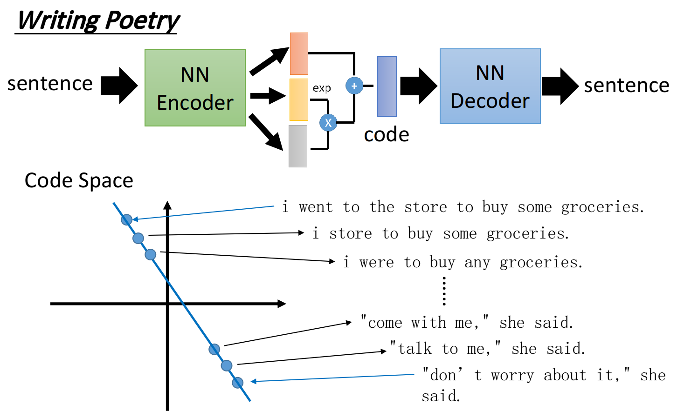

#### Why VAE?

VAE和传统的Autoencoder相比，有什么优势呢？

事实上，VAE就是加了噪声noise的Autoencoder，它的抗干扰能力更强，过渡生成能力也更强

对原先的Autoencoder来说，假设我们得到了满月和弦月的code，从两者连线中随机获取一个点并映射回原来的空间，得到的图像很可能是完全不一样的东西。

而对VAE来说，它要保证在降维后的空间中，加了noise的一段范围内的所有点都能够映射到目标图像，如下图所示，当某个点既被要求映射到满月、又被要求映射到弦月，VAE training的时候你要minimize mean square，所以这个位置最后产生的图会是一张介于满月和半月的图。所以你用VAE的话，你从你的code space上面去sample一个code再产生image的时候，你可能会得到一个比较好的image。如果是原来的auto-encoder的话，得到的都不像是真实的image。

再回过来头看VAE的结构，其中：

- $m_i$其实就代表原来的code

- $c_i$则代表加了noise以后的code

- $\sigma_i$代表了noise的variance，描述了noise的大小，这是由NN学习到的参数

  注：使用$e^{\sigma_i}$的目的是保证variance是正的

- $e_i$是正态分布中随机采样的点

注意到，损失函数仅仅让input和output差距最小是不够的，因为variance是由机器自己决定的，如果不加以约束，它自然会去让variance=0，这就跟普通的Autoencoder没有区别了

额外加的限制函数解释如下：

下图中，蓝线表示$e^{\sigma_i}$，红线表示$1+\sigma_i$，两者相减得到绿线

绿线的最低点$\sigma_i=0$，则variance $e^{\sigma_i}=1$，此时loss最低

而$(m_i)^2$项则是对code的L2 regularization，让它比较sparse，不容易过拟合，比较不会 learn 出太多 trivial 的 solution

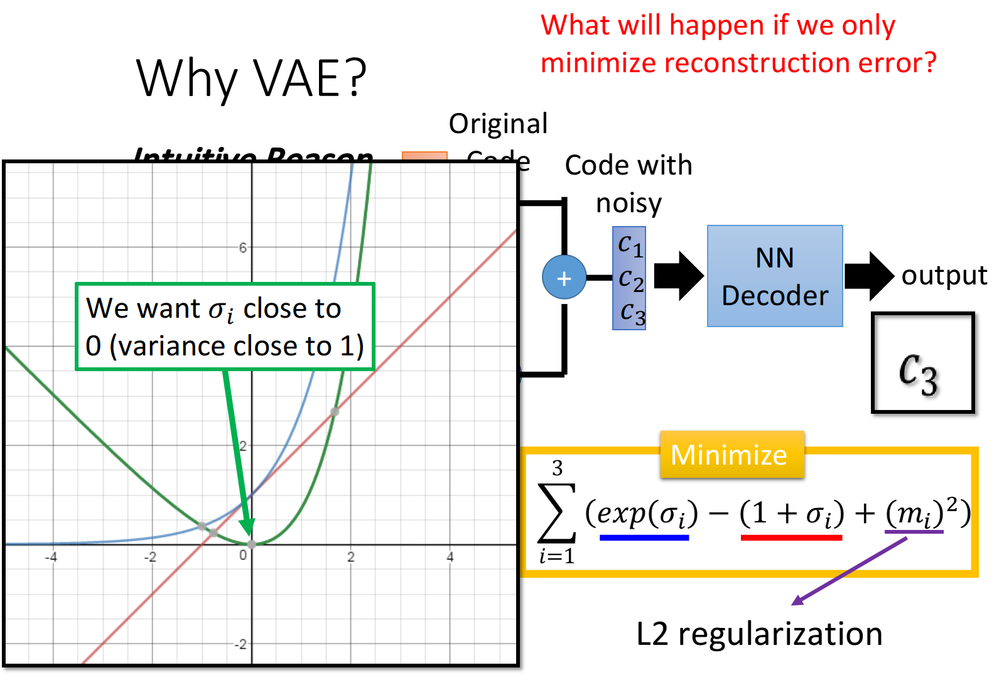

刚才是比较直观的理由，正式的理由这样的，以下是paper上比较常见的说法。

回归到我们要做的事情是什么，你要machine generate 这个pokemon的图，那每一张pokemon的图都可以想成是高维空间中的一个点。一张 image，假设它是 20\*20 的 image，它在高维的空间中就是一个 20*20，也就是一个 400 维的点。我们这边写做 x，虽然在图上，我们只用一维来描述它，但它其实是一个高维的空间。那我们现在要做的事情其实就是 estimate 高维空间上面的机率分布，P(x)。只要我们能够 estimate 出这个 P(x) 的样子，注意，这个 x 其实是一个 vector，我们就可以根据这个 P(x)，去 sample 出一张图。那找出来的图就会像是宝可梦的样子，因为你取 P(x) 的时候，机率高的地方比较容易被 sample 出来，所以，这个 P(x) 理论上应该是在有宝可梦的图的地方，它的机率是大的；如果是一张怪怪的图的话，机率是低的。如果我们今天能够 estimate 出这一个 probability distribution那就结束了。

#### Gaussian Mixture Model

那怎么 estimate 一个 probability 的 distribution 呢？

我们可以用 Gaussian mixture model。我们现在有一个 distribution，它长这个样子，黑色的、很复杂。我们说这个很复杂的黑色 distribution，它其实是很多的 Gaussian。这一边蓝色的代表有很多的 Gaussian用不同的 weight 迭合起来的结果。假设你今天 Gaussian 的数目够多，你就可以产生很复杂的 distribution。所以，虽然黑色很复杂，但它背后其实是有很多 Gaussian 迭合起来的结果。根据每一个 Gaussian 的 weight去决定你要从哪一个 Gaussian sample data，然后，再从你选择的那个 Gaussian 里面 sample data。如果你的gaussion数目够多，你就可以产生很复杂的distribution，公式为 $P(x)=\sum_{m} P(m) P(x|m)$ 。

如果你要从p(x)sample出一个东西的时候，你先要决定你要从哪一个gaussion sample东西，假设现在有100gaussion，你根据每个gaussion的weight去决定你要从哪一个gaussion sample data。所以你要咋样从一个gaussion mixture model smaple data呢？首先你有一个multinomial distribution，你从multinomial distribution里面决定你要sample哪一个gaussion，m代表第几个gaussion，它是一个integer。你决定好你要从哪一个m sample gaussion以后，，你有了m以后就可以找到 $\mu ^m,\sigma^m$（每一个gaussion有自己的 $\mu ^m,\sigma^m$），根据 $\mu ^m,\sigma^m$ 就可以sample一个x出来。所以p(x)写为summation over 所有的gaussion的weight乘以sample出x的机率 。

每一个x都是从某一个mixture被sample出来的，这件事情其实就很像是做classification一样。我们每一个所看到的x，它都是来自于某一个分类。但是我们之前有讲过说：把data做cluster是不够的，更好的表示方式是用distributed representation，也就是说每一个x它并不是属于某一个class，而是它有一个vector来描述它的各个不同的特性。所以VAE就是gaussion mixture model的 distributed representation的版本。

首先我们要sample一个z，这个z是从normal distribution 中sample出来的。这个vector z的每一个dimension就代表了某种attribute，如图中所示，假设是z是一维的，实际上 z 可能是一个 10 维的、100 维的 vector。到底有几维，是由你自己决定。接下来你Sample $z$以后，根据$z$你可以决定 $\mu(z),\sigma(z)$ ，你可以决定gaussion的 $\mu,\sigma$ 。刚才在gaussion model里面，你有10个mixture，那你就有10个 $\mu,\sum $ ，但是在这个地方，你的z有无穷多的可能，所以你的 $\mu(z),\sigma(z)$ 也有无穷多的可能。那咋样找到这个 $\mu(z),\sigma(z)$ 呢？做法是：假设 $\mu(z),\sigma(z)$ 都来自于一个function，你把z带到产生 $\mu$ 的这个function $N(\mu(z),\sigma(z))$ ， $\mu(z)$ 代表说：现在如果你的attribute是z的时候，你在x space上面的 $\mu$ 是多少。同理 $\sigma(z)$ 代表说：$\sigma$是多少

其实P(x)是这样产生的：在z这个space上面，每一个点都有可能被sample到，只不过是中间这些点被sample出来的机率比较大。当你sample出来点以后，这个point会对应到一个guassion。至于一个点对应到什么样的gaussion，它的 $\mu,\sigma$ 是多少，是由某一个function来决定的。所以当gaussion是从normal distribution所产生的时候，就等于你有无穷多个gaussion。

另外一个问题就是：我们怎么知道每一个$z$应该对应到什么样的 $\mu,\sigma$(这个function如何去找)。我们知道neural network就是一个function，所以你就可以说：我就是在train一个neural network，这个neural network的input就是$z$，它的output就是两个vector( $\mu(z),\sigma(z)$ )。

P(x)的distribution为$P(x)=\int_{Z} P(z) P(x|z) d z$

那你可能会困惑，为什么是gaussion呢？你可以假设任何形状的，这是你自己决定的。你可以说每一个attribute的分布就是gaussion，因为极端的case总是少的，比较没有特色的东西总是比较多的。你不用担心如果假设gaussion会不会对P(x)带来很大的限制：NN是非常powerful的，NN可以represent任何的function。所以就算你的z是normal distribution，最后的P(x)最后也可以是很复杂的distribution。

#### Maximizing Likelihood

p(z) is a normal distribution，$x|z$ 表示我们先知道 z 是什么，然后我们就可以决定 x 是从什么样子的 mean 跟 variance 的 Gaussian里面被 sample 出来的， $\mu(z),\sigma(z)$ 是等待被找出来的。

但是，问题是要怎么找呢？它的criterion就是maximizing the likelihood，我们现在手上已经有一笔data x，你希望找到一组 $\mu$ 的function和 $\sigma$ 的function，它可以让你现在已经有的image x，它的p(x)取log之后相加被maximize 。 $z$ 通过一个$NN$产生这个 $μ$ 跟 $σ$ ，所以我们要做的事情就是，调整$NN$里面的参数(每个neural的weight bias)，使得likehood可以被maximize 。

引入另外一个distribution，叫做 $q(z|x)$ 。也就是我们有另外一个 $NN'$ ，input一个$x$以后，它会告诉你说：对应在$z$这个space上面的 $\mu',\sigma'$ (给它$x$以后，它会决定这个$z$要从什么样的 $\mu',\sigma'$ 被sample出来)。这个$NN’$就是VAE里的Encoder，前面说的 $NN$ 就是Decoder

 $logP(x)=\int_{z}q(z|x)logP(x)dz$ ，对任何distribution$q(z|x)$都成立。因为这个积分是跟P(x)无关的，然后就可以提出来，积分的部分就会变成1，所以左式就等于右式。

由条件概率$P(A|B)=P(AB)/P(B)$，得到第二行。log中的式子拆开，得到第三行。右边这一项，它代表了一个 KL divergence。KL divergence 代表的是这两个 distribution 相近的程度，如果 KL divergence 它越大代表这两个 distribution 越不像，这两个 distribution 一模一样的时候，KL divergence 会是 0。所以，KL divergence 它是一个距离的概念，它衡量了两个 distribution 之间的距离。最小为0。左边一项经过变化，得到L的lower bound $L_b$。 

我们要maximize的对象是由这两项加起来的结果，在 $L_b$ 这个式子中，$p(z)$是已知的，我们不知道的是 $p(x|z)$ 跟 $q(z|x)$。我们本来要做的事情是要找 $p(x|z)$ ，让likelihood越大越好，现在我们要做的事情变成要找找 $p(x|z)$ 跟 $q(z|x)$ ，让 $L_b$ 越大越好。

如果我们只找 $p(x|z)$ ，然后去maximizing  $L_b$  的话，那因为你要找的这个 likelihood，它是 $L_b$ 的 upper bound，所以，你增加 $L_b$ 的时候，你有可能会增加你的 likelihood。但是，你不知道你的这个 likelihood跟你的 lower bound 之间到底有什么样的距离。你希望做到的事情是当你的 lower bound 上升的时候，你的 likelihood 是会比 lower bound 高，然后你的 likelihood 也跟着上升。但是，你有可能会遇到一个比较糟糕的状况是你的 lower bound 上升的时候，likelihood 反而下降。虽然，它还是 lower bound，它还是比 lower bound 大，但是，它有可能下降。因为根本不知道它们之间的差距是多少。

所以，引入 q 这一项呢，其实可以解决刚才说的那一个问题。因为likelihood = $L_b$ + KL divergence。如果你今天去这个调$q(z|x)$，去 maximize $L_b$ 的话，会发生什么事呢？首先 q 这一项跟 log P(x) 是一点关系都没有的，log P(x) 只跟 $P(x|z)$ 有关，所以，这个值是不变的，蓝色这一条长度都是一样的。我们现在去 maximize $L_b$，maximize $L_b$ 代表说你 minimize 了 KL divergence，也就是说你会让你的 lower bound 跟你的这个 likelihood越来越接近，假如你固定住 $P(x|z)$ 这一项，然后一直去调 $q(z|x)$ 这一项的话，让这个 $L_b$ 一直上升，最后这一个 KL divergence 会完全不见。

假如你最后可以找到一个 q，它跟这个 $p(z|x)$ 正好完全 distribution 一模一样的话，你就会发现说你的 likelihood 就会跟lower bound 完全停在一起，它们就完全是一样大。这个时候呢，如果你再把 lower bound 上升的话，因为你的 likelihood 一定要比 lower bound大。所以这个时候你的 likelihood你就可以确定它一定会上升。所以，这个就是引入 q 这一项它有趣的地方。

一个副产物，当你在 maximize q 这一项的时候，你会让这个 KL divergence 越来越小，你会让这个 $q(z|x)$ 跟 $P(z|x)$ 越来越接近。

所以我们接下要做的事情就是找$𝑃 (𝑥|𝑧)$ and $𝑞 (𝑧|𝑥)$，可以让 $L_b$ 越大越好。让 $L_b$ 越大越好就等同于我们可以让 likelihood 越来越大，而且你顺便会找到 $q$ 可以去 approximation of $p(z|x)$

对于$L_b$ log 里面相乘，拆开，得到 $P(z)$ 跟 $q(z|x)$ 的 KL divergence

#### Connection with Network

q是一个 neural network，当你给 x 的时候，它会告诉你 $q(z|x)$ 是从什么样的mean 跟 variance 的 Gaussian 里面 sample 出来的。所以，我们现在如果你要minimize 这个 $P(z)$ 跟 $q(z|x)$ 的 KL divergence 的话，你就是去调output让它产生的 distribution 可以跟这个 normal distribution 越接近越好。minimize这一项其实就是我们刚才在reconstruction error外加的那一项$\sum_{i=1}^{3}\left(\exp \left(\sigma_{i}\right)-\left(1+\sigma_{i}\right)+\left(m_{i}\right)^{2}\right)$，它要做的事情就是minimize KL divergence，希望 $q(z|x)$ 的output跟normal distribution是接近的。

另外一项是要这个积分的意思就是

你可以想象，我们有一个 $log P(x|z)$，然后，它用 $q(z|x)$ 来做 weighted sum。所以，你可以把它写成$[log P(x|z)]$ 根据 $q(z|x)$ 的期望值

这个式子的意思就好像是说：给我们一个 $x$ 的时候，我们去根据这个 $q(z|x)$，这个机率分布去 sample 一个 data，然后，要让 $log P(x|z)$ 的机率越大越好。那这一件事情其实就 Auto-encoder 在做的事情。

怎么从 $q(z|x)$ 去 sample 一个 data 呢？你就把 $x$ 丢到 neural network 里面去，它产生一个 mean 跟一个 variance，根据这个 mean 跟 variance，你就可以 sample 出一个 $z$。

你已经根据现在的 x sample 出 一个 z，接下来，你要 maximize 这一个 z，产生这个 x 的机率。

这个 z 产生这个 x ，是把这个 z 丢到另外一个 neural network 里面去，它产生一个 mean 跟 variance，要怎么让这个 NN output所代表 distribution 产生 x 的 机率越大越好呢？假设我们无视 variance 这一件事情的话，因为在一般实作里面你可能不会把 variance 这一件事情考虑进去。你只考虑 mean 这一项的话，那你要做的事情就是：让这个 mean跟你的 x 越接近越好。你现在是一个 Gaussian distribution，那 Gaussian distribution 在 mean 的地方机率是最高的。所以，如果你让这个 NN output 的这个 mean 正好等于你现在这个 data x 的话，这一项 $log P(x|z)$ 它的值是最大的。

所以，现在这整个 case 就变成说，input 一个 x，然后，产生两个 vector，然后 sample 产生一个 z，再根据这个 z，你要产生另外一个 vector，这个 vector 要跟原来的 x 越接近越好。这件事情其实就是Auto-encoder 在做的事情。所以这两项合起来就是刚才我们前面看到的 VAE 的 loss function。

#### problems of VAE

VAE其实有一个很严重的问题就是：它从来没有真正学过如何产生一张看起来像真的image，它学到的东西是：它想要产生一张image，跟我们在database里面某张image越接近越好。

但它不知道的是：我们evaluate它产生的image跟database里面的相似度的时候(MSE等等)，decoder output跟真正的image之间有一个pixel的差距，不同的pixel落在不同的位置会得到非常不一样的结果。假设这个不一样的pixel落在7的尾部(让7比较长一点)，跟落在另外一个地方(右边)。你一眼就看出说：右边这是怪怪的digit，左边这个搞不好是真的。但是对VAE来说都是一个pixel的差异，对它来说这两张image是一样的好或者是一样的不好。

所以VAE学的只是怎么产生一张image跟database里面的一模一样，从来没有想过：要真的产生可以一张以假乱真的image。所以你用VAE来做training的时候，其实你产生出来的image往往都是database里面的image linear combination而已。因为它从来都没有想过要产生一张新的image，它唯一做的事情就是希望它产生的 image 跟 data base 的某张 image 越像越好，模仿而已。

### GAN

GAN，对抗生成网络，是近两年非常流行的神经网络，基本思想就像是天敌之间相互竞争，相互进步

GAN由生成器(Generator)和判别器(Discriminator)组成：

- 对判别器的训练：把生成器产生的图像标记为0，真实图像标记为1，丢给判别器训练分类
- 对生成器的训练：input: Vectors from a distribution，调整生成器的参数，使产生的图像能够骗过判别器
- 每次训练调整判别器或生成器参数的时候，都要固定住另一个的参数

#### In practical ……

- GANs are difficult to optimize.
- No explicit signal about how good the generator is
  - In standard NNs, we monitor loss
  - In GANs, we have to keep “well-matched in a contest”
- When discriminator fails, it does not guarantee that generator generates realistic images
  - Just because discriminator is stupid
  - Sometimes generator find a specific example that can fail the discriminator
- Making discriminator more robust may be helpful.

GAN的问题：没有明确的训练目标，很难调整生成器和判别器的参数使之始终处于势均力敌的状态，当两者之间的loss很小的时候，并不意味着训练结果是好的，有可能它们两个一起走向了一个坏的极端，所以在训练的同时还要有人在旁边关注着训练的情况
# Anomaly Detection

## Anomaly Detection

异常探测就是要让机器知道它不知道这件事

### Problem Formulation

异常侦测的问题通常formulation成这样，假设我们现在有一堆训练数据（$x^1, x^2, ... x^N$），（在这门课里面，我们通常用上标来表示一个完整的东西，用下标来表示一个完整东西的其中一部分）。我们现在要找到一个function，这个function要做的事情是：检测输入x的时，决定现在输入的x到底跟我们的训练数据是相似还是不相似的。

我们一直在用Anoamly这个词汇，可能会让某些同学觉得机器在做Anoamly Detector都是要Detector不好的结果，因为异常这个词汇显然通常代表的是负面意思。其实Anoramly Detector并不一定是找不好的结果，只是找跟训练数据不一样的数据。所以我们找出结果不见得是异常的数据，你会发现Anoamly Detector在不同的领域里面有不同名字。有时候我们会叫它为“Outlier Detector, Novelty Detector, Exceprions Detector”

总之我们要找的是跟训练数据不一样的数据，但至于什么叫做similar，这就是Anoamly Detector需要探讨的问题。不同的方法就有不同的方式来定义什么叫做“像”、什么叫做“不像”。

### What is Anomaly?

这里我要强调一下什么叫做异常，机器到底要看到什么就是Anormaly。其实是取决你提供给机器什么样的训练数据。

假设你提供了很多的雷丘作为训练数据，皮卡丘就是异常的。若你提供了很多的皮卡丘作为训练数据，雷丘就是异常的。若你提供很多的宝可梦作为训练数据，这时数码宝贝就是异常的。

### Applications

#### Fraud Detection

异常侦测有很多的应用，你可以应用到诈欺侦测（Fraud Detection）。训练数据是正常的刷卡行为，收集很多的交易记录，这些交易记录视为正常的交易行为，若今天有一笔新的交易记录，就可以用异常检测的技术来侦测这笔交易记录是否有盗刷的行为。（正常的交易金额比较小，频率比较低，若短时间内有非常多的高额消费，这可能是异常行为）

#### Network Intrusion Detection

异常侦测还可以应用到网络系统的入侵侦测，训练数据是正常连线。若有一个新的连线，你希望用Anoramly Detection让机器自动决定这个新的连线是否为攻击行为

#### Cancer Detection

异常侦测还可以应用到医疗（癌细胞的侦测），训练数据是正常细胞。若给一个新的细胞，让机器自动决定这个细胞是否为癌细胞。

### Binary Classification?

我们咋样去做异常侦测这件事呢？很直觉的想法就是：若我们现在可以收集到很多正常的资料$\{x^1, x^2, ...,x^N\}$，我们可以收集到很多异常的资料$\{\tilde{x}^1, \tilde{x}^2,..., \tilde{x}^N\}$。我们可以将normal data当做一个Class（Class1），anomaly data当做另外一个Class（Class2）。我们已经学过了binary classification，这时只需要训练一个binary classifier，然后就结束了。

这个问题其实并没有那么简单，因为不太容易把异常侦测视为一个binary classification的问题。为什么这样说呢？

假设现在有一笔正常的训练数据是宝可梦，只要不是宝可梦就视为是异常的数据，这样不只是数码宝贝是异常数据，凉宫春日也是异常数据，茶壶也是异常的数据。不属于宝可梦的数据太多了，不可能穷举所有不是宝可梦的数据。根本没有办法知道整个异常的数据（Class2）是怎样的，所以不应该将异常的数据视为一个类别，应为它的变化太大了。这是第一个不能将异常侦测视为二元分类的原因。

第二个原因是：很多情况下不太容易收集到异常的资料，收集正常的资料往往比较容易，收集异常的资料往往比较困难。对于刚才的诈欺侦测例子而言，你可以想象多数的交易通常都是正常的，很难找到异常的交易。这样就造成异常侦测不是一个单纯的二元分类问题，需要想其它的方法，它是一个独立的研究主题，仍然是一个尚待研究的问题。

### Categories

接下来对异常侦测做一个简单的分类

#### With labels

一类，是不只有训练数据 $\{x^1,x^2,⋯,x^N\}$ ，同时这些数据还具有label $\{\hat{y}^1,\hat{y}^2,⋯,\hat{y}^N\}$。 用这样的数据集可以train出一个classifier，让机器通过学习这些样本，以预测出新来的样本的label，但是我们希望分类器有能力知道新给样本不属于原本的训练数据的任何类别，它会给新样本贴上“unknown”的标签。训练classifier 可以用generative model、logistic regression、deep learning等方法，你可以从中挑一个自己喜欢的算法train 出一个classifier 。

上述的这种类型的任务，train出的classifier 具有看到不知道的数据会标上这是未知物的能力，这算是异常检测的其中一种，又叫做Open-set Recognition。我们希望做分类的时候模型是open 的，它可以辨识它没看过的东西，没看过的东西它就贴一个“unknown”的标签。

#### Without labels

另一类，所有训练数据都是没有label 的，这时你只能根据现有资料的特征去判断，新给的样本跟原先的样本集是否相像。这种类型的数据又分成两种情况：

- Clean：手上的样本是干净的（所有的训练样本都是正常的样本）
- Polluted：手上的样本已经被污染（训练样本已经被混杂了一些异常的样本，更常见）

情况二是更常见的，对于刚才的诈欺检测的例子而言，银行收集了大量的交易记录，它把所有的交易记录都当做是正常的，然后告诉机器这是正常交易记录，然后希望机器可以借此检测出异常的交易。但所谓的正常的交易记录可能混杂了异常的交易，只是银行在收集资料的时候不知道这件事。所以我们更多遇到的是：手上有训练样本，但我没有办法保证所有的训练样本都是正常的，可能有非常少量的训练样本是异常的。

### Case 1: With Classifier

现在给定的例子是要侦测一个人物是不是来自辛普森家庭，可以看出$x^1, x^2, x^3,x^4$是来自辛普森家庭（辛普森家庭的人有很明显的特征：脸是黄色的，嘴巴像似鸭子），同时也可以看出凉宫春日显然不是来自辛普森家庭。

假设我们收集的辛普森家庭的人物都具有标注（霸子，丽莎，荷马，美枝），有了这些训练资料以后就可以训练出一个辛普森家庭成员的分类器。我们就可以给分类器看一张照片，它就可以判断这个照片中的人物是辛普森家庭里面的哪个人物。

#### How to use the Classifier

现在我们想做的事情是根据这个分类器来进行异常侦测，判断这个人物是否来自辛普森家庭。

我们原本是使用分类器来进行分类，现在希望分类器不仅可以来自分类，还会输出一个数值，这个数值代表信心分数（Confidence score ），然后根据信心分数做异常侦测这件事情。

定义一个阈值称之为$\lambda$，若信心分数大于$\lambda$就说明是来自于辛普森家庭。若信心分数小于$\lambda$就说明不是来自于辛普森家庭

##### How to estimate Confidence

咋样可以得到信心分数呢？若我们将图片输入辛普森家庭的分类器中，若分类器非常的肯定这个图片到底是谁，输出的信心分数就会非常的高。当我们将图片输入分类器时，分类器的输出是一个机率分布（distribution），所以将一张图片输入分类器时，分类器会给事先设定的标签一个分数。

如图所示，将“霸子”图片输入分类器，分类器就会给“霸子”一个很高的分数。

但你若给它一张很奇怪的图片（凉宫春日），这时输出的分数会特别的平均，代表机器是没有信心的。若输出特别平均，那这张图片就是异常的图片

刚才讲的都是定性的分析，现在需要将定性分析的结果化为信心分数。

一个非常直觉的方法就是将分类器的分布中最高数值作为信心分数，所以上面那张图输出的信心分数为0.97（霸子），下面那张图输出的信心分数为0.26（凉宫春日）

根据信心分数来进行异常检测不是唯一的方法，因为输出的是distribution，那么就可以计算entropy。entropy越大就代表输出越平均，代表机器没有办法去肯定输出的图片是哪个类别，表示输出的信心分数是比较低。总之我们有不同的方法根据分类器决定它的信心分数。

现在我输入一张训练资料没有的图片（荷马），分类器输出荷马的信心分数是1.00；输入霸子的图片，分类器输出霸子的信心分数为0.81，输出郭董的信心分数为0.12；输入三玖的图片，分类器输出柯阿三的信心分数为0.34，输出陈趾鹹的信心分数为0.31，输出鲁肉王的信心分数为0.10。

以上都是动漫人物，现在输入一张真人的图片，分类器输出柯阿三的信心分数为0.63，输出宅神的信心分数为0.08，输出小丑阿基的信心分数为0.04，输出孔龙金的信心分数为0.03。

我们可以发现，如果输入的是辛普森家庭的人物，分类器输出比较高信心分数。如果输入不是辛普森家庭的任务，分类器输出的信心分数是比较低。

但是也有一些例外，比如输入凉宫春日的图片，分类器输出柯阿三的信心分数为0.99。

若输入大量的训练资料输入至分类器中，输出的信心分数分布如图所示。几乎所有的辛普家庭的人物输入分类器中，无论是否辨识有错都会给出一个较高的信心分数。

但还是发现若辨识有错误会得到较低的信心分数，如图所示的红色点就是辨识错误图片的信心分数的分布。蓝色区域分布相较于红色区域集中在1的地方，有很高的信心分数认为是辛普森家庭的人物。

若输入其它动画的人物图片，其分类器输出的信心分数如题所示，我们会发现有1/10的图片的信心分数比较高（不是辛普森家庭的人物，但给了比较高的分数），多数的图片得到的信心分数比较低。

##### Network for Confidence Estimation

刚才是比较直观的给出了一个信心分数，你可能会觉得这种方法会让你觉得非常弱，不过刚才那种非常简单的方法其实在实作上往往还可以有不错的结果。

若你要做异常侦测的问题，现在有一个分类器，这应该是你第一个要尝试的baseline。虽然很简单，但不见得结果表现会很差。

也有更好的方法，比如你训练一个neuron network时，可以直接让neuron network输出信心分数，具体细节可参考：Terrance DeVries, Graham W. Taylor, Learning Confidence for Out-of-Distribution Detection in Neural Networks, arXiv, 2018

#### Example Framework

##### Training Set

我们有大量的训练资料，且训练资料具有标注（辛普森家庭哪个人物），因此我们可以训练一个分类器。不管用什么方法，可以从分类器中得到对所有图片的信心分数。然后就根据信心分数建立异常侦测的系统，若信心分数高于某个阀值（threshold）时就认为是正常，若低于某个阀值（threshold）时就认为是异常。

##### Dev Set

在之前的课程中已经讲了Dev Set的概念，需要根据Dev Set调整模型的超参数（hyperparameter），才不会过拟合。

在异常侦测的任务里面我们的Dev Set，不仅是需要大量的images，还需要被标注这些图片是来自辛普森家庭的人物还是不是来自辛普森家庭的人物。需要强调的是在训练时所有的资料都是来自辛普森家庭的人物，标签是来自辛普森家庭的哪一个人物。

但是我们要做Dev Set时，Dev Set要模仿测试数据集（testing Set），Dev Set要的并不是一张图片（辛普森家庭的哪一个人物），而应该是：辛普森家庭的人物和不是辛普森家庭的人物。

有了Dev Set以后，我们就可以把我们异常侦测的系统用在Dev Set，然后计算异常侦测系统在Dev Set上的performance是多少。你能够在Dev Set衡量一个异常侦测系统的performance以后，你就可以用Dev Set调整阀值（threshold），找出让最好的阀值（threshold）。

##### Testing Set

决定超参数以后（hyperparameters），就有了一个异常侦测的系统，你就可以让它上线。输入一张图片，系统就会决定是不是辛普森家庭的人物。

#### Evaluation

接下里要讲的是：如何计算一个异常侦测系统的性能好坏？现在有100张辛普森家庭人物的图片和5张不是辛普森家庭人物的图片。如图所示，辛普森家庭是用蓝色来进行表示，你会发现基本都集中在高分的区域。5张不是辛普森家庭的图片用红色来表示。

你会发现图的左边有一个辛普森家庭人物的分数是非常低的，在异常侦测时机器显然会在这里犯一个错误，认为它不是辛普森家庭人物，这张图片是辛普森家庭的老爷爷。

第一个图片是看起来像安娜贝尔的初音，第二张图片是小樱，第三张图片也是小樱，第四张图是凉宫春日，第五张图是魔法少女。我们会发现这个魔法少女的信心分数非常的高（0.998），事实上在这个bar中有百分之七十五的信心分数都高于0.998，多数辛普森家庭人物得到的信心分数都是1。

很多人在实作时，发现这张异常的图片却给到了0.998很高的分数。但你发现那些正常的图片往往得到更高的分数。虽然这些异常的图片可以得到很高的分数，但如果没有正常图片的分数那么高，还是可以得到较好的异常侦测的结果。

我们咋样来评估一个异常侦测系统的好坏呢？我们知道异常侦测其实是一个二元分类（binary classification）的问题。在二元分类中我们都是用正确率来衡量一个系统的好坏，但是在异常侦测中正确率并不是一个好的评估系统的指标。你可能会发现一个系统很可能有很高的正确率，但其实这个系统什么事都没有做。为什么这样呢？因为在异常侦测的问题中正常的数据和异常的数据之间的比例是非常悬殊的。在这个例子里面，我们使用了正常的图片有一百张，异常的图片有五张。

通常来说正常的资料和异常的资料之间的比例是非常悬殊的，所以只用准确率衡量系统的好坏会得到非常奇怪的结果的。

在如图所示的例子中，我们认为有一个异常侦测的系统，它的$\lambda$设为0.3以下。$\lambda$以上认为是正常的，$\lambda$以下认为是异常的。这时你会发现这个系统的正确率是95.2%，由于异常资料很少，所以正确率仍然是很高的。所以**异常侦测问题中不会用正确率来直接当做评估指标。**

首先我们要知道在异常侦测中有两种错误：一种错误是异常的资料被判断为正常的资料，另外一种是正常的资料被判为异常的资料。假设我们将$\lambda$设为0.5（0.5以上认为是正常的资料，0.5以下认为是异常的资料），这时就可以计算机器在这两种错误上分别犯了多少错误。

对于所有异常的资料而言，有一笔资料被侦测出来，其余四笔资料没有被侦测为异常的资料。对于所有正常的资料而言，只有一笔资料被判断为异常的资料，其余的九十九笔资料被判断为正常的资料。这时我们会说机器有一个false alarm（正常的资料被判断为异常的资料）错误，有四个missing（异常的资料却没有被侦测出来）错误。

若我们将阀值（threshold）切在比0.8稍高的部分，这时会发现在五张异常的图片中，其中有两张认为是异常的图片，其余三种被判断为正常的图片；在一百张正确的图片中，其中有六张图片被认为是异常的图片，其余九十四张图片被判断为正常的图片。

哪一个系统比较好呢？其实你是很难回答这个问题。有人可能会很直觉的认为：当阀值为0.5时有五个错误，阀值为0.8时有九个错误，所以认为左边的系统好，右边的系统差。

但其实一个系统是好还是坏，取决你觉得false alarm比较严重还是missing比较严重。

所以你在做异常侦测时，可能有一个Cost Table告诉你每一种错误有多大的Cost。若没有侦测到资料就扣一分，若将正确的资料被误差为错误的资料就扣100分。若你是使用这样的Cost来衡量系统的话，左边的系统会被扣104分，右边的系统会被扣603分。所以你会认为左边的系统较好。若Cost Table为Cost Table B 时，异常的资料没有被侦测出来就扣100分，将正常的资料被误判为错误的资料就扣1分，计算出来的结果会很不一样。

在不同的情景下、不同的任务，其实有不同的Cost Table：假设你要做癌症检测，你可能就会比较倾向想要用右边的Cost Table。因为一个人没有癌症却被误判为有癌症，顶多就是心情不好，但是还可以接受。若一个人其实有癌症，但没有检查出来，这时是非常严重的，这时的Cost也是非常的高。

这些Cost要给出来，其实是要问你现在是什么样的任务，根据不同的任务有不同的Cost Table。所以根据右边的Cost Table，左边的Cost为401分，右边的Cost为306分，所以这时右边的系统较好。

其实还有很多衡量异常检测系统的指标，有一个常用的指标为AUC（Area under ROC curve）。若使用这种衡量的方式，你就不需要决定阀值（threshold），而是看你将测试集的结果做一个排序（高分至低分），根据这个排序来决定这个系统好还是不好。

如果我们直接用一个分类器来侦测输入的资料是不是异常的，这并不是一种很弱的方法，但是有时候无法给你一个perfect的结果，我们用这个图来说明用classifier做异常侦测时有可能会遇到的问题。

假设现在做一个猫和狗的分类器，将属于的一类放在一边，属于狗的一类放在一边。若输入一笔资料即没有猫的特征也没有狗的特征，机器不知道该放在哪一边，就可能放在这个boundary上，得到的信息分数就比较低，你就知道这些资料是异常的。

你有可能会遇到这样的状况：有些资料会比猫更像猫（老虎），比狗还像狗（狼）。机器在判断猫和狗时是抓一些猫的特征跟狗的特征，也许老虎在猫的特征上会更强烈，狼在狗的特征上会更强烈。对于机器来说虽然有些资料在训练时没有看过（异常），但是它有非常强的特征会给分类器很大的信心看到某一种类别。

在解决这个问题之前我想说辛普森家庭人物脸都是黄的，如果用侦测辛普森家庭人物的classifier进行侦测时，会不会看到黄脸的人信心分数会不会暴增呢？所以将三玖的脸涂黄，结果侦测为是宅神，信心分数为0.82；若再将其头发涂黄，结果侦测为丽莎，信心分数为1.00。若将我的脸涂黄，结果侦测为丽莎，信心分数为0.88。

当然有些方法可以解这个问题，这里列一些文献给大家进行参考。其中的一个解决方法是：假设我们可以收集到一些异常的资料，我们可以教机器看到正常资料时不要只学会分类这件事情，要学会一边做分类一边看到正常的资料信心分数就高，看到异常的资料就要给出低的信心分数。

但是会遇到的问题是：很多时候不容易收集到异常的数据。有人就想出了一个神奇的解决方法就是：既然收集不到异常的资料，那我们就通过Generative Model来生成异常的资料。这样你可能遇到的问题是：若生成的资料太像正常的资料，那这样就不是我们所需要的。所以还要做一些特别的constraint，让生成的资料有点像正常的资料，但是又跟正常的资料又没有很像。接下来就可以使用上面的方法来训练你的classifier。

### Case 2: Without Labels

#### Twitch Plays Pokémon

接下来我们再讲第二个例子，在第二个例子中我们没有classifier，我们只能够收集到一些资料，但没有这些资料的label

这是一个真实的Twitch Plays Pokemon例子，这个的例子是这样的：有人开了一个宝可梦的游戏，全世界的人都可以连接一起玩这个宝可梦的游戏。右边的框是每一个人都在输入指令同时操控这个游戏，这个游戏最多纪录好像是有八万人同时玩这个游戏。当大家都在同时操作同一个角色时，玩起来其实是相当崩溃的。

人们玩的时候就非常的崩溃，那么崩溃的原因是什么呢？可能是因为有网络小白（Troll）。有一些人根本就不会玩，所以大家都没有办法继续玩下去；或者觉得很有趣；或者是不知名的恶意，不想让大家结束这个游戏。人们相信有一些小白潜藏在人们当中，他们想要阻挠游戏的进行。

所以我们就可以用异常侦测的技术，假设多数的玩家都是想要破关的（训练资料），我们可以从多数玩家的行为知道正常玩家的行为是咋样的，然后侦测出异常的玩家（网络小白）。至于侦测出来给网路小白做什么，还需要待讨论的问题。有人说：小白只是人们的幻想，为什么这么说呢？

也许实际上根本就没有在阻挠这个游戏的进行，只是因为大家同时玩这个游戏时，大家的想法会是不一样的，这样玩起来会非常的卡。甚至有人说若没有网络小白，大家也根本没办法玩下去，因为在这个游戏里面同时可能会有非常多的指令被输入，而系统pick一个指令，所以多数时你的指定根本就没有被选到。如果所有人的想法都是一致的（输入同一个指令），结果某一个人的指令被选到。那你可能就会觉得这有什么好玩的，反正我又没有操控那个角色。所以大家相信有网络小白的存在，大家一起联手起来抵挡网络小白的攻击，这会让你觉得最后系统没有选到我，但是至少降低了小白被选到的可能，所以大家可以继续玩下去。

我们需要一些训练的资料，每一个x代表一个玩家，如果我们使用machine learning的方法来求解这个问题，首先这个玩家能够表示为feature vector。向量的第一维可以是玩家说垃圾话的频率，第二维是统计玩家无政府状态发言。

我们刚才可以根据分类器的conference来判断是不是异常的资料，但我们现在只有大量的训练资料，没有label。我们在没有classifier的情况下可以建立一个模型，这个模型是告诉我们P(x)的机率有多大。（根据这些训练资料，我们可以找出一个机率模型，这个模型可以告诉我们某一种行为发生的概率多大）。如果有一个玩家的机率大于某一个阀值（threshold），我们就说他是正常的；如果机率小于某一个阀值（threshold），我们就说他是异常的。

如图这是一个真实的资料，假设每一个玩家可以用二维的向量来描述（一个是说垃圾话的机率，一个是无政府状态发言的机率）。

如果我们只看说垃圾话的那一维如图所示，会发现并不是完全不说垃圾话的是最多的。很多人可能会想象说大多数人是在民主状态下发言的（民主时比较想发言，无政府混乱时不想发言），但是实际上统计的结果跟直觉的想象是不一样的，如图所示大多数人有八成的机率是在无政府状态下发言的，因为这个游戏多数时间是在无政府状态下进行的。游戏进行到某一个地方以后，官方决定加入民主机制（20秒内最多人选择的那一个行为是控制角色所采取的决策，这个听起来好像是很棒的主意，马上就遭到了大量的反对。在游戏里面要投票选择民主状态还是无政府状态，若很多人选择无政府状态，就会进入无政府状态。

事实上很多人强烈支持无政府状态，强烈反对民主状态，所以这个游戏多数是在无政府状态下进行。假设一个玩家不考虑自己是要在什么状态下发言，大多数人有八成的机率是在无政府下进行发言，有人甚至觉得多数小白是在民主状态下发言，因为进入了民主状态，所以他要多发言才能够让他的行为被选中，所以小白会特别喜欢在民主状态下发言。

我们还没有讲任何的机率模型，从这个图上可以很直觉的看出一个玩家落在说垃圾的话机率低，通常在无政府状态下发言，这个玩家有可能是一个正常的玩家。假设有玩家落在有五成左右的机率说垃圾话，二成的机率在无政府状态下发言；或者落在有七成左右的机率说垃圾话，七成的机率在无政府状态下发言，显然这个玩家比较有可能是一个不正常的玩家。我们直觉上明白这件事情，但是我们仍然希望用一个数值化的方法告诉我们玩家落在哪里会更加的异常。

#### Maximum Likelihood

我们需要likelihood这个概念：我们收集到n笔资料，假设我们有一个probability density function$f_{\theta}(x)$，其中$\theta$是这个probability density function的参数（$\theta$的数值决定这个probability density function的形状），$\theta$必须要从训练资料中学习出来。假设这个probability density function生成了我们所看到的数据，而我们所做的事情就是找出这个probability density function究竟长什么样子。

likelihood的意思是：根据probability density function产生如图所示的数据机率有多大。若严格说的话，$f_{\theta}(x)$并不是机率，它的output是probability density；输出的范围也并不是(0,1)，有可能大于1。

$x^1$根据probability density function产生的机率$f_{\theta}(x^1)$，乘以$x^2$根据probability density function产生的机率$f_{\theta}(x^2)$，一直乘到$x^N$根据probability density function产生的机率，得到的结果就是likelihood。likelihood的可能性显然是由$\theta$控制的，选择不同的$\theta$就有不同的probability density function，就可以算出不同的likelihood。

而我们现在并不知道这个$\theta$是多少，所以我们找一个$\theta^*$，使得算出来的likelihood是最大的。

#### Gaussian Distribution

第二项分母为 Determinant 行列式

一个常用的probability density function就是Gaussian Distribution，你可以将这个公式想象为一个function，这个function就是输入一个vector x，输出为这个vector x被sample到的机率。这个function由两个参数（$\mu $和covariance matrix $\sum$）所控制，它们相当于我们刚才所讲的$\theta$。这个Gaussian function的形状由$\mu$和covariance matrix $\mu$所控制。将$\theta$替换为$\mu, \sum$，不同的$\mu, \sum$就有不同的probability density function。

假设如图所示的数据是由左上角的$\mu$来生成的，它的likelihood是比较大（Gaussian function的特性就是在$\mu$附近时data被sample的机率很高）假设这个$\mu$远离高密度，若从这个$\mu$被sample出来的资料应该落在这个蓝色圈圈的范围内，但是资料没有落在这个蓝色圈圈的范围内，显然这样计算出来的likelihood是比较低的。

所以我们要做的事情就是穷举所有的$\mu, \sum$，观察哪个$\mu, 
\sum$计算的likelihood最大，那这个$\mu, \sum$就是我们要找的$\mu^*,\sum^*$。得到$\mu^*,\sum^*$以后就可以知道产生这笔资料的Distribution的形状。

但是往往有同学问的问题是：为什么要用Gaussian Distribution，为什么不用其它的Distribution。最简答的答案是：我选别的Distribution，你也会问同样的问题。Gaussian是真的常用，这是一个非常非常强的假设，因为你的资料分布可能根本就不是Gaussian，有可能你会做的的更好，但不是我们这门课要讲的范围。

如果$f_{\theta}(x)$是一个非常复杂的function（network），而操控这个network的参数有非常大量，那么就不会有那么强的假设了，就会有多的自由去选择function来产生资料。这样就不会限制在看起来就不像Gaussian产生的资料却硬要说是Gaussian产生的资料。因为我们这门课还没有讲到其它进阶的生成模型，所以现在用Gaussian Distribution来当做我们资料是由Gaussian Distribution所产生的。

$\mu^*, \sum^*$可以代入相应的公式来解这个这个公式，$\mu^*$等于将所有的training data x做平均，结果为$\begin{bmatrix}
0.29\\ 
0.73
\end{bmatrix}$，$\sum^*$等于将x减去$\mu^*$乘以x减去$\mu^*$的转置，然后做平均，得到的结果为$\begin{bmatrix}
0.04 & 0\\ 
0 & 0.03
\end{bmatrix}$

我们根据如图所示的资料找出了$\mu^*$和$\sum^*$，接下来就可以做异常侦测了。将$\mu^*,\sum^*$代入probability density function，若大于某一个阀值（threshold）就说明是正常的，若小于某一个阀值（threshold）就说明是异常的。

每一笔资料都可以代入probability density function算出一个数值，结果如图所示。若落在颜色深的红色区域，就说明算出来的数值越大，越是一般的玩家，颜色浅的蓝色区域，就说明这个玩家的行为越异常。其中$\lambda$就是如图所示的等高线的其中一条，若有一个玩家落在很喜欢说垃圾话，多数喜欢在无政府状态下发言的区域，就说明是一个正常的玩家。若有一个玩家落在很少说垃圾话，特别喜欢在民主时发言，就说明是一个异常的玩家。

#### More Features

machine learning最厉害的就是让machine做，所以你要选择多少feature都可以，把能想到觉得跟判断玩家是正常的还是异常的feature加进去。

有了这些feature以后就训练训练出$\mu^*, \sum^*$，然后创建一个新的玩家代入这个function，就可以知道这个玩家算出来的分数有多高（对这个function进行log变化，因为一般function计算出来的分数会比较小）。

假设输入的这个玩家有0.1 percent说垃圾话，0,9 percent无政府状态下发言，0.1 percent按START键，1.0 percent跟大家一样，0.0 percent唱反调，这个玩家计算出来的likelihood为-16。

假设输入的这个玩家有0.1 percent说垃圾话，0,9 percent无政府状态下发言，0.1 percent按START键，0.0 percent跟大家一样，0.3 percent唱反调，这个玩家计算出来的likelihood为-22。

假设输入的这个玩家有0.1 percent说垃圾话，0,9 percent无政府状态下发言，0.1 percent按START键，0.7 percent跟大家一样，0.0 percent唱反调，这个玩家计算出来的likelihood为-2。

我们可以看到第一个和第三个玩家除了第四个特征都一样，但是第一个玩家和大家的选择完全一样，第三个玩家和大家的选择在大多数情况下是相同的，这时第一个得到的分数反而低，是因为机器会觉得如果你和所有人完全一样这件事就是很异常的。

### Outlook: Auto-encoder

上述是用生成模型（Generative Model） 来进行异常侦测这件事情，我们也可以使用Auto-encoder来做这件事情。

我们把所有的训练资料训练一个Encoder，Encoder所做的事情是将输入的图片（辛普森）变为code（一个向量），Decoder所做事情是将code解回原来的图片。训练时Encoder和Decoder是同时训练，训练目标是希望输入和输出越接近越好。

测试时将一个图片输入Encoder，Decoder还原原来的图片。如果这张图片是一个正常的照片，很容易被还原为正常的图片。因为Auto-encoder训练时输入的都是辛普森家庭的图片，那么就特别擅长还原辛普森家庭的图片。

但是若你输入异常的图片，通过Encoder变为code，再通过Decoder将coede解回原来的图片时，你会发现无法解回原来的图片。解回来的图片跟输入的图片差很多时，这时你就可以认为这是一张异常的图片。

### More …

machine learning中也有其它做异常侦测的方法，比如One-class SVM，只需要正常的资料就可以训练SVM，然后就可以区分正常的还是异常的资料。

Isolated Forest，它所做的事情跟One-class SVM所做的事情很像（给出正常的训练进行训练，模型会告诉你异常的资料是什么模样）。

### Concluding Remarks

# Generative Adversarial Network

## Generative Adversarial Network

### Three Categories of GAN

#### Typical GAN

Typical GAN要做的事情是找到一个Generator，Generator就是一个function。这个function的输入是random vector，输出是我们要这个Generator生成的图片。

举例来说：假设要机器做一个动画的Generator，那么就要收集很多动画人物的头像，然后将这些动画人物的头像输入至Generator去训练，Generator 就会学会生成二次元人脸的图像。

那怎么训练这个Generator 呢，模型的架构是什么样子的呢？

最基本的GAN就是对Generator输入vector，输出就是我们要它生成的东西。我们以二次元人物为例，假设我们要机器画二次元人物，那么输出就是一张图片（高维度的向量）。Generator就像吃一个低维度的向量，然后输出一个高维度的向量。

GAN有趣的地方是：我们不只训练了Generator，同时在训练的过程中还会需要一个Discriminator。Discriminator的输入是一张图片，输出是一个分数。这个分数代表的含义是：这张输入的图片像不像我们要Generative产生的二次元人物的图像，如果像就给高分，如果不像就给低分。

##### Algorithm

接下来要讲的是Generator和Discriminator是咋样训练出来的，Generator和Discriminator都是neuron network，而它们的架构是什么样的，这取决于想要做的任务。举例来说：你要generator产生一张图片，那显然generator里面有很多的deconvolution layer。若要generator产生一篇文章或者句子，显然要使用RNN。

我们今天不讲generator跟discriminator的架构，这应该是取决于你想要做什么样的事情。

generator跟discriminator是某种network，训练neuron network时要随机初始化generator和discriminator的参数。

在初始化参数以后，在每一个training iteration要做两件事

**step1**：固定generator，然后只训练discriminator（看到好的图片给高分，看到不好的图片给低分）。从一个资料库（都是二次元的图片）随机取样一些图片输入 discriminator，对于discriminator来说这些都是好的图片。因为generator的参数都是随机给定的，所以给generator一些向量，输出一些根本不像二次元的图像，这些对于discriminator来说就是不好的图片。接下来就可以教discriminator若看到上面的图片就输出1，看到下面的图片就输出0。训练discriminatro的方式跟我们一般训练neuron network的方式是一样的。

有人会把discriminator当做回归问题来做，看到上面的图片输出1，看到下面的图片就输出0也可以。有人把discriminator当做分类的问题来做，把上面好的图片当做一类，把下面不好的图片当做另一类也可以。训练discriminator没有什么特别之处，跟我们训练neuron network或者binary classifier是一样的。唯一不同之处就是：假设我们用训练binary classifier的方式来训练discriminator时，不一样的就是binary classifier其中class的资料不是人为标注好的，而是机器自己生成。

**step2**：固定住discriminator，只更新generator。

一般我们训练network是minimize 人为定义的loss function，在训练generator时，generator学习的对象不是人定的loss function/objective function，而是discriminator。你可以认为discriminator就是定义了某一种loss function，等于机器自己学习的loss function。

generator学习的目标就是为了骗过discriminator，我们让generator产生一些图片，在将这些图片输入进discriminator，然后discrimination就会给出这些图片一些分数。

接下来我们把generator和discriminator串在一起视为一个巨大的network。这个巨大的network输入是一个向量，输出是一个分数，在这个network中间hidden layer的输出可以看做是一张图片。

我们训练的目标是让输出越大越好，训练时依然会做backpropagation，只是要固定住discriminator，只是调整generator。调整完generator后输出会发生改变，generator新的输出会让discriminator给出高的分数。

实际上在训练时，训练discriminator一次，然后训练一次generator（固定discriminator），接下来由新的generator产生更多需要被标为0的图片，再去调discriminator，再调generator......generator和discriminator交替训练，就做二次元人物的生成。网络上最好的二次元人物生成的[结果](https://crypko.ai)。

##### GAN is hard to train…

众所周知，GAN这个技术是比较难train起来的，所以有很多人提出了更好的训练GAN的方法，WGAN，improve WGAN…

#### Conditional GAN

刚才是让机器随机的产生一些东西，这些不见得是我们想要的。我们更多的想要控制机器产生出来的东西。

我们可以训练一个Generator，这个generator的输入是一段文字，输出是这段文字对应的图像。举例来说：我们现在输入“Girl with red hair”，它就输出一个。根据某一个输入产生对应输出的generator被叫做Conditional GAN。

##### Text-to-Image

###### Traditional supervised approach

现在用文字产生影像作为示例，如何可以训练一个network根据文字来产生图像，最直觉的方法就是使用supervised learning。假设可以收集到文字跟影像之间的对应关系（这些图片有人标识每张图片对应的文字是什么），接下来就可以完全的套用传统的supervised learning的方法。直接训练一个network，它的输入是一段文字，输出是一张图像，希望这个输出跟原始的图像越接近越好。可以用这种方法直接训练，看到文字产生图像。

过去用这种方法（看到文字产生图像）来训练，训练出来的结果并不太好。为什么呢？举例说明：假设要机器学会画火车，但是训练资料里面有很多不同形态的火车，当network输入火车时它的正确答案有好多个，对于network来说会产生它们的平均作为输出。如果用supervised learning的方法产生出来的图像往往是非常模糊。

##### Conditional GAN

所以我们需要有新的技术（Conditional GAN）来做根据文字产生图像，对于Conditional GAN，我们也需要文字与图像的对应关系（supervised learning），但是它跟一般的supervised learning的训练目标是不一样的。事实上Conditional GAN也可以在unsupervised learning的情况下进行训练，后面的内容会涉及到。

Conditional GAN是跟着discriminator来进行学习的，要注意的是：在做Conditional GAN时跟一般的GAN是不一样的。

在第一部分讲一般的GAN时，discriminator是输入一张图片，然后判断它好还是不好。现在在Conditional CAN的情况下，discriminator只输入一张图片会遇到的问题是：对于discriminator想要骗过generator太容易了，它只要永远产生好的图像就行了。举例来说：永远产生一只很可爱的猫就可以骗过discriminator（对于discriminator来说那只猫是好的图片），然后就结束了。Generator就会学到不管现在输入什么样的文字，就一律忽视，都产生猫就好了，这显然不是我们想要的。

在进行Conditional GAN时往往有两个输入，discriminator应该同时看generator的输入（文字）和输出（图像），然后输出一个分数，这个分数同时代表两个含义。第一个含义是两个输入有多匹配，第二个含义是输入图像有多好。

训练discriminator时要给它一些好的输入，这些是要给高分的。可以从datasets里面sample出文字与图像，告诉discriminator看到这些文字和图像应该给出高分。

对于另外一个case而言，什么情况会给出低分呢？

按照我们在第一部分讲一般GAN的想法，我们可能就是把文字输入generator，让他产生一些图片，这些文字和generator产生出来的图像要给予低分。

光是这么做discriminator会学到判断现在的输入是好还是不好，不管文字的部分只管图像的部分，这显然不是我们想要的。

所以在做Conditional GAN时，要给低分的case是要有两种。一个是跟一般的GAN一样是用generator生成图片；另外一个是从资料库里面sample出一些好的图片，但是给这些好的图片一些错误的文字。这时discriminator就会学到：并不是所有好的图片都是对的，如果好的图片对应都错误的文字它也是不好的。这样discriminator就会学懂文字与图像之间应该要有什么样的关系。

##### Sound-to-image

其实上述使用Conditional GAN 根据文字生成影像的应用已经满坑满谷了，其实只要你有pair data 你都可以尝试使用Conditional GAN，这里实作了一个例子，训练了一个Generator，输入声音，可以输出对应的画面。

训练Conditional GAN必须要有pair data，影像跟声音的对应关系其实并不难收集，我们可以收集到很多的video，将video中的audio部分拿出来就是声音，将image frame部分拿出来就是image，这样就有了pair data，就可以训练network。举例来说：听到狗叫声，就画一只狗出来。

当听到第一行第一列声音时，机器觉得它是一条小溪；听到第二行第一列的声音时，机器觉得它是在海上奔驰的快艇；我现在担心机器是不是背了一些资料库里面的图片，并没有学会声音跟影像之间的关系，所以我们把声音调大，然后就产生了一条越来越大的瀑布。我们把快艇的声音调大，产生的就是快艇在海上快速的奔驰，水花就越来越多。机器有时候产生的结果也会非常的差。

##### Image-to-label

我们刚才尝试了用文字产生影像，现在反过来想，用影像来产生文字。我们将影像用在Multi-label image Classifier上，给机器看一张图片，让机器告诉我们图片有哪些物件，比如有球，球棒等等，正确答案不只有一个。我们在课堂里讲的分类问题，每一个输入都只属于每一个类别。但是在Multi-label image classifier的情况下，同一张图片可以同时属于不同的类别。

一张图片可以同时属于不同类别这件事，我们可以想成是一个生成的问题，现在Multi-label image Classifier是一个Conditional Generator，它的输入是一张图片（图片是condition），label是Generator输出。接下来就当做Conditional GAN进行训练。

这些是一些实验的结果，其中使用F1 score来当做评价指标（分数越高代表分类越正确）。我们试了不同的architecture（从VGG-16到Resent-152），假设现在不是用一般的训练法（nn输出和ground truth越接近越好），而是用Conditional GAN的方法时，你会发现在不同的network架构下，结果都是比较好的。为什么加上GAN的方法会比较好呢？因为加上GAN以后会考虑label和label之间的dependence。

##### Talking Head 

根据一张图片跟人脸landmarks去产生另外一张人脸，也就是说你现在可以做：给它一张蒙娜丽莎的脸，然后在画一些人脸的landmarks，这样你就可以让蒙娜丽莎开始讲话。

https://arxiv.org/abs/1905.08233

#### Unsupervised Conditional GAN

刚才在讲Conditional GAN时我们需要输入和输出之间的对应关系，但是事实上有机会在不知道输入和输出之间的对应关系的情况下，可以教机器咋样将输入的内容转化为输出。这个技术最常见到的应用是风格转化。

##### Cycle GAN

Cycle GAN想要做的事情是：训练一个generator，输入doamin X（真实的画作），输出是梵高的画作。除了训练一个generator还需要训练一个discriminator，discriminator做的事情是：看很多梵高的画作，看到梵高的画作就给高分，看到不是梵高的画作就给低分。

generator为了要骗过discriminator，那我们期待产生出来的照片像是梵高的画作，光是这样做是不够的，因为generator会很快发现discriminator看的就是它的输出，那么generator就直接产生梵高的画作，完全无视输入的画作，只要骗过discriminator整个训练就结束了。

为了解决这个这也问题我们还需要再加上一个generator，这个generator要做的事情是根据第一个generator的输出还原原来的输入（输入一张Domain X，第一个generator将其转化为Domain Y的图，第二个generator在将其还原为Domain X，两者越接近越好）

现在加上了这个限制，第一个generator就不能够尽情的骗过discriminator，不能够直接产生梵高的自画像。如果直接转换为梵高的自画像，那么第二个generator就无法将梵高的自画像还原。所以第一个generator想办法将Domain ，但是原来图片最重要的资讯仍然被保留了下来，那么第二个generator才会有办法将其还原。输出跟输入越接近越好，这件事叫做Cycle consistency。

Cycle GAN其实是可以双向的，我们刚才讲的是先将Domain X转换为Domain Y，再将Domain Y转换为Domain X。现在我们可以将Domain Y转换为Domain X，然后再用一个蓝色的generator将Domain X转换为Domain Y，让输出和输入越接近越好。

同样的技术不只是用在影像上，可以应用在其它领域上。举例来说：假设Domain X和Domain Y分别是不同人讲的话（语音），那就可以做语音的风格转换。假设Domain X和Domain Y是两种不同的风格文字，那就可以做文字的风格转化。假设我们把Domain X替换成负面的句子，将Domain Y换成正面的句子，我们就可以训练一个generator，可以将负面的句子转换为正面的句子。

如果直接将影像的技术套用到文字上是会有些问题，如果generator在做文字风格转换的时候，输入是一个句子，输出也是一个句子。如果输入和输出分别是句子的话，这时应该使用Seq2seq model作为网络架构。在训练时仍然很期待使用Backpropagation将Seq2seq和discriminator串在一起，然后使用backpropagation固定discriminator，只训练generator，希望输出的分数越接近越好。

但在文字上没有办法直接使用bachpropagation，因为Seq2seq model输出的是离散的seq，是一串token。原来我们将generator的输看做是一个巨大network的hidden layer，那是因为在影像上generator的输出是连续的，但是在文字上generator的输出是离散的（不能微分）。

如何解决呢，在文献上有各式各样的解决办法。

**Three Categories of Solutions**

Gumbel-softmax：[Matt J. Kusner, et al, arXiv, 2016]

Continuous Input for Discriminator：\[Sai Rajeswar, et al., arXiv, 2017]\[Ofir Press, et al., ICML workshop, 2017]\[Zhen Xu, et al., EMNLP, 2017]\[Alex Lamb, et al., NIPS, 2016][Yizhe Zhang, et al., ICML, 2017]

Reinforcement Learning：\[Yu, et al., AAAI, 2017]\[Li, et al., EMNLP, 2017]\[Tong Che, et al, arXiv, 2017]\[Jiaxian Guo, et al., AAAI, 2018]\[Kevin Lin, et al, NIPS, 2017][William Fedus, et al., ICLR, 2018]

##### Speech Recognition

Unsupervised Conditional GAN其实除了风格转换以外还可以做其它的事情，比如说：Unsupervised 语音辨识。我们在做语音辨识时通常是supervised，也就是说我们要给机器一大堆的句子，还要给除句子对应的文字是什么，这样的句子收集上万小时，然后期待机器自动学会语音辨识。但是世界上语言有7000多种，其实不太可能为每一种语言都收集训练资料。

所以能不能想象语音辨识能不能是Unsupervised的，也就是说我们收集一大堆语言，一大堆文字，但是我们没有收集语言跟文字之间的对应关系。机器做的就是听一大堆人讲话，然后上面读一大堆文章，然后期待机器自动学会语音辨识。

现在有很多人很笼统的问一个问题是：语音辨识可以做到什么样的错误率、正确率，这个问题我都是没有办法去回答的，这个问题就好像是你的数学会考多少分，都没有说是考哪一门数学。所以你今天要问一个语言辨识系统的正确率有多少，你应该问是拿什么样的资料去测试它。

这张图讲的是supervised learning过去变化的情形（纵轴是正确率，横纵是时间），Unsupervised learning（没有提供给机器文字与语音之间的对应关系）可以做到跟三十年前supervised learning的结果一样好。

### Concluding Remarks

## Introduction of Generative Adversarial Network

### Basic Idea of GAN

#### Generator v.s. Discriminator

名为敌人，实为朋友

#### Algorithm

### GAN as structured learning

#### Structured Learning

#### Why Structured Learning Challenging?

**One-shot/Zero-shot Learning**

- In classification, each class has some examples.
- In structured learning,
  - If you consider each possible output as a “class” ……
  - Since the output space is huge, most “classes” do not have any training data.
  - Machine has to create new stuff during testing.
  - Need more intelligence

Machine has to learn to do **planning**

- Machine generates objects component-by-component, but it should have a big picture in its mind.
- Because the output components have dependency, they should be considered globally.
- 在 Structured Learning 里面，真正重要的是component和component之间的关系

#### Structured Learning Approach

综上，Structured Learning 有趣而富有挑战性的问题。而GAN 他其实是一个 Structured Learning 的 solution。

Structured Learning有两种方法，Bottom Up和Top Down，前者是每个component分开产生，缺点是容易失去大局观，后者是产生一个完整的object后再从整体来看这个object好不好，缺点是这个方法很难做generation

Generator 可以视为是一个 Bottom Up 的方法，Discriminator 可以视为是一个 Top Down 的方法，把这两个方法结合起来就是 Generative Adversarial Network，就是 GAN。

### Can Generator learn by itself?

事实上Generator是可以自己学的。在传统的Supervised Learning里面，给network input跟output的pair，然后train下去就可以得到结果。搜集一堆图片，并给每张图片assign一个vector即可。输入是一个vector，输出是图片（一个很长的向量）。因此NN Generator和NN Classifier其实可以用同样的方式来train（两者输入输出都是向量）。

问题在于如何产生input vector，Encoder in auto-encoder provides the code

Decoder 其实就是我们要的 generator，随便丢一些东西就会 output 你想要的 object

也可以用VAE把decoder train 的更加稳定

至于code的维度，是需要自己决定的，train 不起来，增加 dimension 会有效，但是增加 dimension 以后未必会得到你要的东西，因为 train 的是一个 Auto-encoder，训练的目标是要让 input 跟 output 越接近越好，要达到这个目标其实非常简单，把中间那个 code 开得跟 input 一样大，就不会有任何 loss，因为 machine 只要学着一直 copy 就好了，但这个并不是我们要的结果。虽然说 input 的 vector 开得越大loss 可以压得越低，但 loss 压得越低并不代表 performance 会越好。

#### What do we miss?

It will be fine if the generator can truly copy the target image.

What if the generator makes some mistakes …….

- Some mistakes are serious, while some are fine.

不能够单纯的去让output跟目标越像越好

在 Structured Learning 里面 component 和 component 之间的关系是非常重要的，但一个 network 的架构其实没有那么容易让我们把 component 和 component 之间的关系放进去。

Although highly correlated, they cannot influence each other.

Need deep structure to catch the relation between components.

根据经验，如果有同样的 network，一个用 GAN train，一个用 Auto-encoder train。往往就是 GAN 的那个可以产生图片，Auto-encoder 那个需要更大的 network 才能够产生跟 GAN 接近的结果。因为要把correlation 考虑进去会需要比较深的 network。

### Can Discriminator generate?

可以，但很卡

Discriminator也被称为Evaluation function, Potential Function, Energy Function …

Discriminator相较于Generator来说，考虑component和component之间的correlation比较容易，检查correlation对不对是比较容易的。因为是产生完一张完整的 image 以后再把这张 image 丢给 discriminator。

如何用Discriminator生成？

#### Training

如何训练Discriminator？

从哪里找 negative example 非常关键。如果找出来的 negative example 非常的差，你就跟机器说人画的就是好的，就是要给高分，然后随机产生一大堆的 noise，这些 noise 就是要给它低分。对机器来说当然可以分辨这两种图片的差别，但之后给它左下角这种图片，也许画得很差，但是它觉得这个还是比 noise 好很多，也会给它高分，这个不是我们要的。

假设可以产生非常真实的 negative example，但还是有些错，比如说两只眼睛的颜色不一样，你可以产生非常好的 negative example，这样 discriminator 才能够真的学会鉴别好的 image 跟坏的 image。

现在问题就是怎么产生这些非常好的 negative example。要产生这些好的 negative example也需要一个很好的 process 去产生这些 negative example，现在就是不知道怎么产生 image 才要 train model，这样就变一个鸡生蛋，蛋生鸡的问题。要有好的 negative example 才能够训练 discriminator，要有好的 discriminator 才能够帮我们找出好的 negative example。

实际上可以迭代训练

#### Structured Learning and Graphical Model

有人真的拿 discriminator 做生成吗?有的，其实有满坑满谷的work都是拿 discriminator 来做生成。

假设你熟悉整个 Graphical Model 的 work 的话，仔细想一下，刚才讲的那个 train discriminator 的 process 其实就是 general 的 Graphical Model 的 training。只是在不同的 method 里面讲法会略有不同而已。

Graphical Model 其实就是 Structured Learning 的一种，Graphical Model 里面又分成很多类，比如说有 Bayesian Network、Markov Random Field 等等。

Structured Learning 的技术里面，其中非常具有代表性的东西就是 Graphical Model

在 Markov Random Field、Bayesian Network 里面定一个 graph，这个 graph 上面有一个 Potential Function，这个东西就是你的 discriminator。你输入你的 observation，那个 graph 会告诉你这组 data 产生出来的机率有多少，那个机率就是 discriminator assign 的分数。

Graphical Model 里面的那个 graph、你的 Potential Function、你的 Markov Random Field、你的 Bayesian Network 其实就是 discriminator。

再回想一下当你去train Structured SVM、train Graphical Model 的时候，train 种种和 Structured Learning 有关的技术的时候是不是 iterative 的去 train 的。你做的事情是不是用 positive用 negative example 训练出你的 model，接下来用 model sample 出 negative example 再去 update model。就跟我刚才讲的 training discriminator 的流程其实是一样的，只是把同样的事情换个名词来讲，让你觉得不太一样而已。但你仔细想想，它们就是同一回事。

### Generator v.s. Discriminator

#### Generator

- Pros
  - Easy to generate even with deep model
- Cons
  - Imitate the appearance
  - Hard to learn the correlation between components

#### Discriminator

- Pros
  - Considering the big picture
- Cons
  - Generation is not always feasible（不知道如何解argmax）
    - Especially when your model is deep
  - How to do negative sampling?

#### Generator + Discriminator

GAN不一样的就是我们有了 generator，generator 就是取代了这个 arg max 的 problem。

本来要一个 algorithm来解这个 arg max 的 problem，往往我们都不知道要怎么解。但现在用 generator 来产生 negative example，generator 它就可以产生出$\tilde  x$，即可以让 discriminator 给它高分的 image。

所以可以想成 generator 在学怎么解 arg max 这个 problem。学习的过程中就是在学怎么产生 discriminator 会给高分的那些 image。

过去是解这样一个 optimization 的 problem，现在不一样，是用一个 intelligent 的方法，用一个 network来解这个 arg max 的 problem。

### Benefit of GAN

从 discriminator 的角度来看，过去不知道怎么解 arg max 的 problem，现在用 generator 来解 arg max 的 problem，显然是比这个方法更加有效，而且更容易一般化的。

对 generator 来说，它在产生 object 的时候仍然是 component by component 的产生，但是得到的 feedback 不再是 L1 L2 的 loss，不再是 pixel by pixel 的去算两张图片的相似度。它的 loss 将是来自于一个有大局观的 discriminator。希望通过 discriminator 带领，generator 可以学会产生有大局观的结果。

这是来自于 Google 的一篇 paper，这篇 paper 主要的内容是想要比较各种不同 GAN 的技术。它得到的结论是所有不同的 GAN 其实 performance 都差不多。

这个纵轴是FID Score，FID Score 越小代表产生出来的图片越像真实的图片

对于不同的 GAN 它们都试了各种不同的参数，GAN 在 training 的时候是非常的 sensitive 的，往往可能只有特定某一组参数才 train 得起来，它会发现 GAN 用不同的参数它的 performance 有一个非常巨大的 range。

如果比较 VAE 跟这些 GAN 的话可以发现，VAE 倒是明显的跟 GAN 有非常大的差别。首先 VAE 比较稳，给不同的参数，VAE 的分数非常的集中，虽然比较稳，但它比较难做到最好，所以比较每一个 model 可以产生的最好的结果的话，VAE 相较于 GAN 还是输了一截的。

## Conditional Generation by GAN

### Text-to-Image

#### Traditional supervised approach

A blurry image

### Conditional GAN

#### Algorithm

- In each training iteration

- Learning D

  - Sample m positive examples $\left\{\left(c^{1}, x^{1}\right),\left(c^{2}, x^{2}\right), \ldots,\left(c^{m}, x^{m}\right)\right\}$from database 

  - Sample m noise samples $\left\{z^{1}, z^{2}, \ldots, z^{m}\right\}$ from a distribution 

  - Obtaining generated data $\left\{\tilde{x}^{1}, \tilde{x}^{2}, \ldots, \tilde{x}^{m}\right\}, \tilde{x}^{i}=G\left(c^{i}, z^{i}\right)$

  - Sample m objects $\left\{\hat{x}^{1}, \hat{x}^{2}, \ldots, \hat{x}^{m}\right\}$ from database 

  - Update discriminator parameters $\theta_{d}$ to maximize
    $$
    \begin{array}{l}
    \tilde{V}=&\frac{1}{m} \sum_{i=1}^{m} \log D\left(c^{i}, x^{i}\right) +
    \\&\frac{1}{m} \sum_{i=1}^{m} \log \left(1-D\left(c^{i}, \tilde{x}^{i}\right)\right)+
    \\&\frac{1}{m} \sum_{i=1}^{m} \log \left(1-D\left(c^{i}, \hat{x}^{i}\right)\right)\end{array}
    $$

    $$
    \theta_{d} \leftarrow \theta_{d}+\eta \nabla \tilde{V}\left(\theta_{d}\right)
    $$

- Learning G

  - Sample m noise samples $\left\{z^{1}, z^{2}, \ldots, z^{m}\right\}$ from a distribution 

  - Sample m conditions $\left\{c^{1}, c^{2}, \ldots, c^{m}\right\}$ from a database 

  - Update generator parameters $\theta_{g}$ to maximize
    $$
    \tilde{V}=\frac{1}{m} \sum_{i=1}^{m} \log \left(D\left(G\left(c^{i}, z^{i}\right)\right)\right)\\ \theta_{g} \leftarrow \theta_{g}-\eta \nabla \tilde{V}\left(\theta_{g}\right)
    $$

#### Discriminator

有两种常见架构。

下面的一个架构拆开两个evaluation可能是更合理的，因为给一个清晰的图片低分可能会让Network confused，可能就会觉得这个图片不够清晰。因为有两种错误，机器并不知道是哪种情况的错误，它需要自己分辨。

分开两个case，可以让机器有针对性的使某个case的值变化，当x清晰时，只改变match score即可。

### Stack GAN

先产生比较小的图，再产生比较大的图

### Image-to-image

#### Traditional supervised approach

同一个image可以对应到不同的房子，因此会产生平均的结果，图片会是比较模糊的。

#### Conditional GAN

GAN有时也会生成奇怪的东西，如左上角。可以加一个constraint，希望Generator Output与原目标越接近越好，考虑这种情况下效果会更好。

#### Patch GAN

如果image很大，Discriminator参数量太多很容易overfiting或train的时间非常长，因此在image-to-image论文中，每次Discriminator不是检查一整张图片，而是每次检查一小块图片，这样叫Patch GAN。patch的size需要调整。

### Speech Enhancement

##### Typical deep learning approach

找很多声音，然后把这些声音加上一些杂讯，接下来，你就 train 一个 generator，input 一段有杂讯的声音，希望 output 就是没有杂讯的声音。

一段声音讯号可以用 spectrum 来表示，它看起来就像是一个 image 一样，所以这个 generator 常常也会直接套用那些 image 上常用的架构。

#### Conditional GAN

在 conditional GAN 里面，discriminator 要同时看generator 的 input 跟output，然后给它一个分数。这个分数决定现在 output 的这一段声音讯号是不是 clean 的，同时 output 跟input 是不是 match 的。

### Video Generation

## Unsupervised Conditional Generation by GAN

### Unsupervised Conditional Generation

如果是 supervised conditional generation，你需要 label 告诉机器什么样子的 input，应该有什么样的 output。

所以今天我们要讨论的问题就是，有没有办法做到 unsupervised conditional generation。只有两堆 data，machine 自己学到怎么从其中一堆转到另外一堆。这样的技术，有很多的应用，不是只能够用在影像上。

我 surveyed 一下文献，我认为大致上可分为两大类的作法

#### Approach 1: Direct Transformation

第一大类的做法是直接转。直接 learn 一个 generator，input x domain 的东西，想办法转成 y domain 的东西。在经验上，如果你今天要用这种 direct transformation 的方法，你的 input output 没有办法真的差太多。如果是影像的话，它通常能够改的是颜色、质地。所以如果是画风转换，这个是比较有可能用第一个方法来实践。

那今天假设你要转的 input 跟 output差距很大，它们不是只有在颜色、纹理上面的转换的话，那你就要用到第二个方法。

#### Approach 2: Projection to Common Space

第二个方法是如果今天你的 input 跟 output，差距很大。比如说你要把真人转成动画人物。真人跟动画人物就是不像，它不是你改改颜色，或改改纹理
就可以从真人转成动画人物的。

你先 learn 一个 encoder比如说第一个 encoder 做的事情就是吃一张人脸的图，然后它把人脸的特征抽出来，比如说男，戴眼镜，接下来你输入到一个 decoder，这个 decoder 它画出来的就是动画的人物，它根据你 input 的人脸特征比如说是男的，有戴眼镜的，去产生一个对应的角色。如果你 input output 真的差很多的时候，你就可以做这件事。

### Direct Transformation

第一个做法是说，我们要 learn 一个 generator。这个 generator input x domain 的东西，要转成 y domain 的东西。那我们现在 x domain 的东西有一堆，y domain 的东西有一堆，但是合起来的 pair 没有，我们没有它们中间的 link。那 generator 怎么知道给一个 x domain 的东西，要 output 什么样 y domain 的东西呢？用 supervised learning 当然没有没有问题，但现在是 unsupervised  generator 怎么知道如何产生 y domain 的东西呢？

这个时候你就需要一个 y domain 的 discriminator。这个 discriminator 做的事情是，它可以鉴别说这张 image 是 x domain 的 image，还是 y domain 的 image。

接下来 generator 要做的事情就是想办法去骗过 discriminator。如果 generator 可以产生一张 image去骗过 discriminator，那 generator 产生出来的 image，就会像是一张 y domain 的 image。如果 y domain 现在是梵谷的画作，generator 产生出来的 output 就会像是梵谷的画作，因为 discriminator 知道梵谷的画作，长得是什么样子。

但是现在的问题是，generator 可以产生像是梵谷画作的东西，但完全可以产生一个跟 input 无关的东西。举例来说，它可能就学到画这张自画像就可以骗过 discriminator，因为这张自画像，确实很像是梵谷画的。但是这张自画像跟输入的图片完全没有任何半毛钱的关系，这个就不是我们要的。

所以我们希望 generator 不只要骗过 discriminator，generator 的输入和输出是必须有一定程度的关系的。这件事在文献上有不同的做法，我们等一下会讲 Cycle GAN，这是最知名的方法。

第一个方法就是不要管它，这是最简单的做法，无视这个问题直接做下去，事实上有时也做得起来。无视这个问题，直接 learn 一个 generator，一个 discriminator。为什么这样子有机会可以 work 呢？因为 generator 的 input 跟 output其实不会差太多。假设你的 generator 没有很深，那总不会 input 一张图片，然后 output一个梵谷的自画像，这未免差太多了。

所以今天其实 generator如果你没有特别要求它的话，它喜欢 input 就跟 output 差不多。它不太想要改太多，它希望改一点点就骗过 discriminator 就好。所以今天你直接 learn 一个这样的 generator，这样的 discriminator，不加额外的 constrain，其实也是会 work 的，你可以自己试试看。

在这个文献里面说如果今天 generator 比较 shallow，所以它 input 跟 output 会特别像，那这个时候，你就不需要做额外的 constrain，就可以把这个 generator learn 起来。那如果你 generator 很 deep，有很多层，那它就真的可以让 input output非常不一样，这个时候，你就需要做一些额外的处理，免得让 input 跟 output 变成完全不一样的 image。

第二个方法是拿一个 pre-trained 好的 network，比如说 VGG 之类的。把这个 generator 的 input 跟 output通通都丢给这个 pre trained 好的 network，然后output 一个 embedding。接下来你在 train 的时候，
generator 一方面会想要骗过 discriminator，让它 output 的 image 看起来像是梵谷的画作

但是同时，generator 会希望这个 pre-trained 的 model，它们 embedding 的 output 不要差太多。那这样的好处就是，因为这两个 vector 没有差太多代表说generator 的 input 跟 output 就不会差太多。

#### Cycle GAN

第三个做法就是大家所熟知的 Cycle GAN。在 Cycle GAN 里面，你要 train 一个 x domain 和 y domain 的 generator。它的目的是，给它一张 y domain 的图， input 一张风景画，第一个 generator 把它转成 y domain 的图，第二个generator 要把 y domain 的图，还原回来一模一样的图。

因为现在除了要骗过 discriminator 以外，generator 要让 input 跟 output 越像越好，为了要让 input 跟 output 越像越好，你就不可以在中间产生一个完全无关的图。如果你在这边产生一个梵谷的自画像，第二个 generator 就无法从梵谷的自画像还原成原来的风景画，因为它已经完全不知道原来的输入是什么了。所以这张图片，必须要保留有原来输入的资讯，那这样第二个 generator 才可以根据这张图片转回原来的 image。

这个就是 Cycle GAN，那这样 input 跟 output 越接近越好，input 一张 image 转换以后要能够转得回来，两次转换要转得回来这件事情就叫做 Cycle consistency。

Cycle GAN 可以是双向的，本来有 x domain 转 y domain，y domain 转 x domain，再 train 另外一个 task把 y domain 的图丢进来，然后把它转成 x domain 的图，同时你要有一个 discriminator 确保这个 generator 它 output 的图像是 x domain 的。接下来再把 x domain 的图转回原来 y domain 的图，一样希望 input 跟 output 越接近越好。这样就可以同时去 train，两个 generator和两个 discriminator。

##### Issue of Cycle Consistency

其实 Cycle GAN，现在还是有一些问题是没有解决的。一个问题就是，NIPS 有一篇 paper 叫做 Cycle GAN: a master of stenography。stenography 是隐写术，就是说 Cycle GAN 会把 input 的东西藏起来，然后在 output 的时候，再呈现出来。

对第二个 generator 来说，如果你只看到一张图，屋顶上是没有黑点的，你是怎么知道上面应该要产生黑点的。

所以有一个可能是，Cycle GAN虽然有 Cycle consistency 的 loss 强迫你 input 跟 output 要越像越好，但是 generator 有很强的能力把资讯藏在人看不出来的地方，也就是说要如何 reconstruct 这张 image 的资讯可能是藏在这张 image 里面，让你看不出来这样，也许这个屋顶上仍然是有黑点的，只是你看不出来而已。那如果是这样子的情况，那就失去 Cycle consistency 的意义了。因为 Cycle consistency 的意义就是，第一个 generator output 跟 input 不要差太多，但如果今天 generator 很擅长藏资讯，然后再自己解回来那这个 output 就有可能跟这个 input 差距很大了。

那这个就是一个尚待研究的问题，也就是 Cycle consistency不一定有用，machine 可能会自己学到一些方法去避开 Cycle consistency 带给你的 constrain。

在文献上除了 Cycle GAN 以外，可能还看到其它的 GAN 比如说Dual GAN、Disco GAN。这 3 个东西没有什么不同，这些方法其实就跟 Cycle GAN 是一样的。

#### StarGAN

有时候你会有一个需求是你要用多个 domain 互转。star GAN 它做的事情是，它只 learn 了一个 generator，但就可以在多个 domain 间互转。

那在 star GAN 里面是怎么样呢？在 star GAN 里面你要 learn 一个 discriminator，这个 discriminator 它会做两件事：首先给它一张 image，它要鉴别说这张 image 是 real 还是 fake 的；再来它要去鉴别这一张 image来自于哪一个 domain。

在 star GAN 里面，只需要 learn 一个 generator 就好，这个 generator 它的 input 是一张图片跟你目标的 domain。然后它根据这个 image和目标的 domain，就把新的 image 生成出来。

接下来再把这个同样的 image，丢给同一个 generator，把这一张被 generated 出来的 image，丢给同一个 generator，然后再告诉它原来 input 的 image 是哪一个 domain，然后再用这个 generator 合回另外一张图片，希望input 跟output越接近越好。那这个东西就是 Cycle consistency 的 loss 。

那这个 discriminator 做的事情就是要确认说这张转出来的 image 到底对不对。那要确认两件事，第一件事是，这张转出来的 image看起来有没有真实；再来就是，这张转出来的 image是不是我们要的 target domain。然后 generator 就要去想办法骗过 discriminator。

### Projection to Common Space

第二个做法是要把 input 的 object 用 encoder project 到一个 latent 的 space，再用 decoder 把它转换回来。

那假设有两个 domain 一个是人的 domain，一个是动画人物的 domain。想要在这两个 domain 间做互相转换的话，就用 x domain 的 encoder 抽取人的特征，用 y domain 的 encoder 抽取动画人物的特征，它们参数可能是不一样的，因为毕竟人脸和动画人物的脸还是有一些差别，所以这两个 network 不见得是一样的 network。

x domain 的 encoder 一张image，它会抽出它的 attribute。

所谓的 attribute 就是一个 latent  的 vector，input 一张 image，encoder 的 output 就是一个 latent  的 vector。

接下来把这个 latent 的 vector，丢到 decoder 里面，如果丢到 x domain 的 decoder，它产生出来的就是真实人物的人脸；如果是丢到 y domain 的 decoder，它产生出来就是二次元人物的人脸。

我们希望最后可以达到的结果是你给它一张真人的人脸，通过 x domain 的 encoder抽出 latent 的 representation。这个 latent 的 representation是一个 vector，我们期待说这个 vector 的每一个 dimension就代表了 input 的这张图片的某种特征，有没有戴眼镜，是什么性别，等等。

那接下来你用 y domain 的 decoder，吃这个 vector，根据这个 vector 里面所表示的人脸的特征合出一张 y domain 的图，我们希望做到这一件事。

但是实际上如果我们今天有x domain 跟 y domain 之间的对应关系，要做到这件事非常容易，因为就是一个 supervised learning 的问题。

但是现在我们是一个 unsupervised learning 的问题，只有 x domain 的 image，跟 y domain 的 image，它们是分开的，那怎么 train 这些 encoder 跟这些 decoder 呢？

可以组成两个 auto encoder，x domain 的 encoder 跟 x domain 的 decoder组成一个 auto encoder，input 一张 x domain 的图让它 reconstruct 回原来 x domain 的图。y domain 的 encoder 跟 y domain 的 decoder组成一个 auto encoder，input 一个 y domain 的图，reconstruct 回原来 y domain 的图。我们知道这两个 auto encoder 在 train 的时候它们都是要 minimize reconstruction error。

用这样的方法，你确实可以得到2个 encoder，2 个 decoder，但是这样会造成的问题是这两个 encoder 之间是没有任何关联的。

还可以多做一件事情是，可以把 discriminator 加进来。你可以 train 一个 x domain 的 discriminator，强迫 decoder 的 output 看起来像是 x domain 的图。因为我们知道，假设如果只 learn auto encoder，只去 minimize reconstruction error，decoder output 的 image 会很模糊。有一个 x domain 的discriminator 吃这一张 image，然后鉴别它是不是 x domain 的图，有一个 y domain 的 discriminator，它吃一张 image鉴别它是不是 y domain 的图。这样你会强迫你的 x domain 的 decoder 跟 y domain 的 decoder它们 output 的 image 都比较 realistic。

encoder decoder discriminator，它们 3 个合起来其实就是一个 VAE GAN，可以看做是用 GAN 强化 VAE，也可以看做 VAE来强化 GAN。 另外3 个合起来其实就是另外一个 VAE GAN。

但是因为这两个 VAE GAN 它们的training 是完全分开，各自独立的。所以实际上 train 完以后，会发现它们的 latent  space 可能意思是不一样的。

也就是说你今天丢这张人脸进去变成一个 vector，把这个 vector 丢到这张图片里面，搞不好它产生的就是一个截然不同的图片。

因为今天这两组 auto encoder是分开 train 的，也许上面这组 auto encoder是用这个 latent vector 的第一维代表性别，第二维代表有没有戴眼镜；下面这个是用第三维代表性别，第四维有没有戴眼镜。

如果是这样子的话，就做不起来，也就是说今天 x 这一组 encoder 跟 decoder，还有 y 这一组 encoder 跟 decoder，它们用的 language 是不一样的，它们说的语言是不一样的。

所以x domain 的 encoder 吐出一个东西，要叫 y domain 的 decoder 吃下去，它 output 并不会跟x domain encoder 的 input 有任何的关联性。

怎么解决这个问题？在文献上，有各式各样的解法。

一个常见的解法是让不同 domain 的 encoder 跟 decoder，它们的参数被 tie 在一起。

我们知道 encoder 有好几个 hidden layer，x domain encoder 有好几个 hidden layer，y domain encoder 也有好几个 hidden layer。你希望它们最后的几个 hidden layer参数是共用的，它们**共用同一组参数**。可能前面几个 layer 是不一样的，但最后的几个 layer，必须是共用的，或者两个不同 domain 的 decoder，它们前面几个 layer 是共用的，后面几个 layer 是不一样。

那这样的好处是什么？因为它们最后几个 hidden layer 是共用的，也许因为透过最后几个 hidden layer 是共用这件事会让这两个 encoder 把 image 压到同样的 latent space 的时候，它们的 latent space 是同一个 latent space，它们的 latent space 会用同样的 dimension来表示同样的人脸特征。这样的技术，被用在 couple GAN跟 UNIT 里面。

像这种 share 参数的 task，它最极端的状况就是，这两个 encoder 共用同一组参数，就是同一个 encoder。只是在使用的时候吃一个 flag，代表现在要 encoder 的 image 是来自于 x domain还是来自于 y domain。

还有满坑满谷的招式。比如说**加一个 domain 的 discriminator**。这个概念跟domain adversarial training 是一样的，其实是一样的。

它的概念是：原来 x domain 跟 y domain 都是自己搞自己的东西，但我们现在再加一个 domain discriminator，这个 domain discriminator 要做的事情是给它这个 latent 的 vector，它去判断说这个 vector 是来自于 x domain 的 image，还是来自于 y domain 的 image。然后x domain encoder 跟 y domain encoder，它们的工作就是想要去骗过这个 domain 的 discriminator，让 domain discriminator没办法凭借这个 vector 就判断它是来自于 x domain 还是来自于 y domain。如果今天domain 的 discriminator无法判断这个 vector 是来自于 x domain 和 y domain，意味着，两个domain的image变成 code 的时候，它们的 distribution 都是一样的。因为它们的 distribution 是一样的，也许我们就可以期待同样的维度就代表了同样的意思。举例来说假设真人的照片男女比例是 1:1，动画人物的照片，男女比例也是 1:1。因为男女的比例都是 1:1，最后如果你要让两个 domain 的 feature，它的 distribution 一样，那你就要用同一个维度来存这个男女比例是 1:1 的 feature，如果是性别都用第一维来存，这样它们的 distribution 才会变得一样。

所以假设你今天的这两个 domain 它们 attribute 的 distribution  是一样的

比如说，男女的比例是一样的，有戴眼镜跟没戴眼镜的比例是一样的，长发短发比例是一样的。那你也许期待说，通过 domain discriminator强迫这两个 domain 的 embedding latent feature 是一样的时候，那它们就会用同样的 dimension来表示同样的事情，来表示同样的 characteristic。

还有其它的招数。举例来说，你也可以用 **Cycle consistency**

那如果把这个技术来跟 Cycle GAN 来做比较的话，Cycle GAN 就是有两个 transformation 的 network，这个跟 Cycle GAN 的 training 其实就是一模一样的。

x domain 的 encoder 加 y domain 的 decoder，它们合起来就是从 x domain 转到 y domain，然后有一个 discriminator确定这个 image 看起来像不像是 y domain 的 image。

接下来，再把这张 image，通过 y domain 的 encoder 跟 x domain 的 decoder，转回原来的 image，希望 input 的 image 跟 output 的 image越接近越好。

只是原来在 Cycle GAN 里面，我们说从 x domain 到 y domain generator 就是一个 network，我们没有把它特别切成 encoder  跟 decoder，在这边，我们会把它切成把 x domain 到 y domain 的 network 切成一个 x domain 的 encoder和一个 y domain 的 decoder。从 y domain 到 x domain 的 network，我们说它有一个 y domain 的 encoder，一个 x domain 的 decoder。network 的架构不太一样，然后中间的那个 latent space 是 shared。但是实际上它们是 training 的 criteria，其实就是一样的。

这样的技术，就用在 Combo GAN 里面。

还有一个叫做 **semantic consistency**

你把一张图片丢进来，然后把它变成 code，然后接下来，把这个 code
用 y domain 的 decoder 把它转回来。再把  y domain 的 image 丢到 y domain 的 encoder，希望通过 x domain encoder 的 encode跟 y domain encoder 的 encode，它们的 code 要越接近越好。

那这样的好处是说，我们本来在做 Cycle consistency 的时候，你算的是两个 image 之间的 similarity。那如果是 image 和 image 之间的 similarity，通常算的是 pixel wise 的 similarity，不会考虑 semantic，而是看它们表象上像不像。如果是在这个 latent 的 space 上面考虑的话，你就是在算它们的 semantic 像不像，算它们的 latent 的 code 像不像。

这个技术被用在 XGAN 里面。

#### Voice Conversion

也可以做 voice conversion，就是把 A 的声音，转成 B 的 声音。

过去的 voice conversion，就是要收集两个人的声音，假如你要把 A 的声音，转成 B 的声音，你就要把 A 找来念 50 句话，B 找来也念 50 句话，让它们念一样的句子， 接下来learn 一个 model，比如说sequence to sequence model 或是其它，吃一个 A 的声音，然后转成 B 的声音就结束了，这就是一个 supervised learning problem。

若用 GAN 的技术，就我们用今天学到的那些技术在两堆声音间互转。只需要收集 speaker A 的声音，再收集 speaker B 的声音，它们两个甚至可以说的就是不同的语言，用我们刚才讲的Cycle consistency，把 A 的声音转成 B 的声音。

为什么不做TTS(Text To Speech)呢？voice conversion可以保留原来说话人的情绪语调。

## Theory behind GAN

我们已经讲了 GAN 的直观的想法，今天要来讲 GAN 背后的理论。

要讲的是 2014 年 Ian Goodfellow 在 propose GAN 的时候它的讲法，等一下可以看看跟我们讲的 GAN 的直观的想法里面有没有矛盾的地方。其实是有一些地方还颇矛盾的，至今仍然没有好的 solution、好的手法可以解决。

GAN 要做的就是根据很多 example 自己去进行生成。所谓的生成到底是什么样的问题？假设要生成的东西是 image，用 x 来代表一张 image，每一个 image 都是 high dimensional 高维空间中的一个点。假设产生 64 x 64 的 image，它是 64 x 64 维空间中的一个点。

这边为了画图方便假设每一个 x 就是二维空间中的一个点，虽然实际上它是高维空间中的一个点。

现在要产生的东西比如说要产生 image，它其实有一个固定的 distribution 写成 $P_{data} ( x )$。在这整个 image 的 space 里面，在这整个 image 所构成的高维空间中只有非常少的部分、一小部分sample 出来的 image 看起来像是人脸，在多数的空间中 sample 出来的 image 都不像是人脸。

假设生成的 x 是人脸的话，它有一个固定的 distribution，这个 distribution 在蓝色的这个区域，它的机率是高的，在蓝色的区域以外，它的机率是低的。

我们要机器找出这个 distribution，而这个 distribution 到底长什么样子，实际上是不知道的。可以搜集很多的 data 知道 x 可能在某些地方分布比较高，但是要我们把这个式子找出来我们是不知道要怎么做的。

现在 GAN 做的是一个 generative model 做的事情，就是要找出这个 distribution。

### Maximum Likelihood Estimation

在有 GAN 之前怎么做 generative？我们是用 Maximum Likelihood Estimation。

现在有一个 data 的 distribution 它是 $P_{data} ( x )$，这个 distribution 它的 formulation 长什么样子我们是不知道的。我们可以从这个 distribution sample 它，假设做二次元人物的生成，就是从 database 里面 sample 出 image。

接下来我们要自己去找一个 distribution，这个 distribution 写成 $P_{G} ( x ; \theta)$。这个 distribution 是由一组参数 $\theta$ 所操控的。由  $\theta$  所操控的意思是这个 distribution 假设它是一个 Gaussian Mixture Model，这个  $\theta$  指的就是 Gaussian 的 mean 跟 variance。我们要去调整 Gaussian 的 mean 跟 variance，使得我们得到的这个 distribution $P_{G} ( x ; \theta)$ 跟真实的 distribution $P_{data} ( x )$ 越接近越好。

虽然我们不知道 $P_{data} ( x )$ 长什么样子，我们只能够从 $P_{data} ( x )$  里面去 sample，但是我们希望 $P_{G} ( x ; \theta)$ 可以找一个 $θ$ 让 $P_{G} ( x ; \theta)$ 跟 $P_{data} ( x )$ 越接近越好。

怎么做？

首先可以从 $P_{data} ( x )$  sample 一些东西出来

接下来对每一个 sample 出来的 $x^i$，我们都可以计算它的 likelihood

假设给定一组参数 $θ$，我们就知道 $P_{G}$ 这个 probability 的 distribution 长什么样子，我们就可以计算从这个 distribution 里面sample 出某一个 $x^i$ 的机率，可以计算这个 likelihood。

接下来要做的就是，我们要找出一个 $θ$，使得 $P_{G}$ 跟 $P_{data} ( x )$ 越接近越好。

我们希望这些从 $P_{data} ( x )$ 里面 sample 出来的 example，如果是用 $P_{G}$ 这个 distribution 来产生的话，它的 likelihood 越大越好。把所有的机率乘起来就得到 total 的 likelihood，我们希望 total likelihood 越大越好。

就是要去找一个 $θ^*$，找一组最佳的参数，它可以去 maximize L 这个值。

#### Minimize KL Divergence

Maximum Likelihood 的另外一个解释是：Maximum Likelihood Estimation = Minimize KL Divergence。

这个式子可以稍微改变一下，取一个 log，把 log 放进去，变成summation over 第一笔 example 到第 m 笔 example。

Suppose we sample $N$ of these $x \sim P_{data}$. Then, the Law of Large Number $\bar{X}_{n}=\frac{1}{n}\left(X_{1}+\cdots+X_{n}\right)$ says that as $N$ goes to infinity:
$$
\frac{1}{N} \sum_{i}^{N} \log P_G\left(x^{i} \mid \theta\right)=\mathbb{E}_{x \sim P_{data}}[\log P(x \mid \theta)]
$$

这件事情其实就是在 approximate 从 $P_{data} ( x )$ 这个 distribution 里面 sample x 出来，maximize $\log P_{G} ( x )$ 的 expected value，expectation distribution 是你要 sample 的 data

接下来可以把 expectation 这一项展开，就是一个积分

加一项看起来没有什么用的东西，在后面加这么一项，里面只有 $P_{data} ( x )$，跟 $P_{G}$ 是完全没有任何关系的。所以加这一项根本不会影响你找出来的最大的 x。

那为什么要加这一项？目的是为了告诉你 Maximum Likelihood 它就是 KL Divergence。把式子做一下整理，这个式子它就是 $P_{data} ( x )$ 跟 $P_{G}$ 的 KL Divergence。

所以找一个 $θ$ 去 maximize likelihood，等同于找一个 $θ$ 去 minimize $P_{data} ( x )$  跟 $P_{G}$ 的 KL Divergence。

在机器学习里面讲的所谓 Maximum Likelihood，我们要找一个 Generative Model 去 Maximum Likelihood，Maximum Likelihood 这件事情就等同于 minimize你的 Generative Model 所定义的 distribution $P_{G}$ 跟现在的 data $P_{data} ( x )$ 之间的 KL Divergence。

### Generative Adversarial Network

接下来会遇到的问题是：假设我们的 $P_{G}$ 只是一个  Gaussian Mixture Model显然有非常多的限制，我们希望 $P_{G}$ 是一个 general 的 distribution。但假设把 $P_{G}$ 换成比 Gaussian 更复杂的东西，会遇到的问题就是算不出你的 likelihood，算不出 $P_{G} ( x ; \theta)$ 这一项。

它可能是一个 Neural Network，你就没有办法计算它的 likelihood，所以就有了一些新的想法。

让 machine 自动的生成东西比如说做 image generation从来都不是新的题目，你可能看最近用 GAN 做了很多 image generation 的 task，好像 image generation 是这几年才有的东西。其实不是，image generation 在八零年代就有人做过了。

那个时候的作法是用 Gaussian Mixture Model，搜集很多很多的 image，每一个 image 就是高维中中间一个 data point，就可以 learn 一个 Gaussian Mixture Model 去 maximize 产生那些 image likelihood。

但如果你看古圣先贤留下来的文献的话，就会发现如果用 Gaussian Mixture Model 产生出来的 image，非常非常的糊。

这个可能原因是因为 image 它是高维空间中一个 manifold。image 其实是高维空间中一个低维的 manifold。

所以如果用 Gaussian Mixture Model，它其实就不是一个 manifold。用 Gaussian Mixture Model 不管怎么调 mean 跟 variance，它就不像是你的 target distribution，所以怎么做都是做不好。

所以需要用更 generalize 的方式来 learn generation 这件事情。

#### Generator

在 Generative Adversarial Network 里面，generator 就是一个 network。

我们都知道 network 就是一个东西然后 output 一个东西。举例来说，input 从某一个 distribution sample 出来的 noise z，input 一个随机的 vector z，然后它就会 output 一个 x。

如果 generator G 看作是一个 function 的话，这个 x 就是 G(z)。如果是做 image generation 的话，那你的 x 就是一个 image。

我们说这个 z 是从某一个 prior distribution，比如说是从一个 normal distribution sample 出来的，sample 出来的 z 通通通过 G 得到另外一大堆 sample，把这些 sample 通通集合起来得到的就会是另外一个 distribution。

虽然 input 是一个 normal distribution 是一个单纯的 Gaussian Distribution，但是通过 generator 以后，因为这个 generator 是一个 network，它可以把这个 z 通过一个非常复杂的转换把它变成 x，所以把通过 generator 产生出来的 x 通通集合起来，它可以是一个非常复杂的 distribution。而这个 distribution 就是我们所谓的 $P_{G}$。

有人可能会问这个 Prior Distribution 应该要设成什么样子。文献上有人会用 Normal Distribution，有人会用 Uniform Distribution。我觉得这边其实 Prior Distribution 用哪种 distribution 也许影响并没有那么大。

因为 generator 它是一个 network。一个 hidden layer 的 network 它就可以 approximate 任何 function，更何况是有多个 hidden layer 的 network，它可以 approximate 非常复杂的 function。

所以就算是 input distribution 是一个非常简单的 distribution，通过了这个 network 以后，它也可以把这个简单的 distribution 凹成各式各样不同的形状，所以不用担心这个 input 是一个 normal distribution会对 output 来说有很大的限制。

接下来目标是希望根据这个 generator 所定义出来的 distribution $P_{G}$跟我们的 data 的 distribution $P_{data} ( x )$ 越接近越好。

#### Discriminator

如果要写一个 Optimization Formulation 的话，这个 formulation 看起来是这个样子。

我们要找一个 generator G，这个 generator 可以让它所定义出来的 distribution $P_{G}$跟我们的 data $P_{data} ( x )$ 之间的某种 divergence 越小越好。

举例来说如果是 Maximum Likelihood 的话它就是要 minimize KL Divergence。在 GAN 里面minimize 的不是 KL Divergence 而是其它的 Divergence。这边写一个 Div 就代表反正它是某一种 Divergence。

假设能够计算这个 Divergence，要找一个 G 去 minimize 这个 Divergence，那就用 Gradient Descent 就可以做了。但问题是要怎么计算出这个  Divergence？

$P_{data} ( x )$ 的 formulation我们是不知道的。它并不是什么 Gaussian Distribution。$P_{G}$ 的 formulation 我们也是不知道的。

假设 $P_{G}$ 跟 $P_{data} ( x )$ 它的 formulation 我们是知道的，我们代进 Divergence 的 formulation 里面就可以算出它的 Divergence 是多少，就可以用 Gradient Descent 去 minimize 它的 Divergence。

问题就是 $P_{G}$ 跟 $P_{data} ( x )$ 它的 formulation 我们是不知道的，我们根本就不知道要怎么去计算它的 Divergence。所以根本不知道要怎么找一个 G 去 minimize 它的 Divergence。

这个就是 GAN 神奇的地方。在进入比较多的数学式之前我们先很直观的讲一下，GAN 到底怎么做到 minimize Divergence 这件事情。

这边的前提是我们不知道 $P_{G}$ 跟 $P_{data} ( x )$ 的 distribution 长什么样子，但是我们可以从这两个 distribution 里面 sample data 出来

从 $P_{data} ( x )$ 去 sample distribution 出来就是把你的 database 拿出来
然后从里面 sample 很多 image 出来。

从 $P_{G}$ 里面做 sample其实就是 random sample 一个 vector，把这个 vector 丢到 generator 里面产生一张 image，这个就是从 $P_{G}$ 里面做 sample。

我们可以从 $P_{G}$ 和 $P_{data} ( x )$ 做 sample，根据这个 sample 我们要怎么知道这两个 distribution 的 Divergence 呢？

GAN 神奇的地方就是通过 discriminator，我们可以量这两个 distribution 间的 Divergence。假设蓝色的星星是从 $P_{data} ( x )$ 里面 sample 出来的东西，红色的星星是从 $P_{G}$ sample 出来的东西。根据这些 data 我们去训练一个 discriminator，上周我们已经讲过训练 discriminator 意思就是给 $P_{data} ( x )$ 的分数越大越好，给 $P_{G}$ 的分数越小越好。这个训练的结果就会告诉我们 $P_{data} ( x )$ 跟 $P_{G}$ 它们之间的 Divergence 有多大。

我们怎么训练 discriminator 呢，我们会写一个 Objective Function D，这个 Objective Function 它跟两项有关，一个是跟 generator 有关，一个是跟 discriminator 有关。

在 train discriminator 的时候我们会 fix 住 generator，所以 G 这一项是 fix 住的，公式的意思是 x 是从 $P_{data} ( x )$ 里面 sample 出来的，我们希望 log D( x ) 越大越好，也就是我们希望 discriminator 的 output，假设 x 是从 $P_{data} ( x )$ 里面 sample 出来的，我们就希望 D ( x ) 越大越好。

反之假设 x 是从 generator sample 出来的，是从 $P_{G}$ 里面 sample 出来的，那我们要 maximize log ( 1 - D ( x ) )，就是要 maximize 1 - D ( x ) ，也就是要 minimize D ( x )。

在训练的时候就是要找一个 D，它可以 maximize 这个 Objective Function。

如果你之前 Machine Learning 有学通的话，下面这个 optimization 的式子跟 train 一个 Binary Classifier 的式子，其实是完全一模一样的。

假设今天要 train 一个 Logistic Regression 的 model，Logistic Regression Model 是一个 Binary Classifier。然后就把 $P_{data} ( x )$ 当作是 class 1，把 $P_{G}$ 当作是 class 2，然后 train 一个 Logistic Regression Model。

你会发现你的 Objective Function 其实就是这个式子。所以这个 discriminator 在做的事情跟一个 Binary Classifier 在做的事情其实是一模一样的。

假设蓝色的点是 class 1，红色的点是 class 2。discriminator 就是一个 Binary Classifier。然后这个 Binary Classifier 它是在 minimize Cross Entropy，你其实就是在解这个 optimization 的 problem。这边神奇的地方是当我们解完这个 optimization 的 problem 的时候，你最后会得到一个最小的 loss，或者是得到最大的 objective value。

我们今天这边不是 minimize loss，而是 maximize 一个 Objective Function。这个 V 是我们的 Objective Value，我们要调 D 去 maximize 这个 Objective Value。然后这边神奇的地方是，这个 maximize Objective Value
就是把这个 D train 到最好，给了这些 data，把这个 D train 到最好，找出最大的 D 可以达到的 Objective Value。这个 value 其实会跟 JS Divergence 是有非常密切关系，你可以说这个结果它其实就是 JS Divergence。

直观的解释：你想想看，假设现在 sample 出来的 data 它们靠得很近，这个蓝色的这些星星跟红色的星星如果把它们视成两个类别的话，它们靠得很近。对一个 Binary Classifier 来说，它很难区别红色的星星跟蓝色的星星的不同，因为对一个 Binary Classifier 也就是 discriminator 来说，它很难区别这两个类别的不同，所以直接 train 下去，loss 就没有办法压低。反过来说
在 training data 上的 loss 压不下去，就是我们刚才看到的 Objective Value没有办法把它拉得很高，没有办法找到一个 D 它让 V 的值变得很大。这个时候意味这两堆 data它们是非常接近的，它们的 Divergence 是小的。

所以如果对一个 discriminator 来说，很难分别这两种 data 之间的不同，它很难达到很大的 Objective Value，那意味着这两堆 data 的 Divergence 是小的。所以最后你可以达到最好的 Objective Value，跟 Divergence 是会有非朝紧密的关系的。

这是一样的例子，假设蓝色的星星跟红色的星星它们距离很远，它们有很大的 Divergence，对 discriminator 来说它就可以轻易地分辨这两堆 data 的不同，也就是说它可以轻易的让你的 Objective Value，V 的这个 value 变得很大。当 V 的 value 可以变得很大的时候，意味着从 $P_{data} ( x )$ 里面 sample 出来的东西和从 $P_{G}$ generate 出来的东西，它们的 Divergence 是大的，所以 discriminator 就可以轻易地分辨它的不同，discriminator 就可以轻易的 maximize Objective Value。

#### Math

接下来就是实际证明为什么 Objective Value跟 Divergence 是有关系的

转换成积分的形式，假设 D ( x ) 它可以是任何的 function（实际上不见得是成立的，因为假设 D ( x ) 是一个 network 除非它的 neural 无穷多，不然它也没有办法变成任何的 function）。

对 x 做积分中括号里面的式子，代各个不同的 x 再把它通通加起来
这就是积分在做的事情。假设 D ( x ) 可以是任意的 function 的话，这个时候 maximize 等同于把某一个 x 拿出来，然后要找一个 D 它可以让这个式子越大越好，所有不同的 x 通通都分开来算，因为所有的 x 都是没有任何关系的，因为不管是哪一个 x你都可以 assign 给它一个不同的 D ( x )。所以积分里面的每一项都分开来算，你就可以分开为它找一个最好的 D ( x )。

$P_{data} ( x )$ 是固定的，$P_{G}$ 也是固定的。唯一要做的事情就是找一个 D ( x ) 的值让这个式子算起来最大。

求一下微分，找出它的 Critical Point，就是微分是 0 的地方，求一下 D* (x)是多少即可。

接下来要做的事情就是把D*代到这个式子里面，看看Objective Function 长什么样子。

为了要把整理成看起来像是 JS Divergence，就把分子跟分母都同除 2，把 1/2 这一项把它提出来变成 - 2 log2。

后面这两项合起来就叫做 JS Divergence，如果 $P_{data} ( x )$ 跟 $P_G$ 它们距离的越远这两项合起来就越大，反之它们合起来就越小。

假设 learn 一个 discriminator，写出了某一个 Objective Function，去 maximize 那个 Objective Function 后得到的结果，maximize 的那个 Objective Function，maximize 的那个 value，其实就是 $P_{data} ( x )$ 跟 $P_G$ 的 JS Divergence

当我们 train 一个 discriminator 的时候，我们想做的事情就是去 evaluate

$P_{data} ( x )$ 跟 $P_G$ 这两个 distribution 之间的 JS Divergence。如果定的 Objective Function 是跟前面的式子一样的话，你就是在量 JS Divergence

如果把那个 Objective Function 写的不一样，你就可以量其它的各种不同的 Divergence。

现在整个问题变成这个样子

本来要找一个 $G^{*}=\arg \min _{G} \operatorname{Div}\left(P_{G}, P_{\text {data }}\right)$，但这个式子没有办法算。

于是我们写出一个 Objective Function $V ( D, G )$，找一个 D* 去 maximize Objective Function，它就是 $P_G$ 和 $P_{data} ( x )$ 之间的 Divergence

所以我们可以把 Divergence 这一项用 max 这一项把它替换掉，变成上图第一个式子。

所以我们要找一个 generator，generate 出来的东西跟你的 data 越接近越好，实际上要解这样一个 min max 的 optimization problem，

它实际上做的事情像是这个例子所讲的这样

假设世界上只有三个 generator，要选一个 generator 去 minimize 这个 Objective Function，但是可以选的 generator 总共只有三个，一个是 G1 一个是 G2 一个是 G3。假设选了 G1 这个 generator 的话那 V ( G1, D )就是图中这个样子，假设这个横坐标在改变的时候，代表选择了不同的 discriminator。

接下来的问题是我们在给定一个 generator 的时候，我们要找一个 discriminator 它可以让 V ( G, D ) 最大。接下来要找一个 G 去 minimize 最大的那个 discriminator 可以找到的 value。找一个 G 它可以 minimize V ( G, D )，用最大的 D 可以达到的 value。

现在要解这个 optimization problem，哪一个 G 才是我们的 solution 呢？正确答案是 G3。现在找出来的 G* 就是 G3。

当我们给定一个 G1 的时候，这边这个 D1* 的这个高度其实就代表了 G1 的 generator 它所 generate 出来的 distribution跟 $P_{data} ( x )$ 之间的距离。

所以G1 G2 所定义的 distribution 跟 data 之间的 Divergence 比较大，今天要 minimize Divergence 所以会选择 G3 当作是最好的结果。

#### Algorithm

接下来就是要想办法解这个 min max 的 problem。GAN 的这个算法就是在解这个 min max problem。解这个 min max problem 的目的就是要 minimize generator 跟你的 data 之间的 JS Divergence。

为什么这个 algorithm 是在解这一个 optimization problem？

假设要解这个 optimization problem 的话用 L ( G ) 来取代maximize V ( G, D ) ，它其实跟 D 是没有关系的，given 一个 G 就会找到最好的 D 让 V ( G, D ) 的值越大越好，假设最大的值就是 L ( G )。

现在整个问题就变成要找一个最好的 generator G，它可以 minimize L(G)。 

它就跟 train 一般的 network 是一样的，就是用 Gradient Descent 来解它。

L(G) 式子里面是有 max 的，有 max 可以微分吗？

我们之前有学到一个 Maxout Network，Maxout Network 里面也有 max operation，但它显然是有办法用 Gradient Descent 解。

到底实际上是怎么做的呢

如果现在要把 f(x) 对 x 做微分的话，这件事情等同于看看现在的 x 可以让哪一个 function f1, f2, f3 最大，拿最大的那个出来算微分，就是 x 对 f(x) 的微分。

假如你的这个 function 里面有一个 max operation，实际上在算微分的时候，你只是看现在在 f1, f2, f3 里面哪一个最大，就把最大的那个人拿出来算微分。你就可以用 Gradient Descent 去 optimize 这个 f(x)。

总之就算是 Objective Function 里面有 max operation，你一样是可以对它做微分的。

所以就回到现在要解的这个 optimization problem

一开始有一个初始的 G0，接下来要算 G0 对 L(G) 的 gradient，但是在算 G0 对 L(G) 的 gradient 之前，因为 L(G) 里面有 max，所以不知道 L(G) 长什么样子，要把 max D 找出来。

所以假设在 given G0 前提之下，D0* 可以让 V( G0, D) 最大，如果这个 D 代 D0* 的话，就可以得到 L(G)。可以用 Gradient Ascent 就可以找出这个 D。

找到 D 可以 maximize 这个 Objective Function 以后，就是 L(G)，把 $θ_G$ 对这一项算 gradient，就可以 update 参数，就得到新的 generator G1。

有新的 generator G1 以后，就要重新找一下最好的 D，可以让这个 V(G1, D) 最大的那个 D 假设是 D1*，接下来就有一个新的 Objective Function，重新计算 gradient 再 update generator，得到G2

这个 operation 就是有一个 G0，找一个可以让 V(G0, D) 最大的 D0*，就得到 V 的 function。然后让它对 G 做微分，再重新去找一个新的 D，再重新对 Objective Function 做微分。就会发现这整个 process 其实跟 GAN 是一模一样的。

你可以把它想成现在在找 $D_0^*$去 maximize 这个 Objective Function 的 process，其实就是在量 $P_{data} ( x )$ 跟 $P_{G_0}$ 的 JS Divergence。

找到一个 D1* 它可以让这个 Objective Function 的值变 maximum，其实就是在计算 $P_{data} ( x )$ 跟 $P_{G_1}$ 的 JS Divergence。

我们求gradient的一项就是你的 JS Divergence，你要 update generator 去 minimize JS Divergence，这个时候你其实就是在减少你的JS Divergence，就是在达成你的目标。

但是这边打了一个问号，因为这件事情未必等同于真的在 minimize JS Divergence。

为什么这么说，因为假设给你一个generator G0，那你的 V( G0, D) 假设它长这个样子，找到一个 $D_0^*$，这个 $D_0^*$的值，就是 G0 跟你的 data 之间的JS Divergence；但是当你 update 你的 G0 ，变成 G1 的时候，这个时候 V( G1, D) 它的 function 可能就会变了。本来 V(G0, D) 是这个样子，V(G0, $D_0^*$) 就是 G0 跟你的 data 的JS Divergence，今天你 update 你的 G0 变成 G1，这个时候整个 function 就变了，这个时候因为 $G_0^*$ 仍然是固定的，所以 V( G1, D0* ) 它就不是在 evaluate JS Divergence。我们说 evaluate JS Divergence 的 D 是V( G, D ) 这个值里面最大的那一个，所以当你的 G 变了，你的这个 function 就变了，当你的 function 变的时候同样的 D 就不是在 evaluate 你的JS Divergence。如果在这个例子里面，JS Divergence 会变大。

但是为什么我们又说这一项可以看作是在减少JS Divergence 呢？这边作的前提假设就是这两个式子可能是非常像的，假设只 update 一点点的 G 从 G0 变到 G1，G 的参数只动了一点点，那这两个 function 它们的长相可能是比较像的。因为它们的长相仍是比较像的，所以一样用 D0* 你仍然是在量JS Divergence，这边本来值很小，突然变很高的情形可能是不会发生的。因为 G0 跟 G1 是很像的所以这两个 function 应该是比较接近。所以你可以只同样用固定的 D0*，就可以 evaluate G0 跟 G1 的JS Divergence。

所以在 train GAN 的时候，它的 tip 就是因为你有这个假设，就是 G0 跟 G1 应该是比较像的，所以在 train generator 的时候，你就不能够一次 update 太多。但是在 train discriminator 的时候，理论上应该把它 train 到底，应该把它 update 多次一点，因为你必须要找到 maximum 的值你才是在量JS Divergence，所以 train discriminator 的时候，你其实会需要比较多的 iteration 把它 train 到底。但是 generator 的话，你应该只要跑比较少的 iteration，免得投影片上讲的假设是不成立的。

#### In practice …

接下来讲一下实际上在做 GAN 的时候其实是怎么做的。

我们的 Objective Function 里面要对 x 取 expectation，但是在实际上没有办法真的算 expectation，所以都是用 sample 来代替 expectation。

实际上在做的时候，我们就是在 maximize 图中这个式子，而不是真的去 maximize 它的 expectation。

这个式子就等同于是在 train 一个 Binary Classifier

所以在实作 GAN 的时候，你完全不需要用原来不知道的东西，你在 train discriminator 的时候，你就是在 train 一个 Binary Classifier。

实际在做的时候discriminator 是一个 Binary Classifier，这个 Binary Classifier 它是一个 Logistic Regression，它的 output 有接一个 sigmoid，所以它 output 的值是介于 0 到 1 之间的。

然后从 $P_{data} ( x )$ 里面 sample m 笔 data 出来，这 m 笔 data 就当作是 positive example 或是 class 1 的 example；然后从 $P_G$ 里面再 sample 另外 m 笔 data 出来，这 m 笔 data 就当作是 negative example，就当作是 class 2 的 example。接下来就 train 你的 Binary Classifier，train 一个 criterion 来 minimize Cross Entropy，minimize Cross Entropy的式子写出来，它会等同于上面 maximize 这个 Objective Function。

#### Algorithm

最后就再重新复习一次 GAN 的 algorithm

我们之前有讲过我们 train discriminator 的目的是什么，是为了要 evaluate JS Divergence，而当它可以让你的 V 的值最大的时候，那个 discriminator 才是在 evaluate JS divergence。

所以你一定要 train 很多次，train 到收敛为止，它才能让 V 的值最大，但在实作上你没有办法真的 train 很多次，train 到收敛为止。但是你会说，我今天 train d 的时候，我要反复 k 次，这个参数要 update k 次，而不是像投影片上面只写 update 一次而已，你可能会 update 三次或五次才停止。

这个步骤是在解这个问题，找一个 D 它可以 maximize V(G, D)

但是其实你没有办法真的找到一个最好的 D 去 maximize V(G, D)，你能够找的其实只是一个 lower bound 而已。因为这边通常在实作的时候你没有办法真的 train 到收敛，你没有办法真的一直 train，train 到说可以让 V(G, D) 变的最大，通常就是 train 几步然后就停下来。就算我们退一万步说这边可以一直 train，train 到收敛，你其实也未必真的能够 maximize 这个 Objective Function，因为在 train 的时候，D 的 capacity 并不是无穷大的，你会卡在一个 Local Maximum 然后就结束了，你并不真的可以 maximize 这个式子。再退一万步说假设没有 Local Maximum 的问题，你可以直接解这个问题，你的 D 它的 capacity 也是有限，记得我们说过如果要量JS Divergence，一个假设是 D 可以是任何 function，事实上 D 是一个 network， 所以它也不是任何 function，所以你没有办法真的 maximize V(G, D) ，你能够找到的只是一个 lower bound 而已。但我们就假设你可以 maximize 这一项就是了。

接下来要 train generator，我们说 train discriminator 是为了量JS Divergence，train generator 的时候是为了要 minimizeJS Divergence。

为了要减少JS Divergence，下面这个式子里面你会发现第一项跟 generator 是没有关系的，因为第一项只跟 discriminator 有关，它跟 generator 没有关系，所以要 train generator 去 minimize 这个式子的时候，第一项是可以不用考虑它的，所以把第一项拿掉只去 minimize 第二项式子。这个第二个步骤就是在 train generator，刚才有讲过 generator 不能够 train 太多，因为一旦 train 太多的话，discriminator 就没有办法 evaluate JS Divergence。所以 generator 不能 train 太多，你只能够少量的 update 它的参数而已，所以通常 generator update 一次就好。

你可以 update discriminator 很多次，但是 generator update 一次就好。你 update 太多，量出来JS Divergence 就不对了。所以这边就不能够 update 太多。

#### Objective Function for Generator in Real Implementation

到目前为止讲说 train generator 的时候，你要去 minimize 的式子长上面这个样子。

但在 Ian Goodfellow 原始的 paper 里面，从有 GAN 以来，它就不是在 minimize 这个式子，paper 加了一小段，说这个式子 log( 1 - D(x)) 它长的是右边这个样子，而我们一开始在做 training 的时候 D(x) 的值通常是很小的，因为 discriminator 会知道 generator 产生出来的 image 它是 fake 的，所以它会给它很小的值，所以一开始 D(x) 的值会落在微分很小的地方，所以在 training 的时候，会造成你在 training 的一些问题，所以他说我们把它改成这个样子。

没有为什么，它们的趋势是一样的，但是它们在同一个位置的斜率就变得不一样。在一开始 D(x) 还很小的时候，算出来的微分会比较大，所以 Ian Goodfellow 觉得这样子 training 是比较容易的。

其实你再从另外一个实作的角度来看，如果你是要 minimize 上边这个式子，你会发现你需要改 code 有点麻烦。如果你是 minimize 下边这个式子你可以不用改 code。如果你是要 minimize 下面这个式子的时候 ，其实只是把 Binary Classifier 的 label 换过来，本来是说从 data sample 出来的是 class 1，从 generator sample 出来的是 class 2，把它 label 换过来，把 generator sample 出来的改标成 label 1，然后用同样的 code 跑下去就可以了。我认为 Ian Goodfellow 只是懒得改 code 而已，所以就胡乱编一个理由应该要用下面这个式子。（大雾

但实际上后来有人试了比较这两种不同的方法，发现都可以 train 得起来，performance 也是差不多的，不知道为什么 Ian Goodfellow 一开始就选了这个。

后来 Ian Goodfellow 还写了另外一篇文章，把上面这个叫做 Minimax GAN 就是 MMGAN，把下面这个叫做 Non-saturating GAN 就是 NSGAN。

#### Intuition

现在讲一些比较直观的东西

所以按照 Ian Goodfellow 的讲法今天这个 generator 和 discriminator 它们之间的关系是什么样呢？

https://www.youtube.com/watch?v=ebMei6bYeWw

绿色的点是你的目标，蓝色的点是 generator 产生出来的东西

背景的颜色是 discriminator 的值，discriminator 会 assign 给每一个 space 上的 x 一个值，背景的这个颜色是 discriminator 的值。

你就会发现这个 discriminator 就把 $P_G$ 产生出来蓝色的点赶来赶去，直到最后蓝色的点跟绿色的点重合在一起的时候，discriminator 就会坏掉，因为完全没有办法分辨 generator 跟 discriminator 之间的差别。

#### Question

会不会出现data imbalance ？

一般在做的时候，在 train 一个 classifier 的时候其实会害怕 data imbalance 的问题，今天在这个 task 里面，data 是自己 sample 出来的，我们不会给自己制造 data imbalance 的问题，所以两种 task 会 sample 一样的数目，假设从 generator 里面 generate 256 笔 data，那你今天从你的 sample 的 database 里面你也会 sample 256 笔 data。

你不觉得今天讲的跟上周讲的是有点矛盾的吗

如果按照 Ian Goodfellow 的讲法，最后 discriminator train 到后来
它就会烂掉变成一个水平线，但我们说 discriminator 其实就是 evaluation function，也就是说 discriminator 的值代表它想要评断这个 object，generate 出来的东西它到底是好还是不好。

如果 discriminator 是一条水平线，它就不是一个 evaluation function，对它来说所有的东西都是一样好，或者是一样坏。

右上角是 Yann LeCun 画的图，这个图就是 discriminator 的图，绿色的点就是 real data 分布，你发现他在画的时候，在他的想象里面 discriminator 并没有烂掉变成一个水平线，而是有 data 分布的地方它会得到比较小的值，而没有 data 分布的地方它会得到比较大的值。跟之前讲的是相反的，不过意思完全是一样的。

跟 Ian Goodfellow 讲的是有一些矛盾的，这个就是神奇的地方，因为这个都是尚待发展中的理论，所以有很多的问题是未知的。

以前在 train Deep Learning 的时候，我们都要用 Restricted Boltzmann Machine，过去我们都相信没有 Restricted Boltzmann Machine 是 train 不起来的，但现在根本就用不上这个技术。

所以这个变化是非常快的，也许明年再来讲同样东西的时候，就会有截然不同的讲法也说不定。

你如果问我到底是哪一种的话，假设你硬要我给你一个答案，告诉你到底应该是 Ian Goodfellow 讲得比较对，还是 Yann LeCun 讲得比较对。我的感觉是首先可以从实验上来看看，如果你真的 train 完你的 GAN，然后去 evaluate 一下 discriminator，它的感觉好像是介于这两个 case 中间，它绝对不是烂掉，绝对不是变成一个完全烂掉的 discriminator。

你自己回去做做看，几时 train 出这样的结果，虽然是这种简单的例子你也 train 不出这个结果的，就算是一维的例子也都做不出这个结果。所以不太像是 Ian Goodfellow 讲的这样。但是 discriminator 也不完全反映了 data distribution，感觉是介于这两个 case 之间。

这些观点到底对我们了解 GAN 有什么帮助？

也许 GAN 的 algorithm 就是一样，那算法就是那个样子，就是 train generator、train discriminator、iterative train，也许它的 algorithm 是不会随着你的观点不同。

但是你用不同的观点来看待 GAN，你其实在设计 algorithm 的时候，中间会有些微妙的差别，也许这些微妙的差别导致最后 training 的结果会是很不一样的。

我觉得也许 Yann LeCun 的这个讲法，之前讲的discriminator 是在 evaluate 一个 object 的好还是不好，它是在反映了 data distribution 这件事也许更接近现实。

为什么会这么说？

首先，你在文献上会看到很多人会会把 discriminator 当作 classifier 来用，所以先 train 好一个 GAN，然后把 discriminator 拿来做其它事情。假设 discriminator train 到最后，按照 Ian Goodfellow 猜想会烂掉的话，拿它来当作 pre-training 根本就没有意义，但很多人会拿它当作 pre-training，也显示它是有用的，所以它不太可能真的 train 到后来就坏掉。这个是第一个 evidence。

另外一个 evidence 是你想想看你在 train GAN 的时候，你并不是每一次都重新 train discriminator，而是会拿前一个 iteration 的 discriminator，当作下一个 iteration 的 initialize 的参数。如果你的 discriminator 是想要衡量两个 data distribution 的 Divergence 的话，你其实没有必要把前一个 iteration 的东西拿来用，因为 generator 已经变了，保留前一个 iteration 的东西有什么意义呢？这样感觉是不太合理的。也有人可能会说因为 generator update 的参数，update 的量是比较小的，所以也许把前一个 time step 得到的 generator，当作下一个 time step 的 initialization，可以加快 discriminator 训练的速度，也说不定，这个理由感觉也是成立的。

不过在文献上我看到有人在 train GAN 的时候它有一招，每次 train 的时候它不只拿现在的 generator 去 sample data，它也会拿过去的 generator 也 sample data，然后把这些各个不同 generator sample 的 data 通通集合起来，再去 train discriminator，可以得到的 performance 会是比较好的。

如果 discriminator 是在 evaluate 现在的 generator，跟 data distribution 的差异的话，好像做这件事情也没有太大的意义，因为现在量 generator 跟 data 之间的差异，拿过去 generator 产生的东西有什么用？没什么用。但是在实作上发现拿过去 generator 产生的东西，再去训练 discriminator 是可以得到比较好的成果。所以这样看起来，也许这是另外一个 support 支持也许 discriminator 在做的事情，并不见得是在 evaluate 两个 distribution 之间的 Divergence。

不过至少 Ian Goodfellow 一开始是这么说的，所以我们把 GAN 最开始的理论告诉大家。

## fGAN: General Framework of GAN

我们定某种 objective function，就是在量  js divergences。那我们能不能够量其他的divergence 呢？

fGAN 就是要告诉我们怎么量其他的 divergences。

这个东西有点用不上，原因就是，fGAN 可以让你用不同的 f divergences 来量你 generated 的 example 跟 real example 的差距。但是用不同的 x divergences 的结果是差不多的，所以这一招好像没什么特别有用的地方。

但是我们还是跟大家介绍一下，因为这个在数学上，感觉非常的厉害，但是在实作上，好像没什么特别的不同。

fGAN 想要告诉我们的是，其实不只是用 js divergence，任何的f-divergence都可以放到 GAN 的架构里面去。

### f-divergence

f-divergence $D_{f}(P \| Q)=\int_{x} q(x) f\left(\frac{p(x)}{q(x)}\right) d x$

有两个条件，f is convex and f(1) = 0

假设 f 带不同的式子，你就得到各式各样的 f-divergence 的 measure 。

### Fenchel Conjugate

要知道f*(t)长什么样子，就把t的每一点，通通这个方法去算。

也可以用这个方法把f*(t)画出来。就是把所有不同的 x 所造成的直线，通通画出来，然后再取它们的 upper bound。

所以今天你会发现f*(t)一定是 convex 的，如果很多条直线，随便乱画，不管你怎么随便画，最后你只要找的是 upper bound，得到的 function 都是 convex 的。

你从 0.1 带进去，得到一条线，0.1001 带进去，也是一条线，0.1002 带进去，也是一条线，通通带进去，你得到无穷无尽的线。把这些所有的线 upper bound 都找出来，就是红色这一条线，会发现说这条红色的线，它看起来像是 exponential。这一条红色的线，它是 exp(t-1)。所以$𝑓(𝑥) = 𝑥𝑙𝑜𝑔𝑥$的 conjugate，就是 exp(t-1)。

Proof

### Connection with GAN

我们 learn 一个 D，它就是 input 一个 x，它 output 的这个 scalar，就是这边这个 t，所以我们把这个 t 用 Ｄ(x) 取代掉。

所以我们希望可以 learn 出一个 function，这个 discriminator 帮我们解这个 max 的 problem， input 一个 x，它告诉我们说，你现在 input 这个 x 后，到底哪一个 t，可以让这个值最大。D 就是要做这件事。

但是因为假设 D 的 capacity 是有限的，那你今天把这个 t 换成 Ｄ(x) ，就会变成是 f- divergence 的一个 lower bound。

所以我们找一个 D，它可以去 maximize 这一项，它就可以去逼近 f-divergence。

变成期望的形式，把 p 改成 p data，把 Q 改成 PG。

所以，p data 跟 PG 之间的 f-divergence，就可以写成这个式子。f-divergence 是什么，就会影响到这个 f* 是什么。

所以今天假如你的 f-divergence 是 KL divergence，那你就看 KL-divergence f* 是什么。KL divergence f 是 x logx，它的 f* 是 exp(t-1)，所以这个 f* 就带 exp(t-1)。

这个式子跟 GAN 看起来的式子，看起来很像。

想想看我们今天在 train 一个 generator 的时候，我们要做的事情，就是去 minimize 某一个 divergence。而这个 divergence，我们就可以把它写成这个式子。随着你要用什么divergence，你这 f* 就换不同的式子，你就是在量不同的 divergence。

而这个东西就是我们说在 train GAN 的时候，你要用 discriminator 去 maximize 你的 generator要去 minimize 的 objective function V of (G,D)。只是 V (G,D) 的定义不同，就是在量不同的 divergence。

这边就是从 paper 上面的图，它就告诉你说各种不同的 divergence 的 objective function。

那可以 optimize 不同的 divergence，到底有什么厉害的地方呢？

#### Mode Collapse

也许这一招可以解决一个长期以来困扰大家的问题是

当你 train GAN 的时候你会遇到一个现象叫做，Mode Collapse

Mode Collapse 的意思是说你的 real data 的 distribution 是比较大的，但是你 generate 出来的 example，它的 distribution 非常的小。

举例来说，你在做二次元人物生成的时候，如果你 update 的 iteration 太多，你得到的结果可能会某一张特定的人脸开始蔓延，变得到处都是这样，但它这些人脸，其实是略有不同的，有的比较偏黄，有的比较偏红，但是他们都是看起来就像是同一张人脸。也就是说你今天产生出来的 distribution它会越来越小，而最后会发现同一张人脸不断的反复出现，这个 case，叫做 Model collapse。

#### Mode Dropping

那有另外一个 case 比 mode collapse 稍微轻微一点叫做 Mode dropping。

意思是说你的 distribution 其实有很多个 mode，假设你 real distribution 是两群，但是你的 generator 只会产生同一群而已，他没有办法产生两群不同的 data。

举例来说，你可能 train 一个人脸产生的系统

你在 update 一次 generator 参数以后，产生的 image，他没有产生黄皮肤的人，他只有产生肤色比较偏白的人；但是你 update 一次，它就变成产生黄皮肤的人，就没产生白皮肤的人；再 update 一次，它就变成产生黑皮肤的人。他每次都只能产生某一种肤色的人。

那为什么会发生这种现象呢？

一个远古的猜测是也许是因为我们 divergence 选得不好。

如果今天你的 data 的 distribution是蓝色的分布，你的 generator 的 distribution，它只能有一个 mixture，它是绿色的虚线分布。

如果你选不同的 divergence，你最后 optimize 的结果，最后选出来可以 minimize divergence 的那个 generator distribution，会是不一样的。

假设你用 maximum likelihood 的方法，去 minimize KL divergence，那你的 generator 最后认为最好的那个 distribution长左边这个样子。

假设你的 generator distribution 长的是这个样子，你从它里面去 sample data，你 sample 在 mixture-mixture 之间，结果反而会是差的。

所以这个可以解释为什么，过去没有 GAN 的时候，我们是在 minimize KL divergence，我们是在 maximize likelihood，我们产生的图片会那么模糊。

也许就是因为我们产生的 distribution 是这个样子的，我们在 sample 的时候其实并不是真的在 data density 很高的地方 sample，而是会 sample 到 data density 很低的地方，所以这地方就对应到模糊的图片。

那有人就说，如果你觉得是KL divergence 所造成的，那如果换别的 divergence，比如说你换 reverse KL divergence。

那你就会发现说，对 generator 来说最好的 distribution 是完全跟某个 mode 一模一样，就因为如果你看这个 reverse KL divergence 的式子，
你就会发现说，对它来说，如果他产生出来的 data是蓝色 distribution 没有涵盖它的 penalty 比较大，所以如果你今天选择的是 reverse KL divergence，那你的那个 generator，它就会选择集中在某一个 mode 就好，而不是分散在不同的 mode。

而我们传统的 GAN 的那个 js divergence，它比较接近 reverse KL divergence，这也许解释了为什么你 train GAN 的时候，会有 mode collapse或者是 mode dropping 的情形。

因为对你的 generator 来说，产生这种 mode collapse 或 mode dropping 的情形其实反而是比较 optimal 的。

所以今天 fGAN 厉害的地方就是，如果你觉得是 js divergence 的问题，你可以换 KL divergence。但结果就是，换不同的 divergence，mode dropping 的 case状况还是一样，所以看起来不是 mode dropping 或 mode collapse 的问题，并不完全是选择不同的 divergence 所造成的。

那你可能会问说，那我要怎么解决 mode collapse 的问题呢？

你很可能会遇到 mode collapse 的问题，你的 generator 可能会产生出来的图通通都是一样的。

那要怎么避免这个情形呢？就是做 Ensemble

什么意思呢？今天要你产生25 张图片，你就 train 25 个 generator

然后你的每一个 generator 也许它都 mode collapse，但是对使用者来说，使用者并不知道你有很多个 generator，那所以你产生出来的结果，看起来就会 diverse。这是一个我觉得最有效可以避免 mode collapse 的方法。

## Tips for Improving GAN

### JS divergence is not suitable

最原始的 GAN，他量的是generated data 跟 real data 之间的 JS divergence。但是用 JS divergence 来衡量的时候，其实有一个非常严重的问题。

你的 generator 产生出来的 data distribution，跟你的 real data 的 distribution，往往是没有任何重叠的。

为什么 generate 出来的 data，跟 real 的 data，往往是没有重叠的呢？

一个理由是，data 本质上的问题。因为我们通常相信 image 实际上在高维空间中的分布，其实是低维的一个 manifold。在一个高维空间中的两个低维的 manifold，它们的 overlap 的地方几乎是可以忽略的，你有两条曲线，在一个二维的平面上，他们中间重叠的地方几乎是可以忽略的。

从另外一个角度，我们实际上在衡量 PG 跟 Pdata 的 divergence 的时候，我们是先做 sample ，我们从两个 data distribution 里面做一些 sample 得到两堆 data，再用 discriminator 去量他们之间的 divergence。

那所以我们现在就算你的 PG 跟 Pdata 这两个 distribution 是有 overlap 的，但是你是先从这两个 distribution 里面做一些 sample，而且 sample 的时候，你也不会 sample 太多。也就是从红色 distribution sample 一些点，从蓝色 distribution 再 sample 一些点。这两堆点，它们的 overlap几乎是不会出现的，除非你 sample 真的很多，不然这两堆点其实完全就可以视为是两个没有任何交集的 distribution。所以就算本质上 Pdata 跟 PG 有 overlap，但你在量 divergence 的时候，你是 sample 少量的 data 出来才量divergence，那在你 sample 出来的少量 data 里面，PG 跟 Pdata，看起来就是没有重合的。

#### What is the problem of JS divergence？

当 PG 跟 Pdata 没有重合的时候，你用 JS divergence 来衡量 PG 跟 Pdata 之间的距离，会对你 training 的时候，造成很大的障碍。

因为 JS divergence 它的特性是：如果两个 distribution 没有任何的重合，算出来就是 log 2，不管这两个 distribution 实际上是不是有接近，只要没有重合，没有 overlap，算出来就是 log 2。

所以假设你的 Pdata 是红色这一条线，虽然实际上 G1 其实是比 G0 好的，因为 G1 产生出来的 data，其实相较于 G0 更接近 real data distribution。但从 JS divergence 看起来，G1 和 G0 是一样差的，除非说现在你的 G100 跟 Pdata 完全重合，这时候 JS divergence，算出来才会是 0。

只要没有重合，他们就算是非常的靠近，你算出来也是 log2。所以这样子会对你的 training 造成问题。

因为我们知道说我们实际上 training 的时候，generator 要做的事情就是想要去 minimize 你的 divergence。

你用 discriminator 量出 divergence，量出 JS divergence，或其他 divergence 以后，generator 要做的事情是 minimize 你的 divergence。那对 generator 来说，PG0 跟 PG1 他们其实是一样差的。所以对 generator 来说，他根本就不会把 PG0 update 成 PG1。所以你没有办法把 PG0 update 到 PG1，你最后也没有办法 update 到 PG100，因为在 PG0 的地方就卡住了，他没有办法 update 到 PG1。

所以你今天是用 JS divergence 来衡量两个 distribution，而恰好这两个 distribution又没有太多重叠，他们重叠几乎可以无视的时候，你会发现，你 train 起来是有问题的。

从另外一个直觉的方向来说，为什么今天只要两个 distribution 没有重合，他们算出来的 loss，他们量出来的 divergence 就会一样。

因为你想想看，我们今天实际上在量 JS divergence 的时候，我们做的事情是什么？

我们有两群 data，把它视为是两个 class，learn 一个 discriminator，你用 minimize cross entropy 当成你的 loss function，去分别出这两组 data 之间的差异。但假设你 learn 的是一个 binary 的 classifier，其实只要这两堆 data，没有重合，它的 loss 就是一样的。

因为假设这两堆 data没有重合，binary 的 classifier，假如它 capacity 是无穷大，它就可以分辨这两堆 data。在这两堆 data 都可以分辨的前提之下，你算出来的 loss，其实会是一样大或者是一样小的。在 train binary classifier 的时候，你 train 到最后得到的那个 loss，或是 objective value其实就是你的 JS divergence。

今天如果你的 binary 的 classifier，在G1这个case和G2这个case，它都可以完全把两堆 data 分开。它算出来的 objective 都是一样大，它算出来的 loss 都是一样小的。那意味着，你量出来的 divergence，就是一样。

### Least Square GAN (LSGAN)

在原始的 GAN 里面，当你 train 的是一个 binary classifier 的时候，你会发现，你是比较难 train 的。

用另外一个直观的方法来说明

这个 binary classifier 会给蓝色的点 0 分，绿色的点 1 分。我们知道我们的 binary classifier 它的 output是 sigmoid function，所以它在接近 1 这边特别平，它在接近 0 这边特别平。

那你 train 好这个 classifier 以后，本来我们期待，train 一个 generator，这个 generator 会带领这些蓝色的点，顺着这个红色的线的 gradient，就 generator 会顺着 discriminator 给我们的 gradient，去改变它的 generated distribution。

所以我们本来是期待 generator，会顺着这个红色线的 gradient，把蓝色的点往右移。但实际上你会发现，这些蓝色的点是不动的，因为在这蓝色的点附近的 gradient 都是 0。

如果你今天是 train 一个binary 的 classifier，它的 output 有一个 sigmoid function 的话，他在蓝色的点附近，它是非常平的，你会发现说他的微分几乎都是 0，你根本就 train 不动它。

所以你真的直接 train GAN，然后 train 一个 binary classifier 的话，你很容易遇到这样子的状况。

过去的一个解法是说，不要把那个 binary classifier train 的太好。

因为如果你 train 的太好的话，它把这些蓝色的点，都给他 0，这边就会变得很平，绿色点都给它 1，就会变得很平。不要让它 train 的太好，不要 update 太多次，让它在这边仍然保有一些斜率。

那这样的问题就是，什么叫做不要 train 的太好，你就会很痛苦，你搞不清楚什么叫做不要 train 的太好，你不能够在 train discriminator 的时候太小力，太小力没办法分别 real 跟 fake data；太大力也不行，太大力的话你就会陷入这个状况，你会陷入这个微分是 0，没有办法 train 的状况。

但是什么叫做不要太大力，不要太小力，你就会很难控制。

那在早年还没有我们刚才讲的种种 tip 的时候，GAN 其实不太容易 train 起来，所以你 train 的时候通常就是，你一边 update discriminator，然后你就一边吃饭，然后你就看他 output 的结果，每 10 个 iteration 就 output 一次结果，我要看它好不好，如果发现结果不好的话，就重做这样子。

所以后来就有一个方法，叫做 Least Square GAN (LSGAN)，那 LSGAN 做的事情，就是把 sigmoid 换成 linear。

这样子你就不会有这种在某些地方特别平坦的情形，因为你现在的 output 是linear 的。

那我们本来是一个 classification problem，现在把 output 换成了 linear 以后呢，它就变成一个 regression 的 problem。

这 regression problem 是说如果是 positive 的 example，我们就让它的值越接近 1 越好，如果是 negative example，我们就让它的值越接近 0 越好。

但其实跟原来 train binary classifier 是非常像的，只是我们把 sigmoid 拔掉，把它变成 linear。

### Wasserstein GAN (WGAN)

那今天很多人都会用的一个技术，叫做 WGAN。

WGAN 是什么呢？在 WGAN 里面我们做的事情是我们换了另外一种 evaluation 的 measure来衡量 Pdata 跟 PG。

我们之前说在原来的 GAN 里面要衡量 Pdata 跟 PG 的差异，用的是 JS divergence。

在我们讲 fGAN 的时候我们说，你不一定要用 JS divergence，你其实可以用任何其他的 f divergence，在 WGAN 里面用的是 Earth Mover's Distance 或叫 Wassertein Distance 来衡量两个distribution 的差异。它其实不是 f divergence 的一种，所以在 fGAN 那个 table里面，其实是没有 WGAN 的。

所以这边是另外不一样的方法。同样的地方是，就是你换了一个 divergence来衡量你的 generated data 和 real data 之间的差异。

#### Earth Mover’s Distance

那我们先来介绍一下，什么是 Earth Mover's Distance

Earth Mover's Distance 的意思是这样，假设你有两堆 data，这两个 distribution 叫做 P and Q，Earth Mover's Distance 的意思是说，你就想象成你是在开一台推土机，那你的土从 P 的地方铲到 Q 的地方。

P 的地方是一堆土，Q 的地方是你准备要把土移过去的位置。然后你看推土机把 P 的土铲到 Q 那边，所走的平均的距离，就叫做 Earth Mover's Distance，就叫做Wasserstein Distance。

那这个 Wassertein Distance 怎么定义呢？

如果是在这个非常简单的 case，我们假设 P 的 distribution就集中在一维空间中的某一个点，Q 的 distribution，也集中在一维空间中的某一个点。

如果你要开一台推土机把 P 的土挪到 Q 的地方去，那假设 P 跟 Q 它们之间的距离是 d，那你的 Wassertein Distance，P 这个 distribution 跟 Q distribution 的 Wassertein Distance 就等于 d。

但是实际上你可能会遇到一个更复杂的状况

假设你 P distribution 是长这个样子

假设你 Ｑ distribution 是长这个样子

那如果你今天要衡量这两个 distribution 之间的

Earth Mover's Distance，假设你要衡量他们之间的 Wassertein Distance，怎么办呢？

你会发现当你要把 P 的土铲到 Q 的位置的时候，其实有很多组不同的铲法。推土机走的平均距离是不一样的，这样就会变成说同样的两个 distribution推土机走的距离不一样，你不知道哪个才是 Wassertein Distance。

我们说你把某一堆土，铲到你目标的位置去，平均所走的距离就是，Wassertein Distance。

但现在的问题就是，铲土的方法有很多种，到底哪一个才是 Wassertein Distance 呢？

所以今天 Wassertein Distance 实际上的定义是，穷举所有可能铲土的方法。每种铲土的方法，我们就叫它一个moving plan，叫它一个铲土的计划。

穷举出所有铲土的计划，有的可能是比较有效的，有的可能是舍近求远的。每一个铲土的计划，推土机平均要走的距离通通都算出来，看哪一个距离最小，就是 Wassertein Distance。

那今天在这个例子里面，其实最好的铲土的方法，是像这个图上所示这个样子。这样你用这一个 moving plan 来挪土的时候，你的推土机平均走的距离是最短的，这个平均走的距离就是 Wassertein Distance。

这边是一个更正式的定义，假设你要把这个 P 的图挪到  Q 这边，那首先你要定一个 moving plan。那什么是一个 moving plan 呢？

moving plan 其实你要表现它的话，你可以把它化做是一个 matrix。

今天这个矩阵，就是某一个 moving plan，我们把它叫做 $\gamma$

那在这个矩阵上的每一个 element，就代表说，我们要从纵坐标的这个位置挪多少土到横坐标的这个位置。这边的值越亮，就代表说，我们挪的土越多。

实际上你会发现你把 column\row 这些值合起来就会变成 bar 的高度

接下来的事情是，假设给你一个 moving plan叫做 $\gamma$，你会不会算用这个 moving plan，挪土的时候要走多少距离呢？

$$
B(\gamma)=\sum_{x_{p}, x_{q}} \gamma\left(x_{p}, x_{q}\right)\left\|x_{p}-x_{q}\right\|
$$
Wassertein Distance 或 Earth mover's distance 就是穷举所有可能的 $\gamma$，

看哪一个 $\gamma$算出来的距离最小，这个最小的距离就是 Wassertein Distance。

Wassertein Distance，它是一个很神奇的 distance。今天一般的 distance 就是直接套一个公式运算出来你就得到结果，但 Wassertein Distance，你要算它的话你要解一个 optimization problem，很麻烦。

所以今天给你两个 distribution，要算 Wassertein Distance 是很麻烦的，因为你要解一个 optimization problem，才算得出 Wassertein Distance。

##### Why Earth Mover’s Distance?

用 Wassertein Distance 来衡量两个 distribution 的距离有什么样的好处？

假设你今天是用 JS divergence，这一个 G0 跟 data 的距离，G50 跟 data 之间的距离对 JS divergence 来说，根本就是一样的。

除非你今天可以把 G0 一步跳到 G100，然后让 G100 正好跟 Pdata 重叠，不然 machine 在 update 你的 generator 参数的时候，它根本没有办法从 G0 update 到 G50。因为在这个 case，JS divergence 其实是一样大。

那这个其实就让我想到一个演化上的例子，我们知道说人眼是非常的复杂的器官，有人就会想说，凭借着天择的力量，不断的突变，到底怎么可能让生物突然产生人眼呢？那也许天择的假说并不是正确的，但是实际上今天生物是怎么从完全没有眼睛，变到有眼睛呢？并不是一步就产生眼睛，而是通过不断微小的突变的累积，才产生眼睛这么复杂的器官。比如说在一开始，生物只是在皮肤上面，产生一些感光的细胞，那通过突变，某一些细胞具有感光的能力，也许是做得到的，接下来呢，感光细胞所在的那个皮肤，就凹陷下去，凹陷的好处是，光线从不同方向进来，就不同的感光细胞会受到刺激，那生物就可以判断光线进来的方向。接下来因为有凹洞的关系所就会容易堆灰尘，就在里面放了一些液体，然后免得灰尘跑进去，然后再用一个盖子把它盖起来，最后就变成眼睛这个器官。但是你要直接从皮肤就突然突变，变异产生出眼睛是不可能的，所以就像人，没有办法一下子就长出翅膀变成一个鸟人一样。天择只能做小小的变异，而每一个变异都必须是有好处的，那才能够把这些变异累积起来，最后才能够产生巨大的变异。所以从产生感光细胞，到皮肤凹陷下去，到产生体液把盖子盖起来等等，每一个小小步骤对生物的生存来说都是有利的。所以演化才会由左往右走，生物才会产生眼睛。那如果要产生翅膀可能就比较困难，因为假设你一开始产生很小的翅膀，没有办法飞的话，那就没有占到什么优势。

那对这个 generator 来说也是一样的，它如果说 G50 并没有比 G0 好，你就没有办法从 G0，变到 G50，然后慢慢累积变化变到 G100。

但是如果你用 Wassertein Distance 就不一样了，因为对 Wassertein Distance 来说，d50 是比 d0 还要小的，所以对 generator 来说，它就可以 update 参数，把 distribution 从这个地方挪到这个地方，直到最后你 generator 的 output 可以和 data 真正的重合。

#### WGAN

我们现在要量 PG 和 Pdata 之间的 Wassertein Distance，我们要怎么去改 discriminator，让他可以衡量 PG 和 Pdata 的 Wassertein Distance 呢？

这边就是直接告诉大家结果，这个推论的过程其实是非常复杂的，这个证明过程其实很复杂，所以我们就直接告诉大家结果，怎么样设计一个 discriminator，它 train 完以后 objective function 的值，就是 Wassertein Distance。

 x 是从 Pdata 里面 sample 出来的，让它的 discriminator 的 output 越大越好，如果  x 是从 PG 里面 sample 出来的，让它的 discriminator 的 output 越小越好。

你还要有一个 constrain，discriminator 必须要是一个 1-Lipschitz function

所谓的 1-Lipschitz function 意思是说这个 discriminator，他是很 smooth 的。

为什么这个 1-Lipschitz function 是必要的呢？

你可以说根据证明就是要这么做，算出来才是 Wassertein Distance，但是你也可以非常的直观地了解这件事。

如果我们不考虑这个 constrain，我们只说要让这些绿色 data带到discriminator 里面分数越大越好，这些蓝色 data 带到discriminator 里面分数越小越好。

那你 train 的时候 discriminator 就会知道说，这边的分数要让他一直拉高一直拉高，这边的分数要让他一直压低一直压低。如果你的这两堆 data 是没有 overlap 的，我们讲过 real data 跟 generated data很有可能是没有 overlap 的。如果这两堆 data 是没有 overlap 的，今天如果只是 discriminator 一味的要让这些 data值越来越高，这边 data 值越来越小，它就崩溃了，因为这个 training 永远不会收敛，这个值可以越来越大直到无限大，这个值可以越来越小直到无限小，你的 training 永远不会停止。

所以你必须要有一个额外的限制，你今天的 discriminator，必须要是够平滑的，这样就可以强迫你在 learn 这个 discriminator 的时候，不会 learn 到说这边一直上升，这边一直下降永远不会停下来，那最终还是会停下来的。

所以这个 Lipschitz function 它的意思到底是什么？

他的意思是说，当你 input 有一个变化的时候，output 的变化不能太大，能够让 input 的差距乘上 K 倍，大于等于 output 的差距。也就是说你 output 的差距不能够太大，不能够比 input 的差距大很多。

当你把 K 设为 1 的时候是  1-Lipschitz function，意味着说，你 output 的变化总是比 input 的变化要小的。

那像蓝色的 function 它变化这么剧烈，它变化这么剧烈，所以那就不是 1-Lipschitz function。那像绿色这个 function，他很平滑，它的变化很小，它在每一个地方，output 的变化都小于 input 的变化，那它就是一个 1-Lipschitz function。

怎么解这个 optimization problem? 如果我们把这个给 discriminator 的 constrain 拿掉，你就用 gradient ascent 去 maximize 它就好了。用 gradient ascent 你就可以maximize 大括号里面的这个式子。

但现在问题是你的 discriminator 是有 constrain 的，我们一般在做 gradient decent 的时候，我们并不会给我们的参数 constrain，你会发现说如果你要给参数 constrain 的话，在 learning 的时候，还蛮困难的，你会不太清楚应该要怎么做。

所以你今天要给 discriminator constrain是蛮困难，但实际上到底是怎么做的呢？

在最原始的 W GAN 里面，他的作法就是 weight clipping。

我们用 gradient ascent 去 train 你的 model，去 train 你的 discriminator，但是 train 完之后，如果你发现你的 weight，大过某一个你事先设好的常数 c，就把它设为 c，如果小于 -c 就把它设为 -c，结束。

那他希望说通过这个 weight clipping 的技术，可以让你 learn 出来的 discriminator，它是比较平滑的，因为你限制着它 weight 的大小，所以可以让这个 discriminator 它在 output 的时候，没有办法产生很剧烈的变化，这个 discriminator 可以是比较平滑的。

加了这个限制就可以让他变成 1-Lipschitz function 吗？答案就是不行，因为一开始也不知道要怎么解这个问题，所以就胡乱想一招，能动再说，那我觉得有时候做研究就是这样子嘛，不需要一次解决所有的问题。

在 WGAN 的第一篇原始 paper 里面，他就 propose 说如果 D 是 1-Lipschitz function，那我们就可以量 Wassertein Distance，但他不知道要怎么真的 optimize 这个 problem，没关系先胡乱提一个挡着先，先propose，先把 paper publish 出去，再慢慢想这样。

这个是 WGAN 最原始的版本，用的是 weight clipping。那当然它的 performance 不见得是最好的，因为你用这个方法他并没有真的让 D 限制在 1-Lipschitz function，它就只是希望通过这个限制，可以让你的 D 是比较 smooth 的。

### Improved WGAN (WGAN-GP)

后来就有一个新的招数，不是用 weight clipping，它是用gradient 的 penalty，那这个技术叫做 improved WGAN或者是又叫做 WGAN GP。

那 WGAN GP 这边想要讲的是什么呢？一个 discriminator 它是 1-Lipschitz function等价于，如果你对所有可能的 input x，都拿去对 discriminator 求他的 gradient 的话，这 gradient 的 norm 总是会小于等于 1 的，这两件事情是等价的。

你不知道怎么限制你的 discriminator，是 1-Lipschitz function，你能不能限制你的 discriminator 对所有的 input x，去算他的 gradient 的时候，它的 norm，都要小于等于 1 呢？这件事显然是有办法 approximate 的。

要怎么 approximate 呢？这个 approximate 方法就是说在原来的这项后面，再加一个 penalize 的项，这一项的作用有点像是 regularization，这一项的作用是说，它对所有的 x 做积分，然后取一个 max，也就是说如果这个 gradient norm 小于 1 的话，那就没有 penalty，如果 gradient norm > 1，这一项就会有值，就会有 penalty。

所以今天在 train 这个 discriminator 的时候，今天在 training 的时候会尽量希望这个 discriminator 它的 gradient norm，小于等于 1。

但实际上这么做会有一个问题，因为你不可能对所有的 x 都做积分。我们说一个 function 是 Lipschitz function，它的 if and only if 的条件是对所有的 x 这件事情都要满足。但是你无法真的去 check 说，不管你是在 train 还是在 check 的时候，你都无法做到说 sample 所有的 x，让他们通通满足这个条件。

x 代表是所有可能的 image ，那个 space 这么大，你根本无法 sample 所有的 x，保证这件事情成立。所以怎么办？

这边做的另外一个 approximation 是说，假设 事先定好的 distribution叫做 P penalty。这个 x 是从 P penalty 那个 distribution sample 出来的，我们只保证说在 P penalty 那个 distribution 里面的 x，它的 gradient norm 小于等于 1。

这个 P penalty 长什么样子呢？

在 W GAN GP 里面，从 Pdata 里面 sample 一个点出来，从 PG 里面 sample 一个点出来，把这两个点相连，然后在这两个点所连成的直线间，做一个 random 的 sample，sample 出来的 x 就当作是从 P penalty sample 出来的。

这个红色的点可以是 P data 里面 sample 出来的任何点，这个黄色的点可以是 PG 里面 sample 出来的任何点，从这两个点连起来，从这个连线中间去 sample，就是 P penalty。

所以 P penalty 的分布大概就是在 PG 和 P data 中间，就是蓝色的这一个范围。

为什么会是这样子呢？为什么我们本来应该对，整个 space 整个 image 的 space 所有的 x通通去给它 penalty，但为什么只在蓝色的部分给 penalty 是可以的呢？

在原始的 improved WGAN paper 它是这样写的，给每个地方都给它 gradient penalty 是不可能的，就是说实验做起来，这样就是好的这样子。实验做起来，这样看起来是 ok 的。

但是你从直觉上也可以了解说这么做是 make sense 的，因为我们今天在 train GAN 的时候，我们不是要 update 那个 generator，然后让 generator 顺着 discriminator 给我们的 gradient 的方向，挪到 P data 的位置去吗。也就是说，我们要让 generator 的这些点慢慢往作左移，往左移，在这个例子里面 generator 的点，要慢慢往左移，挪到 P data 的位置去。那所以 generator 在挪动它的位置的时候，在 update 参数的时候，它看的就是 discriminator 的gradient，所以应该只有在 generator output 的 distribution，跟 real data 的 distribution，中间的连线这个区域，才会真的影响你最后的结果。因为今天这个 PG 是看着这个地方的 gradient，
这个地方的斜率，去 update 它的参数的，所以只有 PG 和 P data 之间的区域你需要去考虑你的 discriminator 的 shape  长什么样子，其他这些地方，反正你的 generator 也走不到，那你就不需要去考虑 discriminator 的 shape 长什么样子。所以我觉得在 PG 和 Pdata 中间做 sample 也是有道理的，也算是 make sense 的。

接下来要再做另外一个 approximation。

本来我们是希望这个 gradient norm如果大过 1 给它 penalty，小于 1 不用 penalty。但实际上在 WGAN 的 implementation 里面，我们实际上 training 的时候，我们是希望 gradient 越接近 1 越好，本来理论上我们只需要 gradient < 1，大过 1 给他惩罚，小于 1 没有关系，但实作的时候说，gradient norm 必须离 1 越接近越好。gradient norm > 1 有惩罚，< 1 也有惩罚。为什么会这样呢？在 paper 里面说，实验上这么做的 performance 是比较好的。

当然这个 improved WGAN 也不会是最终的 solution，实际上你很直觉的会觉得，它是有一些问题的。举例来说我这边举一个例子，假设红色的曲线是你的 data，你在 data 上 sample 一个点是红色的，你在黄色的是你的 distribution，这边sample 一个点，你说把他们两个连起来，然后给这边的这些线 constrain，你不觉得其实是不 make sense 的嘛。

因为如果我们今天照理说，我们只考虑黄色的点，要如何挪到红色的点，所以照理说，我们应该在红色的这个地方，sample 一个点跟黄色是最近的，然后只 penalize 这个地方跟黄色的点之间的 gradient，这个才 make sense 嘛，因为到时候黄色的点，其实它要挪动的话，它也是走到最近的地方，它不会跨过这些已经有红色点的地方跑到这里来。这个是有点奇怪的，我认为他会走这个方向（最近的点），而不是走这样的方向（连线）。所以你 gradient penalty penalize 在（连线）这个地方，是有点奇怪的。

那其实 improved WGAN 后面还有很多其他的变形，大家可以自己找一下

其实像今年的 ICLR 2018，就有一个 improved WGAN 的变形，叫做improved 的 improved WGAN 这样子，那 improved 的 improved WGAN 他一个很重要的不同是说，它的 gradient penalty 不是只放在 Pdata 跟 PG 之间，他觉得要放在这个红色的区块。

### Spectrum Norm

刚才 WGAN 什么都是一堆 approximation 嘛，spectrum norm 是这样，他 propose 了一个方法，这个方法真的可以限制你的 discriminator在每一个位置的 gradient norm 都是小于 1 的，本来 WGAN GP 它只是 penalize 某一个区域的 gradient norm < 1，但是 spectrum norm 这个方法可以让你的 discriminator learn 完以后，它在每一个位置的 gradient norm都是小于 1。

这个也是 ICLR 2018 的 paper，那细节我们就不提。

### Algorithm of WGAN

我们看一下怎么从 GAN 改成 WGAN

那这边要注意的地方是，在原来的 GAN 里面你的 discriminator 有 sigmoid，有那个 sigmoid 你算出来才会是 JS divergence。

但是在 WGAN 里面，你要把 sigmoid 拔掉，让它的 output 是 linear 的，算出来才会是 Wassertein Distance。

接下来你在 update 你的 discriminator，在 train 你的 discriminator 的时候呢，要注意一下就是你要加上 weight clipping，或者是加上 gradient penalty，不然这个 training 可能是不会收敛的。

所以你总共只要改 4 个地方，改  objective function、把 sigmoid 拿掉、把 weight clipping 加进去、改一下 generator update 的 objective function，就结束了。

### Energy-based GAN (EBGAN)

EBGAN 还有另外一个变形叫做BEGAN，另外一个变形我们不讲。

EBGAN 是什么，EBGAN 他唯一跟一般的 GAN 不同的地方是，它改了 discriminator 的 network 架构。

本来 discriminator 是一个 binary 的 classifier，它现在把它改成 auto encoder。

所以 Energy based GAN 的意思就是说，你的 discriminator 是这样，input 一张 image，有一个 encoder，把它变成 code，然后有一个 decoder 把它解回来，接下来你算那个 auto encoder 的 reconstruction error，把 reconstruction error 乘一个负号，就变成你的 discriminator 的 output。

也就是说这个 energy based GAN 它的假设就是，假设某一张 image 它可以被 reconstruction 的越好，它的 reconstruction error 越低，代表它是一个 high quality 的 image，如果它很难被 reconstruct，它的 reconstruction error 很大，代表它是一个 low quality 的 image。

那这种 EBGAN 他到底有什么样的好处呢？

我觉得他最大的好处就是，你可以 pre-train 你的 discriminator。

auto encoder 在 train 的时候，不需要 negative example，你在 train 你的 discriminator 的时候，它是一个 binary classifier，你需要 negative example，这个东西无法 pre trained。你没有办法只拿positive example 去 train 一个 binary classifier。

所以这会造成的问题是一开始你的 generator 很弱，所以它 sample 出来的 negative example 也很弱，用很弱的 negative example 你 learn 出来就是一个很弱的 discriminator，那 discriminator 必须要等 generator 慢慢变强以后，你要 train 很久，才会让 discriminator 变得比较厉害。

但是 energy base GAN 就不一样，discriminator 是一个 auto encoder，auto encoder 是可以 pre trained，auto encoder 不需要 negative example，你只要给它 positive example，让它去 minimize reconstruction error 就好了。

所以你真的要用 energy based GAN 的时候，你要先 pre-train 好你的 discriminator，先拿你手上的那些 real 的 image，去把你的 auto encoder 先 train 好，所以你一开始的 discriminator，会很强，所以因为你的 discriminator 一开始就很强，所以你的 generator 一开始就可以 generate 很好的 image。

所以如果你今天是用 energy base GAN，你会发现说你前面几个 epoch，你就可以还蛮清楚的 image。那这个就是 energy base GAN 一个厉害的地方。

那 energy based GAN 实际上在 train 的时候，还有一个细节你是要注意的，就是今天在 train energy based GAN 的时候，你要让 real example 它的 reconstruction error 越小越好。

但是要注意，你并不是要让 generated example 的 reconstruction error 越大越好，为什么？

因为建设是比较难的，破坏是比较容易的。reconstruction error 要让它变小很难，因为，你必须要 input 一张 image 把它变成 code，再 output 同样一张 image，这件事很难，但是如果你要让 input 跟 output 非常不像，这件事太简单了，input 一张 image，你要让它 reconstruction error 很大，不就 output 一个 noise 就很大了吗？

所以如果你今天太专注于说要 maximize 这些 generated image 的 reconstruction error，那你的 discriminator，到时候就学到说看到什么 image 都 output 那个 noise，都 output noise，故意把它压低，这个时候你的 discriminator 的 loss 可以把它变得很小，但这个不是我们要的。

所以实际上在做的时候，你会设一个 margin 说，今天 generator 的 reconstruction loss 只要小于某一个 threshold 就好，当然 threshold 这个 margin 是你要手调的。

这个 margin 意思是说 generator loss 只要小于 margin 就好，不用再小，小于 margin 就好，不用让它再更小。

### Loss-sensitive GAN (LSGAN)

其实还有另外一个东西也是有用到 margin 的概念，叫做Loss-Sensitive GAN。它也是LSGAN 这样，我们有一个 least square GAN，这边还有一个 Loss-Sensitive GAN。

那 Loss-Sensitive GAN 它也有用到 margin 的概念。我们之前在做 WGAN 的时候是说，如果是 positive example，就让他的值越大越好，negative example，就让他的值越小越好。

但是假设你有些 image其实已经很 realistic，你让它的值越小越好，其实也不 make sense 对不对，所以今天在 LSGAN 里面它的概念就是，他加了一个叫做 margin 的东西。

就是你需要先有一个方法，去 evaluate 说你现在产生出来的 image 有多好，可能是把你产生出来的 image 呢，如果今天这个 x double prime 跟 x已经很像了，那它们的 margin 就小一点，如果 x prime 跟 x 很不像，它们 margin 就大一点，所以你会希望 x prime 的分数被压得很低，x double prime 的分数只要压低过 margin 就好，不需要压得太低。

## Feature Extraction by GAN

讲一下用 GAN 做 Feature Extraction 有关的事情，我想先跟大家讲的是 InfoGAN。

我们知道 GAN 会 random input 一个 vector，然后 output 一个你要的 object。我们通常期待 input 的那个 vector 它的每一个 dimension 代表了某种 specific 的 characteristic，你改了 input 的某个 dimension，output 就会有一个对应的变化，然后你可以知道每一个 dimension 它做的事情是什么。

但是实际上未必有那么容易，如果真的 train 了一个 GAN 你会发现，input 的 dimension 跟 output 的关系，观察不到什么关系。

这边这是一个文献上的例子，假设 train 了一个 GAN，这个 GAN 做的事情，是手写数字的生成，你会发现你改了 input 的某一个维度，对 output 来说，横轴代表改变了 input 的某一个维度，output 的变化是看不太出规律的。比如说这边的 7，突然中间写了一横也不知道是什么意思，搞不清楚说，改变了某一维度到底对 output 的结果，起了什么样的作用。

为什么会这样呢，现在这个投影片上这个二维平面，代表 generator input 的 random vector 的 space，假设 input 的 vector 只有两维，我们通常期待在这个 latent 的 space 上面，不同的 characteristic 的 object 它的分布是有某种规律性的，我们这边用不同的颜色来代表，假设你在这个区块，你使用这个区块的 vector 当作 generator 的 input，它 output 会有蓝色的特征，这个区块会有橙色的特征，这个区块会有黄色的特征，这个区块会有绿色的特征。本来的假设是这些不同的特征，他们在 latent space 上的分布是有某种规律性的，但是实际上也许它的分布是非常不规则的。

我们本来期待如果改变了 input vector 的某一个维度，它就会从绿色变到黄色再变到橙色再变到蓝色，它有一个固定的变化，但是实际上也许它的分布长的这个样子，也许 latent space 跟你要生成的那个 object 之间的关系，是非常复杂的。所以当你改变某一个维度的时候，你从蓝色变到绿色再变到黄色又再变回蓝色，你就觉得说不知道在干嘛。

### InfoGAN

所以 InfoGAN 就是想要解决这个问题。

在 InfoGAN 里面你会把 input 的 vector 分成两个部分，比如说假设 input vector 是二十维，就说前十维把它叫作 c，后十维我们把它叫作 z'。

在 InfoGAN 里面你会 train 一个 classifier，这个 classifier 工作是、看 generator 的 output，然后决定根据这个 generator 这个 output 去预测现在 generator input 的 c 是什么。

所以这个 generator 吃这个 vector，产生了 x，classifier 要能够从 x 里面反推原来 generator 输入的 c 是什么样的东西。

在这个 InfoGAN 里面，你可以把 classifier 视为一个 decoder，这个 generator 视为一个 encoder。这个 generator 跟 classifier 合起来，可以把它看作是一个 Autoencoder。它跟传统的 Autoencoder 做的事情是正好相反的，所以这边加一个双引号，因为我们知道传统的 Autoencoder 做的事情是给一张图片，他把它变成一个 code，再把 code 解回原来的图片，但是在 InfoGAN 里面这个 generator 和 classifier 所组成的 Autoencoder 做的事情，跟我们所熟悉的 Autoencoder 做的事情，是正好相反的。

在 InfoGAN 里面，generator 是一个 code 产生一张 image，然后 classifier 要根据这个 image 决定那个原来的 code 是什么样的东西。

当然如果只有 train generator 跟 classifier 是不够的，这个 discriminator 一定要存在，为什么 discriminator 一定要存在，假设没有 discriminator 的话，对 generator 来说，因为 generator 想要帮助 classifier，让 classifier 能够成功的预测，x 是从什么样的 c 弄出来的，如果没有 discriminator 的话，对 generator 来说，最容易让 classifier 猜出 c 的方式就是直接把 c 贴在这个图片上，然后 classifier 只要知道他去读这个图片中的数值，就知道 c 是什么，那这样就完全没有意义，所以这边一定要有一个 discriminator。discriminator 会检查这张 image 看起来像不像是一个 real image。如果 generator 为了要让 classifier 猜出 c 是什么，而刻意地把 c 原本的数值，我们期待是 generator 根据 c 所代表的信息，去产生对应的 x，但 generator 它可能就直接把 c 原封不动贴到这个图片上，但是如果只是把 c 原封不动贴到这个图片上，discriminator 就会发现这件事情不对，发现这看起来不像是真的图片，所以 generator 并不能够直接把 c 放在图片里面，透露给 classifier 。

InfoGAN 在实作上 discriminator 跟 classifier 往往会 share 参数，因为他们都是吃同样的 image 当作 input，不过他们 output 的地方不太一样，一个是 output scalar，一个是 output 一个 code、vector，不过通常你可以让他们的一些参数是 share 的。

加上这个 classifier 会有什么好处，我们说我们刚才想要解的问题就是，input feature 它对 output 的影响不明确这件事，InfoGAN 怎么解决 input feature 对 output 影响不明确这件事呢？

InfoGAN 的想法是这个样子：为了要让 classifier 可以成功地从 image x 里面知道原来的 input c 是什么，generator 要做的事情就是，他必须要让 c 的每一个维度，对 output 的 x 都有一个明确的影响，如果 generator 可以学到 c 的每一个维度对 output 的 x 都有一个非常明确的影响，那 classifier 就可以轻易地根据 output 的 image 反推出原来的 c 是什么。如果 generator 没有学到让 c 对 output 有明确影响，就像刚看到那个例子，改了某一个 dimension 对 output 影响是很奇怪的，classifier 就会无法从 x 反推原来的 c 是什么。

在原来的 InfoGAN 里面他把 input z 分成两块，一块是 c 一块是 z'，这个 c 他代表了某些特征，也就是 c 的每一个维度代表图片某些特征，他对图片是会有非常明确影响，如果你是做手写数字生成，那 c 的某一个维度可能就代表了那个数字笔画有多粗，那另外一个维度可能代表写的数字的角度是什么。

其实在 generator input 里面还有一个 z'，在原始的 InfoGAN 里面他还加一个 z'，z' 代表的是纯粹随机的东西，代表的是那些无法解释的东西。

那有人可能会问这个 c 跟 z' 到底是怎么分的，我们怎么知道前十维这个 feature 是应该对 output 有影响的，后十维这个 feature 他是属于 z'，对 output 的影响是随机的呢？

你不知道，但是这边的道理是这个 c 并不是因为它代表了某些特征，而被归类为 c，而是因为他被归类为 c 所以他会代表某些特征、

并不是因为他代表某些特征所以我们把他设为 c，而是因为他被设为 c 以后根据 InfoGAN 的 training，使得他必须具备某种特征，希望大家听得懂我的意思。

这个是文献上的结果，第一张图是 learn 了 InfoGAN 以后，他改了 c 的第一维，然后发现什么事，发现 c 的第一维代表了 digit，这个很神奇，改了 c 的第一维以后，更动他的数值就从 0 跑到 9。这个 b 是原来的结果，他有做普通的 GAN，output 结果是很奇怪的。改第二维的话你产生的数字的角度就变了，改第三维的话你产生的数字就从笔划很细变到笔划很粗，这个就是 InfoGAN。

### VAE-GAN

另外一个跟大家介绍的叫作 VAE-GAN，VAE-GAN 是什么，VAE-GAN 可以看作是用 GAN 来强化 VAE，也可以看作是用 VAE 来强化 GAN。

VAE 在 ML 有讲过的就是 Autoencoder 的变形，这个 Variational Autoencoder，Autoencoder 大家都很熟，就是有一个 encoder，有一个 decoder，encoder input x output 是一个 z，decoder 吃那个 z output 原来的 x，你要让 input 跟 output 越近越好。

这个是 Variational Autoencoder，如果是 Variational Autoencoder 你还会给 z 一个 constrain，希望 z 的分布像是一个 Normal Distribution，只是在这边图上没有把它画出来。

那 VAE-GAN 的意思是在原来的 encoder decoder 之外 再加一个 discriminator。这个 discriminator 工作就是 check 这个 decoder 的 output x 看起来像不像是真的。

如果看前面的 encoder 跟 decoder 他们合起来是一个 Autoencoder，如果看后面的这个 decoder 跟 discriminator，在这边 decoder 他扮演的角色其实是 generator，我们看这个 generator 跟 discriminator 他们合起来是一个 GAN。

在 train VAE-GAN 的时候，一方面 encoder decoder 要让这个 Reconstruction Error 越小越好，但是同时 decoder 也就是这个 generator 要做到另外一件事，他会希望他 output 的 image 越 realistic 越好。如果从 VAE 的角度来看，原来我们在 train VAE 的时候，是希望 input 跟 output 越接近越好，但是对 image 来说，如果单纯只是让 input 跟 output 越接近越好，VAE 的 output 不见得会变得 realistic，他通常产生的东西就是很模糊的，如果你实际做过 VAE 生成的话，因为根本不知道怎么算 input 跟 output 的 loss，如果 loss 是用 L1 L2 norm，那 machine 学到的东西就会很模糊，那怎么办，就加一个 discriminator，你就会迫使 Autoencoder 在生成 image 的时候，不是只是 minimize Reconstruction Error，同时还要产生比较 realistic image，让 discriminator 觉得是 realistic，所以从 VAE 的角度来看，加上 discriminator 可以让他的 output 更加 realistic。

如果从 GAN 的角度来看，前面这边 generator 加 discriminator 合起来，是一个 GAN。然后在前面放一个 encoder，从 GAN 的角度来看，原来在 train GAN 的时候，你是随机 input 一个 vector，你希望那个 vector 最后可以变成一个 image，对 generator 来说他从来没有看过真正的 image 长什么样子，他要花很多力气，你需要花很多的时间去调参数，才能够让 generator 真的学会产生真正的 image，知道 image 长什么样子。但是如果加上 Autoencoder 的架构，在学的时候 generator 不是只要骗过 discriminator，他同时要 minimize Reconstruction Error，generator 在学的时候他不是只要骗过 discriminator，他还有一个目标，他知道真正的 image 长什么样子，他想要产生一张看起来像是 encoder input 的 image，他在学习的时候有一个目标不是只看 discriminator 的 feedback，不是只看 discriminator 传来那边的 gradient，所以 VAE-GAN 学起来会比较稳一点。

在 VAE-GAN 里面，encoder 要做的事情就是要 minimize Reconstruction Error，同时希望 z 它的分布接近 Normal Distribution，对 generator 来说他也是要 minimize Reconstruction Error，同时他想要骗过 discriminator，对 discriminator 来说他就要分辨一张 image 是真正的 image 还是生成出来的 image，跟一般的 discriminator 是一样的。

#### Algorithm

假如你对 VAE-GAN 有兴趣的话这边也是列一下 algorithm，这 algorithm 是这样，有三个东西，一个 encoder 一个 decoder 一个 discriminator，他们都是 network，所以先 initialize 他们的参数。

这 algorithm 是这样说的，我们要先 sample M 个 real image，接下来再产生这 M 个 image 的 code，把这个 code 写作 z tilde，把 x 丢到 encoder 里面产生 z tilde，他们是真正的 image 的 code，接下来再用 decoder 去产生 image，你把真正的 image 的 code z tilde，把 z tilde 丢到 decoder 里面，decoder 就会产生 reconstructed image，就边写作 x tilde，x tilde 是 reconstructed image。

接下来 sample M 个 z，这个现在 z 不是从某一张 image 生成的，这边这个 z 是从一个 Normal Distribution sample 出来的。

用这些从 Normal Distribution sample 出来的 z，再丢到 encoder 里面再产生 image 这边叫做 x hat。

现在总共有三种 image，一种是真的从 database 里面 sample 出来的 image，一个是从 database sample 出来的 image 做 encode，变成 z tilde 以后再用 decoder 再还原出来，叫做 x tilde，还有一个是 generator 自己生成的 image，他不是看 database 里面任何一张 image 生成的，他是自己根据一个 Normal Distribution sample 所生成出来的 image，这边写成 x hat。

再来在 training 的时候，你先 train encoder，encoder 目标是什么，他要 minimize Autoencoder Reconstruction Error，所以要让真正的 image xi 跟 reconstruct 出来的 image x tilde 越接近越好，encoder 目的是什么，他希望原来 input 的 image 跟 reconstructed image，x 跟 x tilde 越接近越好，这第一件他要做的事，第二件他要做的事情是他希望这个 x 产生出来的 z tilde 跟 Normal Distribution 越接近越好，这是本来 VAE 要做的事情。

接下来 decoder 要做的事情是他同时要 minimize Reconstruction Error，他有另外一个工作是他希望他产生出来的东西，可以骗过 discriminator，他希望他产生出来的东西，discriminator 会给他高的分数。

现在 decoder 其实会产生两种东西，一种是 x tilde ，是 reconstructed image，通常 reconstructed image 就是会看起来整个结构比较好，但是比较模糊，这个 x tilde 产生一个 reconstructed image，这个 reconstructed image 就到 discriminator 里面，分数要越大越好。那你把 x hat ，就是 machine 自己生出来的 image，丢到 discriminator 里面，希望值越大越好。

最后轮到 discriminator，discriminator 要做的事情是如果是一个 real image 给他高分，如果是 faked image，faked image 有两种，一种是 reconstruct 出来的，一种是自己生成出来的，都要给他低分。这是 VAE-GAN 的作法。

我们之前看到 discriminator 都是一个 Binary Classifier，他就是要鉴别一张 image 是 real 还是 fake，其实还有另外一个做法是，discriminator 其实是一个三个 class 的 classifier，给他一张 image 他要鉴别他是 real 还是 generated 还是 reconstructed。因为 generated image 跟 reconstructed image 他们本质上看起来颇不像的，在右边的 algorithm 里面，是把 generated 跟 reconstructed 视为是同一个 class，就是 fake 的 class，都当作 fake 的 image。

但是这个做法是把 generate 出来的 image 跟 reconstruct 出来的 image，视为两种不同的 image，discriminator 必须去学着鉴别这两种的差异。generator 在学的时候，有可能产生 generated image，他也有可能产生 reconstructed image，他都要试着让这两种 image discriminator 都误判，认为他是 real 的 image，这个是 VAE-GAN，VAE-GAN 是去修改了 Autoencoder。

### BiGAN

> 其实 BiGAN 还有另外一个技术，跟他非常地相近，其实不只是相近根本是一模一样，叫做 ALI，BiGAN 跟 ALI 如果没记错的话是同时发表在 ICLR 2017 上面，有什么差别？就是没有任何差别，不同的两群人居然想出了一模一样的方法，而且我发现 BiGAN 的 citation 比较高，我想原因就是因为他有 GAN，然后 ALI 他没有用到 GAN 这个字眼，citation 就少一点。

还有另外一个技术叫做 BiGAN，BiGAN 他也是修改了 Autoencoder。

我们知道在 Autoencoder 里面，有一个 encoder，有一个 decoder，在 Autoencoder 里面是把 encoder 的 output 丢给 decoder 去做 reconstruction。

但是在 BiGAN 里面不是，在 BiGAN 里面就有一个 encoder 有一个 decoder，但是他们的 input output 不是接在一起的。

encoder 吃一张 image 他就变成一个 code，decoder 是从一个 Normal Distribution 里面 sample 一个 z 出来丢进去，他就产生一张 image。

但是我们并不会把 encoder 的输出丢给 decoder，并不会把 decoder 的输出丢给 encoder，这两个是分开的。

有一个 encoder 有一个 decoder，这两个是分开的那他们怎么学呢，在 Autoencoder 里面可以学是因为收集了一大堆 image 要让 Autoencoder 的 input 等于 Autoencoder output，现在 encoder 跟 decoder 各自都只有一边，encoder 只有 input 他不知道 output target 是什么，decoder 他只有 input，他不知道 output 的 image 应该长什么样子，怎么学这个 encoder 跟 decoder。

这边的做法是再加一个 discriminator，这个 discriminator 他是吃 encoder 的 input 加 output，他吃 decoder 的 input 加 output，他同时吃一个 code z 跟一个 image x，一起吃进去，然后它要做的事情是鉴别 x 跟 z 的 pair 他们是从 encoder 来的还是从 decoder 来的，所以它要鉴别一个 pair 他是从 encoder 来的还是从 decoder 来的。

我们先讲一下 BiGAN 的 algorithm 然后再告诉你为什么，BiGAN 这样做到底是有什么样的道理。

#### Algorithm

现在有一个 encoder 有一个 decoder 有一个 discriminator，这个跟刚才讲 VAE-GAN 虽然一致，不过这边 BiGAN 的运作方式跟 VAE-GAN 是非常不一样。

每一个 iteration 里面，你会先从 database 里面 sample 出 M 张真的 image，然后把这些真的 image 丢到 encoder 里面，encoder 会 output code 就得到了 M 组 code，得到了 M 个 z tilde，这个是用 encoder 生出来的东西。

接下来用 decoder 生东西，sample M 个 code，这个从一个 Normal Distribution sample 出来，把这些 code 丢到 decoder 里面，decoder 就产生他自己生成的 image x tilde，所以这边没有 tilde 的东西都是真的，有 tilde 的东西都是生成的。

这边有 M 个 real image 生成出 M 个 code，这边有 M 个 code 生成出 M 个 image。

接下来要 learn 一个 discriminator，discriminator 工作是给他 encoder 的 input 跟 output 给他高分，给它 decoder 的 input 跟 output 给它低分，如果这个 pair 是 encoder 的 input 跟 output，给他高分，如果这个 pair 是 decoder 的 input 跟 output，就给他低分。

有人会问为什么是 encoder 会给高分，decoder 会给低分，其实反过来讲你也会问同样的问题，不管是你要让 encoder 高分 decoder 低分，还是 encoder 低分 decoder 高分，是一样的，意思是完全一模一样的，learn 出来结果也会是一样的，它并没有什么差别，只是选其中一个方法来做就是了。

encoder 跟 decoder 要做的事情就是去骗过 discriminator。如果 discriminator 要让 encoder 的 input output 高分，decoder 的 input output 低分，encoder decoder 他们就要连手起来，让 encoder 的 input output 让 discriminator 给它低分，让 decoder 的 input output，discriminator 给他高分。所以 discriminator 要做什么事，encoder 跟 decoder 就要连手起来，去骗过 discriminator 就对了，到底要让 encoder 高分还是 decoder 高分，是无关紧要的。这个是 BiGAN 的 algorithm。

BiGAN 这么做到底是有什么道理，我们知道 GAN 做的事情，这个 discriminator 做的事情就是在 evaluate 两组 sample 出来的 data，到底他们接不接近。

我们讲过从 real database 里面 sample 一堆 image 出来，用 generator sample 一堆 image出来，一个 discriminator 做的事情其实就是在量这两堆 image 的某种 divergence 到底接不接近。

这个道理是一样的，可以把 encoder 的 input output 合起来，当作是一个 Joint Distribution，encoder input 跟 output 合起来有一个 Joint Distribution 写成 P(x, z)，decoder input 跟 output 合起来也是另外一个 Joint Distribution Q(x, z)。discriminator 要做的事情就是去衡量这两个 distribution 之间的差异，然后希望透过 discriminator 的引导让这两个 distribution 之间越近越好。

在原来的 GAN 里面，我们希望 generator 生成出来的 data distribution，跟 P data 越接近越好，这边的道理是完全一模一样的，discriminator 希望 encoder input output 所组成的 Joint Probability，跟 decoder input output 所组成的 Joint Probability，这两个 Data Distribution 越接近越好，所以 eventually 在理想的状况下，应该会学到 P 这个 distribution，也就是 encoder 的 input 跟 output 所组成的 distribution，跟 Q 这个 distribution，这两个 distribution，他们是一模一样。

如果最后他们 learn 到一模一样的时候，会发生什么事情？你可以轻易的知道如果 P 跟 Q 的 distribution，是一模一样的，你把一个 image x' 丢到 encoder 里面让它给你一个 code z'，再把 z' 丢到 decoder 里面让它给你一个 image x'。x' 会等于原来的 input x'，你把 x' 丢进去它会产生 z'，你把 z' 丢到 decoder 里面，它会产生原来的 x'。你把 z'' 丢到 decoder 里面让它产生 x''，你就把 x'' 丢到 encoder 里面，那它就会产生 z''。

所以 encoder 的 input 产生一个 output，再把 output 丢到 decoder 里面会产生原来 encoder 的 input，decoder 给它一个 input 它产生一个 output，再把它的 output 丢到 encoder 里面，它会产生一模一样的 input，虽然说实际上在 training 的时候，encoder 跟 decoder 并没有接在一起，但是透过 discriminator 会让 encoder decoder 最终在理想上达成这个特性。

所以有人会问这样 encoder 跟 decoder 做的事情是不是就好像是 learn 了一个 Autoencoder，这个 Autoencoder input 一张 image 它变成一个 code，再把 code 用 decoder 解回原来一样的 image。再 learn 一个反向的 Autoencoder，所谓的反向的 Autoencoder 的意思是，decoder 吃一个 code 它产生一张 image，再从这个 image 还原回原来的 code。

假设在理想状况下，BiGAN 它可以 learn 到 optimal 的结果，确实会跟同时 learn 这样子一个 encoder 跟 Autoencoder 得到的结果是一样的。

那有人就会问为什么不 learn 这样子一个 encoder 跟一个 inverse Autoencoder 就好了呢，为什么还要引入 GAN，这样听起来感觉上是画蛇添足。

我觉得如果用 BiGAN learn 的话，得到的结果还是会不太一样，这边想要表达的意思是，learn 一个 BiGAN，跟 learn 一个下面这个 Autoencoder，他们的 optimal solution 是一样的，但它他们的 Error Surface 是不一样的，如果这两个 model 都 train 到 optimal 的 case，得到的结果会是一样的，但是实际上不可能 train 到 optimal 的 case。BiGAN 无法真的 learn 到 P 跟 Q 的 distribution 一模一样，Autoencoder 无法 learn 到 input 跟 output 真的一模一样，这件事情是不可能发生的，所以不会真的收敛到 optimal solution。

但不是收敛到 optimal solution 的状况下，这两种方法 learn 出来的结果就会不一样，到底有什么不一样，这边没有把文献上的图片列出来，如果你看一下文献上的图片的话，一般的 Autoencoder learn 完以后，input 一张 image 它就是 reconstruct 另外一张 image，跟原来的 input 很像，然后比较模糊，这个大家应该都知道 Autoencoder 就是这么回事。

但是如果用 BiGAN 的话，其实也是 learn 出了一个 Autoencoder，learn 了一个 encoder 一个 decoder，他们合起来就是一个 Autoencoder。

但是当你把一张 image 丢到这个 encoder，再从 decoder 输出出来的时候，其实你可能会得到的 output 跟 input 是非常不像的。它会比较清晰，但是非常不像，比如说你把一只鸟丢进去，它 output 还是会是一只鸟，但是是另外一只鸟。这个就是 BiGAN 的特性，你可以去看一下它的 paper，如果跟 Autoencoder 比起来，他们的最佳的 solution 是一样的，但是实际上 learn 出来的结果会发现这两种 Autoencoder，就是用这种 minimize Reconstruction Error 方法 learn 了一个 Autoencoder，还是用 BiGAN learn 的 Autoencoder，他们的特性其实是非常不一样。

BiGAN 的 Autoencoder 它比较能够抓到语意上的信息，就像刚才说的你 input 一只鸟，它知道是一只鸟，它 reconstruct 出来的结果，decoder output 也是一只鸟，但是不是同一只鸟，这就是一个还满神奇的结果。

### Triple GAN

Triple GAN 里面有三个东西，一个 discriminator 一个 generator，一个 classifier。如果先不要管 classifier 的话，Triple GAN 本身就是一个 Conditional GAN。

Conditional GAN 就是 input 一个东西，output 一个东西，比如说 input 一个文字，然后就 output 一张图片，generator 就是吃一个 condition，这边 condition 写成 Y，然后产生一个 x，它把 x 跟 y 的 pair 丢到 discriminator 里面，discriminator 要分辨出 generator 产生出来的东西是 fake 的，real database sample 出来的东西就是 true，所以 generator 跟 discriminator 合起来就是一个 Conditional GAN。

这边再加一个 classifier 是什么意思，这边再加一个 classifier 意思是Triple GAN 是一个 Semi-supervised Learning 的做法。

假设有少量的 labeled data，但是大量的 unlabeled data，也就是说你有少量的 X 跟 Y 的 pair，有大量的 X 跟 Y 他们是没有被 pair 在一起。

所以 Triple GAN 它主要的目标，是想要去学好一个 classifier，这 classifier 可以 input X，然后就 output Y，你可以用 labeled data 去训练 classifier，你可以从有 label 的 data 的 set 里面，去 sample X Y 的 pair，去 train classifier，但是同时也可以根据 generator，generator 会吃一个 Y 产生一个 X，把 generator 产生出来的 X Y 的 pair，也丢给这个 classifier 去学。它的用意就是增加 training data，本来有 labeled 的 X Y 的 pair 很少，但是有一大堆的 X 跟 Y 是没有 pair 的，所以用 generator 去给他吃一些 Y 让它产生 X，得到更多 X Y 的 pair 去 train classifier。

这个 classifier 它吃 X，然后去产生 Y。

discriminator 会去鉴别这 classifier input 跟 output 之间的关系，看起来跟真正 X Y 的 pair 有没有像。

所以 Triple GAN 是一个 Semi-supervised Learning 的做法。

这边就不特别再仔细地说它，只是告诉大家有 Triple GAN 这个东西，有 BiGAN 就要有 Triple GAN。

### Domain-adversarial training

在讲 Unsupervised Conditional Generation 的时候，我们用上了这个技术。这个技术在 ML 有讲过，所以这边就只是再复习一下。

这个 Domain-adversarial training 就是要 learn 一个 generator，这个 generator 工作就是抽 feature。

假设要做影像的分类，这个 generator 工作就是吃一张图片 output 一个 feature。

在做 Machine Learning 的时候，很害怕遇到一个问题是，training data 跟 testing data 不 match，假设 training data 是黑白的 MNIST，testing data 是彩色的图片，是彩色的 MNIST，你可能会以为你在这个 training data 上 train 起来，apply 到这个 testing data 上，搞不好也 work。因为 machine 搞不好可以学到反正 digit 就是跟颜色无关，考虑形状就好了，所以他在黑白图片上 learn 的东西也可以 apply 到彩色图片。

但是事实上事与愿违，machine 就是很笨，实际上 train 下去，train 在黑白图片上，apply 彩色图片上，虽然你觉得 machine 只要学到把彩色图片自己在某个 layer 转成黑白的，应该就可以得到正确结果，但是实际上不是，它很笨，它就是会答错，怎么办？

我们希望有一个好的 generator，这个 generator 做的事情是 training set 跟 testing set 的 data 不 match 没有关系，透过 generator 帮你抽出 feature。在 training set 跟 testing set 虽然他们不 match，他们的 domain 不一样，但是透过 generator 抽出来的 feature，他们有同样的 distribution，他们是 match的，这个就是 Domain-adversarial training。

怎么做呢，这个图在 Machine Learning 有看过了，就 learn 一个 generator，其实就是 feature extractor，它吃一张 image 它会 output 一个 feature。有一个 Domain Classifier 其实就是 discriminator，这个 discriminator 是要判断现在这个 feature 来自于哪个 domain，假设有两个 domain，domain x 跟 domain y，你要 train 在 domain x 上面，apply 在 domain y 上面。然后这个时候 Domain Classifier 要做的事情是分辨这个 feature 来自于 domain x 还是 domain y，在这边同时你又要有另外一个 classifier，这个 classifier 工作是根据这个 feature 判断，假设现在是数字的分类，要根据这个 feature 判断它属于哪个 class，它属于哪个数字，这三个东西是一起 learn 的，但是实际上在真正 implement 的时候不一定要一起 learn。

在原始 Domain-adversarial training 的 paper 里面，它就是一起 learn 的，这三个 network 就是一起 learn，只是这个 Domain Classifier 它的 gradient 在 back propagation 的时候在进入 Feature Extractor 之前，会乘一个负号，但是实际上真的在 implement 的时候你不一定要同时一起 train，你可以 iterative train ，就像 GAN 一样。

在 GAN 里面也不是同时 train generator 跟 discriminator，你是 iterative 的去 train，有人可能会问能不能够同时 train generator 跟 discriminator，其实是可以的。如果你去看 f-GAN 那篇 paper 的话，它其实就 propose 一个方法，它的 generator 跟 discriminator 是 simultaneously train 的，就跟原始的 Domain-adversarial training 的方法是一样，有同学试过类似的作法，但发现同时 train 比较不稳，如果是 iterative train 其实比较稳，如果先 train Domain Classifier，再 train Feature Extractor，先 train discriminator 再 train generator，iterative 的去 train，它的结果会是比较稳的，这个是 Domain-adversarial training。

#### Feature Disentangle

用类似这样的技术可以做一件事情，这件事情叫做 Feature Disentangle，Feature Disentangle 是什么意思，用语音来做一下举例，在别的 domain 上比如说 image processing，或者是 video processing，这样的技术也是用得非常多。

用语音来做例子，假设 learn 一个语音的 Autoencoder，learn 一个 sequence to sequence 的 Autoencoder，learn 一个 Autoencoder 它 input 是一段声音讯号，把这段声音讯号压成 code，再把这段 code 透过 decoder 解回原来的声音讯号，你希望 input 跟 output 越接近越好，就要 learn 这样一个 sequence to sequence Autoencoder，它中间你的 encoder 会抽出一个 latent representation，现在你的期待是 latent representation 可以代表发音的信息，但是你发现你实际 train 这样 sequence to sequence Autoencoder 的时候，你抽出来未必能让中间的 latent representation 代表发音的信息。

为什么？因为中间的 latent representation 它可能包含了很多各式各样不同的信息，因为 input 一段声音讯号，这段声音讯号里面不是只有发音的信息，它还有语者的信息，还有环境的信息，对 decoder 来说，这个 feature 里面一定必须要同时包含各种的信息，包含发音的信息，包含语者的信息，包含环境的信息，这个 decoder 根据所有的信息合起来，才可以还原出原来的声音。

我们希望做的事情是，知道在这个 vector 里面，到底哪些维度代表了发音的信息，那些维度代表了语者的信息或者是其他的信息，这边就需要用到一个叫做 Feature Disentangle 的技术，这种技术就有很多的用处。

因为你可以想象，假设你可以 learn 一个 encoder，它的 output 你知道那些维是跟发音有关的，那些维是跟语者有关的，你可以只把发音有关的部分，丢到语音识别系统里面去做语音识别，把有关语者的信息，丢到声纹比对的系统里面去，然后它就会知道现在是不是某个人说的。所以像这种 Feature Disentangle 技术有很多的应用。

怎么做到 Feature Disentangle 这件事。

现在假设要 learn 两个 encoder，一个 encoder 它的 output 就是发音的信息，另外一个 encoder 它的 output 就是语者的信息，然后 decoder 吃发音的信息加语者的信息合起来，还原出原来的声音讯号。

接下来就可以把抽发音信息的 encoder 拔出来，把它的 output 去接语音识别系统，因为在做语音识别的时候，常会遇到的问题是两个不同的人说同一句话，它听起来不太一样，在声音讯号上不太一样，如果这个 encoder 可以把语者的 variation、语者所造成的差异 remove 掉。对语音识别系统来说辨识就会比较容易，对声纹比对也是一样，同一个人说不同的句子，他的声音讯号也是不一样，如果可以把这种发音的信息、content 的信息、跟文字有关的信息，把它滤掉，只抽出语者的特征的话，对后面声纹比对的系统也是非常有用。

这件事怎么做，怎么让机器自动学到这个 encoder，如果这三个东西 joint learn，当然没有办法保证Phonetic Encoder的 output 一定要是发音的信息，Speaker Encoder的 output 一定要是语者的信息。

于是就需要加一些额外的 constrain，比如说对语者的地方，你可能可以假设现在 input 一段声音讯号在训练的时候，我们知道那些声音讯号是同一个人说的。这个假设其实也还满容易达成的，因为可以假设同一句话就是同一个人说的，同一句话把它切成很多个小块，每一个小块就是同一个人说的。

所以对 Speaker Encoder 来说，给它同一个人说的声音讯号，虽然他们的声音讯号可能不太一样，但是 output 的 vector、output 的 embedding 要越接近越好。

同时假设 input 的两段声音讯号是不同人说的，那 output 的 embedding 就不可以太像，他们要有一些区别。

就算是这样做，你只能够让 Speaker Encoder 的 output 考虑语者的信息，没有办法保证 Phonetic Encoder output 一定是发音的信息，因为也许语者的信息也会被藏在绿色的 vector 里，所以怎么办？

这边就可以用到 Domain Adversarial Training 的概念，再另外去 train 一个 Speaker Classifier。

Speaker Classifier 作用是给它两个 vector，它去判断这两个 vector 到底是同一个人说的还是不同的人说的，Phonetic Encoder 要做的事情就是去想办法骗过Speaker Classifier，Speaker Classifier 要尽力去判断给他两个 vector 到底是同一个人说的还是不同人说的，Phonetic Encoder 要想尽办法去骗过 classifier，这个其实就是个 GAN，后面就是 discriminator，前面就是 generator。

如果 Phonetic Encoder 可以骗过 Speaker Classifier，Speaker Classifier 完全无法从这些 vector 判断到底是不是同一个人说的，那就意味着 Phonetic Encoder 它可以滤掉所有跟语者有关的信息，只保留和语者无关的信息，这个就是 Feature Disentangle 的技术。

这边就是一些真正的实验结果，搜集很多有声书给机器去学，左边是 Phonetic Encoder 的 output，右边是 Speaker Encoder 的 output。

上面两个图每一个点就代表一段声音讯号，这边不同颜色的点代表声音讯号背后对应的词汇是不一样的，但他们都是不同的人讲的。如果看 Phonetic Embedding 的 output 就会发现，同样的词汇它是被聚集在一起的。虽然他们是不同人讲的，但是 Phonetic Encoder 知道它会把语者的信息滤掉，知道不同人讲的声音讯号不太一样，但是这些都是同一个词汇。

Speaker Encoder output 很明显就分成两群，不同的词汇发音虽然不太一样，但是因为现在 Speaker Encoder 已经把发音的信息都滤掉只保留语者的信息，就会发现不同的词汇都是混在一起的。

下面是两个不同颜色的点代表两个不同的 speaker，两个不同的语者他们所发出来的声音讯号。

如果看 Phonetic Embedding，看发音上面的信息，两个不同的人他们很有可能会说差不多的内容，所以这两个 embedding 重迭在一起。

如果看 Speaker Encoding 就会发现这两个人的声音，是很明显的分成两群的，这个就是 Feature Disentangle。

这边是举语音做例子，但是它也可以用在影像等等其他 application 上

## Intelligent Photo Editing by GAN

NVIDIA 自动修图是怎么做的？

我们知道假设 train 一个人脸的 generator，会 input 一个 random vector 然后就 output 一个人脸。

### Modifying Input Code

在一开始讲 GAN 的时候跟大家说过 input vector 的每一个 dimension 其实可能对应了某一种类的特征，只是问题是我们并不知道每一个 dimension 对应的特征是什么，现在要讲的是怎么去反推出现在 input 的这个 vector 每一个 dimension 它对应的特征是什么。

现在的问题是这个样子，你其实可以收集到大量的 image，你可以收集到这些 image 的 label，label 说这张 image 里面的人，是金头发的、是男的，是年轻的等等，你可以得到 image，你也可以得到 image 的特征，你也可以得到 image 的 label，但现在的问题是会搞不清楚这张 image 它到底应该是由什么 vector 所生成的。

### Connecting Code and Attribute

假设你可以知道生成这张 image 的 vector 长什么样子，你就可以知道 vector 跟 label 之间的关系。

因为你有 image 跟它特征的 label，假设可以知道某一张 image 可以用什么样的 random vector 丢到 generator 就可以产生这张 image，你就可以把这个 vector 跟 label 的特征 link 起来。

现在的问题就是给你一张 image，你其实并不知道什么样的 random vector 可以产生这张 image。

所以这边要做的第一件事情是，假设已经 train 好一个 generator，这个 generator 给一个 vector z 它可以产生一个 image x。

这边要做的事情是去做一个逆向的工程，去反推说如果给你一张现成的 image，什么样的 z 可以生成这张现成的 image。怎么做呢？

### GAN + Autoencoder

这边的做法是再 learn 另外一个 encoder，再 learn 一个 encoder，这个 encoder 跟这个 generator 合起来 就是一个 Autoencoder。在 train 这个 Autoencoder 的时候 input 一张 image x，它把这个 x 压成一个 vector z，希望把 z 丢到 generator 以后它 output 的是原来那张 image。

在 train 的过程中，generator 的参数是固定不动的，generator 是事先已经训练好的就放在那边，我们要做一个逆向工程猜出，假设 generator 产生某一张 image x 的时候，应该 input 什么样的 z，要作一个反向的工程。这个怎么做？

就是 learn 一个 encoder，然后在 train 的时候给 encoder 一张 image，它把这个 image 变成一个 code z，再把 z 丢到 generator 里面让它产生一张 image x，希望 input 跟 output 的 image 越接近越好。

在 train 的时候要记得这个 generator 是不动的，因为我们是要对 generator 做逆向的工程，我们是要反推它用什么样的 z 可以产生什么样的 x，所以这个 generator 是不动的，我们只 train encoder 就是了。

在实作上，这个 encoder 因为它跟 discriminator 很像，所以可以拿 discriminator 的参数来初始化 encoder 的参数，这是一个实验的细节。

接下来假设做了刚才那件事以后就得到一个 encoder，encoder 做的事情就是给一张 image 它会告诉你这个 image 可以用什么样的 vector 来生成。

### Attribute Representation

现在你就把 database 里面的 image 都倒出来，然后反推出他们的 vector，就是这个 vector 可以生成这张图。

然后我们知道这些 image 他们的特征，这些是短发的人脸，这些是长发的人脸，把短发的人脸它的 code 推出来，再平均就得到一个短发的人脸的代表，把这个长发的人脸的 code 都平均就得到长发人脸的代表。再把他们相减就知道在这个 code space 上面做什么样的变化，就可以把短发的脸变成长发的脸，你把短发的脸加上这个向量 z long 它就会变成长发。

 z long 是怎么来的？你就把长发的 image x 它的 code 都找出来，把 x 丢到 encoder 里面，把它 code 都找出来，然后变平均得到这个 z，把这个不是长发的，短发的 code 都找出来平均，得到这个点，这两个点相减，就得到 z long 这个向量。

接下来在生成 image 的时候，给你一张短发，你怎么把它变长发呢？，给你一张短发 image x，你把 x 这张 image 丢到 encoder 里面得到它的 code，再加上 z long 得到新的 vector z'，再把 z' 丢到 generator 里面就可以产生一张长发的图。

### Another Idea

有另外一个版本的智能的 Photoshop。

这个做法是这样，首先 train 一个 GAN，train 一个 generator，这个 generator train 好以后，这个 generator 你从它的 latent space 随便 sample 一个点，假设 train 的时候是用商品的图来 train，那你在 latent space 上面、在 z 的 space 上面，随便 sample 一个 vector，丢到 generator 里面它就 output 一个商品。你拿不同位子做 sample 会 output 出不同商品，那接下来刚才看到智能的 Photoshop，给一张图片，然后在这个图片上面稍微做一点修改，结果就会产生一个新的商品，这件事情是怎么做的？

这个做法大概是这个样子，先把这张图片反推出它在 code space 上面的哪一个位子，然后接下来在 code space 上面做一下小小的移动，希望产生一张新的图片，这张新的图片一方面跟原来的图片够像，一方面它跟原来的图片够像，新的图片跟原来的图片够像，但同时又要满足使用者给的指示，比如使用者说这个地方是红色的，所以产生出来的图片在这个地方是红色的，但它仍然是一件 T-shirt。

假设 GAN train 的够好的话，只要在 code space 上做 sample，你在这 code space 上做一些移动，你的 output 仍然会是一个商品，只是有不同的特征。

所以你已经推出这张 image 对应的 code 就在这个地方，你把它小小的移动一下，就可以产生一张新的图，然后这张新的图要符合使用者给你的 constrain，接下来实际上怎么做的呢？

实际上会遇到的第一个问题就是要给一张 image，你要反推它原来的 code 长什么样子，怎么做到这件事？

有很多不同的做法，举例来说一个可行的做法是你把它当作是一个 optimization 的 problem 来解。你就在这个 code space 上面想要找到一个 vector z\*， z 可以产生所有的 image X^T，所以要解的是这样一个 optimization problem，要找一个 z\*。把这个z\*丢到 generator 以后产生一张 image。

这个 G(z) 代表一张产生出来的 image，产生出来的 image 要跟原来的图片 X^T 越接近越好。L 是一个 Loss Function，它代表的是要衡量这个 G(z) 这张图片跟 X^T 之间的差距。至于怎么衡量他们之间的差距有很多不同的方法，比如说你用 Pixel-wise 的方法，直接衡量 G(z) 这张图片跟 X^T 的 L1 或 L2  的 loss，也有人会说它是用 Perception Loss，所谓 Perception Loss 是拿一个 pretrain 好的 classifier 出来，这个 pretrain 好的 classifier 就吃这张图片得到一个 embedding，再吃 X^T 得到一个 embedding，希望 G(z) 根据 pretrain 的 classifier（比如 VGG ）得到 embedding，跟 X^T 得到的embedding，越接近越好。找一个  z\*，这个  z\* 丢到 generator 以后，它跟你目标的图片 X^T 越接近越好，就得到了  z\*，这是一个方法，解这个问题可以用 Gradient Descent 来解。

第二个方法就是我们刚才在讲前一个 demo 的时候用的方法。

learn 一个 encoder，这个 encoder 要把一张 image 变成一个 code z，这个 z 丢到 generator 要产生回原来的 image，这是个 Autoencoder，你希望 input 跟 output 越接近越好。

还有一个方法，就是把第一个方法跟第二个方法做结合，怎么做结合？

因为第一个方法要用 Gradient Descent，Gradient Descent 可能会遇到一个问题就是 Local Minimum 的问题，所以在不同的地方做 initialization，给 z 不同的 initialization 找出来的结果是不一样的，你先用方法 2 得到一个 z，用方法 2 得到的 z 当作方法 1 的 initialization，再去 fine tune 你的结果，可能得到的结果会是最好的。

总之有不同方法可以从 x 反推 z，你可以从 x 反推 z 以后，接下来要解另外一个 optimization problem，这个 optimization problem 是要找一个 z，这个 z 可以做到什么事情？

这个 z 一方面，你把 z 丢到 generator 产生一张 image 以后，这个 image 要符合人给的 constrain，举例来说是这个地方要是红色的等等。

U 代表有没有符合 constrain，那至于什么样叫做符合 constrain 这个就要自己去定义，写智能 Photoshop 的 developer 要自己去定义。

你用 G(z) 产生一张 image，接下来用 U 这个 function 去算这张 image 有没有符合人定的 constrain。这是第一个要 minimize 的东西。

第二个要 minimize 的东西是你希望新找出来的 z，跟原来的 z，假设原来是一只鞋子，原来这只鞋子，你反推出它的 z 就是 z0，你希望做一下修改以后，新的 z 跟原来的 z0 越接近越好。因为你不希望本来是一张鞋子，然后你画一笔希望变红色的鞋子，但它变成一件衣服，不希望这个样子，你希望它仍然是一只鞋子，所以希望新的 vector z 跟旧的 z0 他们越接近越好。

最后还可以多加一个 constrain，这个 constrain 是来自于 discriminator，discriminator 会看你把 z 丢到 generator 里面再产生出来的 image 丢到 D 里面，把 generator output 再丢到 discriminator 里面，discriminator 去 check 这个结果是好还是不好。

你要找一个 z 同时满足这三个条件，你要找一个 z 它产生出来的 image 符合使用者给的 constrain，你要找一个 z 它跟原来的 z 不要差太多，因为你希望 generate 出来的东西跟原来的东西仍然是同个类型的，希望找一个 z 它可以骗过 discriminator，discriminator 觉得你产生出来的结果是好的，就解这样一个 optimization problem，可以用 Gradient Descent 来解，就找到一个 z*，这个就可以做到刚才讲的智能的 Photoshop，就是这个做出来的。

### Image super resolution

GAN 在影像上还有很多其他的应用，比如说它可以做 Super-resolution。

你完全可以想象怎么做 Super-resolution，它就是一个 Conditional GAN 的 problem，input 模糊的图 output 就是清晰的图。

input 是模糊的图，output 是清晰的图就结束了，要 train 的时候要搜集很多模糊的图跟清晰的图的 pair，要搜集这种 pair 很简单，就把清晰的图故意弄模糊就行了，实作就是这么做，清晰的图弄模糊比较容易，模糊弄清晰比较难。

这个是文献上的结果，这个是还满知名的图，如果你有看过 GAN 的介绍，通常都会引用这组图，最左边这个是传统的、不是用 network 的方法得到的结果，产生出来的图是比较模糊的。第二个是用 network 的方法产生出来的图。最右边是原图。第三个是用 GAN 产生出来的图，你会发现如果用 network 虽然比较清楚，但是在一些细节的地方，比如说衣领的地方，这个头饰的地方还是有些模糊的。但是如果看这个 GAN 的结果的话，在衣领和头饰的地方，花纹都是满清楚的。

有趣的地方是衣领的花纹虽然清楚，但衣领的花纹跟原图的花纹其实不一样，头饰的花纹跟原图的花纹是不一样，机器自己创造出清晰的花纹，反正能骗过 discriminator 就好，未必要跟原来的花纹是一样的，这是 image 的 Super-resolution。

### Image Completion

现在还会做的一个事情是 Image Completion，Image Completion 就是给一张图片，然后它某个地方挖空，机器自己把挖空的地方补上去，这个怎么做？

这个就是 Conditional GAN，就是给机器一张有挖空的图，它 output 一张填进去的图就结束了，怎么产生这样的 training data？它非常容易产生，就找一堆图片，中间故意挖空就得到这种 training data pair，然后就结束了。

## Improving Sequence Generation by GAN

我们今天要讲的是用 GAN，来 improve sequence generation。

那  sequence generation 的 task 它有非常多的应用，我们先讲怎么用 GAN 来 improve conditional sequence generation。

接下来我们会讲，我们还可以做到 Unsupervised conditional sequence generation。

### Conditional Sequence Generation

只要是要产生一个 sequence 的 task，都是 conditional sequence generation。

举例来说语音识别可以看作是一个 conditional sequence generation 的 task。你需要的是一个 generator，input 是声音讯号，output 就是语音识别的结果就是这一段声音讯号所对应到的文字。或者假设你要做翻译，你要做 translation 的话，你的 input 是中文，output 就是翻译过的结果，是一串 word sequence。或者是说 chatbot 也是一个 conditional sequence generation 的 task，它的 input 是一个句子，output 是另外一个 sequence。

那我们之前有讲过，其实这些 task，语音识别，翻译或 chatbot，都是用 sequence to sequence 的 model 来解它的，所以实际上这边这个图上所画的 generator，它们都是 sequence to sequence 的 model。

只是今天要讲的是用一个不一样的方法，用 GAN 的技术来 train 一个 seq2seq model。

那为什么我们会要用到 GAN 的技术或其他的技术来 train seq2seq model 呢。我们先来看看我们 train seq2seq model 的方法有什么不足的地方，假设我们就 train 了一个 chatbot，一个 chatbot 它是一个 seq2seq model，它里面有一个 encoder，有一个 decoder，这个 seq2seq model 就是我们的 generator，那这个 encoder 会吃一个 input 的句子，这边用 c 来表示，那它会 output 另外一个句子 x，encoder 吃一个句子，之于 decoder 会output 一个句子 x。

那我们知道说要 train 这样子的 chatbot，你需要收集一些 training data。所谓的 training data 就是人的对话，所以你今天告诉 chatbot 说，在这个 training data 里面，A 说 How are you 的时候，B 的响应是 I'm good，所以 chatbot 必须学到，当 input 的句子是 How are you 的时候，它 output 这个 I'm good 的 likelihood 应该越大越好。

意思就是说，今天假设正确答案是 I'm good，那你在用 decoder 产生句子的时候，第一个 time step 产生 I'm 的机率要越大越好，那在第二个time step 产生 good 的机率要越大越好。

那这么做显然有一个非常大的问题，就是我们看两个可能的 output，假设今天有一个 chatbot，它 input How are you 的时候，它 output 是 Not bad，有另外一个 chatbot，它 input How are you 的时候，它 output 是 I'm John。

如果从人的观点来看，Not bad 是一个比较合理的 answer，I'm John 是一个比较奇怪的 answer。但是如果从我们 training 的 criteria 来看，从我们在 train 这个 chatbot 的时候，希望 chatbot 要 maximize 的 object 希望 chatbot 学到的结果来看，事实上 I'm John 是一个比较好的结果，为什么呢？因为 I'm John 至少第一个 word 的还是对的，那如果是 Not bad，你两个 word 都是错的，所以从这个 training 的 criteria 来看是这样子的，假设你 train 的时候是 maximum likelihood。

其实 maximum likelihood 就是minimize 每一个 time step 的 cross entropy，这两个其实是 equivalent 的东西，maximum likelihood 就是 minimize cross entropy。这是一个真正的例子，某人去面试某一个大家都知道的，全球性的科技公司，被问了这个问题，人家问他说，train 这个 classifier 的时候，有时候我们会说我们是 maximum likelihood，有时候我们会说我们是在 minimize cross entropy，这两者有什么不同呢？如果你答这两个东西有点像，但他们中间有微妙的不同，你就错了。这个时候你就是要说，他们两个就是一模一样的东西， maximum likelihood 跟 minimize cross entropy，是一模一样的东西。

### Improving Supervised Seq-to-seq Model

#### RL (human feedback)

我们先讲一下怎么去 improve 这个 seq2seq 的 model。

我们会先讲，怎么用 reinforcement learning 来 improve conditional generation。然后接下来我们才会讲说，怎么用 GAN 来 improve conditional generation。

之所以要讲 RL，是因为等一下你会发现，用 GAN 来 improve conditional generation 这件事情，其实跟 RL 是非常像的。你甚至可以说使用 RL，来 improve seq2seq 的 chatbot，可以看作是 GAN 的一个 special case。

假设我们今天要 train 一个 seq to seq  的 model，你不想要用 train maximum likelihood 的方法，来 train seq to seq model，因为我们刚才讲用 maximum likelihood 的方法有很明显的问题。

我们都用 chatbot 来做例子，其实我们讨论的技术，不是只限于 chatbot 而已，任何 seq to seq model，都可以用到等一下讨论的技术。不过我们等一下举例的时候，我们都假设我们是要做 chatbot 就是了。

那今天假设你要 train 一个 chatbot，你不要 maximum likelihood 的方法，你想要 Reinforcement learning 的方法，那你会怎么做呢？

你的做法可能是这样，你就让这个 chatbot 去胡乱在线上跟人讲话，就有一个人说 How are you，chatbot 就回答 bye-bye，人就会给 chatbot 一个很糟的评价，chatbot 就知道说这样做是不好的；再下一次他跟人对话的时候，人说 Hello，chatbot 说 Hi，人就觉得说它的回答是对的，就给它一个 positive 的评价，chatbot 就知道说它做的事情是好的。那 chatbot 在跟人互动的过程中呢，他会得到 reward。把这个问题想的单纯一点，就是人说一个句子，然后 chatbot 就做一个响应，人就会给 chatbot 一个分数，chatbot 要做的事情，就是希望透过互动的过程，它去学习怎么 maximize 它可以得到的分数，

##### Maximizing Expected Reward

我们现在的问题是，有一个 chatbot，它 input 一个 sentence c，要 output 一个 response x，它就是一个 seq to seq model，接下来有一个人，人其实也可以看作是一个 function，人这个 function 做的事情就是，input 一个 sentence c，还有 input 一个 response x，然后给一个评价，给一个 reward，这个 reward 我们就写成 R(c, x)，但如果你熟悉 conditional generation 的话，你会发现这个图，跟用 GAN 做 conditional generation，其实是非常像的。唯一的不同是，如果用 GAN 做 conditional generation 的话，这个绿色的方块，它是一个 discriminator。切记 discriminator 它不要只吃 generator 的 output，它要同时吃 generator 的 input 跟 output，才能给与评价。今天人也是一样，人来取代那个 discriminator，人就不用 train，或者是说你可以说人已经 train 好了，人有一个脑，然后在数十年的成长历程中其实已经 train 好了， 所以你不用再 train。给一个 input sentence c，给一个 response x，然后你可以给一个评价。

我们接下来要做的事情，chatbot 要做的事情就是，它调整这个 seq to seq model 里面内部的参数，希望去 maximize 人会给它的评价，这边写成 R(c, x)，这件事情怎么做呢？我们要用的技术就是 policy gradient。policy gradient 我们其实在 machine learning 的最后几堂课其实是有说过的。

（文章中的c，与slides中的h是同一个东西）

我们这边以 chatbot 做例子，来很快地复习一下，policy gradient 是怎么做的。

那我们有一个 seq to seq model，它的 input 是 c output 是 x。接下来我们有另外一个 function，这个 function 是人，人吃 c 跟 x，然后 output 一个 R。

那我们现在要做的事情是什么呢？我们要去调 encoder 跟 generator 的参数，这个 encoder 跟 generator 合起来是一个 seq to seq model，他们合起来的参数，我们叫做 $\theta$。我们希望调这个 $\theta$ 去 maximize human 这个 function 的 output。

那怎么做呢，我们先来计算给定某一组参数 $\theta$ 的时候，这个时候这个 chatbot，会得到的期望的 reward 有多大。假设这个 $\theta$ 是固定的，然后计算一下这个 seq to seq model，它会得到的期望的 reward 是有多大。

怎么算呢？首先我们先 summation over 所有可能的 input c，然后乘上每一个 c 出现的机率，因为 c 可能有各种不同的 output，比如说人可能说 How are you，人可能说 Good morning，人可能说 Good evening，你有各种各样的 input，你有各种各样的 c，但是每一个 input 出现的机率，可能是不太一样的，比如说 How are you 相较于其他的句子，也许它出现的机率是特别大的，因为人特别常对 chatbot 说这个句子。接下来，summation over 所有可能的回应 x。当你有一个 c 的时候，当你有一个 input c ，再加上假设这个 chatbot 的参数 $\theta$我们已经知道的时候，接下来你就可以算出一个机率，这个机率是在 given c这组参数的情况下，chatbot 会回答某一个答复 x 的机率有多少。给一个 input c，为什么 output 会是一个机率呢？

你想想看，我们今天在 train seq to seq model 的时候，每一个 time step 我们不是其实要做一个 sampling 嘛，我们 train 一个 seq to seq model 的时候，每一次给同样的 input，它的 output，不见得是一样的，假设你在做 sampling 的时候，我们的 decoder 的 output 是一个 distribution，你要把 distribution 变成一个 token 的时候，如果你是采取 sampling 的方式，那你 chatbot 的每一次 output 都会是不一样的。所以今天给一个 c，每一次 output 的 x，其实是不一样的，所以给一个 c，我们其实得到的是一个 x 的机率。

假设你不是用 sampling 的方式，你是用 argmax 的方式呢？其实也可以，如果是用 argmax 的方式，给一个 c，那你一定会得到一模一样的 x，但我们可以说，那个 x 出现的机率就是 1，其他的 response 出现的机率都是 0，其他的 x 出现机率都是 0。

总之给你一个 c，在参数 x, $\theta$ 知道的情况下，你可以把 chatbot 可能的 output 看作是一个 distribution，写成 $P_{\theta}(x \mid c)$。当给一个 c，chatbot 产生一个 x 的时候，接下来人就会给一个 reward R(c, x)。

这一整项 summation over 所有的 c，summation over 所有的 x，这边乘上 c 的机率，这边乘上 x 出现的机率，再 weighted by 这个 reward，其实就是 reward 的期望值。

接下来我们要做的事情就是，我们要调这个 $\theta$，要调这个 chatbot 的参数 $\theta$，让 reward 的期望值，越大越好，那这件事情怎么做呢？

我们先把这个 reward 的期望值稍微做一下整理，就是我们从 P of c 里面 sample 出一个 c 出来，我们从这个机率里面 sample 出一个 x 出来，然后取 R(c, x) 的期望值。

然后接下来的问题就是，这个期望值要怎么算？

你要算这个期望值， theoretical 做法要 summation over 所有的 c，summation over 所有的 x，但是在实作上，你根本无法穷举所有 input，你根本无法穷举所有可能 output。

所以实作上就是做 sampling，假设这两个 distribution 我们知道。$P(c)$，人会说什么句子，你就从你的 database 里面 sample 看看，从 database 的句子里面 sample，就知道人常输入什么句子，那$P_{\theta}(x \mid c)$，你只要知道参数，他就是给定的。

所以我们根据这两个机率，去做一些 sample，我们去 sample 大 N 笔的 c 跟 x 的pair，比如说上百笔的 c 跟 x 的pair。

所以本来这边应该是要取一个期望值，但实际上我们并没有办法真的去取期望值，我们真正的做法是，做一下 sample，sample 出大 N 笔 data，这大 N 笔 data，每一笔都去算它的 reward，把这大 N 笔 data 的 reward 全部平均起来，我们用$\sum_{i=1}^{N} R\left(c^{i}, x^{i}\right)$来 approximate 期望值，$\frac{1}{N} \sum_{i=1}^{N} R\left(c^{i}, x^{i}\right)$就是期望的 reward 的 approximation。

那我们现在要对 $\theta$，我们要对 $\theta$ 做 optimization，我们要找一个 $\theta$ 让 $\bar{R}_{\theta}$ 这一项越大越好，那意味着说我们要拿 $\theta$ 去对 $\bar{R}_{\theta}$ 算它的 gradient。

但是问题是在$\frac{1}{N} \sum_{i=1}^{N} R\left(c^{i}, x^{i}\right)$里面，我们说 $\bar{R}_{\theta}$ 就等于这项，这项里面没有 $\theta$ 啊，没有 $\theta$ 你根本没有办法对 $\theta$ 算 gradient，不知不觉间，它就不见了，它到哪里去了呢？

它被藏到 sampling 的这个 process 里面去了，当你改变 $\theta$ 的时候，你会改变 sample 到的东西，但在这式子里面，$\theta$ 就不见了，你根本就不知道要怎么对这个式子算 $\theta$ 的 gradient，所以怎么办呢？

###### Policy Gradient

实作上的方法是这个样子的，这一项如果把它 approximate 成$\frac{1}{N} \sum_{i=1}^{N} R\left(c^{i}, x^{i}\right)$的话，就会没有办法算 gradient 了，所以怎么办？

先把对$\bar{R}_{\theta}$算 gradient，再做 approximation，这一项算 gradient 是怎么样呢？只有 $P_{\theta}(x \mid c)$跟 $\theta$ 是有关的，所以你对 $\bar{R}_{\theta}$ 取 gradient 的时候，那你只需要把 gradient 放到 $P_\theta$ 的前面就好了。

接下来，唯一的 trick 是对这一个式子，分子和分母都同乘 $P_{\theta}(x \mid c)$，分子分母同乘一样的东西，当然对结果是没有任何影响的。

那我们知道右上角的式子，微分告诉我们反正就是这个样子。

所以今天这个式子，其实蓝框里面的这两项是一样的。

那接下来呢，变成期望值的形式。

所以这一项，当你要对 $\bar{R}_{\theta}$ 做 gradient 的时候，你要去 approximate $\nabla \bar{R}_{\theta}$的话，你是怎么算的呢？

这一项就是，把 summation 换做 sampling，你就 sample 大 N 项，每一项都去算 $R\left(c^{i}, x^{i}\right) \nabla \log P_{\theta}(x^{i} \mid c^{i})$，把它们平均起来就是 expectation 的 approximation。

所以我们实际上是怎么做的呢？你 update 的方法是，原来你的参数叫做 $\theta^{old}$ ，然后你用 gradient ascent 去 update 它，加上某一个 gradient 的项，你得到新的 model $\theta^{new}$ ，gradient 这一项怎么算？gradient 这一项算法就是，去 sample N 个 pair 的 $c^i$ 跟 $x^i$ 出来，然后计算$R\left(c^{i}, x^{i}\right) \nabla \log P_{\theta}(x^{i} \mid c^{i})$，就结束了。

其实这一项它是非常的直觉的，怎么说它非常的直觉呢？这个 gradient 所代表的意思是说，假设今天 given ci, xi，也就是说有人对 machine 说了 ci 这个句子，machine 回答 xi 这个句子，然后人给的 reward 是 positive 的，那我们就要增加 given ci 的时候，xi 出现的机率。反之如果 R of (ci, xi) 是 negative 的，当人对 chatbot 说 ci，chatbot 回答 xi，然后得到负面的评价的时候，这个时候我们就应该调整参数 $\theta$，让 given ci，回答 xi 的这个机率呢，越小越好。

所以实作上的时候，如果你要用 policy gradient 这个技术，来 implement 一个 chatbot，让它在 reinforcement learning 的情境中，可以去学习怎么和人对话的话，实际上你是怎么做的呢？

###### Implemenation

实际上你的做法是这个样子，你有一个 chatbot 它的参数叫做 $\theta$(t)，然后你把你的 chatbot 拿去跟人对话，然后他们就讲了很多，这个是一个 sampling 的 process。

你先用 chatbot 跟人对话，做一个 sampling 的 process，在这个 sampling 的 process 里面，当人说 c1 chatbot 回答 x1 的时候，会得到 reward R of (c1, x1)，当输入 c2 回答 x2 的时候，会得到 reward R of (c2, x2)，那你会 sample 出 N 笔 data，每一笔 data 都会得到一个 reward，N 笔 data N 个 reward。

接下来你做的事情是这样，你有一个参数 $\theta$(t)，你要 update 这个参数，让它变成 $\theta$(t+1)。那怎么 update 呢？你要把它加上对这个 $\bar{R}_{\theta}$ 的 gradient，那这个 $\bar{R}_{\theta}$ 的 gradient 这一项到底怎么算呢？这一项式子就列在这边，那这个式子的直观解释我们刚才讲过说，如果 R of (ci, xi) 是正的，那就增加这一项的机率，如果 R of (ci, xi) 是负的，就减少这一项的机率。

但是你要注意，每次你 update 完参数以后，你要从头回去，再去 sample data，因为这个 $\bar{R}_{\theta}$ 它是在 given 参数是 $\theta$ 的情况下，所算出来的结果，一但 update 你的参数，从 $\theta$(t) 变成 $\theta$(t+1)，gradient这一项就不对了，你本来参数 $\theta$(t)，一但你 update变成 $\theta$(t+1) 以后，你就要回过头去再重新收集参数。

所以这跟一般的 gradient decent 非常不同，因为一般 gradient decent，你就算 gradient，然后就可以 update 参数，然后就可以马上再算下一次 gradient，再 update 参数。

但是如果你 apply reinforcement learning 的时候，你的做法是，每次你 update 完参数以后，你就要去跟使用者再互动，然后才能再次 update 参数，所以每次 update 参数的时间呢，需要的 effort 是非常大的。每 update 一次参数，你就要跟使用者互动 N 次，才能 update 下一次参数，所以在 policy gradient 里面，update 参数这件事情，是非常宝贵的，就这一步是非常宝贵的，绝对不能够走错这样子，你一走错，你就要要你要重新再去跟人互动，才能够走回来，那你也有可能甚至就走不回来。所以之后会讲到一些新的技术，来让这一步做得更好，不过这是我们之后才要再讲的东西。

##### Comparison

那这边是把 reinforcement learning 跟 maximum likelihood 呢，做一下比较，在做 maximum likelihood 的时候，你有一堆 training data，这些 training data 告诉我们说，今天假设人说 c1，chatbot 最正确的回答是 x1 hat，我们就会有 labeled 的 data 嘛，就你有 input c1 output x1 hat，，input cN 正确答案就是 xN hat，这是 training data 告诉我们的，在 training 的时候，你就是 maximize 你的 likelihood，怎么样 maximize 你的 likelihood 呢？

你希望 input ci 的时候，output xi hat 的机率越大越好，input 某个 condition，input 某个 input 的时候，input 某个输入的句子的时候，你希望正确的答案出现的机率越大越好，那算 gradient 的时候很单纯，你就把这个 $\log P_\theta$ 前面呢，加上一个 gradient，你就算 gradient 了，这个是 maximum likelihood。

那我们来看一下 reinforcement learning，在做 reinforcement learning 的时候呢，你也会得到一堆 c 跟 x 的 pair，但这些 c 跟 x 的 pair，它并不是正确的答案，这些 x 并不是人去标的答案，这些 x 是机器自己产生的，就人输入 $c_1$ 到 $c_N$，机器自己产生了 $x_1$ 到 $x_N$，所以有些答案是对的，有些答案有可能是错的。

接下来呢我们说，我们在做reinforcement learning 的时候，我们是怎么计算 gradient 的呢？我们是用这样的式子来计算 gradient，所以我们实际上的作法呢，我们这个式子的意思就是把这个 gradient $log P_\theta$ 前面乘上 R(c, x)。

就如果你比较这两个式子的话，你会发现说他们唯一的差别是，在做 reinforcement learning 的时候，你在算 gradient 的时候，每一个 x 跟 c 的 pair 前面都乘上 R(c, x)，如果你觉得这个 gradient 算起来不太直观，那没关系，我们根据这个 gradient，反推 objective function。我们反推说什么样的 objective function，在取 gradient 的时候，会变成下面这个式子。那如果你反推了以后，你就会知道说，什么样的 objective function，取 gradient 以后会变成下面这个式子呢？你的 objective function 就是，summation over 你 sample 到的 data，每一笔 sample 到的 data，你都乘上 R (c, x)，然后你去计算每一笔 sample 到的 data 的 log 的 likelihood，你去计算每一笔 sample 到的 data 的 $ \log P_\theta$，再把它乘上 R (c, x)，就是你的 objective function。

把这个 objective function，做 gradient 以后，你就会得到这个式子。我们在做 reinforcement learning 的时候，我们每一个 iteration，其实是在 maximize 这样一个 objective function，那如果你把这两个式子做比较的话，那就非常清楚了。右边这个 reinforcement learning 的 case，可以想成是每一笔 training data 都是有 weight，而在 maximum likelihood 的 case 里面，每一笔 training data 的 weight 都是一样的，每一笔 training data 的 weight 都是 1，在 reinforcement learning 里面，每一笔 training data 都有不同的 weight，这一个 weight 就是那一笔 training data 得到的 reward。

也就是说今天输入一个 ci，机器回答一个 xi，如果今天机器的回答正好是好的，这个 xi 是一个正确的回答，那我们在 training 的时候就给那笔 data 比较大的 weight。如果今天 xi 是一个不好的回答，代表这笔 training data 是错的，我们 even 会给它一个 negative 的 weight，这个就是 maximum likelihood，和 reinforcement learning 的比较。

reward理论上并没有特别的限制，你用 policy gradient，都可以去 maximize objective function ，但是在实作上，会有限制，我们刚才不是讲到说，如果 R 是正的，你就要让机率越大越好，那你会不会遇到一个问题就是，假设 R 永远都是正的，今天这个 task R 就是正的，你做的最差，也只是得到的分数比较小而已，它永远都是正的，那今天不管你采取什么样的行为，machine 都会说我要让机率上升，听请来有点怪怪的。但是在理论上这样未必会有问题。

为什么说理论上这样未必会有问题呢？你想想看，你要 maximize 的这一项，是一个机率，它的和是 1，所以今天就算是所有不同的 xi，他前面乘的 R 是正的，他终究是有大有小的，你不可能让所有的机率都上升，因为机率的和是 1，你不可能让所有机率都上升，所以变成说，如果 weight 比较大的，就比较 positive 的，就上升比较多，如果 weight 比较小的，比较 negative 的，它就可能反而是会减少的，就算是正的，但如果值比较小，它可能也是会减小，因为 constrain 就是它的和要是 1。

但是你今天在实作上并没有那么容易，因为在实作上会遇到的问题是，你不可能 sample 到所有的 x，所以到时候就会变成说，假设一笔 data 你没有 sample 到，其他人只要有 sample 到都是 positive 的 reward。没 sample 到的，反而就会机率下降，而 sample 到的都会机率上升。这个反而不是我们要的。所以其实今天在设计那个 reward 的时候，你其实会希望那个 reward 是有正有负的，你 train 起来会比较容易，那假设你的 task reward 都是正的，实际上你会做的一件事情是，把 reward 通通都减掉一个 threshold，让它变成是有正有负，这样你 train 起来会容易很多。

这个是讲了 maximum likelihood，跟 reinforcement learning 的比较。

##### Alpha GO style training

但是你知道实作上要做什么 reinforcement learning 根本就是不太可能的，有一个人写一篇网络文章说，当有人问他说某一个 task 用 reinforcement learning 好不好的时候，他的回答都是不好，多数的时候他都是对的。

要做 reinforcement learning 一个最大的问题就是，机器必须要跟人真的互动很多次，才能够学得起来。

你不要看今天google 或者是Deep mind或者是 OpenAI 他们在玩那些什么 3D 游戏都玩得很好这样，那个 machine 跟环境互动的次数都可能是上千万次，或者是上亿次，那么多互动的次数，除了在电玩这种 simulated 的 task 以外，在真实的情境，几乎是不可能发生。

所以如果你要用 reinforcement learning 去 train 一个 chatbot，几乎是不可能的。

因为在现实的情境中，人没有办法花那么多力气，去跟 chatbot 做互动，所以后来就有人就想了一个 Alpha Go style training。也就是说我们 learn 两个 chatbot，让它们去互讲，例如有一个 bot 说 How are you。另外一个说 see you，然后它再说 see you，它说 see you，然后陷入一个无穷循环永远都跳不出来。它们有时候可能也会说出比较正确的句子，因为我们知道说机器在回应的时候其实是有随机性的。所以问它同一个句子，每次的回答不见得是一样的。

接下来你再去定一个 evaluation 的 function，因为你还是不可能说让两个 chatbot 互相对话，然后产生一百万则对话以后，人再去一百万则对话每一个去给它 feedback 说，讲得好还是不好，你可能会设计一个 evaluation function，这个就是人订一个 evaluation function，给一则对话，然后看说这则对话好不好，但是这种 evaluation function 是人订的，你其实没有办法真的定出太复杂的 function，就只能定义一些很简单的。就是，比如说陷入无穷循环，就是得到负的 reward，说出 I don't know，就是得到负的 reward，你根本没有办法真的订出太复杂的 evaluation function，所以用这种方法还是有极限的。

所以接下来要解这个问题，你可以引入 GAN 的概念。

#### GAN (discriminator feedback)

GAN 和 RL 有什么不同呢？在 RL 里面，你是人给 feedback，在 GAN 里面，你变成是 discriminator 来给 feedback。

我们一样有一个 chatbot，一样吃一个句子，output 另外一个句子，现在有一个 discriminator，这个 discriminator，其实就是取代了人的角色，它吃 chatbot 的 input 跟 output，然后吐出一个分数。

那这个跟 typical 的 conditional GAN 就是一样的，我们知道就算是别的 task，什么 image 的生成，你做的事情也是一样的。你就是有一个 discriminator，它吃你的 generator 的 input 跟 output，接下来给你一个评价，那在 chatbot 里面也是一样，你有一个 discriminator，它吃 chatbot input 的 sentence，跟 output sentence，然后给予一个评价。那这个 discriminator 呢，你要给它大量人类的对话，让它知道说真正的人类的对话，真正的当这个chatbot 换成一个人的时候，它的 c 跟 x 长什么样子，那这个 discriminator 就会学着鉴别这个 c 跟 x 的 pair，是来自于人类，还是来自于 chatbot。然后 discriminator 会把他学到的东西，feedback 给 chatbot，或者是说 chatbot 要想办法骗过这个 discriminator。那这跟 conditional GAN就是一模一样的事情了。

##### Algorithm

那这个 algorithm 是什么样子呢？

其实这个 discriminator 的 output，就可以想成是人在给 reward，你要把这个 discriminator，想成是一个人，只是这个 discriminator 和人不一样的地方是，它不是完美的，所以要去更新它自己的参数。那整个 algorithm 其实就跟传统的 GAN是一样的，传统 conditional GAN 是一样的。

你有 training data，这些 training data，就是一大堆的正确的 c 跟 x 的 pair。

然后你一开始你就 initialize 一个 G，其实你的 G 就是你的 generator 你的 chatbot，然后 initialize 你的 discriminator D。

在每一个 training 的 iteration 里面，你从你的 training data 里面，sample 出正确的 c 跟 x 的 pair。

你从你的 training data 里面 sample 出一个 c prime，然后把这个 c prime 丢到你的 generator 也就是 chatbot 里面，让它回一个句子 x tilde，那这个 c prime, x tilde 就是一个 native 的一个 example。

接下来discriminator 要学着说，看到正确的 c 跟 x，给它比较高的分数，看到错误的 c prime 跟 x tilde，给它比较低的分数。

至于怎么 train 这个 discriminator，你可以用传统的方法，量 js divergence 的方法，你完全也可以套用 WGAN，都是没有问题的。

那接下来的问题是说，我们知道在 GAN 里面你 train discriminator 以后，接下来你就要 train 你的 chatbot，也就是 generator。

那 train generator 他的目标是什么呢？你要 train 你的 generator，这个 generator 的目标就是要去 update 参数，然后你 generator 产生出来的 c 跟 x 的 pair，能让 discriminator 的 output 越大越好，那这个就是 generator 要做的事情。

这边要做的事情，跟我们之前看到的 conditional GAN，其实是一模一样的，我们说 generator 要做的事情，其实就是要去骗过 discriminator。

但是这边我们会遇到一个问题。什么样的问题呢？如果你仔细想一想你的 chatbot 的 network 的架构的话，我们的 chatbot 的 network 的架构它是一个 seq to seq 的 model，它是一个 RNN 的 generator。

我们看 chatbot 在 generate 一个 sequence 的时候，它 generate sequence 的 process 是这样子的。一开始你给它一个 condition，这个 condition 可能是从 attention based model 来的，给它一个 condition，然后它 output 一个 distribution，那根据这个 distribution 它会去做一个 sample，就 sample 出一个 token，sample 出一个 word，然后接下来你会把这个 sample 出来的 word，当作下一个 time step 的 input，再产生新的 distribution，再做 sample，再当做下一个 time step 的 input，再产生 distribution。

然后我们说我们要把 generator 的 output ，丢给 discriminator，你对这个 discriminator 的架构，你也是自己设计，反正只要可以吃两个 sequence。注意一下这个 discriminator，前一页的图，只有画说它吃chatbot 的 output，但它不能只吃 chatbot 的 output，它是同时吃 chatbot 的 input 和 output。

在做 conditional GAN 的时候，你的 discriminator 要同时吃你的 generator 的 input 和 output。所以其实这个 discriminator，是同时吃了这个 chatbot 的 input 跟 output，就是两个 word sequence。

那至于这个 discriminator network 架构要长什么样子，这个就是看你高兴。你可以说你就 learn 一个 RNN，然后你把 chatbot input 跟 output 把它接起来，变成一个很长的 sequence。然后 discriminator 把这个很长的 sequence 就读过，然后就吐出一个数值，这样也是可以的。有人说我可以用 CNN，反正只要吃两个 sequence，可以吐出一个分数，怎么样都是可以的。

那反正 discriminator 就吃一个 word sequence，接下来他吐出一个分数。当我们知道说假设我们今天要，train generator 去骗过 discriminator，我们要做的事情是，update generator 的参数，update 这个 chatbot seq to seq model 的参数，让 discriminator 的 output 的 scalar 越大越好，这件事情你仔细想一下，你有办法做吗？你想说这个很简单啊，就是把 generator 跟 discriminator 串起来就变成一个巨大的 network，然后我们要做的事情就是，调这个巨大的 network 的前面几个 layer 让，这个 network 最后的 output 越大越好。

但是你会遇到的问题是，你发现这个 network 其实是没有办法微分的，为什么它没有办法微分？这整个 network 里面有一个 sampling 的 process，这跟我们之前在讲 image 的时候，是不一样的。

我觉得这个其实是你要用 GAN 来做 natural language processing，跟你用 GAN 来做 image processing 的时候，一个非常不一样的地方。在 image 里面，当你用 GAN 来产生一张影像的时候，你可以直接把产生的影像，丢到 discriminator 里面，所以你可以把 generator 跟 discriminator 合起来，看作是一个巨大的 network。

但是今天在做文字的生成的时候，你生成出一个 sentence，这个 sentence 是一串 sequence，是一串 token，你把这串 token 丢到 discriminator 里面，你要得到这个 token 的时候，这中间有一个 sampling 的 process。

当一整个 network 里面有一个 sampling 的 process 的时候，它是没有办法微分的。一个简单的解释是，你想想看所谓的微分的意思是什么？微分的意思是你把某一个参数小小的变化一下，看它对最后的 output 的影响有多大。这两个相除，就是微分。那今天假设一个 network 里面有 sampling 的 process，你把里面的参数做一下小小的变化，对 output 的影响是不确定的，因为中间有个 sampling 的 process，所以你每次得到的 output 是不一样的。你今天对你整个 network 做一个小小的变化的时候，它对 output 的影响是不确定的，所以你根本就没有办法算微分出来。

另外一个更简单的解释就是，你回去用TensorFlow 或 PyTorch implement 一下，看看如果 network 里面有一个 sampling 的 process，你跑不跑得动这样子，你应该是会得到一个 error ，应该是跑不动的，结果就是这样。

反正无论如何，今天你把这个 seq to seq model，跟你的 discriminator 接起来的时候，你是没有办法微分的。所以接下来真正的难点就是，怎么解这个问题。

##### Three Categories of Solutions

那我在文献上看到，大概有三类的解法，一个是 Gumbel-softmax，一个是给 discriminator continuous input，另外一个方法就是做 reinforcement learning。

###### Gumbel-softmax

Gumbel-softmax 我们就不解释，那它其实 implement 也是蛮简单的，但是我发现用在 GAN 上目前没有那么多，所以我们就不解释。总之 Gumbel-softmax 就是想了一个 trick，让本来不能微分的东西，somehow 变成可以微分，如果你有兴趣的话，你再自己研究 Gumbel-softmax 是怎么做的。

###### Continuous Input for Discriminator

那另外一个很简单的方法就是，给 discriminator continuous 的 input。

你说今天如果问题是在这一个 sampling 的 process，那我们何不就避开 sampling process 呢。discriminator 不是吃 word sequence，不是吃 discrete token，来得到分数，而是吃 word distribution，来得到分数。

那今天如果我们把这一个 seq to seq model，跟这个 discriminator 串在一起，你就会发现说它变成一个是可以微分的 network 了，因为现在没有那一个 sampling process 了，问题就解决了。

但是实际上问题并没有这么简单，仔细想想看当你今天给你的 discriminator一个 continuous input 的时候，你会发生什么样的问题。

你会发生的问题是这样，Discriminator 会看 real data 跟 fake data，然后去给它一笔新的 data 的时候，它会决定它是 real 还是 fake 的。

当你今天给 discriminator word distribution 的时候，你会发现说，real data 跟 fake data 它在本质上就是不一样的。

因为对 real data 来说，它是 discrete token，或者是说每一个 discrete token，我们其实是用一个 1 one-hot 的 vector 来表示它。对一个 discrete token，我们是用 1 one-hot vector 来表示它。

而对 generator 来说，它每次只会 output 一个 word distribution，它每次 output 的都是一个 distribution。

所以对 discriminator 来说，要分辨今天的 input 是 real 还是 fake 的，太容易了，他完全不需要管这个句子的语义，它完全不管句子的语义，它只要一看说，是不是 one-hot，就知道说它是 real 还是 fake 的。

所以如果你直接用这个方法，来 train GAN 的话，你会发现会遇到什么问题呢？你会发现，generator 很快就会发现说 discriminator，判断一笔 data 是 real 还是 fake 的准则，是看说今天你的每一个 output，是不是 one-hot 的，所以 generator 唯一会学到的事情就是，迅速的变成 one-hot，它会想办法赶快把某一个，随便选一个 element 谁都好，也不要在意语意了，因为就算你考虑语意，也很快会被 discriminator 发现，因为 discriminator 就是要看说是不是 one-hot。

所以今天随便选一个 element，想办法赶快把它的值变到 1，其他都赶快压成 0，然后产生的句子完全不 make sense，然后就结束了。

你会发现所以今天直接让 discriminator，吃 continuous input 是不够的，是没有办法真的解决这个问题。

那其实还有一个解法是，也许用一般的 GAN，train 不起来，但是你可以试试看用 WGAN。为什么在这个 case 用 WGAN，是有希望的呢？

因为WGAN在 train 的时候，你会给你的 model 一个 constrain，你要去 constrain 你的 discriminator 一定要是 1-Lipschitz function。因为你有这个 constrain，所以你的 discriminator 它的手脚会被绑住，所以它就没有办法马上分别出 real sentence，跟 generated sentence 的差别。它的视线是比较模糊的，它是比较看不清楚的。因为它有一个 1-Lipschitz function constrain，所以它是比较 fuzzy 的，所以它就没有办法马上分别这两者的差别。

所以今天假设你要做 conditional generation 的时候呢，如果你是要做这种 sequence generation，然后你要用的方法是让 discriminator 吃 continuous input，WGAN 是一个可以的选择。

如果你没有用 WGAN 的话，应该是很难把它做起的，因为 generator 其实学不到语意相关的东西，它只学到说，output 必须要像是 one-hot，才能够骗过 discriminator。

所以这个是第二个 solution，给它 continuous input。

###### Reinforcement Learning

第三个 solution 呢，就是套用 RL。

我们刚才已经讲过说，假设这个 discriminator，换成一个人的话，你知道怎么去调你 chatbot 的参数，去 maximize 人会给予 chatbot 的 reward。

那今天把人换成 discriminator，solution 其实是一模一样的。怎么解这个问题呢？

也就是说现在呢，discriminator 就是一个 human，我们说人其实就是一个 function 嘛，然后看 chatbot 的 input output 给予分数，所以 discriminator 就是我们的人，它的 output，它的 output 那个 scalar，discriminator output 的那个数值，就是 reward，然后今天你的 chatbot 要去调它的参数，去 maximize discriminator 的 output，也就是说本来人的 output 是 R(c, x)，那我们只是把它换成 discriminator 的 output D of (c, x)，就结束了。

接下来怎么 maximize D of (c, x)，你在 RL 怎么做，在这边就怎么做。

所以呢，我们说在这个 RL 里面是怎么做的呢？你让 $\theta$ 去跟人互动，然后得到很多 reward，接下来套右边这个式子，你就可以去 train 你的 model。

现在我们唯一做的事情，是把人呢，换成另外一个机器，就是换成 discriminator，本来是人给 reward，现在换成 discriminator 给 reward。

我们唯一做的事情，就是把 R 换成 D，所以右边也是一样，把 R 换成 D。

当然这样跟人互动还是不一样，因为人跟机器互动很花时间嘛，那如果是 discriminator，它要跟 generator 互动多少次，反正都是机器，你就可以让它们真的互动非常多次。

但是这边只完成了 GAN 的其中一个 step 而已，我们知道说在 GAN 的每一个 iteration 里面，你要 train generator，你要 train discriminator 再 train generator，再 train discriminator，再 train generator。

今天这个 RL 的 step 只是 train 了 generator 而已，接下来你还要 train discriminator，怎么 train discriminator 呢？

你就给 discriminator 很多人真正的对话，你给 discriminator 很多，现在你的这个 generator 产生出来的对话，你给 discriminator 很多 generator 产生出来的对话，给很多人的对话，然后 discriminator 就会去学着分辨说这个对话是 real 的，是真正人讲的，还是 generator 产生的。

那你就可以学出一个 discriminator，那你学完 discriminator 以后，因为你的 discriminator 不一样了，这边给的分数当然也不一样了，你 train 好 discriminator 以后，再回头去 train generator，再回头去 train discriminator，这两个 step 就反复地进行。这个就是用 GAN 来 train seq to seq model 的方法。

那其实还有很多的 tip，那这边也稍跟大家讲一下，那如果我们看这个式子的话，你会发现有一个问题，什么样的问题呢？

这个式子跟刚才那个 RL 看到的式子是一样的，我们只是把 R 换成了 D。今天假设 ci 是 what is your name，然后 xi 是 I don't know，这可能不是一个很好的回答，所以你得到的 discriminator 给它的分数是负的。当 discriminator 给它的分数是负的的时候，，我们希望调整我们的参数 $\theta$，让 $\log P_{\theta}\left(x^{i} \mid c^{i}\right)$ 的值变小，那我们再想想看，$ P_{\theta}\left(x^{i} \mid c^{i}\right)$，到底是什么样的东西呢？它其实是一大堆 term 的连乘。

也就是说，我们今天实际上在做 generation 的时候，我们每次只会 generate 一个 word 而已。我们假设 I don't know 这边有三个 word，第一个 word 是 x1，第二个 word 是 x2，第三个 word 是 x3。那你说让这个机率下降，你希望他们每一项都下降。

但是我们看看 P of (ci, given x1) 是什么是 what is your name 的时候，产生 I 的机率，那如果输入 what is your name?一个好的答案其实可能是比如说 I am John。所以今天问 What is your name 的时候，你其实回答 I 当作句子的开头是好的，但是你在 training 的时候，你却告诉 chatbot 说，看到 What is your name 的时候，回答 I 这个机率，应该是下降的。

看到 What is your name?  你已经产生 I，产生 don't 的机率要下降，这项是合理的，产生 I don't  再产生 know 的机率要下降是合理的，但是 given What is your name? 产生 I 的机率要下降，其实是不合理的。

那这个 training 不是有问题吗？理论上这个 training 不会有问题，因为今天你的 output，其实是一个 sampling 的 process，所以今天在另外一个 case，当你输入 What is your name 的时候，机器的回答可能是 I am John，这个时候机器就会得到一个 positive 的 reward，也就是 discriminator 会给机器一个 positive 的评价。这个时候 model 要做的事情就是 update 它的参数，去 increase $\log P_{\theta}\left(x^{i} \mid c^{i}\right)$，那  $P_{\theta}\left(x^{i} \mid c^{i}\right)$，是这三个项的相乘，而第一项是 $P \left(I \mid c^{i}\right)$，我们会希望它越大越好，当你输入 What is your name?  sample 到 I don't know 的时候，$P \left(I \mid c^{i}\right)$要减小，当你 sample 到 I am John 的时候，你希望这个机率上升，那如果你今天 sample 的次数够多，这两项就会抵消，那就没事了。

但问题就是在实作上，你永远 sample 不到够多的次数，所以在实作上这个方法是会造成一些问题的，所以怎么办呢？

今天的 solution 是这个样子，我们今天希望当输入 What is your name? sample 到 I don't know 的时候，machine 可以自动知道说，在这三个机率里面，虽然 I don't know 整体而言是不好的，但是造成 I don't know 不好的原因，并不是因为在开头 sample 到了 I，在开头 sample 到 I，是没有问题的，是因为之后你产生了 don't 跟 know，所以才做得不好。所以希望机器可以自动学到说，今天这个句子不好，到底是哪里不好，是因为产生这两个 word 不好，而不是产生第一个  word 不好。

那所以你今天会改写你的式子，现在你给每一个 generation step，都不同的分数，今天在给定 condition ci，已经产生前 t-1 个 word 的情况下，产生的 word xt，它到底有多好或多不好。

我们换另外一个 measure 叫做 Q，来取代 D，这个 Q 它是对每一个 time step 去做 evaluation，它对这边每一次 generation 的 time step 去做 evaluation，而不是对整个句子去做 evaluation。

这件事情要怎么做呢？你如果想知道的话，你就自己查一下文献，那有不同的作法，这其实是一个还可以尚待研究中的问题。

一个作法就是做 Monte Carlo，跟 Alpha Go 的方法非常像，你就想成是在做 Alpha Go，你去 sample 接下来会发生到的状况，然后去估测每一个 generation，每一个 generation 就像是在棋盘上下一个子一样，可以估测每一个 generation 在棋盘上落一个子的胜率。那这个方法最大的问题就是，它需要的运算量太大，所以在实作上你会很难做。

那有另外一个运算量比较小的方法，这个方法它的缩写叫做 REGS，不过这个方法，在文献上看到的结果就是它不如 Monte Carlo，我自己也有实作过，觉得它确实不如 Monte Carlo。但 Monte Carlo 的问题就是，它的运算量太大了，所以这个仍然是一个目前可以研究的问题。

那还有另外一个技术可以improve 你的 training，这个方法，叫做 RankGAN。

那这边是讲一些我们自己的Experimental Results，今天到底把 maximum likelihood，换到 GAN 的时候，有什么样的不同呢？

事实上如果你有 train 过 chatbot 的话，你会知道说，今天 train 完以后，chatbot 非常喜欢回答一些没有很长，然后非常 general 的句子，通常它的回答就是 I'm sorry，就是 I don't know，这样讲来讲去都是那几句。我们用一个 benchmark corpus 叫 Open subtitle 来 train 一个 end to end 的 chatbot 的时候，其实有 1/10 的句子，它都会回答 I don't know 或是 I'm sorry，这听起来其实是没有非常 make sense。

那如果你要解这个问题，我觉得 GAN 就可以派上用场，为什么今天会回答 I'm sorry 或 I don't know 呢？我的猜测是，这些  I'm sorry 或 I don't know  这些句子，对应到影像上，就是那些模糊的影像。

我们有讲过说，为什么我们今天在做影像生成的时候要用 GAN，而不是传统的 supervised learning 的方法，是因为，今天在做影像的生成的时候，你可能同样的 condition，你有好多不同的对应的 image，比如说火车有很多不同的样子，那机器在学习的时候，它是会产生所有火车的平均，然后看起来是一个模糊的东西。

那今天对一般的 training 来说，假设你没有用 GAN 去 train 一个 chatbot 来说，也是一样的，因为输入同一个句子，在你的 training data 里面，有好多个不同的答案，对 machine 来说他学习的结果就是希望去，同时 maximize 所有不同答案的 likelihood。但是同时 maximize 所有答案的 likelihood 的结果，就是产生一些奇怪的句子。那我认为这就是导致为什么 machine，今天用 end to end 的方法，用 maximum likelihood 的方法，train 完一个 chatbot 以后它特别喜欢说 I'm sorry，或者是 I don't know。

那用 GAN 的话，一个非常明显你可以得到的结果是，用 GAN 来 train 你的 chatbot 以后，他比较喜欢讲长的句子，那它讲的句子会比较有内容，就这件事情算是蛮明显的。

那一个比较不明显的地方是我们其实不确定说，产生比较长的句子以后，是不是一定就是比较好的对话。

但是蛮明显可以观察到说，当你把原来 MLE 换成 GAN 的时候，它会产生比较长的句子。

那其实各种不同的 seq to seq model 都可以用上 GAN 的技术，如果你今天在 train seq to seq model 的时候，你其实可以考虑加上 GAN，看看 train 的会不会比较好。

### Unsupervised Conditional Sequence Generation

刚才讲个 conditional sequence generation，那还是 supervised 的，你要有 seq to seq model 的 input 跟 output。接下来要讲 Unsupervised conditional sequence generation。

#### Text Style Transfer

那我们先讲 Text style transformation，那我们今天已经看过满坑满谷的例子是做image style transformation。

那其实在文字上，你也可以做 style 的 transformation，什么叫做文字的 style 呢？我们可以把正面的句子算做是一种 style，负面的句子算做是另一种 style，接下来你只要 apply cycle GAN 的技术，把两种不同 style 的句子，当作两个 domain，你就可以用 unsupervised 的方法。

你并不需要两个 domain 的文字句子的 pair，你并不需要知道说这个 positive 的句子应该对应到哪一个 negative 的句子，你不需要这个信息，你只需要两堆句子，一堆 positive，一堆 negative，你就可以直接 train 一个 style transformation。

那我们知道说其实要做这种你要知道，一个句子是不是 positive 的，其实还蛮容易的，因为我们在 ML 的作业 5 里面，你就会 train 一个 RNN，那你就把你 train 过那个 RNN 拿出来，然后给他一堆句子，然后如果很 positive，就放一堆，很 negative 就放一堆，你就自动有 positive 跟 negative 的句子了。那这个技术怎么做呢？

我们不需要多讲，image style transformation 换成 text style transfer，唯一做的事情就是影像换成文字。

所以我们就把 positive 的句子算是一个 domain，negative 的句子算是另外一个 domain，用 cycle GAN 的方法 train 下去就结束了。

那你这边可能会遇到一个问题是，我们刚才有讲到说，如果今天你的 generator 的 output，是 discrete 的，你没有办法直接做 training，假设你今天你的 generator output 是一个句子，句子是一个 discrete 的东西，你用一个 sampling 的 process，你才能够产生那个句子，当你把这两个 generator，跟这个 discriminator 全部串在一起的时候，你没办法一起 train，那怎么办呢？

有很多不同的解法，我们刚才就讲说有三个解法，一个是用 Gumbel-softmax，一个是给 discriminator continuous 的东西，第三个是用 RL，那就看你爱用哪一种。

在我们的实验里面，我们是用 continuous 的东西，怎么做呢？其实就是把每一个 word，用它的 word embedding 来取代，你把每一个 word，用它的 word embedding 来取代以后。每一个句子，就是一个 vector 的 sequence，那 word embedding 它并不是 one-hot，它是continuous 的东西，现在你的 generator，是 output continuous 的东西，这个 discriminator 跟这个 generator，就可以吃这个 continuous 的东西，当作 input，所以你只要把 word 换成 word embedding，你就可以解这个 discrete 的问题。

那我们上次讲到说这种 unsupervised 的 transformation 有两个做法，一个就是 cycle GAN 系列的做法，那我们刚才看到哪个 Text style transfer，是用 cycle GAN 系列的做法。那也可以有另外一个系列的做法Projection to Common Space，就是你把不同 domain 的东西，都 project 到同一个 space，然后再用不同 domain 的 decoder，把它解回来。

Text style transfer 也可以用这样子的做法。你唯一做的事情，就只是把本来你的 x domain 跟 y domain，可能是真人的头像，跟二次元人物的头像，把他们换成正面的句子，跟负面的句子。

当然我们有说，今天如果是产生文字的时候，你会遇到一些特别的问题就是因为，文字是 discrete 的，所以今天这个 discriminator 没有办法吃 discrete 的 input，如果它吃  discrete 的 input 的话，它会没有办法跟 decoder jointly trained，所以怎么解呢？

在文献上我们看过的一个作法是，当然你可以用 RL，Gumbel-softmax 等不同的解法，但我在文献上看到MIT CSAIL lab 做的一个有趣的解法是，有人说这 discriminator 不要吃 decoder output 的 word，它吃 decoder 的 hidden state，就 decoder 也是一个 RNN 嘛，那 RNN 每一个 time step 就会有一个 hidden vector，这个 decoder 不吃最终的 output，它吃 hidden vector，hidden vector 是 continuous 的，所以就没有那个 discrete 的问题，这是一个解法。

然后我们说这个今天你要让这两个不同的 encoder，可以把不同 domain 的东西 project 到同一个 space，你需要下一些 constrain，我们讲了很多各式各样不同的 constrain，那我发现说那些各式各样不同的 constrain，还没有被 apply 到文字的领域，所以这是一个未来可以做的事情。

我现在看到唯一做的技术只有说有人 train 了一个 classifier，那这个 classifier，就吃这两个 encoder 的 output，那这两个 encoder 要尽量去骗过这个 classifier，这个 classifier 要从这个 vector，判断说这个 vector 是来自于哪一个 domain，我把文献放在这边给大家参考。

#### Unsupervised Abstractive Summarization

那接下来我要讲的是说，用 GAN 的技术来做，Unsupervised Abstractive summarization。

那怎么 train 一个 summarizer 呢？怎么 train 一个 network 它可以帮你做摘要呢？那所谓做摘要的意思是说，假设你收集到一些文章，那你有没有时间看，你就把那些文章直接丢给 network，希望它读完这个文章以后，自动地帮你生成出摘要。

当然做摘要这件事，从来不是一个新的问题，因为这个显然是一个非常有应用价值的东西，所以他从来不是一个新的问题，五六十年前就开始有人在做了，只是在过去的时候，machine learning 的技术还没有那么强，所以过去你要让机器学习做摘要的时候，通常机器学做的事情是 extracted summarization，这边 title 写的是 abstractive summarization，还有另外一种作摘要的方法叫做 extracted summarization，extracted summarization 的意思就是说，给机器一篇文章，那每一篇文章机器做的事情就是判断这篇文章的这个句子，是重要的还是不重要的，接下来他把所有判断为重要的句子接起来，就变成一则摘要了。

那你可能会说用这样的方法，可以产生好的摘要吗？那这种方法虽然很简单，你就是 learn 一个 binary classifier，决定一个句子是重要的还是不重要的，但是你没有办法用这个方法，产生真的非常好的摘要。

为什么呢？你要用自己的话，来写摘要，你不能够把课文里面的句子就直接抄出来，当作摘要，你要自己 understanding 这个课文以后，看懂这个课文以后，用自己的话，来写出摘要。那过去 extracted summarization，做不到这件事，但是今天多数我们都可以做 abstractive summarization。

怎么做？learn 一个 seq2seq model，收集一大堆的文章，每一篇文章都有人标的摘要，然后 seq2seq model 硬 train 下去，train 下去就结束了，给它一个新的文章，它就会产生一个摘要，而且这个摘要是机器用自己的话说出来的，不见得是文章里面现有的句子。但是这整套技术最大的问题就是，你要 train 这个 seq2seq model，你显然需要非常大量的数据。到底要多少数据才够呢？很多同学会想要自己 train 一个 summarizer，然后他去网络上收集比如说 10 万篇文章，10万篇文章它通通有标注摘要，他觉得已经很多了，train 下去结果整个坏掉。为什么呢？你要 train 一个 abstractive summarization 系统，通常至少要一百万个 examples才做得起来，没有一百万个 examples，机器可能连产生符合文法的句子都做不到。如果有上百万个 examples，对机器来说，要产生合文法的句子，其实不是一个问题。但是这个 abstractive summarization 最大的问题就是，要收集大量的资料，才有办法去训练。

所以怎么办呢？我们就想要提出一些新的方法，我们其实可以把文章视为是一种 domain，把摘要视为是另外一种 domain。现在如果我们有了 GAN 的技术，我们可以在两个 domain 间直接用 unsupervised 的方法互转，我们并不需要两个 domain 间的东西的 pair。所以今天假设我们把文章视为一个 domain，摘要视为另外一个 domain，我们不需要文章和摘要的 pair，只要收集一大堆文章，收集一大堆摘要当作范例告诉机器说，摘要到底长什么样子，这些摘要不需要是这些文章的摘要，只要收集两堆 data，机器就可以自动在两个 domain 间互转，你就可以自动地学会怎么做摘要这件事。而这个 process 是 unsupervised 的，你并不需要标注这些文章的摘要，你只需要提供机器一些摘要， 作为范例就可以了。那这个技术怎么做的呢？

这个技术就跟 cycle GAN 是非常像的，我们 learn 一个 generator，这个generator 是一个 seq2seq model。这个 seq2seq model 吃一篇文章，然后 output 一个 比较短的 word sequence，但是假设只有这个 generator，你没办法 train，因为 generator 根本不知道说，output 什么样的 word sequence，才能当作 input 的文章的摘要。所以接下来，你就要 learn 一个 discriminator，这个 discriminator 的工作是什么呢？这个 discriminator 的工作就是，他看过很多人写的摘要，这些摘要不需要是这些文章的摘要，，他知道人写的摘要是什么样子，接下来他就可以给这个 generator feedback，让 generator output 出来呢 word sequence，看起来像是摘要一样。

就跟我们之前讲说什么风景画转梵高画一样，你需要一个 discriminator，看说一张图是不是梵高的图，把这个信息 feedback 给 generator，generator 就可以产生看起来像是梵高的画作。那这边其实一样，你只需要一个 generator，一个 discriminator，discriminator 给这个 generator feedback，就可以希望它 output 出来的句子，看起来像是 summary。

但是在讲 cycle GAN 的时候我们有讲过说，光是这样的架构是不够的。因为 generator 可能会学到产生看起来像是 summary 的句子，就人写的 summary 可能有某些特征，比如说它都是比较简短的，也许 generator 可以学到产生一个简短的句子，但是跟输入是完全没有关系的。那怎么解这个问题呢？就跟 cycle GAN 一样，你要加一个 reconstructor，在做 cycle GAN 的时候我们说，我们把 x domain 的东西转到 y domain，接下来要 learn 一个 generator，把 y domain 的东西转回来，这样我们就可以迫使，x domain 跟 y domain 的东西，是长得比较像的。我们希望 generator output，跟 input 是有关系的，所以在做 unsupervised abstractive summarization 的时候，我们这边用的概念，跟 cycle GAN 其实是一模一样的。你 learn 另外一个 generator，我们这边称为 reconstructor，他的工作是，吃第一个 generator output 的 word sequence，把这个 word sequence，转回原来的 document，那你在 train 的时候你就希望，原来输入的文章被缩短以后要能被扩写回原来的 document。这个跟 cycle GAN 用的概念是一模一样。

那你其实可以用另外一个方法来理解这个 model，你说我有一个 generator，这个 generator 把文章变成简短的句子，那你有另外一个 reconstructor 它把简短的句子变回原来的文章。如果这个 reconstructor 可以把简短的句子，变回原来的文章，代表说这个句子，有原来的文章里面重要的信息，因为这个句子有原来的文章里面重要的信息，所以你就可以把它当作一个摘要。在 training 的时候，这个 training 的 process 是 unsupervised，因为你只需要文章就好，你只需要输入和输出的文章越接近越好，所以并不需要给机器摘要，你只需要提供给机器文章就好。那这个整个 model，这个 generator 跟 reconstructor 合起来，可以看作是一个 seq2seq2seq auto-encoder，你就一般你 train auto-encoder 就 input 一个东西，把它变成一个 vector，把这个 vector 变回原来的 object，比如说是个 image 等等，那现在是 input 一个 sequence，把它变成一个短的 sequence，再把它解回原来长的 sequence，这样是一个 seq2seq2seq auto-encoder。

那一般的 auto-encoder 都是用一个 latent vector 来表示你的信息，那我们现在不是用一个人看不懂的 vector 来表示信息，我们是用一个句子来表示信息，这个东西希望是人可以读的。

但是这边会遇到的问题是，假设你只 train 这个 generator 跟这个 reconstructor，你产生出来的 word sequence 可能是人没有办法读的，他可能是人根本就没办法看懂的，因为机器可能会自己发明奇怪的暗语，因为 generator 跟 reconstructor，他们都是 machine ，所以他们可以发明奇怪的暗语，反正只要他们彼此之间看得懂就好，那人看不懂没有关系，比如说台湾大学，它可能就缩写成湾学，而不是台大，反正只要 reconstructor 可以把湾学解回台湾大学其实就结束了。

所以为了希望 generator 产生出来的句子是人看得懂的，所以我们要加一个 discriminator，这个 discriminator 就可以强迫说，generator 产生出来的句子，一方面要是一个 summary 可以对reconstructor 解回原来的文章，同时 generator output 的这个句子，也要是 discriminator 可以看得懂的，觉得像是人类写的 summary。那这个就是 unsupervised abstractive summarization 的架构。

这边可以跟大家讲一下就是说，在 training 的时候，因为这边 output 是 discrete 的嘛，所以你当然是需要有一些方法来处理这种discrete output，那我们用的就是 reinforced algorithm。

那有人可能会想说用 unsupervised learning 有什么好处，因为你用 unsupervised learning，永远赢不过 supervised learning，supervised learning 就是，unsupervised learning 的 upper bound，unsupervised learning 的意义何在。

那所以我们用这个实验来说明一下 unsupervised learning 的意义。

那这边这个纵轴是 ROUGE 的分数，总之就是用来衡量摘要的一个方法，值越大，代表我们产生的摘要越好。黑色的线是 supervised learning  的方法，今天在做 supervised learning 的时候，需要 380 万笔 training example，380万篇文章跟它的摘要，你才能够 train 出一个好的 summarization 的系统，是黑色的这一条线。那这边我们用了不同的方法来做这个，来 train 这个 GAN，我们有用 WGAN 的方法，有用 reinforcement learning 的方法，分别是蓝线跟橙线。得到的结果其实是差不多的，WGAN 差一点，用 reinforcement learning 的结果是比较好的，那今天如果在完全没有 label 情况下，得到的结果是这个样子。那当然跟 supervised 的方法，还是差了一截。

但是今天你可以用少量的 summary，再去 fine tune unsupervised learning 的 model，就是你先用 unsupervised learning 的方法把你的model 练得很强，再用少量的 label data 去 fine tune，那它的进步就会很快。

举例来说，我们这边只用 50 万笔的 data，得到的结果就已经跟 supervised learning 的结果一样了，所以这边你只需要原来的 1/6  或者更少的 data，其实就可以跟用全部的 data 得到一样好的结果。

所以 unsupervised learning 带给我们的好处就是，你只需要比较少的 label data，就可以跟过去大量 label data 的时候得到的结果也许是一样好的。那这就是 unsupervised learning 的妙用。

#### Unsupervised Machine Translation

这边举最后一个例子是 unsupervised machine translation，我们今天可以把不同的语言视为是不同的 domain，就假设你要英文转法文，你就要把英文视为一个 domain，法文视为另外一个 domain，然后就可以用 unsupervised learning的方法把英文转成法文，法文转成英文，做到翻译就结束了，所以你就可以做 unsupervised 的翻译.

那这个方法听起来还蛮匪夷所思的，真的能够做得到吗？其实 facebook 在 ICLR2018就发了两篇这种 paper，看起来还真的是可以的。

细节我们就不讲，细节你可以想象就很像那个 cycle GAN 这样，只是前面我们有说拿两种不同 image 当作两个不同的 domain，两种不同的语音当作两个不同的 domain，现在只是把两种语言当作两个不同的 domain，然后让机器去学两种语言间的对应，硬做看看做不做的起来。

这个是文献上的结果，这个虚线代表 supervised learning 的方法，纵轴是 BLEU score，是拿来衡量摘要好坏的方法，BLEU 越高，代表摘要做得越好，横轴是训练资料的量，从 10^4 一直到 10^7。

如果 supervised learning 的方法，这边是不同语言的翻译，英文转法文，法文转英文，德文转英文，英文转德文，四条线代表四种不同语言的 pair，语言组合间的翻译。

那你发现训练资料越多，当然结果就越好，这个没有什么特别稀奇的，横线是这个横线是什么？横线用 10^7 的 data 去 train 的 unsupervised learning 的方法，但是你并不需要两个语言间的 pair。做 supervised learning 的时候，你需要两个语言间的 pair。但做 unsupervised learning 的时候，就是两堆句子，不需要他们之间的 pair，得到的结果，只要unsupervised learning 的方法有 10 million 的 sentences，你的 performance就可以跟 supervised learning 的方法，只用 10 万笔 data，是一样好的。

所以假设你手上没有 10 万笔 data pair，unsupervised 方法其实还可以赢过supervised learning 的方法，这个结果是我觉得还颇惊人的。

既然两种不同的语言可以做，那语音跟文字间可不可以做呢？把语音视为是一个 domain，把文字视为是另外一个 domain，然后你就可以 apply 类似 GAN 的技术，在这两个 domain 间，互转，这样看看机器能不能够学得起来。如果假设今天机器可以学会说，给它一堆语音给它一堆文字，它就可以自动学会怎么把声音转成文字的话，你就可以做 unsupervised 的语音识别了。未来机器可能在日常生活中，听人讲话，然后它自己再去网络上，看一下人写的文章，就自动学会，语音识别了。

有人可能会想说，这个听起来也是还蛮匪夷所思的，这个东西到底能不能够做到呢？我觉得是有可能的，如果翻译可以做到，这件事情也是有机会的，unsupervised 语音识别也是有机会的。

这边举一个非常简单的例子，假如说所有声音讯号的开头，都是某个样子，比如说都有 P1 这个 pattern，我们用 P 代表一个 pattern，就 P1 这个 pattern，那机器在自己去读文章以后发现说，所有的文章都是 The 开头，它就可以自动 mapping 到说 P1 这种声音讯号，这种声音讯号的 pattern，就是 The 这样，那这是一个过度简化的例子。

实际上做不做得起来呢？这个是实际上得到的结果，我们用的声音讯号来自于 TIMIT 这个 corpus，用的文字来自于 WMT 这个 corpus。

那这两个 corpus 是没有对应关系的，一堆语音讲自己的，文字讲自己的，两堆不相关的东西，用类似 cycle GAN 的技术，看能不能够把声音讯号硬是转成文字。

这是一个实验的结果，纵轴是辨识的正确率，那其实是 Phoneme recognition，不是辨识出文字，你是辨识出音标而已，辨识出文字还是比较难，直接辨识出音标而已。

那这个横轴代表说训练资料的量，如果是 supervised learning 的方法，当然训练数据的量越多，performance 越好。这两个横线就是用 unsupervised 的方法硬做得到的结果，那硬做其实有得到 36% 的正确率，你会想 36% 的正确率，这么低，这个 output 结果应该人看不懂吧，是的人看不懂，但是它是远比 random 好的，所以就算是在完全 unsupervised 的情况下，只给机器一堆文字，一堆语音，它还是有学到东西的。

### Concluding Remarks

## GAN Evaluation

这个投影片就是 GAN 的最后要跟大家讲的东西，就是怎么做 Evaluation。

Evaluation 是要做什么？我们要讲的是，怎么 evaluate 用 GAN 产生的 object 的好坏。怎么知道你的 image 是好还是不好。我觉得最准的方法就是人来看，但是在人来看往往不一定是很客观，如果你在看文献上的话，很多 paper 只是秀几张它产生的图，然后加一个 comment 说你看到我今天产生的图，我觉得这应该是我在文献上看过最清楚的图，然后就结束了，你也不知道是真的还是假的。

今天要探讨的就是有没有哪一些比较客观的方法，来衡量产生出来的 object 到底是好还是不好。

### Likelihood

在传统上怎么衡量一个 generator？传统衡量 generator 的方法是算 generator 产生 data 的 likelihood，也就是说 learn 了一个 generator 以后，接下来给这 generator 一些 real data，假设做 image 生成，已经有一个 image 的生成的generator，接下来拿一堆 image 出来，这些 image 是在 train generator 的时候 generator 没有看过的 image，然后去计算 generator 产生这些 image 的机率，这个东西叫做 likelihood。

其实是你的 testing data 的 image 的 likelihood 通通算出来做平均，就得到一个 likelihood，这个 likelihood 就代表了 generator 的好坏，因为假设 generator 它有很高的机率产生这些 real data，就代表这个 generator 可能是一个比较好的 generator。

但是如果是 GAN 的话，假设你的 generator 是一个 network 用 GAN train 出来的话，会遇到一个问题就是没有办法计算 PG( xi )，为什么？

因为 train 完一个 generator 以后，它是一个 network，这个 network 你可以丢一些 vector 进去，让它产生一些 data，但是你无法算出它产生某一笔特定 data 的机率。

它可以产生东西，但你说指定你要产生这张图片的时候，它根本不可能产生你指定出来的图片，所以根本算不出它产生某一张指定图片的机率是多少。所以如果是一个 network 所构成的 generator，要算它的 likelihood 是有困难。

假设这个 generator 不是 network 所构成的，举例来说这个 generator 就是一个 Gaussian Distribution，或是这个 generator 是一个 Gaussian Mixture Model，给它一个 x，Gaussian Mixture Model 可以推出它产生这个 x 的机率，但是因为那是 Gaussian Mixture Model，它是个比较简单的 model。如果 generator 不是一个简单的 model，是一个复杂的 network，你求不出它产生某一笔 data 的机。

但是我们又不希望 generator 就只是 Gaussian Mixture Model，我们希望我们的 generator 是一个比较复杂的模型。所以遇到的困难就是如果是一个复杂的模型，我们就不知道怎么去计算 likelihood，不知道怎么计算这个复杂的模型，产生某一笔 data 的机率。

#### Kernel Density Estimation

怎么办？在文献上一个  solution 叫做，Kernel Density Estimation。

也就是把你的 generator 拿出来，让你的 generator 产生很多很多的 data，接下来再用一个 Gaussian Distribution 去逼近你产生的 data。什么意思？

假设有一个 generator 你让它产生一大堆的 vector 出来，假设做 Image Generation 的话，产生出来的 image 就是 high dimensional 的 vector，你用你的 generator 产生一堆 vector 出来，接下来把这些 vector 当作 Gaussian Mixture Model 的 mean，然后每一个 mean 它有一个固定的 variance，然后再把这些 Gaussian 通通都叠在一起，就得到了一个 Gaussian Mixture Model。有了这个 Gaussian Mixture Model 以后，你就可以去计算这个 Gaussian Mixture Model产生那些 real data 的机率，就可以估测出这个 generator 它产生出那些 real data 的 likelihood 是多少。

我们现在要做的事情是，我们先让 generator 先生一大堆的 data，然后再用 Gaussian 去 fit generator 的 output，到底要几个 Gaussian？32 个吗？64 个吗？还是一个点一个？问题是你不知道，所以这就是一个难题。

而且另外一个难题是你不知道 generator 应该要 sample 多少的点，才估的准它的 distribution，要 sample 600 个点还是 60,000 个点你不知道。所以这招在实作上也是有问题的。在文献上你会看到有人做这招，就会出现一些怪怪的结果，举例来说，你可能会发现你的 model 算出来的 likelihood 比 real data 还要大。总之这个方法也是怪怪的，因为里面问题太多了，你不知道要 sample 几个点，然后你不知道要怎么估测 Gaussian 的 Mixture，有太多的问题在里面了。

#### Likelihood v.s. Quality

还有接下来还有更糟的问题，我们就算退一步讲说你真的想出了一个方法，可以计算 likelihood，likelihood 本身也未必代表 generator 的 quality。

为什么这么说？因为有可能第一个 likelihood 确有高的 quality，举例来说有一个 generator，它很厉害，它产生出来的图都非常的清晰。

所谓 likelihood 的意思是计算这个 generator，产生某张图片的机率，也许这个 generator 虽然它产生的图很清晰，但它产生出来都是凉宫春日的头像而已。如果是其它人物的头像，它从来不会生成，但是 testing data 就是其它人物的头像。所以如果是用 likelihood 的话，likelihood 很小，因为它从来不会产生这些图，所以 likelihood 很小。但是又不能说它做得不好，它其实做得很好，它产生的图是 high quality 的，只是算出来 likelihood 很小。所以 likelihood 并不代表 quality，它们俩者是不等价。

反过来说，高的 likelihood 也并不代表你产生的图就一定很好，你有一个 model 它 likelihood 很高，它仍然有可能产生的图很糟，怎么说？

这边举一个例子，里面有一个 generator 1，generator 1 很厉害，它的 likelihood 很大，假设我们不知道怎么回事，somehow 想了一个方法可以估测 likelihood，虽然之前我们在前期的投影片已经告诉你，估测 likelihood 也是很麻烦，不知道怎么做，现在 somehow 想了一个方法可以估测 likelihood。现在有个很强的 generator，它的 likelihood 是大 L，它产生这些图片的机率很高，现在有另外一个 generator，generator 2 它有 99% 的机率产生 random noise，它有 1% 的机率，它做的事情跟 generator 1 一样。如果我们今天计算 generator 2 的 likelihood，generator 2 它产生每一张图片的机率是 generator 1 的 1/100。假设 generator 1 产生某张图片 xi 的机率是 PG( xi )，generator 2 产生那张图片的机率，就是 PG( xi ) * 100，因为 generator 2 有两个 mode，它有 99% 的机率会整个坏掉，但它有 1% 的机率会跟 generator 1 一样，所以 generator 1 产生某张图片的机率如果是 PG，那 generator 产生某张图片的机率就是 PG / 100。

现在问题来了，假设把这个 likelihood 每一项都除以 100，你会发现你算出来的值，也差不了多少，因为除一百这项把它提出来，就是 - log( 100 )，才减4.65 而已，如果看文献 likelihood 算出来都几百，差了 4 你可能会觉得没什么差别。

但是如果看实际上的 generator 2 跟 generator 1 比的话，generator 1 你会觉得它应该是比 generator 2 好一百倍的，只是你看不出来而已，数字上看不出来。

所以 likelihood 跟 generator 真正的能力其实也未必是有关系的。

### Objective Evaluation

今天这个文献上你常常看到一种 Evaluation 的方法，常常看到一种客观的 Evaluation 的方法，是拿一个已经 train 好的 classifier 来评价现在，产生出来的 object。

假设要产生出来的 object 是影像的话，你就拿一个影像的 classifier 来判断这个 object 的好坏，就好像我们是拿一个人脸的辨识系统，来看你产生的图片，这个人脸辨识系统能不能够辨识的出来，如果可以就代表你产生出来的是还可以的，如果不行就代表你产生出来的真的很弱。

今天这个道理是一样的，假设你要分辨机器产生出来的一张影像好还是不好，你就拿一个 Image Classifier 出来，这 Image Classifier 通常是已经事先 train 好的，举例来说它是个 VGG，它是个 Inception Net。

把这个 Image Classifier 丢一张机器产生出来的 image 给它，它会产生一个 class 的 distribution，它给每一个 class 一个机率，如果产生出来的机率越集中，代表产生出来的图片的质量越高。因为这个 classifier 它可以轻易的判断，现在这个图片它是什么样的东西。所以它给某一个 class 机率特别高，代表产生出来的图片是这个 model 看得懂的。

但这个只是一个衡量的方向而已，你同时还要衡量另外一件事情，因为我们知道在 train GAN 会遇到一个问题就是，**Mode collapse** 的问题，你的机器可能可以产生某张很清晰的图，但它就只能够产生那张图而已，这个不是我们要的。

所以在 evaluate GAN 的时候还要从另外一个方向，还要从 diverse 的方向去衡量它，什么叫从 diverse 的方向去衡量它呢？你让你的机器产生一把，这边举例就产生三张，把这三张图通通丢到 CNN 里面，让它产生三个 distribution，接下来把这三个 distribution 平均起来，如果平均后的 distribution 很 uniform 的话，这个 distribution 平均完以后，它仍然很平均的话，那就意味着每一种不同的 class 都有被产生到，代表产生出来的 output 是比较 diverse。如果平均完发现某一个 class 分数特别高，就代表它的 output，你的 model 倾向于产生某个 class 的东西，就代表它产生出来的 output 不够 diverse。

所以我们可以从两个不同的方向，用某一个事先 train 好的 Image Classifier 来衡量 image，可以只给它一张图，然后看产生出来的图清不清楚，接下来给它一把图，看看是不是各种不同的 class，都有产生到。

#### Inception Score

有了这些原则以后，就可以定出一个 Score，现在一个常用的 Score，叫做 Inception Score。

那至于为什么叫做 Inception Score，当然是因为它用 Inception Net 去 evaluate，所以叫做 Inception Score。

我们之前有讲怎样的 generator 叫做好，好的 generator 它产生的单一的图片，丢到 Inception Net 里面，某一个 class 的分数越大越好，它是非常的 sharp。把所有的 output 都掉到 classifier 里面，产生一堆 distribution，把所有 distribution 做平均，它是越平滑越好。

根据这两者就定一个 Inception Score，把这两件事考虑进去，在 Inception Score 里面第一项要考虑的是，summation over 所有产生出来的 x，每一个 x 丢到 classifier 去算它的 distribution，然后就计算 Negative entropy。Negative entropy 就是拿来衡量这个 distribution 够不够 sharp，每一张 image 它 output 的 distribution 越 sharp 的话，就代表产生的图越好。同时要衡量另外一项，另外一项就是把所有的 distribution 平均起来，如果平均的结果它的 entropy 越大也代表越好。同时衡量这两项，把这两项加起来，就是 Inception Score。

其实还有其它衡量的方法，但一个客观的方法就是拿一个现成的 model 来衡量的你的 generator。

### We don’t want memory GAN.

还有另外一个 train GAN 要注意的问题，有时候就算 train 出来的结果非常的清晰，也并不代表你的结果是好的，为什么？因为有可能 generator 只是硬记了 training data 里面的，某几张 image 而已。这不是我们要的，因为假设 generator 要硬记 image 的话，那直接从 database sample 一张图不是更好吗？干嘛还要 train 一个 generator。

所以我们希望 generator 它是有创造力的，它产生出来的东西不要是 database 里面本来就已经现成的东西。但是怎么知道现在 GAN 产生出来的东西，是不是 database 已经现存的东西呢？这是另外一个 issue，因为没有办法把 database 里面每张图片都一个一个去看过。database 里面图片有上万张，根本没办法一张一张看过，所以根本不知道 generator 产生出来的东西是不是 database 里面的。

GAN 产生一张图片的时候，就把这张图片拿去跟 database 里面每张图片都算L1 或 L2 的相似度，但光算 L1 或 L2 的相似度是不够的，为什么？以下是文献上举的一个例子，这个例子是想要告诉大家，光算相似度，尤其是只算那种 pixel level 的相似度，是非常不够的。为什么这么说？这个例子是这样，假设有一只羊的图，这个羊的图跟谁最像，当然是跟自己最像，跟 database 里面一模一样的那张图最像。黑色这条线代表的是羊这张图片，羊这张图片跟自己的距离当然是 0，跟其它图片的距离是比较大的，这边每一条横线就代表一张图片。把羊那张图的 pixel 都往左边移一格，还是跟自己最像。但是如果往左边移两格，会发现最像的图片，就变成红色这张，移三格就变绿色这张，移四格就变蓝色的这张。假设 generator 学到怪怪的东西就是，把所有的 pixel 都往左移两格，这个时候就算它 copy 了 database 你也看不出来。因为检测的方法检测不出这个 case。右边也是一样，把卡车的图片往左移一个 pixel 跟自己最像，移三个 pixel 就变跟飞机最像，移四个 pixel 就变跟船最像。

因为很难算两张图片的相似度，所以 GAN 产生一个图片的时候，你很难知道它是不是 copy 了 database 里面的 specific 的某一张图片，这个也都是尚待解决的问题。

所以有时候 GAN 产生出来结果很好，也不用太得意，因为它搞不好只是 copy 某一张图片而已。

### Mode Dropping

Mode Collapse 的意思是说你的 real data 的 distribution 是比较大的，但是你 generate 出来的 example，它的 distribution 非常的小。

Mode dropping 意思是说你的 distribution 其实有很多个 mode，假设你 real distribution 是两群，但是你的 generator 只会产生同一群而已，他没有办法产生两群不同的 data。

假设 GAN 产生出来的是人脸的话，它产生人脸的多样性不够。

怎么检测它产生出来的东西它的多样性够不够，假设 train 了一个 DCGAN，DCGAN 是 Deep Convolutional GAN 的缩写，它的 training 的方法跟 Ian Goodfellow 一开始提出来的方法是一样的，只是在 DCGAN 里面那个作者爆搜了各种不同的参数，然后告诉你怎么样 train GAN 的时候结果会比较好，有不同 network 的架构，不同的 Activation Function，有没有加 batch，各种方法都爆搜一遍，然后告诉你怎么样做比较好。

怎么知道 DCGAN，train 一个产生人脸的 DCGAN，它产生的人脸的多样性是够的呢？一个检测方法是从 DCGAN 里面 sample 一堆 image，叫 DCGAN 产生一堆 image，然后确认产生出来的 image 里面有没有非常像的，有没有人会觉得是同一个人。

怎么知道是不是同一个人，结果来自于 ICLR 2018叫 "Do GANs learn the distribution?"，里面的做法是让机器产生一堆的图片，接下来先用 classifier 决定有没有两张图片看起来很像，再把长的很像的图片拿给人看，问人说：你觉得这两个是不是同一个人，如果是，就代表 DCGAN 产生重复的图了，虽然产生图片每张都略有不同，但人可以看出这个看起来算不算是同一个人。

一些被人判断是感觉是同一个人的图片，DCGAN 会产生很像的图片，把这个图片拿去 database，里面找一张最像的图，会发现最像的图跟这个图没有完全一样，代表 DCGAN 没有真的硬背 training data 里面的图。不知道为什么它会产生很像的图，但这个图并不是从 database 里面背出来的。

它要衡量 DCGAN 到底可以产生多少不一样的 image，它发现如果 sample 四百张 image 的时候，有大于 50% 的机率，可以从四百张 image 里面，找到两张人觉得是一样的人脸，借由这个机率就可以反推到底整个 database 里面，整个 DCGAN 可以产生的人脸里面，有多少不同的人脸。

详细反推的细节，你再 check 一下 paper，有一个 database 有面有 M 张 image，M 到底应该多大才会让你 sample 四百张 image 的时候，有大于 50% 的机率 sample 到重复的。总之反推出 DCGAN 它可以产生各种不同的 image，其实只有 0.16 个 million 而已，只有十六万张图而已。

有另外一个做法叫 ALI，它比较强，反推出来可以产生一百万张各种不同的人脸。ALI 看起来可以产生的人脸多样性是比较多的。

但是不论是哪些方法都觉得它们产生的人脸的多样性，跟真实的人脸比起来，还是有一定程度的差距。感觉 GAN 没有办法真的产生人脸的 distribution，这些都是尚待研究的问题。

GAN 的一个 issue 就是它产生出来的，distribution 不够大，它产生出来的 distribution 太 narrow，有一些 solution，比如说有一个方法，现在比较少人用，因为它 implement 起来很复杂，运算量很大，叫做 Unroll GAN。

#### Mini-batch Discrimination

有另外一个方法叫做 Mini-batch Discrimination，一般在 train discriminator 的时候，discriminator 只看一张 image，决定它是好的还是不好。

Mini-batch Discriminator 是让 discriminator 看一把 image，决定它是好的还是不好，看一把 image 跟看一张 image 有什么不同？看一把 image 的时候不只要 check 每一张 image 是不是好的，还要 check 这些 image 它们看起来像不像。

discriminator 会从 database 里面 sample 一把 image 出来，会让 generator sample 一把 image 出来，如果generator 每次 sample 都是一样的 image，发生 Mode collapse 的情形，discriminator 就会抓到这件事，因为在 training data 里面每张图都差很多，如果 generator 产生出来的图都很像，discriminator 因为它不是只看一张图，它是看一把图，它就会抓到这把图看起来不像是 realistic。

还有另外一个也是看一把图的方法，叫做 OTGAN，Optimal Transport GAN。
# Transfer Learning

## Transfer Learning

> 迁移学习，主要介绍共享layer的方法以及属性降维对比的方法

迁移学习，transfer learning，旨在利用一些不直接相关的数据对完成目标任务做出贡献

以猫狗识别为例，解释“不直接相关”的含义：

- input domain是类似的，但task是无关的

  比如输入都是动物的图像，但这些data是属于另一组有关大象和老虎识别的task

- input domain是不同的，但task是一样的

  比如task同样是做猫狗识别，但输入的是卡通图

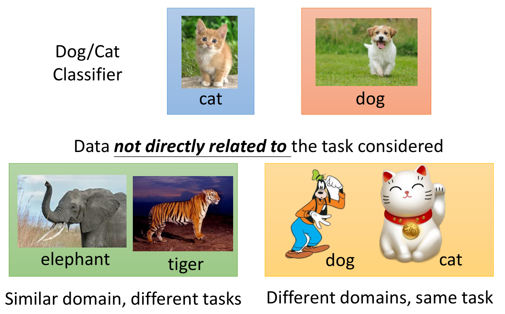

迁移学习问的问题是：我们能不能再有一些不相关data的情况下，然后帮助我们现在要做的task。

为什么要考虑迁移学习这样的task呢？

举例来说：在speech recognition里面(台语的语音辨识)，台语的data是很少的(但是语音的data是很好收集的，中文，英文等)。那我们能不能用其他语音的data来做台语这件事情。

或者在image recongnition里面有一些是medical images，你想要让机器自动诊断说，有没有 tumor 之类的，这种medical image其实是很少的，但是image data是很不缺的。

或者是在文件的分析上，你现在要分析的文件是某个很 specific 的 domain，比如说你想要分析的是，某种特别的法律的文件，那这种法律的文件或许 data 很少，但是假设你可以从网络上 collect 一大堆的 data，那这些 data，有可能是有帮助的。

用不相干的data来做domain其他的data，来帮助现在的task，是有可能的。事实上，我们在日常生活中经常会使用迁移学习，比如我们会把漫画家的生活自动迁移类比到研究生的生活。

迁移学习有很多的方法，它是很多方法的集合。下面你有可能会看到我说的terminology可能跟其他的有点不一样，不同的文献用的词汇其实是不一样的，有些人说算是迁移学习，有些人说不算是迁移学习，所以这个地方比较混乱，你只需要知道那个方法是什么就好了。

我们现在有一个我们想要做的task，有一些跟这个task有关的数据叫做**target data**，有一些跟这个task无关的data，这个data叫做**source data**。这个target data有可能是有label的，也有可能是没有label的，这个source data有可能是有label的，也有可能是没有label的，所以现在我们就有四种可能，所以之后我们会分这四种来讨论。

### Case 1

这里target data和source data都是带有标签的：

- target data：$(x^t,y^t)$，作为有效数据，通常量是很少的

  如果target data量非常少，则被称为**one-shot learning**

- source data：$(x^s, y^s)$，作为不直接相关数据，通常量是很多的

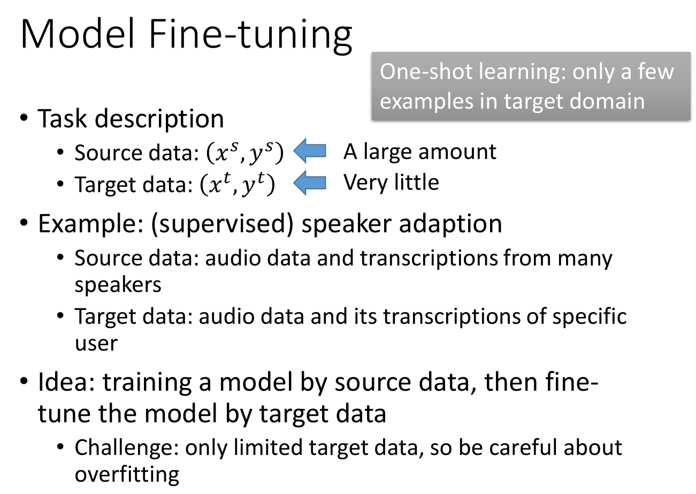

#### Model Fine-tuning

模型微调的基本思想：用source data去训练一个model，再用target data对model进行微调(fine tune)

所谓“微调”，类似于pre-training，就是把用source data训练出的model参数当做是参数的初始值，再用target data继续训练下去即可，但当target data非常少时，可能会遇到的challenge是，你在source data train出一个好的model，然后在target data上做train，可能就坏掉了。

所以训练的时候要小心，有许多技巧值得注意

##### Conservation Training

如果现在有大量的source data，比如在语音识别中有大量不同人的声音数据，可以拿它去训练一个语音识别的神经网络，而现在你拥有的target data，即特定某个人的语音数据，可能只有十几条左右，如果直接拿这些数据去再训练，肯定得不到好的结果。

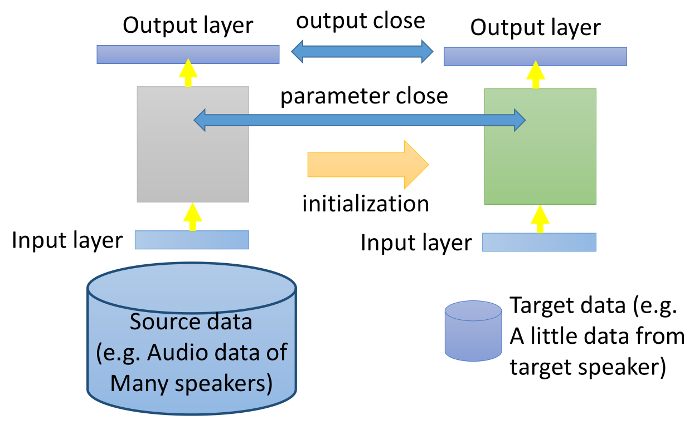

此时我们就需要在训练的时候加一些限制，让用target data训练前后的model不要相差太多：

- 我们可以让新旧两个model在看到同一笔data的时候，output越接近越好
- 或者让新旧两个model的L2 norm越小越好，参数尽可能接近
- 总之让两个model不要相差太多，防止由于target data的训练导致过拟合

注：这里的限制就类似于regularization

##### Layer Transfer

现在我们已经有一个用source data训练好的model，此时把该model的某几个layer拿出来复制到同样大小的新model里，接下来**只**用target data去训练余下的没有被复制到的layer

这样做的好处是target data只需要考虑model中非常少的参数，这样就可以避免过拟合。

如果target data足够多，fine-tune 整个model也是可以的。

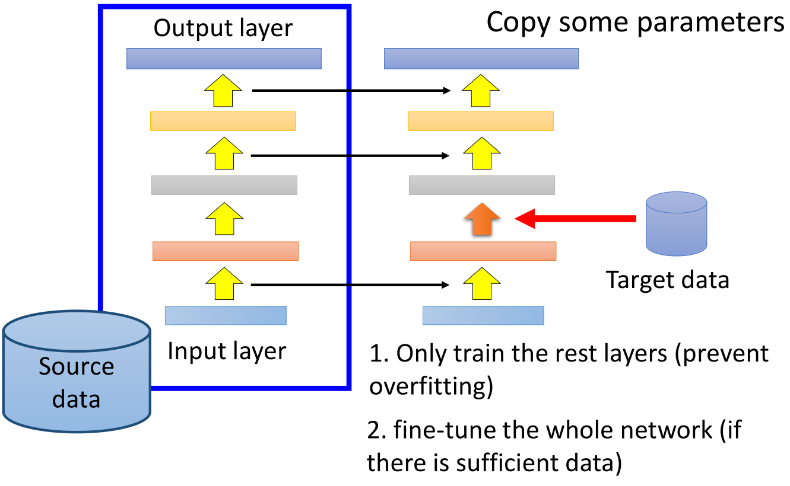

Layer Transfer是个非常常见的技巧，接下来要面对的问题是，哪些layer应该被transfer，哪些layer不应该去transfer呢？

有趣的是在不同的task上面需要被transfer的layer往往是不一样的：

- 在语音识别中，往往迁移的是最后几层layer，再重新训练与输入端相邻的那几层

  由于口腔结构不同，同样的发音方式得到的发音是不一样的，NN的前几层会从声音信号里提取出发音方式，再用后几层判断对应的词汇，从这个角度看，NN的后几层是跟特定的人没有关系的，因此可做迁移

- 在图像处理中，往往迁移的是前面几层layer，再重新训练后面的layer

  CNN在前几层通常是做最简单的识别，比如识别是否有直线斜线、是否有简单的几何图形等，这些layer的功能是可以被迁移到其它task上通用的

- case by case，运用之妙，存乎一心

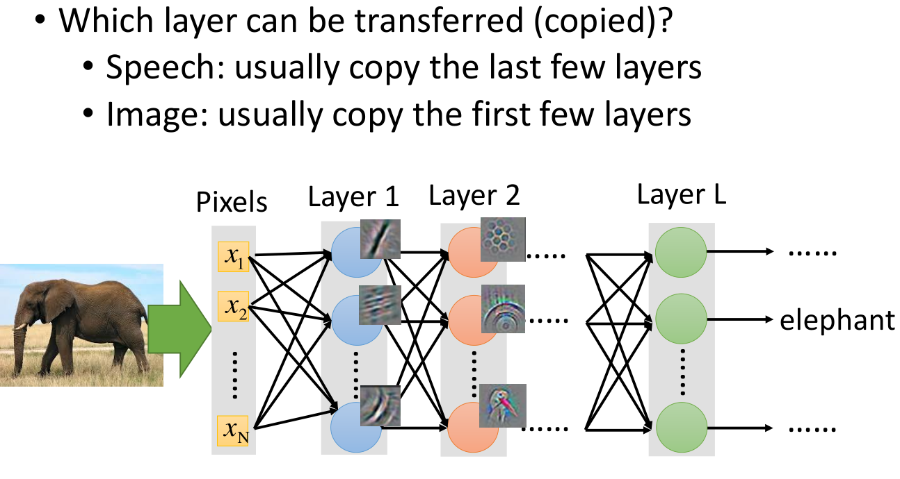

###### Demo

这边是 image 在 layer transfer 上的实验，这个实验做在 ImageNet 上，把 ImageNet 的 corpus，一百二十万张 image 分成 source 跟 target。这个分法是按照 class 来分的，我们知道 ImageNet 的 image一个 typical 的 setup 是有一千个 class，把其中五百个 class 归为 source data，把另外五百个 class 归为 target data。

横轴是我们在做 transfer learning 的时候，copy 了几个 layer。copy 0 个 layer 就代表完全没有做 transfer learning。这是一个 baseline ，就直接在 target data 上面 train 下去。纵轴是 top-1 accuracy，所以是越高越好。没有做 transfer learning 是白色这个点

 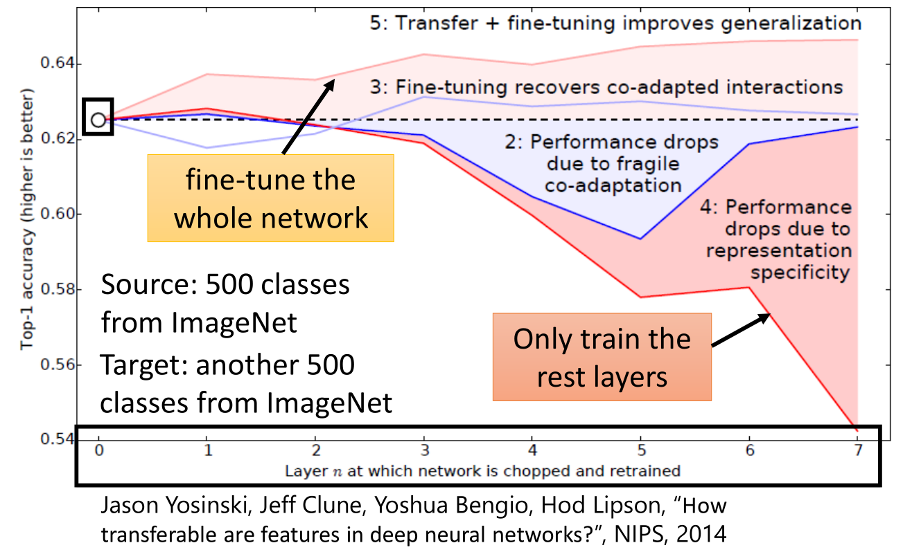

只有 copy 第一个 layer 的时候，performance 稍微有点进步，copy 前面两个 layer，performance 几乎是持平的，但是 copy 的 layer 太多，结果是会坏掉。

这个实验显示说在不同的 data 上面，train 出来的 neural network，前面几个 layer 是可以共享的，后面几个可能是没有办法共享的。如果 copy 完以后，还有 fine-tune 整个 model 的话，把第一个 layer，在 source domain 上 train 一个 model，然后把第一个 layer copy 过去以后，再用 target domain fine-tune 整个 model，包括前面 copy 过的 layer 的话，那得到 performance 是橙色这条线，在所有的 case 上面都是有进步的。

其实这个结果很 surprised，不要忘了，这可是 ImageNet 的 corpus，一般在做 transfer learning 的时候，都是假设 target domain 的 data 非常少，这边 target domain 可是有六十万张，这 target domain 的 data 是非常多的。但是就算在这个情况下，再多加了另外六十张 image 做 transfer learning，其实还是有帮助的。

这两条蓝色的线跟 transfer learning 没有关系，不过是这篇paper里面发现一个有趣的现象。他想要做一个对照组，在 target domain 上面 learn 一个 model，把前几个 layer copy 过来，再用一次 target domain 的 data train 剩下几个 layer。前面几个 layer 就 fix 住，只 train 后面几个 layer，直觉上这样做应该跟直接 train 整个 model 没有太大差别，先 train 好一个 model，fix 前面几个 layer，接下来只 train 后面几个 layer，结果有些时候是会坏掉的。他的理由是 training 的时候，前面的 layer 跟后面的 layer他们其实是要互相搭配，所以如果只 copy 前面的 layer，然后只 train 后面的 layer，后面的 layer 就没有办法跟前面的 layer 互相搭配，结果有点差。如果可以 fine-tune 整个 model 的话，performance 就跟没有 transfer learning 是一样的。这是另一个有趣的发现，作者自己对这件事情是很 surprised。

这是另外一个实验结果，红色这条线是前一页看到的红色的这条线。这边假设 source 跟 target 是比较没有关系的，把 ImageNet 的 corpus 分成 source data 跟 target data 的时候把自然界的东西，通通当作 source，target 通通是人造的东西，桌子、椅子等等。这样 transfer learning 会有什么样的影响？

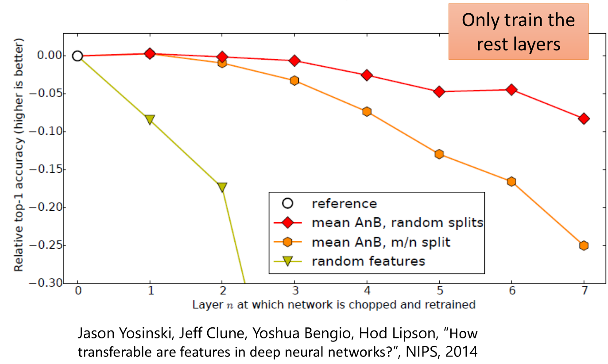

如果 source 跟 target 的 data 是差很多的，在做 transfer learning 的时候，performance 会掉的比较多，前面几个 layer 影响还是比较小的，如果只 copy 前面几个 layer，仍然跟没有 copy 是持平的，这意味着，就算是 source domain 跟 target domain 是非常不一样的，一边是自然的东西，一边是人造的东西，在 neural network 第一个 layer，他们仍然做的事情很有可能是一样的。黄色的这条线，烂掉的这条线是假设前面几个 layer 的参数是 random 的。

#### Multitask Learning

fine-tune仅考虑在target data上的表现，而多任务学习，则是同时考虑model在source data和target data上的表现

如果两个task的输入特征类似，则可以用同一个神经网络的前几层layer做相同的工作，到后几层再分方向到不同的task上，这样做的好处是前几层得到的data比较多，可以被训练得更充分。这样做的前提是：这两个task有共通性，可以共用前面几个layer。

有时候task A和task B的输入输出都不相同，两个不同task的input都用不同的neural network把它transform到同一个domain上去，中间可能有某几个 layer 是 share 的，也可以达到类似的效果

以上方法要求不同的task之间要有一定的共性，这样才有共用一部分layer的可能性

##### Multilingual Speech Recognition

多任务学习一个很成功的例子就是多语言的语音辨识，假设你现在手上有一大堆不同语言的data(法文，中文，英文等)，那你在train你的model的时候，同时可以辨识这五种不同的语言。这个model前面几个layer他们会共用参数，后面几个layer每一个语言可能会有自己的参数，这样做是合理的。虽然是不同的语言，但是都是人类所说的，所以前面几个layer它们可能是share同样的咨询，共用同样的参数。

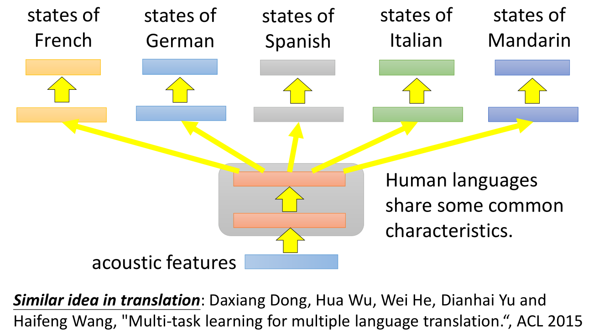

在translation上，你也可以做同样的事情，假设你今天要做中翻英，也要做中翻日，你也把这两个model一起train。在一起train的时候无论是中翻英还是中翻日，你都要把中文的data先做process，那一部分neural network就可以是两种不同语言的data共同使用。

在过去收集了十几种语言，把它们两两之间互相做transfer，做了一个很大的 N x N 的 table，每一个 case 都有进步。所以目前发现大部分case，不同人类的语言就算你觉得它们不是非常像，但是它们之间都是可以transfer的。

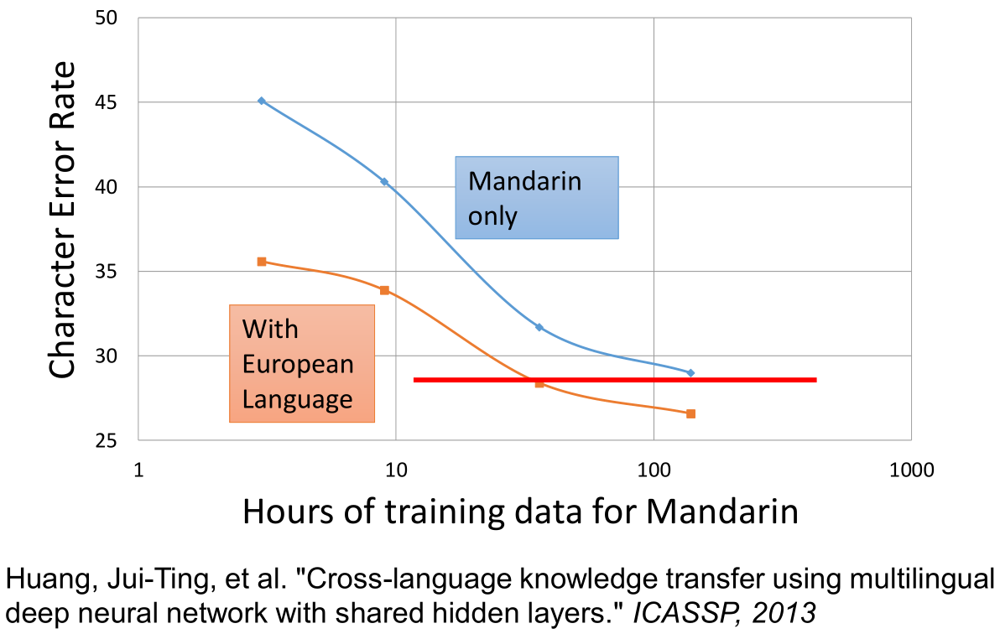

上图为从欧洲语言去transfer中文，横轴是中文的data，纵轴是character error rate。假设你一开始用中文train一个model，data很少，error rate很大，随着data越来越多，error rate就可以压到30以下。但是今天如果你有一大堆的欧洲语言，你把这些欧洲语言跟中文一起去做multi-task training，用这个欧洲语言的data来帮助中文model前面几层让它train的更好。你会发现：在中文data很少的情况下，你有做迁移学习，你就可以得到比较好的性能。随着中文data越多的时候，中文本身performance越好，就算是中文有一百小时的 data，借用一些从欧洲语言来的 knowledge，对这个辨识也是有微幅帮助的。

所以这边的好处是：假设你做多任务学习的时候，你会发现你有100多个小时跟50小时对比，如果你有做迁移学习的话，你只需要1/2的data就可以跟有两倍的data做的一样好。

常常有人会担心说：迁移学习会不会有负面的效应，这是会有可能的，如果两个task不像的话，你的transfer 就是negative的。但是有人说：总是思考两个task到底之间能不能transfer，这样很浪费时间。所以有人 propose 了 progressive neural networks

#### Progressive Neural Network

如果两个task完全不相关，硬是把它们拿来一起训练反而会起到负面效果

而在Progressive Neural Network中，每个task对应model的hidden layer的输出都会被接到后续model的hidden layer的输入上，这样做的好处是：

- task 2的data并不会影响到task 1的model，因此task 1一定不会比原来更差
- task 2虽然可以借用task 1的参数，但可以将之直接设为0，最糟的情况下就等于没有这些参数，也不会对本身的performance产生影响

- task 3也做一样的事情，同时从task 1和task 2的hidden layer中得到信息

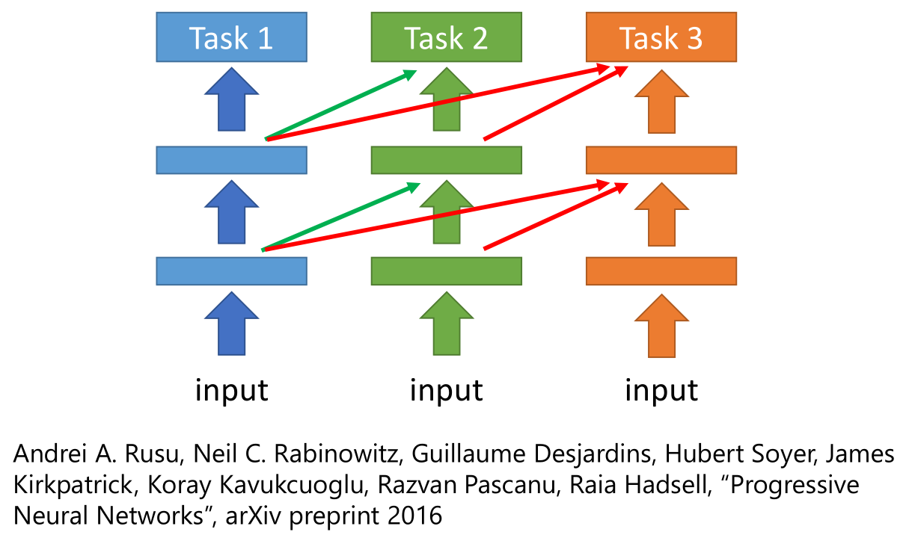

### Case 2

这里target data不带标签，而source data带标签：

- target data：$(x^t)$
- source data：$(x^s, y^s)$

举例来说：我们可以说：source data是MNIST image，target data是MNIST-M image(MNIST image加上一些奇怪的背景)。MNIST是有label的，MNIST-M是没有label的，在这种情况下我们通常是把source data就视作training data，target data视作testing data。产生的问题是：training data跟testing data是非常mismatch的。

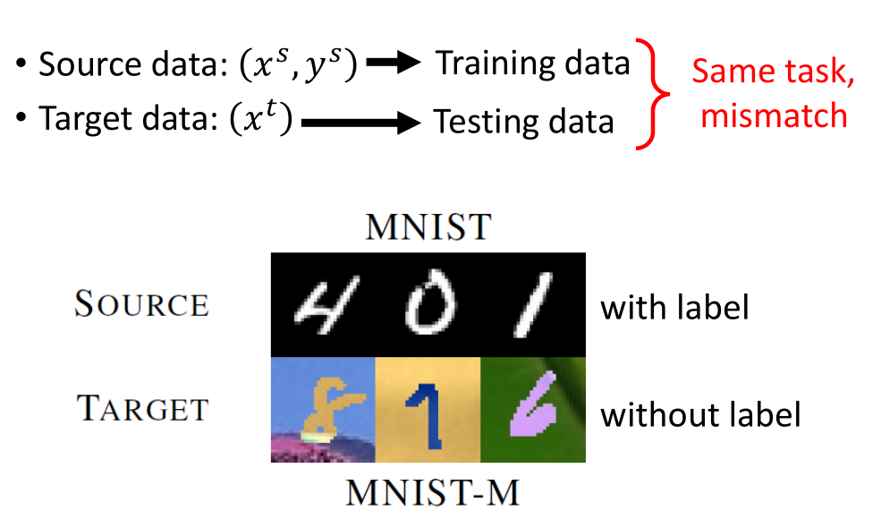

这个时候一般会把source data当做训练集，而target data当做测试集，如果不管训练集和测试集之间的差异，直接训练一个普通的model，得到的结果准确率会相当低。

实际上，神经网络的前几层可以被看作是在抽取feature，后几层则是在做classification，如果把用MNIST训练好的model所提取出的feature做t-SNSE降维后的可视化，可以发现MNIST的数据特征明显分为紫色的十团，分别代表10个数字，而作为测试集的数据却是挤成一团的红色点，因此它们的特征提取方式根本不匹配。

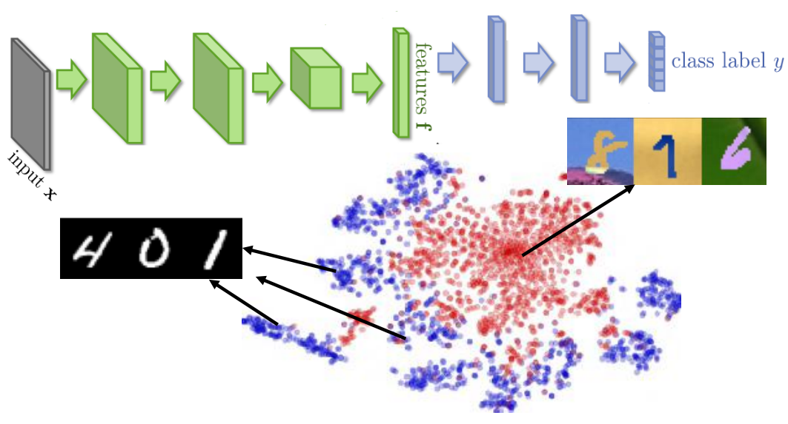

#### Domain-adversarial Training

所以该怎么办呢？希望做的事情是：前面的feature extract 它可以把domain的特性去除掉，这一招较做Domain-adversarial training。也就是feature extract output不应该是红色跟蓝色的点分成两群，而是不同的domain应该混在一起。

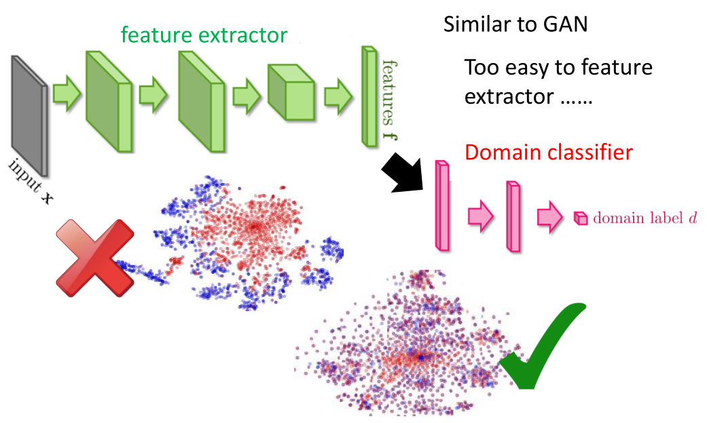

那如何learn这样的feature extract呢？这边的做法是在后面接一下domain classifier。把feature extract output丢给domain classifier，domain classifier它是一个classification task，它要做的事情就是：根据feature extract给它的feature，判断这个feature来自于哪个domain，在这个task里面，要分辨这些feature是来自MNIST还是来自与MNIST-M。

有一个generator 的output，然后又有discriminator，让它的架构非常像GAN。但是跟GAN不一样的事情是：之前在GAN那个task里面，你的generator要做的事情是产生一个image，然后骗过discriminator，这件事很难。

但是在这个Domain-adversarial training里面，要骗过domain classifier太简单了。有一个solution是：不管看到什么东西，output都是0，这样就骗过了classifier。

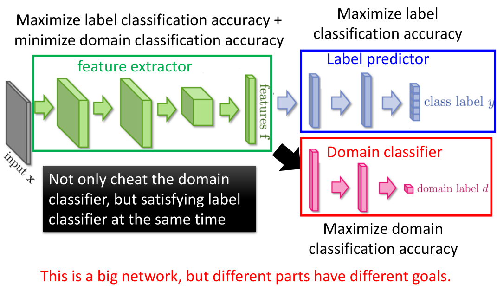

所以你要在feature extract增加它任务的难度，所以feature extract它output feature不仅要骗过domain classifier还要同时让label predictor做好。这个label predictor它就吃feature extract output，然后它的output就是10个class。

所以今天你的feature extract 不只要骗过domain classifier，还要满足label predictor的需求。抽出的feature不仅要把domain的特性消掉，同时还要保留原来feature的特性。

那我们把这三个neural放在一起的话。实际上就是一个大型的neural network，是一个各怀鬼胎的neural network(一般的neural network整个参数想要做的事情都是一样的，要minimize loss)，在这个neural network里面参数的目标是不同的。label predictor做的事情是把class分类做的正确率越高越好，domain classifier做的事情是想正确predict image是属于哪个domain。feature extractor想要做的事情是：要同时improve label predictor，同时想要minimize domain classifier accuracy，所以feature extractor 其实是在做陷害队友这件事的。

feature extractor 怎样陷害队友呢(domain classifier)？这件事情是很容易的，你只要加一个gradient reversal layer就行了。也就是你在做back-propagation( Domain classifier 计算 back propagation 有 forward 跟 backward 两个 path )，在做backward task的时候你的domain classifier传给feature extractor什么样的value，feature extractor就把它乘上一个负号。也就是domain classifier 告诉你说某个value要上升，它就故意下降。

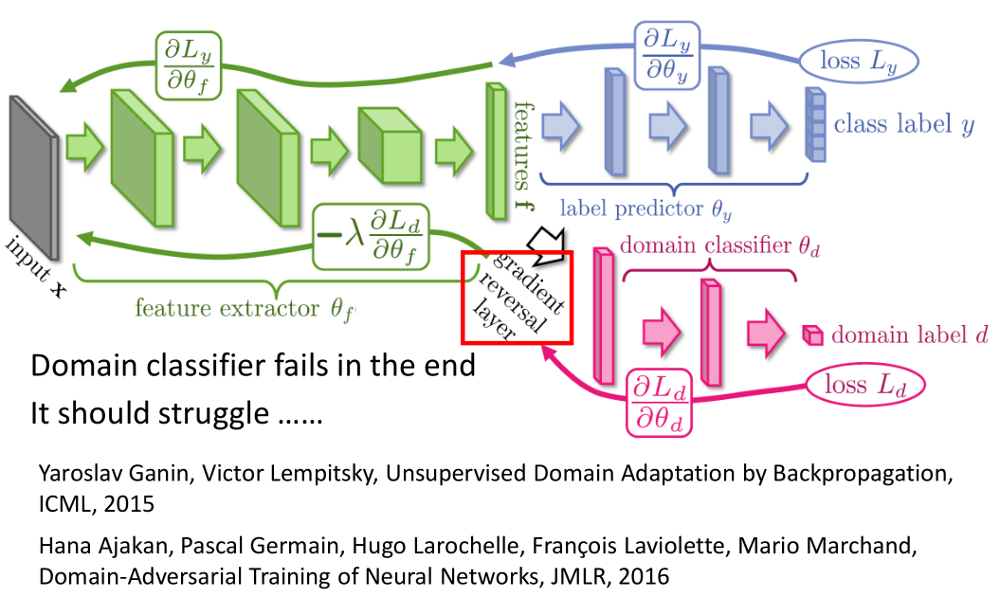

domain classifier因为看不到真正的image，所以它最后一定fail掉。因为它所能看到的东西都是feature extractor告诉它的，所以它最后一定会无法分辨feature extractor所抽出来的feature是来自哪个domain。

这个 model 原理讲起来很简单，但可能实际上的 training 可能跟 GAN 一样是没有那么好 train 的，问题就是domain classifier一定要奋力的挣扎，因为它要努力去判断现在的feature是来自哪个domain。如果 domain classifier 他比较弱、懒惰，他一下就放弃不想做了，就没有办法把前面的 feature extractor 逼到极限，就没有办法让 feature extractor 真的把 domain information remove 掉。如果 domain classifier 很 weak，他一开始就不想做了，他 output 永远都是 0 的话，那 feature extractor 胡乱弄什么 feature 都可以骗过 classifier 的话，那就达不到把 domain 特性 remove 掉的效果，这个 task 一定要让 domain classifier 奋力挣扎然后才死掉，这样才能把 feature extractor 的潜能逼到极限。

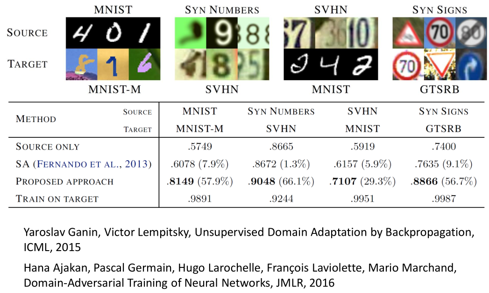

这是 paper 一些实验的结果，做不同 domain 的 transfer。如果看实验结果的话，纵轴代表用不同的方法，这边有一个 source only 的方法，直接在 source domain 上 train 一个 model，然后 test 在 target domain 上，如果只用 source only 的话，Performance 是比较差的。这边比较另一个 transfer learning 的方法，大家可以自己去看参考文献。这篇paper proposed 的方法是刚刚讲的 domain-adversarial training。

直接拿 target domain 的 data 去做 training，会得到 performance 是最下面这个 row，这其实是 performance 的 upper bound。用 source data 跟 target data train 出来的结果是天差地远的，这中间有一个很大的 gap。

如果用 domain-adversarial training 可以在不同的 case 上面都有很好的 improvement。

#### Zero-shot Learning

在zero-shot-learning里面跟刚才讲的task是一样的，source data有label，target data没有label。

在刚才task里面可以把source data当做training data，把target data当做testing data，但是实际上在zero-shot learning里面，它的define又更加严格一点。它的define是：今天在source data和target data里面，它的task是不一样的。

比如说在影像上面(你可能要分辨猫跟狗)，你的source data可能有猫的class，也有狗的class。但是你的target data里面image是草泥马，在source data里面是从来没有出现过草泥马的，如果machine看到草泥马，就未免有点强人所难了。但是这个task在语音上很早就有solution了，其实语音是常常会遇到zero-shot learning的问题。

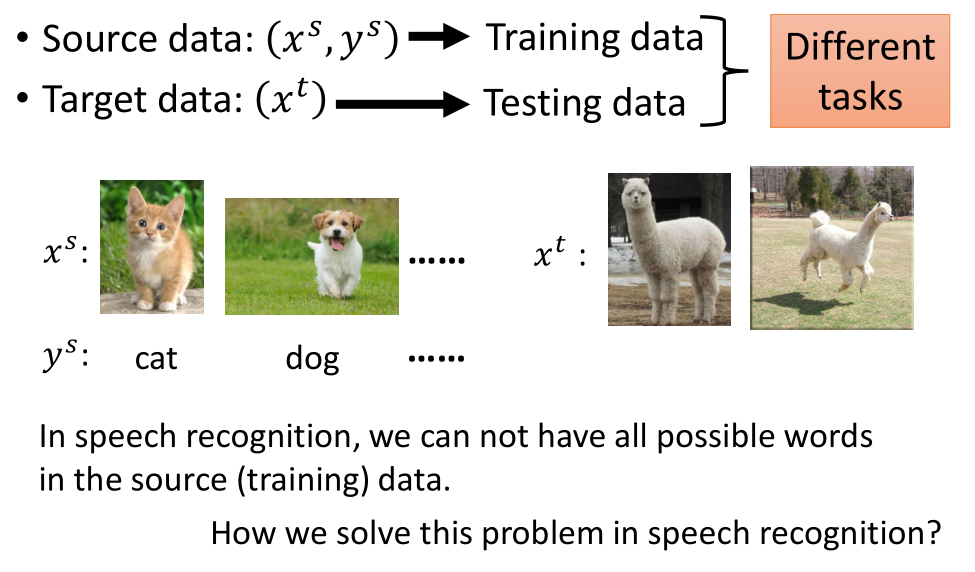

假如我们把不同的word都当做一个class的话，那本来在training的时候跟testing的时候就有可能看到不同的词汇。你的testing data本来就有一些词汇是在training的时候是没有看过的。

那在语音上我们如何来解决这个问题呢？不要直接去辨识一段声音是属于哪一个word，我们辨识的是一段声音是属于哪一个phoneme。然后我们在做一个phoneme跟table对应关系的表，这个东西也就是lexicon(词典)。在辨识的时候只要辨识出phoneme就好，再去查表说：这个phoneme对应到哪一个word。

这样就算有一些word是没有在training data里面的，它只要在lexicon里面出现过，你的model可以正确辨识出声音是属于哪一个phoneme的话，你就可以处理这个问题。

##### Attribute embedding 

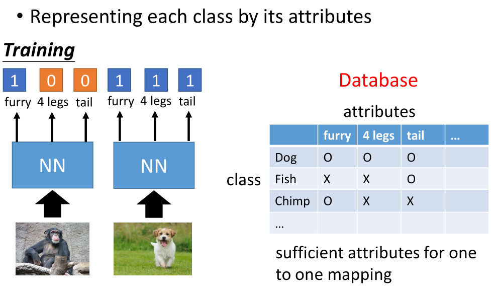

在影像上我们可以把每一个class用它的attribute来表示，也就是说：你有一个database，这个database里面会有所以不同可能的object跟它的特性。假设你要辨识的是动物，但是你training data跟testing data他们的动物是不一样的。但是你有一个database，这个database告诉你说：每一种动物它是有什么样的特性。比如狗就是毛茸茸，四只脚，有尾巴；鱼是有尾巴但不是毛茸茸，没有脚。

这个attribute要更丰富，每一个class都要有不一样的attribute(如果两个class有相同的attribute的话，方法会fail掉)。那在training的时候，我们不直接辨识每一张image是属于哪一个class，而是去辨识：每一张image里面它具备什么样的attribute。所以你的neural network target就是说：看到猩猩的图，就要说：这是一个毛茸茸的动物，没有四只脚，没有尾巴。看到狗的图就要说：这是毛茸茸的动物，有四只脚，有尾巴。

那在testing的时候，就算今天来了你从来没有见过的image，也是没有关系的。你今天neural network target也不是input image判断它是哪一种动物，而是input这一张image判断具有什么样的attribute。所以input你从来没有见过的动物，你只要把它的attribute找出来，然后你就查表看说：在database里面哪一种动物它的attribute跟你现在model output最接近。有时可能没有一摸一样的也是没有关系的，看谁最接近，那个动物就是你要找的。

 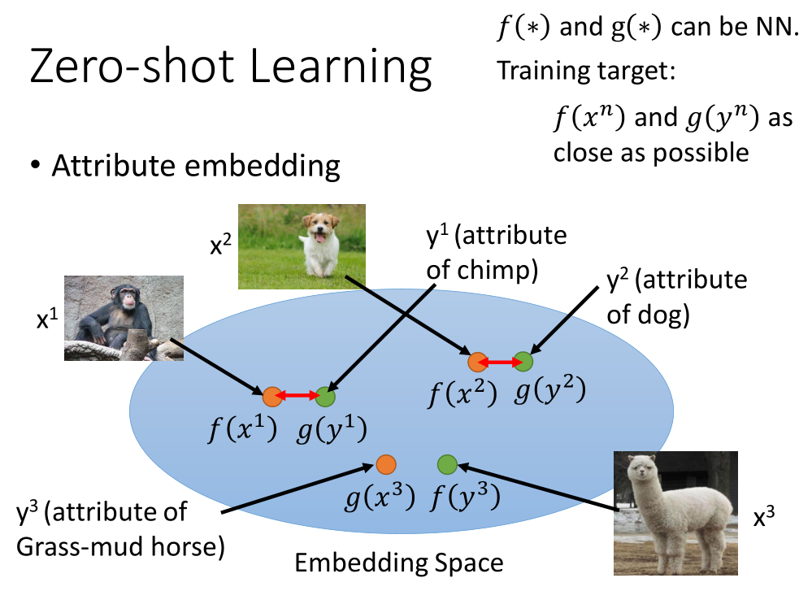

那有时候你的attribute可能非常的复杂(attribute dimension非常大)，你可以做attribute embedding。也就是说现在有一个embedding space，把training data每一个image都通过一个transform，变成一个embedding space上的一个点。然后把所有的attribute也都变成embedding space上的一个点，这个$g(*)$跟$f(*)$都可以是neural network，那training的时候希望f跟g越接近越好。那在testing的时候如果有一张没有看过的image，你就可以说这张image attribute embedding以后跟哪个attribute最像，那你就可以知道它是什么样的image。

image跟attribute都可以描述为vector，要做的事情就是把attribute跟image都投影到同一个空间里面。也就是说：你可以想象成是对image的vector，也就是图中的x，跟attribute的vector，也就是图中的y都做降维，然后都降到同一个dimension。所以你把x通过一个function f都变成embedding space上的vector，把y通过另外一个function g也都变成embedding space上的vector。

但是咋样找这个f跟g呢？你可以说f跟g就是neural network。input一张image它变成一个vector，或者input attribute 变成一个vector。training target是你希望说：假设我们已经知道$y^1$是$x^1$的attribute，$y^2$是$x^2$的attribute，那你就希望说找到一个f跟g，它可以让$x^1$跟$y^1$投影到embedding space以后越接近越好，$x^2$跟$y^2$投影到embedding space以后越接近越好。

那现在把f跟g找出来了，那现在假如有一张你从来没见过的image $x^3$在你的testing data里面，它也可以通过这个f变成embedding space上面的一个vector，接下来你就可以说这个embedding vector它跟$y^3$最接近，那$y^3$就是它的attribute，再来确定是哪个动物。

##### Attribute embedding + word embedding

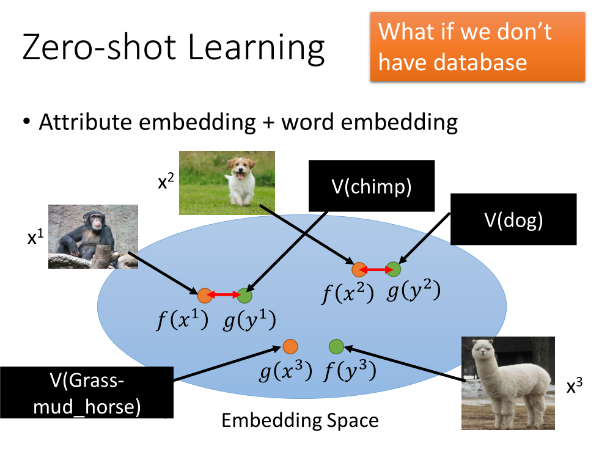

又是你会遇到一个问题，如果我没有database呢？我根本不知道每一个动物的attribute是什么，怎么办呢？

可以借用 word vector，word vector 的每一个 dimension 就代表了现在这个 word的某种 attribute。所以不一定需要有个 database 去告诉你每一个动物的 attribute 是什么。假设有一组 word vector，这组 word vector

里面你知道每个动物他对应的 word 的 word vector，这 word vector 你可以拿一个很大的 corpus，比如说 Wikipedia train 出来，就可以把 attribute 直接换成 word vector，所以把 attribute 通通换成那个 word 的 word vector，再做跟刚才一样的 embedding，就结束了。

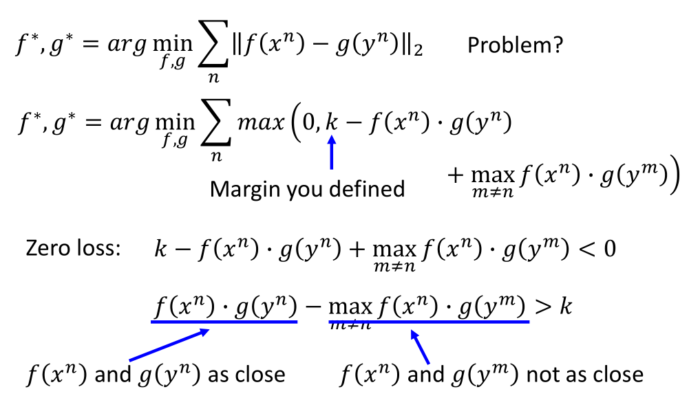

这个loss function存在些问题，它会让model把所有不同的x和y都投影到同一个点上：
$$
f^*,g^*=\arg \min\limits_{f,g} \sum\limits_n ||f(x^n)-g(y^n)||_2
$$
类似用t-SNE的思想，我们既要考虑同一对$x^n$和$y^n$距离要接近，又要考虑不属于同一对的$x^n$与$y^m$距离要拉大(这是前面的式子没有考虑到的)，于是有：
$$
f^*,g^*=\arg \min\limits_{f,g} \sum\limits_n \max(0, k-f(x^n)\cdot g(y^n)+\max\limits_{m\ne n} f(x^n)\cdot g(y^m))
$$
0loss的情况是：$x^n$跟$y^n$之间的inner product大过所有其它的$y^m$跟$x^n$之间的inner product，而且要大过一个margin k

##### Convex Combination of Semantic Embedding

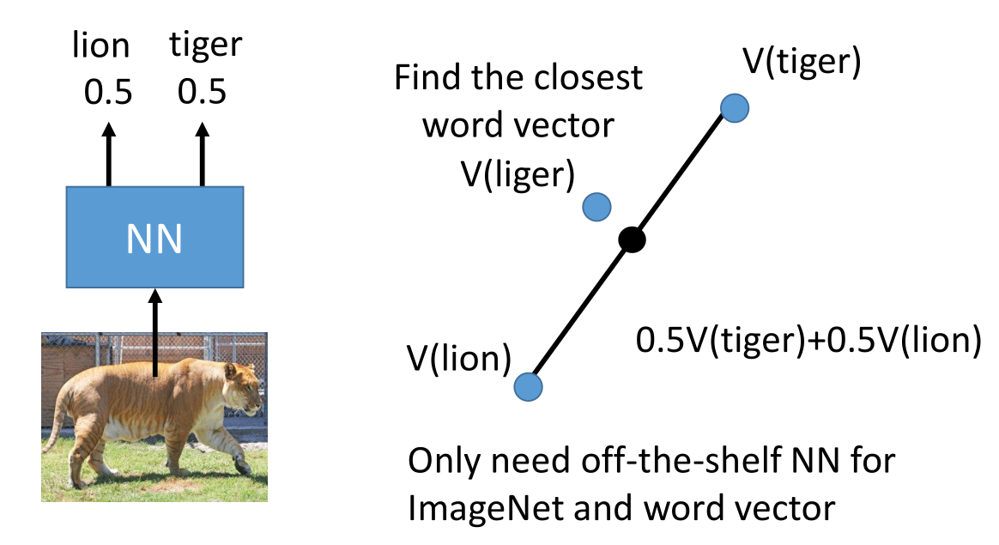

还有另外一个简单的Zero-Shot learning的方法叫做convex combination of semantic embedding。这个方法是说：在这边不需要做任何 training，就可以做 transfer learning。假设有一个 off-the-shelf 识别系统，跟一个 off-the-shelf 的 word vector。这两个可能不是自己 train，或网络上载下来的。

我把一张图丢到neural network里面去，它的output没有办法决定是哪一个class，但它觉得有0.5的机率是lion，有0.5的机率是tiger。接下来去找lion跟tiger的word vector，然后把 lion 跟 tiger 的 word vector 用 1:1 的比例混合，0.5 tiger 的 vector 加 0.5 lion 的 vector，得到另外一个新的 vector。再看哪个word的vector跟这个混合之后的结果最接近。假设是liger最接近，那这个东西就是liger。

##### Example of Zero-shot Learning

在training的时候，machine看过如何把英文翻译成韩文，知道咋样把韩文翻译为英文，知道咋样把英文翻译为日文，知道咋样把日文翻译为英文。但是它从来没有看过日文翻译韩文的data，但是可以翻，但是它从来没有看过韩文翻译日文的data，但是可以翻。

为什么zero-shot在这个task上是可行的呢？如果你今天用同一个model做了不同语言之间的translation以后，machine可以学到的事情是：对不同语言的input 句子都可以project到同一个space上面。

在training的时候，machine看过如何把英文翻译成韩文，知道咋样把韩文翻译为英文，知道咋样把英文翻译为日文，知道咋样把日文翻译为英文。但是它从来没有看过日文翻译韩文的data，但是可以翻，但是它从来没有看过韩文翻译日文的data，但是可以翻。

为什么zero-shot在这个task上是可行的呢？如果你今天用同一个model做了不同语言之间的translation以后，machine可以学到的事情是：对不同语言的input 句子都可以project到同一个space上面。

我们现在根据我们learn好的translation，那个translation有一个encoder，它会把你input的句子变成vector，decoder根据这个vector解回一个句子，就是翻译的结果。那今天我们把不同语言都丢到这个encoder里面让它变成vector的话，那这些不同语言的不同句子在这个space上面有什么不一样的关系呢？

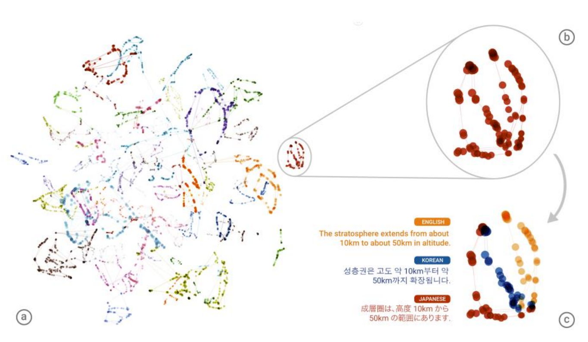

它发现说今天有日文、英文、韩文这三个句子，这三个句子讲的是同一件事情，通过encoder embedding以后再space上面其实是差不多的位置。在左边这个图上面不同的颜色代表说：不同语言的用一个意思的句子。所以你这样说：machine发明了一个新语言也是可以接受的，如果你把这个embedding space当做一个新的语言的话。machine做的是：发现可一个sequence language，每一种不同的语言都先要先转成它知道的sequence language，在用这个sequence language转为另外一种语言。

所以今天就算是某一个翻译task ，你的input语言和output语言machine没有看过，它也可以通过过这种自己学出来的sequence language来做translation。

### Case 3 & 4

刚刚讲的状况都是 source data 有 label 的状况，有时候会遇到 source data 没有 label 的状况。

target data 有 label，source data 没有 label，这种是 Self-taught learning

target data 没有 label，source data 也没有 label，这种是 Self-taught clustering

有一个要强调的是 Self-taught learning 跟 source data 是 unlabeled data，target data 是 labeled data

这也是一种 semi-supervised learning。这种 semi-supervised learning 跟一般 semi-supervised learning 有一些不一样，一般 semi-supervised learning 会假设那些 unlabeled data 至少还是跟 labeled data是比较有关系的。但在 Self-taught learning 里面，那些 unlabeled data、那些 source data，跟 target data 关系比较远。

其实 Self-taught learning 概念很简单，假设 source data 够多，虽然它是 unlabeled，可以去 learn 一个 feature extractor，在原始的 Self-taught learning paper 里面，他的 feature extractor 是 sparse coding。因为这 paper 比较旧，大概十年前，现在也不见得要用 sparse coding 也可以 learn，比如说 auto-encoder。

总之，有大量的 data，他们没有 label，可以做的是用这些 data learn 一个好的 feature extractor，learn 一个好的 representation。用这个 feature extractor 在 target data 上面去抽 feature。

在 Self-taught learning 原始的 paper 里面，其实做了很多 task，这这些 task 都显示 Self-taught learning 是可以得到显著 improvement的。

Learning to extract better representation from the source data (unsupervised approach)

Extracting better representation for target data

### Concluding Remarks 

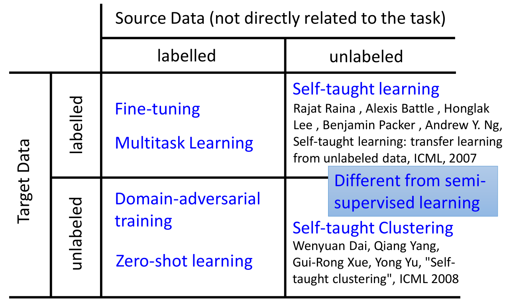

## 

# Meta Learning

## Meta Learning

Meta learning 总体来说就是让机器学习如何学习。

如上图，我们希望机器在学过一些任务以后，它学会如何去学习更有效率，也就是说它会成为一个更优秀的学习者，因为它学会了**学习的技巧**。举例来说，我们教机器学会了语音辨识、图像识别等模型以后，它就可以在文本分类任务上做的更快更好，虽然说语音辨识、图像识别和文本分类没什么直接的关系，但是我们希望机器从先前的任务学习中学会了学习的技巧。

讲到这里，你可能会觉得Meta Learning 和 Life-Long Learning 有点像，确实很像，但是 Life-Long Learning 的着眼点是用同一个模型apply 到不同的任务上，让一个模型可以不断地学会新的任务，而Meta Learning 中不同的任务有不同的模型，我们的着眼点是机器可以从过去的学习中学到学习的方法，让它在以后的学习中更快更好。

我们先来看一下传统的ML 的做法：

我们过去学过的ML ，通常来说就是定义一个学习算法，然后用训练数据train ，吐出一组参数（或者说一个参数已定的函数式），也就是得到了模型，这个模型可以告诉我们测试数据应该对应的结果。比如我们做猫狗分类，train 完以后，给模型一个猫的照片，它就会告诉我们这是一只猫。

我们把学习算法记为 $F$ ，这个学习算法吃training data 然后吐出目标模型 $f^*$ ，形式化记作：
$$
f^* = F(D_{train})
$$
Meta Learning 就是要让机器自动的找一个可以吃training data 吐出函数 $f^*$ 的函数 $F$ 。

总结一下：

Machine Learning 和Meta Learning 都是让机器找一个function ，只不过要找的function 是不一样的。

我们知道Machine Learning 一共分三步（如下图），Meta Learning 也是一样的，你只要把**Function $f$** 换成**学习的算法 $F$ **这就是Meta Learning 的步骤：

1. 我们先定义一组Learning 的Algorithm 我们不知道哪一个算法是比较好的，

2. 然后定义一个Learning Algorithm 的Loss ，它会告诉你某个算法的好坏，

3. 最后，去train 一发找出哪个Learning Algorithm比较好。

所以接下来我们将分三部分来讲Meta Learning 的具体过程。

### Three Step of Meta-Learning

#### Define a set of learning algorithm

什么是一组learning algorithm 呢？

如上图所示，灰色框中的，包括网络（模型）架构，初始化参数的方法，更新参数的方法，学习率等要素构成的整个process ，可以被称为一个learning algorithm 。在训练的过程中有很多要素（图中的红色方框）都是人设计的，当我们选择不同的设计的时候就相当于得到了不同的learning algorithm 。现在，我们考虑能不能让机器自己学出某一环节，或者全部process 的设计。比如说，我们用不同的初始化方法得到不同的初始化参数以后，保持训练方法其他部分的相同，且用相同的数据来训练模型，最后都会得到不同的模型，那我们就考虑能不能让机器自己学会初始化参数，直接得到最好的一组初始化参数，用于训练。

我们就希望通过Meta Learning 学习到初始化参数这件事，好，现在我们有了一组learning algorithm ，其中各个算法只有初始化参数的方法未知，是希望机器通过学习得出来的。

那现在我们怎么衡量一个learning algorithm 的好坏呢？

#### Define the goodness of a function F

我们需要很多个task，每个task都有training set 和testing set，然后就把learning algorithm 应用到每个task上，用training set 训练，用testing set 测试，得到每一个task 的loss $l^i$，对于一个learning algorithm $F$ 的整体loss 就可以用每个task 的loss 进行求和。
$$
L(F) = \sum\limits_{n=1}^{N}l^n
$$

从这里我们就能看出，meta learning 和传统的machine learning 在训练资料上是有些不同的：

做meta learning 的话你可能需要准备成百上千个task，每个task 都有自己的training set 和testing set 。这里为了区分，我们把meta learning的训练集叫做Training Tasks，测试集叫做Testing Tasks，其中中每个task 的训练集叫做Support set ，测试集叫做 Query set 。

Widely considered in few-shot learning，常常和few-shot learning搭配使用

讲到这里你可能觉得比较抽象，后面会讲到实际的例子，你可能就理解了meta learning 的实际运作方法。Meta learning 有很多方法，加下来会讲几个比较常见的算法，本节课会讲到一个最有名的叫做MAML ，以及MAML 的变形叫做Reptile 。

#### Find the best function $F^*$

定好了loss function 以后我们就要找一个最好的$F^*$ ，这个$F^*$可以使所有的training tasks 的loss 之和最小，形式化的写作下图下面的公式（具体计算方法后面再讲）：

现在我们就有了meta learning 的algorithm ，我们可以用testing tasks 测试这个$F^*$。把测试任务的训练集放丢入Learning Algorithm $F^*$，就会得到一个$f^*$ ，再用测试任务的测试集去计算这个$f^*$ 的loss ，这个loss 就是整个meta learning algorithm 的loss ，来衡量这个方法的好坏。

### Omniglot Corpus

这是一个corpus，这里面有一大堆奇怪的符号，总共有1623个不同的符号，每个符号有20个不同的范例。上图下侧就是那些符号，右上角是一个符号的20个范例。

#### Few-shot Classification

N-ways K-shot classification 的意思是，分N个类别，每个类别有K个样例。

所以，20 ways 1shot 就是说分20类，每类只有1个样例。这个任务的数据集就例如上图中间的20张support set 和1张query set 。

- 把符号集分为训练符号集和测试符号集
  - 从训练符号集中随机抽N个符号，从这N个符号的范例中各随机抽K个样本，这就组成了一个训练任务training task 。
  - 从测试符号集中随机抽N个符号，从这N个符号的范例中各随机抽K个样本，这就组成了一个测试任务testing task 。

### Techniques Today

这两个大概是最近（2019年）比较火的吧，Reptile 可以参考一下openai的这篇文章。

> [Reptile: A Scalable Meta-Learning Algorithm (openai.com)](https://openai.com/blog/reptile/)

MAML

- Chelsea Finn, Pieter Abbeel, and Sergey Levine, “Model-Agnostic Meta-Learning for Fast Adaptation of Deep Networks”, ICML, 2017

Reptile

- Alex Nichol, Joshua Achiam, John Schulman, On First-Order Meta-Learning Algorithms, arXiv, 2018

### MAML

MAML要做的就是学一个初始化的参数。过去你在做初始化参数的时候你可能要从一个distribution 中sample 出来，现在我们希望通过学习，机器可以自己给出一组最好的初始化参数。

做法就如上图所示，我们先拿一组初始化参数 $\phi$ 去各个training task 做训练，在第n个task 上得到的最终参数记作 $\hat{θ}^n$ ，而$l^n(\hat{θ}^n)$ 代表第n个task 在其testing set 上的loss，此时整个MAML 算法的Loss 记作：
$$
L(\phi) = \sum\limits_{n=1}^{N}l^n(\hat{θ}^n)
$$
这里提示一下，MAML就是属于需要所有任务的网络架构相同的meta learning algorithm，因为其中所有的function 要共用相同的初始化参数 $\phi$ 。

那怎么minimize $L(\phi)$ 呢？

答案就是Gradient Descent，你只要能得到 $L(\phi)$ 对 $\phi$ 的梯度，那就可以更新 $\phi$ 了，结束。
$$
\phi = \phi - \eta \nabla_{\phi}L(\phi)
$$
这里我们先假装已经会算这个梯度了，先把这个梯度更新参数的思路理解就好，我们先来看一下MAML 和 Model Pre-training 在Loss Function 上的区别。

#### MAML v.s. Model Pre-training

通过上图我们仔细对比两个损失函数，可以看出，MAML是根据训练完的参数 $\hat{θ}^n$ 计算损失，计算的是训练好的参数在各个task 的训练集上的损失；而预训练模型的损失函数则是根据当前初始化的参数计算损失，计算的是当前参数在要应用pre-training 的task 上的损失。

再举一个形象一点的例子：

（横轴是模型参数，简化为一个参数，纵轴是loss）

如上图说的，我们在意的是这个初始化参数经过各个task 训练以后的参数在对应任务上的表现，也就是说如果初始参数 $\phi$ 在中间位置（如上图），可能这个位置根据当前参数计算的总体loss 不是最好的，但是在各个任务上经过训练以后 $\hatθ$ 都能得到较低的loss（如 $\hat{θ}^1$、$\hat{θ}^2$），那这个初始参数 $\phi$ 就是好的，其loss 就是小的。

反之，在Model pre-training 上：

我们希望直接通过这个 $\phi$ 计算出来的各个task 的loss 是最小的，所以它的取值点就可能会是上图的样子。此时在task 2上初始参数可能不能够被更新到global minima，会卡在local minima 的点 $\hat{θ}^2$。

综上所述：

MAML 是要找一个 $\phi$ 在**训练以后**具有好的表现，注重参数的潜力，Model Pre-training 是要找一个 $\phi$ 在训练任务上得到好的结果，注重现在的表现。

#### One-Step Training

在MAML 中我们假设只update 参数一次。所以在训练阶段，你只做one-step training ，参数更新公式就变成
$$
\hat{\theta}=\phi-\varepsilon \nabla_{\phi} l(\phi)
$$
只更新一次是有些理由的：

- 为了速度，多次计算梯度更新参数是比较耗时的，而且MAML 要train 很多个task
- 把只更新一次就得到好的performance作为目标，这种情况下初始化参数是好的参数
- 实际上你可以在training 的时候update 一次，在测试的时候，解testing task 的时候多update 几次，结果可能就会更好
- 如果是few-shot learning 的task，由于data 很少，update 很多次很容易overfitting

#### Toy Example

- 要拟合的目标函数是 $y=asin(x+b)$ 
- 对每个函数，也就是每个task，sample k个点
- 通过这些点做拟合

我们只要sample 不同的a, b就可以得到不同的目标函数。

来看看对比结果：

可以看到，预训练模型想要让参数在所有的training task上都做好，也就是一大堆sin函数，多个task叠加起来，导致预训练模型的参数最后拟合得到的是一条直线。

MAML的结果直接用上去是绿色的线，在测试task 上training step 增加的过程中有明显的拟合效果提升。

#### Omniglot & Mini-ImageNet

在MAML 的原始论文中也把这个技术用于Omniglot & Mini-ImageNet

> https://arxiv.org/abs/1703.03400

我们看上图下侧，MAML, first order approx 和 MAML 的结果很相似，那first order approx 是怎么做的呢？解释这个东西需要一点点数学：

#### first-order approximation

MAML 的参数更新方法如上图左上角灰色方框所示，我们来具体看看这个 $\nabla_\phi L(\phi)$ 怎么算，把灰框第二条公式带入，如黄色框所示。其中 $\nabla_\phi l^n(\hat{θ}^n)$ 就是左下角所示，它就是loss 对初始参数集 $\phi$ 的每个分量的偏微分。也就是说 $\phi_i$ 的变化会通过 $\hat{θ}$ 中的每个参数 $\hat{θ}_i$ ，影响到最终训练出来的 $\hat{θ}$ ，所以根据chain rule 你就可以把左下角的每个偏微分写成上图中间的公式。
$$
\frac{\partial{l(\hat{θ})}}{\partial{\phi_i}} = \sum\limits_{j}\frac{\partial{l(\hat{θ})}}{\partial\hat{θ}_j}\frac{\partial\hat{θ}_j}{\partial{\phi}_i}
$$
上式中前面的项 $\frac{\partial{l(\hat{θ})}}{\partial\hat{θ}_j}$ 是容易得到的，具体的计算公式取决于你的model 的loss function ，比如cross entropy 或者regression，结果的数值却决于你的训练数据的测试集。

后面的项 $\frac{\partial\hat{θ}_j}{\partial{\phi}_i}$ 是需要我们算一下。可以分成两个情况来考虑：

根据灰色框中第三个式子，我们知道 $\hat{θ}_j$ 可以用下式代替：
$$
\hat{θ}_j = \phi_j - \epsilon\frac{\partial{l(\phi)}}{\partial{\phi_j}}
$$
此时，对于 $\frac{\partial\hat{θ}_j}{\partial{\phi}_i}$ 这一项，分为i=j 和 i!=j 两种情况考虑，如上图所示。在MAML 的论文中，作者提出一个想法，不计算二次微分这一项。如果不计算二次微分，式子就变得非常简单，我们只需要考虑i=j 的情况，i!=j 时偏微分的答案总是0。

此时， $\frac{\partial{l(\hat{θ})}}{\partial\phi_i}$ 就等于 $\frac{\partial{l(\hat{θ})}}{\partial{θ}_i}$ 。这样后一项也解决了，那就可以算出上图左下角 $\nabla_\phi l(\hat{θ})$ ，就可以算出上图黄色框  $\nabla_\phi L(\phi)$ ，就可以根据灰色框第一条公式更新 $\phi$ ，结束。

在原始paper 中作者把，去掉二次微分这件事，称作using a first-order approximation 。

当我们把二次微分去掉以后，上图左下角的 $\nabla_\phi l(\hat{θ})$ 就变成 $\nabla_\hat{θ} l(\hat{θ})$ ，所以我们就是再用 $\hat{θ}$ 直接对 $\hat{θ}$ 做偏微分，就变得简单很多。

#### Real Implementation

实际上，我们在MAML 中每次训练的时候会拿一个task batch 去做。如上图，当我们初始化好参数 $\phi_0$ 我们就开始进行训练，sample出task m，完成task m训练以后，根据一次update 得到 $\hat{θ}^m$ ，我们再计算一下 $\hat{θ}^m$ 对它的loss function 的偏微分，也就是说我们虽然只需要update 一次参数就可以得到最好的参数，但现在我们update 两次参数， $\phi $ 的更新方向就和第二次更新参数的方向相同，可能大小不一样，毕竟它们的learning rate 不一样。

刚才我们讲了在精神上MAML 和Model Pre-training 的不同，现在我们来看看这两者在实际运作上的不同。如上图，预训练的参数更新完全和每个task 的gradient 的方向相同。

#### Translation

这里有一个把MAML 应用到机器翻译的例子：

18个不同的task：18种不同语言翻译成英文

2个验证task：2种不同语言翻译成英文

Ro 是validation tasks 中的任务，Fi 即没有出现在training tasks 也没出现在validation tasks，是test的结果

横轴是每个task 中的训练资料量。MetaNMT 是MAML 的结果，MultiNMT 是 Model Pre-training 的结果，我们可以看到在所有case上面，前者都好过后者，尤其是在训练资料量少的情况下，MAML 更能发挥优势。

### Reptile

做法就是初始化参数 $\phi_0$ 以后，通过在task m上训练更新参数，可以多更新几次，然后根据最后的 $\hat{θ}^m$ 更新 $\phi_0$ ，同样的继续，训练在task n以后，多更新几次参数，得到 $\hat{θ}^n$ ，据此更新 $\phi_1$ ，如此往复。

你可能会说，这不是和预训练很像吗，都是根据参数的更新来更新初始参数，希望最后的参数在所有的任务上都能得到很好的表现。作者自己也说，如上图下侧。

通过上图来对比三者在更新参数 $\phi$ 的不同，似乎Reptile 在综合两者。但是Reptile 并没有限制你只能走两步，所以如果你多更新几次参数多走几步，或许Reptile 可以考虑到另外两者没有考虑到的东西。

上图中，蓝色的特别惨的线是pre-training ，所以说和预训练比起来meta learning 的效果要好一些。

### More...

上面所有的讨论都是在初始化参数这件事上，让机器自己学习，那有没有其他部分可以让机器学习呢，当然有很多。

比如说，学习网络结构和激活函数、学习如何更新参数......

[Automatically Determining Hyperparameters](https://www.youtube.com/watch?v=c10nxBcSH1) AutoML

### Think about it...

我们使用MAML 或Reptile 来寻找最好的初始化参数，但是这个算法本身也需要初始化参数，那我们是不是也要训练一个模型找到这个模型的初始化参数......

就好像说神话中说世界在乌龟背上，那这只乌龟应该在另一只乌龟背上......

### Crazy Idea?

传统的机器学习和深度学习的算法基本上都还是gradient descent ，你能不能做一个更厉害的算法，只要我们给他所有的training data 它就可以返回给我们需要model，它是不是梯度下降train 出来的不重要，它只要能给我一个能完成这个任务的model 就好。

或者，反之我们最后都要应用到测试集上，那我们干脆就搞一个大黑箱，把training set 和testing set 全部丢给他，它直接返回testing data 的结果，连测试都帮你做好。这些想法能不能做到，留到下一节讲。

### Gradient Descent as LSTM

上节课讲了MAML 和Reptile ，我们说Meta Learning 就是要让机器自己learn 出一个learning 的algorithm。今天我们要讲怎么把我们熟悉的learning algorithm ：Gradient Descent ，当作一个LSTM 来看待，你直接把这个LSTM train下去，你就train 出了Gradient Descent 这样的Algorithm 。（也就是说我现在要把学习算法，即参数的更新算法当作未知数，用Meta Learning 训练出来）

上周我们讲的MAML 和Reptile 都是在Initial Parameters 上做文章，用Meta Learning 训练出一组好的初始化参数，现在我们希望能更进一步，通过Meta Learning 训练出一个好的参数update 算法，上图黄色方块。

我们可以把整个Meta Learning 的算法看作RNN，它和RNN 有点像的，同样都是每次吃一个batch 的data ，RNN 中的memory 可以类比到Meta Learning 中的参数 $\theta$ 。

把这个Meta Learning 的算法看作RNN 的思想主要出自两篇paper ：

> [Optimization as a Model for Few-Shot Learning | OpenReview](https://openreview.net/forum?id=rJY0-Kcll&noteId=ryq49XyLg)
>
> Sachin Ravi, Hugo Larochelle
>
> [[1606.04474\] Learning to learn by gradient descent by gradient descent (arxiv.org)](https://arxiv.org/abs/1606.04474)
> Marcin Andrychowicz, Misha Denil, Sergio Gomez, Matthew W. Hoffman, David Pfau, Tom Schaul, Brendan Shillingford, Nando de Freitas

第二篇文章的题目非常有趣，也说明了此篇文章的中心：让机器学习用梯度下降学习这件事，使用的方法就是梯度下降。

#### Review: RNN

从与之前略微不同的角度快速回顾一下RNN。

RNN就是一个function $f$，这个函数吃$h,x$ 吐出 $h',y$  ，每个step 会有一个$x$（训练样本数据）作为input，还有一个初始的memory 的值 $h_0$ 作为input，这个初始参数有时候是人手动设置的，有时候是可以让模型learn 出来的，然后输出一个$y$和一个 $h^1$ 。到下一个step，它吃上一个step 得到的 $h^1$ 和新的$x$，也是同样的输出。需要注意的是，$h$的维度都是一致的，这样同一个$f$ 才能吃前一个step 得到$h$ 。这个过程不断重复，就是RNN。

所以，无论多长的input/output sequence 我们只需要一个函数$f$ 就可以运算，无论你的输入再怎么多，模型的参数量不会变化，这就是RNN 厉害的地方，所以它特别擅长处理input 是一个sequence 的状态。（比如说自然语言处理中input 是一个长句子，用word vector 组成的很长的sequence）

我们如今用的一般都是RNN 的变形LSTM，而且我们现在说使用RNN 基本上就是在指使用LSTM 的技术。那LSTM 相比于RNN 有什么特别的地方呢。

如上图，LSTM（右）相比于RNN ，把input 的h 拆解成两部分，一部分仍然叫做 $h$ ，一部分我们叫做 $c$ 。为什么要这样分呢，你可以想象是因为 $c$ 和 $h$ 扮演了不同的角色。

- $c$ 变化较慢，通常就是把某个向量加到上一个 $c^{t-1}$ 上就得到了新的 $c^t$ ，这个 $c^t$ 就是LSTM 中memory cell 存储的值，由于这个值变化很慢，所以LSTM 可以记住时间比较久的数据
- $h$ 变化较快， $h^{t-1}$ 和 $h^t$ 的变化是很大的

#### Review: LSTM

我们接下来看看LSTM 的做法和结构：

$c^{t-1}$ 是memory 记忆单元，把$x$和$h$拼在一起乘上一个权重矩阵W，再通过一个tanh 函数得到input $z$，$z$是一个向量。同样的x和h拼接后乘上对应的权重矩阵得到对应向量input gate $z^i$ ，forget gate $z^f$ ，output  gate $z^o$ ，接下来：

 $z^f \cdot c^{t-1}$ 决定是否保留上个memory， $z^i \cdot z$ 决定是否把现在的input 存到memory；

通过 $z^o \cdot tanh(c^t)$ 得到新的 $h^t$ ；

$W'$ 乘上新的 $h^t$ ，再通过一个sigmoid function 得到当前step 的output $y^t$ ；

重复上述步骤，就是LSTM 的运作方式：

好，讲了这么多，它和Gradient Descent 到底有什么样的关系呢？

#### Similar to gradient descent based algorithm

我们把梯度下降参数θ更新公式和LSTM 的memory c更新公式都列出来，如下：

$$
\theta^{t}=\theta^{t-1}-\eta \nabla_{\theta} l \\
c^{t}=z^{f} \odot c^{t-1}+z^{i} \odot z\\h^{t}=z^{o} \odot \tanh \left(c^{t}\right)\\y^{t}=\sigma\left(W^{\prime} h^{t}\right)
$$
我们知道在gradient descent 中我们在每个step 中，把旧的参数减去，learning rate 乘梯度，作为更新后的新参数，此式和LSTM 中memory 单元 $c$ 有些相似，我们就把 $c$ 替换成 $\theta$ ：

接下来我们再做一些变换。输入$h^{t-1}$ 来自上一个step，$x^t$ 来自外界输入，我们就把$h^{t-1}$ $x^t$ 换成$-\nabla_\theta l $ 。然后我们假设从input 到$z$ 的公式中乘的matrix 是单位矩阵，所以$z$ 就等于$-\nabla_\theta l $ 。再然后，我们把$z^f$ 定为全1的列向量，$z^i$ 定位全为learning rate 的列向量，此时LSTM 的memory $c$ 的更新公式变得和Gradient Descent 一样。

所以你可以说Gradient Descent 就是LSTM 的简化版，LSTM中input gate 和forget gate是通过机器学出来的，而在梯度下降中input gate 和forget gate 都是人设的，input gate 永远都是学习率，forget gate 永远都是不可以忘记。

现在，我们考虑能不能让机器自己学习gradient descent 中的input gate 和forget gate 呢？

另外，input的部分刚才假设只有gradient 的值，实作上可以拿更多其他的数据作为input，比如常见的做法，可以把 $c^{t-1}(\theta^{t-1})$ 在现在这个step算出来的loss 作为输入来control 这个LSTM的input gate 和forget gate 的值。

如果们可以让机器自动的学input gate 和forget gate 的值意味着什么？意味着我们可以拥有动态的learning rate，每一个dimension在每一个step的learning rate 都是不一样的而不是一个不变的值。

而 $z^f$ 就像一个正则项，它做的事情是把前一个step 算出来的参数缩小。我们以前做的L2 regularization 又叫做Weight Decay ，为什么叫Weight Decay，因为如果你把update的式子拿出来看，每个step 都会把原来的参数稍微变小，现在这个$z^f$ 就扮演了像是Weight Decay的角色。但是我们现在不是直接告诉机器要做多少Weight Decay，而是要让机器学出来，它应该做多少Weight Decay 。

#### LSTM for Gradient Descent

我们来看看一般的LSTM和for Gradient Descent 的LSTM：

Typical LSTM 就是input x ，output c 和 h，每个step 会output 一个y ，希望y 和label 越接近越好。

Gradient Descent 的LSTM是这样：我们先sample 一个初始参数θ ，然后sample 一个batch 的data ，根据这一组data 算出一个gradient $\nabla_\theta l$ ，把负的gradient input 到LSTM 中进行训练，这个LSTM 的参数过去是人设死的，我们现在让参数在Meta Learning 的架构下被learn 出来。上述的这个update 参数的公式就是：
$$
\theta^t = z^f \cdot \theta^{t-1} + z^i \cdot -\nabla_\theta l
$$
$z^f$ $z^i$ 以前是人设死的，现在LSTM 可以自动把它学出来。

现在就可以output 新的参数$\theta^1$ ，接着就是做一样的事情：再sample 一组数据，算出梯度作为新的input，放到LSTM 中就得到output $\theta^2$ ，以此类推，不断重复这个步骤。最后得到一组参数$θ^3$（这里假设只update 3次，实际上要update 更多次），拿这组参数去应用到Testing data 上算一下loss ： $l(θ^3)$ ，这个loss 就是我们要minimize 的目标，然后你就要用gradient descent 调LSTM 的参数，去minimize 最后的loss 。

这里有一些需要注意的地方。在一般的LSTM 中$c$ 和$x$ 是独立的，LSTM 的memory 存储的值不会影响到下一次的输入，但是Gradient Descent LSTM 中参数$θ$会影响到下一个step 中算出的gradient 的值，如上图虚线所示。

所以说在Gradient Descent LSTM 中现在的参数会影响到未来看到的梯度。所以当你做back propagation 的时候，理论上你的error signal 除了走实线的一条路，它还可以走$θ$到$-\nabla_\theta l$ 虚线这一条路，可以通过gradient 这条路更新参数。但是这样做会很麻烦，和一般的LSTM 不太一样了，一般的LSTM $c$ 和$x$ 是没有关系的，现在这里确实有关系，为了让它和一般的LSTM 更像，为了少改一些code ，我们就假设没有虚线那条路，结束。现在的文献上其实也是这么做的。

另外，在LSTM input 的地方memory 中的初始值$\theta_0$可以通过训练直接被learn 出来，所以在LSTM中也可以做到和MAML相同的事，可以把初始的参数跟着LSTM一起学出来。

#### Real Implementation

LSTM 的memory 就是要训练的network 的参数，这些参数动辄就是十万百万级别的，难道要开十万百万个cell 吗？平常我们开上千个cell 就会train 很久，所以这样是train不起来的。在实际的实现上，我们做了一个非常大的简化：我们所learn 的LSTM 只有一个cell 而已，它只处理一个参数，所有的参数都共用一个LSTM。所以就算你有百万个参数，都是使用这同一个LSTM 来处理。

也就是说如上图所示，现在你learn 好一个LSTM以后，它是直接被用在所有的参数上，虽然这个LSTM 一次只处理一个参数，但是同样的LSTM 被用在所有的参数上。$θ^1$ 使用的LSTM 和$θ^2$ 使用的LSTM 是同一个处理方式也相同。那你可能会说，$θ^1$ 和 $θ^2$ 用的处理方式一样，会不会算出同样的值呢？会不，因为他们的初始参数是不同的，而且他们的gradient 也是不一样的。在初始参数和算出来的gradient 不同的情况下，就算你用的LSTM的参数是一样的，就是说你update 参数的规则是一样的， 最终算出来的也是不一样的 $θ^3$ 。

这就是实作上真正implement LSTM Gradient Descent 的方法。

这么做有什么好处：

- 在模型规模上问题上比较容易实现
- 在经典的gradient descent 中，所有的参数也都是使用相同的规则，所以这里使用相同的LSTM ，就是使用相同的更新规则是合理的
- 训练和测试的模型架构可以是不一样的，而之前讲的MAML 需要保证训练任务和测试任务使用的model architecture 相同

#### Experimental Results

我们来看一个文献上的实验结果，这是做在few-shot learning 的task上。横轴是update 的次数，每次train 会update 10次，左侧是forget gate $z^f$ 的变化，不同的红色线就是不同的task 中forget gate 的变化，可以看出$z^f$ 的值多数时候都保持在1附近，也就是说LSTM 有learn到$θ^{t-1}$是很重要的东西，没事就不要忘掉，只做一个小小的weight decay，这和我们做regularization 时候的思想相同，只做一个小小的weight decay 防止overfitting 。

右侧是input gate $z^i$ 的变化，红线是不同的task，可以看出它的变化有点复杂，但是至少我们知道，它不是一成不变的固定值，它是有学到一些东西的，是动态变化的，放到经典梯度下降中来说就是learning rate 是动态变化的。

#### LSTM for Gradient Descent (v2)

只有刚才的架构还不够，我们还可以更进一步。想想看，过去我们在用经典梯度下降更新参数的时候我们不仅会考虑当前step 的梯度，我们还会考虑过去的梯度，比如RMSProp、Momentum 等。

在刚才的架构中，我们没有让机器去记住过去的gradient ，所以我们可以做更进一步的延伸。我们在过去的架构上再加一层LSTM，如下图所示：

蓝色的一层LSTM 是原先的算learning rate、做weight decay 的LSTM，我们再加入一层LSTM ，让算出来的gradient $-\nabla_\theta l$ 先通过这个LSTM ，把这个LSTM 吐出来的东西input 到原先的LSTM 中，我们希望绿色的这一层能做到记住以前算过的gradient 这件事。这样，可能就可以做到Momentum 可以做的的事情。

上述的这个方法，是老师自己想象的，在learning to learn by gradient descent by gradient descent 这篇paper 中上图中蓝色的LSTM 使用的是一般的梯度下降算法，而在另一篇paper 中只有上面没有下面，而老师觉得这样结合起来才是合理的能考虑过去的gradient 的gradient descent 算法的完全体。

#### Experimental Result 2

learning to learn by gradient descent by gradient descent 这篇paper 的实验结果。

> https://arxiv.org/abs/1606.04474

第一个实验图，是做在toy example 上，它可以制造一大堆训练任务，然后测试在测试任务上，然后发现，LSTM 来当作gradient descent 的方法要好过人设计的梯度下降方法。

其他图中这个实验是训练任务测试任务都是MNIST。虽然训练和测试任务都是相同的dataset也是相同的，但是train 和test 的时候network 的架构是不一样的。 在train 的时候network 是只有一层，只有20个neuron。

第四张图是上述改变network 架构后在testing 的结果，testing 的时候network 只有一层该层40个neuron。从图上看还是做的起来，而且比一般的gradient descent 方法要好很多。

第五张图是上述改变network 架构后在testing 的结果，testing 的时候network 有两层。从图上看还是做的起来，而且比一般的gradient descent 方法要好很多。

第六张图是上述改变network 激活函数后在testing 的结果，training 的时候激活函数是sigmoid 而testing 的时候改成ReLU。从图上看做不起来，崩掉了，training 和testing 的network 的激活函数不一样的时候，LSTM 没办法跨model 应用。

### Metric-based

加下来我们就要实践我们之前提到的疯狂的想法：直接学一个function，输入训练数据和对应的标签，以及测试数据，直接输出测试数据的预测结果。也就是说这个模型把训练和预测一起做了。

虽然这个想法听起很crazy，但是实际上现实生活中有在使用这样的技术，举例来说：手机的人脸验证

我们在使用手机人脸解锁的时候需要录制人脸信息，这个过程中我们转动头部，就是手机在收集资料，收集到的资料就是作为few-shot learning 的训练资料。另外，语音解锁Speaker Verification 也是一样的技术，只要换一下输入资料和network 的架构。

这里需要注意Face Verification 和Face Recognition 是不一样的，前者是说给你一张人脸，判定是否是指定的人脸，比如人脸验证来解锁设备；后者是辨别一个人脸是人脸集合里面谁，比如公司人脸签到打卡。

下面我们就以Face Verification 为例，讲一下Metric-based Meta Learning

训练任务集中的任务都是人脸辨识数据，每个任务的测试集就是某个人的面部数据，测试集就是按标准（如手机录制人脸）收集的人脸数据，如果这个人和训练集相同就打一个Yes 标签，否则就打一个No 标签。测试任务和训练任务类似。总的来说，network 就是吃训练的人脸和测试的人脸，它会告诉你Yes or No 。

测试任务要与训练任务有点不同，测试的脸应该没有出现在测试任务中。

#### Siamese Network

实际上是怎么做的呢，使用的技术是Siamese Network（孪生网络）。

Siamese Network 的结构如上图所示，两个网络往往是共享参数的，根据需要有时候也可以不共享，假如说你现在觉得Training data 和Testing data 在形态上有比较大的区别，那你就可以不共享两个网络的参数。

从两个CNN 中抽出两个embedding ，然后计算这两个embedding 的相似度，比如说计算conference similarity 或者Euclidean Distance ，你得到一个数值score ，这个数值大就代表Network 的输出是Yes ，如果数值小就代表输出是No 。

##### Intuitive Explanation

接下来从直觉上来解释一下孪生网络。

如上图所示，你可以把Siamese Network 看成一个二分类器，他就是吃进去两张人脸比较一下相似度，然后告诉我们Yes or No 。这样解释会比从Meta Learning 的角度来解释更容易理解。

如上图所示，Siamese Network 做的事情就是把人脸投影到一个空间上，在这个空间上只要是同一个人的脸，不管机器看到的是他的哪一侧脸，都能被投影到这个空间的同一个位置上。同一个人距离越近越好，不同的人距离越远越好。

这种图片降维的方法，这和Auto-Encoder有什么区别呢，他比Auto-Encoder 好在哪？

你想你在做Auto-Encoder 的时候network不知道你要解的任务是什么，它会尽可能记住图片中所有的信息，但是它不知道什么样的信息是重要的什么样的信息是不重要的。

例子里面上图右侧，如果用Auto-Encoder 它可能会认为一花（左下）和三玖（右上）是比较接近的，因为他们的背景相似。在Siamese Network 中，因为你要求network 把一花（左下）和三玖（右上）拉远，把三玖（右上）和三玖（右下）拉近，它可能会学会更加注意头发颜色的信息，要忽略背景的信息。

##### To learn more...

计算两个embedding的相近度

- What kind of distance should we use?
  - SphereFace: Deep Hypersphere Embedding for Face Recognition
  - Additive Margin Softmax for Face Verification
  - ArcFace: Additive Angular Margin Loss for Deep Face Recognition
- Triplet loss（三元是指：从训练集中选取一个样本作为Anchor，然后再随机选取一个与Anchor属于同一类别的样本作为Positive，最后再从其他类别随机选取一个作为Negative）
  - Deep Metric Learning using Triplet Network
  - FaceNet: A Unified Embedding for Face Recognition and Clustering

#### N-way Few/One-shot Learning 

刚才的例子中，训练资料都只有一张，机器只要回答Yes or No 。那现在如果是一个分类的问题呢？现在我们打算把同样的概念用在5-way 1-shot 的任务上该怎么办呢？

5-way 1-shot 就是说5个类别，每个类别中只有1个样本。就比如说上图，《五等分花嫁》中的五姐妹，要训一个模型分辨一个人脸是其中的谁，而训练资料是每个人只有一个样本。我们期待做到的事情是，Network 就把这五张带标签的训练图片外加一张测试图片都吃进去，然后模型就会告诉我们测试图片的分辨结果。

##### Prototypical Network

那模型的架构要怎么设计呢，这是一个经典的做法：

这个方法和Siamese Network 非常相似，只不过从input 一张training data 扩展到input 多张training data 。

如上图所示，把每张图片丢到同一个CNN 中算出一个embedding 用橙色条表示，然后把测试图片的embedding 和所有训练图片的embedding 分别算出相似度 $s_i$ 。黄色的方块表示计算相似度。

接下来，取一个softmax ，这样就可以和正确的标签做cross entropy ，去minimize cross entropy，这就和一般的分类问题的loss function相同的，就可以根据这个loss 做一次gradient descent ，因为是1-shot 所以只能做一次参数更新。

那如果是few-shot 呢，怎么用Prototypical Network 解决呢。如右上角，我们把每个类别的几个图片用CNN 抽出的embedding 做average 来代表这个类别就好了。进来一个Testing Data 我们就看它和哪个class 的average 值更接近，就算作哪一个class 。

##### Matching Network

Matching Network 和Prototypical Network 最不同的地方是，Matching Network 认为也许Training data 中的图片互相之间也是有关系的，所以用Bidirectional LSTM 处理Training data，把Training data 通过一个Bidirectional LSTM 也会得到对应的embedding ，然后的做法就和Prototypical Network 是一样的。

事实上是Matching Network 先被提出来的，然后人们觉得这个方法有点问题，问题出在Bidirectional LSTM 上，就是说如果输入Training data 的顺序发生变化，那得到的embedding 就变了，整个network 的辨识结果就可能发生变化，这是不合理的。

##### Relation Network

这个方法和上面讲过的很相似，只是说我们之前通过人定的相似度计算方法计算每一类图片和测试图片的相似度，而Relation Network 是希望用另外的模型 $g_\phi$ 来计算相似度。

具体做法就是先通过一个 $f_\phi$ 计算每个类别的以及测试数据的embedding ，然后把测试数据的embedding 接在所有类别embedding 后面丢入 $g_\phi$ 计算相似度分数。

#### Few-shot learning for Imaginary Data

我们在做Few-Shot Learning 的时候的难点就是训练数据量太少了，那能不能让机器自己生成一些数据提供给训练使用呢。这就是Few-shot learning for Imaginary Data 的思想。

Learn 一个Generator $G$ ，怎么Learn 出这个Generator 我们先不管，你给Generator 一个图片，他就会生成更多图片，比如说你给他三玖面无表情的样子，他就会YY出三玖卖萌的样子、害羞的样子、生气的样子等等。然后把生成的图片丢到Network 中做训练，结束。

实际上，真正做训练的时候Generator 和Network 是一起training的，这就是Few-shot learning for Imaginary Data 的意思。

#### Meta Learning-Train+Test as RNN

我们在讲Siamese Network 的时候说，你可以把Siamese Network 或其他Metric-based 的方法想成是Meta Learning ，但其实你是可以从其他更容易理解的角度来考虑这些方法。总的来说，我们就是要找一个function，这个function 可以做的到就是吃训练数据和测试数据，然后就可以吐出测试数据的预测结果。我们实际上用的Siamese Network 或者Prototypical Network 、Matching Network 等等的方法多可以看作我们为了实现这个目的做模型架构的变形。

现在我们想问问，有没有可能直接用常规的network 做出这件事？有的。

用LSTM 把训练数据和测试数据吃进去，在最后输出测试数据的判别结果。训练图片通过一个CNN 得到一个embedding ，这个embedding 和这个图片的label（one-hot vector）做concatenate（拼接）丢入LSTM 中，Testing data 我们不知道label 怎么办，我们就用0 vector 来表示，然后同样丢入LSTM ，得到output 结束。这个方法用常规的LSTM 是train 不起来的，我们需要修改LSTM 的架构，有两个方法，具体方法我们就不展开讲了，放出参考链接：

>One-shot Learning with Memory-Augmented Neural Networks
>
>https://arxiv.org/abs/1605.06065
>
>A Simple Neural Attentive Meta-Learner
>
>https://arxiv.org/abs/1707.03141

SNAIL和我们上面刚说过想法的是一样的，输入一堆训练数据给RNN 然后给他一个测试数据它输出预测结果，唯一不同的东西就是，它不是一个单纯的RNN ，它里面有在做回顾这件事，它在input 第二笔数据的时候会回去看第一笔数据，在input 第三笔数据的时候会回去看第一第二笔数据...在input 测试数据额时候会回去看所有输入的训练数据。

所以你会发现这件事是不是和prototypical network 和matching network 很相似呢，matching network 就是计算input 的图片和过去看过的图片的相似度，看谁最像，就拿那张最像的图片的label 当作network 的输出。SNAIL 的回顾过去看过的数据的做法就和matching network 的计算相似度的做法很像。

所以说，你虽然想用更通用的方法做到一个模型直接给出测试数据预测结果这件事，然后你发现你要改network 的架构，改完起了个名字叫SNAIL 但是他的思想变得和原本专门为这做到这件事设计的特殊的方法如matching network 几乎一样了，有点殊途同归的意思。

# Life-long Learning

## Life-long Learning

> 开始之前的说明，如果读者是学过transfer learning 的话，学这一节可能会轻松很多，LLL的思想在我看来是和transfer learning是很相似的。

可以直观的翻译成终身学习，我们人类在学习过程中是一直在用同一个大脑在学习，但是我们之前讲的所有机器学习的方法都是为了解决一个专门的问题设计一个模型架构然后去学习的。所以，传统的机器学习的情景和人类的学习是很不一样的，现在我们就要考虑为什么不能用同一个模型学会所有的任务。

也有人把Life Long Learning 称为Continuous Learning，Never Ending Learning，Incremental Learning，在不同的文献中可能有不同的叫法，我们只要知道这些方法都是再指终生学习就可。

我想大多数人在学习机器学习之前的是这样认为的，我们教机器学学会任务1，再教会它任务2，我们就不断地较它各种任务，学到最后它就成了天网。但是实际上我们都知道，现在的机器学习是分开任务来学的，就算是这样很多任务还是得不到很好的结果。所以机器学习现在还是很初级的阶段，在很多任务上都无法胜任。

我们今天分三个部分来叙述**Life-Long Learning**：

- **Knowledge Retention 知识保留**
  - but NOT Intransigence 但不固执，不会拒绝学习新的东西
- **Knowledge Transfer 知识潜移**
- **Model Expansion 模型扩展**
  - but Parameter Efficiency 但参数高效

### Knowledge Retention

知识保留，但不顽固

知识保留但不顽固的精神是：我们希望模型在做完一个任务的学习之后，在学新的知识的时候，能够保留对原来任务能力，但是这种能力的保留又不能太过顽固以至于不能学会新的任务。

#### Example - Image

我们举一个例子看看机器的脑洞有多大。这里是影像辨识的例子，来看看在影像辨识任务中是否需要终身学习。

我们有两个任务，都是在做手写数字辨识，但是两个的corpus 是不同的（corpus1 图片上存在一些噪声）。network 的架构是三层，每层都是50个neuron，然后让机器先学任务1，学完第一个任务以后在两个corpus 上进行测试，得到的结果task1: 90%；task2: 96%（task2的结果更好一点其实是很直觉的，因为corpus2上没有noise，这可以理解为transfer learning）。然后我们在把这个模型用corpus2 进行一波训练，再在两个corpus上进行测试得到的结果task1: 80%；task2: 97%，发现第一个任务有被遗忘的现象发生。

这时候你可能会说，这个模型的架构太小了，他只有三层每层只有50个neuron，会发生遗忘的现象搞不好是因为它脑容量有限。但是我们实践过发现并不是模型架构太小。我们把两个corpus 混到一起用同样的模型架构train 一发，得到的结果task1: 89%；task2: 98%

所以说，明明这个模型的架构可以把两个任务都学的很好，为什么先学一个在学另一个的话会忘掉第一个任务学到的东西呢。

#### Example - Question Answering

问答系统要做的事情是训练一个Deep Network ，给这个模型看很多的文章和问题，然后你问它一个问题，他就会告诉你答案。具体怎么输入文章和问题，怎么给你答案，怎么设计网络，不展开。

对于QA系统已经被玩烂的corpus 是bAbi 这个数据集，这里面有20种不同的题型，比如问where、what 等。可以分别用20个模型解题，也可以用1个模型同时解20个题型。我们训练一个模型从第一个题型开始学习，依次学完20种题型，每次学习完成以后我们都用题型五做一次测试，也就是以题型五作为baseline，结果如下：

我们可以看到只有在学完题型五的时候，再问机器题型五的问题，它可以给出很好的答案，但是在学完题型六以后它马上把题型五忘的一干二净了。这个现象在以其他的题型作为baseline 的时候同样出现了。

有趣的是，在题型10作为baseline 的时候可能是由于题型6、9、17、18和题型10比较相似，所以在做完这些题型的QA任务的时候在题型10上也能得到比较好的结果。

那你又会问了，是不是因为网络的架构不够大，机器的脑容量太小以至于学不起来。其实不是，当我们同时train这20种题型得到的结果是还不错的。

#### Catastrophic Forgetting

所以机器的遗忘是和人类很不一样的，他不是因为脑容量不够而忘记的，不知道为什么它在学过一些新的任务以后就会较大程度的遗忘以前学到的东西，这个状况我们叫做Catastrophic Forgetting（灾难性遗忘）。之所以加个形容词是因为这种遗忘是不可接受，只要学新的东西旧的东西就都出来了。

你可能会说这个灾难性遗忘的问题你上面不是已经有了一个很好的解决方法了吗，你只要把多个任务的corpus 放在一起train 就好了啊。

但是，长远来说这一招是行不通的，因为我们很难一直维护所有使用过的训练数据；而且就算我们很好的保留了所有数据，在计算上也有问题，我们每次学新任务的时候就要重新训练所有的任务，这样的代价是不可接受的。

另外，**多任务同时train 这个方法其实可以作为LLL的上界**。

我们期待的是，不做Multi-task training的情况下，让机器不要忘记过去学过的东西。

那这个问题有什么样的解法呢，接下来就来介绍一个经典解法。

### Elastic Weight Consolidation (EWC)

基本精神：网络中的部分参数对先前任务是比较有用的，我们在学新的任务的时候只改变不重要的参数。

如上图所示， $\theta^b$ 是模型从先前的任务中学出来的参数。

每个参数 $\theta^{b}_{i}$ 都有一个守卫 $b_i$ ，这个守卫就会告诉我们这个参数有多重要，我们有多么不能更改这个参数。

我们在做EWC 的时候（train 新的任务的时候）需要再原先的损失函数上加上一个regularization ，如上图所示，我们通过平方差的方式衡量新的参数 $\theta_i$ 和旧的参数 $\theta^{b}_{i}$ 的差距，然后乘上守卫，把所有参数加起来。

我们学习新的任务时，不止希望把新的任务做好，也希望新的参数和旧的参数差别不要太大，这种限制对每个参数是不同的：当这个守卫 $b_i$ 等于零的时候就是说参数 $\theta_i$ 是没有约束的，可以根据当前任务随意更改，当守卫 $b_i$ 趋近于无穷大的时候，说明这个参数 $\theta_i$ 对先前的任务是非常重要的，希望模型不要变动这个参数。

所以现在问题是， $b_i$ 如何决定。这个问题我们下面来讲，先来通过一个简单的例子再理解一下EWC的思想：

上图是这样的，假设我们的模型只有两个参数，这两个图是两个task 的error surface ，颜色越深loss 越大。假如说我们让机器学task1的时候我们的参数从 $θ^0$ 移动到 $θ^b$ ，然后我们又让机器学task2，在这学这个任务的时候我们没有加任何约束，它学完之后参数移动到了 $θ^*$ ，这时候模型参数在task1的error surface 上就是一个不太好的点。 这就直观的解释了为什么会出现Catastrophic Forgetting 。

当我们使用EWC 对模型的参数的变化做一个限制，就如上面说的，我们给每个参数加一个守卫 $b_i$ ，这个 $b_i$ 是这么来的呢？

不同文章有不同的做法，这里有一个简单的做法就是算这个参数的二次微分（loss对$θ$的二次微分体现参数loss变化的剧烈程度，二次微分值越大，原函数图像在该点变化越剧烈），如上图所示。我们可以看出， $θ^b_1$ 在二次微分曲线的平滑段其变化不会造成原函数图像的剧烈变化，我们要给它一个小的守卫 $b_1$ ， 反之 $θ^b_2$ 则在谷底其变化会造成二次微分值的增大，导致原函数的变化更剧烈，我们要给它一个大的守卫 $b_2$ 。也就是说，$θ^b_1$ 可以动，$θ^b_2$ 尽量别动。

有了上述的constraint ，我们就能让模型参数尽量不要在 $θ_2$ 方向上移动，可以在 $θ_1$ 上移动，得到的效果可能就会是这样的：

#### Experiment 

我们来看看EWC的原始paper中的实验结果：

三个task其实就是对MNIST 数据集做不同的变换后做辨识任务。每行是模型对该行的task准确率的变化，从第一行可以看出，当我们用EWC的方法做完三个任务学习以后仍然能维持比较好的准确率。值得注意的是，在下面两行中，L2的方法在学习新的任务的时候发生了Intransigence（顽固）的现象，就是模型顽固的记住了以前的任务，过于保守，而无法学习新的任务。

#### Variant

有很多EWC 的变体，给几个参考：

- Elastic Weight Consolidation (EWC)
  - http://www.citeulike.org/group/15400/article/14311063

- Synaptic Intelligence (SI)
  - https://arxiv.org/abs/1703.04200
- Memory Aware Synapses (MAS)
  - Special part: Do not need labelled data
  - https://arxiv.org/abs/1711.09601

### Generating Data

上面我们说Mutli-task Learning 虽然好用，但是由于存储和计算的限制我们不能这么做，所以采取了EWC 等其他方法，而Mutli-task Learning 可以考虑为Life-Long Learning 的upper bound。 反过来我们不禁在想，虽然说要存储所有过去的资料很难，但是Multi-task Learning 确实那么好用，那我们能不能Learning 一个model，这个model 可以产生过去的资料，所以我们只要存一个model 而不用存所有训练数据，这样我们就做Multi-task 的learning。（这里暂时忽略算力限制，只讨论数据生成问题）

这个过程是这样的，我们先用training data 1 训练得到解决task 1 的model，同时用这些数据生成train 一个能生成这些数据的generator ，存储这个generator 而不是存储training data ；当来了新的任务，我们就用这个generator 生成task 1的training data 和 task2 的training data 混在一起，用Multi-task Learning 的方法train 出能同时解决task1 和task2 的model，同时我们用混在一起的数据集train 出一个新的generator ，这个generator 能生成这个混合数据集；以此类推。这样我们就可以做Mutli-task Learning ，而不用存储大量数据。但是这个方法在实际中到底能不能做起来，还尚待研究，一个原因是实际上生成数据是没有那么容易的，比如说生成贴合实际的高清的影像对于机器来说就很难，所以这个方法是否做的起来还是一个尚待研究的问题。

### Adding New Classes

在刚才的讨论中，我们都是假设解不同的任务用的是相同的网络架构，但是如果现在我们的task 是不同，需要我们更改网络架构的话要怎么办呢？比如说，两个分类任务的class数量不同，我们就要修改network 的output layer 。这里就列一些参考给大家：

### Knowledge Transfer

我们不仅希望机器可以可以记住以前学的knowledge ，我们还希望机器在学习新的knowledge 的时候能把以前学的知识做transfer。

Train a model for each task？

- Knowledge cannot transfer across different tasks

- Eventually we cannot store all the models …

我们之前都是每个任务都训练一个单独的模型，这种方式会损失一个很重要的信息，就是解决不同问题之间的通用知识。形象点来说，比如你先学过线性代数和概率论，那你在学机器学习的时候就会应用先前学过的知识，学起来就会很顺利。我们希望机器可以学完某些task后，可以在之后的task学习中更加顺利，希望机器能够把不同任务之间的知识进行迁移，让以前学过的知识可以应用到解决新的任务上面。

#### Life-Long v.s. Transfer

讲了这么多，你可能会说，这不就是在做transfer Learning 吗？

Transfer Learning 的精神是应用先前任务的模型到新的任务上，让模型可以解决或者说更好的解决新的任务，而不在乎此时模型是否还能解决先前的任务；

但是LLL 就比Transfer Learning 更进一步，它会考虑到模型在学会新的任务的同时，还不能忘记以前的任务的解法。

### Evaluation

讲到这里，我们来说一下如何衡量LLL 的好坏。其实，有很多不同的的衡量方法，这里简介一种。

这里每一行是一个模型在不同任务上的测试结果，每一列是用一个任务对一个模型在做完某些任务的训练以后进行测试的结果。

$R_{i,j}$ : 在训练完task i 后，模型在task j 上的performance 。

如果 $i > j$ : 在学完task i 以后，模型在先前的task j 上的performance。

如果 $i < j$ : 在学完task i 以后，模型在没学过的task j 上的performance，来说明前面学完的 i 个task 能不能transfer 到 task j 上。

Accuracy $=\frac{1}{T} \sum_{i=1}^{T} R_{T, i}$

Backward Transfer $=\frac{1}{T-1} \sum_{i=1}^{T-1} R_{T, i}-R_{i, i}$，（It is usually negative.）

Forward Transfer $=\frac{1}{T-1} \sum_{i=2}^{T} R_{i-1, i}-R_{0, i}$

Accuracy 是指说机器在学玩所有T 个task 以后，在所有任务上的平均准确率，所以如上图红框，就把最后一行加起来取平均就是现在这个LLL model 的Accuracy ，形式化公式如上图所示。

Backward Transfer 是指机器有多会做Knowledge Retention（知识保留），有多不会遗忘过去学过的任务。做法是针对每一个task 的测试集（每列），计算模型学完T 个task 以后的performance 减去模型刚学完对应该测试集的时候的performance ，求和取平均，形式化公式如上图所示。

Backward Transfer 的思想就是把机器学到最后的表现减去机器刚学完那个任务还记忆犹新的表现，得到的差值通常都是负的，因为机器总是会遗忘的，它学到最后往往就一定程度的忘记以前学的任务，如果你做出来是正的，说明机器在学过新的知识以后对以前的任务有了触类旁通的效果，那就很强。

Forward Transfer 是指机器有多会做Knowledge Transfer （知识迁移），有多会把过去学到的知识应用到新的任务上。做法是对每个task 的测试集，计算模型学过task i 以后对task i+1 的performance 减去随机初始的模型在task i+1 的performance ，求和取平均。

### Gradient Episodic Memory (GEM)

上述的Backward Transfer 让这个值是正的就说明，model 不仅没有遗忘过学过的知识，还在学了新的知识以后对以前的任务触类旁通，这件事是有研究的，比如GEM 。

> GEM: https://arxiv.org/abs/1706.08840
>
> A-GEM: https://arxiv.org/abs/1812.00420

GEM 想做到的事情是，在新的task 上训练出来的gradient 在更新的参数的时候，要考虑一下过去的gradient ，使得参数更新的方向至少不能是以前梯度的方向（更新参数是要向梯度的反方向更新）。

需要注意的是，这个方法需要我们保留少量的过去的数据，以便在train 新的task 的时候（每次更新参数的时候）可以计算出以前的梯度。

形象点来说，以上图为例，左边，如果现在新的任务学出来的梯度是$g$ ，那更新的时候不会对以前的梯度$g^1 ,g^2$ 造成反向的影响；右边，如果现在新的情况是这样的，那梯度在更新的时候会影响到$g^1$，$g$ 和$g1$ 的内积是负的，意味着梯度$g$ 会把参数拉向$g^1$ 的反方向，因此会损害model 在task 1上的performance。所以我们取一个尽可能接近$g$ 的$g'$ ，使得$g'$ 和两个过去任务数据算出来的梯度的内积都大于零。这样的话就不会损害到以前task 的performance ，搞不好还能让过去的task 的loss 变得更小。

我们来看看GEM 的效果：

### Model Expansion

but parameter efficiency

上面讲的内容，我们都假设模型是足够大的，也就是说模型的参数够多，它是有能力把所有任务都做好，只不过因为某些原因它没有做到罢了。但是如果现在我们的模型已经学了很多任务了，所有参数都被充分利用了，他已经没有能力学新的任务了，那我们就要给模型进行扩张。同时，我们还要保证扩张不是任意的，而是有效率的扩张，如果每次学新的任务，模型都要进行一次扩张，那这样的话model会扩张的太快导致你最终就会无法存下你的模型，而且臃肿的模型中大概率很多参数都是没有用的。

这个问题在2018年老师讲课的时候还没有很多文献可以参考，存在的模型也都做的不是特别好。

### Progressive Neural Networks

> https://arxiv.org/abs/1606.04671

这个方法是这样的，我们在学task 1的时候就正常train，在学task 2的时候就搞一个新的network ，这个网路不仅会吃训练集数据，而且会把训练集数据input 到task 1的network中得到的每层输出吃进去，这时候是fix 住task 1 network，而调整task 2 network 。同理，当学task 3的时候，搞一个新的network ，这个网络不仅吃训练集数据，而且会把训练集数据丢入task 1 network 和 task 2 network ，将其每层输出吃进去，也是fix 住前两个network 只改动第三个network 。

这是一个早期的想法，2016年就出现了，但是这个方法终究还是不太能学很多任务。

### Expert Gate

> https://arxiv.org/abs/1611.06194
>
> Aljundi, R., Chakravarty, P., Tuytelaars, T.: Expert gate: Lifelong learning with a network of
>
> experts. In: CVPR (2017)

思想是这样的：每一个task 训练一个network 。

但是train 了另一个network ，这个network 会判断新的任务和原先的哪个任务最相似，加入现在新的任务和T1 最相似，那他就把network 1最为新任务的初始化network，希望以此做到知识迁移。

但是这个方法还是每一个任务都会有一个新的network ，所以还是不太好。

### Net2Net

如果我们在增加network 参数的时候直接增加神经元进去，可能会破坏这个模型原来做的准确率，那我们怎么增加参数才能保证不会损害模型在原来任务上的准确率呢？Net2Net 是一个解决方法：

Net2Net的具体做法是这样的，如上图所示，当我么你要在中间增加一个neuron 时，我们把f 变为f/2 ，这样的话同样的输入在新旧两个模型中得到的输出就还是相同的，同时我们也增加了模型的参数。但是这样做出现一个问题，就是h[2] h[3] 两个神经元将会在后面更新参数的时候完全一样，这样的话就相当于没有扩张模型，所以我们要在这些参数上加上一个小小的noise ，让他们看起来还是有小小的不同，以便更新参数。

图中引用的文章就用了Net2Net，需要注意，不是来一个任务就扩张一次模型，而是当模型在新的任务的training data 上得不到好的Accuracy 的时候才用Net2Net 扩张模型。

### Curriculum Learning

模型的效果是非常受任务训练顺序影响的。也就是说，会不会发生遗忘，能不能做到知识迁移，和训练任务的先后顺序是有很大关系的。假如说LLL 在未来变得非常热门，那怎么安排机器学习的任务顺序可能会是一个需要讨论的热点问题，这个问题叫做Curriculum Learning 。

> [http://taskonomy.stanford.edu/#abstract](http://taskonomy.stanford.edu/) CVPR2018 的best paper

文章目的是找出任务间的先后次序，比如说先做3D-Edges 和 Normals 对 Point Matching 和Reshading 就很有帮助。
# Reinforcement Learning

## Deep Reinforcement Learning

### Scenario of Reinforcement Learning

在Reinforcement Learning里面会有一个Agent跟一个Environment。

这个Agent会有Observation看到世界种种变化，这个Observation又叫做State，这个State指的是环境的状态，也就是你的machine所看到的东西。我们的state能够观察到一部分的情况，机器没有办法看到环境所有的状态，这个state其实就是Observation。

machine会做一些事情，它做的事情叫做Action，Action会影响环境，会跟环境产生一些互动。因为它对环境造成的一些影响，它会得到Reward，这个Reward告诉它，它的影响是好的还是不好的。

举个例子，比如机器看到一杯水，然后它就take一个action，这个action把水打翻了，Environment就会得到一个negative的reward，告诉它不要这样做，它就得到一个负向的reward。在Reinforcement Learning，这些动作都是连续的，因为水被打翻了，接下来它看到的就是水被打翻的状态，它会take另外一个action，决定把它擦干净，Environment觉得它做得很对，就给它一个正向的reward。机器生来的目标就是要去学习采取哪些action，可以maximize reward 

接着，以alpha go为例子，一开始machine的Observation是棋盘，棋盘可以用一个19*19的矩阵来描述，接下来，它要take一个action，这个action就是落子的位置。落子在不同的位置就会引起对手的不同反应，对手下一个子，Agent的Observation就变了。Agent看到另外一个Observation后，就要决定它的action，再take一个action，落子在另外一个位置。用机器下围棋就是这么个回事。在围棋这个case里面，还是一个蛮难的Reinforcement Learning，在多数的时候，你得到的reward都是0，落子下去通常什么事情也没发生这样子。只有在你赢了，得到reward是1，如果输了，得到reward是-1。Reinforcement Learning困难的地方就是有时候你的reward是sparse的，即在只有少数的action 有reward的情况下去挖掘正确的action。

对于machine来说，它要怎么学习下围棋呢，就是找一某个对手一直下下，有时候输有时候赢，它就是调整Observation和action之间的关系，调整model让它得到的reward可以被maximize。

Agent learns to take actions maximizing expected reward.

#### Supervised v.s. Reinforcement 

我们可以比较下下围棋采用Supervised 和Reinforcement 有什么区别。如果是Supervised 你就是告诉机器说看到什么样的盘势就落在指定的位置。

Supervised不足的地方就是：具体盘势下落在哪个地方是最好的，其实人也不知道，因此不太容易做Supervised。机器可以看着棋谱学，但棋谱上面的这个应对不见得是最 optimal的，所以用 Supervised learning 可以学出一个会下围棋的 Agent，但它可能不是真正最厉害的 Agent。

如果是Reinforcement 呢，就是让机器找一个对手不断下下，赢了就获得正的reward，没有人告诉它之前哪几步下法是好的，它要自己去试，去学习。Reinforcement 是从过去的经验去学习，没有老师告诉它什么是好的，什么是不好的，machine要自己想办法知道。

其实在做Reinforcement 这个task里面，machine需要大量的training，可以两个machine互相下。alpha Go 是先做Supervised Learning，做得不错再继续做Reinforcement Learning。

#### Learning a chat-bot

Reinforcement  Learning 就是让机器去跟人讲话，讲讲人就生气了，machine就知道一句话可能讲得不太好。不过没人告诉它哪一句话讲得不好，它要自己去发掘这件事情。

这个想法听起来很crazy，但是真正有chat-bot是这样做的，这个怎么做呢？因为你要让machine不断跟人讲话，看到人生气后进行调整，去学怎么跟人对话，这个过程比较漫长，可能得好几百万人对话之后才能学会。这个不太现实，那么怎么办呢，就用Alpha Go的方式，Learning 两个agent，然后让它们互讲的方式。

两个chat-bot互相对话，对话之后有人要告诉它们它们讲得好还是不好。

在围棋里比较简单，输赢是比较明确的，对话的话就比较麻烦，你可以让两个machine进行无数轮互相对话，问题是你不知道它们这聊天聊得好还是不好，这是一个待解决问题。

现有的方式是制定几条规则，如果讲得好就给它positive reward ，讲得不好就给它negative reward，好不好由人主观决定，然后machine就从它的reward中去学说它要怎么讲才是好。后续可能会有人用GAN的方式去学chat-bot。通过discriminator判断是否像人对话，两个agent就会想骗过discriminator，即用discriminator自动learn出给reward的方式。

Reinforcement  Learning 有很多应用，尤其是人也不知道怎么做的场景非常适合。

#### Interactive retrieval

让machine学会做Interactive retrieval，意思就是说有一个搜寻系统，能够跟user进行信息确认的方式，从而搜寻到user所需要的信息。直接返回user所需信息，它会得到一个positive reward，然后每问一个问题，都会得到一个negative reward。

#### More applications

Reinforcement  Learning 还有很多应用，比如开个直升机，开个无人车呀，据说最近 DeepMind 用 Reinforcement Learning 的方法来帮 Google 的 server 节电，也有文本生成等。

现在Reinforcement  Learning最常用的场景是电玩。现在有现成的environment，比如Gym，Universe。

让machine 用Reinforcement  Learning来玩游戏，跟人一样，它看到的东西就是一幅画面，就是pixel，然后看到画面，它要做什么事情它自己决定，并不是写程序告诉它说你看到这个东西要做什么。需要它自己去学出来。

##### Playing Video Game

- Space invader

  游戏的终止条件是所有的外星人被消灭或者你的太空飞船被摧毁。

  这个游戏里面，你可以take的actions有三个，可以左右移动跟开火。

  machine会看到一个observation，这个observation就是一幕画面。一开始machine看到一个observation $s_1$，这个$s_1$其实就是一个matrix，因为它有颜色，所以是一个三维的pixel。machine看到这个画面以后，就要决定它take什么action，现在只有三个action可以选择。比如它take 往右移。每次machine take一个action以后，它会得到一个reward，这个reward就是左上角的分数。往右移不会得到任何的reward，所以得到的reward $r_1 = 0$，machine 的action会影响环境，所以machine看到的observation就不一样了。现在observation为$s_2$，machine自己往右移了，同时外星人也有点变化了，这个跟machine的action是没有关系的，有时候环境会有一些随机变化，跟machine无关。machine看到$s_2$之后就要决定它要take哪个action，假设它决定要射击并成功的杀了一只外星人，就会得到一个reward，杀不同的外星人，得到的分数是不一样的。假设杀了一只5分的外星人，这个observation就变了，少了一只外星人。

  这个过程会一直进行下去，直到某一天在第 T 个回合的时候，machine take action $a_T$，然后他得到的 reward $r_T$ 进入了另外一个 state，这个 state 是个 terminal state，它会让游戏结束。可能这个machine往左移，不小心碰到alien的子弹，就死了，游戏就结束了。从这个游戏的开始到结束，就是一个**episode**，machine要做的事情就是不断的玩这个游戏，学习怎么在一个episode里面怎么去maximize reward，在死之前杀最多的外星人同时要闪避子弹，让自己不会被杀死。

#### Difficulties of Reinforcement Learning

那么Reinforcement  Learning的难点在哪里呢？它有两个难点

- Reward delay

  第一个难点是，reward出现往往会存在delay，比如在space invader里面只有开火才会得到reward，但是如果machine只知道开火以后就会得到reward，最后learn出来的结果就是它只会乱开火。对它来说，往左往右移没有任何reward。事实上，往左往右这些moving，它对开火是否能够得到reward是有关键影响的。虽然这些往左往右的action，本身没有办法让你得到任何reward，但它帮助你在未来得到reward，就像规划未来一样，machine需要有这种远见，要有这种vision，才能玩好。在下围棋里面，有时候也是一样的，短期的牺牲可以换来最好的结果。

- Agent's actions affect the subsequent data it receives

  Agent采取行动后会影响之后它所看到的东西，所以Agent要学会去探索这个世界。比如说在这个space invader里面，Agent只知道往左往右移，它不知道开火会得到reward，也不会试着击杀最上面的外星人，就不会知道击杀这个东西可以得到很高的reward，所以要让machine去explore它没有做过的行为，这个行为可能会有好的结果也会有坏的结果。但是探索没有做过的行为在Reinforcement  Learning里面也是一种重要的行为。

#### Outline

Reinforcement Learning 其实有一个 typical 的讲法，要先讲 Markov Decision Process，在 Reinforcement Learning 里面很红的一个方法叫 Deep Q Network，今天也不讲 Deep Q Network，现在最强的方法叫 A3C，所以我想说不如直接来讲 A3C，直接来讲最新的东西。

#### Approach

Reinforcement  Learning 的方法分成两大块，一个是Policy-based的方法，另一个是Valued-based的方法。先有Valued-based的方法，再有Policy-based的方法，所以一般教科书都是讲 Value-based 的方法比较多。

在Policy-based的方法里面，会learn一个负责做事的Actor，在Valued-based的方法会learn一个不做事的Critic。我们要把Actor和Critic加起来叫做Actor+Critic的方法。

现在最强的方法就是Asynchronous Advantage Actor-Critic(A3C)。Alpha Go是各种方法大杂烩，有Policy-based的方法，有Valued-based的方法，有model-based的方法。下面是一些学习deep Reinforcement Learning的资料

#### Reference

- Textbook: Reinforcement Learning: An Introduction
  https://webdocs.cs.ualberta.ca/~sutton/book/the-book.html
- Lectures of David Silver
  http://www0.cs.ucl.ac.uk/staff/D.Silver/web/Teaching.html (10 lectures, 1:30 each)
  http://videolectures.net/rldm2015_silver_reinforcement_learning/ (Deep Reinforcement Learning )
- Lectures of John Schulman
  https://youtu.be/aUrX-rP_ss4

### Policy-based Approach

先来看看怎么学一个Actor，所谓的Actor是什么呢?我们之前讲过，Machine Learning 就是找一个Function，Reinforcement Learning也是Machine Learning 的一种，所以要做的事情也是找Function。Actor就是一个Function $\pi$，这个Function的input就是Machine看到的observation，它的output就是Machine要采取的Action。我们要通过reward来帮我们找这个best Function。

找个这个Function有三个步骤：

#### Neural Network as Actor

第一个步骤就是决定你的Function长什么样子，假设你的Function是一个Neural Network，就是一个deep reinforcement learning。

如果Neural Network作为一个Actor，这个Neural Network的输入就是observation，可以通过一个vector或者一个matrix 来描述。output就是你现在可以采取的action。

举个例子，Neural Network作为一个Actor，inpiut是一张image，output就是你现在有几个可以采取的action，output就有几个dimension。假设我们在玩Space invader，output就是可能采取的action左移、右移和开火，这样output就有三个dimension分别代表了左移、右移和开火。

这个Neural Network怎么决定这个Actor要采取哪个action呢？通常做法是这样，把 image 丢到 Neural Network 里面去，他就会告诉你每一个 output 的 dimension 也就是每一个 action 所对应的分数。你可以采取分数最高的 action，比如说 left 分数最高，假设已经找好这个 Actor，machine 看到这个画面他可能就采取 left。

但是做 Policy Gradient 的时候，通常会假设Policy 是 stochastic，所谓的 stochastic 的意思是你的 Policy 的 output 其实是个机率，如果你的分数是 0.7、0.2 跟 0.1，有 70% 的机率会 left，有 20% 的机率会 right，10% 的机率会 fire，看到同样画面的时候，根据机率，同一个 Actor 会采取不同的 action。这种 stochastic 的做法其实很多时候是会有好处的，比如说要玩猜拳，如果 Actor 是 deterministic，可能就只会一直输，所以有时候会需要 stochastic 这种 Policy。在底下的 lecture 里面都假设 Actor 是 stochastic 的。

用 Neural Network 来当 Actor 有什么好处？传统的作法是直接存一个 table，这个 table 告诉我看到这个 observation 就采取这个 action，看到另外一个 observation 就采取另外一个 action。但这种作法要玩电玩是不行的，因为电玩的 input 是 pixel，要穷举所有可能 pixel 是没有办法做到的，所以一定要用 Neural Network 才能够让 machine 把电玩玩好。用 Neural Network 的好处就是 Neural Network 可以举一反三，就算有些画面完全没有看过，因为 Neural Network 的特性，input 一个东西总是会有 output，就算是他没有看过的东西，他也有可能得到一个合理的结果，用 Neural Network 的好处是他比较 generalize。

#### Goodness of Actor

第二步骤就是，我们要决定一个Actor的好坏。在Supervised learning中，我们是怎样决定一个Function的好坏呢？假设给一个 Neural Network ，参数假设已经知道就是 $\theta$，有一堆 training example，假设在做 image classification，就把 image 丢进去看 output 跟 target 像不像，如果越像的话这个Function就会越好，定义一个东西叫做 Loss，算每一个 example 的 Loss ，合起来就是 Total Loss。需要找一个参数去 minimize 这个 Total Loss。

在Reinforcement Learning里面，一个Actor的好坏的定义是非常类似的。假设我们现在有一个Actor，这个Actor就是一个Neural Network。

Neural Network的参数是$\mathbf{\theta}$，即一个Actor可以表示为$\pi_\theta(s)$，它的input就是Mechine看到的observation。

那怎么知道一个Actor表现得好还是不好呢？我们让这个Actor实际的去玩一个游戏，玩完游戏得到的total reward为 $R_\theta=\sum_{t=1}^Tr_t$，把每个时间得到的reward合起来，这就是一个episode里面，你得到的total reward。

这个total reward是我们需要去maximize的对象。我们不需要去maximize 每个step的reward，我们是要maximize 整个游戏玩完之后的total reward。

假设我们拿同一个Actor，每次玩的时候，$R_\theta$其实都会不一样的。因为两个原因，首先 Actor 如果是 stochastic ，看到同样的场景也会采取不同的 actio。所以就算是同一个Actor，同一组参数，每次玩的时候你得到的$R_\theta$也会不一样的。游戏本身也有随机性，就算你采取同一个Action，你看到的observation每次也可能都不一样。所以$R_\theta$是一个Random Variable。我们做的事情，不是去maximize某一次玩游戏时的$R_\theta$，而是去maximize $R_\theta$的期望值。这个期望值就衡量了某一个Actor的好坏，好的Actor期望值就应该要比较大。

那么怎么计算呢，我们假设一场游戏就是一个trajectory $\tau$
$$
 \tau = \left\{ s_1,a_1,r_1, s_2,a_2,r_2,...,s_T,a_T,r_T \right\} 
$$
$\tau$ 包含了state(observation)，看到这个 observation 以后take的Action，得到的Reward，是一个sequence。
$$
R(\tau) = \sum_{n=1}^Nr_n
$$
$R(\tau)$代表在这个episode里面，最后得到的总reward。

当我们用某一个Actor去玩这个游戏的时候，每个$\tau$都会有出现的机率，$\tau$代表从游戏开始到结束过程，这个过程有千百万种。当你选择这个Actor的时候，你可能只会看到某一些过程，某些过程特别容易出现，某些过程比较不容易出现。每个游戏出现的过程，可以用一个机率$P(\tau|\theta)$来表示它，就是说参数是$\theta$时$\tau$这个过程出现的机率。

那么$R_\theta$的期望值为
$$
\bar{R}_\theta=\sum_\tau R(\tau)P(\tau|\theta)
$$
实际上要穷举所有的$\tau$是不可能的，那么要怎么做？让Actor去玩N场这个游戏，获得N个过程${\tau^1,\tau^2,...,\tau^N}$ ，玩N场就好像从$P(\tau|\theta)$去Sample N个$\tau$。假设某个$\tau$它的机率特别大，就特别容易被sample出来。让Actor去玩N场，相当于从$P(\tau|\theta)$概率场抽取N个过程，可以通过N个Reward的均值进行近似，如下表达
$$
\bar{R}_\theta=\sum_\tau R(\tau)P(\tau|\theta) \approx \frac{1}{N}R(\tau^n)
$$

#### Pick the best function

怎么选择最好的function，其实就是用我们的Gradient Ascent。我们已经找到目标了，就是最大化这个$\bar{R}_\theta$

$$
\theta^\ast = arg \max_\theta \bar{R}_\theta \  \ \ \ \ \ \bar{R}_\theta = \sum_\tau R(\tau)P(\tau|\theta)
$$
就可以用Gradient Ascent进行最大化，过程为：
$$
\text{start with }\theta^{0}
\\
\theta^{1} \leftarrow \theta^{0}+\eta \nabla \bar{R}_{\theta^{0}}
\\
\theta^{2} \leftarrow \theta^{1}+\eta \nabla \bar{R}_{\theta^{1}}\\
......
$$
参数$\theta = {w_1,w_2,...,b_1,...}$，那么$\triangledown \bar{R}_{\theta}$就是$\bar{R}_{\theta}$对每个参数的偏微分，如下
$$
\triangledown \bar{R}_{\theta} = \begin{bmatrix}
\partial{ \bar{R}_{\theta}}/\partial w_1 \\ \partial{ \bar{R}_{\theta}}/\partial w_2
\\ \vdots
\\ \bar{R}_{\theta}/\partial b_1
\\ \vdots
\end{bmatrix} 
 
$$
实际的计算中

$\bar{R}_\theta = \sum_\tau R(\tau)P(\tau|\theta)$中，只有$P(\tau|\theta)$跟$\theta$有关系，所以只需要对$P(\tau|\theta)$做Gradient ，即
$$
\nabla \bar{R}_{\theta}=\sum_{\tau} R(\tau) \nabla P(\tau | \theta)
$$
所以$R(\tau)$就算不可微也没有关系，或者是不知道它的function也可以，我们只要知道把$\tau$放进去得到值就可以。

接下来，为了让$P(\tau|\theta)$出现
$$
\nabla \bar{R}_{\theta}=\sum_{\tau} R(\tau) \nabla P(\tau | \theta)=\sum_{\tau} R(\tau) P(\tau | \theta) \frac{\nabla P(\tau | \theta)}{P(\tau | \theta)}
$$
由于
$$
\frac{\operatorname{dlog}(f(x))}{d x}=\frac{1}{f(x)} \frac{d f(x)}{d x}
$$
所以
$$
\nabla \bar{R}_{\theta}=\sum_{\tau} R(\tau) P(\tau | \theta) \frac{\nabla P(\tau | \theta)}{P(\tau | \theta)}=\sum_{\tau} R(\tau) P(\tau | \theta) \nabla \log P(\tau | \theta)
$$
从而可以通过抽样的方式去近似，即
$$
\nabla \bar{R}_{\theta}=\sum_{\tau} R(\tau) P(\tau | \theta) \nabla \log P(\tau | \theta)\approx \frac{1}{N} \sum_{n=1}^{N} R\left(\tau^{n}\right) \nabla \log P\left(\tau^{n} | \theta\right)
$$
即拿$\theta$去玩N次游戏，得到${\tau^1,\tau^2,...,\tau^N}$，算出每次的$R(\tau)$。

接下来的问题是怎么计算$\nabla \log P\left(\tau^{n} | \theta\right)$，因为
$$
P(\tau|\theta)=p\left(s_{1}\right) p\left(a_{1} | s_{1}, \theta\right) p\left(r_{1}, s_{2} | s_{1}, a_{1}\right) p\left(a_{2} | s_{2}, \theta\right) p\left(r_{2}, s_{3} | s_{2}, a_{2}\right) \cdots \\
=p\left(s_{1}\right) \prod_{t=1}^{T} p\left(a_{t} | s_{t}, \theta\right) p\left(r_{t}, s_{t+1} | s_{t}, a_{t}\right)
$$
其中$P(s_1)$是初始状态出现的机率，接下来根据$\theta$会有某个概率在$s_1$状态下采取Action $a_1$，然后根据$a_1,s_1$会得到某个reward $r_1$，并跳到另一个state $s_2$，以此类推。其中$p\left(s_{1}\right)$和$p\left(r_{t}, s_{t+1} | s_{t}, a_{t}\right)$跟Actor是无关的，只有$p\left(a_{t} | s_{t}, \theta\right)$跟Actor $\pi_\theta$有关系。

通过取log，连乘转为连加，即
$$
\log P(\tau | \theta) =\log p\left(s_{1}\right)+\sum_{t=1}^{T} \log p\left(a_{t} | s_{t}, \theta\right)+\log p\left(r_{t}, s_{t+1} | s_{t}, a_{t}\right)
$$
然后对$\theta$取Gradient，删除无关项，得到
$$
\nabla \log P(\tau | \theta)=\sum_{t=1}^{T} \nabla \log p\left(a_{t} | s_{t}, \theta\right)
$$
则
$$
\begin{aligned} \nabla \bar{R}_{\theta} & \approx \frac{1}{N} \sum_{n=1}^{N} R\left(\tau^{n}\right) \nabla \log P\left(\tau^{n} | \theta\right)=\frac{1}{N} \sum_{n=1}^{N} R\left(\tau^{n}\right) \sum_{t=1}^{T_{n}} \nabla \log p\left(a_{t}^{n} | s_{t}^{n}, \theta\right) \\ &=\frac{1}{N} \sum_{n=1}^{N} \sum_{t=1}^{T_{n}} R\left(\tau^{n}\right) \nabla \log p\left(a_{t}^{n} | s_{t}^{n}, \theta\right) \end{aligned}
$$
这个式子就告诉我们，当我们在某一次$\tau^n$游戏中，在$s_t^n$状态下采取$a_t^n$得到$R(\tau^n)$是正的，我们就希望$\theta$能够使$p(a_t^n|s_t^n)$的概率越大越好。反之，如果$R(\tau^n)$是负的，就要调整$\theta$参数，能够使$p(a_t^n|s_t^n)$的机率变小。

注意，某个时间点的$p\left(a_{t}^{n} | s_{t}^{n}, \theta\right)$是乘上这次游戏的所有reward $R(\tau^n)$而不是这个时间点的reward。假设我们只考虑这个时间点的reward，那么就是说只有fire才能得到reward，其他的action你得到的reward都是0。Machine就只会增加fire的机率，不会增加left或者right的机率。最后Learn出来的Agent它就只会fire。

接着还有一个问题，为什么要取log呢？

$$
\nabla \log p\left(a_{t}^{n} | s_{t}^{n}, \theta\right)=\frac{\nabla  p\left(a_{t}^{n} | s_{t}^{n}, \theta\right)}{p\left(a_{t}^{n} | s_{t}^{n}, \theta\right)}
$$
那么为什么要除以$p\left(a_{t}^{n} | s_{t}^{n}, \theta\right)$呢？

假设现在让 machine 去玩 N 次游戏，那某一个 state 在第 13 次、第 15 次、第 17 次、第 33 次的游戏，$\tau^{13},\tau^{15},\tau^{17},\tau^{33}$里面看到了同一个 observation。因为 Actor 其实是 stochastic，所以它有个机率，所以看到同样的 s，不见得采取同样 action，所以假设在第 13 个 trajectory，它采取 action a，在第 17 个它采取 b，在 15 个采取 b，在 33 也采取 b，最后$\tau^{13}$的这个 trajectory 得到的 reward 比较大是 2，另外三次得到的 reward 比较小。

但实际上在做 update 的时候，它会偏好那些出现次数比较多的 action，就算那些 action 并没有真的比较好。

因为是 summation over 所有 sample 到的结果，如果 take action b 这件事情，出现的次数比较多，就算它得到的 reward 没有比较大，machine 把这件事情的机率调高，也可以增加最后这一项的结果，虽然这个 action a 感觉比较好，但是因为它很罕见，所以调高这个 action 的机率，最后也不会对你要 maximize 的对象 Objective 的影响也是比较小的，machine 就会变成不想要 maximize action a 出现的机率，转而 maximize action b 出现的机率。这就是为什么这边需要除掉一个机率，除掉这个机率的好处就是做一个 normalization，如果有某一个 action 它本来出现的机率就比较高，它除掉的值就比较大，让它除掉一个比较大的值，machine 最后在 optimize 的时候，就不会偏好那些机率出现比较高的 action。

还有另外一个问题，假设$R(\tau^n)$总是正的，那么会出现什么事情呢？在理想的状态下，这件事情不会构成任何问题。假设有三个action，$a,b,c$采取的结果得到的reward都是正的，这个正有大有小，假设$a$和$c$的$R(\tau^n)$比较大，$b$的$R(\tau^n)$比较小，经过update之后，你还是会让$b$出现的机率变小，$a,c$出现的机率变大，因为会做normalization。但是实做的时候，我们做的事情是sampling，所以有可能只sample b和c，这样b,c机率都会增加，$a$没有sample到，机率就自动减少，这样就会有问题了。

这样，我们就希望$R(\tau^n)$有正有负这样，可以通过将$R(\tau^n)-b$来避免，$b$需要自己设计。如下
$$
\nabla \bar{R}_{\theta} \approx \frac{1}{N} \sum_{n=1}^{N} \sum_{t=1}^{T_{n}}\left(R\left(\tau^{n}\right)-b\right) \nabla \log p\left(a_{t}^{n} | s_{t}^{n}, \theta\right)
$$
这样$R(\tau^n)$超过b的时候就把机率增加，小于b的时候就把机率降低，不会造成没被sample到的action机率会减小。

##### Policy Gradient

可以把训练过程看成多个分类网络的训练过程，优化目标一致。实作上也一样。

### Value-based Approach

#### Critic

Critic就是Learn一个Neural Network，这个Neural Network不做事。

A critic does not determine the action.Given an actor $π$, it evaluates the how good the actor is.

An actor can be found from a critic. e.g. Q-learning。其实也可以从 Critic 得到一个 Actor，这就是Q-learning。

Critic就是learn一个function，这个function可以告诉你说现在看到某一个observation的时候，这个observation有有多好这样。

这个 Critic 其实有很多种，我们今天介绍 state value function

##### State value function $V^\pi(s)$

When using actor 𝜋, the cumulated reward expects to be obtained after seeing observation (state) s.

##### How to estimate $V^\pi(s)$

###### Monte-Carlo based approach

类似回归问题，训练时需要cumulated reward

###### Temporal-difference approach

同样类似回归问题，训练时只需要让 $s_{t+1}$ 和 $s_t$ 中间差的 reward 接近 $r_(t)$，输出仍然是游戏结束时的reward

##### State-action value function $Q^\pi(s,a)$

另外一种 critic，它可以拿来决定 action，这种 critic 我们叫做 Q function。它的 input 就是一个 state，一个 action，output 是在这个 state 采取了 action a 的话，到游戏结束的时候，会得到多少 accumulated reward

有时候我们会改写这个 Q function，假设你的 a 是可以穷举的，你只要输入一个 state s ，你就可以知道说，所有action的情况下，输出分数是多少。它的妙用是这个样子，你可以用 Q function 找出一个比较好的 actor。这一招就叫做 Q learning。

##### DQN（Deep Q-Learning）

####  Actor-Critic

### Inverse Reinforcement Learning

用 inverse reinforcement learning 的方法去推出 reward function，再用 reinforcement learning 的方法去找出最好的 actor

## Proximal Policy Optimization (PPO)

我们要讲一个 policy gradient 的进阶版叫做 Proximal Policy Optimization (PPO)，这个技术是 default reinforcement learning algorithm at OpenAI，所以今天假设你要 implement reinforcement learning，也许这是一个第一个你可以尝试的方法。

### Policy Gradient (Review)

那我们就来先复习一下 policy gradient，PPO 是 policy gradient 一个变形，所以我们先讲 policy gradient。

#### Basic Components

在 reinforcement learning 里面呢有 3 个 components，一个 actor，一个 environment，一个 reward function。

让机器玩 video game，那这个时候你 actor 做的事情，就是去操控，游戏的游戏杆，，比如说向左向右，开火，等等。你的 environment 就是游戏的主机，负责控制游戏的画面，负责控制说，怪物要怎么移动，你现在要看到什么画面，等等。所谓的 reward function，就是决定，当你做什么事情，发生什么状况的时候，你可以得到多少分数，比如说杀一只怪兽，得到20 分等等。

那同样的概念，用在围棋上也是一样，actor 就是 alpha Go，它要决定，下哪一个位置，那你的 environment 呢，就是对手，你的 reward function 就是按照围棋的规则，赢就是得一分，输就是负一分等等。

那在 reinforcement 里面，你要记得说 environment 跟 reward function，不是你可以控制的，environment 跟 reward function 是在开始学习之前，就已经事先给定的。

你唯一能做的事情，是调整你的 actor，调整你 actor 里面的 policy，使得它可以得到最大的 reward，你可以调的只有 actor。environment 跟 reward function 是事先给定，你是不能够去动它的。

那这个 actor 里面，会有一个 policy，这个 policy 决定了 actor 的行为。那所谓的 policy 呢，就是给一个外界的输入，然后它会输出 actor 现在应该要执行的行为。

#### Policy of Actor

那今天假设你是用 deep learning 的技术来做 reinforcement learning 的话，那你的 policy，policy 我们一般写成 $\pi$，policy 就是一个 network，那我们知道说，network 里面，就有一堆参数，我们用 $\theta$ 来代表 $\pi$ 的参数。

你的 policy 它是一个 network，这个 network 的 input 它就是现在 machine 看到的东西，如果让 machine 打电玩的话，那 machine 看到的东西，就是游戏的画面，当然让 machine 看到什么东西，会影响你现在 training，到底好不好 train。举例来说，在玩游戏的时候，也许你觉得游戏的画面，前后是相关的，也许你觉得说，你应该让你的 policy，看从游戏初始，到现在这个时间点，所有画面的总和，你可能会觉得你要用到 RNN 来处理它，不过这样子，你会比较难处理就是了。那要让，你的 machine 你的 policy 看到什么样的画面，这个是你自己决定的。

那在 output 的部分，输出的就是今天机器要采取什么样的行为，这边这个是具体的例子，你的 policy 就是一个 network，input 就是游戏的画面，那它通常就是由 $\pi$xels 所组成的，那 output 就是看看说现在有那些选项是你可以去执行的，那你的 output layer 就有几个 neurons，假设你现在可以做的行为就是有 3 个，那你的 output layer 就是有 3 个 neurons，每个 neuron 对应到一个可以采取的行。

那 input 一个东西以后呢，你的 network 就会给每一个可以采取的行为一个分数，接下来你把这个分数当作是机率，那你的 actor 就是看这个机率的分布，根据这个机率的分布，决定它要采取的行为，比如说 70% 会走 left，20% 走 right，10% 开火，等等，那这个机率分布不同，你的 actor 采取的行为就会不一样。

那这是 policy 的部分，它就是一个 network。

##### Example: Playing Video Game

接下来用一个例子，具体的很快地说一下说，今天你的 actor 是怎么样跟环境互动的。

首先你的 actor 会看到一个游戏画面，这个游戏画面，我们就用 s1 来表示它，它代表游戏初始的画面。接下来你的 actor 看到这个游戏的初始画面以后，根据它内部的 network，根据它内部的 policy，它就会决定一个 action，那假设它现在决定的 action 是向右，那它决定完 action 以后，它就会得到一个  reward，代表它采取这个 action 以后，它会得到多少的分数，那这边我们把一开始的初始画面，写作 s1，我们把第一次执行的动作叫做 a1，我们把第一次执行动作完以后得到的 reward，叫做 r1，那不同的文献，其实有不同的定义，有人会觉得说，这边应该要叫做 r2，这个都可以，你自己看得懂就好。

那接下来就看到新的游戏画面，你的，actor 决定一个的行为以后，，就会看到一个新的游戏画面，这边是 s2，然后把这个 s2 输入给 actor，这个 actor 决定要开火，然后它可能杀了一只怪，就得到五分，然后这个 process 就反复的持续下去，直到今天走到某一个 time step，执行某一个 action，得到 reward 之后，这个 environment 决定这个游戏结束了，比如说，如果在这个游戏里面，你是控制绿色的船去杀怪，如果你被杀死的话，游戏就结束，或是你把所有的怪都清空，游戏就结束了。那一场游戏，叫做一个 episode，把这个游戏里面，所有得到的 reward，通通总合起来，就是 Total reward，那这边用大 R 来表示它，那今天这个 actor 它存在的目的，就是想办法去 maximize 它可以得到的 reward。

#### Actor, Environment, Reward

那这边是用图像化的方式，来再跟大家说明一下，你的 environment，actor，还有 reward 之间的关系。

 首先，environment 其实它本身也是一个 function，连那个游戏的主机，你也可以把它看作是一个 function，虽然它里面不见得是 neural network，可能是 rule-based 的规则，但你可以把它看作是一个 function。

那这个 function，一开始就先吐出一个 state，也就是游戏的画面，接下来你的 actor 看到这个游戏画面 s1 以后，它吐出 a1，接下来 environment 把这个 a1 当作它的输入，然后它再吐出 s2，吐出新的游戏画面，actor 看到新的游戏画面，又再决定新的行为 a2，然后 environment 再看到 a2，再吐出 s3，那这个 process 就一直下去，直到 environment 觉得说应该要停止为止。

在一场游戏里面，我们把 environment 输出的 s，跟 actor 输出的行为 a，把这个 s 跟 a 全部串起来，叫做一个 Trajectory，每一个 trajectory，你可以计算它发生的机率，假设现在 actor 的参数已经被给定了话，就是 $\theta$，根据这个 $\theta$，你其实可以计算某一个 trajectory 发生的机率，你可以计算某一个回合，某一个 episode 里面，发生这样子状况的机率。

假设你 actor 的参数就是 $\theta$ 的情况下，某一个 trajectory $\tau$，它的机率就是这样算的，你先算说 environment 输出 s1 的机率，再计算根据 s1 执行 a1 的机率，这个机率是由你 policy 里面的那个network 参数 $\theta$ 所决定的，它是一个机率，因为我们之前有讲过说，你的 policy 的 network，它的 output 它其实是一个 distribution，那你的 actor 是根据这个 distribution 去做 sample，决定现在实际上要采取的 action是哪一个。

接下来你这个 environment，根据，这边图中是说根据 a1 产生 s2，那其实它是根据，a1 跟 s1 产生 s2，因为s2 跟 s1 还是有关系的，下一个游戏画面，跟前一个游戏画面，通常还是有关系的，至少要是连续的，所以这边是给定前一个游戏画面 s1，跟你现在 actor 采取的行为 a1，然后会产生 s2，这件事情它可能是机率，也可能不是机率，这个是就取决于那个 environment，就是那个主机它内部设定是怎样，看今天这个主机在决定，要输出什么样的游戏画面的时候，有没有机率。如果没有机率的话，那这个游戏的每次的行为都一样，你只要找到一条 path，就可以过关了，这样感觉是蛮无聊的。所以游戏里面，通常是还是有一些机率的，你做同样的行为，给同样的给前一个画面，下次产生的画面其实不见得是一样的，Process 就反复继续下去，你就可以计算说，一个 trajectory s1,a1, s2, a2 它出现的机率有多大。

那这个机率，取决于两件事，一部分是 environment 本身的行为， environment 的 function，它内部的参数或内部的规则长什么样子，那这个部分，就这一项 $p\left(s_{t+1} \mid s_{t}, a_{t}\right)$，代表的是 environment，这个 environment 这一项通常你是无法控制它的，因为那个是人家写好的，你不能控制它，你能控制的是 $p_{\theta}\left(a_{t} \mid s_{t}\right) $，你就 given 一个 st，你的 actor 要采取什么样的行为 at 这件事，会取决于你 actor 的参数，你的 passed 参数 $\theta$，所以这部分是 actor 可以自己控制的。随着 actor 的行为不同，每个同样的 trajectory，它就会有不同的出现的机率。

我们说在 reinforcement learning 里面，除了 environment 跟 actor 以外呢，还有第三个角色，叫做 reward function。Reward function 做的事情就是，根据在某一个 state 采取的某一个 action，决定说现在这个行为，可以得到多少的分数，它是一个 function，给它 s1，a1，它告诉你得到 r1，给它 s2，a2，它告诉你得到 r2，我们把所有的小 r 都加起来，我们就得到了大 R，我们这边写做大  $R(\tau)$，代表说是，某一个 trajectory $\tau$，在某一场游戏里面，某一个 episode 里面，我们会得到的大 R。

那今天我们要做的事情就是调整 actor 内部的参数 $\theta$，使得 R 的值越大越好，但是实际上 reward，它并不只是一个 scalar，reward 它其实是一个 random variable，这个大 R 其实是一个 random variable。

为什么呢？因为你的 actor 本身，在给定同样的 state 会做什么样的行为，这件事情是有随机性的，你的 environment，在给定同样的 action 要产生什么样的 observation，本身也是有随机性的。所以这个大 R 其实是一个 random variable，你能够计算的是它的期望值。你能够计算的是，在给定某一组参数 $\theta$ 的情况下，我们会得到的这个大 R 的期望值是多少，那这个期望值是怎么算的呢？这期望值的算法就是，穷举所有可能的 trajectory，穷举所有可能的 trajectory $\tau$，每一个 trajectory $\tau$，它都有一个机率，比如说今天你的 $\theta$ 是一个很强的 model，它都不会死，那如果今天有一个 episode 是很快就死掉了，它的机率就很小，如果有一个 episode 是都一直没有死，那它的机率就很大，那根据你的 $\theta$，你可以算出某一个 trajectory $\tau$ 出现的机率，接下来你计算这个 $\tau$ 的 total reward 是多少，把 total reward weighted by 这个 $\tau$ 出现的机率，summation over 所有的 $\tau$，显然就是 given 某一个参数你会得到的期望值，或你会写成这样，从 p($\theta$) of $\tau$ 这个 distribution，sample 一个 trajectory $\tau$，然后计算 R of $\tau$ 的期望值，就是你的 expected reward。

#### Policy Gradient

那我们要做的事情，就是 maximize expected reward，怎么 maximize expected reward 呢？我们用的就是 gradient ascent。因为我们是要让它越大越好，所以是 gradient ascent，所以跟 gradient decent 唯一不同的地方就只是，本来在 update 参数的时候，要减，现在变成加。

然后这 gradient ascent 你就必须计算，R bar 这个 expected reward，它的 gradient，R bar 的 gradient 怎么计算呢？这跟 GAN 做 sequence generation 的式子，其实是一模一样的。

R bar 我们取一个 gradient，这里面只有 $p(\theta)$，是跟 $\theta$ 有关，所以 gradient 就放在 $p(\theta)$ 这个地方。

R 这个 reward function ，不需要是 differentiable，我们也可以解接下来的问题，举例来说，如果是在 GAN 里面，你的这个 R 其实是一个 discriminator，它就算是没有办法微分也无所谓，你还是可以做接下来的运算。

接下来要做的事情，分子分母，上下同乘 $p_\theta (\tau)$，后面这一项其实就是这个 $\log p_\theta (\tau)$，取 gradient。

或者是你其实之后就可以直接背一个公式，就某一个 function f of x，你对它做 gradient 的话，就等于 f of x 乘上 gradient log f of x。

所以今天这边有一个 gradient $p_\theta (\tau)$，带进这个公式里面呢，这边应该变成  $p_\theta (\tau)$乘上 gradient $\log p_\theta (\tau)$。

然后接下来呢，这边又 summation over $\tau$，然后又有把这个 R 跟这个 log 这两项，weighted by $p_\theta (\tau)$，那既然有 weighted by $p_\theta (\tau)$，它们就可以被写成这个 expected 的形式，也就是你从 $p_\theta (\tau)$ 这个 distribution 里面 sample $\tau$ 出来，去计算 R of $\tau$ 乘上 gradient $\log p_\theta (\tau)$，然后把它对所有可能的 $\tau$ 做 summation，就是这个 expected value。

这个 expected value 实际上你没有办法算，所以你是用 sample 的方式，来 sample 一大堆的 $\tau$，你 sample 大 N 笔 $\tau$，然后每一笔呢，你都去计算它的这些 value，然后把它全部加起来，最后你就得到你的 gradient。你就可以去 update 你的参数，你就可以去 update 你的 agent。

那这边呢，我们跳了一大步，这边这个 p($\theta$) of $\tau$，我们前面有讲过 p($\theta$) of $\tau$ 是可以算的，那 p($\theta$) of $\tau$ 里面有两项，一项是来自于 environment，一项是来自于你的 agent，来自 environment 那一项，其实你根本就不能算它，你对它做 gradient 是没有用的，因为它跟 $\theta$ 是完全没有任何关系的，所以你不需要对它做 gradient。你真正做 gradient 的，只有 log p($\theta$) of at given st 而已。

这个部分，其实你可以非常直观的来理解它，也就是在你 sample 到的 data 里面，你 sample 到，在某一个 state st 要执行某一个 action at。就是这个 st 跟 at，它是在整个 trajectory $\tau$ 的里面的某一个 state and action 的 pair，假设你在 st 执行 at，最后发现 $\tau$ 的 reward 是正的，那你就要增加这一项的机率，你就要增加在 st 执行 at 的机率，反之，在 st 执行 at 会导致整个，trajectory 的 reward 变成负的，你就要减少这一项的机率，那这个概念就是怎么简单。

这个怎么实作呢？你用 gradient ascent 的方法，来 update 你的参数，所以你原来有一个参数 $\theta$，你把你的 $\theta$ 加上你的 gradient 这一项，那当然前面要有个 learning rate，learning rate 其实也是要调的，你要用 adam、rmsprop 等等，还是要调一下。那这 gradient 这一项怎么来呢？gradient 这一项，就套下面这个公式，把它算出来，那在实际上做的时候，要套下面这个公式，首先你要先收集一大堆的 s 跟 a 的 pair，你还要知道这些 s 跟 a，如果实际上在跟环境互动的时候，你会得到多少的 reward，所以这些数据，你要去收集起来，这些资料怎么收集呢？你就要拿你的 agent，它的参数是 $\theta$，去跟环境做互动，也就是你拿你现在已经 train 好的那个 agent，先去跟环境玩一下，先去跟那个游戏互动一下，那互动完以后，你就会得到一大堆游戏的纪录，你会记录说，今天先玩了第一场，在第一场游戏里面，我们在 state s1，采取 action a1，在 state s2，采取 action a2。那要记得说其实今天玩游戏的时候，是有随机性的，所以你的 agent 本身是有随机性的，所以在同样 state s1，不是每次都会采取 a1，所以你要记录下来，在 state s1，采取 a1，在 state s2，采取 a2，整场游戏结束以后，得到的分数，是 R of $\tau$(1)，那你会 sample 到另外一笔 data，也就是另外一场游戏，在另外一场游戏里面，你在第一个 state 采取这个 action，在第二个 state 采取这个 action，在第二个游戏画面采取这个 action，你得到的 reward 是 R of $\tau$(2)，你有了这些东西以后，你就去把这边你 sample 到的东西，带到这个 gradient 的式子里面，把 gradient 算出来。

也就是说你会做的事情是，把这边的每一个 s 跟 a 的 pair，拿进来，算一下它的 log probability，你计算一下，在某一个 state，采取某一个 action 的 log probability，然后对它取 gradient，然后这个 gradient 前面会乘一个 weight，这个 weight 就是这场游戏的 reward。

你有了这些以后，你就会去 update 你的 model，你 update 完你的 model 以后，你回过头来要重新再去收集你的 data，再 update model...

那这边要注意一下，一般 policy gradient，你 sample 的 data 就只会用一次，你把这些 data sample 起来，然后拿去 update 参数，这些 data 就丢掉了，再重新 sample data，才能够再重新去 update 参数。等一下我们会解决这个问题。

##### Implementation

那接下来的就是实作的时候你会遇到的实作的一些细节，这个东西到底实际上在用这个 deep learning 的 framework implement 的时候，它是怎么实作的呢，其实你的实作方法是这个样子，你要把它想成你就是在做一个分类的问题，所以那要怎么做 classification，当然要收集一堆 training data，你要有 input 跟 output 的 pair，那今天在 reinforcement learning 里面，在实作的时候，你就把 state 当作是 classifier 的 input，你就当作你是要做 image classification 的 problem，只是现在的 class 不是说 image 里面有什么 objects，现在的 class 是说，看到这张 image 我们要采取什么样的行为，每一个行为就叫做一个 class，比如说第一个 class 叫做向左，第二个 class 叫做向右，第三个 class 叫做开火。

那这些训练的资料是从哪里来的呢？我们说你要做分类的问题，你要有 classified 的 input，跟它正确的 output，这些训练数据，就是从 sampling 的 process 来的，假设在 sampling 的 process 里面，在某一个 state，你 sample 到你要采取 action a，你就把这个 action a 当作是你的 ground truth，你在这个 state，你 sample 到要向左，本来向左这件事机率不一定是最高，因为你是 sample，它不一定机率最高，假设你 sample 到向左，那接下来在 training 的时候，你叫告诉 machine 说，调整 network 的参数，如果看到这个 state，你就向左。

在一般的 classification 的 problem 里面，其实你在 implement classification 的时候，你的 objective function，都会写成minimize cross entropy，那其实 minimize cross entropy 就是 maximize log likelihood，所以你今天在做 classification 的时候，你的 objective function，你要去 maximize 或是 minimize 的对象，因为我们现在是 maximize likelihood，所以其实是 maximize，你要 maximize 的对象，其实就长这样子，像这种 lost function，你在 TensorFlow 里面，你 even 不用手刻，它都会有现成的 function 就是了，你就 call 个 function，它就会自动帮你算这样子的东西。

然后接下来呢，你就 apply 计算 gradient 这件事，那你就可以把 gradient 计算出来，这是一般的分类问题。

那如果今天是 RL 的话，唯一不同的地方只是，你要记得在你原来的 loss 前面，乘上一个 weight，这个 weight 是什么？这个weight 是，今天在这个 state，采取这个 action 的时候，你会得到的 reward，这个 reward 不是当时得到的 reward，而是整场游戏的时候得到的 reward，它并不是在 state s 采取 action a 的时候得到的 reward，而是说，今天在 state s 采取 action a 的这整场游戏里面，你最后得到的 total reward 这个大 R。你要把你的每一笔 training data，都 weighted by 这个大 R。然后接下来，你就交给 TensorFlow 或 PyTorch 去帮你算 gradient，然后就结束了。跟一般 classification 其实也没太大的差别。

###### Tip 1: Add a Baseline

这边有一些通常实作的时候，你也许用得上的 tip，一个就是你要 add 一个东西叫做 baseline，所谓的 add baseline 是什么意思呢？今天我们会遇到一个状况是，我们说这个式子，它直觉上的含意就是，假设 given state s 采取 action a，会给你整场游戏正面的 reward，那你就要增加它的机率，如果说今天在 state s 执行 action a，整场游戏得到负的 reward，你就要减少这一项的机率。但是我们今天很容易遇到一个问题是，很多游戏里面，它的 reward 总是正的，就是说最低都是 0。这个 R 总是正的，所以假设你直接套用这个式子，你会发现说在 training 的时候，你告诉 model 说，今天不管是什么 action，你都应该要把它的机率提升，这样听起来好像有点怪怪的。在理想上，这么做并不一定会有问题，因为今天虽然说 R 总是正的，但它正的量总是有大有小，你采取某些 action 可能是得到 0 分，采取某些 action 可能是得到 20 分。

假设在某一个 state 有 3 个 action a/b/c，可以执行，根据这个式子，你要把这 3 项的log probability 都拉高，但是它们前面 weight 的这个 R，是不一样的，那么前面 weight 的这个 R 是有大有小的，weight 小的，它上升的就少，weight 多的，它上升的就大一点。那因为今天这个 log probability，它是一个机率，所以，这三项的和，要是 1，所以上升的少的，在做完 normalize 以后，它其实就是下降的，上升的多的，才会上升，那这个是一个理想上的状况。但是实际上，你千万不要忘了，我们是在做 sampling，本来这边应该是一个 expectation，summation over 所有可能的 s 跟 a 的 pair，但是实际上你真正在学的时候，当然不可能是这么做的，你只是 sample 了少量的 s 跟 a 的 pair 而已。

所以我们今天做的是 sampling，有一些 action 你可能从来都没有 sample 到，在某一个 state，虽然可以执行的 action 有 a/b/c 3 个，但你可能没有 sample 到 action a，但现在所有 action 的 reward 都是正的，今天它的每一项的机率都应该要上升，但现在你会遇到的问题是，因为 a 没有被 sample 到，其它人的机率如果都要上升，那 a 的机率就下降，所以，a 可能不是一个不好的 action，它只是没被 sample 到，也就是运气不好没有被 sample 到，但是只是因为它没被 sample 到，它的机率就会下降，那这个显然是有问题的。要解决这个问题要怎么办呢？

你会希望你的 reward 不要总是正的。为了解决你的 reward 不要总是正的这个问题，你可以做的一个非常简单的改变就是，把你的 reward 减掉一项叫做 b，这项 b 叫做 baseline，你减掉这项 b 以后，就可以让 R - b 有正有负，所以今天如果你得到的 reward 这个 R of $\tau$(n)，，这个 total reward 大于 b 的话，就让他的机率上升，如果这个 total reward 小于 b，你就要让这个 state 采取这个 action 的分数下降。

那这个 b 怎么设呢？你就随便设，你就自己想个方法来设，那一个最最简单的做法就是，你把 $\tau$(n) 的值，取 expectation，算一下 $\tau$(n) 的平均值，你就可以把它当作 b 来用，这是其中一种做法。

所以在实作上，你就是在 implement/training 的时候，你会不断的把 R of $\tau$ 的分数，把它不断的记录下来，你会不断的去计算 R of $\tau$ 的平均值，然后你会把你的这个平均值，当作你的 b 来用，这样就可以让你在 training 的时候，这个 gradient log probability 乘上前面这一项，是有正有负的，这个是第一个 tip。

###### Tip 2: Assign Suitable Credit

第二个 tip 是在 machine learning 那一门课没有讲过的 tip。这个 tip 是这样子，今天你应该要给每一个 action，合适的 credit。

如果我们看今天下面这个式子的话，我们原来会做的事情是，今天在某一个 state，假设，你执行了某一个 action a，它得到的 reward ，它前面乘上的这一项，就是 (R of $\tau$)-b，今天只要在同一个 episode 里面，在同一场游戏里面，所有的 state 跟 a 的 pair，它都会 weighted by 同样的 reward/term，这件事情显然是不公平的。因为在同一场游戏里面，也许有些 action 是好的，也许有些 action 是不好的，那假设最终的结果，整场游戏的结果是好的，并不代表这个游戏里面每一个行为都是对的，若是整场游戏结果不好，但不代表游戏里面的所有行为都是错的。所以我们其实希望，可以给每一个不同的 action，前面都乘上不同的 weight，那这个每一个 action 的不同 weight，它真正的反应了每一个 action，它到底是好还是不好。

假设现在这个游戏都很短，只会有 3-4 个互动，在 sa 这个 state 执行 a1 这件事，得到 5 分，在 sb 这个 state 执行 a2 这件事，得到 0 分，在 sc 这个 state 执行 a3 这件事，得到 -2 分，整场游戏下来，你得到 +3 分。那今天你得到 +3 分，代表在 state sb 执行 action a2 是好的吗？并不见得。因为这个正的分数，主要是来自于在一开始的时候 state sa 执行了 a1，也许跟在 state sb 执行 a2 是没有关系的，也许在 state sb 执行 a2 反而是不好的，因为它导致你接下来会进入 state sc 执行 a3 被扣分。

所以今天整场游戏得到的结果是好的，并不代表每一个行为都是对的，如果按照我们刚才的讲法，今天整场游戏得到的分数是 3 分，那到时候在 training 的时候，每一个 state 跟 action 的 pair，都会被乘上 +3。

在理想的状况下，这个问题，如果你 sample 够多，就可以被解决，为什么？因为假设你今天 sample 够多，在 state sb 执行 a2 的这件事情，被 sample 到很多次，就某一场游戏，在 state sb 执行 a2，你会得到 +3 分，但在另外一场游戏，在 state sb 执行 a2，你却得到了 -7 分，为什么会得到 -7 分呢？因为在 state sb 执行 a2 之前，你在 state sa 执行 a2 得到 -5 分，那这 -5 分可能也不是，中间这一项的错，这 -5 分这件事可能也不是在 sb 执行 a2 的错，这两件事情，可能是没有关系的，因为它先发生了，这件事才发生，所以他们是没有关系的。在 state sb 执行 a2，它可能造成问题只有，会在接下来 -2 分，而跟前面的 -5 分没有关系的，但是假设我们今天 sample 到这项的次数够多，把所有有发生这件事情的情况的分数通通都集合起来，那可能不是一个问题。

但现在的问题就是，我们 sample 的次数，是不够多的，那在 sample 的次数，不够多的情况下，你就需要想办法，给每一个 state 跟 action pair 合理的 credit，你要让大家知道它实际上对这些分数的贡献到底有多大，那怎么给它一个合理的 contribution 呢？

一个做法是，我们今天在计算这个 pair，它真正的 reward 的时候，不把整场游戏得到的 reward 全部加起来，我们只计算从这一个 action 执行以后，所得到的 reward。因为这场游戏在执行这个 action 之前发生的事情，是跟执行这个 action 是没有关系的，前面的事情都已经发生了，那跟执行这个 action 是没有关系的。所以在执行这个 action 之前，得到多少 reward 都不能算是这个 action 的功劳。跟这个 action 有关的东西，只有在执行这个 action 以后发生的所有的 reward，把它总合起来，才是这个 action 它真正的 contribution，才比较可能是这个 action 它真正的 contribution。

所以在这个例子里面，在 state sb，执行 a2 这件事情，也许它真正会导致你得到的分数，应该是 -2 分而不是 +3 分，因为前面的 +5 分，并不是执行 a2 的功劳，实际上执行 a2 以后，到游戏结束前，你只有被扣 2 分而已，所以它应该是 -2。

那一样的道理，今天执行 a2 实际上不应该是扣 7 分，因为前面扣 5 分，跟在 sb 这个 state 执行 a2 是没有关系的。所以也许在 sb 这个 state 执行 a2，你真正会导致的结果只有扣两分而已。

那如果要把它写成式子的话是什么样子呢？你本来前面的 weight，是 R  of $\tau$，是整场游戏的 reward 的总和，那现在改一下，怎么改呢？改成从某个时间 t 开始，假设这个 action 是在 t 这个时间点所执行的，从 t 这个时间点，一直到游戏结束，所有 reward R 的总和，才真的代表这个 action，是好的，还是不好的。

接下来再更进一步，我们会把比较未来的 reward，做一个 discount，为什么我要把比较未来的 reward 做一个 discount 呢？因为今天虽然我们说，在某一个时间点，执行某一个 action，会影响接下来所有的结果，有可能在某一个时间点执行的 action，接下来得到的 reward 都是这个 action 的功劳。但是在比较真实的情况下，如果时间拖得越长，影响力就越小，就是今天我在第二个时间点执行某一个 action，我在第三个时间点得到 reward，那可能是再第二个时间点执行某个 action 的功劳，但是在 100 个 time step 之后，又得到 reward，那可能就不是在第二个时间点执行某一个 action 得到的功劳。

所以我们实际上在做的时候，你会在你的 R 前面，乘上一个 term 叫做 gamma，那 gamma 它是小于 1 的，它会设个 0.9 或 0.99，那如果你今天的 R，它是越之后的 time stamp，它前面就乘上越多次的 gamma，就代表现在在某一个 state st，执行某一个 action at 的时候，真正它的 credit，其实是它之后，在执行这个 action 之后，所有 reward 的总和，而且你还要乘上 gamma。

实际上你 implement 就是这么 implement 的，那这个 b 呢，b 这个我们之后再讲，它可以是 state-dependent 的，事实上 b  它通常是一个 network estimate 出来的，这还蛮复杂，它是一个 network 的 output，这个我们之后再讲。

那把这个 R 减掉 b 这一项，这一项我们可以把它合起来，我们统称为 advantage function，我们这边用 A 来代表 advantage function，那这个 advantage function ，它是 dependent on s and a，我们就是要计算的是，在某一个 state s 采取某一个 action a 的时候，你的 advantage function 有多大，然后这个 advantage function 它的上标是 $\theta$，$\theta$ 是什么意思呢？因为你实际上在算这个 summation 的时候，你会需要有一个 interaction 的结果嘛，对不对，你会需要有一个 model 去跟环境做 interaction，你才知道你接下来得到的 reward 会有多少，而这个 $\theta$ 就是代表说，现在是用 $\theta$ 这个 model，跟环境去做 interaction，然后你才计算出这一项，从时间 t 开始到游戏结束为止，所有 R 的 summation，把这一项减掉 b，然后这个就叫 advantage function。

它的意义就是，现在假设，我们在某一个 state st，执行某一个 action at，相较于其他可能的 action，它有多好，它真正在意的不是一个绝对的好，而是说在同样的 state 的时候，是采取某一个 action at，相较于其它的 action，它有多好，它是相对的好，不是绝对好，因为今天会减掉一个 b ，减掉一个 baseline，所以这个东西是相对的好，不是绝对的好，那这个 A 我们之后再讲，它通常可以是由一个 network estimate 出来的，那这个 network 叫做 critic，我们讲到 Actor-Critic 的方法的时候，再讲这件事情。

### From on-policy to off-policy

> Using the experience more than once

#### On-policy v.s. Off-policy

那在讲 PPO 之前呢，我们要讲 on-policy and off-policy，这两种 training 方法的区别，那什么是 on-policy 什么是 off-policy 呢？

我们知道在 reinforcement learning 里面，我们要 learn 的就是一个 agent，那如果我们今天拿去跟环境互动的那个 agent，跟我们要 learn 的 agent 是同一个的话，这个叫做 on-policy，如果我们今天要 learn 的 agent，跟和环境互动的 agent 不是同一个的话，那这个叫做 off-policy，比较拟人化的讲法就是，如果今天要学习的那个 agent，它是一边跟环境互动，一边做学习，这个叫 on-policy，果它是在旁边看别人玩，透过看别人玩，来学习的话，这个叫做 off-policy。

为什么我们会想要考虑 off-policy 这样的选项呢？让我们来想想看我们已经讲过的 policy gradient，其实我们之前讲的 policy gradient，它是 on-policy 还是 off-policy 的做法呢？它是 on-policy 的做法。为什么？我们之前讲说，在做 policy gradient 的时候呢，我们会需要有一个 agent，我们会需要有一个 policy，我们会需要有一个 actor，这个 actor 先去跟环境互动，去搜集资料，搜集很多的 $\tau$，那根据它搜集到的资料，会按照这个 policy gradient 的式子，去 update 你 policy 的参数，这个就是我们之前讲过的 policy gradient，所以它是一个 on-policy 的 algorithm，你拿去跟环境做互动的那个 policy，跟你要 learn 的 policy 是同一个。

那今天的问题是，我们之前有讲过说，因为在这个 update 的式子里面，其中有一项，你的这个 expectation，应该是对你现在的 policy $\theta$，所 sample 出来的 trajectory $\tau$，做 expectation，所以当你今天 update 参数以后，一旦你 update 了参数，从 $\theta$ 变成 $\theta'$，那这一个机率，就不对了，之前 sample 出来的 data，就变的不能用了。

所以我们之前就有讲过说，policy gradient，是一个会花很多时间来 sample data 的algorithm，你会发现大多数时间都在 sample data。你的 agent 去跟环境做互动以后，接下来就要 update 参数，你只能做一次 gradient decent，你只能 update 参数一次，接下来你就要重新再去 collect data，然后才能再次 update 参数，这显然是非常花时间的。

所以我们现在想要从 on-policy 变成 off-policy 的好处就是，我们希望说现在我们可以用另外一个 policy，另外一个 actor $\theta'$ 去跟环境做互动，用 $\theta'$ collect 到的 data 去训练 $\theta$，假设我们可以用 $\theta'$ collect 到的 data 去训练 $\theta$，意味着说，我们可以把 $\theta'$ collect 到的 data 用非常多次，你在做 gradient ascent 的时候，我们可以执行那个 gradient ascent 好几次，我们可以 update 参数好几次，都只要用同一笔 data 就好了。

因为假设现在 $\theta$ 有能力从另外一个 actor $\theta'$，它所 sample 出来的 data 来学习的话，那 $\theta'$ 就只要 sample 一次，也许 sample 多一点的 data，让 $\theta$ 去 update 很多次，这样就会比较有效率。

##### Importance Sampling

所以怎么做呢？这边就需要介绍一个 important sampling 的概念，那这个 important sampling 的概念不是只能用在 RL 上，它是一个 general 的想法，可以用在其他很多地方。

我们先介绍这个 general 的想法，那假设现在你有一个 function f(x)，那你要计算，从 p 这个 distribution，sample x，再把 x 带到，f 里面，得到 f(x)，你要计算这个 f(x) 的期望值，那怎么做呢？假设你今天没有办法对 p 这个 distribution 做积分的话，那你可以从 p 这个 distribution 去 sample 一些 data $x^i$，那这个 f(x) 的期望值，就等同是你 sample 到的 $x^i$，把 $x^i$ 带到 f(x) 里面，然后取它的平均值，就可以拿来近似这个期望值。

假设你知道怎么从 p 这个 distribution 做 sample 的话，你要算这个期望值，你只需要从 p 这个 distribution，做 sample 就好了。

但是我们现在有另外一个问题，那等一下我们会更清楚知道说为什么会有这样的问题。

我们现在的问题是这样，我们没有办法从 p 这个 distribution 里面 sample data。

假设我们不能从 p sample data，我们只能从另外一个 distribution q 去 sample data，q 这个 distribution 可以是任何 distribution，不管它是怎么样的 distribution，在多数情况下，等一下讨论的情况都成立，我们不能够从 p 去 sample data，但我们可以从 q 去 sample $x^i$，但我们从 q 去 sample $x^i$，我们不能直接套这个式子，因为这边是假设你的 $x^i$ 都是从 p sample 出来的，你才能够套这个式子，从 q sample 出来的 $x^i$ 套这个式子，你也不会等于左边这项期望值。

所以怎么办？做一个修正，这个修正是这样子的，期望值这一项，其实就是积分，然后我们现在上下都同乘 q(x)，我们可以把这一个式子，写成对 q 里面所 sample 出来的 x 取期望值，我们从 q 里面，sample x，然后再去计算 f(x) 乘上 p(x) 除以 q(x)，再去取期望值。

左边这一项，会等于右边这一项。要算左边这一项，你要从 p 这个 distribution sample x，但是要算右边这一项，你不是从 p 这个 distribution sample x，你是从 q 这个 distribution sample x，你从 q 这个 distribution sample x，sample 出来之后再带入，接下来你就可以计算左边这项你想要算的期望值，所以就算是我们不能从 p 里面去 sample data，你想要计算这一项的期望值，也是没有问题的，你只要能够从 q 里面去 sample data，可以带这个式子，你就一样可以计算，从 p 这个 distribution sample x，带入 f 以后所算出来的期望值。

那这个两个式子唯一不同的地方是说，这边是从 p 做 sample，这边是从 q 做 sample，因为他是从 q 里做 sample，所以 sample 出来的每一笔 data，你需要乘上一个 weight，修正这两个 distribution 的差异。而这个 weight 就是 p(x) 的值除以 q(x) 的值，所以 q(x) 它是任何 distribution 都可以，这边唯一的限制就是，你不能够说 q 的机率是 0 的时候，p 的机率不为 0，不然这样会没有定义。假设 q 的机率是 0 的时候，p 的机率也都是 0 的话，那这样 p 除以 q 是有定义的，所以这个时候你就可以，apply important sampling 这个技巧。所以你就可以本来是从 p 做 sample，换成从 q 做 sample。

###### Issue of Importance Sampling

这个跟我们刚才讲的从 on-policy 变成 off-policy，有什么关系呢？在继续讲之前，我们来看一下 important sampling 的 issue。

虽然理论上你可以把 p 换成任何的 q，但是在实作上，并没有那么容易，实作上 p q 还是不能够差太多，如果差太多的话，会有一些问题，什么样的问题呢？虽然我们知道说，左边这个式子，等于右边这个式子，但你想想看，如果今天左边这个是 f(x)，它的期望值 distribution 是 p，这边是 f(x) 乘以 p 除以 q 的期望值，它的 distribution 是 q，我们现在如果不是算期望值，而是算 various 的话，这两个 various 会一样吗？不一样的。两个 random variable 它的 mean 一样，并不代表它的 various 一样。

所以可以实际算一下，f(x) 这个 random variable，跟 f(x) 乘以 p(x) 除以 q(x)，这个 random variable，他们的这个 various 是不是一样的，这一项的 various，就套一下公式。

其实可以做一些整理的，这边有一个 f(x) 的平方，然后有一个 p(x) 的平方，有一个 q(x) 的平方，但是前面呢，是对 q 取 expectation，所以 q 的 distribution 取 expectation，所以如果你要算积分的话，你就会把这个 q 呢，乘到前面去，然后 q 就可以消掉了，然后你可以把这个 p 拆成两项，然后就会变成是对 p 呢，取期望值。这个是左边这一项。

那右边这一项，其实就写在最前面的公式。

他们various的差别在第一项，第一项这边多乘了 p 除以 q，如果 p 除以 q 差距很大的话，这个时候，$\operatorname{Var}_{x \sim q}\left[f(x) \frac{p(x)}{q(x)}\right]$就会很大，所以虽然理论上 expectation 一样，也就是说，你只要对 p 这个 distribution sample  够多次，q 这个 distribution sample  够多次，你得到的结果会是一样的。

但是假设你 sample 的次数不够多，因为它们的 various 差距是很大的，所以你就有可能得到非常大的差别。

这边就是举一个具体的例子告诉你说，当 p q 差距很大的时候，会发生什么样的问题。

假设这个是 p 的 distribution，这个是 q 的 distribution，这个是 f(x)，那如果我们要计算 f(x) 的期望值，它的 distribution 是从 p 这个 distribution 做 sample，那显然这一项是负的。因为 f(x) 在这个区域，这个区域 p(x) 的机率很高，所以要 sample 的话，都会 sample 到这个地方，而 f(x) 在这个区域是负的，所以理论上这一项算出来会是负的。

接下来我们改成从 q 这边做 sample，那因为 q 在右边这边的机率比较高，所以如果你 sample 的点不够的话，那你可能都只 sample 到右侧，如果你都只 sample 到右侧的话，你会发现说，如果只 sample 到右侧的话，算起来右边这一项，你 sample 到这些点，都是正的，所以你去计算 $f(x) \frac{p(x)}{q(x)}$，都是正的。那为什么会这样，那是因为你 sample 的次数不够多。假设你 sample 次数很少，你只能 sample 到右边这边，左边这边虽然机率很低，但也不是没有可能被 sample 到，假设你今天好不容易 sample 到左边的点，因为左边的点pq 是差很多的，p 很大，q 很小，这个负的就会被乘上一个非常巨大的 weight，就可以平衡掉刚才那边，一直 sample 到 positive 的 value 的情况。eventually，你就可以算出这一项的期望值，终究还是负的。

但问题就是，这个前提是你要 sample 够多次，这件事情才会发生。如果 sample 不够，左式跟右式就有可能有很大的差距，所以这是 importance sampling 的问题。

#### On-policy → Off-policy

现在要做的事情就是，把 importance sampling 这件事，用在 off-policy 的 case。

我要把 on-policy training 的 algorithm，改成 off-policy training 的 algorithm。

那怎么改呢？之前我们是看，我们是拿 $\theta$ 这个 policy，去跟环境做互动，sample 出 trajectory $\tau$，然后计算中括号里面这一项，现在我们不根据 $\theta$，我们不用 $\theta$ 去跟环境做互动，我们假设有另外一个 policy，另外一个 policy 它的参数$\theta'$，它就是另外一个 actor，它的工作是他要去做 demonstration，它要去示范给你看，这个 $\theta'$ 它的工作是要去示范给 $\theta$ 看，它去跟环境做互动，告诉$\theta$ 说，它跟环境做互动会发生什么事，然后，借此来训练 $\theta$，我们要训练的是 $\theta$ 这个 model，$\theta'$ 只是负责做 demo 负责跟环境做互动，我们现在的 $\tau$，它是从 $\theta'$ sample 出来的，不是从 $\theta$ sample 出来的，但我们本来要求的式子是这样，但是我们实际上做的时候，是拿 $\theta'$ 去跟环境做互动，所以 sample 出来的 $\tau$，是从 $\theta'$ sample 出来的，这两个 distribution 不一样。

但没有关系，我们之前讲过说，假设你本来是从 p 做 sample，但你发现你不能够从 p 做 sample，所以现在我们说我们不拿 $\theta$ 去跟环境做互动，所以不能跟 p 做 sample，你永远可以把 p 换成另外一个 q，然后在后面这边补上一个 importance weight。

所以现在的状况就是一样，把 $\theta$ 换成 $\theta'$ 以后，要在中括号里面补上一个 importance weight，这个 importance weight 就是某一个 trajectory $\tau$，它用 $\theta$ 算出来的机率，除以这个 trajectory $\tau$，用 $\theta'$ 算出来的机率。

这一项是很重要的，因为，今天你要 learn 的是 actor $\theta$ and $\theta'$ 是不太一样的，$\theta'$ 会遇到的状况，会见到的情形，跟 $\theta$ 见到的情形，不见得是一样的，所以中间要做一个修正的项。

所以我们做了一下修正，现在的 data 不是从 $\theta'$ sample 出来的，是从 $\theta$ sample 出来的，那我们从 $\theta$ 换成 $\theta'$ 有什么好处呢？我们刚才就讲过说，因为现在跟环境做互动是 $\theta'$ 而不是 $\theta$，所以你今天 sample 出来的东西，跟 $\theta$ 本身是没有关系的，所以你就可以让 $\theta'$ 做互动 sample 一大堆的 data 以后，$\theta$ 可以 update 参数很多次，然后一直到 $\theta$ 可能 train 到一定的程度，update 很多次以后，$\theta'$ 再重新去做 sample，这就是 on-policy 换成 off-policy 的妙用。

那我们其实讲过，实际上我们在做 policy gradient 的时候，我们并不是给一整个 trajectory $\tau$ 都一样的分数，而是每一个 state/action 的 pair，我们会分开来计算，所以我们上周其实有讲过说，我们实际上 update 我们的 gradient 的时候，我们的式子是长这样子的。

我们用 $\theta$ 这个 actor 去 sample 出 state 跟 action 的 pair，我们会计算这个 state 跟 action pair 它的 advantage，就是它有多好，这一项就是那个 accumulated 的 reward 减掉 bias，这一项是估测出来的，它要估测的是，现在在 state st 采取 action at，它是好的，还是不好的。那接下来后面会乘上这个$\nabla \log p_{\theta}\left(a_{t}^{n} \mid s_{t}^{n}\right)$，也就是说如果这一项是正的，就要增加机率，这一项是负的，就要减少机率，那我们现在用了 importance sampling 的技术把 on-policy 变成 off-policy，就从 $\theta$ 变成 $\theta'$。

所以现在 st at 它不是 $\theta$ 跟环境互动以后所 sample 到的 data，它是 $\theta'$，另外一个 actor 跟环境互动以后，所 sample 到的 data，但是拿来训练我们要调整参数的那个 model $\theta$，但是我们有讲过说，因为 $\theta'$ 跟 $\theta$ 是不同的 model，所以你要做一个修正的项，那这项修正的项，就是用 importance sampling 的技术，把 st at 用 $\theta$ sample 出来的机率，除掉 st at 用 $\theta'$ sample 出来的机率。

那这边其实有一件事情我们需要稍微注意一下，这边  A 有一个上标 $\theta$ 代表说，这个是 actor $\theta$ 跟环境互动的时候，所计算出来的 A，但是实际上我们今天从 $\theta$ 换到 $\theta'$ 的时候，这一项，你其实应该改成 $\theta'$，而不是 $\theta$。为什么？A 这一项是想要估测说现在在某一个 state，采取某一个 action 接下来，会得到 accumulated reward 的值减掉 base line。在这个 state st，采取这个 action at，接下来会得到的 reward 的总和，再减掉 baseline，就是这一项。

之前是 $\theta$ 在跟环境做互动，所以你观察到的是 $\theta$ 可以得到的 reward，但现在不是 $\theta$ 跟环境做互动，现在是 $\theta'$ 在跟环境做互动，所以你得到的这个 advantage，其实是根据 $\theta'$ 所 estimate 出来的 advantage，但我们现在先不要管那么多，我们就假设这两项可能是差不多的。

那接下来，st at的机率，你可以拆解成 st 的机率乘上 at given st 的机率。

接下来这边需要做一件事情是，我们假设当你的 model 是 $\theta$ 的时候，你看到 st 的机率，跟你的 model 是 $\theta'$ 的时候，你看到 st 的机率，是差不多的，你把它删掉，因为它们是一样的。

为什么可以假设它是差不多的，当然你可以找一些理由，举例来说，会看到什么 state，往往跟你会采取什么样的 action 是没有太大的关系的，也许不同的 $\theta$ 对 st 是没有影响的。

但是有一个更直觉的理由就是，这一项到时候真的要你算，你会算吗？你不觉得这项你不太能算吗？因为想想看这项要怎么算，这一项你还要说，我有一个参数 $\theta$，然后拿 $\theta$ 去跟环境做互动，算 st 出现的机率，这个你根本很难算，尤其是你如果 input 是 image 的话，同样的 st 根本就不会出现第二次。所以你根本没有办法估这一项，干脆就无视这个问题。这一项其实不太好算，所以你就说服自己，其实这一项不太会有影响，我们只管前面这个部分就好了。

但是 given st，接下来产生 at 这个机率，你是会算的，这个很好算，你手上有 $\theta$ 这个参数，它就是个 network，你就把 st 带进去，st 就是游戏画面，你ˋ把游戏画面带进去，它就会告诉你某一个 state 的 at 机率是多少。我们其实有个 policy 的 network，把 st 带进去，它会告诉我们每一个 at 的机率是多少，所以这一项你只要知道 $\theta$ 的参数，知道 $\theta'$ 的参数，这个就可以算。

这一项是 gradient，其实我们可以从 gradient 去反推原来的 objective function，怎么从 gradient 去反推原来的 objective function 呢？这边有一个公式，我们就背下来，f(x) 的 gradient，等于 f(x) 乘上 log f(x) 的 gradient。把公式带入到 gradient 的项，还原原来没有取 gradient 的样子。那所以现在我们得到一个新的 objective function。

所以实际上，当我们 apply importance sampling 的时候，我们要去 optimize 的那一个 objective function 长什么样子呢，我们要去 optimize 的那一个 objective function 就长这样子，
$$
J^{\theta^{\prime}}(\theta)=E_{\left(s_{t}, a_{t}\right) \sim \pi_{\theta^{\prime}}}\left[\frac{p_{\theta}\left(a_{t} \mid s_{t}\right)}{p_{\theta^{\prime}}\left(a_{t} \mid s_{t}\right)} A^{\theta^{\prime}}\left(s_{t}, a_{t}\right)\right]
$$
这个括号里面那个 $\theta$ 代表我们要去 optimize 的那个参数，我们拿 $\theta'$ 去做 demonstration。

现在真正在跟环境互动的是 $\theta'$，sample 出 st at 以后，那你要去计算 st 跟 at 的 advantage，然后你再去把它乘上$\frac{p_{\theta}\left(a_{t} \mid s_{t}\right)}{p_{\theta^{\prime}}\left(a_{t} \mid s_{t}\right)}$，这两项都是好算的，advantage是可以从 sample 的结果里面去估测出来的，所以这一整项，你是可以算的。

那我们实际上在 update 参数的时候，就是按照上面这个式子 update 参数。现在我们做的事情，我们可以把 on-policy 换成 off-policy，但是我们会遇到的问题是，我们在前面讲 importance sampling 的时候，我们说 importance sampling 有一个 issue，这个 issue 是什么呢？其实你的  $p(\theta)$ 跟  $p(\theta')$ 不能差太多。差太多的话，importance sampling 结果就会不好。

所以怎么避免它差太多呢？这个就是 PPO 在做的事情。

### Add Constraint

> 稳扎稳打，步步为营

#### PPO / TRPO

PPO 你虽然你看它原始的 paper 或你看 PPO 的前身 TRPO 原始的 paper 的话，它里面写了很多的数学式，但它实际上做的事情式怎么样呢？

它实际上做的事情就是这样：

我们原来在 off-policy 的方法里面说，我们要 optimize 的是这个 objective function，但是我们又说这个 objective function 又牵涉到 importance sampling，在做 importance sampling 的时候， $p(\theta)$ 不能跟  $p(\theta')$ 差太多，你做 demonstration 的 model 不能够跟真正的 model 差太多，差太多的话 importance sampling 的结果就会不好。

我们在 training 的时候，多加一个 constrain。这个 constrain 是什么？这个 constrain 是 $\theta$ 跟 $\theta'$，这两个 model 它们 output 的 action 的 KL diversions。

就是简单来说，这一项的意思就是要衡量说 $\theta$ 跟 $\theta'$ 有多像，然后我们希望，在 training 的过程中，我们 learn 出来的 $\theta$ 跟 $\theta'$ 越像越好，因为 $\theta$ 如果跟 $\theta'$ 不像的话，最后你做出来的结果，就会不好。

所以在 PPO 里面呢，有两个式子，一方面就是 optimize 你要得到的你本来要 optimize 的东西。但是再加一个 constrain，这个 constrain 就好像那个 regularization 的 term 一样，就好像我们在做 machine learning 的时候不是有 L1/L2 的 regularization，这一项也很像 regularization，这样 regularization 做的事情就是希望最后 learn 出来的 $\theta$，不要跟 $\theta'$ 太不一样。

那 PPO 有一个前身叫做 TRPO，TRPO 写的式子是这个样子的，它唯一不一样的地方是说，这一个 constrain 摆的位置不一样，PPO是直接把 constrain 放到你要 optimize 的那个式子里面，然后接下来你就可以用 gradient ascent 的方法去 maximize 这个式子，但是如果是在 TRPO 的话，它是把 KL diversions 当作 constrain，他希望 $\theta$ 跟 $\theta'$ 的 KL diversions，小于一个 $\delta$。

那你知道如果你是用 gradient based optimization 的时候，有 constrain 是很难处理的。那个是很难处理的，就是因为它是把这一个 KL diversions constrain 当做一个额外的 constrain，没有放 objective 里面，所以它很难算，所以如果你不想搬石头砸自己的脚的话，你就用 PPO 不要用 TRPO。

看文献上的结果是，PPO 跟 TRPO 可能 performance 差不多，但是 PPO 在实作上，比 TRPO 容易的多。

那这边要注意一下，所谓的 KL diversions，到底指的是什么？这边我是直接把 KL diversions 当做一个 function，它吃的 input 是 $\theta$ 跟 $\theta'$，但我的意思并不是说把 $\theta$和$\theta'$ 当做 distribution，算这两个 distribution 之间的距离，今天这个所谓的 $\theta$ 跟 $\theta'$ 的距离，并不是参数上的距离，而是它们 behavior 上的距离，我不知道大家可不可以了解这中间的差异，就是假设你现在有一个 model，有一个 actor 它的参数是 $\theta$，你有另外一个 actor 它的参数是 $\theta'$，所谓参数上的距离就是你算这两组参数有多像，今天所讲的不是参数上的距离，今天所讲的是它们行为上的距离，就是你先带进去一个 state s，它会对这个 action 的 space output 一个 distribution，假设你有 3 个 actions，个可能 actions 就 output 3 个值。

那我们今天所指的 distance 是 behavior distance，也就是说，给同样的 state 的时候，他们 output 的 action 之间的差距，这两个 actions 的 distribution 他们都是一个机率分布，所以就可以计算这两个机率分布的 KL diversions。

把不同的 state 它们 output 的这两个 distribution 的 KL diversions，平均起来，才是我这边所指的这两个 actor 间的 KL diversions。

那你可能说那怎么不直接算这个 $\theta$ 或 $\theta'$ 之间的距离，甚至不要用 KL diversions 算，L1 跟 L2 的 norm 也可以保证，$\theta$ 跟 $\theta'$ 很接近。

在做 reinforcement learning 的时候，之所以我们考虑的不是参数上的距离，而是 action 上的距离，是因为很有可能对 actor 来说，参数的变化跟 action 的变化，不一定是完全一致的，就有时候你参数小小变了一下，它可能 output 的行为就差很多，或是参数变很多，但 output 的行为可能没什么改变。所以我们真正在意的是这个 actor 它的行为上的差距，而不是它们参数上的差距。

所以这里要注意一下，在做 PPO 的时候，所谓的 KL diversions 并不是参数的距离，而是 action 的距离。

#### PPO algorithm

我们来看一下 PPO 的 algorithm，它就是这样，initial 一个 policy 的参数$\theta^0$，然后在每一个 iteration 里面呢，你要用你在前一个 training 的 iteration，得到的 actor 的参数 $\theta^k$，去跟环境做互动，sample 到一大堆 state/action 的 pair，然后你根据 $\theta^k$互动的结果，你也要估测一下，st 跟 at 这个 state/action pair它的 advantage，然后接下来，你就 apply PPO 的 optimization 的 formulation。

但是跟原来的 policy gradient 不一样，原来的 policy gradient 你只能 update 一次参数，update 完以后，你就要重新 sample data。但是现在不用，你拿 $\theta^k$去跟环境做互动，sample 到这组 data 以后，你就努力去train $\theta$，你可以让 $\theta$ update 很多次，想办法去 maximize 你的 objective function，你让 $\theta$ update 很多次，这边 $\theta$ update 很多次没有关系，因为我们已经有做 importance sampling，所以这些 experience，这些 state/action 的 pair 是从  $\theta^k$ sample 出来的是没有关系的，$\theta$ 可以 update 很多次，它跟  $\theta^k$ 变得不太一样也没有关系，你还是可以照样训练 $\theta$，那其实就说完了。

在 PPO 的 paper 里面，这边还有一个 adaptive 的 KL diversions，因为这边会遇到一个问题就是，这个$\beta $要设多少，它就跟那个 regularization 一样，regularization 前面也要乘一个 weight，所以这个 KL diversions 前面也要乘一个 weight。但是$\beta $要设多少呢？所以有个动态调整$\beta $的方法。

这个调整方法也是蛮直观的，在这个直观的方法里面呢，你先设一个 KL diversions，你可以接受的最大值，然后假设你发现说，你 optimize 完这个式子以后，KL diversions 的项太大，那就代表说后面这个 penalize 的 term 没有发挥作用，那就把$\beta $调大，那另外你定一个 KL diversions 的最小值，而且发现 optimize 完上面这个式子以后，你得到 KL diversions 比最小值还要小，那代表后面这一项它的效果太强了，怕它都只弄后面这一项，那 $\theta$ 跟 $\theta^k$ 都一样，这不是你要的，所以你这个时候你就要减少$\beta $，所以这个$\beta $是可以动态调整的，这个叫做 adaptive 的 KL penalty。

#### PPO2 algorithm

如果你觉得这个很复杂，有一个 PPO2。

PPO2 它的式子我们就写在这边，要去 maximize 的 objective function 写成这样，它的式子里面就没有什么 KL 了。

这个式子看起来有点复杂，但实际 implement 就很简单。

我们来实际看一下说这个式子到底是什么意思，这边是 summation over state/action 的 pair，min 这个 operator 做的事情是，第一项跟第二项里面选比较小的那个，第一项比较单纯，第二项比较复杂，第二项前面有个 clip function，clip 这个 function 是什么意思呢？clip 这个function 的意思是说，在括号里面有 3 项，如果第一项小于第二项的话，那就 output 1-epsilon，第一项如果大于第三项的话，那就 output 1+epsilon，那 epsilon 是一个 hyper parameter，你要 tune 的，比如说你就设 0.1、0.2。也就是说，假设这边设 0.2 的话，就是说这个值如果算出来小于 0.8，那就当作 0.8，这个值如果算出来大于 1.2，那就当作 1.2。

这个式子到底是什么意思呢？我们先来解释一下，我们先来看第二项这个算出来到底是什么的东西。

第二项这项算出来的意思是这样，假设这个横轴是 $\frac{p_{\theta}\left(a_{t} \mid s_{t}\right)}{p_{\theta^{k}}\left(a_{t} \mid s_{t}\right)}$，纵轴是 clip 这个 function 它实际的输出，那我们刚才讲过说，如果 $\frac{p_{\theta}\left(a_{t} \mid s_{t}\right)}{p_{\theta^{k}}\left(a_{t} \mid s_{t}\right)}$ 大于 1+epsilon，它输出就是 1+epsilon，如果小于 1-epsilon 它输出就是 1-epsilon，如果介于 1+epsilon 跟 1-epsilon 之间，就是输入等于输出。$\frac{p_{\theta}\left(a_{t} \mid s_{t}\right)}{p_{\theta^{k}}\left(a_{t} \mid s_{t}\right)}$ 跟 clip function 输出的关系，是这样的一个关系。

接下来，我们就加入前面这一项，来看看前面这一项，到底在做什么？前面这一项呢，其实就是绿色的这一条线，就是绿色的这一条线。这两项里面，第一项跟第二项，也就是绿色的线，跟蓝色的线中间，我们要取一个最小的。假设今天前面乘上的这个 term A，它是大于 0 的话，取最小的结果，就是红色的这一条线。反之，如果 A 小于 0 的话，取最小的以后，就得到红色的这一条线，这一个结果，其实非常的直观，这一个式子虽然看起来有点复杂，implement 起来是蛮简单的，想法也非常的直观。

因为这个式子想要做的事情，就是希望 $\frac{p_{\theta}\left(a_{t} \mid s_{t}\right)}{p_{\theta^{k}}\left(a_{t} \mid s_{t}\right)}$，也就是你拿来做 demonstration 的那个 model，跟你实际上 learn 的 model，最后在 optimize 以后，不要差距太大。那这个式子是怎么让它做到不要差距太大的呢？

复习一下这横轴的意思，就是 $\frac{p_{\theta}\left(a_{t} \mid s_{t}\right)}{p_{\theta^{k}}\left(a_{t} \mid s_{t}\right)}$，如果今天 A 大于 0，也就是某一个 state/action 的 pair 是好的，那我们想要做的事情，当然是希望增加这个 state/action pair 的机率。也就是说，我们想要让  $p_\theta$ 越大越好，没有问题，但是，它跟这个 $\theta^k$ 的比值，不可以超过 1+ epsilon。红色的线就是我们的 objective function，我们希望我们的 objective 越大越好，比值只要大过 1+epsilon，就没有 benefit 了，所以今天在 train 的时候，$p_\theta$ 只会被 train 到，比 $p_{\theta^k}$ 它们相除大 1+epsilon，它就会停止。

那假设今天不幸的是， $p_\theta$ 比 $p_{\theta^k}$ 还要小，假设这个 advantage 是正的，我们当然希望 $p_\theta$ 越大越好，假设这个 action 是好的，我们当然希望这个 action 被采取的机率，越大越好，所以假设 $p_\theta$ 还比 $p_{\theta^k}$ 小，那就尽量把它挪大，但只要大到 1+epsilon 就好。

那负的时候也是一样，如果今天，某一个 state/action pair 是不好的，我们当然希望 $p_\theta$ 把它减小，假设今天 $p_\theta$ 比 $p_{\theta^k}$ 还大那你就要赶快尽量把它压小，那压到什么样就停止呢？，压到 $p_\theta$ 除以 $p_{\theta^k}$ 是 1-epsilon 的时候，就停了，就算了，就不要再压得更小。

那这样的好处就是，你不会让$p_\theta$ 跟  $p_{\theta^k}$差距太大，那要 implement 这个东西，其实对你来说可能不是太困难的事情。

#### Experimental Results

那最后这页投影片呢，只是想要 show 一下，在文献上，PPO 跟其它方法的比较，有 Actor-Critic 的方法，这边有 A2C+TrustRegion，他们都是 Actor-Critic based 的方法，然后这边有 PPO，PPO 是紫色线的方法，然后还有 TRPO。

PPO 就是紫色的线，那你会发现在多数的 task 里面，这边每张图就是某一个 RL 的任务，你会发现说在多数的 cases 里面，PPO 都是不错的，不是最好的，就是第二好的。

## Q-Learning

### Introduction of Q-Learning

#### Critic

Q-learning 这种方法，它是 value-based 的方法，在value based 的方法里面，我们并不是直接 learn policy，我们要 learn 的是一个 critic，critic 并不直接采取行为，它想要做的事情是，评价现在的行为有多好或者是有多不好。

这边说的是 critic 并不直接采取行为，它是说我们假设有一个 actor $\pi$，那 critic 的工作就是来评价这个 actor $\pi $ 它做得有多好，或者是有多不好。

举例来说，有一种 function 叫做 state value 的 function。这个 state value function 的意思就是说，假设现在的 actor 叫做 $\pi$，拿这个 $\pi$ 跟环境去做互动。拿 $\pi $ 去跟环境做互动的时候，现在假设$\pi$ 这个 actor，它看到了某一个 state s，那如果在玩游戏的话，state s 是某一个画面，看到某一个画面，某一个 state s 的时候，接下来一直玩到游戏结束，累积的 reward 的期望值有多大，accumulated reward 的 expectation 有多大。

所以 $V^{\pi}$ 它是一个 function，这个 function 它是吃一个 state，当作 input，然后它会 output 一个 scalar，这个 scalar 代表说，现在$\pi $ 这个 actor 它看到 state s 的时候，接下来预期到游戏结束的时候，它可以得到多大的 value。

假设你是玩 space invader 的话，也许这个 state 这个 s，这一个游戏画面，你的 $V^{\pi}(s)$ 会很大，因为接下来还有很多的怪可以杀，所以你会得到很大的分数，一直到游戏结束的时候，你仍然有很多的分数可以吃。

那在这个 case，也许你得到的 $V^{\pi}(s)$，就很小，因为一方面，剩下的怪也不多了，那再来就是现在因为那个防护罩，这个红色的东西防护罩已经消失了，所以可能很快就会死掉，所以接下来得到预期的 reward，就不会太大。

那这边需要强调的一个点是说，当你在讲这个 critic 的时候，你一定要注意，critic 都是绑一个 actor 的，就 critic 它并没有办法去凭空去 evaluate 一个 state 的好坏，而是它所 evaluate 的东西是，在 given 某一个 state 的时候，假设我接下来互动的 actor 是$\pi$，那我会得到多少 reward，因为就算是给同样的 state，你接下来的$\pi $ 不一样，你得到的 reward 也是不一样的，举例来说，在这个 case，虽然假设是一个正常的$\pi $，它可以杀很多怪，那假设它是一个很弱的$\pi $，它就站在原地不动，然后马上就被射死了，那你得到的 V 还是很小，所以今天这个 critic output 值有多大，其实是取决于两件事，一个是 state，另外一个其实是 actor。所以今天你的 critic 其实都要绑一个 actor，它是在衡量某一个 actor 的好坏，而不是 generally 衡量一个 state 的好坏，这边有强调一下，你这个 critic output 是跟 actor 有关的。

你的 state value 其实是 depend on 你的 actor，当你的 actor 变的时候，你的 state value function 的 output，其实也是会跟着改变的。

#### How to estimate $V^{\pi}(s)$

再来问题就是，怎么衡量这一个 state value function 呢？怎么衡量这一个 $V^{\pi}(s)$ 呢？有两种不同的作法，那等一下会讲说，像这种 critic，它是怎么演变成可以真的拿来采取 action。我们现在要先问的是怎么 estimate 这些 critic。

##### Monte-Carlo (MC) based approach

那怎么 estimate $V^{\pi}(s)$ 呢，有两个方向，一个是用 Monte-Carlo MC based 的方法，如果是 MC based 的方法，它非常的直觉，它怎么直觉呢，它就是说，你就让 actor 去跟环境做互动，你要量 actor 好不好，你就让 actor 去跟环境做互动，给 critic 看，然后，接下来 critic 就统计说，这个 actor 如果看到 state sa，它接下来 accumulated reward，会有多大，如果它看到 state sb，它接下来 accumulated reward，会有多大。但是实际上，你当然不可能把所有的 state 通通都扫过，不要忘了如果你是玩 Atari 游戏的话，你的 state 可是 image，你可是没有办法把所有的 state 通通扫过。

所以实际上我们的 $V^{\pi}(s)$，它是一个 network，对一个 network 来说，就算是 input state 是从来都没有看过的，它也可以想办法估测一个 value 的值。

怎么训练这个 network 呢？因为我们现在已经知道说，如果在 state sa，接下来的 accumulated reward 就是 Ga，也就是说，今天对这 value function 来说，如果 input 是 state sa，正确的 output 应该是 Ga，如果 input state sb，正确的 output 应该是 value Gb，所以在 training 的时候，其实它就是一个 regression 的 problem，你的 network 的 output 就是一个 value，你希望在 input sa 的时候，output value 跟 Ga 越近越好，input sb 的时候，output value 跟 Gb 越近越好，接下来把 network train 下去，就结束了。这是第一个方法，这是 MC based 的方法。

##### Temporal-difference (TD) approach

那还有第二个方法是 Temporal-difference 的方法，这个是 TD based 的方法，那 TD based 的方法是什么意思呢？在刚才那个 MC based 的方法，每次我们都要算 accumulated reward，也就是从某一个 state Sa，一直玩游戏玩到游戏结束的时候，你会得到的所有 reward 的总和，我在前一个投影片里面，把它写成 Ga 或 Gb，所以今天你要 apply MC based 的 approach，你必须至少把这个游戏玩到结束，你才能够估测 MC based 的 approach。但是有些游戏非常的长，你要玩到游戏结束才能够 update network，你可能根本收集不到太多的数据，花的时间太长了。所以怎么办？

有另外一种 TD based 的方法，TD based 的方法，不需要把游戏玩到底，只要在游戏的某一个情况，某一个 state st 的时候，采取 action at，得到 reward rt，跳到 state s(t+1)，就可以 apply TD 的方法，怎么 apply TD 的方法呢？基于以下这个式子，这个式子是说，我们知道说，假设我们现在用的是某一个 policy $\pi$，在 state st，以后在 state st，它会采取 action at，给我们 reward rt，接下来进入 s(t+1)，那就告诉我们说，state s(t+1) 的 value，跟 state st 的 value，它们的中间差了一项 rt，因为你把 s(t+1) 得到的 value，加上这边得到的 reward rt，就会等于 st 得到的 value。

有了这个式子以后，你在 training 的时候，你要做的事情并不是真的直接去估测 V，而是希望你得到的结果，你得到的这个 V，可以满足这个式子。

也就是说你 training 的时候，会是这样 train 的：你把 st 丢到 network 里面，会得到 V of st，你把 s(t+1) 丢到你的 value network 里面，会得到 V of s(t+1)。V of st 减 V of s(t+1)，它得到的值应该是 rt。然后按照这样的 loss，希望它们两个相减跟 rt 越接近越好的 loss train 下去，update V 的参数，你就可以把 V function learn 出来。

##### MC v.s. TD

这边是比较一下 MC 跟 TD 之间的差别，那 MC 跟 TD 它们有什么样的差别呢？

MC 它最大的问题就是它的 various 很大。因为今天我们在玩游戏的时候，它本身是有随机性的，所以 Ga 本身你可以想成它其实是一个 random 的 variable，因为你每次同样走到 sa 的时候，最后你得到的 Ga，其实是不一样的。你看到同样的 state sa，最后玩到游戏结束的时候，因为游戏本身是有随机性的，你的玩游戏的 model 本身搞不好也有随机性，所以你每次得到的 Ga 是不一样的。那每一次得到 Ga 的差别，其实会很大。为什么它会很大呢？假设你每一个 step 都会得到一个 reward，Ga 是从 state sa 开始，一直玩到游戏结束，每一个 time step reward 的和。

那举例来说，我在右上角就列一个式子是说，假设本来只有 X，它的 various 是 var of X，但是你把某一个 variable 乘上 K 倍的时候，它的 various 就会变成原来的 K 平方。所以Ga 的 variance 相较于某一个 state，你会得到的 reward variance 是比较大的。

如果说用 TD 的话呢？用 TD 的话，你是要去 minimize 这样的一个式子，在这中间会有随机性的是 r，因为你在 st 就算你采取同一个 action，你得到的 reward 也不见得是一样的，所以 r 其实也是一个 random variable，但这个 random variable 它的 variance，会比 Ga 要小，因为 Ga 是很多 r 合起来，这边只是某一个 r 而已，Ga 的 variance 会比较大，r 的 variance 会比较小。但是这边你会遇到的一个问题是 V 不见得估的准，假设你的这个 V 估的是不准的，那你 apply 这个式子 learn 出来的结果，其实也会是不准的。

所以今天 MC 跟 TD，它们是各有优劣，那等一下其实会讲一个 MC 跟 TD 综合的版本。今天其实 TD 的方法是比较常见的，MC 的方法其实是比较少用的。

那这张图是想要讲一下，TD 跟 MC 的差异，这个图想要说的是什么呢？

这个图想要说的是，假设我们现在有某一个 critic，它去观察某一个 policy pi，跟环境互动8个 episode 的结果，有一个 actor pi  它去跟环境互动了 8 次，得到了 8 次玩游戏的结果是这个样子。

接下来我们要这个 critic 去估测 state 的 value，那如果我们看 sb 这个 state 它的 value 是多少，sb 这个 state 在 8场游戏里面都有经历过，然后在这 8 场游戏里面，其中有 6 场得到 reward 1，再有两场得到 reward 0。所以如果你是要算期望值的话，看到 state sb 以后，一直到游戏结束的时候，得到的 accumulated reward 期望值是 3/4，非常直觉。但是，不直觉的地方是说，sa 期望的 reward 到底应该是多少呢？

这边其实有两个可能的答案，一个是 0，一个是 3/4，为什么有两个可能的答案呢？这取决于你用 MC 还是 TD。

假如你用 MC 的话，你用 MC 的话，你会发现说，这个 sa 就出现一次，它就出现一次，看到 sa 这个 state，接下来 accumulated reward 就是 0，所以今天 sa 它的 expected reward 就是 0。

但是如果你今天去看 TD 的话，TD 在计算的时候，它是要 update 下面这个式子。下面这个式子想要说的事情是，因为我们在 state sa 得到 reward r=0 以后，跳到 state sb，所以 state sa 的 reward，会等于 state sb 的 reward，加上在 state sa 它跳到 state sb 的时候可能得到的 reward r。而这个可能得到的 reward r 的值是多少？它的值是 0，而 sb expected reward 是多少呢？它的 reward 是 3/4。那 sa 的 reward 应该是 3/4。

有趣的地方是用 MC 跟TD 你估出来的结果，其实很有可能是不一样的，就算今天你的 critic observed 到一样的 training data，它最后估出来的结果，也不见得会是一样。那为什么会这样呢？你可能问，那一个比较对呢？其实都对，因为今天在 sa 这边，今天在第一个 trajectory，sa 它得到 reward 0 以后，再跳到 sb 也得到 reward 0。

这边有两个可能，一个可能是，只要有看到 sa 以后，sb 就会拿不到 reward，有可能 sa 其实影响了 sb，如果是用 MC 的算法的话，它就会考虑这件事，它会把 sa 影响 sb 这件事，考虑进去，所以看到 sa 以后，接下来 sb 就得不到 reward，所以看到 sa 以后，期望的 reward 是 0。

但是今天看到 sa 以后，sb 的 reward 是 0 这件事有可能只是一个巧合，就并不是 sa 所造成，而是因为说，sb 有时候就是会得到 reward 0，这只是单纯运气的问题，其实平常 sb 它会得到 reward 期望值是 3/4，跟 sa 是完全没有关系的。所以 sa 假设之后会跳到 sb，那其实得到的 reward 按照 TD 来算，应该是 3/4。

所以不同的方法，它考虑了不同的假设，最后你其实是会得到不同的运算结果的。

##### Another Critic

那接下来我们要讲的是另外一种 critic，这种 critic 叫做 Q function，它又叫做 state-action value function。

那我们刚才看到的那一个 state function，它的 input，就是一个 state，它是根据 state 去计算出看到这个 state 以后的 expected accumulated reward 是多少。

那这个 state-action value function 它的 input 不是 state，它是一个 state 跟action 的 pair，它的意思是说，在某一个 state，采取某一个 action，接下来假设我们都使用 actor pi，得到的 accumulated reward 它的期望值有多大。

在讲这个 Q-function 的时候，有一个会需要非常注意的问题是，今天这个 actor pi，在看到 state s 的时候，它采取的 action，不一定是 a。Q function 是假设在 state s，强制采取 action a，不管你现在考虑的这个 actor pi，它会不会采取 action a不重要，在 state s，强制采取 action a，接下来，都用 actor pi 继续玩下去，就只有在 state s，我们才强制一定要采取 action a，接下来就进入自动模式，让 actor pi 继续玩下去，得到的 expected reward，才是 $Q (s,a)$。

Q function 有两种写法，一种写法是你 input 就是 state 跟 action，那 output 就是一个 scalar，就跟 value function 是一样。

那还有另外一种写法，也许是比较常见的写法是这样，你 input 一个 state s，接下来你会 output 好几个 value，假设你 action 是 discrete 的，你 action 就只有 3 个可能，往左往右或是开火，那今天你的这个 Q function output 的 3 个 values，就分别代表假设，a 是向左的时候的 Q value，a 是向右的时候的 Q value，还有 a 是开火的时候的 Q value。那你要注意的事情是，像这样的 function 只有 discrete action 才能够使用。如果你的 action 是无法穷举的，你只能够用左边这个式子，不能够用右边这个式子。

###### State-action value function

这个是文献上的结果，一个碰的游戏你去 estimate Q function 的话，看到的结果可能会像是这个样子，这是什么意思呢？它说假设上面这个画面就是 state，我们有 3 个 actions，原地不动，向上，向下。那假设是在第一幅图这个 state，最后到游戏结束的时候，得到的 expected reward，其实都差不了多少，因为球在这个地方，就算是你向下，接下来你其实应该还来的急救，所以今天不管是采取哪一个 action，就差不了太多。但假设现在这个球，这个乒乓球它已经反弹到很接近边缘的地方，这个时候你采取向上，你才能得到 positive 的 reward，才接的到球，如果你是站在原地不动或向下的话，接下来你都会 miss 掉这个球，你得到的 reward 就会是负的。这个 case 也是一样，球很近了，所以就要向上。接下来，球被反弹回去，这时候采取那个 action，就都没有差了。

大家应该都知道说，deep reinforcement learning 最早受到大家重视的一篇paper 就是 deep mind 发表在 Nature 上的那个 paper，就是用 DQN 玩 Atari 可以痛扁人类，这个是 state-action value 的一个例子，是那篇 paper  上截下来的。

#### Another Way to use Critic: Q-Learning

接下来要讲的是说，虽然表面上我们 learn 一个 Q function，它只能拿来评估某一个 actor pi 的好坏，但是实际上只要有了这个 Q function，我们就可以做 reinforcement learning。其实有这个 Q function，我们就可以决定要采取哪一个 action。

它的大原则是这样，假设你有一个初始的 actor，也许一开始很烂，随机的也没有关系，初始的 actor 叫做$\pi$，那这个$\pi$ 跟环境互动，会 collect data。

接下来你你去衡量一下$\pi $ 这个 actor，它在某一个 state 强制采取某一个 action，接下来用$\pi$ 这个 policy 会得到的 expected reward，那你可以用 TD 也可以用 MC 都是可以的。

你 learn 出一个 Q function 以后，一个神奇的地方就是，只要 learn 得出某一个 policy pi 的 Q function，就保证你可以找到一个新的 policy，这个 policy 就做 $\pi'$，这一个 policy $\pi'$，它一定会比原来的 policy pi 还要好。

那等一下会定义什么叫做好，所以这边神奇的地方是，假设你只要有一个 Q function，你有某一个 policy pi，你根据那个 policy $\pi$ learn 出 policy $\pi$ 的 Q function，接下来保证你可以找到一个新的 policy 叫做 $\pi'$，它一定会比$\pi$ 还要好，你今天找到一个新的 $\pi'$，一定会比$\pi $ 还要好以后，你把原来的$\pi $ 用 $\pi'$ 取代掉，再去找它的 Q。得到新的 Q 以后，再去找一个更好的 policy，然后这个循环一直下去，你的 policy 就会越来越好。

首先要定义的是，什么叫做比较好？我们说 $\pi'$ 一定会比 $\pi$ 还要好，什么叫做好呢？这边所谓好的意思是说，对所有可能的 state s 而言，对同一个 state s ，$\pi$ 的 value function 一定会小于 $\pi'$ 的 value function，也就是说我们走到同一个 state s 的时候，如果拿 $\pi$ 继续跟环境互动下去，我们得到的 reward 一定会小于用 $\pi'$ 跟环境互动下去得到的 reward，所以今天不管在哪一个 state，你用 $\pi'$ 去做 interaction，你得到的 expected reward 一定会比较大，所以 $\pi'$ 是比 $\pi$ 还要好的一个 policy。

那有了这个 Q 以后，怎么找这个 $\pi'$ 呢？这边的构想非常的简单，事实上这个 $\pi'$是什么？如果根据以下的这个式子去决定你的 action 的步骤叫做$\pi'$的话，那这个 $\pi'$ 一定会比 $\pi$ 还要好。

这个意思是说，假设你已经 learn 出 $\pi$ 的 Q function，今天在某一个 state s，你把所有可能的 action a，都一一带入这个 Q function，看看说那一个 a，可以让 Q function 的 value 最大，那这一个 action，就是 $\pi'$ 会采取的 action。

那这边要注意一下，我们刚才有讲过 Q function 的定义，given 这个 state s，你的 policy $\pi$，并不一定会采取 action a。今天是 given 某一个 state s，强制采取 action a，用 $\pi$ 继续互动下去，得到的 expected reward，才是这个 Q function 的定义。所以我们强调，在 state s 里面，不一定会采取 action a。

今天假设我们用这一个 $\pi'$，它在 state s 采取 action a，跟 $\pi$ 所谓采取 action，是不一定会一样的，然后 $\pi'$ 所采取的 action，会让它得到比较大的 reward。

所以实际上，根本就没有所谓一个 policy 叫做 $\pi'$，这个 $\pi'$ 其实就是用 Q function 推出来的，所以并没有另外一个 network 决定 $\pi'$ 怎么 interaction。我们只要 Q 就好，有 Q 就可以找出 $\pi'$。

但是这边有另外一个问题是我们等一下会解决的就是，在这边要解一个 Arg Max 的 problem，所以 a 如果是 continuous 的就会有问题，如果是 discrete 的，a 只有 3 个选项，一个一个带进去，看谁的 Q 最大，没有问题。但如果是 continuous 要解 Arg Max problem，你就会有问题，但这个是之后才会解决的。

##### Proof

为什么用 Q function，所决定出来的 $\pi'$，一定会比 $\pi$ 还要好？

假设我们有一个 policy  $\pi^{\prime}(s)=\arg \max _{a} Q^{\pi}(s, a)$，它是由 $Q^{\pi}$ 决定的。我们要证：对所有的 state s 而言，$V^{\pi^{\prime}}(s) \geq V^{\pi}(s)$。

假设你在 state s 这个地方，你 follow $\pi$ 这个 actor，它会采取的 action也就是 $\pi(s)$，那$V^{\pi}(s)=Q^{\pi}(s, \pi(s))$。In general 而言，$Q^{\pi}$ 不见得等于 $V^{\pi}$，是因为 action 不见得是 $\pi(s)$，但这个 action 如果是 $\pi(s)$ 的话，$Q^{\pi}$ 是等于 $V^{\pi}$ 的。

因为这边是某一个 action，这边是所有 action 里面可以让 Q 最大的那个 action，所以$Q^{\pi}(s, \pi(s))\leq \max _{a} Q^{\pi}(s, a)$。

a 就是 $\pi^{\prime}(s)$，所以今天这个式子可以写成 $\begin{array}{l}Q^{\pi}(s, \pi(s))\leq \max _{a} Q^{\pi}(s, a)=Q^{\pi}\left(s, \pi^{\prime}(s)\right)\end{array}$

因此我们知道 $V^{\pi}(s) \leq Q^{\pi}\left(s, \pi^{\prime}(s)\right)$，也就是说你在某一个 state，如果你按照 policy $\pi$，一直做下去，你得到的 reward 一定会小于等于你在现在这个 state s，你故意不按照 $\pi$ 所给你指示的方向，你故意按照 $\pi^{\prime}$ 的方向走一步。

但之后，只有第一步是按照 $\pi^{\prime}$ 的方向走，只有在 state s 这个地方，你才按照 $\pi^{\prime}$ 的指示走，但接下来你就按照 $\pi$的指示走。

虽然只有一步之差，但是我们可以按照上面这个式子知道说，这个时候你得到的 reward，只有一步之差，你得到的 reward 一定会比完全 follow $\pi$ ，得到的 reward 还要大。

那接下来，eventually，想要证的东西就是，这一个 $Q^{\pi}\left(s, \pi^{\prime}(s)\right)$，会小于等于 $V^{\pi^{\prime}}(s)$，也就是说，只有一步之差，你会得到比较大的 reward，但假设每步都是不一样的，每步通通都是 follow $\pi'$ 而不是 $\pi $ 的话，那你得到的 reward 一定会更大。直觉上想起来是这样子的。

如果你要用数学式把它写出来的话，略嫌麻烦，但也没有很难，只是比较繁琐而已。

你可以这样写$Q^{\pi}\left(s, \pi^{\prime}(s)\right)=E\left[r_{t+1}+V^{\pi}\left(s_{t+1}\right) \mid s_{t}=s, a_{t}=\pi^{\prime}\left(s_{t}\right)\right]$，它的意思就是说，我们在 state st，我们会采取 action at，接下来我们会得到 reward r(t+1)，然后跳到 state s(t+1)。

这边写得不太好，这边应该写成 rt ，跟之前的 notation 比较一致，但这边写成了 r(t+1)，其实这都是可以的，在文献上有时候有人会说，在 state st 采取 action at 得到 reward r(t+1)，有人会写成 rt，但意思其实都是一样的。

$V^{\pi}\left(s_{t+1}\right)$是 state s(t+1)，根据 $\pi$ 这个 actor 所估出来的 value，上面这个式子，等于下面这个式子。

要取一个期望值，因为在同样的 state 采取同样的 action，你得到的 reward 还有会跳到 state 不见得是一样，所以这边需要取一个期望值。

因为$V^{\pi}(s)\leq Q^{\pi}\left(s, \pi^{\prime}(s)\right)$，带入，可以得到
$$
E\left[r_{t+1}+V^{\pi}\left(s_{t+1}\right) \mid s_{t}=s, a_{t}=\pi^{\prime}\left(s_{t}\right)\right]\\
\leq E\left[r_{t+1}+Q^{\pi}\left(s_{t+1}, \pi^{\prime}\left(s_{t+1}\right)\right) \mid s_{t}=s, a_{t}=\pi^{\prime}\left(s_{t}\right)\right]\\
$$
也就是说，现在你一直 follow $\pi$，跟某一步 follow $\pi^{\prime}$，接下来都 follow $\pi$，比起来，某一步 follow $$\pi^{\prime}$$ 得到的 reward 是比较大的。

就可以写成下面这个式子，因为 $Q^\pi$ 这个东西可以写成 r(t+2) + s(t+2) 的 value。
$$
E\left[r_{t+1}+Q^{\pi}\left(s_{t+1}, \pi^{\prime}\left(s_{t+1}\right)\right) \mid s_{t}=s, a_{t}=\pi^{\prime}\left(s_{t}\right)\right]\\=E\left[r_{t+1}+r_{t+2}+V^{\pi}\left(s_{t+2}\right) \mid \ldots\right]\\\leq E\left[r_{t+1}+r_{t+2}+Q^{\pi}\left(s_{t+2}, \pi^{\prime}\left(s_{t+2}\right)\right) \mid \ldots\right] \ldots \leq V^{\pi^{\prime}}(s)
$$
你再把 $V^{\pi}(s)\leq Q^{\pi}\left(s, \pi^{\prime}(s)\right)$带进去，然后一直算，算到 episode 结束，那你就知道$V^{\pi }\left(s\right)\leq V^{\pi'}\left(s\right)$。

假设你没有办法 follow 的话，总是想要告诉你的事情是说，你可以 estimate 某一个 policy 的 Q function，接下来你就一定可以找到另外一个 policy 叫做 $\pi^{\prime}$，它一定比原来的 policy 还要更好。

#### Target Network

我们讲一下接下来在 Q learning 里面，typically 你一定会用到的 tip。

第一个，你会用一个东西叫做 target network，什么意思呢？

我们在 learn Q function 的时候，你也会用到 TD 的概念，那怎么用 TD 的概念呢？

就是说你现在收集到一个 data，是说在 state st，你采取 action at 以后，你得到 reward rt，然后跳到 state s(t+1)。

然后今天根据这个 Q function 你会知道说，${Q}^{\pi}\left(s_{t}, a_{t}\right)=r_{t}+{Q}^{\pi}\left(s_{t+1}, \pi\left(s_{t+1}\right)\right)$，它们中间差了一项就是 rt，所以你在 learn 的时候，你会说我们有 Q function，input  st, at 得到的 value，跟 input s(t+1), $\pi(s_{t+1})$ 得到的 value 中间，我们希望它差了一个 rt，这跟 TD 的概念是一样的。

但是实际上在 learn 的时候，这样 in general 而言这样的一个 function 并不好 learn。因为假设你说这是一个 regression 的 problem，${Q}^{\pi}\left(s_{t}, a_{t}\right)$是你 network 的 output，$r_{t}+{Q}^{\pi}\left(s_{t+1}, \pi\left(s_{t+1}\right)\right)$是你的 target，你会发现你的  target 是会动的。当然你要 implement 这样的 training 其实也没有问题。

就是你在做 back propagation 的时候，这两个 model 的参数都要被 update。它们是同一个 model，所以两个 update 的结果会加在一起。

但是实际上在做的时候，你的 training 会变得不太稳定，因为假设你把这个当作你 model 的 output，这个当作 target 的话，你会变成说你要去 fit 的 target，它是一直在变的。这种一直在变的 target 的 training 其实是不太好 train 的。

所以实际上怎么做呢？实际上你会把其中一个 Q，通常是选择下面这个 Q，把它固定住，也就是说你在 training 的时候，你并不 update 这个 Q 的参数，你只 update 左边这个 Q 的参数，而右边这个 Q 的参数，它会被固定住，我们叫它 target network。它负责产生 target，所以叫做 target network。因为 target network 是固定的，所以你现在得到的 target，也就是 $r_{t}+{Q}^{\pi}\left(s_{t+1}, \pi\left(s_{t+1}\right)\right)$ 的值也会是固定的。

那我们只调左边这个 network 的参数，那假设因为 target network 是固定的，我们只调左边 network 的参数，它就变成是一个 regression 的 problem。我们希望我们 model 的 output，它的值跟你的目标越接近越好，你会 minimize 它的 mean square error，那你会 minimize 它们 L2 的 distance，那这个东西就是 regression。

在实作上呢，你会把这个 Q update 好几次以后，再去把这个 target network 用 update 过的 Q，去把它替换掉。你在 train 的时候，先update 它好几次，然后再把它替换掉，但它们两个不要一起动，它们两个一起动的话，你的结果会很容易坏掉。

一开始这两个 network 是一样的，然后接下来在 train 的时候，你在做 gradient decent 的时候，只调左边这个 network 的参数，那你可能 update 100 次以后，才把这个参数，复制到右边去，把它盖过去。把它盖过去以后，你这个 target 的 value，就变了，就好像说你今天本来在做一个 regression 的 problem，那你 train 把这个 regression problem 的 loss 压下去以后，接下来你把这边的参数把它 copy 过去以后，你的 target 就变掉了，你 output 的 target 就变掉了，那你接下来就要重新再 train。

loss会不会变成 0？因为首先它们的 input 是不一样，同样的 function，这边的 input 是 st 跟 at，这边 input 是 s(t+1) 跟 action $\pi\left(s_{t+1}\right)$，因为 input 不一样，所以它 output 的值会不一样，今天再加上 rt，所以它们的值就会更不一样，但是你希望说你会把这两项的值把它拉近。

#### Exploration

第二个会用到的 tip 是 Exploration，我们刚才讲说，当我们使用 Q function 的时候，我们的 policy 完全 depend on 那个 Q function，看说 given 某一个 state，你就穷举所有的 a，看哪个 a 可以让 Q value 最大，它就是你采取的 policy，它就是采取的 action。

那其实这个跟 policy gradient 不一样，在做 policy gradient 的时候，我们的 output 其实是 stochastic 的，我们 output 一个 action 的 distribution，根据这个 action 的 distribution 去做 sample，所以在 policy gradient 里面，你每次采取的 action 是不一样的，是有随机性的。

那像这种 Q function，如果你采取的 action 总是固定的，会有什么问题呢？你会遇到的问题就是，这不是一个好的收集 data 的方式，为什么这不是一个好的收集 data 的方式呢？因为假设我们今天你要估测在某一个 state 采取某一个 action 会得到的 Q value，你一定要在那一个 state，采取过那一个 action，你才估得出它的 value 。

如果你没有在那个 state 采取过那个 action，你其实估不出那个 value 的。当然如果是用 deep 的 network，就你的 Q function 其实是一个 network。这种情形可能会比较没有那么严重，但是 in general 而言，假设你 Q function 是一个 table，没有看过的 state-action pair 就是估不出值来，当然 network 也是会有一样的问题，只是没有那么严重，但也会有一样的问题。

所以今天假设你在某一个 state，action a1, a2, a3 你都没有采取过，那你估出来的 (s, a1) (s, a2) (s, a3) 的 Q value，可能就都是一样的，就都是一个初始值，比如说 0。

但是今天假设你在 state s，你 sample 过某一个 action a2 了，那 sample 到某一个 action a2，它得到的值是 positive 的 reward，那现在 Q(s, a2)，就会比其它的 action 都要好。那我们说今天在采取 action 的时候，就看说谁的 Q value 最大，就采取谁。所以之后你永远都只会 sample 到 a2，其它的 action 就再也不会被做了，所以今天就会有问题。

就好像说你进去一个餐厅吃饭，餐厅都有一个菜单，那其实你都很难选，你今天点了某一个东西以后，假说点了某一样东西，比如说椒麻鸡，你觉得还可以，接下来你每次去，就都会点椒麻鸡，再也不会点别的东西了，那你就不知道说别的东西是不是会比椒麻鸡好吃，这个是一样的问题。

那如果你今天没有好的 exploration 的话，你在 training 的时候就会遇到这种问题。

举一个实际的例子，假设你今天是用 Q learning 来玩比如说slither.io，在玩 slither.io 你会有一个蛇，然后它在环境里面就走来走去，然后就吃到星星，它就加分。

那今天假设这个游戏一开始，它采取往上走，然后就吃到那个星星，它就得到分数，它就知道说往上走是 positive，接下来它就再也不会采取往上走以外的 action 了。所以接下来就会变成每次游戏一开始，它就往上冲，然后就死掉，再也做不了别的事。

所以今天需要有 exploration 的机制，需要让 machine 知道说，虽然 a2，根据之前 sample 的结果，好像是不错的，但你至少偶尔也试一下 a1 跟 a3，搞不好它们更好也说不定。

有两个方法解这个问题，一个是 Epsilon Greedy，Epsilon Greedy 的意思是说，我们有，1-epsilon 的机率，通常 epsilon 就设一个很小的值，1-epsilon 可能是 90%，也就是 90% 的机率完全按照 Q function 来决定 action，但是你有 10% 的机率是随机的。

通常在实作上 epsilon 会随着时间递减。

也就是在最开始的时候，因为还不知道那个 action 是比较好的，所以你会花比较大的力气在做 exploration。

那接下来随着 training 的次数越来越多，已经比较确定说哪一个 Q 是比较好的，你就会减少你的 exploration，你会把 epsilon 的值变小，主要根据 Q function 来决定你的 action，比较少做 random，这是 Epsilon Greedy。

那还有另外一个方法叫做 Boltzmann Exploration，这个方法就比较像是 policy gradient，在 policy gradient 里面我们说 network 的 output 是一个 probability distribution，再根据 probability distribution 去做 sample。

那其实你也可以根据 Q value 去定一个 probability distribution，你可以说，假设某一个 action，它的 Q value 越大，代表它越好，那我们采取这个 action 的机率就越高，但是某一个 action 它的 Q value 小，不代表我们不能 try try 看它好不好用，所以我们有时候也要 try try 那些 Q value 比较差的 action。

那怎么做呢？因为 Q value 它是有正有负的，所以你要把它弄成一个机率，你可能就先取 exponential，然后再做 normalize，然后把 Q(s, a) exponential，再做 normalize 以后的这个机率，就当作是你在决定 action 的时候 sample 的机率。

其实在实作上，你那个 Q 是一个 network，所以你有点难知道说，今天在一开始的时候 network 的 output，到底会长怎么样子。但是其实你可以猜测说，假设你一开始没有任何的 training data，你的参数是随机的，那 given 某一个 state s，你的不同的 a output 的值，可能就是差不多的。所以一开始 Q(s, a) 应该会倾向于是 uniform，也就是在一开始的时候，你这个 probability distribution 算出来，它可能是比较 uniform 的。

#### Replay Buffer

那还有第三个你会用的 tip，这个 tip 叫做 replay buffer。

replay buffer 的意思是说，现在我们会有某一个 policy pi 去跟环境做互动，然后它会去收集 data，我们会把所有的 data 放到一个 buffer 里面，那 buffer 里面就排了很多 data，那你 buffer 设比如说 5万，这样它里面可以存 5 万笔数据，每一笔数据是什么？每一笔数据就是记得说，我们之前在某一个 state st，采取某一个 action at，接下来我们得到的 reward rt，然后接下来跳到 state s(t+1)，某一笔数据，就是这样。那你用 pi 去跟环境互动很多次，把所有收集到的数据通通都放到这个 replay buffer 里面。

这边要注意的事情是，这个 replay buffer 它里面的 experience，可能是来自于不同的 policy，就你每次拿 pi 去跟环境互动的时候，你可能只互动 10,000 次，然后接下来你就更新你的 pi 了。但是你的这个 buffer 里面可以放 5 万笔数据。所以那 5 万笔数据，它们可能是来自于不同的 policy。那这个 buffer 只有在它装满的时候，才会把旧的资料丢掉，所以这个 buffer 里面它其实装了很多不同的 policy，所计算出来的不同的 policy 的 experiences。

接下来你有了这个 buffer 以后，你做的事情，你是怎么 train 这个 Q 的 model 呢？你是怎么估 Q 的 function？

你的做法是这样，你会 iterative 去train 这个 Q function，在每一个 iteration 里面，你从这个 buffer 里面，随机挑一个 batch 出来。

就跟一般的 network training 一样，你从那个 training data set 里面，去挑一个 batch 出来，你去 sample 一个 batch 出来，里面有一把的 experiences。根据这把 experiences 去 update 你的 Q function。就跟我们刚才讲那个 TD learning 要有一个 target network 是一样的。你去 sample 一个 batch 的 data，sample 一堆 experiences，然后再去 update 你的 Q function。

这边其实有一个东西你可以稍微想一下，你会发现说，实际上当我们这么做的时候，它变成了一个 off policy 的做法。

因为本来我们的 Q 是要观察，pi 这个 action 它的 value，但实际上存在你的 replay buffer 里面的这些experiences，不是通通来自于 pi。有些是过去其它的 pi，所遗留下来的 experience。

因为你不会拿某一个 pi 就把整个 buffer 装满，然后拿去测 Q function，这个 pi 只是 sample 一些 data，塞到那个 buffer 里面去，然后接下来就让 Q 去 train，所以 Q 在 sample 的时候，它会 sample 到过去的一些数据，但是这么做到底有什么好处呢？

这么做有两个好处，第一个好处，其实在做 reinforcement learning 的时候，往往最花时间的 step，是在跟环境做互动，train network 反而是比较快的，因为你用 GPU train 其实很快，真正花时间的往往是在跟环境做互动。

今天用 replay buffer，你可以减少跟环境做互动的次数，因为今天你在做 training 的时候，你的 experience 不需要通通来自于某一个 policy，一些过去的 policy 它所得到的 experience，可以放在 buffer 里面被使用很多次，被反复的再利用。这样让你的 sample 到 experience 的利用是比较 efficient。

还有另外一个理由是，你记不记得我们说在 train network 的时候，其实我们希望一个 batch 里面的 data，越 diverse 越好。

如果你的 batch 里面的 data 通通都是同样性质的，你 train 下去，其实是容易坏掉的。不知道大家有没有这样子的经验，如果你 batch 里面都是一样的 data，你 train 的时候，performance 会比较差。我们希望 batch data 越 diverse 越好。

那如果你的这个 buffer 里面的那些 experience，它通通来自于不同的 policy 的话，那你得到的结果，你 sample 到的一个 batch 里面的 data，会是比较 diverse 的。

但是接下来你会问的一个问题是，我们明明是要观察 pi 的 value，我们要量的明明是 pi 的 value 啊，里面混杂了一些不是 pi 的 experience，到底有没有关系？

这一件事情其实是没有关系的，这并不是因为过去的 pi 跟现在的 pi 很像，就算过去的 pi 没有很像，其实也是没有关系的。这个留给大家回去想一下，为什么会这个样子。主要的原因是，我们并不是去 sample 一个 trajectory，我们只 sample 了一笔 experience，所以跟我们是不是 off policy 这件事是没有关系的。就算是 off-policy，就算是这些 experience 不是来自于 pi，我们其实还是可以拿这些experience 来估测 $Q^\pi(s, a)$。这件事有点难解释，不过你就记得说，replay buffer 这招其实是在理论上也是没有问题的。

#### Typical Q-Learning Algorithm

这个就是 typical 的一般的正常的 Q learning 演算法。

我们说我们需要一个 target network，先开始 initialize 的时候，你 initialize 2 个 network，一个 是 Q，一个是 Q hat，那其实 Q hat 就等于 Q，一开始这个 target Q-network，跟你原来的 Q network 是一样的。

那在每一个 episode，你拿你的 agent，你拿你的 actor 去跟环境做互动，那在每一次互动的过程中，你都会得到一个 state st，一个游戏的画面，那你会采取某一个 action at。那怎么知道采取那一个 action at 呢？你就根据你现在的 Q-function，但是记得你要有 exploration 的机制，比如说你用 Boltzmann exploration 或是 Epsilon Greedy的 exploration。

那接下来你得到 reward rt，然后跳到 state s(t+1)，所以现在 collect 到一笔 data，这笔 data 是 st, at ,rt, s(t+1)。把这笔 data 就塞到你的 buffer 里面去，那如果 buffer 满的话，你就再把一些旧的数据再把它丢掉。

那接下来你就从你的 buffer 里面去 sample data，那你 sample 到的是 si, ai, ri, s(i+1) 这笔 data 跟你刚放进去的，不见得是同一笔，抽到一个旧的也是有可能的。

那这边另外要注意的是，其实你 sample 出来不是一笔 data，你 sample 出来的是一个 batch 的 data，sample 一把 experiences 出来。

你 sample 这一把 experience 以后，接下来你要做的事情就是，计算你的 target，根据你 sample 出这么一笔 data 去算你的 target，你的 target 是什么呢？target 记得要用 target network，也就是 Q hat 来算，我们用 Q hat 来代表 target network。

target 是多少呢？ target 就是 ri 加上，Q hat of (s(i+1), a)。现在哪一个 a，可以让 Q hat 的值最大，你就选那一个 a。因为我们在 state s(i+1)，会采取的 action a，其实就是那个可以让 Q value 的值最大的那一个 a。

接下来我们要 update Q 的值，那就把它当作一个 regression 的 problem，希望 Q of (si, ai) 跟 target 越接近越好，然后今天假设这个 update，已经 update 了某一个数目的次，比如说 c 次，你就设一个c = 100，那你就把 Q hat 设成 Q，就这样。

### Tips of Q-Learning

#### Double DQN

接下来我们要讲的是 train Q learning 的一些 tip。

第一个要介绍的 tip，叫做 double DQN。那为什么要有 double DQN 呢？，因为在实作上，你会发现说，Q value 往往是被高估的。

那下面这几张图是来自于 double DQN 的原始 paper，它想要显示的结果就是，Q value 往往是被高估的。

这边就是有 4 个不同的小游戏，那横轴是 training 的时间，然后红色这个锯齿状一直在变的线就是，对不同的 state estimate 出来的平均 Q value，就有很多不同的 state，每个 state 你都 sample 一下，然后算它们的 Q value，把它们平均起来，这是红色这一条线，它在 training 的过程中会改变，但它是不断上升的。为什么它不断上升，很直觉，不要忘了 Q function 是 depend on 你的 policy 的，你今天在 learn 的过程中你的 policy 越来越强，所以你得到 Q 的 value 会越来越大。在同一个 state，你得到 expected reward 会越来越大，所以 general 而言，这个值都是上升的。

但是它说，这是 Q network 估测出来的值，接下来你真的去算它。怎么真的去算？你有那个 policy，然后真的去玩那个游戏，你就可以估说，你就可以真的去算说，就玩很多次，玩个 1 百万次，然后就去真的估说，在某一个 state，你会得到的 Q value，到底有多少。你会得到说在某一个 state，采取某一个 action，你接下来会得到 accumulated reward 的总和是多少。那你会发现说，估测出来的值是远比实际的值大，在每一个游戏都是这样，都大很多。

double DQN 可以让估测的值跟实际的值是比较接近的。蓝色的锯齿状的线是 double DQN 的 Q network 所估测出来的 Q value，蓝色的是真正的 Q value，你会发现他们是比较接近的。

还有另外一个有趣可以观察的点就是说，用 double DQN 得出来真正的 accumulated reward，在这 3 个 case，都是比原来的 DQN 高的，代表 double DQN learn 出来那个 policy 比较强，所以它实际上得到的 reward 是比较大的。虽然说看那个 Q network 的话，一般的 DQN 的 Q network 虚张声势，高估了自己会得到的 reward，但实际上它得到的 reward 是比较低的。

那接下来要讲的第一个问题就是，为什么 Q value 总是被高估了呢？这个是有道理的，因为我们实际上在做的时候，我们是要让左边这个式子，跟右边我们这个 target，越接近越好，那你会发现说，target 的值，很容易一不小心就被设得太高。

为什么 target 的值很容易一不小心就被设得太高呢？因为你在算这个 target 的时候，我们实际上在做的事情是说，看哪一个 a 它可以得到最大的 Q value，就把它加上去，就变成我们的 target。所以今天假设有某一个 action，它得到的值是被高估的。

举例来说，我们现在有 4 个 actions，那本来其实它们得到的值都是差不多的，他们得到的 reward 都是差不多的，但是在 estimate 的时候，那毕竟是个 network，所以 estimate 的时候是有误差的。

所以假设今天是第一个 action，它被高估了，假设绿色的东西代表是被高估的量，它被高估了，那这个 target 就会选这个高估的 Q value，来加上 rt，来当作你的 target。所以你总是会选那个 Q value 被高估的，你总是会选那个 reward 被高估的 action 当作这个 max 的结果，去加上 rt 当作你的 target，所以你的 target 总是太大。

那怎么解决这 target 总是太大的问题呢？那 double DQN 它的设计是这个样子的。在 double DQN 里面，选 action 的 Q function，跟算 value 的 Q function，不是同一个。

今天在原来的 DQN 里面，你穷举所有的 a，把每一个 a 都带进去，看哪一个 a 可以给你的 Q value 最高，那你就把那个 Q value 加上 rt。

但是在 double DQN 里面，你有两个 Q network，第一个 Q network 决定那一个 action 的 Q value 最大，你用第一个 Q network 去带入所有的 a，去看看哪一个 Q value 最大，然后你决定你的 action 以后，实际上你的 Q value 是用 $Q'$ 所算出来的。这样子有什么好处呢？为什么这样就可以避免 over estimate 的问题呢？

因为今天假设我们有两个 Q function，假设第一个 Q function 它高估了它现在选出来的 action a，那没关系，只要第二个 Q function  $Q'$ ，它没有高估这个 action a 的值，那你算出来的，就还是正常的值。那今天假设反过来是  $Q'$  高估了某一个 action 的值，那也没差，因为反正只要前面这个 Q 不要选那个 action 出来，就没事了。这个就跟行政跟立法是分立的概念是一样的。Q 负责提案，它负责选 a， $Q'$ 负责执行，它负责算出 Q value 的值。所以今天就算是前面这个 Q，做了不好的提案，它选的 a 是被高估的，只要后面  $Q'$  不要高估这个值就好了，那就算  $Q'$  会高估某个 a 的值，只要前面这个 Q 不提案那个 a，算出来的值就不会被高估了，所以这个就是 double DQN 神奇的地方。

然后你可能会说，哪来两个 Q 跟  $Q'$  呢？哪来两个 network 呢？其实在实作上，你确实是有两个 Q value 的，因为一个就是你真正在 update 的 Q，另外一个就是 target 的 Q network。就是你其实有两个 Q network，一个是 target 的 Q network，一个是真正你会 update 的 Q network。所以在 double DQN 里面，你的实作方法会是，你拿真正的 Q network，你会 update 参数的那个 Q network，去选 action，然后你拿 target 的 network，那个固定住不动的 network，去算 value。那 double DQN 相较于原来的 DQN 的更动是最少的，它几乎没有增加任何的运算量，看连新的 network 都不用，因为你原来就有两个 network 了。

你唯一要做的事情只有，本来你在找最大的 a 的时候，你在决定这个 a 要放哪一个的时候，你是用  $Q'$ 来算，你是用 freeze 的 那个 network 来算，你是用 target network 来算，现在改成用另外一个会 update 的 Q network 来算，这个应该是改一行 code 就可以解决了，所以这个就是轻易的就可以 implement。

#### Dueling DQN

那第二个 tip，叫做 dueling 的 DQN。dueling DQN 是什么呢？

其实 dueling DQN 也蛮好做的，相较于原来的 DQN，它唯一的差别是改了 network 的架构。等一下你听了如果觉得，有点没有办法跟上的话，你就要记住一件事，dueling DQN 它唯一做的事情，是改 network 的架构。

我们说 Q network 就是 input state，output 就是每一个 action 的 Q value。dueling DQN 唯一做的事情，是改了 network 的架构，其它的演算法，你都不要去动它。

那 dueling DQN 它是怎么改了 network 的架构呢？它是这样说的，本来的 DQN 就是直接output Q value 的值，现在这个 dueling 的 DQN 就是下面这个 network 的架构，它不直接 output Q value 的值，它是怎么做的？

它在做的时候，它分成两条 path 去运算，第一个 path，它算出一个 scalar，那这个 scalar 因为它跟 input s 是有关系，所以叫做 V(s)。

那下面这个，它会 output 另外一个 vector 叫做 A(s, a)，它的dimension与action的数目相同。那下面这个 vector，它是每一个 action 都有一个 value，然后你再把这两个东西加起来，就得到你的 Q value。

这么改有什么好？

那我们假设说，原来的 Q(s, a)，它其实就是一个 table。我们假设 state 是 discrete 的，那实际上 state 不是 discrete 的，那为了说明方便，我们假设就是只有 4  个不同的 state，只有3 个不同的 action，所以 Q of (s, a) 你可以看作是一个 table。

那我们说 Q(s, a) 等于 V(s) 加上 A(s, a)，那 V(s) 是对不同的 state 它都有一个值，A(s, a) 它是对不同的 state，不同的 action，都有一个值，那你把这个 V 的值加到 A 的每一个 column，就会得到 Q 的值。你把 V 加上 A，就得到 Q。

那今天假设说，你在 train network 的时候，你现在的 target 是希望，这一个值变成 4，这一个值变成 0，但是你实际上能更动的，并不是 Q 的值，你的 network 更动的是 V 跟 A 的值，根据 network 的参数，V 跟 A 的值 output 以后，就直接把它们加起来，所以其实不是更动 Q 的值。

然后在 learn network 的时候，假设你希望这边的值，这个 3 增加 1 变成 4，这个 -1 增加 1 变成 0，最后你在 train network 的时候，network 可能会选择说，我们就不要动这个 A 的值，就动 V 的值，把 V 的值，从 0 变成 1。那你把 0 变成 1 有什么好处呢？这个时候你会发现说，本来你只想动这两个东西的值，那你会发现说，这个第三个值也动了。所以有可能说你在某一个 state，你明明只 sample 到这 2 个 action，你没 sample 到第三个 action，但是你其实也可以更动到第三个 action 的 Q value。

那这样的好处就是，你就变成你不需要把所有的 state action pair 都 sample 过，你可以用比较 efficient 的方式，去 estimate Q value 出来。

因为有时候你 update 的时候，不一定是 update 下面这个 table，而是只 update 了 V(s)，但 update V(s) 的时候，只要一改，所有的值就会跟着改，这是一个比较有效率的方法，去使用你的 data。

这个是 Dueling DQN 可以带给我们的好处，那可是接下来有人就会问说，真的会这么容易吗？

会不会最后 learn 出来的结果是，反正 machine就学到说我们也不要管什么 V 了，V 就永远都是 0，然后反正 A 就等于 Q，那你就没有得到任何 Dueling DQN 可以带给你的好处，就变成跟原来的 DQN 一模一样。

所以为了避免这个问题，实际上你会对下面这个 A 下一些 constrain。

你要给 A 一些 constrain，让 update A 其实比较麻烦，让 network 倾向于 会想要去用 V 来解问题。举例来说，你可以看原始的文献，它有不同的 constrain。那一个最直觉的 constrain 是，你必须要让这个 A 的每一个 column 的和都是 0，每一个 column 的值的和都是 0，所以看我这边举的的例子，我的 column 的和都是 0。

那如果这边 column 的和都是 0，这边这个 V 的值，你就可以想成是上面 Q 的每一个 column 的平均值，这个平均值，加上这些值，才会变成是 Q 的 value。

所以今天假设你发现说你在 update 参数的时候，你是要让整个 row 一起被 update，你就不会想要 update Ａ这个 matrix，因为 A 这个 matrix 的每一个 column 的和都要是 0，所以你没有办法说，让这边的值，通通都 +1，这件事是做不到的，因为它的 constrain 就是你的和永远都是要 0，所以不可以都 +1，这时候就会强迫 network 去 update V 的值。这样你可以用比较有效率的方法，去使用你的 data。

那实作上怎么做呢？所以实作上我们刚才说，你要给这个 A 一个 constrain。

那所以在实际 implement 的时候，你会这样 implement。

假设你有 3 个 actions，然后在这边 network 的 output 的 vector 是 7 3 2，你在把这个 A 跟这个 B 加起来之前，先加一个 normalization，就好像做那个 layer normalization 一样，加一个 normalization。

这个 normalization 做的事情，就是把 7+3+2 加起来等于 12，12/3 = 4，然后把这边通通减掉 4，变成 3, -1, 2，再把  3, -1, 2 加上 1.0，得到最后的 Q value。

这个 normalization 的这个 step，就是 network 的其中一部分，在 train 的时候，你从这边也是一路 back propagate 回来的。只是 normalization 这一个地方，是没有参数的，它就是一个 normalization 的 operation，它可以放到 network 里面，跟 network 的其他部分 jointly trained，这样 A 就会有比较大的 constrain，这样 network 就会给它一些penalty，倾向于去 update V 的值，这个是 Dueling DQN。

#### Prioritized Reply

那其实还有很多技巧可以用，这边我们就比较快的带过去。

有一个技巧叫做 Prioritized Replay。Prioritized Replay 是什么意思呢？

我们原来在 sample data 去 train 你的 Q-network 的时候，你是 uniform 地从 experience buffer，从 buffer 里面去 sample data。那这样不见得是最好的，因为也许有一些 data 比较重要呢，比如你做不好的那些 data。

就假设有一些 data，你之前有 sample 过，你发现说那一笔 data 的 TD error 特别大，所谓 TD error 就是你的 network 的 output 跟 target 之间的差距。那这些 data 代表说你在 train network 的时候，你是比较 train 不好的，那既然比较 train 不好，那你就应该给它比较大的机率被 sample 到，所以这样在 training 的时候，才会考虑那些 train 不好的 training data 多一点。这个非常的直觉。

那详细的式子呢，你再去看一下 paper。

实际上在做 prioritized replay 的时候，你还不只会更改 sampling 的 process，你还会因为更改了 sampling 的 process，你会更改 update 参数的方法，所以 prioritized replay 其实并不只是改变了，sample data 的 distribution 这么简单，你也会改 training process。

#### Multi-step

那另外一个可以做的方法是，你可以 balance MC 跟 TD，我们刚才讲说 MC 跟 TD 的方法，他们各自有各自的优劣。

我们怎么在 MC 跟 TD 里面取得一个平衡呢？那我们的做法是这样，在 TD 里面，你只需要存，在某一个 state st，采取某一个 action at，得到 reward rt，还有接下来跳到哪一个 state s(t+1)，但是我们现在可以不要只存一个 step 的 data，我们存 N 个 step 的 data，我们记录在 st 采取 at，得到 rt，会跳到什么样 st，一直纪录到在第 N 个 step 以后，在 s(t+N) 采取 a(t+N) 得到 reward r(t+N)，跳到 s(t+N+1) 的这个经验，通通把它存下来。

实际上你今天在做 update 的时候，在做你 Q network learning 的时候，你的 learning 的方法会是这样，你要让 Q(st, at)，跟你的 target value 越接近越好。而你的 target value 是什么？你的 target value 是会把从时间 t，一直到 t+N 的 N 个 reward 通通都加起来。然后你现在 Q hat 所计算的，不是 s(t+1)，而是 s(t+N+1)，你会把 N 个 step 以后的 state 丢进来，去计算 N 个 step 以后，你会得到的 reward，再加上 multi-step 的 reward，然后希望你的 target value，跟这个 multi-step reward 越接近越好。

那你会发现说这个方法，它就是 MC 跟 TD 的结合，因为它有 MC 的好处跟坏处，也有 TD 的好处跟坏处。

那如果看它的这个好处的话，因为我们现在 sample 了比较多的 step。之前是只 sample 了一个 step，所以某一个 step 得到的 data 是 real 的，接下来都是 Q value 估测出来的，现在 sample 比较多 step，sample N 个 step，才估测 value，所以估测的部分所造成的影响就会比较轻微。当然它的坏处就跟 MC 的坏处一样，因为你的 r 比较多项，你把大 N 项的 r 加起来，你的 variance 就会比较大。但是你可以去调这个 N 的值，去在 variance 跟不精确的 Q 之间取得一个平衡，那这个就是一个 hyper parameter，你要调这个大 N 到底是多少。你是要多 sample 三步，还是多 sample 五步，这个就跟 network structure 是一样，是一个你需要自己调一下的值。

#### Noisy Net

那还有其他的技术，有一个技术是要 improve 这个 exploration 这件事，我们之前讲的 Epsilon Greedy 这样的 exploration，它是在 action 的 space 上面加 noise。

但是有另外一个更好的方法叫做 Noisy Net，它是在参数的 space 上面加 noise。Noisy Net 的意思是说，每一次在一个 episode 开始的时候，在你要跟环境互动的时候，你就把你的 Q function 拿出来，那 Q function 里面其实就是一个 network，你把那个 network 拿出来，在 network 的每一个参数上面，加上一个 Gaussian noise，那你就把原来的 Q function，变成 Q tilde，因为 Q hat 已经用过，Q hat 是那个 target network，我们用 Q tilde 来代表一个 Noisy Q function。

那我们把每一个参数都可能都加上一个 Gaussian noise，你就得到一个新的 network 叫做 Q tilde。

那这边要注意的事情是，我们每次在 sample noise 的时候，要注意在每一个 episode 开始的时候，我们才 sample network。每个 episode 开始的时候，开始跟环境互动之前，我们就 sample network，接下来你就会用这个固定住的 noisy network，去玩这个游戏直到游戏结束，你才重新再去 sample 新的 noise。

那这个方法神奇的地方就是，OpenAI 跟 Deep Mind 又在同时间 propose 一模一样的方法，通通都 publish 在 ICLR 2018，两篇 paper 的方法就是一样的，不一样的地方是，他们用不同的方法，去加 noise。我记得那个 OpenAI 加的方法好像比较简单，他就直接加一个 Gaussian noise 就结束了，就你把每一个参数，每一个 weight，都加一个 Gaussian noise 就结束了。然后 Deep Mind 他们做比较复杂，他们的 noise 是由一组参数控制的，也就是说 network 可以自己决定说，它那个 noise 要加多大。

但是概念就是一样的，总之你就是把你的 Q function 里面的那个 network 加上一些 noise，把它变得跟原来的 Q function 不一样，然后拿去跟环境做互动。那两篇 paper 里面都有强调说，参数虽然会加 noise，但在同一个 episode 里面，你的参数就是固定的，你是在换 episode，玩第二场新的游戏的时候，你才会重新 sample noise，在同一场游戏里面，就是同一个 noisy Q network，在玩那一场游戏，这件事非常重要。

为什么这件事非常重要呢？因为这是 Noisy Net 跟原来的 Epsilon Greedy 或是其他在 action 做 sample 方法本质上的差异。

有什么样本质上的差异呢？在原来 sample 的方法，比如说 Epsilon Greedy 里面，就算是给同样的 state，你的 agent 采取的 action，也不一定是一样的。因为你是用 sample 决定的，given 同一个 state，你如果 sample 到说，要根据 Q function 的 network，你会得到一个 action，你 sample 到 random，你会采取另外一个 action。

所以 given 同样的 state，如果你今天是用 Epsilon Greedy 的方法，它得到的 action，是不一样的。但是你想想看，实际上你的 policy，并不是这样运作的，在一个真实世界的 policy，给同样的 state，他应该会有同样的响应，而不是给同样的 state，它其实有时候吃 Q function，然后有时候又是随机的，所以这是一个比较奇怪的，不正常的 action，是在真实的情况下不会出现的 action。

但是如果你是在 Q function 上面去加 noise 的话，就不会有这个情形，在 Q function 的 network 的参数上加 noise，那在整个互动的过程中，在同一个 episode 里面，它的 network 的参数总是固定的。所以看到同样的 state，或是相似的 state，就会采取同样的 action，那这个是比较正常的。

那在 paper 里面有说，这个叫做 state dependent exploration，也就是说你虽然会做 explore 这件事，但是你的 explore 是跟 state 有关系的，看到同样的 state，你就会采取同样的 exploration 的方式。也就是说你在 explore 你的环境的时候，你是用一个比较 consistent 的方式，去测试这个环境，也就是上面你是 noisy 的 action，你只是随机乱试，但是如果你是在参数下加 noise，那在同一个 episode 里面，你的参数是固定的，那你就是有系统地在尝试。每次会试说，在某一个 state，我都向左试试看，然后再下一次在玩这个同样游戏的时候，看到同样的 state，你就说我再向右试试看，你是有系统地在 explore 这个环境。

#### Distributional Q-function

Distributional Q-function，我们就讲大的概念。

Distributional Q-function 我觉得还蛮有道理的，但是它没有红起来，你就发现说没有太多人真的在实作的时候用这个技术，可能一个原因就是，是因为他不好实作。

我们说 Q function 是accumulated reward 的期望值。

所以我们算出来的这个 Q value 其实是一个期望值，也就是说实际上我在某一个 state 采取某一个 action 的时候，因为环境是有随机性，在某一个 state 采取某一个 action 的时候，实际上我们把所有的 reward 玩到游戏结束，的时候所有的 reward，进行一个统计，你其实得到的是一个 distribution。

也许在 reward 得到 0 的机率很高，在 -10 的机率比较低，在 +10 的机率比较低，它是一个 distribution。

那这个 Q value 代表的值是说，我们对这一个 distribution 算它的 mean，才是这个 Q value，我们算出来是 expected accumulated reward。真正的 accumulated reward 是一个 distribution，对它取 expectation，对它取 mean，你得到了 Q value。

但是有趣的地方是，不同的 distribution，他们其实可以有同样的 mean，也许真正的 distribution 是这个样子，它算出来的 mean 跟这个 distribution 算出来的 mean，其实是一样的，但它们背后所代表的 distribution 是不一样的。

所以今天假设我们只用一个 expected 的 Q value，来代表整个 reward 的话。其实可能是有一些 information 是 loss 的，你没有办法 model reward 的 distribution。

所以今天 Distributional Q function 它想要做的事情是，model distribution。所以怎么做？

在原来的 Q function 里面，假设你只能够采取 a1, a2, a3, 3 个 actions，那你就是 input 一个 state，output 3 个 values，3个 values 分别代表 3 个actions 的 Q value。但是这个 Q value 是一个 distribution 的期望值。

所以今天 Distributional Q function，它的 ideas 就是何不直接 output 那个 distribution。但是要直接 output 一个 distribution 也不知道怎么做，实际上的做法是说，假设 distribution 的值就分布在某一个 range 里面，比如说 -10 到 10，那把 -10 到 10 中间，拆成一个一个的 bin，拆成一个一个的直方图。

举例来说，在这个例子里面，对我们把 reward 的 space 就拆成 5 个 bin。详细一点的作法就是，假设 reward 可以拆成 5 个 bin 的话，今天你的 Q function 的 output，是要预测你在某一个 state，采取某一个 action，你得到的 reward，落在某一个 bin 里面的机率。所以其实这边的机率的和，这些绿色的 bar 的和应该是 1，它的高度代表说，在某一个 state，采取某一个 action 的时候，它落在某一个 bin 的机率。这边绿色的代表 action 1，红色的代表 action 2，蓝色的代表 action 3。

所以今天你就可以真的用 Q function 去 estimate a1 的 distribution，a2 的 distribution，a3 的 distribution。

那实际上在做 testing 的时候，我们还是要选某一个 action，去执行。那选哪一个 action 呢？实际上在做的时候，它还是选这个 mean 最大的那个 action 去执行。但是假设我们今天可以 model distribution 的话，除了选 mean 最大的以外，也许在未来你可以有更多其他的运用。

举例来说，你可以考虑它的 distribution 长什么样子，若 distribution variance 很大，代表说采取这个 action，虽然 mean 可能平均而言很不错，但也许风险很高。你可以 train一个 network 它是可以规避风险的，就在 2 个 action mean 都差不多的情况下，也许他可以选一个风险比较小的 action 来执行。这是 Distributional Q function 的好处。

那细节，怎么 train 这样的 Q network，我们就不讲，你只要记得说反正 Q network 有办法 output 一个 distribution 就对了。我们可以不只是估测 得到的期望 reward mean 的值，我们其实是可以估测一个 distribution 的。

#### Rainbow

那最后跟大家讲的是一个叫做 rainbow 的技术，这个 rainbow 它的技术是什么呢？

rainbow 这个技术就是，把刚才所有的方法都综合起来就变成 rainbow 。

因为刚才每一个方法，就是有一种自己的颜色，把所有的颜色通通都合起来，就变成 rainbow，我仔细算一下，不是才 6 种方法而已吗？为什么你会变成是 7 色的，也许它把原来的 DQN 也算是一种方法。

那我们来看看这些不同的方法。

这个横轴是你 training process，纵轴是玩了 10 几个 ATARI 小游戏的平均的分数的和，但它取的是 median 的分数，为什么是取 median 不是直接取平均呢？因为它说每一个小游戏的分数，其实差很多，如果你取平均的话，到时候某几个游戏就 dominate 你的结果，所以它取 median 的值。

那这个如果你是一般的 DQN，就是灰色这一条线，没有很强。

那如果是你换 noisy DQN，就强很多，然后如果这边每一个单一颜色的线是代表说只用某一个方法，那紫色这一条线是 DDQN double DQN，DDQN 还蛮有效的，你换 DDQN 就从灰色这条线跳成紫色这一条线，然后 Prioritized DQN， Dueling DQN，还有 Distributional DQN 都蛮强的，它们都差不多很强的。

这边有个 A3C，A3C 其实是 Actor-Critic 的方法。那单纯的 A3C 看起来是比 DQN 强的，这边没有 Multi step 的方法，我猜是因为 A3C 本身内部就有做 Multi step 的方法，所以他可能觉得说有 implement A3C 就算是有 implement，Multi step 的方法，所以可以把这个 A3C 的结果想成是 Multi step 的方法。

最后其实这些方法他们本身之间是没有冲突的，所以全部都用上去，就变成七彩的一个方法，就叫做 rainbow，然后它很高这样。

这是下一张图，这张图要说的是什么呢？这张图要说的事情是说，在 rainbow 这个方法里面，如果我们每次拿掉其中一个技术，到底差多少。因为现在是把所有的方法通通倒在一起，发现说进步很多，但会不会有些方法其实是没用的。所以看看说，哪些方法特别有用，哪些方法特别没用，所以这边的虚线就是，拿掉某一种方法以后的结果，那你发现说，拿掉 Multi time step 掉很多，然后拿掉 Prioritized replay，也马上就掉下来，拿掉这个 distribution，它也掉下来。

那这边有一个有趣的地方是说，在开始的时候，distribution 训练的方法跟其他方法速度差不多，但是如果你拿掉 distribution 的时候，你的训练不会变慢，但是你最后 performance，最后会收敛在比较差的地方。

拿掉 Noisy Net，performance 也是差一点，拿掉 Dueling 也是差一点，那发现拿掉 Double，没什么用这样子，拿掉 Double 没什么差，所以看来全部倒再一起的时候，Double 是比较没有影响的。

那其实在 paper 里面有给一个 make sense 的解释说，其实当你有用 Distributional DQN的时候，本质上就不会 over estimate 你的 reward。

因为我们之所以用 Double 是因为，害怕会 over estimate reward ，那在 paper 里面有讲说，如果有做 Distributional DQN，就比较不会有 over estimate 的结果。

事实上他有真的算了一下发现说，它其实多数的状况，是 under estimate reward 的，所以会变成 Double DQN 没有用。

那为什么做Distributional DQN，不会 over estimate reward，反而会 under estimate reward 呢？可能是说，现在这个 distributional DQN，我们不是说它 output 的是一个 distribution 的 range 吗？所以你 output 的那个 range 啊，不可能是无限宽的，你一定是设一个 range，比如说我最大 output range 就是从 -10 到 10，那假设今天得到的 reward 超过 10 怎么办？是 100 怎么办，就当作没看到这件事，所以会变成说，reward 很极端的值，很大的值，其实是会被丢掉的，所以变成说你今天用 Distributional DQN 的时候，你不会有 over estimate 的现象，反而有 under estimate 的倾向。

### Q-Learning for Continuous Actions

那其实跟 policy gradient based 方法比起来，Q learning 其实是比较稳的，policy gradient 其实是没有太多游戏是玩得起来的。policy gradient 比较不稳，尤其在没有 PPO 之前，你很难用 policy gradient 做什么事情，Q learning 相对而言是比较稳的，可以看最早 Deep reinforcement learning 受到大家注意，最早 deep mind 的 paper 拿 deep reinforcement learning 来玩 Atari 的游戏，用的就是 Q-learning。

那我觉得 Q-learning 比较容易，比较好train 的一个理由是，我们说在 Q-learning 里面，你只要能够 estimate 出Q-function，就保证你一定可以找到一个比较好的 policy，也就是你只要能够 estimate 出 Q-function，就保证你可以 improve 你的 policy，而 estimate Q function 这件事情，是比较容易的。

为什么？因为它就是一个 regression 的 problem，在这个 regression 的 problem 里面，你可以轻易地知道，你现在的 model learn 的是不是越来越好，你只要看那个 regression 的 loss 有没有下降，你就知道说你的 model learn 的好不好。

所以 estimate Q function 相较于 learn 一个 policy，是比较容易的，你只要 estimate Q function，就可以保证你现在一定会得到比较好的 policy，所以一般而言 Q learning 是比较容易操作。

那 Q learning 有什么问题呢？它一个最大的问题是，它不太容易处理 continuous action。

#### Continuous Actions

很多时候你的 action 是 continuous 的，什么时候你的 action 会是 continuous 的呢？你的 agent 只需要决定，比如说上下左右，这种 action 是 discrete 的，那很多时候你的 action 是 continuous 的，举例来说假设你的 agent 要做的事情是开自驾车，它要决定说它方向盘要左转几度，，右转几度，这是 continuous 的。假设你的 agent 是一个机器人，它的每一个 action 对应到的就是它的，假设它身上有 50 个 关节，它的每一个 action 就对应到它身上的这 50 个关节的角度，而那些角度，也是 continuous 的。

所以很多时候你的 action，并不是一个 discrete 的东西。它是一个 vector，这个 vector 里面，它的每一个 dimension 都有一个对应的 value，都是 real number，它是 continuous 的。

假设你的 action 是 continuous 的时候，做 Q learning 就会有困难，为什么呢？

因为我们说在做 Q-learning 里面，很重要的一步是，你要能够解这个 optimization 的 problem。你 estimate 出Q function，Q (s, a) 以后，必须要找到一个 a，它可以让 Q (s, a) 最大，假设 a 是 discrete 的，那 a 的可能性都是有限的。举例来说 Atari 的小游戏里面，a 就是上下左右跟开火。它是有限的，你可以把每一个可能的 action 都带到 Q 里面，算它的 Q value。

但是假如 a 是 continuous 的，会很麻烦，你无法穷举所有可能 continuous action 试试看那一个 continuous action 可以让 Q 的 value 最大。所以怎么办呢？就有各种不同的 solution。

#### Solution 1

第一个 solution 是，假设你不知道怎么解这个问题，因为 a 是很多的，a 是没有办法穷举的，怎么办？用 sample 。

sample 出 N 个 可能的 a，一个一个带到 Q function 里面，那看谁最快。这个方法其实也不会太不  efficient，因为其实你真的在运算的时候，你会用 GPU，所以你一次会把 N 个 continuous action，都丢到 Q function 里面，一次得到 N 个 Q value，然后看谁最大，那当然这个不是一个 非常精确的做法，因为你真的没有办法做太多的 sample，所以你 estimate 出来的 Q value，你最后决定的 action，可能不是非常的精确。

#### Solution 2

第二个 solution 是今天既然我们要解的是一个 optimization 的 problem，你会不会解这种 optimization 的 problem 呢？你其实是会的，因为你其实可以用 gradient decent 的方法，来解这个 optimization 的 problem，我们现在其实是要 maximize 我们的 objective function，所以是 gradient ascent，我的意思是一样的。你就把 a 当作是你的 parameter，然后你要找一组 a 去 maximize 你的 Q function，那你就用 gradient ascent 去 update a 的 value，最后看看你能不能找到一个 a，去 maximize 你的 Q function，也就是你的 objective function。当然这样子你会遇到的问题就是 global maximum ，不见得能够真的找到最 optimal 的结果。而且这个运算量显然很大，因为你要 iterative 的去 update 你的 a，我们 train 一个 network 就很花时间了，今天如果你是用 gradient ascent 的方法来处理这个 continuous 的 problem，等于是你每次要决定要 take 哪一个 action 的时候，你都还要做一次 train network 的 process，这个显然运算量是很大的。

#### Solution 3

第三个 solution 是，特别 design 一个network 的架构，特别 design 你的 Q function，使得解那个 arg max 的 problem，变得非常容易。也就是这边的 Q function 不是一个 general 的 Q function，特别设计一下它的样子，让你要找哪一个 a 可以让这个 Q function 最大的时候，非常容易。

那这边是一个例子，这边有我们的 Q function，然后这个 Q function 它的作法是这样，input 你的 state s，通常它就是一个 image，它可以用一个向量，或是一个 matrix 来表示。

input 这个 s，这个 Q function 会 output 3 个东西，它会 output mu(s)，这是一个 vector，它会 output sigma(s)，是一个 matrix，它会 output V(s)，是一个 scalar。output 这 3 个东西以后，我们知道 Q function 其实是吃一个 s 跟 a，然后决定一个 value。

Q function 意思是说在某一个 state，take 某一个 action 的时候，你 expected 的 reward 有多大，到目前为止这个 Q function 只吃 s，它还没有吃 a 进来。a 在那里呢？当这个 Q function 吐出 mu，sigma 跟 V 的时候，我们才把 s 引入，用 a 跟这 3 个东西互相作用一下，你才算出最终的 Q value。

a 怎么和这 3 个东西互相作用呢？它的作用方法就写在下面，所以实际上 Q (s, a)，你的 Q function 的运作方式是，先 input s，让你得到 mu，sigma 跟 V，然后再 input a，然后接下来的计算方法是把 a 跟 mu 相减。

注意一下 a 现在是 continuous 的 action，所以它也是一个 vector，假设你现在是要操作机器人的话，这个 vector 的每一个 dimension，可能就对应到机器人的某一个关节，它的数值，就是那关节的角度，所以 a 是一个 vector。

把 a 的这个 vector，减掉 mu 的这个 vector，取 transpose，所以它是一个横的 vector，sigma 是一个 matrix，然后 a 减掉 mu(s)，这两个都是 vector，减掉以后还是一个竖的 vector。

然后接下来你把这一个 vector，乘上这个 matrix，再乘上这个 vector，你得到的是什么？你得到是一个 scalar 。

把这个 scalar 再加上 V(s)，得到另外一个 scalar，这一个数值就是你的 Q (s, a)，就是你的 Q value。

假设我们的 Q of (s, a) 定义成这个样子，我们要怎么找到一个 a，去 maximize 这个 Q value 呢？

其实这个 solution 非常简单，因为我们把 formulation 写成这样，那什么样的 a，可以让这一个 Q function 最终的值最大呢？因为a 减 mu 乘上 sigma，再乘上 a 减 mu 这一项一定是正的，然后前面乘上一个负号，所以第一项这个值越小，你最终的这个 Q value 就越大。

因为我们是把 V 减掉第一项，所以第一项，假设不要看这个负号的话，第一项的值越小，最后的 Q value 就越大。

怎么让第一项的值最小呢？你直接把 a 带 mu，让它变成 0，就会让第一项的值最小。

这个东西，就像是那个 Gaussian distribution，所以 mu 就是 Gaussian 的 mean，sigma 就是 Gaussian 的 various，但是 various 是一个 positive definite 的 matrix。所以其实怎么样让这个 sigma，一定是 positive definite 的 matrix 呢？其实在 $Q^\pi$ 里面，它不是直接 output sigma，就如果直接 output 一个 sigma，它可能不见得是 positive definite 的 matrix。它其实是 output 一个 matrix，然后再把那个 matrix 跟另外一个 matrix，做 transpose 相乘，然后可以确保它是 positive definite 的。

这边要强调的点就是说，实际上它不是直接output 一个 matrix，你去那个 paper 里面 check 一下它的 trick，它可以保证说 sigma 是  positive definite 的。

所以今天前面这一项，因为 sigma 是 positive definite，所以它一定是正的。

所以现在怎么让它值最小呢？你就把 a 带 mu(s)。

你把 a 带 mu(s) 以后呢，你可以让 Q 的值最大，所以这个 problem 就解了。

所以今天假设要你 arg max 这个东西，虽然 in general 而言，若 Q 是一个 general function，你很难算，但是我们这边 design 了 Q 这个 function，所以 a 只要设 mu(s)，我们就得到 maximum 的 value，你在解这个 arg max 的 problem 的时候，就变得非常的容易。

所以其实 Q learning 也不是不能够用在 continuous case。

是可以用的，只是就是有一些局限，就是你的 function 就是不能够随便乱设，它必须有一些限制。

#### Solution 4

第 4 招就是不要用 Q-learning，用 Q learning 处理 continuous 的 action 还是比较麻烦。

那到目前为止，我们讲了 policy based 的方法，我们讲了 PPO，讲了 value based 的方法，也就是 Q learning，但是这两者其实是可以结合在一起的，也就是 Actor-Critic 的方法。

## Actor-Critic

在 Actor-Critic 里面，最知名的方法就是 A3C，Asynchronous Advantage Actor-Critic。如果去掉前面这个 Asynchronous，只有 Advantage Actor-Critic，就叫做 A2C。

### Review – Policy Gradient

那我们很快复习一下 policy gradient，在 policy gradient 里面，我们是怎么说的呢？在 policy gradient 里面我们说我们在 update policy 的参数 $θ$的时候，我们是用了以下这个式子，来算出我们的 gradient。

那我们说这个式子其实是还蛮直觉的，这个式子在说什么呢？我们先让 agent 去跟环境互动一下，然后我们知道我们在某一个 state s，采取了某一个 action a，那我们可以计算出在某一个 state s，采取了某一个 action a 的机率。接下来，我们去计算说，从这一个 state 采取这个 action a 之后，accumulated reward 有多大。从这个时间点开始，在某一个 state s，采取了某一个 action a 之后，到游戏结束，互动结束为止，我们到底 collect 了多少的 reward。

那我们把这些 reward，从时间 t 到时间 T 的 reward 通通加起来。

有时候我们会在前面，乘一个 discount factor，因为我们之前也有讲过说，离现在这个时间点比较久远的 action，它可能是跟现在这个 action 比较没有关系的，所以我们会给它乘一个 discount 的 factor，可能设 0.9 或 0.99。

那我们接下来还说，我们会减掉一个 baseline b，减掉这个值 b 的目的，是希望括号这里面这一项，是有正有负的。那如果括号里面这一项是正的，那我们就要增加在这个 state 采取这个 action 的机率，如果括号里面是负的，我们就要减少在这个 state 采取这个 action 的机率。

那我们把这个 accumulated reward，从这个时间点采取 action a，一直到游戏结束为止会得到的 reward，用 G 来表示它。但是问题是 G 这个值啊，它其实是非常的 unstable 的。

为什么会说 G 这个值是非常的 unstable 的呢？因为这个互动的 process，其实本身是有随机性的，所以我们在某一个 state s，采取某一个 action a，然后计算 accumulated reward。每次算出来的结果，都是不一样的，所以 G 其实是一个 random variable，给同样的 state s，给同样的 action a，G 它可能有一个固定的 distribution。但我们是采取 sample 的方式，我们在某一个 state s，采取某一个 action a，然后玩到底，我们看看说我们会得到多少的 reward，我们就把这个东西当作 G。

把 G 想成是一个 random variable 的话，我们实际上做的事情是，对这个 G 做一些 sample，然后拿这些 sample 的结果，去 update 我们的参数。

但实际上在某一个 state s 采取某一个 action a，接下来会发生什么事，它本身是有随机性的，虽然说有个固定的 distribution，但它本身是有随机性的。而这个 random variable，它的 variance，可能会非常的巨大。你在同一个 state 采取同一个 action，你最后得到的结果，可能会是天差地远的。

那今天假设我们在每次 update 参数之前，我们都可以 sample 足够的次数，那其实没有什么问题。

但问题就是，我们每次做 policy gradient，每次 update 参数之前都要做一些 sample，这个 sample 的次数，其实是不可能太多的，我们只能够做非常少量的 sample。那如果你今天正好 sample 到差的结果，比如说你正好 sample 到 G = 100，正好 sample 到 G = -10，那显然你的结果会是很差的。

所以接下来我们要问的问题是，能不能让这整个 training process，变得比较 stable 一点，我们能不能够直接估测，G 这个 random variable 的期望值。

我们在 state s 采取 action a 的时候，我们直接想办法用一个 network去估测在 state s 采取 action a 的时候，你的 G 的期望值。

如果这件事情是可行的，那之后 training 的时候，就用期望值来代替 sample 的值，那这样会让 training 变得比较 stable。

### Review – Q-Learning

那怎么拿期望值代替 sample 的值呢？这边就需要引入 value based 的方法。

value based 的方法我们介绍的就是 Q learning。在讲 Q learning 的时候我们说，有两种 functions，有两种 critics，第一种 critic 我们写作 V，它的意思是说，假设我们现在 actor 是 $ \pi $，那我们拿 $ \pi $ 去跟环境做互动，当今天我们看到 state s 的时候，接下来 accumulated reward 的期望值有多少。

还有另外一个 critic，叫做 Q ，Q 是吃 s 跟 a 当作 input，它的意思是说，在 state s 采取 action a，接下来都用 actor $ \pi $ 来跟环境进行互动，那 accumulated reward 的期望值，是多少。

V input s，output 一个 scalar，Q input s，然后它会给每一个 a 呢，都 assign 一个 Q value。

那 estimate 的时候，你可以用 TD 也可以用 MC。TD 会比较稳，用 MC 比较精确。

### Actor-Critic

那接下来我们要做的事情其实就是，G 这个 random variable，它的期望值到底是什么呢？其实 G 的 random variable 的期望值，正好就是 Q 这样子。

因为这个就是 Q 的定义，Q 的定义就是，在某一个 state s，采取某一个 action a，假设我们现在的 policy，就是 $ \pi $ 的情况下，accumulated reward 的期望值有多大，而这个东西就是 G 的期望值。Q function 的定义，其实就是 accumulated reward 的期望值，就是 G 的期望值。

所以我们现在要做的事情就是，假设我们把式子中的G用期望值来代表的话，然后把 Q function 套在这里，就结束了，那我们就可以 Actor 跟 Critic 这两个方法，把它结合起来。

这个其实很直觉。通常一个常见的做法是，就用 value function，来表示 baseline。所谓 value function 的意思就是说，假设现在 policy 是 $ \pi $，在某一个 state s，一直 interact 到游戏结束，那你 expected 的 reward 有多大。 V 没有 involve action，然后 Q 有 involve action。那其实 V 它会是 Q 的期望值，所以你今天把 Q，减掉 V，你的括号里面这一项，就会是有正有负的。

所以我们现在很直觉的，我们就把原来在 policy gradient 里面，括号这一项，换成了 Q function 的 value，减掉 V function 的 value，就结束了。

### Advantage Actor-Critic

那接下来呢，其实你可以就单纯的这么实作，但是如果你这么实作的话，他有一个缺点是，你要 estimate 两个 networks，而不是一个 network，你要 estimate Q 这个 network，你也要 estimate V 这个 network，那你现在就有两倍的风险，你有estimate 估测不准的风险就变成两倍，所以我们何不只估测一个 network 就好了呢？

事实上在这个 Actor-Critic 方法里面，你可以只估测 V 这个 network。你可以把 Q 的值，用 V 的值来表示。什么意思呢？

现在其实 Q(s, a) 呢，它可以写成 r + V(s) 的期望值。当然这个 r 这个本身，它是一个 random variable，就是你今天在 state s，你采取了 action a，接下来你会得到什么样的 reward，其实是不确定的，这中间其实是有随机性的。所以小 r 呢，它其实是一个 random variable，所以要把右边这个式子，取期望值它才会等于 Q function。但是，我们现在把期望值这件事情去掉，就当作左式等于右式，就当作 Q function 等于 r 加上 state value function。

然后接下来我们就可以把这个 Q function，用 r + V 取代掉。变成$r_{t}^{n}+V^{\pi}\left(s_{t+1}^{n}\right)-V^{\pi}\left(s_{t}^{n}\right)$

如果大家可以接受这个想法，因为这个其实也是很直觉。

因为我们说 Q function 的意思就是在 state s 采取 action a 的时候，接下来会得到 reward 的期望值，那接下来会得到 reward 的期望值怎么算呢？我们现在在 state st，然后我们采取 action at，然后我们想要知道说，接下来会得到多少 reward，那接下来会发生什么事呢？接下来你会得到 reward rt，然后跳到 state s(t+1)，那在 state s 采取 action a 得到的 reward，其实就是等于接下来得到 reward rt，加上从 state s(t+1) 开始，得到接下来所有 reward 的总和。

而从 state s(t+1) 开始，得到接下来所有 reward 的总和，就是 $V^{\pi}\left(s_{t+1}^{n}\right)$，那在 state st 采取 action at 以后得到的 reward rt，就写在这个地方，所以这两项加起来，会等于 Q function。那为什么前面要取期望值呢？因为你在 st 采取 action at 会得到什么样的 reward，跳到什么样的 state 这件事情，本身是有随机性的，不见得是你的 model 可以控制的，为了要把这随机性考虑进去，前面你必须加上期望值。

但是我们现在把这个期望值拿掉就说他们两个是相等的，把 Q 替换掉。

这样的好处就是，你不需要再 estimate Q 了，你只需要 estimate V 就够了，你只要 estimate 一个 network 就够了。但这样的坏处是什么呢？这样你引入了一个随机的东西，r 现在，它是有随机性的，它是一个 random variable。但是这个 random variable，相较于刚才的 G，accumulated reward 可能还好，因为它是某一个 step 会得到的 reward，而 G 是所有未来会得到的 reward 的总和，G variance 比较大，r 虽然也有一些 variance，但它的 variance 会比 G 还要小，所以把原来 variance 比较大的 G，换成现在只有 variance 比较小的 r 这件事情也是合理的。

那如果你不相信的话，如果你觉得说什么期望值拿掉不相信的话，那我就告诉你原始的 A3C paper，它试了各式各样的方法，最后做出来就是这个最好。当然你可能说，搞不好 estimate Q 跟 V 也都 estimate 很好。那我给你的答案就是做实验的时候，最后结果就是这个最好。所以后来大家都用这个。

所以那这整个流程就是这样。

前面这个式子叫做 advantage function，所以这整个方法就叫 Advantage Actor-Critic。

整个流程是这样子的，我们现在先有一个 $ \pi $，有个初始的 actor 去跟环境做互动，先收集资料，在每一个 policy gradient 收集资料以后，你就要拿去 update 你的 policy。但是在 actor critic 方法里面，你不是直接拿你的那些数据，去 update 你的 policy。你先拿这些资料去 estimate 出 value function。

假设你是用别的方法，你有时候可能也需要 estimate Q function，那我们这边是 Advantage Actor-Critic，我们只需要 value function 就好，我们不需要 Q function。你可以用 TD，也可以用 MC，你 estimate 出 value function 以后，接下来，你再 based on value function，套用下面这个式子去 update 你的 $ \pi $，然后你有了新的 $ \pi $ 以后，再去跟环境互动，再收集新的资料，去 estimate 你的 value function，然后再用新的 value function，去 update 你的 policy，去 update 你的 actor。

整个 actor-critic 的 algorithm，就是这么运作的。

#### Tips

implement Actor-Critic 的时候，有两个几乎一定会用的 tip。

第一个 tip 是，我们现在说，我们其实要 estimate 的 network 有两个，我们只要 estimate V function，而另外一个需要 estimate 的 network，是 policy 的 network，也就是你的 actor。那这两个 network，那个 V 那个 network 它是 input 一个 state，output 一个 scalar。然后 actor 这个 network，它是 input 一个 state，output 就是一个 action 的 distribution。假设你的  action 是 discrete 不是 continuous 的话。如果是 continuous 的话，它也是一样，如果是 continuous 的话，就只是 output 一个 continuous 的 vector。这边是举 discrete 的例子，但是 continuous 的 case，其实也是一样的。

input 一个 state，然后它要决定你现在要 take 那一个 action，那这两个 network，这个 actor 跟你的 critic，跟你的 value function，它们的 input 都是 s，所以它们前面几个 layer，其实是可以 share 的。尤其是假设你今天是玩 ATARI 游戏，或者是你玩的是那种什么 3D 游戏，那 input 都是 image，那 input 那个 image 都非常复杂，通常你前面都会用一些 CNN 来处理，把那些 image 抽成 high level 的 information。把那个 pixel level 到 high level information 这件事情，其实对 actor 跟 critic 来说可能是可以共享的。

所以通常你会让这个 actor 跟 critic 的前面几个 layer 是 shared，你会让 actor 跟 critic 的前面几个 layer 共享同一组参数，那这一组参数可能是 CNN，先把 input 的 pixel，变成比较high level 的信息，然后再给 actor 去决定说它要采取什么样的行为，给这个 critic，给 value function，去计算 expected 的 return，也就是 expected reward。

那另外一个事情是，我们一样需要 exploration 的机制。那我们之前在讲 Q learning 的时候呢，我们有讲过 exploration 这件事是很重要的。

那今天在做 Actor-Critic 的时候呢，有一个常见的 exploration 的方法是你会对你的 $ \pi $ 的 output 的这个 distribution，下一个 constrain。

这个 constrain 是希望这个 distribution 的 entropy 不要太小，希望这个 distribution 的 entropy 可以大一点，也就是希望不同的 action，它的被采用的机率平均一点，这样在 testing 的时候，才会多尝试各种不同的 action，才会把这个环境探索的比较好，explore 的比较好，才会得到比较好的结果，这个是 advantage 的 Actor-Critic。

### Asynchronous Advantage Actor-Critic (A3C)

那接下来什么东西是 Asynchronous Advantage Actor-Critic 呢？因为 reinforcement learning 它的一个问题，就是它很慢，那怎么增加训练的速度呢？

A3C 这个方法的精神，同时开很多个 worker，那每一个 worker 其实就是一个分身，那最后这些分身会把所有的经验，通通集合在一起。

这个 A3C 是怎么运作的呢？首先，当然这个你可能自己实作的时候，你如果没有很多个 CPU，你可能也是不好做。

那 A3C 是这样子，一开始有一个 global network，那我们刚才有讲过说，其实 policy network 跟 value network 是 tie 在一起的，他们的前几个 layer 会被 tie 一起。我们有一个 global network，它们有包含 policy 的部分，有包含 value 的部分，假设他的参数就是 θ1。你会开很多个 worker，那每一个 worker 就用一张 CPU 去跑，比如你就开 8 个 worker 那你至少 8 张 CPU。那第一个 worker 呢，就去跟 global network 进去把它的参数 copy 过来，每一个  work 要工作前就把他的参数 copy 过来，接下来你就去跟环境做互动，那每一个 actor 去跟环境做互动的时候，为了要 collect 到比较 diverse 的 data，所以举例来说如果是走迷宫的话，可能每一个 actor 它出生的位置起始的位置都会不一样，这样他们才能够收集到比较多样性的 data。

每一个 actor 就自己跟环境做互动，互动完之后，你就会计算出 gradient，那计算出 gradient 以后，你要拿 gradient 去 update global network 的参数。（图中应该是倒三角形）。这个 worker，它算出 gradient 以后，就把 gradient 传回给中央的控制中心，然后中央的控制中心，就会拿这个 gradient，去 update 原来的参数。但是要注意一下，所有的 actor，都是平行跑的，就每一个 actor 就是各做各的，互相之间就不要管彼此，就是各做各的，所以每个人都是去要了一个参数以后，做完它就把它的参数传回去，做完就把参数传回去，所以，当今天第一个 worker 做完，想要把参数传回去的时候，本来它要的参数是 θ1，等它要把 gradient 传回去的时候，可能别人 已经把原来的参数覆盖掉，变成 θ2了，但是没有关系，就不要在意这种细节，它一样会把这个 gradient 就覆盖过去就是了，这个 Asynchronous actor-critic 就是这么做的。

### Pathwise Derivative Policy Gradient

那在讲 A3C 之后，我们要讲另外一个方法叫做，Pathwise Derivative Policy Gradient。

#### Another Way to use Critic

这个方法很神奇，它可以想成是 Q learning 解 continuous action 的一种特别的方法。它也可以想成是一种特别的 Actor-Critic 的方法。

一般的这个 Actor-Critic 里面那个 critic，就是 input state 或 input state 跟 action 的 pair，然后给你一个 value，然后就结束了，所以对 actor 来说它只知道说现在，它做的这个行为，到底是好还是不好，但是，如果是 Pathwise derivative policy gradient 里面，这个 critic 会直接告诉 actor 说，采取什么样的 action，才是好的。critic 会直接引导 actor 做什么样的 action，才是可以得到比较大的 value 的。

那如果今天从这个 Q learning 的观点来看，我们之前说，Q learning 的一个问题是，你没有办法在用 Q learning 的时候，考虑 continuous vector，其实也不是完全没办法，就是比较麻烦，比较没有 general solution。

那今天我们其实可以说，我们怎么解这个 optimization problem 呢？我们用一个 actor 来解这个 optimization 的 problem。所以我们本来在 Q learning 里面，如果是一个 continuous action，我们要解这个 optimization problem，现在这个 optimization problem由 actor 来解，我们假设 actor 就是一个 solver，这个 solver 它的工作就是，给你 state s，然后它就去解解解告诉我们说，那一个 action，可以给我们最大的 Q value，这是从另外一个观点来看，Pathwise derivative policy gradient 这件事情。

那这个说法，你有没有觉得非常的熟悉呢？我们在讲 GAN 的时候，不是也讲过一个说法，我们说，我们 learn 一个 discriminator，它是要 evaluate 东西好不好，discriminator 要自己生东西，非常的困难，那怎么办？因为要解一个 Arg Max 的 problem，非常的困难，所以用 generator 来生，所以今天的概念其实是一样的。Q 就是那个 discriminator，要根据这个 discriminator 决定 action 非常困难，怎么办？另外 learn 一个 network，来解这个 optimization problem，这个东西就是 actor。所以今天是从两个不同的观点，其实是同一件事。从两个不同的观点来看，一个观点是说，原来的 Q learning 我们可以加以改进，怎么改进呢？我们 learn 一个 actor 来决定 action，以解决 Arg Max 不好解的问题。或换句话说，或是另外一个观点是，原来的 actor-critic 的问题是，critic 并没有给 actor 足够的信息，它只告诉它好或不好，没有告诉它说什么样叫好，那现在有新的方法可以直接告诉 actor 说，什么样叫做好。

那我们就实际讲一下它的 algorithm，那其实蛮直觉的。

就假设我们 learn 了一个 Q function，假设我们 learn 了一个 Q function，Q function 就是 input s 跟 a，output 就是 Q(s, a)。

那接下来呢，我们要 learn 一个 actor，这个 actor 的工作是什么，这个 actor 的工作就是，解这个 Arg Max 的 problem，这个 actor 的工作，就是 input 一个 state s，希望可以 output 一个 action a，这个 action a 被丢到 Q function 以后，它可以让 Q(s, a) 的值，越大越好，那实际上在 train 的时候，你其实就是把 Q 跟 actor 接起来，变成一个比较大的 network，Q 是一个 network，input s 跟 a，output 一个 value。那 actor 它在 training 的时候，它要做的事情就是 input s，output a，把 a 丢到 Q 里面，希望 output 的值越大越好。在 train 的时候会把 Q 跟 actor 直接接起来，当作是一个大的 network，然后你会 fix 住 Q 的参数，只去调 actor 的参数，就用 gradient ascent 的方法，去 maximize Q 的 output。

这个东西你有没有觉得很熟悉呢？这就是 conditional GAN，Q 就是 discriminator，但在 reinforcement learning 就是 critic，actor 在 GAN 里面它就是 generator，其实就是同一件事情。

那我们来看一下这个，Pathwise derivative policy gradient 的演算法，一开始你会有一个 actor $ \pi $，它去跟环境互动，然后，你可能会要它去 estimate Q value，estimate 完 Q value 以后，你就把 Q value 固定，只去update 那个 actor。

假设这个 Q 估得是很准的，它真的知道说，今天在某一个 state 采取什么样的 action，会真的得到很大的 value，

actor learning 的方向，就是希望actor 在 given s 的时候 output，采取了 a，可以让最后 Q function 算出来的 value 越大越好。

你用这个 criteria，去 update 你的 actor $ \pi $，然后接下来有新的 $ \pi $ 再去跟环境做互动，然后再 estimate Q，然后再得到新的 $ \pi $，去 maximize Q 的 output。

那其实本来在 Q learning 里面，你用得上的技巧，在这边也几乎都用得上，比如说 replay buffer，exploration 等等，这些都用得上。

##### Q-Learning Algorithm

这个是原来 Q learning 的 algorithm，你有一个 Q function，那你会有另外一个 target 的 Q function，叫做 Q hat。

在每一个 episode 里面，在每一个 episode 的每一个 time step 里面，你会看到一个 state st，你会 take 某一个 action at，那至于 take 哪一个 action，是由 Q function 所决定的。因为解一个 Arg Max 的 problem，如果是 discrete 的话没有问题，你就看说哪一个 a 可以让 Q 的 value 最大，就 take 那一个 action。那你需要加一些 exploration，这样 performance 才会好，你会得到 reward rt，跳到新的 state s(t+1)，你会把 st, at, rt, s(t+1) 塞到你的 buffer 里面去。你会从你的 buffer 里面 sample 一个 batch 的 data，这个 batch data 里面，可能某一笔是 si, ai, ri, s(i+1)。接下来你会算一个 target，这个 target 叫做 y，y 是 ri 加上你拿你的 target Q function 过来，拿你的 Q function 过来，去计算 target 的 Q function，input 那一个 a 的时候，它的 value 会最大，你把这个 target Q function 算出来的 Q value 跟 r 加起来，你就得到你的 target y，然后接下来你怎么 learn 你的 Q 呢？你就希望你的 Q function，在带 si 跟 ai 的时候，跟 y 越接近越好，这是一个 regression 的 problem。最后，每 t 个 step，你要把 Q hat 用 Q 替代掉。

##### Pathwise Derivative Policy Gradient

接下来我们把它改成，Pathwise Derivative  Policy Gradient。

这边就是只要做四个改变就好。

第一个改变是，你要把 Q 换成 $ \pi $。本来是用 Q 来决定在 state st，产生那一个 action at，现在是直接用 $ \pi $，我们不用再解 Arg Max 的 problem 了，我们直接 learn 了一个 actor，这个 actor input st，就会告诉我们应该采取哪一个 at。所以本来 input st，采取哪一个 at，是 Q 决定的，在 Pathwise Derivative  Policy Gradient 里面，我们会直接用 $ \pi $ 来决定，这是第一个改变。

第二个改变是，本来这个地方是要计算在 s(t+1)，根据你的 policy，采取某一个 action a，会得到多少的 Q value，那你会采取的 action a，就是看说哪一个 action a 可以让 Q hat 最大，你就会采取那个 action a。这就是你为什么把式子写成这样。

那现在因为我们其实不好解这个 Arg Max 的 problem，所以 Arg Max problem，其实现在就是由 policy $ \pi $ 来解了，所以我们就直接把 s(t+1)，带到 policy $ \pi $ 里面。那你就会知道说，现在 given s(t+1)，哪一个 action 会给我们最大的 Q value，那你在这边就会 take 那一个 action。

这边还有另外一件事情要讲一下，我们原来在 Q function 里面，我们说，有两个 Q network，一个是真正的 Q network，另外一个是 target Q network，实际上你在 implement 这个 algorithm 的时候，你也会有两个 actor，你会有一个真正要 learn 的 actor $ \pi $，你会有一个 target actor $ \hat \pi $，这个原理就跟，为什么要有 target Q network 一样，我们在算 target value 的时候，我们并不希望它一直的变动，所以我们会有一个 target 的 actor，跟一个 target 的 Q function，那它们平常的参数，就是固定住的，这样可以让你的这个 target，它的 value 不会一直的变化。

所以本来到底是要用哪一个 action a，你会看说哪一个 action a，可以让 Q hat 最大。但是现在，因为哪一个 action a 可以让 Q hat 最大这件事情，已经被直接用那个 policy 取代掉了，所以我们要知道哪一个 action a 可以让 Q hat 最大，就直接把那个 state带到 $ \hat \pi $ 里面，看它得到哪一个 a，就用那一个 a。那一个 a 就是会让 Q hat of (s, a) 的值最大的那个 a 。

其实跟原来的这个 Q learning 也是没什么不同，只是原来 Max a 的地方，通通都用 policy 取代掉就是了。

第三个不同就是，之前只要 learn Q，现在你多 learn 一个 $ \pi $，那 learn $ \pi $ 的时候的方向是什么呢？learn $ \pi $ 的目的，就是为了 Maximize Q function，希望你得到的这个 actor，它可以让你的 Q function output 越大越好，这个跟 learn GAN 里面的 generator 的概念，其实是一样的。

第四个 step，就跟原来的 Q function 一样，你要把 target 的 Q network 取代掉，你现在也要把 target policy 取代掉。

#### Connection with GAN

那其实确实 GAN 跟 Actor-Critic 的方法是非常类似的。

那我们这边就不细讲，你可以去找到一篇 paper 叫 Connecting Generative Adversarial Network and Actor-Critic Method。

那知道 GAN 跟 Actor-Critic 非常像有什么帮助呢？一个很大的帮助就是 GAN 跟 Actor-Critic 都是以难 train 而闻名的。所以在文献上就会收集 develop 的各式各样的方法，告诉你说怎么样可以把 GAN train 起来，怎么样可以把 Actor-Critic train 起来，但是因为做 GAN 跟 Actor-Critic 的其实是两群人，所以这篇 paper 里面就列出说在 GAN 上面，有哪些技术是有人做过的，在 Actor-Critic 上面，有哪些技术是有人做过的。

但是也许在 GAN 上面有试过的技术，你可以试着 apply 在 Actor-Critic 上，在 Actor-Critic 上面做过的技术，你可以试着 apply 在 GAN 上面，看看 work 不 work。

这个就是 Actor-Critic 和 GAN 之间的关系，可以带给我们的一个好处，那这个其实就是 Actor-Critic。

## Sparse Reward

我们稍微讲一下 sparse reward problem。

sparse reward 是什么意思呢？就是实际上当我们在用 reinforcement learning learn agent 的时候，多数的时候 agent 都是没有办法得到 reward 的。

在没有办法得到 reward 的情况下，对 agent 来说它的训练是非常困难的。假设你今天要训练一个机器手臂，然后桌上有一个螺丝钉跟螺丝起子，那你要训练他用螺丝起子把螺丝钉栓进去，那这个很难，为什么？因为你知道一开始你的 agent，它是什么都不知道的，它唯一能够做不同的 action 的原因，是因为 exploration。举例来说你在做 Q learning 的时候，你会有一些随机性，让它去采取一些过去没有采取过的 action，那你要随机到说它把螺丝起子捡起来，再把螺丝栓进去，然后就会得到 reward 1，这件事情是永远不可能发生的。所以你会发现，不管今天你的 actor 它做了什么事情，它得到 reward 永远都是 0，对它来说不管采取什么样的 action，都是一样糟或者是一样的好，所以它最后什么都不会学到。

所以今天如果你环境中的 reward 非常的 sparse，那这个 reinforcement learning 的问题，就会变得非常的困难。对人类来说，人类很厉害，人类可以在非常 sparse 的 reward 上面去学习，就我们的人生通常多数的时候我们就只是活在那里，都没有得到什么 reward 或者是 penalty，但是人还是可以采取各种各式各样的行为。所以，一个真正厉害的人工智能，它应该能够在 sparse reward 的情况下，也学到要怎么跟这个环境互动。

所以，接下来我想要跟大家很快的，非常简单的介绍，就是一些handle sparse reward 的方法。

### Reward Shaping

那怎么解决 sparse reward 的这件事情呢？我们会讲三个方向。

第一个方向叫做 reward shaping。reward shaping 是什么意思呢？

reward shaping 的意思是说，环境有一个固定的 reward，它是真正的 reward，但是我们为了引导 machine，为了引导 agent，让它学出来的结果是我们要的样子，developer 就是我们人类，刻意的去设计了一些 reward，来引导我们的 agent。

举例来说，如果是把小孩当作一个 agent 的话，那一个小孩，他可以 take 两个 actions，一个 action 是他可以出去玩，那他出去玩的话，在下一秒钟它会得到 reward 1，但是他可能在月考的时候，成绩会很差，所以，在 100 个小时之后呢，他会得到 reward -100。他也可以决定他要念书，然后在下一个时间，因为他没有出去玩，所以他觉得很不爽，所以他得到 reward -1。但是在 100 个小时后，他可以得到 reward 100。对一个小孩来说，他可能就会想要 take play，而不是 take study。因为今天我们虽然说，我们计算的是 accumulated reward，但是也许对小孩来说，他的 discount factor 很大这样。所他就不太在意未来的 reward，而且也许因为他是一个小孩，他还没有很多 experience，所以，他的 Q function estimate 是非常不精准的，所以要他去 estimate 很遥远以后，会得到的 accumulated reward，他其实是预测不出来的。

所以怎么办呢？这时候大人就要引导他，怎么引导呢？就骗他说，如果你坐下来念书我就给你吃一个棒棒糖。

所以对他来说，下一个时间点会得到的 reward 就变成是 positive 的，所以他就觉得说，也许 take 这个 study 是比 play 好的，虽然实际上这并不是真正的 reward，而是其他人去骗他的 reward，告诉他说你采取这个 action是好的，所以我给你一个 reward，虽然这个不是环境真正的 reward。

reward shaping 的概念是一样的，简单来说，就是你自己想办法 design 一些 reward，他不是环境真正的 reward，在玩 ATARI 游戏里面，真的 reward 是那个游戏的主机给你的 reward。但是你自己去设一些 reward，好引导你的 machine，做你想要它做的事情。

#### Curiosity

接下来介绍各种你可以自己加进去，In general 看起来是有用的 reward，举例来说，一个技术是，给 machine 加上 curiosity，给它加上好奇心，所以叫 curiosity driven 的 reward。

那这个是我们之前讲 Actor-Critic 的时候看过的图，我们有一个 reward function，它给你某一个 state，给你某一个 action，它就会评断说，在这个 state 采取这个 action 得到多少的 reward。

那我们当然是希望 total reward 越大越好，那在 curiosity driven 的这种技术里面，你会加上一个新的 reward function，这个新的 reward function 叫做 ICM，Intrinsic curiosity module，它就是要给机器加上好奇心。

这个 ICM，它会吃 3 个东西，它会吃 state s1，它会吃 action a1 跟 state s2，根据 s1, a1, a2，它会 output 另外一个 reward，我们这边叫做 r1(i)，那你最后你的 total reward，对 machine 来说，total reward 并不是只有 r 而已，还有 r(i)，它不是只有把所有的 r 都加起来，他把所有 r(i) 加起来当作 total reward，所以，它在跟环境互动的时候，它不是只希望 r 越大越好，它还同时希望 r(i) 越大越好，它希望从 ICM 的 module 里面，得到的 reward 越大越好。

那这个 ICM 呢，它就代表了一种 curiosity。

那怎么设计这个 ICM 让它变成一种，让它有类似这种好奇心的功能呢？

##### Intrinsic Curiosity Module

这个是最原始的设计。这个设计是这样，我们说 curiosity module 就是 input 3 个东西。input 现在的 state，input 在这个 state 采取的 action，然后接下来 input 下一个 state s(t+1)，然后接下来会 output 一个 reward, r(i)，那这个 r(i) 怎么算出来的呢？

在 ICM 里面，你有一个 network，这个 network 会 take a(t) 跟 s(t)，然后去 output s(t+1) hat，也就是这个 network 做的事情，是根据 a(t) 跟 s(t)，去 predict 接下来我们会看到的 s(t+1) hat。

你会根据现在的 state，跟在现在这个 state 采取的 action，我们有另外一个 network 去预测，接下来会发生什么事。

接下来再看说，machine 自己的预测，这个 network 自己的预测，跟真实的情况像不像，越不像，那越不像那得到的 reward 就越大。

所以今天这个 reward 呢，它的意思是说，如果今天未来的 state，越难被预测的话，那得到的 reward 就越大。这就是鼓励 machine 去冒险，现在采取这个 action，未来会发生什么事，越没有办法预测的话，那这个 action 的 reward 就大。

所以，machine 如果有这样子的 ICM，它就会倾向于采取一些风险比较大的 action。它想要去探索未知的世界，想要去看看说，假设某一个 state，是它没有办法预测，假设它没有办法预测未来会发生什么事，它会特别去想要采取那种 state，可以增加 machine exploration 的能力。

那这边这个 network 1，其实是另外 train 出来的。在 training 的时候，你会给它 at, st, s(t+1)，然后让这个 network 1 去学说 given at, st，怎么 predict s(t+1) hat。

apply 到 agent 互动的时候，这个 ICM module，其实要把它 fix 住。

其实，这一整个想法里面，是有一个问题的，这个问题是什么呢？这个问题是，某一些 state，它很难被预测，并不代表它就是好的，它就应该要去被尝试的。

所以，今天光是告诉 machine，鼓励 machine 去冒险是不够的，因为如果光是只有这个 network 的架构，machine 只知道说什么东西它无法预测，如果在某一个 state 采取某一个 action，它无法预测接下来结果，它就会采取那个 action，但并不代表这样的结果一定是好的。

举例来说，可能在某个游戏里面，背景会有树叶飘动，那也许树叶飘动这件事情，是很难被预测的，对 machine 来说它在某一个 state 什么都不做，看着树叶飘动，然后，发现这个树叶飘动是没有办法预测的，接下来它就会一直站在那边，看树叶飘动。

所以说，光是有好奇心是不够的，还要让它知道说，什么事情是真正重要的。那怎么让 machine 真的知道说什么事情是真正重要的，而不是让它只是一直看树叶飘动呢？

你要加上另外一个 module，我们要 learn 一个 feature 的 extractor，这个黄色的格子代表 feature extractor，它是 input 一个 state，然后 output 一个 feature vector，代表这个 state。

那我们现在期待的是，这个 feature extractor 可以做的事情是把 state 里面没有意义的东西把它滤掉，比如说风吹草动，白云的飘动，树叶的飘动这种，没有意义的东西直接把它滤掉。假设这个 feature extractor，真的可以把无关紧要的东西，滤掉以后，那我们的 network 1 实际上做的事情是，给它一个 actor，给他一个 state s1 的 feature representation，让它预测，state s(t+1) 的 feature representation，然接下来我们再看说，这个预测的结果，跟真正的 state s(t+1) 的 feature representation 像不像。越不像，reward 就越大。

接下来的问题就是，怎么 learn 这个 feature extractor 呢？让这个 feature extractor 它可以把无关紧要的事情滤掉呢？这边的 learn 法就是，learn 另外一个 network 2，这个 network 2 它是吃这两个 vector 当做 input，然后接下来它要 predict action a ，然后它希望这个 action a，跟真正的 action a越接近越好（这里这个 a 跟 a hat 应该要反过来，预测出来的东西我们用 hat 来表示，真正的东西没有 hat，这样感觉比较对）。

所以这个 network 2，它会 output 一个 action。根据 state st 的 feature 跟 state s(t+1) 的 feature， output 从 state st，跳到 state s(t+1)，要采取哪一个 action，才能够做到。希望这个action 跟真正的 action，越接近越好。

那加上这个 network 的好处就是，因为这两个东西要拿去预测 action，所以，今天我们抽出来的 feature，就会变成是跟 action，跟预测 action 这件事情是有关的。

所以，假设是一些无聊的东西，是跟 machine 本身采取的 action 无关的东西，风吹草动或是白云飘过去，是 machine 自己要采取的 action 无关的东西，那就会被滤掉，就不会被放在抽出来的 vector representation 里面。

### Curriculum Learning

Curriculum learning 不是 reinforcement learning 所独有的概念，那其实在很多 machine learning，尤其是 deep learning 里面，你都会用到 Curriculum learning 的概念。

所谓 Curriculum learning 的意思是说，你为机器的学习做规划，你给他喂 training data 的时候，是有顺序的，那通常都是由简单到难。就好比说假设你今天要交一个小朋友作微积分，他做错就打他一巴掌，可是他永远都不会做对，太难了，你要先教他乘法，然后才教他微积分，打死他，他都学不起来这样，所以很。所以 Curriculum learning 的意思就是在教机器的时候，从简单的题目，教到难的题目，那如果不是 reinforcement learning，一般在 train deep network 的时候，你有时候也会这么做。举例来说，在 train RNN 的时候，已经有很多的文献，都 report 说，你给机器先看短的 sequence，再慢慢给它长的 sequence，通常可以学得比较好。

那用在 reinforcement learning 里面，你就是要帮机器规划一下它的课程，从最简单的到最难的。举例来说，Facebook 那个 VizDoom 的 agent 据说蛮强的，他们在参加机器的 VizDoom 比赛是得第一名的，他们是有为机器规划课程的，先从课程 0 一直上到课程 7。在这个课程里面，那些怪有不同的 speed 跟 health，怪物的速度跟血量是不一样的。所以，在越进阶的课程里面，怪物的速度越快，然后他的血量越多。在 paper 里面也有讲说，如果直接上课程 7，machine 是学不起来的，你就是要从课程 0 一路玩上去，这样 machine 才学得起来。

所以，再拿刚才的把蓝色的板子放到柱子上的实验。怎么让机器一直从简单学到难呢？也许一开始你让机器初始的时候，它的板子就已经在柱子上了，这个时候，你要做的事情只有，这个时候，机器要做的事情只有把蓝色的板子压下去，就结束了，这比较简单，它应该很快就学的会。它只有往上跟往下这两个选择，往下就得到 reward 就结束了。

这边是把板子挪高一点。假设它现在学的到，只要板子接近柱子，它就可以把这个板子压下去的话。接下来，你再让它学更 general 的 case，先让一开始，板子离柱子远一点，然后，板子放到柱子上面的时候，它就会知道把板子压下去，这个就是 Curriculum Learning 的概念。

#### Reverse Curriculum Generation

当然 Curriculum learning 这边有点 ad hoc，就是你需要人当作老师去为机器设计它的课程。

那有一个比较 general 的方法叫做，Reverse Curriculum Generation，你可以用一个比较通用的方法，来帮机器设计课程。这个比较通用的方法是怎么样呢？假设你现在一开始有一个 state sg，这是你的 gold state，也就是最后最理想的结果，如果是拿刚才那个板子和柱子的例子的话，就把板子放到柱子里面，这样子叫做 gold state。你就已经完成了，或者你让机器去抓东西，你训练一个机器手臂抓东西，抓到东西以后叫做 gold state。

那接下来你根据你的 gold state，去找其他的 state，这些其他的 state，跟 gold state 是比较接近的。

举例来说，假装这些跟 gold state 很近的 state 我们叫做 s1，你的机械手臂还没有抓到东西，但是，它离 gold state 很近，那这个叫做 s1。

至于什么叫做近，这个就麻烦，就是 case dependent，你要根据你的 task，来 design 说怎么从 sg sample 出 s1，如果是机械手臂的例子，可能就比较好想，其他例子可能就比较难想。

接下来呢，你再从这些 state 1 开始做互动，看它能不能够达到 gold state sg。那每一个 state，你跟环境做互动的时候，你都会得到一个 reward R。接下来，我们把 reward 特别极端的 case 去掉。reward 特别极端的 case 的意思就是说，那些 case 它太简单，或者是太难，就 reward 如果很大，代表说这个 case 太简单了，就不用学了，因为机器已经会了，它可以得到很大的 reward。那 reward 如果太小代表这个 case 太难了，依照机器现在的能力这个课程太难了，它学不会，所以就不要学这个，所以只找一些 reward 适中的 case。那当然什么叫做适中，这个就是你要调的参数。

找一些 reward 适中的 case，接下来，再根据这些 reward 适中的 case，再去 sample 出更多的 state，更多的 state，就假设你一开始，你的东西在这里，你机械手臂在这边，可以抓的到以后，接下来，就再离远一点，看看能不能够抓得到，又抓的到以后，再离远一点，看看能不能抓得到。

因为它说从 gold state 去反推，就是说你原来的目标是长这个样子，我们从我们的目标去反推，所以这个叫做 reverse。

这个方法很直觉，但是，它是一个有用的方法就是了，特别叫做 Reverse Curriculum learning。

### Hierarchical Reinforcement learning

那刚才讲的是 Curriculum learning，就是你要为机器规划它学习的顺序。

那最后一个要跟大家讲的 tip，叫做 Hierarchical Reinforcement learning，有阶层式的 reinforcement learning。

所谓阶层式的 Reinforcement learning 是说，我们有好几个 agent，然后，有一些 agent 负责比较 high level 的东西，它负责订目标，然后它订完目标以后，再分配给其他的 agent，去把它执行完成。

那这样的想法其实也是很合理的，因为我们知道说，我们人在一生之中，我们并不是时时刻刻都在做决定。

举例来说，假设你想要写一篇 paper，那你会先想说我要写一篇 paper 的时候，我要做那些 process，就是说我先想个梗这样子。然后想完梗以后，你还要跑个实验，跑完实验以后，你还要写，写完以后呢，你还要去发表这样子，那每一个动作下面又还会再细分。比如说，怎么跑实验呢？你要先 collect data，collect 完 data 以后，你要再 label，你要弄一个 network，然后又 train 不起来，要 train 很多次，然后重新 design network 架构好几次，最后才把 network train 起来。

所以，我们要完成一个很大的 task 的时候，我们并不是从非常底层的那些 action开始想起，我们其实是有个 plan，我们先想说，如果要完成这个最大的任务，那接下来要拆解成哪些小任务，每一个小任务要再怎么拆解成，小小的任务，这个是我们人类做事情的方法。

举例来说，叫你直接写一本书可能很困难，但叫你先把一本书拆成好几个章节，每个章节拆成好几段，每一段又拆成好几个句子，每一个句子又拆成好几个词汇，这样你可能就比较写得出来。这个就是阶层式的 Reinforcement learning 的概念。

这边是随便举一个好像可能不恰当的例子，就是假设校长跟教授跟研究生通通都是 agent。那今天假设我们的 reward 就是，只要进入百大就可以得到 reward 这样，假设进入百大的话，校长就要提出愿景，告诉其他的 agent 说，现在你要达到什么样的目标，那校长的愿景可能就是说，教授每年都要发三篇期刊。然后接下来，这些 agent 都是有阶层式的，所以上面的 agent，他的 action 他所提出的动作，他不真的做事，他的动作就是提出愿景这样，那他把他的愿景传给下一层的 agent。

下一层的 agent 就把这个愿景吃下去，如果他下面还有其他人的话，它就会提出新的愿景，比如说，校长要教授发期刊，但是其实教授自己也是不做实验的，所以，教授也只能够叫下面的苦命研究生做实验，所以教授就提出愿景，就做出实验的规划，然后研究生才是真的去执行这个实验的人，然后，真的把实验做出来，最后大家就可以得到 reward。

这个例子其实有点差。因为真实的情况是，校长其实是不会管这些事情的，校长并不会管教授有没有发期刊，而且发期刊跟进入百大其实关系也不大，而且更退一步说好了，我们现在是没有校长的。所以，现在显然这个就不是指台大，所以，这是一个虚构的故事，我随便乱编的，没有很恰当。

那现在是这样子的，在 learn 的时候，其实每一个 agent 都会 learn。他们的整体的目标，就是要达成，就是要达到最后的 reward。那前面的这些 agent，他提出来的 actions，就是愿景。你如果是玩游戏的话，他提出来的就是，我现在想要产生这样的游戏画面，然后，下面的能不能够做到这件事情，上面的人就是提出愿景。但是，假设他提出来的愿景，是下面的 agent 达不到的，那就会被讨厌，举例来说，教授对研究生，都一直逼迫研究生做一些很困难的实验，研究生都做不出来的话，研究生就会跑掉，所以他就会得到一个 penalty。

如果今天下层的 agent，他没有办法达到上层 agent 所提出来的 goal 的话，上层的 agent 就会被讨厌，它就会得到一个 negative reward，所以他要避免提出那些愿景是，底下的 agent 所做不到的。那每一个 agent 他都是吃，上层的 agent 所提出来的愿景，当作输入，然后决定他自己要产生什么输出，决定他自己要产生什么输出。但是你知道说，就算你看到，上面的的愿景说，叫你做这一件事情，你最后也不见得，做得到这一件事情。

假设，本来教授目标是要写期刊，但是不知道怎么回事，他就要变成一个 YouTuber。

这个 paper 里面的 solution，我觉得非常有趣，给大家做一个参考，这其实本来的目标是要写期刊，但却变成 YouTuber，那怎么办呢？把原来的愿景改成变成 YouTuber，就结束了。在 paper 里面就是这么做的，为什么这么做呢？因为虽然本来的愿景是要写期刊，但是后来变成 YouTuber。

难道这些动作都浪费了吗？不是，这些动作是没有被浪费的。

我们就假设说，本来的愿景，其实就是要成为 YouTuber，那你就知道说，成为 YouTuber 要怎做了。

这个细节我们就不讲了，你自己去研究一下 paper，这个是阶层式 RL，可以做得起来的 tip。

那这个是真实的例子，给大家参考一下，实际上呢，这里面就做了一些比较简单的游戏，这个是走迷宫，蓝色是 agent，蓝色的 agent 要走走走，走到黄色的目标。

这边也是，这个单摆要碰到黄色的球。那愿景是什么呢？在这个 task 里面，它只有两个 agent ，只有下面的一个，最底层的 agent 负责执行，决定说要怎么走，还有一个上层的 agent，负责提出愿景。虽然实际上你 general 而言可以用很多层，但是paper 我看那个实验，只有两层。

那今天这个例子是说，粉红色的这个点，代表的就是愿景，上面这个 agent，它告诉蓝色的这个 agent 说，你现在的第一个目标是先走到这个地方。

蓝色的 agent 走到以后，再说你的新的目标是走到这里，蓝色的 agent 再走到以后，新的目标在这里，接下来又跑到这边，然后，最后希望蓝色的 agent 就可以走到黄色的这个位置。

这边也是一样，就是，粉红色的这个点，代表的是目标，代表的是上层的 agent 所提出来的愿景。所以，这个 agent 先摆到这边，接下来，新的愿景又跑到这边，所以它又摆到这里，然后，新的愿景又跑到上面，然后又摆到上面，最后就走到黄色的位置了。

这个就是 hierarchical 的 Reinforcement Learning。

## Imitation Learning

Imitation learning 就更进一步讨论的问题是，假设我们今天连 reward 都没有，那要怎么办才好呢？

### Introduction

这个 Imitation learning 又叫做 learning by demonstration，或者叫做 apprenticeship learning。apprenticeship 是学徒的意思。

那在这 Imitation learning 里面，你有一些 expert 的 demonstration，machine 也可以跟环境互动，但它没有办法从环境里面得到任何的 reward，他只能够看着 expert 的 demonstration，来学习什么是好，什么是不好。

那你说为什么有时候，我们没有办法从环境得到 reward。其实，多数的情况，我们都没有办法，真的从环境里面得到非常明确的 reward。

如果今天是棋类游戏，或者是电玩，你有非常明确的 reward，但是其实多数的任务，都是没有 reward 的。举例来说，虽然说自驾车，我们都知道撞死人不好，但是，撞死人应该扣多少分数，这个你没有办法订出来，撞死人的分数，跟撞死一个动物的分数显然是不一样的，但你也不知道要怎么订，这个问题很难，你根本不知道要怎么订 reward。

或是 chat bot 也是一样，今天机器跟人聊天，聊得怎么样算是好，聊得怎么样算是不好，你也无法决定，所以很多 task，你是根本就没有办法订出reward 的。

虽然没有办法订出 reward，但是收集 expert 的 demonstration 是可能可以做到的，举例来说，在自驾车里面，虽然，你没有办法订出自驾车的 reward，但收集很多人类开车的纪录，这件事情是可行的。

在 chat bot 里面，你可能没有办法收集到太多，你可能没有办法真的定义什么叫做好的对话，什么叫做不好的对话，但是，收集很多人的对话当作范例，这一件事情，也是可行的。

所以，今天 Imitation learning，其实他的实用性非常高，假设，你今天有一个状况是，你不知道该怎么定义 reward，但是你可以收集到  expert 的 demonstration，你可以收集到一些范例的话，你可以收集到一些很厉害的 agent，比如说人跟环境实际上的互动的话，那你就可以考虑 Imitation learning 这个技术。

那在 Imitation learning  里面，我们介绍两个方法，第一个叫做 Behavior Cloning，第二个叫做 Inverse Reinforcement Learning，或者又叫做 Inverse Optimal Control。

### Behavior Cloning

我们先来讲 Behavior Cloning，其实 Behavior Cloning，跟 Supervised learning 是一模一样的，举例来说，我们以自驾车为例。

今天，你可以收集到人开自驾车的所有数据，比如说，人类的驾驶跟收集人的行车记录器，看到这样子的 observation 的时候，人会决定向前，机器就采取跟人一样的行为，也采取向前，也踩个油门就结束了，这个就叫做 Behavior Cloning。expert 做什么，机器就做一模一样的事。

那怎么让机器学会跟 expert 一模一样的行为呢？就把它当作一个 Supervised learning 的问题，你去收集很多自驾车，你去收集很多行车纪录器，然后再收集人在那个情境下会采取什么样的行为，你知道说人在state s1  会采取 action a1，人在state s2  会采取 action , a2，人在 state s3  会采取 action  a3。

接下来，你就 learn 一个 network，这个 network 就是你的 actor，他 input si 的时候，你就希望他的 output 是 ai，就这样结束了。他就是一个非常单纯的 Supervised learning 的 problem。

#### Problem

Behavior Cloning 虽然非常简单，但是他的问题是，今天如果你只收集 expert 的资料，你可能看过的 observation 会是非常 limited，举例来说，假设你要 learn 一部自驾车，自驾车就是要过这个弯道。那如果是 expert  的话，你找人来，不管找多少人来，他就是把车，顺着这个红线就开过去了。

但是，今天假设你的 agent 很笨，他今天开着开着，不知道怎么回事，就开到撞墙了，他永远不知道撞墙这种状况要怎么处理。为什么？因为 taring data 里面从来没有撞过墙，所以他根本就不知道撞墙这一种 case，要怎么处理。

或是打电玩也是一样，让机器让人去玩 Mario，那可能 expert 非常强，他从来不会跳不上水管，所以，机器根本不知道跳不上水管时要怎么处理，人从来不会跳不上水管，但是机器今天如果跳不上水管时，就不知道要怎么处理。

#### Dataset Aggregation

所以，今天光是做 Behavior Cloning 是不够的，只观察 expert 的行为是不够的，需要一个招数，这个招数叫作 Data aggregation。

我们会希望收集更多样性的 data，而不是只有收集 expert 所看到的 observation，我们会希望能够收集 expert 在各种极端的情况下，他会采取什么样的行为。

如果以自驾车为例的话，那就是这样，假设一开始，你的 actor 叫作 π1。

然后接下来，你让 π1，真的去开这个车，车上坐了一个 expert，这个 expert 会不断的告诉，如果今天在这个情境里面，我会怎么样开。所以，今天 π1，machine 自己开自己的，但是 expert 会不断地表示他的想法，比如说，在这个时候，expert 可能说，那就往前走，这个时候，expert 可能就会说往右转。

但是，π1 是不管 expert 的指令的，所以，他会继续去撞墙。expert 虽然说要一直往右转，但是不管他怎么下指令都是没有用的，π1 会自己做自己的事情。

因为我们要做的纪录的是说，今天 expert，在 π1 看到这种 observation 的情况下，他会做什么样的反应。

那这个方法显然是有一些问题的，因为每次你开一次自驾车，都会牺牲一个人。

那你用这个方法，你牺牲一个 expert 以后，你就会得到说，人类在这样子的 state 下，在快要撞墙的时候，会采取什么样的反应，再把这个 data 拿去 train 新的 π2。这个 process 就反复继续下去，这个方法就叫做 Data aggregation。

#### The agent will copy every behavior, even irrelevant actions.

那 Behavior Cloning 这件事情，会有什么的样的 issue？还有一个 issue 是说，今天机器会完全 copy expert 的行为。不管今天 expert 的行为，有没有道理，就算没有道理，没有什么用的，这是 expert 本身的习惯，机器也会硬把它记下来。

机器就是你教他什么，他就硬学起来，不管那个东西到底是不是值得的学的。

那如果今天机器确实可以记住，所有 expert 的行为，那也许还好，为什么呢？因为如果 expert 这么做，有些行为是多余的，但是没有问题，在机器假设他的行为，可以完全仿造 expert 行为，那也就算了，那他是跟 expert  一样的好，只是做一些多余的事。

但是问题就是，他毕竟是一个 machine，他是一个 network，network 的 capacity 是有限的，我们知道说，今天就算给 network training data，他在 training data 上得到的正确率，往往也不是 100，他有些事情，他是学不起来。这个时候，什么该学，什么不该学，就变得很重要。

举例来说，在学习中文的时候，你看到你的老师，他有语音，他也有行为，他也有知识，但是今天其实只有语音部分是重要的，知识的部分是不重要的，也许 machine 他只能够学一件事，也许他就只学到了语音，那没有问题。如果他今天只学到了手势，那这样子就有问题了。

所以，今天让机器学习什么东西是需要 copy，什么东西是不需要copy，这件事情是重要的，而单纯的 Behavior Cloning，其实就没有把这件事情学进来，因为机器唯一做的事情只是复制 expert 所有的行为而已，他并不知道哪些行为是重要，是对接下来有影响的，哪些行为是不重要的，接下来是没有影响的。

#### Mismatch

那 Behavior Coning 还有什么样的问题呢？在做 Behavior Cloning  的时候，这个你的 training data 跟 testing data，其实是 mismatch 的，我们刚才其实是有讲到这个样子的 issue，那我们可以用这个 Data aggregation 的方法，来稍微解决这个问题。

那这样子的问题到底是什么样的意思呢？这样的问题是，我们在 training 跟 testing 的时候，我们的 data distribution 其实是不一样，因为我们知道在 Reinforcement learning 里面，有一个特色是你的 action 会影响到接下来所看到的 state，我们是先有 state s1，然后再看到 action a1，action a1 其实会决定接下来你看到什么样的 state s2。

所以在 Reinforcement learning 里面，一个很重要的特征就是你采取的 action 会影响你接下来所看到的 state。

那今天如果我们做了 Behavior Cloning 的话，做 Behavior Cloning 的时候，我们只能够观察到 expert  的一堆 state 跟 action 的 pair。

然后，我们今天希望说我们可以 learn 一个 policy，假设叫做 $π^*$ 好了，我们希望这一个 $π^*$ 跟 $\hatπ  $ 越接近越好，如果 $π^*$ 确实可以跟 $\hatπ  $ 一模一样的话，那这个时侯，你 training 的时候看到的 state，跟 testing 的时候所看到的 state 会是一样。

因为虽然 action 会影响我们看到的 state，假设两个 policy 都一模一样，在同一个 state 都会采取同样的 action，那你接下来所看到的 state 都会是一样。但是问题就是，你很难让你的 learn 出来的 π，跟 expert 的 π 一模一样，expert 是一个人，network 要跟人一模一样感觉很难。

今天你的 $π^*$ 如果跟 $\hatπ  $ 有一点误差，这个误差也许在一般 Supervised  learning problem 里面，每一个 example 都是 independent 的，也许还好。但是，今天假设 Reinforcement learning 的 problem，你可能在某个地方，也许你的 machine 没有办法完全复制 expert 的行为，它只差了一点点，也许最后得到的结果，就会差很多这样。

所以，今天这个 Behavior Cloning 的方法，并不能够完全解决 Imatation learning 这件事情。

### Inverse Reinforcement Learning (IRL)

所以接下来，就有另外一个比较好的做法，叫做 Inverse Reinforcement Learning。

为什么叫 Inverse Reinforce Learning？因为原来的 Reinforce Learning 里面，也就是有一个环境，跟你互动的环境，然后你有一个 reward function，然后根据环境跟 reward function，透过 Reinforce Learning 这个技术，你会找到一个 actor，你会 learn 出一个 optimal actor。

但是 Inverse Reinforce Learning 刚好是相反的，你今天没有 reward function，你只有一堆 expert 的 demonstration，但是你还是有环境的，IRL 的做法是说，假设我们现在有一堆 expert 的 demonstration，我们用这个 $\hatτ $来，代表 expert  的demonstration。

如果今天是在玩电玩的话，每一个 $\hatτ $就是一个很会玩电玩的人，他玩一场游戏的纪录，如果是自驾车的话，就是人开自驾车的纪录，如果是用人开车的纪录，这一边就是 expert 的 demonstration，每一个$\hatτ $ 是 一个 trajectory，把所有 trajectory expert demonstration 收集起来，然后使用 Inverse Reinforcement Learning 这个技术。

使用 Inverse Reinforcement Learning 技术的时候，机器是可以跟环境互动的，但是他得不到 reward，他的 reward 必须要从 expert 那边推论出来。

现在有了环境，有了 expert demonstration 以后，去反推出 reward function 长什么样子。

之前 Reinforcement learning 是由 reward function，反推出什么样的 actor 是最好的。

Inverse Reinforcement Learning 是反过来，我们有 expert 的 demonstration，我们相信他是不错的，然后去反推，expert 既然做这样的行为，那实际的 reward function 到底长什么样子。我就反推说，expert 是因为什么样的 reward function，才会采取这些行为。你今天有了reward function以后，接下来，你就可以套用一般的，Reinforcement learning 的方法，去找出 optimal actor，所以Inverse Reinforcement Learning 里面是先找出 reward function。找出 reward function 以后，再去实际上用 Reinforcement Learning，找出 optimal actor。

有人可能就会问说，把 Reinforcement Learning，把这个 reward function learn 出来，到底相较于原来的 Reinforcement Learning有什么样好处？

一个可能的好处是，也许 reward function 是比较简单的。虽然这个 actor，这个 expert 他的行为非常复杂，也许简单的 reward function，就可以导致非常复杂的行为。一个例子就是，也许人类本身的 reward function 就只有活着这样，每多活一秒，你就加一分，但是，人类有非常复杂的行为，但是这些复杂的行为，都只是围绕着，要从这个 reward function 里面得到分数而已。有时候很简单的 reward function，也许可以推导出非常复杂的行为。

#### Framework of IRL

那 Inverse Reinforcement Learning，实际上是怎么做的呢？首先，我们有一个 expert ，我们叫做 $\hatπ$，这个 expert 去跟环境互动，给我们很多 $\hatτ_1$ 到 $\hatτ_n$，如果是玩游戏的话，就让某一个电玩高手，去玩 n 场游戏，把 n 场游戏的 state 跟 action 的 sequence，通通都记录下来。

接下来，你有一个 actor，一开始 actor 很烂，他叫做 π，这个 actor 他也去跟环境互动，他也去玩了n 场游戏，他也有 n 场游戏的纪录。

接下来，我们要反推出 reward function。

怎么推出 reward function 呢？这一边的原则就是，expert 永远是最棒的，是先射箭，再画靶的概念。expert 他去玩一玩游戏，得到这一些游戏的纪录，你的 actor 也去玩一玩游戏，得到这些游戏的纪录。接下来，你要定一个 reward function，这个 reward function 的原则就是，expert 得到的分数，要比 actor 得到的分数高。

先射箭，再画靶。所以我们今天就 learn 出一个 reward  function，你要用什么样的方法都可以，你就找出一个 reward function R，这个 reward function 会使 expert 所得到的 reward，大过于 actor 所得到的 reward。

你有 reward function 就可以套用一般，Reinforcement Learning  的方法，去 learn 一个 actor，这个 actor 会对这一个 reward function，去 maximize 他的 reward，他也会采取一大堆的 action。

但是，今天这个 actor，他虽然可以 maximize 这个 reward function，采取一大堆的行为，得到一大堆游戏的纪录，但接下来，我们就改 reward function，这个 actor 已经可以在这个 reward function 得到高分，但是他得到高分以后，我们就改 reward function，仍然让 expert 比我们的 actor，可以得到更高的分数。

这个就是 Inverse Reinforcement learning，你有新的 reward function 以后，根据这个新的 reward function，你就可以得到新的 actor，新的 actor 再去跟环境做一下互动，他跟环境做互动以后，你又会重新定义你的 reward function，让 expert 得到 reward 大过 actor得到的reward。

这边其实就没有讲演算法的细节，那你至于说要，怎么让他大于他，其实你在 learning 的时候，你可以很简单地做一件事。我们的 reward function 也许就是 neural network，这个 neural network 它就是吃一个 $τ$，然后，output 就是这个 $τ$ 应该要给他多少的分数，或者是说，你假设觉得 input 整个 $τ$ 太难了，因为 $τ$ 是 s  跟 a 一个很长的 sequence，也许就说 ，他就是 input s 跟 a，他是一个 s 跟 a 的 pair，然后 output 一个 real number，把整个 sequence，整个 $τ$，会得到的 real number 都加起来，就得到 total R，在 training 的时候，你就说，今天这组数字，我们希望他 output 的 R 越大越好，今天这个 ，我们就希望他 R 的值，越小越好。

你有没有觉得这个东西，其实看起来还颇熟悉呢？其实你只要把他换个名字说，actor 就是 generator，然后说 reward function 就是 discriminator。

其实他就是 GAN，他就是 GAN，所以你说，他会不会收敛这个问题，就等于是问说 GAN 会不会收敛，你应该知道说也是很麻烦，不见得会收敛，但是，除非你对 R 下一个非常严格的限制，如果你的 R 是一个 general 的 network 的话，你就会有很大的麻烦就是了。

那怎么说他像是一个 GAN？我们来跟 GAN 比较一下。

GAN 里面，你有一堆很好的图，然后你有一个 generator，一开始他根本不知道要产生什么样的图，他就乱画，然后你有一个 discriminator，discriminator 的工作就是，expert  画的图就是高分，generator 画的图就是低分，你有 discriminator 以后，generator 会想办法去骗过 discriminator，generator 会希望他产生的图，discriminator 也会给他高分。这整个 process 跟 Inverse Reinforcement Learning，是一模一样的，我们只是把同样的东西换个名子而已。

今天这些人画的图，在这边就是 expert 的 demonstration，你的 generator 就是 actor，今天 generator 画很多图，但是 actor 会去跟环境互动，产生很多 trajectory。这些 trajectory 跟环境互动的记录，游戏的纪录其实就等于是 GAN 里面的这些图。

然后，你 learn 一个 reward function，这个 reward function 其实就是 discriminator，这个 rewards function 要给 expert 的 demonstration 高分，给  actor 互动的结果低分。然后接下来，actor 会想办法，从这个已经 learn 出来的 reward function 里面得到高分，然后接下来 iterative 的去循环，跟 GAN 其实是一模一样的。我们只是换个说法来讲同样的事情而已。

#### Parking Lot Navigation

那这个 IRL 其实有很多的 application，举例来说，当然可以用开来自驾车，然后，有人用这个技术来学开自驾车的不同风格。

每个人在开车的时候，其实你会有不同风格，举例来说，能不能够压到线，能不能够倒退，要不要遵守交通规则等等，每个人的风格是不同的。用 Inverse Reinforcement Learning，又可以让自驾车学会各种不同的开车风格。

这个是文献上真实的例子，在这个例子里面，Inverse Reinforcement Learning 有一个有趣的地方，通常你不需要太多的 training data，因为 training data 往往都是个位数，因为 Inverse Reinforcement Learning 只是一种 demonstration，他只是一种范例。今天机器他仍然实际上可以去跟环境互动，非常的多次，所以在Inverse Reinforcement Learning 的文献，往往会看到说，只用几笔 data 就训练出一些有趣的结果。

比如说，在这个例子里面，然后就是给机器只看一个 row，的四个 demonstration，然后让他去学怎么样开车，怎么样开车。

今天给机器看不同的 demonstration，最后他学出来开车的风格，就会不太一样。举例来说，这个是不守规的矩开车方式，因为他会开到道路之外，这边，他会穿过其他的车，然后从这边开进去，所以机器就会学到说，不一定要走在道路上，他可以走非道路的地方。

或是这个例子，机器是可以倒退的，他可以倒退一下，他也会学会说，他可以倒退。

#### Robot

那这种技术，也可以拿来训练机器人，你可以让机器人，做一些你想要他做的动作。过去如果你要训练机器人，做你想要他做的动作，其实是比较麻烦的，怎么麻烦，过去如果你要操控机器的手臂，你要花很多力气去写那 program，才让机器做一件很简单的事。

那今天假设你有 Imitation Learning 的技术，那也许你可以做的事情是，让人做一下示范，然后机器就跟着人的示范来进行学习。

#### Third Person Imitation Learning

其实还有很多相关的研究。举例来说，你在教机械手臂的时候，要注意就是，也许机器看到的视野，跟人看到的视野，其实是不太一样的。

在刚才那个例子里面，我们人跟机器的动作是一样的，但是在未来的世界里面，也许机器是看着人的行为学的。假设你要让机器学会打高尔夫球，在刚才的例子里面就是，人拉着机器人手臂去打高尔夫球，但是在未来有没有可能，机器就是看着人打高尔夫球，他自己就学会打高尔夫球了呢？

但这个时候，要注意的事情是，机器的视野，跟他真正去采取这个行为的时候的视野，是不一样的，机器必须了解到，当他是作为第三人称的时候，当他是第三人的视角的时候，看到另外一个人在打高尔夫球，跟他实际上自己去打高尔夫球的时候，看到的视野显然是不一样的，但他怎么把他是第三人的时候，所观察到的经验，把它 generalize 到他是第一人称视角的时候，第一人称视角的时候，所采取的行为，这就需要用到 Third Person Imitation Learning 的技术。

那这个怎么做呢？细节其实我们就不细讲，他的技术，其实也是不只是用到 Imitation Learning，他用到了 Domain-Adversarial Training，这也是一个 GAN 的技术，那我们希望今天有一个 extractor，有两个不同 domain 的 image，通过这个 extractor 以后，没有办法分辨出他来自哪一个 domain。

Imitation Learning 用的技术其实也是一样的，希望 learn 一个 Feature Extractor，当机器在第三人称的时候，跟他在第一人称的时候，看到的视野其实是一样的，就是把最重要的东西抽出来就好了。

#### Recap: Sentence Generation & Chat-bot

其实我们在讲 Sequence GAN 的时候，我们有讲过 Sentence Generation 跟 Chat-bot，那其实 Sentence Generation 或 Chat-bot 这件事情，也可以想成是 Imitation Learning。机器在 imitate 人写的句子。

你可以把写句子这件事情，你在写句子的时候，你写下去的每一个 word，你都想成是一个 action，所有的 word 合起来就是一个 episode。

举例来说， sentence generation 里面，你会给机器看很多人类写的文字，那这个人类写的文字，你要让机器学会写诗，那你就要给他看唐诗 300 首，这个人类写的文字，其实就是这个 expert 的 demonstration，每一个词汇，其实就是一个 action。

你让机器做 Sentence Generation 的时候，其实就是在 imitate expert 的 trajectory，或是如果 Chat-bot 也是一样，在 Chat-bot 里面你会收集到很多人互动对话的纪录，那一些就是 expert 的 demonstration。

如果我们今天单纯用 Maximum likelihood 这个技术，来 maximize 会得到 likelihood，这个其实就是 behavior cloning，对不对？用我们今天做 behavior cloning ，就是看到一个 state，接下来预测，我们会得到，看到一个 state，然后有一个 Ground truth 告诉机器说，什么样的 action 是最好的，在做 likelihood 的时候也是一样，Given sentence 已经产生的部分，接下来 machine 要 predict 说，接下来要写哪一个 word 才是最好的。

所以，Maximum likelihood 对应到 Imitation Learning 里面，就是 behavior cloning。

那我们说光 Maximum likelihood 是不够的，我们想要用 Sequence GAN，其实 Sequence GAN 就是对应到 Inverse Reinforcement Learning，我们刚才已经有讲过说，其实 Inverse Reinforcement Learning，就是一种 GAN 的技术。

你把 Inverse Reinforcement Learning 的技术，放在 Sentence generation，放到 Chat-bot 里面，其实就是 Sequence GAN 跟他的种种的变形。
# Structured Learning

## Structured Learning

什么是Structured Learning呢? 到目前为止，我们考虑的input都是一个vector，output也是一个vector，不管是SVM还是 Deep Learning的时候，我们的input，output都是vector而已。但是实际上我们要真正面对的问题往往比这个更困难，我们可能需要input或者output是一个sequence，我们可能希望output是一个list，是一个tree，是一个bounding box等等。比如recommendation里面你希望output是一个list，而不是一个个element。

当然，大原则上我们知道怎么做，我们就是要找一个function，它的input就是我们要的object，它的output就是另外一种object，只是我们不知道要怎么做。比如说，我们目前学过的deep learning的Neural Network的架构，你可能不知道怎样Network的input才是一个tree structure，output是另外一个tree structure。

特点：

- 输入输出都是一种带有结构的对象
- 对象：sequence,list,tree,bounding box

### Example Application

Structured Learning 的应用比比皆是

- Speech recognitian(语音辨识)

  input 是一个signal sequence，output是另一个text sequence

- Translation(翻译)

  input 是一种语言的sequence,output是另外一种语言的sequence

- Syntatic Paring(文法解析)

  input 是一个sentence，output 是一个文法解析树

- Object Detection(目标检测)

  或者你要做Object detection，input 是一张image，output是一个bounding box。你会用这个bounding box把这个object给框出来。

- Summarization

  或者你要做一个Summarization，input是一个大的document，output是一个summary。input 和output都是一个sequence。

- Retrieval

  或者你要做一个Retrieval，input是搜寻的关键词，output是搜寻的结果，是一个webpage的list。

### Unified Framework

那么Structured到底要怎么做呢？虽然这个Structured听起来很困难，但是实际上它有一个Unified Framework，统一的框架。

在Training的时候，就是找到function，记为$F$，这个大写$F$的input是$X$跟$Y$，它的output是一个real number。这个大写的$F$它所要做的事情就是衡量出输入x，输出y都是structure的时候，x和y有多匹配。越匹配，R值越大。

那testing的时候，给定一个新的x，我们去穷举所有的可能的y，一一带进大写的$F$ function，看哪一个y可以让$F$函数值最大，此时的$\tilde{y}$就是最后的结果，model的output。

之前我们所要做的事情，是找一个小写的$f:X\rightarrow Y$，可以想象成现在小写的$f(x)=\tilde{y}=arg \max_{y \in Y}F(x,y)$，这样讲可能比较抽象，我们来举个实际的例子。

#### Object Detection

用一个方框标识出一张图片中的要它找的object，在我们的task中input是一张image，output是一个Bounding Box。举例来说，我们的目标是要检测出Haruhi。input是一张image，output就是Haruhi所在的位置。可以用于侦测人脸，无人驾驶等等。

在做object detection的时候，也可以用Deep Learning。事实上，Deep Learning 和Structured Learning是有关系的，这个是我个人的想法，GAN就是F(X,Y)，具体的后续再讲。

那么Object Detection是怎么做的呢？input就是一张image，output就是一个Bounding Box，F(x,y)就是这张image配上这个红色的bounding box，它们有多匹配。如果是按照Object Detection的例子，就是它有多正确，真的吧Harihu给框出来。所以你会期待，给这一张图，如果框得很对，那么它的分数就会很高。如下图右侧所示。

接下来，testing的时候，给一张image，这个x是从来没有看过的东西。你穷举所有可能的bounding box，画在各种不同的地方，然后看说哪一个bounding box得到的分数最高。红色的最高，所以红色的就是你的model output。

在别的task上其实也是差不多的，比如

#### Summarization

input 一个长document，里面有很多句子。output是一个summary，summary可以从document上取几个句子出来。

那么我们training的时候，你的这个F(x,y)，当document和summary配成一对的时候，F的值就很大，如果document和不正确的summary配成一对的时候，F的值就很小，对每一个training data 都这么做。

testing的时候，就穷举所有可能的summary，看哪个summary配上的值最大，它就是model的output。

#### Retrieval

input 是一个查询集（查询关键字），output是一个webpages的list

Training的时候，我们要知道input一个query时，output是哪一些list，才是perfect。以及那些output是不对的，分数就会很低。

Testing的时候，根据input，穷举所有的可能，看看哪个list的分数最高，就是model的输出。

### Statistics

这个Unified Framework或许你听得觉得很怪这样，第一次听到，搞什么东西呀。

那么我换一个说法，我们在Training的时候要estimate x和y的联合概率P(x,y)，即x和y一起出现的机率，这样，input就是X和Y，output就是一个介于0到1之间的值。

那我在做testing的时候，给我一个object x，我去计算所有的$p(y|x)$，经过条件概率的推导，哪一个$p(x,y)$的机率最高，$\tilde {y}$就是model的输出。

graphical model也是一种structured learning，就是把$F(x,y)$换成机率

用机率表达的方式

- 缺点
  - 机率解释性有限，比如搜寻，我们说查询值和结果共同出现的机率就很怪
  - 机率值限定在[0,1]范围，X和Y都是很大的space，要变成机率可能很多时间都用来做normalization，不一定有必要
- 优点
  - 具有现象意义，机率比较容易描述现象

Energy-based model 也是structured learning

### Three Problems

要做这个Framework要解三个问题

#### Problem 1: Evaluation

第一个问题是，在不同的问题中，F(x,y)到底应该是什么样的。

#### Problem 2: Inference

再来就是那个荒唐的Inference，怎么解 “arg max”这个问题。这个Y可是很大的，比如说你要做Object Detection，这个Y是所有可能的bounding box。这件事情做得到吗？

#### Problem 3:  Training

第三个问题是Training，给定training data ，如何找到$F(x,y)$。Training Principle是正确的$F(x,\hat{y})$能大过其他的情况，这个Training 应该是可以完成的。

只要你解出这三个问题，你就可以做Structured Learning。

这三个问题可以跟HMM的三个问题联系到一起，也可以跟DNN联系到一起。

#### Link to DNN?

怎么说呢，比如说我们现在要做手写数字辨识，input一个image，把它分成10类，先把x扔进一个DNN，得到一个N(x)，接下来我再input y，y是一个vector，把这个y和N(x)算cross entropy， $-CE(N(x),y)$就是$F(x,y)$。

接下来，在testing的时候，就是说，我穷所有可能的辨识结果，也就是说10个y，每个都带进去这个Function里面，看哪个辨识结果能够让$F(x,y)$最大，它就是我的辨识结果。这个跟我们之前讲的知识是一模一样的。

## Structured Linear Model

### Solution

假如Problem 1中的F(x,y)有一种特殊的形式，那么Problem 3就不是个问题。所以我们就要先来讲special form应该长什么样子。

#### Problem 1

Evaluation: What does F(x,y) look like?

special form必须是Linear，也就是说一个(x,y)的pair，首先我用一组特征来描述(x,y)的pair，其中$\phi_{i}$代表一种特征，也就说(x,y)具有特征$\phi_1$是$\phi_1(x,y)$这个值，具有特征$\phi_2$是$\phi_2(x,y)$这个值，等等。然后F(x,y)它长得什么样子呢?
$$
F(x,y)=w_1\phi_1(x,y)+w_2\phi_2(x,y)+w_3\phi_3(x,y)+...\\
$$
向量形式可以写为$F(x,y)=\mathbf{w} ·\phi(x,y)$

##### Object Detection

举个object detection的例子，框出Harihu，$\phi$函数可能为红色的pixel在框框里出现的百分比为一个维度，绿色的pixel在框框里出现的百分比为一个维度，蓝色的是一个维度，或者是红色在框框外的百分比是一个维度，等等，或者是框框的大小是一个维度。

现在image中比较state-of-the-art 可能是用visual word，visual word就是图片上的小方框片，每一个方片代表一种pattern，不同颜色代表不同的pattern，就像文章词汇一样。你就可以说在这个框框里面，编号为多少的visual word出现多少个就是一个维度的feature。

这些feature要由人找出来的吗？还是我们直接用一个model来抽呢，F(x,y)是一个linear function，它的能力有限，没有办法做太厉害的事情。如果你想让它最后performance好的话，那么就需要抽出很好的feature。用人工抽取的话，不见得能找出好的feature。

所以如果是在object detection 这个task上面，state-of-the-art 方法，比如你去train一个CNN，你可以把image丢进CNN，然后output一个vector，这个vector能够很好的代表feature信息。现在google在做object detection 的时候其实是用deep network 加上 structured learning 的方法做的，抽feature是用deep learning的方式来做，具体如下图

##### Summarization

你的x是一个document，y是一个paragraph。你可以定一些feature，比如说$\phi_1(x,y)$表示y里面包含“important”这个单词则为1，反之为0，包含的话y可能权重会比较大，可能是一个合理的summarization，或者是$\phi_2(x,y)$，y里面有没有包含“definition”这个单词，或者是$\phi_3(x,y)$，y的长度，或者你可以定义一个evaluation说y的精简程度等等，也可以想办法用deep learning找比较有意义的表示。具体如下图

##### Retrieval

那比如说是Retrieval，其实也是一样啦。x是keyword，y是搜寻的结果。比如$\phi_1(x,y)$表示y第一笔搜寻结果跟x的相关度，或者$\phi_2(x,y)$表示y的第一笔搜寻结果有没有比第二笔高等等，或者y的Diversity的程度是多少，看看我们的搜寻结果是否包含足够的信息。具体如下图

#### Problem 2

如果第一个问题定义好了以后，那第二个问题怎么办呢。$F(x,y)=w \cdot \phi(x,y)$ 但是我们一样需要去穷举所有的$y$，$y = arg \max _{y \in Y}w \cdot \phi(x,y)$ 来看哪个$y$可以让$F(x,y)$值最大。

这个怎么办呢？假设这个问题已经被解决了

#### Problem 3

假装第二个问题已经被解决的情况下，我们就进入第三个问题。

有一堆的Training data：$\{(x^1,\hat{y}^1),(x^2,\hat{y}^2),...,(x^r,\hat{y}^r,...)\}$，我希望找到一个function $F(x,y)$，其实是希望找到一个$w$，怎么找到这个$w$使得以下条件被满足：

对所有的training data而言，希望正确的$w\cdot \phi(x^r,\hat{y}^r)$应该大过于其他的任何$w\cdot \phi(x^r,y)$。

用比较具体的例子来说明，假设我现在要做的object detection，我们收集了一张image $x^1$，然后呢，知道$x^1$所对应的$\hat{y}^1$，我们又收集了另外一张图片，对应的框框也标出。对于第一张图，我们假设$(x^1,\hat{y}^1)$所形成的feature是红色$\phi(x^1,\hat{y}^1)$这个点，其他的y跟$x^1$所形成的是蓝色的点。红色的点只有一个，蓝色的点有好多好多。

假设$(x^2,\hat{y}^2)$所形成的feature是红色的星星，$x^2$与其他的y所形成的是蓝色的星星。可以想象，红色的星星只有一个，蓝色的星星有无数个。把它们画在图上，假设它们是如下图所示位置

我们所要达到的任务是，希望找到一个$w$，那这个$w$可以做到什么事呢？我们把这上面的每个点，红色的星星，红色的圈圈，成千上万的蓝色圈圈和蓝色星星通通拿去和$w$做inner cdot后，我得到的结果是红色星星所得到的大过于所有蓝色星星，红色的圈圈大过于所有红色的圈圈所得到的值。

不同形状之间我们就不比较。圈圈自己跟圈圈比，星星自己跟星星比。做的事情就是这样子，也就是说我希望正确的答案结果大于错误的答案结果，即$w \cdot \phi(x^1,\hat{y}^1) \geq w \cdot \phi(x^1,y^1),w \cdot \phi(x^2,\hat{y}^2) \geq w \cdot \phi(x^2,y^2)$。

你可能会觉得这个问题会不会很难，蓝色的点有成千上万，我们有办法找到这样的$w$吗？这个问题没有我们想象中的那么难，以下我们提供一个演算法。

##### Algorithm

输入：训练数据$\{(x^1,\hat{y}^1),(x^2,\hat{y}^2),...,(x^r,\hat{y}^r),...\}$

输出：权重向量 $w$

假设我刚才说的那个要让红色的大于蓝色的vector，只要它存在，用这个演算法可以找到答案。

这个演算法是长什么样子呢？这个演算法的input就是我们的training data，output就是要找到一个vector $w$，这个vector $w$要满足我们之前所说的特性。

一开始，我们先initialize $w=0$，然后开始跑一个循环，这个循环里面，每次我们都取出一笔training data  $(x^r,\hat{y}^r)$，然后我们去找一个$\tilde{y}^r$，它可以使得$w \cdot (x^r,y)$的值最大，那么这个事情要怎么做呢？

这个问题其实就是Problem 2，我们刚刚假设这个问题已经解决了的，如果找出来的$\tilde{y}^r$不是正确答案，即$\tilde{y}^r \neq \hat{y}^r$，代表这个$w$不是我要的，就要把这个$w$改一下。

怎么改呢？把$\phi(x^r,\hat{y}^r)$计算出来，把$\phi(x^r,\tilde{y}^r)$也计算出来，两者相减在加到$w$上，update $w$。

有新的$w$后，再去取一个新的example，然后重新算一次max，如果算出来不对再update，步骤一直下去，如果我们要找的$w$是存在的，那么最终就会停止。

这个算法有没有觉得很熟悉呢？这就是perceptron algorithm。perceptron 做的是二元分类， 其实也是structured learning 的一个特例，它们的证明几乎是一样的。

举个例子来说明一下，刚才那个演算法是怎么运作的。

我们的目标是要找到一个$w$，它可以让红色星星大过蓝色星星，红色圈圈大过蓝色圈圈，假设这个$w$是存在的。首先我们假设$w=0$，然后我们随便pick 一个example $(x^1,\hat{y}^1)$，根据手上的data 和 $w$ 去看 哪一个$\tilde{y}^1$使得$w \cdot \phi(x^1,y)$的值最大。

现在$w=0$，不管是谁，所算出来的值都为0，所以结果值都是一样的。那么没关系，我们随机选一个$y$当做$\tilde{y}^1$就可以。我们假设选了下图的点作为$\tilde{y}^1$，选出来的$\tilde{y}^1 \neq \hat{y}^1$，对$w$进行调整，把$\phi(x^r,\hat{y}^r)$值减掉$\phi(x^r,\tilde{y}^r)$的值再和$w$加起来，更新$w$
$$
w \rightarrow w + \phi(x^1,\hat{y}^1) -\phi(x^1,\tilde{y}^1)     
$$

我们就可以获取到第一个$w$，第二步呢，我们就在选一个example  $(x^2,\hat{y}^2）$，穷举所有可能的$y$，计算$w \cdot \phi(x^2,y)$，找出值最大时对应的$y$，假设选出下图的$\tilde{y}^2$，发现不等于$\hat{y}^2$，按照公式$w \rightarrow w+\phi\left(x^{2}, \hat{y}^{2}\right)-\phi\left(x^{2}, \tilde{y}^{2}\right)$更新$w$，得到一个新的$w$。

然后再取出$(x^1,\hat{y}^1)$，得到$\tilde{y}^1=\hat{y}^2$，对于第一笔就不用更新。再测试第二笔data，发现$\tilde{y}^1 = \hat{y}^2$，$w$也不用更新，等等。看过所有data后，发现$w$不再更新，就停止整个training。所找出的$w$可以让$\tilde{y}^r = \hat{y}^r$。

下一节会证明这个演算法的收敛性，即演算法会结束。

## Structured SVM

结构化学习要解决的问题，即需要找到一个强有力的函数 **f**
$$
f : X \rightarrow Y
$$

> 1. 输入和输出都是结构化的对象；
> 2. 对象可以为：sequence(序列)，list(列表)，tree(树结构)，bounding box(包围框)，等等

其中，**X**是一种对象的空间表示，**Y**是另一种对象的空间表示。

这些问题有一个Unified Framework，只有两步

  - 第一步：训练

    - 寻找一个函数 **F**，input是x和y，output是一个real number
      $$
      \mathrm{F} : X \times Y \rightarrow \mathrm{R}
      $$

    - $F(x, y)$: 用来评估对象x和y的兼容性 or 合理性

  - 第二步：推理 or 测试

    - 即给定任意一个x，穷举所有的y，将$(x, y)$带入F，找出最适当的y作为系统的输出。
      $$
      \tilde{y}=\arg \max _{y \in Y} F(x, y)
      $$

虽然这个架构看起来很简单，但是想要使用的话要回答三个问题

  - Q1: 评估

    - **What** does F(x,y) look like?

  - Q2: 推理

    - **How** to solve the “arg max” problem，y的可能性很多，穷举是一件很困难的事，需要找到某些方法解optimization的问题
      $$
      \tilde{y}=\arg \max _{y \in Y} F(x, y)
      $$

  - Q3: 训练

    - 给定训练数据，如何求解 F(x, y)？

### Example Task: Object Detection

有比找框框更复杂的问题，比如画出物体轮廓，找出人的动作，甚至不只是image processing的问题，这些问题都可以套用接下来的解法。

- Q1: Evaluation

  - 假设$F(x, y)$是线性的，$F(x,y)=w \cdot \phi(x,y)$，$\phi$是人为定义的规则，w是在Q3中利用训练数据来学习到的参数。

  - 开放问题：如果$F(x,y)$不是线性，该如何处理？$F$是线性的话会很weak，依赖于复杂的抽取特征的方式$\phi$，我们希望机器做更复杂的事，减少人类的接入。如果是非线性的话等下的讨论就不成立了，因此目前的讨论多数是基于线性的$F$。

- Q2: Inference
  $$
  \tilde{y}=\arg \max _{y \in \mathbb{Y}} w \cdot \phi(x, y)
  $$
  即给定一张图片x，穷举出所有可能的标记框y，对每一对(x, y)，用$w\cdotϕ$计算出一对分数最大的(x, y)，我们就把对应的y作为输出。

  算法的选择取决于task，也取决于$ϕ(x, y)$

  - 对于Object Detection可以选择的解决方法有
    - Branch & Bound algorithm(分支定界法)
    - Selective Search(选择性搜索)
  - Sequence Labeling
    - Viterbi Algorithm(维特比译码算法)
  - Genetic Algorithm(基因演算)
  - 开放问题：What happens if the inference is non exact? 对结果影响会有多大呢？这件事目前还没有太多讨论。

- Q3: Training

  - Principle

    对所有的training data$\left\{\left(x^{1}, \hat{y}^{1}\right),\left(x^{2}, \hat{y}^{2}\right) \ldots,\left(x^{\mathrm{N}}, \hat{y}^{\mathrm{N}}\right)\right\}$而言，希望正确的$F(x^r,\hat{y}^r)$应该大过于其他的任何$F(x^r,y)$。

    假定我们已经解决了Q1和Q2，只关注Q3如何处理：找到最佳的$F(x, y)$。

### Assumption: Separable

 Separable：存在一个权值向量$\hat{w}$，使得：
$$
\begin{aligned} \hat{w} \cdot \phi\left(x^{1}, \hat{y}^{1}\right) & \geq \hat{w} \cdot \phi\left(x^{1}, y\right)+\delta \\ \hat{w} \cdot \phi\left(x^{2}, \hat{y}^{2}\right) & \geq \hat{w} \cdot \phi\left(x^{2}, y\right)+\delta \end{aligned}
$$

红色代表正确的特征点(feature point)，蓝色代表错误的特征点(feature point)，可分性可以理解为，我们需要找到一个权值向量，其与 $ϕ(x, y)$ 做内积(inner product) ，能够让正确的point比蓝色的point的值均大于一个$δ$。

如果可以找到的话，就可以用以下的演算法找出w

#### Structured Perceptron

**输入**：训练数据集
$$
  \left\{\left(x^{1}, \hat{y}^{1}\right),\left(x^{2}, \hat{y}^{2}\right) \ldots,\left(x^{\mathrm{N}}, \hat{y}^{\mathrm{N}}\right)\right\}
$$

**输出**：可以让data point separate 的 weight vector w

**算法**：首先我们假设$w=0$，然后我们随便pick 一个example $(x^1,\hat{y}^1)$，根据手上的data 和 $w$ 去看 哪一个$\tilde{y}^1$使得$w \cdot \phi(x^1,y)$的值最大。假设选出来的$\tilde{y}^1 \neq \hat{y}^1$，对$w$进行调整，把$\phi(x^r,\hat{y}^r)$值减掉$\phi(x^r,\tilde{y}^r)$的值再和$w$加起来，更新$w$。不断进行iteration，当对于所有data来说，找到的$\tilde{y}^n$与$\hat{y}^n$都相等，$w$不再更新，就停止整个training。所找出的$w$可以让$\tilde{y}^r = \hat{y}^r$。

问题是这个演算法要花多久的时间才可以收敛，是否可以轻易的找到一个vector把蓝色的点和红色的点分开？

**结论**：在可分情形下，我们最多只需更新$(R / \delta)^{2}$次就可以找到$\hat{w}$。其中，$δ$为margin(使得误分的点和正确的点能够线性分离)，$R$为$ϕ(x, y)$ 与 $ϕ(x, y')$的最大距离，与y的space无关，因此蓝色的点非常多也不会影响我们update的次数。

#### Proof of Termination

一旦有错误产生，w将会被更新
$$
w^{0}=0 \rightarrow w^{1} \rightarrow w^{2} \rightarrow \ldots \ldots \rightarrow w^{k} \rightarrow w^{k+1} \rightarrow \ldots \ldots\\w^{k}=w^{k-1}+\phi\left(x^{n}, \hat{y}^{n}\right)-\phi\left(x^{n}, \widetilde{y}^{n}\right))
$$

注意：此处我们仅考虑可分情形

假定存在一个权值向量$\widehat{w}$使得对于$\forall n$（所有的样本）、$\forall y \in Y-\left\{\hat{y}^{n}\right\}$（对于一个样本的所有不正确的标记）

$$
  \hat{w} \cdot \phi\left(x^{n}, \hat{y}^{n}\right) \geq \hat{w} \cdot \phi\left(x^{n}, y\right)+\delta
$$
不失一般性，假设$\|\widehat{w}\|=1$

**证明：**随着k的增加$\hat{w}$与$w^{k}$之间的角度$\rho_{\mathrm{k}}$将会变小，$\cos \rho_{k}$会越来越大
$$
\cos \rho_{k}=\frac{\hat{w}}{\|\hat{w}\|} \cdot \frac{w^{k}}{\left\|w^{k}\right\|}
$$

$$
\begin{aligned} \hat{w} \cdot w^{k} &=\hat{w} \cdot\left(w^{k-1}+\phi\left(x^{n}, \hat{y}^{n}\right)-\phi\left(x^{n}, \widetilde{y}^{n}\right)\right) \\ &=\hat{w} \cdot w^{k-1}+\hat{w} \cdot \phi\left(x^{n}, \hat{y}^{n}\right)-\hat{w} \cdot \phi\left(x^{n}, \widetilde{y}^{n}\right) \end{aligned}
$$

在可分情形下，有
$$
  [\hat{w} \cdot \phi\left(x^{n}, \hat{y}^{n}\right)-\hat{w} \cdot \phi\left(x^{n}, \widetilde{y}^{n}\right)]\geq \delta
$$
所以得到
$$
  \hat{w} \cdot w^{k} \geq \hat{w} \cdot w^{k-1}+\delta
$$
可得：
$$
\hat{w} \cdot w^{1} \geq \hat{w} \cdot w^{0}+ \delta \quad and \quad w^{0}=0  \Rightarrow  \ \hat{w} \cdot w^{1} \geq   \delta \\
\hat{w} \cdot w^{2} \geq \hat{w} \cdot w^{1}+ \delta \quad and \quad  \hat{w} \cdot w^{1} \geq \delta \Rightarrow\hat{w} \cdot w^{2} \geq   2\delta 

  \\......\\\hat{w} \cdot w^{k} \geq k\delta
$$
分子项不断增加

考虑分母$\left\|w^{k}\right\|$，$w^k$的长度
$$
  w^{k}=w^{k-1}+\phi\left(x^{n}, \hat{y}^{n}\right)-\phi\left(x^{n}, \widetilde{y}^{n}\right)
$$
则：
$$
\left\|w^{k}\right\|^{2}=\| w^{k-1}+\phi\left(x^{n}, \hat{y}^{n}\right)-\phi\left.\left(x^{n}, \widetilde{y}^{n}\right)\right|^{2}\\
  =\left\|w^{k-1}\right\|^{2}+\left\|\phi\left(x^{n}, \hat{y}^{n}\right)-\phi\left(x^{n}, \widetilde{y}^{n}\right)\right\|^{2}+2 w^{k-1} \cdot\left(\phi\left(x^{n}, \hat{y}^{n}\right)-\phi\left(x^{n}, \widetilde{y}^{n}\right)\right)
$$
其中，
$$
\| \phi\left(x^{n}, \hat{y}^{n}\right)-\phi\left(x^{n}, \widetilde{y}^{n}\right)\|^{2}\gt 0
  \\2 w^{k-1} \cdot\left(\phi\left(x^{n}, \hat{y}^{n}\right)-\phi\left(x^{n}, \widetilde{y}^{n}\right)\right)\lt0
$$
由于w是错误的，和此时找出的$\tilde y^n$内积要大于与正确$\hat{y}^{n}$的内积，因此第二个式子是小于零。

我们假设任意两个特征向量之间的距离$\| \phi\left(x^{n}, \hat{y}^{n}\right)-\phi\left(x^{n}, \widetilde{y}^{n}\right)\|^{2}$小于R，则有
$$
\left\|w^{k}\right\|^{2}\leq\left\|w^{k-1}\right\|^{2}+\mathrm{R}^{2}
$$
于是
$$
  \left\|w^{1}\right\|^{2} \leq\left\|w^{0}\right\|^{2}+\mathrm{R}^{2}=\mathrm{R}^{2}\\
  \left\|w^{2}\right\|^{2} \leq\left\|w^{1}\right\|^{2}+\mathrm{R}^{2}\leq2\mathrm{R}^{2}\\
  ......\\ \left\|w^{k}\right\|^{2} \leq k\mathrm{R}^{2}
$$
综上可以得到
$$
  \hat{w} \cdot w^{k} \geq k \delta \qquad \left\|w^{k}\right\|^{2} \leq k \mathrm{R}^{2}
$$
则
$$
\cos \rho_{k}=\frac{\hat{w}}{\|\hat{w}\|} \cdot \frac{w^{k}}{\left\|w^{k}\right\|}
  \geq \frac{k \delta}{\sqrt{k R^{2}}}=\sqrt{k} \frac{\delta}{R} \leq 1
$$
因此随着k的增加，$\cos \rho_{k}$的lower bound也在增加，并且$\cos \rho_{k} \leq 1$

即得到
$$
k \leq\left(\frac{R}{\delta}\right)^{2}.
$$

#### How to make training fast?

单纯把feature×2，随着$δ$的增大，$R$也会增大，因此training不会变快

### Non-separable Case

虽然可能没有任何一个vector可以让正确和错误答案完全分开，但是还是可以鉴别出vector的好坏。比如下图左就比右要好。

#### Defining Cost Function

定义一个成本函数C来评估w的效果有多差，然后选择w，从而最小化成本函数C。

第n笔data的Cost为，在此w下，与$x^n$最匹配的$y$的分数减去真实的$\hat y$的分数
$$
  C^{n}=  \max _{y}\left[w \cdot \phi\left(x^{n}, y\right)\right] -w \cdot \phi\left(x^{n}, \hat{y}^{n}\right) \\ C=\sum_{n=1}^{N} C^{n}  
$$
What is the minimum value?

$C^n \geq 0$

Other alternatives?

Problem 2中已经计算出了第一名的值是多少，因此用第一名的值减去$\hat y$最方便，其他的方案，比如用前三名的值，需要算出前三名的结果才可以

#### (Stochastic) Gradient Descent

Find w minimizing the cost 𝐶
$$
C=\sum_{n=1}^{N} C^{n}\\C^{n}=\max _{y}\left[w \cdot \phi\left(x^{n}, y\right)\right]-w \cdot \phi\left(x^{n}, \hat{y}^{n}\right)
$$
我们只需要算出$C^n$的梯度，就可以利用梯度下降法，但是式子中有$max$，如何求梯度？

当w不同时，得到的$y=\arg \max _{y}\left[w \cdot \phi\left(x^{n}, y\right)\right]$也会改变；假设w的space被$y=\arg \max _{y}\left[w \cdot \phi\left(x^{n}, y\right)\right]$切割成好几块，得到的$y=\arg \max _{y}\left[w \cdot \phi\left(x^{n}, y\right)\right]$分别等于$$y^{\prime },y^{\prime \prime  },y^{\prime \prime \prime}$$，在边界的地方没有办法微分，但是在每一个region里面都是可以微分的。得到的梯度如图中黄色方框中。

利用(Stochastic) Gradient Descent求解

当学习率设为1时，就转换为structured perceptron。

### Considering Errors

在刚才，所有错误是视为一样的，然而不同的错误之间是存在差异的，错误可以分为不同的等级，我们在训练时需要考虑进去。比如框在樱花树上分数会特别低，框在凉宫春日脸上，分数会比较高，接近正确的分数也是可以的。如果有一个w只知道把正确的摆在第一位；相反另一个w，可以按照方框好坏来排序，那learn到的结果是比较安全的，因为分数比较高的和第一名差距没有很大。

#### Defining Error Function

错误的结果和正确的结果越像，那么分数的差距比较小；相反，差距就比较大。问题是如何衡量这种差异呢？

$\hat{y}$(正确的标记)与某一个$y$之间的差距定义为$\Delta(\hat{y}, y)$（>0），如果和真实结果相同$\Delta=0$，具体形式根据任务不同而不同。

在下面的讨论中我们定义为

#### Another Cost Function

修改Cost Function，本来的Cost是取分数最高的$y$的分数减去$\hat y$得到的分数；

我们会把y的分数加上$Δ$，这样可以使得当存在与$x^n$最匹配的y分数大，margin也大的项时，Cost会很大，当分数大，$Δ$小，我们才认为他是真正的比较好的。

当$Δ$很大时，我们希望他的分数很小；当$Δ$很小时，即使它的分数高也没有关系。margin越大，也就说明和真实之间的差距越大，损失也就越大，当然你可以定其他的差距式子，定的好不好可能会影响损失函数的结果。

什么时候Cost最小？当真实值比最大的y+margin的值还要大时，Cost最小。
$$
\\ {C^{n}=\max _{y}\left[\Delta\left(\hat{y}^{n}, y\right)+w \cdot \phi\left(x^{n}, y\right)\right]-w \cdot \phi\left(x^{n}, \hat{y}^{n}\right)}
$$

##### Gradient Descent

#### Another Viewpoint

我们也可以从另外一个角度来分析，最小化新的目标函数，其实就是最小化训练集里的损失上界，我们想最小化我们的最大y和真实y之间的差距本来是这样的，假设我们的output是$\tilde{y}$，希望minimize $C^{\prime}$  。

但是这个很难，因为$\Delta$可能是任何的函数，比如阶梯状函数，就不好微分了，梯度下降法就不好做了，比如语音识别，就算w有改变，但是$\Delta$不一定就有改变，可能要到某个点上才可能会出现变化。所以我们就最小化它的上界，或许没办法让他变小，至少不会变大。

那接下来就是证明上面的式子为什么最小化新的代价函数，就是在最小化训练集上误差的上界：
$$
C^{\prime}=\sum_{n=1}^{N} \Delta\left(\hat{y}^{n}, \tilde{y}^{n}\right) \leq C=\sum_{n=1}^{N} C^{n}
$$
只需要证明：
$$
\Delta\left(\hat{y}^{n}, \tilde{y}^{n}\right) \leq C^{n}
$$

#### More Cost Functions

也可以满足下式
$$
  \Delta\left(\hat{y}^{n}, \tilde{y}^{n}\right) \leq C^{n}
$$

  - **Margin Rescaling**(间隔调整)
    $$
    C^{n}=\max _{y}\left[\Delta\left(\hat{y}^{n}, y\right)+w \cdot \phi\left(x^{n}, y\right)\right]-w \cdot \phi\left(x^{n}, \hat{y}^{n}\right)
    $$

  - **Slack Variable Rescaling**(松弛变量调整)
    $$
    C^{n}=\max _{y} \Delta\left(\hat{y}^{n}, y\right)\left[1+w \cdot \phi\left(x^{n}, y\right)-w \cdot \phi\left(x^{n}, \hat{y}^{n}\right)\right]
    $$

### Regularization

训练数据和测试数据可以有不同的分布；

如果w与0比较接近，那么我们就可以最小化误差匹配的影响；

即在原来的基础上，加上一个正则项$\frac{1}{2}\|w\|^{2}$，$λ$为权衡参数；
$$
C=\sum_{n=1}^{N} C^{n}\quad \Rightarrow \quad C=\lambda \sum_{n=1}^{N} C^{n}+\frac{1}{2}\|w\|^{2}
$$

每次迭代，选择一个训练数据$\left\{x^{n}, \hat{y}^{n}\right\}$

得到的结果类似于**DNN**中的**weight decay**

### Structured SVM

注意：第二个蓝色箭头并不完全等价，当最小化$C^n$时等价。

一般我们将$C^n$用$ε^n$代替之，表示松弛变量，此时条件变成了Find $ {w}, \varepsilon^{1}, \cdots, \varepsilon^{N}$ minimizing $C$

单独讨论$ {y}=\hat{y}^{n}$时的情况，得到新的表达式

#### Intuition

我们希望分数差大于margin

我们可能找不到一个w满足以上所有的不等式都成立。

因此将margin减去一个$ε$（为了放宽限制，但限制不应过宽，否则会失去意义，$ε$越小越好，且要大于等于0）

假设，我们现在有两个训练数据：$\left(x^{1}, \hat{y}^{1}\right) 和 \left(x^{2}, \hat{y}^{2}\right)$

对于$x^{1}$而言，我们希望正确的分数减去错误的分数大于它们之间的$\Delta$减去$\varepsilon^{1}$，同时满足$ \varepsilon^{1} \geq 0$

对于$x^{2}$而言，同理，我们希望正确的分数减去错误的分数，要求大于它们之间的$\Delta$减去$\varepsilon^{2}$，同时满足： $\varepsilon^{2} \geq 0$

在满足以上这些不等式的前提之下，我们希望$\lambda \sum_{n=1}^{2} \varepsilon^{n}$是最小的，同时加上对应的正则项也满足最小化。

我们的目标是，求得$w, \varepsilon^{1}, \cdots, \varepsilon^{N}$，最小化C
$$
C=\frac{1}{2}\|w\|^{2}+\lambda \sum_{n=1}^{N}\varepsilon^{n}
$$
同时，要满足：

对所有的训练样本的所有不是正确答案的标记，$w \cdot\left(\phi\left(x^{n}, \hat{y}^{n}\right)-\phi\left(x^{n}, y\right)\right) \geq \Delta\left(\hat{y}^{n}, y\right)-\varepsilon^{n}, \quad \varepsilon^{n} \geq 0$

可以利用**SVM包**中的solver来解决以上的问题；是一个二次规划(Quadratic Programming **QP**)的问题；但是约束条件过多，需要通过切割平面算法(**Cutting Plane Algorithm**)解决受限的问题。

### Cutting Plane Algorithm for Structured SVM

在$w$和$ε^i$组成的参数空间中，颜色表示C的值，在没有限制的情况下，$w$和$ε$越小越好，在有限制的情况下，只有内嵌的多边形区域内是符合约束条件的，因此需要在该区域内寻找最小值，即
$$
C=\frac{1}{2}\|w\|^{2}+\lambda \sum_{n=1}^{N} \varepsilon^{n}
$$

#### Cutting Plane Algorithm

虽然有很多约束条件，但它们中的大多数的约束都是**冗元**，并不影响问题的解决；

原本是穷举$y \neq \hat{y}^{n}$，而现在我们需要移除那些不起作用的线条，保留有用的线条，这些有影响的线条集可以理解为Working Set，用$\mathbb{A}^{n}$表示。

Elements in working set $\mathbb{A}^{n}$ is selected iteratively

Strategies of adding elements into working set $\mathbb{A}^{n}$

假设$\mathbb{A}^{n}$初始值为空集合null，即没有任何约束限制，求解QP的结果就是对应的蓝点，但是不能满足条件的线条有很多很多，我们现在只找出没有满足的最“严重的”那一个即可。那么我们就把$\mathbb{A}^{n}=\mathbb{A}^{n} \cup\left\{y^{\prime}\right\}$

根据新获得的Working Set中唯一的成员y'，找寻新的最小值，进而得到新的w，尽管得到新的w和最小值，但依旧存在不满足条件的约束，需要继续把最难搞定的限制添加到有效集中，再求解一次。得到新的w，直到所有难搞的线条均添加到Working Set之中，最终Working Set中有三个线条，根据这些线条确定求解区间内的point，最终得到问题的解。

##### Find the most violated one

Cutting Plane Algorithm

- 给定训练数据集
  $$
  \left\{\left(x^{1}, \hat{y}^{1}\right),\left(x^{2}, \hat{y}^{2}\right), \cdots,\left(x^{N}, \hat{y}^{N}\right)\right\} 
  $$
  Working Set初始设定为
  $$
  \mathbb{A}^{1} \leftarrow \text { null, } \mathbb{A}^{2} \leftarrow \text { null, } \cdots, \mathbb{A}^{N} \leftarrow null
  $$

- 重复以下过程

  - 在初始的Working Set中求解一个QP问题的解，只需求解出w即可。
  - 针对求解出的w，要求对每一个训练数据$\left(x^{n}, \hat{y}^{n}\right)$，寻找最violated的限制，同时更新Working Set

- 直到Working Set中的元素不再发生变化，迭代终止，即得到要求解的w。

### Multi-class and binary SVM

#### Multi-class SVM

#### Binary SVM

### Beyond Structured SVM

结构化SVM是线性结构的，如果想要结构化SVM的表现更好，我们需要定义一个较好的特征，但是人为设定特征往往十分困难，一个较好的方法是利用DNN生成特征，先用一个DNN，最后训练的结果往往十分有效。

将DNN与结构化SVM一起训练，同时更新DNN与结构化SVM中的参数。

用一个DNN代替结构化SVM，即将x和y作为输入，$F(x, y)$(为一个标量)作为输出。

## Sequence Labeling Problem

### Sequence Labeling

$$
f : X \rightarrow Y
$$

序列标注的问题可以理解为：机器学习所要寻找的目标函数的输入是一个序列，输出也为一个序列，并且假设输入输出的序列长度相同，即输入可以写成序列向量的形式，输出也为序列向量。该任务可以利用**循环神经网络**来解决，但本章节我们可以基于**结构化学习**的其它方法进行解决(**两步骤，三问题**)。

#### Example Task

词性标记(POS tagging)

- 标记一个句子中每一个词的词性(名词、动词等等)；

- 输入一个句子(比如，John saw the saw)，系统将会标记John为专有名词，saw为动词，the为限定词，saw为名词；

- 其在自然语言处理(NLP)中，是非常典型且重要的任务，也是许多文字理解的基石，用于后续句法分析和词义消歧。

如果不考虑序列，问题就无法解决(POS tagging仅仅依靠查表的方式是不够的，比如Hash Table，你需要知道一整个序列的信息，才能有可能把每个词汇的词性找出)

- John saw the saw.
  - 第一个"saw"更有可能是动词V，而不是名词N；
  - 然而，第二个"saw"是名词N，因为名词N更可能跟在限定词后面。

### Hidden Markov Model (HMM)

#### How to generate a sentence?

Step 1

- 生成POS序列

- 基于语法(根据脑中内建的的语法)

假设你大脑中一个马尔科夫链，开始说一句话时，放在句首的词性有50%的可能性为冠词，40%的可能性为专有名词，10%的可能性为动词，然后进行随机采样，再从专有名词开始，有80%的可能性后面为动词，动词后面有25%的可能性为冠词，冠词后面有95%的可能性为名词，名词后面有10%的可能性句子就结束了。

Step 2

  - 根据词序生成一个句子

  - 基于词典      

根据词性找到词典中中对应的词汇，从不同的词性集合中采样出不同词汇所出现的机率。 HMM可以描述为利用POS标记序列得到对应句子的机率，即

$$
P(x, y)=P(y) P(x | y)
$$

$$
    \begin{array}{l}{\mathrm{x} : \text { John saw the saw. }} \\ {\mathrm{Y} : \mathrm{PN} \quad \mathrm{V} \quad \mathrm{D} \quad \mathrm{N}}\end{array}
$$

对应于：
$$
    \begin{array}{l}{x=x_{1}, x_{2} \cdots x_{L}} \\ {y=y_{1}, y_{2} \cdots y_{L}}\end{array}
$$
  其中，
$$
  P(x, y)=P(y) P(x | y)
$$

  - Step1(Transition probability)

$$
    P(y)=P\left(y_{1} | s t a r t\right)\times \prod_{l=1}^{L-1} P\left(y_{l+1} | y_{l}\right) \times P\left(e n d | y_{L}\right)
$$

  - Step2(Emission probability)

    $$
    P(x | y)=\prod_{l=1}^{L} P\left(x_{l} | y_{l}\right)
    $$

##### Estimating the probabilities

  - 我们如何知道P(V|PN), P(saw|V)......？

    - 从训练数据中得到

$$
P(x, y)=P\left(y_{1} | \text {start}\right) \prod_{l=1}^{L-1} P\left(y_{l+1} | y_{l}\right) P\left(e n d | y_{L}\right) \prod_{l=1}^{L} P\left(x_{l} | y_{l}\right)
$$

其中，计算$y_{l}=s$，下一个标记为$s'$的机率，就等价于现在训练集里面s出现的次数除去s后面跟s'的次数；
$$
    \frac{P\left(y_{l+1}=s^{\prime} | y_{l}=s\right)}{\left(s \text { and } s^{\prime} \text { are tags }\right)}=\frac{\operatorname{count}\left(s \rightarrow s^{\prime}\right)}{\operatorname{count}(s)}
$$
计算某一个标记为s所产生的词为t的机率，就等价于s在整个词汇中出现的次数除去某个词标记为t的次数。
$$
\frac{P\left(x_{l}=t | y_{l}=s\right)}{(s \text { is tag, and } t \text { is word })}=\frac{\operatorname{count}(s \rightarrow t)}{\operatorname{count}(s)}
$$

#### How to do POS Tagging?

We can compute P(x,y)

给定x(Observed)，发现y(Hidden)，即如何计算P(x, y)的问题

given x, find y
$$
\begin{aligned} y &=\arg \max _{y \in Y} P(y | x)  \\ &=\arg \max _{y \in Y} \frac{P(x, y)}{P(x)} \\ &=\arg \max _{y \in \mathbb{Y}} P(x, y)  \end{aligned}
$$

##### Viterbi Algorithm

$$
\tilde{y}=\arg \max _{y \in \mathbb{Y}} P(x, y)
$$

- 穷举所有可能的y

  - 假设有|S|个标记，序列y的长度为L；
  - 有可能的y即$|s|^{L}$(空间极为庞大)。

- 利用维特比算法解决此类问题

  - 复杂度为：

  $$
  O\left(L|S|^{2}\right)
  $$

#### HMM - Summary

##### Evaluation

$$
  F(x, y)=P(x, y)=P(y) P(x | y)
$$

该评估函数可以理解为x与y的联合概率。

##### Inference

$$
  \tilde{y}=\arg \max _{y \in \mathbb{Y}} P(x, y)
$$

给定一个x，求出最大的y，使得我们定义函数的值达到最大(即维特比算法)。

##### Training

从训练数据集中得到$P(y)$与$P(x | y)$

该过程就是计算机率的问题或是统计语料库中词频的问题。

#### HMM - Drawbacks

- 在推理过程
  $$
  \tilde{y}=\arg \max _{y \in \mathbb{Y}} P(x, y)
  $$
  把求解最大的y作为我们的输出值。

- 为了得到正确的结果，我们需要让
  $$
  (x, \hat{y}) : P(x, \hat{y})>P(x, y)
  $$
  但是HMM可能无法处理这件事情，它不能保证错误的y带进去得到的P(x,y)一定是小的。

假设我们知道在$l-1$时刻词性标记为N，即$\mathrm{y}_{\mathrm{l}-1}=\mathrm{N}$，在$l$时刻我们看到的单词为a，现在需要求出$y_{l}=?$

根据计算可以得到V的机率是0.45，D的机率是0.1。但是如果测试数据中有9个$N→V→c$，9个$P→V→a$，1个$N→D→a$，里面存有和训练数据一样的数据，因此D更合理。

通常情况下，隐马尔可夫模型是判断**未知数据**出现的**最大可能性**，即(x,y)在训练数据中从未出现过，但也可能有较大的概率P(x,y)；

当训练数据很少的时候，使用隐马尔可夫模型，其性能表现是可行的，但当训练集很大时，性能表现较差；

隐马尔可夫模型会产生**未卜先知**的情况，是因为转移概率和发散概率，在训练时是分开建模的，两者是相互独立的，我们也可以用一个更复杂的模型来模拟两个序列之间的可能性，但要避免过拟合。

条件随机场的模型和隐马尔可夫模型是一样的，同时可以克服隐马尔可夫模型的缺点。

### Conditional Random Field (CRF)

$$
\mathrm{P}(x, y) \propto \exp (w \cdot \phi(x, y))
$$

条件随机场模型描述的也是$P(x, y)$的问题，但与HMM表示形式很不一样(本质上是在训练阶段不同)，其机率正比于$exp(w\cdot ϕ(x,y))$。

- $ϕ(x,y)$为一个特征向量；
- w是一个权重向量，可以从训练数据中学习得到；
- $exp(w\cdot ϕ(x,y))$总是正的，可能大于1。

$$
\mathrm{P}(x, y)=\frac{\exp (w \cdot \phi(x, y))}{R}
$$

$$
P(y | x)=\frac{P(x, y)}{\sum_{y^{\prime}} P\left(x, y^{\prime}\right)}=\frac{\exp (w \cdot \phi(x, y))}{\sum_{y^{\prime} \in \mathbb{Y}} \exp \left(w \cdot \phi\left(x, y^{\prime}\right)\right)}=\frac{\exp (w \cdot \phi(x, y))}{Z(x)}
$$

$$
其中\sum_{y^{\prime} \in \mathbb{Y}} \exp \left(w \cdot \phi\left(x, y^{\prime}\right)\right)仅与x有关，与y无关
$$

#### $P(x,y)$ for CRF

- HMM
  $$
  P(x, y)=P\left(y_{1} | s t a r t\right) \prod_{l=1}^{L-1} P\left(y_{l+1} | y_{l}\right) P\left(e n d | y_{L}\right) \prod_{l=1}^{L} P\left(x_{l} | y_{l}\right)
  $$
  取对数
  $$
  \begin{array}{l}{\log P(x, y)} \\ {=\log P\left(y_{1} | \operatorname{start} \right)+\sum_{l=1}^{L-1} \log P\left(y_{l+1} | y_{l}\right)+\log P\left(\text {end} | y_{L}\right)} \\ {\quad+\sum_{l=1}^{L} \log P\left(x_{l} | y_{l}\right)}\end{array}
  $$
  其中，
  $$
  \sum_{l=1}^{L} \log P\left(x_{l} | y_{l}\right)=\sum_{s, t} \log P(t | s) \times N_{s, t}(x, y)
  $$

  - $\sum_{s, t}$穷举所有可能的标记s和所有可能的单词t；

  - $ \log P(t | s)$表示给定标记s的得到单词t的概率取对数

  - $N_{s, t}(x, y)$表示为单词t被标记成s的事情，在(x, y)对中总共出现的次数。

##### Example

每个单词都已经标记成对应的词性，我们分别计算出 D，N，V 在(x, y)对中出现的次数

然后计算所有的机率相乘的结果$\sum_{l=1}^{L} \log P\left(x_{l} | y_{l}\right)$，如上图，整理之后的结果为$\sum_{s, t} \log P(t | s) \times N_{s, t}(x, y)$

分析$logP(x, y)$的其他项

其中，黄色表示对所有词性s放在句首的机率取对数，再乘上在(x, y)对中，s放在句首所出现的次数；

绿色表示计算s后面跟s'在(x, y)里面所出现的次数，再乘上s后面跟s'的机率取对数；

紫色同理，最后一项表示两项相乘的形式。

则有$logP(x, y)$

等价于两个向量做内积，进而可以用$logP(x,y)=w·ϕ(x,y)$表示，第二个向量每一个element是依赖于(x, y)的，因此可以写成$\phi(x,y)$

由此可知，$P(x,y)=exp(w·ϕ(x,y))$，其中每一个w，都对应着HMM模型中的某一个机率取对数。

因此对于每一个w，取exponential就可以变为机率。但是我们在训练时对w没有任何限制，得到w大于0时，机率会大于一。

因此需要把$P(x, y)$表达式变化为$P(x,y)∝exp(w·ϕ(x,y))$

#### Feature Vector

$ϕ(x,y)$的形式是什么样的？$ϕ(x,y)$分为两部分

Part 1：relations between tags and words

如果有|S|个可能的标记，|L|个可能的单词，Part 1的维度为 |S| X |L|，value表示在(标记, 单词)对中出现的次数，所以这是一个维度很大的稀疏vector；

Part 2：标签之间的关系

定义$N_{S, S^{\prime}}(x, y) :$为标记s和s'在(x, y)对中连续出现的次数，如果有|S|个可能的标记，这部分向量维度为|S| X |S| + 2|S|(s之间、start、end)。

CRF中可以自己定义$ϕ(x,y)$

#### CRF – Training Criterion

给定训练数据：
$$
\left\{\left(x^{1}, \hat{y}^{1}\right),\left(x^{2}, \hat{y}^{2}\right), \cdots\left(x^{N}, \hat{y}^{N}\right)\right\}
$$
找到一个权重向量$w^{*}$去**最大化**目标函数$O(w)$；

其中，$w^{*}$与目标函数定义如下：
$$
w^{*}=\arg \max _{w} \mathrm{O}(w)
$$

$$
O(w)=\sum_{n=1}^{N} \log P\left(\hat{y}^{n} | x^{n}\right)
$$

表示为我们要寻找一个w，使得最大化给定的$x_n$所产生$\hat{y}^{n}$正确标记的机率，再取对数进行累加，此处可以联想到交叉熵也是最大化正确维度的机率再取对数，只不过此时是针对整个序列而言的。

对$logP(y|x)$做相应的转换
$$
\begin{array}{l}{P(y | x)}  {=\frac{P(x, y)}{\sum_{y^{\prime}} P\left(x, y^{\prime}\right)}}\end{array}
$$

$$
\log P\left(\hat{y}^{n} | x^{n}\right)=\log P\left(x^{n}, \hat{y}^{n}\right)-\log \sum_{y^{\prime}} P\left(x^{n}, y^{\prime}\right)
$$

根据CRF的定义可知，可以分解为两项再分别取对数，即最大化观测到的机率，最小化没有观测到的机率。

##### Gradient Ascent

梯度下降：找到一组参数θ，最小化成本函数$C(θ)$，即梯度的反方向
$$
\theta \rightarrow \theta-\eta \nabla C(\theta)
$$
梯度上升：找到一组参数θ，最大化成本函数$O(θ)$，即梯度的同方向
$$
\theta \rightarrow \theta+\eta \nabla O(\theta)
$$

#### CRF - Training

求偏导

偏导求解得到两项：
$$
\frac{\partial O^{n}(w)}{\partial w_{s, t}}=N_{s, t}\left(x^{n}, \hat{y}^{n}\right)-\sum_{y^{\prime}} P\left(y^{\prime} | x^{n}\right) N_{s, t}\left(x^{n}, y^{\prime}\right)
$$

- 第一项为单词t被标记为s，在$\left(x^{n}, \hat{y}^{n}\right)$中出现的次数；
- 第二项为累加所有可能的y，每一项为 单词t被标记成s在$x_n$与任意y的pair里面出现的次数乘上给定$x_n$下产生这个y的机率。
- 实际意义解释
  - 第一项说明：如果(s, t)在训练数据集正确出现的次数越多，对应的w的值就会越大，即如果单词t在训练数据对集$\left(x^{n}, \hat{y}^{n}\right)$中被标记成s，则会增加$w_{s, t}$；
  - 第二项说明：如果(s, t)在训练数据集任意的y与x配对之后出现的次数依然越多，那么我们应该将其权值进行减小(可以通过Viterbi算法计算)，即如果任意一个单词t在任意一个训练数据对集$\left(x^{n}, y^{\prime}\right)$中被标记成s的话，我们要减小$w_{s, t}$。

对所有的权值向量来说，更新过程是：正确的$\hat{y}^{n}$所形成的的向量减去任意一个y'形成的的向量乘上y‘的机率。

#### CRF – Inference

等同于找一个y，使得$w·ϕ(x,y)$机率最大，因为由$P(x,y)∝exp(w·ϕ(x,y))$可知。

### CRF v.s. HMM

CRF增加$P(x, \hat{y})$，减少$P\left(x, y^{\prime}\right)$(HMM做不到这一点)

- 如果要得到正确的答案，我们希望
  $$
  (x, \hat{y}) : P(x, \hat{y})>P(x, y)
  $$
  条件随机场更有可能得到正确的结果。

  CRF可能会想办法调整参数，把V产生a的机率变小，让正确的机率变大，错误的变小。

#### Synthetic Data

输入输出分别为：
$$
x_{i} \in\{a-z\}, y_{i} \in\{A-E\}
$$
从混合顺序隐马尔科夫模型生成数据

- 转移概率
  $$
  \alpha P\left(y_{i} | y_{i-1}\right)+(1-\alpha) P\left(y_{i} | y_{i-1}, y_{i-2}\right)
  $$
  $α$ 取1时，变为一般的隐马尔科夫模型，其值可以任意地进行调整。

- 发散概率
  $$
  \alpha P\left(x_{i} | y_{i}\right)+(1-\alpha) P\left(x_{i} | y_{i}, x_{i-1}\right)
  $$
  如果$α$取1时，变为一般的隐马尔科夫模型。

##### Comparing HMM and CRF

$α$从左下方到右上方不断减小，每一个圈圈表示不同的$α$所得到的结果，对每一个点都做一个隐马尔科夫模型与条件随机场的实验，横轴代表隐马尔科夫模型犯错的百分比，纵轴表示条件随机场犯错的百分比。

当模型与假设不合的时候，CRF比HMM得到了更好的结果

### CRF - Summary

$w^{*}=\arg \max $的式子，可以写成对数相加形式。

### Structured Perceptron

x, y假设都为序列，可以用**条件随机场模型**来定义$ϕ(x,y)$；

Problem 2  利用**维特比算法**求解即可；

训练时，对所有的训练数据n，以及对所有的$y \neq \hat{y}^{n}$，我们希望：
$$
w \cdot \phi\left(x^{n}, \hat{y}^{n}\right)>w \cdot \phi\left(x^{n}, y\right)
$$
在每个iteration里面，我们会根据目前的w，找到一个$\tilde{y}^{n}$，使得：
$$
\tilde{y}^{n}=\arg \max _{y} w \cdot \phi\left(x^{n}, y\right)
$$
然后，更新w
$$
  w \rightarrow w+\phi\left(x^{n}, \hat{y}^{n}\right)-\phi\left(x^{n}, \tilde{y}^{n}\right)
$$
即正确的$\hat{{y}}^{n}$减去其他的$\tilde{y}^{n}$所形成的向量。

#### Structured Perceptron v.s. CRF

##### Structured Perceptron

$$
  \begin{array}{l}{\tilde{y}^{n}=\arg \max _{y} w \cdot \phi\left(x^{n}, y\right)} \\ {w \rightarrow w+\phi\left(x^{n}, \hat{y}^{n}\right)-\phi\left(x^{n}, \tilde{y}^{n}\right)}\end{array}
$$

只减去机率最大的y的特征向量

##### CRF

$$
  \mathrm{w} \rightarrow w+\eta\left(\underline{\phi\left(x^{n}, \hat{y}^{n}\right)}-\sum_{y^{\prime}} P\left(y^{\prime} | x^{n}\right) \phi\left(x^{n}, y^{\prime}\right)\right)
$$

减去了所有的y'所形成的特征向量与对应的机率做weighted sum

### Structured SVM

目标函数需要考虑到间隔和误差，训练时可以采用梯度下降法，也可以作为QP问题，因为限制条件过多，所以采用切割平面算法解。

#### Error Function

Error function
$$
\Delta\left(\hat{y}^{n}, y\right)
$$

- $∆$用来计算$y$与$\hat{y}^{n}$之间的差异性；

- 结构化支持向量机的成本函数就是∆的上界，最小化Cost Function就是在最小化上界；

- 理论上讲，∆可以为任何适当的函数；但是，我们必须要考虑到，我们需要穷举所有的y，看哪一个使得∆加上$w·ϕ$最大化（这是Problem 2.1，相比Problem 2是一个不一样的问题）

在下图示例情况下，把Δ定义成错误率，Problem 2.1可以通过维特比算法求解。

### Performance of Different Approaches

POS

- HMM performance表现最差，但是当训练数据更少的情况下，可能隐马尔科夫模型表现会相比其他方法好一些；CRF赢过HMM，
- 条件随机场与结构化感知机谁比较强文献上是没有定论的，条件随机场是soft的，而结构化感知机是hard的。但是结构化感知机只需要求解Problem 2就可以了，而条件随机场需要summation over 所有的y'，这件事不一定知道怎么解，如果不知道怎么解的话，推荐用结构化感知机。
- 结构化支持向量机整体表现最好；

命名实体识别（把tag换成公司名/地名/人名等）

- 结构化支持向量机模型表现最好；
- 隐马尔科夫模型表现最差。

### RNN v.s. Structured Learning

#### RNN, LSTM

- 单方向的循环神经网络或长短时记忆网络并没有考虑到全部的序列，换言之，只考虑时间$t_1$至当前时间$t_k$的情形，对$t_{k+1}$的情形没有考虑。
- 有足够多的data，或许可以learn到标签之间的依赖关系
- Cost和Error并不见得总是相关的
- 可以叠加很多层（利用Deep的特性）

#### HMM, CRF, Structured Perceptron/SVM

- 在输出结果之前，做的都是利用维特比算法穷举所有的序列，观测最大的序列，在计算过程中考虑到的是整个序列；（开放问题：如果利用双向的循环神经网络与其相比，结果如何？）胜的可能比较牵强。
- 我们可以直接把限制加到维特比算法中，可以只穷举符合限制的sequence，可以把标签之间的依赖关系明确的描述在model中；
- 结构化支持向量机的Cost Function就是Error的上界，当Cost Function不断减小的时候，Error很有可能会随之降低。
- 其实也可以是deep，但是它们要想拿来做deep learning 是比较困难的。在我们讲的内容里面它们都是linear，因为他们定义的evaluation函数是线性的。如果不是线性的话也会很麻烦，因为只有是线性的我们才能套用这些方法来做inference和training。

最后总结来看，RNN/LSTM在deep这件事的表现其实会比较好，同时在SOTA上，RNN是不可或缺的，如果只是线性的模型，function space就这么大，就算可以直接最小化一个错误的上界，但是这样没什么，因为所有的结果都是坏的，所以相比之下，deep learning占到很大的优势。

### Integrated Together

- 底层（埋在土里的萝卜）
  - 循环神经网络与长短时记忆网络
- 叶子
  - 隐马尔可夫模型，条件随机场与结构化感知机/支持向量机，有很多优点。

语音识别

- 卷积神经网络/循环神经网络或长短时记忆网络/深度神经网络 + **隐马尔可夫模型**

$$
P(x, y)=P\left(y_{1} | s t a r t\right) \prod_{l=1}^{L-1} P\left(y_{l+1} | y_{l}\right) P\left(e n d | y_{L}\right) \prod_{l=1}^{L} P\left(x_{l} | y_{l}\right)
$$

- 根据隐马尔科夫模型中，发散概率可以由神经网络得到，用循环神经网络的输出结果经过变换代替发散概率；不需要考虑$P(x_l)$的机率；
- 双向循环神经网络/长短时记忆网络 + 条件随机场/结构化支持向量机。

其实加上HMM在语音辨识里很有帮助，就算是用RNN，但是在辨识的时候，常常会遇到问题，假设我们是一个frame，用RNN来问这个frame属于哪个form，往往会产生奇怪的结果，比如说一个frame往往是蔓延好多个frame，比如理论是是看到第一个frame是A，第二个frame是A，第三个是A，第四个是A，然后BBB，但是如果用RNN做的时候，RNN每个产生的label都是独立的，所以可能会若无其事的改成B，然后又是A，RNN很容易出现这个现象。HMM则可以把这种情况修复。因为RNN在训练的时候是每个frame分来考虑的，因此不同地方犯的错误对结果的影响相同，结果就会不好，如果想要不同，加上结构化学习的概念才可以做到。所以加上结构化学习的概念会很有帮助。

Semantic Tagging

- 从RNN的输出结果中，抽出新的特征再计算；$w \cdot \phi(x, y)$作为评估函数

  - 训练阶段

    利用梯度下降法让w和循环神经网络中的所有参数一起训练；

  - 测试阶段
    $$
    \tilde{y}=\arg \max _{y \in \mathbb{Y}} w \cdot \phi(x, y)
    $$
    找一个y，使得$w·ϕ(x, y)$的结果最大化，但此时的x不是input x，而是来自于循环神经网络的输出结果。

### Is Structure learning practical？

structured learning需要解三个问题，其中problem 2往往很困难，因为要穷举所有的y让其最大，解一个optimization的问题，大部分状况都没有好的解决办法。所有有人说structured learning应用并不广泛，但是未来未必是这样的。

其实GAN就是一种structured learning。可以把discriminator看做是evaluation function（也就是problem 1）我们要解一个inference的问题（problem 2），我们要穷举我们未知的东西，看哪个可以让我们的evaluation function最大。这步往往比较困难，因为x的可能性太多了。但这个东西可以就是generator，我们可以想成generator就是给出一个noise，输出一个object，它输出的这个object，就是让discriminator分辨不出的object，如果discriminator就是evaluation function的话，那output的值就是让evaluation function的值很大的那个对应值。所以这个generator就是在解problem 2，其实generator的输出就是argmax的输出，可以把generator当做在解inference这个问题。Problem 3的solution就是train GAN的方法。

在 structured SVM 的 training 里面，我们每次找出最 competitive 的那些 example，然后我们希望正确的 example的 evaluation function 的分数大过 competitive 的 example，然后 update 我们的 model，然后再重新选 competitive 的 example，然后再让正确的，大过 competitive，就这样 iterative 去做。

GAN 的 training 是我们有正确的 example，它应该要让 evaluation function 的值比 Discriminator 的值大，然后我们每次用这个 Generator，Generate 出最competitive 的那个 x，也就是可以让 Discriminator 的值最大的那个 x，然后再去 train Discriminator。Discriminator 要分辨正确的跟 Generated 的。也就是 Discriminator 要给 real 的 example 比较大的值，给那些 most competitive 的 x 比较小的值，然后这个 process 就不断的 iterative 的进行下去，你会 update 你的 Discriminator ，然后 update 你的 Generator。

其实这个跟 Structured SVM 的 training 是有异曲同工之妙的。

我们在讲 structured SVM 的时候都是有一个 input/output，有一个 x 有一个 y； GAN 只有 x，听起来好像不太像，那我们就另外讲一个像的。

GAN也可以是conditional的GAN，example 都是 x,y 的 pair，现在的任务是，given x 找出最有可能的 y。

比如语音辨识，x是声音讯号，y是辨识出来的文字，如果是用conditional的概念，generator输入一个x，就会output一个y，discriminator是去检查y的pair是不是对的，如果给他一个真正的x,y的pair，会得到一个比较高的分数，给一个generator输出的一个y配上输入的x所产生的一个假的pair，就会给他一个比较低的分数。

训练的过程就和原来的GAN就是一样的，这个已经成功运用在文字产生图片这个task上面。这个task的input就是一句话，output就是一张图，generator做的事就是输入一句话，然后产生一张图片，而discriminator要做的事就是给他一张图片和一句话，要他判断这个x,y的pair是不是真的，如果把 discriminator换成evaluation function，把generator换成解inference的problem，其实conditional GAN和structured learning就是可以类比，或者说GAN就是训练structured learning model 的一种方法。

很多人都有类似的想法，比如GAN 可以跟 energy based model 做 connection，可以视为 train energy based model 的一种方法。所谓 energy based model，它就是 structured learning 的另外一种称呼。

Generator 视做是在做 inference 这件事情，是在解 arg max 这个问题，听起来感觉很荒谬。但是也有人觉得一个 neural network ，它有可能就是在解 arg max 这个 problem，这里也给出一些Reference。

所以也许 deep and structured 就是未来一个研究的重点的方向。

### Concluding Remarks

- 隐马尔可夫模型，条件随机场，结构化感知机或支持向量机都是求解三个问题；
- 三个方法定义Evaluation Function的方式有所差异；结构化感知机或支持向量机跟机率都没有关系；
- 以上这些方法都可以加上深度学习让它们的性能表现地更好。
# Flow-based Generative Model

## Flow-based Generative Model

### Generative Models

- Component-by-component (Auto-regressive Model)
  - What is the best order for the components?
  - Slow generation

- Variational Auto-encoder
  - Optimizing a lower bound (of likelihood)

- Generative Adversarial Network
  - Unstable training

### Generator

A generator G is a network. The network defines a probability distribution $p_G$

Flow-based model directly optimizes the objective function.

### Math Background

#### Jacobian Matrix

$$
\begin{array}{ll}
z=\left[\begin{array}{l}
z_{1} \\
z_{2}
\end{array}\right] \quad x=\left[\begin{array}{l}
x_{1} \\
x_{2}
\end{array}\right] \\
x=f(z) \quad z=f^{-1}(x)
\end{array}\\J_{f}=\overbrace{\left[\begin{array}{cc} 
\partial x_{1} / \partial z_{1} & \partial x_{1} / \partial z_{2} \\
\partial x_{2} / \partial z_{1} & \partial x_{2} / \partial z_{2}
\end{array}\right] }^{\text {input }}   \  \text { output }
\\J_{f^{-1}}=\left[\begin{array}{cc}
\partial z_{1} / \partial x_{1} & \partial z_{1} / \partial x_{2} \\
\partial z_{2} / \partial x_{1} & \partial z_{2} / \partial x_{2}
\end{array}\right]\\
J_{f} J_{f^{-1}}=I
$$

Demo
$$
\begin{array}{c}
{\left[\begin{array}{c}
x_{1} \\
x_{2}
\end{array}\right]} =
{\left[\begin{array}{c}
z_{1}+z_{2} \\
2 z_{1}
\end{array}\right]=f\left(\left[\begin{array}{c}
z_{1} \\
z_{2}
\end{array}\right]\right)} \\
{\left[\begin{array}{c}
z_{1} \\
z_{2}
\end{array}\right]} =
{\left[\begin{array}{c}
x_{2} / 2 \\
x_{1}-x_{2} / 2
\end{array}\right]=f^{-1}\left(\left[\begin{array}{c}
x_{1} \\
x_{2}
\end{array}\right]\right)} \\
J_{f}=\left[\begin{array}{cc}
1 & 1 \\
2 & 0
\end{array}\right] \\
J_{f^{-1}}=\left[\begin{array}{cc}
0 & 1 / 2 \\
1 & -1 / 2
\end{array}\right]
\end{array}
$$

#### Determinant

The determinant of a **square matrix** is a **scalar** that provides information about the matrix.

高维空间中的体积的概念

#### Change of Variable Theorem

如上图所示，给定两组数据$z$和$x$，其中z服从已知的简单先验分布$π(z)$（通常是高斯分布），$x$服从复杂的分布$p(x)$（即训练数据代表的分布），现在我们想要找到一个变换函数$f$，它能建立一种z到x的映射，使得每对于$π(z)$中的一个采样点，都能在$p(x)$中有一个（新）样本点与之对应。

如果这个变换函数能找到的话，那么我们就实现了一个生成模型的构造。因为，$p(x)$中的每一个样本点都代表一张具体的图片，如果我们希望机器画出新图片的话，只需要从$π(z)$中随机采样一个点，然后通过映射，得到新样本点，也就是对应的生成的具体图片。

接下来的关键在于，这个变换函数f如何找呢？我们先来看一个最简单的例子。

如上图所示，假设z和x都是一维分布，其中z满足简单的均匀分布：$\pi(z)=1(z \in[0,1])$，x也满足简单均匀分布：$p(x)=0.5(x \in[1,3])$。

那么构建z与x之间的变换关系只需要构造一个线性函数即可：$x=f(z)=2z+1$。

下面再考虑非均匀分布的更复杂的情况

如上图所示，$π(z)$与$p(x)$都是较为复杂的分布，为了实现二者的转化，我们可以考虑在很短的间隔上将二者视为简单均匀分布，然后应用前边方法计算小段上的，最后将每个小段变换累加起来（每个小段实际对应一个采样样本）就得到最终的完整变换式$f$。

如上图所示，假设在$[𝑧',𝑧'+∆𝑧]$上$π(z)$近似服从均匀分布，在$[x',x'+∆x]$上$p(x)$也近似服从均匀分布，于是有$𝑝(𝑥')∆𝑥=𝜋(𝑧')∆𝑧$（因为变换前后的面积/即采样概率是一致的），当$∆x$与$∆𝑧$极小时，有：
$$
𝑝(𝑥')=𝜋(𝑧')\lvert\frac{𝑑𝑧}{𝑑𝑥}\rvert
$$
又考虑到$\frac{𝑑𝑧}{𝑑𝑥}$有可能是负值，而$𝑝(𝑥')、𝜋(𝑧')$都为非负，所以的实际关系需要加上绝对值

进一步地做推广，我们考虑z与x都是二维分布的情形。

如上图所示，z与x都是二维分布，左图中浅蓝色区域表示初始点在$z_1$方向上移动$Δz_1$，在$z_2$方向上移动$Δz_2$所形成的区域，这一区域通过映射，形成x域上的浅绿色菱形区域。其中，二维分布$π(z)$与$p(x)$均服从简单均匀分布，其高度在图中未画出（垂直纸面向外）。$Δx_{11}$代表$z_1$改变时，$x_1$改变量；$Δx_{21}$是$z_1$改变时，$x_2$改变量。$Δx_{12}$代表$z_2$改变时，$x_1$改变量；$Δx_{22}$是$z_2$改变时，$x_2$改变量.

因为蓝色区域与绿色区域具有相同的体积，所以有：
$$
p\left(x^{\prime}\right)\left|\operatorname{det}\left[\begin{array}{ll}\Delta x_{11} & \Delta x_{21} \\ \Delta x_{12} & \Delta x_{22}\end{array}\right]\right|=\pi\left(z^{\prime}\right) \Delta z_{1} \Delta z_{2} \quad x=f(z)
$$
 其中$\operatorname{det}\left[\begin{array}{ll}\Delta x_{11} & \Delta x_{21} \\ \Delta x_{12} & \Delta x_{22}\end{array}\right]$代表行列式计算，它的计算结果等于上图中浅绿色区域的面积（行列式的定义）。下面我们将移$\Delta z_{1} \Delta z_{2}$至左侧，得到：
$$
p\left(x^{\prime}\right)\left|\frac{1}{\Delta z_{1} \Delta z_{2}} \operatorname{det}\left[\begin{array}{ll}\Delta x_{11} & \Delta x_{21} \\ \Delta x_{12} & \Delta x_{22}\end{array}\right]\right|=\pi\left(z^{\prime}\right)
$$
即可得到
$$
p\left(x^{\prime}\right)\left|\operatorname{det}\left[\begin{array}{ll}\Delta x_{11} / \Delta z_{1} & \Delta x_{21} / \Delta z_{1} \\ \Delta x_{12} / \Delta z_{2} & \Delta x_{22} / \Delta z_{2}\end{array}\right]\right|=\pi\left(z^{\prime}\right)
$$
当变化很小时
$$
p\left(x^{\prime}\right)\left|\operatorname{det}\left[\begin{array}{ll}\partial x_{1} / \partial z_{1} & \partial x_{2} / \partial z_{1} \\ \partial x_{1} / \partial z_{2} & \partial x_{2} / \partial z_{2}\end{array}\right]\right|=\pi\left(z^{\prime}\right)
$$
做转置，转置不会改变行列式
$$
p\left(x^{\prime}\right)\left|\operatorname{det}\left[\begin{array}{l}\partial x_{1} / \partial z_{1} & \partial x_{1} / \partial z_{2} \\ \partial x_{2} / \partial z_{1} & \partial x_{2} / \partial z_{2}\end{array}\right]\right|=\pi\left(z^{\prime}\right)
$$
就得到
$$
p\left(x^{\prime}\right)\left|\operatorname{det}\left(J_{f}\right)\right|=\pi\left(z^{\prime}\right)
$$
根据雅各比行列式的逆运算，得到
$$
p\left(x^{\prime}\right)=\pi\left(z^{\prime}\right)\left|\frac{1}{\operatorname{det}\left(J_{f}\right)}\right| =\pi\left(z^{\prime}\right)\left|\operatorname{det}\left(J_{f^{-1}}\right)\right|
$$
 至此，我们得到了一个比较重要的结论：如果$z$与$x$分别满足两种分布，并且$z$通过函数$f$能够转变为$x$，那么$z$与$x$中的任意一组对应采样点$z'$与$x'$之间的关系为：
$$
\left\{\begin{array}{l}\pi\left(z^{\prime}\right)=p\left(x^{\prime}\right)\left|\operatorname{det}\left(J_{f}\right)\right| \\ p\left(x^{\prime}\right)=\pi\left(z^{\prime}\right)\left|\operatorname{det}\left(J_{f^{-1}}\right)\right|\end{array}\right.
$$

### Formal Explanation

那么基于这一结论，再带回到生成模型要解决的问题当中，我们就得到了Flow-based Model（流模型）的初步建模思维。

上图所示，为了实现 ${z} \sim \pi({z})$ 到 $x=G(z) \sim p_{G}({x})$ 间的转化，待求解的生成器G的表达式为：
$$
G^{*}=\arg \max _{G} \sum_{i=1}^{m} \log p_{G}\left(x^{i}\right)
$$
基于前面推导, 我们有 $p_{c}({x})$ 中的样本点与 $\pi({z})$ 中的样本点间的关系为：
$$
p_{G}\left(x^{i}\right)=\pi\left(z^{i}\right)\left|\operatorname{det}\left(J_{G^{-1}}\right)\right|
$$
其中 $z^{i}=G^{-1}\left(x^{i}\right)$

所以，如果$G^*$的目标式能够通过上述关系式求解出来，那么我们就实现了一个完整的生成模型的求解。

Flow-based Model就是基于这一思维进行理论推导和模型构建，下面详细解释Flow-based Model的求解过程。

将上述式子取log，得到
$$
\log p_{G}\left(x^{i}\right)=\log \pi\left(G^{-1}\left(x^{i}\right)\right)+\log \left|\operatorname{det}\left(J_{G^{-1}}\right)\right|
$$
现在，如果想直接maximize求解这个式子有两方面的困难。

第一个困难是$\operatorname{det}\left(J_{G^{-1}}\right)$是不好计算的——由于$G^{-1}$的Jacobian矩阵一般维度不低（譬如256*256矩阵），其行列式的计算量是异常巨大的，所以在实际计算中，我们必须对$G^{-1}$的Jacobian行列式做一定优化，使其能够在计算上变得简洁高效。

第二个困难是，表达式中出现了$G^{-1}$，这意味着我们要知道$G^{-1}$长什么样子，而我们的目标是求$G$，所以这需要巧妙地设计$G$的结构使得$G^{-1}$也是好计算的，同时要求z和x的dimension是一样的才能使$G^{-1}$存在。

这些要求使得G有很多限制。由于单个G受到了较多的约束，所以可能表征能力有限，因此可以进行多层扩展，其对应的关系式只要进行递推便可。

### What you actually do?

下面我们来逐步设计G的结构，首先从最基本的架构开始构思。考虑到$G^{-1}$必须是存在的且能被算出，这意味着G的输入和输出的维度必须是一致的并且G的行列式不能为0。

然后，既然$G^{-1}$可以计算出来，而$\log p_{G}\left(x^{i}\right)$的目标表达式只与$G^{-1}$有关，所以在实际训练中我们可以训$G^{-1}$对应的网络，然后想办法算出G来，并且在测试时改用G做图像生成。

如上图所示，在训练时我们从真实分布$p_{data}(x)$中采样出$x^{i}$，然后去训练$G^{-1}$，使得通过$G^{-1}$生成的满足特定$z^{i}=G^{-1}\left(x^{i}\right)$的先验分布，maximize上面的objective function，这里一般需要保证 $x^{i}$ 和 $z^{i}$ 具有相同的尺寸；接下来在测试时，我们从z中采样出一个点$z^{j}$，然后通过G生成的样本$x^{j}=G \left(z^{j}\right)$就是新的生成图像。

由于$z^i$是符合Normal Distribution，等于0时$\pi\left(z^{i}\right)$最大，因此第一项让$z^i$趋向于0，第二项又让$z^i$远离0。

### Coupling Layer

接下来开始具体考虑 G 的内部设计，为了让$G_{-1}$可以计算并且 G 的 Jacobian 行列式也易于计算，Flow-based Model采用了一种称为耦合层（Coupling Layer）的设计来实现。其被应用在[NICE](https://arxiv.org/abs/1410.8516)和[Real NVP](https://arxiv.org/abs/1605.08803)这两篇论文当中。

整个流程可以表述为

先将输入$z$ 拆分成两个部分（可以是按channel进行拆分，也可以还是按照pixel的location进行拆分）, 对于上面的部分 $z_{1}, \ldots, z_{d}$ 直接copy得到对应的output $x_{1}, \ldots, x_{d}$，而对于下面的分支则有如下的变换（公式中符号代表element-wise相乘）
$$
\left(z_{d+1}, \ldots, z_{D}\right) \odot F\left(z_{1}, \ldots, z_{d}\right)+H\left(z_{1}, \ldots, z_{d}\right)=x_{d+1}, \ldots, x_{D},
$$
可以简化为：$\left(z_{d+1}, \ldots, z_{D}\right) \odot\left(\beta_{1}, \ldots, \beta_{d}\right)+\left(\gamma_{1}, \ldots, \gamma_{d}\right)=x_{d+1}, \ldots, x_{D}$ 或$\beta_{i} z_{i}+\gamma_{i}=x_{i>d}$ 。

之所以采用以上设计结构的原因在于上述的结构容易进行逆运算。

#### Inverse

$z, x$ 都被分成两部分, 前 $d$ 维直接copy，因此求逆也是直接copy。

后$D-d$维使用两个函数进行仿射变化，可以将 $x_{i>d}; z_{i>d}$ 之间看作线性关系，因此求逆时直接进行反操作即可。 

$F, H$ 可以是任意复杂的函数，我们并不需要求他的逆。在逆向过程中，容易得到 $z_{i \leq d}=x_{i}$ 和 $z_{i>d}=\frac{x_{i}-\gamma_{i}}{\beta_{i}}$ 。

解决完 $G^{-1}$ 部分，还需要求解生成器对应的雅可比矩阵 $J_{G}$ 的行列式

#### Jacobian

我们们可以将生成器对应的雅克比矩阵分为以上的四个子块, 左上角由于是直接copy的，所以对应的部分应该是一个单位矩阵，右上角中由于 $x_{1}, \ldots, x_{d}$ 与 $z_{d+1}, \ldots, z_{D}$ 没有任何关系，所以是一个零矩阵，而左下角We don't care，因为行列式的右上角为0，所以只需要求解主对角线上的值即可。

右下角由于$x_{i}=\beta_{i} z_{i}，i>d$，是一对一的关系，因此是对角阵，对角线上的元素分别为 $\beta_{d+1}, \ldots, \beta_{D}$ 。

所以上述的 $\left|\operatorname{det}\left(J_{G}\right)\right|=\left|\beta_{d+1} \beta_{d+2} \cdots \beta_{D}\right|$ 。

那么这么一来coupling layer的设计把 $G^{-1}$ 和 $\operatorname{det}\left(J_{G}\right)$这个问题都解决了​

#### Stacking

我们将多个耦合层堆叠在一起，从而形成一个更完整的生成器。但是这样会有一个新问题，就是最终生成数据的前 d 维与初始数据的前d 维是一致的，这会导致生成数据中总有一片区域看起来像是固定的图样（实际上它代表着来自初始高斯噪音的一个部分），我们可以通过将复制模块（copy）与仿射模块（affine）交换顺序的方式去解决这一问题。

如上图所示，通过将某些耦合层的copy与affine模块进行位置上的互换，使得每一部分数据都能走向 copy->affine->copy->affine 的交替变换通道，这样最终的生成图像就不会包含完全copy自初始图像的部分。值得说明的是，在图像生成当中，这种copy与affine模块互换的方式有很多种，下面举两个例子来说明：

##### 像素维度划分/通道维度划分

上图展示了两种按照不同的数据划分方式做 copy 与 affine 的交替变换。左图代表的是在像素维度上做划分，即将横纵坐标之和为偶数的划分为一类，和为奇数的划分为另外一类， 然后两类分别交替做 copy 和 affine 变换（两两交替）；右图代表的是在通道维度上做划分， 通常图像会有三通道，那么在每一次耦合变换中按顺序选择一个通道做 copy，其他通道做 affine（三个轮换交替），从而最终变换出我们需要的生成图形出来。

##### 1×1 convolution layer

更进一步地，如何进行 copy 和 affine 的变换能够让生成模型学习地更好，这是一个可以由机器来学习的部分，所以我们引入 W 矩阵，帮我们决定按什么样的顺序做 copy 和 affine 变换，这种方法叫做 1×1 convolution（被用于知名的[GLOW](https://arxiv.org/abs/1807.03039)当中）。

$𝑊$ can shuffle the channels. 所以copy时可以只copy第一个channel，反正1×1 convolution会在适当的时机对channel进行对调。

1×1 convolution 只需要让机器决定在每次仿射计算前对图片哪些区域实行像素对调，而保持 copy 和 affine 模块 的顺序不变，这实际上和对调 copy 和 affine 模块顺序产生的效果是一致的。

比如右侧三个通道分别是1，2，3，经过一个$W$矩阵就会变成3，1，2，相当于对通道调换了顺序。而coupling layer不要动，只copy某几个channel。至于channel如何交换，需要机器学出来。

$W$也在$G$里面，也需要invertible。

下面我们看一下，将$W$引入flow模型之后，对于原始的Jacobian行列式的计算是否会有影响。

对于每一个3\*3维划分上的仿射操作来说，由$x=f(z)=W z$，可以得到Jacobian行列式的计算结果就是$W$

代入到整个含有d\*d个3*3维的仿射变换矩阵当中，只有对应位置相同的时候才会有权值，得到最终的Jacobian行列式的计算结果就为$(\operatorname{det}(W))^{d \times d}$

因此，引入1×1 convolution后的$G$的Jacobian行列式计算依然非常简单，所以引入1×1 convolution是可取的，这也是GLOW这篇Paper最有突破和创意的地方。

### Demo of OpenAI

### To Learn More ……

Flow-based Model可以用于语音合成

综上，关于 Flow-based Model 的理论讲解和架构分析就全部结束了，它通过巧妙地构造仿射变换的方式实现不同分布间的拟合，并实现了可逆计算和简化雅各比行列式计算的功能和优点，最终我们可以通过堆叠多个这样的耦合层去拟合更复杂的分布变化，从而达到生成模型需要的效果。

