# 软件工程导论

基于实践总结出的经验

放慢节奏，把有限的基础的搞清楚，加强记忆

## 0 概述

> 软件工程是一门工程学科，涉及软件生产的各个方面。
>
> 软件产品由开发的程序及相关文档构成。软件产品的基本属性是可维护性、可依赖性、有效性、可用性。
>
> 软件过程由开发软件产品的一系列活动组成。
>
> 软件工程方法是软件生产的组织方式，包括对软件过程的建议、使用的标记法、进行系统描述的规则和设计指南。

### 软件工程

- 越来越多的系统是由软件控制的（电动汽车）
- 软件工程涉及到职业软件开发的理论、方法、工具

### 软件费用

- 软件费用经常是系统费用的主要部分。PC上的软件费用通常超过硬件费用。
  - 硬件生产是自动化的
  - 软件是人写的，没有实现自动化
- 软件维护的费用超过软件开发的费用。对生命周期较长的软件，维护费用可能数倍于开发的费用
  - 软件工程涉及：设计、维护、分析、设计、测试、Coding之外的活动
- 软件工程关心对**费用敏感**的软件开发
  - **什么是成功的软件开发活动？**
    - 质量满足需求（用户期望的功能、性能）
      - 超过需求？不是越高越好，有代价
    - 在交付时间之前完成
    - 费用不超过预期

### 软件

- **计算机程序以及相关的文档**
  - 文档开始，文档结尾
  - 写代码的时间可能只占1/3
- 软件产品包括为特定客户开发、为通用市场开发的软件产品
  - 本课程主要讲定制软件（因为开发过程中活动、环节不一样）
- 软件产品
  - 通用产品：卖给一定范围内的不同客户（市场调研、销售、市场反馈）
  - 定制产品：根据某个客户特定的需求开发的（有人委托，从接受需求到交付）

### 软件工程

- 软件工程是关于软件**生产**各个方面的一门工程学科
  - 与工程相对的是科学
- 软件工程师应该根据要解决的问题、开发中的约束和可用的资源，采用一种系统的、有组织的工作方法以及适当的工具
  - 约束：限定开发语言、开发框架
  - 资源：人（水平、熟悉的语言）、数目

#### 软件工程与计算机科学的区别

- 计算机科学研究的是构成计算机和软件系统基础的有关**理论和方法**；软件工程则研究软件制作中的**实际问题**。

#### 软件工程与系统工程的区别

- 系统工程研究以计算机为基础的系统开发的方方面面，包括硬件、软件和工艺等。**软件工程是这个过程的一部分**。

### 软件过程

- 软件开发或进化中的一系列活动
- 所有软件过程中共通的活动
  - 软件**描述**：系统需要做什么以及系统的开发约束
    - 需求规格书
      - 功能、性能、约束、需求
  - 软件**开发**：软件系统的制作
    - 总体设计书、概要设计书
      - 体系结构设计书
        - 整个软件怎么分解成模块
    - 详细设计书
      - 把每个模块设计出来
      - 之后开始写代码
      - 费用紧张可以不写
  - 软件**有效性验证**：验证软件是否满足客户要求
    - 单元测试
      - 费用紧张可以不做
    - 集成测试
      - 主要测试接口
    - 系统测试
      - 交付
  - 软件**进化**：软件随着客户需求的变化不断改进
    - 本课程不涉及

### 软件过程模型

- 软件过程模型是从一特定角度提出的软件过程的简化模型
  - 模型：实际对象的抽象
- 通用模型（软件过程模型）
  - 瀑布模型
    - 开发过程划分成相对独立的几个阶段，上一个阶段结束后才开始下一阶段
  - 进化式开发
    - 需求讲清楚很难
  - 需求的特点决定什么模型
    - 瀑布
      - 需求固定
      - 时间长
    - 进化式
      - 需求经常变

### 软件工程的成本

- 大约60%是开发费用，40%是测试费用。对于定制软件，软件进化费用大于开发费用。
- 软件成本依赖于系统的类型，以及系统的性能和可靠性等要求。
- 成本的分布依赖于开发模型。

### 软件工程方法

- 软件工程方法是一种软件开发的结构化的方法，其目的是在于提高软件的生产性价比。包括系统模型、符号、规则、设计建议和过程指南。

- 模型描述
  - 图形化模型的描述
- 规则
  - 系统模型的约束
- 建议
  - 好的设计活动的建议
- 过程指南
  - 按照指南进行软件开发活动

### 优良软件的属性

- 软件应提供要求的功能和性能，同时还应该是可维护的、可依赖的、可用的。
- **可维护性**
  - 软件必须能不断进化以满足变化的需求
  - 有注释、层次性好、耦合性低
- **可依赖性**
  - 软件必须是可信赖的
- **有效性**
  - 软件不应浪费系统资源
- **可用性**
  - 软件对对象用户来说必须是可用的

### 软件工程面临的主要挑战

- 遗留系统、增长的多样性、缩短交付时间
- 遗留系统
  - 旧的有价值的系统必须维护和更新
- 多样性
  - 系统是分布式的，包括各种硬件和软件
- 交付
  - 更迅速地交付软件的压力不断增加
    - 人少时间长好做

## 1 软件过程

> 要点
>
> 软件过程是生产和进化一个软件系统涉及的活动。通过过程模型来表达。
>
> 普通的活动包括描述、设计、实现、有效性验证和进化
>
> 通用过程模型描述软件过程的组织
>
> 反复过程模型将软件过程描述为周期性活动
>
> 需求工程是开展软件描述的过程
>
> 设计和实现过程将描述转化为一个可执行程序
>
> 有效性验证包括检查系统是否符合描述以及用户的需求
>
> 进化是关于系统使用后的修改

### 软件过程

- 开发软件系统需要一系列有组织的活动
  - **描述**
  - **设计**
    - 包括实现
  - **有效性验证**
    - 测试：设计完，软件写完了才可以测试
    - 检验：贯穿整个软件开发过程，检验需求是否有效、检验设计是否满足需求、检验代码是否出错Code Review
  - **进化**
- 一个软件过程模型是过程的一个抽象表达。它表示从一些特定的视角对过程的描述。

### 通用软件过程模型

- 瀑布模型
  - 把软件开发划分成几个独立的阶段，上一个阶段结束后才能够进入下一阶段
- 进化式开发
  - 描述（需求）和开发交叉进行
- 形式化系统开发
  - 需求描述
    - 通常用自然语言、图、表
  - Z语言转化为一个系统实现（形式化系统开发）
    - 可靠性、安全性要求非常高时使用
- 面向复用的开发
  - 从已有的组件组建成系统
    - 组件分析
    - 需求修正
    - 基于重用的系统设计
    - 开发和集成
  - **可能需要根据组件特点来修改需求** （是该过程模型的主要特点）

#### 瀑布模型

##### 瀑布模型的阶段

- 需求定义
- 系统和软件设计
- 实现和单元测试
- 集成和系统测试
- 操作和维护

##### 瀑布模型问题

- 将项目生硬地划分成几个明显不同的阶段
- 响应客户的需求变更比较困难
- 适用于需求能够较好地理解的情况
  - 大工程

##### 瀑布模型扩展：V模型

- **使设计成为测试的依据**
  - 需求成为系统测试的依据
  - 系统设计成为集成测试的依据
  - ...
- **分析做完时，测试可以做一部分工作（测试用例），改变了软件活动的先后顺序**
  - 测试用例：测试数据 + 期望输出

<center>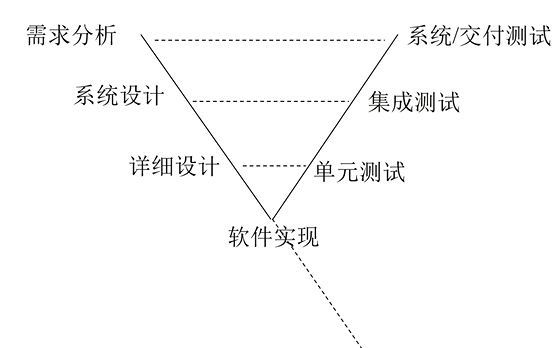</center>

#### 进化式开发

<center>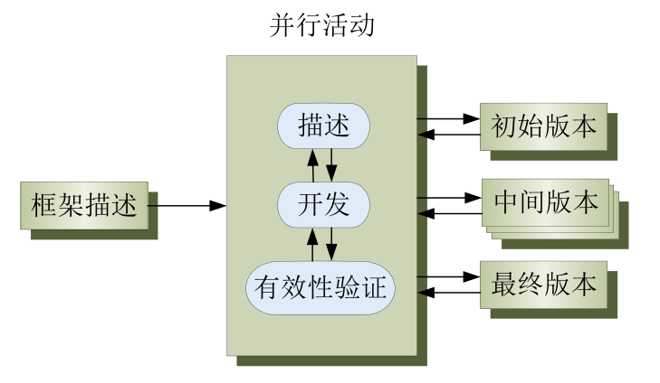</center>

- 探索式开发
  - 其目标是与客户一起工作，从最初的需求草案进化到最后的系统。应该**从理解最清楚的需求开始**。
- 抛弃式原型
  - 目的是理解系统需求。**从理解较差的需求开始**。
    - 适用于用户界面、人机交互、用户喜好
    - 需求讲不清楚：原型法

- 问题
  - 缺乏过程可见性
  - 系统结构通常较差
  - 需要特殊的工具和技术 (例如采用快速建立原型的语言)
- 适用性
  - 中小型交互式系统
  - 大型系统的一部分 (如用户界面)
  - 生命周期短的系统

- 选择
  - 瀑布模型
    - 质量要求高
    - 软件规模大
    - 需求清晰
  - 进化式开发
    - 交付时间短
    - 需求难确定(用户界面)

> - 敏捷开发
>   - 极限编程
>     - 基于非常小的功能增量的开发和交付的一种新的方法
>     - 依靠连续的代码改进，用户参与到开发团队一起开发
>   - 结对编程
>     - 出错少
>     - 效率高（或许吧）
> - 软件工程：提高效率

### 过程反复

- 系统需求在项目进行期间总是进化的，所以对大型系统来说经常是早期阶段反复的过程

- 反复可以应用于任何通用过程模型

- 两个混合模型

  - **增量式开发**

    <center>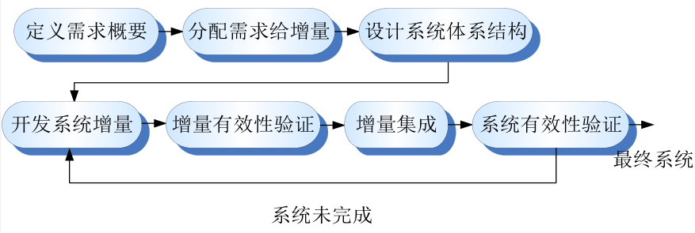</center>

    - 系统不是一次交付，而是将要求的功能分成多次增量进行开发和交付

      - 增量式开发，需求独立

      - 进化式开发，融合在一起

    - 用户需求是有优先顺序的。优先级最高的需求包含在最初的增量中

    - 一旦一个增量的开发开始时，需求就要冻结，虽然后面的增量可以继续进化

    - 优势

      - 客户要求的功能随着每次增量被交付，所以系统功能可以较早看到
      - 较早的增量可以作为原型帮助引出后面增量的需求
      - 项目总体失败的风险降低
      - 最高优先级的系统服务由于是最早增量，得到最多的测试

  - 螺旋式开发

    <center>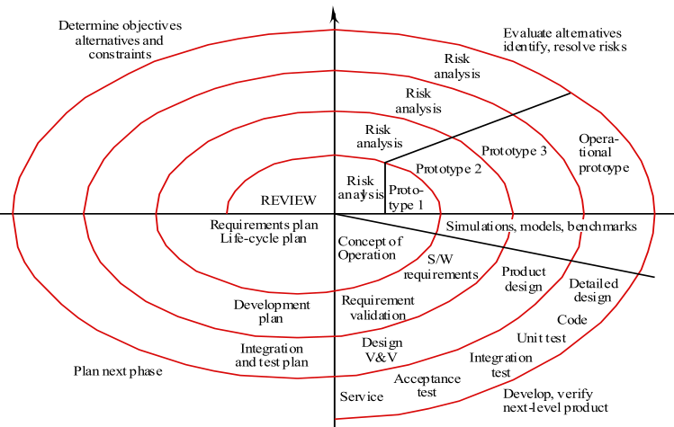</center>

    - 将过程表示为螺旋线，而不是用一系列活动和活动间的回溯来表示
    - 螺旋线中的每个回路表示过程中的一个阶段
    - 没有固定的阶段。螺旋线中的回路根据需要选取
    - 风险需要明确评估、然后在过程中解决
    - 主要过程：计划、review、风险分析（比如需求变更、人员、技术、资金、硬件短缺）、原型

- 举例
  - 增量式：先黑龙江省（所有地市、县市等细节）、再吉林省、逐个省份绘制。
  - 螺旋式：先画出所有省界，再内部的地市级边界，再县市级边界，直到所有细节。

### 软件描述（需求分析）

建立系统需要哪些服务以及系统操作和开发的约束的过程

#### 需求工程过程

<center>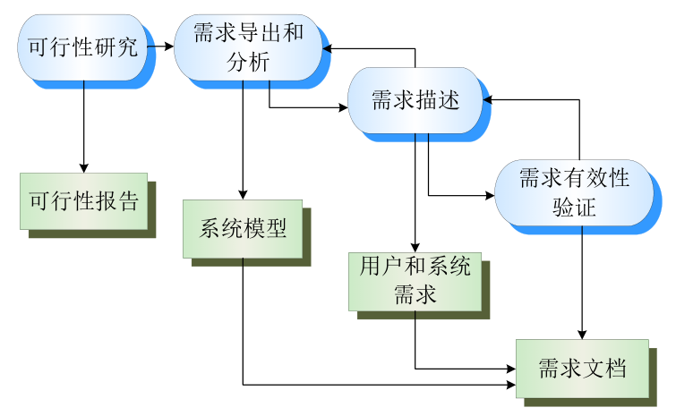</center>

- **可行性研究**
- **需求导出和分析**
- **需求描述**
- **需求有效性验证**

**结构化**：通过把整体划分成部分的办法，部分与部分之间相互关联，使得整块工作（整个过程）有章可循。

结构化系统

- 架构结构化，具体内容头脑风暴

- 选课系统需求
  - 查询
  - 选课
  - 统计
    - 学生
    - 教务人员
    - 教师

写需求也需要结构化

需求要有正确性，可验证性

形成需求文档

### 软件设计和实现

- 将系统描述转化为可执行的系统的过程
- 软件设计
  - 设计实现描述的软件结构
    - 讲清楚一个软件的整体是怎么样部分组成的，部分和部分之间是怎么样相互关系的。
    - 把抽象变成具体
- 实现
  - 将这个结构转化为可执行程序
  - 实现的依据**主要是**设计书（也要看需求书）
    - 由于成本可能设计的不会特别完备
- 设计和实现活动是紧密联系的，可能是交叉进行的。

#### 设计过程活动

- 体系结构设计
- 抽象描述
- 接口设计
  - 写在设计书里面
- 组件设计
- 数据结构设计
- 算法设计

#### 设计方法

- 开展软件设计的系统方法
- 设计通常是图形化模型的文档
  - UML统一建模语言，绘图规范
- 可能的模型
  - 数据流模型
  - 实体关系模型
  - 结构模型
  - 对象模型

#### 编程和调试

- 将设计转化为一个程序，从程序中排除错误
  - 注意编程规范
- 编程是个人行为，没有通用的编程过程
- 程序员完成一些程序测试以发现程序中的缺陷，在调试过程中排除缺陷。

### 软件有效性验证

- 检验和有效性验证
  - V&V: verify & validate
  - 检验：做事情的方法过程是否正确，贯穿软件开发全过程
  - 验证：结果是否正确
  - 另一种翻译：验证和确认
- 为了说明系统符合它的描述并且满足系统用户的需求
- 包括检查、评审（检验）和系统测试（验证）
- 系统测试是用测试用例来执行系统，测试用例来自系统描述，使用真实的系统数据

#### 测试的阶段

- 单元测试
  - 测试独立的组件
- 模块测试
  - 测试一组互相关联的组件的集合
- 子系统测试
  - 模块集成到子系统并测试。关键是接口测试。
- 系统测试
  - 测试整个系统。测试总体特性。
- 接受测试
  - 用客户的数据测试以确定系统能被接收。

## 2 项目管理

> 对于项目成功好的项目管理是必要的
>
> 软件是无形的，这带来管理上的问题
>
> 管理者要扮演多种角色，其中最主要的活动是规划、估算和进度
>
> 规划和估算是贯穿项目的反复过程
>
> 项目里程碑是一个预期的状态，在这里需要把某些项目进展报告提交到管理层
>
> 风险包括项目风险、产品风险和业务风险
>
> 风险管理是识别可能影响项目的风险，制订计划以确保风险不会上升发展成危害
>
> 风险管理过程：风险识别、风险分析、风险规划、风险监控

### 软件项目管理

- 软件项目管理涉及的行为，是为了确保软件及时并按照进度的要求交付，同时满足开发或者采购该软件的机构的需求
- 项目管理是需要的，因为软件开发总是受到预算和进度的约束，这些约束是由开发该软件的机构所设置的

#### 软件管理的区别

- 产品是无形的
- 产品是灵活可变的，其它产品中这是比较少见的。
- 软件工程学科被认为还是不完整的，跟机械、电子工程等学科不同
- 软件开发过程是非标准化的
- 许多软件项目是一次性的项目

### 管理活动

- 提出书面建议
- 项目规划和进度安排
- 项目成本
- 项目监督和评审
- 人员选择和评价
- 工作报告撰写和陈述

#### 项目人员

- 人员费用是软件工程的主要费用

- 可能无法为一个项目指定理想的人员
  - 项目预算可能不允许聘用高薪人员
  - 找不到有适当经验的人员
  - 一个机构可能希望在软件项目中提高员工的技能

- 管理人员不得不在这些约束下工作，特别是当团队的技能有着明显的缺陷时。
- 项目小组最佳人数4—6个

### 项目规划

项目规划可能是最费时间的项目管理活动。主要计划关心的是进度和预算。

- 质量计划
  - 5 Bug / 1000行，不太好
  - 1 Bug / 1000行，比较常规
  - 1 Bug / 10000行，比较好的
  - 圈复杂度
  - 措施：Code Review
- 有效性验证计划
- 配置管理计划
  - 配置：整体由部分组成，软件工程的文档、代码...
  - 配置管理人员：版本控制、SVN
- 维护计划
- 人员发展计划

#### 项目计划结构

- 引言
- 项目的组织
- 风险分析
- 硬件和软件资源需求
- 工作分解
  - 工作分解结构WBS
  - 基于工作分解的项目进度计划
- 项目进度
- 监控和报告机制

#### 活动组织

- 一个项目中的活动应该组织起来生成切实的输出，以便管理能判断进展。

- **里程碑**是一个过程活动的终点

  - 需求工程过程中的里程碑

    <center>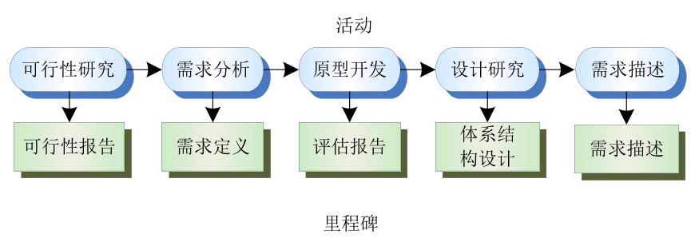</center>

- **可交付物**是交付给客户的项目结果

  - 需要约定
    - 测试报告
    - 详细设计
    - 使用说明
    - ....

- 瀑布过程可以定义明显的进度里程碑

### 项目调度

- 将项目分解成多个任务，估算完成每个任务需要的时间和资源
- 并发地组织任务以形成劳动力的优化利用
- 使得任务间的依赖性最小化以避免一个任务等待另一个任务带来的延迟
- 依赖于项目管理者的直觉和经验

#### 项目调度过程

<center>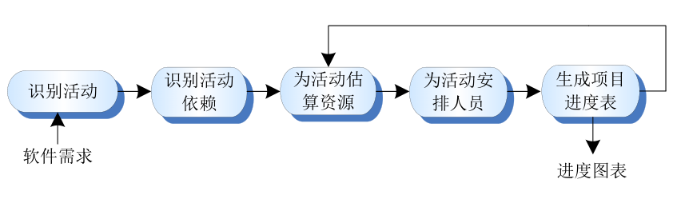</center>

#### 调度的问题

- 难于估算问题的困难程度以及一个解决方案的成本
- 很多人在一个任务上工作，生产力是不成比例的。
- 由于**通信开销**，往一个延迟的项目中增加人员会使得项目更加延迟。
- 意外总会发生。要在计划中考虑到意外事件。

#### 条形图和活动网络图

- 用来说明项目进度的图形化符号

- 项目分解成任务。任务不能太小。一个任务大概要四五天

- 活动图说明任务依赖性和关键途径

- 条形图说明基于日程表的进度安排

  - 甘特图

  <center>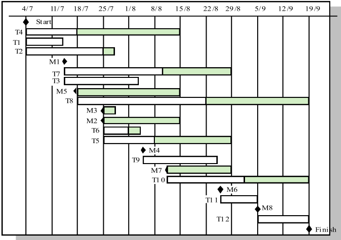</center>

  - 人员配置

  <center>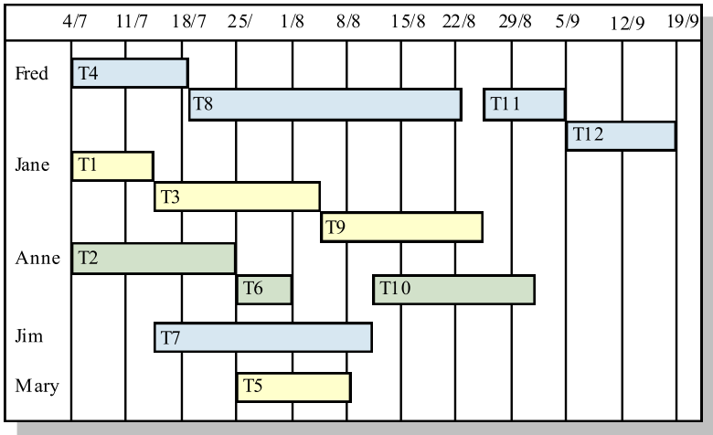</center>

- 活动网络

  - M：里程碑
  - T：任务

  <center>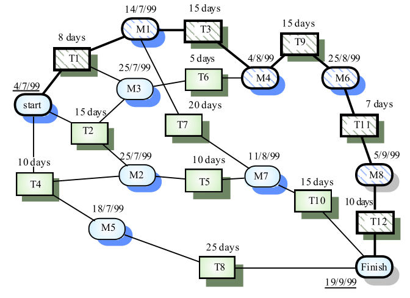</center>

### 风险管理

- 风险管理是关于风险识别并制订计划使得风险的影响降到最小
- 风险就是一些不利的情况发生的可能性。
  - 项目风险影响进度或者资源
  - 产品风险影响所开发软件的质量和性能
  - 业务风险影响开发或采购该软件的机构

#### 风险管理过程

- **风险识别**
  - 识别项目、产品和业务风险
- **风险分析**
  - 评估这些风险出现的可能性及其后果
- **风险规划**
  - 制订计划说明如何规避风险或降低风险对项目的影响
- **风险监控**
  - 监控整个项目过程中的风险

risk（风险） hazard（危害，潜在的风险）

#### 风险识别

- 技术风险
- 人员风险
- 机构风险
- 工具风险
- 需求风险
- 估算风险

#### 风险分析

- 评估每个风险的可能性和严重性
- 可能性分成很小、小、中、高、或者很高、非常高，六档
- 风险影响分成灾难性（人员伤亡）、严重、可容忍、可以忽略，四档

##### 风险矩阵

<center>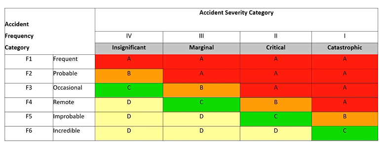</center>

风险从A到D风险变小

##### 最低合理可行原则

As Low As Reasonably Practicable，**ALARP**

<center>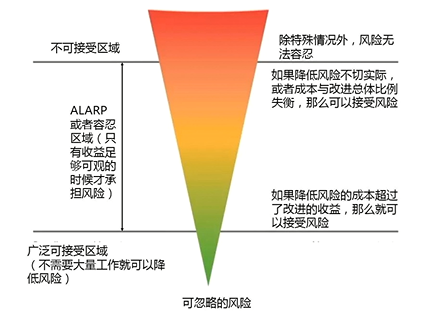</center>

#### 风险规划

- 规避风险策略
  - 风险发生的可能性降低
- 最小风险策略
  - 降低项目或产品的风险影响
- 应急计划
  - 如果风险上升，就可按照应急计划应对

#### 风险监控

- 经常性地评估每个识别的风险，决定风险可能性是在增加还是减少
- 评估风险的影响是否已经改变
- 每个主要风险必须在管理进度会议上讨论

## 3 软件需求

> 需求描述了系统应该做什么以及定义系统运行和实现的约束
>
> 功能需求描述系统应该提供的服务
>
> 非功能需求包括对系统的约束和系统开发过程的约束
>
> 用户需求是关于系统应该做什么的高层描述
>
> 用户需求用自然语言、表、方块图撰写
>
> 系统需求是为了沟通系统应该提供的功能
>
> 系统需求可用结构化的自然语言、PDL或者格式化的语言来撰写
>
> 软件需求文档是经过认可的系统需求描述

### 需求工程

- 建立用户需求以及使用和开发的约束的过程
- 需求工程过程中生成的需求本身是系统服务和约束的描述

#### 需求

- 范围很广，高到服务和约束的高层抽象描述，低到具体的数学形式化的功能描述
- 需求具有双重功能
  - 可能是合同标书的基础
  - 可能是合同本身的基础
    - 合同没有图，表格，都是文字来写
  - 这两种情形都可能称为需求

#### 需求类型

- 用户需求
  - （概要需求）关于系统服务和约束的**自然语言加上方块图**表述。为客户撰写。
- 系统需求
  - （详细需求）一个**结构化**的文档写出系统的服务。作为客户和承包商之间的合同内容。
- 软件描述
  - 一个详细的软件描述可以作为设计或实现的基础。为开发人员撰写。

<center>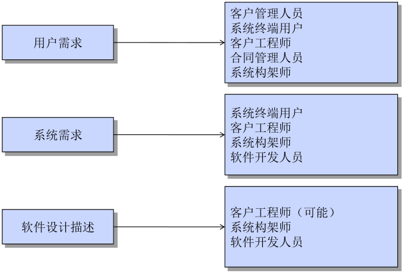</center>

结构化的文档：按照一定的格式，并非自由格式

### 功能和非功能需求

- 功能需求
  - 系统需要提供的服务的表述，系统应该如何响应特定输入，系统在特定的情形下应该如何动作。
  - **功能：输入输出的对应关系**
- 非功能需求
  - 系统提供的服务或功能上的约束，例如时间约束、开发过程约束、标准等。
  - 性能：精度、实时性、并发量、存储量
  - 非性能：可靠性、安全性、开发语言、可移植性、易用性、鲁棒性
  - 分类：产品需求、机构需求、外部需求
  - 产品需求、机构需求、外部需求
- **领域需求**
  - 需求从使用领域中得到，描述反映领域的特征和性质
  - 包括功能需求和非功能需求
  - 可能是新的功能需求、已有需求的约束或者定义一个特定的计算
  - 如果领域需求不被满足，系统可能无法工作

#### 需求不精确、需求的完整性和一致性

- 当需求没有被精确定义时，会带来问题
  - 模糊的需求可能开发者和用户有不同的解释
- 理论上，需求应该既完整又一致
  - 完整性
    - 需要的所有服务都应该给出描述
  - 一致性
    - 在系统服务的描述上应该没有冲突和矛盾
- 实际上，不可能产生一个完全完整的、没有不一致的需求文档

#### 目标和需求

- 非功能需求可能很难精确表述，而模糊的需求可能难于检验
- 目标
  - 用户的总体目的，例如易用性
  - 举例：对有经验的管理员来说，系统应该容易使用，其构成应该使得用户的错误最小
- 能检验的非功能需求
  - 能够被客观地度量的描述
  - 举例：经过2小时的培训，有经验的管理员应该能使用所有的系统功能。经过培训后，有经验的用户的平均错误数量每天应不超过2个
  - 培训时间、帮助的页数
  - MTBF Mean Time Between Failure，平均故障间隔时间
  - MTTF Mean Time To Failure，修复前平均时间
- 目标有助于开发者理解系统使用者的意图

### 用户需求

- 应该描述功能性和非功能性需求，使得没有具体的技术知识的系统用户也能理解
- **用户需求用自然语言、表和方块图**定义
  - 自然语言的问题
    - 不够清楚
      - 为了使得文档易读，保证精确性是困难的
    - 需求混乱
      - 功能性和非功能性需求会混在一起
    - 需求合并
      - 几个不同的需求可能放在一起表达
    - 二义性
      - 需求的读者和作者必需对同一词语有同样的解释。自然语言是做
        到这点比较困难，因为自然语言存在二义性。
    - 随意性太大
      - 同一件事情可能在描述中用好几种不同的方式讲述
    - 模块化不够
      - 自然语言的结构不足以构建系统需求

### 系统需求

- 比用户需求更详细的描述

- 作为系统设计的基础

- 可以作为系统合同的一部分

- 系统需求可以用图形化系统模型表达

#### 需求和设计

- 原则上，需求应该规定系统应该做什么，设计则描述系统如何做。
- 实际上，需求和设计是不能分离的
  - 系统体系结构可能用来构成需求描述
  - 系统和其它系统存在交互操作的约束，这也产生设计需求
  - 使用特别的设计可能是一个领域需求，例如采用特殊编程环境以提高可靠性

#### 结构化语言描述

- 格式限制的自然语言用来表达需求
- 这排除了二义性、随意性带来的问题，为描述带来一定程度的规范
- 通常采用一个以格式模板为基础的方法
- 结构化表述
  - **名称（唯一性、确定性）、描述（介绍性、清晰易懂）、输入及来源、输出及目的地、前置条件、后置条件、正常流、异常流、决定者（负责人）、变更记录、关联需求编号和名称等等**
  - **编号**方便查找、需求跟踪、讨论时的称谓；需求删除后编号一并删除，新增的需求编号不能占用已删除的编号（防止其他需求对已删除的需求的引用导致需求混乱）
  - 格式
    - 每一条功能需求换新的一页
    - 每一条需求都要有编号
    - 最开始：功能一览表
    - 修订历史

#### 接口描述

- 多数系统和其它系统有交互，交互接口必须作为需求的一部分被描述
- 三种类型的接口应该定义
  - 程序接口
  - 交换数据的数据结构
  - 数据的表示
- 格式化的符号是接口描述的有效技术

### 需求文档

- 需求文档是对系统开发者要求的正式表述
- 应该包括系统定义和需求描述
- 不是设计文档，陈述的是系统应该做什么而不是怎么做。

#### 需求文档的使用者

<center>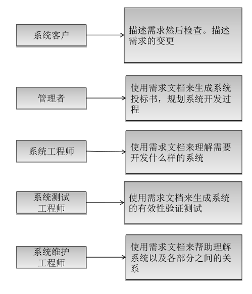</center>

#### 需求文档的要求

- 描述系统外部行为
- 描述实现上的约束
- **容易改变**
- 成为系统维护人员的参考工具
- 记录系统的整个生命周期，即预测变更
- 对意外事件作出可接受的反应

## 4 需求工程过程

> 需求工程包括可行性研究、需求导出和分析、需求描述、需求有效性验证及需求管理
>
> 需求分析是一个包括领域了解、需求收集、分类、组织、优先排序和有效性验证的重复过程
>
> 不同的项目相关人员对系统有不同的需求
>
> 社会和机构的因素对系统需求具有强大的影响
>
> 需求有效性验证是检查需求的**有效性、一致性、完备性、现实性和可检验性**的过程
>
> 业务上的变化不可避免地导致需求变更
>
> 需求管理过程包括规划和变更管理

### 需求工程过程

- 需求工程过程依赖于应用领域、涉及的人员和机构
- 然而，对所有过程都存在着一些共通的活动
  - 需求导出
  - 需求分析
  - 需求验证
  - 需求管理

<center>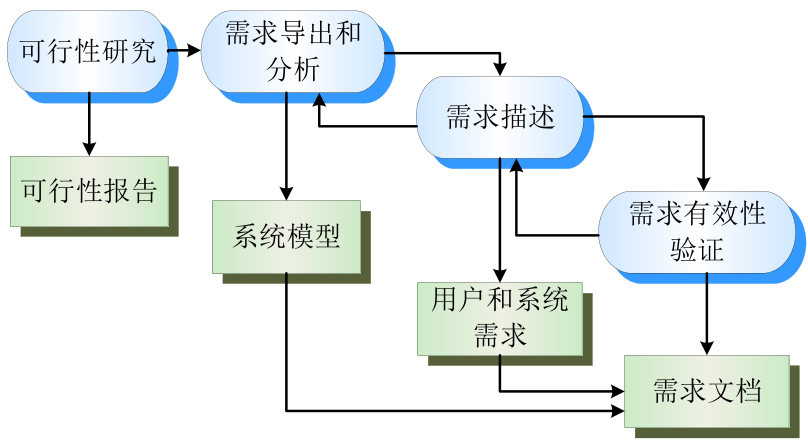</center>

### 导出和分析

- 也叫需求导出或者需求发现

- 相关的技术人员和客户一起工作以发现应用领域、系统提供的服务、系统的运行限制
- 可能涉及终端用户、管理者、维护工程师、领域专家等项目相关人员。

- 导出方法：头脑风暴、结构化

#### 系统分析的问题

- 项目相关人员不知道他们真正想要什么
- 项目相关人员用他们自己的语言表达需求
- 不同的项目相关人员提出的需求可能冲突
- 机构和政治上的因素可能影响系统需求
- 分析过程中需求改变。可能会出现新的项目相关人员，业务环境改变。

#### 需求分析过程

<center>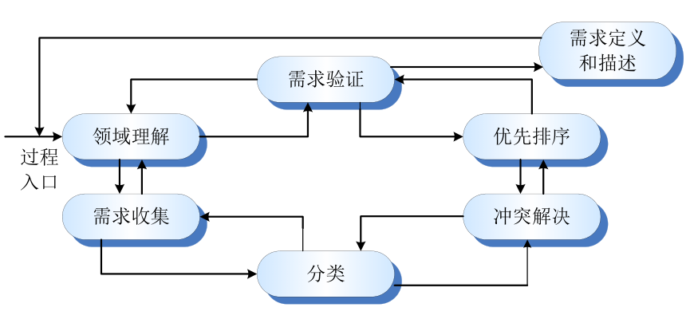</center>

- 领域理解
- 需求收集
- 分类
- 冲突解决
- 优先排序
- 需求验证
- 同质化与马太效应：业务理解的重要性

##### 面向视点的导出

- 结构化的导出方法
- 项目相关人员不同的问题视点
- 这种多视点的分析是重要的，因为分析系统需求没有单个正确的方式
- 保证需求的完整性
- 举例：银行ATM系统
  - 视点
    - 银行客户
    - 其它银行的代表
    - 硬件和软件维护工程师
    - 市场部
    - 银行管理人员和柜台工作人员
    - 数据库管理员和安全工作人员
    - 通信工程师
    - 人事部
- 举例：成绩管理
  - 学生（本科生、研究生、一年级、四年级）查询：绩点、平均绩点
  - 教师：录入、查询
  - 学籍管理人员：

###### 视点的类型

- 数据源或数据接收器
  - 视点用于生产或消费数据。分析过程包括识别所有的视点、识别产生或消费什么数据以及采取了什么处理过程。
- 表示框架（画面）
  - 视点代表特定类型的系统模型。比较这些模型以发现需求，使用单个模型的话容易出错。对实时系统特别适合。
- 服务的接收者
  - 系统外的视点，从系统接受服务。主要适合于交互系统。

###### 外部视点

- 作为系统服务的接收者，对终端用户来说比较自然
- 组织需求导出比较自然的一种方式
- 确定一个视点是否有效，相对比较容易
- **视点和服务对于组织非功能需求非常有用**

##### 面向视点的需求定义方法(VORD)

###### VORD 过程模型

<center>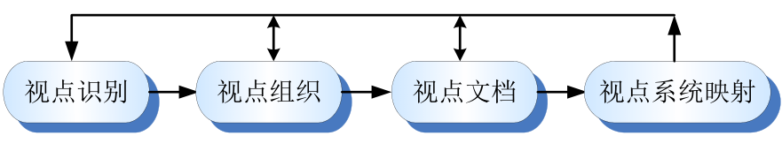</center>

- 视点识别
  - 发现接收系统服务的视点，以及识别每个视点提供的服务
- 视点组织
  - 组织相关的视点形成层次结构。通用的放在较高的层次。
- 视点文档
  - 对被识别的视点和服务描述的精炼。
- 视点系统映射
  - 将分析转化为面向对象的设计

###### VORD模板标准格式

<center>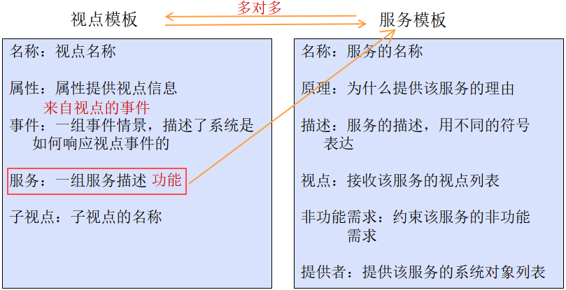</center>

###### 视点识别

- 卡片法
- 比较随意，想到什么写什么

###### 视点服务信息

<center>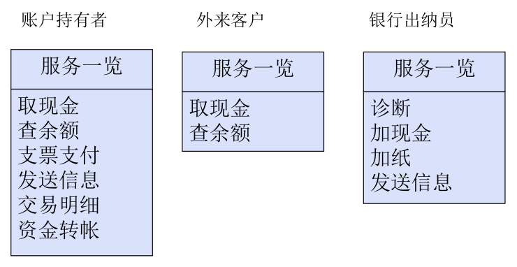</center>

###### 视点数据/控制

<center>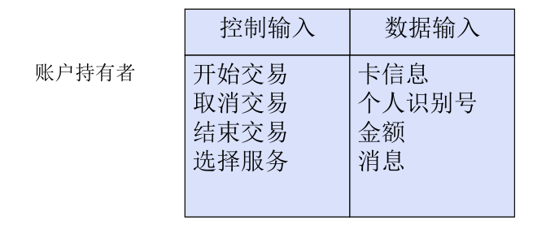</center>

###### 视点层次结构

<center>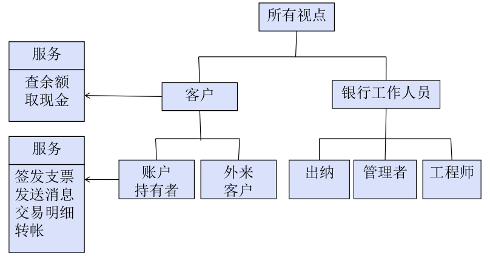</center>

###### 客户/取现金模板

<center>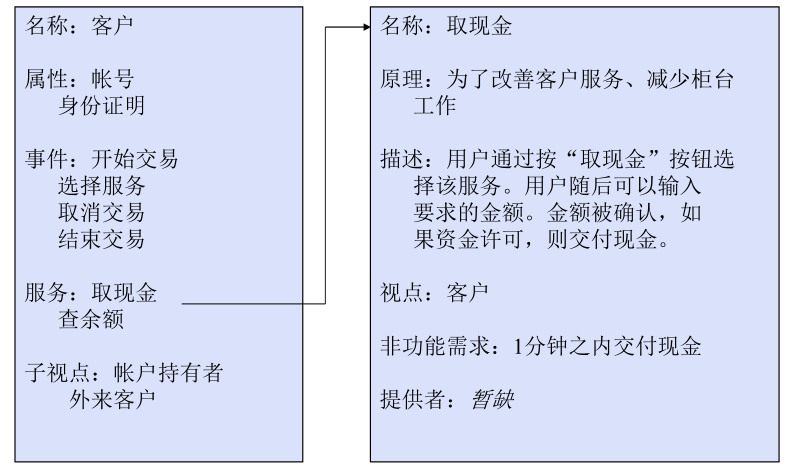</center>

##### 场景

- 场景是关于一个系统如何实际使用的描述
- 场景对需求导出是有帮助的，因为比起抽象的描述，场景更容易让人关联起来。
- 场景对于添加细节到需求描述概要中是特别有用的

###### 场景描述

- 场景开始时的系统状态
- 关于常规事件流的描述
- 哪里会出错以及如何处理错误
- 其它同时发生的活动的信息
- 场景完成后的系统状态

###### 事件场景 – 开始交易

- 事件场景的方块图符号约定
  - 数据提供和交付
    - 数据流：左边进，右边出
  - 控制信息
    - 控制流：上面进、上面出
  - 例外处理
    - 异常流：在下面
  - 椭圆：来自视点和交付给视点的数据
  - 下一个预期的事件：加粗框

<center>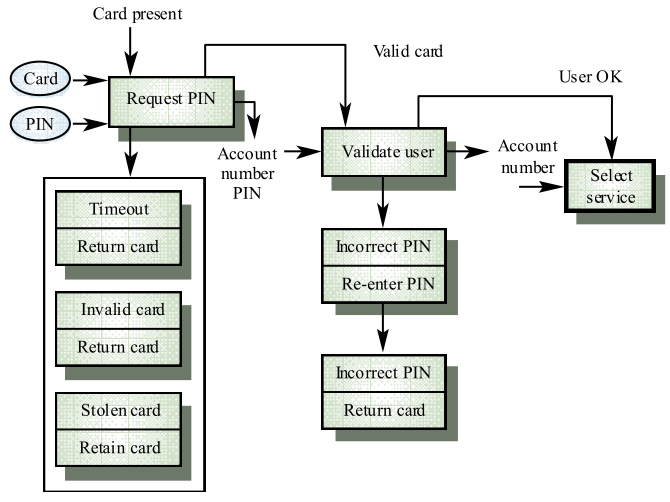</center>

##### 用例

- 基于场景的需求导出技术
- 确定交互中的角色、描述交互本身
- 一组用例应描述系统所有可能的交互
- **笼统**的表示有哪些功能
- **用例图可以描述系统整体的需求**
- 通过表示系统中的事件处理序列，**使用序列图向用例中添加细节**

###### 用例图

- 椭圆：功能
- 箭头：交互
- 人：机器、系统、人等USER；要使用UML规定画法

<center>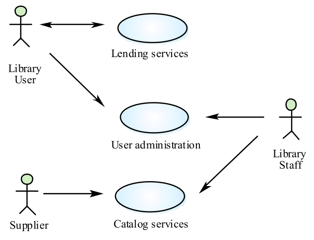</center>

###### 序列图

- 序列图可以**描述需求的细节**
  - 详细的描述功能（对应于一个椭圆）
- 对象：实体、模块
- 竖列：时间轴
- 有矩形：在运行
- 横线：事件、中断、消息

<center></center>

### 需求有效性验证

- 证明系统中定义的需求是客户真正想要的
- 需求错误的代价是很高的，所以有效性验证非常重要
  - 交付后修改一个需求错误比起修改一个实现上的错误，其代价是高至后者的100倍。

#### 需求检查

- **有效性**
  - 系统是否提供了最适合于客户的功能
- **精确性**
  - 需求是否是模棱两可的
- **一致性**
  - 需求有没有冲突的地方
- **完整性**
  - 是否包括了客户需要的所有的功能?
- **现实性**
  - 在一定的预算和技术条件下需求是否能够实现
- **可验证性**
  - 需求是否可以检验

#### 需求有效性验证技术

- **需求评审**
  - 对需求做系统性的手工分析
  - 举行经常性的评审会、阐明需求定义
  - 客户方和承包商方的工作人员都应参加评审
  - 需求可以是正式的（具有完整的文档）也可以是非正式的。开发者、客户和使用者之间良好的沟通可以在早期解决问题。
  - 评审的检查
    - 可检验性。需求实际上能否测试
    - 可理解性。需求是否被正确理解
    - 可追溯性。需求的来源是否清晰的说明
    - 适应性。 在对别的需求没有大的影响的情况下、需求能否改变
- **原型开发**
  - 用一个可执行的系统模型来检查需求
- **测试案例生成**
  - **检查需求的易测性**
  - 起到原型的作用（输入、预期输出，得到场景），梳理场景
- 自动一致性分析
  - 检查结构化需求描述的一致性
  - B语言、Z语言、严格的标记符号

### 需求管理

- 需求管理是在需求工程过程和系统开发过程中管理需求变更的过程
- 需求不可避免是不完整、不一致的
  - 当业务需求变化、系统理解更深入时，都会出现新的需求
  - 不同的视点有不同的需求，这些经常是矛盾的。

#### 需求变更

- 在开发过程中，源自不同视点的需求的优先级是变化的
- 系统客户从商务角度描述的需求会跟终端用户的需求冲突
- 开发过程中系统的商务和技术环境变化

#### 需求的分类

- 易变的需求
  - 由于环境的改变导致需求的变化
- 浮现的需求
  - 对系统有了更深的理解后，新的需求浮现出来
- 引发的需求
  - 由于计算机系统的引入所带来的需求
- 兼容性需求
  - 需求依赖于机构中其它系统或业务过程

#### 需求管理规划

- 在需求工程过程中，必须计划以下内容
  - 需求识别
    - 需求如何被唯一的标识
  - 变更管理过程
    - 分析需求变更的过程
  - 可追溯策略
    -  需求之间以及需求和设计之间的关系加以记录和维护

#### 可追溯性

- 可追溯性是指需求、需求的来源和设计之间的关系
- 来源可追溯性
  - 将需求和提出需求的项目相关人员之间建立连接
- 需求可追溯性
  - 在独立的需求之间建立连接
- 设计可追溯性
  - 在需求和设计之间建立连接

#### 需求变更管理

- 对所有建议的需求变更都应管理
- 基本阶段
  - 问题分析。讨论需求的问题、建议变更
  - 变更分析和成本计算。评估变更对其它需求的影响
  - 变更实现。修改需求文档和其它文档以反映变更

## 5 系统模型

> 模型是抽象的系统视图。多种类型的模型提供了不同的系统信息
>
> 上下文模型表示一个系统在环境中的位置以及和其它系统、过程之间的关系
>
> 数据流模型可用来对系统的数据处理建模
>
> 状态机模型是系统对内部和外部事件的响应进行建模
>
> 语义数据模型是对系统导入导出的数据逻辑结构进行描述
>
> 对象模型描述逻辑系统实体、实体的分类和集合

### 系统建模

- 系统建模有助于分析者理解系统功能，模型可用来和客户沟通
- 不同的模型从不同的角度来描述系统
  - 从外部来看，是对系统上下文或系统环境建模
  - 从行为来看，是对系统行为建模
  - 从结构上看，是对系统的体系结构和系统处理的数据的结构建模
    - 物理模块
      - 软件背后的模块，没有实现明面上的功能，但是是支撑（如数据库操作）
    - 功能模块
      - 对应软件的功能
- 结构化方法提供了系统建模的框架
  - 不足
    - 不提供对非功能性系统需求的有效理解和建模
    - 没有某个方法是否适合某个问题的信息
    - 会产生太多的文档,需求要素隐藏在细节描述中
    - 系统模型有时候太过具体、使得用户难以理解
      - 图和文字搭配起来

#### 系统模型的类型

- **数据流图**
  - 数据处理模型，说明数据在不同的阶段如何被处理的
- **实体关系图**
  - 组成模型，说明系统中的实体是如何由其它实体组成的
- **体系结构图**
  - 体系结构模型，说明构成整个系统的主要子系统
- **对象类/继承关系图**
  - 分类模型，说明实体间怎样具有共同特性
- **状态转换图**
  - 激励/响应模型，说明系统对事件的响应

### 上下文模型

- **上下文模型用来说明系统的边界**

- 社会和机构的因素会影响系统的边界

- 体系结构模型描述一个系统及其与其它系统之间的关系

- 举例：一个ATM系统的上下文

  <center>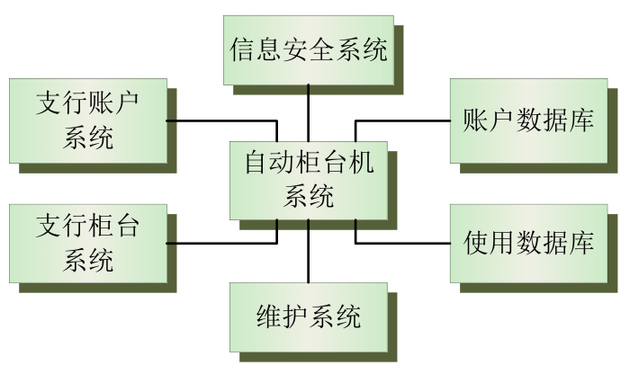</center>

- 成绩管理系统
  - 选课系统
  - 学生基本信息
  - 教务管理系统

### 过程模型和数据流模型

- 简单的体系结构模型一般要辅以其它模型共同描述系统

- **过程模型给出系统中支持的各种活动过程**

- **数据流模型给出了信息流如何在系统中流动**

- 举例：设备采购过程模型

  - 方角：数据；
  - 圆角：行为（服务）
  
  <center>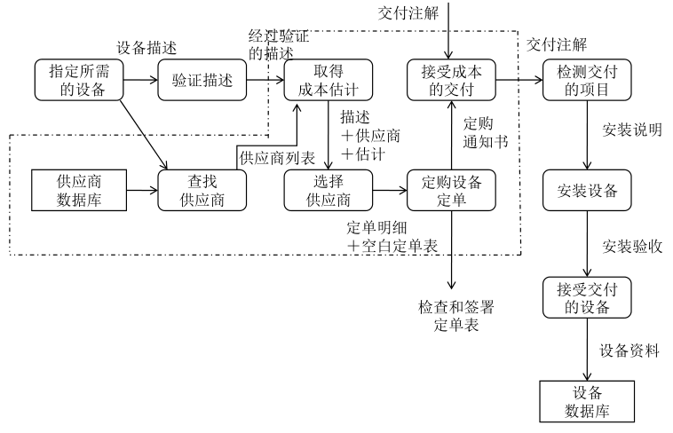</center>

#### 数据流图

- **圆角（椭圆）：对数据加工**
- **连线：数据**
- **箭头：数据的流动方向**

<center>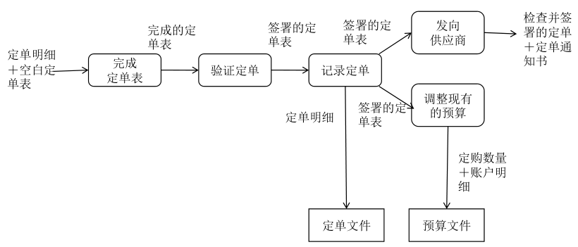</center>

### 状态机模型

- **对外部和内部事件的系统响应行为进行建模**
- 他们表示系统对激励的响应，经常用来对实时系统建模
- 当一个事件发生时，系统从一个状态转移到另一个状态
- 状态表是UML的一部分
  - 允许将一个模型分解成几个子模型
  - 在每个状态的操作内容中列出动作的简要描述
  - 可以用表格的形式描述状态和激励
- 多用于嵌入式系统
- 图可以分为：节点、连接
  - **节点：状态/当前状态做的事**
  - **连接：事件**

<center>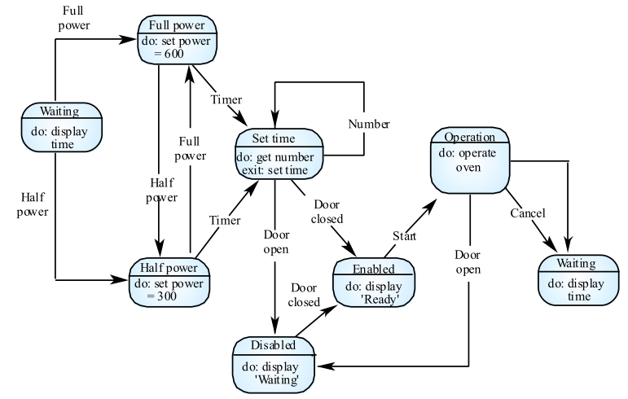</center>

<center>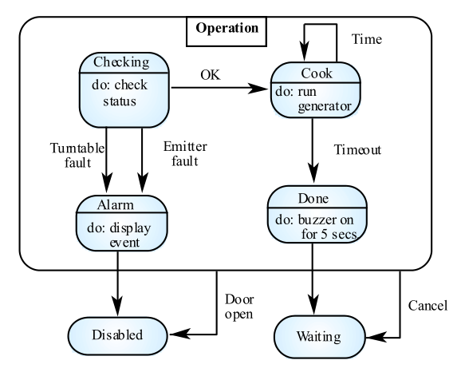</center>

### 语义数据模型

- 实体—关系—属性模型列出系统中的实体、这些实体及其属性之间的关系
- 广泛运用于数据库设计，用关系数据库比较容易实现
- 用来描述系统数据加工的逻辑结构

- **节点：实体**
  - 实体名称/实体属性
  - 对象名/属性/方法
- **连接：实体与实体间的关系**

<center>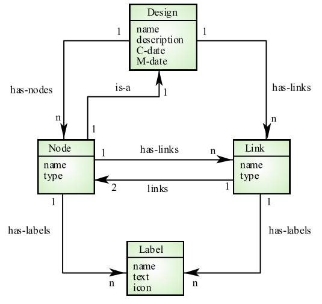</center>

### 对象模型

- 对象
  - 对象是类的一个实例
- 类
  - 类是一个模板，它描述一类对象的行为和状态
- 对象模型描述系统的对象类
- 一个对象类是一系列具有共同属性和服务的对象的抽象描述
- 不同的对象模型
  - 继承模型
  - 对象聚合模型
  - 对象交互模型
- 比较自然地反映了系统所处理的真实世界中的实体
- 越是抽象的实体，用这种方法建模越是困难
- 对象类识别是一个困难的过程，需要对应用领域有一个深入的理解
- 反映领域实体的对象类，在系统间是可复用的

#### 继承模型

- 将领域对象类组织成层级结构
- 在层级顶端的类反映了所有类的共同特征
- 对象类从一个或多个超级类集成它们的属性和服务。根据需要进行具体化
- 类层级设计是困难的，如果要避免在不同的分支中出现重复

##### 统一建模语言UML

- 广泛采用面向对象分析和设计方法的开发人员设计的。已经成为面向对象建模的标准化方法
- 符号
  - **对象类用一个矩形表示，名称在上部、属性在中间、操作在下部**
  - **对象类之间的关系用对象间的连接线表示**
  - 继承是很常用的，在层次图中一般采用从上继承
  - **继承采用空心箭头**

<center>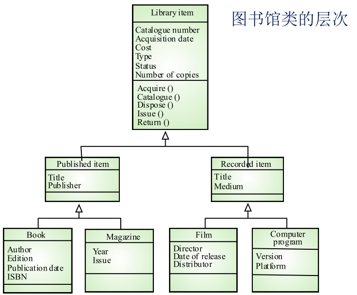</center>

##### 多重继承

- 属性和服务不是从单一的父类继承，一个支持多重继承的系统允许对象类从几个超级类继承
- 会导致语义冲突，当不同的超级类中同样名称的属性和服务具有不同的含义时
- 会使得类层级变得更加复杂

<center>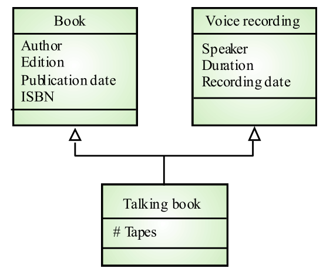</center>

#### 对象聚合

- **聚合模型表示对象的组合类是如何由其它类组成的。**
- 类似于语义数据模型中的关系的一部分

<center>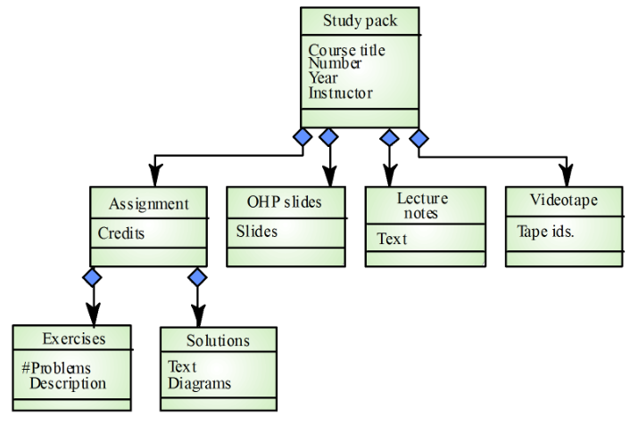</center>

- 聚合、继承：都是不同类之间的关系，目的为了复用
  - 继承耦合程度更紧密，聚合耦合程度低
  - 编程时强调低耦合

#### 对象行为建模

- 行为模型表示了对象之间的交互作用，用以生成特定的系统行为，即用例
- 在UML中序列图用来对对象间的交互作用建模

<center></center>

## 6 软件原型

> 系统原型能给最终用户关于系统功能的一个直观印象。
>
> 随着软件交付时间的要求越来越紧、原型开发越来越多
>
> 抛弃式原型开发是为了理解系统需求而进行的原型开发
>
> 进化式原型开发是对原型不断改进直到成为最终系统
>
> 快速开发对原型开发非常重要。这可能要求先放弃部分系统功能，或者放松一些非功能性约束
>
> 原型开发技术包括使用高级语言、数据库编程以及利用可复用组件的原型构建技术
>
> 用户界面经常需要使用原型开发技术，因为用户界面不可能通过静态模型有效地预先描述，用户应该参与到原型的评估中来

### 系统原型

- 原型开发是系统的快速开发
- 开发完成的系统总是比需求的系统要差
- 由于很多系统采用进化式开发方法，原型和正常系统之间的界限变得模糊
- 系统原型的作用
  - **主要作用是帮助客户和开发人员理解系统需求**
    - 需求导出。用户可以用原型做实验以观察系统是如何支撑他们的工作的
    - 需求有效性验证。原型可以暴露出错误和遗漏的东西
  - 原型开发可以看作是一个降低需求风险的措施
- 原型的好处
  - 暴露出软件用户和开发人员之间的理解偏差
  - 可以发现需求的不完善和不一致
  - 在软件过程的早期可以得到一个能工作的系统
  - 原型可以作为得出系统描述的基础
  - 原型系统可以支持用户培训和系统测试

#### 原型开发过程

<center>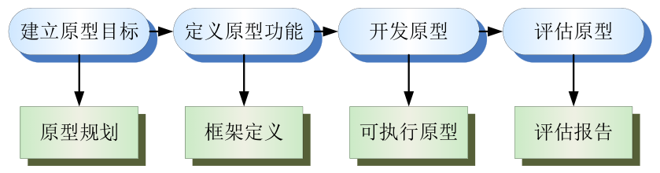</center>

#### 原型开发的优点

- 提高系统可用性
- 更加接近真正需要的系统
- 提高设计的质量
  - **抛弃式较高，进化式不一定**
- 提高可维护性
- 减少了整体开发投入
  - 经典上，整体上

### 软件过程中的原型开发

- 进化式原型开发

  - **开发一个初始的原型，然后通过几个阶段的精炼修改，得到最终系统**
  - **进化式原型开发是要交付一个工作系统给最终用户。开发从那些理解得最好的需求开始。**

- 抛弃式原型开发

  - **原型是用来发现系统需求，然后是抛弃掉的。正常的系统是重新开发的**
  - **抛弃式原型开发是为了导出和验证系统需求。原型开发过程从那些理解得最差的需求开始。**

- 原型开发的路线

  <center>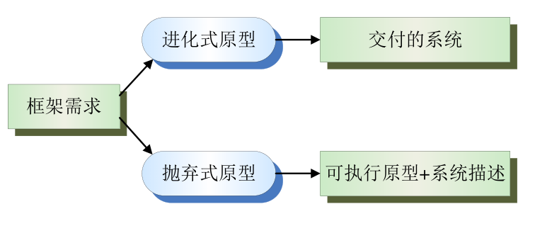</center>

#### 原型作为描述的问题

- 需求的某些部分(例如安全性要求很高的功能)可能无法建立原型，这样就无法出现在描述中
- 一个原型系统无法作为法律上的合约
- 在系统原型中，非功能性需求无法充分测试

#### 进化式原型开发

- **用户系统描述无法再进一步提出的系统**。举例来说，有AI系统、人机界面系统

- 基于支持快速系统开发的技术

- 由于不存在对原型的详细描述，所以无法做一致性检验。有效性验证意味着论证系统的充分性。

  <center>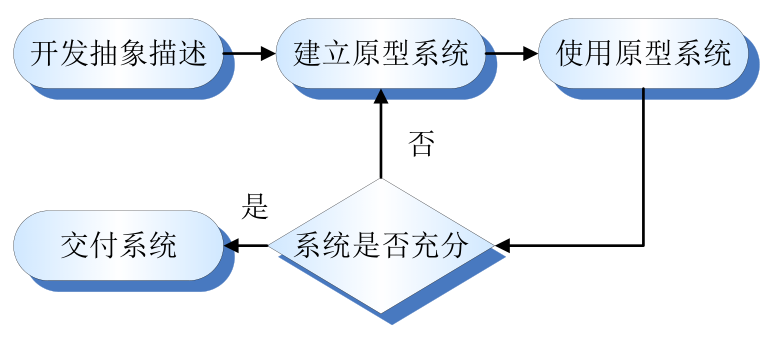</center>

- 进化式原型开发的优点
  - **加快系统交付**
    - 快速交付和开发有时候比功能完备或者保证长期可维护性更加重要
  - **用户的参与**
    - 还可使系统更好地满足用户需求，使得用户更加愿意使用系统

- 进化式原型开发的问题
  - 管理问题
    - 现有的管理过程都假定是瀑布模型，原型开发太快带来问题
    - 原型开发需要的技术可能不具备、不熟悉
    - 管理不透明，过程不可控
  - 维护问题
    - 持续的变更会导致系统崩溃，这样长期的维护会比较困难
  - 契约问题
    - 没有完整的系统描述很难拟定一个有关系统开发的合同

#### 增量式开发

- **系统先建立一个大致的框架，然后以增量形式开发并交付给客户**
- 要为每份增量生成需求和描述
- 用户可以在已经提交的增量系统上实验，这一增量系统也可以看成是一种原型系统
- **吸取了原型开发的优点，同时过程更好管理、系统结构更好**

<center>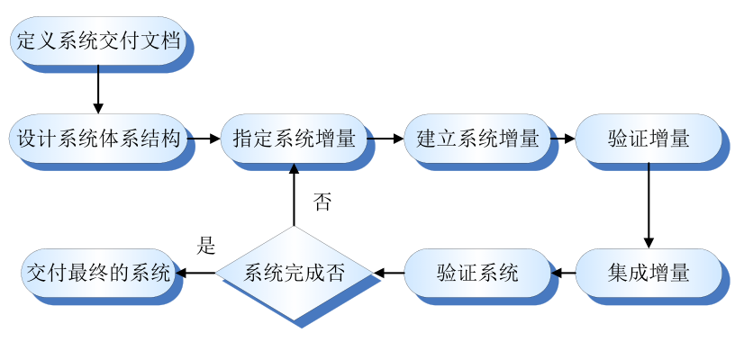</center>

#### 抛弃式原型

- 用来降低需求风险
- 原型从一个初始描述开发，交付后用作实验，然后**抛弃**
- **抛弃式原型不能看作是最后系统**
  - 有些系统特征可能没有考虑
  - 关于长期维护没有描述
  - 系统结构很差，难以维护

<center>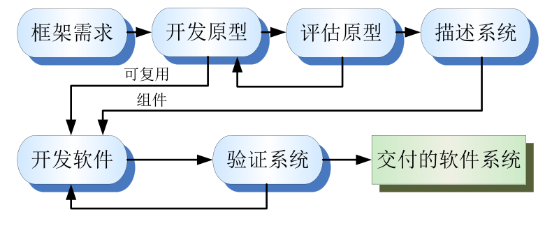</center>

##### 原型交付

- 开发人员在压力下，可能交付抛弃式原型系统作为用户使用
- 不推荐这种做法
  - 无法调整原型系统以满足非功能性需求
  - 原型系统由于快速开发，必然没有文档
  - 在开发中的变更可能破坏了系统结构
  - 机构内的质量标准对原型往往不加限制

### 快速原型开发技术

- 不同的技术可能应用于快速开发
  - **动态高级语言开发**
  - **数据库编程**
  - **组件和应用集成**
    - 原型可以从一组可复用的组件、加上一些将组件结合在一起的机制，快速地生成。
    - 结合机制应包含控制机制和组件通信的机制
    - 系统描述应考虑现有组件的可用性和功能性
- 这些技术不是单独的，经常同时使用
- 可视化编程技术应用于大多数原型系统开发中

#### 基于复用的原型开发

- 应用级开发
  - 整个应用系统集成到原型中，功能可共享
  - 比如，需要文本处理时，可以使用一个标准的文字处理程序
- 组件级开发
  - 个别组件集成在一个标准框架中以完成系统
  - 框架可以是一种脚本语言或者是一个集成的平台，如CORBA

- 可复用组件的结合

  <center>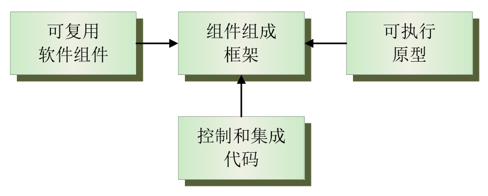</center>

#### 复合文档

- **对某些应用而言，一个原型可以通过开发复合文档来产生**

- 这是包含了活动元素（例如电子数据表格）的文档

- 每个活动元素有一个关联的程序，当活动元素被选中时，调用该程序

- 文档本身是不同应用程序的集成

  <center>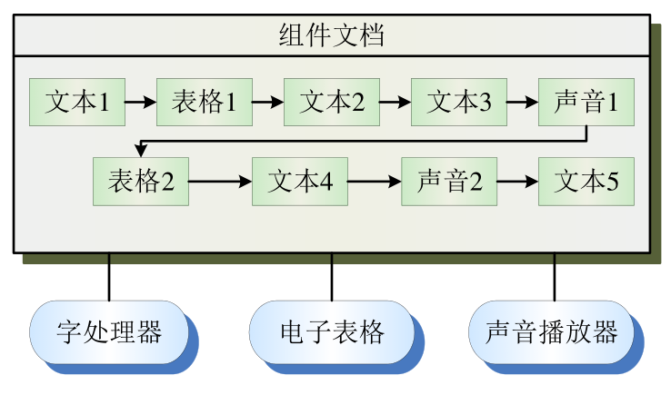</center>

#### 可视化编程

- 拖组件

##### 可视化开发的问题

- 难以协调团队的开发
  - 一个画面一个人开发更好
- 没有一个清晰的系统体系结构
  - 代码自动生成
- 程序各部分之间复杂的依赖关系带来维护上的问题

### 用户界面原型开发

- 很难以一种有效的方式预先描述一个用户界面的外观和使用感觉，**原型开发是基本方法**。
- 用户界面开发的费用比例在增长
- 用户界面生成器用来画出界面、模拟界面功能
- Web界面应使用网页编辑工具开发原型

## 7 体系结构设计

> 结构、数据库设计、接口设计、页面设计、必须有物理模块
>
> 需求：得出功能模块，设计：得出物理模块
>
> 若功能模块和物理模块完全相同：效果最好，模块完全相互独立，容易实现。
>
> -----------------------------------------------------------------------------------------------------------
>
> 软件体系结构是负责导出结构化系统模型，控制模型和子系统分解模型
>
> 很少有大型系统遵从一个单一的体系结构模型
>
> 系统分解模型包括容器模型、客户机—服务器模型和抽象机模型
>
> 控制模型包括集中式控制模型和事件驱动模型
>
> 模块化分解模型包括数据流模型和对象模型
>
> 领域相关的体系结构是对应用领域的抽象。领域相关模型可以是类模型，也可以是参考模型。

### 体系结构设计

- **识别出组成系统的子系统（或模块）**，并**建立子系统（或模块）控制和通信的框架**的过程，叫做体系结构设计。
- 该设计过程的输出结果是软件体系结构描述文档
  - 体系结构图
  - 表：与图中的方块对应
  - 文字

- 系统设计过程的早期阶段
- 描述和设计过程之间的连接
- 经常与一些描述活动并行完成
- **包括识别出主要的系统组件和它们之间的通信**

#### 清晰的体系结构的好处

- 项目相关人员之间的沟通
  - 可以作为项目相关人员之间讨论的焦点
- 系统分析
  - 使得分析系统能否满足其非功能需求成为可能
- 大规模复用
  - 体系结构能在具有相似需求的系统之间互用

#### 体系结构设计过程

- **系统结构化**
  - 将系统分解成一系列基本子系统，并识别出子系统之间的通信
- **控制建模**
  - 建立系统各部分之间控制关系的模型
- **模块分解**
  - 把每个识别出来的子系统进一步分解成模块

#### 子系统和模块

- 一个子系统独立构成系统，不依赖其他子系统提供的服务
- 一个模块通常是一个能提供服务给其他组件的系统组件。通常不被看成是一个独立的系统。

#### 体系结构模型

- 在设计过程中会产生不同的体系结构模型
- 每个模型代表了体系结构的不同观察角度

- **静态结构模型**表示主要的系统组件
- **动态过程模型**表示了系统的过程结构
- **接口模型**定义了子系统接口
- **关系模型**给出如组件间数据流这样的关系

#### 体系结构样式

- 体系结构模型应符合通用的体系结构模型或样式
- 通晓这些样式可以使得系统体系结构定义变得简单
- 然而，多数大型系统是异构的，无法遵循单一的体系结构样式

#### 体系结构的特征

- 性能
  - 定位操作以尽量减少子系统间的通信
  - 架构影响性能
- 保密性
  - 使用分层结构，最关键的资源放在内层
- 安全性
  - 隔离安全性要求的组件
  - 系统失效不至于引起重大伤亡
- 可用性
  - 在体系结构中采用冗余组件
- 可维护性
  - 使用小粒度、独立的组件

### 系统构成

- 将系统分解成互相作用的子系统

- **体系结构设计通常用一个方块图表达，代表了系统结构的概貌**

- 还可以提出更专门化的模型用来描述子系统是如何共享数据、如何分布以及如何彼此交互的

- 举例：打包机器人控制系统

- **方框：模块、连线：关系**

  <center>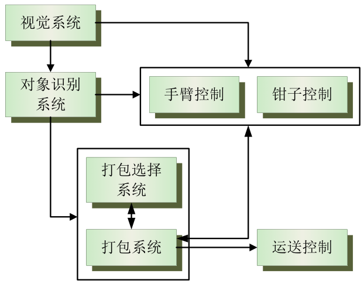</center>

  <center>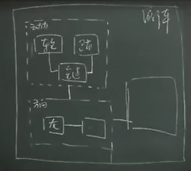</center>

#### 容器模型

- 子系统要交换数据，这可以有两种方法

  - **共享数据存放在一个中央数据库或者是容器中，可以被所有子系统访问**
  - 每个子系统维护自己的数据库，显式地将数据传送给其他子系统

- 当共享大量的数据时，容器模型是最常用的

- 优点

  - **共享大量数据的有效方法**
  - **子系统不需关心数据是如何进行集中管理的，如备份、加密等**
  - **某些活动（备份、保密型、访问控制、恢复）等集中进行**
  - 通过容器模型可以清晰的看出共享模型

- 缺点

  - **子系统要与容器数据模型一致。不可避免的需要妥协。**
  - 数据进化比较困难和昂贵
  - 对特定的管理政策缺乏不同的范围
  - 数据分布比较困难

- 举例：CASE工具集体系结构

  <center>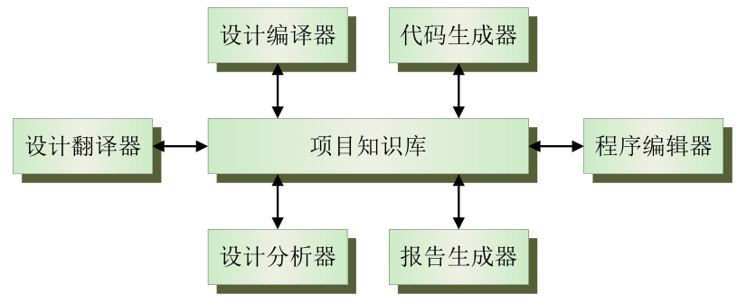</center>

#### 客户端—服务器体系结构

- 说明数据和处理是如何在一个范围内的组件间分布的分布式系统模型

- **一组提供特定服务的单机服务器**，如打印服务、数据管理服务等。

- **一组向服务器请求服务的客户机**

- **一个连接客户机和服务器的网络**

- 优点

  - **数据的分发简单明了**
  - **有效利用网络系统**。可以使用更低廉的硬件。
  - **容易增加新的服务器或升级已有服务器**

- 缺点

  - **没有共享数据模型**，所以子系统使用不同的数据组织。数据交换可能效率不高
  - 各个服务器存在冗余的管理
  - 没有名字和服务的集中登记，难于发现都有哪些服务器以及服务

- 举例：电影和图片库系统的体系结构

  <center>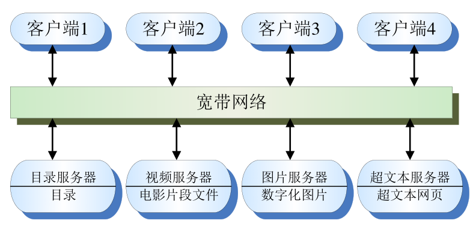</center>

#### 抽象机模型

- **用来建立子系统的接口模型**

- 将系统组织成一系列的层次（或者叫抽象机），每一层提供一组服务

- 支持不同层中的子系统的增量开发。**当一个层的接口改变时，只是相邻层受到影响**。

- 然而，用这种方式构建系统通常比较困难

- 举例：版本管理系统

  <center>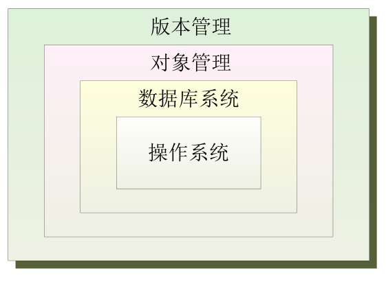</center>

### 控制模型

- 关注子系统间的控制流。不同于系统分解模型

#### 集中式控制

- 一个子系统全面负责控制，负责启动和终止其它子系统。

- 调用—返回模型

  <center>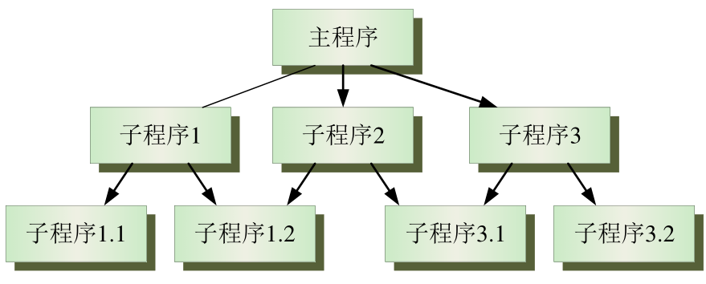</center>

  - 自上而下的子过程模型，控制从子程序层的顶端开始，向下移动。适用于顺序系统。
  - 适用于嵌入式系统，比较简单

- 管理器（者）模型

  - 举例：实时系统控制

    <center>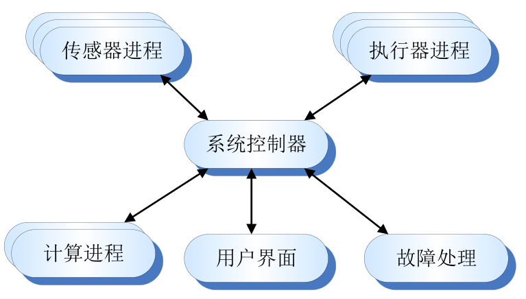</center>

  - 适用于并发系统。 一个系统组件控制其它系统过程的停止、开始和协调。可以在顺序系统中用case语句实现。

#### 基于事件的控制

- 每个子系统都能对来自别的子系统或系统环境的外部事件，作出响应。

- 两个主要的事件驱动模型

  - **广播模型。**一个事件向所有子系统广播，包括任何一个能够处理该事件的子系统

    - 控制策略不嵌入到事件和消息处理器中。由子系统根据事件来决定。

    <center>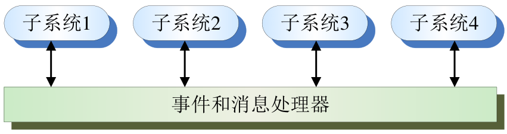</center>

  - **中断驱动模型。**应用于实时系统，中断被中断处理器探测到，再被传递给其它负责处理中断的组件

    <center>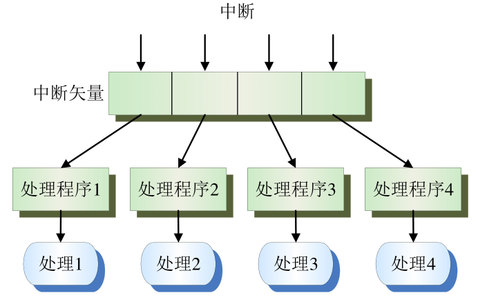</center>

    - 用于实时系统，需要对事件作出快速响应
    - 有已知的中断类型，以及为每个中断类型定义的中断处理
    - 每种类型都关联到一个存储单元，一个硬件开关将中断转到它的处理程序
    - 可以快速响应，但是编程复杂且难于验证

### 模块分解

- 另一个结构层次上，子系统分解成模块

- 两个模块分解模型


#### 对象模型

- 系统分解成互相作用的对象
  - 将系统分解成一组松散的对象，以及良好定义的接口

  - 面向对象分解关系到识别对象类，它们的属性和操作

  - 当实现的时候，对象从这些对象类产生，用一些控制模型协调对象的操作

  - 举例：发票处理系统

  <center>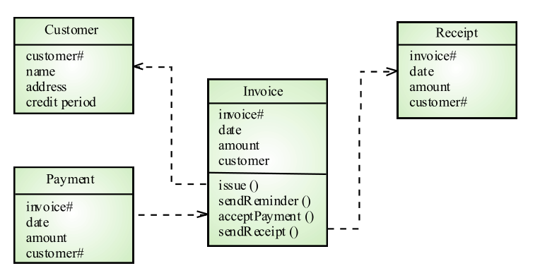</center>

#### 数据流模型

- 系统分解成功能模块，这些功能模块将输入转化为输出。也叫管道模型。

  - 功能转换处理其输入，产生其输出

  - 也称为管道或过滤器模型 (在UNIX命令行环境中)

  - 当转换是顺序的，这个方法就是批处理顺序模型，广泛应用于数据处理系统

  - 对交互式系统不合适

  - 举例：发票处理系统

  - **数据流图，连线是数据**

    <center>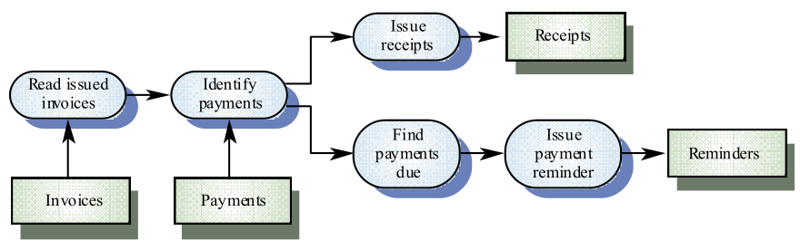</center>

- 如果可能，设计者应避免不太成熟的并发设计。可先做模块分解，关于是否执行并发可以延迟到模块开发时决定。

### 领域相关的体系结构

- 特定于某些应用领域的体系结构模型
- 两种领域相关的模型

#### 类模型

- **从许多真实系统中抽象出来，封装了这些系统的主要特征**

  - 编译器模型是一个众所周知的例子，尽管在其它更加专门的应用领域里还有其它模型

    - 词汇分析器
    - 符号表
    - 语法分析器
    - 语法树
    - 语义分析器
    - 代码生成器

  - 通用编译器模型可根据不同的梯形结构模型进行组织

    <center>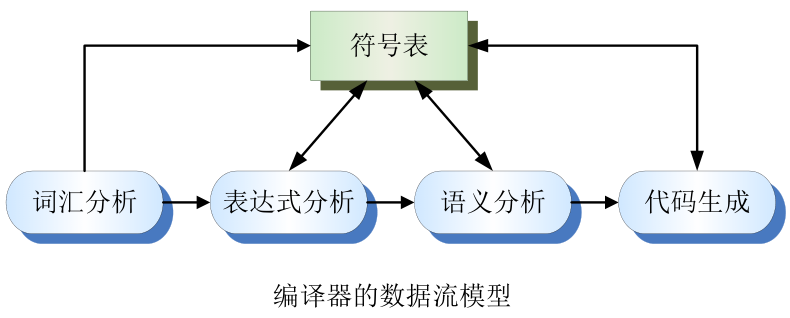</center>

    <center>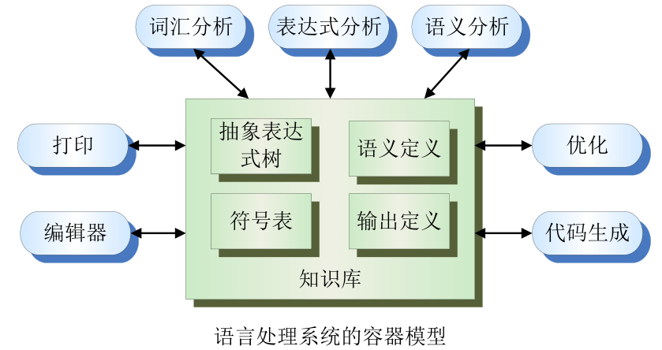</center>


#### 参考模型

- 更加抽象的理想化的模型，提供了关于系统类型的信息以及比较不同体系结构的手段

  - **参考模型源自对应用领域而不是一个存在系统的研究**

  - 用来作为一个系统实现的基础，或者不同系统的比较。它可以作为一个标准，系统可以用它来评估

  - OSI模型是一个通信系统的分层模型

    OSI**参考**模型

    <center>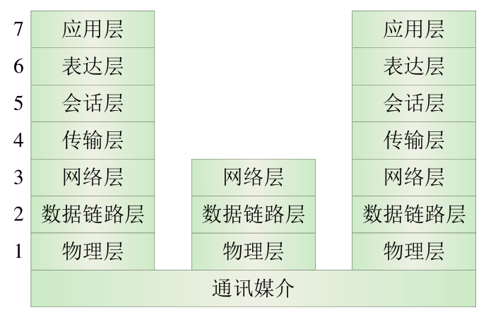</center>

- **类模型通常是从下往上的模型；参考模型是从上往下的模型。**

## 8 面向对象的设计

> 面向对象设计是设计软件的一个重要手段。对象具有自己私有的状态和操作
>
> 对象应该有构造和检查的操作。提供服务给其他对象。
>
> 对象可以是顺序或并发地执行。
>
> 统一建模语言（UML）为定义不同的对象模型提供了不同的符号
>
> 在面向对象设计过程中会产生很多不同的模型，包括静态模型和动态模型
>
> 对象接口应该使用诸如Java的编程语言来精确定义。
>
> 面向对象设计简化了系统进化

### 面向对象设计(OOD)

- 特点
  - 对象是真实世界或系统实体的抽象，对象自己管理自己
  - 对象是独立的，封装了状态和继承信息
  - 系统功能由对象服务来表达
  - 没有共享数据区。对象通信通过消息传递
  - 对象可以是分布式的，可以顺序执行或者并行执行
- 优点
  - **更容易维护。对象可理解为独立的实体**
  - **对象是可重用的组件**
    - MFC：微软基础类(Microsoft Foundation Classes)
  - 对于某些系统，从真实世界到系统对象有着明显的一一对应 

- 面向对象开发
  - 面向对象的分析、设计、编程既是互相联系的，又是互相独立的
  - 面向对象分析：建立应用领域的面向对象模型
  - 面向对象设计：建立面向对象的系统模型，以实现需求
  - 面向对象编程：使用面向对象的编程方法来实现一个面向对象的软件设计。如Java、C++

#### 对象和对象类

- 对象是软件系统中的实体，代表真实世界或系统中的实体

  - 对象

    > 一个对象是由状态和在此状态上的一组操作构成的一个实体。状态由一组对象属性来表示。与对象相关的操作提供给其他对象（客户机）相应的服务，当这些对象在计算过程中需要这些服务的时候，就向该对象请求这些服务。对象是依照对象类定义创建出来的。对象类定义就是用来创造对象的模板。它包括对所有属性和操作的声明。

- 对象类是对象的模板，用来生成对象

  - 实例化

- 对象类可以从其它对象类继承属性和服务

#### 统一建模语言UML

- 雇佣对象类

  <center>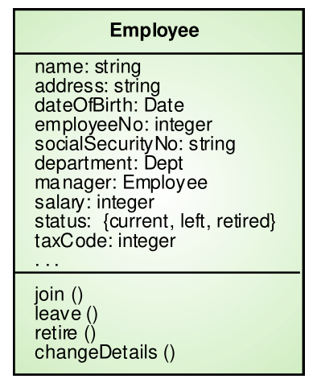</center>

#### 对象通信

- 从概念上说，对象通过消息传递通信
- 消息
  - 调用对象所需的服务的名称
  - 执行服务所需的信息，以及存放服务结果的变量名称
- 从实现上来说，消息通常通过过程调用来实现
  - 名称 = 过程名
  - 信息 = 参数列表

#### 泛化和继承

- 对象类定义了属性和操作
- 类形成一个类层次结构，一个超类（父类）是一个或多个子类的概括
- 一个子类从它的超类（父类）继承属性和操作，也可以增加新的属性和方法
- UML中的泛化，通过面向对象编程中的继承来实现

#### 泛化/继承的层次结构

- **继承：空心三角，指向谁就继承谁**
- 继承的优点
  - 可用来给实体分类的抽象机制
  - 设计和编程层面上的重用机制
  - 继承层级图可作为领域和系统的知识源
- 继承的问题
  - 对象类不是独立的。如果不参考其超类，将无法理解对象类
  - 设计者会倾向于使用分析阶段生成的继承分层结构图。这会导致效率低下。
  - 分析、设计和实现的继承分层结构图具有不同的功能，应该被分别维护
- 关于继承是否是面向对象设计所必需的，有两个观点：
  - 识别出继承分层结构是面向对象设计的基础。明显地这只能用面向对象编程语言来实现。
  - 继承允许属性和操作的重用，是很有用的。但在设计阶段识别继承分层结构会给实现带来不必要的限制。
- 继承引入了复杂性，这是不希望的，特别对于严格的系统
  - 继承2层够用，3层最多

<center>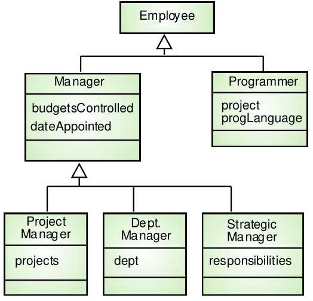</center>

#### 关联模型(UML)

- **对象、对象类与其他对象、对象类之间存在关联**

- 在UML中，通过关联来表示，是**对象之间的连线**

- 可以在连线上附加说明信息

- 关联描述一个对象是另外一个对象的属性或者一个对象方法的实现依赖于相关联的对象。

- **关联模型**

  <center>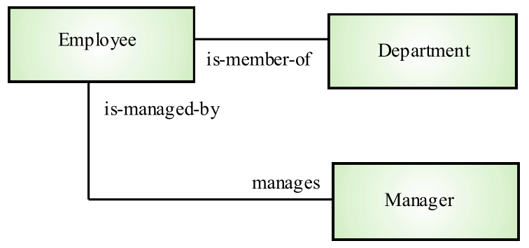</center>

#### 并发对象

- 对象是独立的实体这一本质特征，使得对象适合于并发实现
- 如果对象运行在分布式系统的不同处理机上，对象通信的消息传递模型可以直接实现
- 服务器
  - 对象被实现为一个并行进程（服务器），它的方法对应为定义的对象操作。如果没有对它调用，对象挂起，等待进一步的服务请求
- 主动对象
  - 对象用并行进程实现，对象内部状态的改变由对象的操作完成，而不是直接的外部调用
  - “询答机”主动对象
    - 主动对象通过操作来改变属性，也可以通过内部操作来更新属性
    - 飞机上的询答机对象利用卫星导航系统，周期性的更新飞机的位置信息。

### 面向对象设计过程

- 定义上下文和系统的使用模式

- 设计系统体系结构

- 识别出系统中的主要对象

- 开发设计模型

- 描述对象接口

- 举例：气象制图系统

  - 分层体系结构

    <center>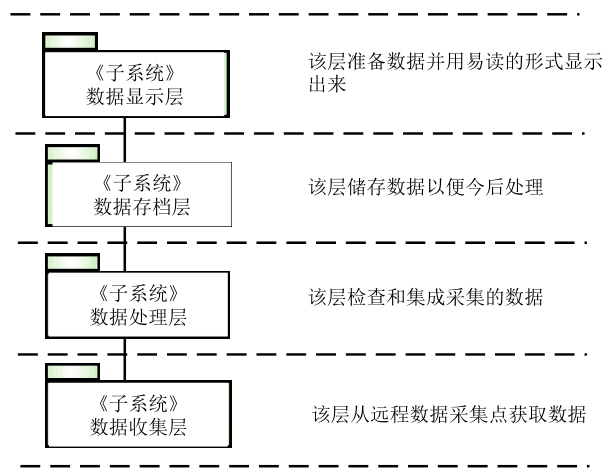</center>

  - 气象制图系统中的子系统

    <center>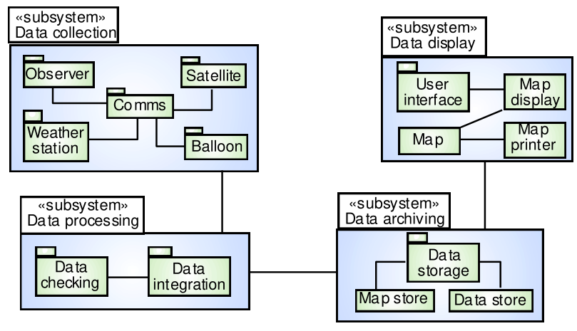</center>

  - 气象站体系结构

    <center>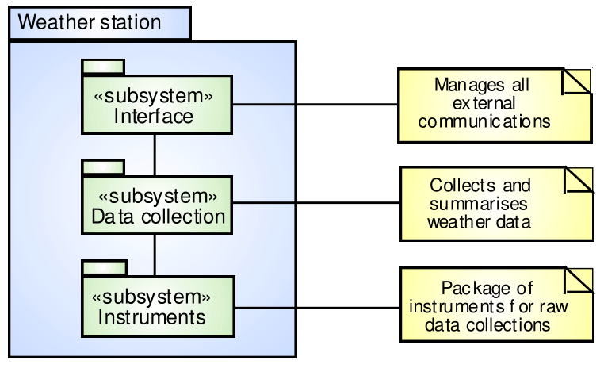</center>

#### 对象识别

- 识别对象（或对象类）是面向对象设计中最困难的部分
- 依赖于系统设计者的技术、经验和领域知识。
- 对象识别是一个反复的过程。第一次不一定能正确。

##### 识别的方法

- 对系统的自然语言描述做文法分析。**对象和属性是名词，操作或服务是动词**。

- **使用应用领域中的真实实体**

- 使用**行为方法，了解系统的全部行为，谁参与了什么行为。**

- 使用**基于情景的分析**。在每个情景中识别出对象，属性和方法。

- 气象站对象类

  <center>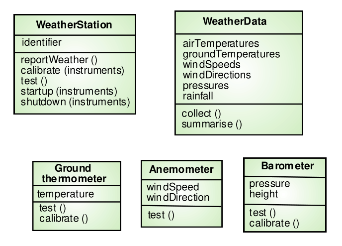</center>

#### 设计模型

- 设计模型说明对象、对象类和对象间的关系

- 静态模型：用对象类和关联来描述系统静态结构

- 动态模型：描述对象间动态交互

- 设计模型的例子

  - 子系统模型：说明对象的逻辑分组，每个分组构成一个子系统

    - 说明设计是如何由逻辑上关联的一组对象构成的。

    - 在UML中，这些用“包”来说明。包是一种封装构造，这是一个逻辑模型，系统中实际的对象组织可以是不同的。

    - 气象站子系统

      <center>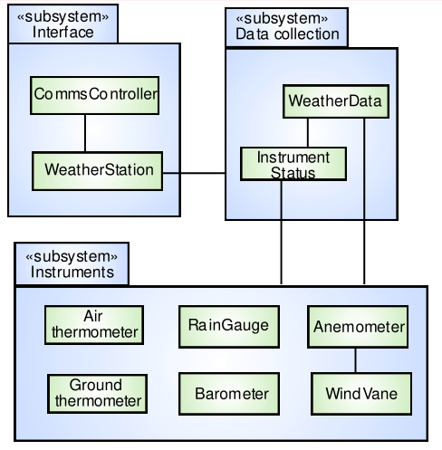</center>

  - **序列模型：说明对象交互的序列**

    - 序列模型说明所发生的对象交互的序列

    - 参与交互的对象水平的排列，每个对象有一条垂直的线条与之连接。

    - 时间以垂直方向表示，时间的进展是沿着垂直的虚线向下

    - 对象之间的交互表示为带有标号的箭头，该箭头是与垂直线段相连的。这些不是数据流，而是表示交互中的基本消息或**事件**。

    - 对象生命线上的细长方形表示这个对象是**系统中控制对象的时间**。一个对象在这个长方形的顶端时刻接管控制，在底部放弃控制。

    - 数据收集序列

      <center>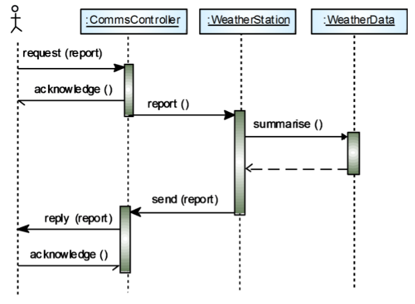</center>

  - **状态机模型**：说明单个对象如何响应事件来改变它们的状态

    - 说明对象是如何对不同的服务请求作出响应，以及这些服务请求出发的状态迁移

      - 如果对象状态是Shutdown，则它只能响应 Startup()

      - 在等待状态中，对象等待进一步的消息。

      - 如果接收到一个reportWeather ()消息，系统就转移到整理数据状态

      - 如果收到一个calibrate ()消息，系统转移到一个校正状态

      - 如果收到一个时钟信号，系统就转移到采集状态

      - 气象台的状态图

        <center>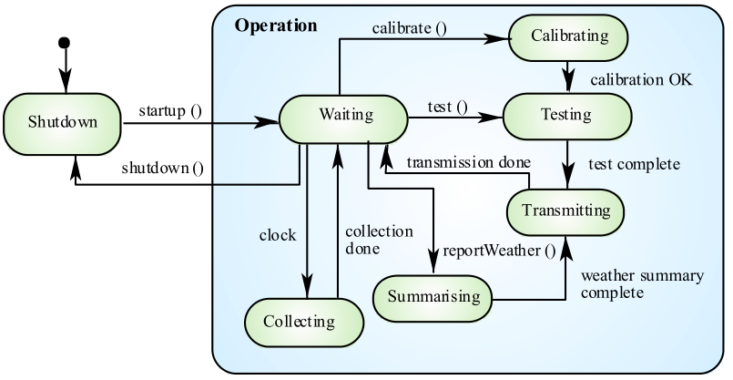</center>

  - 其他模型：用例模型、聚合模型、泛化模型等

#### 对象接口描述

- 必须描述对象接口，以便对象和其他组件能够并行设计

- 设计者应避免设计接口的具体表示，应将其隐藏在对象自身中

- 同一个对象可有多个接口，从不同角度观察的方法可得到不同的接口

- UML用类图来描述接口，也可以直接使用Java

  ```java
  interface WeatherStation {
      public void WeatherStation ();
      public void startup ();
      public void startup (Instrument i);
      public void shutdown ();
      public void shutdown (Instrument i);
      public void reportWeather ();
      public void test ();
      public void test (Instrument i);
      public void calibrate (Instrument i) ;
      public int getID ();
  } //WeatherStation
  ```

### 设计进化

- 隐藏信息到对象中意味着改变对象不会以一种不可预知的方式影响其他对象

- 假设加入污染监控仪到气象站中。监测空气，算出空气中的不同污染物的量。

- 污染数据采集不会对气候数据采集产生任何影响

- 需要的变化

  - 增加一个对象类Air quality作为WeatherStation的一部分

  - 增加一个操作reportAirQuality到类WeatherStation中。变更控制软件以采集污染数据。

  - 增加表示污染监测仪器的对象

    <center>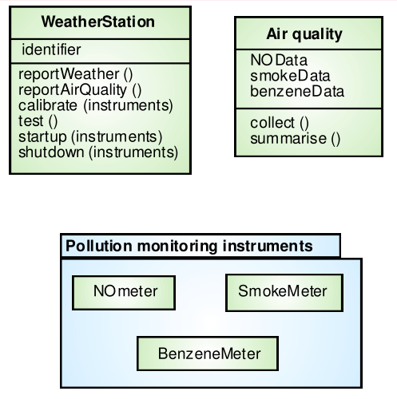</center>

## 9 用户界面设计

之前的可用性：Availability

这里的可用性：Usability

> 面设计应该以用户为中心。界面应该具有逻辑性和一致性，应该帮助用户从错误中恢复。
>
> 交互方式包括：直接操作、菜单系统、表格填写、命令语言和自然语言
>
> 要表示变化趋势和近似值时，应采用图形化显示。要表示精确值时使用数字显示。
>
> 颜色使用应该保守一些，并保持一致
>
> 系统应提供在线帮助，包括提供信息、解决困难。
>
> 错误消息应该是积极的而不是消极的。
>
> 应提供一系列不同类型的用户文档。
>
> 如果可能的话，应对照可用性属性的描述进行界面评价

### 用户界面

- 系统用户经常通过界面来判断系统，而不是功能。
- 设计得不好的界面会导致用户犯下灾难性的错误
- 不好的用户界面是导致许多软件系统不被使用的原因。
- 图形化用户界面GUI
  - 大多数商业系统的用户通过图形化界面和系统交互，虽然有些情况下，传统的基于文本的界面还在使用。
  - 优点
    - 便于学习和使用。
      - 没有经验的用户可以快速的学会使用系统
    - 用户可以快速地从一个任务切换到另一个任务，可以同时跟几个不同的应用程序交互
      - 当窗口切换时，信息仍在各自的窗口中保持可见
    - 可以快速的，全屏幕的交互

#### 用户为中心的设计

本章的目的是介绍用户界面的设计，而不是实现。

以用户为中心的界面设计方法中，用户的需要是最为重要的，用户也参与到设计过程中来。

用户界面设计牵涉到原型界面的开发。

#### 用户界面设计过程

<center>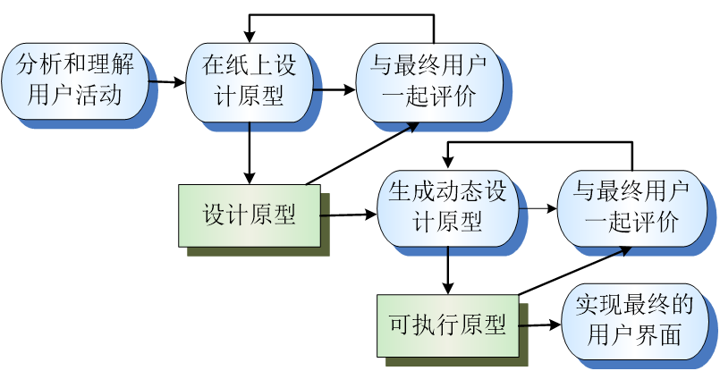</center>

### 用户界面设计原则

- 用户界面设计必须考虑系统使用者的**需要、经验和能力**
- 设计者必须意识到人们身体上和智力上的**限制**（如短时间记忆上的限制），必须意识到人们会**犯错误**。
- 不是所有的用户界面设计原则都适用于所有设计

| **原则**   | **描述**                                                     |
| ---------- | ------------------------------------------------------------ |
| 用户熟悉   | 界面所应用的术语和概念应该是来自于用户的经验，这些用户是将要使用系统最多的人 |
| 一致性     | 界面应该是一致的，即尽可能地让相似的操作有同样的触发方式     |
| 意外最小化 | 永远不要让用户对系统的行为感到吃惊                           |
| 可恢复性   | 界面应该有一种机制来允许用户从错误中恢复                     |
| 用户指南   | 在错误发生时界面应该提供有意义的反馈，并有上下文感知能力的用户帮助功能 |
| 用户差异性 | 界面应该为不同类型用户提供合适的交互功能                     |

### 用户—系统交互

- 在交互系统设计中要考虑两个问题
  - 用户的信息如何提供给计算机系统?
  - 计算机系统的信息如何显示给用户看?
- 用户交互和信息表示可以通过一个连贯的平台集成在一起

#### 交互形式

| **交互类型** | **主要优点**                     | **主要缺点**                                       | **应用实例**                 |
| ------------ | -------------------------------- | -------------------------------------------------- | ---------------------------- |
| 直接操作     | 快速和直观的交互  容易学习       | 较难实现  只适合于任务和对象有视觉隐喻的情况       | 视频游戏  CAD系统            |
| 菜单选择     | 避免用户错误  只需很少的键盘输入 | 对有经验用户操作较慢  当菜单选择很多时会变得很复杂 | 绝大多数一般用途的系统       |
| 表格填写     | 简单的数据入口  容易学习         | 占据很多屏幕空间                                   | 库存控制  个人贷款处理       |
| 命令语言     | 强大灵活                         | 较难学习  差的错误管理                             | 操作系统  图书馆信息检索系统 |
| 自然语言     | 适合偶然用户  容易扩展           | 需要键入的太多  自然语言理解系统不可靠             | 时刻表系统  WWW信息检索系统  |

#### 多重用户界面

<center>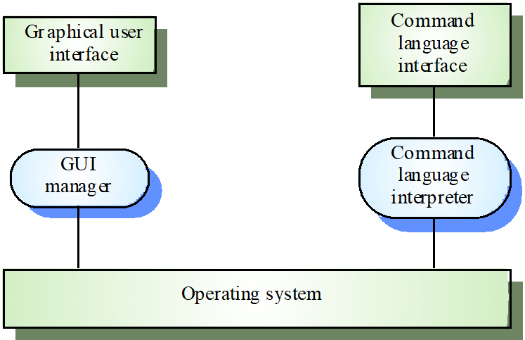</center>

### 信息表示

<center>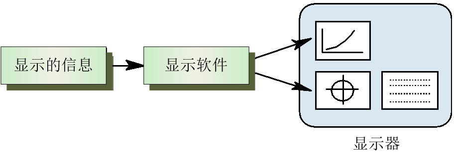</center>

- 将系统的信息显示给系统用户

- 信息可以直接显示 (e.g. 字处理软件中的文本) ，或者可以转换成某种方式来显示 (e.g.图形化的方式)

- **MVC**（Model—View—Controller）方法支持数据的多种表示

  <center>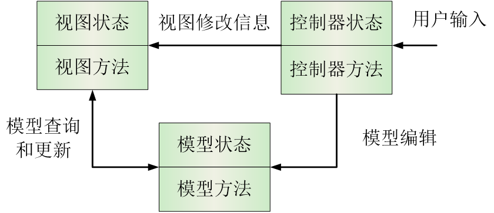</center>

  - 功能实现
  - 视图：计算机告诉我们
  - 我们控制计算机

- 静态信息
  - 一次会话的开始时初始化，在会话过程中不改变。
  - 可以是数字或者文字
- 动态信息
  - 在会话过程中改变，改变的信息传达到系统用户
  - 可以是数字或者文字

#### 信息显示的要点

- 用户对**精确信息或不同数据值之间的关系**感兴趣吗?
- 信息值**变化的速度**如何?数值的变化需要马上显示给用户吗?
- 用户必须响应信息的变化执行某种动作吗?
- 需要使用直接操作界面吗?
- 信息是**文本还是数字**? 信息的**相对值是否重要**?
  - 文本的突出显示

<center>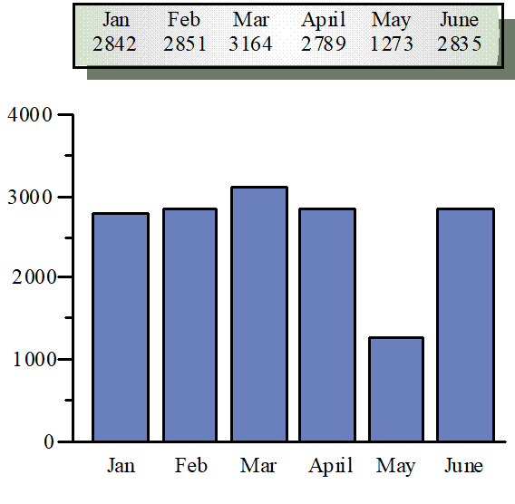</center>

#### 模拟的vs.数字的表示方法

- 数字表示
  - **紧凑 – 需要较少的屏幕空间**
  - **可以传达精确值**
- 模拟表示
  - **“扫一眼”就能得到一个值的印象**
  - **可以表示相对值**
  - **容易显示异常值**

- 动态的信息显示

  <center>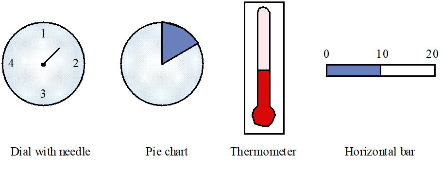</center>

- 显示相对值

  <center>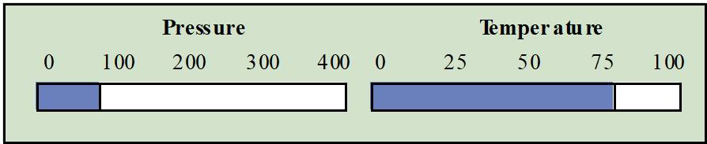</center>

#### 数据的可视化

- 显示大量信息的技术
- 可视化可以揭示出实体和数据趋势间的关系
- 可视化实例:
  - 从多个地点采集的气象信息
  - 电话网络状态表示成一组相互连接的节点
  - 化工厂可视化为一组相互连接的反应罐和管道，显示压力和温度
  - 3维分子模型
  - 一组网页显示为一个扩展树

#### 色彩显示

- 色彩给界面增加了额外的信息，可以帮助用户理解复杂的信息结构
- 可以用来突出显示异常事件
- 界面设计中色彩使用的共同问题:
  - 用颜色传达特定的含义
  - 过度使用颜色

##### 使用色彩的指南

- **不要使用太多的颜色**
- **使用不同颜色代表不同的任务**
- **允许用户控制颜色编码**
- 先用单色设计然后加上颜色
- 颜色编码要注意前后一致
- 避免互相冲突的颜色配对
- 用颜色变化来表示状态变化
- 要注意颜色的显示具有较低的分辨率

### 用户支持

- 用户指南包括：**在线帮助，错误信息，手册等**。
- **用户指南应该和用户界面集成在一起**，这样当用户需要或者用户犯了错误的时候可以帮助用户
- 如果可能的话，**帮助和消息系统**应该集成在一起

#### 帮助和消息系统

<center>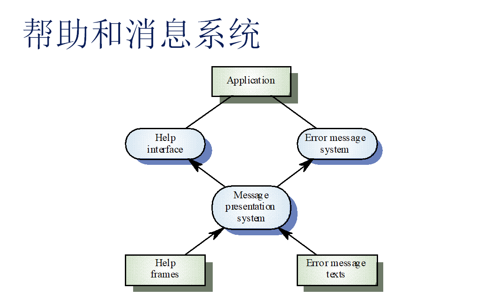</center>

#### 错误消息

- 错误消息的设计非常重要。 不好的错误消息会使得用户拒绝使用系统。
- 消息应该**有礼貌的、简明的、一致的、建设性**的。
- 用户的**背景和经验**是消息设计的决定性因素。

#### 消息措辞的设计因素

| **因素** | **描述**                                                     |
| -------- | ------------------------------------------------------------ |
| 上下文   | 用户指南系统应该能注意到用户当前在干什么，针对当前上下文调整输出消息 |
| 经验     | 因为用户逐渐熟悉了系统，就会对冗长的、过于详细的消息不满。但初学者可能还嫌问题阐述得不够清楚。用户指南系统应该根据不同类型的用户对象选择不同的表达方式和所用的术语。 |
| 技能水平 | 消息应该根据用户的技能进行裁剪。消息应该根据不同类型的用户对象选择不同的表达方式和所用的术语。 |
| 风格     | 消息应该是积极的而不是消极的。应该以主动方式去表示出来而不是被动显示。决不能是无礼的或者是滑稽怪诞的。 |
| 文化     | 消息的设计应该尽可能熟悉所在国的文化传统。一条消息对一个地区是合适的，而在另一个地区可能不可接受。 |

#### 帮助系统设计

- 第一种：“帮帮我，我需要一些信息”
- 第二种：“帮帮我，我有麻烦了”
- 这两种需要都应该在设计帮助系统时考虑到
- 在帮助系统需要不同的功能

#### 帮助信息

- 不能是简单的在线手册
- 屏幕和窗口跟纸张不能完全对应
- 显示器的动态特征可以提高信息表示的能力
- 人们在不习惯在屏幕上大量阅读文本

#### 帮助系统的使用

- 应该提供多个不同的入口，这样用户可以从不同的位置进入帮助系统。
- 应该提示用户当前处于帮助系统的什么位置
- 应该提供功能以使用户可以在帮助系统中导航或者来回移动

#### 用户文档

- 提供在线信息的同时，纸质文档也应该提供

- 文档应该考虑到不同的用户，包括有经验的和没有经验的

- 在手册的同时，应该提供其他易于使用的文档（如快速参照卡片）

- 用户文档类型

  <center>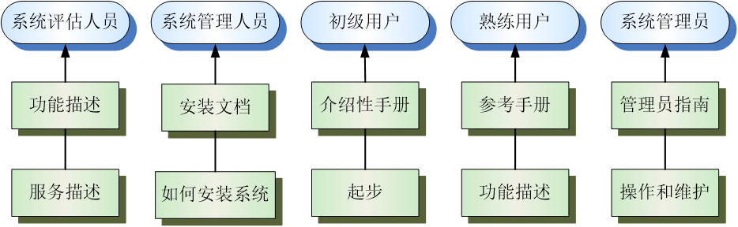</center>

### 用户界面的评价

- 对用户界面进行评价，以评估其是否合适
- 对大多数系统来说，完全的评价是很昂贵的也是不切实际的。
- 理想的是，根据一份可用性描述来进行界面评价。然而，这样的可用性描述一般不具备。

| **属性** | **描述**                                       |
| -------- | ---------------------------------------------- |
| 可学习性 | 一个新用户需要多长时间才能成为一个系统熟练用户 |
| 操作速度 | 系统响应与用户工作情况的匹配程度如何           |
| 鲁棒性   | 系统对用户错误的容忍程度如何                   |
| 可恢复性 | 系统从用户错误中恢复的能力如何                 |
| 适应性   | 系统与单一工作模式结合的紧密程度如何           |

#### 简单的评价技术

- 用户反馈的问卷调查
- 观察在系统使用过程中用户的表现
- 在软件中嵌入代码以收集功能使用和用户错误的相关信息
- 提供在线用户反馈的功能

## 10 检验和有效性验证

> 检验和有效性验证不是一回事。检验的目的是要看软件是否符合其描述，而有效性验证的目的是要看软件是否满足了用户的要求。
>
> 测试计划应该指导测试过程
>
> 静态检验技术包括对程序的检查和分析以发现错误。
>
> 程序检查在发现错误中是非常有效的
>
> 程序代码由一个小组检查，定位软件缺陷
>
> 静态分析工具可以发现程序的不规则之处，这些不规则之处可能预示着代码缺陷
>
> 净室开发过程依赖于增量式开发、静态检验和统计性测试。

### 检验和有效性验证

- 检验
  - “我们是否在正确地建立一个产品"
  - **更在意过程**
- 软件应该符合它的描述

- 有效性验证
  - “我们是否在建立一个正确的产品"
  - **验证最后的结果**
- 软件应该满足用户真正的需要

- 是个全生命周期的过程——检验和有效性验证应该应用到软件过程的每个阶段
- 有两个主要目的
  - **发现系统中的缺陷**
  - **评估系统在实际操作中是否可用**

#### 静态和动态V&V

- 软件**检查**：分析系统的静态表述以发现问题**（静态检验）**
  - 可能增加基于工具的**文档和代码**分析
- 软件**测试**：实际运行和观察软件的行为**（动态检验）**
  - 系统实**用测试数据执行，然后观察其运行的行为**

<center>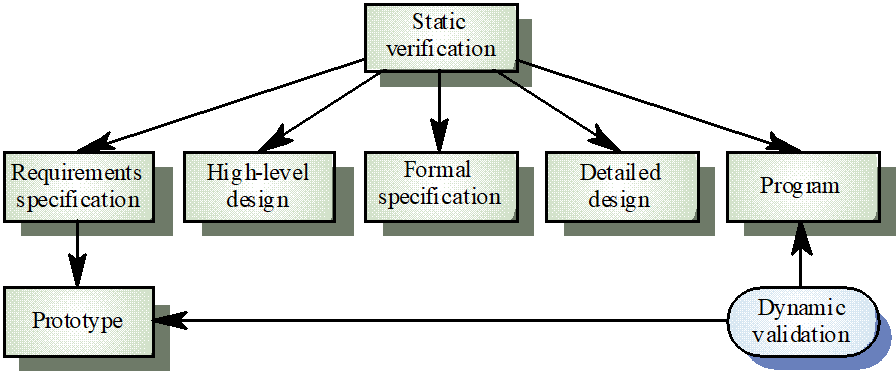</center>

#### 程序测试

- 可以发现错误的存在，不是错误的不存在
  - 每1000行代码，50个测试用例
    - 每1000行代码，5个以下代码过得去，一般控制到1—3个
      - 如果特别低，怀疑测试不充分
- 一次成功的测试能够发现一个或更多的错误
- **对于非功能需求是唯一的验证手段**
- 应该**和静态检验联合使用以提供全面的检验和有效性验证**

#### 测试的类型

- **缺陷测试**
  - 设计测试以发现系统缺陷
  - 成功的测试是发现系统中缺陷的存在
  - 分类
    - 系统性缺陷
      - 只要运行到这里就出错
    - 随机性缺陷（软件不会有）
      - 有可能出现有可能不出现，硬件的接触不良等
- **统计性测试**
  - 设计测试以反映用户输入的频度。用于可靠性估计。

#### V&V目标

- 检验和有效性验证的目标是要确信软件**符合使用目的**
- **这并不意味着程序完全没有缺陷**
- 而是表明系统足以满足使用要求。使用类型决定了所需的信任程度

#### V&V的信任程度

- 依赖于系统的设计目标、用户的期望和市场环境
  - 软件功能
    - 系统需要的信任程度取决于该软件在机构中的重要程度
  - 用户期望
    - 用户对某些软件期望很低
  - 市场环境
    - 在市场上推出产品可能比在程序中找出缺陷更加重要

#### 测试和调试

- 缺陷测试和调试是截然不同的过程
- **检验和有效性验证是一个证明软件系统中存在缺陷的过程**
- **调试是一个对缺陷定位和修改的过程**
- 调试需要先对程序行为作出假设，然后对这些假设进行测试以发现系统错误

#### 调试过程

<center>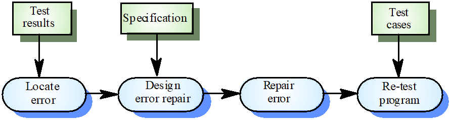</center>

#### V&V规划

- 仔细规划才能从测试和检查过程中收获更多
- 规划应该从开发的较早阶段开始
- 规划应该在静态检验和动态测试之间均衡考虑
- 测试规划是关于测试过程的标准定义，而不是描述产品测试内容

#### 开发的V字形模型

<center>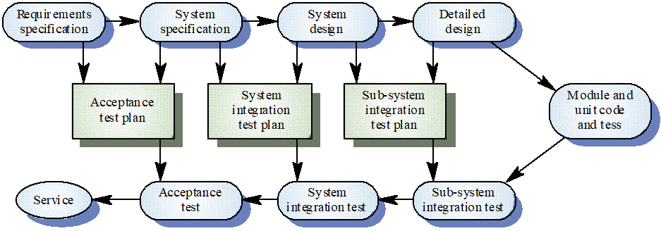</center>

#### 软件测试计划的结构

- 测试过程
- 需求跟踪
- 测试项目
- 测试进度安排
- 测试记录过程
- 硬件和软件需求
- 约束

### 软件检查

- **相关人员检查代码和文档，以发现不规范和缺陷**
- 不要求执行系统，所以可在系统实现前使用
- 可应用于系统的任何表示形式(**需求、设计、测试数据**等)
- 发现错误非常有效的方法
- 一次检查中能发现许多不同的缺陷。在测试中，一个缺陷可能屏蔽其它缺陷，所以需要多次执行
- 由于复用了领域和程序语言知识，所以评审人员可能见过经常出现的错误

#### 检查和测试

- **检查和测试是互相补充的，而不是对立的检验技术**
- **两者都应该在检验和有效性验证过程中使用**
- **软件检查可以检验是否和描述一致，但无法检验是否和用户的真正需求一致**
- **软件检查无法检验非功能特征**，如性能，可用性等

#### 程序检查

- 正式规范的文档评审过程
- 目的是**发现缺陷** (而不是改正缺陷)
- 缺陷可能是逻辑错误，可能预示着错误情况的代码中的不规范(e.g.没有初始化的变量)或者不服从标准

##### 程序检查的预处理

- 对被检查的代码有一个精确的描述
- 检查小组的成员应该熟悉机构的标准
- 有一个最新的语法正确的代码版本
- 要准备一个错误检查的核对清单
- 管理层必须接受检查将带来软件过程早期的费用增加
- 管理层不能将软件检查用于员工评价

#### 检查过程

<center>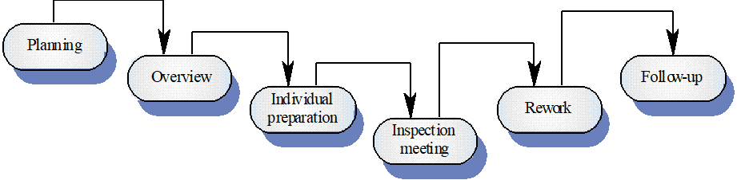</center>

#### 检查的程序

- 检查团体总体观察系统代码
- 代码和相关文档预先分发给检查团队
- 检查并发现错误
- 对发现的错误作出修改
- 可能需要也可能不需要重新检查

#### 检查团队

- 至少由4人组成
- 所要检查的代码的作者
- 检查者，发现错误、多余内容和矛盾的地方
- 讲解者，向团队讲解代码
- 主席/仲裁者，主持会议、记录发现的错误
- 其他角色，如抄写员，首席仲裁者

#### 检查清单

- 常见错误的清单
- 错误清单跟编程语言有关
- **编程语言的类型检查越弱，错误清单越长**
- 举例：初始化，变量命名，循环终止，数组边界等。

#### 程序检查内容

| **缺陷分类**  | **检查内容**                                                 |
| ------------- | ------------------------------------------------------------ |
| 数据缺陷      | 所有的程序变量堵在使用前被初始化了吗  所有的常数都命名了吗  数组的上边界应该等于数组长度还是长度减1  如果使用字符串，定界符应该显式地指定吗  有缓冲区溢出的可能性吗 |
| 控制缺陷      | 对每一个条件语句，条件是正确的吗  每一个循环都能终止吗  复合语句被正确地括起来了吗  对case语句，所有可能的情况都考虑了吗  若每一个case语句都需要跟一个break语句，有遗漏吗 |
| 输入/输出缺陷 | 所有的输入变量都使用了吗  所有的输出变量在输出前都被赋值了吗  有未料到的输入引起系统崩溃吗 |
| 接口缺陷      | 所有的函数和方法调用都使用了正确数量的参数吗  形参和实参类型匹配吗  参数顺序都对吗  如果组件访问共享内存，它们都有相同的共享内存结构模型吗 |
| 存储管理缺陷  | 如果一个链接的结构被修改了，所有的链接都得到重新赋值了吗  如果使用了动态存储，空间分配正确吗  如果空间不再使用，需要显式地对空间释放吗 |
| 异常管理缺陷  | 所有可能的错误状态都已经考虑到了吗                           |

### 自动静态分析

- 静态分析器是源代码文本处理的软件工具
- 分析程序文本以发现潜在的错误情形，提交给V&V团队
- 对帮助检查非常有效。是人工检查的一个补充而不是代替。

| **缺陷分类**  | **检查内容**                                                 |
| ------------- | ------------------------------------------------------------ |
| 数据缺陷      | 变量在初始化之前被使用  变量被定义但从未使用过  变量被赋值两遍，但中间并未使用过  可能的数组越界  未声明的变量 |
| 控制缺陷      | 不可到达的代码  无条件循环                                   |
| 输入/输出缺陷 | 变量在两次输出间没有赋值过                                   |
| 接口缺陷      | 参数类型不匹配  参数个数不匹配  函数的结果没有用处  未调用过的函数和子程序 |
| 存储管理缺陷  | 未赋值的指针  指针参与运算                                   |

#### 静态分析的阶段

- 控制流分析.  检查带有多个出口或入口的循环，发现不可到达的代码等。
- 数据使用分析.  检出未初始化的变量，一个变量赋值两次而中间未使用，变量定义后未使用等。
- 接口分析.  检查过程声明和使用之间的一致性
- 信息流分析.  确定输出变量和输入变量的依赖关系。不是去发现异常本身，而是为代码检查和评审列出信息流的关系。
- 路径分析.  确定程序中的可能路径以及路径中执行的语句。也是为了评审中的潜在使用。

#### 静态分析的使用

- 对于一种弱类型检查的语言特别有价值，如C语言，许多错误无法由编译器检测出来
- 对强类型检查的语言来说性价比不高，如Java，很多错误可以在编译中检测出来

### 净室软件开发

- 名称是从半导体生产过程中的“净室”得来的。其思想是**缺陷避免**，而不是缺陷移除。
- **基于下列要点**的软件开发:
  - **增量开发**
  - **形式化描述**
  - 使用正确性论证进行**静态检验**
  - 用**统计性测试**以决定程序可靠性

#### 净室过程

<center>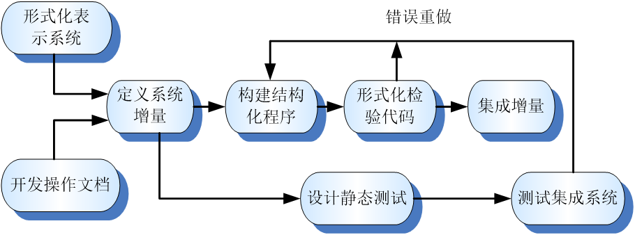</center>

## 11 软件测试

> 对系统常用部分的测试要比对系统不常用的部分测试更重要。
>
> 等价划分是系统等价行为划分的测试用力集合
>
> 黑盒测试是基于系统描述
>
> 结构化测试识别能使所有程序路径都得到执行的测试用例
>
> 测试覆盖度测量确保所有语句都至少执行一次
>
> 接口缺陷的发生是由于描述误读、误解、错误或无效的时间上的假设
>
> 测试对象类，要测试所有的操作、属性和状态
>
> 集成面向对象的系统围绕对象集群

- 缺陷测试
- 统计性测试

### 测试过程

- **组件测试（模块测试、单元测试）**
  - 个别的**程序组件**的测试
  - **通常是组件开发者负责(除了某些苛求系统由独立团队负责)**
  - **测试基于开发者的经验**
- **集成测试**
  - 对一个**系统或子系统**进行测试
  - **独立的测试团队负责**
  - **测试基于系统描述**
- **系统测试（交付测试）**
  - **验证系统功能**

### 缺陷测试

- 缺陷测试的目标是**发现程序中的缺陷**
- 成功的缺陷测试是引起程序异常动作的测试
- 测试可以证明缺陷的存在但不能证明缺陷不存在

#### 测试的优先级

- 只有穷尽的测试才能证明一个程序没有缺陷。但是穷尽的测试是不可能的。
- 相比组件，**测试更应关注系统的功能和性能**
- 相比新的功能，**测试旧的功能更加重要**
- 相比边界值案例，**测试典型值情形更加重要**

#### 测试数据和测试用例

- 测试数据 
  - 设计用来测试系统的输入数据
- 测试用例 
  - **测试系统的输入，以及根据系统描述预期的输出**

#### 缺陷测试过程

<center>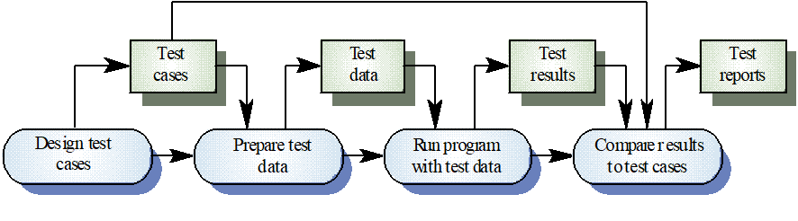</center>

#### 黑盒测试

- 把程序看成是一个“黑盒子”的测试方法
- **程序的测试用例是基于系统描述**
- **测试规划可以在软件过程的早期开始**

<center>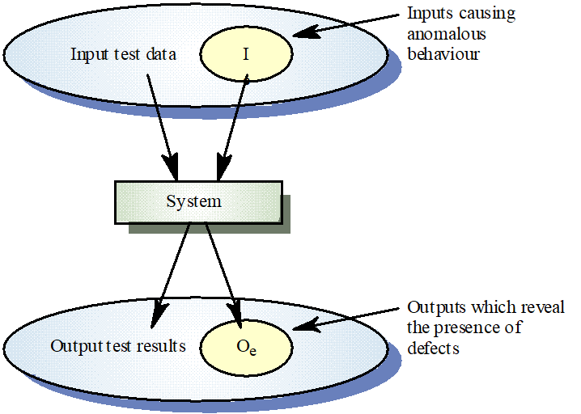</center>

##### 等价划分

- 输入数据和输出结果通常可以分成几个不同的集合
  - 一元二次方程 a=0，a!=0 Δ>0，Δ<0，Δ=0
- 每个集合都是一个等价划分，对集合中的每个成员程序的行为都是等价的
- 测试用例应该从每个等价划分中选取
  - **典型值（一般是中间）和边界值**
  - 姓名不超过4汉字
    - 正常值：2汉字
    - 边界值：4、5汉字
  - 年龄
    - 非法典型值：<0
    - 边界值：—1、0、1
    - 正常值：20
    - 不合理：10

<center>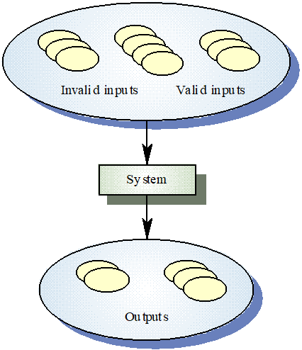</center>

- 将系统输入和输出划分成几个“等价集合”
  - 如果输入是10,000～99,999的5位数整数，那么等价划分就是 <10,000，10,000 — 99,999，>99,999
  - 在这些集合的边界处选择测试用例

<center>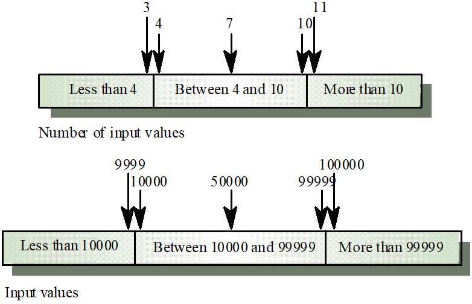</center>

#### 结构化测试（白盒测试）

- **测试用例来自程序结构**。程序的知识用来识别附加的测试用例。
  - 根据程序结构找分界点
- **目标是让所有的程序语句执行一遍** (不是所有路径的组合) 
  - 覆盖率
    - 语句覆盖率
    - 条件覆盖率
      - x>0 || x/y>0
      - 后者有可能不会测试到
    - 分支覆盖率

##### 白盒测试

- **可靠性需求非常高时使用**

- **只限于组件测试，集成测试阶段无法做白盒测试**

  <center>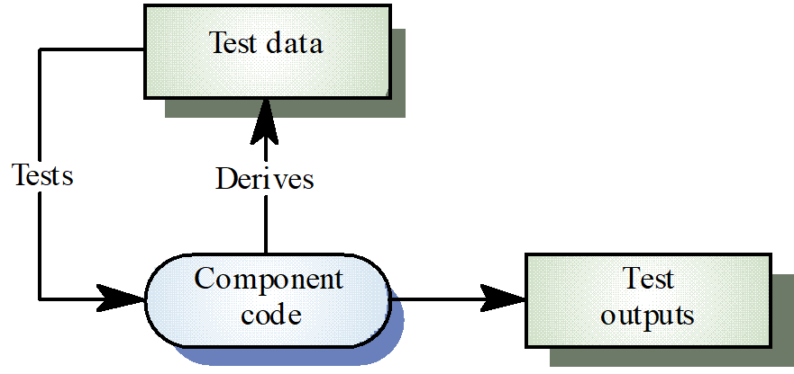</center>

- 举例：二叉搜索 – 等价划分

  - 前置条件满足，被搜索元素在数组中

  - 前置条件满足，被搜索元素不在数组中

  - 前置条件不满足，被搜索元素在数组中

  - 前置条件不满足，被搜索元素不在数组中

  - 输入数组只有单个数值

  - 输入数组有偶数个数值

  - 输入数组有奇数个数值

    <center></center>

##### 路径测试

- **路径测试的目标是保证程序的每条路径都至少执行一次**
- 路径测试首先需要一个程序流图，节点表示程序无分支的序列，边代表控制流
  - 程序流图
    - 描述程序的控制流。每个分支表示为独立的路径，循环用一个返回到条件节点的箭头表示
    - 是计算环路复杂性的基础
    - 环路复杂性 = 边数 – 节点数 +2
  - 环路复杂性
    - 测试所有语句的最少测试用例数等于环路复杂性
    - 环路复杂性等于程序中的条件数
    - 应谨慎使用。并不意味着测试是足够的。
    - **虽然所有的路径都执行到，但不是所有的路径的组合都执行到**
      - 测试用例必须使这些路径都能执行到
      - 一个动态的程序分析器可以用来检查路径是否被执行到
- 条件语句是程序流图中的节点

### 集成测试

- **测试组件集成完成的系统或子系统**

- **集成测试应该是黑盒测试，测试用例是基于系统描述**

- 主要困难是**定位错误**

- **增量式集成测试**可以减轻这个问题

  - T：测试用例

  <center>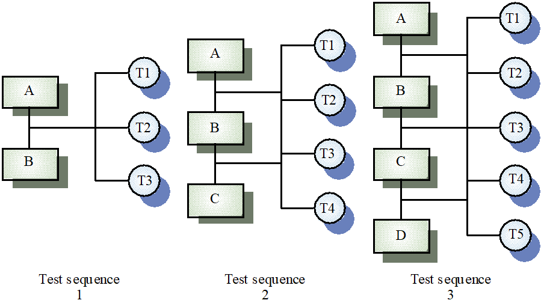</center>

#### 集成测试的方法

- **自顶向下测试**
  
  - 从高层系统开始，从上至下集成组件，需要程序“桩”
    - 顶层模块是调用别人的
  - 自然，符合初学者
- **自底向上测试**
  
  - 一层层集成组件，直到产生整个系统
  
- 实践中，大多数系统集成是这**两种方式的结合**

- 集成测试需要

  - **桩**

    <center>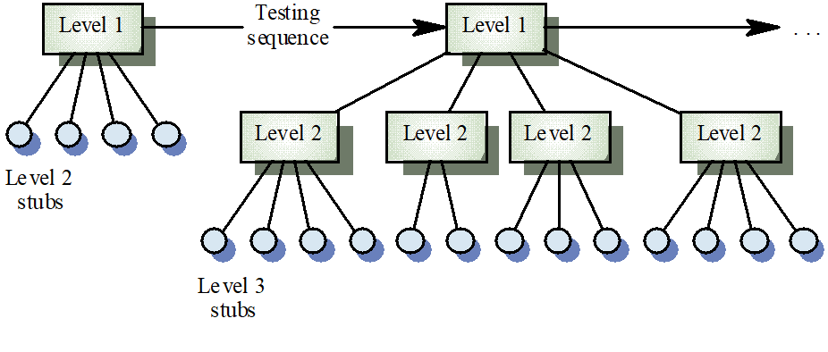</center>

    - 桩程序（Stub），也称桩模块，用以模拟被测模块工作过程中所调用的下层模块。桩模块由被测模块调用，它们一般只进行很少的数据处理。

  - **驱动**

    <center>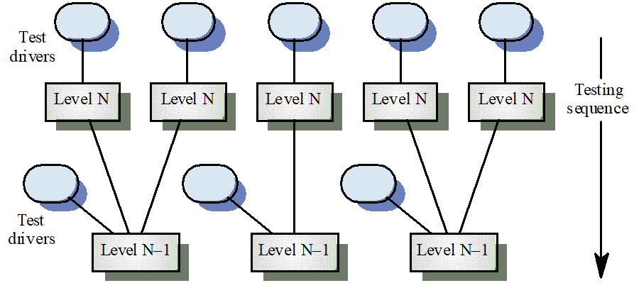</center>

    - 驱动程序（Driver）也称作驱动模块，用以**模拟被测模块的上级模块**，能够调用被测模块。在测试过程中，驱动模块接收测试数据，调用被测模块并把相关的数据传送给被测模块。

#### 测试方法比较

- 体系结构的有效性
  - **自顶向下的测试容易发现体系结构中的错误**
- 系统演示
  - **自顶向下集成测试允许在开发早期阶段有一个有限功能的演示系统**
- 测试的执行
  - 自底向上的**集成测试通常较容易**
- 测试的观察
  - **两者都有问题。需要额外的代码来观察测试结果。**

#### 接口测试

- 当**模块或子系统集成生成更大的系统时，就要做接口测试**
- 目标是检测那些由于**接口错误或无效的接口假设**造成的系统缺陷
- 对面向对象开发特别重要，因为对象是由接口定义的。
- 接口类型
  - 参数接口
    - 数据从一个过程传递到另一个
  - 共享内存接口
    - 过程之间共享的内存块
  - 过程接口
    - 子系统封装了一组过程，可以被其它子系统调用
  - 消息传递接口
    - 子系统从其它子系统请求服务
- 接口错误
  - 接口误用
    - 组件调用另外组件时接口使用出错，例如：参数顺序错误
  - 接口误解
    - 对被调用组件的行为进行了错误的假设，没有预期的行为
  - 时机错误
    - 调用者和被调用者的速度不同，访问过期的数据
- 接口测试的一般准则
  - 检查代码并明确列出对外部组件的调用。参数选择紧靠取值范围的边缘。
  - 当有指针从接口传递时，一定要用空指针参数来测试接口
  - 在过程接口系统中，设计一些容易引起组件失败的测试
  - 在消息传递系统中使用强度测试
  - 在共享内存系统中，设计一种测试，使组件激活的次序改变

#### 强度测试

- 运行系统超过它的最大设计负荷。超负荷运行通常能暴露系统的缺陷
- 强度测试能测试系统的失败行为。系统失败不应是灾难性的，不应引起不可接受的服务或数据丢失
- 强度测试对分布式系统特别有用，网络超负荷的情况下会引起严重的系统性能下降。

### 面向对象测试

- **被测试的组件是实例化为对象的对象类**
- 比单独的功能模块粒度要大，所以**白盒测试方法需要扩展到更大的粒度**
- **对自顶向下集成和测试来说没有明显的“顶层”**
- 测试的层次
  - 测试与对象关联的单个操作
  - 测试单个对象类
    - **对象类测试**
      - 完全的覆盖测试应该包括：
        - **对象中所有操作被单独隔离测试**
        - **对象所有属性的设置和访问的测试**
        - **对象的所有可能状态的测试**
      - 对象继承使得测试更加困难，因为要测试的信息不在一个地方
  - 测试对象集群
  - 测试面向对象系统

#### 对象集成

- 在面向对象系统中集成的层次不明显
- **集群测试是一组协同操作的对象的集成和测试**
- 要根据对象操作和系统的特征来识别对象集群
- 集群测试的方法
  - 用例或基于**场景**的测试
    - 测试是基于用户和系统的交互
    - 优点是按照用户的体验来测试系统的特征
  - 线程测试
    - 测试系统对于事件的响应
  - 对象交互测试
    - 测试对象交互的序列，这个序列是由对象服务调用串起来的

### 测试工作平台

- 测试是一个费用昂贵的过程阶段。测试工作平台提供了一系列工具，可以减少需要的时间以及总的测试费用
- 大多数测试工作平台是开放系统，因为测试需求是随机构不同
- 难于跟封闭的设计和分析工作平台集成在一起

## 12 软件成本估算

> 影响生产率的因素包括个人能力、领域经验、开发过程、项目规模、工具支持和工作环境。
>
> 应使用多种软件成本估算技术，如果结果相差较大，则说明估算信息不充分。
>
> 软件通常是先有合同金额，然后再据此调整相应的功能。
>
> 算法成本估算是困难的，因为需要估计将要完成产品的特征。
>
> COCOMO模型预测成本时，要考虑项目、产品、人员和硬件的因素。
>
> 算法成本模型支持量化的选项分析。
>
> 完成一个项目所需要的时间和参加项目的人数不成比例。

### 估算的基本问题

- 完成一项活动需要多少工作量?
  - 人月
- 完成一项活动需要多少时间?
  - 月
  - **非线性，人与人之间的交流带来大量开销**
- 一项活动的总成本是多少?
- **项目估算和进度安排是交叉进行的管理活动**
  - 估算是不准的，真正准的时候是交付的时候

#### 软件成本构成

- 硬件和软件成本
- 差旅费和培训费用
- 工作成本 (大多数项目中是**主要成本**)
  - 项目中投入的工程师的工资
    - 人月数
  - 社会和保险费用
- 工作成本还要计入
  - 办公场所、供热和照明费用
  - 网络和通信费用
  - 共用设施的费用 (e.g 图书馆,员工餐厅，etc.)

#### 成本和报价

- 估算是为了得到承包商开发一个软件的成本
- 在成本和报价之间没有一个简单的关系
- 价格＝成本＋利润
- 广泛的因素包括机构的、经济的和商务上的考虑会影响报价

#### 影响软件报价的因素

| **因素**           | **描述**                                                     |
| ------------------ | ------------------------------------------------------------ |
| 市场机遇           | 开发机构为了便于进入一个新的软件市场，可能会提出一个低报价。 |
| 成本估算的不确定性 | 如果机构对成本估算没有把握，它会提高报价，在正常利润之上增加某些意外费用。 |
| 合同条款           | 客户可能愿意让开发者保有程序源代码的所有权，以便可以在未来的开发项目中复用。这时的要价就会比移交源代码的情况低得多。 |
| 需求易变性         | 如果需求很有可能发生变化，机构就会降低报价以赢得合同，当得到合同之后，一旦需求有所变更，机构就会乘机抬高报价。 |
| 经济状况           | 当开发者处于资金短缺阶段时，为得到合同而作出较低报价，少获点利甚至收支相抵总比破产强。 |

### 生产率

#### 程序员的生产率

- 总工程代码行/每个人月生产代码行 = 人月
- 软件开发工程师生产软件和相关文档的效率的度量
- **不是面向质量的**，虽然质量保证是生产率评估的一个因素
- 本质上，我们是想度量单位时间里生产的有用功能

##### 生产率的度量

- **面向规模的度量**
  - 这种方法是根据活动输出的量来衡量。可能是提交的源代码行数，目标**代码说明书的长度或者系统文档的页数**等。
- **面向功能的度量**
  - 这种方法是看移交软件总的功能有多少。**功能点和对象点**方法是最常用的方法。

#### 度量的问题

- 估算软件规模
- 估算总的程序员人月数
- 估算分包商生产率 ，并且合并到总的估算中

##### 代码行

- 什么是一个代码行?
  - 当程序打印在卡片上时代开始就使用的度量方法，一行一张卡片
  - 代码行如何跟语句对应起来，一个语句可能占几行，一行也可能有几个语句。
- 什么程序应该算作系统的一部分?
- 假设在系统大小和源代码大小之间有着线性关系
- 经验
  - 一般Java一个人月2000~3000行代码，高手写的飞快5000、6000行
  - 如果算上写文档时间，<2000行也是可以的
  - Python代码行数下降了，2000~3000行代码
  - 嵌入式控制C/C++，1000~1500行代码

#### 生产率比较的问题

- **编程语言越低级，计算出来的生产率越高**
  - 同样的功能，低级语言需要更多代码
  - 开发时间更长
- **程序员的代码越冗长，计算出来的生产率越高**
  - 生产率计算是基于程序员所写的代码量的

#### 功能点

> 一个画面大概一周、3~5天

- 基于程序特性的组合
  - 外部输入输出
  - 用户交互
  - 外部接口
  - 系统使用的文件
- 每一项都有一个复杂性权值（3～15）
- **功能点计数就是将每项功能点数乘以权值，然后求和的结果**
- **功能点计数由项目复杂性修正**
- **根据给定语言的每功能点平均代码行数，功能点计数可以用来计算代码行数**
  - LOC = AVC * FPs 
  - AVC 是基于语言的因子，汇编语言200—300， 4GL则2—40
- **功能点计数是非常主观的，依赖于估算者**。
  - 自动功能点计数是不可能的。

#### 对象点

- 当使用高级语言（特别是4GL）开发时，作为另一个功能相关方法，对象点方法可以代替功能点方法
- 对象点不同于对象类
- **程序的对象点是下列内容的加权估算**：
  - **独立的显示屏幕数**
  - **生成的报表数**
  - 为辅助4GL代码而**必须开发的3GL模块数**
- 对象点估算
  - 对象点估算比功能点容易，因为它只关心**屏幕数、报告数和3GL模块数**
  - **可以在开发过程的很早期使用**，这时要估计系统的代码行还很困难

#### 影响生产率的因素

| **因素**     | **描述**                                                     |
| ------------ | ------------------------------------------------------------ |
| 应用领域经验 | 应用领域知识是有效的软件开发的根本。已经对领域有充分了解的工程人员很可能是生产率最高的。 |
| 过程质量     | 所用的开发过程对生产率有极大的影响。                         |
| 项目规模     | 项目规模越大，团队之间的交流和沟通就越花时间，真正有用的时间就会减少，因而，个人生产率就会降低。 |
| 技术支持     | 好的支持技术和CASE工具、配置管理系统等有助于提高生产率。     |
| 工作环境     | 一个好的工作环境有助于提高生产率。                           |

#### 质量和生产率

- 所有基于单位时间内产量的做法都有问题，因为没有考虑质量
- 以质量为代价，通常都能提高生产率
- 还不清楚生产率和质量之间的关系
- 变更不断的情况下，使用代码行生产率计算是没有意义的。

### 估算技术

- 没有一个简单的方法可以精确估算软件开发所需的资源
  - 初始估算是基于用户需求定义中不充分的信息
  - 软件可能是运行于不熟悉的计算机系统或者使用新的技术
  - 项目中的开发人员不了解
- 项目成本估算可能是自己设定的
  - 用来确定项目预算和调整软件产品以保证预算不被突破

#### 算法成本建模

- **所建立的模型利用有关历史信息来估计需要的工作量**，用到的历史信息是有关某些软件度量（例如规模）与项目成本之间的关系

#### 专家判定

- **多位软件开发和应用领域方面的专家用他们的经验预测软件成本**。反复进行直到达成一致。
- 卡片法
  - 先给出自己报价，翻出卡片来
    - 让最高和最低的人阐述理由
    - 重新写卡片，几轮过后，差距比较接近了，再平均
- 优点:  相对廉价的估算方法。如果专家具有相似系统的直接经验的话，可以比较精确。
- 缺点:  如果没有专家的话，将非常不精确。

#### 类比估计

- **将项目和一个同样应用领域里的类似项目作比较，从而计算出成本**
  - CMMI软件成熟度模型
- 优点: 如果项目数据具备的话比较精确
- 缺点: 如果没有可比的项目，则不可能应用。需要系统性维护的成本数据库

#### Parkinson定律

- **工作占满所有可用的时间。成本决定于所有可用的资源而不是客观的估算。**
- 优点: 不会超支
- 缺点: 系统经常完不成

#### 根据客户预算报价

- **将客户对项目的预算作为软件的成本**
  - 当客户本身就是专家
- 优点: 得到了合同
- 缺点: 成本无法精确反映工作所需

#### 自上而下和自下而上的估算

- **以上的方法都可以是自上而下或自下而上的**
- 自上而下
  - **从系统层面开始，评估系统的总体功能以及如何通过子系统间的交互完成的**。
  - **无需系统体系结构以及组件的知识**就可应用
  - 成本考虑**集成、配置管理和文档**等
  - 可能会**低估解决低层技术难题的成本**
- 自下而上
  - 从**组件层面开始，估算每个组件所需的工作量。将这些工作量加在一起得到最后的估算**。
  - 当**体系结构和组件识别已知的情况下使用**
  - **如果系统已经得到详细设计时是比较精确的方法**
  - 可能会**低估系统级活动的成本，如集成和文档**等

#### 估算方法

- 每个方法都有优缺点
- 估算应该基于多种方法
- 如果得到的结果相差甚远，意味着信息不够充分
- 为了得到更精确的估算，需要额外采取行动
- 有时候根据客户预算报价是唯一可用的方法。

#### 基于经验的估算

- 从根本上说估算是基于经验的
- 然而，一些新的方法和技术导致基于不精确的经验的估算
  - 面向对象开发而非面向功能的开发
  - 客户机/服务器系统而非基于主机的系统
  - 使用现成的软件组件
  - 基于组件的可复用的软件工程
  - 使用CASE工具和程序生成器

### 算法成本建模

- 通过对项目规模、程序员数量以及其他过程和产品因素的估算，**用一个数学公式来估算项目的成本**。
  - 工作量 = A  × Size^B^ × M
  - A 是反映机构情况的常数因子，B 反映了大型项目工作量的非线性因子，M 是一个乘数因子，反映了不同过程、产品及开发特征的混合因素。
- 最常用的产品特性是代码规模
- 大多数模型都是相似的，只是A，B和M的值不同

#### 估算的精度

- **只有系统完成后才能精确知道软件的规模**

  - 估算的不确定性

    <center>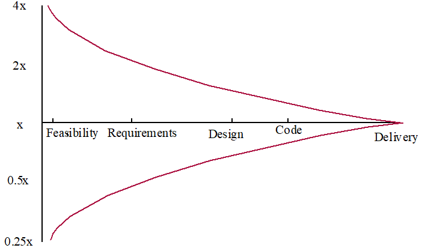</center>

- 一些因素影响最后的规模

  - 使用现货产品和组件
  - 编程语言
  - 系统的分布

- 随着开发过程的进展，代码规模的估算变得更加精确

#### COCOMO模型

- **是一个基于项目经验的经验模型**

- 是一个独立的模型，不限于特定的软件开发商
- **COCOMO 2 是一个3层模型**，随着开发进展允许有日益具体的估算
- **早期原型层**
  - 规模估算是基于**对象点**的，使用一个简单的规模/生产率计算公式估算所需工作量
- **早期设计层**
  - 估算基于**功能点**，然后把这些功能点转换成源代码行数
- **后体系结构层**
  - 估算**基于源代码行数**

##### 早期原型层

- **支持原型开发项目和大量复用的项目**
- 基于开发者每月**对象点**生产率的标准估算
- 考虑了CASE工具的使用
- 估算公式：
  - PM = ( NOP × (1 — %reuse/100 ) ) / PROD
  - PM 是每人月工作量，NOP 对象点数， PROD是生产率，％reuse是所期望的复用率

<center>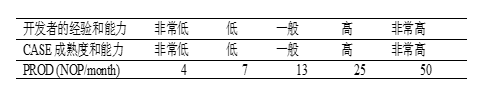</center>

##### 早期设计层

- **需求确定后就可以做早期设计层的估算**
- 基于算法模型的标准公式
  - PM = A × SizeB × M + PMm 其中
  - M = PERS×RCPX×RUSE×PDIF×PREX×FCIL×SCED
    - 乘法因子
    - 乘法因子反映了开发者的能力、非功能需求、对开发平台的熟悉程度等。
      - RCPX – 产品的可靠性和复杂性
      - RUSE – 要求的复用性
      - PDIF – 平台的难度
      - PREX – 个人经验
      - PERS – 个人能力
      - SCED – 要求的进度
        - 交付时间缩短，总工作量会增加
          - 人越多，互相之间的沟通组织带来的工作量越多
      - FCIL – 团队支撑设施
    - PM~m~ 反映了自动生产代码的总量
  - PMm = (ASLOC ×(AT/100)) / ATPROD
  - A = 2.5，Size用KLOC表示，B根据项目的新颖程度、开发灵活性、风险管理方法和过程成熟度的不同从1.1～1.24不等

#### 后体系结构层

- 使用和早期设计层同样的公式
- 对代码行数的估算要考虑以下修正因素
  - 需求的易变性。对需求变更的返工工作量进行估算。
  - 可能的复用程度。复用是非线性的，其相应的成本不能通过简单的减少单位时间内的LOC
  - ESLOC = ASLOC×(AA + SU +0.4DM + 0.3CM +0.3IM)/100
    - ESLOC是新的代码行数。ASLOC是必须修改的复用代码行数。DM是设计修改的百分比。CM是代码修改的百分比。IM是集成复用软件所需的最初费用的百分比。 
    - SU 是一个反映理解软件难易的因子，AA反映为确定软件是否可复用所做的初始评估费用。
- 指数因子
  - 依赖于5个比例因子。它们的和除以100再加上1.01就是该指数项的取值了
  - 举例
    - 先例的援引 – 新项目 — 取值为“低”（4）
    - 开发的灵活性– 没有客户介入– 取值为“非常高”（1）
      - 有客户介入，需求理解比较好
    - 体系结构/风险解决 – 没有风险分析 –“非常低”（5）
    - 团队凝聚力 – 新团队 – “一般”（3）
    - 过程成熟度 – 有一些过程控制 – “一般”（3）
  - 所以比例因子是 1.17 （掌握思想，数字不同）
- 乘数因子
  - 产品属性
    - 关于所要开发的软件产品的要求特性
  - 计算机属性
    - 硬件平台的约束
  - 人员属性
    - 考虑开发人员的经验和能力
  - 项目属性
    - 关于软件开发项目的特征

#### 项目计划

- 算法成本模型为项目计划提供了基础，因为不同的算法成本模型提供了可供比较的不同的策略，以减少项目成本
- 举例：嵌入式太空船控制系统
  - 必须可靠
  - 必须最小化重量 (芯片的数量)
  - 可靠性和计算机约束的乘法因子 > 1
- 成本构成
  - 目标硬件
  - 开发平台
  - 所需工作量

<center>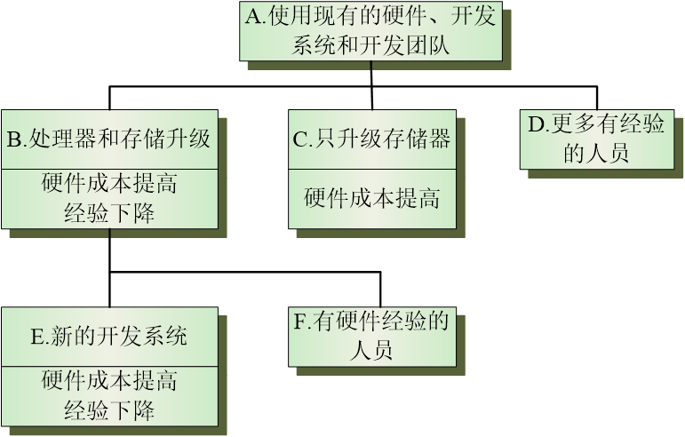</center>

<center>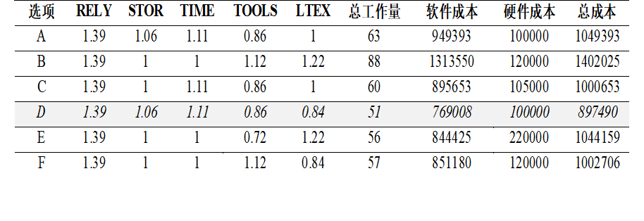</center>

- 选项D(使用更多有经验的人员)似乎是最好的选择
  - 然而，它有个高风险因数，因为有经验的人员难以找到
- 选项C(只升级存储器)节省成本较少但是风险很低
- 总之，这个模型显示了软件开发中人员经验的重要性。

### 项目工期和人员配备

- **在估算工作量的同时，管理者必须估计一个项目的开发周期，以及人员要在什么时候到位**
- 项目所需的日历时间可以用COCOMO 2公式计算
- 所需时间不依赖于项目中的工作人员数

#### 人员要求

- **要求的人员不能单纯用所需工作量除以开发时间来计算**。
- 项目不同时期，投入的工作人员数量是变化的
- **项目中的人员越多，往往要求的总工作量越大**
- **草率的配置人员往往导致项目进度的拖延**

